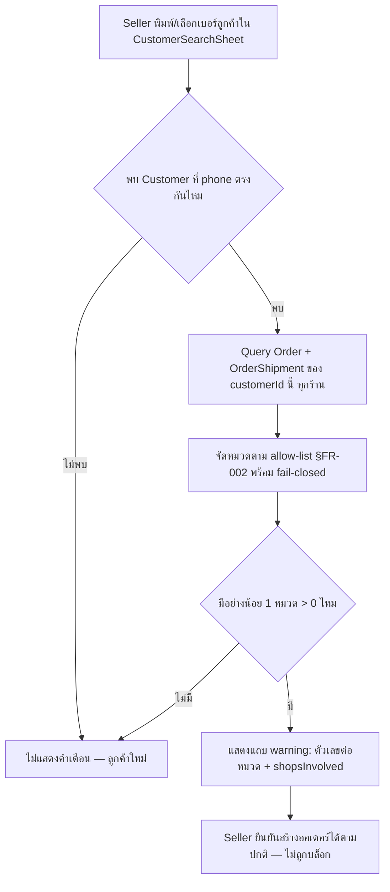
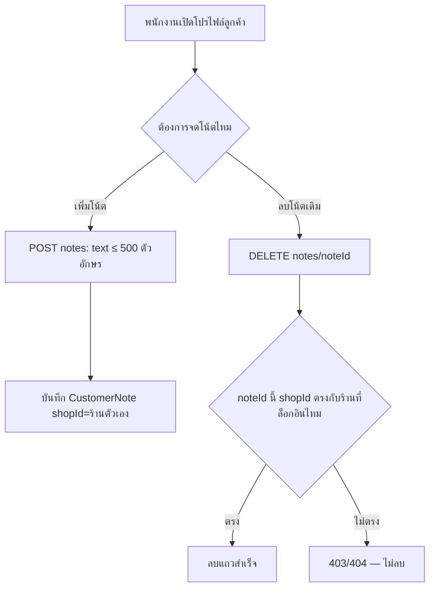

> **โมดูล:** M32-CustomerShippingRisk
> **ประเภทเอกสาร:** Business Requirements Document (BRD) - NON-TECHNICAL
> **เวอร์ชัน:** 1.0
> **วันที่จัดทำ:** 2026-08-05
> **สถานะ:** Draft
> **เจ้าของเอกสาร:** BA

# BRD: ความเสี่ยงการจัดส่งของลูกค้า (Customer Shipping Risk) (Business Requirements Document)

---

## 1. บทนำ

### 1.1 วัตถุประสงค์ของเอกสาร

เอกสารนี้มีวัตถุประสงค์เพื่อ:
1. อธิบายความต้องการหลักของระบบสถิติความเสี่ยงการจัดส่งของลูกค้า (derive สดจาก `Order`/`OrderShipment`) และระบบโน้ตของร้าน (`CustomerNote`)
2. กำหนดขอบเขตการทำงาน — สัญญาณที่นับเป็นความเสี่ยง, ขอบเขตการแชร์ข้ามร้าน, จุดแสดงผล
3. อธิบายเงื่อนไขการใช้งานและกฎทางธุรกิจว่าด้วยการกันข้อมูลรั่วข้ามร้าน (ทั้งสถิติแบบมีรายละเอียดและโน้ต)
4. สร้างความเข้าใจร่วมกันระหว่างทีมธุรกิจและทีมพัฒนาก่อนเข้าสู่ขั้น SRS/SDS/DATABASE/API/Tests (Hard Rule 11 — ห้าม implement ก่อนมี PRD+BRD ผ่าน review)

### 1.2 ขอบเขตของระบบ

**ความเสี่ยงการจัดส่งของลูกค้า** คือระบบที่คำนวณสถิติปัญหาการจัดส่ง/ยกเลิกของลูกค้าแบบสดจากข้อมูลที่มีอยู่แล้วในระบบ (ไม่มีตาราง counter ใหม่) แชร์ข้ามร้านทั้งแพลตฟอร์มในระดับตัวเลขรวมเท่านั้น พร้อมระบบโน้ตที่ร้านจดเองซึ่งเห็นเฉพาะร้านตัวเอง แล้วนำทั้งสองไปแสดงเป็นคำเตือน (ไม่บล็อก) ที่จุดตัดสินใจของ seller

**เข้าสู่ระบบ (Input):**
- คำค้นหา/การเปิดดูลูกค้า (จากหน้าสร้างออเดอร์, หน้า `/customers`, ห้องแชท)
- ข้อมูลที่มีอยู่แล้ว: `Order.customerId`/`status`/`cancelInitiator`, `OrderShipment.carrierStatus`
- ข้อความโน้ตที่ร้านพิมพ์เอง

**ออกจากระบบ (Output):**
- ตัวเลขสถิติความเสี่ยง 4 หมวด + จำนวนร้านที่มา + จำนวนออเดอร์ทั้งหมด (คำนวณสด ไม่มีการเขียนลงตารางใหม่)
- แถว `CustomerNote` ใหม่/ถูกลบ (insert/delete)
- คำเตือนที่แสดงใน 3 จุดของหน้าจอฝั่งร้าน

**ระบบที่เกี่ยวข้อง:**
- Customer Directory (feature 00014) — `Customer` entity กลาง
- Simple OMS (FR-6 ใน `docs/PRD.md`) — `Order.customerId`/`status`/`cancelInitiator`
- iShip Shipping Integration (feature 00022) — `OrderShipment.carrierStatus`
- Order creation flow (`orders/new`) — `CustomerSearchSheet`/`CustomerSelectBlock`
- Facebook/Instagram Chat Integration (feature 00018 ecosystem) — `CustomerPanel`

### 1.3 กลุ่มผู้ใช้งาน

| กลุ่มผู้ใช้ | บทบาท | สิทธิ์การใช้งาน |
|-----------|--------|----------------|
| **เจ้าของร้าน** | `ShopMember.role=OWNER` | เห็นสถิติ (aggregate) ของลูกค้าที่ค้นหา/เปิดดู + เห็น/สร้าง/ลบโน้ตของร้านตัวเอง |
| **พนักงานที่ถูกเชิญ** | `ShopMember.role=ADMIN` | เห็น/ใช้งานเท่ากับเจ้าของร้านทุกประการในเฟสนี้ (ไม่มี toggle จำกัดสิทธิ์) |
| **ลูกค้า** | ไม่มีสิทธิ์เห็นสถิติหรือโน้ตนี้ | ไม่มีช่องทาง report/appeal ในเฟสนี้ |
| **ร้านอื่น (ไม่ใช่เจ้าของโน้ต)** | เห็นได้เฉพาะสถิติ aggregate ของลูกค้าที่ตัวเองก็ query ได้ | ไม่เห็นโน้ตของร้านอื่น ไม่เห็นรายละเอียดที่ระบุตัวร้านอื่น |

---

## 2. ความต้องการหลัก (Functional Requirements)

### 2.1 การคำนวณสถิติความเสี่ยงแบบสด (Derive-only)

#### FR-001: คำนวณสถิติความเสี่ยงของลูกค้าแบบสดจาก Order + OrderShipment

**User Story:**
> ในฐานะเจ้าของร้าน ฉันต้องการเห็นสถิติปัญหาการจัดส่งของลูกค้าที่คำนวณจากข้อมูลจริงล่าสุดเสมอ เพื่อไม่ต้องกังวลว่าตัวเลขจะเพี้ยนจากข้อมูลต้นทาง

**Acceptance Criteria:**
- [ ] เรียกดูสถิติของลูกค้าคนเดียวกัน 2 ครั้งติดกันโดยไม่มีข้อมูลเปลี่ยน ต้องได้ตัวเลขเหมือนกันทุกครั้ง (deterministic)
- [ ] เมื่อมี `OrderShipment` ใบใหม่ของลูกค้ารายนั้นเปลี่ยน `carrierStatus` เป็นค่าที่อยู่ใน allow-list ความเสี่ยง (§FR-002) การเรียกดูครั้งถัดไปต้องสะท้อนตัวเลขใหม่ทันที โดยไม่ต้องรอ batch job ใด ๆ
- [ ] ไม่มีตารางใหม่ที่เก็บ "ผลลัพธ์สำเร็จรูป" ของสถิตินี้ (ตรวจสอบด้วย schema review — ต้องเป็นแค่ query จาก `Order`/`OrderShipment` เท่านั้น)

**Business Flow:**
1. Seller ค้นหา/เปิดดูลูกค้าที่จุดใดจุดหนึ่งใน 3 จุดแสดงผล
2. ระบบ query `Order` ที่ `customerId` ตรงกับลูกค้ารายนั้น (ทุกร้าน) พร้อม `OrderShipment` ที่ยัง active ของแต่ละใบ
3. จัดหมวดตาม allow-list (FR-002) แล้วนับ พร้อมตัวหาร `totalOrders` และนับจำนวนร้านไม่ซ้ำ (`shopsInvolved`)

#### FR-002: จัดหมวดสัญญาณความเสี่ยงตาม allow-list พร้อม fail-closed ต่อค่าที่ไม่รู้จัก

**User Story:**
> ในฐานะทีมพัฒนา ฉันต้องการให้ระบบไม่นับสถานะขนส่งใหม่ที่ยังไม่รู้จักเป็นความเสี่ยง เพื่อไม่ให้สถิติผิดพลาดแบบเงียบ ๆ เมื่อ iShip เพิ่มสถานะใหม่

**Acceptance Criteria:**
- [ ] `carrierStatus ∈ {return, return_success}` → นับเข้าหมวด "พัสดุตีกลับ"
- [ ] `carrierStatus = issue` → นับเข้าหมวด "พัสดุมีปัญหา"
- [ ] `carrierStatus = cod_refund` → นับเข้าหมวด "ปฏิเสธ/ขอคืนเงิน COD"
- [ ] `carrierStatus` ที่เป็นค่าสมมติที่ไม่เคยประกาศไว้ในระบบ (เช่นค่าทดสอบ `"future_new_status"`) → ไม่ถูกนับเข้าหมวดใดเลย และไม่ทำให้ query ล้มเหลว (unit test ป้อนค่าปลอมยืนยัน)
- [ ] `carrierStatus = null` → ไม่ถูกนับเข้าหมวดใดเลย

#### FR-003: แยกปัญหาฝั่งร้านออกจากความเสี่ยงลูกค้า

**User Story:**
> ในฐานะเจ้าของร้าน ฉันไม่ต้องการให้ลูกค้าถูกมองว่ามีความเสี่ยงจากปัญหาที่จริง ๆ เกิดจากร้านเอง (เช่น ร้านไม่พร้อมให้ขนส่งเข้ารับพัสดุ)

**Acceptance Criteria:**
- [ ] `carrierStatus ∈ {cannot_pickup, is_expired}` → ไม่ถูกนับเข้าหมวดความเสี่ยงใดเลย (ไม่ปรากฏในผลลัพธ์รวม)
- [ ] Order ที่มีเฉพาะพัสดุที่เป็น `cannot_pickup`/`is_expired` เพียงอย่างเดียว (ไม่มีสัญญาณอื่น) → ลูกค้ารายนั้นแสดงผลเหมือน "ไม่มีประวัติ" (BR-CSR-11)

#### FR-004: นับผู้ซื้อยกเลิกออเดอร์เป็นสัญญาณความเสี่ยงแยกหมวด

**User Story:**
> ในฐานะเจ้าของร้าน ฉันต้องการรู้ว่าลูกค้าเบอร์นี้เคยยกเลิกออเดอร์ที่ตัวเองสั่งเองบ่อยแค่ไหน แยกจากปัญหาด้านการจัดส่ง

**Acceptance Criteria:**
- [ ] `Order.status = 'CANCELLED'` และ `Order.cancelInitiator = 'buyer'` → นับเข้าหมวด "ผู้ซื้อยกเลิกออเดอร์" 1 ครั้งต่อ 1 order
- [ ] `Order.status = 'CANCELLED'` แต่ `cancelInitiator = 'seller'` → **ไม่นับ** เข้าหมวดนี้ (ร้านยกเลิกเอง ไม่ใช่ความเสี่ยงของลูกค้า)
- [ ] `cancelInitiator = null` (ข้อมูลเก่าก่อนมีการบันทึก field นี้) → ไม่นับเข้าหมวดนี้ (fail-closed ต่อข้อมูลที่ไม่สมบูรณ์)

### 2.2 API สถิติความเสี่ยงข้ามร้าน (Aggregate-only)

#### FR-005: คืนตัวเลขรวมข้ามร้าน โดยไม่รั่วรายละเอียดร้านอื่น

**User Story:**
> ในฐานะเจ้าของร้าน ฉันต้องการเห็นภาพรวมความเสี่ยงของลูกค้าจากทั้งแพลตฟอร์ม โดยไม่เห็น (และไม่ต้องการเห็น) ว่าร้านไหนเป็นคนบันทึกข้อมูลนั้นไว้

**Acceptance Criteria:**
- [ ] response ของ endpoint สถิติ มีเฉพาะ field ตัวเลขรวม (`returned`, `problem`, `codRefund`, `buyerCancelled`, `totalOrders`, `shopsInvolved`) — ไม่มี field ที่เป็นชื่อร้าน/id ร้าน/เลขออเดอร์/วันที่ของออเดอร์ร้านอื่น
- [ ] สุ่มตรวจด้วยบัญชี 2 ร้านที่ต่างกัน ดูสถิติของลูกค้าคนเดียวกัน — ต้องได้ตัวเลข aggregate เหมือนกันทุกประการ (ตัวเลขไม่ขึ้นกับว่าใครดู)
- [ ] `shopsInvolved` นับจำนวนร้านไม่ซ้ำที่มีอย่างน้อย 1 สัญญาณความเสี่ยงของลูกค้ารายนี้ — ไม่ใช่จำนวนออเดอร์ทั้งหมด

#### FR-006: จำกัดสิทธิ์เข้าถึง endpoint เฉพาะสมาชิกร้าน

**User Story:**
> ในฐานะทีมพัฒนา ฉันต้องการให้เฉพาะผู้ที่ล็อกอินเป็นสมาชิกร้านเท่านั้นที่เรียก endpoint นี้ได้ เพื่อไม่ให้ข้อมูลลูกค้ารั่วไปยังบุคคลภายนอก

**Acceptance Criteria:**
- [ ] ผู้ใช้ที่ไม่ได้ล็อกอินหรือไม่มี active shop เรียก endpoint นี้ต้องได้ 401/403
- [ ] endpoint ต้องเรียกใช้ได้จากสมาชิกร้านทุกประเภท (ONLINE_SALES/SERVICE_QUEUE/LODGING) ไม่ถูกจำกัดด้วย vertical (สอดคล้อง PRD §9.2)

### 2.3 โน้ตของร้าน (CustomerNote)

#### FR-007: สร้างโน้ตผูกกับลูกค้า ขอบเขตร้านตัวเอง

**User Story:**
> ในฐานะพนักงานร้าน ฉันต้องการจดบันทึกสั้น ๆ เกี่ยวกับลูกค้าไว้ให้ทีมของร้านตัวเองเห็น เพื่อเตือนกันเองในการซื้อขายครั้งถัดไป

**Acceptance Criteria:**
- [ ] `POST /api/seller/customers/[id]/notes` สร้างแถว `CustomerNote(customerId, shopId=ร้านที่ล็อกอิน, text, createdByUserId=session.user.id)`
- [ ] ข้อความยาวเกิน 500 ตัวอักษร → 400 พร้อมข้อความอธิบาย ไม่สร้างแถว
- [ ] ข้อความว่างเปล่า/มีแต่ whitespace → 400 ไม่สร้างแถว

#### FR-008: ลบโน้ต — ไม่มีการแก้ไข

**User Story:**
> ในฐานะพนักงานร้าน ฉันต้องการลบโน้ตที่ไม่เกี่ยวข้องแล้วออก และจดใหม่แทนการแก้ไข เพราะโน้ตสั้นและลบแล้วจดใหม่ง่ายกว่า

**Acceptance Criteria:**
- [ ] `DELETE /api/seller/customers/[id]/notes/[noteId]` ลบแถวที่ `shopId` ตรงกับร้านของผู้เรียกเท่านั้น
- [ ] ไม่มี endpoint หรือ UI สำหรับแก้ไขเนื้อความโน้ตที่มีอยู่แล้ว (ตรวจสอบด้วย API surface review)

#### FR-009: กันร้านอื่นเข้าถึงโน้ตของร้านอื่น

**User Story:**
> ในฐานะเจ้าของร้าน ฉันไม่ต้องการให้ร้านอื่นเห็นหรือลบโน้ตที่ทีมของฉันจดไว้ ไม่ว่าจะรู้ `noteId` หรือไม่

**Acceptance Criteria:**
- [ ] ร้าน B พยายาม `DELETE` โน้ตที่ร้าน A จดไว้ (รู้ `noteId` ตรง ๆ) ต้องได้ 403/404 — ไม่ลบ
- [ ] `GET` สถิติของลูกค้ารายเดียวกันจากร้าน B ต้องไม่มีโน้ตของร้าน A ปรากฏใน response เลย (เห็นได้แค่โน้ตของร้าน B เอง หรือไม่มีเลยถ้าร้าน B ไม่เคยจด)

### 2.4 การแสดงผล — จุดค้นหาลูกค้าตอนสร้างออเดอร์

#### FR-010: แถบเตือนใต้ลูกค้าที่เลือกใน `CustomerSearchSheet`/`CustomerSelectBlock`

**User Story:**
> ในฐานะพนักงานร้าน ฉันต้องการเห็นคำเตือนทันทีที่เลือกลูกค้าตอนเปิดบิล เพื่อตัดสินใจเงื่อนไขการขาย (เช่น เปลี่ยนจาก COD เป็นโอนก่อน) ก่อนกดยืนยันออเดอร์

**Acceptance Criteria:**
- [ ] เมื่อเลือก/ยืนยันเบอร์ลูกค้าใน `CustomerSearchSheet` หรือ `CustomerSelectBlock` แล้วเบอร์นั้นมี `Customer` ที่มีสัญญาณความเสี่ยงอย่างน้อย 1 หมวด → แสดงแถบ warning ใต้ลูกค้าที่เลือก ระบุจำนวนต่อหมวด + จำนวนร้านที่มา
- [ ] เบอร์ที่พิมพ์ยังไม่ตรงกับ `Customer` ใด ๆ ในระบบ (ลูกค้าใหม่ทั้งแพลตฟอร์ม) → ไม่แสดงแถบเตือนใด ๆ
- [ ] แถบเตือนไม่ปิดกั้นการกดยืนยัน/บันทึกออเดอร์ (ปุ่มยังกดได้ปกติ)

### 2.5 การแสดงผล — หน้า `/customers`

#### FR-011: Badge จำนวนในแถวตาราง `/customers`

**User Story:**
> ในฐานะเจ้าของร้าน ฉันต้องการเห็นภาพรวมว่าลูกค้ารายไหนในทะเบียนมีประวัติความเสี่ยง โดยไม่ต้องเปิดดูทีละคน

**Acceptance Criteria:**
- [ ] แถวลูกค้าที่มีสัญญาณความเสี่ยงอย่างน้อย 1 หมวด → แสดง badge (จำนวนรวมทุกหมวด หรือหมวดที่เด่นที่สุด — รายละเอียดการนำเสนอให้ SRS/UX ตัดสิน)
- [ ] แถวลูกค้าที่ไม่มีประวัติเลย → ไม่มี badge ปรากฏในแถวนั้น (ไม่ใช่ badge ว่าง/badge "0")

#### FR-012: การ์ด "ความเสี่ยงการจัดส่ง" + กล่องโน้ตของร้าน ในโปรไฟล์ลูกค้า

**User Story:**
> ในฐานะพนักงานร้าน ฉันต้องการเปิดดูรายละเอียดความเสี่ยงและโน้ตของร้านตัวเองเมื่อคลิกเข้าไปดูลูกค้ารายหนึ่ง เพื่อตัดสินใจก่อนติดต่อ/ขายซ้ำ

**Acceptance Criteria:**
- [ ] เปิดโปรไฟล์ลูกค้าที่มีสัญญาณความเสี่ยง → เห็นการ์ด "ความเสี่ยงการจัดส่ง" แสดงตัวเลขต่อหมวด + `shopsInvolved` + `totalOrders`
- [ ] เปิดโปรไฟล์ลูกค้าที่ไม่มีสัญญาณความเสี่ยงเลย → การ์ดนี้ไม่ปรากฏเลย
- [ ] กล่องโน้ตของร้านแสดงรายการโน้ตของร้านตัวเอง พร้อมปุ่มเพิ่ม/ลบ — ไม่มีปุ่มแก้ไข

### 2.6 การแสดงผล — แผงลูกค้าในห้องแชท

#### FR-013: แถวสรุปย่อ 1 บรรทัดใน `CustomerPanel`

**User Story:**
> ในฐานะพนักงานร้าน ฉันต้องการเห็นสรุปความเสี่ยงแบบย่อขณะกำลังคุยกับลูกค้าในแชท โดยไม่ต้องสลับไปหน้าอื่น

**Acceptance Criteria:**
- [ ] `CustomerPanel` ของลูกค้าที่มีสัญญาณความเสี่ยง → แสดงแถวสรุป 1 บรรทัดใต้หัวลูกค้า (เช่น รูปแบบข้อความเดียวกับที่ใช้ใน FR-010)
- [ ] `CustomerPanel` ของลูกค้าที่ไม่มีประวัติ (หรือแชทยังไม่เคยเชื่อมกับ `Customer` ที่มีเบอร์) → ไม่แสดงแถวนี้เลย

### 2.7 กติกาการแสดงผลร่วมของทั้ง 3 จุด

#### FR-014: ไม่มีประวัติ = ไม่แสดงอะไรเลย (No-history-no-card)

**User Story:**
> ในฐานะพนักงานร้าน ฉันไม่ต้องการเห็นการ์ด/แถบว่างเปล่าที่บอกว่า "ความเสี่ยง 0" เพราะทำให้หน้าจอรกโดยไม่มีประโยชน์

**Acceptance Criteria:**
- [ ] ทั้ง 3 จุดแสดงผล (FR-010, FR-011/012, FR-013) ต้องไม่ render ส่วนแสดงผลใด ๆ เมื่อลูกค้าไม่มีสัญญาณความเสี่ยงเลยสักหมวด — ตรวจด้วย DOM/flight payload inspection ไม่ใช่แค่ดูด้วยตา (ไม่มี element ว่างเปล่าซ่อนอยู่)

#### FR-015: ไม่บล็อกการขาย ไม่มี risk score/เกรดสี ที่จุดใดเลย

**User Story:**
> ในฐานะเจ้าของร้าน ฉันต้องการเป็นคนตัดสินใจสุดท้ายเสมอ ไม่ใช่ให้ระบบตัดสินแทนด้วยคะแนน/สี

**Acceptance Criteria:**
- [ ] ทดสอบสร้างออเดอร์ให้ลูกค้าที่มีสัญญาณความเสี่ยงครบทั้ง 4 หมวด → ปุ่มยืนยัน/บันทึกออเดอร์ยังกดสำเร็จได้ปกติ ไม่มี error/บล็อกใด ๆ จากฟีเจอร์นี้
- [ ] ไม่มี field ใดใน response ของ endpoint สถิติที่เป็นคะแนนสรุป (เช่น `riskScore`, `grade`, `level`) — มีเฉพาะตัวเลขดิบต่อหมวด
- [ ] สีที่ใช้แสดงคำเตือนทั้ง 3 จุด เป็นโทน warning/amber ของธีม ไม่ใช่โทน danger/แดง

---

## 3. Acceptance Criteria สรุป

### 3.1 การคำนวณสถิติ

**เมื่อระบบทำงานถูกต้อง:**
- ✅ ตัวเลขทุกหมวดตรงกับข้อมูลจริงใน `Order`/`OrderShipment` เสมอ (ไม่มีตารางสำเนาให้เพี้ยน)
- ✅ `cannot_pickup`/`is_expired` ไม่ปรากฏเป็นความเสี่ยงลูกค้าเลย
- ✅ `carrierStatus` ที่ไม่รู้จักไม่ทำให้ query ล้มและไม่ถูกนับผิดหมวด

### 3.2 การแชร์ข้ามร้าน

**เมื่อร้าน A และร้าน B ดูสถิติของลูกค้าคนเดียวกัน:**
- ✅ เห็นตัวเลขรวมเหมือนกัน (`returned`/`problem`/`codRefund`/`buyerCancelled`/`totalOrders`/`shopsInvolved`)
- ✅ ไม่มีทางเห็นชื่อ/id/รายละเอียดออเดอร์ของอีกร้านหนึ่งเลย
- ✅ เห็นเฉพาะโน้ตของร้านตัวเอง — ร้านที่ไม่เคยจดไม่เห็นโน้ตเลย

### 3.3 การแสดงผลและ UX

**เมื่อลูกค้ามีสัญญาณความเสี่ยง:**
- ✅ ทั้ง 3 จุดแสดงคำเตือนโทน warning พร้อมตัวเลขดิบ ไม่มี risk score/เกรด
- ✅ การสร้างออเดอร์/การพิมพ์ข้อความในแชทยังทำได้ปกติ ไม่ถูกบล็อก

**เมื่อลูกค้าไม่มีสัญญาณความเสี่ยงเลย:**
- ✅ ไม่มี badge/การ์ด/แถบเตือนปรากฏในทั้ง 3 จุด (ไม่แสดง "0")

---

## 4. Business Flows (กระบวนการทำงาน)

### 4.1 Flow หลัก: คำนวณและแสดงคำเตือนตอนเลือกลูกค้าสร้างออเดอร์

### 4.2 Flow ย่อย: สร้าง/ลบโน้ตของร้าน

---

## 5. Use Case Scenarios (สถานการณ์การใช้งานจริง)

### Scenario 1: Best Case — seller เห็นคำเตือนแล้วเปลี่ยนเงื่อนไขการขาย

**ผู้เกี่ยวข้อง:** พนักงานร้าน (ShopMember role=ADMIN)

**เงื่อนไขเริ่มต้น:**
- ลูกค้าเบอร์ `08X-XXX-XXXX` เคยสั่งซื้อกับร้านอื่น 3 ร้าน มีพัสดุตีกลับ 2 ใบ และปฏิเสธ COD 1 ใบ

**ขั้นตอน:**
1. พนักงานเปิด `/orders/new` พิมพ์เบอร์นี้ค้นหาใน `CustomerSearchSheet`
2. ระบบพบ `Customer` ที่ตรงกัน → คำนวณสถิติสด
3. แสดงแถบ warning: "เบอร์นี้มีประวัติ: ตีกลับ 2 · ปฏิเสธ COD 1 — จาก 3 ร้านบน Deep"
4. พนักงานเปลี่ยนวิธีชำระเงินจาก COD เป็นโอนก่อนส่ง แล้วกดยืนยันสร้างออเดอร์ตามปกติ

**ผลลัพธ์:**
- ออเดอร์ถูกสร้างสำเร็จ (ไม่ถูกบล็อก) ด้วยเงื่อนไขที่พนักงานเลือกเอง

### Scenario 2: ลูกค้าไม่มีประวัติเลย — ไม่แสดงอะไร

**ผู้เกี่ยวข้อง:** พนักงานร้าน

**เงื่อนไขเริ่มต้น:**
- เบอร์ที่พิมพ์ไม่เคยปรากฏใน `Order`/`Customer` ของร้านใดในระบบเลย (ลูกค้าใหม่ทั้งแพลตฟอร์ม)

**ขั้นตอน:**
1. พนักงานพิมพ์เบอร์ค้นหาใน `CustomerSearchSheet`
2. ระบบไม่พบ `Customer` ที่ตรงกัน

**ผลลัพธ์:**
- ไม่มีแถบเตือนใด ๆ ปรากฏ — ไม่ใช่ "ความเสี่ยง 0" แต่ไม่มีส่วนแสดงผลเลย

### Scenario 3: โน้ตของร้าน A ไม่รั่วไปร้าน B

**ผู้เกี่ยวข้อง:** เจ้าของร้าน A, เจ้าของร้าน B

**เงื่อนไขเริ่มต้น:**
- ร้าน A จดโน้ต "ลูกค้าชอบต่อรองราคานาน" ผูกกับลูกค้ารายหนึ่ง
- ลูกค้ารายเดียวกันเคยสั่งซื้อกับร้าน B ด้วย (คนละครั้ง)

**ขั้นตอน:**
1. เจ้าของร้าน B เปิดโปรไฟล์ลูกค้ารายนี้ที่ฝั่งร้าน B
2. ระบบดึงสถิติ aggregate ข้ามร้าน + โน้ตที่ scope ด้วย `shopId` ของร้าน B

**ผลลัพธ์:**
- ร้าน B เห็นตัวเลขสถิติรวม (รวมสัญญาณจากร้าน A ด้วยในระดับตัวเลข) แต่**ไม่เห็น**โน้ต "ลูกค้าชอบต่อรองราคานาน" ของร้าน A เลย — กล่องโน้ตของร้าน B ว่างเปล่าถ้าร้าน B ไม่เคยจดเอง

---

## 6. ความต้องการด้านคุณภาพ (Quality Requirements)

### 6.1 ความถูกต้องของข้อมูล
- ตัวเลขที่แสดงต้องคำนวณจากข้อมูลจริงในระบบเสมอ ห้ามมีการประมาณ/แคช unbounded ที่ทำให้ตัวเลขคลาดจากความจริง (BR-CSR-01, §FR-001)
- Allow-list ต้องตรงกับตาราง PRD §3.1.1 เป๊ะ — ค่าที่ไม่อยู่ใน allow-list ต้องไม่ถูกนับ (BR-CSR-02)

### 6.2 ความรวดเร็ว
- โหลดสถิติของลูกค้า 1 รายต้องไม่ scan `Order`/`OrderShipment` ทั้งตาราง (มี index รองรับ query ตาม `customerId`) — ไม่ผูก benchmark ตัวเลขเฉพาะในเฟสนี้เพราะยังไม่มี traffic จริงให้ตั้ง baseline (เดียวกับแนวทาง feature 00031)

### 6.3 ความน่าเชื่อถือ
- Derive สดแปลว่าไม่มีสถานะ "ข้อมูลค้าง/ไม่ sync" ได้เลยโดยธรรมชาติของ design — ทุกครั้งที่เรียกดูคือค่าล่าสุดจริง

### 6.4 ความปลอดภัย
- ไม่มีการเปิดเผยรายละเอียดที่ระบุตัวร้านอื่นในสถิติ aggregate (BR-CSR-07)
- โน้ตของร้าน scope ด้วย `shopId` ทุก query — ไม่มีทางข้ามร้านได้แม้รู้ `noteId`/`customerId` ตรง ๆ (BR-CSR-04)
- endpoint ทั้งหมดต้องผ่าน guard ยืนยันสิทธิ์สมาชิกร้านก่อนเสมอ (FR-006)

### 6.5 ความสะดวกในการใช้งาน (Usability)
- ข้อความคำเตือนต้องอ่านแล้วเข้าใจทันทีว่า "มีอะไรเกิดขึ้นกี่ครั้ง มาจากกี่ร้าน" โดยไม่ต้องตีความคะแนน/สี
- ไม่มีประวัติ = ไม่มี noise บนหน้าจอ (BR-CSR-11, FR-014)

---

## 7. ข้อจำกัด (Constraints)

### 7.1 ข้อจำกัดทางธุรกิจ
- ไม่มีระบบ report/appeal ของลูกค้าในเฟสนี้ (ตัดสินใจแล้ว — ไม่ใช่ backlog)
- ไม่มีผลต่อ Trust Score ในเฟสนี้
- โน้ตแก้ไขไม่ได้ — มีแค่ insert/delete
- "ติดต่อผู้รับไม่ได้" ไม่มีหมวดแยก รวมอยู่ใน "พัสดุมีปัญหา" จนกว่าจะมี mapping เพิ่มจาก iShip

### 7.2 ข้อจำกัดทางเทคนิค
- ไม่มีตาราง counter สะสม — ทุกการเรียกดูคือ query สด ต้องออกแบบ index รองรับตั้งแต่ SRS/DATABASE
- ใบพัสดุที่ถูกเลิกผูก (`unlinkShipment`) ถูกลบแถวทิ้งจริงตามกลไกเดิมของระบบ — ประวัติความเสี่ยงจากใบนั้นหายไปด้วย เป็นข้อจำกัดที่ยอมรับแล้ว ไม่ใช่บั๊ก

---

## 8. กฎทางธุรกิจ (Business Rules)

### 8.1 กฎการคำนวณสถิติ
- **BR-CSR-01** นับต่อพัสดุ/ออเดอร์ตามสถานะปัจจุบัน ไม่นับต่อ event
- **BR-CSR-02** Allow-list + fail-closed ต่อ `carrierStatus` ที่ไม่รู้จัก
- **BR-CSR-03** `cannot_pickup`/`is_expired` ไม่นับเป็นความเสี่ยงลูกค้า

### 8.2 กฎการแชร์ข้อมูลข้ามร้าน
- **BR-CSR-04** โน้ตเห็น/สร้าง/ลบได้เฉพาะร้านที่จด scope ด้วย `shopId` ทุก query
- **BR-CSR-07** สถิติข้ามร้านคืนแค่ตัวเลขรวม + จำนวนร้าน ห้ามระบุตัวร้านอื่น
- **BR-CSR-08** โน้ตในคำตอบเดียวกันกรองเหลือเฉพาะของร้านที่กำลังดู

### 8.3 กฎการแสดงผล
- **BR-CSR-09** ไม่บล็อกการสร้างออเดอร์ไม่ว่ากรณีใด
- **BR-CSR-10** ไม่มี risk score/เกรดสี
- **BR-CSR-11** ไม่มีประวัติ = ไม่แสดงอะไรเลย
- **BR-CSR-12** โทนสีคำเตือน = warning/amber เท่านั้น ไม่ใช่ danger/แดง

### 8.4 กฎเรื่องความคงอยู่ของโน้ต
- **BR-CSR-06** ลบพนักงานที่จดโน้ตออกจากร้าน ต้องไม่ทำให้โน้ตของร้านหายไปด้วย (`createdByUserId` SetNull)
- **BR-CSR-05** ข้อความโน้ตจำกัดความยาว 500 ตัวอักษร

---

## 9. อภิธานศัพท์ (Glossary)

| คำศัพท์ | ความหมาย |
|---------|----------|
| **Customer** | ตัวตนลูกค้ากลางระดับแพลตฟอร์ม keyed ด้วย `phone` unique |
| **carrierStatus** | สถานะขนส่งดิบจาก iShip เก็บใน `OrderShipment.carrierStatus` |
| **CustomerNote** | โน้ตที่ร้านจดเองผูกกับลูกค้า เห็นเฉพาะร้านที่จด (insert/delete เท่านั้น) |
| **allow-list / fail-closed** | รับรู้เฉพาะค่าที่กำหนดไว้ล่วงหน้า ค่าอื่นถือว่าไม่นับแทนที่จะเดา |
| **shopsInvolved** | จำนวนร้านไม่ซ้ำที่มีสัญญาณความเสี่ยงของลูกค้ารายนี้ |
| **no-news-is-no-card** | หลักการแสดงผล: ไม่มีข้อมูล = ไม่ render ส่วนแสดงผลเลย |
| **cancelInitiator** | field บอกฝ่ายที่กดยกเลิกออเดอร์ (`seller`/`buyer`) |

---

## 10. สรุป

เอกสาร BRD นี้อธิบายความต้องการหลักของ **ความเสี่ยงการจัดส่งของลูกค้า (Customer Shipping Risk)** แบบไม่ใช่เทคนิค

**จุดเด่นของระบบ:**
- ไม่มีตาราง counter ใหม่ที่ต้อง sync — สถิติคำนวณสดจากข้อมูลที่มีอยู่แล้วเสมอ จึงไม่มีทางเพี้ยนจากความจริง
- แยกกลไก 2 ชั้นตามระดับความไว้ใจของข้อมูล: สถิติอัตโนมัติ (ข้อเท็จจริงดิบ) แชร์ข้ามร้านได้ในระดับตัวเลขรวม ส่วนโน้ต (ความเห็นส่วนตัว) ปิดไว้ในร้านเดียว
- แยกปัญหาฝั่งร้านออกจากความเสี่ยงลูกค้าอย่างชัดเจน ไม่ตราหน้าลูกค้าผิดคน
- Warn-only ไม่บล็อก ไม่มี risk score/เกรดสี — seller เป็นผู้ตัดสินใจสุดท้ายเสมอ

**ผลลัพธ์ที่คาดหวัง:**
- Seller เห็นสัญญาณเตือนก่อนตัดสินใจขาย แทนที่จะรู้ปัญหาเมื่อสายเกินไป (พัสดุตีกลับมาที่ร้านตัวเอง)
- ไม่มีข้อมูลรั่วข้ามร้านไม่ว่าจะเป็นสถิติละเอียดหรือโน้ตส่วนตัว

---

**หมายเหตุ:**
สำหรับความต้องการทางธุรกิจระดับภาพรวม/personas/KPI ดู PRD ของโมดูลนี้
สำหรับ technical specification (schema/index/API contract/authorization) ดู SRS/SDS/DATABASE/API ของโมดูลนี้ (ยังไม่ได้ทำ — รอ PRD+BRD ผ่าน review ก่อนตาม Hard Rule 11)
