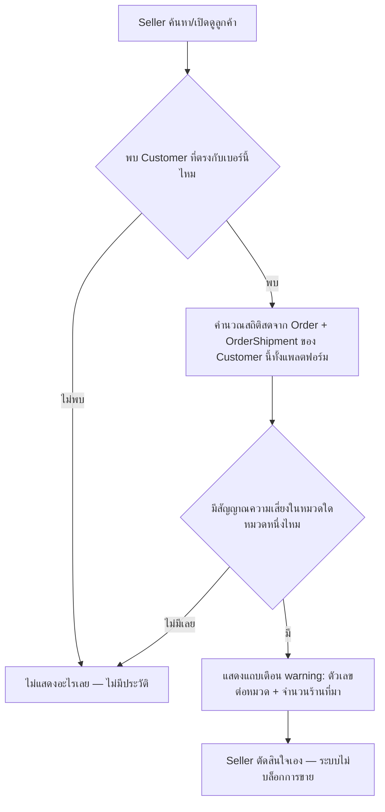

> **โมดูล:** M32-CustomerShippingRisk
> **ประเภทเอกสาร:** Product Requirements Document (PRD)
> **เวอร์ชัน:** 1.0
> **วันที่จัดทำ:** 2026-08-05
> **สถานะ:** Draft
> **เจ้าของเอกสาร:** BA + PO + PM

# PRD: ความเสี่ยงการจัดส่งของลูกค้า (Customer Shipping Risk)

---

## Executive Summary

ทุกวันนี้ seller บน Deep ไม่มีทางรู้ล่วงหน้าว่าลูกค้าเบอร์หนึ่งเคยมีประวัติปัญหาการจัดส่งกับร้านอื่นมาก่อนหรือไม่ (พัสดุตีกลับ, พัสดุมีปัญหา, ปฏิเสธ/ขอเงินคืนเก็บปลายทาง, ยกเลิกออเดอร์เอง) ข้อมูลเหล่านี้กระจัดกระจายอยู่ในระบบอยู่แล้ว — `OrderShipment.carrierStatus` (feature 00022, iShip) และ `Order.status`/`cancelInitiator` — แต่ไม่เคยถูกดึงมารวมและแสดงให้ seller เห็นตอนที่ต้องตัดสินใจ (ตอนค้นหาลูกค้าก่อนเปิดบิล)

ฟีเจอร์นี้เพิ่ม (1) สถิติความเสี่ยงที่ **คำนวณสดจากข้อมูลที่มีอยู่แล้ว** (ไม่มีตาราง counter ใหม่ที่ต้อง sync) แชร์ข้ามร้านทั้งแพลตฟอร์มในระดับ**ตัวเลขรวม**เท่านั้น (เพราะ `Customer` เป็น entity กลางที่ไม่ผูกร้านอยู่แล้ว) และ (2) โน้ตที่ร้านจดเองผูกกับลูกค้า ซึ่ง**เห็นเฉพาะร้านตัวเอง**เท่านั้น (กันการกลั่นแกล้งข้ามร้าน) แล้วนำทั้งสองอย่างไปแสดงเป็น "คำเตือน" (ไม่ใช่ตัวบล็อก) ใน 3 จุดที่ seller ตัดสินใจเกี่ยวกับลูกค้า: ค้นหาลูกค้าตอนสร้างออเดอร์, หน้าทะเบียนลูกค้า `/customers`, และแผงลูกค้าในห้องแชท

**หลักการกำกับขอบเขตที่ต้องยึดตลอดเอกสารนี้:** เตือนเท่านั้น ไม่ตัดสิน — ไม่มี risk score/เกรดสี ไม่บล็อกการขาย ไม่มีผลต่อ Trust Score และไม่มีประวัติ = ไม่แสดงอะไรเลย (ไม่ใช่แสดง "ความเสี่ยง 0")

---

## 1. Business Goals & KPIs

### 1.1 เป้าหมายทางธุรกิจ

| เป้าหมาย | รายละเอียด |
|----------|-----------|
| **ให้ seller ตัดสินใจก่อนขาย ไม่ใช่หลังเจอปัญหา** | ปัจจุบัน seller รู้ว่าลูกค้ามีปัญหาก็ต่อเมื่อโดนของตีกลับ/ปฏิเสธ COD เอง — ฟีเจอร์นี้ยกข้อมูลที่แพลตฟอร์มมีอยู่แล้ว (แต่กระจัดกระจาย) มาให้เห็นล่วงหน้า |
| **ใช้ประโยชน์จาก `Customer` ที่เป็น entity กลางอยู่แล้ว** | `Customer.phone` unique ทั้งแพลตฟอร์ม (feature 00014) — เป็นโครงสร้างที่พร้อมรองรับข้อมูลข้ามร้านโดยไม่ต้องสร้างตารางใหม่เพื่อ sync สถิติ |
| **แชร์ประโยชน์ข้ามร้านโดยไม่เปิดช่องกลั่นแกล้ง** | สถิติอัตโนมัติ (ข้อเท็จจริงดิบจากระบบ) แชร์ได้ปลอดภัยกว่าความเห็นส่วนตัว — จึงแยกกลไก 2 ชั้น (สถิติ = ข้ามร้าน, โน้ต = ในร้าน) แทนที่จะทำทุกอย่างแชร์หรือทุกอย่างปิด |

### 1.2 ตัวชี้วัดความสำเร็จ (KPIs)

| KPI | คำอธิบาย | เป้าหมาย |
|-----|----------|---------|
| **Zero cross-shop leak** | สุ่มตรวจ response ของ endpoint สถิติ ต้องไม่มีชื่อร้าน/เลขออเดอร์/รายละเอียดของร้านอื่นปรากฏเลย | 0 กรณี |
| **Zero notes leak ข้ามร้าน** | ร้าน A query โน้ตของลูกค้าที่ร้าน B เคยจด ต้องไม่เห็นแถวของร้าน B เลย | 0 กรณี |
| **No-history = no-noise** | สุ่มตรวจลูกค้าที่ไม่มีประวัติปัญหาเลย ต้องไม่มีการ์ด/badge/แถบเตือนใด ๆ ปรากฏใน 3 จุดแสดงผล | 100% ของกรณีที่สุ่มตรวจ |

---

## 2. User Personas (กลุ่มผู้ใช้งาน)

### 2.1 เจ้าของร้าน/พนักงานร้านที่ถูกเชิญ (`ShopMember.role = OWNER \| ADMIN`)

**ข้อมูลพื้นฐาน:** ผู้ใช้ที่เปิด/ดูแลร้านทุกประเภท (ONLINE_SALES, SERVICE_QUEUE, LODGING) — `/customers` เป็นเมนูที่เห็นได้ทุกประเภทร้าน ไม่จำกัดเฉพาะร้านขายออนไลน์

**เป้าหมาย:** อยากรู้ก่อนปิดการขาย/รับนัดว่าลูกค้าเบอร์นี้เคยมีปัญหาการจัดส่ง/ยกเลิกกับร้านอื่นมาก่อนหรือไม่ เพื่อประกอบการตัดสินใจเอง (เช่น ขอโอนเงินก่อนแทน COD)

**ความต้องการ:** เห็นคำเตือนแบบไม่ต้องเปิดหน้าใหม่ ตรงจุดที่กำลังตัดสินใจอยู่แล้ว (ตอนค้นหาลูกค้า/ตอนเปิดแชท) และจดบันทึกของตัวเองเพิ่มได้โดยไม่ต้องกลัวว่าจะไปกระทบร้านอื่น

**จุดปวด (Pain Points):** ทุกวันนี้รู้ปัญหาลูกค้าก็ต่อเมื่อเจอเอง (พัสดุตีกลับมาที่ร้านตัวเอง) — ไม่มีทางรู้ล่วงหน้าจากประสบการณ์ร้านอื่น แม้ข้อมูลนั้นจะมีอยู่แล้วในระบบ (เพียงแต่อยู่คนละร้าน)

### 2.2 ลูกค้า/ผู้ซื้อ — **ไม่ใช่ persona เป้าหมายของเฟสนี้**

ลูกค้าไม่มีสิทธิ์เห็นสถิติหรือโน้ตนี้เลย และไม่มีกลไก report/appeal ในเฟสนี้ (ดู §5 Out of Scope) — ระบุไว้เพื่อความชัดเจนว่าถูกพิจารณาแล้วและตัดออกอย่างมีเหตุผล ไม่ใช่ลืม

---

## 3. Business Requirements

### 3.1 คำนวณสถิติความเสี่ยงการจัดส่งแบบสดจากข้อมูลที่มีอยู่ (Derive-only)

**ความต้องการ:**
- ระบบต้องคำนวณสถิติปัญหาการจัดส่งของลูกค้า (ผูกกับ `Customer`) แบบสดจากข้อมูลจริงในระบบ (`Order` + `OrderShipment`) ทุกครั้งที่ถูกเรียกดู — **ไม่มีตาราง counter สะสม**ที่ต้อง sync/backfill และไม่มีทางเพี้ยนจากข้อมูลจริงได้เลย เพราะไม่มี "สำเนา" ของตัวเลข
- สถิติแชร์ข้ามร้านทั้งแพลตฟอร์ม เพราะ `Customer` เป็น entity กลาง (`phone` unique ทั้งระบบ) ไม่ผูกกับร้านใดร้านหนึ่ง

**Business Rules:**
- BR-CSR-01: นับแบบ**ต่อพัสดุ/ต่อออเดอร์ ไม่ใช่ต่อ event** — ใช้สถานะปัจจุบัน (ล่าสุด) ของ `OrderShipment`/`Order` เท่านั้น ไม่นับซ้ำเมื่อสถานะขยับผ่านหลายขั้น (เช่น พัสดุที่ `return` แล้วขยับเป็น `return_success` นับ "ตีกลับ" เพียง 1 ไม่ใช่ 2)
- BR-CSR-02: สัญญาณที่นับเป็นความเสี่ยงลูกค้า มาจาก allow-list ที่ตายตัวเท่านั้น (ดูตาราง §3.1.1) — สถานะขนส่งที่**ไม่อยู่ใน allow-list** (รวมถึงสถานะใหม่ที่ผู้ให้บริการขนส่งเพิ่มในอนาคตแล้วยังไม่ถูกจัดหมวด) **ต้องไม่ถูกนับ** (fail-closed) แทนที่จะถูกนับผิดหมวดหรือทำให้การคำนวณล้ม
- BR-CSR-03: `cannot_pickup` (ขนส่งเข้ารับพัสดุจากร้านไม่ได้) และ `is_expired` (พัสดุหมดอายุที่จุดรับ) **ห้ามนับเป็นความเสี่ยงลูกค้า** — เป็นปัญหาฝั่งร้าน (ร้านไม่พร้อมให้เข้ารับ/ไม่มาส่งพัสดุตามนัด) ไม่ใช่พฤติกรรมของลูกค้าปลายทาง

**3.1.1 ตารางหมวดความเสี่ยง (SSOT: ค่า `carrierStatus` จาก `src/lib/iship/status.ts`)**

| หมวดที่แสดง | สัญญาณ (`OrderShipment.carrierStatus` / `Order`) | นับเป็นความเสี่ยงลูกค้า? |
|---|---|---|
| พัสดุตีกลับ | `carrierStatus ∈ {return, return_success}` | ใช่ |
| พัสดุมีปัญหา | `carrierStatus = issue` | ใช่ |
| ปฏิเสธ/ขอคืนเงิน COD | `carrierStatus = cod_refund` | ใช่ |
| ผู้ซื้อยกเลิกออเดอร์ | `Order.status = CANCELLED` และ `Order.cancelInitiator = 'buyer'` | ใช่ |
| ขนส่งเข้ารับจากร้านไม่ได้ / พัสดุหมดอายุ | `carrierStatus ∈ {cannot_pickup, is_expired}` | ไม่ — ปัญหาฝั่งร้าน |
| สถานะอื่นทั้งหมด (`order_success`, `picked_up`, `with_branch`, `in_transit`, `progress`, `delivered`, `payment_success`, `no_courier`, `cancelled`, และค่าใหม่ที่ยังไม่รู้จัก) | — | ไม่ — ไม่ใช่สัญญาณความเสี่ยง / fail-closed |

**เหตุผล:**
- Counter table ที่ต้อง sync มีความเสี่ยงเรื้อรังของโปรเจกต์นี้เสมอ (ค่าเพี้ยนจากต้นทาง, ต้อง backfill, ต้องดูแล race condition) — derive สดตัดปัญหาประเภทนี้ทิ้งไปทั้งคลาส โดยแลกกับต้นทุน query ที่ยอมรับได้ในสเกลปัจจุบัน (ดู §4.2)
- แยก "ปัญหาฝั่งร้าน" ออกจาก "ความเสี่ยงลูกค้า" ตรงไปตรงมา — การเข้ารับพัสดุไม่ได้ที่ร้านไม่ใช่ความผิดของลูกค้าปลายทาง การปนสองอย่างนี้เข้าด้วยกันจะทำให้ร้านที่มีปัญหาเข้ารับพัสดุบ่อยกลายเป็นการใส่ร้ายลูกค้าตัวเองทางอ้อม

### 3.2 บันทึกโน้ตของร้านที่เห็นเฉพาะร้านตัวเอง (CustomerNote)

**ความต้องการ:**
- ร้านจดบันทึกข้อความเกี่ยวกับลูกค้าได้เอง (insert) และลบเองได้ (delete) — **ไม่มีการแก้ไข**
- โน้ตผูกกับทั้งลูกค้าและร้านที่จด (`customerId` + `shopId`) — เห็นได้เฉพาะร้านที่จดเท่านั้น ไม่แชร์ข้ามร้านไม่ว่ากรณีใด

**Business Rules:**
- BR-CSR-04: ทุก query โน้ต (อ่าน/สร้าง/ลบ) ต้อง scope ด้วย `shopId` ของร้านที่ล็อกอินอยู่เสมอ — ร้านอื่นต้องไม่เห็น ไม่แก้ ไม่ลบโน้ตของร้านนี้ได้ไม่ว่าทางใด
- BR-CSR-05: ข้อความโน้ตจำกัดความยาว (ล็อกไว้ที่ 500 ตัวอักษร ตาม design spec) — จดสั้น ทดแทนด้วยการลบแล้วจดใหม่แทนการแก้ไข
- BR-CSR-06: ลบพนักงานที่เป็นคนจดโน้ตออกจากร้าน (`ShopMember` ถูกลบ) ต้อง**ไม่ทำให้โน้ตของร้านหายไปด้วย** — ผู้จดกลายเป็น "ไม่ทราบ/อดีตพนักงาน" แต่ตัวโน้ตยังอยู่

**เหตุผล:**
- ต่างจากสถิติอัตโนมัติ (ข้อเท็จจริงดิบที่ตรวจสอบย้อนกลับได้จากข้อมูลระบบ) โน้ตเป็น**ความเห็นส่วนตัวของร้าน**ที่ตรวจสอบไม่ได้ — ถ้าแชร์ข้ามร้าน ร้านคู่แข่งใส่ร้ายลูกค้าของกันและกันได้โดยไม่มีต้นทุน จึงต้องปิดเป็นข้อมูลภายในร้านเท่านั้น (locked decision จาก brainstorm กับ user)

### 3.3 เปิดเผยสถิติข้ามร้านเฉพาะระดับตัวเลขรวม (Aggregate-only cross-shop exposure)

**ความต้องการ:**
- เมื่อร้านหนึ่งดูสถิติความเสี่ยงของลูกค้า ต้องเห็นได้แค่**ตัวเลขรวม**ของแต่ละหมวด (ตีกลับ/มีปัญหา/ปฏิเสธ COD/ยกเลิกโดยผู้ซื้อ) บวกกับ**จำนวนร้านที่ข้อมูลมาจาก** (บอกน้ำหนักหลักฐาน) เท่านั้น
- **ห้ามเปิดเผย**ชื่อร้านอื่น เลขออเดอร์ วันที่ หรือรายละเอียดใด ๆ ที่ระบุตัวร้านอื่นได้ ไม่ว่ากรณีใด

**Business Rules:**
- BR-CSR-07: response ที่ส่งกลับให้ร้านที่ดู ต้องเป็น aggregate เท่านั้น (จำนวนต่อหมวด + จำนวนร้านที่เกี่ยวข้อง + จำนวนออเดอร์ทั้งหมดที่ใช้เป็นตัวหาร) — ไม่มี field ใดที่ join ไปถึงข้อมูลระบุตัวร้านอื่นได้
- BR-CSR-08: ส่วนโน้ต (§3.2) ในคำตอบเดียวกันนี้ ต้องกรองให้เหลือเฉพาะของร้านที่กำลังดูเท่านั้น — endpoint เดียวกันแต่กติกาการกรองต่างกันคนละส่วน

**เหตุผล:**
- ความลับทางการค้าของร้านอื่น (ปริมาณออเดอร์ ปัญหาที่เจอ) ไม่ใช่สิ่งที่ร้านคู่แข่งควรรู้ผ่านฟีเจอร์นี้ — จำกัดที่ "ตัวเลขรวม + จำนวนร้าน" ให้ประโยชน์ทางธุรกิจ (รู้ว่าน่าเชื่อถือแค่ไหน) โดยไม่รั่วรายละเอียดที่กระทบคู่แข่ง

### 3.4 แสดงคำเตือนที่จุดตัดสินใจของร้าน โดยไม่บล็อกการขาย

**ความต้องการ:**
- แสดงคำเตือน (ไม่ใช่ตัวบล็อก) ที่ 3 จุดที่ seller ตัดสินใจเกี่ยวกับลูกค้า:
  1. ค้นหา/เลือกลูกค้าตอนสร้างออเดอร์ (แถบ warning ใต้ลูกค้าที่เลือก)
  2. หน้าทะเบียนลูกค้า `/customers` (badge จำนวนในแถวตาราง + การ์ด "ความเสี่ยงการจัดส่ง" ในโปรไฟล์ลูกค้า + กล่องโน้ตของร้าน)
  3. แผงลูกค้าในห้องแชท (แถวสรุปย่อ 1 บรรทัดใต้หัวลูกค้า)

**Business Rules:**
- BR-CSR-09: **ไม่บล็อกการสร้างออเดอร์**ไม่ว่ากรณีใด — seller เห็นคำเตือนแล้วตัดสินใจเองเสมอ ระบบไม่ปฏิเสธ/หน่วงการขายแทน seller
- BR-CSR-10: **ไม่มี risk score หรือเกรดสี** — แสดงเฉพาะตัวเลขข้อเท็จจริงดิบ (จำนวนครั้งต่อหมวด + จำนวนร้านที่มา) ไม่มีการตีความ/ให้คะแนนใด ๆ ทับข้อมูลดิบ
- BR-CSR-11: **ไม่มีประวัติเลย = ไม่แสดงอะไรเลย** ในทุกจุด — ห้ามแสดง "ความเสี่ยง 0" หรือการ์ดว่างเปล่า (no-news-is-no-card)
- BR-CSR-12: โทนสีที่ใช้ต้องเป็นโทนเตือน (amber/warning) ไม่ใช่โทนอันตราย (แดง) — สื่อว่า "ให้ระวัง" ไม่ใช่ "ตัดสินว่าลูกค้าผิด"

**เหตุผล:**
- สอดคล้องกับหลักการของ Trust Score ในโปรเจกต์นี้ที่ MVP มีแต่ขึ้น ไม่มี penalty — ฟีเจอร์นี้ก็ไม่ควรกลายเป็นกลไกลงโทษ/ตัดสินลูกค้าโดยอัตโนมัติ อำนาจตัดสินใจสุดท้ายต้องอยู่ที่ seller เสมอ ระบบมีหน้าที่แค่ "ให้ข้อมูลที่ควรรู้" ไม่ใช่ "ตัดสินแทน"

---

## 4. Business Rules & Constraints

### 4.1 กฎทางธุรกิจหลัก

| กฎ | คำอธิบาย |
|----|----------|
| **BR-CSR-01 นับต่อพัสดุ/ออเดอร์** | ไม่นับต่อ event — สถานะปัจจุบันของแถวเดียวเท่านั้น |
| **BR-CSR-02 Allow-list + fail-closed** | สถานะขนส่งที่ไม่รู้จัก/ไม่อยู่ใน allow-list ไม่ถูกนับ ไม่ทำให้ระบบพัง |
| **BR-CSR-03 แยกปัญหาฝั่งร้าน** | `cannot_pickup`/`is_expired` ไม่นับเป็นความเสี่ยงลูกค้า |
| **BR-CSR-04 Notes scope ร้านเดียว** | โน้ตเห็น/แก้/ลบได้เฉพาะร้านที่จด ไม่แชร์ข้ามร้านเด็ดขาด |
| **BR-CSR-07 Aggregate-only ข้ามร้าน** | สถิติข้ามร้านคืนแค่ตัวเลขรวม + จำนวนร้าน ห้ามระบุตัวร้านอื่น |
| **BR-CSR-09 Warn-only** | ไม่บล็อกการสร้างออเดอร์ ไม่ว่ากรณีใด |
| **BR-CSR-11 No-history-no-card** | ไม่มีประวัติ = ไม่ render อะไรเลย ไม่ใช่แสดงค่า 0 |

### 4.2 ข้อจำกัดทางธุรกิจ

| ข้อจำกัด | รายละเอียด |
|---------|-----------|
| **ไม่มีรหัสแยก "ติดต่อผู้รับไม่ได้"** | ตามแท็บของ iShip ที่ user เห็น ("ติดต่อผู้รับไม่ได้") ไม่มี `carrierStatus` แยกในระบบเรา — เท่าที่ยืนยันจาก `src/lib/iship/status.ts` เคสนี้มาถึงเราปนอยู่ในรหัส `issue` เท่านั้น จึงรวมอยู่ในหมวด "พัสดุมีปัญหา" ของเฟสนี้ (แยกหมวดในอนาคตต้องรอ mapping เพิ่มจาก iShip — ดู §5) |
| **ใบพัสดุที่ถูกเลิกผูก (unlink) ประวัติหายไปกับแถว** | `unlinkShipment()` ลบแถว `OrderShipment` ทิ้งจริง (ไม่ใช่ mark cancelled) เพื่อคืนเลขพัสดุให้ผูกใหม่ได้ (BR-ISHIP เดิม) — ผลคือสัญญาณความเสี่ยงจากพัสดุใบนั้น (ถ้ามี) หายไปด้วย เป็นความเสี่ยงที่ยอมรับแล้ว (accepted, ไม่ใช่บั๊ก) เพราะ derive สดจากข้อมูลที่มีอยู่จริงเท่านั้น |
| **Derive สดมีต้นทุน query ต่อการเรียกดู** | ไม่มี counter table แปลว่าทุกครั้งที่เปิดดูสถิติต้อง query/aggregate `Order`+`OrderShipment` สด — ยอมรับได้ในสเกลปัจจุบันของแพลตฟอร์ม (รายละเอียด index ให้ SRS/DATABASE ตัดสิน) |

### 4.3 นิยาม "ลูกค้าที่ไม่มีประวัติให้แสดง" (edge cases)

- ลูกค้าที่ยังไม่เคยมี `Customer` row เลย (walk-in ที่ยังไม่เคยสั่งซื้อกับร้านใดในระบบ, หรือค้นหาด้วยเบอร์ที่ไม่เคยปรากฏใน `Order.customerId` เลย) → ไม่มีสถิติให้แสดง เท่ากับ "ไม่มีประวัติ" ตาม BR-CSR-11
- ออเดอร์ที่ `customerId` เป็น `null` (ไม่เคย derive ได้จากเบอร์ตอนสร้างออเดอร์) → ไม่ถูกนับเข้าสถิติของลูกค้าใด ๆ (ไม่มี key ให้ผูก)
- ลูกค้าที่ไม่มีเบอร์โทรเลย (ไม่เข้าเงื่อนไขนี้ในทางปฏิบัติ เพราะ `Customer.phone` เป็น required @unique — แต่จุดค้นหาที่พิมพ์เบอร์แล้วยังไม่มี `Customer` ตรงกับเบอร์นั้นเลย ให้ถือว่าไม่มีประวัติเช่นกัน)

---

## 5. Out of Scope (นอกขอบเขต)

| หัวข้อ | คำอธิบาย |
|--------|----------|
| **Risk score / เกรดสี** | แสดงเฉพาะตัวเลขข้อเท็จจริงดิบ — ไม่มีการให้คะแนน/จัดเกรดลูกค้าในเฟสนี้ (BR-CSR-10) |
| **ระบบ report/appeal ของลูกค้า** | ลูกค้าไม่มีช่องทางโต้แย้ง/อุทธรณ์ประวัติที่ถูกบันทึกในเฟสนี้ |
| **การบล็อกสร้างออเดอร์** | ไม่ว่าประวัติจะแย่แค่ไหน ระบบไม่ปฏิเสธ/หน่วงการขายเอง (BR-CSR-09) |
| **ผลต่อ Trust Score** | สถิติความเสี่ยงนี้เป็นคนละระบบกับ Trust Score ของลูกค้า/ร้าน ไม่กระทบกันในเฟสนี้ |
| **แยกหมวด "ติดต่อผู้รับไม่ได้"** | รอ mapping รหัสเพิ่มเติมจาก iShip — เฟสนี้รวมอยู่ใน "พัสดุมีปัญหา" (§4.2) |
| **โน้ตแชร์ข้ามร้าน** | แม้แบบเลือกหมวด/เลือกร้านที่ไว้ใจ — ไม่มีกลไกแชร์โน้ตข้ามร้านใด ๆ ในเฟสนี้ (locked decision) |
| **แก้ไขโน้ตที่จดไปแล้ว** | มีแค่ insert + delete — ต้องการแก้ = ลบแล้วจดใหม่ |
| **แนวโน้ม/กราฟย้อนหลัง** | แสดงเฉพาะตัวเลขรวม ณ ขณะดู ไม่มี timeline/กราฟแนวโน้ม |
| **แจ้งเตือนแบบ real-time เมื่อพบความเสี่ยงใหม่** | ไม่มี notification/push เมื่อลูกค้าที่เคยคุยได้ risk signal ใหม่เพิ่มขึ้น |
| **Admin/Ops เห็นสถิตินี้** | เฟสนี้จำกัดเฉพาะฝั่ง seller (`ShopMember`) เท่านั้น |

---

## 6. Risks & Mitigation (ความเสี่ยงและแนวทางแก้ไข)

### 6.1 ความเสี่ยงทางธุรกิจ

| ความเสี่ยง | ผลกระทบ | ระดับความรุนแรง | แนวทางแก้ไข |
|-----------|---------|-----------------|-------------|
| ร้านใช้ข้อมูลนี้เลือกปฏิบัติกับลูกค้าอย่างไม่เป็นธรรม (เช่น ปฏิเสธขายทันทีเมื่อเห็นตัวเลข) | ลูกค้าถูกตัดสินจากประวัติที่อาจไม่เกี่ยวกับพฤติกรรมจริง (เช่น พัสดุตีกลับเพราะร้านก่อนหน้าเขียนที่อยู่ผิด) | กลาง | Warn-only ไม่บล็อก, ไม่มีเกรดสี/risk score, แสดงเฉพาะตัวเลขดิบให้ seller ตีความเอง (BR-CSR-09/10) |
| โน้ตของร้านถูกใช้กลั่นแกล้งลูกค้าในร้านตัวเอง | ลูกค้าถูกตราหน้าในร้านนั้นอย่างไม่เป็นธรรม | ต่ำ-กลาง | จำกัดผลกระทบไว้แค่ร้านเดียว (ไม่แชร์ข้ามร้าน) — ความเสียหายไม่ลามข้ามแพลตฟอร์ม |
| ร้านคู่แข่งสอดแนมปริมาณ/ปัญหาของกันและกันผ่านลูกค้าร่วม | ความลับทางการค้ารั่วทางอ้อม | กลาง | Aggregate-only (BR-CSR-07) — ไม่มีทาง reverse-engineer กลับไปหาร้านใดร้านหนึ่งจากตัวเลขรวม |

### 6.2 ความเสี่ยงทางเทคนิค

| ความเสี่ยง | ผลกระทบ | แนวทางแก้ไข |
|-----------|---------|-------------|
| Derive สดจาก `Order`+`OrderShipment` ช้าลงเมื่อข้อมูลสะสมมาก (ไม่มี counter table) | หน้าที่แสดงสถิติโหลดช้า | ออกแบบ index รองรับ query pattern (`customerId` join `carrierStatus`) ตั้งแต่ SRS/DATABASE — ไม่ผัดไปทีหลัง |
| `carrierStatus` ค่าใหม่จาก iShip ที่ยังไม่ถูกจัดหมวด ทำให้สถิติดูน้อยกว่าความเป็นจริงแบบเงียบ ๆ | seller เข้าใจผิดว่าลูกค้าไม่มีประวัติ ทั้งที่มีจริงแต่ไม่ถูกนับ | Fail-closed ตาม allow-list (BR-CSR-02) + logging เมื่อเจอค่าที่ไม่รู้จัก เพื่อให้ทีมงานอัปเดต mapping ได้ทัน |
| Query aggregate ข้ามร้านเผลอ leak field ที่ระบุตัวร้านอื่นระหว่าง implement (บั๊ก ไม่ใช่ design) | ละเมิด BR-CSR-07 | Code review checklist + ตรวจ response shape ตอน implement (คล้าย grep gate ของ PII/emoji ที่มีอยู่แล้วในโปรเจกต์) |

---

## 7. Glossary (อภิธานศัพท์)

| คำศัพท์ | ความหมาย |
|---------|----------|
| **Customer** | ตัวตนลูกค้ากลางระดับแพลตฟอร์ม (feature 00014) keyed ด้วย `phone` unique ทั้งระบบ ไม่ผูกร้านใดร้านหนึ่ง |
| **carrierStatus** | สถานะขนส่งดิบจาก iShip ที่เก็บใน `OrderShipment.carrierStatus` (เช่น `return`, `issue`, `cod_refund`) |
| **derive สด** | คำนวณผลลัพธ์จากข้อมูลต้นทางทุกครั้งที่ถูกเรียกดู แทนที่จะเก็บผลลัพธ์สำเร็จรูปไว้ในตารางแยก |
| **allow-list / fail-closed** | รับรู้เฉพาะค่าที่อยู่ในรายการที่กำหนดไว้ล่วงหน้า ค่าอื่นถือว่า "ไม่นับ/ไม่ผ่าน" แทนที่จะเดา |
| **CustomerNote** | ตารางใหม่ของฟีเจอร์นี้ — โน้ตที่ร้านจดเองผูกกับลูกค้า เห็นเฉพาะร้านที่จด |
| **cancelInitiator** | field ใน `Order` ที่บอกว่าฝ่ายไหนเป็นคนกดยกเลิก (`seller` หรือ `buyer`) |
| **no-news-is-no-card** | หลักการแสดงผล: ไม่มีข้อมูลความเสี่ยง = ไม่ render ส่วนแสดงผลเลย ไม่ใช่แสดงค่า 0 |
| **shopsInvolved** | จำนวนร้าน (นับไม่ซ้ำ) ที่ข้อมูลความเสี่ยงของลูกค้ารายนี้มาจาก — ใช้บอกน้ำหนักความน่าเชื่อถือของตัวเลข โดยไม่เปิดเผยว่าเป็นร้านไหน |

---

## 8. Success Metrics (ตัวชี้วัดความสำเร็จ)

| ตัวชี้วัด | ค่าที่คาดหวัง | วิธีวัด |
|----------|---------------|--------|
| ความถูกต้องของการนับ | ตรงตามตาราง §3.1.1 100% เทียบกับข้อมูลจริงใน `OrderShipment`/`Order` | สุ่มตรวจลูกค้า N ราย เทียบตัวเลขที่แสดงกับ query มือ |
| Cross-shop data leak | 0 | code review + สุ่มตรวจ response ของ endpoint ด้วยบัญชีร้านคนละร้าน |
| Notes isolation | 0 กรณีที่ร้าน A เห็นโน้ตร้าน B | unit test scope `shopId` + สุ่มตรวจ prod |
| Fail-closed ต่อ carrierStatus ใหม่ | ไม่มี error/ไม่มีการนับผิดหมวดเมื่อเจอค่าที่ไม่รู้จัก | unit test ป้อนค่าสมมติที่ไม่อยู่ใน allow-list |

---

## 9. Dependencies & Assumptions

### 9.1 สิ่งที่ต้องพึ่งพา (Dependencies)

| ระบบ/ส่วนประกอบ | ความสัมพันธ์ |
|-----------------|-------------|
| `Customer` (feature 00014) | Entity กลางที่ผูกสถิติความเสี่ยงทั้งหมด — `phone` unique ทั้งแพลตฟอร์ม |
| `Order.customerId` / `cancelInitiator` | ตัวหารสถิติ (`totalOrders`) และสัญญาณ "ผู้ซื้อยกเลิกออเดอร์" |
| `OrderShipment.carrierStatus` (feature 00022, iShip) | แหล่งสัญญาณหลักของหมวดตีกลับ/มีปัญหา/COD |
| `src/lib/iship/status.ts` (`PROBLEM_CARRIER_STATUSES` ที่มีอยู่แล้ว) | SSOT เดิมของโปรเจกต์สำหรับ "สถานะที่มีปัญหา" — ฟีเจอร์นี้ต้องนิยาม allow-list ของตัวเองแยกต่างหาก (§3.1.1) เพราะเป้าหมายต่างกัน (ที่มีอยู่ตอบ "ร้านต้องรีบดูไหม" ฟีเจอร์นี้ตอบ "ลูกค้าคนนี้น่าเชื่อถือแค่ไหน" — `cannot_pickup`/`is_expired` อยู่ในชุดเดิมแต่ต้องถูกตัดออกจากชุดใหม่ตาม BR-CSR-03) |
| `CustomerSearchSheet` / `CustomerSelectBlock` (`orders/new`) | จุดแสดงผลที่ 1 — ค้นหา/เลือกลูกค้าตอนสร้างออเดอร์ |
| หน้า `/customers` + `CustomerTable` | จุดแสดงผลที่ 2 — เมนูนี้เปิดให้ทุกประเภทร้าน (ONLINE_SALES/SERVICE_QUEUE/LODGING) ไม่ถูกจำกัดด้วย vertical menu gate |
| `CustomerPanel` (ห้องแชท, feature 00018 ecosystem) | จุดแสดงผลที่ 3 — แถวสรุปย่อในแผงลูกค้า |
| Guard เดิมของโปรเจกต์ (`requireShopMember`/`requireGeneralShop` ใน `src/lib/shop-api-guard.ts`) | รูปแบบการยืนยันสิทธิ์ที่มีอยู่แล้ว — endpoint ของฟีเจอร์นี้ต้องเลือกใช้ guard ที่ไม่ผูกกับ vertical เฉพาะเจาะจง (ดู §9.2) รายละเอียด implementation ให้ SRS ตัดสิน |

### 9.2 สมมติฐาน (Assumptions)

- ข้อมูลความเสี่ยงมีประโยชน์กับร้าน**ทุกประเภท** ไม่ใช่แค่ร้านขายออนไลน์ — เพราะลูกค้าที่มีประวัติปัญหากับร้านขายออนไลน์อื่น ก็อาจเป็นลูกค้าคนเดียวกันที่กำลังจะจองคิวงาน/ห้องพักกับร้านประเภทอื่น จึง**ไม่จำกัด endpoint นี้ด้วย vertical ของร้านที่ดู** ต่างจาก `requireGeneralShop` เดิมที่ผูกกับ `ONLINE_SALES` เท่านั้น (guard function ที่แน่นอนให้ SRS เลือก)
- เบอร์โทรที่ค้นหา/แสดงผลผ่านการ normalize เดียวกันทุกจุด (`src/lib/phone.ts`) — ไม่มีจุดไหนเทียบเบอร์แบบ raw string
- ปริมาณข้อมูล (`Order`/`OrderShipment`) ในสเกลปัจจุบันของแพลตฟอร์มยังรองรับการ derive สดได้โดยไม่ต้องมี counter table (ประเมินใหม่เมื่อข้อมูลโตขึ้นมาก — ไม่ใช่ในเฟสนี้)
- ไม่มี hard-delete ของ `Order`/`OrderShipment` ในระบบจริง (สอดคล้องกับสมมติฐานเดียวกันของ feature 00031) — ยกเว้นกรณี unlink ที่ลบแถว `OrderShipment` ทิ้งจริงตามกลไกเดิม (§4.2)

---

## 10. Appendix

### 10.1 ตัวอย่าง User Journey

**Scenario: seller เจอลูกค้าที่มีประวัติตีกลับจากร้านอื่นตอนกำลังเปิดบิล**

1. Seller เปิดหน้า `/orders/new` แล้วพิมพ์ค้นหาเบอร์ลูกค้าใน `CustomerSearchSheet`
2. ระบบพบว่าเบอร์นี้ตรงกับ `Customer` ที่มีอยู่แล้ว → คำนวณสถิติสดจาก `Order`/`OrderShipment` ของเบอร์นี้ทั้งแพลตฟอร์ม
3. พบว่ามีพัสดุตีกลับ 2 ครั้งจาก 3 ร้านที่เคยขายให้ลูกค้ารายนี้ → แสดงแถบ warning ใต้ลูกค้าที่เลือก: "เบอร์นี้มีประวัติ: ตีกลับ 2 · ปฏิเสธ COD 1 — จาก 3 ร้านบน Deep"
4. Seller เห็นคำเตือนแล้วตัดสินใจเอง (เช่น เปลี่ยนเป็นเก็บเงินก่อนส่ง) — ระบบไม่บล็อกการสร้างออเดอร์
5. Seller จดโน้ตของร้านตัวเองเพิ่มเติม เช่น "โทรยืนยันที่อยู่ก่อนส่งทุกครั้ง" — โน้ตนี้เห็นเฉพาะร้านตัวเอง ไม่กระทบร้านอื่นที่เคยขายให้ลูกค้ารายนี้

### 10.2 Flow การตัดสินใจว่าจะแสดงคำเตือนหรือไม่

---

**หมายเหตุ:**
เอกสารนี้เป็นการบันทึกความต้องการทางธุรกิจ (Business Requirements) โดยไม่มีรายละเอียดทางเทคนิค
สำหรับ Functional Requirements / User Story / Acceptance Criteria ดู BRD ของโมดูลนี้
สำหรับ technical specification (schema/API/authorization/index) ดู SRS/SDS/DATABASE/API ของโมดูลนี้ (ยังไม่ได้ทำ — รอ PRD+BRD ผ่าน review ตาม Hard Rule 11)
