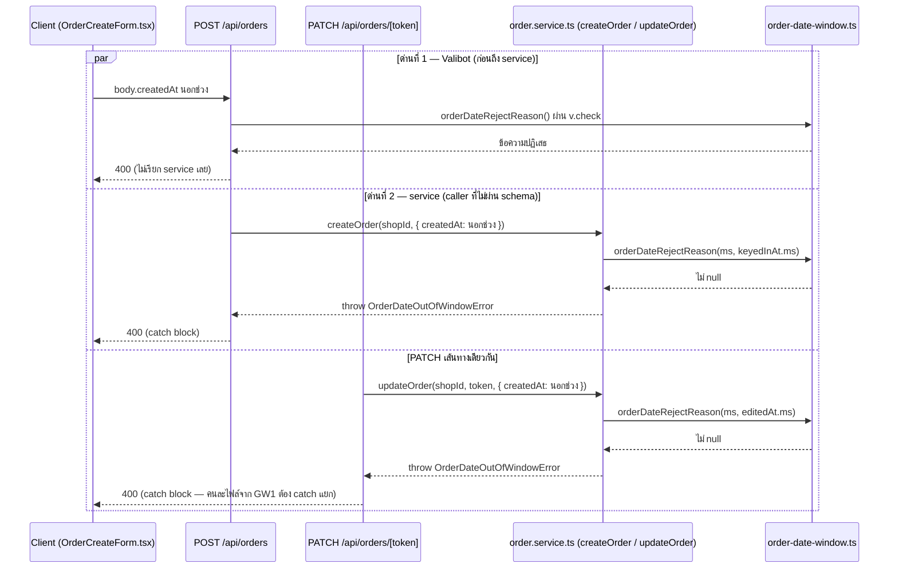

> **โมดูล:** M00033-BackdatedOrderDate
> **ประเภทเอกสาร:** API Contract
> **เวอร์ชัน:** 1.0
> **วันที่จัดทำ:** 2026-08-06
> **สถานะ:** Draft — เขียนก่อนโค้ด (Hard Rule 11)
> **เจ้าของเอกสาร:** safepay-planner (ดู [[Feature-Docs-Ownership]])

# API Contract: เลือกวันที่/เวลาของคำสั่งซื้อได้

---

## 1. Overview

งานนี้**ไม่มี endpoint ใหม่** — เป็นการเพิ่มคีย์ optional 1 ตัว (`createdAt`) เข้า body ของ endpoint เดิม 2 ตัวที่ใช้ `CreateOrderSchema` ร่วมกันอยู่แล้ว (`src/lib/validations.ts:292`) และเพิ่ม error code ใหม่ 1 ตัวที่ต้อง map เป็น 400 ในทั้งสอง route

- **เอกสารออกแบบต้นทาง:** [[SDS]] §3-4 (ทุก endpoint trace กลับ component/decision ที่นั่น)
- **Provider:** `src/app/api/orders/**` (Next.js 16 App Router Route Handler)
- **ผู้บริโภค:** `OrderCreateForm.tsx` (seller, Paces) — ทั้ง POS เดสก์ท็อป, QuickForm มือถือ, draft จากแชท, หน้าแก้ไข ใช้ component เดียวกัน
- **Base URL:** เหมือนเดิมของระบบ (`/api/orders`, `/api/orders/{token}`)
- **Content-Type:** `application/json`
- **Convention:** response envelope เดิมของ `src/app/api/orders/**` — คืน object ของ order ตรง ๆ (ไม่มี `{ data, meta }` wrapper) หรือ `{ error: string }` เมื่อ fail — ตาม pattern เดิมของทั้งสอง route (ไม่เปลี่ยนในงานนี้)

---

## 2. Authentication

**ไม่เปลี่ยนจากของเดิม** — ทั้ง 2 endpoint ยังใช้ NextAuth session + shop-scope เดิมทุกประการ

| รายการ | ค่า |
|---|---|
| **วิธี** | NextAuth session (seller subdomain) ผ่าน `getServerSession(authOptions)` |
| **POST /api/orders** | `requireActiveShop(session)` — resolve active shop ของ session; `active.locked` → 403 `SHOP_LOCKED` |
| **PATCH /api/orders/[token]** | `resolveActiveShopContext({ user: { id, activeShopId } })` แล้ว `updateOrder(ctx.shopId, token, ...)` scope ownership ด้วย `shopId` ใน `WHERE` ของ `tx.order.findFirst` |
| **สิ่งที่เพิ่มในงานนี้** | ไม่มี — `createdAt` ไม่ต้องการสิทธิ์เพิ่มเติมจากสิทธิ์สร้าง/แก้ออเดอร์ที่มีอยู่แล้ว (design spec §11: "ไม่ทำสิทธิ์แยกว่าใครลงย้อนหลังได้ — ใครสร้างออเดอร์ได้ก็ลงย้อนหลังได้") |
| **กรณีไม่ผ่าน** | 401 (ไม่มี session) / 404 (ไม่มีร้าน active หรือไม่ใช่เจ้าของ) / 403 (`SHOP_LOCKED`, เฉพาะ POST) — เหมือนเดิมทุกประการ |

---

## 3. Endpoint List

| Method | Path | สถานะ | คำอธิบาย |
|---|---|---|---|
| `POST` | `/api/orders` | **body เปลี่ยน (เพิ่มคีย์ optional)** | สร้างคำสั่งซื้อ — เพิ่ม `createdAt?: string` |
| `PATCH` | `/api/orders/[token]` | **body เปลี่ยน (เพิ่มคีย์ optional เดียวกัน)** | แก้ไขคำสั่งซื้อเต็มรูป — เพิ่ม `createdAt?: string`, ผลข้างเคียง sync `orderNo` |

---

## 4. Endpoint Detail

### 4.1 `POST /api/orders`

สร้างคำสั่งซื้อ — ทุก field เดิมไม่เปลี่ยน เพิ่มคีย์ `createdAt` เข้า `CreateOrderSchema` เท่านั้น

**Request**

| ส่วน | ฟิลด์ | ชนิด | บังคับ | คำอธิบาย |
|------|-------|------|--------|----------|
| Body | `createdAt` | `string` (ISO-8601 พร้อม offset) | ไม่ | วันที่/เวลาที่ลูกค้าสั่งจริง — ไม่ส่ง = ใช้เวลาปัจจุบัน (`@default(now())` เดิม) |
| Body | `items`, `type`, `buyerContact`, ... | (เดิมทั้งหมด) | (เดิม) | ไม่เปลี่ยนจาก `CreateOrderSchema` เดิม |

**Response — Success (201)**

โครงเดิมทุกประการ (object ของ order ที่สร้างแล้ว รวม `items`) — `createdAt`/`orderNo` ในผลลัพธ์สะท้อนค่าที่ส่งมา (หรือเวลาปัจจุบันถ้าไม่ส่ง)

**Response — Error**

ดู §5 (Error Code Table) — เพิ่ม 1 แถวใหม่: `400` เมื่อ `createdAt` อยู่นอกช่วง 90 วันย้อนหลัง / 7 วันล่วงหน้า

**ตัวอย่าง JSON — ลงวันที่ย้อนหลัง (เคสหลักของฟีเจอร์นี้)**

```json
// Request
POST /api/orders
{
  "items": [{ "name": "เสื้อยืด", "qty": 1, "price": 390 }],
  "type": "PHYSICAL",
  "buyerContact": "0812345678",
  "salesChannel": "STOREFRONT",
  "createdAt": "2026-08-05T21:14:00+07:00"
}

// Response 201
{
  "id": "clx...",
  "publicToken": "51043fb1-...",
  "orderNo": "DP25690851043FB1",
  "createdAt": "2026-08-05T14:14:00.000Z",
  "status": "PENDING",
  "totalAmount": 390,
  "items": [{ "name": "เสื้อยืด", "qty": 1, "price": 390 }]
}
```

**ตัวอย่าง JSON — ไม่แตะช่องวันที่ (พฤติกรรมเดิมเป๊ะ)**

```json
// Request
POST /api/orders
{
  "items": [{ "name": "ถุงเท้า", "qty": 1, "price": 150 }],
  "type": "PHYSICAL",
  "buyerContact": "0812345678"
}
// ไม่มีคีย์ createdAt เลย

// Response 201 — createdAt = เวลาที่ INSERT จริง (@default(now()))
{
  "id": "cly...",
  "createdAt": "2026-08-06T09:12:03.000Z",
  "orderNo": "DP256908...",
  "...": "..."
}
```

**ตัวอย่าง JSON — นอกช่วง (ปฏิเสธ ไม่ clamp)**

```json
// Request
POST /api/orders
{ "items": [...], "type": "PHYSICAL", "buyerContact": "0812345678", "createdAt": "2026-01-01T00:00:00+07:00" }

// Response 400
{ "error": "วันที่คำสั่งซื้อต้องอยู่ระหว่าง 90 วันย้อนหลังถึง 7 วันล่วงหน้า" }
```

### 4.2 `PATCH /api/orders/[token]`

แก้ไขคำสั่งซื้อเต็มรูป (body shape เดียวกับ `POST /api/orders`) — เพิ่มผลข้างเคียงใหม่: เมื่อ `createdAt` เปลี่ยน ระบบ recompute `orderNo` และบันทึก event `ORDER_DATE_CHANGED` ให้อัตโนมัติในทรานแซกชันเดียวกัน (ไม่มี field ใหม่ให้ client ควบคุมพฤติกรรมนี้ — เป็นผลอัตโนมัติเสมอ)

**Request**

เหมือน 4.1 — คีย์ `createdAt` เดียวกัน ส่งเฉพาะเมื่อผู้ขายต้องการเปลี่ยนวันที่ ไม่ส่ง = `createdAt` เดิมไม่ถูกแตะ

**Response — Success (200)**

โครงเดิมทุกประการ — `orderNo` ในผลลัพธ์เป็นค่าที่ recompute แล้วถ้า `createdAt` เปลี่ยนข้ามเดือน

**ตัวอย่าง JSON — เลื่อนวันที่ข้ามเดือน**

```jsonc
// Request
PATCH /api/orders/51043fb1-....
{
  "items": [{ "name": "เสื้อยืด", "qty": 1, "price": 390 }],
  "type": "PHYSICAL",
  "buyerContact": "0812345678",
  "createdAt": "2026-07-28T21:14:00+07:00"
}

// Response 200 — orderNo เปลี่ยนจาก DP2569 08... เป็น DP2569 07... (โค้ด 8 หลักท้ายไม่เปลี่ยน)
{
  "id": "clx...",
  "publicToken": "51043fb1-...",
  "orderNo": "DP25690751043FB1",
  "createdAt": "2026-07-28T14:14:00.000Z",
  "status": "PENDING"
}
```

**ตัวอย่าง JSON — แก้ออเดอร์ที่ไม่ใช่ PENDING (ปฏิเสธเหมือนเดิม — ไม่ใช่ error ใหม่)**

```json
// Response 400
{ "error": "แก้ไขได้เฉพาะคำสั่งซื้อที่ยังรอดำเนินการเท่านั้น" }
```

**Errors:** ดู §5 — error เดิมทุกตัวยังใช้เหมือนเดิม (`OrderNotFoundError` → 404, `OrderNotEditableError` → 400, `ProductNotInShopError` → 400, `ShippingAddressRequiredError` → 400, `OutOfStockError` → 400) เพิ่มเฉพาะ `OrderDateOutOfWindowError` → 400

---

## 5. Error Code Table

🛑 **ตารางนี้เป็น cross-file error-mapping ที่บังคับ enumerate ทุก error ใหม่ + route ที่ต้อง catch มัน** (บทเรียน `feedback_service_error_route_mapping` — feature 00003 P2 `OutOfStockError` เคยตกหล่นเพราะไม่มี checklist แบบนี้)

| Error Code (message) | HTTP Status | ความหมาย / เงื่อนไข | Throw จาก (service) | Catch ที่ (route) | ใหม่ในงานนี้? |
|------------|-------------|----------------------|---|---|---|
| `"วันที่คำสั่งซื้อต้องอยู่ระหว่าง 90 วันย้อนหลังถึง 7 วันล่วงหน้า"` (Valibot 400) | 400 | `createdAt` ไม่ผ่าน `v.check` ใน `CreateOrderSchema` (ด่านที่ 1) | — (Valibot เอง ไม่ throw class) | `POST /api/orders`: `if (!parsed.success) return 400` · `PATCH /api/orders/[token]`: เหมือนกัน | **ใหม่** |
| `OrderDateOutOfWindowError` (`ORDER_DATE_OUT_OF_WINDOW_MESSAGE`) | 400 | `createdAt` ผ่าน Valibot มาได้แต่ยังนอกช่วงตอนถึง service (ด่านที่ 2 — กัน caller ฝั่ง server ที่เรียก `createOrder`/`updateOrder` ตรง ๆ ไม่ผ่าน schema) | `createOrder` **และ** `updateOrder` (`src/services/order.service.ts`) | 🛑 **ต้อง catch ทั้ง 2 route แยกกัน:** `POST /api/orders` (`route.ts`, ก่อน `console.error("[POST /api/orders]...")`) **และ** `PATCH /api/orders/[token]` (`[token]/route.ts`, ก่อน `console.error("[PATCH /api/orders/[token]]"...)`) | **ใหม่** |
| `ShippingAddressRequiredError` | 400 | ออเดอร์ต้องจัดส่งแต่ที่อยู่ไม่ครบ | `createOrder`/`updateOrder` | ทั้ง 2 route (มีอยู่แล้ว) | ไม่ — เดิม |
| `ProductNotInShopError` | 400 | มี `productId` ที่ไม่ใช่ของร้านนี้ | `createOrder`/`updateOrder` | ทั้ง 2 route (มีอยู่แล้ว) | ไม่ — เดิม |
| `OutOfStockError` | 400 | สินค้าบางรายการสต็อกไม่พอ | `deductStockForOrderItems` (ผ่าน `createOrder`/`updateOrder`) | ทั้ง 2 route (มีอยู่แล้ว) | ไม่ — เดิม |
| `OrderNotFoundError` | 404 | ไม่พบคำสั่งซื้อ (`publicToken`+`shopId` ไม่ match) | `updateOrder` | `PATCH /api/orders/[token]` เท่านั้น (มีอยู่แล้ว — ไม่มีใน `createOrder`) | ไม่ — เดิม |
| `OrderNotEditableError` | 400 | สถานะไม่ใช่ `PENDING` — แก้ไม่ได้ (รวมถึงแก้วันที่) | `updateOrder` | `PATCH /api/orders/[token]` เท่านั้น (มีอยู่แล้ว) | ไม่ — เดิม |
| `"Invalid input"` (Valibot ทั่วไป) | 400 | field อื่นไม่ผ่าน validation | — | ทั้ง 2 route (มีอยู่แล้ว) | ไม่ — เดิม |
| `"Order creation failed"` / `"แก้ไขคำสั่งซื้อไม่สำเร็จ กรุณาลองใหม่"` | 500 | fallback สุดท้าย (unexpected error) | — | ทั้ง 2 route (มีอยู่แล้ว) | ไม่ — เดิม, ต้องไม่ใช่ปลายทางของ `OrderDateOutOfWindowError` |

**โครง error response มาตรฐาน (ตามของเดิมในระบบนี้ — ไม่ใช่ `{error:{code,message,details}}` แบบ template ทั่วไป):**

```json
{
  "error": "วันที่คำสั่งซื้อต้องอยู่ระหว่าง 90 วันย้อนหลังถึง 7 วันล่วงหน้า"
}
```

**Reviewer checklist (บังคับก่อน merge):**

```bash
rg -n "OrderDateOutOfWindowError" src/app/api/
```

Expected: ปรากฏใน**ทั้ง 2 ไฟล์** (`src/app/api/orders/route.ts` และ `src/app/api/orders/[token]/route.ts`) อย่างละ 2 บรรทัด (1 `import` + 1 `if (e instanceof ...)`) — ถ้าเห็นแค่ไฟล์เดียวคือ half-implemented ห้าม merge

---

## 6. Sequence

> ดู [[SDS]] §4 สำหรับ sequence diagram เต็มของทั้ง 2 flow (สร้างออเดอร์ย้อนหลังจากแชท, แก้วันที่คำสั่งซื้อ) — ไม่ทำซ้ำที่นี่ สรุปย่อเฉพาะ error path ที่ตารางข้อ 5 อ้างถึง:



---

## 7. Traceability

| Endpoint | SDS Component / Decision | BRD FR |
|----------|--------------------------|--------|
| `POST /api/orders` | §3 `validations.ts`/`createOrder` (SDS) / TD-002, TD-003 | FR-OBD-01, FR-OBD-05 |
| `PATCH /api/orders/[token]` | §3 `updateOrder` (SDS) / TD-003, TD-004 | FR-OBD-01, FR-OBD-05 |
| ทั้งคู่ (error mapping §5) | §4.4 ของ [[SRS]] (cross-file enumerate) | FR-OBD-01, BR-OBD-04 |

---

## 8. สรุป

- **ไม่มี endpoint ใหม่** — เพิ่มคีย์ `createdAt?: string` (ISO+offset) เข้า body ของ `POST /api/orders`/`PATCH /api/orders/[token]` ที่ใช้ `CreateOrderSchema` ร่วมกันอยู่แล้ว
- **มี error code ใหม่ 1 ตัว** (`OrderDateOutOfWindowError` → 400) ที่ต้อง catch **แยกกันคนละไฟล์ทั้ง 2 route** — enumerate ไว้ครบที่ §5 พร้อม reviewer checklist
- **ผลข้างเคียงที่ client ต้องรู้แต่ไม่ใช่ field ใหม่:** `PATCH` ที่เปลี่ยน `createdAt` จะได้ `orderNo` ใหม่กลับมาในทุกครั้งที่ข้ามเดือน (ไม่ต้อง flag อะไรเพิ่ม — client ต้องอ่าน `orderNo` จาก response เสมอ ไม่ cache เดิมไว้)
- **จุดที่ reviewer ต้องตรวจก่อนปิดงาน:** `rg -n "OrderDateOutOfWindowError" src/app/api/` ต้องเห็น 2 ไฟล์ — ถ้าเห็นไฟล์เดียวคือ half-implemented (ประวัติศาสตร์ 00003 P2 ซ้ำ)
