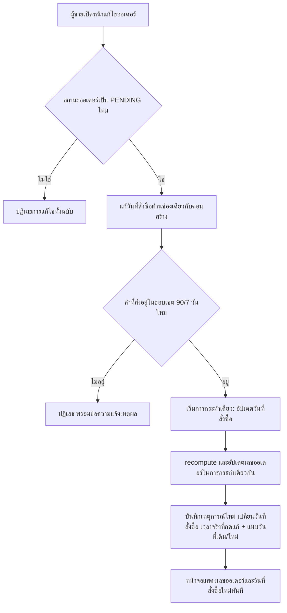

> **โมดูล:** M00033-BackdatedOrderDate
> **ประเภทเอกสาร:** Business Requirements Document (BRD) - NON-TECHNICAL
> **เวอร์ชัน:** 1.0
> **วันที่จัดทำ:** 2026-08-06
> **สถานะ:** Draft — decision D-1..D-7 ล็อกแล้ว รอ user review ก่อน implement
> **เจ้าของเอกสาร:** BA (ดู [[Feature-Docs-Ownership]])

# BRD: เลือกวันที่คำสั่งซื้อย้อนหลัง (Business Requirements Document)

---

## 1. บทนำ

### 1.1 วัตถุประสงค์ของเอกสาร

เอกสารนี้มีวัตถุประสงค์เพื่อ:
1. อธิบายความต้องการเชิงหน้าที่ของการเปิดให้ผู้ขายระบุวันที่-เวลาของคำสั่งซื้อเองได้ทุกหน้าที่สร้าง/แก้ไขออเดอร์ โดยยึดมติที่ user ล็อกไว้แล้ว D-1..D-7
2. กำหนดขอบเขตของก้อนงานหลัก — ช่องวันที่ในฟอร์ม, auto-fill จากแชท, ขอบเขตเวลาที่ยอมรับได้, ผลต่อเลขออเดอร์และรายการ, ประวัติกิจกรรม, และการแก้บั๊ก timezone ที่มีอยู่ก่อน — พร้อมรหัสอ้างอิง `FR-OBD-*`/`BR-OBD-*`
3. ระบุจุดที่ต้องแก้ไขจริงพร้อม path:line ที่ตรวจสอบได้ (อ้างอิงจาก design spec ที่ user อนุมัติแล้ว) ไม่ใช่คำว่า "ทุกจุด" ลอย ๆ
4. ยืนยันว่าประวัติกิจกรรมของออเดอร์ (feature 00031) ต้องไม่ถูกทำให้บิดเบือนโดยฟีเจอร์นี้ — เวลาจริงของเหตุการณ์ต้องยังเป็นหลักฐานที่เชื่อถือได้เสมอ

### 1.2 ขอบเขตของระบบ

**ระบบเลือกวันที่คำสั่งซื้อย้อนหลัง** คือส่วนขยายของฟอร์มสร้าง/แก้ไขออเดอร์และของ service layer ที่เกี่ยวข้อง เปิดให้ผู้ขายกำหนด "วันที่สั่งซื้อ" ของออเดอร์ได้เองแทนที่จะถูกระบบกำหนดให้เป็นเวลาบันทึกเข้าระบบเสมอ — ไม่มีตารางใหม่ ไม่มีฟิลด์ใหม่บน `Order` (ทับค่าลงฟิลด์เวลาบันทึกเดิมโดยตรง) มีเพียงเหตุการณ์ประเภทใหม่ 1 ชนิดในประวัติกิจกรรมของออเดอร์

**เข้าสู่ระบบ (Input):**
- ค่าวันที่-เวลาที่ผู้ขายระบุเองในฟอร์มสร้าง/แก้ไขออเดอร์ (หรือปล่อยเป็นค่าเริ่มต้น = เวลาปัจจุบัน)
- เวลาของข้อความในแชทที่ผู้ขายใช้กดสร้างออเดอร์ (auto-fill)

**ออกจากระบบ (Output):**
- ฟิลด์เวลาบันทึกของออเดอร์ (`Order.createdAt`) ที่สะท้อนวันที่สั่งซื้อจริงที่ผู้ขายระบุ
- เลขออเดอร์ที่สอดคล้องกับเดือน/ปีของวันที่สั่งซื้อจริงเสมอ
- เหตุการณ์ในประวัติกิจกรรมที่บันทึกเวลาจริงของการกระทำ แยกจากวันที่สั่งซื้อที่ผู้ขายเลือก
- ยอดขายที่คำนวณด้วยเวลาไทยที่ถูกต้องในทุกหน้าที่แสดงยอดตามวันที่

**ระบบที่เกี่ยวข้อง:**
- ฟอร์มสร้าง/แก้ไขออเดอร์ฝั่งผู้ขาย (เดสก์ท็อป POS, มือถือ QuickForm, draft จากแชท, หน้าแก้ไขออเดอร์)
- service layer ของการสร้างและแก้ไขออเดอร์
- ประวัติกิจกรรมของออเดอร์ (Activity Log, feature 00031)
- กล่องแชทของผู้ขาย (จุดที่มีปุ่มสร้างออเดอร์จากข้อความ)
- หน้ารายงานยอดขาย/สถิติตามวันที่ (dashboard, `/sales`, P&L `/expenses`, การ์ดสถิติ `/orders`, Command Center)

### 1.3 กลุ่มผู้ใช้งาน

| กลุ่มผู้ใช้ | บทบาท | สิทธิ์การใช้งาน |
|-----------|--------|----------------|
| **แอดมิน/พนักงานร้าน** | สร้าง/แก้ไขออเดอร์ผ่านเดสก์ท็อป มือถือ หรือจากข้อความในแชท | ระบุ/แก้วันที่สั่งซื้อได้เหมือนกันกับสิทธิ์สร้าง/แก้ไขออเดอร์เดิมที่มีอยู่แล้ว ไม่มีระดับสิทธิ์เพิ่มเติม |
| **เจ้าของร้าน** | ดูรายงานยอดขาย/สถิติตามวันที่ | เห็นยอดขายที่ตกวันที่สั่งซื้อจริง ไม่ใช่วันที่บันทึกเข้าระบบ |
| **ผู้ตรวจสอบ (audit)** | ดูประวัติกิจกรรมของออเดอร์ | เห็นเวลาจริงของแต่ละเหตุการณ์แยกจากวันที่สั่งซื้อที่เลือกเสมอ |
| **ผู้ซื้อ** | ดูรายละเอียดออเดอร์ผ่านลิงก์สาธารณะ | เห็นเลขออเดอร์ที่สอดคล้องกับวันที่สั่งซื้อจริง — ไม่ได้รับผลกระทบอื่นจากฟีเจอร์นี้ |

---

## 2. ความต้องการหลัก (Functional Requirements)

### 2.1 ช่องระบุวันที่สั่งซื้อในฟอร์มสร้าง/แก้ไขออเดอร์ (D-5, D-7)

#### FR-OBD-01: ช่องวันที่สั่งซื้อในฟอร์มสร้างออเดอร์ (เดสก์ท็อป POS + มือถือ QuickForm)

**User Story:**
> ในฐานะแอดมิน/พนักงานร้าน ฉันต้องการระบุวันที่-เวลาของคำสั่งซื้อเองได้เมื่อสร้างออเดอร์ ไม่ว่าจะใช้เดสก์ท็อปหรือมือถือ เพื่อให้ยอดขายตกวันที่ที่ลูกค้าสั่งจริง

**Acceptance Criteria:**
- [ ] ฟอร์มสร้างออเดอร์เดสก์ท็อป (`orders/new/components/OrderCreateForm.tsx`) มีช่องวันที่สั่งซื้อในบล็อกสรุปฝั่งขวา ใกล้ช่องทางขาย/การชำระ
- [ ] ฟอร์มสร้างออเดอร์มือถือ (`orders/new/components/QuickForm.tsx`) มีช่องวันที่สั่งซื้อในตำแหน่งเดียวกันของบล็อกสรุป
- [ ] ทั้งสองหน้าใช้ component ช่องวันที่ตัวเดียวกัน (ผ่าน `OrderCreateForm` ที่ render 2 layout) ไม่ implement แยกกัน
- [ ] ค่าเริ่มต้นของช่องคือเวลาปัจจุบัน — ถ้าผู้ขายไม่แตะช่องนี้เลย ฟอร์มไม่ส่งค่าวันที่สั่งซื้อไปกับคำขอสร้างออเดอร์ ทำให้ระบบทำงานเหมือนก่อนมีฟีเจอร์นี้ทุกประการ
- [ ] ผู้ขายแก้ค่าได้ผ่านช่องกรอกวันที่-เวลาที่รับค่าจากเครื่องผู้ใช้ แล้วแปลงเป็นรูปแบบมาตรฐานสากลที่มีระบุเขตเวลากำกับ (ป้องกันการตีความเวลาผิดสองแบบ) ก่อนส่งไปคำขอสร้างออเดอร์

#### FR-OBD-02: ช่องวันที่สั่งซื้อในหน้าแก้ไขออเดอร์ (D-3 — เฉพาะสถานะยังไม่ยืนยัน)

**User Story:**
> ในฐานะแอดมิน/พนักงานร้าน ฉันต้องการแก้ไขวันที่สั่งซื้อของออเดอร์ที่คีย์ผิดไปแล้วได้ ตราบใดที่ออเดอร์นั้นยังไม่ถูกยืนยัน เพื่อแก้ไขความผิดพลาดโดยไม่ต้องลบแล้วสร้างใหม่

**Acceptance Criteria:**
- [ ] หน้าแก้ไขออเดอร์ (`(fullscreen)/orders/[token]/edit/page.tsx`) ใช้ component ช่องวันที่ตัวเดียวกับ FR-OBD-01 โดยโหลดค่าวันที่สั่งซื้อเดิมของออเดอร์มาแสดงเป็นค่าตั้งต้น
- [ ] ออเดอร์ที่ไม่ใช่สถานะยังไม่ยืนยัน (`PENDING`) พยายามแก้วันที่สั่งซื้อ → ถูกปฏิเสธด้วยกฎแก้ไขออเดอร์ที่มีอยู่แล้วของระบบ (ปฏิเสธการแก้ไขทั้งฉบับ ไม่ใช่แค่ฟิลด์นี้) ไม่มีข้อยกเว้นให้ฟิลด์วันที่สั่งซื้อผ่านได้เพียงลำพัง
- [ ] แก้วันที่สั่งซื้อสำเร็จ → ค่าที่บันทึกจริงทับลงฟิลด์เวลาบันทึกเดิมของออเดอร์ตรง ๆ ไม่มีฟิลด์แยก (D-1)

#### FR-OBD-03: หน้าตา control ยุบเป็นแถวสรุป กด "เปลี่ยน" ถึงเปิดช่องกรอก (D-7)

**User Story:**
> ในฐานะผู้ใช้ที่ไม่ต้องการแก้วันที่สั่งซื้อ (ส่วนใหญ่ของการคีย์ออเดอร์) ฉันต้องการไม่เห็นช่องกรอกวันที่รบกวนสายตาตลอดเวลา แต่ยังกดเข้าไปแก้ได้เมื่อจำเป็น

**Acceptance Criteria:**
- [ ] สถานะเริ่มต้นแสดงเป็นแถวสรุปอ่านอย่างเดียว: หัวข้อ "วันที่สั่งซื้อ" + ค่าปัจจุบันที่จัดรูปแบบอ่านง่าย (เช่น "วันนี้ 6 ส.ค. 2569 09:12") + ปุ่ม "เปลี่ยน"
- [ ] กดปุ่ม "เปลี่ยน" แล้วเปิดช่องกรอกวันที่-เวลาพร้อมปุ่ม "ตอนนี้" (รีเซ็ตกลับเป็นเวลาปัจจุบัน) และข้อความบอกขอบเขตย้อนหลังที่เลือกได้ (เช่น "ย้อนหลังได้ถึง 8 พ.ค. 2569")
- [ ] พฤติกรรมนี้เหมือนกันทุกจุดที่มีช่องวันที่สั่งซื้อ (เดสก์ท็อป POS, มือถือ QuickForm, draft จากแชท, หน้าแก้ไขออเดอร์) เพราะทุกจุดใช้ component เดียวกัน

### 2.2 auto-fill เวลาจากข้อความในแชท (D-4)

#### FR-OBD-04: ปุ่มสร้างออเดอร์จากข้อความในแชทเติมเวลาของข้อความให้อัตโนมัติ

**User Story:**
> ในฐานะแอดมิน/พนักงานร้าน ฉันต้องการให้ระบบเติมเวลาของข้อความที่ฉันกดสร้างออเดอร์จากมันให้เป็นวันที่สั่งซื้ออัตโนมัติ เพื่อไม่ต้องเปิดแชทไปมาเพื่อจำเวลาที่ลูกค้าทักมา

**Acceptance Criteria:**
- [ ] กดค้างข้อความบนมือถือ (`ChatThread.tsx:982`) หรือวางเมาส์ค้างบนเดสก์ท็อป (`ChatThread.tsx:1788`) เพื่อสร้างออเดอร์จากข้อความนั้น → เวลาของข้อความ (`ChatMessageView.createdAt`) ถูกส่งเข้า `openDraft` ผ่าน `messageCreatedAt`
- [ ] `DraftOrderProvider` รับค่านี้ (`OpenDraftInput.messageCreatedAt`) แล้วส่งต่อไปยัง `OrderCreateForm` ผ่าน prop `prefillCreatedAt`
- [ ] ช่องวันที่สั่งซื้อในฟอร์มถูกเติมค่าจากเวลาของข้อความอัตโนมัติ พร้อมชิปข้อความ "ใช้เวลาจากข้อความ" ที่มองเห็นได้ทันที
- [ ] ชิปมีปุ่ม "ใช้เวลาตอนนี้แทน" ให้สลับกลับเป็นเวลาปัจจุบันได้
- [ ] ผู้ขายแก้ไขค่าที่เติมอัตโนมัตินี้ได้ต่อผ่านปุ่ม "เปลี่ยน" เหมือน FR-OBD-03 ปกติ
- [ ] ออเดอร์ที่สร้างจาก draft นี้ไม่ถูกผูก reference กลับไปยัง message id ต้นทาง (นอกขอบเขตของฟีเจอร์นี้)

#### FR-OBD-05: ข้อความเก่ากว่า 90 วัน ไม่เติมค่าอัตโนมัติ ใช้เวลาปัจจุบันแทน (fail-closed)

**User Story:**
> ในฐานะแอดมิน/พนักงานร้าน เมื่อฉันกดสร้างออเดอร์จากข้อความเก่ามาก ฉันต้องการให้ระบบใช้เวลาปัจจุบันแทนโดยอัตโนมัติพร้อมบอกเหตุผล แทนที่จะขึ้น error บล็อกไม่ให้สร้างออเดอร์ได้เลย

**Acceptance Criteria:**
- [ ] เมื่อเวลาของข้อความ (`m.createdAt`) เก่ากว่าขอบเขตย้อนหลังที่ระบบรองรับ (90 วัน) → ระบบไม่เติมค่าให้ช่องวันที่สั่งซื้อ ใช้เวลาปัจจุบันเป็นค่าตั้งต้นแทนโดยอัตโนมัติ
- [ ] ชิปเปลี่ยนข้อความเป็น "ข้อความเก่าเกิน 90 วัน — ใช้เวลาปัจจุบัน" แทนข้อความ "ใช้เวลาจากข้อความ"
- [ ] การสร้างออเดอร์ยังดำเนินต่อได้ตามปกติ ไม่มี error ใด ๆ บล็อกงานของผู้ขายจากกรณีนี้

### 2.3 ขอบเขตเวลาที่ยอมรับได้ (D-2)

#### FR-OBD-06: ตรวจสอบขอบเขตวันที่สั่งซื้อ (90 วันย้อนหลัง / 7 วันล่วงหน้า) ทั้งฝั่งที่ผู้ใช้เห็นและฝั่งเซิร์ฟเวอร์

**User Story:**
> ในฐานะผู้ดูแลแพลตฟอร์ม ฉันต้องการให้ระบบปฏิเสธวันที่สั่งซื้อที่หลุดขอบเขตที่กำหนดไว้เสมอ ไม่ว่าคำขอจะมาจากหน้าจอปกติหรือทางอื่น เพื่อป้องกันความผิดพลาดร้ายแรงที่ทำให้รายงานยอดขายเสียหาย

**Acceptance Criteria:**
- [ ] ขอบเขตที่ยอมรับคือ ย้อนหลังได้ **90 วัน** ถึง ล่วงหน้าได้ **7 วัน** นับจากเวลาที่กดบันทึกจริง (ไม่ใช่นับจากเที่ยงคืนของวันปัจจุบัน)
- [ ] นิยามของขอบเขตนี้มาจากแหล่งเดียว (`src/lib/order-date-window.ts`) ที่ทั้งฝั่งที่ผู้ใช้เห็น (จำกัดค่าที่กรอกได้ในช่องกรอก + ข้อความอธิบายใต้ช่อง) และฝั่งเซิร์ฟเวอร์ (การตรวจสอบก่อนบันทึกและ service layer) เรียกใช้ร่วมกัน ไม่มีการคำนวณซ้ำที่อื่นด้วยนิยามของตัวเอง
- [ ] คำขอสร้างหรือแก้ไขออเดอร์ที่ระบุวันที่สั่งซื้อนอกขอบเขต ถูกปฏิเสธที่ฝั่งเซิร์ฟเวอร์ด้วยข้อความแจ้งเหตุผลเฉพาะเจาะจง ("วันที่คำสั่งซื้อต้องอยู่ระหว่าง 90 วันย้อนหลังถึง 7 วันล่วงหน้า") ไม่ปรับค่าให้เข้าขอบเขตแบบเงียบ ๆ
- [ ] การตรวจสอบขอบเขตนี้ครอบคลุมทั้งคำขอสร้างออเดอร์ใหม่และคำขอแก้ไขออเดอร์ที่มีอยู่แล้ว

### 2.4 ผลต่อเลขออเดอร์และรายการ

#### FR-OBD-07: เลขออเดอร์สอดคล้องกับวันที่สั่งซื้อเสมอ แม้แก้ไขวันที่ทีหลัง

**User Story:**
> ในฐานะแอดมิน/พนักงานร้าน เมื่อฉันแก้วันที่สั่งซื้อของออเดอร์จนข้ามเดือน ฉันต้องการให้เลขออเดอร์ที่เห็นบนจอตรงกับวันที่สั่งซื้อใหม่เสมอ เพื่อค้นหาและอ้างอิงได้ถูกต้อง

**Acceptance Criteria:**
- [ ] ตอนสร้างออเดอร์ เลขออเดอร์คำนวณจากวันที่สั่งซื้อที่ระบุโดยอัตโนมัติ (สอดคล้องกับกลไกเดิมที่คำนวณเลขออเดอร์จากค่าที่เพิ่งบันทึกลงฐานข้อมูล)
- [ ] ตอนแก้ไขวันที่สั่งซื้อของออเดอร์ที่มีอยู่แล้วจนทำให้เดือนหรือปีเปลี่ยน — คอลัมน์เลขออเดอร์ที่เก็บไว้ต้องถูกคำนวณใหม่และบันทึกทับในการกระทำเดียวกันกับการแก้วันที่ (ไม่ใช่ 2 ขั้นตอนแยกที่อาจสำเร็จไม่พร้อมกัน)
- [ ] ส่วนของเลขออเดอร์ที่เป็นรหัสเฉพาะของออเดอร์แต่ละใบ (โค้ด 8 หลักท้ายที่ผู้ซื้อเห็นเป็นรหัสอ้างอิง) ไม่เปลี่ยนแปลงแม้วันที่สั่งซื้อจะถูกแก้ — เปลี่ยนแปลงเฉพาะส่วนที่บ่งบอกปี/เดือนเท่านั้น
- [ ] ทุกหน้าที่แสดงเลขออเดอร์ (การ์ดออเดอร์, ตารางออเดอร์, ใบ QR, หน้ารายละเอียดออเดอร์สาธารณะที่ผู้ซื้อเห็น) แสดงเลขที่ตรงกับคอลัมน์ที่บันทึกไว้จริง ไม่มีจุดใดค้างแสดงเลขเดือนเก่าหลังแก้วันที่แล้ว

#### FR-OBD-08: แจ้งเตือนเมื่อบันทึกออเดอร์ที่วันที่สั่งซื้อไม่ใช่วันนี้

**User Story:**
> ในฐานะแอดมิน/พนักงานร้าน เมื่อฉันบันทึกออเดอร์ที่ลงวันที่ย้อนหลัง ฉันต้องการรู้ทันทีว่าออเดอร์นี้จะไปอยู่ตรงไหนของรายการ เพื่อไม่ต้องเข้าใจผิดว่าบันทึกไม่สำเร็จแล้วคีย์ซ้ำ

**Acceptance Criteria:**
- [ ] บันทึกออเดอร์สำเร็จ และวันที่สั่งซื้อที่เลือก ≠ วันนี้ (เทียบตามเวลาไทย) → แสดงข้อความแจ้งเตือนที่ระบุวันที่ที่บันทึกจริงและบอกว่าออเดอร์นี้อยู่ในส่วนย้อนหลังของรายการ
- [ ] วันที่สั่งซื้อที่เลือก = วันนี้ → แสดงข้อความบันทึกสำเร็จตามปกติ ไม่มีข้อความเพิ่มเติม
- [ ] การเรียงลำดับรายการออเดอร์ยังคงเรียงตามวันที่สั่งซื้อจากใหม่ไปเก่าเหมือนเดิมทุกประการ ไม่มีการเปลี่ยนพฤติกรรมการเรียงหรือแบ่งหน้าของรายการ

### 2.5 ประวัติกิจกรรม (Activity Log) ต้องแยกเวลาจริงจากวันที่สั่งซื้อ

#### FR-OBD-09: เหตุการณ์ "สร้างคำสั่งซื้อ" บันทึกเวลาจริงที่กดสร้างเสมอ พร้อมแนบวันที่สั่งซื้อเมื่อต่างกัน

**User Story:**
> ในฐานะผู้ตรวจสอบ ฉันต้องการเห็นเวลาจริงที่มีคนกดสร้างออเดอร์แยกจากวันที่สั่งซื้อที่ผู้ขายเลือก เพื่อให้ประวัติกิจกรรมยังเป็นหลักฐานที่เชื่อถือได้แม้ออเดอร์นั้นถูกลงวันที่ย้อนหลัง

**Acceptance Criteria:**
- [ ] 🛑 เหตุการณ์ "สร้างคำสั่งซื้อ" ในประวัติกิจกรรม บันทึกเวลาที่เกิดเหตุการณ์เป็นเวลาจริงที่มีคนกดสร้างออเดอร์ (จับค่าเวลาไว้ก่อนเริ่มกระบวนการบันทึกลงฐานข้อมูล) **ไม่ใช่** วันที่สั่งซื้อที่ผู้ขายระบุ
- [ ] เมื่อวันที่สั่งซื้อที่เลือก ≠ เวลาที่กดสร้างจริง → เหตุการณ์นี้แนบวันที่สั่งซื้อไว้เป็นข้อมูลประกอบเพิ่มเติม
- [ ] เมื่อวันที่สั่งซื้อที่เลือก = เวลาที่กดสร้างจริง (ไม่ backdate) → ไม่มีข้อมูลประกอบเพิ่มเติมส่วนนี้ (พฤติกรรมเดิมก่อนฟีเจอร์นี้)
- [ ] หน้าจอที่แสดงประวัติกิจกรรม แสดงเวลาจริงที่กดสร้างเป็นเวลาหลัก และแสดงวันที่สั่งซื้อเป็นข้อความบรรทัดรองเมื่อมีข้อมูลประกอบนี้แนบมา (เช่น "สร้างคำสั่งซื้อ — โดย ปรียา · 6 ส.ค. 2569 09:12 น." พร้อมบรรทัดรอง "ลงวันที่สั่งซื้อ 5 ส.ค. 2569 21:14 น.")

#### FR-OBD-10: เหตุการณ์ประเภทใหม่ "เปลี่ยนวันที่สั่งซื้อ" เมื่อแก้ไขวันที่ของออเดอร์ที่มีอยู่แล้ว

**User Story:**
> ในฐานะผู้ตรวจสอบ ฉันต้องการเห็นบันทึกแยกทุกครั้งที่มีการแก้วันที่สั่งซื้อของออเดอร์ เพราะการเปลี่ยนวันที่มีผลย้ายยอดขายข้ามงวดบัญชี ซึ่งเป็นเรื่องที่ต้องแยกออกจากการแก้ไขข้อมูลทั่วไป เช่น ที่อยู่หรือชื่อลูกค้า

**Acceptance Criteria:**
- [ ] แก้วันที่สั่งซื้อของออเดอร์ที่มีอยู่แล้วสำเร็จ → บันทึกเหตุการณ์ประเภทใหม่ (แยกจากเหตุการณ์ "แก้ไขคำสั่งซื้อ" ทั่วไป) ด้วยเวลาที่เกิดเหตุการณ์ = เวลาจริงที่กดแก้
- [ ] เหตุการณ์นี้แนบวันที่สั่งซื้อเดิมและวันที่สั่งซื้อใหม่ไว้เป็นข้อมูลประกอบ ทั้งคู่เป็นค่าที่ตรวจสอบย้อนกลับได้
- [ ] ค่าประเภทเหตุการณ์ใหม่นี้ถูกเพิ่มเข้าไปในรายการประเภทเหตุการณ์ที่ระบบรู้จักทั้งหมด และเข้ากันได้กับข้อจำกัดของฐานข้อมูลที่ควบคุมค่าที่ยอมรับได้ของคอลัมน์ประเภทเหตุการณ์
- [ ] เหตุการณ์นี้**ไม่ถูกยุบรวม**เข้ากับเหตุการณ์ "แก้ไขคำสั่งซื้อ" ทั่วไป — แสดงแยกในประวัติกิจกรรมเสมอ

### 2.6 แก้ไขบั๊กการคำนวณวันที่ด้วย UTC ที่มีอยู่ก่อน (D-6)

#### FR-OBD-11: หน้ารายงานยอดขาย/สถิติตามวันที่คำนวณด้วยเวลาไทยที่ถูกต้อง

**User Story:**
> ในฐานะเจ้าของร้าน ฉันต้องการให้ยอดขายในหน้ารายงานตกวันที่ถูกต้องตามเวลาไทยเสมอ แม้ออเดอร์จะถูกบันทึกในช่วงหลังเที่ยงคืนถึงเช้าตรู่ก็ตาม

**Acceptance Criteria:**
- [ ] หน้ารายงานยอดขาย (`seller/(dashboard)/sales/page.tsx`) เลิกคำนวณ "วันที่" ของออเดอร์ด้วยวิธีที่อ้างอิงเวลาสากล (UTC) ตรง ๆ เปลี่ยนไปใช้กลไกคำนวณเวลาไทยเดียวกับที่ระบบใช้อยู่แล้วในจุดอื่น (เช่นเดียวกับที่ dashboard และรายงานกำไรขาดทุนคำนวณถูกต้องอยู่แล้ว)
- [ ] ช่วงวันที่ (จาก-ถึง) ที่ใช้กรองข้อมูลในหน้ารายงานยอดขาย คำนวณจากกลไกเวลาไทยเดียวกัน ไม่คำนวณเองแยกต่างหาก
- [ ] การ์ดสถิติในหน้า `seller/(dashboard)/orders/page.tsx` เลิกคำนวณวันที่ด้วยวิธีที่สมมติว่าเซิร์ฟเวอร์ทำงานด้วย UTC เปลี่ยนไปใช้กลไกเวลาไทยเดียวกัน
- [ ] ทดสอบเฉพาะกรณีออเดอร์ที่บันทึกเวลาช่วง 00:00–07:00 น. ตามเวลาไทย ต้องถูกนับเป็นวันที่ไทยที่ถูกต้อง (ไม่ตกไปนับเป็นวันก่อนหน้า) ในทุกหน้าที่ระบุไว้ข้างต้น

---

## 3. Acceptance Criteria สรุป

### 3.1 ช่องระบุวันที่สั่งซื้อในทุกหน้าที่สร้าง/แก้ไขออเดอร์

**เมื่อระบบทำงานถูกต้อง:**
- ✅ ทุกหน้าที่สร้าง/แก้ไขออเดอร์ (เดสก์ท็อป POS, มือถือ QuickForm, draft จากแชท, หน้าแก้ไขออเดอร์) มีช่องวันที่สั่งซื้อจาก component เดียวกัน
- ✅ ไม่แตะช่องนี้เลย = พฤติกรรมเดิมทุกประการ ไม่มี regression
- ✅ แก้ทีหลังได้เฉพาะออเดอร์สถานะยังไม่ยืนยัน (`PENDING`) เท่านั้น

### 3.2 auto-fill จากข้อความในแชท

**เมื่อระบบทำงานถูกต้อง:**
- ✅ กดสร้างออเดอร์จากข้อความในแชท (อายุไม่เกิน 90 วัน) → ช่องวันที่สั่งซื้อเติมค่าเวลาของข้อความอัตโนมัติ พร้อมป้ายบอกที่มา
- ✅ ข้อความเก่ากว่า 90 วัน → ไม่เติมค่า ใช้เวลาปัจจุบันแทน พร้อมป้ายบอกเหตุผล ไม่มี error บล็อกงาน
- ✅ ผู้ขายแก้ไขค่าที่เติมอัตโนมัติได้เสมอ

### 3.3 ขอบเขตเวลาที่ยอมรับได้

**เมื่อระบบทำงานถูกต้อง:**
- ✅ ค่าที่อยู่นอกขอบเขต 90 วันย้อนหลัง/7 วันล่วงหน้า ถูกปฏิเสธด้วยข้อความชัดเจนทั้งฝั่งสร้างและแก้ไขออเดอร์ ไม่ใช่ 500
- ✅ นิยามขอบเขตมาจากแหล่งเดียวทั้งฝั่งที่ผู้ใช้เห็นและฝั่งเซิร์ฟเวอร์

### 3.4 เลขออเดอร์และรายการ

**เมื่อระบบทำงานถูกต้อง:**
- ✅ เลขออเดอร์สอดคล้องกับวันที่สั่งซื้อจริงเสมอ แม้แก้ไขวันที่ข้ามเดือนทีหลัง
- ✅ รหัสเฉพาะของออเดอร์แต่ละใบไม่เปลี่ยนแม้แก้วันที่สั่งซื้อ
- ✅ บันทึกออเดอร์ที่วันที่สั่งซื้อไม่ใช่วันนี้ → ได้รับการแจ้งเตือนทันทีว่าอยู่ในรายการย้อนหลัง

### 3.5 ประวัติกิจกรรม

**เมื่อระบบทำงานถูกต้อง:**
- ✅ เวลาของเหตุการณ์ "สร้างคำสั่งซื้อ" เป็นเวลาจริงที่กดสร้างเสมอ ไม่ใช่วันที่สั่งซื้อที่เลือก แม้สองค่าต่างกันมาก
- ✅ วันที่สั่งซื้อที่ต่างจากเวลาที่กดสร้างจริง ถูกแนบเป็นข้อมูลประกอบให้เห็น
- ✅ แก้วันที่สั่งซื้อทีหลัง → มีเหตุการณ์ใหม่แยกต่างหากในประวัติกิจกรรม ไม่ปะปนกับการแก้ไขข้อมูลทั่วไป

### 3.6 การไม่กระทบระบบเดิม (Zero-Regression)

**เมื่อระบบทำงานถูกต้อง:**
- ✅ ไม่มีการเพิ่มฟิลด์ใหม่บน `Order` — วันที่สั่งซื้อทับค่าลงฟิลด์เวลาบันทึกเดิมโดยตรง
- ✅ ทางสร้างออเดอร์ที่ไม่ผ่านฟอร์มนี้ (booking/auction/iShip import) ไม่ได้รับผลกระทบใด ๆ
- ✅ การตัดสต็อก การเปิดพัสดุ iShip และค่าใช้จ่ายที่เกี่ยวข้อง ยังคงใช้เวลาปัจจุบันเสมอ ไม่ย้อนตามวันที่สั่งซื้อ
- ✅ ไม่มีการกำหนดสิทธิ์แยกตามบทบาทสำหรับการลงวันที่ย้อนหลัง

---

## 4. Business Flows (กระบวนการทำงาน)

### 4.1 Flow หลัก: สร้างออเดอร์พร้อมระบุวันที่สั่งซื้อ

```mermaid
flowchart TD
    A[ผู้ขายเปิดฟอร์มสร้างออเดอร์] --> B[ช่องวันที่สั่งซื้อแสดงแถวสรุป = เวลาปัจจุบัน]
    B --> C{กดปุ่ม "เปลี่ยน" ไหม}
    C -- ไม่กด --> D[ใช้เวลาปัจจุบันเป็นวันที่สั่งซื้อ]
    C -- กด --> E[เปิดช่องกรอก จำกัดค่าในขอบเขต 90 วันย้อนหลัง ถึง 7 วันล่วงหน้า]
    E --> F[ผู้ขายกรอกวันที่-เวลาที่ต้องการ]
    D --> G[กดบันทึก]
    F --> G
    G --> H{ค่าที่ส่งอยู่ในขอบเขตไหม เซิร์ฟเวอร์ตรวจซ้ำ}
    H -- ไม่อยู่ --> I[ปฏิเสธ พร้อมข้อความแจ้งเหตุผล ไม่บันทึก]
    H -- อยู่ --> J[บันทึกออเดอร์ วันที่สั่งซื้อทับลงฟิลด์เวลาบันทึกเดิม]
    J --> K[คำนวณเลขออเดอร์จากวันที่สั่งซื้อ]
    K --> L[บันทึกเหตุการณ์ ORDER_CREATED เวลาจริงที่กดสร้าง]
    L --> M{วันที่สั่งซื้อ ≠ วันนี้ไหม}
    M -- ใช่ --> N[แจ้งเตือนว่าอยู่ในรายการย้อนหลัง]
    M -- ไม่ใช่ --> O[แจ้งบันทึกสำเร็จตามปกติ]
```

### 4.2 Flow: auto-fill เวลาจากข้อความในแชท

```mermaid
flowchart TD
    A[ผู้ขายกดสร้างออเดอร์จากข้อความในแชท] --> B[ระบบอ่านเวลาของข้อความที่มีอยู่แล้ว]
    B --> C{เวลาของข้อความเก่ากว่า 90 วันไหม}
    C -- ไม่เกิน --> D[เติมช่องวันที่สั่งซื้อ = เวลาของข้อความ]
    D --> E[แสดงชิป "ใช้เวลาจากข้อความ" พร้อมปุ่มสลับเป็นเวลาปัจจุบัน]
    C -- เกิน --> F[เติมช่องวันที่สั่งซื้อ = เวลาปัจจุบัน]
    F --> G[แสดงชิป "ข้อความเก่าเกิน 90 วัน — ใช้เวลาปัจจุบัน"]
    E --> H[ผู้ขายแก้ไขต่อได้ หรือกดบันทึกตามค่าที่เติมให้]
    G --> H
```

### 4.3 Flow: แก้ไขวันที่สั่งซื้อทีหลัง และผลต่อเลขออเดอร์/ประวัติกิจกรรม



---

## 5. Use Case Scenarios (สถานการณ์การใช้งานจริง)

### Scenario 1: แอดมินคีย์ออเดอร์เช้าวันรุ่งขึ้นจากแชทเมื่อคืน (Best Case)

**ผู้เกี่ยวข้อง:** แอดมิน/พนักงานร้าน

**เงื่อนไขเริ่มต้น:**
- มีข้อความในแชทที่ลูกค้าทักสั่งซื้อเมื่อคืนเวลา 21:14 น.

**ขั้นตอน:**
1. เช้าวันรุ่งขึ้นเวลา 09:12 น. แอดมินกดสร้างออเดอร์จากข้อความนั้น
2. ช่องวันที่สั่งซื้อเติมค่าอัตโนมัติเป็นเวลาของข้อความ พร้อมชิป "ใช้เวลาจากข้อความ"
3. แอดมินตรวจสอบแล้วกดบันทึกโดยไม่แก้ไขเพิ่ม

**ผลลัพธ์:**
- ออเดอร์บันทึกด้วยวันที่สั่งซื้อ = เวลาของข้อความ (21:14 น. เมื่อคืน) ไม่ใช่เวลาที่แอดมินกดบันทึกจริง
- ประวัติกิจกรรมแสดง "สร้างคำสั่งซื้อ · 09:12 น." เป็นเวลาหลัก พร้อมบรรทัดรอง "ลงวันที่สั่งซื้อ ... 21:14 น."
- ยอดขายของออเดอร์นี้ปรากฏในรายงานของวันที่ลูกค้าสั่งจริง

### Scenario 2: กรอกวันที่สั่งซื้อเกินขอบเขตที่กำหนด (Edge Case)

**ผู้เกี่ยวข้อง:** แอดมิน/พนักงานร้าน

**เงื่อนไขเริ่มต้น:**
- อยู่ในฟอร์มสร้างออเดอร์ กดปุ่ม "เปลี่ยน" เปิดช่องกรอกวันที่แล้ว

**ขั้นตอน:**
1. พยายามกรอกวันที่สั่งซื้อที่ย้อนหลังเกิน 90 วัน (หรือส่งคำขอตรงข้ามหน้าจอปกติที่ระบุค่าลักษณะนี้)
2. กดบันทึก

**ผลลัพธ์:**
- ระบบปฏิเสธคำขอที่ฝั่งเซิร์ฟเวอร์ด้วยข้อความแจ้งเหตุผลชัดเจน ไม่บันทึกออเดอร์ ไม่ปรับค่าให้เข้าขอบเขตแบบเงียบ ๆ

### Scenario 3: สร้างออเดอร์จากข้อความแชทที่เก่าเกิน 90 วัน (Edge Case)

**ผู้เกี่ยวข้อง:** แอดมิน/พนักงานร้าน

**เงื่อนไขเริ่มต้น:**
- มีข้อความเก่าในแชทที่อายุเกิน 90 วัน

**ขั้นตอน:**
1. กดสร้างออเดอร์จากข้อความนั้น

**ผลลัพธ์:**
- ระบบไม่เติมเวลาของข้อความให้ ใช้เวลาปัจจุบันเป็นค่าตั้งต้นแทนโดยอัตโนมัติ พร้อมชิปแจ้งเหตุผล
- การสร้างออเดอร์ยังดำเนินการต่อได้ตามปกติ ไม่มี error บล็อกงาน

### Scenario 4: พยายามแก้วันที่สั่งซื้อของออเดอร์ที่ยืนยันแล้ว (Edge Case)

**ผู้เกี่ยวข้อง:** แอดมิน/พนักงานร้าน

**เงื่อนไขเริ่มต้น:**
- ออเดอร์มีสถานะ `CONFIRMED` (ยืนยันแล้ว) หรือสถานะอื่นที่ไม่ใช่ `PENDING`

**ขั้นตอน:**
1. เข้าหน้าแก้ไขออเดอร์ พยายามแก้วันที่สั่งซื้อ

**ผลลัพธ์:**
- ระบบปฏิเสธการแก้ไขทั้งฉบับ ด้วยกฎแก้ไขออเดอร์ที่มีอยู่แล้วของระบบ ไม่มีการบันทึกค่าใด ๆ

### Scenario 5: แก้วันที่สั่งซื้อข้ามเดือน — เลขออเดอร์และประวัติกิจกรรม (Best Case ต่อเนื่อง)

**ผู้เกี่ยวข้อง:** แอดมิน/พนักงานร้าน, ผู้ตรวจสอบ

**เงื่อนไขเริ่มต้น:**
- ออเดอร์สถานะ `PENDING` ถูกสร้างไว้ด้วยวันที่สั่งซื้อในเดือนสิงหาคม

**ขั้นตอน:**
1. แอดมินพบว่ากรอกผิด ที่จริงลูกค้าสั่งช่วงปลายเดือนกรกฎาคม จึงเข้าหน้าแก้ไขออเดอร์แก้วันที่สั่งซื้อเป็นเดือนกรกฎาคม
2. ระบบตรวจว่าค่าที่กรอกอยู่ในขอบเขต 90/7 วัน แล้วบันทึก

**ผลลัพธ์:**
- เลขออเดอร์ที่แสดงในทุกหน้าจอเปลี่ยนสะท้อนเดือนกรกฎาคมทันที รหัสเฉพาะของออเดอร์ (8 หลักท้าย) ไม่เปลี่ยน
- ประวัติกิจกรรมมีเหตุการณ์ใหม่ "เปลี่ยนวันที่สั่งซื้อ" บันทึกด้วยเวลาจริงที่กดแก้ พร้อมแนบวันที่เดิมและวันที่ใหม่
- ยอดขายของออเดอร์นี้ย้ายจากรายงานเดือนสิงหาคมไปเดือนกรกฎาคม

### Scenario 6: ยอดขายข้ามเที่ยงคืนแสดงถูกต้องหลังแก้บั๊ก timezone (Zero-Regression / Bug Fix)

**ผู้เกี่ยวข้อง:** เจ้าของร้าน

**เงื่อนไขเริ่มต้น:**
- มีออเดอร์ที่วันที่สั่งซื้อตกอยู่ในช่วง 00:30 น. ตามเวลาไทย

**ขั้นตอน:**
1. เจ้าของร้านเปิดหน้า `/sales` และการ์ดสถิติที่ `/orders` เพื่อดูยอดขายของวันนั้น

**ผลลัพธ์:**
- ออเดอร์เวลา 00:30 น. ถูกนับเป็นยอดของวันที่ไทยที่ถูกต้อง ไม่ตกไปนับเป็นยอดของวันก่อนหน้าเหมือนก่อนแก้บั๊กนี้

---

## 6. ความต้องการด้านคุณภาพ (Quality Requirements)

### 6.1 ความถูกต้องของข้อมูล
- ยอดขายที่แสดงในทุกหน้ารายงาน (dashboard, `/sales`, P&L, การ์ดสถิติ `/orders`, Command Center) ต้องตรงกับวันที่สั่งซื้อที่ผู้ขายระบุ 100% ไม่มีข้อยกเว้น
- เลขออเดอร์ต้องตรงกับเดือน/ปีของวันที่สั่งซื้อจริงเสมอ แม้หลังการแก้ไขวันที่หลายครั้ง

### 6.2 ความรวดเร็ว
- การตรวจสอบขอบเขตวันที่ฝั่งที่ผู้ใช้เห็นต้องเกิดขึ้นทันทีในหน้าจอ (ไม่ต้องรอ round-trip ไปเซิร์ฟเวอร์ก่อนจึงรู้ว่าค่าที่กรอกใช้ได้หรือไม่) แม้เซิร์ฟเวอร์จะตรวจซ้ำอีกชั้นเป็นด่านสุดท้ายเสมอ
- คำถามขั้นเปิดช่องกรอก (กด "เปลี่ยน") ต้องเผยขึ้นทันทีในหน้าเดิม ไม่โหลดหน้าใหม่

### 6.3 ความน่าเชื่อถือ
- ประวัติกิจกรรมของออเดอร์ต้องคงความหมายเป็นหลักฐานที่เชื่อถือได้ต่อไป — เวลาที่บันทึกไว้ต้องเป็นเวลาจริงที่เกิดการกระทำเสมอ ไม่ถูกทำให้เปลี่ยนแปลงได้ทางอ้อมผ่านค่าที่ผู้ใช้กรอกเป็นวันที่สั่งซื้อ
- ทุกครั้งที่มีการแก้วันที่สั่งซื้อ ต้องมีร่องรอยในประวัติกิจกรรมให้ตรวจสอบย้อนกลับได้เสมอว่าใครแก้ เมื่อไหร่ จากค่าอะไรเป็นค่าอะไร

### 6.4 ความปลอดภัย
- การตรวจสอบขอบเขตวันที่ต้องบังคับใช้ที่ฝั่งเซิร์ฟเวอร์เสมอ ไม่พึ่งการจำกัดค่าที่กรอกได้ฝั่งที่ผู้ใช้เห็นเพียงอย่างเดียว เพราะคำขออาจมาจากทางอื่นที่ไม่ผ่านหน้าจอปกติ
- ไม่มีการกำหนดสิทธิ์แยกตามบทบาทสำหรับการลงวันที่ย้อนหลัง — ผู้ที่มีสิทธิ์สร้าง/แก้ไขออเดอร์อยู่แล้วเท่านั้นที่เข้าถึงความสามารถนี้ได้ ไม่มีช่องทางใหม่ที่เปิดสิทธิ์เพิ่ม

### 6.5 ความสะดวกในการใช้งาน (Usability)
- control ของช่องวันที่สั่งซื้อต้องไม่เพิ่มภาระสายตาให้กับกรณีการใช้งานส่วนใหญ่ (ที่ไม่ต้องการแก้ไขอะไร) — ต้องยุบเป็นแถวสรุปที่อ่านง่ายเป็นค่าตั้งต้นเสมอ
- ป้ายและข้อความที่เกี่ยวกับวันที่สั่งซื้อ (ชิปจากข้อความแชท, ข้อความแจ้งขอบเขต, ข้อความแจ้งเตือนหลังบันทึก) ต้องสื่อความชัดเจนพอที่ผู้ใช้ไม่ต้องเดา

---

## 7. ข้อจำกัด (Constraints)

### 7.1 ข้อจำกัดทางธุรกิจ
- ไม่เพิ่มฟิลด์ `orderedAt` แยกต่างหากบนออเดอร์ — วันที่สั่งซื้อทับค่าลงฟิลด์เวลาบันทึกเดิมโดยตรง (D-1)
- ไม่ย้อนวันที่ให้การตัดสต็อก การเปิดพัสดุ iShip หรือค่าใช้จ่ายที่เกี่ยวข้อง — ยังคงใช้เวลาปัจจุบันเสมอ
- ไม่แตะทางสร้างออเดอร์ที่ไม่ผ่านฟอร์มนี้ (booking / auction / iShip import)
- ไม่ผูกออเดอร์กลับไปยังข้อความต้นทางในแชท
- ไม่มีการกำหนดสิทธิ์แยกตามบทบาทสำหรับการลงวันที่ย้อนหลัง

### 7.2 ข้อจำกัดทางเทคนิค
- นิยามขอบเขตวันที่ (90 วันย้อนหลัง/7 วันล่วงหน้า) ต้องมาจากแหล่งเดียว ทั้งฝั่งที่ผู้ใช้เห็นและฝั่งเซิร์ฟเวอร์ ห้ามคำนวณซ้ำที่อื่นด้วยนิยามของตัวเอง
- เหตุการณ์ประเภทใหม่ในประวัติกิจกรรมต้องเข้ากันได้กับข้อจำกัดของฐานข้อมูลที่ควบคุมค่าที่ยอมรับได้ของคอลัมน์ประเภทเหตุการณ์ ซึ่งเป็นข้อจำกัดที่จัดการนอกกลไก migration อัตโนมัติทั่วไป
- งานนี้แตะ UI หลายจุด (ฟอร์มสร้าง/แก้ไขออเดอร์, draft จากแชท) — ต้องผ่าน `safepay-ux` gate ก่อนแตะโค้ดฝั่งหน้าจอ (Hard Rule 8)
- คำสั่งที่ปรับโครงสร้างฐานข้อมูล (เพื่อรองรับเหตุการณ์ประเภทใหม่) ที่ถูก merge เข้าสาขาหลักจะถูกนำไปใช้กับฐานข้อมูลจริงโดยอัตโนมัติเมื่อ deploy — ต้องแจ้ง user ก่อนดำเนินการทุกครั้งตามข้อกำหนดของโครงการ
- เทสที่เขียนขึ้นเพื่อยืนยันพฤติกรรมนี้ ห้ามมีคำสั่งลบข้อมูลแบบไม่จำกัดขอบเขตในฐานข้อมูลทดสอบ ต้องจำกัดด้วยตัวระบุที่เทสสร้างขึ้นเองเท่านั้น

---

## 8. กฎทางธุรกิจ (Business Rules)

### 8.1 ขอบเขตการเก็บค่า (D-1)

- **BR-OBD-01** วันที่สั่งซื้อเก็บทับลงฟิลด์เวลาบันทึกเดิมของออเดอร์โดยตรง — ไม่มีฟิลด์แยกต่างหากสำหรับ "วันที่สั่งซื้อ" ในตารางออเดอร์
- **BR-OBD-02** ฟิลด์เวลาบันทึกของออเดอร์ผูก 3 อย่างพร้อมกันเสมอ — เลขออเดอร์ / ลำดับในรายการ / ยอดขาย — เคลื่อนไปพร้อมกันทุกครั้งที่ค่านี้ถูกกำหนดหรือแก้ไข

### 8.2 ช่วงเวลาที่ยอมรับได้ (D-2)

- **BR-OBD-03** ช่วงที่ยอมรับ = ย้อนหลัง **90 วัน** ถึง ล่วงหน้า **7 วัน** นับจากเวลาที่กดบันทึก ไม่ใช่นับจากเที่ยงคืนของวันปัจจุบันคงที่
- **BR-OBD-04** การตรวจสอบขอบเขตต้องทำทั้งฝั่งที่ผู้ใช้เห็นและฝั่งเซิร์ฟเวอร์ ด้วยฟังก์ชันจากแหล่งเดียวกัน ห้ามคำนวณซ้ำที่อื่นด้วยนิยามของตัวเอง
- **BR-OBD-05** ค่าที่อยู่นอกขอบเขตต้องถูกปฏิเสธที่ฝั่งเซิร์ฟเวอร์ด้วย error เฉพาะเจาะจง ห้าม clamp ค่าให้เข้าขอบเขตแบบเงียบ ๆ

### 8.3 สิทธิ์การแก้ไข (D-3)

- **BR-OBD-06** แก้วันที่สั่งซื้อทีหลังได้เฉพาะออเดอร์สถานะ **ยังไม่ยืนยัน (`PENDING`)** เท่านั้น — ตามกฎแก้ไขออเดอร์ที่มีอยู่แล้วของระบบ ไม่มีข้อยกเว้นพิเศษสำหรับฟิลด์นี้
- **BR-OBD-07** ไม่มีการแยกสิทธิ์ว่าใครลงย้อนหลังได้ — ผู้ใช้ที่สร้าง/แก้ไขออเดอร์ได้ก็ระบุ/แก้วันที่สั่งซื้อได้เหมือนกันหมด ความรับผิดชอบตรวจสอบผ่านประวัติกิจกรรมแทนการจำกัดสิทธิ์

### 8.4 การ auto-fill จากแชท (D-4)

- **BR-OBD-08** ปุ่มสร้างออเดอร์จากข้อความแชทต้องเติมเวลาของข้อความให้เป็นวันที่สั่งซื้อโดยอัตโนมัติเสมอ พร้อมป้ายบอกที่มาที่มองเห็นได้ชัดเจน และแก้ไขได้ต่อเสมอ
- **BR-OBD-09** ข้อความที่เก่ากว่าขอบเขตย้อนหลัง (90 วัน) ต้อง fail-closed — ไม่เติมค่าให้ ใช้เวลาปัจจุบันแทนโดยอัตโนมัติ พร้อมป้ายบอกเหตุผล ห้ามขึ้น error บล็อกการสร้างออเดอร์

### 8.5 ผลต่อเลขออเดอร์และรายการ

- **BR-OBD-10** เลขออเดอร์ต้องสอดคล้องกับวันที่สั่งซื้อเสมอ — แก้วันที่จนเดือน/ปีเปลี่ยน ต้อง recompute และบันทึกเลขออเดอร์ใหม่ในการกระทำเดียวกันกับการแก้วันที่ ไม่แยกเป็นสองขั้นตอน
- **BR-OBD-11** รหัสเฉพาะของออเดอร์แต่ละใบ (ส่วนที่ผู้ซื้อเห็นเป็นโค้ดอ้างอิง) ต้องไม่เปลี่ยนแม้แก้วันที่สั่งซื้อ — เปลี่ยนแปลงได้เฉพาะส่วนที่บ่งบอกปี/เดือนของเลขออเดอร์เท่านั้น
- **BR-OBD-12** การเรียงลำดับรายการออเดอร์ยังคงเรียงตามวันที่สั่งซื้อจากใหม่ไปเก่าเหมือนเดิม — ออเดอร์ย้อนหลังจะไม่อยู่หัวรายการโดยเจตนา (เพราะเป็นความหมายที่ถูกต้องของการเรียง)
- **BR-OBD-13** บันทึกออเดอร์ที่วันที่สั่งซื้อไม่ใช่วันนี้ ต้องแจ้งผู้ใช้ทันทีว่าอยู่ในรายการย้อนหลัง เพื่อป้องกันการคีย์ซ้ำเพราะเข้าใจผิดว่าบันทึกไม่สำเร็จ

### 8.6 หลักฐาน — ประวัติกิจกรรม

- **BR-OBD-14** 🛑 เวลาของทุกเหตุการณ์ในประวัติกิจกรรมของออเดอร์ต้องเป็นเวลาจริงที่การกระทำนั้นเกิดขึ้นเสมอ ห้ามย้อนตามวันที่สั่งซื้อที่ผู้ขายกรอกไม่ว่ากรณีใด — ประวัติคือหลักฐานว่าใครทำอะไรเมื่อไหร่จริง
- **BR-OBD-15** วันที่สั่งซื้อเป็นคุณสมบัติของออเดอร์ ไม่ใช่ของเหตุการณ์ — เก็บเป็นข้อมูลประกอบของเหตุการณ์ "สร้างคำสั่งซื้อ" เมื่อค่านี้ต่างจากเวลาที่กดสร้างจริงเท่านั้น
- **BR-OBD-16** การแก้วันที่สั่งซื้อทีหลังต้องบันทึกเป็นเหตุการณ์ประเภทใหม่แยกต่างหาก ไม่ยุบรวมเข้ากับเหตุการณ์ "แก้ไขคำสั่งซื้อ" ทั่วไป เพราะมีผลย้ายยอดขายข้ามงวดบัญชี ซึ่งผู้ตรวจสอบต้องเห็นแยกจากการแก้ไขรายละเอียดอื่น

### 8.7 ขอบเขตที่ไม่ย้อนตาม (นอกขอบเขต)

- **BR-OBD-17** การตัดสต็อก การเปิดพัสดุกับขนส่ง (iShip) และการบันทึกค่าใช้จ่ายที่เกี่ยวข้อง ยังคงใช้เวลาปัจจุบันเสมอ ไม่ย้อนตามวันที่สั่งซื้อที่เลือก
- **BR-OBD-18** ทางสร้างออเดอร์ที่ไม่ผ่านฟอร์มนี้ (booking / auction / iShip import) ใช้เวลาจริงของเหตุการณ์เหมือนเดิมทุกประการ ไม่ได้รับผลจากฟีเจอร์นี้
- **BR-OBD-19** ฟีเจอร์นี้ไม่สร้างการผูกออเดอร์กลับไปยัง message id ต้นทางของแชท

### 8.8 บั๊ก timezone ที่ต้องแก้ไปพร้อมกัน (D-6)

- **BR-OBD-20** หน้าที่คำนวณ/แสดงยอดตามวันที่ (`/sales`, `/orders`) ต้องคำนวณ "วันที่" ด้วยเวลาไทยเสมอ ห้ามคำนวณด้วยเวลาสากล (UTC) ตรง ๆ — ต้องใช้กลไกคำนวณเวลาไทยเดียวกับที่ระบบใช้อยู่แล้วในจุดอื่น (เช่น dashboard, รายงานกำไรขาดทุน)

---

## 9. อภิธานศัพท์ (Glossary)

| คำศัพท์ | ความหมาย |
|---------|----------|
| **วันที่สั่งซื้อ (Order Date)** | ค่าที่ผูกกับฟิลด์เวลาบันทึกเดิมของออเดอร์ แทนวันที่ที่ระบบคีย์ข้อมูลจริง |
| **ขอบเขตวันที่ที่ยอมรับได้ (Order Date Window)** | ช่วงย้อนหลัง 90 วัน ถึง ล่วงหน้า 7 วัน นับจากเวลาที่กดบันทึกจริง — นิยามมาจากแหล่งเดียวทั้งฝั่งที่ผู้ใช้เห็นและฝั่งเซิร์ฟเวอร์ |
| **ออเดอร์ย้อนหลัง (Backdated Order)** | ออเดอร์ที่วันที่สั่งซื้อไม่ใช่วันนี้ |
| **เวลาที่กดจริง (Keyed-in Time)** | เวลาจริงที่มีคนกดปุ่มสร้าง/แก้ไขออเดอร์ ต่างจากวันที่สั่งซื้อที่เลือก — ใช้บันทึกในประวัติกิจกรรมเสมอ |
| **เหตุการณ์เปลี่ยนวันที่สั่งซื้อ (Order Date Changed Event)** | ประเภทเหตุการณ์ใหม่ในประวัติกิจกรรม บันทึกทุกครั้งที่มีการแก้วันที่สั่งซื้อของออเดอร์ที่มีอยู่แล้ว แยกจากการแก้ไขทั่วไป |
| **ชิปที่มา (Source Chip)** | ป้ายเล็กที่บอกว่าเวลาในช่องวันที่สั่งซื้อมาจากไหน ("ใช้เวลาจากข้อความ" หรือ "ข้อความเก่าเกิน 90 วัน — ใช้เวลาปัจจุบัน") |

---

## 10. สรุป

เอกสาร BRD นี้อธิบายความต้องการหลักของ **ระบบเลือกวันที่คำสั่งซื้อย้อนหลัง** แบบไม่ใช่เทคนิค

**จุดเด่นของระบบ:**
- ผู้ขายที่ปิดการขายตอนกลางคืนระบุวันที่สั่งซื้อจริงได้เองทุกหน้าที่สร้าง/แก้ไขออเดอร์ ผ่าน control ที่ยุบไว้ไม่รบกวนผู้ใช้ส่วนใหญ่
- ปุ่มสร้างออเดอร์จากข้อความในแชท auto-fill เวลาของข้อความให้อัตโนมัติ ลดภาระการจำเวลาเอง
- ประวัติกิจกรรมของออเดอร์ยังเป็นหลักฐานที่เชื่อถือได้เสมอ — เวลาจริงของเหตุการณ์ไม่ถูกบิดเบือนตามวันที่สั่งซื้อที่ผู้ขายเลือก
- เลขออเดอร์และรายงานยอดขายสอดคล้องกับวันที่สั่งซื้อจริงเสมอ รวมถึงบั๊ก timezone ที่มีอยู่ก่อนถูกแก้ไปในรอบเดียวกัน ทำให้เป้าหมาย "ยอดต้องตกวันที่ถูก" บรรลุครบทุกจุด ไม่เหลือช่องทางที่ยังผิดอยู่

**ผลลัพธ์ที่คาดหวัง:**
- 100% ของยอดขายในทุกหน้ารายงานตกวันที่สั่งซื้อที่ผู้ขายระบุ ไม่ใช่วันที่บันทึกเข้าระบบ
- 0 เคสที่เลขออเดอร์ค้างไม่ตรงกับวันที่สั่งซื้อหลังการแก้ไข
- 0 เคสที่เวลาในประวัติกิจกรรมของเหตุการณ์ "สร้างคำสั่งซื้อ" ถูกย้อนตามวันที่สั่งซื้อที่เลือก

---

**หมายเหตุ:**
สำหรับความต้องการทางธุรกิจระดับภาพรวม/personas/KPI/open questions ดู [[PRD]] ของโมดูลนี้
สำหรับ technical specification (architecture/API/data/NFR) ดู [[SRS]] · [[SDS]] · [[API]] · [[DATABASE]] ของโมดูลนี้
