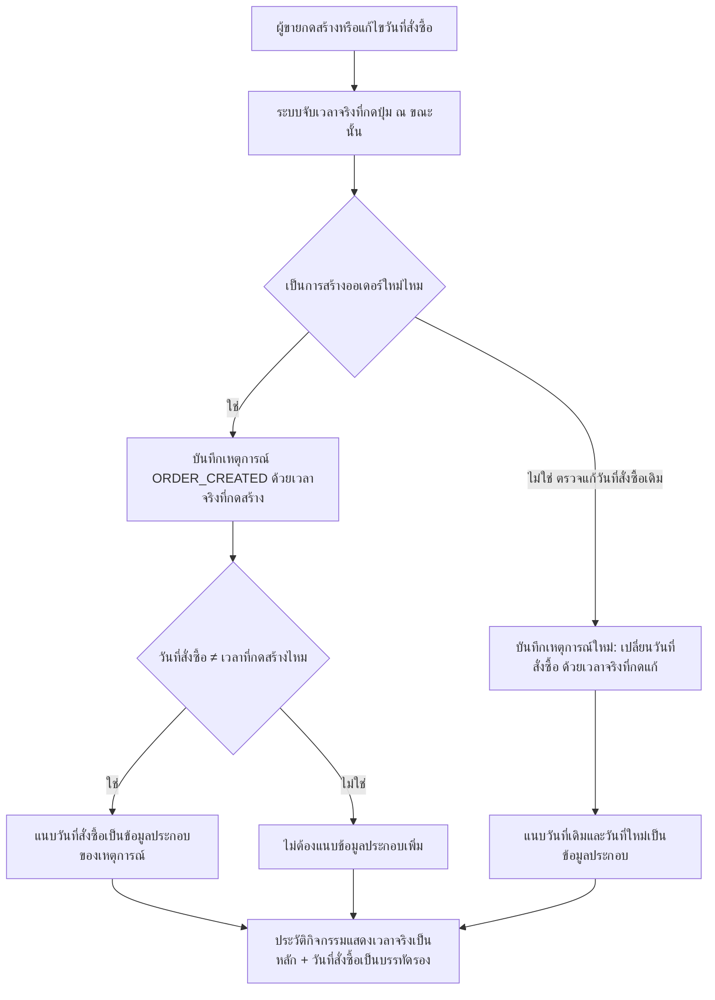

> **โมดูล:** M00033-BackdatedOrderDate
> **ประเภทเอกสาร:** Product Requirements Document (PRD)
> **เวอร์ชัน:** 1.0
> **วันที่จัดทำ:** 2026-08-06
> **สถานะ:** Draft — decision D-1..D-7 ล็อกแล้วโดย user (ดู §10.2), รอ user review ก่อน implement
> **เจ้าของเอกสาร:** BA + PO + PM (ดู [[Feature-Docs-Ownership]])

# PRD: เลือกวันที่คำสั่งซื้อย้อนหลัง (Backdated Order Date)

---

## Executive Summary

ร้านค้าจำนวนมากบน Deep รับออเดอร์ผ่านแชทตอนกลางคืน (2–3 ทุ่ม) แต่แอดมินมาคีย์เข้าระบบเช้าวันรุ่งขึ้น ปัจจุบันระบบไม่มีทางเข้าไหนให้ผู้ขายระบุ "วันที่ลูกค้าสั่งจริง" ได้เลย เพราะ `Order.createdAt` เป็นค่าที่ระบบตั้งอัตโนมัติเป็นเวลาที่กดบันทึกเสมอ (`@default(now())`) ผลคือรายงานยอดขายรายวัน/รายเดือนเพี้ยนอย่างเป็นระบบสำหรับร้านที่ปิดการขายตอนกลางคืน — ยอดขายของคืนวานถูกนับเป็นยอดของเช้าวันถัดไปแทน

ฟีเจอร์นี้เปิดช่องให้ผู้ขายระบุ "วันที่สั่งซื้อ" เองได้ทุกหน้าที่สร้าง/แก้ไขออเดอร์ (เดสก์ท็อป POS, มือถือ QuickForm, draft จากแชท, หน้าแก้ไขออเดอร์) โดยยึดมติที่ user ล็อกไว้แล้ว 7 ข้อ (D-1..D-7): ทับค่าลง `Order.createdAt` ตรง ๆ ไม่เพิ่มฟิลด์แยก, ย้อนหลังได้ 90 วัน/ล่วงหน้าได้ 7 วัน, แก้ทีหลังได้เฉพาะออเดอร์ที่ยังไม่ยืนยัน (`PENDING`), ปุ่มสร้างออเดอร์จากข้อความในแชทเติมเวลาของข้อความให้อัตโนมัติแต่แก้ได้, control หน้าตายุบเป็นแถวสรุปไม่รบกวนผู้ใช้ส่วนใหญ่ที่ไม่ต้องแก้อะไร และแก้บั๊ก timezone ที่มีอยู่ก่อนแล้วในหน้า `/sales`/`/orders` ไปพร้อมกันในรอบนี้ เพราะทั้งฟีเจอร์นี้มีความหมายเดียวคือ "ยอดต้องตกวันที่ถูก"

จุดที่ต้องระวังเป็นพิเศษคือ ประวัติกิจกรรม (Activity Log) ต้องไม่ถูกทำให้บิดเบือน — เวลาที่บันทึกในเหตุการณ์ (`OrderEvent.occurredAt`) ต้องเป็นเวลาจริงที่มีคนกดปุ่มเสมอ ไม่ย้อนตามวันที่ที่ผู้ขายกรอก เพราะประวัติคือหลักฐานตรวจสอบได้ว่าใครทำอะไรเมื่อไหร่จริง ส่วน "วันที่สั่งซื้อ" เป็นคุณสมบัติของออเดอร์ ถูกเก็บแยกไว้ในข้อมูลประกอบของเหตุการณ์เท่านั้น

---

## 1. Business Goals & KPIs

### 1.1 เป้าหมายทางธุรกิจ

| เป้าหมาย | รายละเอียด |
|----------|-----------|
| **รายงานยอดขายตกวันที่ถูกต้องสำหรับร้านที่ปิดการขายตอนกลางคืน** | แก้ปัญหาเชิงระบบที่ยอดขายของคืนวานถูกนับผิดเป็นของเช้าวันถัดไป เพราะไม่มีทางระบุวันที่สั่งซื้อเองได้ |
| **สร้างออเดอร์จากแชทได้เร็วขึ้นโดยไม่ต้องจำเวลาแชทเอง** | auto-fill เวลาของข้อความให้อัตโนมัติเมื่อกดสร้างออเดอร์จากข้อความในแชท ลดภาระการเปิดแชทไปมาเพื่อดูเวลา |
| **ประวัติออเดอร์ (Activity Log) ยังเป็นหลักฐานที่เชื่อถือได้แม้เปิดให้ย้อนวันที่ได้** | เวลาจริงที่มีคนกดสร้าง/แก้ไขต้องไม่ถูกบิดเบือนไปตามวันที่ที่ผู้ขายเลือก — ผู้ตรวจสอบยังเห็นว่า "ใครทำอะไรเมื่อไหร่จริง" ได้เสมอ |
| **ปิดบั๊ก timezone ที่มีอยู่ก่อนแล้วในหน้ารายงานยอดขาย** | ฟีเจอร์นี้ไม่มีความหมายถ้าหน้ารายงานยังคำนวณวันที่ผิดด้วย UTC ต่อไป — ต้องแก้ให้จบในรอบเดียวกัน |

### 1.2 ตัวชี้วัดความสำเร็จ (KPIs)

| KPI | คำอธิบาย | เป้าหมาย |
|-----|----------|---------|
| **ความถูกต้องของยอดขายรายวัน** | เทียบยอดขายที่ลงวันที่ย้อนหลังกับยอดที่ปรากฏใน dashboard/`/sales`/P&L/การ์ดสถิติ `/orders`/Command Center ในวันที่ที่เลือกจริง | ตรงกัน 100% ทุกหน้าที่แสดงยอดตามวันที่ |
| **สัดส่วนออเดอร์จากแชทที่ได้เวลาอัตโนมัติถูกต้อง** | ออเดอร์ที่สร้างผ่านปุ่ม "สร้างออเดอร์" จากข้อความแชท ได้ค่าเริ่มต้น = เวลาของข้อความ (เมื่ออยู่ในช่วง 90 วัน) | 100% ของกรณีที่ข้อความอยู่ในช่วงที่รองรับ |
| **ความสอดคล้องของเลขออเดอร์กับวันที่จริง** | เลขออเดอร์ (ปี/เดือน) ตรงกับ `Order.createdAt` ที่บันทึกไว้จริง แม้หลังแก้ไขวันที่ | 0 เคสที่เลขออเดอร์ค้างเดือนเก่าหลังแก้วันที่ |
| **ความแยกส่วนของ Activity Log** | `OrderEvent.occurredAt` ของเหตุการณ์ `ORDER_CREATED` ต้องเท่ากับเวลาจริงที่กดสร้าง ไม่ใช่ค่าที่ผู้ขายเลือกเป็นวันที่สั่งซื้อ | 100% ของออเดอร์ที่ backdate — ตรวจด้วย integration test |

### 1.3 ขอบเขตการส่งมอบ

งานนี้เป็น phase เดียว ไม่แบ่ง phase — ก้อนงานหลัก 3 ส่วน (ช่องวันที่ในฟอร์ม/auto-fill จากแชท/แก้ไข, ผลต่อเลขออเดอร์และประวัติกิจกรรม, แก้บั๊ก timezone ที่มีอยู่ก่อน) เป็นงานที่เกี่ยวเนื่องกันจนต้อง ship พร้อมกันในรอบเดียว เพราะเป้าหมายทั้งฟีเจอร์คือ "ยอดต้องตกวันที่ถูก" — ทำแค่บางส่วนแล้วยังเหลือช่องทางที่ยอดผิดอยู่ ถือว่าฟีเจอร์ยังไม่บรรลุเป้าหมาย

---

## 2. User Personas (กลุ่มผู้ใช้งาน)

### 2.1 แอดมิน/พนักงานร้านที่คีย์ออเดอร์ย้อนหลังจากแชท

**ข้อมูลพื้นฐาน:**
- พนักงานร้านที่รับออเดอร์ทางแชท (Facebook/LINE ผ่านกล่องแชทของ Deep หรือช่องทางอื่นนอกระบบ) แล้วมาคีย์เข้าออเดอร์ในระบบทีหลัง มักเป็นช่วงเช้าวันรุ่งขึ้นหรือตอนว่างงาน
- ใช้ทั้งเดสก์ท็อป (POS) และมือถือ (QuickForm) สลับกันตามสถานการณ์

**เป้าหมาย:**
- คีย์ออเดอร์ให้ตรงกับเวลาที่ลูกค้าสั่งจริง ไม่ใช่เวลาที่ตัวเองว่างมาคีย์

**ความต้องการ:**
- ระบุวันที่-เวลาของออเดอร์ได้เองในฟอร์มสร้างออเดอร์ทุกหน้า
- เมื่อกดสร้างออเดอร์จากข้อความในแชท อยากให้ระบบเติมเวลาของข้อความให้อัตโนมัติ ไม่ต้องเปิดแชทไปมาเพื่อจำเวลา

**จุดปวด (Pain Points):**
- ปัจจุบันไม่มีทางระบุวันที่สั่งซื้อได้เลย ออเดอร์ทั้งหมดถูกตีตราด้วยเวลาที่ตัวเองกดบันทึกเสมอ
- เคยมีช่องกรอกวันที่ (Flatpickr) ในฟอร์มสร้างออเดอร์แต่ถูกถอดออกไปแล้ว โดยไม่มีทางทดแทน

### 2.2 เจ้าของร้านที่ตรวจสอบยอดขายรายวัน/รายเดือน

**ข้อมูลพื้นฐาน:**
- เจ้าของร้านที่ดูยอดขายผ่าน dashboard, หน้า `/sales`, P&L (`/expenses`), การ์ดสถิติที่ `/orders`, และ Command Center เพื่อวางแผนธุรกิจ

**เป้าหมาย:**
- เห็นยอดขายที่สะท้อนความเป็นจริง — ยอดของคืนวานต้องเป็นของคืนวาน ไม่ใช่ของเช้าวันถัดไป

**ความต้องการ:**
- ทุกหน้าที่แสดงยอดตามวันที่ต้องคำนวณด้วยเวลาไทยที่ถูกต้อง สอดคล้องกับวันที่ที่พนักงานลงในออเดอร์

**จุดปวด (Pain Points):**
- ยอดขายจริงของกลางคืนกระจายไปติดวันถัดไปอย่างเป็นระบบ ทำให้ตัดสินใจธุรกิจผิดพลาด (เช่น คิดว่าวันนี้ขายดีกว่าที่เป็นจริง เพราะได้ยอดตกค้างของเมื่อคืนมาสมทบ)
- แม้จะลงวันที่ถูกในออเดอร์ได้แล้ว แต่ถ้าเว็บยังคำนวณวันด้วย UTC อยู่ ยอดก็ยังผิดเหมือนเดิม (ปัญหาที่มีอยู่ก่อนฟีเจอร์นี้)

### 2.3 ผู้ตรวจสอบ (audit) ที่ดูประวัติกิจกรรมของออเดอร์

**ข้อมูลพื้นฐาน:**
- เจ้าของร้าน/ผู้ที่ตรวจสอบว่าใครทำอะไรกับออเดอร์เมื่อไหร่ ผ่านการ์ดประวัติกิจกรรม (Activity Log, feature 00031) ในหน้ารายละเอียดออเดอร์

**เป้าหมาย:**
- ตรวจสอบได้เสมอว่า "ใครกดสร้าง/แก้ไขออเดอร์นี้จริง ๆ เมื่อไหร่" แม้ออเดอร์นั้นจะถูกลงวันที่สั่งซื้อย้อนหลังไว้ก็ตาม

**ความต้องการ:**
- เวลาที่แสดงในประวัติกิจกรรมต้องเป็นเวลาจริงที่มีคนกดปุ่มเสมอ ไม่ใช่วันที่สั่งซื้อที่เลือกเอง — ถ้าทั้งสองค่าต่างกัน ต้องเห็นทั้งคู่แยกกันชัดเจน

**จุดปวด (Pain Points):**
- ถ้าประวัติกิจกรรมถูกย้อนตามวันที่สั่งซื้อไปด้วย จะไม่สามารถแยกแยะได้อีกต่อไปว่าออเดอร์นี้ถูกสร้างขึ้นจริงเมื่อไหร่ ทำให้ประวัติหมดความหมายในฐานะหลักฐาน

---

## 3. Business Requirements

### 3.1 ระบุวันที่-เวลาของคำสั่งซื้อเองได้ทุกหน้าที่สร้าง/แก้ไขออเดอร์

**ความต้องการ:**
- ทุกหน้าที่สร้างหรือแก้ไขออเดอร์ (เดสก์ท็อป POS, มือถือ QuickForm, draft จากแชท, หน้าแก้ไขออเดอร์) ต้องมีช่องให้ผู้ขายระบุวันที่-เวลาของคำสั่งซื้อได้เอง

**Business Rules:**
- ค่าเริ่มต้นของช่องนี้คือเวลาปัจจุบัน — ถ้าผู้ขายไม่แตะช่องนี้เลย ระบบต้องทำงานเหมือนเดิมทุกประการ (พฤติกรรมเดิมก่อนฟีเจอร์นี้ต้องไม่เปลี่ยน)
- แก้วันที่ย้อนหลังได้เฉพาะออเดอร์ที่ยังไม่ยืนยัน (สถานะ `PENDING`) ตามกฎแก้ไขออเดอร์ที่มีอยู่แล้วของระบบ ไม่มีข้อยกเว้นพิเศษให้ฟิลด์นี้
- วันที่สั่งซื้อทับค่าลงบนฟิลด์ที่ใช้เก็บเวลาบันทึกเดิมของออเดอร์โดยตรง ไม่มีฟิลด์แยกต่างหาก

**เหตุผล:**
- ผู้ขายที่ปิดการขายตอนกลางคืนไม่มีเครื่องมือระบุ "เวลาที่ลูกค้าสั่งจริง" มาก่อนเลย ต้องเปิดช่องนี้เพื่อให้รายงานยอดขายสะท้อนความเป็นจริง
- การไม่เพิ่มฟิลด์แยกทำให้เลขออเดอร์/ลำดับรายการ/ยอดขายเคลื่อนไปพร้อมกันเสมอ ตรงกับที่ผู้ขายเข้าใจคำว่า "วันที่ออเดอร์" อยู่แล้ว

### 3.2 ปุ่มสร้างออเดอร์จากข้อความในแชทเติมเวลาของข้อความให้อัตโนมัติ

**ความต้องการ:**
- เมื่อผู้ขายกดสร้างออเดอร์จากข้อความในกล่องแชท ระบบต้องเติมเวลาของข้อความนั้นให้เป็นวันที่สั่งซื้อโดยอัตโนมัติ พร้อมป้ายบอกให้ผู้ขายรู้ว่าเวลานี้มาจากข้อความ และแก้ไขได้ต่อ

**Business Rules:**
- เวลาที่เติมอัตโนมัติต้องมาจากเวลาที่ข้อความถูกส่งจริง
- ถ้าข้อความนั้นเก่ากว่าขอบเขตที่ระบบรองรับ (เกิน 90 วัน) ต้องไม่เติมค่าให้ ให้ใช้เวลาปัจจุบันแทนโดยอัตโนมัติ พร้อมบอกผู้ขายว่าทำไมถึงไม่เติมให้ — ห้ามหยุดการทำงานด้วย error
- ผู้ขายต้องแก้ไขเวลาที่เติมอัตโนมัตินี้ได้เสมอ ไม่ถูกล็อกตายตัว

**เหตุผล:**
- เวลาของข้อความในแชทคือแหล่งข้อมูลที่แม่นยำที่สุดของ "เวลาที่ลูกค้าสั่งจริง" — การเติมให้อัตโนมัติลดภาระที่ผู้ขายต้องเปิดแชทไปมาเพื่อจำเวลาเอง
- ข้อความเก่าเกิน 90 วันเกินขอบเขตที่ระบบยอมรับ (ดู §3.3) การหยุดด้วย error จะบล็อกงานของผู้ขายทั้งที่มีทางออกที่ปลอดภัยกว่า (ใช้เวลาปัจจุบันแทน)

### 3.3 ขอบเขตเวลาที่ยอมรับได้ต้องชัดเจนและบังคับใช้จริง

**ความต้องการ:**
- ระบบต้องกำหนดขอบเขตของวันที่สั่งซื้อที่ยอมรับได้อย่างชัดเจน และบังคับใช้ทั้งฝั่งที่ผู้ใช้เห็น (ป้องกันไม่ให้กรอกค่านอกขอบเขตได้ตั้งแต่แรก) และฝั่งเซิร์ฟเวอร์ (ปฏิเสธคำขอที่หลุดขอบเขตแม้มาจากทางอื่นที่ไม่ผ่านหน้าจอปกติ)

**Business Rules:**
- ขอบเขตคือ ย้อนหลังได้ **90 วัน** ถึง ล่วงหน้าได้ **7 วัน** นับจากเวลาที่กดบันทึกจริง (ไม่ใช่นับจากเที่ยงคืนของวันนั้น)
- ค่านอกขอบเขตต้องถูกปฏิเสธด้วยข้อความแจ้งเหตุผลที่ชัดเจน ห้ามปรับค่าให้เข้าขอบเขตแบบเงียบ ๆ (เพราะผู้ขายจะไม่รู้ว่าค่าที่บันทึกจริงต่างจากที่กรอก)
- นิยามของขอบเขตต้องมาจากแหล่งเดียวกันทั้งฝั่งที่ผู้ใช้เห็นและฝั่งเซิร์ฟเวอร์ ห้ามมีนิยามคนละชุดที่อาจไม่ตรงกัน

**เหตุผล:**
- ขอบเขตเวลาป้องกันการกรอกผิดพลาดร้ายแรง (เช่น พิมพ์ปีผิดจนออเดอร์ลอยไปหลายปี) ที่จะทำให้รายงานยอดขายเสียหายรุนแรงกว่าปัญหาที่ฟีเจอร์นี้ตั้งใจแก้
- การปฏิเสธแทนการปรับค่าเงียบ ๆ ทำให้ผู้ขายรู้ทันทีว่าเกิดอะไรขึ้น แทนที่จะเห็นค่าที่บันทึกจริงไม่ตรงกับที่ตัวเองตั้งใจกรอกโดยไม่รู้ตัว

### 3.4 เลขออเดอร์และรายการต้องสอดคล้องกับวันที่สั่งซื้อที่เลือกเสมอ

**ความต้องการ:**
- เมื่อวันที่สั่งซื้อของออเดอร์ถูกกำหนดหรือแก้ไขจนข้ามเดือน/ปี เลขออเดอร์ที่ผู้ขายและผู้ซื้อเห็นต้องสะท้อนเดือน/ปีของวันที่สั่งซื้อจริง ไม่ใช่วันที่บันทึกลงระบบ
- ออเดอร์ที่ถูกลงวันที่ย้อนหลังจะไม่อยู่หัวรายการ (เพราะรายการยังเรียงตามวันที่สั่งซื้อ) — ผู้ขายต้องได้รับการยืนยันชัดเจนตอนบันทึกว่าออเดอร์นี้ถูกจัดเก็บอยู่ตรงไหนของรายการ เพื่อไม่ให้เข้าใจผิดว่าบันทึกไม่สำเร็จแล้วคีย์ซ้ำ

**Business Rules:**
- เลขออเดอร์ต้อง recompute ให้ตรงกับวันที่สั่งซื้อใหม่ทุกครั้งที่มีการแก้ไขวันที่จนเดือน/ปีเปลี่ยน โดยเปลี่ยนแปลงพร้อมกับการบันทึกวันที่ในการกระทำเดียวกัน
- ส่วนที่เป็นรหัสเฉพาะของออเดอร์แต่ละใบ (ส่วนที่ผู้ซื้อเห็นเป็นโค้ดอ้างอิง) ต้องไม่เปลี่ยนแม้วันที่สั่งซื้อจะถูกแก้ — เปลี่ยนเฉพาะส่วนที่บ่งบอกปี/เดือนเท่านั้น
- ลำดับการแสดงรายการออเดอร์ยังคงเรียงตามวันที่สั่งซื้อจากใหม่ไปเก่าเหมือนเดิม ไม่เปลี่ยนพฤติกรรมการเรียง
- เมื่อบันทึกออเดอร์ที่วันที่สั่งซื้อไม่ใช่วันนี้สำเร็จ ต้องแจ้งผู้ขายทันทีว่าบันทึกวันที่ใดและอยู่ในส่วนย้อนหลังของรายการ

**เหตุผล:**
- เลขออเดอร์เป็นสิ่งที่ผู้ซื้อและผู้ขายใช้อ้างอิงกันในชีวิตจริง เลขที่ไม่ตรงกับวันที่สั่งซื้อจริงจะสร้างความสับสนเมื่อค้นหาหรืออ้างอิงย้อนหลัง
- การไม่เปลี่ยนลำดับการเรียงรายการรักษาความหมายที่ถูกต้องอยู่แล้ว (เรียงตามวันที่สั่งซื้อคือความหมายที่ถูก) แต่ต้องชดเชยด้วยการแจ้งเตือนที่ชัดเจน เพื่อไม่ให้ผู้ขายเข้าใจผิดว่าออเดอร์หายไป

### 3.5 ประวัติกิจกรรมของออเดอร์ต้องแยกเวลาจริงออกจากวันที่สั่งซื้อเสมอ

**ความต้องการ:**
- ประวัติกิจกรรม (Activity Log) ของออเดอร์ต้องแสดงเวลาจริงที่แต่ละเหตุการณ์เกิดขึ้น (เช่น เวลาที่มีคนกดสร้างออเดอร์จริง) เป็นเวลาหลักเสมอ และแสดงวันที่สั่งซื้อที่ผู้ขายเลือกเป็นข้อมูลประกอบแยกต่างหากเมื่อสองค่านี้ไม่ตรงกัน
- เมื่อมีการแก้ไขวันที่สั่งซื้อของออเดอร์ที่มีอยู่แล้ว ต้องมีเหตุการณ์ในประวัติกิจกรรมบันทึกการเปลี่ยนแปลงนี้แยกต่างหากจากการแก้ไขข้อมูลทั่วไป

**Business Rules:**
- 🛑 เวลาของทุกเหตุการณ์ในประวัติกิจกรรมต้องเป็นเวลาจริงที่การกระทำนั้นเกิดขึ้นเสมอ — ห้ามย้อนตามวันที่ที่ผู้ขายกรอกเป็นวันที่สั่งซื้อไม่ว่ากรณีใด
- วันที่สั่งซื้อที่แตกต่างจากเวลาที่กดสร้างจริง ต้องถูกเก็บเป็นข้อมูลประกอบของเหตุการณ์ "สร้างคำสั่งซื้อ" เพื่อให้ผู้ตรวจสอบเห็นทั้งสองค่า
- การเปลี่ยนวันที่สั่งซื้อของออเดอร์ที่มีอยู่แล้วต้องบันทึกเป็นเหตุการณ์ประเภทใหม่ที่แยกจากการแก้ไขทั่วไป เพราะการเปลี่ยนวันที่มีผลย้ายยอดขายข้ามงวดบัญชี ซึ่งเป็นสิ่งที่ผู้ตรวจสอบต้องเห็นแยกออกมาชัดเจน ไม่ปะปนกับการแก้ไขรายละเอียดอื่น เช่น ที่อยู่หรือชื่อลูกค้า

**เหตุผล:**
- ประวัติกิจกรรมมีคุณค่าในฐานะหลักฐานตรวจสอบได้ก็ต่อเมื่อไม่สามารถถูกปรับแต่งโดยผู้ใช้ทางอ้อมได้ — ถ้าเวลาที่บันทึกไว้ย้อนไปตามค่าที่ผู้ขายกรอก ประวัติจะไม่ต่างอะไรจากข้อมูลที่ผู้ใช้กำหนดเองได้ ซึ่งขัดกับวัตถุประสงค์ของฟีเจอร์ประวัติกิจกรรมทั้งหมด
- การแก้วันที่ย้อนหลังส่งผลต่อยอดขายในรายงานของงวดบัญชีที่ต่างกัน (เช่น ย้ายยอดจากเดือนนี้ไปเดือนก่อน) จึงต้องมีร่องรอยแยกให้ตรวจสอบได้ว่ามีการเปลี่ยนแปลงลักษณะนี้เกิดขึ้นเมื่อไหร่และโดยใคร

### 3.6 แก้ไขบั๊กการคำนวณวันที่ด้วยเวลาสากล (UTC) ที่มีอยู่ก่อนแล้วในรอบเดียวกัน

**ความต้องการ:**
- หน้าที่แสดงยอดขาย/สถิติตามวันที่ (`/sales` และการ์ดสถิติที่ `/orders`) ที่ปัจจุบันคำนวณ "วันที่" ของออเดอร์ด้วยเวลาสากล (UTC) แทนที่จะเป็นเวลาไทย ต้องถูกแก้ไขให้ถูกต้องไปพร้อมกับฟีเจอร์นี้

**Business Rules:**
- ทุกจุดที่คำนวณ "วันที่" ของออเดอร์เพื่อจัดกลุ่มยอดขายต้องใช้กลไกคำนวณเวลาไทยเดียวกันกับที่จุดอื่นของระบบใช้อยู่แล้ว (เช่น dashboard และรายงานกำไรขาดทุนที่คำนวณถูกต้องอยู่แล้ว) ไม่คำนวณด้วยวิธีของตัวเองแยกต่างหาก
- ต้องครอบคลุมกรณีออเดอร์ที่ถูกบันทึกเวลาช่วงหลังเที่ยงคืนถึงเช้าตรู่ตามเวลาไทย (00:00–07:00 น.) ซึ่งเป็นช่วงที่บั๊กนี้แสดงอาการชัดที่สุด (ตกไปนับเป็นวันก่อนหน้าเมื่อคำนวณผิดด้วย UTC)

**เหตุผล:**
- ฟีเจอร์นี้ทั้งฟีเจอร์มีเป้าหมายเดียวคือ "ยอดขายต้องตกวันที่ถูก" — ถ้าปล่อยบั๊กนี้ไว้ ผู้ขายจะลงวันที่สั่งซื้อถูกต้องแล้ว แต่ยังเห็นยอดขายผิดอยู่ดีในบางหน้า ทำให้ฟีเจอร์นี้ไม่บรรลุเป้าหมายที่ตั้งไว้จริง แม้ว่าโค้ดส่วนใหม่จะทำงานถูกต้องทั้งหมดก็ตาม

---

## 4. Business Rules & Constraints

### 4.1 กฎทางธุรกิจหลัก

| กฎ | คำอธิบาย |
|----|----------|
| **ทับค่าลงฟิลด์เดิม ไม่เพิ่มฟิลด์แยก** | วันที่สั่งซื้อเก็บทับลงบนฟิลด์เวลาบันทึกเดิมของออเดอร์ตรง ๆ — เลขออเดอร์ ลำดับรายการ และยอดขาย เคลื่อนไปพร้อมกันเสมอ |
| **ขอบเขตเวลา 90 วันย้อนหลัง / 7 วันล่วงหน้า** | นับจากเวลาที่กดบันทึกจริง ตรวจทั้งฝั่งที่ผู้ใช้เห็นและฝั่งเซิร์ฟเวอร์ด้วยนิยามเดียวกัน |
| **แก้ทีหลังได้เฉพาะออเดอร์ที่ยังไม่ยืนยัน** | ตามกฎแก้ไขออเดอร์ที่มีอยู่แล้วของระบบ ไม่มีข้อยกเว้นพิเศษให้ฟิลด์วันที่สั่งซื้อ |
| **ประวัติกิจกรรมบันทึกเวลาจริงเสมอ** | เวลาของเหตุการณ์ในประวัติกิจกรรมไม่ย้อนตามวันที่สั่งซื้อที่ผู้ขายเลือกไม่ว่ากรณีใด |
| **เลขออเดอร์ต้องตรงกับวันที่สั่งซื้อจริงเสมอ** | recompute ให้ตรงทุกครั้งที่แก้วันที่จนเดือน/ปีเปลี่ยน โดยไม่แตะรหัสเฉพาะของออเดอร์แต่ละใบ |
| **ไม่มีสิทธิ์แยกสำหรับการลงวันที่ย้อนหลัง** | ใครสร้าง/แก้ไขออเดอร์ได้ก็ระบุ/แก้วันที่สั่งซื้อได้เหมือนกันหมด — ความรับผิดชอบตรวจสอบผ่านประวัติกิจกรรมแทน |

### 4.2 ข้อจำกัดทางธุรกิจ

| ข้อจำกัด | รายละเอียด |
|---------|-----------|
| **ไม่ย้อนวันที่ให้การตัดสต็อก/พัสดุ/ค่าใช้จ่าย** | การตัดสต็อก การเปิดพัสดุกับขนส่ง และการบันทึกค่าใช้จ่ายที่เกี่ยวข้อง ยังคงใช้เวลาปัจจุบันเสมอ ไม่ว่าวันที่สั่งซื้อจะถูกตั้งเป็นอะไร |
| **ไม่แตะทางสร้างออเดอร์ที่ไม่ผ่านฟอร์มนี้** | ออเดอร์ที่เกิดจากระบบจอง (booking), ระบบประมูล (auction), หรือการนำเข้าพัสดุจาก iShip ยังคงใช้เวลาจริงของเหตุการณ์เหมือนเดิมทุกประการ ไม่ได้รับผลจากฟีเจอร์นี้ |
| **ไม่ผูกออเดอร์กลับไปยังข้อความต้นทางในแชท** | การ auto-fill เวลาจากข้อความเป็นการคัดลอกค่าเวลาเท่านั้น ไม่สร้างความสัมพันธ์ถาวรระหว่างออเดอร์กับข้อความ |
| **ไม่มีการกำหนดสิทธิ์แยกตามบทบาทสำหรับการลงวันที่ย้อนหลัง** | ทุกคนที่มีสิทธิ์สร้าง/แก้ไขออเดอร์อยู่แล้ว มีสิทธิ์ระบุวันที่สั่งซื้อเหมือนกันหมด ไม่มีระดับสิทธิ์เพิ่มเติม |

### 4.3 เหตุผลที่คำขอจะถูกปฏิเสธ/ต้องข้าม

| เหตุผล | ผลที่เกิด |
|--------|-----------|
| วันที่สั่งซื้อที่ระบุอยู่นอกช่วง 90 วันย้อนหลัง ถึง 7 วันล่วงหน้า | ระบบปฏิเสธคำขอทั้งหมด (สร้างหรือแก้ไข) ด้วยข้อความแจ้งเหตุผลชัดเจน ไม่บันทึกค่าใด ๆ |
| ผู้ขายพยายามแก้วันที่สั่งซื้อของออเดอร์ที่ไม่ใช่สถานะ `PENDING` | ระบบปฏิเสธการแก้ไขทั้งฉบับ (ตามกฎแก้ไขออเดอร์เดิมที่มีอยู่แล้ว ไม่ใช่กฎใหม่เฉพาะฟิลด์นี้) |
| เวลาของข้อความในแชทที่ใช้กดสร้างออเดอร์เก่ากว่า 90 วัน | ระบบไม่เติมค่าให้ ใช้เวลาปัจจุบันเป็นค่าเริ่มต้นแทนโดยอัตโนมัติ พร้อมป้ายบอกเหตุผล — ไม่ใช่การปฏิเสธ แต่เป็นการ fail-closed |

---

## 5. Out of Scope (นอกขอบเขต)

สิ่งที่ระบบนี้ **ไม่รองรับ** หรือ **ไม่รับผิดชอบ**:

| หัวข้อ | คำอธิบาย |
|--------|----------|
| **เพิ่มฟิลด์ `orderedAt` แยกต่างหาก** | มติล็อกแล้ว (D-1) ว่าให้ทับค่าลงฟิลด์เวลาบันทึกเดิมของออเดอร์ตรง ๆ — ไม่มีฟิลด์คู่ขนานให้เกิดความสับสนว่า "เวลาไหนคือเวลาจริง" |
| **การย้อนเวลาให้สต็อกสินค้า** | สต็อกยังถูกตัดด้วยเวลาปัจจุบันเสมอ ไม่ว่าออเดอร์นั้นจะลงวันที่สั่งซื้อเป็นอะไร |
| **การย้อนเวลาให้พัสดุ (iShip)** | การเปิดพัสดุกับขนส่งใช้เวลาที่กดเปิดพัสดุจริงเสมอ ไม่ผูกกับวันที่สั่งซื้อของออเดอร์ |
| **การย้อนเวลาให้ค่าใช้จ่ายที่เกี่ยวข้อง** | รายการค่าใช้จ่ายที่เชื่อมโยงกับออเดอร์ยังคงบันทึกด้วยเวลาปัจจุบันของเหตุการณ์นั้น ๆ |
| **ทางสร้างออเดอร์ที่ไม่ผ่านฟอร์มสร้าง/แก้ไขออเดอร์ปกติ** | ออเดอร์จากระบบจอง (booking), ระบบประมูล (auction), และการนำเข้าพัสดุจาก iShip ไม่อยู่ในขอบเขต — ยังใช้เวลาจริงของเหตุการณ์เหมือนเดิม |
| **การผูกออเดอร์กลับไปยังข้อความต้นทางในแชท** | ฟีเจอร์นี้แค่คัดลอกค่าเวลาจากข้อความมาเป็นค่าเริ่มต้น ไม่ได้สร้าง reference ถาวรระหว่างออเดอร์กับข้อความ |
| **การกำหนดสิทธิ์แยกตามบทบาทสำหรับการลงวันที่ย้อนหลัง** | ไม่มีการจำกัดว่าเฉพาะบทบาทใดถึงจะลงวันที่ย้อนหลังได้ — ทุกคนที่สร้าง/แก้ไขออเดอร์ได้ก็ทำได้เหมือนกันหมด ความรับผิดชอบตรวจสอบผ่านประวัติกิจกรรมแทนการจำกัดสิทธิ์ |

---

## 6. Risks & Mitigation (ความเสี่ยงและแนวทางแก้ไข)

### 6.1 ความเสี่ยงทางธุรกิจ

| ความเสี่ยง | ผลกระทบ | ระดับความรุนแรง | แนวทางแก้ไข |
|-----------|---------|-----------------|-------------|
| **ผู้ขายกรอกวันที่สั่งซื้อผิดโดยไม่ตั้งใจ** | ยอดขายไปตกวันอื่นที่ไม่ถูกต้อง คล้ายปัญหาเดิมแต่กลับด้าน | กลาง | control หน้าตายุบเป็นแถวสรุปที่มองเห็นค่าปัจจุบันชัดเจนก่อนกด "เปลี่ยน" (D-7) ลดโอกาสแก้โดยไม่ตั้งใจ; ขอบเขตเวลา 90/7 วันจำกัดความเสียหายสูงสุดที่เกิดจากการกรอกผิดได้ |
| **ออเดอร์ที่ลงวันที่ย้อนหลังหาไม่เจอในรายการเพราะไม่อยู่หัวรายการ** | ผู้ขายเข้าใจว่าบันทึกไม่สำเร็จแล้วคีย์ซ้ำ ทำให้มีออเดอร์ซ้ำในระบบ | กลาง | toast แจ้งชัดเจนทันทีหลังบันทึกสำเร็จว่าบันทึกวันที่ใดและอยู่ในส่วนย้อนหลังของรายการ |
| **ความสับสนระหว่างเวลาในประวัติกิจกรรมกับวันที่สั่งซื้อ** | ผู้ตรวจสอบเข้าใจผิดว่าเวลาที่แสดงในประวัติคือวันที่สั่งซื้อ หรือกลับกัน | ต่ำ | แสดงเวลาจริงเป็นเวลาหลักเสมอ พร้อมข้อความบรรทัดรองที่ระบุชัดว่า "ลงวันที่สั่งซื้อ..." เมื่อสองค่าต่างกัน |

### 6.2 ความเสี่ยงทางเทคนิค

| ความเสี่ยง | ผลกระทบ | แนวทางแก้ไข |
|-----------|---------|-------------|
| **error ใหม่ (ค่าวันที่นอกขอบเขต) ไม่มีการดักจับที่ endpoint สร้าง/แก้ไขออเดอร์** | ผู้ใช้เห็น error 500 ที่ไม่มีความหมายแทนข้อความแจ้งเหตุผลที่ตั้งใจไว้ | ต้องดักจับ error นี้ครบทั้งสอง endpoint (สร้างและแก้ไขออเดอร์) แล้วแปลงเป็นข้อความที่อ่านเข้าใจได้ก่อนส่งกลับไปหน้าจอ |
| **เลขออเดอร์ไม่ synchronize กับวันที่ใหม่หลังแก้ไข** | เลขออเดอร์ที่เก็บไว้ค้างเป็นเดือนเก่า ขณะที่หน้าจอคำนวณสดแล้วแสดงเดือนใหม่ — ค้นหาด้วยเลขที่เห็นบนจอแล้วไม่เจอ | การแก้วันที่และการ recompute เลขออเดอร์ต้องอยู่ในการกระทำเดียวกันเสมอ ไม่แยกเป็นสองขั้นตอนที่อาจล้มเหลวไม่พร้อมกัน |
| **การจับเวลาจริงสำหรับประวัติกิจกรรมพลาดไปใช้ค่าวันที่สั่งซื้อแทน** | ประวัติกิจกรรมสูญเสียความหมายในฐานะหลักฐาน เพราะเวลาที่บันทึกกลายเป็นค่าที่ผู้ใช้กำหนดเองได้ทางอ้อม เป็นจุดที่ไม่มี type error หรือเทสเดิมช่วยจับความผิดพลาดนี้ | ต้องมี integration test ตรวจสอบโดยเฉพาะว่าเวลาที่บันทึกในประวัติกิจกรรมต่างจากวันที่สั่งซื้อที่เลือกเมื่อทั้งสองค่าไม่เท่ากัน |
| **แก้บั๊ก timezone ไม่ครบทุกจุดที่มีอยู่ก่อน** | บางหน้ายังคำนวณวันที่ผิดต่อไปแม้ผู้ขายลงวันที่สั่งซื้อถูกต้องแล้ว | ทดสอบเฉพาะกรณีข้ามเที่ยงคืนตามเวลาไทย (ออเดอร์เวลา 00:00–07:00 น.) ในทุกหน้าที่แสดงยอดตามวันที่ ก่อนปิดงาน |

---

## 7. Glossary (อภิธานศัพท์)

| คำศัพท์ | ความหมาย |
|---------|----------|
| **วันที่สั่งซื้อ (Order Date)** | วันที่-เวลาที่ผู้ขายระบุว่าลูกค้าสั่งซื้อจริง เก็บทับลงบนฟิลด์เวลาบันทึกเดิมของออเดอร์โดยตรง |
| **ออเดอร์ย้อนหลัง (Backdated Order)** | ออเดอร์ที่วันที่สั่งซื้อไม่ใช่วันนี้ (อยู่ในช่วงย้อนหลังตามขอบเขตที่ระบบรองรับ) |
| **ขอบเขตวันที่ที่ยอมรับได้ (Order Date Window)** | ช่วงเวลาที่ระบบอนุญาตให้ระบุเป็นวันที่สั่งซื้อได้ — ย้อนหลัง 90 วัน ถึง ล่วงหน้า 7 วัน นับจากเวลาที่กดบันทึก |
| **เวลาที่กดจริง (Keyed-in Time)** | เวลาจริงตามนาฬิการะบบที่มีคนกดปุ่มสร้าง/แก้ไขออเดอร์ ใช้บันทึกในประวัติกิจกรรมเสมอ ไม่ว่าวันที่สั่งซื้อจะถูกตั้งเป็นอะไร |
| **ประวัติกิจกรรม (Activity Log)** | บันทึกเหตุการณ์ต่าง ๆ ของออเดอร์ (สร้าง แก้ไข ยกเลิก ฯลฯ) ที่มีอยู่แล้วจากฟีเจอร์ 00031 ซึ่งฟีเจอร์นี้ต่อยอดด้วยเหตุการณ์ประเภทใหม่สำหรับการเปลี่ยนวันที่สั่งซื้อ |
| **เหตุการณ์เปลี่ยนวันที่สั่งซื้อ (Order Date Changed Event)** | เหตุการณ์ประเภทใหม่ในประวัติกิจกรรม บันทึกทุกครั้งที่มีการแก้วันที่สั่งซื้อของออเดอร์ที่มีอยู่แล้ว แยกจากการแก้ไขข้อมูลทั่วไป |

---

## 8. Success Metrics (ตัวชี้วัดความสำเร็จ)

เมื่อระบบทำงานได้ดี ควรมีผลลัพธ์ดังนี้:

| ตัวชี้วัด | ค่าที่คาดหวัง | วิธีวัด |
|----------|---------------|--------|
| **ยอดขายตกวันที่ถูกต้องทุกหน้า** | 100% ของทุกหน้าที่แสดงยอดตามวันที่ (dashboard, `/sales`, P&L `/expenses`, การ์ดสถิติ `/orders`, Command Center) ตรงกับวันที่สั่งซื้อที่ระบุ | คีย์ออเดอร์ลงวันที่เมื่อวานช่วงกลางคืน แล้วตรวจยอดในทุกหน้าที่ระบุ |
| **เลขออเดอร์ไม่ค้างหลังแก้วันที่ข้ามเดือน** | 0 เคสที่เลขออเดอร์ที่บันทึกไว้ไม่ตรงกับเดือน/ปีของวันที่สั่งซื้อจริง | integration test ครอบคลุมการแก้วันที่ข้ามเดือน |
| **ประวัติกิจกรรมไม่ถูกบิดเบือน** | เวลาของเหตุการณ์ `ORDER_CREATED` เท่ากับเวลาที่กดสร้างจริงเสมอ ไม่ใช่วันที่สั่งซื้อที่เลือก แม้เมื่อสองค่าต่างกันมาก | integration test เปรียบเทียบค่าทั้งสองพร้อมกันในการทดสอบเดียว |
| **บั๊ก timezone เดิมหายไปทั้งหมด** | ออเดอร์ที่บันทึกเวลาช่วง 00:00–07:00 น. ตามเวลาไทย นับเป็นวันที่ถูกต้องในทุกหน้าที่เคยพลาด | ทดสอบเคสข้ามเที่ยงคืนใน `/sales` และการ์ดสถิติ `/orders` |
| **สร้างออเดอร์จากแชทได้เวลาถูกต้องอัตโนมัติ** | เมื่อกดสร้างออเดอร์จากข้อความในแชท (อายุไม่เกิน 90 วัน) ช่องวันที่สั่งซื้อเติมค่าเวลาของข้อความให้อัตโนมัติ พร้อมป้ายบอกที่มา | ทดสอบกดสร้างออเดอร์จากข้อความจริงในแชท |

---

## 9. Dependencies & Assumptions

### 9.1 สิ่งที่ต้องพึ่งพา (Dependencies)

| ระบบ/ส่วนประกอบ | ความสัมพันธ์ |
|-----------------|-------------|
| **ฟอร์มสร้างออเดอร์ (`OrderCreateForm`) และฟอร์มมือถือ (`QuickForm`)** | จุดที่ต้องเพิ่มช่องวันที่สั่งซื้อ ใช้ component เดียวกันทั้งเดสก์ท็อป POS, มือถือ, draft จากแชท, และหน้าแก้ไขออเดอร์ |
| **การบริการออเดอร์ (order service layer) — การสร้างและการแก้ไขออเดอร์** | จุดที่ต้องรับพารามิเตอร์วันที่สั่งซื้อใหม่ ตรวจสอบขอบเขตเวลา และ recompute เลขออเดอร์เมื่อจำเป็น |
| **กล่องแชทของผู้ขาย (Chat) และตัวสร้าง draft ออเดอร์จากข้อความ** | จุดที่ต้องส่งเวลาของข้อความเข้าสู่ฟอร์มสร้างออเดอร์เพื่อ auto-fill |
| **ประวัติกิจกรรมของออเดอร์ (Activity Log, feature 00031)** | จุดที่ต้องเพิ่มเหตุการณ์ประเภทใหม่สำหรับการเปลี่ยนวันที่สั่งซื้อ และต้องแก้ไขจุดที่เคยอ้างอิงวันที่บันทึกของออเดอร์ผิดที่ (เพราะเดิมค่าทั้งสองบังเอิญเท่ากันเสมอ) |
| **หน้ารายงานยอดขาย/สถิติตามวันที่ (`/sales`, การ์ดสถิติ `/orders`, dashboard, P&L)** | จุดที่ต้องแก้บั๊กการคำนวณวันที่ด้วย UTC ให้ใช้กลไกเวลาไทยเดียวกับที่จุดอื่นของระบบใช้อยู่แล้ว |
| **`safepay-ux` gate (Hard Rule 8)** | งานนี้แตะ UI ในหลายหน้า (ฟอร์มสร้าง/แก้ไขออเดอร์, draft จากแชท) — ต้องผ่าน `safepay-ux` ออก Design Spec ก่อนแตะโค้ดฝั่งหน้าจอ |

### 9.2 สมมติฐาน (Assumptions)

- **A-1:** ผู้ขายเข้าใจความหมายของ "วันที่สั่งซื้อ" ในฐานะเวลาที่ลูกค้าสั่งจริง แยกจาก "เวลาที่บันทึกเข้าระบบ" ได้โดยไม่ต้องมีคำอธิบายเพิ่มเติมในหน้าจอ เพราะเป็นคำที่ตรงกับความเข้าใจของธุรกิจอยู่แล้ว (design spec §3 D-1 เหตุผล)
- **A-2:** ปริมาณออเดอร์ต่อร้านต่อวันไม่มากพอที่การเรียงรายการตามวันที่สั่งซื้อ (ไม่ใช่วันที่บันทึก) จะทำให้เกิดปัญหาประสิทธิภาพในการค้นหา — การแจ้งเตือนตอนบันทึกสำเร็จเพียงพอที่จะแก้ปัญหาการมองหาไม่เจอ โดยไม่ต้องเปลี่ยนกลไกการเรียง/แบ่งหน้าของรายการ
- **A-3:** ร้านที่ปิดการขายตอนกลางคืนส่วนใหญ่คีย์ออเดอร์เข้าระบบภายใน 90 วันหลังลูกค้าสั่งจริง — ขอบเขตย้อนหลัง 90 วันครอบคลุมกรณีใช้งานจริงส่วนใหญ่ได้เพียงพอ โดยไม่ต้องเปิดกว้างจนเสี่ยงต่อการกรอกผิดพลาดร้ายแรง
- **A-4:** ช่องทางแชทที่มีปุ่มสร้างออเดอร์จากข้อความ (ทั้งกดค้างบนมือถือและวางเมาส์ค้างบนเดสก์ท็อป) มีเวลาของข้อความอยู่ในมือของระบบอยู่แล้วโดยไม่ต้องดึงข้อมูลเพิ่ม — การ auto-fill จึงเป็นการส่งค่าที่มีอยู่แล้วต่อไปยังฟอร์ม ไม่ใช่การสร้างแหล่งข้อมูลใหม่

---

## 10. Appendix

### 10.1 ตัวอย่าง User Journey

**Scenario: แอดมินคีย์ออเดอร์เช้าวันรุ่งขึ้นจากแชทเมื่อคืน**

1. ลูกค้าทักแชทสั่งซื้อสินค้าตอน 21:14 น. คืนวันที่ 5 สิงหาคม 2569
2. แอดมินไม่ว่างคีย์ตอนนั้น มาคีย์เข้าระบบตอนเช้าวันรุ่งขึ้น 6 สิงหาคม 2569 เวลา 09:12 น.
3. แอดมินกดสร้างออเดอร์จากข้อความนั้นในกล่องแชท ระบบเติมวันที่สั่งซื้อให้อัตโนมัติเป็น "05/08/2569 21:14" พร้อมป้าย "ใช้เวลาจากข้อความ"
4. แอดมินตรวจสอบว่าถูกต้องแล้วกดบันทึกโดยไม่ต้องแก้ไขอะไรเพิ่ม
5. ระบบบันทึกออเดอร์สำเร็จ ขึ้นข้อความแจ้งว่า "บันทึกแล้ว · ลงวันที่ 5 ส.ค. 2569 — อยู่ในรายการย้อนหลัง"
6. เลขออเดอร์ที่ได้สะท้อนเดือนสิงหาคมตามวันที่สั่งซื้อ ไม่ใช่วันที่คีย์
7. ประวัติกิจกรรมของออเดอร์แสดง "สร้างคำสั่งซื้อ — โดย แอดมิน · 6 ส.ค. 2569 09:12 น." เป็นเวลาหลัก พร้อมบรรทัดรอง "ลงวันที่สั่งซื้อ 5 ส.ค. 2569 21:14 น."
8. เมื่อเจ้าของร้านเปิดหน้า `/sales` ดูยอดขาย ยอดของออเดอร์นี้ปรากฏอยู่ในวันที่ 5 สิงหาคม ตรงกับวันที่ลูกค้าสั่งจริง ไม่ใช่วันที่ 6 สิงหาคม ที่แอดมินคีย์

### 10.2 สรุปการตัดสินใจที่ล็อกแล้ว (D-1..D-7, user เคาะ 2026-08-06)

| # | Decision | สถานะ |
|---|----------|-------|
| D-1 | ทับค่าวันที่สั่งซื้อลงฟิลด์เวลาบันทึกเดิมของออเดอร์โดยตรง ไม่เพิ่มฟิลด์แยก | ล็อก — ดู §3.1, §4.1 |
| D-2 | ขอบเขตที่เลือกได้ — ย้อนหลัง 90 วัน ถึง ล่วงหน้า 7 วัน นับจากเวลาที่กดบันทึก | ล็อก — ดู §3.3 |
| D-3 | แก้วันที่สั่งซื้อทีหลังได้เฉพาะออเดอร์ที่ยังไม่ยืนยัน (`PENDING`) | ล็อก — ดู §3.1, §4.1 |
| D-4 | ปุ่มสร้างออเดอร์จากข้อความในแชท auto-fill เวลาของข้อความให้ พร้อมป้ายบอกและแก้ไขได้ | ล็อก — ดู §3.2 |
| D-5 | ช่องวันที่สั่งซื้อต้องมีในทุกหน้าที่สร้าง/แก้ไขออเดอร์ได้ | ล็อก — ดู §3.1 |
| D-6 | แก้บั๊ก timezone ที่มีอยู่ก่อนในหน้า `/sales`/`/orders` ไปในรอบนี้ ไม่แยกออก | ล็อก — ดู §3.6 |
| D-7 | หน้าตา control ยุบไว้เป็นแถวสรุป กด "เปลี่ยน" ถึงเปิดช่องกรอก | ล็อก — ดู §6.1 (mitigation) |

### 10.3 ภาพรวม flow การระบุวันที่สั่งซื้อเมื่อสร้างออเดอร์

```mermaid
flowchart TD
    A[ผู้ขายเริ่มสร้างออเดอร์] --> B{ทางเข้า}
    B -- เดสก์ท็อป/มือถือ ปกติ --> C[ช่องวันที่สั่งซื้อ = เวลาปัจจุบัน ค่าเริ่มต้น]
    B -- กดสร้างจากข้อความในแชท --> D{ข้อความเก่ากว่า 90 วันไหม}
    D -- ไม่เกิน --> E[เติมวันที่สั่งซื้อ = เวลาของข้อความ + ป้าย "ใช้เวลาจากข้อความ"]
    D -- เกิน --> F[ใช้เวลาปัจจุบันแทน + ป้ายบอกเหตุผล]
    C --> G{ผู้ขายกด "เปลี่ยน" ไหม}
    E --> G
    F --> G
    G -- ไม่กด --> H[ใช้ค่าเดิม]
    G -- กด --> I[เปิดช่องกรอก ตรวจขอบเขต 90/7 วัน]
    H --> J[กดบันทึก]
    I --> J
    J --> K{ค่าที่ได้อยู่ในขอบเขตไหม}
    K -- ไม่อยู่ --> L[ปฏิเสธ พร้อมข้อความแจ้งเหตุผล]
    K -- อยู่ --> M[บันทึกออเดอร์ + recompute เลขออเดอร์ตามวันที่สั่งซื้อ]
    M --> N{วันที่สั่งซื้อ ≠ วันนี้ไหม}
    N -- ใช่ --> O[toast แจ้งว่าอยู่ในรายการย้อนหลัง]
    N -- ไม่ใช่ --> P[toast บันทึกสำเร็จตามปกติ]
```

### 10.4 ภาพรวม flow ประวัติกิจกรรมเมื่อมีวันที่สั่งซื้อย้อนหลัง



---

**หมายเหตุ:**
เอกสารนี้เป็นการบันทึกความต้องการทางธุรกิจ (Business Requirements) โดยไม่มีรายละเอียดทางเทคนิค
สำหรับ Functional Requirements / User Story / Acceptance Criteria ดู [[BRD]] ของโมดูลนี้
สำหรับ technical specification ดู [[SRS]] · [[SDS]] · [[API]] · [[DATABASE]] ของโมดูลนี้
