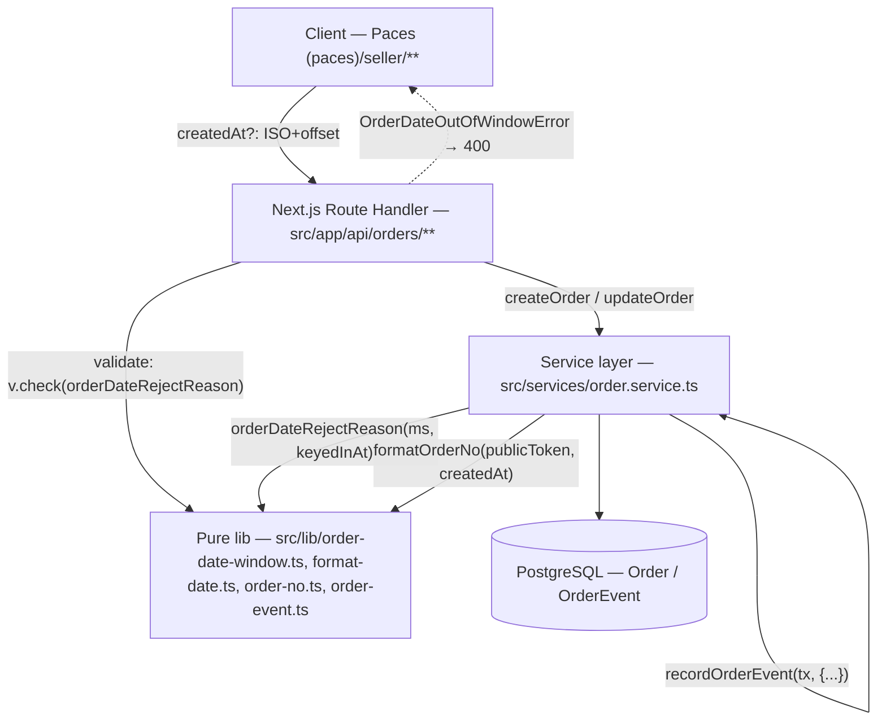
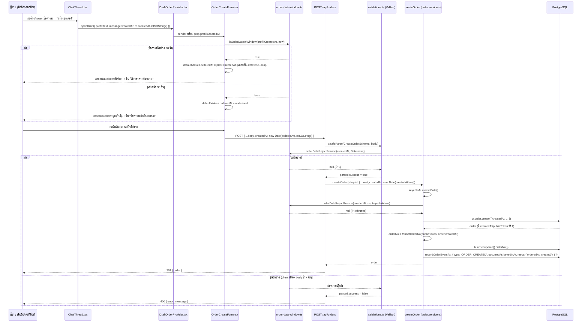
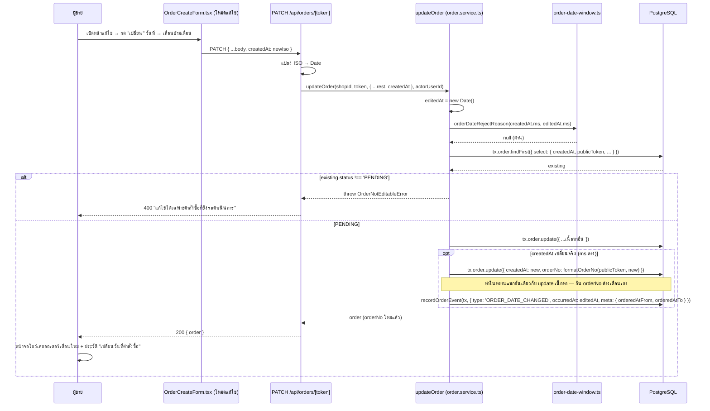

> **โมดูล:** M00033-BackdatedOrderDate
> **ประเภทเอกสาร:** System Design Spec (SDS)
> **เวอร์ชัน:** 1.0
> **วันที่จัดทำ:** 2026-08-06
> **สถานะ:** Draft — เขียนก่อนโค้ด (Hard Rule 11)
> **เจ้าของเอกสาร:** safepay-planner (ดู [[Feature-Docs-Ownership]])

# SDS: เลือกวันที่/เวลาของคำสั่งซื้อได้ (System Design Spec)

---

## 1. บทนำ & References

### 1.1 วัตถุประสงค์

เอกสารนี้ออกแบบ**วิธี implement** ของทุก TFR ใน [[SRS]] ให้ละเอียดพอที่ `safepay-developer` ลงมือได้ทันทีโดยไม่ต้องตัดสินใจ shape ใหม่ ผู้อ่านหลักคือ DEV/QA/Reviewer

### 1.2 ขอบเขตการออกแบบ

เหมือน [[SRS]] §1.2 ทุกประการ — ไม่ทำซ้ำที่นี่ สรุปสั้น: `src/lib/order-date-window.ts` (ใหม่), `src/lib/format-date.ts` (แก้), `src/lib/validations.ts` (แก้), `src/lib/order-event.ts` (แก้) + migration, `src/services/order.service.ts` (แก้ 2 ฟังก์ชัน), `src/app/api/orders/route.ts` + `[token]/route.ts` (แก้ catch), UI 3 ไฟล์ใหม่/แก้ในกลุ่ม `orders/new/components/`, chat wiring 2 ไฟล์, timezone fix 3 ไฟล์

### 1.3 เอกสารอ้างอิง

| เอกสาร | ความสัมพันธ์ |
|--------|-------------|
| [[SRS]] | ที่มาของ TFR-001..010 ที่ SDS นี้ realize |
| [[BRD]] / [[PRD]] | ที่มาของ FR-OBD-*/BR-OBD-* |
| `docs/superpowers/specs/2026-08-06-backdated-order-date-design.md` | ต้นทางของทุกการตัดสินใจ (D-1..D-7) |
| `docs/superpowers/plans/2026-08-06-backdated-order-date.md` | โค้ดตัวอย่างจริง/ลำดับ 12 task (มีชื่อฟังก์ชันผิด 1 จุด — ดู [[SRS]] §1.1) |
| `docs/20 - Features/00031 - Order Activity Log/DATABASE.md` | schema เดิมของ `OrderEvent` ที่งานนี้ต่อยอด |

---

## 2. Architecture Overview

### 2.1 มุมมองสถาปัตยกรรม

ไม่มี service/component ใหม่ระดับ infra — งานนี้คือ (1) 1 pure module ใหม่ (SSOT เพดานเวลา) (2) ขยายฟังก์ชันที่มีอยู่แล้ว 2 ตัว (`createOrder`/`updateOrder`) ด้วยพารามิเตอร์เดียว (3) 1 component UI ใหม่ที่ reuse ใน 4 จุด (4) wiring เวลาจากแชทที่มีอยู่แล้วในมือแต่ถูกทิ้ง (5) แก้บั๊ก timezone ที่มีอยู่ก่อนใน 2 หน้า

### 2.2 มุมมองการ Deploy

ไม่มี — รันในกระบวนการ Next.js เดียวกัน (Vercel serverless) เหมือนเดิม migration รันผ่าน `prisma migrate deploy` ตอน build (`vercel.json` — Hard Rule 15)

---

## 3. Component Design

| Component | หน้าที่ (Responsibility) | Dependency (Submodule / Stack / Store) |
|-----------|--------------------------|-----------------------------------------|
| **`order-date-window.ts`** (ใหม่) | นิยามช่วง 90/7 วัน + ฟังก์ชันตรวจ/ข้อความปฏิเสธ — จุดเดียว | `src/lib/` — pure TypeScript, ไม่มี import |
| **`format-date.ts`** (แก้ — เพิ่ม 2 ฟังก์ชัน) | `thaiDayKey`/`formatOrderDateLabel` — ตัดวัน/แสดงผลตามปฏิทินไทย | `src/lib/` — pure, ใช้ `partsInBangkok`/`toValidDate` เดิมในไฟล์ |
| **`validations.ts`** (แก้) | ด่านแรกของ `createdAt` (Valibot regex + range check) | `src/lib/` — Valibot, เรียก `order-date-window.ts` |
| **`order-event.ts`** (แก้) | นิยาม `ORDER_DATE_CHANGED` — label/icon/tone/meta shape/บรรทัดรอง | `src/lib/` — pure, ไม่ import prisma |
| **`order-event.service.ts`** (ไม่แก้ — ผู้บริโภคใหม่เท่านั้น) | เขียน `OrderEvent` ผ่าน `recordOrderEvent(tx, …)` | `src/services/` — Prisma transaction client |
| **`order.service.ts::createOrder`** (แก้) | ตรวจช่วง, insert `Order.createdAt`, จับ `keyedInAt`, บันทึก `ORDER_CREATED` ด้วย `occurredAt` ที่ถูกต้อง | `src/services/` — Prisma `$transaction` retry loop |
| **`order.service.ts::updateOrder`** (แก้) | ตรวจช่วง, update `createdAt` + recompute `orderNo`, บันทึก `ORDER_DATE_CHANGED` | `src/services/` — Prisma `$transaction` เดียวกับ update เนื้อหา |
| **`api/orders/route.ts`** (แก้ catch) | แปลง ISO → Date, catch `OrderDateOutOfWindowError` → 400 | Next.js Route Handler |
| **`api/orders/[token]/route.ts`** (แก้ catch) | เหมือนกัน สำหรับ PATCH | Next.js Route Handler |
| **`OrderDateRow.tsx`** (ใหม่) | UI แถววันที่สั่งซื้อ ยุบ/ขยาย, bound min/max | `(paces)/seller/(dashboard)/orders/new/components/` — Paces client component, React Hook Form `Controller` |
| **`OrderCreateForm.tsx`** (แก้) | เพิ่ม field `orderedAt` ใน `FormValues`, wiring submit/toast/prefill | เดียวกัน |
| **`QuickSummaryPanel.tsx`** (แก้) | วาง `OrderDateRow` ใน layout มือถือ | เดียวกัน |
| **`DraftOrderProvider.tsx`** (แก้) | เก็บ `messageCreatedAt` ใน draft state ส่งต่อเป็น prop | `(paces)/seller/(chat)/_components/` |
| **`ChatThread.tsx`** (แก้) | ส่ง `m.createdAt` เข้า `openDraft()` ทั้ง 2 ทางเข้า | `(paces)/seller/(chat)/inbox/[conversationId]/components/` |
| **`date-range.ts`** (แก้ — export 1 ฟังก์ชัน) | `thaiMidnightUtc` ให้หน้าอื่นเรียกได้ | `src/lib/` — pure |
| **`sales/page.tsx` / `orders/page.tsx`** (แก้) | เลิกตัดวันด้วย UTC → ใช้ `thaiDayKey`/`thaiMidnightUtc` | `(paces)/seller/(dashboard)/**` — RSC |

---

## 4. Data Flow

### 4.1 Flow หลัก: สร้างออเดอร์ย้อนหลังจากข้อความในแชท

### 4.2 Flow กรณีล้มเหลว / ชดเชย: แก้วันที่คำสั่งซื้อ + orderNo ค้าง

---

## 5. Integration Points

| จุดเชื่อม | ประเภท | Protocol / Contract | ความเสี่ยงเมื่อล่ม |
|-----------|--------|----------------------|---------------------|
| **`OrderCreateForm.tsx` → `POST/PATCH /api/orders`** | internal | REST/JSON (Next.js Route Handler) | ฟอร์มค้าง — ผู้ขายสร้าง/แก้ออเดอร์ไม่ได้เลย (ไม่ใช่แค่ฟีเจอร์นี้) |
| **`ChatThread.tsx` → `DraftOrderProvider.tsx`** | internal | React Context, ไม่ผ่าน network | prefill เวลาไม่ทำงาน — degrade เป็นพฤติกรรมเดิม (ใช้เวลาปัจจุบัน) ไม่ crash |
| **`order.service.ts` → PostgreSQL** | internal | Prisma `$transaction` | rollback ทั้งก้อน (retry loop ของ `createOrder` ครอบอยู่แล้วสำหรับ shortCode collision — ไม่เกี่ยวกับงานนี้) |

- **Timeout / Retry / Idempotency:** ไม่เปลี่ยนจากเดิม — `createOrder` มี retry 5 ครั้งสำหรับ `shortCode` P2002 อยู่แล้ว (ไม่เกี่ยวกับ `createdAt`) `updateOrder` ไม่มี retry (idempotent ตาม `publicToken`)
- **สัญญา API เต็ม:** ดู [[API]]

---

## 6. Technical Decisions

### TD-001: ทับ `Order.createdAt` ตรง ไม่เพิ่มคอลัมน์ `orderedAt`

- **ตัดสินใจ:** ใช้ `Order.createdAt` เดิมเก็บ "วันที่ลูกค้าสั่ง" — ไม่มี migration schema ของ `Order`
- **เหตุผล:** `createdAt` ผูกกับ 3 อย่างพร้อมกันอยู่แล้ว (เลขออเดอร์ · ลำดับรายการ · ยอดขาย) การเพิ่มฟิลด์แยกแปลว่าต้องไล่แก้ผู้อ่านทุกจุด (~15 ไฟล์) และเหลือ "2 เวลา" ให้สับสนตลอดไป — decision D-1 ของ user
- **ทางเลือกที่ตัดทิ้ง:** เพิ่ม `Order.orderedAt DateTime?` แยก แล้วให้ทุกจุดอ่าน `orderedAt ?? createdAt` — ตัดทิ้งเพราะเพิ่มความซับซ้อนถาวรโดยไม่ได้อะไรกลับมา (ระบบไม่มี use case ที่ต้องแยก 2 เวลานี้จริง ๆ)
- **ผลกระทบ:** `orderNo`/keyset pagination/ยอดขายเคลื่อนตาม `createdAt` ทั้งชุดโดยอัตโนมัติ — เป็นพฤติกรรมที่ตั้งใจ ไม่ใช่ผลข้างเคียงที่ต้อง mitigate

### TD-002: เพดานเวลาเป็น pure module เดียว ไม่ hardcode ซ้ำ

- **ตัดสินใจ:** `src/lib/order-date-window.ts` เป็นจุดเดียวที่นิยาม 90/7 วัน ทั้ง client (bound input) และ server (Valibot + service) เรียกฟังก์ชันเดียวกัน
- **เหตุผล:** บทเรียนตรงจาก `src/lib/shipping-address-status.ts` — กฎ "ที่อยู่ครบพอบันทึกไหม" เคยเขียนซ้ำ 3 ที่แล้วนิยามไม่ตรงกัน ทำให้ปุ่มขึ้น "เลือกแล้ว" ทั้งที่ยังบันทึกไม่ผ่าน
- **ทางเลือกที่ตัดทิ้ง:** hardcode `90`/`7` แยกที่ client validation, Valibot, และ service — ตัดทิ้งเพราะเป็นสาเหตุของบั๊กที่เคยเกิดมาแล้วในระบบนี้
- **ผลกระทบ:** เปลี่ยนเพดานในอนาคต (เช่น ขยายเป็น 120 วัน) แก้ที่เดียว ไม่ต้องไล่ 3 จุด

### TD-003: แยก `occurredAt` (เวลาจริงที่กด) ออกจาก `createdAt` (วันที่สั่งซื้อ) เด็ดขาดใน `OrderEvent`

- **ตัดสินใจ:** `keyedInAt`/`editedAt` (`new Date()` จับตอนต้นฟังก์ชัน) ใช้กับ `OrderEvent.occurredAt` เสมอ ไม่ว่า `Order.createdAt` จะเป็นอะไร — วันที่สั่งซื้ออยู่ใน `meta.orderedAt`/`orderedAtFrom`/`orderedAtTo` เท่านั้น
- **เหตุผล:** `occurredAt` ตามนิยามใน schema (`schema.prisma:2731-2733`) คือ "เวลาที่เหตุการณ์เกิดจริง" — เหตุการณ์คือ "มีคนกดสร้าง/แก้" ซึ่งเกิด ณ ขณะนั้นเสมอ ไม่ใช่ ณ วันที่ผู้ใช้กรอก ประวัติที่ย้อนตามค่าที่ผู้ใช้กรอกได้จะไม่เป็นหลักฐานอีกต่อไป (มติ user 2026-08-06)
- **ทางเลือกที่ตัดทิ้ง:** ส่ง `occurredAt: order.createdAt` ต่อไปเหมือนเดิม (โค้ดเดิมก่อนงานนี้ทำแบบนี้ ซึ่ง "บังเอิญถูก" เพราะสองค่าเท่ากันมาตลอด) — ตัดทิ้งเพราะจะกลายเป็นผิดทันทีที่ `createdAt` ย้อนหลังได้
- **ผลกระทบ:** เป็นจุดที่พังเงียบที่สุดถ้า implement ผิด (ไม่มี type error, ไม่มีเทสเดิมจับ) — ต้องมี integration test เฉพาะเจาะจง (ดู [[TestCase]])

### TD-004: `orderNo` recompute พร้อม `createdAt` ใน `$transaction` เดียวกันเสมอ (เฉพาะตอนแก้)

- **ตัดสินใจ:** `updateOrder` ต้อง `update({ createdAt, orderNo: formatOrderNo(...) })` ในทรานแซกชันเดียวกับ update เนื้อหาออเดอร์อื่น — ไม่แยกเป็นสอง request/สอง transaction
- **เหตุผล:** หน้าจอทุกที่ (`OrderCard.tsx`, `OrdersTable.tsx`, `OrderQrSheet.tsx`, `OrderDetailMobile.tsx`) คำนวณเลขออเดอร์**สด**จาก `createdAt` ไม่ได้อ่านคอลัมน์ `orderNo` ที่เก็บไว้ — ถ้าคอลัมน์ไม่ sync ผู้ใช้จะเห็นเลขหนึ่งบนจอ แต่ค้นด้วยเลขนั้นผ่าน `@@index([orderNo])` ไม่เจอ (คอลัมน์ยังเป็นเดือนเก่า)
- **ทางเลือกที่ตัดทิ้ง:** ให้หน้าจอทุกจุดอ่านคอลัมน์ `orderNo` แทนการคำนวณสด — ตัดทิ้งเพราะแตะไฟล์กระจาย 4+ จุดโดยไม่จำเป็น เมื่อ fix ที่ต้นทาง (service เดียว) ครอบคลุมกว่า
- **ผลกระทบ:** ตอน `createOrder` ไม่ต้องแก้อะไร (`formatOrderNo` อ่านค่ากลับจากแถวที่เพิ่ง insert อยู่แล้ว = ถูกโดยธรรมชาติ) — เฉพาะ `updateOrder` เท่านั้นที่ต้อง recompute

### TD-005: chat auto-fill เป็น "hint ที่แก้ได้" ไม่ใช่ "ค่าบังคับ"

- **ตัดสินใจ:** `messageCreatedAt` แค่ตั้งค่าเริ่มต้นให้ `OrderDateRow` เปิดค้าง (ไม่ยุบ) พร้อมชิปบอกที่มา — ผู้ขายแก้ได้เต็มที่ก่อน submit เหมือนช่องอื่น
- **เหตุผล:** design D-4 ระบุ "auto-fill + ป้ายบอก + แก้ได้" — ไม่ใช่ lock ค่า เพราะข้อความในแชทอาจเป็นข้อความติดตามผล ไม่ใช่ข้อความสั่งซื้อจริง ผู้ขายต้องมีทางแก้เสมอ
- **ทางเลือกที่ตัดทิ้ง:** auto-submit `createdAt` จากข้อความโดยไม่ให้แก้ — ตัดทิ้งเพราะขัด D-4 และเสี่ยงข้อมูลผิดถ้าเดาเวลาข้อความผิดบริบท
- **ผลกระทบ:** UI ต้องมีปุ่ม "ใช้เวลาตอนนี้แทน" เสมอคู่กับชิป — ไม่ใช่แค่ label อ่านอย่างเดียว

### TD-006: silent-fallback เมื่อข้อความเก่าเกิน 90 วัน (fail-closed ไม่ error)

- **ตัดสินใจ:** ข้อความเก่ากว่าเพดาน → ไม่เติมค่า ใช้เวลาปัจจุบันแทนเงียบ ๆ (แค่เปลี่ยนชิปข้อความ) ไม่ throw/ไม่ block การเปิดฟอร์ม
- **เหตุผล:** ผู้ขายไม่ได้ทำอะไรผิด — แค่ข้อความเก่าเกินไป การ block ทั้งฟอร์มเพื่อ edge case ที่ไม่ใช่ error ของผู้ใช้จะสร้างความหงุดหงิดเกินเหตุ
- **ทางเลือกที่ตัดทิ้ง:** โยน error/แสดง alert บล็อกการเปิดฟอร์มสร้างออเดอร์ — ตัดทิ้งเพราะงานหลัก (สร้างออเดอร์) ยังทำได้ปกติ แค่ auto-fill ใช้ไม่ได้เท่านั้น
- **ผลกระทบ:** logic เดียว (`isOrderDateInWindow`) ต้องคำนวณครั้งเดียวแล้วใช้ทั้งค่า `defaultValues.orderedAt` และ prop `messageTooOld` ที่ส่งเข้า `OrderDateRow` — ห้ามคำนวณสองรอบให้หลุดจากกัน

---

## 7. Traceability

| SRS Requirement (TFR/NFR) | SDS Element (component / decision / flow) | สถานะ |
|---------------------------|-------------------------------------------|-------|
| TFR-001 | Component `order-date-window.ts` / TD-002 | Draft |
| TFR-002 | Component `format-date.ts` (thaiDayKey/formatOrderDateLabel) | Draft |
| TFR-003 | Component `validations.ts` / Flow 4.1 (ด่าน Valibot) | Draft |
| TFR-004 | §5.3 migration (ดู [[SRS]]) + Component `order-event.ts` | Draft |
| TFR-005 | Component `createOrder` / TD-003 / Flow 4.1 | Draft |
| TFR-006 | Component `updateOrder` / TD-003, TD-004 / Flow 4.2 | Draft |
| TFR-007 | §5 Integration Points (route catch) — ดู [[API]] §4.4 | Draft |
| TFR-008 | Component `OrderDateRow.tsx`/`OrderCreateForm.tsx` / TD-005 | Draft |
| TFR-009 | Component `DraftOrderProvider.tsx`/`ChatThread.tsx` / TD-005, TD-006 / Flow 4.1 | Draft |
| TFR-010 | Component `date-range.ts`/`sales/page.tsx`/`orders/page.tsx` | Draft |

---

## 8. สรุป (Summary)

เอกสาร SDS นี้กำหนด **การออกแบบเชิงระบบ** ของการเลือกวันที่/เวลาของคำสั่งซื้อได้ เพื่อให้ DEV นำไป implement, QA นำความเสี่ยงไปวางแผนทดสอบ, และ Reviewer ตรวจ error-mapping ได้ตรงกับข้อกำหนดใน [[SRS]]

**ลำดับการ build ที่แนะนำ (ตรงกับ implementation plan Task 2-11):**
1. `order-date-window.ts` (TFR-001) — ไม่มี dependency ทำก่อนได้เลย
2. `format-date.ts` เพิ่มฟังก์ชัน (TFR-002) — parallel กับข้อ 1
3. `validations.ts` (TFR-003) — พึ่ง TFR-001, ต้องแก้ TDZ ก่อน
4. `order-event.ts` + migration (TFR-004) — parallel กับข้อ 3, ต้อง apply migration local ก่อนแตะ service
5. `order.service.ts::createOrder` (TFR-005) — พึ่ง TFR-001, TFR-004
6. `order.service.ts::updateOrder` (TFR-006) — พึ่ง TFR-005 (type `Parameters<typeof createOrder>[1]`)
7. route catch ×2 (TFR-007) — พึ่ง TFR-005, TFR-006
8. UI `OrderDateRow.tsx` (TFR-008) — พึ่ง TFR-001, TFR-002, ผ่าน `safepay-ux` gate ก่อน
9. Chat wiring (TFR-009) — พึ่ง TFR-008
10. Timezone fix (TFR-010) — อิสระจากข้ออื่นทั้งหมด ทำคู่ขนานได้

**Open Questions:**
- ไม่มี — ทุก decision ล็อกแล้วใน design spec (D-1..D-7)
