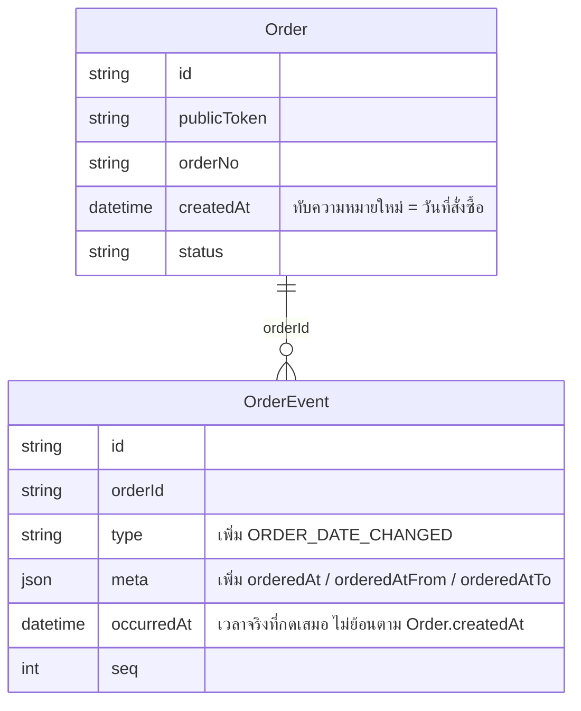

> **โมดูล:** M00033-BackdatedOrderDate
> **ประเภทเอกสาร:** Software Requirements Specification (SRS) - TECHNICAL
> **เวอร์ชัน:** 1.0
> **วันที่จัดทำ:** 2026-08-06
> **สถานะ:** Draft — เขียนก่อนโค้ด (Hard Rule 11) จาก design spec ที่ user อนุมัติแล้ว + โค้ดจริงที่อ่านแล้ว
> **เจ้าของเอกสาร:** safepay-planner (ดู [[Feature-Docs-Ownership]])

# SRS: เลือกวันที่/เวลาของคำสั่งซื้อได้ (Software Requirements Specification — Technical)

---

## 1. บทนำ (Introduction)

### 1.1 วัตถุประสงค์ของเอกสาร

เอกสารนี้กำหนดข้อกำหนดเชิงเทคนิคของฟีเจอร์ "เลือกวันที่/เวลาของคำสั่งซื้อได้" (codename ภายใน: Backdated Order Date) สำหรับให้ `safepay-developer` implement และ `safepay-qa` วางแผนทดสอบได้ตรงกับเจตนาที่ user อนุมัติใน design spec `docs/superpowers/specs/2026-08-06-backdated-order-date-design.md`

เนื้อหาทุกข้อ**สกัดจากโค้ดจริงที่อ่านแล้ว** (`src/services/order.service.ts`, `src/lib/validations.ts`, `src/app/api/orders/**`, `src/lib/order-no.ts`, `src/lib/order-event.ts`, `src/lib/format-date.ts`, `src/lib/date-range.ts`) ไม่ใช่จากความจำ — ตามบทเรียน `feedback_write_docs_from_code_not_memory`

🛑 **หมายเหตุชื่อฟังก์ชัน:** design spec (`§6.2`) และ implementation plan (Task 7) ฉบับแรกอ้างชื่อ `updateOrderContent` ซึ่งไม่มีอยู่จริง — ชื่อจริงในโค้ดคือ **`updateOrder`** (`src/services/order.service.ts:416`, import โดย `src/app/api/orders/[token]/route.ts:9`) แก้ในเอกสารทั้งสองแล้วเมื่อ 2026-08-06 ผู้ implement ยึด `updateOrder` เท่านั้น

### 1.2 ขอบเขตเชิงระบบ (System Scope)

| อยู่ในขอบเขต | นอกขอบเขต |
|---|---|
| `Order.createdAt` — เปลี่ยนความหมายเป็น "วันที่ลูกค้าสั่ง" (ทับตรง ไม่เพิ่มคอลัมน์) | เพิ่มฟิลด์ `orderedAt` แยก (D-1 ปฏิเสธแนวทางนี้แล้ว) |
| `createOrder`/`updateOrder` (`src/services/order.service.ts`) รับพารามิเตอร์ `createdAt?: Date` | ทางสร้างออเดอร์ที่ไม่ผ่านฟอร์ม: booking (`booking.service.ts`), auction, iShip import — ยังใช้เวลาจริงของเหตุการณ์เหมือนเดิม |
| `POST /api/orders` · `PATCH /api/orders/[token]` — รับคีย์ `createdAt` (ISO พร้อม offset) | สต็อก / พัสดุ iShip / ค่าใช้จ่าย — ไม่ย้อนตามวันที่ที่เลือก |
| `OrderEvent` ชนิดใหม่ `ORDER_DATE_CHANGED` + `meta.orderedAt`/`orderedAtFrom`/`orderedAtTo` | สิทธิ์แยกว่าใครลงย้อนหลังได้ (ไม่มี — ใครสร้าง/แก้ออเดอร์ได้ก็ลงย้อนหลังได้เหมือนกัน) |
| UI: `OrderDateRow.tsx` (ใหม่) วางใน `OrderCreateForm.tsx`/`QuickSummaryPanel.tsx` (POS เดสก์ท็อป, QuickForm มือถือ, draft แชท, หน้าแก้ไข) | ผูก order กลับไปยัง message id ต้นทาง |
| Chat draft auto-fill: `DraftOrderProvider.tsx`, `ChatThread.tsx` ส่ง `ChatMessage.createdAt` | เปลี่ยน flow เปลี่ยนวันเข้าใช้บริการของ appointment (feature 00024 — คนละฟิลด์) |
| Timezone fix: `src/app/(paces)/seller/(dashboard)/sales/page.tsx`, `.../orders/page.tsx`, `src/lib/date-range.ts` (export `thaiMidnightUtc`) | `dashboard.service.ts`/`pnl.service.ts` — คำนวณ timezone ถูกอยู่แล้ว ไม่แตะ |

### 1.3 เอกสารอ้างอิง (References)

| เอกสาร | ความสัมพันธ์ |
|--------|-------------|
| [[PRD]] / [[BRD]] ของโมดูลนี้ (`00033 - Backdated Order Date`) | ที่มาของ FR-OBD-*/BR-OBD-* ที่เอกสารนี้ trace กลับ |
| `docs/superpowers/specs/2026-08-06-backdated-order-date-design.md` | design spec ต้นทาง (user อนุมัติ 2026-08-06) — SSOT ของการตัดสินใจ D-1..D-7 |
| `docs/superpowers/plans/2026-08-06-backdated-order-date.md` | implementation plan 12 task — โค้ดตัวอย่างจริง/path จริง (มีจุดผิดชื่อฟังก์ชัน 1 จุด — ดู §1.1) |
| `docs/superpowers/specs/2026-08-06-backdated-order-date-mockup.html` | mockup 3 จอ |
| `docs/20 - Features/00031 - Order Activity Log/` | เจ้าของ `OrderEvent` model/`recordOrderEvent` — งานนี้ต่อยอด ไม่รื้อ |
| `docs/conventions/date-format.md` | SSOT การ format วันที่ทั้งระบบ — `src/lib/format-date.ts` เท่านั้น |
| `feedback_service_error_route_mapping` | บังคับให้ error ใหม่ทุกตัวมี route-catch ครบ — ดู §4.4 |

### 1.4 นิยามและตัวย่อ (Definitions & Acronyms)

| คำ/ตัวย่อ | ความหมาย |
|-----------|----------|
| **วันที่สั่งซื้อ (order date)** | ค่าใน `Order.createdAt` หลังงานนี้ — ความหมายใหม่คือ "เมื่อไหร่ที่ลูกค้าสั่ง" ไม่ใช่ "เมื่อไหร่ที่แถวถูกเขียนลง DB" |
| **เวลาที่กดจริง (keyed-in time)** | เวลาจริงที่มีคนกดปุ่มสร้าง/แก้ (`new Date()` จับตอนต้นฟังก์ชัน) — ใช้กับ `OrderEvent.occurredAt` เสมอ |
| **SSOT เพดานเวลา** | `src/lib/order-date-window.ts` (ไฟล์ใหม่) — จุดเดียวที่นิยามช่วง 90/7 วัน |
| **backdated order** | ออเดอร์ที่ `createdAt` (ค่าที่ผู้ขายกรอก) ≠ เวลาที่กดจริง |
| **keyset pagination** | รูปแบบ pagination ของ `getOrdersByShop`/รายการออเดอร์ที่ cursor ด้วย `createdAt DESC` (`order.service.ts:960-991`) |
| **TDZ** | Temporal Dead Zone — ข้อผิดพลาดตอน import module ถ้าอ้างถึง `const` ก่อนถูกประกาศ (กับดักของ `IsoDateTimeWithOffset` ใน `validations.ts` — ดู §4.2) |

---

## 2. ภาพรวมสถาปัตยกรรม (Architecture Overview)

### 2.1 บริบทระบบ (System Context)

```mermaid
flowchart LR
    subgraph ui["Client UI — (paces)/seller/** (Paces)"]
        ODR[OrderDateRow.tsx — ใหม่]
        OCF[OrderCreateForm.tsx]
        QSP[QuickSummaryPanel.tsx]
        CT[ChatThread.tsx]
        DOP[DraftOrderProvider.tsx]
    end
    subgraph lib["src/lib — pure SSOT"]
        ODW[order-date-window.ts — ใหม่]
        FD[format-date.ts: thaiDayKey / formatOrderDateLabel — ใหม่]
        VAL[validations.ts: CreateOrderSchema.createdAt]
        DR[date-range.ts: thaiMidnightUtc — export]
        ON[order-no.ts: formatOrderNo]
        OE[order-event.ts: ORDER_DATE_CHANGED]
    end
    subgraph api["src/app/api/orders"]
        POST["POST /api/orders"]
        PATCH["PATCH /api/orders/[token]"]
    end
    subgraph svc["src/services"]
        CO[createOrder]
        UO[updateOrder]
        OES[order-event.service.ts: recordOrderEvent]
    end
    subgraph db[(PostgreSQL — Order / OrderEvent)]
    end
    subgraph pages["หน้ารายงาน — timezone fix"]
        SP[sales/page.tsx]
        OP[orders/page.tsx]
    end

    CT -->|"m.createdAt"| DOP --> OCF
    ODR --> OCF --> QSP
    OCF -->|"createdAt: ISO+offset"| POST
    OCF -->|"createdAt: ISO+offset"| PATCH
    POST --> CO
    PATCH --> UO
    CO --> ODW
    UO --> ODW
    CO --> ON
    UO --> ON
    CO --> OES
    UO --> OES
    OES --> OE
    CO --> db
    UO --> db
    VAL --> ODW
    ODR --> ODW
    ODR --> FD
    SP --> DR
    OP --> DR
    SP --> FD
    OP --> FD
```

### 2.2 องค์ประกอบหลัก (Components)

| Component | หน้าที่ | Submodule / Stack |
|-----------|---------|-------------------|
| **`order-date-window.ts`** (ใหม่) | SSOT ของช่วง 90 วันย้อนหลัง / 7 วันล่วงหน้า — pure ไม่มี import | `src/lib/` (TypeScript, ใช้ทั้ง client/RSC/service) |
| **`OrderDateRow.tsx`** (ใหม่) | แถว UI "วันที่สั่งซื้อ" — ยุบ/ขยาย, bound `min`/`max` จาก SSOT | `src/app/(paces)/seller/(dashboard)/orders/new/components/` (Paces, client) |
| **`createOrder`/`updateOrder`** (แก้) | รับ `createdAt?: Date`, ตรวจช่วง, จับเวลาจริงแยก, sync `orderNo` | `src/services/order.service.ts` (service layer) |
| **`recordOrderEvent`** (ไม่แก้ — ผู้บริโภคใหม่) | เขียน `OrderEvent` — งานนี้เรียกด้วย `occurredAt` ที่ถูกต้องและ `type: 'ORDER_DATE_CHANGED'` ใหม่ | `src/services/order-event.service.ts` |
| **API route ×2** (แก้ catch block) | รับ `createdAt` (ISO string) → แปลงเป็น `Date` → catch `OrderDateOutOfWindowError` → 400 | `src/app/api/orders/route.ts`, `src/app/api/orders/[token]/route.ts` (Next.js Route Handler) |
| **`/sales`, `/orders` page.tsx** (แก้) | เลิกตัดวันด้วย UTC ให้ตรงกับ `dashboard.service.ts`/`pnl.service.ts` | RSC — `src/app/(paces)/seller/(dashboard)/**` |

### 2.3 มุมมองการ Deploy (Deployment View)

ไม่มี infra ใหม่ — ทุก component รันในกระบวนการ Next.js เดียวกัน (Vercel serverless functions) เหมือนเดิม migration 1 ไฟล์ (`OrderEvent_type_check`) รันผ่าน `prisma migrate deploy` ตอน build (`vercel.json`) — push `main` = migrate ขึ้น prod ทันที (Hard Rule 15 — ต้องแจ้ง user ก่อน)

---

## 3. ข้อกำหนดเชิงฟังก์ชันเชิงเทคนิค (Technical Functional Requirements)

### TFR-001: `order-date-window.ts` — SSOT ของเพดานเวลา

- **Trace to:** FR-OBD-01, BR-OBD-02, BR-OBD-04
- **คำอธิบายเชิงเทคนิค:** pure module ไม่มี import export ค่าคงที่ `ORDER_BACKDATE_DAYS = 90`, `ORDER_FUTUREDATE_DAYS = 7`, `ORDER_DATE_OUT_OF_WINDOW_MESSAGE` และฟังก์ชัน `orderDateWindow(nowMs)`, `isOrderDateInWindow(valueMs, nowMs)`, `orderDateRejectReason(valueMs, nowMs)` — รับ `nowMs` เป็นพารามิเตอร์เสมอ **ไม่เรียก `Date.now()` ข้างใน** (เทสได้โดยไม่ต้อง mock เวลา)
- **Precondition:** ไม่มี (pure function)
- **Postcondition:** `isOrderDateInWindow` คืน `true` เมื่อ `nowMs - 90d ≤ valueMs ≤ nowMs + 7d` (ขอบทั้งสองด้าน **inclusive**)
- **Error / Edge cases:** `NaN`/`Infinity`/`-Infinity` → `false` เสมอ (fail-closed ผ่าน `Number.isFinite`) — ไม่ throw

### TFR-002: `thaiDayKey` + `formatOrderDateLabel` — ตัดวัน/แสดงผลตามปฏิทินไทย

- **Trace to:** FR-OBD-03, BR-OBD-14
- **คำอธิบายเชิงเทคนิค:** เพิ่มท้าย `src/lib/format-date.ts` (ใช้ `partsInBangkok`/`toValidDate` ที่มีอยู่แล้วในไฟล์ — private ไม่ export ซ้ำ)
  - `thaiDayKey(input): string` → `"YYYY-MM-DD"` (ค.ศ.) — **เป็นคีย์สำหรับเทียบ/จัดกลุ่มเท่านั้น ห้ามแสดงผู้ใช้** (ผู้ใช้ต้องเห็น พ.ศ. เสมอผ่าน `formatDateTH`/`formatDateTimeTH`)
  - `formatOrderDateLabel(input, nowInput?): string` → `"วันนี้ HH:mm น."` / `"เมื่อวาน HH:mm น."` / `"{formatDateTH} HH:mm น."` — อนาคตต้องไม่มีวันเป็น "วันนี้" (ต้องเห็นวันที่เต็มเสมอเมื่อ `key !== todayKey`)
- **Precondition:** ไม่มี
- **Postcondition:** ตัดวันด้วย offset ไทย (UTC+7 คงที่ ไม่มี DST) ไม่ใช่ `toISOString().slice(0,10)` ซึ่งเป็นวัน UTC
- **Error / Edge cases:** input ที่ parse ไม่ได้ → `thaiDayKey` คืน `''`, `formatOrderDateLabel` คืน `'—'`

### TFR-003: `CreateOrderSchema` รับคีย์ `createdAt` (Valibot ด่านแรก)

- **Trace to:** FR-OBD-01, BR-OBD-02, BR-OBD-03, BR-OBD-04
- **คำอธิบายเชิงเทคนิค:** เพิ่มคีย์ `createdAt: v.optional(v.pipe(IsoDateTimeWithOffset, v.check(...)))` ใน `CreateOrderSchema` (`src/lib/validations.ts:292`) — ใช้ `IsoDateTimeWithOffset` regex เดิม (เดิมประกาศที่บรรทัด 1475 ของไฟล์เดียวกัน สำหรับ `OrderAppointmentSchema.start/end` ของ feature 00024) และ `orderDateRejectReason` จาก TFR-001
- 🛑 **Precondition ที่ต้องแก้ก่อน implement TFR นี้:** `const IsoDateTimeWithOffset` ต้องถูก**ย้ายขึ้นไปประกาศเหนือ** `export const CreateOrderSchema` (ปัจจุบันอยู่บรรทัด 1475 ซึ่งอยู่*หลัง* `CreateOrderSchema` ที่บรรทัด 292) — มิฉะนั้นทั้งไฟล์ `validations.ts` throw `ReferenceError: Cannot access 'IsoDateTimeWithOffset' before initialization` **ทันทีที่ import** (TDZ; `v.object({...})` ประเมินตอนโหลดโมดูล ไม่ใช่ตอนเรียกใช้) — พังทั้งแอป ไม่ใช่แค่ route เดียว
- **Postcondition:** `parsed.output.createdAt` เป็น `string | undefined` — `POST /api/orders` และ `PATCH /api/orders/[token]` ใช้ schema นี้ตัวเดียวกัน (body shape เดียวกันทั้งสอง route)
- **Error / Edge cases:** ค่าไม่มี offset (`"2026-07-28T21:14:00"` ไม่มี `Z`/`+HH:mm`) → 400 จาก regex; ค่านอกช่วง 90/7 วัน → 400 จาก `v.check` (ข้อความ = `ORDER_DATE_OUT_OF_WINDOW_MESSAGE`)

### TFR-004: `ORDER_DATE_CHANGED` — ชนิดเหตุการณ์ใหม่ + CHECK constraint

- **Trace to:** FR-OBD-04, BR-OBD-09, BR-OBD-11
- **คำอธิบายเชิงเทคนิค:** เพิ่มค่าใน `ORDER_EVENT_TYPES` (`src/lib/order-event.ts:9-19`, ปัจจุบันมี 9 ค่า → 10), `ORDER_EVENT_META` (label "เปลี่ยนวันที่คำสั่งซื้อ", icon `calendar-event`, tone `neutral`), เพิ่มคีย์ `orderedAt?`/`orderedAtFrom?`/`orderedAtTo?` ใน `OrderEventMeta`, เพิ่ม case ใน `describeOrderEvent` (ORDER_CREATED โชว์บรรทัดรอง "ลงวันที่สั่งซื้อ ..." เมื่อมี `meta.orderedAt`; ORDER_DATE_CHANGED โชว์ "{from} → {to}")
- **Precondition:** `OrderEvent.type` มี CHECK constraint ระดับ DB (`OrderEvent_type_check`, unmanaged SQL — Prisma DSL ประกาศไม่ได้) ต้องเขียน migration มือ **ก่อน** insert แถวชนิดใหม่ (ดู [[DATABASE]])
- **Postcondition:** `tsc --noEmit` ผ่าน 0 error หมายความว่า `Record<OrderEventType, …>` ของ `ORDER_EVENT_META` มีค่าครบทุกตัว (TypeScript บังคับ — ด่านที่ `rg` จับไม่ได้ ตามบทเรียน feature 00028 เรื่อง object key)
- **Error / Edge cases:** ถ้า migration ไม่ apply ก่อน insert → Postgres ปฏิเสธด้วย constraint violation (`P2010`/`23514`) — ต้อง apply migration ที่ local ด้วยมือก่อน implement ต่อ (Hard Rule 14)

### TFR-005: `createOrder` รับ `createdAt` + แยก `occurredAt` เป็นเวลาจริง

- **Trace to:** FR-OBD-01, FR-OBD-05, BR-OBD-01, BR-OBD-02, BR-OBD-03, BR-OBD-09, BR-OBD-10
- **คำอธิบายเชิงเทคนิค:**
  1. เพิ่มพารามิเตอร์ `createdAt?: Date` ใน signature ของ `createOrder` (`order.service.ts:74`)
  2. ต้นฟังก์ชัน (ก่อน `const round2 = …` — จริง ๆ ของ `createOrder` ไม่มี `round2`; ตำแหน่งคือก่อนบรรทัดคำนวณ `subtotal`/`totalAmount` ต้นฟังก์ชัน) จับ `const keyedInAt = new Date()` แล้วตรวจ `if (data.createdAt) { if (orderDateRejectReason(data.createdAt.getTime(), keyedInAt.getTime()) !== null) throw new OrderDateOutOfWindowError() }`
  3. ใส่ `createdAt: data.createdAt ?? undefined` ลง `orderDataBase` (`order.service.ts:209-226`) — `undefined` = Prisma ไม่ใส่คอลัมน์นี้ใน `INSERT` → `@default(now())` ทำงานตามเดิมทุกประการ
  4. `formatOrderNo(order.publicToken, order.createdAt)` (`order.service.ts:319`) อ่านค่ากลับจากแถวที่ insert แล้ว **ไม่ต้องแก้โค้ดจุดนี้** — ได้เดือน/ปีถูกต้องโดยอัตโนมัติ
  5. `recordOrderEvent` (`order.service.ts:325-330`) ต้องเปลี่ยนจาก `occurredAt: order.createdAt` เป็น `occurredAt: keyedInAt` และเพิ่ม `meta.orderedAt` เมื่อ `isBackdated` (คำนวณจาก `data.createdAt.getTime() !== keyedInAt.getTime()`)
- **Precondition:** `data.createdAt` ถ้ามีต้องเป็น `Date` object ที่ valid (แปลงจาก ISO string ที่ route ทำให้แล้ว — service ไม่รับ string)
- **Postcondition:** `Order.createdAt` = ค่าที่ส่งมา (หรือ `now()` ถ้าไม่ส่ง) · `OrderEvent(ORDER_CREATED).occurredAt` ≈ เวลาจริงที่ฟังก์ชันถูกเรียก **เสมอ ไม่ว่า `createdAt` จะเป็นอะไร**
- 🛑 **Error / Edge cases (จุดพังเงียบที่สำคัญที่สุดของงานนี้):** ก่อนงานนี้ `occurredAt: order.createdAt` "บังเอิญถูก" เพราะสองค่าเท่ากันมาตลอด — ถ้าลืมแก้เป็น `keyedInAt` จะไม่มี type error และไม่มีเทสเดิมจับ (มีแต่เทสใหม่ของงานนี้เท่านั้นที่จับได้ — ดู [[TestCase]] เคส "occurredAt ≈ now ไม่ใช่ค่าที่ส่งไป")

### TFR-006: `updateOrder` แก้วันที่ + sync `orderNo` ในทรานแซกชันเดียว

- **Trace to:** FR-OBD-01, FR-OBD-05, BR-OBD-01, BR-OBD-02, BR-OBD-05, BR-OBD-09, BR-OBD-11, BR-OBD-12
- **คำอธิบายเชิงเทคนิค:** (ชื่อฟังก์ชันจริงคือ `updateOrder` — ดู §1.1)
  1. ต้นฟังก์ชัน (`order.service.ts:423`, ก่อน `const round2 = …`) จับ `const editedAt = new Date()` แล้วตรวจช่วงเวลาเหมือน TFR-005
  2. ใน `tx.order.findFirst` (`order.service.ts:453-462`) เพิ่ม `createdAt: true, publicToken: true` ใน `select`
  3. ใน `$transaction` เดียวกับที่ update เนื้อหาออเดอร์ (`order.service.ts:517-536`) เพิ่ม block: ถ้า `data.createdAt && data.createdAt.getTime() !== existing.createdAt.getTime()` → `tx.order.update({ data: { createdAt: data.createdAt, orderNo: formatOrderNo(existing.publicToken, data.createdAt) } })` **แล้ว** `recordOrderEvent(tx, { type: 'ORDER_DATE_CHANGED', occurredAt: editedAt, meta: { orderedAtFrom: existing.createdAt.toISOString(), orderedAtTo: data.createdAt.toISOString() } })` — ทั้งคู่อยู่ใน `$transaction` เดียวกับ block update เนื้อหาออเดอร์ที่มีอยู่แล้ว (ไม่เปิด transaction ใหม่)
  4. `changedCount` ของ `ORDER_EDITED` (`order.service.ts:559-572`) **ต้องไม่นับ `createdAt`** — การเลื่อนวันที่มี event `ORDER_DATE_CHANGED` ของตัวเองแล้ว
- **Precondition:** `existing.status === 'PENDING'` (ตรวจอยู่แล้วที่ `order.service.ts:468`, ไม่ต้องเพิ่ม guard ใหม่ — การแก้วันที่ผูกกับ guard เดียวกับการแก้เนื้อหาออเดอร์ทั้งหมด)
- **Postcondition:** เมื่อวันที่เปลี่ยนข้ามเดือน → คอลัมน์ `orderNo` sync ตามเดือนใหม่ทันที (ไม่ค้างเดือนเก่า) · มี `OrderEvent` แถวใหม่ type `ORDER_DATE_CHANGED`
- **Error / Edge cases:** `data.createdAt` เท่ากับ `existing.createdAt` เป๊ะ (ไม่เปลี่ยน) → ข้าม block นี้ทั้งหมด ไม่มี event ใหม่ ไม่มี update ซ้ำซ้อน

### TFR-007: `OrderDateOutOfWindowError` — route-catch ครบทั้ง 2 route

- **Trace to:** FR-OBD-01, BR-OBD-04
- **คำอธิบายเชิงเทคนิค:** `export class OrderDateOutOfWindowError extends Error` ประกาศใน `order.service.ts` ใกล้ error class อื่น (`OrderNotFoundError`/`OrderNotEditableError` ที่ `:399-404`) — ทั้ง `POST /api/orders` (`route.ts:80-108`) และ `PATCH /api/orders/[token]` (`route.ts:92-106`) ต้องมี `if (e instanceof OrderDateOutOfWindowError) return NextResponse.json({ error: ORDER_DATE_OUT_OF_WINDOW_MESSAGE }, { status: 400 })` **ก่อน** `console.error(...)` fallback 500
- **Precondition:** route ทั้งสองแปลง `parsed.output.createdAt` (string) เป็น `Date` ก่อนส่งเข้า service เสมอ (`{ createdAt: createdAtIso, ...rest } = parsed.output` แล้ว `...(createdAtIso ? { createdAt: new Date(createdAtIso) } : {})`)
- **Postcondition:** วันที่นอกช่วง 90/7 วันที่หลุดผ่าน Valibot มาได้ (เช่น caller ฝั่ง server อื่นที่เรียก `createOrder` ตรง ๆ ไม่ผ่าน schema) ยังถูกจับที่ service แล้ว route แปลงเป็น 400 — **ไม่มีทางตกเป็น 500**
- **Error / Edge cases:** นี่คือ cross-file error-mapping ที่บังคับ enumerate ตาม Hard Rule ของ Controller — ดู §9 Traceability Matrix แถว TFR-007 ที่ map ไปทั้งสอง route ชัดเจน

### TFR-008: UI `OrderDateRow.tsx` — ยุบ/ขยาย ใช้ร่วม 4 จุด

- **Trace to:** FR-OBD-01, BR-OBD-03
- **คำอธิบายเชิงเทคนิค:** component ใหม่ (`'use client'`) รับ props `control`, `setValue` (React Hook Form), `fromMessage?`, `messageTooOld?` — ค่าตั้งต้นแสดงแถวสรุปอ่านอย่างเดียว (`formatOrderDateLabel`) + ปุ่ม "เปลี่ยน"; กดแล้วเปิด `input type="datetime-local"` ที่ `min`/`max` ผูกกับ `orderDateWindow()` — วางใน `OrderCreateForm.tsx` (POS เดสก์ท็อป) และ `QuickSummaryPanel.tsx` (มือถือ) **component เดียวกัน ห้าม copy markup ซ้ำ** ทั้ง 4 จุดที่ระบุใน design spec §9.3 (POS, QuickForm, chat draft, edit page) ใช้ผ่าน `OrderCreateForm` ตัวเดียวกันทั้งหมด
- **Precondition:** ต้องผ่าน `safepay-ux` Design Spec ก่อน (Hard Rule 8) — หัวข้อนี้เป็น intent ไม่ใช่ final spec
- **Postcondition:** `FormValues.orderedAt?: string` (ค่า `datetime-local`, เวลาเครื่อง) — แปลงเป็น ISO+offset ตอน submit จุดเดียว (`new Date(values.orderedAt).toISOString()`) — pattern เดียวกับ `AuctionForm.tsx:56-63`
- **Error / Edge cases:** ไม่แตะช่องเลย (`orderedAt === undefined`) → ไม่ส่งคีย์ `createdAt` ไป API เลย = เส้นทางเดิมทุกประการ

### TFR-009: Chat auto-fill — เวลาข้อความ → วันที่สั่งซื้อ

- **Trace to:** FR-OBD-02, BR-OBD-06
- **คำอธิบายเชิงเทคนิค:** เพิ่ม `messageCreatedAt?: string` ใน `OpenDraftInput` (`DraftOrderProvider.tsx:42`) และ `ChatDraft` type — `ChatThread.tsx` ทั้ง 2 ทางเข้า (กดค้างมือถือ, hover เดสก์ท็อป) ส่ง `messageCreatedAt: new Date(m.createdAt).toISOString()` คู่กับ `prefillText` ที่มีอยู่แล้ว — `OrderCreateForm` รับเป็น prop `prefillCreatedAt` แล้วคำนวณ `defaultValues.orderedAt` ผ่าน `isOrderDateInWindow` (TFR-001)
- **Precondition:** `m.createdAt` ต้องมีอยู่แล้วใน `ChatMessageView` (`chat.service.ts:113`) — ไม่ต้อง query เพิ่ม
- **Postcondition:** ข้อความในช่วง 90 วัน → เติมเวลาข้อความให้อัตโนมัติ + เปิด `OrderDateRow` ค้างไว้ (ไม่ยุบ) + ชิป "ใช้เวลาจากข้อความ"; เก่ากว่า 90 วัน → **ไม่เติม** (`defaultValues.orderedAt = undefined`) + ชิป "ข้อความเก่าเกินกำหนด — ใช้เวลาปัจจุบัน" (fail-closed ไม่ error)
- **Error / Edge cases:** ทางเข้าที่ไม่มีข้อความต้นทาง (ปุ่มสร้างออเดอร์เปล่า, `CustomerPanel.startCreateOrder`) ไม่ต้องส่ง `messageCreatedAt` — ตรวจด้วย `rg -n "openDraft\(\{" "src/app/(paces)/seller/(chat)/"` ว่าทุกจุดที่มี `prefillText` มี `messageCreatedAt` คู่กันจริง

### TFR-010: เลิกตัดวันด้วย UTC ใน `/sales` และ `/orders` (บั๊กที่มีอยู่ก่อน — แก้ในรอบนี้ตาม D-6)

- **Trace to:** FR-OBD-03, BR-OBD-14
- **คำอธิบายเชิงเทคนิค:**
  - export `thaiMidnightUtc` จาก `src/lib/date-range.ts` (ปัจจุบันเป็น private function บรรทัด 42 — เปลี่ยนเป็น `export function`)
  - `sales/page.tsx`: แทน `to.setHours(23,59,59,999)` (บรรทัด 76 — เป็น "23:59 UTC" ไม่ใช่ "23:59 ไทย") ด้วย `thaiMidnightUtc(...)` คู่ `from`/`toExcl` (ช่วงเปิดปลาย `< toExcl` แทน `<= to`); แทน `new Date(o.createdAt).toISOString().slice(0,10)` (บรรทัด 147) ด้วย `thaiDayKey(o.createdAt)`
  - `orders/page.tsx`: แทน `toDateStr`/`lastDays`/`prevStartStr`/`prevEndStr` (บรรทัด 176, 184-196) ที่ใช้ `setUTCDate` ด้วย `thaiDayKey` + เดินถอยหลังทีละ `DAY_MS`
- **Precondition:** `dashboard.service.ts` (`TZ_OFFSET_MS`) และ `pnl.service.ts` ทำถูกอยู่แล้ว — งานนี้ทำให้ 2 หน้าที่เหลือ**ตรงกัน** ไม่ใช่คิดค้นวิธีใหม่
- **Postcondition:** ออเดอร์เวลา 00:00–07:00 น. ไทย นับเป็นวันเดียวกันทั้ง 4 surface (dashboard, `/sales`, `/orders`, P&L)
- **Error / Edge cases:** `Expense.expenseDate` เก็บเป็น UTC-midnight-of-calendar-date โดยตั้งใจ (Dual Boundary Design ของ `date-range.ts`) — **ไม่ใช่บั๊ก ห้ามแก้จุดนั้น** ต้องแยกให้ออกจาก `Order.createdAt` (timestamptz) ตอน grep เช็คผลลัพธ์ (`rg "toISOString\(\)\.slice\(0, ?10\)" "src/app/(paces)/seller/"` แล้วอ่านผลว่าจุดไหนตั้งใจเป็น UTC จริง)

---

## 4. ข้อกำหนดส่วนต่อประสาน (Interface / API Specification)

รายละเอียดเต็มอยู่ที่ [[API]] — สรุปที่นี่เฉพาะ contract ที่กระทบ

### 4.1 API Endpoints

| Method | Path | คำอธิบาย | Auth |
|--------|------|----------|------|
| `POST` | `/api/orders` | สร้างคำสั่งซื้อ — เพิ่มคีย์ optional `createdAt` | NextAuth session (seller) |
| `PATCH` | `/api/orders/[token]` | แก้ไขคำสั่งซื้อเต็มรูป — เพิ่มคีย์ optional `createdAt` เดียวกัน | NextAuth session (seller, ownership scope `shopId`) |

### 4.2 รายละเอียดคีย์ที่เพิ่ม

```
createdAt?: string   // ISO-8601 พร้อม offset เช่น "2026-07-28T21:14:00+07:00"
                      // ไม่ส่ง = เส้นทางเดิมทุกประการ (Order.createdAt ได้ @default(now()))
```

- **Error codes ใหม่:** `400` พร้อมข้อความ `"วันที่คำสั่งซื้อต้องอยู่ระหว่าง 90 วันย้อนหลังถึง 7 วันล่วงหน้า"` (ทั้ง Valibot ด่านแรก และ service ด่านสอง)
- **Idempotency / Rate limit:** ไม่เปลี่ยนจากเดิม (CSRF Origin-check + rate-limit เดิมของ `guardApi` ยังครอบอยู่)

### 4.3 Events / Messaging

ไม่มี — `OrderEvent` เป็นตารางฐานข้อมูล ไม่ใช่ message queue

### 4.4 🛑 Cross-file Error-Mapping (บังคับ enumerate)

| Error class (service) | Throw จากที่ไหน | Route ที่ต้อง catch | HTTP Status | ข้อความ |
|---|---|---|---|---|
| `OrderDateOutOfWindowError` (ใหม่) | `createOrder` (`order.service.ts`, ต้นฟังก์ชัน) | `POST /api/orders` (`route.ts`) | 400 | `ORDER_DATE_OUT_OF_WINDOW_MESSAGE` |
| `OrderDateOutOfWindowError` (ใหม่ — ตัวเดียวกัน) | `updateOrder` (`order.service.ts`, ต้นฟังก์ชัน) | `PATCH /api/orders/[token]` (`[token]/route.ts`) | 400 | `ORDER_DATE_OUT_OF_WINDOW_MESSAGE` |

ทั้งสองแถวเป็น error class เดียวกันแต่ throw จากคนละฟังก์ชัน (`createOrder` vs `updateOrder`) — **ต้องมี catch block ที่ทั้ง 2 route แยกกัน** ขาดจุดใดจุดหนึ่ง = 500 ตัวเปล่าให้ผู้ใช้ (บทเรียน `feedback_service_error_route_mapping` — 00003 P2 `OutOfStockError` เคยตกหล่นจุดเดียวมาแล้ว)

### 4.5 Sequence ของ flow สำคัญ

ดู [[SDS]] §4 (สร้างออเดอร์ย้อนหลัง / แก้วันที่)

---

## 5. ข้อกำหนดด้านข้อมูล (Data Requirements)

### 5.1 Data Model / Entities

**ไม่มีคอลัมน์ใหม่** — ใช้ `Order.createdAt` (`DateTime @default(now())`) เดิมทุกประการ

| Entity | คำอธิบาย | Owner store |
|--------|----------|-------------|
| **`Order.createdAt`** | เปลี่ยนความหมาย: "เมื่อไหร่ที่ลูกค้าสั่ง" (เดิม: "เมื่อไหร่ที่แถวถูกเขียน") | PostgreSQL (Supabase) |
| **`Order.orderNo`** | ไม่เปลี่ยน schema — แต่ค่าต้อง recompute เมื่อ `createdAt` เปลี่ยน (`updateOrder`) เพราะคำนวณจากปี/เดือนของ `createdAt` | PostgreSQL |
| **`OrderEvent.type`** | เพิ่มค่า `'ORDER_DATE_CHANGED'` เข้า CHECK constraint (unmanaged SQL) | PostgreSQL |
| **`OrderEvent.meta`** | เพิ่มคีย์ `orderedAt`/`orderedAtFrom`/`orderedAtTo` (JSON, ไม่มี schema เปลี่ยนที่ DB — เป็น TypeScript type เท่านั้น) | PostgreSQL (`Json @default("{}")`) |

### 5.2 ความสัมพันธ์ (ERD)



### 5.3 Migration / Data Lifecycle

ไฟล์เดียว: `prisma/migrations/20260806120000_order_event_date_changed/migration.sql`

```sql
ALTER TABLE "OrderEvent" DROP CONSTRAINT IF EXISTS "OrderEvent_type_check";
ALTER TABLE "OrderEvent" ADD CONSTRAINT "OrderEvent_type_check" CHECK ("type" IN (
    'ORDER_CREATED','ORDER_EDITED','ORDER_CANCELLED','TRACKING_ADDED',
    'SHIPMENT_CREATED','SHIPMENT_CANCELLED','SHIPMENT_LINKED',
    'SMS_LINK_SENT','BUYER_CONFIRMED','ORDER_DATE_CHANGED'
)) NOT VALID;
ALTER TABLE "OrderEvent" VALIDATE CONSTRAINT "OrderEvent_type_check";
```

`NOT VALID` + `VALIDATE` ตามแบบเดียวกับ `Shop_vertical_check` (feature 00028) — จับล็อกสั้น ๆ ตอน `ADD`, สแกนแถวเดิมแบบไม่บล็อกการเขียนตอน `VALIDATE` แถวเดิมทุกแถวผ่านอยู่แล้วเพราะรายชื่อใหม่เป็น superset ของเดิม 🛑 **ต้อง `safepay-database` เป็นคน dispatch งาน migration นี้** (แตะ schema) และห้าม `prisma db pull`/`migrate dev` เด็ดขาด (unmanaged SQL — Hard Rule 14)

ไม่มี data backfill — ออเดอร์เก่าทั้งหมด `createdAt` ยังตรงกับเวลาที่บันทึกจริงอยู่แล้ว (ไม่มีอะไรต้องแก้ย้อนหลัง)

---

## 6. ข้อกำหนดที่ไม่ใช่ฟังก์ชัน (Non-Functional Requirements)

| ด้าน | ข้อกำหนด | เป้าหมายที่วัดได้ |
|------|----------|-------------------|
| **Correctness (ความถูกต้องของยอด)** | ยอดขายทุกหน้าตกวันที่ที่ผู้ขายระบุ | Browser QA: ลงวันที่เมื่อวาน 21:30 → ยอดปรากฏใน dashboard/`, /sales`, P&L, `/orders` การ์ดสถิติ ทุกหน้าตรงกัน |
| **Correctness (ขอบเที่ยงคืน)** | ตัดวันตามปฏิทินไทยไม่ใช่ UTC | ลงเวลา 00:30 น. ต้องนับเป็นวันนั้น ไม่ใช่วันก่อนหน้า — ทั้ง `/sales` และ `/orders` |
| **Fail-closed** | ค่าเวลาที่ไม่ valid/นอกช่วง ต้องถูกปฏิเสธ ไม่ clamp เงียบ | unit test `isOrderDateInWindow(NaN, …) === false`; integration test วันที่เกิน 90 วัน → 400 ไม่ใช่ 500/200 |
| **Auditability** | ประวัติ (`OrderEvent`) ต้องเป็นหลักฐานที่ไม่ถูกย้อนได้ | `occurredAt` ≈ `now` เสมอ แม้ `createdAt` ย้อนหลังได้แล้ว — integration test เฉพาะเจาะจง |
| **Idempotent UI default** | ไม่แตะช่องวันที่ = พฤติกรรมเดิมเป๊ะ | regression: สร้างออเดอร์ปกติไม่ส่ง `createdAt` → `meta.orderedAt` ต้อง `undefined` |
| **Zero-regression ของ orderNo** | สร้างออเดอร์ปกติ orderNo ต้องคำนวณถูกเหมือนเดิม (ไม่มีอะไรเปลี่ยนที่ `createOrder`) | unit/integration เดิมของ `formatOrderNo` ยังผ่าน |
| **Observability** | ไม่มี log ใหม่ที่จำเป็น — error path ใช้ `console.error` แบบเดิมของ route | ตรวจด้วย code review ว่า catch block ใหม่ log เหมือน pattern เดิม |

---

## 7. ข้อจำกัดทางเทคนิคและการพึ่งพา (Technical Constraints & Dependencies)

### 7.1 ข้อจำกัดทางเทคนิค

- `order-date-window.ts` ต้องเป็น **pure module ไม่มี import** — เรียกได้ทั้ง client component, RSC, service layer โดยไม่ดึง server-only code เข้า client bundle
- `IsoDateTimeWithOffset` ต้องถูกย้ายขึ้นเหนือ `CreateOrderSchema` ก่อน (§ TFR-003) — ไม่ทำ = แอปล่มทั้งตัวตอน import
- Migration ของ `OrderEvent_type_check` เป็น unmanaged SQL — เขียนมือทุกครั้งที่รายชื่อ event เปลี่ยน ห้าม `prisma db pull`
- `updateOrder` แก้ได้เฉพาะ `PENDING` (guard เดิมที่มีอยู่แล้ว, ไม่ต้องเพิ่ม guard ใหม่สำหรับ `createdAt` — ผูกกับ guard เดียวกับการแก้เนื้อหาทั้งหมด)
- หน้าที่ query orders ด้วย keyset (`createdAt DESC`) **ไม่เปลี่ยนการเรียง** — ผลข้างเคียงคือออเดอร์ย้อนหลังไม่อยู่หัวรายการ ต้องมี toast บอก (ไม่ใช่การแก้ pagination logic)

### 7.2 การพึ่งพาภายนอก/ภายใน

| Dependency | ประเภท | ความเสี่ยง |
|------------|--------|------------|
| **feature 00031 (Order Activity Log)** | internal | `OrderEvent`/`recordOrderEvent` ต้องคง contract เดิม (`occurredAt` optional, default `now()`) — งานนี้เป็นผู้บริโภครายใหม่ ไม่แก้ signature |
| **feature 00024 (Service Appointment)** | internal | ใช้ `IsoDateTimeWithOffset` ร่วมกัน (`OrderAppointmentSchema.start/end`) — งานนี้ทำให้ constant ถูก reuse ไม่ใช่ duplicate |
| **`dashboard.service.ts`/`pnl.service.ts`** | internal (อ้างอิง) | ทำ timezone ถูกอยู่แล้ว — เป็นต้นแบบของ TFR-010 ไม่ใช่สิ่งที่ต้องแก้ |
| **Vercel build (`prisma migrate deploy`)** | infra | push `main` = migrate ขึ้น prod อัตโนมัติ (Hard Rule 15) — ต้องแจ้ง user ก่อน push |

### 7.3 สมมติฐานทางเทคนิค (Assumptions)

- `ChatMessage.createdAt` มีอยู่แล้วในทุกทางเข้าที่ต้องใช้ (`ChatMessageView`, `chat.service.ts:113`) — ไม่ต้อง query เพิ่ม
- `formatDateTH`/`formatTimeHM` (มีอยู่แล้วใน `format-date.ts`) ให้รูปแบบ `"28 ก.ค. 2569"`/`"21:14"` ตรงตามที่เทสคาดหวัง — ถ้าต่าง ต้องแก้เทสให้ตรงของจริง ไม่ใช่แก้ `formatDateTH` (มีผู้ใช้อื่นทั่วระบบ)
- `requireActiveShop`/ownership check ที่มีอยู่แล้วในทั้ง 2 route คืน context พอสำหรับงานนี้ — ไม่ต้องเพิ่ม query สิทธิ์

---

## 8. ความเสี่ยงเชิงสถาปัตยกรรม (Architectural Risks)

| ความเสี่ยง | ผลกระทบ | แนวทางลด |
|-----------|---------|----------|
| **ลืมแยก `occurredAt` ออกจาก `createdAt` ใน `createOrder`/`updateOrder`** | Activity Log ผิด — เวลาที่ "มีคนกด" กลายเป็นเวลาที่ผู้ขายกรอกเอง ทำลายความเป็นหลักฐาน ไม่มี type error ไม่มีเทสเดิมจับ | integration test เฉพาะเจาะจง (§10 ของ design spec) — เป็นด่านเดียวที่จับได้ |
| **ลืม recompute `orderNo` ตอน `updateOrder`** | เลขที่ผู้ใช้เห็นบนจอ (คำนวณสดจาก `createdAt`) ไม่ตรงกับคอลัมน์ที่เก็บไว้ → ค้นด้วย `@@index([orderNo])` ไม่เจอ | ทำใน `$transaction` เดียวกับการเปลี่ยน `createdAt` เสมอ + integration test เปลี่ยนวันข้ามเดือน |
| **route ใด route หนึ่งไม่มี catch `OrderDateOutOfWindowError`** | 500 ตัวเปล่าแทนที่จะเป็น 400 — ผู้ใช้เห็น error message ทั่วไป ไม่รู้สาเหตุจริง | §4.4 enumerate ครบทั้ง 2 route + reviewer grep `rg -n "OrderDateOutOfWindowError" src/app/api/` ต้องเห็น 2 ไฟล์ |
| **IsoDateTimeWithOffset TDZ** | ทั้งแอปล่มตอน import `validations.ts` (ไม่ใช่แค่ route เดียว) | ย้ายประกาศขึ้นก่อน implement TFR-003 ตัวอื่น + พิสูจน์ด้วย `npx tsx -e "import('./src/lib/validations.ts')..."` |
| **timezone fix (TFR-010) ทำแค่บางจุดของหน้า** | แกน x ของกราฟ `/sales` อาจสร้างจาก `toISOString().slice(0,10)` คนละจุดกับที่ตัด bucket ยอดขาย — คีย์ไม่ตรงกันทำให้กราฟกลายเป็น 0 ทั้งแถบ | ไล่ทุกจุดที่สร้าง date key ในทั้ง 2 หน้าให้ใช้ `thaiDayKey` เดียวกันหมด ไม่ใช่แก้จุดเดียว |
| **หน้าที่ query orders ด้วย keyset cursor ผิดปกติหลังมีออเดอร์ backdated ปนอยู่** | cursor `createdAt DESC` ยังทำงานถูกทางคณิตศาสตร์ (backdated order คือแค่แถวที่ `createdAt` เก่ากว่า) — ความเสี่ยงจริงคือ UX ไม่ใช่ correctness | toast แจ้งตำแหน่งหลังบันทึก (§9.3 design spec) ไม่แก้ pagination logic |

---

## 9. Traceability Matrix

| BRD FR-ID | SRS TFR-ID | Component | สถานะ |
|-----------|------------|-----------|-------|
| FR-OBD-01 | TFR-001, TFR-003, TFR-005, TFR-006, TFR-007, TFR-008 | `order-date-window.ts`, `validations.ts`, `order.service.ts`, route ×2, `OrderDateRow.tsx` | Draft |
| FR-OBD-02 | TFR-009 | `DraftOrderProvider.tsx`, `ChatThread.tsx`, `OrderCreateForm.tsx` | Draft |
| FR-OBD-03 | TFR-002, TFR-010 | `format-date.ts`, `date-range.ts`, `sales/page.tsx`, `orders/page.tsx` | Draft |
| FR-OBD-04 | TFR-004, TFR-005, TFR-006 | `order-event.ts`, migration, `order.service.ts` | Draft |
| FR-OBD-05 | TFR-005, TFR-006 | `order-no.ts` (ไม่แก้ — ผู้บริโภคที่ได้ผลถูกฟรี), `order.service.ts` | Draft |

---

## 10. สรุป (Summary)

เอกสาร SRS นี้กำหนดข้อกำหนดเชิงเทคนิคของ **การเลือกวันที่/เวลาของคำสั่งซื้อได้ (Backdated Order Date)** เพื่อให้ DEV/QA implement และทดสอบได้ตรงกับเจตนาใน design spec ที่ user อนุมัติแล้ว

**ขอบเขตที่ครอบคลุม:**
- ทับ `Order.createdAt` ตรง ไม่เพิ่มคอลัมน์ — SSOT เพดานเวลาอยู่ที่ `order-date-window.ts` ไฟล์เดียว
- `createOrder`/`updateOrder` แยก "เวลาที่กดจริง" (`OrderEvent.occurredAt`) ออกจาก "วันที่สั่งซื้อ" (`Order.createdAt`) อย่างเด็ดขาด
- `orderNo` sync ตอนแก้วันที่ในทรานแซกชันเดียวกัน
- error ใหม่ (`OrderDateOutOfWindowError`) มี route-catch ครบทั้ง 2 route (enumerate ที่ §4.4)
- แก้บั๊ก timezone ที่มีอยู่ก่อนใน `/sales`/`/orders` ให้ตรงกับ `dashboard.service.ts`/`pnl.service.ts`

**ประเด็นที่ต้องตัดสินใจเพิ่ม (Open Questions):**
- ไม่มี — design spec ปิดการตัดสินใจครบแล้ว (D-1..D-7) เอกสารนี้เป็นการแปลงเป็นสเปกเทคนิคเท่านั้น

**หมายเหตุชื่อฟังก์ชัน:** design spec และ implementation plan ฉบับแรกเขียนชื่อ `updateOrderContent` ซึ่งไม่มีอยู่จริง — แก้เป็น `updateOrder` (ชื่อจริงที่ `src/services/order.service.ts:416`) ในเอกสารทั้งสองแล้วเมื่อ 2026-08-06 ผู้ implement ยึด `updateOrder` เท่านั้น
