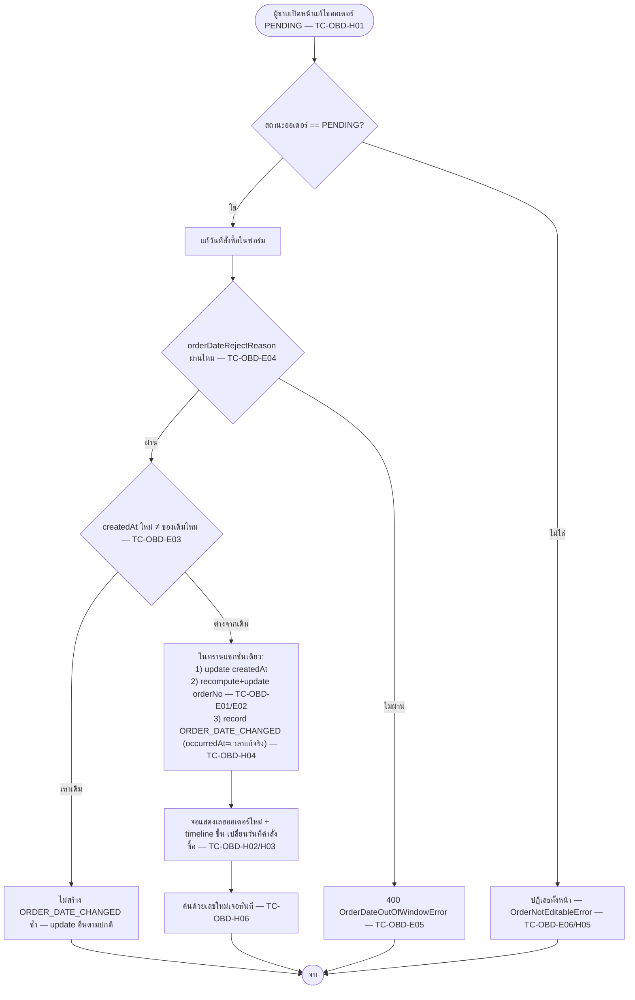

> **โมดูล:** M00033-BackdatedOrderDate
> **ประเภทเอกสาร:** Test Case
> **เวอร์ชัน:** 1.0
> **วันที่จัดทำ:** 2026-08-06 (เขียนก่อน implement ตามลำดับ Hard Rule 11 — ไม่ใช่ backfill)
> **สถานะ:** Draft — รอ user review คู่กับ PRD/BRD; ทุกเคสยังไม่เคยรัน เพราะยังไม่มีโค้ด (`order-date-window.ts` ยังไม่ถูกสร้าง)
> **เจ้าของเอกสาร:** safepay-qa (ดู [[Feature-Docs-Ownership]])

# Test Case: เลือกวันที่/เวลาของคำสั่งซื้อได้ย้อนหลัง (Backdated Order Date)

---

## 1. Overview

ชุดทดสอบนี้ครอบ feature 00033 ทั้งฟีเจอร์ตามที่ล็อกไว้ใน design spec
`docs/superpowers/specs/2026-08-06-backdated-order-date-design.md` (D-1 ถึง D-7) และ implementation plan
`docs/superpowers/plans/2026-08-06-backdated-order-date.md` (Task 2, 3, 12) — ครอบทั้ง unit (pure function),
integration (service + API route ยิงลง DB จริง) และ browser QA (จอจริงบน `seller.deepth.local:4000`)

- **เอกสารต้นทาง:** design spec §3–§10 (BRD ของ feature นี้ยังไม่แยกไฟล์ — spec คือแหล่งความจริงเดียวที่ user อนุมัติแล้ว) ทุก scenario อ้างกลับรหัส `FR-OBD-XX` ที่นิยามไว้ในเอกสารนี้ (§1.1) เทียบกับหัวข้อ spec ตรง ๆ
- **ขอบเขตชุดทดสอบ (Scope):**
  - **In-scope:** `order-date-window.ts`, `thaiDayKey`/`formatOrderDateLabel`, `formatOrderNo` (ข้ามปี พ.ศ.), `createOrder`/`updateOrder` รับ `createdAt`, route `POST /api/orders` + `PATCH /api/orders/[token]`, `OrderEvent` ใหม่ `ORDER_DATE_CHANGED`, UI แถววันที่สั่งซื้อ (POS เดสก์ท็อป + QuickForm มือถือ + แชท draft + หน้าแก้ไข), timezone fix ของ `/sales` และ `/orders` (§5.3)
  - **Out-of-scope:** booking/auction/iShip import (ยังใช้เวลาจริงเสมอ — ทดสอบแค่ regression ว่าไม่โดนแตะ), สต็อก/พัสดุ/ค่าใช้จ่าย (ไม่ย้อนตามวันที่ออเดอร์), สิทธิ์แยกว่าใครลงย้อนหลังได้ (ไม่มี), การผูก order กลับไปยัง message id ต้นทาง
- **สภาพแวดล้อม:**
  - Unit: Vitest local (`npm test -- <path> --run`), ไม่แตะ DB
  - Integration: Vitest ยิงลง dev DB ผ่าน Prisma client จริง (`.env` local) — ล้างข้อมูลด้วย `deleteTestData({ userIds, shopIds })` เท่านั้น (Hard Rule 13)
  - Browser QA: `https://seller.deepth.local:4000` เท่านั้น (ห้าม `localhost`) — user เป็นคนรัน dev server เอง

### 1.1 รหัส Requirement ที่ใช้ trace (FR-OBD-XX)

เอกสารนี้ยังไม่มี BRD แยกไฟล์ในรอบ pre-implementation — รหัสด้านล่างตั้งขึ้นจาก decision table (D-1..D-7) และหัวข้อ §4–§9 ของ design spec โดยตรง เพื่อให้ traceability matrix (§3) มีจุดอ้างอิงที่แน่นอน หาก BRD ถูกเขียนภายหลังต้อง sync รหัสให้ตรงกัน

| รหัส | ใจความ | อ้างอิง spec |
|---|---|---|
| FR-OBD-01 | ผู้ขายระบุวันที่-เวลาคำสั่งซื้อได้เองทุกหน้าที่สร้าง/แก้ออเดอร์ (POS เดสก์ท็อป, QuickForm มือถือ, แชท draft, หน้าแก้ไข) | §2 ข้อ 1, D-5, §9.3 |
| FR-OBD-02 | ค่าตั้งต้น = เวลาปัจจุบัน — ไม่แตะช่องนี้เลย = พฤติกรรมเดิมเป๊ะ | §4 แถว "ค่าตั้งต้น" |
| FR-OBD-03 | ช่วงที่ยอมรับ = `now−90d` ถึง `now+7d` (inclusive ทั้งสองขอบ) ตรวจทั้ง client และ server ด้วยฟังก์ชันเดียวกัน | §4 SSOT ของเพดานเวลา, D-2 |
| FR-OBD-04 | ค่านอกช่วง ถูกปฏิเสธที่ server ด้วย error เฉพาะ (400) ไม่ clamp เงียบ — ครอบทั้ง `POST` และ `PATCH` | §4 แถว "นอกช่วง", §8 |
| FR-OBD-05 | แก้วันที่ทีหลังได้เฉพาะออเดอร์สถานะ `PENDING` | §4 แถว "แก้ทีหลัง", D-3 |
| FR-OBD-06 | ปุ่มสร้างออเดอร์จากข้อความในแชทเติมเวลาของข้อความให้อัตโนมัติ เห็นได้/แก้ได้; ข้อความเก่ากว่า 90 วันไม่เติม ใช้เวลาปัจจุบันแทน | §4 แถว "เวลาจากแชท", D-4, §9.4 |
| FR-OBD-07 | เลขคำสั่งซื้อ (`orderNo`) ซิงก์กับวันที่ที่เลือกเสมอ ทั้งตอนสร้างและตอนแก้ (คอลัมน์ที่เก็บไว้ต้องตรงกับที่หน้าจอคำนวณสด) | §5.1 |
| FR-OBD-08 | ยอดขาย/รายงานทุกหน้าตกวันที่ที่ผู้ขายระบุ ไม่ใช่วันที่คีย์ — ตัดวันด้วยเวลาไทยไม่ใช่ UTC | §2 ข้อ 3, §5.3, D-6 |
| FR-OBD-09 | `OrderEvent.occurredAt` ของทุกเหตุการณ์ = เวลาจริงที่กดเสมอ (ไม่ย้อนตามวันที่ที่กรอก); เพิ่มชนิดเหตุการณ์ `ORDER_DATE_CHANGED` | §7 |
| FR-OBD-10 | ออเดอร์ย้อนหลังไม่ถูกจัดให้อยู่หัวรายการ (เรียงตาม `createdAt DESC` เหมือนเดิม) แต่มี toast บอกตำแหน่งชัดเจนหลังบันทึก | §5.2 |
| FR-OBD-11 | Control ของช่องวันที่ยุบไว้เป็นแถวสรุปอ่านอย่างเดียว กด "เปลี่ยน" ถึงเปิดช่องกรอก | §9.1, D-7 |

---

## 2. Test Scenarios

### กลุ่ม A — Unit: `order-date-window.ts` (SSOT เพดาน 90/7 วัน)

**Precondition ร่วม:** ไม่มี — เป็น pure function ไม่มี import, ไม่แตะเวลาปัจจุบันของเครื่อง (`nowMs` เป็นพารามิเตอร์เสมอ)

#### TC-OBD-A01: `orderDateWindow` คำนวณขอบล่าง/ขอบบนถูกต้อง

- **Linked to:** FR-OBD-03
- **Precondition:** `NOW = 2026-08-06T02:12:00Z` (09:12 น. เวลาไทย)
- **Steps:**
  1. เรียก `orderDateWindow(NOW)`
- **Expected Result:** `minMs === NOW − 90×86400000`, `maxMs === NOW + 7×86400000`

#### TC-OBD-A02: ค่า `now` ตรง ๆ ผ่าน

- **Linked to:** FR-OBD-03
- **Steps:** เรียก `isOrderDateInWindow(NOW, NOW)`
- **Expected Result:** `true`

#### TC-OBD-A03: เมื่อคืน 12 ชั่วโมงก่อน ผ่าน (เคสหลักของฟีเจอร์นี้)

- **Linked to:** FR-OBD-03, FR-OBD-01
- **Steps:** เรียก `isOrderDateInWindow(NOW − 12×3600000, NOW)`
- **Expected Result:** `true`

#### TC-OBD-A04: ขอบล่างพอดี `−90 วัน` ผ่าน (inclusive)

- **Linked to:** FR-OBD-03
- **Steps:** เรียก `isOrderDateInWindow(NOW − 90×86400000, NOW)`
- **Expected Result:** `true`

#### TC-OBD-A05: ขอบบนพอดี `+7 วัน` ผ่าน (inclusive)

- **Linked to:** FR-OBD-03
- **Steps:** เรียก `isOrderDateInWindow(NOW + 7×86400000, NOW)`
- **Expected Result:** `true`

#### TC-OBD-A06: เกินขอบล่างไป 1 วินาที ตก

- **Linked to:** FR-OBD-03, FR-OBD-04
- **Steps:** เรียก `isOrderDateInWindow(NOW − 90×86400000 − 1000, NOW)`
- **Expected Result:** `false`

#### TC-OBD-A07: เกินขอบบนไป 1 วินาที ตก

- **Linked to:** FR-OBD-03, FR-OBD-04
- **Steps:** เรียก `isOrderDateInWindow(NOW + 7×86400000 + 1000, NOW)`
- **Expected Result:** `false`

#### TC-OBD-A08: `NaN` ตก (fail-closed)

- **Linked to:** FR-OBD-04
- **Precondition:** ค่า `valueMs` เป็น `NaN` (เช่น จาก `new Date('เพี้ยน').getTime()`)
- **Steps:** เรียก `isOrderDateInWindow(NaN, NOW)`
- **Expected Result:** `false` — ไม่ throw ไม่ผ่านเงียบ ๆ

#### TC-OBD-A09: `Infinity`/`-Infinity` ตกทั้งคู่

- **Linked to:** FR-OBD-04
- **Steps:** เรียก `isOrderDateInWindow(Infinity, NOW)` และ `isOrderDateInWindow(-Infinity, NOW)`
- **Expected Result:** ทั้งสองคืน `false`

#### TC-OBD-A10: `orderDateRejectReason` — ค่าที่ใช้ได้คืน `null`

- **Linked to:** FR-OBD-03
- **Steps:** เรียก `orderDateRejectReason(NOW, NOW)`
- **Expected Result:** `null` (สัญญาว่า `null` = ใช้ได้ — caller เช็คด้วย `!== null`)

#### TC-OBD-A11: `orderDateRejectReason` — ค่าที่ใช้ไม่ได้คืนข้อความไทยบอกทั้งสองขอบ

- **Linked to:** FR-OBD-04
- **Steps:** เรียก `orderDateRejectReason(NOW − 100×86400000, NOW)`
- **Expected Result:** สตริงที่ไม่ใช่ `null` และมีทั้งเลข `"90"` และ `"7"` ปรากฏอยู่ (ผู้ใช้ต้องเห็นทั้งสองเพดานในข้อความเดียว)

---

### กลุ่ม B — Unit: `thaiDayKey` + `formatOrderDateLabel` (`format-date.ts`)

**Precondition ร่วม:** ใช้ `partsInBangkok`/`toValidDate` ที่มีอยู่แล้วในไฟล์เดียวกัน (private, ไม่ export แยก)

#### TC-OBD-B01: เที่ยงวันไทยตรงไปตรงมา

- **Linked to:** FR-OBD-08
- **Steps:** เรียก `thaiDayKey('2026-08-06T05:00:00Z')` (= 06 ส.ค. 2026 12:00 น. ไทย)
- **Expected Result:** `"2026-08-06"`

#### TC-OBD-B02: 00:30 น. เวลาไทย ไม่ถอยไปวันก่อนหน้า (เคสที่ `toISOString().slice(0,10)` เคยพัง)

- **Linked to:** FR-OBD-08
- **Precondition:** `2026-08-06T17:30:00Z` (UTC) = `2026-08-05T17:30:00Z`… ให้ตรงกับ input จริงตามเทสของ Task 3: `'2026-08-05T17:30:00Z'` = 06 ส.ค. 2026 00:30 น. ไทย
- **Steps:** เรียก `thaiDayKey('2026-08-05T17:30:00Z')`
- **Expected Result:** `"2026-08-06"` — **ไม่ใช่** `"2026-08-05"`

#### TC-OBD-B03: 23:30 น. เวลาไทย ยังไม่ข้ามไปวันถัดไป

- **Linked to:** FR-OBD-08
- **Steps:** เรียก `thaiDayKey('2026-08-06T16:30:00Z')` (= 06 ส.ค. 2026 23:30 น. ไทย)
- **Expected Result:** `"2026-08-06"`

#### TC-OBD-B04: สตริงเพี้ยน → คืนสตริงว่าง

- **Linked to:** FR-OBD-08 (fail-closed ของ helper)
- **Steps:** เรียก `thaiDayKey('ไม่ใช่วันที่')`
- **Expected Result:** `""`

#### TC-OBD-B05: `null` → คืนสตริงว่าง

- **Linked to:** FR-OBD-08
- **Steps:** เรียก `thaiDayKey(null)`
- **Expected Result:** `""`

#### TC-OBD-B06: `formatOrderDateLabel` วันเดียวกันกับวันนี้

- **Linked to:** FR-OBD-11
- **Precondition:** `now = '2026-08-06T05:00:00Z'` (12:00 น. ไทย)
- **Steps:** เรียก `formatOrderDateLabel('2026-08-06T02:12:00Z', now)`
- **Expected Result:** `"วันนี้ 09:12 น."`

#### TC-OBD-B07: `formatOrderDateLabel` วันก่อนหน้า

- **Linked to:** FR-OBD-11
- **Steps:** เรียก `formatOrderDateLabel('2026-08-05T14:14:00Z', now)`
- **Expected Result:** `"เมื่อวาน 21:14 น."`

#### TC-OBD-B08: `formatOrderDateLabel` เก่ากว่านั้น — วันที่เต็มเป็น พ.ศ.

- **Linked to:** FR-OBD-11
- **Steps:** เรียก `formatOrderDateLabel('2026-07-28T14:14:00Z', now)`
- **Expected Result:** `"28 ก.ค. 2569 21:14 น."`

#### TC-OBD-B09: `formatOrderDateLabel` วันในอนาคต — วันที่เต็ม ไม่ใช่ "วันนี้"

- **Linked to:** FR-OBD-11, FR-OBD-03 (ล่วงหน้าได้ถึง 7 วัน)
- **Steps:** เรียก `formatOrderDateLabel('2026-08-10T03:00:00Z', now)`
- **Expected Result:** `"10 ส.ค. 2569 10:00 น."` — ห้ามคืนคำว่า "วันนี้" แม้อยู่ในช่วงที่ยอมรับ

---

### กลุ่ม C — Unit: `order-no.ts` (ข้ามปี พ.ศ. ที่รอยต่อเที่ยงคืนไทย)

#### TC-OBD-C01: 31 ธ.ค. 2569 23:30 น. เวลาไทย — ยังไม่ข้ามปี

- **Linked to:** FR-OBD-07
- **Precondition:** publicToken ตัวอย่าง `'51043fb1-aaaa-bbbb-cccc-000000000000'`
- **Steps:**
  1. คำนวณ input: 31 ธ.ค. 2026 23:30 น. เวลาไทย = `2026-12-31T16:30:00Z`
  2. เรียก `formatOrderNo(publicToken, '2026-12-31T16:30:00Z')`
- **Expected Result:** ได้ `"DP256912" + "51043FB1"` (period `"256912"` — ปี พ.ศ. 2569 เดือน 12) — ไม่ใช่ `"256912"` เพี้ยนไปเป็นปีถัดไป

#### TC-OBD-C02: 1 ม.ค. 2570 00:30 น. เวลาไทย — ข้ามปี พ.ศ. แล้วแม้ในเวลา UTC ยังเป็นวันเดิม

- **Linked to:** FR-OBD-07, FR-OBD-08
- **Precondition:** publicToken เดียวกับ C01
- **Steps:**
  1. คำนวณ input: 1 ม.ค. 2027 00:30 น. เวลาไทย = `2026-12-31T17:30:00Z` (ยังเป็น **31 ธ.ค. 2026** ในเวลา UTC — จุดที่ UTC/ไทยขัดกันจริง คู่กับ TC-OBD-B02)
  2. เรียก `formatOrderNo(publicToken, '2026-12-31T17:30:00Z')`
- **Expected Result:** ได้ period `"257001"` (พ.ศ. 2570 เดือน 01) — **ไม่ใช่** `"256912"` ถ้าฟังก์ชันคำนวณปี/เดือนแบบ UTC จะได้คำตอบผิดที่นี่ทันที (`orderPeriodTH` ต้องใช้ `partsInBangkok` เท่านั้น)

#### TC-OBD-C03: โค้ด 8 หลักท้ายไม่เปลี่ยนแม้ปี/เดือนของ `createdAt` เปลี่ยน (regression identity)

- **Linked to:** FR-OBD-07
- **Steps:** เรียก `formatOrderNo(publicToken, dateA)` และ `formatOrderNo(publicToken, dateB)` ด้วย `publicToken` เดิมแต่คนละวันที่ (เช่น C01 กับ C02)
- **Expected Result:** ทั้งสองผลลัพธ์ลงท้ายด้วย `"51043FB1"` เหมือนกัน — เปลี่ยนแค่ `DP` + period (ปี/เดือน) ส่วนหน้าเท่านั้น (§5.1: "โค้ด 8 หลักท้ายไม่เปลี่ยน")

---

### กลุ่ม D — Integration: `createOrder` (service) + `POST /api/orders` (route)

**Precondition ร่วม:** สร้าง fixture user + shop เองในเทส (ไม่ query ของจริงในฐาน) เก็บ `userId`/`shopId` ไว้ล้างท้าย `afterAll` ด้วย `deleteTestData({ userIds, shopIds })` เท่านั้น — ห้าม `deleteMany()` ไม่มี `where`/`TRUNCATE`/`cleanDatabase()` (Hard Rule 13)

#### TC-OBD-D01: `createOrder` ลงวันที่ย้อนหลัง 30 วัน — ตรวจ 4 ค่าพร้อมกัน

- **Linked to:** FR-OBD-01, FR-OBD-07, FR-OBD-09
- **Precondition:** shop fixture พร้อม; `backdated = now − 30 วัน`
- **Steps:**
  1. จับ `before = Date.now()`
  2. เรียก `createOrder(shopId, { …, createdAt: backdated })`
  3. อ่าน `order.createdAt`
  4. query `prisma.order.findUnique({ where: { id: order.id }, select: { orderNo: true } })`
  5. query `prisma.orderEvent.findFirst({ where: { orderId: order.id, type: 'ORDER_CREATED' }, select: { occurredAt: true, meta: true } })`
- **Expected Result:** ครบ 4 ค่าพร้อมกัน —
  (1) `order.createdAt.getTime() === backdated.getTime()`
  (2) `orderNo` มีปี พ.ศ. ของ `backdated` อยู่ในสตริง
  (3) `event.occurredAt.getTime() >= before` **และ** `!== backdated.getTime()` (occurredAt คือเวลาจริงที่กด ไม่ใช่ค่าที่ส่งไป — นี่คือด่านเดียวที่จับข้อผิดพลาดนี้ได้)
  (4) `event.meta.orderedAt === backdated.toISOString()`

#### TC-OBD-D02: `createOrder` ไม่ส่ง `createdAt` — พฤติกรรมเดิมทุกประการ

- **Linked to:** FR-OBD-02
- **Steps:** เรียก `createOrder(shopId, { … })` โดยไม่มีคีย์ `createdAt`
- **Expected Result:** `order.createdAt` ≈ เวลาปัจจุบัน (`@default(now())`); event `ORDER_CREATED` ที่บันทึกมี `meta.orderedAt === undefined` (ไม่ใช่ `null`, ไม่ใช่คีย์ที่มีอยู่แต่ว่าง — ไม่มีคีย์นี้เลย)

#### TC-OBD-D03: `createOrder` วันที่เกิน 90 วันย้อนหลัง — โยน `OrderDateOutOfWindowError`

- **Linked to:** FR-OBD-03, FR-OBD-04
- **Precondition:** `createdAt = now − 200 วัน`
- **Steps:** เรียก `createOrder(shopId, { …, createdAt })`
- **Expected Result:** `rejects.toBeInstanceOf(OrderDateOutOfWindowError)` — ไม่มีแถวถูก insert ลง `Order` เลย (query ยืนยันว่าไม่มีออเดอร์ใหม่ของ fixture นี้)

#### TC-OBD-D04: `createOrder` วันที่เกิน 7 วันล่วงหน้า — โยน error เดียวกัน

- **Linked to:** FR-OBD-03, FR-OBD-04
- **Precondition:** `createdAt = now + 30 วัน`
- **Steps:** เรียก `createOrder(shopId, { …, createdAt })`
- **Expected Result:** `rejects.toBeInstanceOf(OrderDateOutOfWindowError)`

#### TC-OBD-D05: `createOrder` วันที่ขอบพอดี `−90 วัน` เป๊ะ — ผ่านที่ระดับ integration

- **Linked to:** FR-OBD-03
- **Precondition:** `createdAt = now − 90×86400000` มิลลิวินาทีเป๊ะ (คำนวณจาก timestamp เดียวกับที่ใช้เป็น `now` ตอนเรียก service)
- **Steps:** เรียก `createOrder(shopId, { …, createdAt })`
- **Expected Result:** สำเร็จ ไม่ throw — สอดคล้องกับ TC-OBD-A04 ที่ระดับ unit

#### TC-OBD-D06: `POST /api/orders` ด้วย `createdAt` ที่ไม่มี timezone offset — 400 จาก Valibot ก่อนถึง service

- **Linked to:** FR-OBD-04, FR-OBD-03
- **Precondition:** session cookie ของ seller fixture
- **Steps:** ยิง `POST /api/orders` พร้อม body `{ …, createdAt: "2026-07-28T21:14:00" }` (ไม่มี `Z`/`+07:00`)
- **Expected Result:** `400` พร้อม error message ของ Valibot ที่บอกรูปแบบ ISO-8601 ที่ต้องมี timezone (ไม่ใช่ `500`, ไม่ผ่านลง service)

#### TC-OBD-D07: `POST /api/orders` ด้วย `createdAt` นอกช่วง — 400 พร้อมข้อความไทย ไม่ใช่ 500

- **Linked to:** FR-OBD-04
- **Steps:** ยิง `POST /api/orders` พร้อม `createdAt` เกิน 90 วันย้อนหลัง (ISO ที่มี offset ถูกต้อง)
- **Expected Result:** `400` body `{ error: ORDER_DATE_OUT_OF_WINDOW_MESSAGE }` — ข้อความมีทั้ง `"90"` และ `"7"` (สอดคล้อง TC-OBD-A11)

---

### กลุ่ม E — Integration: `updateOrder` (service) + `PATCH /api/orders/[token]` (route)

#### TC-OBD-E01: PATCH เปลี่ยนวันที่ข้ามเดือน (ออเดอร์ `PENDING`) — `orderNo` update ตาม + มี event `ORDER_DATE_CHANGED`

- **Linked to:** FR-OBD-05, FR-OBD-07, FR-OBD-09
- **Precondition:** สร้างออเดอร์ `PENDING` ด้วย `createdAt` = เดือนนี้ (ผ่าน `createOrder` ปกติ)
- **Steps:**
  1. จับ `editedAt0 = Date.now()`
  2. เรียก `updateOrder(shopId, token, { createdAt: <เดือนก่อนหน้า ในช่วง 90 วัน> }, actorUserId)`
  3. query `orderNo` ใหม่ + `orderEvent` ล่าสุดชนิด `ORDER_DATE_CHANGED`
- **Expected Result:**
  - `orderNo` มีปี/เดือนของค่าใหม่ (ไม่ใช่ของเดิม)
  - มี `OrderEvent` ชนิด `ORDER_DATE_CHANGED` โดย `occurredAt.getTime() >= editedAt0` (เวลาจริงที่กดแก้ ไม่ใช่วันที่ใหม่ที่กรอก)
  - `meta.orderedAtFrom` = createdAt เดิม, `meta.orderedAtTo` = createdAt ใหม่ (ทั้งคู่เป็น ISO string)
  - ค้นออเดอร์ด้วย `orderNo` ใหม่ผ่าน `@@index([orderNo])` แล้วเจอแถวเดียวกัน

#### TC-OBD-E02: PATCH เปลี่ยนวันที่ในเดือนเดียวกัน — `createdAt` เปลี่ยนแต่ `orderNo` (ส่วนปี/เดือน) เท่าเดิม

- **Linked to:** FR-OBD-07
- **Precondition:** ออเดอร์ `PENDING` เดือนนี้
- **Steps:** PATCH `createdAt` ไปอีกวันหนึ่งในเดือนเดียวกัน
- **Expected Result:** `order.createdAt` เปลี่ยนตามที่ส่ง; `orderNo` ส่วน `DP{period}` เท่าเดิม (โค้ด 8 หลักไม่แตะอยู่แล้ว); ยังคงมี event `ORDER_DATE_CHANGED` บันทึกไว้ (การเลื่อนวันที่ทุกครั้งต้องมีหลักฐาน แม้ไม่ข้ามเดือน)

#### TC-OBD-E03: PATCH ด้วย `createdAt` เท่าค่าที่มีอยู่แล้ว (ไม่เปลี่ยนจริง) — ไม่สร้าง event ซ้ำ

- **Linked to:** FR-OBD-09 (idempotency ของประวัติ)
- **Precondition:** ออเดอร์ `PENDING` ที่มี `createdAt = X`
- **Steps:** เรียก `updateOrder(…, { createdAt: X })` (ค่าเดียวกันเป๊ะ)
- **Expected Result:** ไม่มี `OrderEvent` ชนิด `ORDER_DATE_CHANGED` ใหม่ถูกสร้าง (เงื่อนไข `data.createdAt.getTime() !== existing.createdAt.getTime()` ต้องเป็น `false`)

#### TC-OBD-E04: PATCH ด้วยวันที่นอกช่วง (service level) — โยน `OrderDateOutOfWindowError`

- **Linked to:** FR-OBD-04
- **Steps:** เรียก `updateOrder(…, { createdAt: now + 30 วัน })`
- **Expected Result:** `rejects.toBeInstanceOf(OrderDateOutOfWindowError)`; `order.createdAt`/`orderNo` เดิมไม่ถูกแตะ (ตรวจด้วย query ซ้ำ)

#### TC-OBD-E05: `PATCH /api/orders/[token]` ด้วยวันที่นอกช่วง (route level) — 400 ไม่ใช่ 500

- **Linked to:** FR-OBD-04
- **Steps:** ยิง `PATCH /api/orders/{token}` พร้อม `createdAt` เกิน 7 วันล่วงหน้า
- **Expected Result:** `400` body มี `ORDER_DATE_OUT_OF_WINDOW_MESSAGE` — สมมาตรกับ TC-OBD-D07

#### TC-OBD-E06: PATCH บนออเดอร์ที่ไม่ใช่ `PENDING` พร้อม `createdAt` ใหม่ — ถูกปฏิเสธ

- **Linked to:** FR-OBD-05
- **Precondition:** ออเดอร์สถานะ `CONFIRMED` (หรือสถานะอื่นที่ไม่ใช่ `PENDING`)
- **Steps:** เรียก `updateOrder(shopId, token, { createdAt: <ค่าที่ถูกต้องในช่วง> }, actorUserId)` บนออเดอร์นี้
- **Expected Result:** `rejects.toBeInstanceOf(OrderNotEditableError)` (กฎเดิมของ `updateOrder` ที่มีอยู่แล้ว ครอบ `createdAt` ด้วย ไม่ใช่แค่ field เนื้อหาอื่น) — `createdAt`/`orderNo` เดิมไม่ถูกแตะ

#### TC-OBD-E07: `ORDER_EDITED` ไม่นับ `createdAt` เป็น "field ที่เปลี่ยน" ซ้ำกับ `ORDER_DATE_CHANGED`

- **Linked to:** FR-OBD-09
- **Precondition:** PATCH ที่เปลี่ยนทั้ง `createdAt` และฟิลด์เนื้อหาอื่น (เช่น `shippingAddress.line1`) ในคำขอเดียวกัน
- **Steps:** เรียก `updateOrder(…, { createdAt: X, shippingAddress: {...} })`
- **Expected Result:** มี event `ORDER_DATE_CHANGED` 1 รายการ **และ** `ORDER_EDITED` 1 รายการ แต่ `ORDER_EDITED.meta`/`changedCount` **ไม่นับ** การเปลี่ยนวันที่ซ้ำเข้าไปด้วย (ประวัติเล่าเรื่องเดียวครั้งเดียว ไม่ปนกัน)

---

### กลุ่ม F — Browser QA: ฟอร์มสร้างออเดอร์ (POS เดสก์ท็อป + QuickForm มือถือ)

**Precondition ร่วม:** เปิด `https://seller.deepth.local:4000` ล็อกอินร้านทดสอบแล้ว มีสินค้าอย่างน้อย 1 ชิ้นให้เลือก

#### TC-OBD-F01: คีย์ปกติไม่แตะช่องวันที่ (POS เดสก์ท็อป)

- **Linked to:** FR-OBD-02
- **Steps:** เปิด `/orders/new` (เดสก์ท็อป ≥1024px) กรอกฟอร์มปกติโดยไม่กด "เปลี่ยน" เลย แล้วบันทึก
- **Expected Result:** บันทึกสำเร็จเหมือนก่อนมีฟีเจอร์นี้ทุกประการ; แถวสรุปแสดง "วันนี้ HH:mm" ตลอด; request body ที่ส่งไม่มีคีย์ `createdAt` เลย (ตรวจผ่าน network tab)

#### TC-OBD-F02: คีย์ปกติไม่แตะช่องวันที่ (QuickForm มือถือ)

- **Linked to:** FR-OBD-02
- **Steps:** ย่อ viewport <768px เปิด `/orders/new` กรอกฟอร์มปกติแล้วบันทึก
- **Expected Result:** เหมือน F01 ทุกประการบน layout มือถือ

#### TC-OBD-F03: แถวสรุปแสดงค่าเริ่มต้นยุบไว้ (D-7)

- **Linked to:** FR-OBD-11
- **Steps:** เปิด `/orders/new` สังเกตแถว "วันที่สั่งซื้อ"
- **Expected Result:** แสดงเป็นบรรทัดเดียวอ่านอย่างเดียว `"วันนี้ HH:mm"` พร้อมปุ่ม "เปลี่ยน" — ไม่มีช่อง `datetime-local` โผล่ค้างอยู่

#### TC-OBD-F04: กด "เปลี่ยน" — เปิดช่องกรอกพร้อม min/max ตรงเพดาน

- **Linked to:** FR-OBD-11, FR-OBD-03
- **Steps:** กดปุ่ม "เปลี่ยน" แล้ว inspect attribute ของ `<input type="datetime-local">`
- **Expected Result:** `min` = วันเวลา `now − 90 วัน` (ปัดตามที่ component คำนวณ), `max` = `now + 7 วัน`; ข้อความใต้ช่อง `"ย้อนหลังได้ถึง <วันที่>"` ตรงกับ `min`

#### TC-OBD-F05: กด "ตอนนี้" ในช่องที่เปิดอยู่ — ยุบกลับ + ค่าล้าง

- **Linked to:** FR-OBD-11, FR-OBD-02
- **Steps:** จาก F04 พิมพ์วันที่อื่นในช่อง แล้วกดปุ่ม "ตอนนี้"
- **Expected Result:** ช่องยุบกลับเป็นแถวสรุป แสดง "วันนี้ HH:mm" ปัจจุบัน — ค่าฟอร์ม `orderedAt` กลับเป็น `undefined`

#### TC-OBD-F06: ลงวันที่เมื่อวาน 21:30 แล้วบันทึกสำเร็จ — toast บอกตำแหน่งชัดเจน

- **Linked to:** FR-OBD-10
- **Steps:** กด "เปลี่ยน" ตั้งวันที่เป็นเมื่อวาน 21:30 น. แล้วกดบันทึก
- **Expected Result:** `pacesToast.success` ขึ้นข้อความรูปแบบ `"บันทึกแล้ว ลงวันที่ <วันที่เต็ม> — อยู่ในรายการย้อนหลัง"` (ไม่ใช่ toast ปกติ `"…แชร์ลิงก์ให้ลูกค้า"`); ออเดอร์ไม่อยู่หัวรายการ `/orders` (ต้องเลื่อน/กรองหาถึงจะเจอ)

#### TC-OBD-F07: ลงเวลา 00:30 น. ของวันนี้ — บันทึกสำเร็จ ไม่ตกวันก่อนหน้า

- **Linked to:** FR-OBD-08
- **Precondition:** เวลาปัจจุบันจริงเป็นช่วงกลางวัน (เพื่อให้ 00:30 น. อยู่ในช่วงที่ยอมรับและสังเกตความต่างได้ชัด)
- **Steps:** กด "เปลี่ยน" ตั้งเวลาเป็น 00:30 น. ของวันปัจจุบัน แล้วบันทึก
- **Expected Result:** บันทึกสำเร็จ; ในรายการ `/orders` ออเดอร์นี้ถูกนับเป็นของ "วันนี้" ไม่ใช่ "เมื่อวาน" (ยืนยันร่วมกับกลุ่ม I)

#### TC-OBD-F08: ลงวันที่เกิน 90 วันย้อนหลังในช่อง input โดยตรง — error ใต้ช่องก่อนกด submit

- **Linked to:** FR-OBD-03, FR-OBD-04
- **Steps:** กด "เปลี่ยน" แล้วพิมพ์/เลือกวันที่เก่ากว่า `min` (เช่น ผ่าน keyboard บนบาง browser ที่ยอมให้พิมพ์เกิน `min`)
- **Expected Result:** ปุ่มบันทึกถูก block หรือขึ้นข้อความ error ใต้ช่องทันที — ไม่มีการยิง request ออกไปเลย ไม่ใช่ error หลัง submit

#### TC-OBD-F09: หลบ client validation แล้วยิง submit ตรงด้วยวันนอกช่วง — server ปฏิเสธ ไม่ crash หน้า

- **Linked to:** FR-OBD-04
- **Steps:** ใช้ DevTools แก้ payload ก่อนส่ง (หรือแก้ `min`/`max` ผ่าน console) ให้ส่ง `createdAt` นอกช่วงจริง แล้วกดบันทึก
- **Expected Result:** `pacesToast.error` ขึ้นข้อความจาก `ORDER_DATE_OUT_OF_WINDOW_MESSAGE`; หน้าไม่ crash, ฟอร์มยังกรอกต่อได้, ไม่มีออเดอร์ถูกสร้าง

---

### กลุ่ม G — Browser QA: แชท — เติมเวลาของข้อความให้อัตโนมัติ

**Precondition ร่วม:** มีบทสนทนาที่มีข้อความจากลูกค้าอย่างน้อย 1 ข้อความ (สำหรับเคสเก่าเกิน 90 วัน ต้องเตรียมข้อความที่ `ChatMessage.createdAt` เก่ากว่านั้นจริงในฐานทดสอบ)

#### TC-OBD-G01: กดค้างข้อความบนมือถือ — เวลาถูกเติม + ชิป "ใช้เวลาจากข้อความ"

- **Linked to:** FR-OBD-06
- **Steps:** ย่อ viewport มือถือ เปิดแชท กดค้างข้อความที่มีสรุปออเดอร์ เลือก "สร้างออเดอร์"
- **Expected Result:** ฟอร์มร่างเปิดขึ้นพร้อมช่องวันที่ **เปิดอยู่แล้ว** (ไม่ยุบ) แสดงเวลาของข้อความนั้น + badge `"ใช้เวลาจากข้อความ"` (ไอคอน `tabler:message`)

#### TC-OBD-G02: hover ปุ่มบนเดสก์ท็อป (ทางเข้าที่สอง) — ผลเหมือนกันทุกประการ

- **Linked to:** FR-OBD-06
- **Steps:** บนเดสก์ท็อป hover ข้อความเดียวกันแล้วกดปุ่มสร้างออเดอร์จากเมนู hover
- **Expected Result:** เหมือน G01 ทุกประการ (ยืนยันว่าทั้งสองทางเข้าส่ง `messageCreatedAt` เหมือนกัน — ไม่มีทางเข้าไหนตกหล่น)

#### TC-OBD-G03: กด "ใช้เวลาตอนนี้แทน" — ค่าล้าง กลับเป็นเวลาปัจจุบัน

- **Linked to:** FR-OBD-06, FR-OBD-11
- **Steps:** จาก G01 กดปุ่ม "ใช้เวลาตอนนี้แทน"
- **Expected Result:** ช่องยุบกลับเป็น "วันนี้ HH:mm" ปัจจุบัน; badge "ใช้เวลาจากข้อความ" หายไป

#### TC-OBD-G04: ข้อความอายุเกิน 90 วัน — ไม่เติมค่า ขึ้นชิปเตือนแทน

- **Linked to:** FR-OBD-06, FR-OBD-03
- **Precondition:** ข้อความทดสอบมี `createdAt` เก่ากว่า 90 วันจากวันที่ทดสอบจริง
- **Steps:** กดค้าง/hover ข้อความเก่านี้แล้วเลือกสร้างออเดอร์
- **Expected Result:** ช่องวันที่ **ไม่** ถูกเติม (แสดง "วันนี้ HH:mm" ปัจจุบันแทน); badge เปลี่ยนเป็น `"ข้อความเก่าเกิน 90 วัน — ใช้เวลาปัจจุบัน"` — ไม่ใช่ error, ไม่บล็อกการสร้างออเดอร์

#### TC-OBD-G05: เปิดร่างออเดอร์จากปุ่มเปล่า (ไม่มีข้อความต้นทาง) — ไม่มีชิปใด ๆ

- **Linked to:** FR-OBD-06
- **Steps:** จากแท็บลูกค้าในแชท (`CustomerPanel.startCreateOrder`) กดปุ่มสร้างออเดอร์แบบไม่มีข้อความอ้างอิง
- **Expected Result:** ฟอร์มเปิดปกติเหมือน F01 — ไม่มี badge "ใช้เวลาจากข้อความ" หรือ "เก่าเกิน" ปรากฏเลย

---

### กลุ่ม H — Browser QA: หน้าแก้ไขออเดอร์ + Activity Log

#### TC-OBD-H01: เปิดหน้าแก้ไขออเดอร์ `PENDING` — ช่องวันที่โหลดค่าเดิมถูกต้อง

- **Linked to:** FR-OBD-01, FR-OBD-05
- **Precondition:** ออเดอร์ `PENDING` ที่มีอยู่แล้ว
- **Steps:** เปิด `/orders/{token}/edit`
- **Expected Result:** แถววันที่แสดงค่า `createdAt` ปัจจุบันของออเดอร์นั้น (ไม่ใช่เวลาที่เปิดหน้าแก้ไข)

#### TC-OBD-H02: แก้วันที่ข้ามเดือนแล้วบันทึก — เลขออเดอร์บนจอเปลี่ยนเดือนทันที

- **Linked to:** FR-OBD-07
- **Steps:** จาก H01 กด "เปลี่ยน" ตั้งวันที่เป็นเดือนก่อนหน้า (ในช่วง 90 วัน) แล้วบันทึก
- **Expected Result:** หลังบันทึก กลับไปหน้ารายละเอียดออเดอร์ — เลขคำสั่งซื้อที่แสดงบนหัวการ์ด, ในตาราง `/orders`, และใน QR sheet เปลี่ยนเป็นเดือนใหม่ **ตรงกันทั้ง 3 จุด**

#### TC-OBD-H03: Activity Log แสดง "เปลี่ยนวันที่คำสั่งซื้อ" พร้อมบรรทัดรอง from→to

- **Linked to:** FR-OBD-09
- **Steps:** จาก H02 เปิด timeline/Activity Log ของออเดอร์นั้น
- **Expected Result:** มีรายการใหม่หัวข้อ `"เปลี่ยนวันที่คำสั่งซื้อ"` พร้อมบรรทัดรองรูปแบบ `"<วันที่เดิม> → <วันที่ใหม่>"` (ใช้ `formatDateTimeTH`)

#### TC-OBD-H04: เวลาเหตุการณ์หลักใน log = เวลาที่กดแก้จริง ไม่ใช่วันที่ใหม่ที่กรอก

- **Linked to:** FR-OBD-09
- **Steps:** จาก H03 อ่านเวลาหลักที่แสดงคู่กับรายการ `"เปลี่ยนวันที่คำสั่งซื้อ"`
- **Expected Result:** เวลาหลักตรงกับเวลาที่กดบันทึกจริง (เวลาปัจจุบันตอนทดสอบ) — บรรทัดรอง (from→to) ต่างหากที่โชว์วันที่ที่ผู้ขายกรอก

#### TC-OBD-H05: เปิดหน้าแก้ไขออเดอร์ที่ `CONFIRMED`/`SHIPPED` — ถูกปฏิเสธเหมือนฟิลด์อื่น

- **Linked to:** FR-OBD-05
- **Precondition:** ออเดอร์สถานะ `CONFIRMED` หรือ `SHIPPED`
- **Steps:** พยายามเปิด/บันทึกหน้าแก้ไขของออเดอร์นี้
- **Expected Result:** ระบบปฏิเสธด้วยพฤติกรรมเดิมของ `updateOrder` (บล็อกการแก้ไขทั้งหน้า ไม่ใช่แค่ช่องวันที่)

#### TC-OBD-H06: ค้นออเดอร์ด้วยเลขออเดอร์ใหม่หลังแก้วันที่ — เจอผลลัพธ์ถูกต้อง

- **Linked to:** FR-OBD-07
- **Steps:** จาก H02 คัดลอกเลขคำสั่งซื้อใหม่ที่แสดงบนจอ แล้วค้นหาในช่องค้นหาของ `/orders`
- **Expected Result:** เจอออเดอร์นั้นทันที (พิสูจน์ว่าคอลัมน์ `orderNo` ที่เก็บจริงถูก recompute แล้ว ไม่ใช่แค่หน้าจอคำนวณสด)

---

### กลุ่ม I — Browser QA: รายงานยอดขายตกวันที่ถูก + timezone

**Precondition ร่วม:** มีออเดอร์ที่ลงวันที่ย้อนหลังแล้วจาก F06/F07 (เมื่อวาน 21:30 น. และ 00:30 น. ของวันนี้)

#### TC-OBD-I01: dashboard "วันนี้" ไม่รวมยอดออเดอร์ที่ลงวันที่เมื่อวาน

- **Linked to:** FR-OBD-08
- **Steps:** เปิด dashboard หลัก อ่านการ์ด "ยอดขายวันนี้"
- **Expected Result:** ไม่รวมยอดของออเดอร์จาก F06 (ที่ลงวันที่เมื่อวาน 21:30 น.)

#### TC-OBD-I02: dashboard "เดือนนี้" รวมยอดออเดอร์ย้อนหลังถ้าอยู่เดือนเดียวกัน

- **Linked to:** FR-OBD-08
- **Steps:** อ่านการ์ด "ยอดขายเดือนนี้"
- **Expected Result:** รวมยอดของออเดอร์จาก F06/F07 เข้าไปด้วย (ทั้งคู่อยู่เดือนปัจจุบัน)

#### TC-OBD-I03: `/sales` กราฟรายวันมียอดตกในแท่งของวันที่ถูก

- **Linked to:** FR-OBD-08
- **Steps:** เปิด `/sales` มองกราฟแท่งรายวัน
- **Expected Result:** ยอดของออเดอร์ F06 อยู่ในแท่งของ "เมื่อวาน" ไม่ใช่แท่งของวันนี้ (วันที่คีย์)

#### TC-OBD-I04: P&L `/expenses` สรุปยอดขายของช่วงตรงกับวันที่ออเดอร์

- **Linked to:** FR-OBD-08
- **Steps:** เปิด `/expenses` เลือกช่วงที่ครอบวันเมื่อวาน อ่านยอดขายสรุป
- **Expected Result:** ยอดของออเดอร์ F06 ถูกนับเข้าช่วงนั้น ตรงกับที่ `/sales` แสดง (ตัวเลขเดียวกันทั้งสองหน้า — ไม่ใช่เล่าคนละเรื่อง)

#### TC-OBD-I05: การ์ดสถิติ `/orders` นับออเดอร์ตามวันที่ออเดอร์

- **Linked to:** FR-OBD-08
- **Steps:** เปิด `/orders` อ่านการ์ดสถิติ "วันนี้"/"สัปดาห์นี้"
- **Expected Result:** ตัวเลขสอดคล้องกับ dashboard (I01/I02) — ออเดอร์ F06 ไม่ถูกนับเป็นของวันนี้

#### TC-OBD-I06: ลงเวลา 00:30 น. — ทั้ง `/sales` และ `/orders` นับเป็นของวันนั้นจริง (regression §5.3)

- **Linked to:** FR-OBD-08
- **Steps:** ตรวจออเดอร์จาก F07 (ลงเวลา 00:30 น. วันนี้) ใน `/sales` (แท่งกราฟ) และ `/orders` (การ์ดสถิติ + filter รายวัน)
- **Expected Result:** ทั้งสองหน้าจัดออเดอร์นี้เป็นของ "วันนี้" ตรงกัน — **ไม่มีหน้าไหน** ตกไปนับเป็น "เมื่อวาน" (บั๊กเดิมที่ `toISOString().slice(0,10)` เคยทำ)

#### TC-OBD-I07: Command Center (มือถือ) ตัวเลขตรงกับ `/orders`

- **Linked to:** FR-OBD-08
- **Steps:** เปิด dashboard มือถือ ดู Command Center ("สถานะคำสั่งซื้อ") เทียบตัวเลขกับ `/orders?stage=`
- **Expected Result:** ตัวเลขในแต่ละสถานะตรงกันทั้งสองจุด (มาจาก `deriveShippingStage()` ตัวเดียวกัน — ไม่ใช่แค่บั๊ก timezone ของฟีเจอร์นี้ แต่เป็น regression check ว่าฟีเจอร์นี้ไม่ทำให้ symbol เดียวแตกเป็นสองที่)

---

### กลุ่ม J — Browser QA: Dark mode / Visual / Accessibility

#### TC-OBD-J01: แถววันที่ + ชิปอ่านออกชัดเจนใน dark mode

- **Linked to:** FR-OBD-11, FR-OBD-06
- **Steps:** กด toggle dark mode ที่ topbar แล้วเปิด `/orders/new` กด "เปลี่ยน" และเปิดร่างจากแชท (badge "ใช้เวลาจากข้อความ")
- **Expected Result:** ทั้งแถวสรุป, ช่อง `datetime-local`, ปุ่ม "เปลี่ยน"/"ตอนนี้", และ badge ทั้งสองแบบ อ่านออกชัดเจนบนพื้นมืด (ไม่มีข้อความจมกับพื้นหลัง)

#### TC-OBD-J02: ปุ่ม "เปลี่ยน"/"ตอนนี้" tap target ≥44px บนมือถือ

- **Linked to:** FR-OBD-11
- **Steps:** บนมือถือ inspect ขนาดจริงของปุ่มทั้งสอง
- **Expected Result:** ความสูงที่คลิกได้จริง ≥44px (ตาม convention มือถือของ repo)

#### TC-OBD-J03: ไม่มี emoji / arbitrary Tailwind value ในไฟล์ UI ใหม่ (Hard Rule 7/9/12 grep gate)

- **Linked to:** cross-cutting (ไม่ผูก FR-OBD ตัวใดตัวหนึ่ง — เป็นเงื่อนไขระดับ repo)
- **Steps:**

  ```bash
  grep -rnP '[\x{1F000}-\x{1FAFF}\x{2600}-\x{27BF}\x{2B00}-\x{2BFF}]' \
    "src/app/(paces)/seller/(dashboard)/orders/new/components/OrderDateRow.tsx" \
    "src/app/(paces)/seller/(dashboard)/orders/new/components/OrderCreateForm.tsx"
  rg "text-\[|bg-\[rgba|shadow-\[|rounded-\[|#[0-9a-fA-F]{6}" \
    "src/app/(paces)/seller/(dashboard)/orders/new/components/OrderDateRow.tsx"
  rg "from ['\"]react-toastify" "src/app/(paces)/"
  ```

- **Expected Result:** ทั้ง 3 คำสั่งคืน 0 บรรทัด

#### TC-OBD-J04: Impeccable critique + clarify ผ่าน

- **Linked to:** cross-cutting (Hard Rule 8)
- **Steps:** รัน `/impeccable critique` และ `/impeccable clarify` บนหน้าที่แตะ (`/orders/new`, หน้าแก้ไข, แชท draft)
- **Expected Result:** `clarify` ตรวจครบ 4 จุดข้อความ: ป้าย "วันที่สั่งซื้อ", ชิป "ใช้เวลาจากข้อความ"/"เก่าเกิน 90 วัน", ข้อความ error นอกช่วง, toast หลังบันทึกที่ลงวันที่ย้อนหลัง — ไม่มี defect ค้าง หรือมี defect ที่ถูกแก้ครบก่อนปิดงาน

---

### กลุ่ม K — Cross-cutting / Regression / Hard Rule compliance

#### TC-OBD-K01: booking/auction/iShip import ไม่ได้รับผลกระทบ — ยังใช้เวลาจริงเสมอ

- **Linked to:** §11 นอกขอบเขต (regression guard)
- **Steps:** สร้างออเดอร์ผ่าน booking flow / auction ชนะประมูล / iShip import อย่างละ 1 รายการ อ่าน `createdAt` ที่ได้
- **Expected Result:** `createdAt` ≈ เวลาจริงที่เหตุการณ์เกิด ไม่มีทางเลือกวันที่เอง (ทางเข้าเหล่านี้ไม่เรียกผ่านฟอร์มที่มีช่องวันที่ใหม่)

#### TC-OBD-K02: สต็อก/พัสดุ iShip/ค่าใช้จ่าย ยังตัดด้วยเวลาปัจจุบันเสมอ แม้ออเดอร์ลงวันที่ย้อนหลัง

- **Linked to:** §4 แถว "สต็อก / พัสดุ iShip / ค่าใช้จ่าย"
- **Steps:** สร้างออเดอร์ย้อนหลัง (เหมือน F06) ที่มีสินค้าตัดสต็อก แล้วตรวจเวลาที่สต็อกถูกตัด/พัสดุถูกเปิด
- **Expected Result:** เวลาที่สต็อกถูกตัด/พัสดุถูกเปิดคือเวลาปัจจุบัน (ตอนกดสร้าง) ไม่ใช่วันที่ย้อนหลังที่เลือกไว้

#### TC-OBD-K03: ไม่มีการเปลี่ยน schema ของ `Order` — `createdAt` ยังเป็น `@default(now())`

- **Linked to:** §6 (ไม่มีการเปลี่ยน schema ของ `Order`)
- **Steps:** ตรวจ `prisma/schema.prisma` ของ model `Order` field `createdAt` หลัง implement เสร็จ
- **Expected Result:** ยังเป็น `DateTime @default(now())` เหมือนเดิม — ไม่มีคอลัมน์ `orderedAt` แยกใหม่ (ตาม D-1)

#### TC-OBD-K04: migration ใหม่ (`OrderEvent_type_check`) apply บนฐาน local ก่อน แล้ว query เดิมไม่พัง

- **Linked to:** §7 (migration เขียนมือแก้ CHECK constraint)
- **Steps:** apply migration `20260806120000_order_event_date_changed` บนฐาน local (URL ปักหมุด localhost ตรง ๆ ตาม Hard Rule 14) แล้ว insert `OrderEvent` ทุกชนิดเดิม (9 ชนิด) รวมชนิดใหม่ `ORDER_DATE_CHANGED`
- **Expected Result:** insert ผ่านทั้ง 10 ชนิด — CHECK constraint ใหม่เป็น superset ของเดิมจริง ไม่ปฏิเสธชนิดเก่า

#### TC-OBD-K05: ไฟล์เทส `tests/orders/backdated-order-date.test.ts` ไม่มีคำสั่งลบข้อมูลแบบไม่ scope

- **Linked to:** Hard Rule 13
- **Steps:**

  ```bash
  rg -n "deleteMany\(\)|TRUNCATE|cleanDatabase|migrate reset|--force-reset" tests/orders/backdated-order-date.test.ts
  ```

- **Expected Result:** 0 บรรทัด — การล้างข้อมูลทั้งไฟล์ทำผ่าน `deleteTestData({ userIds, shopIds })` เท่านั้น

#### TC-OBD-K06: reviewer grep gate ผ่านทั้งชุด (ซ้ำ J03 ระดับ repo-wide หลัง implement เสร็จ)

- **Linked to:** Hard Rule 7, 9, 12
- **Steps:** รัน grep gate เดียวกับ J03 แบบ scope กว้างขึ้นทั้ง `src/app/(paces)/seller/(dashboard)/orders/`, `src/app/(paces)/seller/(chat)/`
- **Expected Result:** 0 บรรทัดทุกคำสั่ง

#### TC-OBD-K07: type-check + build ผ่าน exit code 0 (ตัดสินด้วย exit code เท่านั้น)

- **Linked to:** cross-cutting (บทเรียน `feedback_build_pass_judge_by_exit_code`)
- **Steps:**

  ```bash
  node node_modules/typescript/lib/tsc.js --noEmit
  echo "tsc_exit=$?"
  npm run build
  echo "build_exit=$?"
  ```

- **Expected Result:** `tsc_exit=0` และ `build_exit=0` — ห้ามตัดสินจากข้อความ `"✓ Compiled"` บนจอเพียงอย่างเดียว

---

## 3. Traceability Matrix

| FR-OBD | Test Case | ครอบคลุมหรือไม่ |
|---|---|---|
| FR-OBD-01 (ทุกหน้าสร้าง/แก้มีช่องนี้) | TC-OBD-F01–F09, G01–G05, H01 | Yes |
| FR-OBD-02 (ค่าตั้งต้น = เวลาปัจจุบัน, ไม่แตะ = เดิม) | TC-OBD-D02, F01, F02, F03, F05, G03 | Yes |
| FR-OBD-03 (ช่วง 90/7 inclusive, client+server) | TC-OBD-A01–A05, A10, D03–D05, D06, D07, E04, E05, F04, F08, F09, G04, B09 | Yes |
| FR-OBD-04 (นอกช่วง → 400 ไม่ clamp, POST+PATCH) | TC-OBD-A06, A07, A08, A09, A11, D03, D04, D06, D07, E04, E05, F08, F09 | Yes |
| FR-OBD-05 (แก้ทีหลังเฉพาะ PENDING) | TC-OBD-E06, H01, H05 | Yes |
| FR-OBD-06 (แชท auto-fill + fallback เก่าเกิน) | TC-OBD-G01–G05 | Yes |
| FR-OBD-07 (orderNo sync ตอนสร้าง/แก้) | TC-OBD-C01–C03, D01, E01, E02, H02, H06 | Yes |
| FR-OBD-08 (ยอดขายตกวันที่ถูก + timezone ไทย) | TC-OBD-B01–B08, I01–I07 | Yes |
| FR-OBD-09 (occurredAt=เวลาจริงเสมอ + ORDER_DATE_CHANGED) | TC-OBD-D01, E01, E03, E07, H03, H04 | Yes |
| FR-OBD-10 (ออเดอร์ย้อนหลังไม่อยู่หัวรายการ + toast) | TC-OBD-F06 | Yes |
| FR-OBD-11 (UI ยุบ/ขยาย) | TC-OBD-B06–B09, F03, F04, F05, G03, J01, J02 | Yes |
| Cross-cutting (Hard Rule 7/8/9/12/13/14 + regression) | TC-OBD-J03, J04, K01–K07 | Yes |

> ทุก `FR-OBD-XX` ที่นิยามใน §1.1 มี TC ครอบอย่างน้อย 1 รายการ — ไม่มี FR ที่ไม่ถูกทดสอบ

---

## 4. Flow

```mermaid
flowchart TD
    Start([ผู้ขายกด "เปลี่ยน" ที่แถววันที่สั่งซื้อ]) --> Input[เลือกวันที่-เวลาใน input datetime-local]
    Input --> ClientCheck{client: อยู่ในช่วง min/max ไหม — TC-OBD-F04/F08}
    ClientCheck -- ไม่อยู่ --> ClientErr[error ใต้ช่อง — บล็อกก่อน submit — TC-OBD-F08]
    ClientCheck -- อยู่ --> Submit[กดบันทึก → ส่ง createdAt แบบ ISO+offset]
    Submit --> ServerValibot{server Valibot: รูปแบบ ISO ถูกไหม — TC-OBD-D06}
    ServerValibot -- ผิดรูปแบบ --> Err400a[400 — ไม่ถึง service]
    ServerValibot -- ถูกรูปแบบ --> ServerWindow{service: orderDateRejectReason — TC-OBD-D03/D04/D05}
    ServerWindow -- นอกช่วง --> Err400b[OrderDateOutOfWindowError → 400 — TC-OBD-D07/F09]
    ServerWindow -- ในช่วง --> Insert[insert Order.createdAt = ค่าที่เลือก]
    Insert --> OrderNo[formatOrderNo จากค่าที่ insert แล้ว — TC-OBD-D01 ข้อ 2]
    Insert --> Event["บันทึก OrderEvent(ORDER_CREATED)\noccurredAt = keyedInAt (เวลาจริงที่กด) — TC-OBD-D01 ข้อ 3"]
    Event --> Meta{createdAt ต่างจาก keyedInAt ไหม}
    Meta -- ต่าง --> MetaSet[meta.orderedAt = createdAt ที่เลือก — TC-OBD-D01 ข้อ 4]
    Meta -- เท่ากัน --> MetaEmpty[ไม่มี meta.orderedAt — TC-OBD-D02]
    OrderNo --> Toast{createdAt ≠ วันนี้ ตามเวลาไทยไหม — thaiDayKey}
    Toast -- ต่างวัน --> ToastBackdated["toast: บันทึกแล้ว ลงวันที่ ... — อยู่ในรายการย้อนหลัง — TC-OBD-F06"]
    Toast -- วันเดียวกัน --> ToastNormal[toast ปกติ — TC-OBD-F01]
    ClientErr --> End([จบ])
    Err400a --> End
    Err400b --> End
    ToastBackdated --> End
    ToastNormal --> End
```



```mermaid
flowchart TD
    C([ผู้ขายกดค้าง/hover ข้อความในแชท เลือก "สร้างออเดอร์"]) --> Has{มี m.createdAt ส่งมาไหม — TC-OBD-G01/G02}
    Has -- ไม่มี ปุ่มสร้างเปล่า --> Empty[ไม่มี badge ใด ๆ — TC-OBD-G05]
    Has -- มี --> Age{isOrderDateInWindow(m.createdAt, now)?}
    Age -- เก่าเกิน 90 วัน --> TooOld["ไม่เติมค่า + badge เตือน — TC-OBD-G04\n(fail-closed ไม่ใช่ error)"]
    Age -- ในช่วง --> Filled["เติมเวลาข้อความ + badge ใช้เวลาจากข้อความ — TC-OBD-G01"]
    Filled --> UseNow{กด "ใช้เวลาตอนนี้แทน"?}
    UseNow -- กด --> Reset[ล้างค่า กลับเป็นเวลาปัจจุบัน — TC-OBD-G03]
    UseNow -- ไม่กด --> Keep[คงค่าจากข้อความไว้ตอน submit]
    Empty --> End([จบ])
    TooOld --> End
    Reset --> End
    Keep --> End
```

---

## 5. ผลล่าสุด

| Run | วันที่ | ผล (Pass/Fail/Blocked) | ผู้ทดสอบ (Tester) |
|-----|--------|--------------------------|---------------------|
| — | 2026-08-06 | **ยังไม่รัน** — เอกสารนี้เขียนก่อน implement ตามลำดับ Hard Rule 11 (`order-date-window.ts` และไฟล์อื่นทั้งหมดในแผนยังไม่ถูกสร้าง ณ วันที่เขียนเอกสารนี้) | safepay-qa |

รอบทดสอบจริงครั้งแรกต้องเกิด**หลัง** implementation plan Task 2–11 เสร็จ (ตามลำดับใน `docs/superpowers/plans/2026-08-06-backdated-order-date.md`) — เริ่มจากกลุ่ม A–C (unit) ก่อนเสมอ เพราะเป็น dependency ของกลุ่ม D–K ทั้งหมด

---

## 6. สรุป (Summary)

เอกสาร Test Case นี้กำหนด **75 เคสทดสอบ** ของฟีเจอร์ **เลือกวันที่/เวลาของคำสั่งซื้อได้ย้อนหลัง (00033)** แบ่งเป็น
unit 23 เคส (กลุ่ม A–C: `order-date-window.ts`, `thaiDayKey`/`formatOrderDateLabel`, `formatOrderNo` ข้ามปี พ.ศ.),
integration 14 เคส (กลุ่ม D–E: `createOrder`/`updateOrder` + route `POST`/`PATCH` ยิงลง DB จริง),
browser QA 31 เคส (กลุ่ม F–J: ฟอร์มสร้างออเดอร์ 2 layout, แชท auto-fill 2 ทางเข้า, หน้าแก้ไข+Activity Log, รายงานยอดขาย 5 หน้า, dark mode/visual),
และ cross-cutting/regression 7 เคส (กลุ่ม K: ทางสร้างออเดอร์นอกฟอร์ม, สต็อก/พัสดุ/ค่าใช้จ่ายไม่ย้อนตาม, schema ไม่เปลี่ยน, migration compat, Hard Rule 13/7/9/12, exit-code gate)
ครอบทุกรหัส `FR-OBD-01` ถึง `FR-OBD-11` ที่นิยามใน §1.1 ครบ 100% ตาม Traceability Matrix (§3)

**Open Questions:**
- BRD แยกไฟล์ของ feature นี้ยังไม่ถูกเขียน ณ วันที่จัดทำเอกสารนี้ — เมื่อ BRD ออกแล้วต้องเทียบว่ารหัส `FR-OBD-XX` ที่ตั้งขึ้นเองในเอกสารนี้ (§1.1) ตรงกับ FR/AC ที่ BRD ประกาศหรือไม่ ถ้าไม่ตรงต้อง sync ทั้งสองเอกสาร
- กลุ่ม D/E (integration) ต้องรอ fixture helper ของ `tests/` จริง (รูปแบบการสร้าง shop/user ทดสอบ) — Task 12 Step 2 ของ implementation plan ระบุให้ดู pattern จากไฟล์เทสอื่นก่อนเติม ไม่ใช่เขียนไว้ล่วงหน้าแบบเดา
