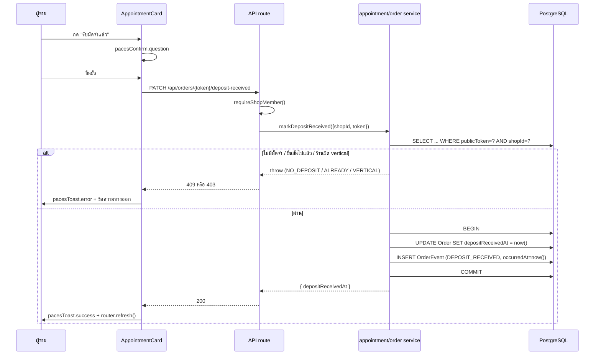

# API Contract: ยอดขายเกณฑ์เงินสดสำหรับร้านบริการ

## 1. Overview

ฟีเจอร์นี้เพิ่ม endpoint **ใหม่เพียงตัวเดียว** (`deposit-received`) และ **ใช้ endpoint เดิมที่ไม่เคยมีใครเรียก** (`appointment/outcome` ของ 00024) — ที่เหลือเป็นการเปลี่ยนรูปร่าง response ของ endpoint ที่มีอยู่แล้ว

| ประเภท | Endpoint |
|---|---|
| 🆕 ใหม่ | `PATCH /api/orders/[token]/deposit-received` |
| ♻️ มีอยู่แล้ว ใช้ครั้งแรก | `POST /api/orders/[token]/appointment/outcome` (00024 — ไม่แก้ contract) |
| 🔧 เปลี่ยน response shape | `GET /api/seller/sales-series` |
| 🔧 เปลี่ยน request body | `POST /api/orders` (เพิ่ม `appointment.depositReceived`) |

## 2. Authentication

ทุก endpoint ในเอกสารนี้ใช้ `requireShopMember()` (`src/lib/shop-api-guard.ts`) — NextAuth session + ตรวจว่าผู้ใช้เป็นสมาชิกของร้านที่ `activeShopId` ชี้อยู่ · ไม่มีสิทธิ์แยกตามบทบาทสำหรับการรับมัดจำ/ปิดงาน (BRD §7.1)

ทุก response ผ่าน `jsonNoStore()` — `Cache-Control: private, no-store` (ตาม convention `auth-api-cache-control`)

## 3. Endpoint List

| Method | Path | คำอธิบาย | Auth |
|---|---|---|---|
| PATCH | `/api/orders/[token]/deposit-received` | ยืนยันว่าได้รับมัดจำแล้ว | shop member |
| POST | `/api/orders/[token]/appointment/outcome` | ปิดงานนัด (COMPLETED/NO_SHOW) | shop member |
| GET | `/api/seller/sales-series` | ข้อมูลกราฟยอดขาย | shop member |
| POST | `/api/orders` | สร้างออเดอร์ | shop member |

## 4. Endpoint Detail

### 4.1 `PATCH /api/orders/[token]/deposit-received` 🆕

ยืนยันว่าเงินมัดจำเข้ามือแล้ว (FR-SCB-04)

> **หมายเหตุการตั้งชื่อ:** ไม่อยู่ใต้ segment `appointment/` โดยตั้งใจ — มัดจำไม่ผูกกับนัดหมาย งานที่ไม่มี `serviceStart` ก็มีมัดจำได้ (BR-SCB-19 + UX Edge states)

**Request:** ไม่มี body (การกระทำนี้ไม่มีพารามิเตอร์ — เวลาที่บันทึกคือ `now()` เสมอ ไม่รับจาก client)

**Response 200:**
```json
{ "depositReceivedAt": "2026-08-07T09:12:44.512Z" }
```

**Errors:**

| HTTP | `error` | เมื่อไร |
|---|---|---|
| 401 | `UNAUTHORIZED` | ไม่มี session / ไม่ใช่สมาชิกร้าน |
| 404 | `ORDER_NOT_FOUND` | ไม่พบออเดอร์ในร้านนี้ (scope ด้วย `shopId` ใน WHERE — ไม่ใช่ค้นแล้วค่อยเช็ค) |
| 409 | `NO_DEPOSIT` | ออเดอร์นี้ `depositAmount` เป็น null หรือ ≤ 0 — ไม่มีอะไรให้ยืนยัน |
| 409 | `DEPOSIT_ALREADY_RECEIVED` | ยืนยันไปแล้ว (idempotent-guard, BRD §6.3) — **ไม่เขียนทับเวลาเดิม** |
| 403 | `VERTICAL_NOT_ALLOWED` | ร้านไม่ใช่ `SERVICE_QUEUE` (BR-SCB-23 — guard ฝั่ง server ไม่ใช่แค่ซ่อนปุ่ม) |
| 500 | `INTERNAL_ERROR` | อื่น ๆ |

**Side effects:** insert `OrderEvent` `type = DEPOSIT_RECEIVED`, `meta = { amount, source: 'button' }`, `occurredAt = now()`

### 4.2 `POST /api/orders/[token]/appointment/outcome` ♻️

**ไม่แก้ contract ใด ๆ** — endpoint นี้มีครบมาตั้งแต่ feature 00024 (`API.md §4.8 / FR-RSV-09`) แต่ไม่เคยมีหน้าจอเรียก (`rg "appointment/outcome" --glob '*.tsx'` = 0) ฟีเจอร์นี้แค่เป็นผู้เรียกรายแรก

**Request:**
```json
{ "outcome": "COMPLETED" }   // หรือ "NO_SHOW"
```

**Response 200:**
```json
{ "appointmentStatus": "COMPLETED" }
```

**Errors (เดิมทั้งหมด — map ผ่าน `appointmentErrorResponse`):**

| HTTP | `error` | เมื่อไร | ข้อความบนจอ (UX spec §3) |
|---|---|---|---|
| 400 | `VALIDATION_ERROR` | `outcome` ไม่ใช่ 2 ค่าที่อนุญาต | — |
| 404 | `APPOINTMENT_NOT_FOUND` | ไม่มีนัดผูกกับออเดอร์นี้ | — |
| 409 | `APPOINTMENT_NOT_STARTED` | ยังไม่ถึง `serviceStart` (BR-RSV-34) | "ยังไม่ถึงเวลานัด — รีเฟรชหน้าแล้วลองใหม่" |
| 409 | `APPOINTMENT_TERMINAL` | ปิดงานไปแล้ว (BR-RSV-31) | "บันทึกไปแล้วก่อนหน้านี้ — รีเฟรชหน้า" |

**สิ่งที่ต้องเพิ่มใน service (ไม่ใช่ที่ route):** insert `OrderEvent` `type = APPOINTMENT_OUTCOME_SET`, `meta = { outcome }`, `occurredAt = now()` — ในทรานแซกชันเดียวกับการ update `appointmentStatus` (BR-SCB-21)

> 🛑 `setAppointmentOutcome` ห้ามแตะ `Order.status` และห้ามกระทบ Trust Score (BR-RSV-33/35) — กฎเดิมที่ต้องคงไว้แม้เพิ่ม OrderEvent

### 4.3 `GET /api/seller/sales-series` 🔧

**Request (ไม่เปลี่ยน):** `?mode=daily|monthly&year=YYYY&month=M`

**Response — เพิ่ม field สำหรับ `SERVICE_QUEUE` เท่านั้น:**

```jsonc
{
  "labels": ["1", "2", "…", "31"],
  // ── ของเดิม: ยังส่งครบสำหรับ ONLINE_SALES/LODGING ไม่รื้อ ──
  "confirmedValues": [],
  "unconfirmedValues": [],
  "orderCounts": [],
  // ── 🆕 มีเฉพาะเมื่อ Shop.vertical === 'SERVICE_QUEUE' (undefined สำหรับ vertical อื่น) ──
  "depositValues":   [300, 0, 500, "…"],   // ชั้นมัดจำ
  "completedValues": [0, 1200, 0, "…"],    // ชั้นเสร็จสิ้น
  "upcomingValues":  [null, null, "…"],    // ชั้นวันเข้ารับบริการ (serviceStart ≥ วันนี้)
  "overdueValues":   [0, 0, 0, 900, "…"],  // ชั้นเลยวันนัด (serviceStart < วันนี้)
  "total": 8300,          // = Σdeposit + Σcompleted เท่านั้น (BR-SCB-05)
  "prevTotalToDate": 7410 // นิยามเดียวกับ total ของช่วงก่อนหน้า
}
```

**กฎที่ห้ามพลาด:**
- `undefined` (ไม่ใช่ `[]`) เมื่อร้านไม่ใช่ `SERVICE_QUEUE` — UI ตัดสินว่าจะ render การ์ดตัวไหนจากการมี/ไม่มี field นี้ ค่า `[]` จะทำให้ร้านขายของเห็นการ์ดผิดตัว
- `total`/`prevTotalToDate` ของร้าน `SERVICE_QUEUE` **เปลี่ยนความหมาย** เป็นเกณฑ์เงินสด — ทั้งการ์ด ชีต และหน้า `/sales` ต้องอ่านค่าเดียวกันนี้ (BR-SCB-25)
- `last14*` (แท็บ "วันนี้") ส่งเฉพาะ 2 ชั้นทึบ ไม่มี upcoming/overdue (BR-SCB-09)

### 4.4 `POST /api/orders` 🔧

เพิ่ม field เดียวใน `appointment` object ของ body:

```jsonc
{
  "appointment": {
    "serviceResourceId": "…",
    "depositAmount": "500.00",
    "depositReceived": true   // 🆕 optional, default = true เมื่อ depositAmount > 0
  }
}
```

**พฤติกรรมฝั่ง server (BR-SCB-14 — 🛑 บังคับ):**

| `depositReceived` | `depositAmount` | ผลลัพธ์ |
|---|---|---|
| `true` (หรือไม่ส่ง) | > 0 | `depositReceivedAt = Order.createdAt` — **ไม่ใช่ `now()`** เพราะออเดอร์ย้อนหลัง (00033) ต้องได้วันที่ผู้ขายระบุ |
| `false` | > 0 | `depositReceivedAt = null` |
| ค่าใด ๆ | 0 / null | `depositReceivedAt = null` (ไม่มีอะไรให้รับ) |

**Side effect:** เมื่อ `depositReceivedAt` ถูกตั้งตอนสร้าง → insert `OrderEvent` `DEPOSIT_RECEIVED` `meta.source = 'create'`, `occurredAt = now()` (**ไม่ใช่ `createdAt`** — ประวัติคือหลักฐานว่ากดจริงเมื่อไร BR-SCB-22)

**`PATCH /api/orders/[token]` (แก้ไขออเดอร์):** ห้ามลบ `depositReceivedAt` เป็นผลข้างเคียงของการแก้ `depositAmount` (BR-SCB-15) — เปลี่ยนได้เฉพาะเมื่อ client ส่ง `depositReceived` มาชัดเจน

## 5. Error Code Table

| Code | HTTP | ความหมาย | ผู้ใช้ทำอะไรได้ |
|---|---|---|---|
| `UNAUTHORIZED` | 401 | ไม่มีสิทธิ์ | เข้าสู่ระบบใหม่ |
| `VERTICAL_NOT_ALLOWED` | 403 | ร้านไม่ใช่ `SERVICE_QUEUE` | — (ไม่ควรเห็นปุ่มอยู่แล้ว) |
| `ORDER_NOT_FOUND` | 404 | ไม่พบออเดอร์ในร้านนี้ | กลับหน้ารายการ |
| `APPOINTMENT_NOT_FOUND` | 404 | ออเดอร์นี้ไม่มีนัด | — |
| `NO_DEPOSIT` | 409 | ไม่มียอดมัดจำให้ยืนยัน | — |
| `DEPOSIT_ALREADY_RECEIVED` | 409 | ยืนยันไปแล้ว | รีเฟรชหน้า |
| `APPOINTMENT_NOT_STARTED` | 409 | ยังไม่ถึงเวลานัด | รอถึงเวลานัด / รีเฟรช |
| `APPOINTMENT_TERMINAL` | 409 | ปิดงานไปแล้ว | รีเฟรชหน้า |
| `VALIDATION_ERROR` | 400 | body ไม่ผ่าน Valibot | — |
| `INTERNAL_ERROR` | 500 | ข้อผิดพลาดที่ไม่คาดคิด | ลองใหม่ |

> **Gate ที่ต้องผ่านก่อน merge:** error ใหม่ทุกตัว (`NO_DEPOSIT`, `DEPOSIT_ALREADY_RECEIVED`, `VERTICAL_NOT_ALLOWED`) ต้องมี route-catch ครบ — service โยน error ที่ route ไม่ได้ map = 500 เงียบ ๆ (`feedback_service_error_route_mapping`)

## 6. Sequence



## 7. Traceability

| Requirement | Endpoint |
|---|---|
| FR-SCB-01, FR-SCB-02 | `GET /api/seller/sales-series` (§4.3) |
| FR-SCB-03, FR-SCB-06 | `POST /api/orders` (§4.4) |
| FR-SCB-04 | `PATCH /api/orders/[token]/deposit-received` (§4.1) |
| FR-SCB-05 | `PATCH /api/orders/[token]` (§4.4 ท้ายหัวข้อ) |
| FR-SCB-07, FR-SCB-08, FR-SCB-09 | `POST /api/orders/[token]/appointment/outcome` (§4.2) |
| FR-SCB-10 | side effect ของ §4.1 + §4.4 |
| FR-SCB-11 | side effect ของ §4.2 |
| FR-SCB-12 | `VERTICAL_NOT_ALLOWED` (§5) + `undefined` field ใน §4.3 |

## 8. สรุป (Summary)

พื้นผิว API ของฟีเจอร์นี้เล็กมาก — **endpoint ใหม่ตัวเดียว** ที่เหลือคือการปลุก endpoint ที่หลับอยู่ (00024) และเปลี่ยนรูปร่าง response ของ `sales-series` แบบ additive

จุดที่พลาดง่ายที่สุด 2 จุด: (1) `POST /api/orders` ต้องใช้ **`Order.createdAt` ไม่ใช่ `now()`** ตอนติ๊กรับมัดจำ ขณะที่ `OrderEvent.occurredAt` ต้องใช้ `now()` — ค่าสองตัวนี้ต่างกันโดยตั้งใจ และ (2) field ใหม่ใน `sales-series` ต้องเป็น `undefined` ไม่ใช่ `[]` สำหรับ vertical อื่น
