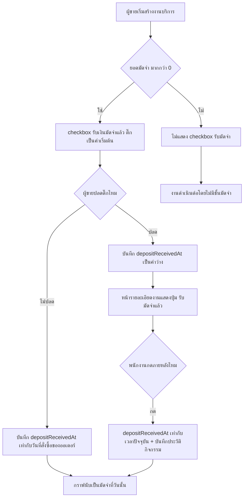
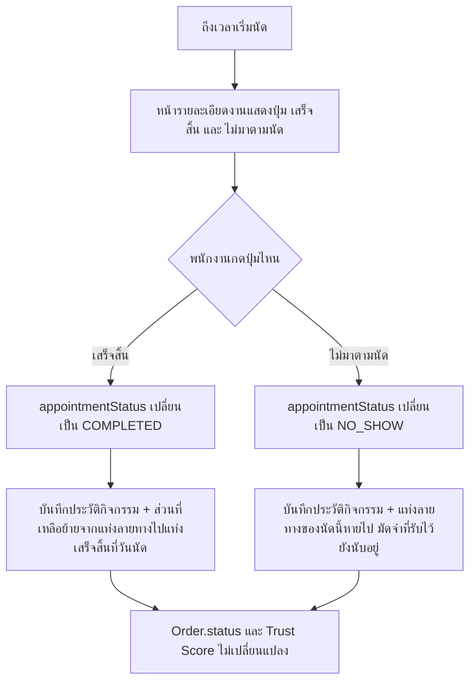

> **โมดูล:** M00034-ServiceCashBasisSales
> **ประเภทเอกสาร:** Business Requirements Document (BRD) - NON-TECHNICAL
> **เวอร์ชัน:** 1.0
> **วันที่จัดทำ:** 2026-08-07
> **สถานะ:** Draft — รอ user review ก่อน implement
> **เจ้าของเอกสาร:** BA (ดู [[Feature-Docs-Ownership]])

# BRD: ยอดขายเกณฑ์เงินสดสำหรับร้านบริการ (Service Cash Basis Sales)

---

## 1. บทนำ

### 1.1 วัตถุประสงค์ของเอกสาร

เอกสารนี้มีวัตถุประสงค์เพื่อ:
1. อธิบายความต้องการหลักในการเปลี่ยนการ์ดยอดขายและหน้า `/sales` ของร้าน `SERVICE_QUEUE` ให้พูดภาษาเงินสดของธุรกิจบริการ (มัดจำ/เสร็จสิ้น/วันเข้ารับบริการ/เลยวันนัด)
2. กำหนดขอบเขตการทำงานและข้อจำกัด — เฉพาะร้านประเภทคิวงาน-บริการ ไม่แตะร้านขายของหรือบ้านพัก และไม่แตะการ์ด P&L
3. อธิบายเงื่อนไขและกฎทางธุรกิจของการยืนยันรับมัดจำและการปิดงานบริการ รวมถึงกรณีขอบ (NO_SHOW, ขอเลื่อนนัด, งานไม่มีวันนัด, ออเดอร์ย้อนหลัง)
4. สร้างความเข้าใจร่วมกันระหว่างทีมธุรกิจและทีมพัฒนาก่อนเริ่มเขียนโค้ด (Hard Rule 11 — Documentation-First)

### 1.2 ขอบเขตของระบบ

**ยอดขายเกณฑ์เงินสดสำหรับร้านบริการ** คือชุดการเปลี่ยนแปลงบนการ์ดยอดขาย (Mobile Command Center), ชีตเต็มจอ, และหน้า `/sales` ของร้านประเภท `SERVICE_QUEUE` ให้จัดชั้นยอดขายตามจังหวะเงินจริง 2 จังหวะของธุรกิจบริการ (มัดจำตอนจอง + ส่วนที่เหลือตอนปิดงาน) พร้อมทั้งเปิดหน้าจอให้ยืนยันรับมัดจำและปิดงานบริการที่ backend มีอยู่แล้วแต่ไม่เคยมีหน้าจอเรียกใช้

**เข้าสู่ระบบ (Input):**
- การกระทำของพนักงาน/ผู้ขาย: ติ๊ก/กดยืนยัน "รับมัดจำแล้ว", กดปิดงาน "เสร็จสิ้น"/"ไม่มาตามนัด"
- ข้อมูลออเดอร์ที่มีอยู่แล้วจาก feature 00024: `depositAmount`, `totalAmount`, `serviceStart`, `appointmentStatus`, `createdAt` (วันที่สั่งซื้อตาม feature 00033)

**ออกจากระบบ (Output):**
- คอลัมน์ใหม่ `Order.depositReceivedAt` (เวลาที่ยืนยันว่ามัดจำเข้ามือแล้ว)
- `appointmentStatus` ที่อัปเดตเป็น `COMPLETED`/`NO_SHOW` ผ่านหน้าจอจริง
- กราฟยอดขาย 4 ชั้น + เลขฮีโร่บนการ์ด/ชีตเต็มจอ/หน้า `/sales`
- เหตุการณ์ใหม่ 2 ประเภทในประวัติกิจกรรมของออเดอร์ (รับมัดจำ, ปิดงาน)

**ระบบที่เกี่ยวข้อง:**
- feature 00024 (Service Appointment Booking) — เจ้าของ service/API เดิมที่ฟีเจอร์นี้เรียกใช้ ไม่สร้างใหม่
- feature 00031 (Order Activity Log) — ปลายทางของเหตุการณ์ใหม่
- feature 00033 (Backdated Order Date) — `Order.createdAt` เป็นวันที่สั่งซื้อที่ผู้ขายระบุได้ มีผลต่อวันที่มัดจำถูกนับ
- Mobile Command Center (`SalesChartCard`/`SalesChartSheet`) และหน้า `/sales`

### 1.3 กลุ่มผู้ใช้งาน

| กลุ่มผู้ใช้ | บทบาท | สิทธิ์การใช้งาน |
|-----------|--------|----------------|
| **เจ้าของร้านบริการ (`SERVICE_QUEUE`)** | ดูยอดขาย/วางแผนกระแสเงินสด | ดูการ์ด/ชีตเต็มจอ/หน้า `/sales`; กดรับมัดจำ/ปิดงานได้เหมือนพนักงาน |
| **พนักงาน/แอดมินร้าน** | รับเงินหน้างาน จัดการนัดหมาย | ติ๊ก/กดยืนยันรับมัดจำ, กดปิดงาน (เสร็จสิ้น/ไม่มาตามนัด) |
| **ผู้ตรวจสอบกิจกรรมออเดอร์** | ตรวจสอบความถูกต้อง/ย้อนสอบเหตุการณ์ | อ่านประวัติกิจกรรม (Activity Log) ของออเดอร์เท่านั้น ไม่มีสิทธิ์แก้ไข |

---

## 2. ความต้องการหลัก (Functional Requirements)

### 2.1 การ์ดยอดขายพูดภาษาเงินสดของร้านบริการ

#### FR-SCB-01: แสดงยอดขาย 4 ชั้นตามจังหวะเงินจริง

**User Story:**
> ในฐานะเจ้าของร้านบริการ ฉันต้องการเห็นยอดขายแยกเป็นมัดจำ/เสร็จสิ้น/วันเข้ารับบริการ/เลยวันนัด เพื่อเข้าใจว่าเงินก้อนไหนเข้ามือแล้วจริง และก้อนไหนยังเป็นแค่ยอดคาดการณ์

**Acceptance Criteria:**
- [ ] ร้าน `vertical = SERVICE_QUEUE` เปิดการ์ดยอดขาย ต้องเห็น 4 ชั้นแยกสี: มัดจำ (เหลืองทึบ), เสร็จสิ้น (เขียวทึบ), วันเข้ารับบริการ (น้ำเงินลายทาง), เลยวันนัด (แดงลายทาง)
- [ ] ออเดอร์ที่ `depositReceivedAt` ไม่ว่าง มูลค่า `depositAmount` ต้องปรากฏในชั้นมัดจำที่ตะกร้าวันของ `depositReceivedAt`
- [ ] ออเดอร์ที่ `appointmentStatus = COMPLETED` มูลค่า `totalAmount − มัดจำที่รับแล้ว` ต้องปรากฏในชั้นเสร็จสิ้นที่ตะกร้าวันของ `serviceStart`
- [ ] ออเดอร์ที่ไม่มี `serviceStart` (ไม่มีนัด) มูลค่าส่วนที่เหลือ (`totalAmount − มัดจำที่รับแล้ว`) ต้องปรากฏในชั้นเสร็จสิ้นที่ตะกร้าวันของ `createdAt` โดยไม่ต้องรอการกดปิดงาน
- [ ] ออเดอร์ที่มี `serviceStart` และ `appointmentStatus ∉ {COMPLETED, NO_SHOW}` (ยังไม่ปิดงาน) มูลค่าส่วนที่เหลือต้องปรากฏในชั้นวันเข้ารับบริการ (ถ้า `serviceStart` ≥ วันนี้) หรือชั้นเลยวันนัด (ถ้า `serviceStart` < วันนี้)
- [ ] แท็บ "วันนี้" (ย้อนหลัง 14 วัน) แสดงเฉพาะชั้นมัดจำและเสร็จสิ้น ไม่แสดงชั้นวันเข้ารับบริการ/เลยวันนัด

**Business Flow:**
1. ระบบดึงออเดอร์ของร้านที่ `status != CANCELLED` และตกในช่วงเวลาที่ต้องแสดง (ทั้งจาก `depositReceivedAt`, `serviceStart`, และ `createdAt`)
2. จัดออเดอร์แต่ละใบเข้าชั้นตามเงื่อนไขข้างต้น (มีข้อยกเว้นสำหรับออเดอร์ไม่มีนัด/NO_SHOW ดู §8.1)
3. รวมยอดต่อชั้นต่อวัน แล้วเรนเดอร์เป็นแท่งซ้อนกัน

**Example:**
```
ร้าน "ABC สปา" วันที่ 10 ส.ค. 2569 มีงาน 2 ใบ:
- ใบ A: totalAmount=1,000, depositAmount=300, depositReceivedAt=5 ส.ค.,
        serviceStart=10 ส.ค., appointmentStatus=COMPLETED (ปิดงานวันนี้)
  → แท่งมัดจำวันที่ 5 ส.ค. = 300 บาท
  → แท่งเสร็จสิ้นวันที่ 10 ส.ค. = 700 บาท (1,000 - 300)
- ใบ B: totalAmount=500, depositAmount=0, serviceStart=15 ส.ค.,
        appointmentStatus=SCHEDULED (ยังไม่ถึงวัน)
  → แท่งวันเข้ารับบริการวันที่ 15 ส.ค. = 500 บาท

เลขฮีโร่ของเดือนสิงหาคม (ถึงวันที่ 10) = 300 + 700 = 1,000 บาท
(ไม่รวม 500 บาทของใบ B เพราะยังไม่ถึงวันนัด)
```

#### FR-SCB-02: เลขฮีโร่นับเฉพาะเงินที่ได้รับจริง

**User Story:**
> ในฐานะเจ้าของร้านบริการ ฉันต้องการให้ยอดรวมที่โชว์เด่นสุดของช่วงเวลานับเฉพาะเงินที่เข้ามือแล้ว เพื่อไม่ให้เข้าใจผิดว่ามีเงินมากกว่าที่มีจริง

**Acceptance Criteria:**
- [ ] เลขฮีโร่ = ผลรวมของชั้นมัดจำ + ชั้นเสร็จสิ้นของช่วงเวลาที่เลือกเท่านั้น
- [ ] ชั้นวันเข้ารับบริการและชั้นเลยวันนัด ไม่ถูกรวมเข้าเลขฮีโร่ไม่ว่ากรณีใด

### 2.2 ยืนยันรับมัดจำ

#### FR-SCB-03: checkbox รับเงินมัดจำแล้วตอนสร้างงาน

**User Story:**
> ในฐานะพนักงานหน้าร้าน ฉันต้องการให้ระบบติ๊ก "รับเงินมัดจำแล้ว" ให้อัตโนมัติตอนสร้างงานใหม่ เพื่อไม่ต้องกดซ้ำในกรณีปกติที่รับมัดจำหน้าร้านทันที

**Acceptance Criteria:**
- [ ] ฟอร์มสร้างงานบริการที่มียอดมัดจำ > 0 ต้องแสดง checkbox "รับเงินมัดจำแล้ว" ที่ติ๊กไว้เป็นค่าเริ่มต้น
- [ ] ฟอร์มสร้างงานที่ยอดมัดจำ = 0 ต้องไม่แสดง checkbox นี้เลย
- [ ] เมื่อบันทึกงานโดยไม่ปลดติ๊ก ค่า `depositReceivedAt` ต้องถูกตั้งเป็นวันที่สั่งซื้อของออเดอร์ (`Order.createdAt`) ไม่ใช่เวลาที่กดบันทึกจริง
- [ ] เมื่อผู้ขายปลดติ๊กก่อนบันทึก ค่า `depositReceivedAt` ต้องเป็น `null`

#### FR-SCB-04: ปุ่ม "รับมัดจำแล้ว" ในหน้ารายละเอียดงาน

**User Story:**
> ในฐานะพนักงานหน้าร้าน ฉันต้องการปุ่มยืนยันรับมัดจำภายหลัง สำหรับกรณีที่ยังไม่ได้รับตอนสร้างงาน

**Acceptance Criteria:**
- [ ] ปุ่ม "รับมัดจำแล้ว" แสดงในหน้ารายละเอียดงานเมื่อ `depositAmount > 0` และ `depositReceivedAt == null`
- [ ] กดปุ่มแล้ว `depositReceivedAt` ถูกตั้งเป็นเวลาปัจจุบัน (`now()`)
- [ ] หลังกดยืนยันแล้ว ปุ่มนี้หายไป (ไม่กดซ้ำได้)

#### FR-SCB-05: แก้ไขยอดมัดจำไม่ล้างสถานะรับมัดจำเงียบ ๆ

**User Story:**
> ในฐานะพนักงาน ฉันต้องการให้การแก้ไขยอดมัดจำของงานที่แก้ไขได้ ไม่ทำให้สถานะ "รับมัดจำแล้ว" ที่เคยยืนยันไว้หายไปโดยไม่รู้ตัว

**Acceptance Criteria:**
- [ ] แก้ไขยอดมัดจำของงานที่เคยมี `depositReceivedAt` ไม่ว่างอยู่แล้ว ต้องไม่ทำให้ `depositReceivedAt` กลายเป็น `null` โดยอัตโนมัติ
- [ ] ถ้าต้องการเปลี่ยนสถานะรับมัดจำ ต้องเป็นการกระทำที่ผู้ขายตั้งใจกดเอง (เช่น ปุ่ม/ช่องยืนยันเฉพาะ) ไม่ใช่ผลข้างเคียงของการแก้ยอดเงิน

#### FR-SCB-06: ออเดอร์ย้อนหลังที่ติ๊กรับมัดจำได้วันที่ตรงกับวันที่สั่งซื้อ

**User Story:**
> ในฐานะพนักงานที่คีย์ออเดอร์ย้อนหลังจากแชท ฉันต้องการให้มัดจำที่ติ๊กรับแล้วตอนสร้างงาน ถูกนับเข้าวันที่สั่งซื้อที่ฉันระบุ ไม่ใช่วันนี้ที่ฉันมาคีย์

**Acceptance Criteria:**
- [ ] สร้างงานบริการโดยตั้งวันที่สั่งซื้อ (`Order.createdAt`) เป็นวันที่ผ่านมาแล้ว (ตามขอบเขตของ feature 00033) พร้อมติ๊ก "รับเงินมัดจำแล้ว" → `depositReceivedAt` ต้องเท่ากับวันที่สั่งซื้อที่ระบุ ไม่ใช่เวลาที่กดบันทึกจริง
- [ ] กราฟยอดขายของวันที่สั่งซื้อนั้นต้องแสดงมัดจำเพิ่มขึ้น ไม่ใช่กราฟของวันนี้

### 2.3 ปิดงานบริการ

#### FR-SCB-07: ปุ่ม "เสร็จสิ้น" ใช้งานได้จริงบนหน้าจอ

**User Story:**
> ในฐานะพนักงาน ฉันต้องการกดปุ่ม "เสร็จสิ้น" เมื่อลูกค้ามาใช้บริการตามนัดแล้ว เพื่อให้ยอดขายส่วนที่เหลือถูกนับเข้ากราฟ

**Acceptance Criteria:**
- [ ] หน้ารายละเอียดงานที่มีนัดหมายผูกอยู่ (`serviceStart` ไม่ว่าง) และถึงเวลานัดแล้ว ต้องมีปุ่ม "เสร็จสิ้น" ที่กดได้จริง
- [ ] กดปุ่มแล้ว `appointmentStatus` ต้องเปลี่ยนเป็น `COMPLETED`
- [ ] ยอดส่วนที่เหลือของงานนั้นต้องปรากฏในชั้น "เสร็จสิ้น" ของกราฟที่ตะกร้าวันของ `serviceStart` ทันทีหลังกด

#### FR-SCB-08: ปุ่ม "ไม่มาตามนัด" ใช้งานได้จริงบนหน้าจอ

**User Story:**
> ในฐานะพนักงาน ฉันต้องการกดปุ่ม "ไม่มาตามนัด" เมื่อลูกค้าไม่มาตามนัดที่จองไว้ เพื่อปิดงานนั้นและไม่ให้ยอดค้างอยู่ในกราฟตลอดไป

**Acceptance Criteria:**
- [ ] หน้ารายละเอียดงานที่ถึงเวลานัดแล้วแต่ยังไม่ถูกปิดงาน ต้องมีปุ่ม "ไม่มาตามนัด" ที่กดได้จริง
- [ ] กดปุ่มแล้ว `appointmentStatus` ต้องเปลี่ยนเป็น `NO_SHOW`
- [ ] มัดจำที่เคยยืนยันรับแล้วของงานนี้ยังคงปรากฏอยู่ในชั้น "มัดจำ" ตามเดิม (ไม่ถูกลบออกจากกราฟ)
- [ ] ส่วนที่เหลือของงานนี้ต้องหายไปจากกราฟทั้งหมด ไม่ปรากฏในชั้นใดเลย (ไม่ใช่ทั้งเสร็จสิ้น ไม่ใช่ทั้งวันเข้ารับบริการ/เลยวันนัด)

#### FR-SCB-09: เงื่อนไขการแสดงปุ่มปิดงานตรงกับกฎที่ service บังคับอยู่แล้ว

**User Story:**
> ในฐานะพนักงาน ฉันไม่ต้องการเห็นปุ่มปิดงานโผล่มาก่อนถึงเวลานัด หรือยังเห็นปุ่มอยู่ทั้งที่ปิดงานไปแล้ว

**Acceptance Criteria:**
- [ ] ก่อนถึงเวลา `serviceStart` ปุ่ม "เสร็จสิ้น"/"ไม่มาตามนัด" ต้องไม่แสดง (แสดงข้อความอธิบายแทนว่าปิดงานได้เมื่อถึงเวลานัด)
- [ ] งานที่ `appointmentStatus` เป็น `COMPLETED` หรือ `NO_SHOW` แล้ว ต้องไม่แสดงปุ่มปิดงานอีก (สถานะสุดท้าย)
- [ ] ปุ่มปิดงานต้องเข้าถึงได้จริงบนทุกขนาดจอ รวมถึงกรณีหน้าจอเข้าโหมดเต็มจอที่ทำให้แถบเมนูหลักหายไป

### 2.4 ประวัติกิจกรรม

#### FR-SCB-10: การรับมัดจำถูกบันทึกลงประวัติกิจกรรม

**User Story:**
> ในฐานะผู้ตรวจสอบ ฉันต้องการเห็นในประวัติกิจกรรมของออเดอร์ว่าใครกดยืนยันรับมัดจำเมื่อไหร่

**Acceptance Criteria:**
- [ ] ทุกครั้งที่ `depositReceivedAt` ถูกตั้งค่า (ไม่ว่าจากติ๊กตอนสร้างหรือกดปุ่มภายหลัง) ต้องมีแถวใหม่ในไทม์ไลน์ประวัติกิจกรรมของออเดอร์นั้น
- [ ] เวลาที่บันทึกในแถวประวัติต้องเป็นเวลาจริงที่กด/บันทึกจริง ไม่ใช่วันที่สั่งซื้อของออเดอร์ (สอดคล้องกับหลักการเดียวกับ `ORDER_DATE_CHANGED` ของ feature 00033)

#### FR-SCB-11: การปิดงานถูกบันทึกลงประวัติกิจกรรม

**User Story:**
> ในฐานะผู้ตรวจสอบ ฉันต้องการเห็นในประวัติกิจกรรมของออเดอร์ว่าใครกดปิดงานเป็นผลอะไรเมื่อไหร่

**Acceptance Criteria:**
- [ ] ทุกครั้งที่กด "เสร็จสิ้น" หรือ "ไม่มาตามนัด" ต้องมีแถวใหม่ในไทม์ไลน์ประวัติกิจกรรมของออเดอร์นั้น ระบุผลลัพธ์ที่เลือก
- [ ] เหตุการณ์นี้ต้องแยกประเภทออกจากเหตุการณ์รับมัดจำอย่างชัดเจน

### 2.5 ขอบเขต vertical

#### FR-SCB-12: ทุกความสามารถใช้งานได้เฉพาะร้าน `SERVICE_QUEUE`

**User Story:**
> ในฐานะเจ้าของร้านขายของออนไลน์หรือร้านบ้านพัก ฉันไม่ต้องการให้การ์ดยอดขายของร้านฉันเปลี่ยนแปลงจากฟีเจอร์นี้เลย

**Acceptance Criteria:**
- [ ] ร้านที่ `vertical = ONLINE_SALES` หรือ `LODGING` ต้องเห็นการ์ดยอดขายแบบเดิมทุกประการ ไม่มีชั้นข้อมูลใหม่ปรากฏ
- [ ] เมนู/ปุ่มยืนยันรับมัดจำและปุ่มปิดงาน ต้องไม่ปรากฏสำหรับร้านที่ไม่ใช่ `SERVICE_QUEUE`

---

## 3. Acceptance Criteria สรุป

### 3.1 การ์ดยอดขาย 4 ชั้น

**เมื่อระบบทำงานถูกต้อง:**
- ✅ มัดจำที่ยืนยันแล้วปรากฏในชั้นมัดจำที่วันที่ยืนยัน
- ✅ ส่วนที่เหลือของงานที่ปิดงานเป็น "เสร็จสิ้น" ปรากฏที่วันนัด (หรือวันสร้างถ้าไม่มีนัด)
- ✅ งานที่ยังไม่ถึงวันนัด/ยังไม่ปิดงาน ปรากฏในชั้นยอดล่วงหน้าที่ถูกต้อง (วันเข้ารับบริการ/เลยวันนัด)
- ✅ เลขฮีโร่ = มัดจำ + เสร็จสิ้นเท่านั้น
- ✅ ไม่มีเงินก้อนใดปรากฏซ้ำในมากกว่า 1 ชั้นของวันเดียวกัน

### 3.2 รับมัดจำและปิดงาน

**เมื่อพนักงานกดรับมัดจำ/ปิดงาน:**
- ✅ สถานะเปลี่ยนทันทีและสะท้อนในกราฟของช่วงเวลานั้น
- ✅ มีแถวใหม่ในประวัติกิจกรรมของออเดอร์
- ✅ ปุ่มที่กดไปแล้วไม่สามารถกดซ้ำเปลี่ยนผลได้อีก (สถานะสุดท้าย)

### 3.3 กรณีขอบ

**เมื่อลูกค้าไม่มาตามนัด (`NO_SHOW`):**
- ✅ มัดจำที่รับไว้แล้วยังคงนับอยู่
- ✅ ส่วนที่เหลือหายไปจากกราฟทั้งหมด

**เมื่อออเดอร์ถูกลงวันที่สั่งซื้อย้อนหลัง (feature 00033) และติ๊กรับมัดจำตอนสร้าง:**
- ✅ `depositReceivedAt` เท่ากับวันที่สั่งซื้อที่ระบุ ไม่ใช่วันที่กดบันทึกจริง

---

## 4. Business Flows (กระบวนการทำงาน)

### 4.1 Flow หลัก: รับมัดจำ



### 4.2 Flow ปิดงานบริการ



---

## 5. Use Case Scenarios (สถานการณ์การใช้งานจริง)

### Scenario 1: Best Case — รับมัดจำหน้าร้าน ปิดงานตรงเวลา

**ผู้เกี่ยวข้อง:** พนักงานหน้าร้าน, ลูกค้า

**เงื่อนไขเริ่มต้น:**
- ร้าน `SERVICE_QUEUE` เปิดคิวรับนัด มีทรัพยากรบริการพร้อมใช้งาน

**ขั้นตอน:**
1. ลูกค้าจองคิววันที่ 10 ส.ค. ยอดรวม 1,000 บาท มัดจำ 300 บาท
2. พนักงานรับมัดจำหน้าร้านทันที สร้างงานโดยไม่ปลดติ๊ก "รับเงินมัดจำแล้ว"
3. วันที่ 10 ส.ค. ลูกค้ามาตามนัด พนักงานกด "เสร็จสิ้น"

**ผลลัพธ์:**
- กราฟวันที่สร้างงานแสดงมัดจำ 300 บาท กราฟวันที่ 10 ส.ค. แสดงเสร็จสิ้น 700 บาท
- ประวัติกิจกรรมมี 2 แถวใหม่: รับมัดจำแล้ว, ปิดงาน-เสร็จสิ้น

### Scenario 2: ลูกค้าไม่มาตามนัด (`NO_SHOW`)

**ผู้เกี่ยวข้อง:** พนักงานหน้าร้าน

**เงื่อนไขเริ่มต้น:**
- งานมีมัดจำที่รับไว้แล้ว 300 บาท จากยอดรวม 1,000 บาท นัดวันที่ 10 ส.ค.

**ขั้นตอน:**
1. ถึงวันนัด ลูกค้าไม่มาตามนัด
2. พนักงานกด "ไม่มาตามนัด" ในหน้ารายละเอียดงาน

**ผลลัพธ์:**
- `appointmentStatus = NO_SHOW`
- กราฟยังคงแสดงมัดจำ 300 บาทที่วันรับมัดจำเดิม (ไม่ถูกลบ)
- ส่วนที่เหลือ 700 บาท ไม่ปรากฏในกราฟชั้นใดเลยอีกต่อไป
- ประวัติกิจกรรมมีแถวใหม่ "ปิดงาน-ไม่มาตามนัด"

### Scenario 3: งานไม่มีวันนัด (walk-in)

**ผู้เกี่ยวข้อง:** พนักงานหน้าร้าน

**เงื่อนไขเริ่มต้น:**
- ลูกค้าเข้ารับบริการทันทีโดยไม่มีการจองล่วงหน้า

**ขั้นตอน:**
1. พนักงานสร้างงานบริการโดยไม่ผูกนัดหมายใด ๆ (ไม่มี `serviceStart`)
2. บันทึกยอดขายตามปกติ

**ผลลัพธ์:**
- งานถือว่าจบสมบูรณ์ทันทีที่สร้าง — ยอดทั้งหมด (หลังหักมัดจำถ้ามี) ปรากฏในชั้น "เสร็จสิ้น" ที่วันสร้างงานโดยอัตโนมัติ
- ไม่ต้องกดปุ่มปิดงานใด ๆ เพิ่มเติม

### Scenario 4: ออเดอร์ย้อนหลังจากแชท (integration กับ feature 00033)

**ผู้เกี่ยวข้อง:** แอดมินร้านที่คีย์ออเดอร์ย้อนหลัง

**เงื่อนไขเริ่มต้น:**
- ลูกค้าจองผ่านแชทเมื่อคืนวันที่ 5 ส.ค. แอดมินมาคีย์เข้าระบบเช้าวันที่ 6 ส.ค.

**ขั้นตอน:**
1. แอดมินสร้างงานโดยตั้งวันที่สั่งซื้อ (`Order.createdAt`) เป็นวันที่ 5 ส.ค. (ตามเวลาที่ลูกค้าทักแชทจริง)
2. แอดมินติ๊ก "รับเงินมัดจำแล้ว" ไว้ (ค่าเริ่มต้น) แล้วบันทึก

**ผลลัพธ์:**
- `depositReceivedAt` ถูกตั้งเป็นวันที่ 5 ส.ค. (ตรงกับวันที่สั่งซื้อ) ไม่ใช่วันที่ 6 ส.ค. ที่แอดมินกดบันทึกจริง
- กราฟยอดขายของวันที่ 5 ส.ค. แสดงมัดจำเพิ่มขึ้นตามยอดนั้น

---

## 6. ความต้องการด้านคุณภาพ (Quality Requirements)

### 6.1 ความถูกต้องของข้อมูล
- ตัวเลขของการ์ด, ชีตเต็มจอ, และหน้า `/sales` ของช่วงเวลาเดียวกันต้องตรงกันเสมอ ไม่มีคนละสูตร
- เงินก้อนเดียวของออเดอร์เดียวต้องไม่ปรากฏซ้ำในมากกว่า 1 ชั้นของวันเดียวกัน

### 6.2 ความรวดเร็ว
- การเปิดการ์ด/ชีตเต็มจอต้องไม่ช้าลงอย่างมีนัยสำคัญเมื่อเทียบกับก่อนเพิ่มชั้นข้อมูลใหม่ แม้ขอบเขต query จะกว้างขึ้น (ต้องดึงออเดอร์ทั้งจาก `depositReceivedAt`/`serviceStart`/`createdAt`)

### 6.3 ความน่าเชื่อถือ
- การกดปิดงาน/รับมัดจำต้องเป็นการกระทำที่ทำซ้ำไม่ได้ (idempotent ในความหมายที่กดซ้ำแล้วไม่เปลี่ยนผลลัพธ์เดิม) ป้องกันการกดพลาดเปลี่ยนสถานะที่ปิดไปแล้ว

### 6.4 ความปลอดภัย
- เฉพาะพนักงาน/ผู้ขายที่มีสิทธิ์จัดการออเดอร์ของร้านนั้นเท่านั้นที่กดรับมัดจำ/ปิดงานได้ ต้องตรวจสอบความเป็นเจ้าของร้าน (shop ownership) ทุกครั้ง

### 6.5 ความสะดวกในการใช้งาน (Usability)
- สีและป้ายต้องแยกชัดเจนระหว่างเงินที่ได้แล้ว (ทึบ) กับเงินที่ยังไม่ได้ (ลายทาง)
- สีแดงของชั้น "เลยวันนัด" ต้องสื่อความหมายว่าต้องการการปิดงานโดยเร็ว
- ปุ่มรับมัดจำ/ปิดงานต้องเข้าถึงได้จริงในทุกขนาดจอ รวมถึงโหมดเต็มจอ

---

## 7. ข้อจำกัด (Constraints)

### 7.1 ข้อจำกัดทางธุรกิจ
- เฉพาะร้าน `vertical = SERVICE_QUEUE` เท่านั้นที่ได้รับผลกระทบ
- ไม่มีขั้นแนบสลิปยืนยันการโอนมัดจำ — เป็นการกดยืนยันด้วยมือเท่านั้น
- ไม่มีสิทธิ์แยกตามบทบาทสำหรับการรับมัดจำ/ปิดงาน — ทุกคนที่จัดการออเดอร์ได้ก็ทำได้เหมือนกันหมด
- การ์ด P&L ในหน้า `/expenses` ยังใช้นิยามยอดขายเดิม ไม่เปลี่ยนตามในรอบนี้

### 7.2 ข้อจำกัดทางเทคนิค
- ต้องตัดวันด้วยเวลาไทย ไม่ใช่ UTC ในทุกจุดที่จัดกลุ่มยอดตามวัน
- ต้องมีตัวตัดสินยอดกลางจุดเดียวที่ทุกหน้าจอ (การ์ด/ชีต/หน้า `/sales`) เรียกใช้ร่วมกัน ห้ามคำนวณสูตรซ้ำคนละที่
- ต้องนับยอดของนัดที่ตกในช่วงเวลาที่กำลังดูอยู่ แม้ออเดอร์นั้นถูกสร้างไว้ตั้งแต่ช่วงเวลาก่อนหน้า (นัดข้ามเดือน)

---

## 8. กฎทางธุรกิจ (Business Rules)

### 8.1 กฎการจัดชั้นข้อมูลยอดขาย

- **BR-SCB-01:** ทุกชั้นมีเงื่อนไขร่วม: `Order.status != CANCELLED` และ `Shop.vertical = SERVICE_QUEUE`
- **BR-SCB-02:** ชั้นมัดจำนับเฉพาะออเดอร์ที่ `depositReceivedAt` ไม่ว่าง มูลค่า = `depositAmount` ลงตะกร้าวันของ `depositReceivedAt`
- **BR-SCB-03:** ชั้นเสร็จสิ้นมูลค่า = `totalAmount − มัดจำที่รับแล้ว` ลงตะกร้าวันของ `serviceStart` เมื่อ `appointmentStatus = COMPLETED` (กรณีมีนัด) หรือลงตะกร้าวันของ `createdAt` ทันทีเมื่อไม่มีนัดผูกอยู่เลย (ไม่ต้องรอการกดปิดงาน)
- **BR-SCB-04:** ชั้นวันเข้ารับบริการ/เลยวันนัด มูลค่าเดียวกับสูตรชั้นเสร็จสิ้น แต่เฉพาะออเดอร์ที่มีนัดและ `appointmentStatus ∉ {COMPLETED, NO_SHOW}` — แยกเป็นวันเข้ารับบริการเมื่อ `serviceStart` ≥ วันนี้ หรือเลยวันนัดเมื่อ `serviceStart` < วันนี้
- **BR-SCB-05:** เลขฮีโร่/ยอดรวมของช่วงเวลา = ชั้นมัดจำ + ชั้นเสร็จสิ้นเท่านั้น ไม่รวม 2 ชั้นยอดล่วงหน้า
- **BR-SCB-06:** เงินก้อนเดียวลงตะกร้าเดียวเสมอ ไม่มีการนับซ้ำระหว่างมัดจำกับส่วนที่เหลือ
- **BR-SCB-07 (NO_SHOW):** เมื่อ `appointmentStatus = NO_SHOW` มัดจำที่รับไว้แล้วยังคงนับอยู่ในกราฟตามเดิม (เพราะเข้ามือไปแล้วตั้งแต่วันที่รับ) ส่วนที่เหลือ (`totalAmount − มัดจำ`) ไม่ถูกนับในชั้นใดเลยอีกต่อไป — ไม่ใช่การย้ายไปชั้นอื่น แต่คือการหายไปจากกราฟทั้งหมด
- **BR-SCB-08 (RESCHEDULE_REQUESTED):** เมื่อลูกค้าขอเลื่อนนัด ยอดยังคงอยู่ในชั้นยอดล่วงหน้าที่ `serviceStart` เดิม เพราะยังไม่ใช่สถานะสุดท้ายและร้านยังไม่ได้ตัดสินใจย้ายเวลาจริง
- **BR-SCB-09:** แท็บ "วันนี้" (ย้อนหลัง 14 วัน) แสดงเฉพาะชั้นมัดจำและเสร็จสิ้น (2 สีทึบล้วน) ไม่แสดงชั้นยอดล่วงหน้าแม้จะมีนัดค้างอยู่ในช่วงนั้น

### 8.2 กฎการยืนยันรับมัดจำ

- **BR-SCB-10:** มัดจำต้องผ่านการยืนยัน "รับมัดจำแล้ว" ก่อนถึงจะถูกนับเป็นยอดขายในกราฟ — ยอดที่ตั้งไว้ (`depositAmount`) เพียงอย่างเดียวไม่พอ
- **BR-SCB-11:** checkbox "รับเงินมัดจำแล้ว" ตอนสร้างงานติ๊กไว้เป็นค่าเริ่มต้นเสมอเมื่อมียอดมัดจำ > 0 ผู้ขายปลดติ๊กได้
- **BR-SCB-12:** ซ่อนทั้ง checkbox เมื่อยอดมัดจำ = 0
- **BR-SCB-13:** ปุ่ม "รับมัดจำแล้ว" ในหน้ารายละเอียดงานแสดงเมื่อ `depositAmount > 0` และ `depositReceivedAt == null` เท่านั้น กดแล้วตั้งค่าเป็นเวลาปัจจุบัน
- **BR-SCB-14 (🛑 บังคับ):** ออเดอร์ที่ถูกลงวันที่สั่งซื้อย้อนหลัง (feature 00033) และติ๊ก "รับมัดจำแล้ว" ตั้งแต่ตอนสร้างงาน ต้องได้ `depositReceivedAt = Order.createdAt` (วันที่ผู้ขายระบุ) ไม่ใช่เวลาที่กดบันทึกจริง — ป้องกันมัดจำไปโผล่ในกราฟวันนี้ทั้งที่งานทั้งใบถูกลงวันอื่น
- **BR-SCB-15:** การแก้ไขยอดมัดจำในฟอร์มแก้ไขงานภายหลัง ต้องไม่ทำให้ `depositReceivedAt` ที่เคยยืนยันไว้กลายเป็นค่าว่างโดยไม่ตั้งใจ

### 8.3 กฎการปิดงานบริการ

- **BR-SCB-16:** ปุ่มปิดงาน ("เสร็จสิ้น"/"ไม่มาตามนัด") กดได้ตั้งแต่ถึงเวลาเริ่มนัด (`serviceStart`) เป็นต้นไปเท่านั้น
- **BR-SCB-17:** `COMPLETED`/`NO_SHOW` เป็นสถานะสุดท้าย กดปิดงานซ้ำหรือสลับผลลัพธ์ไม่ได้
- **BR-SCB-18:** การปิดงานไม่แตะ `Order.status` และไม่มีผลต่อ Trust Score ของผู้ซื้อไม่ว่ากรณีใด
- **BR-SCB-19:** งานที่ไม่มีนัดหมายผูกอยู่เลย (`serviceStart` ว่าง) ถือว่าจบสมบูรณ์โดยอัตโนมัติทันทีที่สร้างงาน ไม่มีปุ่มปิดงานให้กด และไม่ต้องรอการกระทำเพิ่มเติมใด ๆ

### 8.4 กฎประวัติกิจกรรม

- **BR-SCB-20:** ทุกครั้งที่ `depositReceivedAt` ถูกตั้งค่า (ไม่ว่าจากติ๊กตอนสร้างหรือกดปุ่มภายหลัง) ต้องบันทึกเป็นเหตุการณ์ใหม่ในประวัติกิจกรรมของออเดอร์
- **BR-SCB-21:** ทุกครั้งที่กดปิดงาน ("เสร็จสิ้น"/"ไม่มาตามนัด") ต้องบันทึกเป็นเหตุการณ์ใหม่อีกประเภทหนึ่ง แยกจากเหตุการณ์รับมัดจำ
- **BR-SCB-22:** เวลาที่บันทึกในเหตุการณ์ทั้งสองประเภทนี้ต้องเป็นเวลาจริงที่มีคนกดปุ่ม/ยืนยันเสมอ ไม่ย้อนตามวันที่สั่งซื้อของออเดอร์ที่อาจถูกตั้งเป็นวันอื่น (แนวทางเดียวกับ `ORDER_DATE_CHANGED` ของ feature 00033)

### 8.5 กฎขอบเขตและความสอดคล้องข้ามหน้าจอ

- **BR-SCB-23:** ความสามารถทั้งหมดในเอกสารนี้ใช้งานได้เฉพาะร้าน `vertical = SERVICE_QUEUE` เท่านั้น — ร้าน `ONLINE_SALES`/`LODGING` ไม่ถูกแตะแม้แต่บรรทัดเดียว
- **BR-SCB-24:** การ์ด P&L ในหน้า `/expenses` ยังคงใช้นิยามยอดขายเดิม (เกณฑ์คงค้าง) จนกว่าจะมีมติแยกต่างหาก — เป็นความต่างที่รู้ตัวและบันทึกไว้เป็นหนี้ ไม่ใช่ข้อผิดพลาด
- **BR-SCB-25:** การ์ดยอดขาย, ชีตเต็มจอ, และหน้า `/sales` ต้องอ่านตัวเลขจากตัวตัดสินยอดกลางจุดเดียวกันเสมอ ห้ามคำนวณสูตรซ้ำแยกกันคนละที่

---

## 9. อภิธานศัพท์ (Glossary)

| คำศัพท์ | ความหมาย |
|---------|----------|
| **มัดจำ (Deposit)** | เงินก้อนแรกที่เข้าจริงตอนลูกค้าจอง นับเมื่อยืนยัน "รับมัดจำแล้ว" เท่านั้น |
| **เสร็จสิ้น (Completed)** | ส่วนที่เหลือของงานหลังหักมัดจำ เมื่อร้านยืนยันว่าลูกค้ามาตามนัดแล้ว หรืองานไม่มีนัดผูกอยู่ (จบอัตโนมัติ) |
| **วันเข้ารับบริการ (Upcoming)** | ยอดล่วงหน้าของนัดที่ยังไม่ถึงวันและยังไม่ถูกปิดงาน |
| **เลยวันนัด (Overdue)** | ยอดล่วงหน้าของนัดที่ผ่านวันนัดไปแล้วแต่ยังไม่ถูกปิดงาน |
| **เลขฮีโร่ (Hero Number)** | ยอดรวมเด่นสุดของช่วงเวลา = มัดจำ + เสร็จสิ้นเท่านั้น |
| **รับมัดจำแล้ว (Deposit Received)** | สถานะยืนยันว่าเงินมัดจำเข้ามือจริง เก็บที่คอลัมน์ใหม่ `Order.depositReceivedAt` |
| **ปิดงาน (Appointment Outcome)** | การยืนยันผลของนัดหมาย — เสร็จสิ้น (`COMPLETED`) หรือไม่มาตามนัด (`NO_SHOW`) |
| **NO_SHOW** | สถานะปิดงานที่แปลว่าลูกค้าไม่มาตามนัด เป็นสถานะสุดท้าย |
| **RESCHEDULE_REQUESTED** | สถานะที่ลูกค้าขอเลื่อนนัด ยังไม่ใช่สถานะสุดท้าย รอร้านตัดสินใจ |
| **เกณฑ์เงินสด (Cash Basis)** | หลักการนับยอดขายเมื่อเงินเข้ามือจริง — ตรงข้ามกับเกณฑ์คงค้างที่นับยอดตอนตกลงซื้อขาย |

---

## 10. สรุป

เอกสาร BRD นี้อธิบายความต้องการหลักของ **ยอดขายเกณฑ์เงินสดสำหรับร้านบริการ** แบบไม่ใช่เทคนิค

**จุดเด่นของระบบ:**
- การ์ดยอดขายของร้านบริการพูดภาษาเงินจริง 2 จังหวะแทนคำที่ยืมจากร้านขายของ
- ปิดช่องว่างที่ปุ่ม "เสร็จสิ้น"/"ไม่มาตามนัด" มี backend อยู่แล้วแต่ไม่เคยมีหน้าจอเรียกใช้
- เข้ากันได้กับออเดอร์ย้อนหลัง (feature 00033) และมีร่องรอยตรวจสอบได้ในประวัติกิจกรรม (feature 00031)

**ผลลัพธ์ที่คาดหวัง:**
- แท่ง "เสร็จสิ้น" ไม่เป็น 0 ตลอดกาลอีกต่อไป
- เจ้าของร้านเห็นเงินที่ได้รับจริงแยกจากยอดล่วงหน้าอย่างชัดเจน 100% ของกรณีทดสอบ
- ตัวเลขตรงกันทุกหน้าจอ (การ์ด/ชีต/หน้า `/sales`)

---

**หมายเหตุ:**
สำหรับความต้องการทางธุรกิจระดับภาพรวม/personas/KPI ดู [[PRD]] ของโมดูลนี้
สำหรับ technical specification (architecture/API/data/NFR) ดู [[SRS]] ของโมดูลนี้
