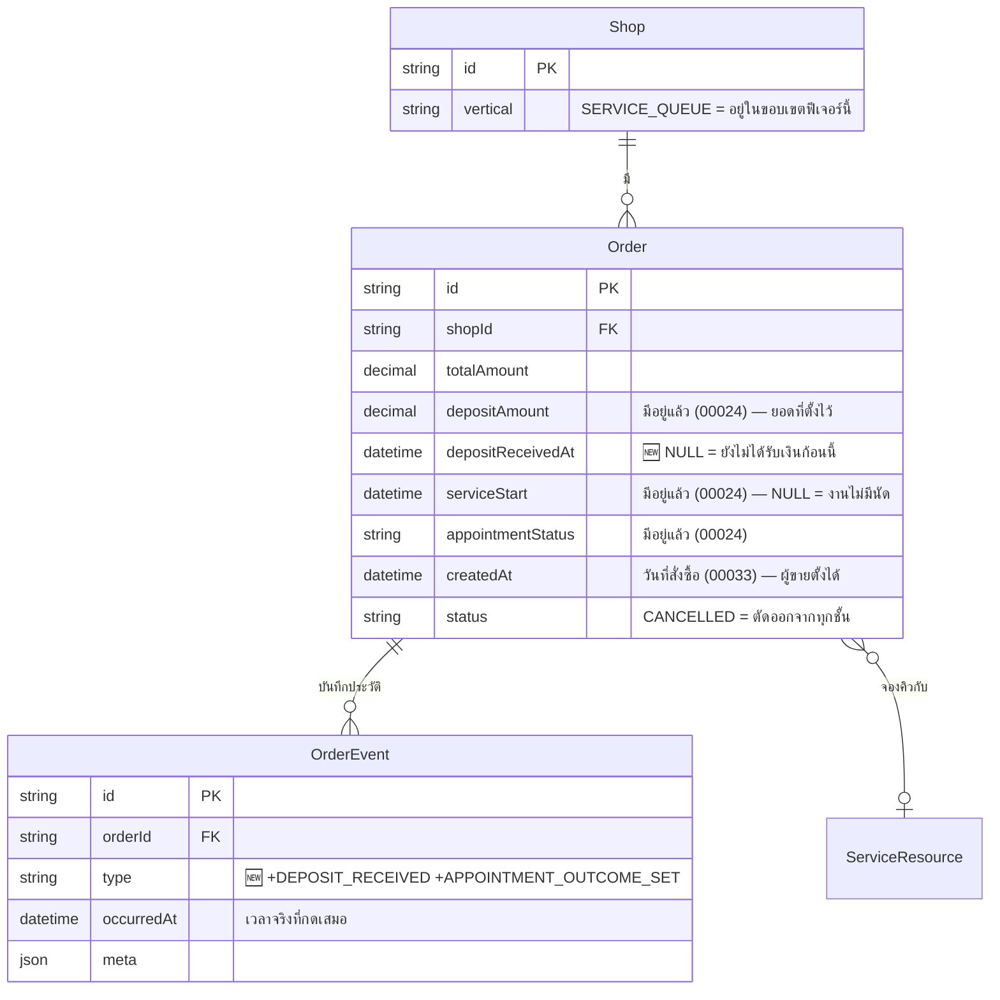

# DATABASE: ยอดขายเกณฑ์เงินสดสำหรับร้านบริการ

## 1. Overview

ฟีเจอร์นี้แตะฐานข้อมูล **น้อยมากโดยตั้งใจ** — เพิ่มคอลัมน์เดียวและค่า enum-by-CHECK อีก 2 ค่า ไม่มีตารางใหม่ ไม่มีการย้ายข้อมูล

| การเปลี่ยนแปลง | ตาราง | ชนิด |
|---|---|---|
| คอลัมน์ใหม่ `depositReceivedAt` | `Order` | additive, nullable |
| ค่าใหม่ 2 ค่าใน CHECK `OrderEvent_type_check` | `OrderEvent` | additive (ต่อท้ายรายชื่อเดิม) |
| index ใหม่ 2 ตัว | `Order` | additive |

**สิ่งที่ไม่ทำ (สำคัญ):** ไม่แตะ `Order.depositAmount`, `Order.appointmentStatus`, `Order.serviceStart` — ทั้งหมดมีอยู่แล้วจาก feature 00024 และฟีเจอร์นี้แค่อ่าน

## 2. ERD



## 3. Tables

### 3.1 `Order` (PostgreSQL — Supabase)

คอลัมน์ที่เพิ่ม:

| คอลัมน์ | ชนิด | Null | Default | คำอธิบาย |
|---|---|---|---|---|
| `depositReceivedAt` | `timestamptz(3)` | ✅ | ไม่มี | เวลาที่ร้านยืนยันว่า **เงินมัดจำเข้ามือแล้ว** · `NULL` = ยังไม่ได้รับ (BR-SCB-10) |

**เหตุผลที่เป็น nullable ห้ามเปลี่ยนเป็น required:**
1. ออเดอร์ที่มีอยู่ก่อน migration ไม่มีทางรู้ว่ารับมัดจำไปเมื่อไร — เดาแล้วเติมเข้าไปคือการบันทึกข้อมูลเท็จที่พิสูจน์ไม่ได้
2. `NULL` เป็นความหมายทางธุรกิจจริง ("ยังไม่ได้รับ") ไม่ใช่แค่ "ไม่มีข้อมูล" — ตัวมันเองคือสิ่งที่ปุ่ม "รับมัดจำแล้ว" ใช้ตัดสินว่าจะแสดงหรือไม่

**เหตุผลที่เป็น `timestamptz` ไม่ใช่ `@db.Date`:**
ต้องเทียบกับ `serviceStart` (`timestamptz(3)`) และต้องรองรับกรณีติ๊กตอนสร้างงานซึ่งได้ค่า = `Order.createdAt` (`timestamptz`) — ใช้ชนิดเดียวกันทั้งสายไม่มีการแปลงกลางทาง

**🛑 ห้าม backfill:** ออเดอร์เดิมทุกใบต้องได้ `NULL` — การเติมค่าย้อนหลัง (เช่น `= createdAt` ให้ทุกใบที่มี `depositAmount > 0`) จะทำให้กราฟย้อนหลังโชว์เงินที่ไม่มีใครยืนยันว่าได้รับจริง ซึ่งขัดกับเหตุผลทั้งหมดที่ทำคอลัมน์นี้ขึ้นมา

### 3.2 `OrderEvent` (PostgreSQL — Supabase)

ไม่เพิ่มคอลัมน์ — เพิ่มเฉพาะ **ค่าที่อนุญาต** ใน CHECK constraint `OrderEvent_type_check` อีก 2 ค่า:

| ค่าใหม่ | ความหมาย | `meta` |
|---|---|---|
| `DEPOSIT_RECEIVED` | ร้านยืนยันว่าได้รับมัดจำแล้ว (BR-SCB-20) | `{ amount: number, source: 'create' \| 'button' }` |
| `APPOINTMENT_OUTCOME_SET` | ร้านปิดงานนัด (BR-SCB-21) | `{ outcome: 'COMPLETED' \| 'NO_SHOW' }` |

`type` รวมเป็น **16 ค่า** (เดิม 14 ตาม `ORDER_EVENT_TYPES` ใน `src/lib/order-event.ts`)

**`occurredAt` = เวลาจริงที่กดเสมอ (BR-SCB-22)** — ห้ามย้อนตาม `Order.createdAt` แม้กรณีติ๊กตอนสร้างออเดอร์ย้อนหลัง: `depositReceivedAt` (คอลัมน์ธุรกิจ) ได้วันย้อนหลัง แต่ `occurredAt` (หลักฐาน) ได้เวลาที่กดจริง — สองค่านี้ต่างกันได้โดยตั้งใจ เหมือน `ORDER_DATE_CHANGED` ของ 00033

**`meta` ห้ามมี PII ผู้ซื้อ** — ตามกฎเดิมของตารางนี้ (ชื่อ/เบอร์/ที่อยู่ห้ามลงแม้ type ใหม่)

## 4. Indexes

| Index | ตาราง | คอลัมน์ | เหตุผล |
|---|---|---|---|
| `Order_shopId_depositReceivedAt_idx` | `Order` | `(shopId, depositReceivedAt)` | ชั้น "มัดจำ" กรองด้วยช่วง `depositReceivedAt` ต่อร้าน — เป็นแกนใหม่ที่ไม่เคยมี index รองรับ |
| `Order_shopId_serviceStart_idx` | `Order` | `(shopId, serviceStart)` | ชั้น "เสร็จสิ้น/วันเข้ารับบริการ/เลยวันนัด" กรองด้วยช่วง `serviceStart` ต่อร้าน · **ตรวจก่อนสร้าง** — feature 00024 อาจมีอยู่แล้วสำหรับปฏิทินคิวงาน ถ้ามีให้ข้าม ไม่สร้างซ้ำ |

index เดิมของ `(shopId, createdAt)` ยังใช้กับชั้น "เสร็จสิ้น" ของงานไม่มีนัด — ไม่ต้องแก้

## 5. Migration Plan

### 5.1 ลำดับการ Migrate

ไฟล์เดียว: `prisma/migrations/2026080715XXXX_service_cash_basis/migration.sql`

```sql
-- 1) คอลัมน์ใหม่ (additive, nullable, ไม่มี default → ไม่ rewrite ตาราง)
ALTER TABLE "Order" ADD COLUMN "depositReceivedAt" TIMESTAMPTZ(3);

-- 2) index (CONCURRENTLY ไม่ได้เพราะอยู่ใน transaction ของ migrate — ตารางยังเล็กพอ)
CREATE INDEX IF NOT EXISTS "Order_shopId_depositReceivedAt_idx"
  ON "Order" ("shopId", "depositReceivedAt");
CREATE INDEX IF NOT EXISTS "Order_shopId_serviceStart_idx"
  ON "Order" ("shopId", "serviceStart");

-- 3) 🛑 CHECK ของ OrderEvent.type — ต้อง ADDITIVE เท่านั้น
--    ห้าม hardcode รายชื่อจากความจำ ต้องอ่านของจริงในฐานมาต่อท้าย
--    (บทเรียน 00033: migration 2 branch แก้ CHECK พร้อมกันแล้วลบค่าของกันเองเงียบ ๆ
--     migrate สำเร็จทุกไฟล์ ไม่มี error ไปโผล่เป็น insert ล้มบนฐานจริง)
--    ดู docs/conventions/migration-check-constraint-additive.md
DO $$
DECLARE
  existing TEXT;
BEGIN
  SELECT pg_get_constraintdef(oid) INTO existing
  FROM pg_constraint
  WHERE conname = 'OrderEvent_type_check';

  IF existing IS NULL THEN
    RAISE EXCEPTION 'OrderEvent_type_check ไม่มีอยู่ — หยุดก่อน อย่าสร้างใหม่จากรายชื่อที่เดาเอง';
  END IF;

  -- ถ้ามีค่าใหม่อยู่แล้ว (rerun) = ไม่ต้องทำอะไร
  IF existing LIKE '%DEPOSIT_RECEIVED%' THEN RETURN; END IF;

  ALTER TABLE "OrderEvent" DROP CONSTRAINT "OrderEvent_type_check";
  EXECUTE format(
    'ALTER TABLE "OrderEvent" ADD CONSTRAINT "OrderEvent_type_check" %s',
    replace(existing, '))', ', ''DEPOSIT_RECEIVED'', ''APPOINTMENT_OUTCOME_SET''))')
  );
END $$;
```

> **ขั้นตอนบังคับก่อนเขียนไฟล์จริง:** รัน `SELECT pg_get_constraintdef(oid) FROM pg_constraint WHERE conname='OrderEvent_type_check';` บนฐาน **local** ก่อน แล้วยืนยันว่ารูปแบบสตริงลงท้ายด้วย `))` จริง (ถ้าไม่ใช่ ต้องเขียน replace ให้ตรงรูปแบบจริง ไม่ใช่เดา)

**การนำขึ้น prod:** `vercel.json` รัน `prisma migrate deploy` ตอน build อยู่แล้ว → **push ขึ้น `main` = migrate ขึ้น prod ในตัว** ไม่ต้องสั่งเอง (Hard Rule 15) · ฐาน local ต้อง `prisma migrate deploy` เองโดยปักหมุด URL localhost ในคำสั่ง (Hard Rule 14) · migrate ล้ม = build ล้ม = deploy ไม่ขึ้น ของเก่ายังเสิร์ฟอยู่

### 5.2 Rollback

```sql
ALTER TABLE "Order" DROP COLUMN "depositReceivedAt";
DROP INDEX IF EXISTS "Order_shopId_depositReceivedAt_idx";
-- CHECK: ไม่ rollback (ค่าที่เพิ่มเป็น superset — แถวเก่ายังผ่านหมด
--        ถ้าถอดออกแล้วมีแถว DEPOSIT_RECEIVED อยู่ ALTER จะล้มทันที)
```

ข้อมูลที่หายจาก rollback = สถานะ "รับมัดจำแล้ว" ทั้งหมด กู้ไม่ได้ — ยอมรับได้เพราะเป็นข้อมูลที่เพิ่งเริ่มเก็บในรอบนี้

### 5.3 ผลกระทบ (Impact)

| ด้าน | ผลกระทบ |
|---|---|
| ตารางถูกล็อก | `ADD COLUMN` nullable ไม่มี default = metadata-only ใน PG 11+ ไม่ rewrite ตาราง (ms-level) |
| ข้อมูลเดิม | ไม่แตะเลย — ทุกแถวได้ `NULL` |
| vertical อื่น | `ONLINE_SALES`/`LODGING` มีคอลัมน์ใหม่ติดมาด้วยแต่ไม่มีโค้ดไหนอ่าน (ค่าเป็น `NULL` ตลอด) |
| การอ่านย้อนหลัง | กราฟของร้านบริการ **จะไม่แสดงมัดจำของออเดอร์เก่าเลย** จนกว่าจะมีคนกดยืนยัน — เป็นพฤติกรรมที่ตั้งใจ (ดู §3.1 "ห้าม backfill") ต้องแจ้ง user ว่ากราฟย้อนหลังจะเปลี่ยนหน้าตา |

## 6. Retention / ข้อควรระวัง

- `OrderEvent` เป็น **insert-only** ไม่มี purge — แถวชนิดใหม่ 2 ชนิดอยู่ตลอดอายุออเดอร์
- 🛑 **ห้าม `prisma db pull` / `migrate dev`** — CHECK `OrderEvent_type_check` เป็น unmanaged SQL ที่ Prisma DSL ประกาศไม่ได้ introspect ไม่เห็นแล้วจะสร้าง migration ที่ DROP ทิ้ง (กฎเดิมของ 00031 ยังใช้ต่อ)
- ก่อนสร้าง `Order_shopId_serviceStart_idx` ต้อง `\d "Order"` ดูก่อนว่า 00024 สร้างไว้แล้วหรือยัง — `IF NOT EXISTS` กันซ้ำได้ก็จริงแต่ชื่ออาจต่างกัน

## 7. Traceability

| Requirement | สิ่งที่รองรับ |
|---|---|
| BR-SCB-02, BR-SCB-10 | `Order.depositReceivedAt` |
| BR-SCB-14 | คอลัมน์รับค่าย้อนหลังได้ (nullable timestamptz ไม่มี default) |
| BR-SCB-20 | `OrderEvent.type = DEPOSIT_RECEIVED` |
| BR-SCB-21 | `OrderEvent.type = APPOINTMENT_OUTCOME_SET` |
| BR-SCB-22 | `OrderEvent.occurredAt` (เวลาจริงที่กด) แยกจาก `Order.depositReceivedAt` (วันธุรกิจ) |
| NFR ความเร็ว (BRD §6.2) | index 2 ตัวใน §4 |

## 8. สรุป (Summary)

การเปลี่ยนแปลงฐานข้อมูลของฟีเจอร์นี้เล็กที่สุดเท่าที่จะเป็นไปได้: **1 คอลัมน์ + 2 ค่าใน CHECK + 2 index** ไม่มีตารางใหม่ ไม่มี backfill ไม่มีการย้ายข้อมูล ความซับซ้อนทั้งหมดของฟีเจอร์อยู่ที่ชั้น service (การจัดชั้นยอดขาย) ไม่ใช่ที่ schema

จุดเสี่ยงเดียวที่ต้องระวังจริง ๆ คือ **การแก้ CHECK ของ `OrderEvent_type_check` ต้อง additive** — อ่านของเดิมจากฐานมาต่อท้าย ห้าม hardcode รายชื่อ ไม่งั้นจะลบค่าของ branch อื่นทิ้งเงียบ ๆ แบบที่เคยเกิดมาแล้ว
