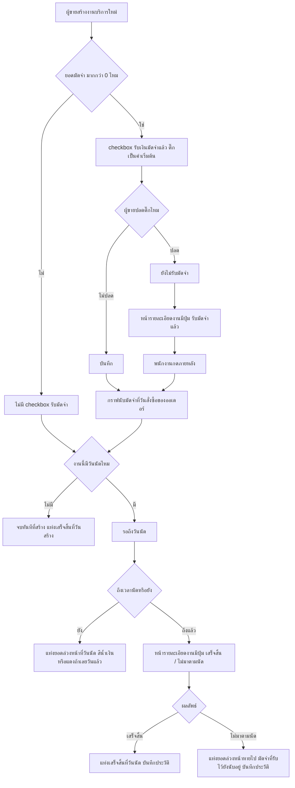

> **โมดูล:** M00034-ServiceCashBasisSales
> **ประเภทเอกสาร:** Product Requirements Document (PRD)
> **เวอร์ชัน:** 1.0
> **วันที่จัดทำ:** 2026-08-07
> **สถานะ:** Draft — มติ D-1..D-7 ล็อกแล้วโดย user ใน design spec (ดู §10.2), D-8/D-9 เคาะเพิ่มโดย Controller, รอ user review ก่อน implement
> **เจ้าของเอกสาร:** BA + PO + PM (ดู [[Feature-Docs-Ownership]])

# PRD: ยอดขายเกณฑ์เงินสดสำหรับร้านบริการ (Service Cash Basis Sales)

---

## Executive Summary

การ์ด "ยอดขาย" บน Mobile Command Center ของร้านค้าประเภท `SERVICE_QUEUE` (ร้านคิวงาน/บริการ) ใช้ชุดคำและสูตรที่ยืมมาจากร้านขายของออนไลน์ทั้งชุด — "ยืนยันแล้ว / รอยืนยัน / จำนวนการเข้ารับบริการ" ซึ่งเป็นสถานะของ "การส่งของ" ไม่ใช่จังหวะเงินของงานบริการ ในความเป็นจริงร้านบริการรับเงินเป็น 2 จังหวะเสมอ: มัดจำตอนจอง แล้วส่วนที่เหลือตอนลูกค้ามาถึงหน้างานและร้านปิดงาน แต่กราฟเดิมโยนยอดเต็มของงานลงวันที่สร้างออเดอร์ทั้งก้อน ทั้งที่เงินส่วนใหญ่ยังไม่เข้ามือจริง ทำให้เจ้าของร้านเห็นตัวเลขที่ไม่สะท้อนกระแสเงินสดจริงเลย

ฟีเจอร์นี้เปลี่ยนการ์ดยอดขาย (และหน้า `/sales`) ของร้าน `SERVICE_QUEUE` ให้พูดภาษาเงินสดของธุรกิจบริการ ด้วยการจัดชั้นข้อมูล 4 ชั้น — **มัดจำ / เสร็จสิ้น / วันเข้ารับบริการ / เลยวันนัด** — โดยเลขฮีโร่ (ยอดรวมที่โชว์เด่นสุด) นับเฉพาะเงินที่ได้รับจริง (มัดจำ + เสร็จสิ้น) ไม่รวมยอดในอนาคตที่ยังไม่เข้ามือ

ระหว่างสำรวจพบข้อเท็จจริงสำคัญ 2 ข้อที่ทำให้ขอบเขตงานกว้างกว่าการแก้กราฟอย่างเดียว: (1) ปุ่ม "เสร็จสิ้น"/"ไม่มาตามนัด" มี service layer และ API ครบมาตั้งแต่ feature 00024 แต่ **ไม่เคยมีหน้าจอไหนเรียกใช้เลย** — ถ้าไม่เพิ่มหน้าจอส่วนนี้ แท่ง "เสร็จสิ้น" จะเป็น 0 ตลอดกาล และ (2) ระบบไม่เคยมีคอลัมน์บอกว่า "มัดจำเข้ามือแล้วหรือยัง" — ต้องมีการยืนยันก่อนถึงจะนับเป็นเงินเข้าจริง จึงต้องเพิ่มคอลัมน์ใหม่ `Order.depositReceivedAt` พร้อมจุดกดยืนยัน

งานนี้ผูกกับ feature 00024 (Service Appointment Booking) เป็นฐาน, ต่อยอด feature 00031 (Order Activity Log) ด้วยเหตุการณ์ใหม่ 2 ประเภท, และต้องเข้ากันได้กับ feature 00033 (Backdated Order Date) — ออเดอร์ย้อนหลังที่ติ๊ก "รับมัดจำแล้ว" ตอนสร้าง ต้องได้วันที่มัดจำตรงกับวันที่ผู้ขายระบุ ไม่ใช่วันนี้

---

## 1. Business Goals & KPIs

### 1.1 เป้าหมายทางธุรกิจ

| เป้าหมาย | รายละเอียด |
|----------|-----------|
| **การ์ดยอดขายพูดภาษาเงินสดของธุรกิจบริการ** | แทนที่ชุดคำ "ยืนยันแล้ว/รอยืนยัน/จำนวนการเข้ารับบริการ" ที่ยืมจากร้านขายของ ด้วยชั้นข้อมูลที่ตรงกับจังหวะเงินจริง 2 จังหวะของร้านบริการ (มัดจำตอนจอง + ส่วนที่เหลือตอนปิดงาน) |
| **เลขฮีโร่นับเฉพาะเงินที่ได้รับจริง** | เจ้าของร้านเห็นยอดที่เข้ามือจริง ณ วัน/เดือนนั้น แยกออกจากยอดในอนาคตที่ยังไม่เข้ามือ ไม่ถูกทำให้เข้าใจผิดว่ามีเงินมากกว่าที่มีจริง |
| **ปุ่มปิดงานบริการใช้งานได้จริงบนหน้าจอ** | ปิดช่องว่างที่ backend/API ของ feature 00024 มีอยู่แล้วแต่ไม่เคยมีหน้าจอเรียกใช้ — ถ้าไม่ทำ ตัวเลขทั้งชั้น "เสร็จสิ้น" จะเป็น 0 ตลอดกาลไม่ว่าจะแก้กราฟดีแค่ไหน |
| **ไม่กระทบยอดขายของร้านประเภทอื่น** | vertical `ONLINE_SALES`/`LODGING` และ `/expenses` (P&L) ไม่ถูกแตะแม้แต่บรรทัดเดียวในรอบนี้ |

### 1.2 ตัวชี้วัดความสำเร็จ (KPIs)

| KPI | คำอธิบาย | เป้าหมาย |
|-----|----------|---------|
| **ปุ่มปิดงานถูกใช้งานจริง** | สัดส่วนนัดที่ถึงกำหนด (`serviceStart` ผ่านไปแล้ว) ที่ถูกกด "เสร็จสิ้น"/"ไม่มาตามนัด" ผ่านหน้าจอจริง เทียบกับก่อนไม่มีปุ่ม (0%) | > 0% ภายในสัปดาห์แรกหลังปล่อยใช้งานของร้านที่มีนัดถึงกำหนด |
| **ความถูกต้องของเลขฮีโร่** | เทียบเลขฮีโร่ที่แสดงบนการ์ดกับผลรวมที่คำนวณด้วยมือตามสูตร §5 ของ design spec | ตรงกัน 100% ทุกกรณีทดสอบ |
| **ไม่มีการนับซ้ำ** | เงินก้อนเดียวของออเดอร์เดียวปรากฏพร้อมกันในมากกว่า 1 ชั้นของกราฟในวันเดียวกัน | 0 เคส |
| **ความสอดคล้องข้ามหน้าจอ** | ตัวเลขของการ์ด (`SalesChartCard`), ชีตเต็มจอ (`SalesChartSheet`), และหน้า `/sales` ของช่วงเวลาเดียวกัน | ตรงกัน 100% ทุกจุด (ห้ามการ์ดบอกเลขหนึ่ง ชีตบอกอีกเลข) |

### 1.3 ขอบเขตการส่งมอบ

งานนี้เป็น phase เดียว ไม่แบ่ง phase ย่อย — ก้อนงานหลัก 3 ส่วนตาม design spec §6 (Scope A: คอลัมน์+การรับมัดจำ, Scope B: ปิดงาน, Scope C: กราฟ+ตัวเลข) บวก 2 มติที่ Controller เคาะเพิ่ม (D-8: กำไรสุทธิใน `/sales` เดินตามนิยามใหม่, D-9: บันทึกลงประวัติกิจกรรม) ต้อง ship พร้อมกันในรอบเดียว เพราะเป้าหมายทั้งฟีเจอร์คือ "การ์ดยอดขายต้องพูดภาษาเงินสดที่ถูกต้อง" — ทำแค่ Scope C (กราฟ) โดยไม่ทำ Scope B (ปุ่มปิดงาน) จะได้แท่ง "เสร็จสิ้น" เป็น 0 ตลอดกาล ซึ่งถือว่าฟีเจอร์ยังไม่บรรลุเป้าหมายที่ตั้งไว้

---

## 2. User Personas (กลุ่มผู้ใช้งาน)

### 2.1 เจ้าของร้านบริการ (`SERVICE_QUEUE`) ที่ดู Command Center

**ข้อมูลพื้นฐาน:**
- เจ้าของ/ผู้บริหารร้านประเภทคิวงาน-บริการ (สปา คลินิก ร้านซ่อม ฯลฯ) ที่เปิดแอปดูยอดขายผ่าน Mobile Command Center และหน้า `/sales` เพื่อวางแผนธุรกิจ

**เป้าหมาย:**
- รู้ว่าเดือนนี้/วันนี้มีเงินเข้ามือจริงเท่าไร แยกจากยอดที่ยังรอลูกค้ามาใช้บริการ

**ความต้องการ:**
- เห็นชั้นข้อมูลที่ตรงกับจังหวะเงินจริงของธุรกิจบริการ ไม่ใช่คำศัพท์ของการส่งพัสดุ
- เห็นยอดล่วงหน้า (นัดที่ยังไม่ถึงวัน) เพื่อวางแผนกระแสเงินสด โดยไม่ปนกับเงินที่ได้แล้ว

**จุดปวด (Pain Points):**
- การ์ดเดิมขึ้น "ยืนยันแล้ว/รอยืนยัน/จำนวนการเข้ารับบริการ" ซึ่งไม่มีความหมายกับธุรกิจบริการเลย
- ยอดเต็มของงานถูกโยนลงวันที่สร้างออเดอร์ทั้งก้อน ทั้งที่ได้แค่มัดจำ ทำให้เข้าใจผิดว่ามีเงินมากกว่าที่มีจริง

### 2.2 พนักงาน/แอดมินหน้าร้านที่รับมัดจำและปิดงานบริการ

**ข้อมูลพื้นฐาน:**
- พนักงานที่รับเงินมัดจำตอนลูกค้าจอง (ส่วนใหญ่รับหน้าร้านทันที) และเป็นคนกดปิดงานเมื่อลูกค้ามาถึงหรือไม่มาตามนัด

**เป้าหมาย:**
- ยืนยันว่าเงินมัดจำเข้ามือแล้วจริง และปิดงานให้ตรงกับสิ่งที่เกิดขึ้นจริงหน้างาน

**ความต้องการ:**
- ตอนสร้างงานใหม่ ไม่ต้องกดอะไรเพิ่มถ้ารับมัดจำหน้าร้านตามปกติแล้ว (ค่าเริ่มต้นต้องช่วยงานที่ทำถี่ที่สุด)
- มีปุ่มกดง่าย ๆ เมื่อลูกค้ามาถึง/ไม่มาตามนัด ไม่ต้องเข้าเมนูซับซ้อน

**จุดปวด (Pain Points):**
- ระบบไม่มีทางบอกว่ามัดจำเข้ามือหรือยัง ป้ายในฟอร์มเขียนว่า "มัดจำที่เก็บ" ซึ่งกำกวมระหว่าง "จะเก็บ" กับ "เก็บแล้ว"
- ปุ่มปิดงานไม่มีอยู่จริงในหน้าจอไหนเลย ทั้งที่ระบบหลังบ้านรองรับอยู่แล้ว

### 2.3 ผู้ตรวจสอบกิจกรรมของออเดอร์ (Activity Log)

**ข้อมูลพื้นฐาน:**
- เจ้าของร้าน/ผู้ตรวจสอบภายในที่ดูประวัติกิจกรรม (feature 00031) ของออเดอร์แต่ละใบเพื่อตรวจว่าใครทำอะไรเมื่อไหร่

**เป้าหมาย:**
- ตรวจสอบได้ว่าใครกดยืนยันรับมัดจำ และใครกดปิดงานเป็น "เสร็จสิ้น"/"ไม่มาตามนัด" เมื่อไหร่จริง

**ความต้องการ:**
- เหตุการณ์เหล่านี้ต้องปรากฏในไทม์ไลน์ประวัติกิจกรรมเหมือนเหตุการณ์อื่นของออเดอร์ (สร้าง/แก้ไข/ยกเลิก)

**จุดปวด (Pain Points):**
- ถ้าการรับมัดจำ/ปิดงานไม่ถูกบันทึกไว้ จะไม่มีทางย้อนสอบได้ว่าเงินก้อนนี้เข้ามือจริงหรือใครเป็นคนตัดสินว่าลูกค้าไม่มาตามนัด

---

## 3. Business Requirements

### 3.1 การ์ดยอดขายพูดภาษาเงินสดของร้านบริการ (4 ชั้นข้อมูล)

**ความต้องการ:**
- การ์ดยอดขายและชีตเต็มจอของร้าน `SERVICE_QUEUE` ต้องแสดงยอดขายเป็น 4 ชั้น: **มัดจำ** (เงินก้อนแรกที่เข้าจริง), **เสร็จสิ้น** (ลูกค้ามาตามนัดและร้านปิดงานแล้ว), **วันเข้ารับบริการ** (ยอดล่วงหน้าของนัดที่ยังไม่ถึงวัน), **เลยวันนัด** (นัดที่เลยกำหนดแล้วยังไม่ถูกปิดงาน)
- เลขฮีโร่ (ยอดรวมที่โชว์เด่นสุดของช่วงเวลา) ต้องนับเฉพาะ "มัดจำ + เสร็จสิ้น" เท่านั้น ไม่รวม 2 ชั้นที่เป็นยอดล่วงหน้า

**Business Rules:**
- ทุกชั้นมีเงื่อนไขร่วม: คิดเฉพาะออเดอร์ที่ยังไม่ถูกยกเลิก และเฉพาะร้านที่เป็น `SERVICE_QUEUE`
- เงินก้อนเดียวของออเดอร์เดียวต้องลงตะกร้าได้แค่ที่เดียวเสมอ — มัดจำลงวันที่รับมัดจำ ส่วนที่เหลือลงวันที่ปิดงาน ห้ามซ้ำ
- แท็บ "วันนี้" (ย้อนหลัง 14 วัน) แสดงเฉพาะ 2 ชั้นที่เป็นเงินจริงแล้ว (มัดจำ/เสร็จสิ้น) ไม่แสดงยอดล่วงหน้า เพราะหน้าต่างนี้พูดเรื่องเงินที่ได้จริงอย่างเดียว

**เหตุผล:**
- ธุรกิจบริการรับเงิน 2 จังหวะจริง การ์ดที่พูดจังหวะเดียว (ยอดเต็มตอนสร้างออเดอร์) ทำให้เจ้าของร้านตัดสินใจผิดพลาดเรื่องกระแสเงินสด
- การแยกยอดล่วงหน้าออกจากเลขฮีโร่ป้องกันไม่ให้เจ้าของร้านเข้าใจผิดว่ามีเงินมากกว่าที่มีจริง

### 3.2 ยืนยันรับมัดจำก่อนถึงจะนับเป็นเงินเข้า

**ความต้องการ:**
- ต้องมีวิธียืนยันว่ามัดจำ "เข้ามือแล้ว" แยกจากยอดมัดจำที่ตั้งไว้ (`Order.depositAmount` เป็นแค่ยอดที่ควรเก็บ ไม่ใช่สถานะจ่าย) — ก่อนยืนยัน มัดจำนั้นต้องไม่ถูกนับเป็นยอดขายในกราฟ
- ตอนสร้างงานใหม่ ต้องมี checkbox "รับเงินมัดจำแล้ว" ที่ติ๊กไว้เป็นค่าเริ่มต้น เพราะกรณีปกติที่สุดคือรับมัดจำหน้าร้านตอนจองแล้ว
- หน้ารายละเอียดงานต้องมีปุ่มยืนยัน "รับมัดจำแล้ว" สำหรับกรณีที่ยังไม่ได้ติ๊กไว้ตอนสร้าง

**Business Rules:**
- checkbox ตอนสร้างงานซ่อนทั้งช่องเมื่อยอดมัดจำ = 0 (ไม่มีอะไรให้ยืนยัน)
- ปุ่ม "รับมัดจำแล้ว" ในหน้ารายละเอียดแสดงเฉพาะเมื่อมียอดมัดจำ > 0 และยังไม่เคยยืนยัน
- แก้ไขยอดมัดจำในฟอร์มแก้ไขงานภายหลัง ต้องไม่ทำให้สถานะ "รับมัดจำแล้ว" ที่เคยยืนยันไว้หายไปเงียบ ๆ
- ออเดอร์ที่ถูกลงวันที่สั่งซื้อย้อนหลัง (feature 00033) แล้วติ๊ก "รับมัดจำแล้ว" ตั้งแต่ตอนสร้าง ต้องได้วันที่รับมัดจำตรงกับวันที่สั่งซื้อที่ผู้ขายระบุ ไม่ใช่วันที่กดบันทึกจริง — ไม่งั้นมัดจำจะไปโผล่ในกราฟวันนี้ ทั้งที่งานทั้งใบถูกลงวันอื่น

**เหตุผล:**
- งานบริการไม่มีขั้นแนบสลิปยืนยันการโอนโดยตั้งใจ (ไม่ใช่ข้อจำกัด แต่เป็นกฎที่มีอยู่แล้วของระบบจอง) — การกดยืนยันด้วยมือจึงเป็นกลไกเดียวที่บอกได้ว่าเงินเข้าจริง
- ค่าเริ่มต้นติ๊กไว้ ลดภาระของพนักงานในกรณีปกติ (รับมัดจำหน้าร้านตอนจองอยู่แล้ว) ให้กดครั้งเดียวจบ ไม่ต้องกดยืนยันซ้ำอีกที

### 3.3 ปิดงานบริการมีหน้าจอใช้งานได้จริง

**ความต้องการ:**
- หน้ารายละเอียดงานต้องมีปุ่ม "เสร็จสิ้น" และ "ไม่มาตามนัด" ที่กดได้จริง เพื่อปิดงานเมื่อลูกค้ามาถึง/ไม่มาตามนัด
- ตำแหน่งปุ่มต้องอยู่ในจุดที่ผู้ใช้เข้าถึงได้จริงบนทุกขนาดจอ รวมถึงกรณีหน้าจอเข้าโหมดเต็มจอที่ทำให้เมนู/แถบปุ่มหลักหายไปทั้งก้อน

**Business Rules:**
- กดปิดงานได้ตั้งแต่ถึงเวลาเริ่มนัดเป็นต้นไปเท่านั้น (ยังไม่ถึงเวลานัดจะกดไม่ได้)
- นัดที่ถูกปิดงานแล้ว (เสร็จสิ้น/ไม่มาตามนัด) เป็นสถานะสุดท้าย กดปิดซ้ำหรือกดสลับผลไม่ได้
- การกดปิดงานไม่แตะสถานะออเดอร์หลัก (`Order.status`) และไม่มีผลต่อ Trust Score ของผู้ซื้อ
- งานที่ไม่ได้ผูกกับนัดหมายใด ๆ (walk-in ที่ไม่มีวันเข้ารับบริการ) ถือว่าจบสมบูรณ์ในวันที่สร้างงานโดยอัตโนมัติ ไม่ต้องกดปิดงานเพิ่ม

**เหตุผล:**
- API/service ของการปิดงานมีอยู่ครบตั้งแต่ feature 00024 แต่ไม่เคยมีหน้าจอเรียกใช้เลย — ถ้าไม่เพิ่มหน้าจอ แท่ง "เสร็จสิ้น" ในกราฟจะเป็น 0 ตลอดกาลไม่ว่ากราฟจะออกแบบดีแค่ไหน
- เงื่อนไขเวลา/สถานะสุดท้ายมีอยู่แล้วที่ชั้น service ของ feature 00024 หน้าจอต้องสะท้อนกฎเดิมให้ปุ่มไม่โผล่ผิดจังหวะ ไม่ใช่สร้างกฎใหม่ซ้ำ

### 3.4 หน้า `/sales` สะท้อนยอดขายเกณฑ์เงินสดแบบเดียวกับการ์ด

**ความต้องการ:**
- หน้า `/sales` ของร้าน `SERVICE_QUEUE` ต้องเปลี่ยนนิยาม "ยอดขาย" และ "ยอดที่ยังไม่ยืนยัน" ให้ตรงกับสูตร 4 ชั้นเดียวกับการ์ด/ชีตเต็มจอ ไม่ใช่คนละสูตร
- คอลัมน์ "กำไรสุทธิ" ในหน้า `/sales` ต้องคำนวณจากยอดขายนิยามใหม่ในแถวเดียวกัน (บวกลบกันได้ในแถวเดียวกัน)

**Business Rules:**
- ยอดในหน้า `/sales`, ชีตเต็มจอ, และการ์ด ต้องมาจากตัวตัดสินยอดเดียวกัน ห้ามคำนวณซ้ำคนละสูตรในแต่ละหน้าจอ
- การ์ด P&L ในหน้า `/expenses` **ไม่อยู่ในขอบเขตของรอบนี้** ยังคงใช้นิยามยอดขายเดิม (เกณฑ์คงค้าง) ต่อไป — เป็นความต่างที่รู้ตัวและบันทึกไว้เป็นหนี้ (ดู §6.1)

**เหตุผล:**
- ถ้าหน้าตัวเลขต่าง ๆ ใช้นิยามคนละชุด เจ้าของร้านจะเห็นตัวเลขไม่ตรงกันระหว่างการ์ดกับหน้ารายงาน ซึ่งบั่นทอนความน่าเชื่อถือของทั้งฟีเจอร์
- กำไรสุทธิที่คำนวณจากยอดขายคนละนิยามกับที่แสดงในแถวเดียวกันจะบวกลบกันไม่ได้ ทำให้ผู้ใช้อ่านตัวเลขผิดทันที

### 3.5 ประวัติกิจกรรมบันทึกการรับมัดจำและการปิดงาน

**ความต้องการ:**
- การกด "รับมัดจำแล้ว" และการกด "เสร็จสิ้น"/"ไม่มาตามนัด" ต้องถูกบันทึกเป็นเหตุการณ์ในประวัติกิจกรรมของออเดอร์ (feature 00031) เช่นเดียวกับเหตุการณ์อื่นของออเดอร์

**Business Rules:**
- เวลาที่บันทึกในประวัติกิจกรรมต้องเป็นเวลาจริงที่กดปุ่มเสมอ (ตามแนวทางเดียวกับ `ORDER_DATE_CHANGED` ของ feature 00033) ไม่ย้อนตามวันที่สั่งซื้อของออเดอร์ที่อาจถูกตั้งเป็นวันอื่น
- ต้องแยกประเภทเหตุการณ์ระหว่าง "รับมัดจำแล้ว" กับ "ปิดงาน" เพราะเป็นการกระทำคนละความหมาย (คนละคนกดก็ได้ คนละเวลาก็ได้)

**เหตุผล:**
- ประวัติกิจกรรมมีคุณค่าในฐานะหลักฐานตรวจสอบได้ — การรับเงินและการปิดงานคือจุดที่มีผลต่อยอดขายในรายงาน จึงต้องมีร่องรอยว่าใครทำเมื่อไหร่ เหมือนเหตุการณ์สำคัญอื่นของออเดอร์

---

## 4. Business Rules & Constraints

### 4.1 กฎทางธุรกิจหลัก

| กฎ | คำอธิบาย |
|----|----------|
| **มัดจำนับเมื่อยืนยันแล้วเท่านั้น** | `depositAmount` เป็นแค่ยอดที่ตั้งไว้ ต้องผ่านการยืนยัน "รับมัดจำแล้ว" ก่อนถึงจะถูกนับเข้ากราฟ |
| **เลขฮีโร่ = มัดจำ + เสร็จสิ้นเท่านั้น** | ไม่รวมยอดล่วงหน้า 2 ชั้น (วันเข้ารับบริการ/เลยวันนัด) แม้จะแสดงอยู่ในกราฟเดียวกัน |
| **งานที่ไม่มีวันนัด = จบในวันที่สร้าง** | ไม่ต้องรอการกดปิดงาน ถือว่าเสร็จสมบูรณ์ทันทีที่สร้าง |
| **เงินก้อนเดียวลงตะกร้าเดียวเสมอ** | ไม่มีการนับซ้ำระหว่างมัดจำกับส่วนที่เหลือ |
| **ปิดงานเป็นสถานะสุดท้าย** | เสร็จสิ้น/ไม่มาตามนัด กดซ้ำหรือสลับผลไม่ได้ |
| **การปิดงานไม่กระทบสถานะออเดอร์หลักและ Trust Score** | แยกอิสระจาก state machine ของ `Order.status` โดยสมบูรณ์ |
| **ไม่มีสิทธิ์แยกสำหรับการรับมัดจำ/ปิดงาน** | ใครจัดการออเดอร์ของร้านได้ ก็กดรับมัดจำ/ปิดงานได้เหมือนกันหมด ความรับผิดชอบตรวจสอบผ่านประวัติกิจกรรมแทน |

### 4.2 ข้อจำกัดทางธุรกิจ

| ข้อจำกัด | รายละเอียด |
|---------|-----------|
| **ไม่มีขั้นแนบสลิปมัดจำ** | การยืนยัน "รับมัดจำแล้ว" เป็นการกดยืนยันเฉย ๆ ไม่ใช่การแนบหลักฐานไฟล์ ตามกฎที่มีอยู่แล้วของระบบจอง (ไม่กั้นการกันคิวด้วยมัดจำ) |
| **เฉพาะร้าน `SERVICE_QUEUE`** | ร้าน `ONLINE_SALES`/`LODGING` ไม่ได้รับผลกระทบใด ๆ จากฟีเจอร์นี้ |
| **`/expenses` (P&L) ยังใช้นิยามเดิม** | ความต่างระหว่างยอดขายใน `/sales` (เกณฑ์เงินสดใหม่) กับการ์ด P&L (เกณฑ์คงค้างเดิม) เป็นหนี้ที่รู้ตัว ไม่ได้ปิดในรอบนี้ |
| **แดชบอร์ดเดสก์ท็อป (`SalesReport`) ไม่ถูกแตะ** | เป็นคนละ component คนละ query จากการ์ด/หน้า `/sales` มือถือ |

### 4.3 เหตุผลที่ยอดจะไม่ถูกนับ/ถูกย้าย

| เหตุผล | ผลที่เกิด |
|--------|-----------|
| มัดจำถูกตั้งไว้แต่ยังไม่กดยืนยัน "รับมัดจำแล้ว" | ยอดนั้นไม่ปรากฏในกราฟเลย (ทั้งชั้นมัดจำและชั้นอื่น) จนกว่าจะยืนยัน |
| นัดถูกปิดงานเป็น "ไม่มาตามนัด" (`NO_SHOW`) | มัดจำที่เคยรับไว้ยังนับอยู่ (เพราะเข้ามือไปแล้วตั้งแต่วันที่รับ) ส่วนที่เหลือของงานไม่ถูกนับที่ไหนเลย — แท่งยอดล่วงหน้าของนัดนี้หายไป |
| ลูกค้าขอเลื่อนนัด (`RESCHEDULE_REQUESTED`) | ยังไม่ใช่สถานะสุดท้าย ยอดยังคงอยู่ในชั้นยอดล่วงหน้าที่วันนัดเดิม จนกว่าร้านจะตัดสินใจย้ายเวลาจริง |
| งานไม่มีวันนัดผูกอยู่เลย | ถือว่าจบสมบูรณ์ทันทีที่สร้าง ไม่ต้องรอการกดปิดงาน |

---

## 5. Out of Scope (นอกขอบเขต)

สิ่งที่ระบบนี้ **ไม่รองรับ** หรือ **ไม่รับผิดชอบ**:

| หัวข้อ | คำอธิบาย |
|--------|----------|
| **การ์ด P&L ในหน้า `/expenses`** | ยังใช้นิยามยอดขายเดิม (เกณฑ์คงค้าง) ไม่เปลี่ยนตามในรอบนี้ — เป็นความต่างที่รู้ตัวและบันทึกไว้เป็นหนี้ (ดู §6.1) |
| **vertical `ONLINE_SALES`** | ไม่แตะแม้แต่บรรทัดเดียว — การ์ดยอดขายของร้านขายของยังใช้ชุดคำเดิม |
| **vertical `LODGING`** | ไม่แตะแม้แต่บรรทัดเดียว — คนละธุรกิจ คนละสูตร |
| **แดชบอร์ดเดสก์ท็อป (`SalesReport`)** | คนละ component คนละ query จากการ์ด/หน้า `/sales` มือถือ ไม่อยู่ในขอบเขตของรอบนี้ |
| **ขั้นตอนแนบสลิปมัดจำ** | งานบริการไม่มีขั้นแนบเอกสารยืนยันการโอนโดยตั้งใจ ฟีเจอร์นี้เพิ่มแค่การกดยืนยันด้วยมือ ไม่สร้างขั้นตอนแนบไฟล์ใหม่ |
| **สิทธิ์แยกตามบทบาทสำหรับรับมัดจำ/ปิดงาน** | ไม่มีการจำกัดว่าเฉพาะบทบาทใดถึงจะกดได้ — ทุกคนที่จัดการออเดอร์ของร้านได้ก็ทำได้เหมือนกันหมด |
| **การแจ้งเตือน/รีมายด์อัตโนมัติให้กดปิดงาน** | ระบบไม่ส่งแจ้งเตือนเชิงรุกเมื่อนัดถึงกำหนดแล้วยังไม่ถูกปิดงาน — ผู้ใช้เห็นได้จากแท่ง "เลยวันนัด" สีแดงในกราฟเท่านั้น |
| **การผูกหน้าจอฝั่งผู้ซื้อ (`/o/{token}`)** | ฟีเจอร์นี้เป็นมุมมองฝั่งร้านล้วน ไม่มีการเปลี่ยนแปลงสิ่งที่ผู้ซื้อเห็น |

---

## 6. Risks & Mitigation (ความเสี่ยงและแนวทางแก้ไข)

### 6.1 ความเสี่ยงทางธุรกิจ

| ความเสี่ยง | ผลกระทบ | ระดับความรุนแรง | แนวทางแก้ไข |
|-----------|---------|-----------------|-------------|
| **ตัวเลขในหน้า `/sales` กับการ์ด P&L ที่ `/expenses` ไม่ตรงกันเพราะคนละนิยาม** | เจ้าของร้านเห็นยอดขายสองตัวไม่เท่ากันในระบบเดียวกัน สับสนว่าตัวไหนถูก | กลาง | บันทึกเป็นหนี้ที่รู้ตัวชัดเจน (§4.2, §5) และพิจารณา sync นิยามในรอบถัดไปเมื่อมีมติเพิ่มเติม |
| **พนักงานลืมกดปิดงาน** | นัดที่เกินกำหนดค้างอยู่ในชั้น "เลยวันนัด" ตลอดไป ทำให้ยอดขายจริงดูน้อยกว่าความเป็นจริง | กลาง | สีแดงของแท่ง "เลยวันนัด" ทำหน้าที่เป็นสัญญาณเตือนบนกราฟเอง (ไม่ต้องมีระบบแจ้งเตือนแยก) |
| **ป้าย "มัดจำ ฿0" ทุกวันของร้านที่ไม่เก็บมัดจำเลยทำให้กราฟรก** | ร้านที่ไม่เก็บมัดจำเห็นชั้นข้อมูลที่ไม่มีความหมายกับตัวเอง | ต่ำ | สมมติฐานเบื้องต้น: ยังคงแสดง legend ปกติไม่ซ่อน (ดู §9.2 A-4) — ต้องยืนยันกับ user ตอน review |

### 6.2 ความเสี่ยงทางเทคนิค

| ความเสี่ยง | ผลกระทบ | แนวทางแก้ไข |
|-----------|---------|-------------|
| **ปุ่มปิดงานทำเสร็จแต่กราฟยังไม่ถูกแก้ตาม** | แท่ง "เสร็จสิ้น" ยังเป็น 0 ทั้งที่ปุ่มใช้งานได้แล้ว | Scope B (ปุ่ม) และ Scope C (กราฟ) ต้อง ship พร้อมกันเสมอ ไม่แยกปล่อยบางส่วน (ดู §1.3) |
| **ตะกร้าวันคำนวณด้วย UTC แทนเวลาไทย** | มัดจำ/การปิดงานที่เกิดช่วงกลางคืนตกไปนับผิดวัน (บั๊กเดียวกับที่ feature 00033 เพิ่งแก้ในหน้าอื่น) | ต้องใช้กลไกคำนวณเวลาไทยเดียวกับที่ `dashboard.service.ts` ใช้อยู่แล้วทุกจุดที่ตัดวัน |
| **ปุ่มยืนยันรับมัดจำของออเดอร์ย้อนหลังใช้เวลาปัจจุบันแทนวันที่สั่งซื้อจริง** | มัดจำของออเดอร์ที่ตั้งใจลงวันอื่นไปโผล่ในกราฟวันนี้แทน ขัดกับความตั้งใจของผู้ขาย | checkbox ตอนสร้างงานต้องผูกกับวันที่ที่ผู้ขายระบุ (`Order.createdAt` ที่ตั้งค่าไว้) ไม่ใช่เวลาที่กดบันทึกจริง |
| **การ์ด/ชีตเต็มจอ/หน้า `/sales` คำนวณสูตรซ้ำกันคนละที่** | ตัวเลขไม่ตรงกันระหว่างหน้าจอ ต้องแก้หลายจุดเมื่อสูตรเปลี่ยน | ต้องมีตัวตัดสินยอดกลางจุดเดียวที่ทุกหน้าจอเรียกใช้ร่วมกัน |

---

## 7. Glossary (อภิธานศัพท์)

| คำศัพท์ | ความหมาย |
|---------|----------|
| **มัดจำ (Deposit Layer)** | ชั้นข้อมูลของเงินก้อนแรกที่เข้าจริง — นับเมื่อยืนยัน "รับมัดจำแล้ว" เท่านั้น ลงตะกร้าวันที่ยืนยัน |
| **เสร็จสิ้น (Completed Layer)** | ชั้นข้อมูลของส่วนที่เหลือหลังหักมัดจำ เมื่อร้านกดปิดงานว่าลูกค้ามาตามนัดแล้ว หรือเมื่องานไม่มีวันนัดผูกอยู่ (จบทันทีที่สร้าง) |
| **วันเข้ารับบริการ (Upcoming Layer)** | ยอดล่วงหน้าของนัดที่ยังไม่ถึงวันและยังไม่ถูกปิดงาน — เป็นเงินที่คาดว่าจะได้ ไม่ใช่เงินที่ได้แล้ว |
| **เลยวันนัด (Overdue Layer)** | ยอดล่วงหน้าของนัดที่ผ่านวันนัดไปแล้วแต่ยังไม่ถูกปิดงาน — สัญญาณเตือนให้พนักงานเข้าไปปิดงาน |
| **เลขฮีโร่ (Hero Number)** | ยอดรวมที่โชว์เด่นสุดของช่วงเวลา = มัดจำ + เสร็จสิ้นเท่านั้น |
| **รับมัดจำแล้ว (Deposit Received)** | สถานะที่ยืนยันแล้วว่าเงินมัดจำเข้ามือจริง เก็บเป็นเวลาที่คอลัมน์ใหม่ `Order.depositReceivedAt` |
| **ปิดงาน (Appointment Outcome)** | การกดยืนยันผลของนัดหมาย — "เสร็จสิ้น" (ลูกค้ามาตามนัด) หรือ "ไม่มาตามนัด" (`NO_SHOW`) |
| **เกณฑ์เงินสด (Cash Basis)** | หลักการนับยอดขายเมื่อเงินเข้ามือจริง ตรงข้ามกับเกณฑ์คงค้างที่นับยอดตอนตกลงซื้อขาย — ฟีเจอร์นี้เปลี่ยนหน้า `/sales`/การ์ดของร้านบริการให้ใช้หลักนี้ |

---

## 8. Success Metrics (ตัวชี้วัดความสำเร็จ)

เมื่อระบบทำงานได้ดี ควรมีผลลัพธ์ดังนี้:

| ตัวชี้วัด | ค่าที่คาดหวัง | วิธีวัด |
|----------|---------------|--------|
| **แท่ง "เสร็จสิ้น" ไม่เป็น 0 ตลอดกาล** | ร้านที่มีนัดถึงกำหนดและกดปิดงานแล้ว เห็นแท่งเขียวปรากฏในกราฟ | สร้างงานทดสอบที่มีนัดวันนี้ กดปิดงาน แล้วตรวจกราฟ |
| **เลขฮีโร่ตรงกับสูตร §5 ของ design spec 100%** | คำนวณด้วยมือแล้วเทียบกับตัวเลขบนหน้าจอ | integration test ครอบทุกชั้น + เทสด้วยมือ 1 รอบ |
| **ตัวเลขตรงกันทั้งการ์ด/ชีต/หน้า `/sales`** | ดูช่วงเวลาเดียวกันจาก 3 หน้าจอ ได้ตัวเลขเท่ากันทุกจุด | ทดสอบข้ามหน้าจอด้วยข้อมูลชุดเดียวกัน |
| **มัดจำของออเดอร์ย้อนหลังลงวันที่ถูกต้อง** | ออเดอร์ที่ backdate ผ่าน feature 00033 แล้วติ๊กรับมัดจำตอนสร้าง ได้ `depositReceivedAt` = วันที่สั่งซื้อที่ระบุ ไม่ใช่วันนี้ | integration test สร้างออเดอร์ backdate + ติ๊กรับมัดจำ แล้วตรวจค่าคอลัมน์ |
| **ประวัติกิจกรรมมีเหตุการณ์รับมัดจำ/ปิดงานครบ** | ทุกครั้งที่กดรับมัดจำหรือปิดงาน มีแถวใหม่ในไทม์ไลน์ประวัติกิจกรรมของออเดอร์นั้น | integration test + ตรวจ UI หน้ารายละเอียดออเดอร์ |

---

## 9. Dependencies & Assumptions

### 9.1 สิ่งที่ต้องพึ่งพา (Dependencies)

| ระบบ/ส่วนประกอบ | ความสัมพันธ์ |
|-----------------|-------------|
| **feature 00024 (Service Appointment Booking)** | ฐานข้อมูล/service/API ของนัดหมาย (`setAppointmentOutcome`, `appointmentStatus`, `serviceStart`) ที่ฟีเจอร์นี้เรียกใช้ ไม่สร้างใหม่ |
| **feature 00031 (Order Activity Log)** | ปลายทางของเหตุการณ์ใหม่ 2 ประเภท (รับมัดจำ/ปิดงาน) |
| **feature 00033 (Backdated Order Date)** | `Order.createdAt` เป็นวันที่สั่งซื้อที่ผู้ขายระบุได้ — checkbox รับมัดจำตอนสร้างต้องผูกกับค่านี้ ไม่ใช่เวลาปัจจุบัน |
| **Mobile Command Center (`SalesChartCard`/`SalesChartSheet`)** | จุดที่ต้องแสดงชั้นข้อมูลใหม่ 4 ชั้น |
| **หน้า `/sales`** | จุดที่ต้องเปลี่ยนนิยามยอดขาย/ยอดที่ยังไม่ยืนยัน/กำไรสุทธิตามสูตรใหม่ |
| **`safepay-ux` gate (Hard Rule 8)** | งานนี้แตะ UI หลายจุด — ผ่าน gate แล้ว ผลลัพธ์อยู่ที่ [[UX-Design-Spec]] ของโมดูลนี้ |

### 9.2 สมมติฐาน (Assumptions)

- **A-1:** ผู้ขายเข้าใจความหมายของ "มัดจำ" / "เสร็จสิ้น" / "วันเข้ารับบริการ" / "เลยวันนัด" ได้โดยไม่ต้องมีคำอธิบายเพิ่มเติมในหน้าจอ เพราะเป็นคำที่ตรงกับความเข้าใจของธุรกิจบริการอยู่แล้ว
- **A-2:** ปริมาณนัดต่อร้านต่อเดือนไม่มากพอที่การขยายขอบเขต query (ต้องดึงออเดอร์ที่ `serviceStart` ตกในเดือนที่ดูอยู่ แม้ `createdAt` อยู่เดือนก่อน) จะกระทบประสิทธิภาพอย่างมีนัยสำคัญ
- **A-3:** ร้านส่วนใหญ่รับมัดจำหน้าร้านตอนจองทันที การติ๊ก "รับมัดจำแล้ว" เป็นค่าเริ่มต้นจึงตรงกับพฤติกรรมจริงส่วนใหญ่ ไม่ทำให้เกิดการยืนยันเท็จโดยไม่ตั้งใจในสัดส่วนที่มีนัยสำคัญ
- **A-4:** ร้านที่ไม่เก็บมัดจำเลย ("มัดจำ ฿0" ทุกวัน) ยังคงเห็น legend ของชั้นมัดจำตามปกติ ไม่ถูกซ่อน — เป็นข้อสมมติฐานที่ยังไม่ได้เคาะกับ user ต้องยืนยันตอน review ก่อน implement
- **A-5:** การปิดงานที่กดผิด (เช่น กด "ไม่มาตามนัด" ทั้งที่ลูกค้ามาจริง) ไม่มีทางแก้ไขย้อนหลังในฟีเจอร์นี้ เพราะสถานะเป็นสถานะสุดท้ายตามกฎเดิมของ feature 00024 (BR-RSV-31) — ถือเป็นความเสี่ยงที่ยอมรับได้ ณ ขอบเขตปัจจุบัน

---

## 10. Appendix

### 10.1 ตัวอย่าง User Journey

**Scenario: พนักงานรับมัดจำหน้าร้านแล้วปิดงานเมื่อลูกค้ามาตามนัด**

1. ลูกค้าจองคิวสปาผ่านร้าน "ABC สปา" วันที่ 5 ส.ค. 2569 ยอดรวม 1,000 บาท มัดจำ 300 บาท นัดวันที่ 10 ส.ค. 2569
2. พนักงานรับเงินมัดจำ 300 บาทหน้าร้านทันที กดสร้างงาน — checkbox "รับเงินมัดจำแล้ว" ติ๊กไว้เป็นค่าเริ่มต้นอยู่แล้ว พนักงานไม่ต้องแตะอะไรเพิ่ม
3. ระบบบันทึก `depositReceivedAt = 5 ส.ค. 2569` และบันทึกเหตุการณ์ "รับมัดจำแล้ว" ลงประวัติกิจกรรม
4. กราฟยอดขายของวันที่ 5 ส.ค. แสดงแท่งมัดจำ (สีเหลืองทึบ) เพิ่มขึ้น 300 บาท
5. วันที่ 10 ส.ค. ลูกค้ามาถึงตามนัด พนักงานเปิดหน้ารายละเอียดงาน กด "เสร็จสิ้น"
6. ระบบบันทึก `appointmentStatus = COMPLETED` และบันทึกเหตุการณ์ "ปิดงาน — เสร็จสิ้น" ลงประวัติกิจกรรม
7. กราฟยอดขายของวันที่ 10 ส.ค. แสดงแท่งเสร็จสิ้น (สีเขียวทึบ) เพิ่มขึ้น 700 บาท (1,000 − 300 มัดจำที่รับไปแล้ว)
8. เลขฮีโร่ของเดือนสิงหาคม (ถึงวันที่ 10) = 300 + 700 = 1,000 บาท — ตรงกับยอดที่ร้านได้รับจริงทั้งหมดของงานนี้

### 10.2 สรุปการตัดสินใจที่ล็อกแล้ว (D-1..D-9)

| # | Decision | สถานะ |
|---|----------|-------|
| D-1 | ยอดล่วงหน้าแสดงเป็นแท่งโปร่งลายทางในช่องวันนัด ไม่ใช่เส้นประ | ล็อก — user เคาะ (design spec §4) |
| D-2 | นัดที่เลยวันแล้วยังไม่ปิดงาน = แท่งโปร่งสีแดง แยกจากยอดล่วงหน้าปกติ (น้ำเงิน) | ล็อก — ดู §3.1 |
| D-3 | มัดจำนับเมื่อกดยืนยัน "รับมัดจำแล้ว" เท่านั้น | ล็อก — ดู §3.2 |
| D-4 | checkbox รับมัดจำตอนสร้างงานติ๊กมาเป็นค่าเริ่มต้น | ล็อก — ดู §3.2 |
| D-5 | งานที่ไม่มีวันนัด ถือว่าจบในวันที่สร้าง | ล็อก — ดู §3.3, §4.1 |
| D-6 | แท็บ "วันนี้" (ย้อนหลัง 14 วัน) แสดง 2 สีล้วน ไม่มีแท่งลายทาง | ล็อก — ดู §3.1 |
| D-7 | ขอบเขตหน้าจอ = การ์ด + ชีตเต็มจอ + หน้า `/sales`; `/expenses` (P&L) ไม่แตะ | ล็อก — ดู §3.4, §5 |
| D-8 | กำไรสุทธิใน `/sales` เดินตาม `revenue` นิยามใหม่; การ์ด P&L ใน `/expenses` ยังสูตรเดิม (หนี้ที่รู้ตัว) | ล็อก — Controller เคาะ 2026-08-07, ดู §3.4, §6.1 |
| D-9 | การกด "รับมัดจำแล้ว" และ "เสร็จสิ้น/ไม่มาตามนัด" บันทึกลงประวัติกิจกรรม (OrderEvent) | ล็อก — Controller เคาะ 2026-08-07, ดู §3.5 |

### 10.3 ภาพรวม flow การรับมัดจำและปิดงาน

---

**หมายเหตุ:**
เอกสารนี้เป็นการบันทึกความต้องการทางธุรกิจ (Business Requirements) โดยไม่มีรายละเอียดทางเทคนิค
สำหรับ Functional Requirements / User Story / Acceptance Criteria ดู [[BRD]] ของโมดูลนี้
สำหรับ technical specification ดู [[SRS]] ของโมดูลนี้
