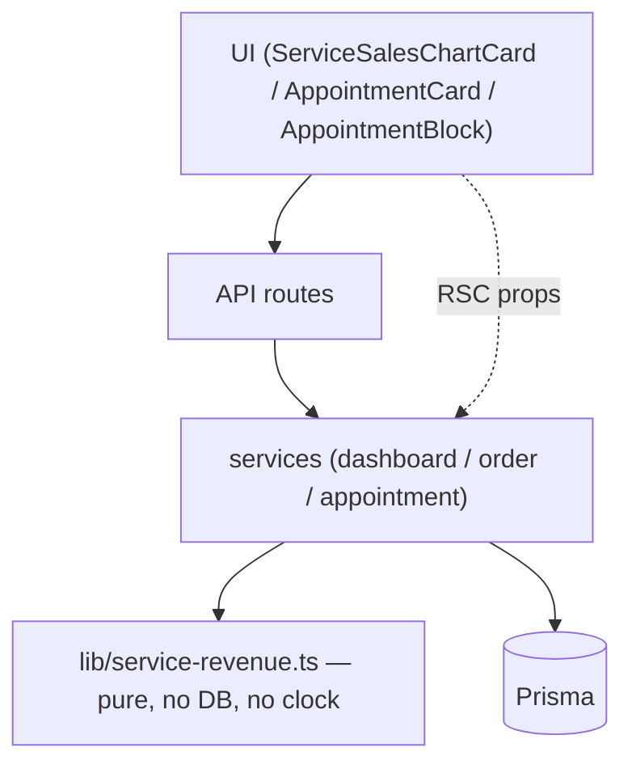
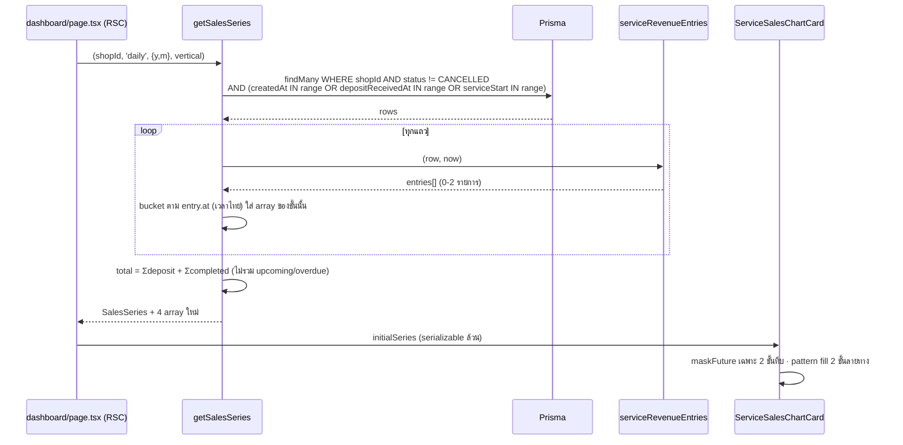

# SDS: ยอดขายเกณฑ์เงินสดสำหรับร้านบริการ (System Design Spec)

## 1. บทนำ & References

### 1.1 วัตถุประสงค์

ระบุ **ลำดับการลงมือ** และ **การตัดสินใจเชิงออกแบบ** ที่ developer ต้องรู้ก่อนแตะไฟล์แรก — [[SRS]] บอกว่าต้องได้อะไร เอกสารนี้บอกว่าจะประกอบมันยังไงและทำไมถึงเลือกทางนี้

### 1.2 ขอบเขตการออกแบบ

ไฟล์ที่จะถูกสร้าง/แก้ ทั้งหมด 12 ไฟล์ (ดู §3)

### 1.3 เอกสารอ้างอิง

[[SRS]] · [[API]] · [[DATABASE]] · [[UX-Design-Spec]] · [[TestCase]] · design spec `docs/superpowers/specs/2026-08-07-service-sales-chart-deposit-design.md`

## 2. Architecture Overview

### 2.1 มุมมองสถาปัตยกรรม

ชั้นการพึ่งพา (ลูกศร = "เรียกใช้"):

**กฎเหล็กของงานนี้:** `lib/service-revenue.ts` ไม่ import prisma และไม่เรียก `Date.now()` — รับ `now` เป็นพารามิเตอร์เสมอ ทำให้ unit test ตรึงเวลาได้และไม่ต้องแตะฐาน (สอดคล้อง Hard Rule 13 — เทสที่ไม่แตะ DB วางใต้ `src/**/__tests__/`)

### 2.2 มุมมองการ Deploy

ไม่มีอะไรใหม่ — deploy ปกติ, migrate รันตอน build (Hard Rule 15)

## 3. Component Design

| # | ไฟล์ | สถานะ | หน้าที่ |
|---|---|---|---|
| 1 | `src/lib/service-revenue.ts` | 🆕 | SSOT สูตรจัดชั้น (TFR-001) |
| 2 | `src/lib/__tests__/service-revenue.test.ts` | 🆕 | unit test ครอบทุกสาขา — ไม่แตะ DB |
| 3 | `prisma/schema.prisma` + migration | 🔧 | `Order.depositReceivedAt` + index + CHECK ([[DATABASE]]) |
| 4 | `src/lib/order-event.ts` | 🔧 | +2 ค่าใน `ORDER_EVENT_TYPES` + label/icon/tone + ข้อความสรุปต่อ type |
| 5 | `src/services/dashboard.service.ts` | 🔧 | `getSalesSeries` รับ `vertical`, query 3 แกน, ใส่ตะกร้าผ่าน `service-revenue` |
| 6 | `src/services/order.service.ts` | 🔧 | `markDepositReceived` 🆕 + `createOrder`/`updateOrder` รับ `depositReceived` |
| 7 | `src/services/appointment.service.ts` | 🔧 | `setAppointmentOutcome` insert `OrderEvent` ในทรานแซกชันเดียวกัน |
| 8 | `src/app/api/orders/[token]/deposit-received/route.ts` | 🆕 | endpoint ([[API]] §4.1) |
| 9 | `src/app/api/seller/sales-series/route.ts` | 🔧 | ส่ง `vertical` เข้า service |
| 10 | `src/app/(paces)/seller/(dashboard)/dashboard/components/ServiceSalesChartCard.tsx` | 🆕 | การ์ด 4 ชั้น ([[UX-Design-Spec]] §1) |
| 11 | `src/app/(paces)/seller/(dashboard)/orders/[token]/components/AppointmentCard.tsx` | 🆕 | ปุ่มรับมัดจำ/ปิดงาน ([[UX-Design-Spec]] §3) |
| 12 | `src/app/(paces)/seller/(dashboard)/orders/new/components/AppointmentBlock.tsx` | 🔧 | checkbox "รับเงินมัดจำแล้ว" ([[UX-Design-Spec]] §2) |

ไฟล์ที่ถูกแตะเพิ่มเติม (เล็ก): `dashboard/page.tsx` (เลือก card ตาม vertical), `orders/[token]/page.tsx` (คำนวณ `canMarkOutcome` + ส่ง prop), `order-action-set.ts` (+3 action), `OrderDetailClient.tsx` (+3 handler), `lib/appointments.ts` (`APPOINTMENT_STATUS_TONE`), `lib/validations.ts` (+`depositReceived`), `sales/page.tsx` (TFR-005)

## 4. Data Flow

### 4.1 Flow หลัก: เรนเดอร์กราฟยอดขาย

### 4.2 Flow กรณีล้มเหลว / ชดเชย

- **fetch series ล้มตอน SSR** → `initialSeries = null` → การ์ดไม่ render ทั้งใบ (honest-hide — พฤติกรรมเดิม ไม่ใช่ error banner)
- **กดปุ่มแล้ว 409** (race 2 แท็บ) → `pacesToast.error` ข้อความบอกทางออก + ไม่ refresh (ให้ผู้ใช้ตัดสินใจเอง) ตาม [[UX-Design-Spec]] §3
- **migration ล้ม** → build ล้ม → deploy ไม่ขึ้น ของเก่ายังเสิร์ฟอยู่ ต้องแก้ไฟล์ migration แล้ว push ใหม่ ไม่ใช่กด retry deploy (Hard Rule 15)

## 5. Integration Points

| จุดเชื่อม | รายละเอียด | ความเสี่ยง |
|---|---|---|
| feature 00024 | `setAppointmentOutcome`, `appointmentStatus`, `serviceStart`, `depositAmount` | ต้องไม่ละเมิด BR-RSV-33/34/35 ตอนเพิ่ม OrderEvent |
| feature 00031 | `OrderEvent` + `ORDER_EVENT_TYPES` + CHECK | CHECK ต้อง additive |
| feature 00033 | `Order.createdAt` = วันที่ผู้ขายระบุ | `depositReceivedAt = createdAt` ตอนติ๊ก **ไม่ใช่ `now()`** |
| `pacesToast` / `pacesConfirm` | ทุก notification/confirm ใน `(paces)` (HR9) | ห้าม `react-toastify` |
| `ApexChart` wrapper | HR10 | ห้าม import `react-apexcharts` ตรง |

## 6. Technical Decisions

### TD-001: แยก `ServiceSalesChartCard.tsx` แทนที่จะ branch ใน `SalesChartCard.tsx`

**เลือก:** สร้างไฟล์ใหม่

**ทางเลือกที่ไม่เลือก:** ใส่ `if (vertical === 'SERVICE_QUEUE')` ในไฟล์เดิม

**เหตุผล:** ไฟล์เดิมมีคอมเมนต์อธิบายบั๊กที่แก้ไปแล้วนับสิบจุด (ป้ายสองชั้น, mask future, annotation points, height prop ที่เคยชนกับ options) และรูปทรงของ SERVICE_QUEUE ต่างกันจริง — 4 series ล้วน bar ไม่มีเส้นจำนวนออเดอร์ ไม่มีแกน y ที่สอง การ branch จะทำให้ทุกบรรทัดต้องถามว่า "อันนี้ของ vertical ไหน" และเสี่ยง regression กับ ONLINE_SALES ที่ผ่าน QA มาแล้วหลายรอบ

**ต้นทุนที่ยอมรับ:** โครง shell/pill/hero ซ้ำกัน 2 ไฟล์ — ยอมรับได้เพราะเป็น markup ที่นิ่งแล้วและ [[UX-Design-Spec]] ระบุให้ copy จากไฟล์เดิมเป็น Base ตรง ๆ

### TD-002: สูตรอยู่ใน `lib/` เป็น pure function ไม่ใช่ใน service

**เลือก:** `src/lib/service-revenue.ts` — ไม่ import prisma, รับ `now` เป็นพารามิเตอร์

**เหตุผล:**
1. 3 หน้าจอต้องเรียกตัวเดียวกัน (BR-SCB-25) — วางใน service ตัวใดตัวหนึ่งจะกลายเป็นการที่ service หนึ่ง import อีก service หนึ่ง
2. unit test ได้โดยไม่แตะ DB → วางใต้ `src/lib/__tests__/` ตาม Hard Rule 13 (dev DB เคยเป็นตัวเดียวกับ prod)
3. ตรึงเวลาได้ → เทสเคส "เลยวันนัด" ที่ขอบวัน 23:59/00:01 เขียนได้จริง

**Precedent ในโปรเจกต์:** `lib/order-stage.ts` (`deriveShippingStage`), `lib/order-revenue.ts` (`countsAsRevenue`), `lib/shipping-address-status.ts` — pattern เดียวกันทั้งหมด

### TD-003: query 3 แกนด้วย `OR` ไม่ใช่ 3 query แยก

**เลือก:** `WHERE shopId = ? AND status <> 'CANCELLED' AND (createdAt IN r OR depositReceivedAt IN r OR serviceStart IN r)`

**ทางเลือกที่ไม่เลือก:** ยิง 3 query แล้ว merge ใน TS

**เหตุผล:** ออเดอร์ใบเดียวตกได้หลายแกนพร้อมกัน (สร้างวันที่ 5 รับมัดจำวันที่ 5 นัดวันที่ 10) — 3 query จะได้แถวซ้ำที่ต้อง dedupe เอง ซึ่งเป็นจุดที่พลาดแล้วกลายเป็น **นับเงินซ้ำ** พอดี (NFR-2) `OR` ก้อนเดียวได้แถวละครั้งโดยธรรมชาติ

**ข้อควรระวัง:** PostgreSQL อาจไม่ใช้ index กับ `OR` หลายคอลัมน์ → ต้อง `EXPLAIN` บน local จริงก่อน merge ถ้าได้ Seq Scan ให้เปลี่ยนเป็น `UNION` ของ 3 query ที่ select เฉพาะ `id` แล้วค่อยดึงแถวเต็มรอบเดียว (ยังได้ dedupe ฟรีจาก `UNION`)

### TD-004: `canMarkOutcome` คำนวณที่ server ส่งเป็น boolean

**เลือก:** RSC คำนวณ ส่ง prop `boolean`

**เหตุผล:** (1) นาฬิกาเครื่องผู้ใช้เชื่อไม่ได้ — ตั้งเวลาล่วงหน้าแล้วกดปิดงานก่อนถึงนัดได้ (server ยัง reject แต่ UI จะโชว์ปุ่มที่กดแล้วพัง) (2) prop ข้ามเส้น RSC ต้อง serializable — ส่ง `Date` object หรือฟังก์ชันเข้า client component จะพังทั้งหน้าโดย `tsc`/build จับไม่ได้เมื่อหน้าเป็น dynamic (`feedback_rsc_props_must_be_serializable`)

**ผลข้างเคียงที่ยอมรับ:** ถ้าผู้ใช้เปิดหน้าค้างไว้ข้ามเวลานัด ปุ่มจะไม่โผล่จนกว่าจะ refresh — ยอมรับได้ (ไม่ทำ polling เพื่อเรื่องนี้)

### TD-005: `/expenses` ไม่แตะ แต่ `/sales` เปลี่ยน

**เลือก:** ตาม D-7/D-8

**เหตุผล + หนี้ที่รู้ตัว:** กำไรใน `/sales` ต้องบวกลบกับ revenue ในแถวเดียวกันได้ จึงต้องเดินตามนิยามใหม่ · การ์ด P&L ใน `/expenses` เป็นรายงานบัญชีคนละคำถาม user สั่งไม่แตะรอบนี้ → **ต้องเขียนคอมเมนต์ในโค้ดทั้ง 2 ที่** อธิบายว่าต่างกันเพราะอะไร ไม่งั้นคนถัดไปจะ "แก้ให้ตรงกัน" แล้วพังทั้งคู่

### TD-006: ไม่ backfill `depositReceivedAt`

**เลือก:** ออเดอร์เดิมทุกใบได้ `NULL`

**เหตุผล:** ไม่มีทางรู้ว่ารับมัดจำจริงเมื่อไร — เติม `= createdAt` ให้ทุกใบคือการบันทึกข้อมูลเท็จที่พิสูจน์ไม่ได้ และขัดกับเหตุผลทั้งหมดที่ทำคอลัมน์นี้ (D-3: ต้องมีคนยืนยัน)

**ผลกระทบที่ต้องแจ้ง user ก่อน deploy:** กราฟย้อนหลังของร้านบริการจะไม่แสดงมัดจำเก่าเลย จนกว่าจะมีคนกดยืนยันรายใบ

## 7. Traceability

| TD | รองรับ | เอกสารอ้างอิง |
|---|---|---|
| TD-001 | FR-SCB-01, FR-SCB-12 | [[UX-Design-Spec]] §1 |
| TD-002 | BR-SCB-25, NFR-2, NFR-6 | [[SRS]] TFR-001 |
| TD-003 | FR-SCB-01, NFR-2, NFR-3 | [[SRS]] TFR-002 |
| TD-004 | FR-SCB-09, BR-SCB-16 | [[UX-Design-Spec]] §3 |
| TD-005 | D-7, D-8, BR-SCB-24 | [[SRS]] TFR-005 |
| TD-006 | BR-SCB-10 | [[DATABASE]] §3.1, §5.3 |

## 8. สรุป (Summary)

ลำดับการลงมือที่แนะนำ (แต่ละข้อ = 1 คอมมิต):

1. `lib/service-revenue.ts` + unit test — **ทำก่อนทุกอย่าง** เพราะทุกชั้นที่เหลือเรียกมัน และเป็นชิ้นเดียวที่พิสูจน์ความถูกต้องได้โดยไม่ต้องมี UI
2. migration + `schema.prisma` + `order-event.ts` (+2 ค่า)
3. `order.service` / `appointment.service` / endpoint ใหม่ + route-catch ครบ
4. `dashboard.service` (`getSalesSeries` 3 แกน)
5. UI — `AppointmentBlock` checkbox → `AppointmentCard` + action-set → `ServiceSalesChartCard`
6. `sales/page.tsx` (TFR-005)
7. sync `docs/SRS.md` (เอกสารระบบ) + `CLAUDE.md` snapshot

ข้อ 1 เป็นตัวตัดสินทั้งฟีเจอร์ — ถ้า `serviceRevenueEntries` ถูก ทุกหน้าจอถูกพร้อมกัน
