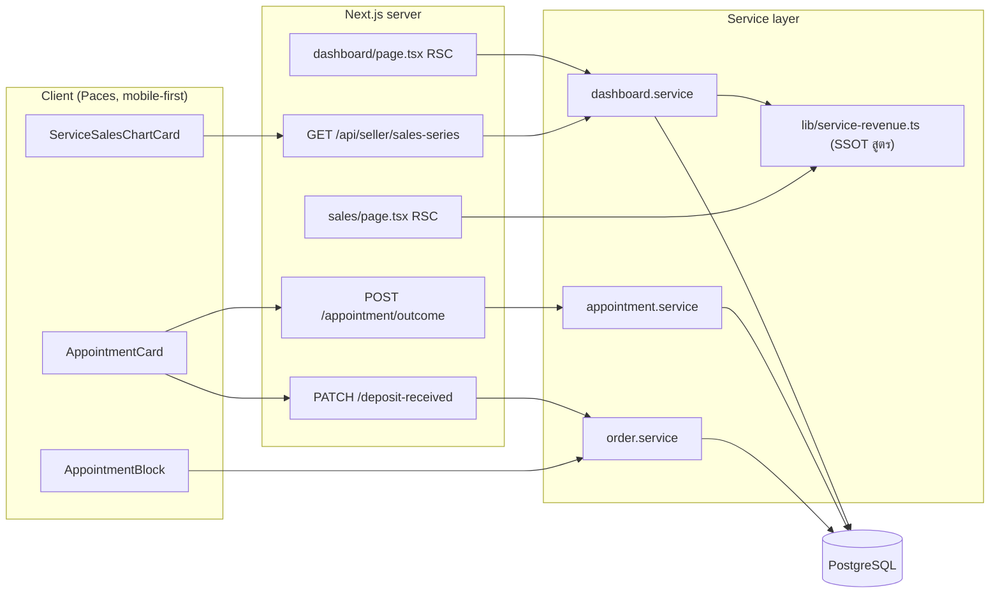

# SRS: ยอดขายเกณฑ์เงินสดสำหรับร้านบริการ (Software Requirements Specification — Technical)

## 1. บทนำ (Introduction)

### 1.1 วัตถุประสงค์ของเอกสาร

แปลง requirement ธุรกิจใน [[PRD]]/[[BRD]] เป็นสเปกเชิงเทคนิคที่ developer เขียนโค้ดตามได้ทันที — โดยเฉพาะ **สูตรการจัดชั้นยอดขาย** ซึ่งเป็นหัวใจทั้งหมดของฟีเจอร์ และต้องมีที่อยู่จุดเดียวในโค้ด

### 1.2 ขอบเขตเชิงระบบ (System Scope)

| อยู่ในขอบเขต | ไม่อยู่ในขอบเขต |
|---|---|
| `src/lib/service-revenue.ts` (ใหม่ — SSOT ของสูตร) | `/expenses` P&L card |
| `src/services/dashboard.service.ts` (`getSalesSeries`) | `SalesReport` (แดชบอร์ดเดสก์ท็อป) |
| `src/app/(paces)/seller/(dashboard)/sales/page.tsx` | vertical `ONLINE_SALES` / `LODGING` |
| `ServiceSalesChartCard.tsx` (ใหม่) + `dashboard/page.tsx` | หน้าฝั่งผู้ซื้อ `/o/[token]` |
| `AppointmentCard.tsx` (ใหม่) + `order-action-set.ts` | ระบบแจ้งเตือนให้ปิดงาน |
| `appointment.service.ts` (เพิ่ม OrderEvent) | `ServiceSalesChartSheet` (รอ ux รอบสอง) |
| `order.service.ts` (รับ `depositReceived` ตอนสร้าง) | |

### 1.3 เอกสารอ้างอิง (References)

- [[PRD]], [[BRD]], [[UX-Design-Spec]], [[DATABASE]], [[API]], [[SDS]], [[TestCase]]
- `docs/superpowers/specs/2026-08-07-service-sales-chart-deposit-design.md` (มติ D-1..D-9)
- feature 00024 (Service Appointment Booking) — BR-RSV-31/33/34/35/46/49/50
- feature 00031 (Order Activity Log), feature 00033 (Backdated Order Date)
- `docs/conventions/migration-check-constraint-additive.md`, `docs/conventions/date-format.md`

### 1.4 นิยามและตัวย่อ (Definitions & Acronyms)

| ตัวย่อ | ความหมาย |
|---|---|
| **ชั้น (layer)** | หนึ่งใน 4 กลุ่มยอด: deposit / completed / upcoming / overdue |
| **มัดจำที่รับแล้ว** | `depositReceivedAt != null ? Number(depositAmount) : 0` |
| **ส่วนที่เหลือ (remainder)** | `Number(totalAmount) − มัดจำที่รับแล้ว` |
| **ตะกร้าวัน (bucket)** | ดัชนีของวัน/เดือนบนแกน x ตัดตามปฏิทินไทย (UTC+7 คงที่) |
| **terminal** | `appointmentStatus ∈ {COMPLETED, NO_SHOW}` |

## 2. ภาพรวมสถาปัตยกรรม (Architecture Overview)

### 2.1 บริบทระบบ (System Context)



### 2.2 องค์ประกอบหลัก (Components)

| Component | หน้าที่ | ทำไมต้องมี |
|---|---|---|
| `src/lib/service-revenue.ts` 🆕 | ตัวตัดสินว่าออเดอร์หนึ่งใบลงชั้นไหน วันไหน ยอดเท่าไร (pure function ไม่แตะ DB) | BR-SCB-25 — 3 หน้าจออ่านตัวเดียวกัน; แยกจาก DB ทำให้ unit test ได้โดยไม่ต้องมีฐาน (ตาม HR13) |
| `dashboard.service.ts` | query + วนใส่ตะกร้าโดยเรียก `service-revenue` | ไม่เขียนสูตรซ้ำในนี้ |
| `appointment.service.ts` | `setAppointmentOutcome` + insert `OrderEvent` | มีอยู่แล้ว เพิ่ม side effect |
| `order.service.ts` | `markDepositReceived` 🆕 + รับ `depositReceived` ตอน create | |
| `ServiceSalesChartCard.tsx` 🆕 | การ์ด 4 ชั้น | vertical นี้เป็นรูปทรงคนละแบบ ดู [[UX-Design-Spec]] §1 |
| `AppointmentCard.tsx` 🆕 | ปุ่มรับมัดจำ/ปิดงาน | |

### 2.3 มุมมองการ Deploy (Deployment View)

ไม่มีบริการใหม่ ไม่มี env var ใหม่ ไม่มี background job — deploy ปกติผ่าน Vercel · `prisma migrate deploy` รันตอน build อยู่แล้ว (Hard Rule 15)

## 3. ข้อกำหนดเชิงฟังก์ชันเชิงเทคนิค (Technical Functional Requirements)

### TFR-001: ตัวตัดสินชั้นยอดขาย (`src/lib/service-revenue.ts`)

**รองรับ:** FR-SCB-01, FR-SCB-02, BR-SCB-01..09, BR-SCB-25

Pure function เดียวที่รับออเดอร์ 1 ใบแล้วคืนรายการ "ยอดที่ต้องลงตะกร้า" (0-2 รายการ):

```ts
export type ServiceRevenueLayer = 'deposit' | 'completed' | 'upcoming' | 'overdue'

export type ServiceRevenueInput = {
  status: string
  totalAmount: number
  depositAmount: number | null
  depositReceivedAt: Date | null
  serviceStart: Date | null
  appointmentStatus: string | null
  createdAt: Date
}

export type ServiceRevenueEntry = { layer: ServiceRevenueLayer; at: Date; amount: number }

/** `now` ส่งเข้ามาเสมอ ไม่เรียก Date.now() ข้างใน — เทสต้องตรึงเวลาได้ */
export function serviceRevenueEntries(
  o: ServiceRevenueInput,
  now: Date,
): ServiceRevenueEntry[]
```

**อัลกอริทึม (ลำดับสำคัญ):**

1. `status === 'CANCELLED'` → คืน `[]` (BR-SCB-01)
2. `receivedDeposit = depositReceivedAt != null ? (depositAmount ?? 0) : 0`
3. ถ้า `receivedDeposit > 0` → push `{ layer:'deposit', at: depositReceivedAt, amount: receivedDeposit }` (BR-SCB-02)
4. `remainder = totalAmount − receivedDeposit` · ถ้า `remainder <= 0` → หยุด (ไม่ push ชั้นที่สอง)
5. **ไม่มีนัด** (`serviceStart == null`) → push `{ layer:'completed', at: createdAt, amount: remainder }` (BR-SCB-03 / D-5)
6. **มีนัด:**
   - `appointmentStatus === 'COMPLETED'` → push `{ layer:'completed', at: serviceStart, amount: remainder }`
   - `appointmentStatus === 'NO_SHOW'` → **ไม่ push อะไรเลย** (BR-SCB-07)
   - อื่น ๆ (รวม `null`, `SCHEDULED`, `CONFIRMED_BY_BUYER`, `RESCHEDULE_REQUESTED`) → push `{ layer: serviceStart < startOfThaiToday(now) ? 'overdue' : 'upcoming', at: serviceStart, amount: remainder }` (BR-SCB-04/08)

**🛑 ข้อบังคับ:**
- ต้องเขียนเป็น **allow-list + fail-closed** สำหรับ `appointmentStatus` — ค่าใหม่ที่ยังไม่รู้จักในอนาคตต้องตกเข้า `upcoming/overdue` (สถานะ "ยังไม่จบ") ไม่ใช่หลุดเข้า `completed` (`docs/conventions/enum-value-removal.md`)
- ห้ามเรียก `Date.now()` ข้างใน — `now` เป็นพารามิเตอร์เสมอ
- เทียบ "เลยวันนัดหรือยัง" ด้วย **ขอบวันตามเวลาไทย** ไม่ใช่ `serviceStart < now` ตรง ๆ — นัดเวลา 14:00 วันนี้ที่ตอนนี้ 09:00 ต้องเป็น `upcoming` ไม่ใช่ `overdue` และนัด 09:00 วันนี้ที่ตอนนี้ 14:00 ต้องยังเป็น `upcoming` (D-2 พูดถึง "เลย**วัน**นัด" ไม่ใช่ "เลยเวลานัด")

### TFR-002: `getSalesSeries` แตกตาม vertical

**รองรับ:** FR-SCB-01, FR-SCB-12, BR-SCB-09, BR-SCB-23

- รับพารามิเตอร์ใหม่ `vertical: ShopVertical` — caller ทุกตัวต้องส่งมา (RSC อ่านจาก `requireActiveShop` อยู่แล้ว)
- `vertical !== 'SERVICE_QUEUE'` → พฤติกรรมเดิม 100% ไม่มี field ใหม่ใน response (`undefined` ไม่ใช่ `[]`)
- `vertical === 'SERVICE_QUEUE'`:
  - **ขอบเขต query ขยายเป็น 3 แกน** — `OR` ของ `createdAt`, `depositReceivedAt`, `serviceStart` ที่ตกในช่วง `[prevGte, lt)` (งานที่สร้างเดือนก่อนแต่นัดเดือนนี้ต้องติดมาด้วย ไม่งั้นแท่งลายทางหาย)
  - `select` เพิ่ม `depositAmount`, `depositReceivedAt`, `serviceStart`, `appointmentStatus`
  - วนทุกแถว เรียก `serviceRevenueEntries(row, now)` แล้วใส่ตะกร้าตาม `entry.at` (bucket ด้วยเวลาไทยชุดเดิม `TZ_OFFSET_MS`)
  - `total` / `prevTotalToDate` = ผลรวมเฉพาะ `deposit` + `completed` (BR-SCB-05)
  - `last14*` = เฉพาะ 2 ชั้นทึบ (BR-SCB-09)
  - **ห้าม mask อนาคตกับ `upcomingValues`** — `maskFuture()` ใช้กับ 2 ชั้นทึบเท่านั้น

### TFR-003: ยืนยันรับมัดจำ

**รองรับ:** FR-SCB-03, FR-SCB-04, FR-SCB-06, BR-SCB-10..14

- `order.service.ts::markDepositReceived({ shopId, orderToken })` — ทรานแซกชันเดียว: `UPDATE Order SET depositReceivedAt = now()` + `INSERT OrderEvent(DEPOSIT_RECEIVED)`
- guard ตามลำดับ: ownership (scope `shopId` ใน WHERE — `feedback_rsc_dal_authz`) → vertical → `depositAmount > 0` → `depositReceivedAt == null`
- `createOrder` รับ `appointment.depositReceived?: boolean` (default `true` เมื่อ `depositAmount > 0`) → `depositReceivedAt = createdAt` ตอนติ๊ก (**ไม่ใช่ `now()`** — BR-SCB-14)
- `updateOrder` (PATCH) — เปลี่ยน `depositReceivedAt` ได้เฉพาะเมื่อ client ส่ง `depositReceived` มาชัดเจน ห้ามล้างเป็นผลข้างเคียงของการแก้ `depositAmount` (BR-SCB-15)

### TFR-004: ปิดงานนัด + OrderEvent

**รองรับ:** FR-SCB-07..09, FR-SCB-11, BR-SCB-16..18, BR-SCB-21

- `setAppointmentOutcome` เดิม **คงกฎเดิมทุกข้อ** (BR-RSV-33/34/35) เพิ่มเฉพาะ `INSERT OrderEvent(APPOINTMENT_OUTCOME_SET, meta:{outcome}, occurredAt: now())` ในทรานแซกชันเดียวกับ `UPDATE`
- RSC คำนวณ `canMarkOutcome = now >= serviceStart && !terminal` ส่งเป็น prop — **ห้ามคำนวณใน client** (นาฬิกาเครื่องผู้ใช้เชื่อไม่ได้ และ prop ข้ามเส้น RSC ต้อง serializable → ส่ง boolean ไม่ส่งฟังก์ชัน)

### TFR-005: หน้า `/sales` ใช้นิยามเดียวกัน

**รองรับ:** FR-SCB-01, BR-SCB-24, BR-SCB-25, D-8

- ร้าน `SERVICE_QUEUE`: `revenue` ต่อวัน = `deposit + completed` ของวันนั้น (เรียก `serviceRevenueEntries` ตัวเดียวกัน) · `unconfirmedRevenue` = `upcoming + overdue`
- `netProfit` = `revenue(ใหม่) − COGS − expense` (D-8) — ตัวเลขจะต่างจากการ์ด P&L ใน `/expenses` โดยตั้งใจ **ต้องมีคอมเมนต์ในโค้ดบอกว่าต่างเพราะอะไร** ไม่งั้นคนถัดไปจะ "แก้ให้ตรงกัน" แล้วพังทั้งคู่
- ร้าน vertical อื่น: โค้ดเดิมไม่แตะ

## 4. ข้อกำหนดส่วนต่อประสาน (Interface / API Specification)

รายละเอียดเต็มอยู่ที่ [[API]] — สรุปที่นี่:

### 4.1 API Endpoints

| Method | Path | สถานะ |
|---|---|---|
| PATCH | `/api/orders/[token]/deposit-received` | ใหม่ |
| POST | `/api/orders/[token]/appointment/outcome` | เดิม (00024) — เพิ่มเฉพาะ side effect ใน service |
| GET | `/api/seller/sales-series` | เดิม — response เพิ่ม field แบบ additive |
| POST | `/api/orders` | เดิม — body เพิ่ม `appointment.depositReceived` |

### 4.2 รายละเอียดต่อ Endpoint

ดู [[API]] §4

### 4.3 Events / Messaging

`OrderEvent` 2 ชนิดใหม่ (`DEPOSIT_RECEIVED`, `APPOINTMENT_OUTCOME_SET`) — insert-only ไม่มี consumer แบบ async ทั้งหมดอ่านตอน render ประวัติออเดอร์

### 4.4 Sequence ของ flow สำคัญ

ดู [[API]] §6 (รับมัดจำ) และ [[BRD]] §4.2 (ปิดงาน)

## 5. ข้อกำหนดด้านข้อมูล (Data Requirements)

### 5.1 Data Model / Entities

คอลัมน์ใหม่ตัวเดียว — `Order.depositReceivedAt TIMESTAMPTZ(3) NULL` · ดู [[DATABASE]] §3

### 5.2 ความสัมพันธ์ (ERD)

ดู [[DATABASE]] §2

### 5.3 Migration / Data Lifecycle

- additive ล้วน ไม่มี backfill (เหตุผลใน [[DATABASE]] §3.1)
- CHECK ของ `OrderEvent_type_check` ต้องแก้แบบ **additive อ่านของเดิมมาต่อท้าย** ([[DATABASE]] §5.1)

## 6. ข้อกำหนดที่ไม่ใช่ฟังก์ชัน (Non-Functional Requirements)

| NFR | ข้อกำหนด | วิธีตรวจ |
|---|---|---|
| **NFR-1 ความถูกต้อง** | ตัวเลขการ์ด/ชีต/`​/sales` ของช่วงเดียวกันตรงกัน 100% | เทียบ 3 หน้าจอด้วยข้อมูลชุดเดียวกัน (TC-010) |
| **NFR-2 ไม่นับซ้ำ** | ผลรวมของทุกชั้นของออเดอร์ 1 ใบ ≤ `totalAmount` เสมอ | unit test property-based (TC-002) |
| **NFR-3 ความเร็ว** | query ขยายเป็น 3 แกน `OR` ต้องมี index รองรับทุกแกน | `EXPLAIN` บน local + index ตาม [[DATABASE]] §4 |
| **NFR-4 ความปลอดภัย** | ทุก mutation scope `shopId` ใน WHERE ไม่ใช่ค้นแล้วเช็คทีหลัง | code review gate |
| **NFR-5 idempotent** | กด "รับมัดจำ"/"ปิดงาน" ซ้ำ ไม่เปลี่ยนค่าเดิมและไม่สร้าง OrderEvent ซ้ำ | TC-006, TC-008 |
| **NFR-6 timezone** | ทุกจุดที่ตัดวันใช้เวลาไทย | unit test ที่ตรึงเวลา 23:30 / 00:30 (TC-004) |

## 7. ข้อจำกัดทางเทคนิคและการพึ่งพา

### 7.1 ข้อจำกัดทางเทคนิค

- หน้า `(paces)` อยู่ใต้ client layout → prop ทุกตัวที่ข้ามเส้น RSC ต้อง serializable (ห้ามส่งฟังก์ชัน/Decimal ดิบ) และห้ามส่ง PII ผู้ซื้อที่ไม่จำเป็น
- HR7 — ห้าม arbitrary Tailwind value ใน `(paces)` (มีผลกับ legend swatch ดู [[UX-Design-Spec]] Design decisions #2)
- HR10 — chart ต้อง copy structure จาก theme charts + ผ่าน `ApexChart` wrapper
- Prisma `Decimal` → ต้อง `Number()` ก่อนคำนวณทุกครั้ง (pattern เดิมใน `dashboard.service.ts`)

### 7.2 การพึ่งพาภายนอก/ภายใน

ภายในทั้งหมด — feature 00024 / 00031 / 00033 · ไม่มี external API

### 7.3 สมมติฐานทางเทคนิค

- จำนวนออเดอร์ต่อร้านต่อ 2 เดือนอยู่ในหลักร้อย — วนใน TS หลัง query ก้อนเดียวยังเร็วพอ ไม่ต้อง aggregate ใน SQL (pattern เดิมของ `getSalesSeries`)
- `serviceStart` ของนัดในอนาคตไม่เกินขอบ query 2 เดือน — นัดที่ไกลกว่านั้นจะไม่ปรากฏบนกราฟเดือนนี้ ซึ่งถูกต้องอยู่แล้ว

## 8. ความเสี่ยงเชิงสถาปัตยกรรม (Architectural Risks)

| ความเสี่ยง | ผลกระทบ | การรับมือ |
|---|---|---|
| สูตรถูกเขียนซ้ำในหน้าจอที่ 2/3 แทนที่จะเรียก `service-revenue.ts` | ตัวเลขไม่ตรงกันแบบที่หา root cause ยาก | reviewer gate: `rg "depositReceivedAt" src/app` ต้องไม่เจอการคำนวณ มีแต่การแสดงผล |
| `maskFuture()` ถูกใช้กับ `upcomingValues` โดยไม่ตั้งใจ | แท่งลายทางหายทั้งหมด **แต่ไม่มี error** — กราฟดูปกติทุกอย่าง | เขียนคอมเมนต์กำกับที่ตัวแปร + TC-009 |
| migration CHECK ชนกับ branch อื่น | ค่าที่อีก branch เพิ่มถูกลบเงียบ ๆ ไปโผล่เป็น insert ล้มบน prod | ใช้รูปแบบ additive ใน [[DATABASE]] §5.1 + เช็ค timestamp ไฟล์ชนทุก branch ก่อน push |
| ร้านที่มีข้อมูลเก่าเห็นกราฟเปลี่ยนหน้าตาทันที (มัดจำเก่าไม่ขึ้นเลย) | user ตกใจว่าข้อมูลหาย | เป็นพฤติกรรมที่ตั้งใจ — ต้องแจ้ง user ก่อน deploy ([[DATABASE]] §5.3) |

## 9. Traceability Matrix

| FR/BR | TFR | Endpoint | Test |
|---|---|---|---|
| FR-SCB-01 / BR-SCB-01..04 | TFR-001, TFR-002 | §4.3 | TC-001, TC-002, TC-003 |
| FR-SCB-02 / BR-SCB-05 | TFR-002 | §4.3 | TC-001 |
| FR-SCB-03 / BR-SCB-11,12 | TFR-003 | §4.4 | TC-005 |
| FR-SCB-04 / BR-SCB-13 | TFR-003 | §4.1 | TC-006 |
| FR-SCB-05 / BR-SCB-15 | TFR-003 | §4.4 | TC-007 |
| FR-SCB-06 / BR-SCB-14 | TFR-003 | §4.4 | TC-005 |
| FR-SCB-07,08 / BR-SCB-16..18 | TFR-004 | §4.2 | TC-008 |
| FR-SCB-09 | TFR-004 | — | TC-008 |
| FR-SCB-10,11 / BR-SCB-20..22 | TFR-003, TFR-004 | §4.1, §4.2 | TC-011 |
| FR-SCB-12 / BR-SCB-23 | TFR-002 | §4.3 | TC-012 |
| BR-SCB-07 (NO_SHOW) | TFR-001 | — | TC-003 |
| BR-SCB-09 (แท็บวันนี้) | TFR-002 | §4.3 | TC-009 |
| BR-SCB-24,25 / D-8 | TFR-005 | — | TC-010 |

## 10. สรุป (Summary)

หัวใจทางเทคนิคทั้งหมดอยู่ที่ **TFR-001** — pure function ตัวเดียวที่ตอบว่าออเดอร์ใบหนึ่งลงชั้นไหน วันไหน ยอดเท่าไร ทุกอย่างที่เหลือ (query, กราฟ, หน้า `/sales`) เป็นแค่ผู้เรียก ถ้า function นี้ถูก ทุกหน้าจอถูกพร้อมกัน ถ้ามีใครเขียนสูตรซ้ำที่อื่น นั่นคือจุดที่ตัวเลขจะเริ่มไม่ตรงกัน

> 🛑 **ต้อง sync `docs/SRS.md` (เอกสารระบบ) ในคอมมิตเดียวกัน** — งานนี้แตะ data model (`Order.depositReceivedAt`), API (endpoint ใหม่), และ enum (`OrderEvent.type` 14 → 16 ค่า) ทั้งสามหมวดเป็นสิ่งที่ CLAUDE.md ประกาศว่าต้องอ่านจาก `docs/SRS.md` ก่อนทำงาน — SRS ที่ค้างคือกับดักที่วางไว้รอคนถัดไป (บทเรียน 00033)
