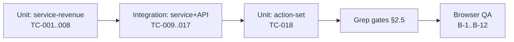

# Test Case: ยอดขายเกณฑ์เงินสดสำหรับร้านบริการ

## 1. Overview

| ระดับ | เครื่องมือ | ที่อยู่ | หมายเหตุ |
|---|---|---|---|
| Unit | Vitest | `src/lib/__tests__/service-revenue.test.ts` | **ไม่แตะ DB** (Hard Rule 13) — ตรึงเวลาผ่านพารามิเตอร์ `now` |
| Unit | Vitest | `src/app/(paces)/seller/(dashboard)/orders/[token]/components/__tests__/order-action-set.test.ts` | ไฟล์มีอยู่แล้ว เพิ่มเคสใหม่ |
| Integration | Vitest + Prisma | `tests/**` | 🛑 ล้างข้อมูลด้วย `deleteTestData({ userIds, shopIds })` เท่านั้น — ห้าม `deleteMany()` ไม่มี `where` (Hard Rule 13) |
| Browser QA | Chrome DevTools MCP / มือ | `*.deepth.local:4000` | ดู §2.4 |

**ข้อมูลตั้งต้นของทุกเคส (เว้นแต่ระบุเป็นอื่น):** ร้าน `vertical = SERVICE_QUEUE`, วันนี้ = 7 ส.ค. 2569 เวลา 12:00 น. (ไทย)

## 2. Test Scenarios

### 2.1 Unit — `serviceRevenueEntries` (TFR-001)

#### TC-001: ออเดอร์ปกติ มัดจำรับแล้ว + ปิดงานแล้ว → 2 รายการ ไม่ซ้ำ

| input | ค่า |
|---|---|
| `totalAmount` | 1000 |
| `depositAmount` / `depositReceivedAt` | 300 / 5 ส.ค. |
| `serviceStart` / `appointmentStatus` | 10 ส.ค. / `COMPLETED` |

**คาด:** `[{deposit, at:5 ส.ค., 300}, {completed, at:10 ส.ค., 700}]` · ผลรวม = 1000 พอดี (ไม่เกิน `totalAmount`)
**รองรับ:** FR-SCB-01, FR-SCB-02, BR-SCB-02/03/06

#### TC-002: ผลรวมทุกชั้นต้องไม่เกิน `totalAmount` เสมอ (property test)

วน 200 combination ของ (`depositAmount` 0..total, `depositReceivedAt` null/มี, `serviceStart` null/อดีต/อนาคต, `appointmentStatus` ทุกค่า + ค่าที่ไม่รู้จัก `'FUTURE_VALUE'`)
**คาด:** `Σ amount ≤ totalAmount` ทุกครั้ง และไม่มี `amount < 0`
**รองรับ:** NFR-2, BR-SCB-06

#### TC-003: `NO_SHOW` — มัดจำยังนับ ส่วนที่เหลือหายทั้งหมด

`total=1000, deposit=300 (รับแล้ว 5 ส.ค.), serviceStart=6 ส.ค., status=NO_SHOW`
**คาด:** `[{deposit, 5 ส.ค., 300}]` เท่านั้น — ไม่มีรายการที่ 2 ในชั้นใดเลย
**รองรับ:** BR-SCB-07

#### TC-004: ขอบวันตามเวลาไทย (upcoming vs overdue)

| เคส | `serviceStart` | `now` | คาด |
|---|---|---|---|
| a | 7 ส.ค. 14:00 | 7 ส.ค. 09:00 | `upcoming` |
| b | 7 ส.ค. 09:00 | 7 ส.ค. 14:00 | `upcoming` (**เลย *เวลา* แต่ยังไม่เลย *วัน***) |
| c | 6 ส.ค. 23:30 | 7 ส.ค. 00:30 | `overdue` |
| d | 7 ส.ค. 00:30 (=6 ส.ค. 17:30 UTC) | 7 ส.ค. 12:00 | `upcoming` — พิสูจน์ว่าไม่ได้ตัดวันด้วย UTC |

**รองรับ:** NFR-6, BR-SCB-04, D-2

#### TC-005: งานไม่มีวันนัด → completed ที่ `createdAt`

`serviceStart=null, appointmentStatus=null, total=500, deposit=0, createdAt=3 ส.ค.`
**คาด:** `[{completed, at:3 ส.ค., 500}]`
**รองรับ:** BR-SCB-03, BR-SCB-19, D-5

#### TC-006: สถานะที่ยังไม่จบทุกค่า → upcoming/overdue (fail-closed)

`appointmentStatus ∈ {null, SCHEDULED, CONFIRMED_BY_BUYER, RESCHEDULE_REQUESTED, 'ค่าที่ยังไม่มีในอนาคต'}`
**คาด:** ทุกค่าลง `upcoming`/`overdue` **ไม่มีค่าไหนหลุดเข้า `completed`**
**รองรับ:** BR-SCB-08, `docs/conventions/enum-value-removal.md`

#### TC-007: ยกเลิกแล้ว → ไม่มีรายการเลย

`status='CANCELLED'` พร้อมข้อมูลครบทุกช่อง
**คาด:** `[]`
**รองรับ:** BR-SCB-01

#### TC-008: มัดจำที่ยังไม่ยืนยัน ไม่ถูกนับที่ไหนเลย

`depositAmount=300, depositReceivedAt=null, total=1000, serviceStart=10 ส.ค., status=SCHEDULED`
**คาด:** `[{upcoming, 10 ส.ค., 1000}]` — remainder = 1000 ไม่ใช่ 700 (เพราะมัดจำยังไม่รับ = ยังไม่มีเงินก้อนไหนถูกหักออก)
**รองรับ:** BR-SCB-10 — 🛑 เคสนี้จับบั๊กที่เผลอหักด้วย `depositAmount` แทน "มัดจำที่รับแล้ว"

### 2.2 Integration — service + API

#### TC-009: `getSalesSeries` — นัดข้ามเดือนต้องติดมาด้วย

สร้างออเดอร์ `createdAt = 28 ก.ค.`, `serviceStart = 12 ส.ค.`, ยังไม่ปิดงาน แล้วเรียก `getSalesSeries('daily', {2569, 8})`
**คาด:** `upcomingValues[11]` (วันที่ 12) > 0
**รองรับ:** TFR-002 — 🛑 จับบั๊กที่ query เฉพาะ `createdAt` แล้วนัดของงานเดือนก่อนหายทั้งหมด

#### TC-010: แท็บ "วันนี้" ไม่มีชั้นลายทาง + `maskFuture` ไม่กิน upcoming

- `last14*` ต้องมีเฉพาะ 2 ชั้นทึบ (BR-SCB-09)
- `upcomingValues` ของวันในอนาคตของเดือนนี้ **ต้องไม่เป็น `null`**
**รองรับ:** BR-SCB-09 + ความเสี่ยง "maskFuture กิน upcoming" ใน [[SRS]] §8 (บั๊กนี้ไม่มี error — กราฟดูปกติทุกอย่าง)

#### TC-011: `total` ไม่รวมยอดล่วงหน้า

ชุดข้อมูล: deposit 3,100 + completed 5,200 + upcoming 18,000 + overdue 900
**คาด:** `total === 8300`
**รองรับ:** FR-SCB-02, BR-SCB-05

#### TC-012: สร้างออเดอร์ย้อนหลัง + ติ๊กรับมัดจำ

`POST /api/orders` body: `createdAt = 5 ส.ค.` (backdate ตาม 00033), `appointment.depositAmount=300`, `depositReceived=true` · เวลาจริงตอนยิง = 7 ส.ค.
**คาด:**
- `Order.depositReceivedAt === Order.createdAt` (5 ส.ค.) **ไม่ใช่ 7 ส.ค.**
- `OrderEvent(DEPOSIT_RECEIVED).occurredAt` = **7 ส.ค.** (เวลาจริงที่กด) — สองค่านี้ต่างกันโดยตั้งใจ
- `meta.source === 'create'`
**รองรับ:** FR-SCB-06, BR-SCB-14, BR-SCB-22 — 🛑 เคสสำคัญที่สุดของฟีเจอร์

#### TC-013: `PATCH /deposit-received` — happy path + idempotent

1. ออเดอร์ `depositAmount=500, depositReceivedAt=null` → PATCH → 200 + `OrderEvent` 1 แถว
2. PATCH ซ้ำ → **409 `DEPOSIT_ALREADY_RECEIVED`** + `depositReceivedAt` เดิมไม่ถูกเขียนทับ + ไม่มี `OrderEvent` แถวที่ 2
**รองรับ:** FR-SCB-04, NFR-5, BR-SCB-13

#### TC-014: `PATCH /deposit-received` — negative

| เคส | คาด |
|---|---|
| ออเดอร์ของร้านอื่น | 404 `ORDER_NOT_FOUND` (ไม่ใช่ 403 — ห้ามเปิดเผยว่ามีอยู่จริง) |
| `depositAmount = 0` | 409 `NO_DEPOSIT` |
| ร้าน `ONLINE_SALES` | 403 `VERTICAL_NOT_ALLOWED` |
| ไม่มี session | 401 `UNAUTHORIZED` |

**รองรับ:** NFR-4, BR-SCB-23, `feedback_service_error_route_mapping`

#### TC-015: แก้ยอดมัดจำไม่ล้างสถานะรับแล้ว

ออเดอร์ที่ `depositReceivedAt != null` → `PATCH /api/orders/[token]` เปลี่ยน `depositAmount` 300 → 500 โดย **ไม่ส่ง** `depositReceived`
**คาด:** `depositReceivedAt` คงค่าเดิม ไม่เป็น `null`
**รองรับ:** FR-SCB-05, BR-SCB-15

#### TC-016: ปิดงาน + OrderEvent + ไม่แตะ Order.status/Trust Score

1. `POST /appointment/outcome {outcome:'COMPLETED'}` บนนัดที่ถึงเวลาแล้ว → 200
2. ตรวจ: `appointmentStatus='COMPLETED'` · `OrderEvent(APPOINTMENT_OUTCOME_SET, meta.outcome='COMPLETED')` 1 แถว · **`Order.status` ไม่เปลี่ยน** · Trust Score ของผู้ซื้อไม่เปลี่ยน
3. ยิงซ้ำ → 409 `APPOINTMENT_TERMINAL` + ไม่มี OrderEvent แถวที่ 2
4. ยิงบนนัดที่ยังไม่ถึงเวลา → 409 `APPOINTMENT_NOT_STARTED`
**รองรับ:** FR-SCB-07/08/09/11, BR-SCB-16/17/18/21, BR-RSV-33/35

#### TC-017: vertical อื่นไม่ได้รับผลกระทบ

ร้าน `ONLINE_SALES` และ `LODGING` เรียก `getSalesSeries`
**คาด:** `depositValues`/`completedValues`/`upcomingValues`/`overdueValues` เป็น **`undefined`** (ไม่ใช่ `[]`) · `confirmedValues`/`unconfirmedValues`/`orderCounts`/`total` เท่าเดิมทุกค่าเทียบกับก่อนแก้
**รองรับ:** FR-SCB-12, BR-SCB-23

### 2.3 Unit — `order-action-set`

#### TC-018: precedence ของ action ใหม่

| สถานการณ์ | คาด |
|---|---|
| ไม่มี appointment/deposit | `base` เดิมเป๊ะ (ไม่ regress ONLINE_SALES) |
| `depositDue` อย่างเดียว | `primary = depositReceived` |
| `outcomeReady` อย่างเดียว | `primary = markComplete`, ghost มี `markNoShow` |
| `depositDue` + `outcomeReady` | `primary = depositReceived`, ghost มี `markComplete` + `markNoShow` |
| `isCodUnpaid` + `depositDue` + `outcomeReady` | ghost ≤ 2 ตัว ส่วนเกินตกลง `menu` — **ไม่มี ghost ตัวที่ 3** |

**รองรับ:** [[UX-Design-Spec]] §3 precedence + Open question #1

### 2.4 Browser QA (ต้องกดจริง)

> ที่ `*.deepth.local:4000` (user รัน dev server เอง) — เกณฑ์ "ผู้ใช้เห็นจริง" ต้องวัด computed style ไม่ใช่แค่ render ผ่าน

| # | เคส | จุดที่ static ตรวจไม่ได้ |
|---|---|---|
| B-1 | การ์ดยอดขายบนมือถือ 375px — legend 4 ช่อง grid-cols-2 | ตัวเลข 6-7 หลักตัดคำไหม |
| B-2 | ช่อง "เลยวันนัด" หายเมื่อไม่มีนัดค้าง แล้ว "วันเข้ารับบริการ" ขยาย `col-span-2` | |
| B-3 | แท่งลายทางเรนเดอร์จริงไหม (ApexCharts `fill.pattern`) ทั้งธีมสว่างและธีมมืด | pattern บนพื้นมืดอาจจมหาย |
| B-4 | แท่งลายทางโผล่ **ทางขวาของเส้นประ "วันนี้"** ไม่ถูก mask | บั๊กนี้ไม่มี error กราฟดูปกติ |
| B-5 | สลับแท็บ วันนี้ ↔ เดือนนี้ ความสูงการ์ดไม่กระโดด | |
| B-6 | ปุ่ม "รับมัดจำแล้ว" บนมือถือ — อยู่ในแถบล่าง กดถึงจริง (≥44px) | |
| B-7 | ปุ่ม "เสร็จสิ้น/ไม่มาตามนัด" ไม่โผล่ก่อนถึงเวลานัด + helper ขึ้นแทน | |
| B-8 | `pacesConfirm` ทั้ง 3 ปุ่ม + `pacesToast` ขึ้นถูกตำแหน่ง (top-right) | |
| B-9 | checkbox "รับเงินมัดจำแล้ว" ติ๊กมาเป็นค่าเริ่มต้น / ซ่อนเมื่อมัดจำ = 0 | |
| B-10 | **โหมดแก้ไขงาน** — checkbox สะท้อน `depositReceivedAt` จริง ไม่ติ๊กทับ | เคสที่ [[UX-Design-Spec]] เตือนไว้ตรง ๆ |
| B-11 | หน้า `/sales` ตัวเลขตรงกับการ์ดของช่วงเดียวกัน | |
| B-12 | ร้าน `ONLINE_SALES` เปิดแดชบอร์ด — การ์ดเดิมทุกประการ | regression |

### 2.5 Grep gates (ก่อน merge)

```bash
rg "from ['\"]react-toastify" "src/app/(paces)/"                    # ต้อง 0 (HR9)
rg "from 'react-apexcharts'|from 'echarts'" "src/app/(paces)/"      # ต้อง 0 (HR10)
grep -rnP '[\x{1F000}-\x{1FAFF}\x{2600}-\x{27BF}]' <ไฟล์ UI ที่แตะ>  # ต้อง 0 (HR12)
rg "text-\[|bg-\[rgba|rounded-\[|shadow-\[" <ไฟล์ (paces) ที่แตะ>    # arbitrary value (HR7)
rg "depositReceivedAt" src/app --glob '!*/api/*'                    # ต้องมีแต่การแสดงผล ไม่มีการคำนวณสูตร
```

## 3. Traceability Matrix

| Requirement | Test |
|---|---|
| FR-SCB-01 | TC-001, TC-005, TC-009 |
| FR-SCB-02 | TC-011 |
| FR-SCB-03 | TC-012, B-9 |
| FR-SCB-04 | TC-013, B-6 |
| FR-SCB-05 | TC-015, B-10 |
| FR-SCB-06 | TC-012 |
| FR-SCB-07, 08 | TC-016 |
| FR-SCB-09 | TC-016, B-7 |
| FR-SCB-10, 11 | TC-012, TC-016 |
| FR-SCB-12 | TC-017, B-12 |
| BR-SCB-01 | TC-007 |
| BR-SCB-06 / NFR-2 | TC-002 |
| BR-SCB-07 | TC-003 |
| BR-SCB-08 | TC-006 |
| BR-SCB-09 | TC-010, B-4 |
| BR-SCB-10 | TC-008 |
| BR-SCB-13 / NFR-5 | TC-013 |
| BR-SCB-14 / BR-SCB-22 | TC-012 |
| BR-SCB-23 / NFR-4 | TC-014, TC-017 |
| BR-SCB-25 | TC-011, B-11 |
| NFR-6 | TC-004 |
| UX precedence | TC-018 |

## 4. Flow



**ลำดับบังคับ:** TC-001..008 ต้องเขียนและผ่าน **ก่อน** เขียน UI แม้แต่บรรทัดเดียว — เป็นชิ้นเดียวที่พิสูจน์ความถูกต้องของสูตรได้โดยไม่ต้องมีหน้าจอ

## 5. ผลล่าสุด

| รอบ | วันที่ | Unit | Integration | Browser | หมายเหตุ |
|---|---|---|---|---|---|
| — | — | — | — | — | ยังไม่เริ่ม implement |

## 6. สรุป (Summary)

เคสที่สำคัญที่สุด 4 ตัว ถ้าจะเลือกทำก่อน:

1. **TC-012** (ออเดอร์ย้อนหลัง) — `depositReceivedAt = createdAt` แต่ `occurredAt = now()` สองค่าต่างกันโดยตั้งใจ พลาดง่ายที่สุดในฟีเจอร์นี้
2. **TC-008** (มัดจำยังไม่ยืนยัน) — จับบั๊กที่เผลอหักด้วย `depositAmount` แทน "มัดจำที่รับแล้ว"
3. **TC-010 / B-4** (`maskFuture` กิน upcoming) — บั๊กที่ไม่มี error กราฟดูปกติทุกอย่างแต่แท่งลายทางหายเกลี้ยง
4. **TC-009** (นัดข้ามเดือน) — จับบั๊กที่ query เฉพาะ `createdAt`
