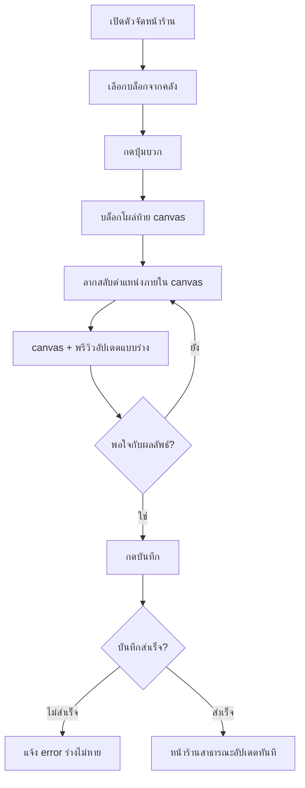
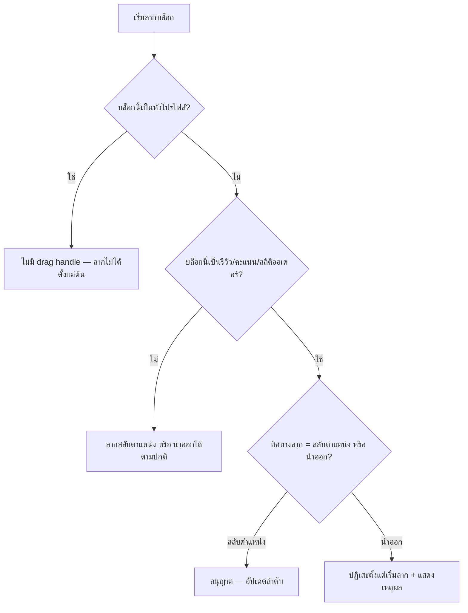

> **โมดูล:** 00035-shop-page-builder
> **ประเภทเอกสาร:** Business Requirements Document (BRD) - NON-TECHNICAL
> **เวอร์ชัน:** 1.0
> **วันที่จัดทำ:** 2026-08-07
> **สถานะ:** Approved — user ยืนยัน 4 ข้อเปิดครบแล้ว 2026-08-07 (ดู "มติที่ยืนยันแล้ว" ท้ายเอกสาร) พร้อมส่งต่อ SRS/SDS
> **เจ้าของเอกสาร:** BA

# BRD: ตัวจัดหน้าร้าน (Shop Page Builder) (Business Requirements Document)

---

## 1. บทนำ

### 1.1 วัตถุประสงค์ของเอกสาร

เอกสารนี้มีวัตถุประสงค์เพื่อ:
1. อธิบายว่าตัวจัดหน้าร้านต้องทำอะไรได้บ้าง ระดับ Functional Requirement ที่ทดสอบได้
2. กำหนดขอบเขต: เพิ่ม/จัดลำดับเนื้อหาบนหน้าร้านสาธารณะที่มีอยู่แล้ว ไม่ใช่เครื่องมือแก้ไขเนื้อหาต้นทาง ไม่ใช่การรวม `/u`+`/b`
3. อธิบายกฎ guardrail ที่ห้ามละเมิดไม่ว่า implementation จะเป็นแบบไหน (D-9/D-10)
4. เป็นสัญญาระหว่างทีมธุรกิจกับทีมพัฒนาก่อนเข้า SRS/SDS (Hard Rule 11 Documentation-First)

### 1.2 ขอบเขตของระบบ

**ตัวจัดหน้าร้าน** คือเครื่องมือฝั่ง seller console (Paces) ที่ให้ร้านเลือกเนื้อหาจากคลัง (บล็อกโครงหน้า/โพสต์ Facebook/เหรียญตรา) แล้วจัดลำดับการแสดงผลบนหน้าร้านสาธารณะ (`/u/[username]`, `/b/[slug]`) แบบเห็นผลจริงก่อนบันทึก

**เข้าสู่ระบบ (Input):**
- การกดปุ่มเพิ่มบล็อกจากคลัง
- การลากสลับลำดับบล็อกภายในพื้นที่จัดหน้า
- การกดบันทึก/ยกเลิก/เผยแพร่-ไม่เผยแพร่

**ออกจากระบบ (Output):**
- ลำดับ+รายการบล็อกที่เผยแพร่จริงบนหน้าร้านสาธารณะ (`/u`, `/b`)
- สถานะเผยแพร่/ไม่เผยแพร่ของหน้าร้าน

**ระบบที่เกี่ยวข้อง:**
- `ShopProfile.tsx`/`ProfileTabs.tsx`/`ProfileHero.tsx` — ปลายทางที่ render ผลลัพธ์จริง
- `FacebookPost`/`ShopChannel` (feature 00029) — แหล่งเนื้อหาโพสต์
- `ShopVideo` — แหล่งคลิป (ของเดิม)
- `Badge`/`UserBadge` — แหล่งเหรียญตรา
- `Room`/`ServiceResource`/`Product` — แหล่งบล็อกโครงหน้าตาม vertical

### 1.3 กลุ่มผู้ใช้งาน

| กลุ่มผู้ใช้ | บทบาท | สิทธิ์การใช้งาน |
|-----------|--------|----------------|
| **เจ้าของร้าน (Shop Owner)** | ผู้ใช้หลักของตัวจัดหน้าร้าน | เข้าถึง เพิ่ม/ลบ/จัดลำดับบล็อก, เปิด/ปิดเผยแพร่, บันทึกได้เต็มสิทธิ์ |
| **ทีมงานร้าน (ShopMember role=ADMIN)** | ผู้ถูกเชิญช่วยบริหารร้าน (feature 00012/00008) | **เข้าใช้ได้** — **ยืนยันโดย user 2026-08-07** (สิทธิ์เดียวกับ OWNER ในฟีเจอร์นี้) |
| **ผู้ซื้อ/ผู้เข้าชม** | ผู้รับผลจากการเผยแพร่ (passive) | อ่านอย่างเดียวผ่าน `/u`, `/b` — ไม่เข้าถึงตัวจัดหน้าร้าน |

---

## 2. ความต้องการหลัก (Functional Requirements)

### 2.1 ทางเข้าและอุปกรณ์

#### FR-PGB-01: เปิดตัวจัดหน้าร้านจากปุ่มในหน้า `/public-profile`

**User Story:**
> ในฐานะเจ้าของร้าน ฉันต้องการกดปุ่มจากหน้าตั้งค่าโปรไฟล์สาธารณะเพื่อเปิดตัวจัดหน้าร้าน เพื่อไม่ต้องจำ URL แยกต่างหาก

**Acceptance Criteria:**
- [ ] หน้า `/public-profile` (`(dashboard)`) มีปุ่มหลักที่ชัดเจน (เช่น "จัดหน้าร้าน") นำไปยังตัวจัดหน้าร้าน
- [ ] ตัวจัดหน้าร้านอยู่ที่ route ใหม่ภายใต้ `(fullscreen)` (ไม่มี sidenav) — คนละ route จาก `/public-profile`
- [ ] กดย้อนกลับจากตัวจัดหน้าร้าน กลับมาที่ `/public-profile` (ไม่ใช่ `/dashboard`)

#### FR-PGB-02: ป้องกันการใช้งานบนหน้าจอแคบ

**User Story:**
> ในฐานะเจ้าของร้านที่เปิดลิงก์ตัวจัดหน้าร้านบนมือถือโดยบังเอิญ ฉันต้องการเห็นคำอธิบายที่ชัดเจน แทนหน้าที่บีบพัง เพื่อรู้ว่าต้องไปทำที่ไหน

**Acceptance Criteria:**
- [ ] ต่ำกว่าเกณฑ์ desktop ที่กำหนด (SDS กำหนดจุดตัดแน่นอน) แสดงข้อความอธิบาย + ปุ่มย้อนกลับ `/public-profile` แทน layout 3 คอลัมน์
- [ ] ไม่มี layout ที่ overflow แนวนอนจนต้องเลื่อนซ้าย-ขวาเพื่อดูปุ่ม
- [ ] ข้อความอธิบายเหตุผลสั้น ๆ ว่าทำไมต้องใช้คอมพิวเตอร์ (ไม่ใช่แค่ "ไม่รองรับ")

### 2.2 คลังบล็อกและเนื้อหา

#### FR-PGB-03: แสดงกลุ่มสัญญาณความน่าเชื่อถือในคลัง (อ่านอย่างเดียว)

**User Story:**
> ในฐานะเจ้าของร้าน ฉันต้องการเห็นว่าสัญญาณความน่าเชื่อถืออะไรที่ตรึง/ล็อกอยู่แล้ว เพื่อไม่เสียเวลาพยายามลบ

**Acceptance Criteria:**
- [ ] หมวด "สัญญาณความน่าเชื่อถือ" ในคลังแสดงรายการ "คะแนนและป้ายยืนยันตัวตน" (ป้าย "ตรึง") และ "รีวิวจากลูกค้า" (ป้าย "ล็อก")
- [ ] รายการในหมวดนี้ไม่มีปุ่มเพิ่ม/ปุ่มลาก (แค่แสดงสถานะ)
- [ ] hover/แตะรายการแสดงคำอธิบายสั้นว่าทำไมย้าย/ลบไม่ได้

#### FR-PGB-04: บล็อกโครงหน้าผันตาม vertical + เพิ่มได้ครั้งเดียวต่อชนิด

**User Story:**
> ในฐานะเจ้าของร้านบ้านพัก ฉันต้องการเห็นเฉพาะบล็อกที่ใช้ได้จริงกับร้านฉัน (ห้องพัก/ปฏิทิน) ไม่ใช่บล็อกสินค้าที่ฉันไม่มี

**Acceptance Criteria:**
- [ ] ร้าน `Shop.vertical = LODGING` เห็นบล็อกโครงหน้า "ห้องพัก" และ "ปฏิทินวันว่าง" เท่านั้น (ไม่เห็น "สินค้า"/"บริการ")
- [ ] ร้าน `Shop.vertical = ONLINE_SALES` เห็นบล็อก "สินค้า" (ไม่เห็น "ห้องพัก"/"ปฏิทิน"/"บริการ")
- [ ] ร้าน `Shop.vertical = SERVICE_QUEUE` เห็นบล็อก "บริการ" และ "สินค้า" ถ้ามีของเสริม (ตาม pattern เดิมของ `ShopProfile.tsx`)
- [ ] บล็อกโครงหน้าที่ถูกเพิ่มไปแล้ว แสดงป้าย "เพิ่มแล้ว" และปุ่มบวกหายไป (ไม่ใช่ disabled)
- [ ] บล็อกโครงหน้าที่ยังไม่มีข้อมูลจริงรองรับ (เช่น ยังไม่เชื่อมช่องทางติดต่อ) แสดงสถานะ "ยังไม่พร้อม" แทนปุ่มเพิ่ม พร้อมคำอธิบาย

**Business Flow:**
1. ระบบอ่าน `Shop.vertical` ของร้านที่กำลังแก้ไข
2. กรองรายการบล็อกโครงหน้าที่แสดงในคลังตาม vertical (SSOT `src/lib/lodging.ts`/`src/lib/seller-menu.ts` pattern)
3. เทียบกับบล็อกที่มีอยู่แล้วในหน้าร้านปัจจุบัน → บล็อกที่มีแล้วขึ้นป้าย "เพิ่มแล้ว" แทนปุ่มบวก

#### FR-PGB-05: เพิ่มเนื้อหาจากเพจ Facebook ทีละโพสต์

**User Story:**
> ในฐานะเจ้าของร้าน ฉันต้องการเลือกโพสต์ Facebook ที่มี engagement ดีที่สุดมาโชว์บนหน้าร้าน เพื่อใช้เป็นหลักฐานทางสังคม

**Acceptance Criteria:**
- [ ] คลังแสดงรายการโพสต์จาก `FacebookPost` ของ `ShopChannel` ที่ร้านเชื่อมไว้ พร้อมยอดไลก์/คอมเมนต์/แชร์ (`reactionCount`/`fbCommentCount`/`shareCount`)
- [ ] กดปุ่มบวกที่โพสต์หนึ่ง → โพสต์นั้นไปปรากฏเป็นบล็อกเดี่ยวท้าย canvas (โพสต์อื่นยังกดเพิ่มต่อได้)
- [ ] ร้านที่ไม่มี `ShopChannel` ที่เชื่อม Facebook เห็นหมวดนี้เป็นสถานะ "ยังไม่ได้เชื่อมเพจ" พร้อมลิงก์ไปหน้าช่องทางแชท
- [ ] โพสต์ที่ถูกเพิ่มไปแล้วในหน้าร้าน ไม่แสดงปุ่มเพิ่มซ้ำ (หรือแสดงว่า "เพิ่มแล้ว")

#### FR-PGB-06: เลือกเหรียญตรา ACHIEVEMENT ขึ้นโชว์แบบอิสระ

**User Story:**
> ในฐานะเจ้าของร้านที่มีเหรียญตราหลายใบ ฉันต้องการเลือกเหรียญที่ภูมิใจที่สุดขึ้นโชว์ เพื่อไม่ให้หน้าร้านแน่นเกินไป

**Acceptance Criteria:**
- [ ] คลังแสดงเฉพาะเหรียญตราที่ร้านได้รับจริงแล้วและมี `Badge.type = 'ACHIEVEMENT'`
- [ ] เหรียญตรา `Badge.type = 'VERIFICATION'` ("ยืนยันครบถ้วน") **ไม่ปรากฏ**เป็นตัวเลือกในคลัง (ตรึงอยู่ในหัวโปรไฟล์แล้ว)
- [ ] เลือกเหรียญได้สูงสุด 4 ใบ (ยืนยัน 2026-08-07) แสดงเป็นบล็อก "เหรียญตราเด่น" หนึ่งบล็อก
- [ ] เลือกเกิน N ใบ → ระบบปฏิเสธพร้อมข้อความชัดเจน (เช่น "เลือกได้สูงสุด N เหรียญ") ไม่ใช่ error เงียบ
- [ ] ลำดับเหรียญภายในบล็อก "เหรียญตราเด่น" ปรับได้อิสระ (ลำดับที่เลือกคือลำดับที่แสดง)

### 2.3 พื้นที่จัดหน้าและการลากจัดลำดับ

#### FR-PGB-07: Canvas render หน้าร้านจริงผ่าน iframe

**User Story:**
> ในฐานะเจ้าของร้าน ฉันต้องการเห็นหน้าร้านของฉันจริง ๆ ขณะจัด ไม่ใช่ตัวอย่างจำลอง เพื่อมั่นใจว่าสิ่งที่บันทึกจะออกมาตรงตามที่เห็น

**Acceptance Criteria:**
- [ ] พื้นที่จัดหน้าตรงกลาง render ผ่าน `iframe` ของ route หน้าร้านจริง (`/u/[username]` หรือ `/b/[slug]` ของร้านที่กำลังแก้ไข) ในโหมดแก้ไข
- [ ] การ์ด/สไตล์ที่เห็นใน canvas เป็นของธีม Vuexy จริง (สี, ฟอนต์, spacing ตรงกับหน้าร้านสาธารณะ) ไม่ใช่ mockup ด้วยธีม Paces
- [ ] เลือกบล็อกในคลัง/ลากในพื้นที่จัดหน้า สื่อสารสถานะกันได้ระหว่าง Paces host กับ iframe (เช่น ไฮไลต์บล็อกที่กำลังโฟกัส)

#### FR-PGB-08: เพิ่มบล็อกด้วยปุ่มบวกเท่านั้น

**User Story:**
> ในฐานะเจ้าของร้าน ฉันต้องการกดปุ่มบวกแล้วเห็นบล็อกใหม่โผล่ในหน้าร้านทันที เพื่อรู้ทันทีว่าเพิ่มสำเร็จ

**Acceptance Criteria:**
- [ ] กดปุ่มบวกจากคลัง → บล็อกที่เลือกไปปรากฏที่**ท้ายสุด**ของพื้นที่จัดหน้าทันที (ไม่ต้อง refresh)
- [ ] การลากจากคลังเข้าพื้นที่จัดหน้าโดยตรง**ไม่มีผลใด ๆ** (ไม่ใช่ feature — คลังไม่ใช่ drag source)
- [ ] เพิ่มบล็อกสำเร็จแล้ว สถานะในคลังของบล็อกนั้นเปลี่ยนเป็น "เพิ่มแล้ว" ทันที (sync ระหว่างคลังกับ canvas)

#### FR-PGB-09: ลากจัดลำดับภายใน canvas

**User Story:**
> ในฐานะเจ้าของร้าน ฉันต้องการลากสลับตำแหน่งบล็อกที่เพิ่มไปแล้ว เพื่อจัดให้บล็อกที่สำคัญที่สุดของฉันอยู่บนสุด (เท่าที่ guardrail อนุญาต)

**Acceptance Criteria:**
- [ ] บล็อกที่ไม่ใช่หัวโปรไฟล์ทั้งหมด ลากสลับตำแหน่งกันได้ภายในพื้นที่จัดหน้า
- [ ] มีเส้น/จุดบอกตำแหน่งที่จะวางระหว่างลาก (drop indicator)
- [ ] ปล่อยมือแล้วลำดับอัปเดตทันทีในสถานะร่าง (ยังไม่บันทึกจริง)

#### FR-PGB-10: ปฏิเสธการลากบล็อกที่ล็อก/ตรึงออก

**User Story:**
> ในฐานะระบบ ฉันต้องการปฏิเสธการนำบล็อกที่ล็อกไว้ออกตั้งแต่ผู้ใช้เริ่มลาก เพื่อไม่ให้เกิดสถานะกึ่งลบที่สับสน

**Acceptance Criteria:**
- [ ] บล็อกที่มีสถานะ "ล็อก" (รีวิว/คะแนน/สถิติออเดอร์) **ลากสลับลำดับได้** แต่ลากไปวางนอกพื้นที่จัดหน้า (เพื่อนำออก) **ถูกปฏิเสธตั้งแต่เริ่มลาก** — ไม่ใช่ปล่อยสำเร็จแล้วเด้ง error
- [ ] หัวโปรไฟล์ **ไม่มีตัวจับลาก (drag handle) เลย** — ลากไม่ได้ตั้งแต่ต้น
- [ ] บล็อกที่นำออกได้ (โครงหน้า/โพสต์ Facebook/เหรียญตราเด่น) มีปุ่มนำออกใน overflow menu ของบล็อกนั้น พร้อม confirm dialog ก่อนนำออกจริง (ตาม `docs/conventions/seller-action-placement.md` §3 — ใช้ `pacesConfirm.danger`)

### 2.4 พรีวิวและการบันทึก

#### FR-PGB-11: พรีวิวแยกจากของที่เผยแพร่จริง

**User Story:**
> ในฐานะเจ้าของร้าน ฉันต้องการเห็นพรีวิวของสิ่งที่กำลังจัด โดยไม่กระทบสิ่งที่ลูกค้าเห็นอยู่ตอนนี้ เพื่อทดลองจัดได้อย่างอิสระ

**Acceptance Criteria:**
- [ ] คอลัมน์พรีวิว (ขวา) อัปเดตตามสถานะร่างล่าสุดแบบเรียลไทม์ขณะจัด
- [ ] ก่อนกดบันทึก หน้าร้านสาธารณะจริง (`/u`, `/b`) ยังแสดงผลตามข้อมูลที่บันทึกไว้ล่าสุด ไม่ใช่ร่างปัจจุบัน (ทดสอบ: เปิด `/u/[username]` ในแท็บอื่นระหว่างจัด ต้องไม่เห็นการเปลี่ยนแปลง)

#### FR-PGB-12: แจ้งเตือนการเปลี่ยนแปลงที่ยังไม่บันทึก

**User Story:**
> ในฐานะเจ้าของร้าน ฉันต้องการรู้ชัดเจนว่ามีอะไรที่ยังไม่บันทึก เพื่อไม่พลาดกดบันทึกแล้วออกจากหน้าไปเฉย ๆ

**Acceptance Criteria:**
- [ ] มีการเปลี่ยนแปลงใด ๆ ในร่าง (เพิ่ม/ลบ/ย้ายบล็อก) → แสดงแถบแจ้งเตือน "มีการเปลี่ยนแปลงที่ยังไม่บันทึก" พร้อมปุ่ม "ยกเลิก" และ "บันทึก"
- [ ] กด "ยกเลิก" → ร่างกลับไปเป็นค่าที่บันทึกไว้ล่าสุด (ไม่ใช่ค่าว่างเปล่า)
- [ ] พยายามออกจากหน้า (ปิดแท็บ/กดย้อนกลับ) ขณะมีการเปลี่ยนแปลงที่ยังไม่บันทึก → มี prompt เตือนก่อนออก
- [ ] กด "บันทึก" สำเร็จ → แถบแจ้งเตือนหายไป และ dirty state เคลียร์

#### FR-PGB-13: บันทึกแล้วมีผลกับหน้าร้านสาธารณะทันที

**User Story:**
> ในฐานะเจ้าของร้าน ฉันต้องการให้การจัดหน้าใหม่มีผลทันทีหลังกดบันทึก เพื่อไม่ต้องรอ

**Acceptance Criteria:**
- [ ] กดบันทึกสำเร็จ → เปิด `/u/[username]` หรือ `/b/[slug]` ของร้านนั้น (ไม่ cache ค้าง) แสดงลำดับ+บล็อกตามที่บันทึกใหม่
- [ ] บันทึกล้มเหลว (เช่น เครือข่ายขาด) → แสดงข้อความ error ชัดเจน ร่างที่แก้ไว้ไม่หาย (ให้กดบันทึกซ้ำได้)

### 2.5 การเผยแพร่หน้าร้าน

#### FR-PGB-14: เปิด/ปิดการเผยแพร่หน้าร้านทั้งหน้า

**User Story:**
> ในฐานะเจ้าของร้านที่กำลังจัดหน้าใหม่ทั้งหมด ฉันต้องการปิดการเผยแพร่ชั่วคราว เพื่อไม่ให้ลูกค้าเห็นหน้าที่ยังไม่พร้อม

**Acceptance Criteria:**
- [ ] มีสวิตช์ "เผยแพร่หน้าร้าน" ทั้งในตัวจัดหน้าร้าน (desktop) และหน้า `/public-profile` (มือถือ)
- [ ] ปิดสวิตช์ → เปิด `/u`/`/b` ของร้านนั้นจากคนนอก (ไม่ใช่เจ้าของร้าน) เห็นสถานะ "ไม่พร้อมให้บริการ"/"ไม่พบหน้านี้" (พฤติกรรมแน่นอนกำหนดใน SDS) แทนเนื้อหาจริง
- [ ] เจ้าของร้านเอง (ล็อกอินแล้ว) ยังเปิดดูหน้าร้านตัวเองได้แม้ปิดเผยแพร่ (สำหรับตรวจสอบก่อนเปิดใหม่)
- [ ] สถานะสวิตช์ sync กันระหว่างสองจุด (desktop builder / มือถือ) — เปลี่ยนที่หนึ่งเห็นผลอีกที่ทันที

### 2.6 ประสบการณ์บนมือถือ

#### FR-PGB-15: `/public-profile` มือถือทำงานครบตามเดิม

**User Story:**
> ในฐานะเจ้าของร้านที่ใช้มือถือเป็นหลัก ฉันต้องการตั้งค่าพื้นฐานของหน้าร้านได้ครบ แม้จัดลำดับบล็อกไม่ได้บนมือถือ

**Acceptance Criteria:**
- [ ] `/public-profile` บนมือถือยังแสดงลิงก์หน้าร้าน + ปุ่มคัดลอกลิงก์ (ของเดิม)
- [ ] `/public-profile` บนมือถือยังมีปุ่ม "ดูหน้าร้านจริง" (ของเดิม)
- [ ] `/public-profile` บนมือถือมีสวิตช์เผยแพร่หน้าร้าน (FR-PGB-14) ใช้งานได้ครบ
- [ ] `/public-profile` บนมือถือยังเลือกคลิปที่จะแสดงได้ (`ShopVideosClient.tsx` เดิม ไม่เปลี่ยนพฤติกรรม)
- [ ] มีข้อความ/แบนเนอร์อธิบายว่าการจัดเรียงบล็อกต้องใช้คอมพิวเตอร์ พร้อมเหตุผลสั้น ๆ (ไม่ใช่แค่ปุ่มที่หายไปเฉย ๆ)

### 2.7 สิทธิ์การเข้าถึง

#### FR-PGB-16: จำกัดสิทธิ์แก้ไขตัวจัดหน้าร้าน

**User Story:**
> ในฐานะเจ้าของร้าน ฉันต้องการควบคุมว่าใครในทีมแก้ไขหน้าร้านสาธารณะได้ เพื่อป้องกันการเปลี่ยนแปลงที่ไม่ได้ตั้งใจ

**Acceptance Criteria:**
- [ ] OWNER และ ShopMember role=ADMIN เข้าตัวจัดหน้าร้านได้ทั้งคู่ (**ยืนยันโดย user 2026-08-07**)
- [ ] ผู้ที่ไม่มีสิทธิ์เข้าถึง route ตัวจัดหน้าร้าน ได้รับ redirect/ข้อความปฏิเสธที่ชัดเจน (ไม่ใช่หน้าเปล่า/error 500)

---

## 3. Acceptance Criteria สรุป

### 3.1 คลังและการเพิ่มบล็อก

**เมื่อระบบทำงานถูกต้อง:**
- ✅ คลังแสดงเฉพาะบล็อกที่ตรงกับ `Shop.vertical` ของร้าน
- ✅ บล็อกที่เพิ่มแล้วไม่มีปุ่มเพิ่มซ้ำ
- ✅ เพิ่มโพสต์ Facebook ได้ทีละโพสต์ พร้อมยอด engagement ประกอบการตัดสินใจ
- ✅ เลือกเหรียญตรา ACHIEVEMENT ได้ไม่เกิน N ใบ เหรียญ VERIFICATION ไม่ปรากฏเป็นตัวเลือก

### 3.2 การจัดลำดับและ guardrail

**เมื่อผู้ใช้พยายามละเมิด guardrail:**
- ✅ ลากหัวโปรไฟล์ = ทำไม่ได้ตั้งแต่ไม่มี drag handle
- ✅ ลากรีวิว/คะแนน/สถิติออเดอร์ออกจาก canvas = ถูกปฏิเสธตั้งแต่เริ่มลาก
- ✅ ไม่มี toggle ซ่อนที่จุดใดในหน้าสำหรับกลุ่มนี้

### 3.3 บันทึกและเผยแพร่

**เมื่อกดบันทึก:**
- ✅ หน้าร้านสาธารณะจริงอัปเดตทันทีตามลำดับ/รายการบล็อกที่บันทึก
- ✅ สถานะร่างเคลียร์ dirty bar หายไป
- ✅ ปิดสวิตช์เผยแพร่ = คนนอกเข้าหน้าร้านไม่เห็นเนื้อหาจริง แต่เจ้าของร้านยังดูเองได้

### 3.4 มือถือ

**เมื่อเปิด `/public-profile` บนมือถือ:**
- ✅ ลิงก์/คัดลอก/ดูหน้าร้าน/สวิตช์เผยแพร่/เลือกคลิป ทำงานครบทุกจุด
- ✅ มีคำอธิบายชัดเจนว่าการจัดเรียงบล็อกต้องใช้คอมพิวเตอร์

---

## 4. Business Flows (กระบวนการทำงาน)

### 4.1 Flow หลัก: เพิ่มบล็อก → จัดลำดับ → บันทึก

### 4.2 Flow guardrail: พยายามนำบล็อกที่ล็อก/ตรึงออก

---

## 5. Use Case Scenarios (สถานการณ์การใช้งานจริง)

### Scenario 1: ร้านบ้านพักจัดหน้าร้านครั้งแรก (Best Case)

**ผู้เกี่ยวข้อง:** เจ้าของร้าน `Shop.vertical = LODGING`

**เงื่อนไขเริ่มต้น:**
- ร้านผ่าน onboarding แล้ว มี `slug`, มีห้องพัก 4 ห้อง, มีเหรียญตรา ACHIEVEMENT 7 ใบ, ยังไม่เชื่อมเพจ Facebook

**ขั้นตอน:**
1. เปิด `/public-profile` บนคอมพิวเตอร์ กด "จัดหน้าร้าน"
2. เห็น canvas เริ่มต้นมีแค่หัวโปรไฟล์+รีวิว (ตรึง/ล็อกตามปกติ) เพราะยังไม่เคยจัดมาก่อน
3. เพิ่มบล็อก "ห้องพัก" และ "เหรียญตราเด่น" (เลือก 4 ใบ) จากคลัง
4. ลากบล็อก "ห้องพัก" ไปอยู่ก่อน "รีวิว"
5. กดบันทึก

**ผลลัพธ์:**
- `/b/{slug}` แสดง หัวโปรไฟล์ → ห้องพัก → เหรียญตราเด่น → รีวิว ตามลำดับที่จัด
- หมวดโพสต์ Facebook ในคลังยังแสดงสถานะ "ยังไม่ได้เชื่อมเพจ"

### Scenario 2: ร้านพยายามลากรีวิวออก (Guardrail Blocks)

**ผู้เกี่ยวข้อง:** เจ้าของร้าน `Shop.vertical = ONLINE_SALES` ที่เพิ่งได้รีวิว 1 ดาวมา

**เงื่อนไขเริ่มต้น:**
- ร้านมีรีวิวเฉลี่ย 3.2 ดาว มีรีวิว 1 ดาวอยู่หนึ่งรายการล่าสุด

**ขั้นตอน:**
1. เปิดตัวจัดหน้าร้าน พยายามลากบล็อก "รีวิวจากลูกค้า" ออกนอก canvas เพื่อซ่อน
2. ระบบปฏิเสธตั้งแต่เริ่มลาก แสดงข้อความ "รีวิวจากลูกค้า — นำออกจากหน้าร้านไม่ได้"
3. ร้านลากสลับตำแหน่งรีวิวลงไปอยู่ล่างสุดแทน (อนุญาต)

**ผลลัพธ์:**
- รีวิวยังคงแสดงบนหน้าร้านสาธารณะเสมอ เพียงแต่ตำแหน่งเปลี่ยนไปอยู่ท้ายหน้าตามที่ร้านเลือก

### Scenario 3: เปิดตัวจัดหน้าร้านบนมือถือโดยบังเอิญ

**ผู้เกี่ยวข้อง:** เจ้าของร้านที่เปิดลิงก์จากประวัติเบราว์เซอร์บนมือถือ

**เงื่อนไขเริ่มต้น:** เปิด URL ตัวจัดหน้าร้านตรง ๆ บนมือถือ (ไม่ผ่าน `/public-profile`)

**ขั้นตอน:**
1. หน้าเว็บโหลด ตรวจความกว้างจอไม่ผ่านเกณฑ์ desktop
2. แสดงข้อความอธิบาย + ปุ่ม "กลับไปตั้งค่าโปรไฟล์สาธารณะ"

**ผลลัพธ์:**
- ผู้ใช้กลับไป `/public-profile` และทำงานอื่นที่ทำได้บนมือถือต่อได้ทันที ไม่ติดค้างในหน้าที่ใช้งานไม่ได้

---

## 6. ความต้องการด้านคุณภาพ (Quality Requirements)

### 6.1 ความถูกต้องของข้อมูล
- สิ่งที่เห็นใน canvas ต้องตรงกับสิ่งที่จะปรากฏบนหน้าร้านสาธารณะจริง 1:1 (WYSIWYG แม่นยำ เพราะ render จาก route จริงผ่าน iframe)
- บล็อกที่ผันตาม `Shop.vertical` ต้องไม่มีทางเห็นบล็อกผิดประเภท (fail-closed ตาม pattern `applyVerticalMenu`)

### 6.2 ความรวดเร็ว
- เพิ่ม/ลาก/สลับบล็อกในสถานะร่าง ต้องรู้สึกทันที (ไม่รอ round-trip เครือข่ายทุกครั้งที่ลาก — เฉพาะตอนบันทึกจริงเท่านั้นที่ยิง request)

### 6.3 ความน่าเชื่อถือ
- บันทึกล้มเหลวต้องไม่ทำให้ร่างหาย (ผู้ใช้กดบันทึกซ้ำได้โดยไม่ต้องจัดใหม่)
- guardrail (D-9/D-10) ต้อง enforce ทั้งฝั่ง UI และฝั่ง API/service (ห้าม client-side only — ผู้ใช้ที่แก้ payload เองต้องยังถูกปฏิเสธที่ server)

### 6.4 ความปลอดภัย
- iframe preview ต้องเป็น same-origin เท่านั้น (ตามที่ตรวจแล้วว่าไม่มี frame-ancestors บล็อกอยู่ — ต้อง**คง**ไม่เปิดกว้างเกินจำเป็นตอน implement)
- postMessage ต้องตรวจ origin ก่อนรับข้อมูล (ป้องกัน message จากหน้าอื่น)
- API บันทึกผังหน้าต้องตรวจสิทธิ์เจ้าของร้าน/ทีมงาน (ตามคำถามเปิด #4) ทุกครั้ง ไม่พึ่ง UI ซ่อนปุ่มอย่างเดียว

### 6.5 ความสะดวกในการใช้งาน (Usability)
- ปุ่ม/drag handle ต้องมี target ขนาดใช้งานได้จริงด้วยเมาส์ (เกณฑ์ desktop) และยังต้องมีทาง keyboard-accessible ตาม WCAG 2.1 AA baseline (`PRODUCT.md` Accessibility & Inclusion) แม้เฟสนี้เป็น desktop-only ก็ไม่ได้แปลว่ายกเว้น a11y
- ข้อความอธิบายเหตุผล guardrail ต้องเป็นภาษาไทยเรียบง่าย ไม่ใช้ศัพท์เทคนิค (ตรงกับ Product Principle 3)

---

## 7. ข้อจำกัด (Constraints)

### 7.1 ข้อจำกัดทางธุรกิจ
- desktop-only เฉพาะการจัดเรียง — การตั้งค่าอื่นต้องใช้ได้บนมือถือเสมอ
- ห้ามมีทางซ่อน/นำสัญญาณความน่าเชื่อถือหลักออกได้ ไม่ว่าจะผ่านช่องทางไหน (UI/API)
- ไม่รวม `/u`+`/b` เป็น handle เดียว (คนละฟีเจอร์ 00034)

**คำถามที่ต้องยืนยันก่อน implement (SRS/SDS):**

1. **`FacebookPost.thumbnailUrl` หมดอายุได้ (URL ของ Meta ตรง ๆ ไม่ mirror ใน v1)** — เมื่อนำไปแปะหน้าร้านสาธารณะถาวรอาจกลายเป็นรูปแตกโดยไม่มีอะไรฟ้อง (ต่างจากการใช้ในกล่องแชทที่เป็นของชั่วคราว) **ข้อเสนอ:** mirror รูปลง storage ของเราตอนกดเพิ่มโพสต์นั้นลงหน้าร้าน (ครั้งเดียวตอนเพิ่ม ไม่ mirror ทุกโพสต์ที่ดึงมา) — เพิ่มต้นทุนน้อยกว่าเสี่ยงรูปแตกบนหน้าที่แบกภาพลักษณ์แบรนด์ (`docs/conventions/user-supplied-image-assets.md` เรื่องความสำคัญของภาพบนหน้าสาธารณะ, ระวังลิมิต MIME/ขนาดของ bucket ตาม `project_supabase_uploads_bucket_mime_limit`)
2. **โครงเก็บลำดับบล็อก — หน้าร้านปัจจุบันเป็นแท็บ (`ProfileTabs`) ไม่ใช่หน้าเลื่อนยาว** ต้องตัดสินว่า "ลำดับที่ลาก" หมายถึงอะไร: (a) แปลงหน้าร้านเป็น single-column feed เรียงบล็อกต่อเนื่องตามลำดับที่จัด (ตรงกับที่ mockup แสดงเป็นภาพต่อเนื่องไม่มีแท็บ) หรือ (b) คงโครงแท็บเดิมไว้ แล้วให้ "ลำดับ" หมายถึงลำดับแท็บ+ลำดับเนื้อหาภายในแท็บ "เกี่ยวกับร้าน" เท่านั้น **ยืนยันโดย user 2026-08-07**: เลือก **(b) คงโครงแท็บเดิม** — ไม่แปลงเป็น single-column feed. เหตุผลที่ user/Controller เคาะ: การรื้อ `ProfileTabs` เปลี่ยน IA ที่ผ่าน sign-off ไปแล้ว (2026-07-26) และเปลี่ยนสิ่งที่ผู้ซื้อเห็นทั้งหน้า ซึ่งเกินขอบเขตของ "เครื่องมือจัดหน้าร้าน" · ขอบเขตของลำดับจึงเป็น: **ลำดับแท็บ** + **ลำดับบล็อกที่อยู่เหนือแถบแท็บ** (หัวโปรไฟล์ตรึง / เหรียญตราเด่น / โพสต์จากเพจ) — แต่**ชื่อคอลัมน์/โครงเก็บข้อมูลสุดท้ายเป็นของ `safepay-database`** ความต้องการทางธุรกิจคือ: เก็บลำดับ+รายการ block instance ต่อร้านหนึ่งชุด แต่ละ instance มีชนิด (โครงหน้า/โพสต์ Facebook รายโพสต์/เหรียญตราเด่น) และ reference ไปยังข้อมูลจริงถ้าจำเป็น (เช่น `FacebookPost.id`)
3. **จำนวนเหรียญตราสูงสุดในบล็อก "เหรียญตราเด่น"** — mockup ตั้งไว้ 4 ใบ **ข้อเสนอ:** ยึดตาม mockup = 4 ใบ (สอดคล้องกับ `MAX_BADGE_ICONS = 5` ที่ `ProfileHero.tsx` ใช้อยู่แล้วสำหรับเหรียญในหัวโปรไฟล์ — 4 ใบในบล็อกแยกต่างหากไม่ชนกับตัวเลขนั้น)
4. **สิทธิ์การเข้าถึง: OWNER เท่านั้น หรือรวม ADMIN (ทีมงานที่ถูกเชิญ) ด้วย** **ยืนยันโดย user 2026-08-07**: **OWNER + ShopMember role=ADMIN เข้าใช้ได้ทั้งคู่** (user เลือกต่างจากที่เสนอ เหตุผล: ร้านที่มีคนดูแลการตลาดต้องให้ทีมงานจัดหน้าร้านได้) · ข้อเสนอเดิมที่ไม่ถูกเลือกคือ OWNER เท่านั้น โดยให้เหตุผลว่า — หน้าร้านสาธารณะคือ "หน้าตาแบรนด์" ของร้าน (Product Principle 4) การเปลี่ยนแปลงมีผลกระทบสูงกว่างานปฏิบัติการทั่วไป (ต่างจากออเดอร์/แชทที่ ADMIN ทำได้) และยังไม่มีมติเรื่อง permission matrix ของฟีเจอร์แบรนด์-สาธารณะแบบนี้มาก่อนใน feature 00008/00012

### 7.2 ข้อจำกัดทางเทคนิค
- Paces (คลัง) กับ Vuexy (canvas ใน iframe) เป็นคนละ theme/รันไทม์ — ห้ามพยายาม render Vuexy component ตรง ๆ ในหน้า Paces
- pointer event ไม่ข้ามขอบ document ระหว่าง host กับ iframe — ฟีเจอร์ drag-from-library เป็นไปไม่ได้ทางเทคนิคในสถาปัตยกรรมนี้ (จึงใช้ปุ่มบวกแทนตาม D-3 ไม่ใช่ทางเลือกเชิงดีไซน์)

---

## 8. กฎทางธุรกิจ (Business Rules)

### 8.1 กฎการเพิ่ม/ลบ/ย้ายบล็อก
- เพิ่มบล็อกได้ทางเดียว: กดปุ่มบวกจากคลัง (BR-PGB-08)
- ย้ายลำดับได้ทางเดียว: ลากภายใน canvas (BR-PGB-09)
- บล็อกโครงหน้าเพิ่มได้สูงสุด 1 ครั้งต่อชนิดต่อร้าน (BR-PGB-03)
- โพสต์ Facebook เพิ่มได้หลายรายการ (รายโพสต์อิสระจากกัน) (BR-PGB-05)
- เหรียญตราเด่นเป็นบล็อกเดียว บรรจุเหรียญได้สูงสุด 4 ใบ ปรับลำดับภายในได้ (BR-PGB-06)

### 8.2 กฎการล็อกสัญญาณความน่าเชื่อถือ
- หัวโปรไฟล์: ตรึงบนสุดตายตัว ไม่มีตัวควบคุมใด ๆ (BR-PGB-01)
- รีวิว/คะแนนความน่าเชื่อถือ/ป้ายยืนยันตัวตน/สถิติออเดอร์: ย้ายลำดับได้ นำออก/ซ่อนไม่ได้ ไม่มี toggle (BR-PGB-02)
- เหรียญตรา VERIFICATION: ตรึงในหัวโปรไฟล์ ไม่ปรากฏในคลัง (BR-PGB-07)
- กฎนี้ enforce ทั้งฝั่ง UI (ปิดการลากตั้งแต่ต้น) และฝั่ง service/API (ปฏิเสธ request ที่พยายามส่งลำดับที่ขาดบล็อกกลุ่มนี้)

### 8.3 กฎการเผยแพร่และบันทึก
- การเปลี่ยนแปลงเป็นสถานะร่างจนกว่าจะกดบันทึกสำเร็จ (BR-PGB-10)
- สวิตช์เผยแพร่ควบคุมทั้งหน้า แยกจาก guardrail รายบล็อก (§3.5 ของ PRD)
- เจ้าของร้านเข้าถึงหน้าร้านของตัวเองได้เสมอแม้ปิดเผยแพร่ (สำหรับตรวจสอบ)

### 8.4 กฎอุปกรณ์และสิทธิ์
- ตัวจัดหน้าร้าน (การจัดเรียง) = desktop-only (BR-PGB-11)
- `/public-profile` (การตั้งค่าอื่น) = ใช้ได้ทุกอุปกรณ์ (BR-PGB-12)
- สิทธิ์แก้ไข: OWNER + ShopMember role=ADMIN (**ยืนยันโดย user 2026-08-07**)

---

## 9. อภิธานศัพท์ (Glossary)

| คำศัพท์ | ความหมาย |
|---------|----------|
| **Block Instance** | หนึ่งแถวของบล็อกที่ถูกเพิ่มลงหน้าร้านจริงแล้ว มีตำแหน่ง/ลำดับของตัวเอง ต่างจาก "ตัวเลือกในคลัง" ที่ยังไม่ถูกเพิ่ม |
| **Canvas** | พื้นที่ตรงกลางที่ render หน้าร้านจริงผ่าน `iframe` |
| **Guardrail** | ชุดกฎที่ห้ามละเมิดไม่ว่า user หรือ implementation จะพยายามอย่างไร (D-9/D-10) |
| **ตรึง (Pinned)** | ย้ายไม่ได้เลย — เฉพาะหัวโปรไฟล์ |
| **ล็อก (Locked)** | ย้ายได้ นำออกไม่ได้ — รีวิว/คะแนน/สถิติออเดอร์ |
| **ร่าง (Draft)** | สถานะที่ยังไม่บันทึก ไม่กระทบหน้าจริง |
| **เผยแพร่ (Published)** | สถานะเปิด/ปิดให้คนนอกเห็นหน้าร้านทั้งหน้า — คนละกลไกจาก guardrail |

---

## 10. สรุป

เอกสาร BRD นี้อธิบายความต้องการหลักของ **ตัวจัดหน้าร้าน (Shop Page Builder)** แบบไม่ใช่เทคนิค

**จุดเด่นของระบบ:**
- ให้ร้านควบคุมหน้าตาหน้าร้านสาธารณะได้เองโดยไม่ต้องแก้โค้ด (WYSIWYG จริงผ่าน iframe)
- ใช้เนื้อหาที่ร้านมีอยู่แล้วในระบบ (โพสต์ Facebook, คลิป, เหรียญตรา) ต่อยอดโดยไม่ต้องอัปโหลดซ้ำ
- guardrail ป้องกันไม่ให้สัญญาณความน่าเชื่อถือหลักถูกซ่อน/บิดเบือนได้ ไม่ว่าร้านจะจัดหน้าอย่างไร

**ผลลัพธ์ที่คาดหวัง:**
- ร้านจัดหน้าร้านเองได้สำเร็จโดยไม่ต้องพึ่งทีมพัฒนา
- ไม่มี regression ของสัญญาณความน่าเชื่อถือบนหน้าร้านสาธารณะ 100% หลังปล่อยฟีเจอร์
- มือถือไม่กลายเป็นทางตันสำหรับงานที่เคยทำได้อยู่แล้ว

---

**หมายเหตุ:**
สำหรับความต้องการทางธุรกิจระดับภาพรวม/personas/KPI ดู [[PRD]] ของโมดูลนี้
สำหรับ technical specification (architecture/API/data/NFR) ดู [[SRS]]/[[SDS]] ของโมดูลนี้ (ยังไม่จัดทำ — Documentation-First บังคับให้ผ่านการยืนยัน 4 ข้อเปิดก่อน)

---

## มติที่ user ยืนยันแล้ว (2026-08-07)

ปิด 4 ข้อเปิดที่เอกสารฉบับร่างค้างไว้ — **2 ข้อ user เลือกต่างจากที่ทีมเสนอ** บันทึกไว้ทั้งสิ่งที่เลือกและสิ่งที่ไม่เลือก

| # | คำถาม | มติ | ตรงกับที่เสนอไหม |
|---|---|---|---|
| 1 | โครงหน้าร้านสาธารณะ | **คงโครงแท็บเดิม** ไม่รื้อ `ProfileTabs` · ลำดับที่จัดได้ = ลำดับแท็บ + ลำดับบล็อกเหนือแถบแท็บ (หัวโปรไฟล์ตรึง / เหรียญตราเด่น / โพสต์จากเพจ) | **ไม่ตรง** — ทีมเสนอแปลงเป็น single-column feed · เหตุผลที่ไม่เลือก: รื้อ IA ที่ผ่าน sign-off 2026-07-26 และเปลี่ยนสิ่งที่ผู้ซื้อเห็นทั้งหน้า เกินขอบเขตของเครื่องมือจัดหน้าร้าน |
| 2 | รูปโพสต์ Facebook | **mirror ลง storage ของเราตอนกดเพิ่มโพสต์นั้น** (เฉพาะโพสต์ที่เลือกจริง ไม่ mirror ทั้งคลัง) | ตรง |
| 3 | จำนวนเหรียญตราเด่น | **สูงสุด 4 ใบ** | ตรง |
| 4 | สิทธิ์เข้าตัวจัดหน้าร้าน | **OWNER + ShopMember role=ADMIN** ได้ทั้งคู่ | **ไม่ตรง** — ทีมเสนอ OWNER เท่านั้น · user เปิดให้ทีมงานที่ถูกเชิญจัดหน้าร้านได้ด้วย |

### ผลที่ตามมาต่อขอบเขตงาน

- ข้อ 1 **ลดพื้นที่กระทบลงมาก** — ไม่ต้องรื้อ `ProfileTabs.tsx` และไม่เปลี่ยนหน้าที่ผู้ซื้อเห็นเป็นวงกว้าง เหลือเพียงทำให้ลำดับแท็บและบล็อกส่วนบนอ่านจากค่าที่ร้านจัดไว้
- ข้อ 2 เพิ่มงาน mirror รูป — ต้องตรวจลิมิต MIME/ขนาดของ bucket ก่อน (มีประวัติ mirror ล้มเงียบเพราะ allow-list ไม่ตรงกับโค้ด)
- ข้อ 4 **guard ต้องครอบทั้ง API และหน้าจอ** — ไม่ใช่ซ่อนเมนูอย่างเดียว (บทเรียน feature 00028: ระบบประมูลกับ Inventory ไม่เคยมี server-side guard เลย กันด้วยการซ่อนเมนูมาตลอด)
