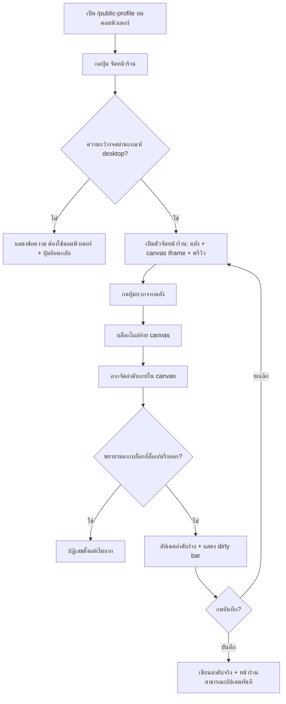

> **โมดูล:** 00035-shop-page-builder
> **ประเภทเอกสาร:** Product Requirements Document (PRD)
> **เวอร์ชัน:** 1.0
> **วันที่จัดทำ:** 2026-08-07
> **สถานะ:** Approved — user ยืนยัน 4 ข้อเปิดครบแล้ว 2026-08-07 (ดู "มติที่ยืนยันแล้ว" ท้ายเอกสาร) พร้อมส่งต่อ SRS/SDS
> **เจ้าของเอกสาร:** BA + PO + PM

# PRD: ตัวจัดหน้าร้าน (Shop Page Builder)

---

## Executive Summary

ตัวจัดหน้าร้านคือเครื่องมือใหม่ฝั่งผู้ขาย (seller console, Paces) ที่ให้ร้านค้าเลือกและจัดลำดับสิ่งที่จะแสดงบนหน้าร้านสาธารณะของตัวเอง (`/u/[username]` และ `/b/[slug]`, ธีม Vuexy) แบบเห็นผลจริงทันที (WYSIWYG) โดยไม่ต้องแก้โค้ด ผู้ขายเพิ่มบล็อกจากคลังด้วยปุ่ม (บล็อกโครงหน้า/เนื้อหาจากเพจ Facebook/เหรียญตรา) แล้วลากจัดลำดับภายในพื้นที่แสดงผลกลาง ก่อนกดบันทึกเพื่อเผยแพร่จริง เครื่องมือนี้ทำงานบนคอมพิวเตอร์เท่านั้นในเฟสนี้ แต่การตั้งค่าพื้นฐาน (ลิงก์ร้าน, คัดลอกลิงก์, เปิด/ปิดการเผยแพร่, เลือกคลิป) ยังใช้ได้ครบบนมือถือผ่านหน้า `/public-profile` เดิม

คุณค่าทางธุรกิจ: ร้านค้าเลือกเน้นสัญญาณความน่าเชื่อถือที่ตัวเองแข็งที่สุด (เช่น ร้านใหม่เน้นห้องพัก/สินค้า, ร้านเก่าเน้นรีวิว/เหรียญตรา) โดยไม่ทำให้สัญญาณความน่าเชื่อถือหลักของแพลตฟอร์ม (Trust Score, ป้ายยืนยันตัวตน, รีวิว, สถิติออเดอร์) ถูกซ่อนหรือบิดเบือนได้ — ตรงกับ Product Principle 1 ("Trust ต้องแสดง ไม่ใช่ป่าวประกาศ") และ Principle 6 ("เครื่องมือผู้ขายรับใช้ trust ไม่ใช่แทนที่มัน") ใน `PRODUCT.md`

---

## 1. Business Goals & KPIs

### 1.1 เป้าหมายทางธุรกิจ

| เป้าหมาย | รายละเอียด |
|----------|-----------|
| **เพิ่มการควบคุมของร้านเหนือหน้าร้านสาธารณะ** | ปัจจุบันร้านไม่มีทางเลือกลำดับ/เนื้อหาบนหน้าร้าน (`ShopProfile.tsx` กำหนดลำดับแท็บตายตัว) ให้เครื่องมือเลือก/จัดเรียงได้เอง โดยไม่ต้องขอทีมพัฒนาแก้โค้ด |
| **รักษาความน่าเชื่อถือของสัญญาณหลักไว้เป็น non-negotiable** | แม้ร้านจัดหน้าเองได้ สัญญาณที่ผู้ซื้อใช้ตัดสินใจโอนเงิน (trust score, ป้ายยืนยันตัวตน, รีวิว, สถิติออเดอร์) ต้องแสดงเสมอ ห้ามซ่อน/นำออกได้ทีละใบ (D-9) |
| **ใช้ทรัพยากรที่มีอยู่แล้วให้เกิดประโยชน์** | เนื้อหาจากเพจ Facebook (`FacebookPost`) และคลิป (`ShopVideo`) ที่ร้านมีอยู่แล้วในระบบแชท/คลิป ถูกนำมาใช้ต่อบนหน้าร้านสาธารณะโดยไม่ต้องอัปโหลดซ้ำ |

### 1.2 ตัวชี้วัดความสำเร็จ (KPIs)

> ฐานผู้ใช้จริงยังเล็กมาก (`PRODUCT.md` "Evidence on Hand": prod มี User 10 คน ณ 2026-08-02) — ตัวชี้วัดด้านล่างจึงเป็นตัวเลข**วัดผลหลังปล่อยฟีเจอร์** ไม่ใช่เป้าหมายเชิงปริมาณที่ตั้งไว้ล่วงหน้า (ห้ามอ้างเป็นเป้าที่คาดเดาจำนวนผู้ใช้)

| KPI | คำอธิบาย/วิธีวัด | เป้าหมาย |
|-----|----------|---------|
| **อัตราการใช้งานสำเร็จ** | ร้านที่เปิดตัวจัดหน้าร้าน แล้วกด "บันทึก" สำเร็จอย่างน้อย 1 ครั้ง / ร้านที่เปิดตัวจัดหน้าร้านทั้งหมด | วัดหลังปล่อย ไม่ตั้งตัวเลขล่วงหน้า |
| **การเปลี่ยนแปลงลำดับจากค่าเริ่มต้น** | % ร้านที่จัดลำดับ/เพิ่มบล็อกต่างจากค่าเริ่มต้นของระบบ (บ่งชี้ว่าเครื่องมือถูกใช้จริง ไม่ใช่แค่เปิดดู) | วัดหลังปล่อย |
| **ไม่มีสัญญาณความน่าเชื่อถือหายไปจากหน้าร้านจริง** | ตรวจอัตโนมัติ: ทุกหน้าร้านที่เผยแพร่ ต้องมีบล็อกหัวโปรไฟล์+รีวิว+สถิติออเดอร์ 100% (invariant ไม่ใช่ KPI เชิงการตลาด) | 100% เสมอ (regression = P0 bug) |

---

## 2. User Personas (กลุ่มผู้ใช้งาน)

### 2.1 ผู้ขาย/เจ้าของร้าน (Seller — persona หลักของฟีเจอร์นี้)

**ข้อมูลพื้นฐาน:**
- ใช้งานคอนโซล seller (Paces) เป็นประจำ, ทำงานบนมือถือเป็นหลักสำหรับงานประจำวัน (ออเดอร์/แชท) แต่มีคอมพิวเตอร์ใช้ได้เมื่อจะตั้งค่าเชิงลึก
- มี 1 ใน 3 ประเภทร้าน (`Shop.vertical`): `ONLINE_SALES` (ขายออนไลน์), `SERVICE_QUEUE` (สินค้าและบริการ), `LODGING` (บ้านพัก) — แต่ละประเภทมีเนื้อหาที่จะโชว์ต่างกัน (สินค้า vs บริการ vs ห้องพัก/ปฏิทิน)
- อาจมีหรือไม่มีเพจ Facebook เชื่อมต่อ (`ShopChannel`) — ถ้ามี จะมี `FacebookPost` ให้เลือกเป็นเนื้อหา

**เป้าหมาย:**
- อยากให้หน้าร้านสาธารณะของตัวเอง "โชว์จุดแข็ง" ก่อน — เช่น ร้านที่พักใหม่ยังไม่มีรีวิวเยอะ อยากเน้นห้องพักก่อนเน้นรีวิว
- อยากใช้เนื้อหาที่มีอยู่แล้ว (โพสต์ Facebook, คลิป, เหรียญตราที่ได้) แทนการอัปโหลดใหม่

**ความต้องการ:**
- เห็นผลจริง (WYSIWYG) ก่อนกดบันทึก ไม่ใช่กรอกฟอร์มแล้วเดาว่าจะออกมาหน้าตาแบบไหน
- ไม่ต้องพึ่งทีมพัฒนาแก้โค้ดทุกครั้งที่อยากเปลี่ยนลำดับ

**จุดปวด (Pain Points):**
- ทุกวันนี้ลำดับ/เนื้อหาของหน้าร้านตายตัวตามที่โค้ดกำหนด (`ShopProfile.tsx`) — ร้านไม่มีทางเลือกอะไรเลยนอกจากเลือกคลิป (`ShopVideosClient.tsx`)
- สัญญาณความน่าเชื่อถือที่ตัวเองมีอยู่แล้ว (เหรียญตรา, โพสต์ Facebook ที่มี engagement สูง) ไม่เคยถูกดึงมาใช้ต่อบนหน้าร้าน

### 2.2 ผู้ซื้อ/ผู้เข้าชมหน้าร้าน (ผู้รับผลทางอ้อม — ไม่ใช่ผู้ใช้ตัวเครื่องมือ)

**ข้อมูลพื้นฐาน:**
- เปิด `/u/{username}` หรือ `/b/{slug}` เพื่อเช็คว่าร้านนี้เชื่อถือได้ไหมก่อนโอนเงิน — ส่วนใหญ่มาจากลิงก์ที่ร้านแชร์ในโซเชียล ไม่ได้ล็อกอิน

**เป้าหมาย:**
- เห็นสัญญาณความน่าเชื่อถือที่ตรวจสอบได้ (verified, trust score, รีวิวจริง, ประวัติออเดอร์) โดยไม่ต้องขุดหา

**ความต้องการ:**
- สัญญาณหลักเหล่านี้ต้องอยู่ที่เดิมเสมอไม่ว่าร้านไหนจะจัดหน้าเองแค่ไหน (ไม่งั้นผู้ซื้อเทียบร้านต่อร้านไม่ได้)

**จุดปวด (Pain Points):**
- ถ้าร้านซ่อนสัญญาณที่ไม่ดีของตัวเองได้ (เช่น ซ่อนเฉพาะรีวิวแย่ ๆ) ตัวเลขที่เหลือจะไม่มีความหมาย และผู้ซื้อจะสูญเสียเครื่องมือตัดสินใจที่ Deep สร้างขึ้นมาโดยเฉพาะ (เหตุผลของ D-9)

---

## 3. Business Requirements

### 3.1 ทางเข้าและข้อจำกัดอุปกรณ์

**ความต้องการ:**
- ร้านเปิดตัวจัดหน้าร้านจากปุ่มในหน้า `/public-profile` (หน้าตั้งค่าโปรไฟล์สาธารณะเดิม ที่ยังคงอยู่ที่ `(dashboard)` มี sidenav) ไปยังหน้าตัวจัดหน้าร้านแบบเต็มจอ (`(fullscreen)`, ไม่มี sidenav)
- ตัวจัดหน้าร้านทำงานเฉพาะบนคอมพิวเตอร์ (desktop-only) ในเฟสนี้ — บนหน้าจอแคบต้องแสดงข้อความอธิบายแทนการพยายามบีบ layout 3 คอลัมน์จนพัง

**Business Rules:**
- เกณฑ์ desktop-only = ความกว้าง viewport ที่ layout 3 คอลัมน์ยังใช้งานได้จริง (คลัง 30% + พื้นที่จัดหน้า 40% + พรีวิว 30% ตามมockup) — ทีมพัฒนากำหนดจุดตัดที่แน่นอนตอน implement (SDS) แต่ต้องไม่ต่ำกว่าเกณฑ์ tablet แนวตั้ง
- หน้าจอที่ไม่ผ่านเกณฑ์ต้อง**ยังกดอะไรได้บ้าง** ไม่ใช่หน้าว่างเปล่า — อย่างน้อยมีปุ่มย้อนกลับไป `/public-profile`

**เหตุผล:**
- ตัวจัดเรียงต้องเห็นคลัง+พื้นที่จัด+ผลลัพธ์พร้อมกัน การบีบลง 390px แล้วเหลือทีละอย่างทำให้เสียเหตุผลของเครื่องมือไปทั้งหมด (D-4, ตัดสินโดย user 2026-08-07)
- แยกออกจาก `/public-profile` เป็นคนละ route (D-6) เพื่อไม่ให้หน้าที่ต้อง "ใช้บนคอมพิวเตอร์" ไปปนกับหน้าที่ "ต้องใช้ได้บนมือถือ" (`/public-profile` ยังต้องทำงานครบบนมือถือตาม D-5)

### 3.2 คลังบล็อกและเนื้อหา

**ความต้องการ:**
- ร้านเห็นรายการสิ่งที่ "เพิ่มลงหน้าร้านได้" แบ่งเป็นกลุ่ม: (1) สัญญาณความน่าเชื่อถือ (แสดงสถานะเท่านั้น ไม่มีปุ่มเพิ่ม เพราะอยู่ในหน้าเสมอแล้ว) (2) บล็อกโครงหน้า (3) เนื้อหาจากเพจ Facebook (4) เหรียญตรา
- บล็อก/เนื้อหาที่มีอยู่แล้วในหน้าร้าน ต้องบอกสถานะชัดเจน (เช่น "เพิ่มแล้ว") และปุ่มเพิ่มต้องหายไป ไม่ใช่ค้างเป็นปุ่มกดซ้ำได้แล้วไม่เกิดอะไร

**Business Rules:**
- บล็อกโครงหน้าที่แสดงในคลัง ผันตาม `Shop.vertical` ของร้าน — เฉพาะบล็อกที่ตรงกับประเภทร้านเท่านั้นที่ปรากฏ (LODGING เห็น "ห้องพัก"/"ปฏิทินวันว่าง"; ONLINE_SALES/SERVICE_QUEUE เห็น "สินค้า"/"บริการ" ตามที่มีจริง)
- เนื้อหาจากเพจ Facebook เพิ่มได้**ทีละโพสต์** ไม่ใช่ทีละบล็อกทั้งชุด — ร้านที่ยังไม่เชื่อมเพจเห็นหมวดนี้เป็นสถานะ "ยังไม่ได้เชื่อม" พร้อมทางไปเชื่อม ไม่ใช่ซ่อนหมวดทั้งหมด
- เหรียญตราแบ่งตาม `Badge.type`: ประเภท `ACHIEVEMENT` เลือก/จัดลำดับได้อิสระ (สูงสุด N ใบ, ดูคำถามเปิด #3); ประเภท `VERIFICATION` ไม่ปรากฏเป็นตัวเลือกในคลังเลย เพราะตรึงอยู่ในหัวโปรไฟล์อยู่แล้ว (D-10)

**เหตุผล:**
- ผันตาม vertical เพราะร้านแต่ละประเภทมีความสามารถต่างกันจริง (`src/lib/lodging.ts`, `src/lib/seller-menu.ts` ใช้ pattern เดียวกันนี้อยู่แล้วทั้งระบบ) — เสนอบล็อกที่ใช้ไม่ได้จริงจะสร้างความสับสน
- แยกเป็นรายโพสต์เพราะ engagement (ไลก์/คอมเมนต์/แชร์) ต่างกันในแต่ละโพสต์ ร้านต้องเลือกโพสต์ที่ดีที่สุดของตัวเองได้ ไม่ใช่รับทั้งหมดหรือไม่รับเลย

### 3.3 พื้นที่จัดหน้าและการลากจัดลำดับ

**ความต้องการ:**
- ร้านเห็นหน้าร้านของตัวเองแบบ WYSIWYG ขณะจัด ไม่ใช่รายการชื่อบล็อกที่ต้องจินตนาการเอาเอง
- เพิ่มบล็อกด้วยการกดปุ่มบวกจากคลัง — บล็อกไปโผล่ท้ายพื้นที่จัดหน้าให้ทันที จากนั้นลากสลับลำดับได้อย่างอิสระภายในพื้นที่นั้น

**Business Rules:**
- ห้ามลากบล็อกจากคลังข้ามเข้าไปยังพื้นที่จัดหน้าโดยตรง — วิธีเพิ่มมีทางเดียวคือปุ่มบวก
- การลากจัดลำดับทำได้เฉพาะภายในพื้นที่จัดหน้าเท่านั้น (สลับตำแหน่งบล็อกที่เพิ่มแล้ว)
- บล็อกที่ "นำออกไม่ได้" (guardrail, ดู §3.6) ต้องปฏิเสธการลากออกตั้งแต่ตอนเริ่มลาก ไม่ใช่ปล่อยให้ลากสำเร็จแล้วค่อยแจ้ง error ย้อนหลัง

**เหตุผล:**
- พื้นที่จัดหน้าคือหน้าร้านจริง (ธีม Vuexy/MUI) ฝังผ่าน `iframe` เพราะเป็นทางเดียวที่ได้ WYSIWYG แม่นยำ 100% โดยไม่มีทาง drift จากของจริง (D-2) ส่วนคลังอยู่นอก `iframe` (ธีม Paces ของคอนโซล seller) — pointer event ไม่ข้ามขอบ document ระหว่างสอง origin/context ที่ต่างกัน การลากข้ามคอลัมน์จึงทำไม่ได้ในทางเทคนิค จึงใช้ปุ่มบวกแทน (D-3)

### 3.4 พรีวิวและการบันทึก

**ความต้องการ:**
- ร้านเห็นพรีวิวของสิ่งที่กำลังจัด (คอลัมน์ที่ 3) แยกจากสิ่งที่เผยแพร่จริงอยู่ในปัจจุบัน (คอลัมน์กลาง = แก้ไข, คอลัมน์ขวา = ผลลัพธ์ตามการจัดล่าสุด)
- การเปลี่ยนแปลงที่ยังไม่กดบันทึกต้องไม่กระทบหน้าร้านสาธารณะจริงที่คนอื่นเห็นอยู่ตอนนั้น
- มีแถบแจ้งเตือนชัดเจนเมื่อมีการเปลี่ยนแปลงที่ยังไม่บันทึก พร้อมทางเลือก "ยกเลิก" หรือ "บันทึก"

**Business Rules:**
- สถานะที่แก้ไขในตัวจัดหน้าร้านเป็น "ร่าง" (draft) จนกว่าจะกดบันทึกสำเร็จ
- ออกจากหน้าโดยมีการเปลี่ยนแปลงที่ยังไม่บันทึก ต้องมีการเตือนก่อนออก (ป้องกันข้อมูลหาย)

**เหตุผล:**
- ป้องกันร้านเผลอเผยแพร่ผังหน้าที่ยังจัดไม่เสร็จ (เช่น ลากค้างไว้ครึ่งทาง) ให้ผู้ซื้อเห็นระหว่างทาง

### 3.5 การเผยแพร่หน้าร้าน

**ความต้องการ:**
- ร้านเปิด/ปิดการเผยแพร่หน้าร้านสาธารณะทั้งหน้าได้ด้วยสวิตช์เดียว (ปรากฏทั้งในตัวจัดหน้าร้านและหน้า `/public-profile` บนมือถือ)

**Business Rules:**
- สวิตช์นี้ควบคุม "ทั้งหน้า" เปิด/ปิดพร้อมกัน — เป็นคนละกลไกกับ guardrail ใน §3.6 ที่ควบคุม "รายบล็อกภายในหน้า"

**เหตุผล:**
- ให้ทางเลือกร้านที่ยังไม่พร้อมให้คนอื่นเห็นหน้าร้าน (เช่น กำลังจัดใหม่ทั้งหมด) โดยไม่ต้องลบข้อมูลทิ้ง — เห็นในทั้งสองจอของ mockup ที่ user อนุมัติแล้ว (`docs/superpowers/specs/2026-08-07-00035-builder-mockup-paces.html` แถบ toolbar desktop + การ์ด "การมองเห็นหน้าร้าน" บนมือถือ)

> หมายเหตุ implement: ปัจจุบัน `Shop` model ไม่มีคอลัมน์ควบคุมการเผยแพร่ (grep `prisma/schema.prisma` ไม่พบ `isPublished`/`profileVisible`) — เป็นความสามารถ**ใหม่**ที่ต้องเพิ่ม ไม่ใช่ของเดิมที่มีอยู่แล้ว (ดู "สิ่งที่ต้องตรวจก่อน implement")

### 3.6 กันสัญญาณความน่าเชื่อถือ (Trust Guardrail)

**ความต้องการ:**
- ไม่ว่าร้านจะจัดหน้าอย่างไร สัญญาณความน่าเชื่อถือหลักต้องแสดงอยู่บนหน้าร้านสาธารณะเสมอ ไม่มีทางซ่อนได้ทีละส่วน

**Business Rules (D-9, non-negotiable):**
- หัวโปรไฟล์ (ตัวตนร้าน) ตรึงอยู่บนสุดตายตัว — ย้ายตำแหน่งไม่ได้ด้วย ไม่ปรากฏเป็นตัวเลือกในคลังเลย
- บล็อก "รีวิวจากลูกค้า" + "คะแนนความน่าเชื่อถือ/ป้ายยืนยันตัวตน" + "ยอดออเดอร์สำเร็จ/อัตราความสำเร็จ" — ย้ายลำดับได้ (ยกเว้นส่วนที่รวมอยู่ในหัวโปรไฟล์ตรึงตายตัว) **แต่นำออกไม่ได้และซ่อนไม่ได้**
- ห้ามมี toggle "ซ่อน" รายบล็อกในกลุ่มนี้ไม่ว่ารูปแบบใด (ไม่ใช่แค่ห้ามลบ — ห้ามมีสวิตช์ visibility ด้วย)
- เหรียญตราประเภท `VERIFICATION` ("ยืนยันครบถ้วน") ตรึงเสมอ ไม่ใช่ตัวเลือกที่ปิดได้

**เหตุผล:**
- ถ้าซ่อนได้ทีละใบ ร้านที่มีปัญหาจะซ่อนเฉพาะตัวที่แย่ แล้วตัวเลขที่เหลือหมดความหมายทั้งชุด — ผู้ซื้อเทียบร้านต่อร้านไม่ได้อีกต่อไปว่าที่เห็นคือภาพครบหรือภาพที่ถูกคัดมาแล้ว ขัดกับ Product Principle 1 ("show, don't tell") และเหตุผลที่ตั้งชื่อ mockup section 4 ไว้ตรง ๆ ว่า "เส้นแบ่งของเหรียญตรา"

### 3.7 ประสบการณ์บนมือถือ (ไม่ใช่ทางตัน)

**ความต้องการ:**
- ผู้ขายที่เปิด `/public-profile` บนมือถือยังใช้งานฟังก์ชันพื้นฐานได้ครบ: ดูลิงก์หน้าร้าน + คัดลอกลิงก์, ปุ่มดูหน้าร้านจริง, สวิตช์เปิด/ปิดการเผยแพร่ (§3.5), เลือกคลิปที่จะแสดง (ของเดิม `ShopVideosClient.tsx`)
- มีข้อความอธิบายชัดเจนว่าการจัดเรียงบล็อกต้องทำบนคอมพิวเตอร์ พร้อมเหตุผลสั้น ๆ

**Business Rules:**
- ห้ามมีจุดใดในหน้า `/public-profile` บนมือถือที่กดแล้วไม่เกิดอะไร หรือพาไปหน้าที่ใช้งานไม่ได้โดยไม่มีคำอธิบาย

**เหตุผล:**
- โปรเจกต์นี้เป็น mobile-first โดยหลักการ (`PRODUCT.md` Product Principle 3) การตัดฟีเจอร์การจัดเรียงออกจากมือถือเป็นข้อยกเว้นเฉพาะจุดที่ต้องชดเชยด้วยการไม่ทำให้หน้าเดิมเสียหน้าที่ไปด้วย (D-5, บทเรียนจาก `docs/conventions/seller-action-placement.md` §5.1 ที่ `/orders` เคยพังจนสร้างออเดอร์บนมือถือไม่ได้เลยเพราะเปลี่ยนเป็น full-screen โดยไม่เผื่อทางแทน)

---

## 4. Business Rules & Constraints

### 4.1 กฎทางธุรกิจหลัก

| กฎ | คำอธิบาย |
|----|----------|
| **BR-PGB-01 หัวโปรไฟล์ตรึงตายตัว** | ไม่ปรากฏในคลัง ไม่มีตัวควบคุมลาก/ซ่อน/ย้าย (D-9) |
| **BR-PGB-02 รีวิว/คะแนน/สถิติออเดอร์ ย้ายได้แต่ลบไม่ได้** | ไม่มี toggle ซ่อนรายส่วน (D-9) |
| **BR-PGB-03 เพิ่มบล็อกโครงหน้าได้สูงสุด 1 ครั้งต่อชนิดต่อร้าน** | ปุ่มเพิ่มหายไปหลังเพิ่มแล้ว ไม่ใช่ disabled |
| **BR-PGB-04 บล็อกโครงหน้าผันตาม `Shop.vertical`** | เห็นเฉพาะบล็อกที่ตรงประเภทร้าน (SSOT `src/lib/lodging.ts`) |
| **BR-PGB-05 เนื้อหา Facebook เพิ่มทีละโพสต์** | ไม่ใช่ทีละบล็อกทั้งชุด — อ้างจาก `FacebookPost` ของ `ShopChannel` ที่เชื่อมไว้ |
| **BR-PGB-06 เหรียญตรา ACHIEVEMENT เลือก/จัดลำดับอิสระ** | สูงสุด 4 ใบ (ยืนยัน 2026-08-07) |
| **BR-PGB-07 เหรียญตรา VERIFICATION ตรึงเสมอ** | ไม่ปรากฏเป็นตัวเลือกในคลัง (D-10) |
| **BR-PGB-08 เพิ่มบล็อกด้วยปุ่มเท่านั้น** | ห้ามลากข้ามจากคลังเข้าพื้นที่จัดหน้า (D-3) |
| **BR-PGB-09 ลากจัดลำดับได้เฉพาะภายใน canvas** | สลับตำแหน่งบล็อกที่เพิ่มแล้วเท่านั้น |
| **BR-PGB-10 การเปลี่ยนแปลงเป็นร่างจนกว่าจะบันทึก** | ไม่กระทบหน้าร้านสาธารณะจริงจนกว่าจะกดบันทึกสำเร็จ |
| **BR-PGB-11 desktop-only** | หน้าจอแคบแสดงข้อความแทนการ render พัง (D-4) |
| **BR-PGB-12 `/public-profile` มือถือทำงานครบ** | ลิงก์/คัดลอก/ดูหน้าร้าน/สวิตช์เผยแพร่/เลือกคลิป (D-5) |

### 4.2 ข้อจำกัดทางธุรกิจ

| ข้อจำกัด | รายละเอียด |
|---------|-----------|
| **ไม่รวม `/u`+`/b` เป็น handle เดียว** | เป็นฟีเจอร์คนละตัว (00034) — ตัวจัดหน้าร้านทำงานบน URL ที่มีอยู่วันนี้ตามเดิม (ทั้ง `/u/[username]` และ `/b/[slug]`) |
| **ไม่มีการเปลี่ยนแท็บลากข้ามระหว่างคอลัมน์** | คลังกับพื้นที่จัดหน้าอยู่คนละ document context (Paces นอก / Vuexy ใน iframe) |
| **desktop-only เฉพาะ "การจัดเรียง"** | การตั้งค่าอื่นบน `/public-profile` (ลิงก์/สวิตช์เผยแพร่/เลือกคลิป) ไม่ถูกจำกัดอุปกรณ์ |

### 4.3 เหตุผลของข้อจำกัดสำคัญ

- **ทำไม canvas ต้องเป็น `iframe`:** หน้าร้านสาธารณะเป็นธีม Vuexy (MUI) ส่วนตัวจัดหน้าร้านเป็นธีม Paces — เอา component ของ Vuexy มา render ตรง ๆ ในหน้า Paces จะได้สีผิดเงียบ ๆ โดย build ผ่านหมด (ตรวจแล้วไม่ประกาศ `X-Frame-Options`/CSP `frame-ancestors` ที่ `next.config.ts`/`src/proxy.ts`/`vercel.json` เลย → same-origin iframe ใช้ได้ทันทีโดยไม่ต้องแก้ config เพิ่ม) เคยพิจารณาย้ายหน้าร้านทั้งหมดไปธีม Paces เพื่อตัดปมนี้ แต่ตัดสินใจไม่ย้าย (ดู Decision Log D-1)
- **ทำไมเพิ่มบล็อกด้วยปุ่มเท่านั้น:** ข้อจำกัดทางเทคนิคของสอง document context ที่แยกกัน (§3.3) ไม่ใช่การตัดสินใจเชิงดีไซน์ล้วน ๆ

---

## 5. Out of Scope (นอกขอบเขต)

| หัวข้อ | คำอธิบาย |
|--------|----------|
| **รวม `/u`+`/b` เป็น handle เดียว** | เป็นฟีเจอร์ 00034 คนละตัว ห้ามแตะในฟีเจอร์นี้ |
| **ตัวจัดเรียงบนมือถือ** | desktop-only เฟสนี้ (D-4) — เฟสถัดไปมีทางเลือกที่ ux เสนอไว้แล้ว (แท็บสลับ 3 โหมด + ปุ่มลูกศรขึ้น/ลง) แต่ไม่อยู่ใน scope นี้ |
| **การซ่อน/ลบสัญญาณความน่าเชื่อถือหลักรายส่วน** | ห้ามเด็ดขาดตาม D-9 ไม่ใช่แค่ยังไม่ทำ |
| **แก้เนื้อหาโพสต์ Facebook/บล็อกโครงหน้าจากในตัวจัดหน้าร้าน** | ตัวจัดหน้าร้านจัดแค่ "เลือก+ลำดับ" เนื้อหาที่มีอยู่แล้ว ไม่ใช่เครื่องมือแก้ไขเนื้อหาต้นทาง (แก้สินค้า/ห้องพัก/โพสต์ยังทำที่หน้าเดิมของแต่ละอย่าง) |
| **เทมเพลตหน้าร้านสำเร็จรูป/ธีมสี** | เฟสนี้จัดแค่ลำดับ+เนื้อหา ไม่ใช่ปรับสี/ฟอนต์/เลย์เอาต์ระดับ visual design |
| **บล็อกจากแพลตฟอร์มอื่น (Instagram/TikTok เป็นเนื้อหาโพสต์)** | D-8 ระบุเฉพาะเนื้อหาจากเพจ Facebook (`FacebookPost`) — คลิป (`ShopVideo`) ที่มีอยู่แล้วครอบ IG/TikTok/YouTube อยู่แล้วในฟีเจอร์เดิม แต่โพสต์ (ไม่ใช่คลิป) จำกัดที่ Facebook เท่านั้นในเฟสนี้ |
| **การแชร์/export ผังหน้าร้านข้ามร้าน (template marketplace)** | ไม่มีมติเรื่องนี้ ไม่อยู่ใน scope |

---

## 6. Risks & Mitigation

### 6.1 ความเสี่ยงทางธุรกิจ

| ความเสี่ยง | ผลกระทบ | ระดับความรุนแรง | แนวทางแก้ไข |
|-----------|---------|-----------------|-------------|
| ร้านเข้าใจผิดว่าซ่อนรีวิว/คะแนนได้ (คาดหวังจากคู่แข่งอื่น) | ร้องเรียน/ความไม่พอใจเมื่อพบว่าซ่อนไม่ได้ | กลาง | ข้อความในคลังต้องอธิบายเหตุผลตรง ๆ (มีอยู่แล้วใน mockup: "ทำไมถึงปล่อยไม่ได้") ไม่ใช่แค่ disabled เฉย ๆ |
| รูปโพสต์ Facebook ที่แปะไว้บนหน้าร้านหมดอายุกลายเป็นรูปแตก | หน้าร้านสาธารณะดูไม่น่าเชื่อถือ (ตรงข้ามเป้าหมายของ product) | สูง (แตะ credibility โดยตรง) | ต้องตัดสินเรื่อง mirror thumbnail ก่อน implement — ดูคำถามเปิด #1 |
| ร้านลืมกดบันทึกแล้วคิดว่าเผยแพร่แล้ว | ลูกค้าเห็นหน้าร้านเก่ากว่าที่ร้านตั้งใจ | ต่ำ-กลาง | dirty bar + เตือนก่อนออกจากหน้า (§3.4) |

### 6.2 ความเสี่ยงทางเทคนิค

| ความเสี่ยง | ผลกระทบ | แนวทางแก้ไข |
|-----------|---------|-------------|
| postMessage ระหว่าง Paces host กับ Vuexy iframe ไม่ sync กันตอน state ซับซ้อน (ลากเร็ว ๆ ต่อเนื่อง) | พรีวิวใน canvas ไม่ตรงกับสิ่งที่จะบันทึกจริง | ต้องกำหนด protocol ชัดเจนใน SDS (debounce, source-of-truth ฝั่งไหนชนะ) — ไม่ใช่ขอบเขตของ PRD/BRD นี้ |
| การแปลงหน้าร้านจากแท็บ (`ProfileTabs`) เป็นโครงที่รองรับลำดับที่ปรับได้ กระทบ `ShopProfile.tsx`/`ProfileHero.tsx` ที่ใช้ร่วมกันทั้ง `/u` และ `/b` | แก้พลาดกระทบทั้งสองเส้นทางพร้อมกัน | คงโครงแท็บเดิม ไม่รื้อ `ProfileTabs` (ยืนยัน 2026-08-07) — ลำดับครอบเฉพาะลำดับแท็บ + บล็อกเหนือแถบแท็บ ลดพื้นที่กระทบลงมาก |
| ยังไม่มีคอลัมน์ควบคุมการเผยแพร่หน้าร้าน (`Shop.isPublished` หรือเทียบเท่า) ในสคีมาปัจจุบัน | §3.5 ทำไม่ได้จนกว่าจะเพิ่ม field | ระบุใน "สิ่งที่ต้องตรวจก่อน implement" ให้ `safepay-database` ออกแบบ |

---

## 7. Glossary (อภิธานศัพท์)

| คำศัพท์ | ความหมาย |
|---------|----------|
| **บล็อก (Block)** | หน่วยเนื้อหาหนึ่งชิ้นบนหน้าร้านสาธารณะที่เพิ่ม/จัดลำดับได้ผ่านตัวจัดหน้าร้าน เช่น ห้องพัก, รีวิว, เหรียญตรา, โพสต์ Facebook หนึ่งโพสต์ |
| **คลัง (Library)** | รายการบล็อก/เนื้อหาที่เพิ่มลงหน้าร้านได้ อยู่นอก `iframe` (ธีม Paces) |
| **พื้นที่จัดหน้า (Canvas)** | พื้นที่ตรงกลางที่ render หน้าร้านจริงผ่าน `iframe` แบบ WYSIWYG ให้ลากจัดลำดับ |
| **สัญญาณความน่าเชื่อถือ (Trust Signal)** | หัวโปรไฟล์ + รีวิว + คะแนนความน่าเชื่อถือ/ป้ายยืนยันตัวตน + สถิติออเดอร์ — กลุ่มที่ห้ามซ่อน/นำออก (D-9) |
| **ตรึง (Pinned)** | ตำแหน่งตายตัว ย้ายไม่ได้ด้วย — ใช้กับหัวโปรไฟล์เท่านั้น |
| **ล็อก (Locked)** | ย้ายลำดับได้ แต่นำออก/ซ่อนไม่ได้ — ใช้กับรีวิว/คะแนน/สถิติออเดอร์ |
| **ร่าง (Draft)** | สถานะการเปลี่ยนแปลงที่ยังไม่กดบันทึก ไม่กระทบหน้าร้านสาธารณะจริง |
| **Vertical** | ประเภทร้าน 3 แบบ (`ONLINE_SALES`/`SERVICE_QUEUE`/`LODGING`) — SSOT `src/lib/lodging.ts` |

---

## 8. Success Metrics (ตัวชี้วัดความสำเร็จ)

| ตัวชี้วัด | ค่าที่คาดหวัง | วิธีวัด |
|----------|---------------|--------|
| ไม่มี regression ของสัญญาณความน่าเชื่อถือ | 0 หน้าร้านสาธารณะที่ขาดหัวโปรไฟล์/รีวิว/สถิติออเดอร์ | ตรวจอัตโนมัติ (E2E/QA checklist) ก่อนทุก release |
| ร้านใช้ตัวจัดหน้าร้านได้จริงโดยไม่ต้องถามทีมพัฒนา | ไม่มี support ticket ประเภท "ปรับหน้าร้านให้หน่อย" หลังปล่อยฟีเจอร์ | ติดตามเชิงคุณภาพ (ไม่ใช่ metric อัตโนมัติ) |
| มือถือไม่เป็นทางตัน | `/public-profile` บนมือถือผ่าน QA เคสครบ (ลิงก์/คัดลอก/ดูหน้าร้าน/สวิตช์เผยแพร่/เลือกคลิป) | QA checklist ตาม BRD §3 |

---

## 9. Dependencies & Assumptions

### 9.1 สิ่งที่ต้องพึ่งพา (Dependencies)

| ระบบ/ส่วนประกอบ | ความสัมพันธ์ |
|-----------------|-------------|
| `ShopProfile.tsx` / `ProfileTabs.tsx` / `ProfileHero.tsx` (`src/views/pages/user-profile/v2/`) | ปลายทางที่ต้อง refactor ให้รองรับลำดับที่ปรับได้ — ใช้ร่วมกันทั้ง `/u/[username]` และ `/b/[slug]` |
| `(fullscreen)` layout (`src/app/(paces)/seller/(fullscreen)/layout.tsx`) + `FullscreenPageHeader.tsx` | โครงหน้าตัวจัดหน้าร้าน (D-6/D-7) — ใช้ของเดิม ไม่สร้าง icon rail ใหม่ |
| `FacebookPost` / `ShopChannel` (feature 00029 Facebook Comments Inbox) | แหล่งเนื้อหาโพสต์ Facebook — ต้องมีเพจเชื่อมไว้ก่อน |
| `ShopVideo` (feature เดิม 2026-07-26) | แหล่งคลิป — ใช้ pattern เดียวกับ `ShopVideosClient.tsx` |
| `Badge` / `UserBadge` / `prisma/badge-seed-data.ts` | แหล่งเหรียญตรา — `Badge.type` เป็นตัวตัดสิน ACHIEVEMENT/VERIFICATION |
| `src/lib/lodging.ts`, `src/lib/appointments.ts`, `src/lib/seller-menu.ts` | SSOT ของการผันเนื้อหาตาม `Shop.vertical` |

### 9.2 สมมติฐาน (Assumptions)

- สมมติว่า route ใหม่ของตัวจัดหน้าร้านคือ `(fullscreen)/public-profile/builder` เข้าถึงผ่านปุ่มบน `/public-profile` เดิม — เป็นชื่อที่ตั้งตาม pattern ของ `(fullscreen)` route อื่นในระบบ (`orders/new`, `products/new`) ไม่ใช่มติที่ล็อกไว้ตรง ๆ ในมติ D-1..D-10 (ควรยืนยันตอน SDS)
- สมมติว่า `Shop.slug`/`username` ที่มีอยู่แล้วเพียงพอสำหรับ preview iframe (ไม่ต้องสร้างระบบ preview token แยก) เพราะร้านเปิดตัวจัดหน้าร้านได้ต่อเมื่อผ่าน onboarding แล้ว (มี `slug`)
- ไม่มีการเปลี่ยน authorization matrix ของ `/u`/`/b` เอง (ยังเป็นหน้า public ไม่ต้อง login) — เปลี่ยนแค่ "ใครแก้ไขได้" ซึ่งเป็นเรื่องฝั่ง seller console เท่านั้น

---

## 10. Appendix

### 10.1 ตัวอย่าง User Journey

**Scenario: ร้านที่พัก (LODGING) จัดหน้าร้านครั้งแรก**

1. เจ้าของร้าน "BT พรีเมี่ยม" เข้า `/public-profile` บนคอมพิวเตอร์ เห็นปุ่ม "จัดหน้าร้าน"
2. กดปุ่ม → เข้าตัวจัดหน้าร้าน (`(fullscreen)`) เห็นหน้าร้านปัจจุบันของตัวเองในพื้นที่จัดหน้า (เริ่มต้นมีแค่หัวโปรไฟล์ + รีวิว ตรึง/ล็อกตามปกติ)
3. เปิดคลัง เห็นบล็อกที่ใช้ได้ตาม vertical `LODGING`: "ห้องพัก" (4 ห้องที่เปิดขาย), "ปฏิทินวันว่าง"
4. กดปุ่มบวกที่ "ห้องพัก" → บล็อกไปโผล่ท้ายพื้นที่จัดหน้าทันที
5. ลากบล็อก "ห้องพัก" ขึ้นไปอยู่ต่อจากหัวโปรไฟล์ (ก่อนรีวิว) — พยายามลาก "รีวิว" ออกจากรายการ → ระบบปฏิเสธตั้งแต่ตอนเริ่มลาก (guardrail)
6. เปิดคลังหมวดเหรียญตรา เลือกเหรียญ ACHIEVEMENT 4 ใบที่อยากโชว์ → ปรากฏเป็นบล็อก "เหรียญตราเด่น"
7. เห็นแถบแจ้งเตือน "มีการเปลี่ยนแปลงที่ยังไม่บันทึก" กดตรวจพรีวิวคอลัมน์ขวา แล้วกด "บันทึก"
8. หน้าร้านสาธารณะจริง `/b/bt-premium` แสดงผลตามลำดับใหม่ทันที

### 10.2 Flow ภาพรวม

---

**หมายเหตุ:**
เอกสารนี้เป็นการบันทึกความต้องการทางธุรกิจ (Business Requirements) โดยไม่มีรายละเอียดทางเทคนิค
สำหรับ Functional Requirements / User Story / Acceptance Criteria ดู [[BRD]] ของโมดูลนี้
สำหรับ technical specification ดู [[SRS]]/[[SDS]] ของโมดูลนี้ (ยังไม่จัดทำ — รอผ่านการยืนยัน 4 ข้อเปิดก่อน ตาม Hard Rule 11)

---

## มติที่ user ยืนยันแล้ว (2026-08-07)

ปิด 4 ข้อเปิดที่เอกสารฉบับร่างค้างไว้ — **2 ข้อ user เลือกต่างจากที่ทีมเสนอ** บันทึกไว้ทั้งสิ่งที่เลือกและสิ่งที่ไม่เลือก

| # | คำถาม | มติ | ตรงกับที่เสนอไหม |
|---|---|---|---|
| 1 | โครงหน้าร้านสาธารณะ | **คงโครงแท็บเดิม** ไม่รื้อ `ProfileTabs` · ลำดับที่จัดได้ = ลำดับแท็บ + ลำดับบล็อกเหนือแถบแท็บ (หัวโปรไฟล์ตรึง / เหรียญตราเด่น / โพสต์จากเพจ) | **ไม่ตรง** — ทีมเสนอแปลงเป็น single-column feed · เหตุผลที่ไม่เลือก: รื้อ IA ที่ผ่าน sign-off 2026-07-26 และเปลี่ยนสิ่งที่ผู้ซื้อเห็นทั้งหน้า เกินขอบเขตของเครื่องมือจัดหน้าร้าน |
| 2 | รูปโพสต์ Facebook | **mirror ลง storage ของเราตอนกดเพิ่มโพสต์นั้น** (เฉพาะโพสต์ที่เลือกจริง ไม่ mirror ทั้งคลัง) | ตรง |
| 3 | จำนวนเหรียญตราเด่น | **สูงสุด 4 ใบ** | ตรง |
| 4 | สิทธิ์เข้าตัวจัดหน้าร้าน | **OWNER + ShopMember role=ADMIN** ได้ทั้งคู่ | **ไม่ตรง** — ทีมเสนอ OWNER เท่านั้น · user เปิดให้ทีมงานที่ถูกเชิญจัดหน้าร้านได้ด้วย |

### ผลที่ตามมาต่อขอบเขตงาน

- ข้อ 1 **ลดพื้นที่กระทบลงมาก** — ไม่ต้องรื้อ `ProfileTabs.tsx` และไม่เปลี่ยนหน้าที่ผู้ซื้อเห็นเป็นวงกว้าง เหลือเพียงทำให้ลำดับแท็บและบล็อกส่วนบนอ่านจากค่าที่ร้านจัดไว้
- ข้อ 2 เพิ่มงาน mirror รูป — ต้องตรวจลิมิต MIME/ขนาดของ bucket ก่อน (มีประวัติ mirror ล้มเงียบเพราะ allow-list ไม่ตรงกับโค้ด)
- ข้อ 4 **guard ต้องครอบทั้ง API และหน้าจอ** — ไม่ใช่ซ่อนเมนูอย่างเดียว (บทเรียน feature 00028: ระบบประมูลกับ Inventory ไม่เคยมี server-side guard เลย กันด้วยการซ่อนเมนูมาตลอด)
