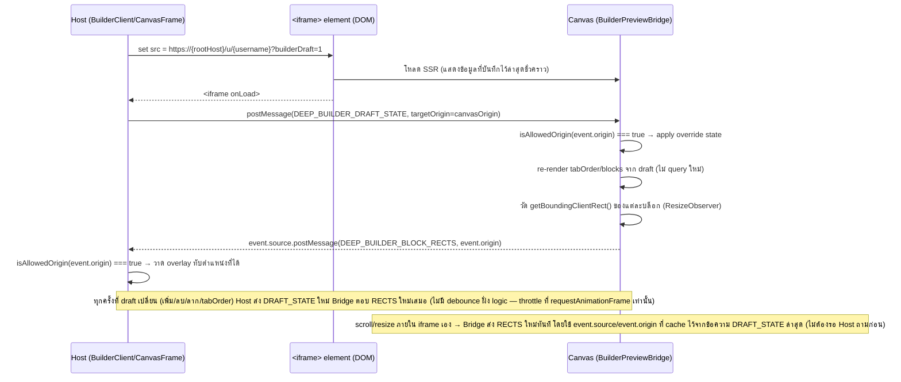
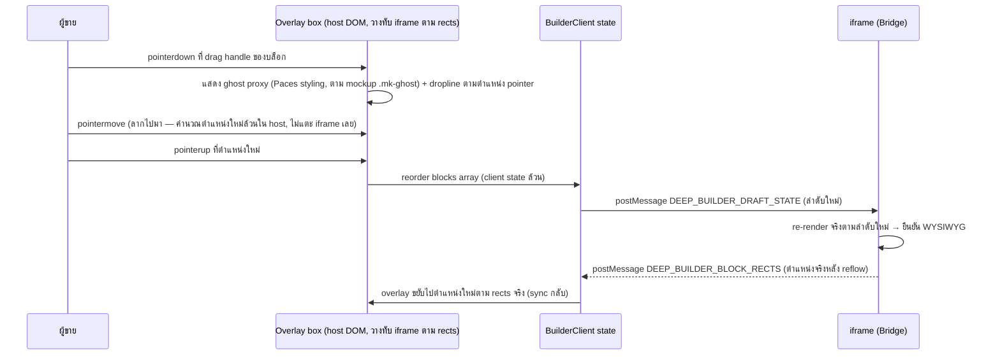

> **โมดูล:** M00035-ShopPageBuilder
> **ประเภทเอกสาร:** System Design Spec (SDS)
> **เวอร์ชัน:** 1.0
> **วันที่จัดทำ:** 2026-08-07
> **สถานะ:** Draft
> **เจ้าของเอกสาร:** safepay-planner (ดู [[Feature-Docs-Ownership]])

# SDS: ตัวจัดหน้าร้าน (Shop Page Builder) — System Design Spec

---

## 1. บทนำ & References

### 1.1 วัตถุประสงค์

ออกแบบ implementation ของ [[SRS]] M00035 ให้ครบทุก component/flow ที่ developer ต้องสร้าง ผู้อ่าน: `safepay-developer`, `safepay-reviewer`, `safepay-qa`

### 1.2 ขอบเขตการออกแบบ

ครอบคลุม: route ใหม่ 1 หน้า (`(fullscreen)/public-profile/builder`), แก้ 4 ไฟล์เดิม (`/u`,`/b`,`ShopProfile.tsx`,`public-profile/page.tsx`), ไฟล์ใหม่ ~10 ไฟล์ (component/service/lib), API 4 endpoint — ไม่ครอบ: schema (ล็อกแล้วใน [[DATABASE]]), business rule ใหม่ใด ๆ (ล็อกแล้วใน PRD/BRD)

### 1.3 เอกสารอ้างอิง

| เอกสาร | ความสัมพันธ์ |
|--------|-------------|
| [[SRS]] ของโมดูลนี้ | TFR-001..009 ที่ SDS นี้ต้อง realize |
| [[BRD]] ของโมดูลนี้ | FR-PGB-01..16 |
| [[PRD]] ของโมดูลนี้ | มติ D-1..D-10, มติ 4 ข้อ 2026-08-07 |
| [[DATABASE]] ของโมดูลนี้ | schema ล็อก, open question §6/§8 ที่ SDS นี้ปิด |
| `docs/system/ui-guideline/paces-component-reference.md` | primitive ที่ต้องใช้ใน builder UI (`(paces)`) |
| `docs/conventions/paces-toast.md` | `pacesToast` สำหรับ toast บันทึกสำเร็จ/ล้ม |

---

## 2. Architecture Overview

### 2.1 มุมมองสถาปัตยกรรม

ไม่มี pattern ใหม่ระดับระบบ — ยึด Next.js App Router service-layer เดิมทั้งหมด (`route.ts` → `service.ts` → Prisma) จุดใหม่จริงมีจุดเดียวคือ **cross-origin postMessage channel** ระหว่าง 2 หน้าในแอปเดียวกัน (ไม่ใช่ third-party integration — ทั้งสองฝั่งเป็นโค้ดเราเอง) ซึ่งเป็น pattern มาตรฐานของ visual page builder ทุกเจ้า (mockup เองระบุไว้ตรง ๆ)

```mermaid
graph TD
    Client[ผู้ขาย — เบราว์เซอร์เดียว 1 แท็บ]
    Host["Host: (paces)/seller/(fullscreen)/public-profile/builder — seller.deepthailand.app"]
    IframeEl["<iframe> element ใน Host DOM"]
    Canvas["Canvas: (marketing)/u/[username] หรือ /b/[slug]?builderDraft=1 — deepthailand.app (root)"]
    API["/api/shops/current/page-builder/**"]
    SVC[shop-page-layout.service.ts]
    DB[(PostgreSQL)]
    Storage[(Storage bucket)]

    Client --> Host
    Host -->|renders| IframeEl
    IframeEl -->|loads via absolute cross-subdomain URL| Canvas
    Host <-->|postMessage — cross-origin, explicit targetOrigin| IframeEl
    Host -->|fetch: GET library / POST mirror / PUT save / PATCH publish| API
    API --> SVC
    SVC --> DB
    SVC -->|mirrorRemoteImage()| Storage
    Canvas -->|SSR read| SVC
```

### 2.2 มุมมองการ Deploy

ไม่มีการเปลี่ยน deploy topology — deploy พร้อมกับ monolith เดิม (`vercel.json` เดิม, `prisma migrate deploy` ตาม Hard Rule 15 — งานนี้ไม่มี migration ใหม่ที่ต้องรันเอง เพราะ migration ของ 00035 apply ไปแล้วตาม [[DATABASE]] §5)

---

## 3. Component Design

| Component | หน้าที่ (Responsibility) | Dependency (Submodule / Stack / Store) |
|-----------|--------------------------|-----------------------------------------|
| **`BuilderPage`** — `src/app/(paces)/seller/(fullscreen)/public-profile/builder/page.tsx` (ใหม่) | Server Component: auth guard, SSR ดึง initial state ครบชุด (layout+blocks+visibleTabKeys+library แรกหน้า), ส่งเป็น prop เดียวลง `BuilderClient` | Next.js RSC (Paces) → `shop-page-layout.service.ts`, `profile-tab-keys.ts` |
| **`BuilderClient`** — `.../builder/components/BuilderClient.tsx` (ใหม่) | ถือ draft state ทั้งหมด (`useState<BuilderDraft>`), คำนวณ `isDirty`, orchestrate save/publish/mirror, ส่ง `DRAFT_STATE` เข้า iframe | Client (Paces) — `'use client'` |
| **`BuilderToolbar`** — `.../builder/components/BuilderToolbar.tsx` (ใหม่) | แถบบน: back + title + URL/copy + publish switch + "ดูหน้าร้านจริง" + Save (ผ่าน `FullscreenPageHeader` ที่ขยาย prop `toolbarExtra`) | Server shell (`FullscreenPageHeader.tsx` แก้เพิ่ม prop) + client sub-parts |
| **`DraftDirtyBar`** — `.../builder/components/DraftDirtyBar.tsx` (ใหม่) | แถบเตือน "มีการเปลี่ยนแปลงที่ยังไม่บันทึก" + ยกเลิก/บันทึก | Client (Paces) — Base: mockup toolbar dirty-bar row (`bg-warning/15 text-warning-ink`) |
| **`LibraryPanel`** — `.../builder/components/LibraryPanel.tsx` (ใหม่) | คอลัมน์ซ้าย: ค้นหา, กลุ่มบล็อกเหนือแถบแท็บ (เพิ่มได้), กลุ่มแท็บ (reorder), กลุ่มตรึง (อ่านอย่างเดียว) | Client (Paces) → เรียก `GET .../library` |
| **`CanvasFrame`** — `.../builder/components/CanvasFrame.tsx` (ใหม่) | คอลัมน์กลาง: `<iframe>` + overlay layer วาดจาก rects, drag reorder ของบล็อกเหนือแถบแท็บ | Client (Paces) |
| **`PreviewPanel`** — `.../builder/components/PreviewPanel.tsx` (ใหม่) | คอลัมน์ขวา: re-representation แบบ Paces-native จาก draft state ปัจจุบัน | Client (Paces) — **ไม่ใช่ iframe**, ไม่อ้าง Vuexy component |
| **`useUnsavedChangesGuard`** — `.../builder/hooks/useUnsavedChangesGuard.ts` (ใหม่) | `beforeunload` + intercept back-button เมื่อ dirty | Client hook |
| **`BuilderPreviewBridge`** — `src/views/pages/user-profile/v2/BuilderPreviewBridge.tsx` (ใหม่) | Mount เฉพาะเมื่อ `builderDraft=1`: ฟัง `DRAFT_STATE`, override tabOrder/blocks ที่ใช้ render, รายงาน rects กลับ | Client (Vuexy) |
| **`ProfileUnavailable`** — `src/views/pages/user-profile/v2/ProfileUnavailable.tsx` (ใหม่) | หน้า "ไม่พร้อมให้บริการ" เมื่อ `isPublished=false` และ viewer ไม่ใช่เจ้าของ/ทีมงาน | Client/Server (Vuexy) |
| **`PageBlocksSection`** — `src/views/pages/user-profile/v2/PageBlocksSection.tsx` (ใหม่) | Render บล็อก `BADGE_HIGHLIGHT`/`FACEBOOK_POST` เหนือแถบแท็บ | Client (Vuexy) — `ShopProfile.tsx` เรียกใช้ |
| **`profile-tab-keys.ts`** — `src/lib/profile-tab-keys.ts` (ใหม่) | `PROFILE_TAB_KEYS`, `computeVisibleTabKeys()`, `applyTabOrder()` — pure function ล้วน | ไม่มี `'use client'` — import ได้ทั้ง server/client |
| **`shop-page-layout.service.ts`** — `src/services/shop-page-layout.service.ts` (ใหม่) | ทุก DB access ของ feature นี้ — `getShopPageLayout`, `listShopPageBlocks`, `getBuilderLibrary`, `mirrorFacebookPostForBuilder`, `saveShopPageLayout`, `setShopPagePublished` | Service layer → Prisma → PostgreSQL |
| **`FullscreenPageHeader.tsx`** (แก้ — เพิ่ม prop) | เพิ่ม optional `toolbarExtra?: ReactNode` คั่นระหว่าง title กับปุ่ม Save — **backward-compatible**, 14 caller เดิมไม่ต้องแก้ | Server (Paces, มีอยู่แล้ว) |
| **`public-profile/page.tsx`** (แก้) | เพิ่มปุ่ม "จัดหน้าร้าน" (link ไป builder) + การ์ดสวิตช์เผยแพร่ (`PublishToggleClient`) + แบนเนอร์ desktop-only | Server (Paces, มีอยู่แล้ว) |
| **`PublishToggleClient`** — `.../public-profile/components/PublishToggleClient.tsx` (ใหม่) | สวิตช์เผยแพร่ที่ reuse ได้ทั้งมือถือ (`/public-profile`) และ builder toolbar — เรียก `PATCH .../publish` | Client (Paces) |

---

## 4. Data Flow

### 4.1 Flow หลัก: postMessage protocol (2 message type)



**Message shape:**

```ts
// src/app/(paces)/seller/(fullscreen)/public-profile/builder/types.ts (ใหม่ — shared ทั้ง host/canvas)
type DeepBuilderMessage =
  | {
      type: 'DEEP_BUILDER_DRAFT_STATE'
      payload: {
        tabOrder: string[]
        blocks: Array<
          | { key: string; type: 'BADGE_HIGHLIGHT'; badges: Array<{ id: string; name: string; icon: string }> }
          | {
              key: string
              type: 'FACEBOOK_POST'
              post: {
                id: string
                message: string | null
                imageUrl: string | null
                mediaType: string | null
                reactionCount: number | null
                fbCommentCount: number | null
                shareCount: number | null
              }
            }
        >
      }
    }
  | {
      type: 'DEEP_BUILDER_BLOCK_RECTS'
      payload: {
        blocks: Array<{ key: string; top: number; left: number; width: number; height: number }>
        scrollTop: number
        scrollHeight: number
      }
    }
```

**origin validation (ทั้งสองฝั่ง — ใช้ฟังก์ชันเดียวกัน):**

```ts
import { isAllowedOrigin } from '@/lib/csrf-origin'

window.addEventListener('message', (event: MessageEvent) => {
  if (!isAllowedOrigin(event.origin)) return // ทิ้งเงียบ ไม่ throw ไม่ log (อาจเป็น noise จาก extension อื่นในเบราว์เซอร์)
  const data = event.data as DeepBuilderMessage
  if (data?.type !== 'DEEP_BUILDER_DRAFT_STATE') return
  // ... apply
})
```

### TD-005: ทำไมไม่ต้องมี message type ที่ 3 (highlight-on-hover)

Hover บนแถวคลัง (เช่นชี้ที่ "เหรียญตราเด่น — เพิ่มแล้ว") เพื่อ highlight บล็อกที่ตรงกันใน canvas **ไม่ต้องส่ง postMessage เพิ่ม** — Host รู้ rects ของทุกบล็อกอยู่แล้วจาก `DEEP_BUILDER_BLOCK_RECTS` ล่าสุด การ highlight คือแค่ toggle CSS class บน overlay div (host DOM ล้วน) ไม่ต้องบอก iframe อะไรเลย — ลดจำนวน message type จาก 3 เหลือ 2

### 4.2 Flow: ลากสลับลำดับบล็อกในพื้นที่จัดหน้า (drag เป็น host-DOM ล้วน)



**เหตุผลที่ ghost/dropline ระหว่างลากไม่รอ iframe reflow:** ระหว่างลาก (pointermove ต่อเนื่อง) host แสดง visual feedback ของตัวเอง (เหมือน mockup section 3 "กำลังลาก") ไม่ส่ง `DRAFT_STATE` ทุก pixel ที่ขยับ (จะ spam message เกินจำเป็นและทำให้ iframe reflow รัว ๆ กระตุก) — ส่ง `DRAFT_STATE` **ครั้งเดียวตอน `pointerup`** เท่านั้น สอดคล้อง NFR "ไม่รอ round-trip เครือข่ายทุกครั้งที่ลาก" (BRD §6.2 — ในที่นี้ "round-trip" ตีความรวม postMessage round-trip ด้วย ไม่ใช่แค่ server)

### TD-006: ทางเลือกที่พิจารณาแล้วตัดทิ้ง — `iframe.src` reload ด้วย query param

BRD/มockup เสนอทางลดขอบเขต: encode draft state ลง query param แล้ว `iframe.src = newUrl` ให้ Next.js SSR ใหม่ทุกครั้งที่ reorder แทนการทำ postMessage protocol เต็มรูป

- **เหตุผลที่ไม่เลือก:**
  1. ทุกครั้งที่ลาก 1 ตำแหน่งจะต้อง SSR round-trip เต็ม (network + render) — ขัด NFR "ไม่รอ round-trip" ตรง ๆ (BRD §6.2)
  2. `<iframe>` navigate ใหม่ = **unmount/remount ทั้ง document** — เสีย scroll position ที่ user กำลังดูอยู่, มี flicker เห็นชัด, และรี fetch ข้อมูลทั้งหน้าใหม่ทุกครั้ง (สินค้า/ห้องพัก/รีวิว) ทั้งที่ข้อมูลพวกนั้นไม่ได้เปลี่ยน
  3. ไม่มีทางได้พิกัด/ขนาดบล็อกกลับมาวาด overlay (chrome/tool ตาม mockup) เพราะไม่มีช่องทางสื่อสารคืนจาก iframe เข้า host เลย (query param เป็นทางเดียว = host→iframe เท่านั้น)
  4. Draft state ที่ใหญ่ขึ้น (เช่น เลือกโพสต์ไว้หลายสิบโพสต์) จะดัน query string ยาวเกินเพดานที่ browser/proxy บางตัวรองรับ

- **สิ่งที่เสียถ้าเลือกทางนี้แทน:** ได้ implementation ง่ายกว่า (ไม่ต้องเขียน message listener/origin validation ทั้งสองฝั่ง) แต่ถ้าไปทางนี้ FR-PGB-07's "ไฮไลต์บล็อกที่กำลังโฟกัส" (มี AC ชัดใน BRD) **ทำไม่ได้เลย** ต้องตัดออกจาก scope และประสบการณ์ลากจะรู้สึกหน่วง (perceptible SSR delay ทุกครั้ง) ซึ่งขัดกับคุณค่าหลักของเครื่องมือ (WYSIWYG ที่ "รู้สึกทันที") — **ตัดสินใจ: ไม่เลือกทางนี้** ยึด postMessage protocol เต็มรูปตาม TD ด้านบน

---

## 5. Integration Points

| จุดเชื่อม | ประเภท | Protocol / Contract | ความเสี่ยงเมื่อล่ม |
|-----------|--------|----------------------|---------------------|
| **Host ↔ Canvas (postMessage)** | internal, cross-origin (same app) | `postMessage` — 2 message type (§4.1) | Canvas ไม่ตอบ (เช่น JS error ใน Bridge) → overlay ไม่ขึ้นเลย แต่ canvas ยัง render เนื้อหาพื้นฐานได้ (SSR ค่าที่บันทึกล่าสุดเสมอเป็น fallback) — ไม่ถึงขั้น broken page |
| **`mirrorRemoteImage()` → Meta CDN** | external (ผ่าน internal wrapper เดิม) | HTTPS fetch, timeout+size cap ที่มีอยู่แล้ว (feature 00018) | คืน `null` → fallback `thumbnailUrl` ชั่วคราว (TFR-006) ไม่ block |
| **`GET .../library` → Prisma** | internal | REST/JSON | DB down → 500 มาตรฐาน (ไม่มี fallback พิเศษ) |

- **Timeout / Retry / Idempotency:** mirror endpoint idempotent (เช็ค `mirroredFileId` ก่อนเสมอ — TFR-006); save endpoint ไม่ idempotent โดยธรรมชาติของ replace-all แต่ retry ซ้ำได้ปลอดภัย (ผลลัพธ์เดิมถ้า draft ไม่เปลี่ยน)
- **สัญญา API เต็ม:** ดู [[API]] ของโมดูลนี้

---

## 6. Technical Decisions

### TD-001: Route ของ builder
- **ตัดสินใจ:** `src/app/(paces)/seller/(fullscreen)/public-profile/builder/page.tsx`
- **เหตุผล:** ตรง PRD assumption 9.2, match pattern `(fullscreen)` ที่มีอยู่ (`orders/new`, `products/new` — resource-scoped sub-route); เข้าถึงผ่านปุ่มจาก `/public-profile` (D-6)
- **ทางเลือกที่ตัดทิ้ง:** route แยกนอก `/public-profile` namespace (เช่น `/builder` เดี่ยว ๆ) — ตัดเพราะเสียความสัมพันธ์เชิง IA กับ `/public-profile` ที่เป็นจุดเข้าเดียว
- **ผลกระทบ:** ไม่มี — เป็น net-new route, ไม่กระทบ route อื่น

### TD-002: หน้า `isPublished=false` คืน 200 + custom UI ไม่ใช่ 404
- **ตัดสินใจ:** เมื่อ `showRealContent=false` render `<ProfileUnavailable>` (HTTP 200) ไม่ redirect ไป 404
- **เหตุผล:** URL `/u/{username}`,`/b/{slug}` ยังคง "มีอยู่จริง" ในความหมาย identity ของร้าน (แค่เนื้อหาถูกซ่อนชั่วคราว) — 404 จะสื่อว่า "ร้านนี้ไม่มีตัวตน" ซึ่งผิด และเสี่ยงให้ search engine deindex หน้าที่จริง ๆ จะกลับมาเผยแพร่ใหม่ในไม่ช้า; แนวทางเดียวกับ platform อื่น (เช่น หน้าโปรไฟล์ social ที่ถูกตั้งเป็น private ยังคืน 200 พร้อมข้อความ ไม่คืน 404)
- **ทางเลือกที่ตัดทิ้ง:** `notFound()` (404) — ตัดเพราะเหตุผลข้างบน + BRD AC เขียนไว้เป็นทางเลือกคลุมเครือ ("'ไม่พร้อมให้บริการ'/'ไม่พบหน้านี้' — พฤติกรรมแน่นอนกำหนดใน SDS") ต้องเลือกให้ชัด
- **ผลกระทบ:** `generateMetadata` ของทั้งสองหน้าต้องคง `robots: {index:false}` เมื่อ `!showRealContent` ด้วย (กัน search index หน้าที่ยังไม่พร้อม)

### TD-003: `builderDraft` query param — แยกจาก publish-gate bypass
- **ตัดสินใจ:** query param `builderDraft=1` มีผลแค่ "เปิดใช้ `BuilderPreviewBridge`" (ฟัง postMessage) เท่านั้น — **ไม่ได้ใช้ bypass `isPublished` gate** (การ bypass นั้นมาจาก `canAccessShop` check โดยตรง ซึ่งเป็นจริงอยู่แล้วไม่ว่าจะมี query param หรือไม่)
- **เหตุผล:** แยก concern สองเรื่องออกจากกันชัดเจน (การเห็นเนื้อหาจริงเมื่อ unpublished vs การรับ draft override) — ป้องกัน bug ในอนาคตที่คนแก้โค้ดคิดว่า query param คือ "ประตูลับ" เข้าถึงเนื้อหาที่ปิดเผยแพร่ (ซึ่งจะเป็นช่องโหว่ถ้า query param อย่างเดียวพอ) ในดีไซน์นี้ query param **ไม่มีผลด้าน authorization เลย** (แค่ toggle UI behavior) — คนนอกที่เดา URL `?builderDraft=1` ได้แค่เปิด event listener เปล่า ๆ ที่ไม่มีอะไรส่งมา (เพราะ origin ของ message จะไม่ผ่าน `isAllowedOrigin` อยู่ดีถ้าไม่ได้มาจาก legit host)
- **ผลกระทบ:** ปลอดภัยแม้ query param รั่วไหล/ถูกเดา — ไม่ใช่ security boundary

### TD-004: Mirror ล้ม → ไม่ block การเพิ่มบล็อก (non-blocking fallback)
- **ตัดสินใจ:** `mirrorFacebookPostForBuilder` คืน `mirrored:false` + `imageUrl = thumbnailUrl` (Meta URL ดิบ) เมื่อ mirror ล้ม — ผู้ใช้ยังกดเพิ่มบล็อกได้ปกติ ไม่มี error blocking
- **เหตุผล:** ปิด DATABASE open question "Mirror failure UX" — เลือก non-blocking เพราะ (1) blocking ผู้ใช้จาก external hiccup ที่เขาแก้เองไม่ได้ (Meta CDN ชั่วคราวเข้าไม่ถึง) เป็นประสบการณ์แย่กว่าความเสี่ยงรูปแตกที่มีโอกาสต่ำ-ปานกลางในกรอบเวลาสั้น (2) endpoint idempotent จะ retry mirror อัตโนมัติทุกครั้งที่เปิด builder ใหม่แล้วกด "+" ซ้ำจนกว่าจะสำเร็จ ไม่ต้องมี background job แยก
- **ทางเลือกที่ตัดทิ้ง:** ปฏิเสธการเพิ่มทั้งหมดเมื่อ mirror ล้ม (block) — ตัดเพราะยกระดับความเข้มงวดเกินความเสี่ยงจริง (ความเสี่ยงคือ "ภาพอาจแตกในอนาคต" ไม่ใช่ "ข้อมูลเสียหายทันที")
- **ผลกระทบ:** ต้อง `console.error` ทุกครั้งที่ mirror ล้ม (NFR observability §6 SRS) เพื่อให้มีร่องรอย debug แม้ user ไม่ถูก block

### TD-007: Publish-gate breakpoint — CSS-only (ไม่ใช่ JS `innerWidth`)
- **ตัดสินใจ:** ใช้ Tailwind `hidden xl:flex` / `xl:hidden` (breakpoint `xl` = 1280px, Tailwind 4 default) สลับระหว่าง "ข้อความอธิบาย" กับ 3-column UI จริง — ไม่ใช้ JS `window.innerWidth`/`matchMedia`
- **เหตุผล:** CSS media query ตัดสินที่ paint time เลย ไม่มี hydration flash (JS-based check ต้องรอ mount ก่อนถึงจะรู้ความกว้างจริง ทำให้เห็น layout ผิดวูบแรกเสมอ); `xl` (1280px) อยู่เหนือเกณฑ์ tablet-portrait (~768-834px) ตามที่ BRD §3.1 กำหนดว่า "ต้องไม่ต่ำกว่าเกณฑ์ tablet แนวตั้ง" (นี่คือ floor ของ threshold ไม่ใช่ ceiling — 1280 > 768 จึงผ่าน)
- **ทางเลือกที่ตัดทิ้ง:** JS `useEffect` + `window.innerWidth` — ตัดเพราะ hydration flash + ต้อง handle resize listener เพิ่มโดยไม่ได้อะไรมากกว่า CSS
- **ผลกระทบ:** ทั้งสอง UI (ข้อความ + 3-column) ถูก SSR ลงมาพร้อมกันเสมอ (CSS ซ่อนอันที่ไม่ตรง breakpoint) — เพิ่ม payload เล็กน้อยแต่ยอมรับได้ (หน้านี้ไม่ใช่หน้า traffic สูง)

### TD-008: `FullscreenPageHeader` ขยาย prop แทนสร้าง header ใหม่
- **ตัดสินใจ:** เพิ่ม `toolbarExtra?: ReactNode` (optional) ใน `FullscreenPageHeaderProps` render ระหว่าง title block กับปุ่ม Save; Save ยังใช้ pattern เดิม (`type="submit" form={saveFormId}`) — `BuilderClient` ครอบด้วย `<form id="builder-form" onSubmit={handleSave}>` (JS `preventDefault` + async PUT ข้างใน) เพื่อให้ `FullscreenPageHeader` เดิมทำงานได้ตรง ๆ โดยไม่ต้องแก้ signature ของปุ่ม Save เลย
- **เหตุผล:** ตรง D-6 "ใช้ `FullscreenPageHeader.tsx` ที่มีอยู่" ตรงตัว — prop ใหม่เป็น optional จึงไม่กระทบ 14 caller เดิมที่ยังไม่ส่ง prop นี้มา (backward-compatible)
- **ทางเลือกที่ตัดทิ้ง:** เขียน header ใหม่ทั้งหมดเฉพาะหน้านี้ — ตัดเพราะขัด D-6 ตรง ๆ และซ้ำโครง back-button/title โดยไม่จำเป็น
- **ผลกระทบ:** reviewer ต้องยืนยัน 14 caller เดิม (`auctions/*`, `orders/*`, `products/*`) ยัง render เหมือนเดิมทุกจุดหลังแก้ไฟล์นี้ (grep ใช้ `toolbarExtra` เฉพาะ caller ใหม่)

### TD-009: right `PreviewPanel` ไม่ใช่ iframe ที่สอง
- **ตัดสินใจ:** คอลัมน์ขวา ("พรีวิว") render จาก draft state ตรง ๆ ด้วย Paces primitive (ไม่ reuse component จาก `views/pages/user-profile/**`, ไม่ pixel-perfect Vuexy)
- **เหตุผล:** D-2's rationale (กัน MUI render ผิดสีใน context ที่ไม่มี ThemeProvider) ใช้กับ "การ reuse Vuexy component ตรง ๆ" เท่านั้น — คอลัมน์นี้ไม่อ้างว่าเป็น pixel-perfect (BRD ไม่ได้ระบุ WYSIWYG requirement สำหรับคอลัมน์นี้ — มีแค่ canvas กลางเท่านั้นที่ FR-PGB-07 บังคับ WYSIWYG 1:1) เพิ่ม iframe ตัวที่สองจะเพิ่มความซับซ้อนของ postMessage (ต้อง sync 2 ปลายทาง) โดยไม่ได้ requirement เพิ่มจริง — มockup เองก็วาดคอลัมน์นี้ด้วย class token ของ Paces (`text-default-900` ฯลฯ) ไม่ใช่ Vuexy class ยืนยันเจตนาเดิม
- **ทางเลือกที่ตัดทิ้ง:** iframe ที่สอง (read-only, ไม่มี overlay) — ตัดเพราะ over-engineering เทียบกับ requirement จริง
- **ผลกระทบ:** `PreviewPanel` ต้อง maintain แยกจาก `ShopProfile.tsx` (ความเสี่ยง drift ทางสไตล์เล็กน้อย ยอมรับได้เพราะไม่ใช่ WYSIWYG source of truth)

---

## 7. Traceability

| SRS Requirement (TFR/NFR) | SDS Element (component / decision / flow) | สถานะ |
|---------------------------|-------------------------------------------|-------|
| TFR-001 | `BuilderPage` (§3), TD-001 | Draft |
| TFR-002 | `profile-tab-keys.ts::computeVisibleTabKeys` (§3) | Draft |
| TFR-003 | `profile-tab-keys.ts::applyTabOrder` (§3) | Draft |
| TFR-004 | `ProfileUnavailable`, TD-002 | Draft |
| TFR-005 | `PageBlocksSection`, `shop-page-layout.service.ts::listShopPageBlocks` | Draft |
| TFR-006 | `shop-page-layout.service.ts::mirrorFacebookPostForBuilder`, TD-004 | Draft |
| TFR-007 | `shop-page-layout.service.ts::saveShopPageLayout`, Flow 4.1 sequence (save) ใน SRS §4.4 | Draft |
| TFR-008 | Flow 4.1 (§4), TD-005, TD-006 | Draft |
| TFR-009 | `PublishToggleClient`, `setShopPagePublished` | Draft |
| NFR Performance/Responsiveness | Flow 4.2 (§4), TD-006 | Draft |
| NFR Security (origin) | `isAllowedOrigin()` reuse (§4.1) | Draft |
| NFR Accessibility | LibraryPanel ปุ่มลูกศรขึ้น/ลง (SRS §6) — ยังไม่ได้ลง component แยกในตารางนี้ | **ต้องเพิ่มตอน implement** |

---

## 8. สรุป (Summary)

SDS นี้ล็อกการออกแบบ 9 Technical Decision สำคัญ: route path, publish-gate response code, ความหมายของ query param, mirror fallback, breakpoint gate แบบ CSS, การขยาย `FullscreenPageHeader`, การไม่ทำ iframe ที่สอง, postMessage 2-message-type protocol, และเหตุผลที่ปฏิเสธทางลัด query-param-reload

**ลำดับการ build ที่แนะนำ:**
1. `src/lib/profile-tab-keys.ts` (pure function, ไม่มี dependency) + refactor `ShopProfile.tsx` ให้เรียกใช้ (ต้อง regression-test ด้วยตัวเองก่อนไปต่อ)
2. `src/services/shop-page-layout.service.ts` ครบทุกฟังก์ชัน (ไม่มี UI, ทดสอบผ่าน API โดยตรงได้)
3. 4 API routes (`/api/shops/current/page-builder/**`)
4. แก้ `/u/[username]/page.tsx`, `/b/[slug]/page.tsx` (publish gate + tabOrder + pageBlocks props) + `ProfileUnavailable.tsx` + `PageBlocksSection.tsx`
5. `BuilderPreviewBridge.tsx` (Canvas ฝั่งรับ postMessage) — ต้องมี component จาก step 4 พร้อมก่อน
6. `FullscreenPageHeader.tsx` (แก้เพิ่ม prop) → `BuilderPage`/`BuilderToolbar`/`DraftDirtyBar`
7. `LibraryPanel.tsx` + `PreviewPanel.tsx` (ไม่ต้องรอ postMessage เสร็จ — ทำขนานกับ step 5-6 ได้)
8. `CanvasFrame.tsx` (ต้องมี step 5 เสร็จก่อน — เป็นฝั่งส่ง/รับ message คู่กัน) + drag logic
9. `public-profile/page.tsx` (มือถือ) — เพิ่มปุ่ม/การ์ด/แบนเนอร์ + `PublishToggleClient.tsx`

**Open Questions:** ดูหัวข้อ "คำถาม/ความเสี่ยงที่เหลือ" ท้ายรายงาน Planner
