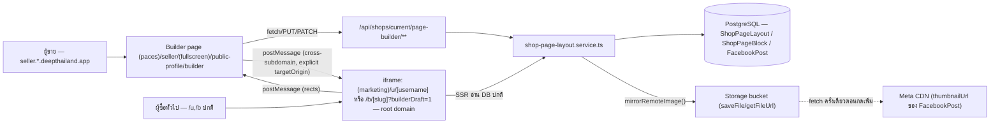
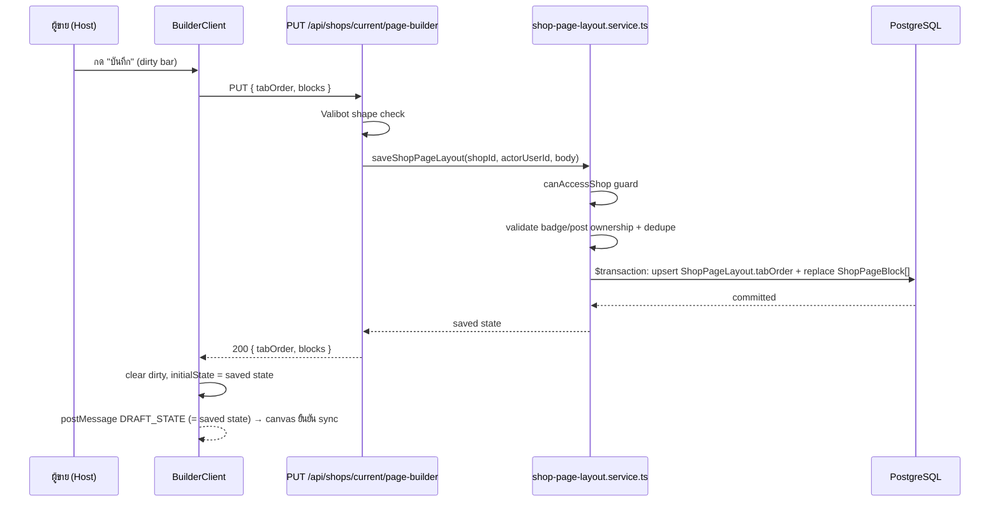

> **โมดูล:** M00035-ShopPageBuilder
> **ประเภทเอกสาร:** Software Requirements Specification (SRS) - TECHNICAL
> **เวอร์ชัน:** 1.0
> **วันที่จัดทำ:** 2026-08-07
> **สถานะ:** Draft — ต่อจาก PRD/BRD/DATABASE ที่ user review แล้ว
> **เจ้าของเอกสาร:** safepay-planner (ดู [[Feature-Docs-Ownership]])

# SRS: ตัวจัดหน้าร้าน (Shop Page Builder) — Software Requirements Specification (Technical)

---

## 1. บทนำ (Introduction)

### 1.1 วัตถุประสงค์ของเอกสาร

เอกสารนี้แปลง [[PRD]]/[[BRD]]/[[DATABASE]] ของ feature 00035 เป็นข้อกำหนดเชิงเทคนิคที่ developer ลงมือ implement ได้ทันที ผู้อ่านคือ `safepay-developer`, `safepay-reviewer`, `safepay-qa`

🛑 **เอกสารนี้ "ตัดสินให้ชัด" เรื่องที่ DATABASE.md ฝากไว้ 2 จุด (ห้ามข้าม):**

1. **FR-PGB-04 (BRD) ต้องอ่านใหม่ทั้งหมด** — ข้อความ AC เดิม ("ร้าน LODGING เห็นบล็อก 'ห้องพัก'/'ปฏิทินวันว่าง' เท่านั้น", "บล็อกที่เพิ่มไปแล้วแสดงป้าย 'เพิ่มแล้ว'") เขียนขึ้นก่อนมติปิดข้อ 1 (2026-08-07) โดยสมมติว่า "บล็อกโครงหน้า" (ห้องพัก/ปฏิทิน/บริการ/สินค้า) เป็น entity แบบเดียวกับ `ShopPageBlock` ที่กดปุ่มบวกเพิ่ม/ลบได้ทีละใบ — **ไม่จริงอีกต่อไป**
   หลังมติ: บล็อกโครงหน้าทั้ง 4 ชนิด **ยังเป็นแท็บอัตโนมัติเหมือนวันนี้ทุกประการ** (`ShopProfile.tsx` ตัดสินเองว่าแท็บไหน render จากข้อมูลจริงที่มี — เพิ่ม/ลบไม่ได้เลย ไม่มีปุ่มบวก ไม่มีตัวแทนใน DB) สิ่งที่ผู้ขาย "จัด" ได้กับกลุ่มนี้มีอย่างเดียวคือ **ตำแหน่งของแท็บในแถบแท็บ** ผ่าน `ShopPageLayout.tabOrder` — TFR-002/TFR-006 ด้านล่างคือคำนิยามที่ถูกต้องแทน FR-PGB-04
2. **FR-PGB-10 (BRD) ก็เขียนขึ้นก่อนมติเดียวกัน และมีปัญหาเดียวกัน** — AC เดิมบรรยาย "ลากรีวิว/คะแนน/สถิติออเดอร์ออกจาก canvas → ปฏิเสธตั้งแต่เริ่มลาก" ราวกับ 3 อย่างนี้เป็นบล็อกเดี่ยวที่ลากออกจาก canvas ได้ (ภาพจาก mockup ฉบับ single-column feed ที่ถูกปฏิเสธ) ภายใต้ schema จริง:
   - "คะแนนความน่าเชื่อถือ/ป้ายยืนยันตัวตน/สถิติออเดอร์" เป็นส่วนหนึ่งของ**หัวโปรไฟล์ที่ตรึงตายตัว** (ไม่เคยเป็น entity แยกที่ลากได้ตั้งแต่แรก — ไม่ต้องมี guardrail ปฏิเสธการลากเพราะไม่มีจุดให้จับลากอยู่แล้ว)
   - "รีวิว" คือหนึ่งใน **7 tab key** ของ `tabOrder` — reorder ได้ (ลากสลับตำแหน่งแถวในแถบแท็บของ library panel) แต่ **UI ไม่มีปุ่ม/ท่าทาง "นำแท็บออก" ให้เลยตั้งแต่ต้น** (`tabOrder` เป็นแค่ลำดับ ไม่ใช่ allow/deny-list — ลบทางไหนก็ไม่ได้เพราะไม่มีกลไกลบ) guardrail ของกลุ่มนี้จึงเป็น **"ไม่มี UI ให้ลบ" ไม่ใช่ "มี UI ลบแล้วปฏิเสธ"**
   - guardrail แบบ "ลากออกแล้วถูกปฏิเสธกลางอากาศ + overflow menu นำออก + `pacesConfirm.danger`" (FR-PGB-10 AC ข้อ 3) ใช้ได้จริงกับกลุ่มเดียวเท่านั้นคือ **บล็อกเหนือแถบแท็บที่นำออกได้จริง** (`BADGE_HIGHLIGHT`, `FACEBOOK_POST`) — ดู TFR-005/TFR-007

   สรุปให้ developer: **มีกลไก "ลาก" อยู่ 2 พื้นที่ที่เป็นอิสระจากกัน** (1) แถวแท็บใน library panel — ลากสลับลำดับได้เท่านั้น ไม่มีปุ่มลบ (2) บล็อกเหนือแถบแท็บใน canvas overlay — ลากสลับลำดับได้ + มีปุ่มนำออกใน `⋮` overflow menu (ไม่ใช่ลากออกนอกพื้นที่) ทั้งสองพื้นที่ **ไม่มีการลากข้ามกัน**

### 1.2 ขอบเขตเชิงระบบ (System Scope)

**อยู่ในขอบเขต:**
- หน้าใหม่ `src/app/(paces)/seller/(fullscreen)/public-profile/builder/page.tsx` (desktop-only) — 3 คอลัมน์: คลัง / canvas (iframe ของ `/u`,`/b`) / พรีวิว (Paces-native, ไม่ใช่ iframe)
- แก้ `src/app/(marketing)/u/[username]/page.tsx`, `src/app/(marketing)/b/[slug]/page.tsx`, `src/views/pages/user-profile/v2/ShopProfile.tsx` ให้อ่าน `tabOrder` + render บล็อกเหนือแถบแท็บ
- โหมด "builder draft" บน `/u`,`/b` (query param) — รับ draft state จาก host ผ่าน `postMessage`, ไม่ index, ไม่ cache
- gate การเผยแพร่ทั้งหน้า (`ShopPageLayout.isPublished`) ที่ทั้ง `/u`,`/b` server-side และปุ่มสวิตช์ 2 จุด (builder desktop + `/public-profile` มือถือ)
- service layer: `src/services/shop-page-layout.service.ts` (ใหม่)
- API: 4 endpoint ใหม่ใต้ `/api/shops/current/page-builder/**`
- แก้ `src/app/(paces)/seller/(dashboard)/public-profile/page.tsx` (มือถือ) — เพิ่มปุ่ม "จัดหน้าร้าน" + การ์ดสวิตช์เผยแพร่ + แบนเนอร์อธิบาย desktop-only
- refactor: ดึงตรรกะ "แท็บไหนมีข้อมูลจริง" ออกจาก `ShopProfile.tsx` เป็นฟังก์ชันล้วน reuse ได้ทั้ง SSR builder page และ public page

**นอกขอบเขต (ตาม PRD §5 — ห้ามแตะ):**
- รวม `/u`+`/b` เป็น handle เดียว (00034)
- ตัวจัดเรียงบนมือถือ (เฟสถัดไป)
- การซ่อน/ลบสัญญาณความน่าเชื่อถือหลักรายส่วน
- แก้เนื้อหาต้นทาง (สินค้า/ห้องพัก/โพสต์) จากในตัวจัดหน้าร้าน
- บล็อกจากแพลตฟอร์มอื่นเป็นเนื้อหาโพสต์ (นอกจาก Facebook)
- "บล็อกโครงหน้า" แบบเพิ่ม/ลบทีละใบ (ตัดออกตามมติข้อ 1 — ดู §1.1)

### 1.3 เอกสารอ้างอิง (References)

| เอกสาร | ความสัมพันธ์ |
|--------|-------------|
| [[PRD]] ของโมดูลนี้ | เป้าหมายธุรกิจ, personas, มติ 4 ข้อ (2026-08-07) |
| [[BRD]] ของโมดูลนี้ | FR-PGB-01..16, BR-PGB-01..12, Use Case Scenarios |
| [[DATABASE]] ของโมดูลนี้ | schema ล็อกแล้ว (`ShopPageLayout`, `ShopPageBlock`, `FacebookPost` +2 col), open questions ที่ SRS/SDS นี้ต้องปิด |
| `docs/conventions/seller-action-placement.md` §5.1 | บทเรียน full-screen ซ่อน bottom nav → FAB หาย — ใช้ตรวจ `(fullscreen)` layout ของ feature นี้ไม่ให้ซ้ำรอย |
| `docs/conventions/paces-toast.md` | toast ใน builder (Paces) ต้องใช้ `pacesToast` |
| `docs/conventions/scroll-container-clips-popovers.md` | library panel เป็น scroll container — ระวังเวลามี dropdown/overlay ซ้อน |
| `src/lib/csrf-origin.ts` | reuse `isAllowedOrigin()` เป็นตัวตรวจ origin ของ `postMessage` (ดู TFR-008) |

### 1.4 นิยามและตัวย่อ (Definitions & Acronyms)

| คำ/ตัวย่อ | ความหมาย |
|-----------|----------|
| **Canvas** | คอลัมน์กลางของ builder — `<iframe>` ที่ load route จริง (`/u/[username]` หรือ `/b/[slug]`) ด้วย query param พิเศษ |
| **Host** | หน้า builder เอง (`seller.*` subdomain, Paces) — ผู้ควบคุม `<iframe>` |
| **Draft state** | สถานะที่ยังไม่บันทึก เก็บเป็น React state ฝั่ง Host เท่านั้น (ไม่มีตาราง DB — DATABASE §6) |
| **Page block** | 1 แถวใน `ShopPageBlock` — มี 2 ชนิด: `BADGE_HIGHLIGHT`, `FACEBOOK_POST` |
| **Tab key** | หนึ่งใน 7 ค่าคงที่ (`pinned`,`rooms`,`calendar`,`services`,`items`,`about`,`reviews`) ที่ `tabOrder` เก็บลำดับ |
| **Builder draft mode** | โหมดของ `/u`,`/b` เมื่อถูก embed เป็น canvas — เปิดด้วย query param, รับ override จาก `postMessage`, ไม่ index/cache |
| **Visible tab keys** | เซตย่อยของ 7 tab key ที่ "มีข้อมูลจริงจนจะ render" สำหรับร้านหนึ่ง ๆ (คำนวณจาก vertical + ข้อมูลจริง เหมือนตรรกะเดิมใน `ShopProfile.tsx`) |

---

## 2. ภาพรวมสถาปัตยกรรม (Architecture Overview)

### 2.1 บริบทระบบ (System Context)



**หมายเหตุสำคัญ — แก้ความเข้าใจผิดจาก PRD/mockup:** PRD §4.3 เขียนว่า "same-origin iframe ใช้ได้" — ประโยคนี้ตรวจถูกแค่เรื่อง **framing** (ไม่มี `X-Frame-Options`/`frame-ancestors` บล็อกการฝัง) เท่านั้น ไม่ได้แปลว่า Host กับ Canvas เป็น origin เดียวกันจริง ๆ — **Host อยู่ subdomain `seller.*` ส่วน Canvas (`/u`,`/b`) อยู่ root domain** ทั้งสองเป็นคนละ origin ตาม browser same-origin policy (subdomain ต่างกัน = origin ต่างกัน) `postMessage` ระหว่างสองฝั่งนี้จึงเป็น **cross-origin โดยธรรมชาติ** (ซึ่ง `postMessage` ถูกออกแบบมาให้ทำแบบนี้ได้อยู่แล้วอย่างปลอดภัยถ้าตรวจ `origin`/`targetOrigin` ถูกต้อง — ดู TFR-008) ห้ามเข้าใจผิดว่า "same-origin" แล้วข้ามการตรวจ origin ของ message

### 2.2 องค์ประกอบหลัก (Components)

| Component | หน้าที่ | Submodule / Stack |
|-----------|---------|-------------------|
| **BuilderPage** (`(fullscreen)/public-profile/builder/page.tsx`) | Server Component — resolve active shop + guard สิทธิ์ + SSR initial draft state (layout+blocks+visible tab keys) | Next.js 16 App Router (Paces) |
| **BuilderClient** (`components/BuilderClient.tsx`) | Client Component ถือ draft state ทั้งหมด (`useState`), คำนวณ dirty, ส่ง postMessage, เรียก API ตอน save | React client (Paces, no MUI) |
| **LibraryPanel** | คอลัมน์ซ้าย — แสดง badge/facebook post ที่เพิ่มได้ + แถวแท็บที่ลากสลับลำดับได้ | Client (Paces) |
| **CanvasFrame** | คอลัมน์กลาง — `<iframe>` + overlay layer (chrome/tool/dropline) วาดจาก rects ที่ได้จาก postMessage | Client (Paces) |
| **PreviewPanel** | คอลัมน์ขวา — re-representation แบบ Paces-native (ไม่ใช่ iframe ไม่ต้อง pixel-perfect Vuexy) | Client (Paces) |
| **BuilderPreviewBridge** (`views/pages/user-profile/v2/BuilderPreviewBridge.tsx`) | Client wrapper บน `/u`,`/b` — เปิดใช้เฉพาะเมื่อ `builderDraft=1`: ฟัง postMessage draft override + ส่ง rects กลับ | Client (Vuexy) — mount เฉพาะกรณี embed |
| **shop-page-layout.service.ts** | อ่าน/เขียน `ShopPageLayout`+`ShopPageBlock`, mirror facebook post, resolve library data | Service layer → Prisma → PostgreSQL |
| **API routes** (`/api/shops/current/page-builder/**`) | Auth guard + Valibot + เรียก service | Next.js Route Handler (nodejs runtime) |

### 2.3 มุมมองการ Deploy (Deployment View)

ไม่มี infra ใหม่ — รันบน Vercel เดิม (Next.js 16, single deployment ครอบทุก subdomain ผ่าน `src/proxy.ts`) DB คือ Postgres/Supabase เดิม ไม่มี store ใหม่ ไม่มี service แยก (ทุกอย่างอยู่ใน monolith เดิม)

---

## 3. ข้อกำหนดเชิงฟังก์ชันเชิงเทคนิค (Technical Functional Requirements)

### TFR-001: Route + สิทธิ์เข้าถึง builder
- **Trace to:** FR-PGB-01, FR-PGB-16
- **คำอธิบายเชิงเทคนิค:** `page.tsx` เป็น Server Component; เรียก `getServerSession(authOptions)` → `requireActiveShop(session)` (`src/lib/shop-context.ts:118`) เพื่อ resolve shop ที่ active — **ไม่ต้องเช็ค role แยกอีกชั้น** เพราะยืนยันแล้วว่า `ShopMember.role` มีแค่ 2 ค่า (`OWNER`/`ADMIN`, `prisma/schema.prisma:1013`) และ `requireActiveShop` re-verify membership เสมอ (defense-in-depth มีอยู่แล้ว) — การเข้าถึงหน้านี้จึงเทียบเท่า "เข้าถึง shop นี้ได้" ล้วน ๆ ไม่มี role ระดับสามที่ต้องกันออก
- **Precondition:** ผ่าน `(paces)/seller` auth guard เดิม (layout เดิม), shop มี `slug` แล้ว (ผ่าน onboarding — ตาม PRD assumption 9.2)
- **Postcondition:** SSR ส่ง initial draft state ครบชุดลง `BuilderClient` เป็น prop เดียว ไม่มี client-side fetch ซ้ำตอน mount
- **Error / Edge cases:** ไม่มี active shop (`!active?.shop`) → `redirect('/dashboard')` (ตาม pattern เดิมของหน้า seller อื่นที่ guard แล้วไม่มี shop); shop ยังไม่มี `slug` → `redirect('/onboarding')` (ผ่าน middleware เดิมอยู่แล้วจริง ๆ แต่ defensive check ซ้ำในหน้านี้เพราะ deep-link ตรงเข้ามาได้)

### TFR-002: คำนวณ "visible tab keys" ของร้าน (SSOT ใหม่ที่ต้อง refactor)
- **Trace to:** FR-PGB-04 (ตีความใหม่ตาม §1.1), BR-PGB-04
- **คำอธิบายเชิงเทคนิค:** ดึงตรรกะการตัดสิน "แท็บไหนจะ render จริง" ที่ปัจจุบันฝังอยู่ใน JSX ของ `ShopProfile.tsx` (บรรทัด 60-153, เงื่อนไข `data.videos.length>0`/`data.isLodging && data.rooms.length>0`/ฯลฯ) ออกมาเป็นฟังก์ชันล้วน (pure function) ในไฟล์ใหม่ **ไม่มี `'use client'`** เพื่อให้ทั้ง Server Component (builder page, SSR) และ Client Component (`ShopProfile.tsx`) import ได้โดยไม่ติดปัญหา RSC boundary:

  ```ts
  // src/lib/profile-tab-keys.ts (ใหม่ — ไม่ใช่ 'use client')
  export const PROFILE_TAB_KEYS = ['pinned','rooms','calendar','services','items','about','reviews'] as const
  export type ProfileTabKey = typeof PROFILE_TAB_KEYS[number]

  export function computeVisibleTabKeys(input: {
    hasVideos: boolean
    isLodging: boolean
    hasRooms: boolean
    hasAvailability: boolean
    isServiceQueue: boolean
    hasServices: boolean
    hasItems: boolean       // !isLodging && (pinned+other products) > 0
    hasReviews: boolean     // ratingDistribution && avgRating != null
  }): ProfileTabKey[]
  ```
  `ShopProfile.tsx` เปลี่ยนจาก inline conditional array เป็นเรียก `computeVisibleTabKeys()` แล้ว map เป็น tab object เดิม (label/content ไม่เปลี่ยน) — **ผลลัพธ์ต้องเหมือนเดิม 100% กับพฤติกรรมปัจจุบัน** (นี่คือ refactor ล้วน ไม่ใช่เปลี่ยน behavior)
  Builder page (`BuilderPage`, Server Component) เรียกฟังก์ชันเดียวกันนี้ด้วยข้อมูลจริงของ shop ที่กำลังแก้ เพื่อรู้ว่า library panel ต้องแสดงแถวแท็บอะไรบ้าง (เฉพาะที่ visible จริง — ไม่โชว์แท็บ "ห้องพัก" ให้ร้าน ONLINE_SALES)
- **Precondition:** ข้อมูลที่ป้อนเข้า (`hasRooms`/`hasVideos`/ฯลฯ) ต้อง query ชุดเดียวกับที่ `/u`,`/b` page ใช้จริง (reuse service call เดิม ไม่ query ซ้ำเงื่อนไขคนละที่)
- **Postcondition:** `visibleTabKeys` ที่ builder page ได้ต้องตรงกับแท็บที่ `/u`,`/b` จะ render จริงเป๊ะ ๆ เสมอ (ไม่มี drift)
- **Error / Edge cases:** ร้านที่ยังไม่มีแท็บใดเลย (shop ใหม่ vertical ONLINE_SALES ไม่มีสินค้า ไม่มีรีวิว ไม่มีคลิป) → `visibleTabKeys` มีแค่ `['about']` เสมอ (about ไม่มีเงื่อนไข, render เสมอ) — library panel ต้องไม่ crash เมื่อมีแท็บเดียว (drag reorder กับ list 1 รายการ = no-op)

### TFR-003: `ShopPageLayout.tabOrder` — reorder-only, ไม่มี allow/deny list
- **Trace to:** BRD §7.1 คำถาม #2 → มติข้อ 1, BR-PGB-04 (ตีความใหม่)
- **คำอธิบายเชิงเทคนิค:** `tabOrder: string[]` เก็บเฉพาะ **ลำดับของ key ที่ user เคยจัด** ไม่ใช่ full list เสมอ (ร้านอาจไม่เคยแตะเลย = `[]`, หรือจัดแค่บางส่วน) การเรียงจริงที่ใช้ตอน render (`applyTabOrder`):
  1. เริ่มจาก `visibleTabKeys` (TFR-002)
  2. เรียงตาม `tabOrder`: key ใน `tabOrder` ที่ **ปรากฏใน** `visibleTabKeys` มาก่อนตามลำดับที่ระบุ
  3. key ใน `visibleTabKeys` ที่ **ไม่ปรากฏ** ใน `tabOrder` เลย (ร้านยังไม่เคยจัด หรือแท็บเพิ่งมีข้อมูลใหม่หลังจัดครั้งล่าสุด) ต่อท้ายด้วยลำดับเดิม (ลำดับ default ของระบบ ตาม `PROFILE_TAB_KEYS` array)
  4. key ใน `tabOrder` ที่**ไม่ปรากฏ**ใน `visibleTabKeys` (key แปลกปลอม/แท็บที่เคยมีข้อมูลแล้วหายไป) **ถูกข้ามเงียบ ๆ ไม่ error ไม่ crash**

  ```ts
  export function applyTabOrder(visible: ProfileTabKey[], tabOrder: string[]): ProfileTabKey[] {
    const known = new Set(visible)
    const ordered = tabOrder.filter((k): k is ProfileTabKey => known.has(k as ProfileTabKey))
    const remaining = visible.filter((k) => !ordered.includes(k))
    return [...ordered, ...remaining]
  }
  ```
- **Precondition:** `visible` มาจาก TFR-002 เสมอ (ไม่ trust `tabOrder` เป็นแหล่ง "แท็บไหนมีอยู่")
- **Postcondition:** ผลลัพธ์เป็น permutation ของ `visible` เสมอ — **ความยาว array เท่าเดิมเป๊ะ ไม่มีทางลบแท็บออกได้จากฟังก์ชันนี้** (invariant ที่ทดสอบได้ตรง ๆ: `applyTabOrder(v, anything).length === v.length` และ `new Set(applyTabOrder(v, x))` เท่ากับ `new Set(v)` เสมอ)
- **Error / Edge cases:** `tabOrder` มี duplicate key → `ordered` ได้ key แรกที่เจอ (filter ไม่ dedupe เอง — ต้อง `[...new Set(...)]` ก่อน filter); `tabOrder` เป็น `[]` → คืน `visible` เดิมเป๊ะ (zero-regression ตาม DATABASE §5.3)

### TFR-004: `ShopPageLayout.isPublished` — publish gate ที่ `/u`,`/b`
- **Trace to:** FR-PGB-14, BR-PGB (§2.5 PRD)
- **คำอธิบายเชิงเทคนิค:** เพิ่มขั้นตอนก่อน render `ShopProfile` ใน `page.tsx` ทั้งสองเส้นทาง:
  ```ts
  const layout = await getShopPageLayout(shop.id) // { isPublished, tabOrder } — fallback isPublished:true, tabOrder:[] เมื่อไม่มีแถว (DATABASE §3.1)
  const canManage = await canAccessShop(shop.id, viewerId ?? '') // false ถ้า viewerId เป็น null
  const showRealContent = layout.isPublished || canManage
  if (!showRealContent) return <ProfileUnavailable shopName={...} /> // HTTP 200, ไม่ใช่ 404 — ดู TD-002 ใน SDS
  ```
  `canAccessShop` (`src/lib/shop-context.ts:25`) คืน `true` ทั้งเจ้าของและ `ShopMember` — reuse ตรง ๆ ไม่ต้องเขียน logic สิทธิ์ใหม่
- **Precondition:** `viewerId` ต้อง resolve จาก session ก่อนเรียก (ทั้งสองหน้ามี `getServerSession` อยู่แล้ว — `/u/[username]/page.tsx:63`, ส่วน `/b/[slug]/page.tsx` **ยังไม่มี session read เลยตอนนี้ — ต้องเพิ่ม**)
- **Postcondition:** ผู้ซื้อทั่วไปที่ไม่ใช่เจ้าของ/ทีมงาน เห็น `ProfileUnavailable` เมื่อ `isPublished=false`; เจ้าของ/ทีมงานเห็นเนื้อหาจริงเสมอไม่ว่าสถานะเผยแพร่จะเป็นอะไร (ตรวจสอบก่อนเปิดใหม่ได้ — FR-PGB-14 AC ข้อ 3)
- **Error / Edge cases:** ร้านที่ไม่เคยมีแถว `ShopPageLayout` เลย (ยังไม่เคยกดบันทึกตัวจัดหน้าร้าน) → `getShopPageLayout` คืน fallback `{isPublished:true, tabOrder:[]}` **เสมอ** ห้าม throw/return null (zero-regression — DATABASE §3.1 เตือนไว้ตรง ๆ)

### TFR-005: บล็อกเหนือแถบแท็บ — render + fail-safe filtering
- **Trace to:** FR-PGB-06, FR-PGB-05, BR-PGB-06, BR-PGB-05, D-9/D-10, DATABASE §3.2
- **คำอธิบายเชิงเทคนิค:** service function `listShopPageBlocks(shopId): Promise<PageBlockView[]>` query `ShopPageBlock` เรียง `sortOrder` แล้ว hydrate ตามชนิด:
  - `BADGE_HIGHLIGHT`: `prisma.userBadge.findMany({ where: { id: { in: block.badgeIds }, badge: { type: 'ACHIEVEMENT' } }, include: { badge: true } })` แล้ว **เรียงผลลัพธ์กลับตามลำดับเดิมใน `block.badgeIds`** (query `in` ไม่รับประกันลำดับ) — id ที่ query ไม่เจอ (ถูกถอด/ไม่ใช่ ACHIEVEMENT) **หลุดออกจากผลลัพธ์เงียบ ๆ** ไม่ error
  - `FACEBOOK_POST`: `include: { facebookPost: true }` — ถ้า `facebookPost` เป็น `null` (ตามทฤษฎีไม่ควรเกิดเพราะ FK เป็น `Cascade` แต่ defensive เผื่อ race) **ข้ามแถวนั้นทั้งแถวเงียบ ๆ**
  - ภาพ resolve: `imageUrl = facebookPost.mirroredFileId ? getFileUrl(facebookPost.mirroredFileId) : facebookPost.thumbnailUrl` (mirror-first fallback — ดู TFR-006)
- **Precondition:** ไม่มี
- **Postcondition:** ผลลัพธ์ไม่มีทาง throw จาก dangling reference ใด ๆ — เพจ public พังไม่ได้จากข้อมูล page block ที่ผิดปกติ (ตาม BRD §3.6 mindset "หน้าร้านไม่พัง")
- **Error / Edge cases:** `badgeIds` ว่างเปล่า (`[]`) บนแถว `BADGE_HIGHLIGHT` (ทุก badge ที่เคยเลือกถูกถอดหมด) → แถวนี้ไม่ render อะไรเลย (ทั้งบล็อกหาย เพราะไม่มีเหรียญให้โชว์) — ไม่ใช่ error แค่ empty state เงียบ ๆ

### TFR-006: Mirror รูปโพสต์ Facebook ตอนกดเพิ่ม (ไม่ใช่ตอนบันทึก)
- **Trace to:** BRD §7.1 คำถาม #1 → มติข้อ 2, DATABASE §3.3, §6 "Mirror storage failure"
- **คำอธิบายเชิงเทคนิค:** `mirrorFacebookPostForBuilder(shopId, actorUserId, facebookPostId)`:
  1. `canAccessShop` guard → throw `FORBIDDEN`
  2. โหลด `FacebookPost` join `channel.shopId === shopId` → ไม่ match throw `POST_NOT_OWNED`
  3. ถ้า `mirroredFileId` มีค่าอยู่แล้ว → คืนทันที (idempotent, ไม่เรียก mirror ซ้ำ — DATABASE §3.3 "เช็ค `mirroredFileId IS NULL` ก่อนเรียก mirror ทุกครั้ง")
  4. ถ้า `thumbnailUrl` เป็น `null` (โพสต์ไม่มีรูป เช่นโพสต์ข้อความล้วน) → ข้าม mirror ไปเลย คืน `{ mirroredFileId: null, imageUrl: null, mirrored: false }` (ไม่ใช่ error — โพสต์แบบนี้ยังเพิ่มเป็นบล็อกได้ แค่ไม่มีรูปประกอบ ใช้ placeholder icon)
  5. เรียก `mirrorRemoteImage(thumbnailUrl)` (`src/services/channel-chat.service.ts:381` — **ห้ามเขียนใหม่** ตามมติ user 2026-08-07 ข้อ 2) คืน `fileId | null`
  6. `fileId` ไม่ null → `prisma.facebookPost.update({ mirroredFileId: fileId, mirroredAt: now })`, คืน `{ mirroredFileId: fileId, imageUrl: getFileUrl(fileId), mirrored: true }`
  7. `fileId` เป็น `null` (mirror ล้ม — host ไม่อยู่ allow-list/ใหญ่เกิน/network error) → **ไม่ throw ไม่ block การเพิ่มบล็อก** คืน `{ mirroredFileId: null, imageUrl: thumbnailUrl, mirrored: false }` (fallback ใช้ URL ของ Meta ชั่วคราว — decision เต็มอยู่ที่ SDS TD-004)
- **Precondition:** endpoint นี้เรียกตอนผู้ใช้กด "+" ในคลัง (ก่อน Save) — **ไม่ persist `ShopPageBlock` ใด ๆ** เขียนแค่ `FacebookPost.mirroredFileId`/`mirroredAt` ซึ่งไม่กระทบหน้า public ที่กำลังแสดงผลอยู่ (คนละ table จาก `ShopPageBlock`) จึงไม่ละเมิด BR-PGB-10 "ร่างไม่กระทบของจริงจนกว่าจะบันทึก"
- **Postcondition:** เรียกซ้ำกี่ครั้งก็ได้ผลเดียวกัน (idempotent) — ปุ่ม "+" กดซ้ำไม่ mirror ซ้ำ ไม่เปลือง quota
- **Error / Edge cases:** `mirror` ล้มซ้ำ ๆ ทุกครั้งที่เปิด builder ใหม่ (เช่น Meta CDN link หมดอายุจริงแล้ว 404) → ทุกครั้งที่ endpoint นี้ถูกเรียกจะ retry mirror ใหม่เสมอ (เพราะ `mirroredFileId` ยังเป็น `null`) จนกว่าจะสำเร็จหรือ user เลิกใช้โพสต์นั้น — ไม่มี backoff/circuit-breaker ในเฟสนี้ (ความถี่จำกัดโดยธรรมชาติ: user ต้องเปิด builder + กด "+" เอง ไม่ใช่ automated loop)

### TFR-007: บันทึกผัง (Save) — replace-all แบบ transaction เดียว
- **Trace to:** FR-PGB-08, FR-PGB-09, FR-PGB-10 (ตีความใหม่), FR-PGB-13, BR-PGB-03/05/06/08/09
- **คำอธิบายเชิงเทคนิค:** `saveShopPageLayout(shopId, actorUserId, { tabOrder, blocks })`:
  1. `canAccessShop` guard → `FORBIDDEN`
  2. `blocks` ต้องมี `type='BADGE_HIGHLIGHT'` ไม่เกิน 1 รายการ → เกิน throw `TOO_MANY_BADGE_BLOCKS`
  3. รายการ `BADGE_HIGHLIGHT` (ถ้ามี): `badgeIds` ทุกตัวต้อง resolve เป็น `UserBadge` ที่เป็นของ shop/user นี้จริง **และ** `badge.type==='ACHIEVEMENT'` — ตัวไหนไม่ผ่าน throw `BADGE_NOT_OWNED` (pattern เดียวกับ `replaceShopVideos` — "UI ที่ให้เลือกอย่างเดียวไม่ใช่การป้องกัน")
  4. รายการ `FACEBOOK_POST` ทุกแถว: `facebookPostId` ต้องเป็นโพสต์ที่ `channel.shopId === shopId` จริง → ไม่ match throw `POST_NOT_OWNED`; ห้ามซ้ำกันภายใน request เดียว → ซ้ำ throw `DUPLICATE_FACEBOOK_POST`
  5. Transaction เดียว (`prisma.$transaction`):
     - `upsert ShopPageLayout` เฉพาะ field `tabOrder` (ไม่แตะ `isPublished` — คนละ endpoint, ดู TFR-009)
     - `deleteMany ShopPageBlock where shopId` แล้ว `createMany` ใหม่ทั้งชุดตามลำดับ array (`sortOrder = index`) — pattern เดียวกับ `replaceShopVideos`
  6. คืนสถานะที่บันทึกแล้ว (ไม่ใช่ echo request ดิบ — คืนค่าที่ query กลับจาก DB จริงเพื่อยืนยัน)
- **Precondition:** request ผ่าน Valibot shape validation แล้ว (route layer — ดู [[API]] §4)
- **Postcondition:** `/u`,`/b` ที่ query ใหม่ (ไม่ cache) เห็นผลทันที (FR-PGB-13); ไม่มี partial-write (transaction เดียวกันทั้งก้อน — save ล้มแล้ว DB ไม่มีทางค้างครึ่ง ๆ)
- **Error / Edge cases:** สอง tab พร้อมกันกด save พร้อมกัน (race บน partial unique index `(shopId, facebookPostId) WHERE type='FACEBOOK_POST'`) → Prisma throw `P2002` → route ต้อง catch แล้วแปลเป็น `DUPLICATE_FACEBOOK_POST` เดียวกัน (ไม่ปล่อย 500 ดิบ — ดู §4.2 error mapping)

### TFR-008: สัญญา `postMessage` ระหว่าง Host กับ Canvas
- **Trace to:** FR-PGB-07, D-2, D-3, BRD §6.4 (ความปลอดภัย)
- **คำอธิบายเชิงเทคนิค:** protocol 2 message type (ดูรายละเอียดเต็มใน [[SDS]] §4 + sequence diagram):
  1. `DEEP_BUILDER_DRAFT_STATE` (Host → Canvas) — ส่งทุกครั้งที่ draft เปลี่ยน + ทันทีที่ `<iframe onLoad>` ยิง
  2. `DEEP_BUILDER_BLOCK_RECTS` (Canvas → Host) — ส่งตอบกลับทุกครั้งที่ได้รับ `DRAFT_STATE` และทุกครั้งที่ `ResizeObserver`/`scroll`/`resize` ของตัวเอง trigger (throttle ผ่าน `requestAnimationFrame`)
  - **origin validation ทั้งสองฝั่ง: reuse `isAllowedOrigin()` จาก `src/lib/csrf-origin.ts:13`** (function เดิม ไม่มี `server-only`, import เข้า client component ได้ตรง ๆ) — ปฏิเสธ message ที่ `event.origin` ไม่ผ่าน allowlist ทันที ไม่ประมวลผลต่อ
  - **targetOrigin ห้ามเป็น `'*'` ทั้งสองทาง** — Host คำนวณจาก `new URL(iframeSrc).origin` (รู้อยู่แล้วเพราะเป็นคนตั้ง `src`); Canvas ตอบกลับด้วย `event.source.postMessage(msg, event.origin)` เสมอ (ตอบ sender ที่ validate แล้วเท่านั้น ไม่เดา origin เอง)
- **Precondition:** iframe `src` ต้องเป็น absolute URL ข้าม subdomain (`https://{rootHost}/u/{username}?builderDraft=1`) — คำนวณด้วย pattern เดียวกับที่ `public-profile/page.tsx:37-39` ใช้อยู่แล้ว (`host.replace(/^seller\./, '')`)
- **Postcondition:** message จาก origin ที่ไม่อยู่ใน allowlist ถูกทิ้งเงียบ ๆ ไม่มีผลใด ๆ ต่อ state
- **Error / Edge cases:** iframe ยังโหลดไม่เสร็จตอน Host ส่ง `DRAFT_STATE` ครั้งแรก (ก่อน `onLoad`) → Host ส่งซ้ำอีกครั้งตอน `onLoad` ยิงเสมอเป็น "final source of truth" ครั้งแรก (ดักกรณี race ระหว่าง mount)

### TFR-009: สลับเผยแพร่ (publish toggle) — endpoint แยกจาก Save
- **Trace to:** FR-PGB-14
- **คำอธิบายเชิงเทคนิค:** `setShopPagePublished(shopId, actorUserId, isPublished)` — `upsert` เฉพาะ field `isPublished` (ไม่แตะ `tabOrder`) แยกจาก `saveShopPageLayout` โดยตั้งใจ **เหตุผล:** ป้องกัน session ที่เปิด builder ค้างไว้นานแล้วกด "บันทึก" เขียนทับ `isPublished` ด้วยค่าเก่าที่ค้างอยู่ใน draft state ของตัวเอง ทับค่าที่อีก session (เช่นมือถือ) เพิ่งสลับไป — endpoint แยกทำให้ toggle เป็น atomic operation ที่ไม่ผูกกับ draft lifecycle ของหน้าจอไหนเลย ใช้ endpoint เดียวกันได้ทั้ง desktop builder toolbar และ `/public-profile` มือถือ (FR-PGB-14 AC "สถานะสวิตช์ sync กันระหว่างสองจุด")
- **Precondition:** `canAccessShop` guard
- **Postcondition:** เปลี่ยนผลทันที ไม่มี debounce/batch
- **Error / Edge cases:** ไม่มีแถว `ShopPageLayout` มาก่อน → `upsert` สร้างแถวใหม่ด้วย `tabOrder: []` (ไม่ทำลายอะไร เพราะยังไม่มีใครกำหนด tabOrder อยู่แล้ว)

---

## 4. ข้อกำหนดส่วนต่อประสาน (Interface / API Specification)

### 4.1 API Endpoints

| Method | Path | คำอธิบาย | Auth |
|--------|------|----------|------|
| `GET` | `/api/shops/current/page-builder/library` | รายการโพสต์ Facebook + เหรียญ ACHIEVEMENT ที่เพิ่มได้ | Session + `canAccessShop` |
| `POST` | `/api/shops/current/page-builder/facebook-posts/mirror` | mirror รูปโพสต์ตอนกด "+" | Session + `canAccessShop` |
| `PUT` | `/api/shops/current/page-builder` | บันทึกผัง (`tabOrder`+`blocks`) แบบ replace-all | Session + `canAccessShop` |
| `PATCH` | `/api/shops/current/page-builder/publish` | สลับ `isPublished` | Session + `canAccessShop` |

รายละเอียด request/response/error เต็ม → [[API]] ของโมดูลนี้ (ทุก endpoint trace กลับ TFR ในตารางนี้)

### 4.2 🛑 Cross-file error-mapping (ทุก throw ต้องมี route catch)

| Service throw | เกิดที่ (service fn) | Route ที่ต้อง catch | HTTP + error code |
|---|---|---|---|
| `FORBIDDEN` | ทั้ง 4 service fn (§3 TFR-006/007/009 + library query) | ทั้ง 4 route | `403 FORBIDDEN` |
| `POST_NOT_OWNED` | `mirrorFacebookPostForBuilder`, `saveShopPageLayout` | `POST .../mirror`, `PUT /page-builder` | `403 NOT_OWNED` |
| `BADGE_NOT_OWNED` | `saveShopPageLayout` | `PUT /page-builder` | `403 NOT_OWNED` |
| `TOO_MANY_BADGE_BLOCKS` | `saveShopPageLayout` | `PUT /page-builder` | `400 VALIDATION_ERROR` |
| `DUPLICATE_FACEBOOK_POST` | `saveShopPageLayout` | `PUT /page-builder` | `409 CONFLICT` |
| Prisma `P2002` (partial unique index race — DATABASE §4) | `saveShopPageLayout` transaction | `PUT /page-builder` (catch แยกจาก throw ข้างบน — เป็น DB-level ไม่ใช่ app-level) | `409 CONFLICT` (แปลงเป็น `DUPLICATE_FACEBOOK_POST` message เดียวกัน) |
| Valibot parse fail (shape) | ทุก route ที่มี body | ทุก route ที่มี body | `400 VALIDATION_ERROR` |

**Gap-check (บังคับตาม feedback_service_error_route_mapping):** ไม่มี custom Error ตัวไหนที่ไม่มีแถวในตารางนี้ — reviewer ต้อง grep `throw new Error(` ใน `shop-page-layout.service.ts` แล้วเทียบ 1:1 กับตารางนี้ก่อน mark งานเสร็จ

### 4.3 Events / Messaging

ไม่มี queue/webhook ใหม่ — การสื่อสารแบบ real-time เดียวของ feature นี้คือ `postMessage` (TFR-008 — ดูรายละเอียดเต็มใน SDS §4)

### 4.4 Sequence ของ flow สำคัญ (บันทึกผัง)



---

## 5. ข้อกำหนดด้านข้อมูล (Data Requirements)

### 5.1 Data Model / Entities

| Entity | คำอธิบาย | Owner store |
|--------|----------|-------------|
| **ShopPageLayout** | 1:1 Shop — `isPublished` + `tabOrder` | PostgreSQL (Supabase) |
| **ShopPageBlock** | บล็อกเหนือแถบแท็บ — `BADGE_HIGHLIGHT`\|`FACEBOOK_POST` | PostgreSQL (Supabase) |
| **FacebookPost** (เดิม, +2 col) | `mirroredFileId`/`mirroredAt` | PostgreSQL (Supabase) |

Schema เต็ม + index + migration → [[DATABASE]] ของโมดูลนี้ (ล็อกแล้ว ห้ามเปลี่ยนชื่อ field/ชนิด)

### 5.2 ความสัมพันธ์ (ERD)

ดู [[DATABASE]] §2 (ERD เดียวกัน ไม่ทำซ้ำที่นี่เพื่อไม่ให้สอง diagram แยกกัน drift)

### 5.3 Migration / Data Lifecycle

Migration พร้อมใช้แล้วที่ `prisma/migrations/20260807090000_shop_page_builder/migration.sql` — **backend developer ไม่ต้องเขียน migration ใหม่** งานนี้ dispatch `safepay-database` เพิ่มเฉพาะกรณีพบว่า schema ที่ล็อกไว้ไม่พอจริง ๆ (ไม่คาดว่าจะเกิดจาก TFR ทั้งหมดข้างบน)

---

## 6. ข้อกำหนดที่ไม่ใช่ฟังก์ชัน (Non-Functional Requirements)

| ด้าน | ข้อกำหนด | เป้าหมายที่วัดได้ |
|------|----------|-------------------|
| **Performance** | ลาก/เพิ่ม/สลับใน draft ต้อง**ไม่ยิง network request** (BRD §6.2) | Save เป็น network call เดียวต่อครั้งกดบันทึก; drag reorder = 0 request |
| **Responsiveness** | `postMessage` round-trip (rects) ต้องไม่ทำให้ overlay กระตุก | throttle ด้วย `requestAnimationFrame`, ไม่เกิน 1 update/frame |
| **Availability** | ไม่มี SLA ใหม่ — ใช้ availability เดิมของ Next.js/Vercel/Supabase | ไม่มี dependency ภายนอกใหม่ (ยกเว้น Meta CDN ที่มีอยู่แล้วจาก feature 00029) |
| **Security** | postMessage ต้องตรวจ origin ทั้งสองทาง (TFR-008), guard สิทธิ์ที่ API เสมอไม่พึ่ง UI (D-9/มติข้อ 4) | reviewer grep: ทุก service fn ใหม่ต้องมี `canAccessShop`/เทียบเท่าอยู่บรรทัดแรก |
| **Observability** | Mirror ล้มเงียบ (ตาม design) — ต้อง log ระดับ `console.error` เมื่อ `mirrorRemoteImage` คืน `null` (ตาม `feedback_required_field_drops_whole_event`/pattern เดียวกับ iShip fail-silent lesson 2026-08-06) | grep `console.error` อยู่ใน branch ที่ `fileId === null` |
| **Maintainability** | Reuse `mirrorRemoteImage`, `canAccessShop`, `isAllowedOrigin`, `replaceShopVideos` pattern — ห้ามเขียนซ้ำ | reviewer grep ยืนยันไม่มี duplicate SSRF-guard/mirror logic ใหม่ |
| **Accessibility** | drag reorder ต้องมีทาง keyboard (BRD §6.5 — WCAG 2.1 AA baseline แม้ desktop-only) | ปุ่มลูกศรขึ้น/ลงข้างแต่ละแถวใน library panel เป็น alternative ต่อ drag (ไม่ใช่ drag-only) |

---

## 7. ข้อจำกัดทางเทคนิคและการพึ่งพา (Technical Constraints & Dependencies)

### 7.1 ข้อจำกัดทางเทคนิค

- Host (Paces) กับ Canvas (Vuexy) เป็นคนละ origin จริง (§2.1) — ทุก postMessage ต้องระบุ `targetOrigin`/ตรวจ `event.origin` ชัดเจน ห้าม `'*'`
- ห้าม render component จาก `views/pages/user-profile/**` (Vuexy/MUI) ตรง ๆ ใน `(paces)` tree — ทางเดียวคือ iframe (D-2)
- Drag-from-library-into-canvas เป็นไปไม่ได้ทางเทคนิค (คนละ document context) — ไม่ต้อง implement guard ปฏิเสธ เพราะไม่มี drag source ให้เริ่มลากตั้งแต่ต้น (BR-PGB-08)
- `AGENTS.md`: Next.js 16 — ก่อนแตะ route segment config (`dynamic`)/caching ของ `(marketing)/u`,`/b` ต้องยืนยัน behavior จริงกับเอกสาร Next.js ที่ติดตั้งอยู่ (`node_modules/next/dist/docs/` — worktree นี้ไม่มี `node_modules`) **ห้ามเดา** ระบุเป็น "ต้อง Explore ตอน implement" ใน §9

### 7.2 การพึ่งพาภายนอก/ภายใน

| Dependency | ประเภท | ความเสี่ยง |
|------------|--------|------------|
| **`mirrorRemoteImage()`** (`src/services/channel-chat.service.ts:381`) | internal (feature 00018) | ถ้าฟังก์ชันนี้เปลี่ยน signature ในอนาคต feature นี้พังตาม — ไม่มี versioning |
| **Meta CDN** (`FacebookPost.thumbnailUrl`) | external | URL หมดอายุได้ — คือเหตุผลที่ต้อง mirror (TFR-006) |
| **`isAllowedOrigin()`** (`src/lib/csrf-origin.ts:13`) | internal | ปกติเรียกจากฝั่ง server (CSRF) — reuse ฝั่ง client เป็นครั้งแรกของ feature นี้ ต้องยืนยันว่า bundle ได้โดยไม่ดึง server-only dependency ใด ๆ เข้ามา (ไฟล์นี้ pure function ล้วน ไม่มี import อื่น — ตรวจแล้วปลอดภัย) |
| **Storage bucket** (`saveFile`/`getFileUrl`) | internal | ประวัติ MIME/ขนาดจำกัดที่เคย fail เงียบ (`project_supabase_uploads_bucket_mime_limit`) — `mirrorRemoteImage` ผ่าน `skipValidation:true` อยู่แล้วจึงไม่ชนปัญหานี้ซ้ำ |

### 7.3 สมมติฐานทางเทคนิค (Assumptions)

- Route ของ builder = `(fullscreen)/public-profile/builder/page.tsx` ตาม PRD assumption 9.2 — **ล็อกเป็นมติของ SRS ฉบับนี้** (ตอบคำถามที่ PRD ทิ้งไว้ "ควรยืนยันตอน SDS")
- `/b/[slug]/page.tsx` ปัจจุบัน**ไม่มี** `getServerSession` เลย (ต่างจาก `/u/[username]/page.tsx`) — ต้องเพิ่มเข้าไปเพื่อรองรับ TFR-004 (publish gate ต้องรู้ viewer)
- Query param ชื่อ `builderDraft` (ไม่ใช่ `preview`) — เลือกชื่อนี้เพื่อไม่ชนกับคำว่า "preview" ที่มีความหมายอื่นอยู่แล้วในระบบ (เช่น slip preview) และสื่อความหมายตรงตัวว่า "รับ override จาก draft"

---

## 8. ความเสี่ยงเชิงสถาปัตยกรรม (Architectural Risks)

| ความเสี่ยง | ผลกระทบ | แนวทางลด |
|-----------|---------|----------|
| Origin คนละ subdomain จริง (ไม่ใช่ same-origin ตามที่ PRD เขียน) | ถ้า developer เข้าใจผิดว่า same-origin แล้วข้าม origin-check → ใครก็ฝัง iframe ของ `/u`,`/b?builderDraft=1` แล้วปลอม postMessage ได้ | บังคับ reuse `isAllowedOrigin()` ทั้งสองทาง (TFR-008) — reviewer grep `postMessage(` ทุกจุดต้องมี `isAllowedOrigin` เคียงข้างเสมอ |
| `/b/[slug]/page.tsx` ไม่เคยอ่าน session มาก่อน — เพิ่มเข้าไปอาจกระทบ static/dynamic rendering behavior เดิม | หน้าอาจเปลี่ยนจาก (potential) static เป็น dynamic เสมอ ส่งผลต่อ perf ของหน้า public ที่ traffic สูงกว่า builder มาก | วัด build output (`next build`) ก่อน/หลัง — ถ้าเคย static อยู่แล้วและเปลี่ยนเป็น dynamic ต้องแจ้ง user เป็น trade-off ชัดเจน (ไม่เงียบ) |
| Refactor `computeVisibleTabKeys`/`applyTabOrder` ออกจาก `ShopProfile.tsx` เดิม | เสี่ยง regression พฤติกรรมแท็บที่ใช้งานจริงอยู่แล้วบน prod (ผ่าน sign-off 2026-07-26) | Reviewer ต้อง diff behavior ก่อน/หลัง refactor ด้วยชุดทดสอบ manual (ทุก vertical × มี/ไม่มีข้อมูลแต่ละแท็บ) — ห้าม merge จนกว่าพฤติกรรมเดิมเหมือนเป๊ะ |
| Mirror ที่ non-blocking (TFR-006) ทำให้บล็อกโพสต์ที่รูปแตกจริง (mirror ล้มถาวร) ค้างอยู่บนหน้าร้านสาธารณะโดยไม่มีใครรู้ | เสี่ยง credibility ตามที่ PRD §6.1 เตือนไว้ | ไม่มี retry job อัตโนมัติในเฟสนี้ (YAGNI ตาม DATABASE §6) — ระบุเป็น known-gap ใน §9 คำถามที่เหลือ ไม่ปิดเงียบ |

---

## 9. Traceability Matrix

| BRD FR-ID | SRS TFR-ID | Component | สถานะ |
|-----------|------------|-----------|-------|
| FR-PGB-01 | TFR-001 | BuilderPage | Draft |
| FR-PGB-02 | (SDS TD — CSS breakpoint gate) | BuilderPage | Draft |
| FR-PGB-03 | TFR-005 (guardrail กลุ่มตรึง — ไม่มี entity ให้ทำอะไรเลย) | LibraryPanel | Draft |
| FR-PGB-04 (ตีความใหม่ §1.1) | TFR-002, TFR-003 | LibraryPanel, ShopProfile.tsx | Draft |
| FR-PGB-05 | TFR-005, TFR-006, TFR-007 | shop-page-layout.service.ts | Draft |
| FR-PGB-06 | TFR-005, TFR-007 | shop-page-layout.service.ts | Draft |
| FR-PGB-07 | TFR-008 | CanvasFrame, BuilderPreviewBridge | Draft |
| FR-PGB-08 | (ไม่มี code — ไม่มี drag source) | LibraryPanel | Draft |
| FR-PGB-09 | TFR-007 (persist), SDS §4 (drag ระหว่างทาง) | BuilderClient | Draft |
| FR-PGB-10 (ตีความใหม่ §1.1) | TFR-003 (tabs), TFR-007 (block removal ผ่าน `⋮`) | LibraryPanel, CanvasFrame | Draft |
| FR-PGB-11 | SDS §4 (right preview panel) | PreviewPanel | Draft |
| FR-PGB-12 | BuilderClient dirty state | BuilderClient | Draft |
| FR-PGB-13 | TFR-007 | API PUT | Draft |
| FR-PGB-14 | TFR-004, TFR-009 | API PATCH, ShopProfile page.tsx | Draft |
| FR-PGB-15 | public-profile/page.tsx (มือถือ) | public-profile/page.tsx | Draft |
| FR-PGB-16 | TFR-001 | BuilderPage, ทุก API route | Draft |

---

## 10. สรุป (Summary)

SRS นี้แปลง PRD/BRD/DATABASE ของ 00035 เป็นข้อกำหนดที่ implement ได้ โดยแก้จุดคลุมเครือสำคัญ 2 จุด: **FR-PGB-04 และ FR-PGB-10 ต้องอ่านใหม่ทั้งคู่** (บล็อกโครงหน้า = แท็บอัตโนมัติที่ reorder อย่างเดียว ไม่มีปุ่มเพิ่ม/ลบ; guardrail การลากออกใช้ได้จริงเฉพาะกับบล็อกเหนือแถบแท็บ ไม่ใช่รีวิว/สถิติ) และล็อก route/decision ที่ PRD ทิ้งเป็น assumption ไว้ (`(fullscreen)/public-profile/builder`, query param `builderDraft`, postMessage cross-origin จริงไม่ใช่ same-origin)

**ขอบเขตที่ครอบคลุม:** route+authz ใหม่, publish gate ที่ `/u`/`/b`, postMessage protocol (2 message type), mirror-on-add, save เป็น transaction เดียว, refactor tab-visibility logic ให้ reuse ได้

**ประเด็นที่ต้องตัดสินใจเพิ่ม (Open Questions):** ดูหัวข้อ "คำถาม/ความเสี่ยงที่เหลือ" ท้ายรายงาน Planner (นอกเอกสารนี้)
