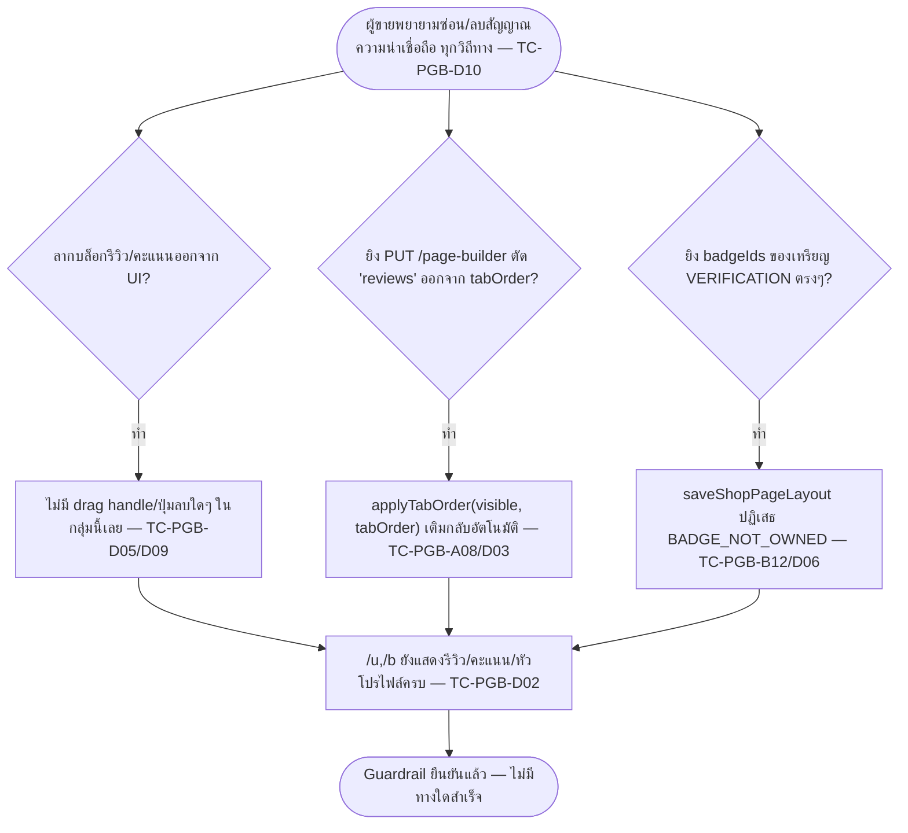

> **โมดูล:** M00035-ShopPageBuilder
> **ประเภทเอกสาร:** Test Case
> **เวอร์ชัน:** 1.0
> **วันที่จัดทำ:** 2026-08-07 (เขียนก่อน implement ตามลำดับ Hard Rule 11 — ไม่ใช่ backfill)
> **สถานะ:** Draft — รอ implement; ทุกเคสยังไม่เคยรัน เพราะยังไม่มีโค้ด (route/service/component ตาม [[SDS]] §3 ยังไม่ถูกสร้างสักไฟล์)
> **เจ้าของเอกสาร:** safepay-qa (ดู [[Feature-Docs-Ownership]])

# Test Case: ตัวจัดหน้าร้าน (Shop Page Builder)

---

## 1. Overview

ชุดทดสอบนี้ครอบ feature 00035 ทั้งฟีเจอร์ตามที่ล็อกไว้ใน [[PRD]]/[[BRD]] (มติ 4 ข้อ 2026-08-07) และแปลงเป็นข้อกำหนดทางเทคนิคใน [[SRS]]/[[SDS]]/[[DATABASE]]/[[API]] — 🛑 **ทุก scenario อิงตามการตีความใหม่ของ [[SRS]] §1.1 ไม่ใช่ข้อความ AC เดิมใน BRD** เพราะ FR-PGB-04 และ FR-PGB-10 ถูก SRS เขียนทับความหมายหลังมติปิดข้อ 1 (คงโครงแท็บเดิม ไม่รื้อ `ProfileTabs`) — จุดที่ขัดกันระหว่าง BRD ฉบับดิบกับ SRS ยึด SRS เสมอ

- **เอกสารต้นทาง:** [[PRD]] (มติ 4 ข้อ), [[BRD]] (FR-PGB-01..16, BR-PGB-01..12), [[SRS]] (TFR-001..009 + การตีความใหม่ §1.1), [[DATABASE]] (schema ล็อก + guardrail ที่ระดับ DB), [[SDS]] (component/flow/TD-001..009), [[API]] (4 endpoint + error code table) — ทุก scenario ในเอกสารนี้อ้างกลับ FR-PGB-XX / TFR-XXX / BR-PGB-XX อย่างน้อย 1 รหัส
- **ขอบเขตชุดทดสอบ (Scope):**
  - **In-scope:** `src/lib/profile-tab-keys.ts` (pure function ใหม่), `src/services/shop-page-layout.service.ts` (ใหม่), 4 API endpoint ใต้ `/api/shops/current/page-builder/**`, หน้า `(fullscreen)/public-profile/builder/page.tsx` + component ลูกทั้งหมด (§3 ของ SDS), การแก้ `/u/[username]/page.tsx`, `/b/[slug]/page.tsx`, `ShopProfile.tsx`, `public-profile/page.tsx` (มือถือ), `FullscreenPageHeader.tsx` (เพิ่ม prop), postMessage protocol (2 message type), trust guardrail ทั้งชุด (D-9/D-10), permission (OWNER + ShopMember ADMIN), zero-regression ของหน้าร้านเดิม
  - **Out-of-scope (ตาม PRD §5 — ห้ามเทสในนามของฟีเจอร์นี้เพราะไม่ใช่ของฟีเจอร์นี้):** การรวม `/u`+`/b` เป็น handle เดียว (00034), ตัวจัดเรียงบนมือถือ (เฟสถัดไป), การแก้เนื้อหาต้นทาง (สินค้า/ห้องพัก/โพสต์) จากในตัวจัดหน้าร้าน, เทมเพลตหน้าร้านสำเร็จรูป/ธีมสี, บล็อกจากแพลตฟอร์มอื่นนอกจาก Facebook
  - **สภาพแวดล้อม:**
    - Unit: Vitest local (`npm test -- <path> --run`), ไม่แตะ DB
    - Integration: Vitest/route-handler ยิงลง dev DB ผ่าน Prisma client จริง (`.env.local`) — ล้างข้อมูลด้วย `deleteTestData({ userIds, shopIds })` เท่านั้น (Hard Rule 13, §2 ข้อบังคับด้านล่าง)
    - E2E: Playwright (`e2e/shop-page-builder.spec.ts`) ที่ `http://seller.deepth.local:4000` (host ของ builder) + `http://deepth.local:4000` (host ของ `/u`,`/b`) — bypass login ด้วย `e2e/helpers/auth.ts`
    - Browser (manual): `seller.deepth.local:4000` + `deepth.local:4000` เท่านั้น (ห้าม `localhost`) — user/QA agent เป็นคนรัน dev server / กดจริง

### 1.1 ข้อบังคับด้านความปลอดภัยของข้อมูลเทส (Hard Rule 13/14 — บังคับทุกเคสที่แตะ DB)

- ห้ามมี `deleteMany()` ไม่มี `where`, `TRUNCATE`, `DELETE FROM` ไม่มี `WHERE`, `DROP`, `migrate reset`, `db push --force-reset`, `prisma db pull` ในไฟล์เทส (`tests/**`, `e2e/**`, `*.test.ts`, `*.spec.ts`) โดยเด็ดขาด
- Fixture/cleanup ทุกตัวต้อง scope ด้วย id ที่เทสสร้างเอง ผ่าน `deleteTestData({ userIds, shopIds })` (`tests/setup.ts`)
- Migration ที่ apply เพื่อเทส integration ต้อง**ปักหมุด URL localhost ตรง ๆ ในคำสั่ง** ตาม [[DATABASE]] §5.1 — ห้ามใช้ `$(...)`/ตัวแปรจาก `.env.local`
- `ShopPageBlock`/`ShopPageLayout` ทั้งสองตารางมี partial unique index แบบ unmanaged SQL (`docs/20 - Features/00035 - Shop Page Builder/DATABASE.md` §4) — **ห้ามรัน `prisma db pull`/`migrate dev`** หลัง apply migration นี้เด็ดขาด

### 1.2 Fixtures ที่ต้องเตรียมก่อนเทส (seed ผ่าน Prisma script เท่านั้น)

| Fixture | Vertical | ลักษณะ | ใช้ในกลุ่ม |
|---|---|---|---|
| **Shop-L** (`baan-rim-than`) | `LODGING` | 4 ห้องพักเปิดขาย, ปฏิทินวันว่างมีข้อมูล, 7 เหรียญ `ACHIEVEMENT`, **ไม่มี** `ShopChannel` Facebook, มีรีวิวเฉลี่ย 4.5, OWNER = User-L1 | A, G, K |
| **Shop-O** (`khong-fak-tai`) | `ONLINE_SALES` | 5 สินค้า active, `ShopChannel` provider `MESSENGER` status `ACTIVE` + 5 `FacebookPost` (3 มี `thumbnailUrl` ปกติ, 1 โพสต์ข้อความล้วนไม่มีรูป, 1 โพสต์ที่จงใจตั้ง `thumbnailUrl` เป็น host ที่ไม่อยู่ allow-list ของ `mirrorRemoteImage` เพื่อจำลอง mirror ล้ม), 5 เหรียญ `ACHIEVEMENT` + 1 เหรียญ `VERIFICATION`, รีวิว 1 ดาวล่าสุด 1 รายการ (สำหรับ BRD Scenario 2), OWNER = User-O1, `ShopMember(role=ADMIN)` = User-O2 | B, C, D, E, F, H, I |
| **Shop-S** (`jaidee-nails`) | `SERVICE_QUEUE` | มีบริการ + สินค้าเสริมบางส่วน, **0 เหรียญทุกชนิด** (edge case), OWNER = User-S1 | F, G |
| **Shop-Z** (`shop-z-onboarded`) | `ONLINE_SALES` | เพิ่งผ่าน onboarding, **ไม่มีข้อมูลใด ๆ เลย** (0 สินค้า/รีวิว/คลิป/เหรียญ) — สำหรับเคส "แท็บเดียว" และ zero-regression baseline, OWNER = User-Z1 | A, F, K |
| **Shop-Legacy** | `ONLINE_SALES` | ร้านเดิมที่มีข้อมูลจริง (สินค้า/รีวิว/ออเดอร์) แต่**ไม่มีแถว `ShopPageLayout` เลย** (จำลองสถานะก่อน migrate/ก่อนเคยเปิดตัวจัดหน้าร้าน) | F, K, M |
| **User-X** | — | ไม่มี `ShopMember` ของร้านใดในชุดทดสอบเลย (หรือเป็นสมาชิกร้านอื่นที่ไม่เกี่ยวข้อง) | E |
| **User-Y** | — | เคยเป็น `ShopMember(role=ADMIN)` ของ Shop-O แล้วถูกลบแถวออกหลังจาก session/JWT ถูกออกไปแล้ว (จำลอง stale membership) | E |

หมายเหตุ: การจำลอง "mirror ล้ม" (Shop-O โพสต์ที่ 3) ทำได้สองทาง — (1) ตั้ง `thumbnailUrl` เป็น host ปลอมที่ไม่อยู่ allow-list จริงของ `mirrorRemoteImage()` (integration ระดับ service เรียกจริง) หรือ (2) mock `mirrorRemoteImage` ให้ return `null` ตรง ๆ ในเทส unit/integration ระดับ service — ใช้ทางที่ 2 เป็นหลักเพื่อไม่พึ่ง network จริงระหว่างรันเทส

---

## 2. Test Scenarios

### กลุ่ม A — Unit: `src/lib/profile-tab-keys.ts` (`computeVisibleTabKeys` / `applyTabOrder`)

**Precondition ร่วม:** pure function ล้วน ไม่มี import server-only, ไม่แตะ DB — ตาม SRS TFR-002/TFR-003

#### TC-PGB-A01: `computeVisibleTabKeys` — LODGING มีห้อง+ปฏิทิน+รีวิว

- **ระดับ:** unit
- **Trace:** FR-PGB-04 (ตีความใหม่), TFR-002
- **Precondition:** input `{ isLodging:true, hasRooms:true, hasAvailability:true, hasReviews:true, hasVideos:false, isServiceQueue:false, hasServices:false, hasItems:false }`
- **Steps:** เรียก `computeVisibleTabKeys(input)`
- **Expected Result:** ผลลัพธ์มี `'rooms'`, `'calendar'`, `'reviews'`, `'about'` — **ไม่มี** `'items'`/`'services'`

#### TC-PGB-A02: `computeVisibleTabKeys` — ONLINE_SALES มีสินค้าเท่านั้น

- **ระดับ:** unit
- **Trace:** FR-PGB-04 (ตีความใหม่), TFR-002
- **Precondition:** input `{ isLodging:false, isServiceQueue:false, hasItems:true, hasReviews:true, hasRooms:false, hasAvailability:false, hasServices:false, hasVideos:false }`
- **Steps:** เรียก `computeVisibleTabKeys(input)`
- **Expected Result:** มี `'items'`, `'reviews'`, `'about'` — **ไม่มี** `'rooms'`/`'calendar'`/`'services'`

#### TC-PGB-A03: `computeVisibleTabKeys` — SERVICE_QUEUE มีทั้งบริการและสินค้าเสริม

- **ระดับ:** unit
- **Trace:** FR-PGB-04 (ตีความใหม่), TFR-002
- **Precondition:** input `{ isServiceQueue:true, hasServices:true, hasItems:true, isLodging:false, hasRooms:false, hasAvailability:false, hasReviews:false, hasVideos:false }`
- **Steps:** เรียก `computeVisibleTabKeys(input)`
- **Expected Result:** มี `'services'`, `'items'`, `'about'` — **ไม่มี** `'reviews'` (เพราะ `hasReviews:false`), **ไม่มี** `'rooms'`/`'calendar'`

#### TC-PGB-A04: `computeVisibleTabKeys` — ร้านไม่มีข้อมูลใดเลย → เหลือแค่ `about`

- **ระดับ:** unit
- **Trace:** TFR-002 Error/Edge case
- **Precondition:** input ทุก flag เป็น `false`
- **Steps:** เรียก `computeVisibleTabKeys(input)`
- **Expected Result:** ผลลัพธ์ `=== ['about']` เท่านั้น (about render เสมอไม่มีเงื่อนไข) — ไม่ throw, ไม่คืน array ว่าง

#### TC-PGB-A05: `computeVisibleTabKeys` — regression matrix เทียบพฤติกรรมเดิมของ `ShopProfile.tsx`

- **ระดับ:** unit
- **Trace:** SRS §8 ความเสี่ยงเชิงสถาปัตยกรรม ("Refactor `computeVisibleTabKeys` เสี่ยง regression")
- **Precondition:** ชุด input table-driven ครอบทุก combination ที่มีความหมายจริง (vertical × มี/ไม่มี videos × มี/ไม่มี reviews × มี/ไม่มี rooms/services/items ตามที่ vertical นั้นรองรับได้จริง — อย่างน้อย 12 แถว)
- **Steps:** รันทุกแถวผ่าน `computeVisibleTabKeys` เทียบกับผลลัพธ์ของเงื่อนไข inline เดิมใน `ShopProfile.tsx` (บรรทัด 60-153 ก่อน refactor, capture ไว้เป็น baseline snapshot ก่อนแก้โค้ด)
- **Expected Result:** ทุกแถวได้ผลลัพธ์เหมือนกันทุกประการ (order + membership) — พฤติกรรมเดิม 100% ไม่ใช่ behavior change

#### TC-PGB-A06: `applyTabOrder` — permutation ปกติ

- **ระดับ:** unit
- **Trace:** BR-PGB-04 (ตีความใหม่), TFR-003
- **Precondition:** `visible = ['pinned','items','about','reviews']`, `tabOrder = ['reviews','items','pinned','about']`
- **Steps:** เรียก `applyTabOrder(visible, tabOrder)`
- **Expected Result:** `=== ['reviews','items','pinned','about']` เป๊ะ

#### TC-PGB-A07: `applyTabOrder` — key แปลกปลอมถูกกรองทิ้งเงียบ ๆ ไม่ crash

- **ระดับ:** unit
- **Trace:** BR-PGB-04 (ตีความใหม่), TFR-003 Error/Edge case, DATABASE §3.1 (validate ที่ Valibot ไม่มี CHECK ที่ DB)
- **Precondition:** `visible = ['pinned','about','reviews']`, `tabOrder = ['hacked','pinned','<script>','reviews']`
- **Steps:** เรียก `applyTabOrder(visible, tabOrder)`
- **Expected Result:** ไม่ throw — คืน `['pinned','reviews','about']` (key แปลกปลอมหายไป, `about` ที่ไม่อยู่ใน tabOrder ต่อท้าย)

#### TC-PGB-A08: `applyTabOrder` — length invariant (แท็บที่หายไปจาก `tabOrder` ต้องกลับมาต่อท้ายเสมอ)

- **ระดับ:** unit
- **Trace:** 🛑 **Trust guardrail — TFR-003 Postcondition** (ห้ามลบแท็บผ่านฟังก์ชันนี้)
- **Precondition:** `visible = ['pinned','items','about','reviews']`, `tabOrder = ['pinned']` (ไม่มี `reviews` เลย — จำลอง payload ที่พยายามตัดแท็บ `reviews` ออก)
- **Steps:** เรียก `applyTabOrder(visible, tabOrder)` แล้วตรวจ `.length` และ `new Set(...)`
- **Expected Result:** `result.length === visible.length` (4) และ `new Set(result)` เท่ากับ `new Set(visible)` เป๊ะ — `'reviews'` **ยังอยู่ในผลลัพธ์** (ต่อท้ายตามลำดับ default) แม้ `tabOrder` จะไม่มี key นั้นเลย — นี่คือ invariant ที่พิสูจน์ว่า `tabOrder` เป็น "reorder-only" ไม่ใช่ "allow/deny-list"

#### TC-PGB-A09: `applyTabOrder` — key ซ้ำใน `tabOrder` ใช้ตัวแรกที่เจอ

- **ระดับ:** unit
- **Trace:** TFR-003 Error/Edge case
- **Precondition:** `visible = ['pinned','about','reviews']`, `tabOrder = ['reviews','reviews','pinned']`
- **Steps:** เรียก `applyTabOrder(visible, tabOrder)`
- **Expected Result:** คืน `['reviews','pinned','about']` — ไม่มี `'reviews'` ซ้ำสองครั้งในผลลัพธ์ (dedupe ก่อน filter)

#### TC-PGB-A10: `applyTabOrder` — `tabOrder = []` คืนค่าเดิมเป๊ะ (zero-regression)

- **ระดับ:** unit
- **Trace:** TFR-003 Error/Edge case, DATABASE §5.3
- **Precondition:** `visible = ['pinned','items','about','reviews']`, `tabOrder = []`
- **Steps:** เรียก `applyTabOrder(visible, [])`
- **Expected Result:** `=== visible` (ลำดับ default เดิมเป๊ะ) — ร้านที่ยังไม่เคยจัดเลยต้องเห็นหน้าเดิมทุกประการ

---

### กลุ่ม B — Integration: `shop-page-layout.service.ts` (DB จริง)

#### TC-PGB-B01: `getShopPageLayout` — ไม่มีแถวเลย คืน fallback

- **ระดับ:** integration
- **Trace:** TFR-004, DATABASE §3.1 ("ห้ามพึ่ง DB default อย่างเดียว")
- **Precondition:** Shop-Legacy ไม่มีแถว `ShopPageLayout`
- **Steps:** เรียก `getShopPageLayout(shopLegacy.id)`
- **Expected Result:** คืน `{ isPublished: true, tabOrder: [] }` — ไม่ throw ไม่คืน `null`

#### TC-PGB-B02: `getShopPageLayout` — มีแถวอยู่แล้ว คืนค่าจริง

- **ระดับ:** integration
- **Trace:** TFR-004
- **Precondition:** Shop-O มีแถว `ShopPageLayout { isPublished:false, tabOrder:['reviews','about'] }`
- **Steps:** เรียก `getShopPageLayout(shopO.id)`
- **Expected Result:** คืนค่าตรงกับแถวใน DB เป๊ะ

#### TC-PGB-B03: `listShopPageBlocks` — `BADGE_HIGHLIGHT` เรียงตามลำดับใน `badgeIds` ไม่ใช่ลำดับ query

- **ระดับ:** integration
- **Trace:** TFR-005
- **Precondition:** Shop-O มีแถว `ShopPageBlock(type=BADGE_HIGHLIGHT, badgeIds=[ub3, ub1, ub2])`
- **Steps:** เรียก `listShopPageBlocks(shopO.id)`
- **Expected Result:** เหรียญที่คืนมาเรียงตามลำดับ `[ub3, ub1, ub2]` เป๊ะ ไม่ใช่ลำดับที่ Prisma `in` คืนมา (ซึ่งไม่รับประกันลำดับ)

#### TC-PGB-B04: `listShopPageBlocks` — id เหรียญที่ไม่ ACHIEVEMENT/ไม่มีอยู่จริงหายไปเงียบ ๆ

- **ระดับ:** integration
- **Trace:** 🛑 **Trust guardrail — TFR-005, D-10**
- **Precondition:** Shop-O มีแถว `BADGE_HIGHLIGHT` ที่ `badgeIds` มี id ของเหรียญ `VERIFICATION` ปนอยู่ 1 ตัว (สร้างแถวตรงผ่าน Prisma ไม่ผ่าน API — จำลองข้อมูลผิดปกติที่หลุดผ่านมาได้ในทางทฤษฎี) และ id ที่ไม่มีอยู่จริงอีก 1 ตัว
- **Steps:** เรียก `listShopPageBlocks(shopO.id)`
- **Expected Result:** ผลลัพธ์มีเฉพาะเหรียญ `ACHIEVEMENT` ที่ resolve ได้จริง — id ทั้งสองตัวหายไปเงียบ ๆ ไม่ throw ไม่ error

#### TC-PGB-B05: `listShopPageBlocks` — `FACEBOOK_POST` ที่ `facebookPost` เป็น `null` ถูกข้ามทั้งแถว

- **ระดับ:** integration
- **Trace:** TFR-005 Error/Edge case
- **Precondition:** Shop-O มีแถว `ShopPageBlock(type=FACEBOOK_POST)` ที่ `facebookPostId` ชี้ไปโพสต์ที่ถูกลบไปแล้ว (จำลองโดย raw update ข้าม FK cascade ชั่วคราวเพื่อทดสอบ defensive path)
- **Steps:** เรียก `listShopPageBlocks(shopO.id)`
- **Expected Result:** ไม่ throw — แถวนั้นหายไปทั้งแถวจากผลลัพธ์

#### TC-PGB-B06: `mirrorFacebookPostForBuilder` — happy path + idempotent

- **ระดับ:** integration
- **Trace:** TFR-006
- **Precondition:** Shop-O โพสต์ที่ 1 มี `thumbnailUrl` ถูกต้อง, `mirroredFileId` เป็น `null`
- **Steps:** 1) เรียก `mirrorFacebookPostForBuilder(shopO.id, userO1.id, post1.id)` ครั้งแรก 2) เรียกซ้ำครั้งที่สองทันที
- **Expected Result:** ครั้งแรก `{ mirrored:true, mirroredFileId: <fileId>, imageUrl: '/api/files/...' }`, `FacebookPost.mirroredFileId`/`mirroredAt` ถูกเขียนจริง — ครั้งที่สองคืนค่าเดิมทันที **ไม่เรียก `mirrorRemoteImage` ซ้ำ** (ตรวจผ่าน mock call count === 1)

#### TC-PGB-B07: `mirrorFacebookPostForBuilder` — โพสต์ไม่มีรูป (ข้อความล้วน)

- **ระดับ:** integration
- **Trace:** TFR-006 Error/Edge case
- **Precondition:** Shop-O โพสต์ที่ 2 (`thumbnailUrl = null`)
- **Steps:** เรียก `mirrorFacebookPostForBuilder(shopO.id, userO1.id, post2.id)`
- **Expected Result:** คืน `{ mirroredFileId:null, imageUrl:null, mirrored:false }` — ไม่ error, ไม่เรียก `mirrorRemoteImage`

#### TC-PGB-B08: `mirrorFacebookPostForBuilder` — mirror ล้ม (คืน `null`) ไม่ block การเพิ่ม

- **ระดับ:** integration
- **Trace:** 🛑 TFR-006 Error/Edge case, TD-004, SRS §6 NFR Observability
- **Precondition:** Shop-O โพสต์ที่ 3 (mock `mirrorRemoteImage` ให้คืน `null`)
- **Steps:** เรียก `mirrorFacebookPostForBuilder(shopO.id, userO1.id, post3.id)` พร้อม spy บน `console.error`
- **Expected Result:** คืน `{ mirrored:false, imageUrl: <thumbnailUrl เดิม> }` **ไม่ throw** — `console.error` ถูกเรียกอย่างน้อย 1 ครั้ง (NFR Observability)

#### TC-PGB-B09: `mirrorFacebookPostForBuilder` — โพสต์ไม่ใช่ของร้านนี้

- **ระดับ:** integration
- **Trace:** 🛑 **Security — TFR-006 Precondition, NOT_OWNED**
- **Precondition:** `facebookPostId` เป็นโพสต์ของ Shop-L (ซึ่งไม่มี channel FB อยู่แล้ว — ใช้ id ปลอมหรือของ shop อื่นที่มี channel)
- **Steps:** เรียก `mirrorFacebookPostForBuilder(shopO.id, userO1.id, <postId ของร้านอื่น>)`
- **Expected Result:** throw `POST_NOT_OWNED`

#### TC-PGB-B10: `saveShopPageLayout` — happy path replace-all ในทรานแซกชันเดียว

- **ระดับ:** integration
- **Trace:** TFR-007
- **Precondition:** Shop-O ไม่มีบล็อกมาก่อน
- **Steps:** เรียก `saveShopPageLayout(shopO.id, userO1.id, { tabOrder:['items','about','reviews'], blocks:[{type:'BADGE_HIGHLIGHT', badgeIds:[ub1,ub2]}, {type:'FACEBOOK_POST', facebookPostId: post1.id}] })`
- **Expected Result:** `ShopPageLayout.tabOrder` อัปเดตตรง, `ShopPageBlock` มี 2 แถวใหม่ `sortOrder` ตรงกับ index array (0,1) — query กลับจาก DB ตรงกับสิ่งที่บันทึก

#### TC-PGB-B11: `saveShopPageLayout` — เกิน 1 `BADGE_HIGHLIGHT` block

- **ระดับ:** integration
- **Trace:** 🛑 BR-PGB-06, TFR-007 ข้อ 2
- **Steps:** เรียก `saveShopPageLayout` ด้วย `blocks` ที่มี `type='BADGE_HIGHLIGHT'` 2 รายการ
- **Expected Result:** throw `TOO_MANY_BADGE_BLOCKS` — ไม่มี write เกิดขึ้นเลย (ทรานแซกชันไม่เริ่ม หรือ rollback สมบูรณ์)

#### TC-PGB-B12: `saveShopPageLayout` — `badgeIds` มี id ของเหรียญ `VERIFICATION`

- **ระดับ:** integration
- **Trace:** 🛑 **Trust guardrail — D-10, BR-PGB-07, TFR-007 ข้อ 3**
- **Precondition:** Shop-O มีเหรียญ `VERIFICATION` (`ub_verification`) เป็นของจริงที่ user นี้ได้รับ
- **Steps:** เรียก `saveShopPageLayout(shopO.id, userO1.id, { tabOrder:[], blocks:[{type:'BADGE_HIGHLIGHT', badgeIds:['ub_verification']}] })`
- **Expected Result:** throw `BADGE_NOT_OWNED` — **แม้ id จะเป็นเหรียญที่ user คนนี้ได้รับจริง ๆ** ก็ถูกปฏิเสธเพราะ `badge.type !== 'ACHIEVEMENT'` (นี่คือเคสที่พิสูจน์ guardrail ทำงานที่ server ไม่ใช่แค่ UI ซ่อนตัวเลือก)

#### TC-PGB-B13: `saveShopPageLayout` — `badgeIds` เป็นของ user/shop อื่น

- **ระดับ:** integration
- **Trace:** 🛑 **Security — TFR-007 ข้อ 3**
- **Precondition:** id เหรียญเป็นของ Shop-L (คนละร้าน)
- **Steps:** เรียก `saveShopPageLayout(shopO.id, userO1.id, { blocks:[{type:'BADGE_HIGHLIGHT', badgeIds:[<ub ของ Shop-L>]}] })`
- **Expected Result:** throw `BADGE_NOT_OWNED`

#### TC-PGB-B14: `saveShopPageLayout` — `facebookPostId` เป็นของร้านอื่น

- **ระดับ:** integration
- **Trace:** 🛑 **Security — TFR-007 ข้อ 4**
- **Steps:** เรียก `saveShopPageLayout(shopO.id, userO1.id, { blocks:[{type:'FACEBOOK_POST', facebookPostId: <post ของร้านอื่น>}] })`
- **Expected Result:** throw `POST_NOT_OWNED`

#### TC-PGB-B15: `saveShopPageLayout` — `facebookPostId` ซ้ำในชุดเดียวกัน

- **ระดับ:** integration
- **Trace:** TFR-007 ข้อ 4, DATABASE §4 partial unique index
- **Steps:** เรียก `saveShopPageLayout` ด้วย `blocks` ที่มี `{type:'FACEBOOK_POST', facebookPostId: post1.id}` ซ้ำ 2 รายการ
- **Expected Result:** throw `DUPLICATE_FACEBOOK_POST`

#### TC-PGB-B16: `saveShopPageLayout` — concurrent race ชน partial unique index (`P2002`)

- **ระดับ:** integration
- **Trace:** TFR-007 Error/Edge case, SRS §4.2 error mapping table
- **Precondition:** Shop-O ยังไม่มีบล็อกโพสต์ 1 นี้
- **Steps:** ยิง `saveShopPageLayout` สองครั้งพร้อมกัน (`Promise.all`) โดยทั้งคู่พยายามเพิ่มโพสต์เดียวกันในคนละ request (จำลอง 2 แท็บบันทึกพร้อมกัน)
- **Expected Result:** 1 คำขอสำเร็จ อีก 1 คำขอชน `P2002` → route ต้อง catch แล้วแปลงเป็น `DUPLICATE_FACEBOOK_POST` เดียวกัน — ไม่มี 500 ดิบหลุดออกมา, ไม่มีแถวซ้ำใน DB

#### TC-PGB-B17: `setShopPagePublished` — ไม่มีแถว `ShopPageLayout` มาก่อน

- **ระดับ:** integration
- **Trace:** TFR-009 Error/Edge case
- **Precondition:** Shop-Z ไม่มีแถว `ShopPageLayout`
- **Steps:** เรียก `setShopPagePublished(shopZ.id, userZ1.id, false)`
- **Expected Result:** สร้างแถวใหม่ `{ isPublished:false, tabOrder:[] }` — ไม่ทำลาย/แตะ field อื่นใด

---

### กลุ่ม C — Integration/API: 4 Endpoint (สัญญาตรงกับ [[API]])

#### TC-PGB-C01: `GET .../library` — 200 happy path

- **ระดับ:** integration
- **Trace:** FR-PGB-05, FR-PGB-06
- **Precondition:** session ของ User-O1
- **Steps:** `GET /api/shops/current/page-builder/library`
- **Expected Result:** 200; `badges` มีเฉพาะ 5 เหรียญ `ACHIEVEMENT` (ไม่มีเหรียญ `VERIFICATION`); `facebookChannelConnected:true`; `facebookPosts` มี 5 รายการพร้อม `imageUrl` resolve แล้ว

#### TC-PGB-C02: `GET .../library` — ร้านไม่เชื่อมเพจ Facebook

- **ระดับ:** integration
- **Trace:** FR-PGB-05 AC ข้อ 3
- **Precondition:** session ของ User-L1 (Shop-L ไม่มี `ShopChannel` FB)
- **Steps:** `GET .../library`
- **Expected Result:** 200; `facebookChannelConnected:false`; `facebookPosts: []` — ไม่ error

#### TC-PGB-C03: `GET .../library` — เหรียญ `VERIFICATION` ไม่ปรากฏแม้มีจริง

- **ระดับ:** integration
- **Trace:** 🛑 **Trust guardrail — D-10, FR-PGB-06 AC ข้อ 2**
- **Precondition:** Shop-O มีเหรียญ `VERIFICATION` จริง 1 ใบ
- **Steps:** `GET .../library` ด้วย session User-O1
- **Expected Result:** `badges` array ไม่มีเหรียญ `VERIFICATION` ปนอยู่เลยแม้แต่ตัวเดียว

#### TC-PGB-C04: `GET .../library` — ไม่มี session

- **ระดับ:** integration
- **Trace:** API.md §2
- **Steps:** `GET .../library` โดยไม่ส่ง cookie session
- **Expected Result:** `401 UNAUTHORIZED`

#### TC-PGB-C05: `GET .../library` — มี session แต่ไม่มี active shop

- **ระดับ:** integration
- **Trace:** API.md §2
- **Precondition:** session ที่ `activeShopId` เป็น `null`
- **Steps:** `GET .../library`
- **Expected Result:** `404 NOT_FOUND`

#### TC-PGB-C06: `POST .../facebook-posts/mirror` — happy path

- **ระดับ:** integration
- **Trace:** FR-PGB-05, TFR-006
- **Steps:** `POST .../facebook-posts/mirror` body `{ facebookPostId: post1.id }`
- **Expected Result:** `200 { facebookPostId, mirrored:true, imageUrl:"/api/files/..." }`

#### TC-PGB-C07: `POST .../facebook-posts/mirror` — `facebookPostId` ไม่ใช่ uuid

- **ระดับ:** integration
- **Trace:** API.md §4.2
- **Steps:** `POST .../facebook-posts/mirror` body `{ facebookPostId: "not-a-uuid" }`
- **Expected Result:** `400 VALIDATION_ERROR`

#### TC-PGB-C08: `POST .../facebook-posts/mirror` — โพสต์ของร้านอื่น

- **ระดับ:** integration
- **Trace:** 🛑 **Security — API.md §4.2**
- **Steps:** `POST .../facebook-posts/mirror` body ชี้ไปโพสต์ของร้านอื่น ด้วย session User-O1
- **Expected Result:** `403 NOT_OWNED`

#### TC-PGB-C09: `PUT /page-builder` — happy save, response ไม่ echo request ดิบ

- **ระดับ:** integration
- **Trace:** FR-PGB-13, TFR-007 ข้อ 6
- **Steps:** `PUT /page-builder` body ถูกต้องครบ
- **Expected Result:** `200` — response `tabOrder`/`blocks` มี `id` ของ `ShopPageBlock` ที่ query กลับจาก DB จริง (ไม่ใช่แค่ค่าที่ client ส่งมา)

#### TC-PGB-C10: `PUT /page-builder` — `tabOrder` มี key แปลกปลอม

- **ระดับ:** integration
- **Trace:** 🛑 **Trust guardrail/fail-safe — API.md §4.3 Valibot transform**
- **Steps:** `PUT /page-builder` body `{ tabOrder:["reviews","hacked","<script>alert(1)</script>","about"], blocks:[] }`
- **Expected Result:** `200` (ไม่ reject ทั้ง request) — response `tabOrder` มีเฉพาะ `["reviews","about"]` (key แปลกปลอมถูกกรองทิ้งเงียบ ๆ โดย Valibot transform ก่อนถึง service ด้วยซ้ำ)

#### TC-PGB-C11: `PUT /page-builder` — เกิน 1 `BADGE_HIGHLIGHT`

- **ระดับ:** integration
- **Trace:** BR-PGB-06
- **Steps:** `PUT /page-builder` body มี `blocks` 2 รายการ `type='BADGE_HIGHLIGHT'`
- **Expected Result:** `400 VALIDATION_ERROR`

#### TC-PGB-C12: `PUT /page-builder` — `badgeIds` เกิน 4 ตัว

- **ระดับ:** integration
- **Trace:** 🛑 BR-PGB-06 (มติข้อ 3 — สูงสุด 4 ใบ)
- **Steps:** `PUT /page-builder` body `blocks:[{type:'BADGE_HIGHLIGHT', badgeIds:[ub1,ub2,ub3,ub4,ub5]}]` (5 ตัว)
- **Expected Result:** `400 VALIDATION_ERROR` (Valibot `maxLength(4)` ปฏิเสธก่อนถึง service เลย)

#### TC-PGB-C13: `PUT /page-builder` — `facebookPostId` ไม่ใช่ของร้านนี้

- **ระดับ:** integration
- **Trace:** 🛑 **Security**
- **Steps:** `PUT /page-builder` body ชี้ไปโพสต์ของร้านอื่น
- **Expected Result:** `403 NOT_OWNED`

#### TC-PGB-C14: `PUT /page-builder` — โพสต์ซ้ำในชุดเดียวกัน

- **ระดับ:** integration
- **Steps:** `PUT /page-builder` body `blocks` มี `facebookPostId` เดียวกัน 2 แถว
- **Expected Result:** `409 CONFLICT` (`DUPLICATE_FACEBOOK_POST`)

#### TC-PGB-C15: `PATCH .../publish` — สลับทั้งสองทิศทาง

- **ระดับ:** integration
- **Trace:** FR-PGB-14, TFR-009
- **Steps:** 1) `PATCH .../publish { isPublished:false }` 2) `PATCH .../publish { isPublished:true }`
- **Expected Result:** ทั้งสองครั้ง `200` พร้อม `isPublished` ตรงกับที่ส่งไป — เช็คด้วย `GET` (หรือ query DB ตรง) ว่าค่าจริงเปลี่ยนทันที

#### TC-PGB-C16: `PATCH .../publish` — body ไม่ใช่ boolean

- **ระดับ:** integration
- **Steps:** `PATCH .../publish { isPublished: "yes" }`
- **Expected Result:** `400 VALIDATION_ERROR`

#### TC-PGB-C17: ทั้ง 4 endpoint มี cache header ที่ถูกต้อง

- **ระดับ:** integration
- **Trace:** API.md §1 ("Caching"), `feedback_auth_api_cache_control`
- **Steps:** ยิงทั้ง 4 endpoint แล้วอ่าน response header
- **Expected Result:** ทุก response มี `Cache-Control: private, no-store` และ route ประกาศ `export const dynamic = 'force-dynamic'`

#### TC-PGB-C18: field แปลกปลอมในทุก endpoint ถูกตัดทิ้งด้วย Valibot allow-list

- **ระดับ:** integration
- **Trace:** 🛑 **Security — มติข้อ 4, บทเรียน `PATCH /api/users/me` เคยถูกยิง `{"isAdmin":true}`**
- **Steps:** ยิง `PUT /page-builder` ด้วย body `{ tabOrder:[], blocks:[], shopId:"<shop อื่น>", isPublished:true, isAdmin:true }`
- **Expected Result:** `200` สำเร็จปกติสำหรับ field ที่ schema รู้จัก (`tabOrder`/`blocks`) — field แปลกปลอม (`shopId`/`isPublished`/`isAdmin`) **ไม่มีผลใด ๆ**: `isPublished` ของร้านไม่เปลี่ยน (ต้องเรียก `PATCH .../publish` แยกเท่านั้น), การบันทึกยังคงเขียนลง `shopId` ของ session ไม่ใช่ `shopId` ที่แนบมาใน body

---

### กลุ่ม D — 🛑 Trust Guardrail (Critical — ห้ามข้าม, D-9/D-10)

#### TC-PGB-D01: หัวโปรไฟล์ (`ProfileHero`) render เสมอไม่ว่าสถานะ layout จะเป็นอย่างไร

- **ระดับ:** e2e
- **Trace:** 🛑 BR-PGB-01, D-9
- **Precondition:** Shop-Z (ไม่มีแถว `ShopPageLayout` เลย), Shop-O (มีแถวและมีบล็อกเต็ม)
- **Steps:** เปิด `/u/{Shop-Z owner username}` และ `/b/khong-fak-tai`
- **Expected Result:** ทั้งสองหน้ามี `ProfileHero` (ชื่อร้าน/avatar/trust tier) render บนสุดเสมอ — ไม่มี component ใดควบคุมการซ่อน/แสดงหัวโปรไฟล์

#### TC-PGB-D02: สัญญาณความน่าเชื่อถือหลักไม่หายแม้ร้านจัดหน้าเต็มที่

- **ระดับ:** e2e
- **Trace:** 🛑 PRD §1.2 KPI "ไม่มีสัญญาณความน่าเชื่อถือหายไปจากหน้าร้านจริง — 100% เสมอ"
- **Precondition:** Shop-O บันทึกผังที่มี `BADGE_HIGHLIGHT` + `FACEBOOK_POST` 3 บล็อก และ `tabOrder` เรียงใหม่ทั้งหมด
- **Steps:** เปิด `/b/khong-fak-tai` ตรวจ: (1) trust score/tier badge ในหัวโปรไฟล์ (2) ป้ายยืนยันตัวตน (3) ยอดออเดอร์สำเร็จ/อัตราสำเร็จ (4) แท็บ "รีวิว" ยังอยู่ในแถบแท็บ
- **Expected Result:** ครบทั้ง 4 จุด ไม่มีจุดใดหายไปหรือถูกบัง

#### TC-PGB-D03: 🛑 ยิง `PUT /page-builder` ตรง ๆ ด้วย `tabOrder` ที่ตัด `'reviews'` ออก — แท็บรีวิวต้องไม่หาย

- **ระดับ:** integration + e2e
- **Trace:** 🛑 **BR-PGB-02, D-9, SRS §1.1 ข้อ 2 (guardrail จริงของกลุ่มนี้คือ "ไม่มี UI ให้ลบ" ไม่ใช่ "มี UI ลบแล้วปฏิเสธ")**
- **Precondition:** Shop-O มี `visibleTabKeys` รวม `'reviews'` อยู่แล้ว (มีรีวิวจริง)
- **Steps:** 1) ยิง `PUT /page-builder` body `{ tabOrder:["pinned","items","about"], blocks:[] }` (ไม่มี `"reviews"` อยู่เลย) ด้วย session ที่ถูกต้องของ User-O1 (ข้าม UI ไปเลย จำลอง payload ที่จงใจตัดแท็บ) 2) เปิด `/b/khong-fak-tai` จริง
- **Expected Result:** ทั้งสองขั้นตอน `'reviews'` **ยังปรากฏในแถบแท็บของหน้าร้านสาธารณะ** (ต่อท้ายตามลำดับ default ตาม `applyTabOrder` — TC-PGB-A08) — พิสูจน์ว่าไม่มีทางลบแท็บรีวิวออกได้แม้ยิง API ตรง ๆ

#### TC-PGB-D04: 🛑 payload พยายามส่ง `tabOrder` เป็น subset อื่น ๆ (ตัด `'about'`, ตัดทุกตัว) ก็ยังไม่ทำให้แท็บหาย

- **ระดับ:** integration
- **Trace:** 🛑 BR-PGB-02, D-9 (ทำซ้ำ D03 ด้วย variation อื่นให้ครอบคลุม)
- **Steps:** ยิง `PUT /page-builder` ด้วย `tabOrder: []` (ว่างเปล่าทั้งหมด)
- **Expected Result:** `GET`/render หน้าร้านหลังจากนั้นยังเห็นทุกแท็บที่ `visibleTabKeys` ควรมี (ใช้ `applyTabOrder(visible, [])` = คืน `visible` เดิม — ไม่มีทางลบทุกแท็บออกได้)

#### TC-PGB-D05: ไม่มี UI ใดในหน้าเพื่อ toggle/ซ่อนรายบล็อกของกลุ่ม pinned/locked

- **ระดับ:** e2e
- **Trace:** 🛑 BR-PGB-02, "ห้ามมี toggle ซ่อนรายบล็อกในกลุ่มนี้ไม่ว่ารูปแบบใด"
- **Steps:** เปิด builder, ตรวจ DOM ของ `LibraryPanel` ทั้งส่วน "สัญญาณความน่าเชื่อถือ" (FR-PGB-03) และแถวแท็บ — หา element ที่เป็น checkbox/switch/eye-icon ที่ผูกกับ `pinned`/`reviews`
- **Expected Result:** ไม่พบ element ควบคุม visibility ใด ๆ เลยในสองพื้นที่นี้ — มีแค่ badge สถานะ ("ตรึง"/"ล็อก") + drag handle สำหรับ reorder เท่านั้น (แถวแท็บ) หรือไม่มี handle เลย (หัวโปรไฟล์)

#### TC-PGB-D06: 🛑 เหรียญ `VERIFICATION` เลือกไม่ได้แม้ยิง id ตรง ๆ ผ่าน API (cross-check UI + API)

- **ระดับ:** e2e + integration
- **Trace:** 🛑 D-10, BR-PGB-07 (ทำซ้ำ B12/C03 ในมุม cross-check UI→API)
- **Steps:** 1) เปิด builder ของ Shop-O ตรวจว่าเหรียญ `VERIFICATION` ไม่ปรากฏในคลังเลย 2) ยิง `PUT /page-builder` ตรง ๆ ด้วย `badgeIds` ที่มี id เหรียญ `VERIFICATION` จริงของ Shop-O
- **Expected Result:** ขั้นที่ 1 ไม่เจอเหรียญ `VERIFICATION` ในคลัง — ขั้นที่ 2 ได้ `403 NOT_OWNED` (`BADGE_NOT_OWNED`)

#### TC-PGB-D07: 🛑 เหรียญเกิน 4 ใบถูกปฏิเสธทั้ง UI และ API

- **ระดับ:** e2e + integration
- **Trace:** 🛑 BR-PGB-06 (มติข้อ 3)
- **Steps:** 1) ใน UI เลือกเหรียญ 4 ใบแล้วพยายามเลือกใบที่ 5 2) ยิง `PUT /page-builder` ตรง ๆ ด้วย `badgeIds` 5 ตัว
- **Expected Result:** ขั้นที่ 1 UI แสดงข้อความปฏิเสธชัดเจน ("เลือกได้สูงสุด 4 เหรียญ") ไม่ error เงียบ — ขั้นที่ 2 ได้ `400 VALIDATION_ERROR`

#### TC-PGB-D08: หัวโปรไฟล์ไม่มี drag handle ใน DOM เลย (ไม่ใช่แค่ disabled)

- **ระดับ:** e2e
- **Trace:** 🛑 FR-PGB-10 AC ข้อ 2, D-9
- **Steps:** เปิด builder ตรวจ DOM ของแถวหัวโปรไฟล์ในพื้นที่จัดหน้า/library
- **Expected Result:** ไม่มี element attribute/selector ของ drag handle ผูกกับหัวโปรไฟล์เลย (ต่างจากบล็อกอื่นที่มี handle แต่ disabled — ที่นี่ **ไม่มี handle ตั้งแต่ต้น**)

#### TC-PGB-D09: บล็อกที่ล็อก (แท็บ) ไม่มีปุ่ม/ท่าทางนำออกที่จุดใดเลย

- **ระดับ:** e2e
- **Trace:** 🛑 SRS §1.1 ข้อ 2, FR-PGB-10 ตีความใหม่
- **Steps:** เปิด builder ตรวจแถวแท็บ "รีวิว" ในแถบ library panel — หาปุ่มลบ/`⋮`/trash icon
- **Expected Result:** ไม่พบปุ่มนำออกใด ๆ ผูกกับแถวแท็บเลย — มีแค่ drag handle (reorder) เท่านั้น ต่างจากบล็อกเหนือแถบแท็บ (`BADGE_HIGHLIGHT`/`FACEBOOK_POST`) ที่มี `⋮` overflow menu จริง

#### TC-PGB-D10: BRD Scenario 2 แบบเต็ม — ร้านพยายามซ่อนรีวิว 1 ดาวด้วยทุกวิธี

- **ระดับ:** e2e
- **Trace:** 🛑 BRD §5 Scenario 2, D-9 (regression scenario รวม)
- **Precondition:** Shop-O มีรีวิว 1 ดาวล่าสุด 1 รายการ (จาก fixture)
- **Steps:** พยายามทุกวิธีที่เป็นไปได้ในหน้าจอ: (1) มองหาปุ่มลบ/ซ่อนที่แถวรีวิวในแถบแท็บ (2) มองหา toggle ใด ๆ ในคลัง (3) ยิง `PUT /page-builder` ตัด `'reviews'` ออกจาก `tabOrder`
- **Expected Result:** ไม่มีวิธีไหนสำเร็จ — `/b/khong-fak-tai` แสดงแท็บ "รีวิว" พร้อมรีวิว 1 ดาวเสมอ (แค่ตำแหน่งแท็บย้ายได้ เนื้อหาไม่หาย)

---

### กลุ่ม E — 🛑 Permission & Security

#### TC-PGB-E01: OWNER เข้าถึงทุก endpoint ได้

- **ระดับ:** integration
- **Trace:** FR-PGB-16 (มติข้อ 4)
- **Steps:** ด้วย session User-O1 (OWNER ของ Shop-O) ยิงทั้ง 4 endpoint (GET/POST/PUT/PATCH)
- **Expected Result:** ทุก endpoint คืน 200/สำเร็จตามที่คาด — ไม่มี 403

#### TC-PGB-E02: ShopMember role=ADMIN เข้าถึงทุก endpoint ได้เหมือน OWNER

- **ระดับ:** integration
- **Trace:** 🛑 FR-PGB-16 (มติข้อ 4 — **ประเด็นที่ user เลือกต่างจากข้อเสนอเดิม**)
- **Steps:** ด้วย session User-O2 (`ShopMember role=ADMIN` ของ Shop-O) ยิงทั้ง 4 endpoint
- **Expected Result:** ทุก endpoint สำเร็จเหมือน E01 เป๊ะ — สิทธิ์เท่ากับ OWNER ในฟีเจอร์นี้

#### TC-PGB-E03: ไม่มี session เข้าหน้า builder → redirect เข้า sign-in

- **ระดับ:** e2e
- **Trace:** TFR-001
- **Steps:** เปิด `(fullscreen)/public-profile/builder` โดยไม่มี cookie session
- **Expected Result:** redirect ไปหน้า sign-in ของ seller (auth guard เดิมของ `(paces)/seller`)

#### TC-PGB-E04: session ไม่มี active shop → redirect `/dashboard`

- **ระดับ:** e2e
- **Trace:** TFR-001 Error/Edge case
- **Steps:** เปิดหน้า builder ด้วย session ที่ `activeShopId` เป็น `null`
- **Expected Result:** redirect `/dashboard`

#### TC-PGB-E05: 🛑 stale membership — user ที่ถูกถอดออกจากร้านแล้วยัง session ค้างอยู่ ถูกปฏิเสธที่ server จริง

- **ระดับ:** integration
- **Trace:** 🛑 **Security — มติข้อ 4 "ผลที่ตามมาต่อขอบเขตงาน", บทเรียน feature 00028**
- **Precondition:** User-Y มี session/JWT ที่ `activeShopId = Shop-O.id` (ออกก่อนถูกถอด) แต่แถว `ShopMember(User-Y, Shop-O)` **ถูกลบไปแล้ว** จริงใน DB
- **Steps:** ยิงทั้ง 4 endpoint ด้วย session ของ User-Y
- **Expected Result:** ทุก endpoint คืน `403 FORBIDDEN` (`canAccessShop` re-verify แล้วพบว่าไม่ใช่สมาชิกจริง — defense-in-depth ทำงานจริง ไม่ใช่แค่ UI ซ่อนเมนู)

#### TC-PGB-E06: 🛑 ยิงตรงข้าม UI ทั้งหมด (ไม่ผ่านปุ่มใด ๆ) ด้วย session ของ User-X

- **ระดับ:** integration
- **Trace:** 🛑 **Security — โจทย์ตรงตาม task: "คนที่ไม่ได้อยู่ในร้านนั้น ต้องถูกปฏิเสธที่ API ไม่ใช่แค่ไม่เห็นเมนู"**
- **Precondition:** User-X ไม่ใช่สมาชิกของ Shop-O เลย (activeShopId ของ User-X ชี้ไปร้านอื่นของตัวเอง)
- **Steps:** ยิง `PUT /page-builder` ด้วย session ของ User-X แต่เปลี่ยนพฤติกรรม — เนื่องจาก endpoint ไม่รับ `shopId` จาก client (resolve จาก session เท่านั้น) การเขียนจึงตกลงที่ shop ของ User-X เอง ไม่ใช่ Shop-O — **ยืนยันด้วยการตรวจ DB ว่า `ShopPageBlock`/`ShopPageLayout` ของ Shop-O ไม่ถูกแตะเลย**
- **Expected Result:** คำขอสำเร็จ (200) แต่เขียนลงร้านของ User-X เอง — Shop-O ไม่ถูกกระทบแม้แต่แถวเดียว (พิสูจน์ว่า design ปิดช่อง cross-shop injection ตั้งแต่ layer ที่รับ `shopId` จาก session ไม่ใช่ body)

#### TC-PGB-E07: field แปลกปลอมพยายามยัด `shopId`/`isAdmin` ไม่มีผล (ซ้ำ C18 ในมุม security)

- **ระดับ:** integration
- **Trace:** 🛑 มติข้อ 4, บทเรียน `PATCH /api/users/me`
- **Steps:** ดูรายละเอียดที่ TC-PGB-C18
- **Expected Result:** อ้างอิงเดียวกับ C18

#### TC-PGB-E08: CSRF — mutation ที่ Origin ไม่ผ่าน allowlist ถูกปฏิเสธ

- **ระดับ:** integration
- **Trace:** API.md §2 (`guardApi()`), NFR-2.2/2.3 (PRD phase-a เดิม)
- **Steps:** ยิง `PUT /page-builder` ด้วย header `Origin` ที่ไม่อยู่ allowlist (เช่น `https://evil.example.com`)
- **Expected Result:** ถูกปฏิเสธที่ `guardApi()` (403) — endpoint ใหม่ **ไม่ได้ถูกยกเว้น** จาก CSRF guard เดิม

#### TC-PGB-E09: Rate-limit เดิมยังครอบ endpoint ใหม่

- **ระดับ:** integration
- **Trace:** API.md §2
- **Steps:** ยิง `PUT /page-builder` รัวเกินเพดาน per-IP/per-user ที่มีอยู่แล้ว
- **Expected Result:** เริ่มโดน rate-limit ตามเกณฑ์เดิม (ไม่ bypass) — สอดคล้อง NFR เดิมของระบบ

#### TC-PGB-E10: 🛑 postMessage จาก origin ปลอมถูกเพิกเฉยทั้งสองทาง

- **ระดับ:** browser (ดูหมายเหตุ "เทสอัตโนมัติไม่ได้")
- **Trace:** 🛑 **Security — TFR-008, SRS §8 ความเสี่ยงเชิงสถาปัตยกรรม**
- **Precondition:** เปิดหน้าทดสอบแยก (ไม่ใช่ builder จริง) ที่ฝัง `<iframe src="https://deepth.local:4000/u/{username}?builderDraft=1">` แล้วพยายาม `postMessage` ปลอม `DEEP_BUILDER_DRAFT_STATE` เข้าไปจากหน้านั้น (ซึ่งมี origin ไม่ตรงกับ `seller.deepth.local:4000` ที่ `isAllowedOrigin()` คาดหวัง)
- **Steps:** ส่ง message ปลอมจากหน้าทดสอบ แล้วสังเกต canvas — ในทางกลับกัน ทดสอบ Host เพิกเฉยต่อ `DEEP_BUILDER_BLOCK_RECTS` ที่ไม่ได้มาจาก origin ของ iframe ที่ตัวเองสร้าง
- **Expected Result:** ทั้งสองทิศทาง message ถูกทิ้งเงียบ ๆ — ไม่มีการ apply draft override ปลอม, ไม่มี state เปลี่ยนแปลงจาก message ที่ origin ไม่ผ่าน `isAllowedOrigin()`

---

### กลุ่ม F — Fail-safe / Resilience (ต้องไม่พังเงียบ)

#### TC-PGB-F01: ร้านที่ไม่เคยเปิดตัวจัดหน้าร้านเลย — หน้าร้านเหมือนเดิมทุกประการ (zero-regression baseline)

- **ระดับ:** e2e
- **Trace:** 🛑 PRD §6.2 (Downtime/ข้อมูลเดิม), TFR-004 Error/Edge case
- **Precondition:** Shop-Legacy ไม่มีแถว `ShopPageLayout`/`ShopPageBlock` เลย
- **Steps:** เปิด `/u/{Shop-Legacy owner username}` ก่อน/หลัง migration ของฟีเจอร์นี้ เทียบ snapshot
- **Expected Result:** หน้าตาเหมือนกันทุกประการ — `isPublished` แสดงผลเป็นเผยแพร่ (fallback `true`), ไม่มีบล็อกเหนือแถบแท็บใด ๆ โผล่มา, ลำดับแท็บเหมือนเดิม

#### TC-PGB-F02: `tabOrder` มี key จากอนาคต/ไม่รู้จัก (จำลอง schema drift)

- **ระดับ:** integration
- **Steps:** เขียนตรงลง DB `ShopPageLayout.tabOrder = ['reviews','future_tab_xyz','about']` แล้วเปิดหน้าร้าน
- **Expected Result:** render ปกติไม่ crash — key แปลกปลอมถูกกรองทิ้งที่ `applyTabOrder` (TC-PGB-A07)

#### TC-PGB-F03: `badgeIds` ชี้เหรียญที่ถูกถอด/ไม่มีแล้วหลังบันทึกไปแล้ว

- **ระดับ:** integration
- **Trace:** 🛑 fail-safe ตามโจทย์ ("`badgeIds` ชี้ไปเหรียญที่ไม่มีแล้ว/ไม่ใช่ของร้านนี้ → กรองทิ้งเงียบ ๆ ไม่ crash")
- **Precondition:** Shop-O มี `ShopPageBlock(BADGE_HIGHLIGHT, badgeIds=[ub1,ub2,ub3,ub4])` บันทึกไว้แล้ว จากนั้นลบ `UserBadge ub2` ออกจาก DB จริง (จำลองเหรียญถูกถอด)
- **Steps:** เปิด `/b/khong-fak-tai`
- **Expected Result:** บล็อก "เหรียญตราเด่น" ยังแสดงเหรียญที่เหลือ (ub1, ub3, ub4) — ไม่ crash, ไม่แสดงช่องว่าง/error placeholder สำหรับ ub2

#### TC-PGB-F04: 🛑 โพสต์ Facebook ถูกลบต้นทาง — บล็อกหายไปเงียบ ๆ ไม่พัง

- **ระดับ:** integration + e2e
- **Trace:** 🛑 DATABASE §3.2 (Cascade), fail-safe ตามโจทย์
- **Precondition:** Shop-O มี `ShopPageBlock(FACEBOOK_POST, facebookPostId=post1.id)` บันทึกแล้ว
- **Steps:** ลบ `FacebookPost post1` (จำลอง channel sync ใหม่แล้วโพสต์หายจาก Meta จริง) → ตรวจ `ShopPageBlock` ที่เหลือ → เปิด `/b/khong-fak-tai`
- **Expected Result:** แถว `ShopPageBlock` ของ post1 หายไปจาก DB โดยอัตโนมัติ (`ON DELETE CASCADE`) — หน้าร้านไม่มีบล็อกนั้นเหลืออยู่ ไม่ error ไม่มี orphan

#### TC-PGB-F05: mirror ล้ม → เพิ่มบล็อกได้ปกติ ใช้ `thumbnailUrl` ชั่วคราว + log

- **ระดับ:** integration (ซ้ำอ้างอิง B08 — ระดับ endpoint แทนที่จะเป็น service ตรง ๆ)
- **Trace:** TD-004, TFR-006 ข้อ 7
- **Steps:** `POST .../facebook-posts/mirror` สำหรับโพสต์ที่ mock `mirrorRemoteImage` คืน `null`
- **Expected Result:** `200 { mirrored:false, imageUrl: <thumbnailUrl ดิบ> }` — ไม่ error, log server มี `console.error`

#### TC-PGB-F06: 🛑 บันทึกล้มระหว่างทาง (network abort) — ร่างไม่หาย

- **ระดับ:** e2e (Playwright `page.route().abort()`)
- **Trace:** 🛑 FR-PGB-13 AC ข้อ 2, BRD §6.3
- **Steps:** เริ่มแก้ draft ใน builder จริง → intercept request `PUT /page-builder` ให้ abort ก่อนถึงปลายทาง → กด "บันทึก"
- **Expected Result:** แสดง error message ชัดเจน (ไม่ใช่หน้าขาว/crash) — draft state ใน browser **ไม่หาย** (ทุกบล็อก/ลำดับที่จัดไว้ยังอยู่) — ปลด intercept แล้วกด "บันทึก" ซ้ำสำเร็จโดยไม่ต้องจัดใหม่

#### TC-PGB-F07: บันทึกซ้อนกัน (race) ชนโพสต์เดียวกัน

- **ระดับ:** integration
- **Trace:** อ้างอิง B16
- **Steps:** อ้างอิงเดียวกับ B16
- **Expected Result:** 1 สำเร็จ 1 ได้ 409 — ไม่มีแถวซ้ำ

#### TC-PGB-F08: ร้านไม่มีเหรียญ `ACHIEVEMENT` เลยแม้แต่ใบเดียว

- **ระดับ:** integration
- **Precondition:** Shop-S (0 เหรียญทุกชนิด)
- **Steps:** `GET .../library` ด้วย session User-S1
- **Expected Result:** `200 { badges: [] , ... }` — ไม่ error; UI แสดง empty state ของหมวดเหรียญ (ไม่ crash เมื่อพยายามเปิดหมวดนี้)

#### TC-PGB-F09: โพสต์ที่ `mediaType` ไม่ใช่รูปภาพปกติ (เช่น วิดีโอ/อัลบั้ม) แสดงผลไม่พัง

- **ระดับ:** e2e
- **Precondition:** Shop-O มีโพสต์ที่ `mediaType='video'` ในคลัง
- **Steps:** เพิ่มโพสต์นี้เป็นบล็อกแล้วเปิด `/b/khong-fak-tai`
- **Expected Result:** แสดง placeholder icon ที่เหมาะสม ไม่ใช่ broken `` tag

#### TC-PGB-F10: `blocks` array เกิน 200 รายการ

- **ระดับ:** integration
- **Trace:** API.md §4.3 (`v.maxLength(200)`)
- **Steps:** `PUT /page-builder` ด้วย `blocks` 201 รายการ
- **Expected Result:** `400 VALIDATION_ERROR`

---

### กลุ่ม G — ผันตาม `Shop.vertical` (Integration, DB จริง)

#### TC-PGB-G01: Shop-L (LODGING) — library panel แสดงเฉพาะแท็บที่ vertical นี้รองรับ

- **ระดับ:** integration
- **Trace:** FR-PGB-04 (ตีความใหม่), BR-PGB-04
- **Steps:** `GET .../library` (หรือ SSR builder page) ด้วย session User-L1
- **Expected Result:** รายการแถวแท็บที่ reorder ได้มี `rooms`,`calendar` — **ไม่มี** `items`/`services`

#### TC-PGB-G02: Shop-O (ONLINE_SALES) — เห็นเฉพาะ `items`

- **ระดับ:** integration
- **Steps:** เดียวกับ G01 ด้วย session User-O1
- **Expected Result:** มี `items` — ไม่มี `rooms`/`calendar`/`services`

#### TC-PGB-G03: Shop-S (SERVICE_QUEUE) — เห็น `services` (+ `items` ถ้ามีของเสริม)

- **ระดับ:** integration
- **Steps:** เดียวกับ G01 ด้วย session User-S1
- **Expected Result:** มี `services` และ `items` (ตามข้อมูลจริงที่ fixture มี) — ไม่มี `rooms`/`calendar`

#### TC-PGB-G04: แถวแท็บใน library panel ตรงกับ `visibleTabKeys` เป๊ะ ไม่ใช่ 7 key เสมอ

- **ระดับ:** e2e
- **Trace:** TFR-002 Postcondition ("visibleTabKeys ต้องตรงกับที่ /u,/b render จริงเป๊ะ ไม่มี drift")
- **Steps:** เปิด builder ของ Shop-L เทียบจำนวน/รายการแถวแท็บที่เห็นในจอกับสิ่งที่ `/b/baan-rim-than` render จริง
- **Expected Result:** ตรงกันเป๊ะทั้งจำนวนและรายการ

#### TC-PGB-G05: LODGING ที่ 0 ห้อง/0 ปฏิทิน — ไม่เห็นแท็บ `rooms`/`calendar` (data-driven ไม่ใช่ vertical-driven ล้วน)

- **ระดับ:** integration
- **Precondition:** shop สมมติ vertical=LODGING แต่ยังไม่ได้เพิ่มห้องพักเลย (0 rooms)
- **Steps:** `GET .../library`
- **Expected Result:** ไม่มีแท็บ `rooms`/`calendar` ในรายการ (สอดคล้องกับ TC-PGB-A04 — ข้อมูลจริงตัดสิน ไม่ใช่แค่ vertical)

#### TC-PGB-G06: แท็บใหม่ที่เพิ่งมีข้อมูล (หลังบันทึกผังไปแล้ว) ถูกต่อท้ายอัตโนมัติโดยไม่ต้องกลับมาจัดใหม่

- **ระดับ:** integration
- **Precondition:** Shop-O บันทึก `tabOrder=['items','about']` ตอนยังไม่มีรีวิว จากนั้นได้รีวิวแรกเข้ามา (มีข้อมูลจริงทำให้ `'reviews'` เข้า `visibleTabKeys`)
- **Steps:** เปิด `/b/khong-fak-tai` หลังได้รีวิวแรก โดยยังไม่ได้กลับไปแก้ builder เลย
- **Expected Result:** แท็บ `'reviews'` ปรากฏ (ต่อท้ายตามลำดับ default) แม้ไม่เคยอยู่ใน `tabOrder` ที่บันทึกไว้เลย

---

### กลุ่ม H — Browser/E2E: Canvas & Library Interaction

#### TC-PGB-H01: กดปุ่ม "+" ที่โพสต์ Facebook → บล็อกโผล่ท้าย canvas ทันที

- **ระดับ:** e2e
- **Trace:** FR-PGB-05 AC ข้อ 2, FR-PGB-08 AC ข้อ 1
- **Steps:** เปิด builder ของ Shop-O → คลิก "+" ที่โพสต์แรกในคลัง
- **Expected Result:** บล็อกใหม่ปรากฏที่ท้ายสุดของพื้นที่จัดหน้าทันที ไม่ต้อง refresh; ปุ่ม "+" ของโพสต์นั้นหายไป/เปลี่ยนเป็น "เพิ่มแล้ว"

#### TC-PGB-H02: ลากจากคลัง (library) เข้า canvas โดยตรง — ไม่มีผลใด ๆ

- **ระดับ:** browser (ดูหมายเหตุ "เทสอัตโนมัติไม่ได้")
- **Trace:** 🛑 BR-PGB-08, FR-PGB-08 AC ข้อ 2, D-3
- **Steps:** พยายามลาก card โพสต์/เหรียญจาก library panel ข้ามไปวางใน canvas โดยตรงด้วยเมาส์
- **Expected Result:** ไม่มีอะไรเกิดขึ้น — card ในคลังไม่ใช่ drag source ตั้งแต่ต้น (`draggable` attribute ไม่ถูกตั้ง) ไม่มีบล็อกใหม่ถูกเพิ่ม

#### TC-PGB-H03: ลากสลับตำแหน่งบล็อกภายใน canvas — มี drop indicator + ลำดับอัปเดตทันที

- **ระดับ:** e2e (Playwright mouse move sequence) + browser (ยืนยัน visual ของ dropline)
- **Trace:** FR-PGB-09
- **Steps:** เพิ่มบล็อก 2 ชิ้น (`BADGE_HIGHLIGHT`, `FACEBOOK_POST`) → ลากบล็อกที่สองขึ้นมาก่อนบล็อกแรก
- **Expected Result:** ระหว่างลากมีเส้น/จุดบอกตำแหน่งที่จะวาง (ต้องกดดูด้วยตา) — ปล่อยมือแล้วลำดับใน draft state เปลี่ยนทันที (ตรวจได้จาก DOM order — automatable)

#### TC-PGB-H04: ลากสลับตำแหน่งแถวแท็บใน library panel

- **ระดับ:** e2e
- **Trace:** FR-PGB-09, BR-PGB-04 (ตีความใหม่)
- **Steps:** ลากแถวแท็บ "รีวิว" ขึ้นเหนือแถว "เกี่ยวกับร้าน"
- **Expected Result:** ลำดับแถวใน library panel เปลี่ยน, ไม่มีทางลากออกจากรายการเพื่อลบ (ซ้ำ D09)

#### TC-PGB-H05: hover แถวคลังที่ "เพิ่มแล้ว" → highlight บล็อกที่ตรงกันใน canvas โดยไม่มี postMessage เพิ่ม

- **ระดับ:** e2e
- **Trace:** SDS TD-005
- **Steps:** hover เมาส์ที่แถวคลังของโพสต์ที่เพิ่มไปแล้ว → สังเกต network/console message count
- **Expected Result:** overlay บล็อกที่ตรงกันใน canvas ถูก highlight (toggle CSS class) — **ไม่มี** `postMessage` เพิ่มขึ้นเกินจาก `DRAFT_STATE`/`RECTS` คู่ล่าสุด (ยืนยันด้วย console/network log)

#### TC-PGB-H06: นำบล็อก `FACEBOOK_POST` ออกผ่าน `⋮` + confirm

- **ระดับ:** e2e
- **Trace:** FR-PGB-10 AC ข้อ 3, `docs/conventions/seller-action-placement.md` §3
- **Steps:** เปิดเมนู `⋮` ของบล็อกโพสต์ → กด "นำออก" → dialog `pacesConfirm.danger` ปรากฏ → กดยืนยัน
- **Expected Result:** บล็อกหายจาก canvas; ปุ่ม "+" ของโพสต์นั้นในคลังกลับมา — กด "ยกเลิก" ใน dialog แทน → บล็อกยังอยู่เหมือนเดิม

#### TC-PGB-H07: นำบล็อก `BADGE_HIGHLIGHT` ออกผ่าน `⋮` + confirm

- **ระดับ:** e2e
- **Steps:** เดียวกับ H06 กับบล็อกเหรียญตราเด่น
- **Expected Result:** เดียวกับ H06

#### TC-PGB-H08: สไตล์ของ canvas ตรงกับหน้าร้านจริง 1:1 (WYSIWYG)

- **ระดับ:** browser (visual — ดูหมายเหตุ)
- **Trace:** 🛑 FR-PGB-07 AC ข้อ 2, BRD §6.1
- **Steps:** เปิด builder ของ Shop-O คู่กับ `/b/khong-fak-tai` ในอีกแท็บ เทียบสี/ฟอนต์/spacing ของการ์ดเดียวกัน
- **Expected Result:** เหมือนกันทุกจุดที่ตาเห็น — ไม่มีร่องรอยของธีม Paces หลุดเข้าไปใน canvas (เพราะเป็น iframe ของ route จริง)

#### TC-PGB-H09: เลือกเหรียญครบ 4 → เพิ่มใบที่ 5 → ข้อความปฏิเสธ inline ไม่ใช่ no-op

- **ระดับ:** e2e
- **Trace:** FR-PGB-06 AC ข้อ 4
- **Steps:** เลือกเหรียญ 4 ใบในบล็อก "เหรียญตราเด่น" → คลิกเหรียญใบที่ 5
- **Expected Result:** ปรากฏข้อความ "เลือกได้สูงสุด 4 เหรียญ" หรือเทียบเท่า — ไม่ใช่แค่กดแล้วไม่มีอะไรเกิดขึ้นเงียบ ๆ

#### TC-PGB-H10: โพสต์ที่เพิ่มแล้วในคลังแสดง "เพิ่มแล้ว" ปุ่ม "+" หายไปจริง (ไม่ใช่แค่ disabled)

- **ระดับ:** e2e
- **Trace:** FR-PGB-05 AC ข้อ 4
- **Steps:** เพิ่มโพสต์ 1 รายการ → ตรวจแถวเดิมในคลัง
- **Expected Result:** ปุ่ม "+" หายไปจาก DOM (ไม่ใช่ `disabled` attribute ค้างอยู่)

#### TC-PGB-H11: บล็อกโครงหน้าที่ยังไม่มีข้อมูลจริงรองรับ (FR-PGB-03 กลุ่มสัญญาณความน่าเชื่อถือ) มีคำอธิบายเมื่อ hover

- **ระดับ:** browser
- **Trace:** FR-PGB-03 AC ข้อ 3
- **Steps:** hover/แตะแถว "รีวิวจากลูกค้า" หรือ "คะแนนและป้ายยืนยันตัวตน" ใน library panel
- **Expected Result:** ปรากฏคำอธิบายสั้นว่าทำไมย้าย/ลบไม่ได้ (ไม่ใช่ tooltip ว่างหรือไม่มีอะไรเลย)

#### TC-PGB-H12: Shop-S (0 เหรียญ) เปิดหมวดเหรียญในคลัง — empty state ไม่ crash

- **ระดับ:** e2e
- **Steps:** เปิด builder ของ Shop-S คลิกเปิดหมวด "เหรียญตรา"
- **Expected Result:** แสดง empty state ที่อธิบายว่ายังไม่มีเหรียญ ไม่ error, ไม่มีปุ่ม "+" ค้างเปล่า

---

### กลุ่ม I — Browser/E2E: Save / Publish / Draft Lifecycle

#### TC-PGB-I01: เปลี่ยนแปลงใด ๆ → แถบแจ้งเตือนโผล่พร้อมปุ่ม "ยกเลิก"/"บันทึก"

- **ระดับ:** e2e
- **Trace:** FR-PGB-12 AC ข้อ 1
- **Steps:** เพิ่ม/ลบ/ลากบล็อกใด ๆ อย่างน้อย 1 ครั้ง
- **Expected Result:** dirty bar ปรากฏพร้อมทั้งสองปุ่ม

#### TC-PGB-I02: กด "ยกเลิก" — draft กลับไปเป็นค่าที่บันทึกไว้ล่าสุด

- **ระดับ:** e2e
- **Trace:** FR-PGB-12 AC ข้อ 2
- **Steps:** แก้ผัง → กด "ยกเลิก"
- **Expected Result:** ผังกลับเป็นสถานะก่อนแก้เป๊ะ ไม่ใช่ค่าว่างเปล่า

#### TC-PGB-I03: 🛑 ปิดแท็บ/กดย้อนกลับขณะมีการเปลี่ยนแปลงที่ยังไม่บันทึก — มี prompt เตือน

- **ระดับ:** e2e (Playwright `page.on('dialog')`)
- **Trace:** FR-PGB-12 AC ข้อ 3
- **Steps:** แก้ผัง (ไม่บันทึก) → พยายามปิด/นำทางออกจากหน้า
- **Expected Result:** เบราว์เซอร์แสดง `beforeunload` prompt ก่อนออกจริง

#### TC-PGB-I04: ปุ่มย้อนกลับของ builder เอง (ไม่ใช่ browser back) ก็ยืนยันก่อนออกเมื่อ dirty

- **ระดับ:** e2e
- **Steps:** แก้ผัง → คลิกปุ่มย้อนกลับใน toolbar
- **Expected Result:** มี confirm ก่อนนำทางออก ไม่ใช่พาออกเงียบ ๆ

#### TC-PGB-I05: 🛑 พรีวิว/draft ไม่กระทบหน้าร้านสาธารณะจริงจนกว่าจะบันทึก

- **ระดับ:** e2e (สองแท็บ/สอง browser context)
- **Trace:** 🛑 FR-PGB-11 AC ข้อ 2 ("ทดสอบ: เปิด `/u/[username]` ในแท็บอื่นระหว่างจัด ต้องไม่เห็นการเปลี่ยนแปลง")
- **Steps:** แท็บ 1: เปิด builder แก้ผัง (ยังไม่บันทึก) แท็บ 2: เปิด `/b/khong-fak-tai` แยกต่างหาก
- **Expected Result:** แท็บ 2 แสดงผังเดิม (ก่อนแก้) เป๊ะ — ไม่มีค่าจากแท็บ 1 รั่วออกมา

#### TC-PGB-I06: บันทึกสำเร็จ → หน้าร้านสาธารณะอัปเดตทันที (ไม่ cache ค้าง)

- **ระดับ:** e2e
- **Trace:** FR-PGB-13 AC ข้อ 1
- **Steps:** ต่อจาก I05 — กด "บันทึก" ที่แท็บ 1 แล้วรีเฟรชแท็บ 2
- **Expected Result:** แท็บ 2 เห็นผังใหม่ทันที; dirty bar ที่แท็บ 1 หายไป

#### TC-PGB-I07: บันทึกล้มเหลว → error ชัดเจน + ร่างไม่หาย (ซ้ำ F06 ในมุม UI)

- **ระดับ:** e2e
- **Trace:** FR-PGB-13 AC ข้อ 2
- **Steps:** อ้างอิงเดียวกับ F06
- **Expected Result:** อ้างอิงเดียวกับ F06

#### TC-PGB-I08: สลับเผยแพร่จาก builder toolbar → sync ไปที่ `/public-profile` มือถือทันที

- **ระดับ:** e2e
- **Trace:** FR-PGB-14 AC ข้อ 4
- **Steps:** ปิดสวิตช์เผยแพร่ใน builder → เปิด `/public-profile` (mobile viewport) ในแท็บ/session เดียวกัน
- **Expected Result:** สวิตช์ที่ `/public-profile` แสดงสถานะปิดตรงกันทันที (ไม่ต้องรอ cache/refresh พิเศษ)

#### TC-PGB-I09: สลับเผยแพร่จาก `/public-profile` มือถือ → sync กลับไป builder

- **ระดับ:** e2e
- **Steps:** ทิศทางกลับกับ I08
- **Expected Result:** เดียวกับ I08 แต่คนละทิศทาง

#### TC-PGB-I10: เจ้าของร้านยังเห็นหน้าร้านจริงแม้ปิดเผยแพร่ (ตรวจสอบก่อนเปิดใหม่)

- **ระดับ:** e2e
- **Trace:** FR-PGB-14 AC ข้อ 3
- **Steps:** ปิดเผยแพร่ Shop-O → เปิด `/b/khong-fak-tai` ด้วย session User-O1 (เจ้าของ)
- **Expected Result:** เห็นเนื้อหาจริงทั้งหมด ไม่ใช่ `ProfileUnavailable`

---

### กลุ่ม J — Browser/E2E: Desktop-only Gate & `/public-profile` มือถือ

#### TC-PGB-J01: viewport ต่ำกว่าเกณฑ์ (`< xl`, 1280px) → ข้อความอธิบาย + ปุ่มย้อนกลับ แทน 3 คอลัมน์

- **ระดับ:** e2e (Playwright `setViewportSize`)
- **Trace:** FR-PGB-02, BR-PGB-11, TD-007
- **Steps:** เปิดหน้า builder ที่ viewport 768px/1024px
- **Expected Result:** เห็นข้อความอธิบาย + ปุ่ม "กลับไปตั้งค่าโปรไฟล์สาธารณะ" — ไม่มี layout 3 คอลัมน์ปรากฏเลย

#### TC-PGB-J02: viewport ต่ำกว่าเกณฑ์ — ไม่มี horizontal overflow

- **ระดับ:** e2e
- **Trace:** FR-PGB-02 AC ข้อ 2
- **Steps:** ที่ viewport เดียวกับ J01 ตรวจ `document.documentElement.scrollWidth` เทียบ `clientWidth`
- **Expected Result:** ไม่มี scroll แนวนอน — ปุ่มย้อนกลับเข้าถึงได้โดยไม่ต้องเลื่อนซ้าย-ขวา

#### TC-PGB-J03: viewport ≥ 1280px → 3-column layout เต็มรูป

- **ระดับ:** e2e
- **Trace:** BR-PGB-03.1 ("ไม่ต่ำกว่าเกณฑ์ tablet แนวตั้ง"), TD-007
- **Steps:** เปิดหน้า builder ที่ viewport 1440px
- **Expected Result:** เห็นคลัง/canvas/พรีวิว ครบ 3 คอลัมน์ (สัดส่วนตาม mockup 30/40/30)

#### TC-PGB-J04: resize ข้ามเกณฑ์แบบสด — ไม่มี JS error/hydration flash

- **ระดับ:** browser (ต้องกดดูด้วยตา — hydration flash เป็นภาพชั่ววูบ)
- **Trace:** TD-007 ผลกระทบ
- **Steps:** เปิด browser จริงที่ 1440px แล้วค่อย ๆ ลดขนาดหน้าต่างข้ามเกณฑ์ 1280px
- **Expected Result:** สลับ UI ราบรื่น ไม่มี layout กระพริบผิดรูปแบบ, ไม่มี error ใน console

#### TC-PGB-J05: `/public-profile` มือถือ — ลิงก์ + คัดลอกลิงก์ทำงาน

- **ระดับ:** e2e (mobile viewport)
- **Trace:** FR-PGB-15 AC ข้อ 1
- **Steps:** เปิด `/public-profile` viewport 390px กดปุ่มคัดลอกลิงก์
- **Expected Result:** ลิงก์ที่แสดง/คัดลอกตรงกับ `/u`,`/b` ของร้าน — clipboard มีค่าตรงกัน

#### TC-PGB-J06: `/public-profile` มือถือ — ปุ่ม "ดูหน้าร้านจริง" เปิดหน้าถูกต้อง

- **ระดับ:** e2e
- **Trace:** FR-PGB-15 AC ข้อ 2
- **Steps:** กดปุ่ม "ดูหน้าร้านจริง"
- **Expected Result:** เปิด `/u`,`/b` ของร้านนั้นจริง (แท็บใหม่หรือ navigate)

#### TC-PGB-J07: `/public-profile` มือถือ — สวิตช์เผยแพร่ใช้ได้ครบ + เลือกคลิปยังทำงาน (ของเดิม)

- **ระดับ:** e2e
- **Trace:** FR-PGB-15 AC ข้อ 3-4
- **Steps:** สลับสวิตช์เผยแพร่ + เลือก/ยกเลิกคลิปใน `ShopVideosClient.tsx`
- **Expected Result:** ทั้งสองฟังก์ชันทำงานเหมือนก่อนมีฟีเจอร์นี้ ไม่มี regression

#### TC-PGB-J08: `/public-profile` มือถือ — แบนเนอร์อธิบาย desktop-only มีเหตุผลสั้น ๆ ไม่ใช่ปุ่มหายเงียบ ๆ

- **ระดับ:** browser
- **Trace:** 🛑 FR-PGB-15 AC ข้อ 5, `docs/conventions/seller-action-placement.md` §5.1 (บทเรียน `/orders`)
- **Steps:** เปิด `/public-profile` viewport 390px มองหาจุดที่ควรมีปุ่ม "จัดหน้าร้าน" (ซึ่งเป็น desktop-only)
- **Expected Result:** มีแบนเนอร์/ข้อความอธิบายชัดเจนว่าต้องใช้คอมพิวเตอร์พร้อมเหตุผลสั้น ๆ — ไม่ใช่ปุ่มหายไปเฉย ๆ โดยไม่มีคำอธิบาย

---

### กลุ่ม K — Browser/E2E: ผลลัพธ์บนหน้าร้านสาธารณะ (`/u`,`/b`)

#### TC-PGB-K01: `/u/[username]` render ตามผังที่บันทึก — hero → บล็อกเหนือแถบแท็บ → แถบแท็บตามลำดับ

- **ระดับ:** e2e
- **Trace:** FR-PGB-13, TFR-005
- **Steps:** บันทึกผังของ Shop-O ที่มี `tabOrder` กำหนดเอง + บล็อก 2 ชนิด แล้วเปิด `/u/{username ของ Shop-O ถ้ามี}`
- **Expected Result:** ลำดับการแสดงผล = หัวโปรไฟล์ (ตรึง) → บล็อกเหนือแถบแท็บตามลำดับที่บันทึก → แถบแท็บตามลำดับที่บันทึก

#### TC-PGB-K02: `/b/[slug]` แสดงผลเหมือนกันทุกประการ (parity กับ `/u`)

- **ระดับ:** e2e
- **Trace:** SRS §1.2 (แก้ทั้ง `/u` และ `/b`)
- **Steps:** เปิด `/b/khong-fak-tai` เทียบกับผลจาก K01
- **Expected Result:** ทั้งสอง route ใช้ `ShopProfile.tsx` ตัวเดียวกัน — ผลลัพธ์เหมือนกันทุกประการ (ทั้งคู่เป็น BUSINESS shop เดียวกันในกรณีนี้)

#### TC-PGB-K03: `isPublished=false` — visitor นิรนามเห็น `ProfileUnavailable`, HTTP 200, `robots noindex`

- **ระดับ:** e2e
- **Trace:** 🛑 TD-002, FR-PGB-14 AC ข้อ 2
- **Steps:** ปิดเผยแพร่ Shop-O → เปิด `/b/khong-fak-tai` โดยไม่ login
- **Expected Result:** เห็น `ProfileUnavailable` component, HTTP status 200 (ไม่ใช่ 404), `<meta name="robots" content="noindex">` ปรากฏ

#### TC-PGB-K04: `isPublished=false` — user ที่ login แต่ไม่เกี่ยวข้องกับร้านนี้เห็นเหมือน visitor นิรนาม

- **ระดับ:** e2e
- **Trace:** TFR-004
- **Steps:** เดียวกับ K03 แต่ login เป็น User-L1 (คนละร้าน)
- **Expected Result:** เห็น `ProfileUnavailable` เหมือน K03

#### TC-PGB-K05: `isPublished=false` — ShopMember ADMIN ของร้านนั้นเห็นเนื้อหาจริง

- **ระดับ:** e2e
- **Trace:** TFR-004 Postcondition
- **Steps:** เดียวกับ K03 แต่ login เป็น User-O2 (ADMIN ของ Shop-O)
- **Expected Result:** เห็นเนื้อหาจริงทั้งหมด ไม่ใช่ `ProfileUnavailable`

#### TC-PGB-K06: ภาพบล็อกโพสต์ Facebook ใช้ mirrored URL เมื่อมี, fallback เมื่อไม่มี

- **ระดับ:** e2e
- **Trace:** TFR-005 (`imageUrl` resolve)
- **Steps:** เปิดหน้าร้านที่มีบล็อกโพสต์ทั้งแบบ mirrored แล้วและแบบยังไม่ mirror
- **Expected Result:** โพสต์ mirrored แล้วโหลดจาก `/api/files/...`; โพสต์ที่ยังไม่ mirror (หรือ mirror ล้ม) โหลดจาก `thumbnailUrl` ของ Meta ตรง ๆ

#### TC-PGB-K07: โพสต์ข้อความล้วน (ไม่มีรูป) แสดง placeholder ไม่ broken image

- **ระดับ:** e2e
- **Steps:** เพิ่มโพสต์ที่ไม่มี `thumbnailUrl` เป็นบล็อกแล้วเปิดหน้าร้าน
- **Expected Result:** placeholder icon ปรากฏแทนรูป ไม่มี broken ``

#### TC-PGB-K08: Shop-Legacy (ไม่เคยเปิดตัวจัดหน้าร้าน) — pixel-parity กับก่อนมีฟีเจอร์

- **ระดับ:** browser (ต้องกดดูด้วยตา/reviewer diff — ดูหมายเหตุ)
- **Trace:** 🛑 PRD §8 KPI zero-regression
- **Steps:** เปิด `/u/{Shop-Legacy owner}` เทียบ screenshot ก่อน/หลัง deploy ฟีเจอร์นี้
- **Expected Result:** เหมือนกันทุกพิกเซลที่มีความหมาย (ไม่นับความต่างที่มาจากข้อมูลเปลี่ยนแปลงปกติ เช่น รีวิวใหม่)

---

### กลุ่ม L — Accessibility & NFR

#### TC-PGB-L01: reorder บล็อกด้วยปุ่มลูกศรขึ้น/ลง (ทางเลือกของ drag)

- **ระดับ:** e2e
- **Trace:** BRD §6.5, SDS §7 Traceability ("ต้องเพิ่มตอน implement")
- **Steps:** ใช้ปุ่มลูกศรข้างแถวบล็อกใน canvas/library เพื่อเลื่อนตำแหน่ง (ไม่ใช้เมาส์ลาก)
- **Expected Result:** ลำดับเปลี่ยนเหมือนผลลัพธ์จากการลากเป๊ะ

#### TC-PGB-L02: reorder แถวแท็บด้วยคีย์บอร์ดเช่นกัน

- **ระดับ:** e2e
- **Steps:** เดียวกับ L01 กับแถวแท็บ
- **Expected Result:** เดียวกับ L01

#### TC-PGB-L03: drag handle/ปุ่ม tap target ≥ มาตรฐาน Paces

- **ระดับ:** browser (วัด computed style — automatable บางส่วนแต่ยืนยันด้วยตาประกอบ)
- **Trace:** BRD §6.5
- **Steps:** วัด `getBoundingClientRect()` ของทุก drag handle/ปุ่มเพิ่ม/ปุ่มลบใน builder
- **Expected Result:** ทุกจุดมีขนาดใช้งานได้จริงด้วยเมาส์ตามเกณฑ์ desktop ของ Paces

#### TC-PGB-L04: ระหว่าง drag reorder ไม่มี network request จนกว่าจะกดบันทึก

- **ระดับ:** e2e (ตรวจ Network log)
- **Trace:** 🛑 BRD §6.2, SRS §6 NFR Performance
- **Steps:** ลากสลับตำแหน่งบล็อก 5 ครั้งติดกันโดยไม่กดบันทึก แล้วตรวจ network log
- **Expected Result:** 0 request ออกไปยัง `/api/**` ระหว่างลาก — request แรกเกิดตอนกด "บันทึก" เท่านั้น

#### TC-PGB-L05: postMessage RECTS throttle ด้วย `requestAnimationFrame` ไม่กระตุก

- **ระดับ:** browser (ต้องดูความลื่นด้วยตา — ดูหมายเหตุ)
- **Trace:** SRS §6 NFR Responsiveness
- **Steps:** scroll ภายใน canvas iframe ต่อเนื่อง สังเกต overlay
- **Expected Result:** overlay ตามตำแหน่งบล็อกได้ลื่นไม่กระตุก ไม่มี jank ที่สังเกตเห็นชัด

#### TC-PGB-L06: console สะอาดตลอด happy path (ยกเว้น log ที่ตั้งใจ)

- **ระดับ:** e2e
- **Trace:** อ้างอิง F05/B08 (log ที่ตั้งใจตอน mirror ล้ม)
- **Steps:** เดิน happy path เต็มรอบ (เพิ่ม/ลาก/บันทึก/เผยแพร่) แล้วอ่าน console
- **Expected Result:** ไม่มี `console.error`/`console.warn` ที่ไม่ได้ตั้งใจ — มีเฉพาะ log ที่ตั้งใจไว้ (เช่นตอน mirror ล้มโดยเจตนาในเทสแยก)

---

### กลุ่ม M — Cross-cutting / Regression / Hard Rule Compliance

#### TC-PGB-M01: ไม่มี emoji ในไฟล์ UI ใหม่ (Hard Rule 12)

- **ระดับ:** static/grep
- **Steps:**

  ```bash
  grep -rnP '[\x{1F000}-\x{1FAFF}\x{2600}-\x{27BF}\x{2B00}-\x{2BFF}]' \
    "src/app/(paces)/seller/(fullscreen)/public-profile/builder/" \
    "src/views/pages/user-profile/v2/BuilderPreviewBridge.tsx" \
    "src/views/pages/user-profile/v2/ProfileUnavailable.tsx" \
    "src/views/pages/user-profile/v2/PageBlocksSection.tsx"
  ```

- **Expected Result:** 0 บรรทัด

#### TC-PGB-M02: ไม่มี arbitrary Tailwind value ในไฟล์ Paces ใหม่ (Hard Rule 7)

- **ระดับ:** static/grep
- **Steps:**

  ```bash
  rg "text-\[|bg-\[rgba|shadow-\[|rounded-\[|#[0-9a-fA-F]{6}" \
    "src/app/(paces)/seller/(fullscreen)/public-profile/builder/"
  ```

- **Expected Result:** 0 บรรทัด (ยกเว้นจุดที่มี comment กำกับเหตุผลจำเป็นจริงตาม Hard Rule 7)

#### TC-PGB-M03: ไม่มี `react-toastify` ใน `(paces)` ใหม่ (Hard Rule 9)

- **ระดับ:** static/grep
- **Steps:**

  ```bash
  rg "from ['\"]react-toastify" "src/app/(paces)/seller/(fullscreen)/public-profile/"
  ```

- **Expected Result:** 0 บรรทัด — toast ทั้งหมดผ่าน `pacesToast`

#### TC-PGB-M04: `FullscreenPageHeader.tsx` — 14 caller เดิมยังเหมือนเดิมหลังเพิ่ม `toolbarExtra`

- **ระดับ:** e2e (spot-check อย่างน้อย 3 caller) + browser (มองด้วยตา)
- **Trace:** 🛑 TD-008 ผลกระทบ
- **Steps:** เปิด `orders/new`, `products/new`, และหน้า auction อย่างน้อย 1 หน้า เทียบ before/after
- **Expected Result:** ทั้ง 3 หน้าเรนเดอร์เหมือนเดิมทุกประการ (ไม่มี `toolbarExtra` ถูกส่งมา จึงไม่ควรมีอะไรเปลี่ยน)

#### TC-PGB-M05: regression matrix ของ `computeVisibleTabKeys`/`applyTabOrder` (ซ้ำอ้างอิง A05)

- **ระดับ:** unit
- **Steps:** อ้างอิงเดียวกับ A05
- **Expected Result:** อ้างอิงเดียวกับ A05

#### TC-PGB-M06: migration ใหม่ apply สะอาด ไม่แตะข้อมูลตารางเดิม

- **ระดับ:** integration
- **Trace:** 🛑 DATABASE §5.1 (คำสั่งต้องปักหมุด localhost ตรง ๆ)
- **Steps:** นับแถว `Shop`/`FacebookPost` ก่อน apply migration `20260807090000_shop_page_builder` แล้วนับซ้ำหลัง apply บนฐาน local
- **Expected Result:** จำนวนแถวเท่าเดิมทุกตาราง — มีแค่ 2 ตารางใหม่ + 2 คอลัมน์ใหม่บน `FacebookPost` เท่านั้นที่เพิ่มเข้ามา

#### TC-PGB-M07: reviewer error-mapping gate — ทุก `throw new Error(` มีแถวใน SRS §4.2

- **ระดับ:** static/grep (reviewer gate)
- **Steps:** `grep -n "throw new Error(" src/services/shop-page-layout.service.ts` เทียบ 1:1 กับตาราง SRS §4.2
- **Expected Result:** ทุก throw มีแถวจับคู่ ไม่มี custom error ตัวไหนตกหล่นไม่มี route catch

#### TC-PGB-M08: `docs/SRS.md` sync entry ของ `ShopPageLayout`/`ShopPageBlock`/`FacebookPost`

- **ระดับ:** documentation gate
- **Trace:** 🛑 Hard Rule 11 §6 Data Model, DATABASE §8 Open Questions ("`docs/SRS.md` ยังไม่มี entry ของ `FacebookPost`/`ShopChannel`/`PageComment` เลย")
- **Steps:** เปิด `docs/SRS.md` §6 Data Model หลัง implement เสร็จ
- **Expected Result:** มี entry ของ `ShopPageLayout`, `ShopPageBlock`, และอย่างน้อย `FacebookPost` (หนี้เดิมจาก feature 00029) ครบ — ไม่ใช่แค่ "ครบ 7 ไฟล์ใน feature folder"

#### TC-PGB-M09: ไฟล์เทสของฟีเจอร์นี้ไม่มีคำสั่งลบข้อมูลแบบไม่ scope (Hard Rule 13)

- **ระดับ:** static/grep
- **Steps:**

  ```bash
  rg -n "deleteMany\(\)|TRUNCATE|cleanDatabase|migrate reset|--force-reset" \
    tests/shop-page-builder/ e2e/shop-page-builder.spec.ts
  ```

- **Expected Result:** 0 บรรทัด — cleanup ทำผ่าน `deleteTestData({ userIds, shopIds })` เท่านั้น

#### TC-PGB-M10: type-check + build ผ่าน exit code 0

- **ระดับ:** static
- **Trace:** `feedback_build_pass_judge_by_exit_code`
- **Steps:**

  ```bash
  node node_modules/typescript/lib/tsc.js --noEmit
  echo "tsc_exit=$?"
  npm run build
  echo "build_exit=$?"
  ```

- **Expected Result:** `tsc_exit=0` และ `build_exit=0` — ตัดสินด้วย exit code เท่านั้น ห้ามเชื่อข้อความ `"✓ Compiled"` เพียงอย่างเดียว

#### TC-PGB-M11: Impeccable critique + clarify ผ่าน (Hard Rule 8)

- **ระดับ:** static/manual (agent-run)
- **Steps:** รัน `/impeccable critique` และ `/impeccable clarify` บนหน้า builder + `ProfileUnavailable` + `/public-profile` มือถือ
- **Expected Result:** ไม่มี defect ค้าง หรือแก้ครบก่อนปิดงาน — โดยเฉพาะข้อความ guardrail ("ทำไมถึงปล่อยไม่ได้") ต้องผ่าน `clarify`

---

## 3. Traceability Matrix

| FR/BR/TFR | Test Case | ครอบคลุมหรือไม่ |
|---|---|---|
| FR-PGB-01 (เปิด builder จากปุ่ม `/public-profile`) | TC-PGB-E03, E04, J06 | Yes |
| FR-PGB-02 (ป้องกันหน้าจอแคบ) | TC-PGB-J01, J02, J04 | Yes |
| FR-PGB-03 (กลุ่มสัญญาณความน่าเชื่อถือ อ่านอย่างเดียว) | TC-PGB-D05, D09, H11 | Yes |
| FR-PGB-04 (ตีความใหม่ — ผันตาม vertical + reorder-only) | TC-PGB-A01–A05, C01, C02, G01–G06 | Yes |
| FR-PGB-05 (โพสต์ Facebook ทีละโพสต์) | TC-PGB-B06–B09, C01, C02, C06–C08, H01, H10, F05 | Yes |
| FR-PGB-06 (เหรียญ ACHIEVEMENT ≤4 ใบ) | TC-PGB-B11–B13, C03, C11, C12, D06, D07, H09 | Yes |
| FR-PGB-07 (canvas iframe WYSIWYG) | TC-PGB-H05, H08 | Yes |
| FR-PGB-08 (เพิ่มด้วยปุ่มเท่านั้น) | TC-PGB-H01, H02, H10 | Yes |
| FR-PGB-09 (ลากจัดลำดับใน canvas) | TC-PGB-H03, H04, L01, L02, L04 | Yes |
| FR-PGB-10 (ตีความใหม่ — ไม่มี UI ลบสำหรับกลุ่มล็อก, มี `⋮` สำหรับบล็อกที่ลบได้จริง) | TC-PGB-D03, D04, D08, D09, D10, H06, H07 | Yes |
| FR-PGB-11 (พรีวิวแยกจากของจริง) | TC-PGB-I05 | Yes |
| FR-PGB-12 (แจ้งเตือนไม่บันทึก) | TC-PGB-I01–I04 | Yes |
| FR-PGB-13 (บันทึกมีผลทันที) | TC-PGB-I06, I07, F06, C09, K01, K02 | Yes |
| FR-PGB-14 (เผยแพร่ทั้งหน้า) | TC-PGB-C15, C16, I08–I10, K03–K05 | Yes |
| FR-PGB-15 (`/public-profile` มือถือครบ) | TC-PGB-J05–J08 | Yes |
| FR-PGB-16 (สิทธิ์ OWNER+ADMIN) | TC-PGB-E01, E02, E05, E06 | Yes |
| BR-PGB-01 (หัวโปรไฟล์ตรึง) | TC-PGB-D01, D08 | Yes |
| BR-PGB-02 (รีวิว/คะแนน/สถิติ ย้ายได้ลบไม่ได้) | TC-PGB-D02, D03, D04, D05, D10 | Yes |
| BR-PGB-06 (เหรียญ ACHIEVEMENT สูงสุด 4) | TC-PGB-B11–B13, C11, C12, D07 | Yes |
| BR-PGB-07 (VERIFICATION ตรึง) | TC-PGB-B12, C03, D06 | Yes |
| TFR-002/003 (visible tab keys + applyTabOrder invariant) | TC-PGB-A01–A10 | Yes |
| TFR-004 (publish gate) | TC-PGB-B01, B02, K03–K05 | Yes |
| TFR-005 (fail-safe render) | TC-PGB-B03–B05, F03, F04, F09 | Yes |
| TFR-006 (mirror-on-add) | TC-PGB-B06–B09, F05 | Yes |
| TFR-007 (save transaction) | TC-PGB-B10–B17, C09–C14, F07 | Yes |
| TFR-008 (postMessage origin security) | TC-PGB-E10 | Yes |
| TFR-009 (publish toggle atomic) | TC-PGB-C15, C16, B17, I08, I09 | Yes |
| Permission มติข้อ 4 | TC-PGB-E01–E10, C18 | Yes |
| Zero-regression (PRD §8) | TC-PGB-F01, K08, M04–M06 | Yes |
| Cross-cutting (Hard Rule 7/8/9/11/12/13) | TC-PGB-M01–M11 | Yes |

> ทุก FR-PGB-01..16, BR-PGB-01/02/06/07, และ TFR-002..009 มี TC ครอบอย่างน้อย 1 รายการ — ไม่มี requirement ที่ไม่ถูกทดสอบ

---

## 4. Flow



```mermaid
flowchart TD
    A([Request เข้าทั้ง 4 endpoint ใต้ /api/shops/current/page-builder]) --> B{มี session ไหม}
    B -- ไม่มี --> E401["401 UNAUTHORIZED — TC-PGB-C04"]
    B -- มี --> C{activeShopId resolve ได้ไหม}
    C -- ไม่ได้ --> E404["404 NOT_FOUND — TC-PGB-C05"]
    C -- ได้ --> D{canAccessShop(shopId, userId) === true?}
    D -- false — เช่น stale membership --> E403["403 FORBIDDEN — TC-PGB-E05"]
    D -- true — OWNER หรือ ShopMember ADMIN --> Proceed["ดำเนินการต่อ (query/mutate) — TC-PGB-E01/E02"]
    Proceed --> Owned{resource ที่อ้างถึง badgeIds/facebookPostId เป็นของร้านนี้จริงไหม}
    Owned -- ไม่ใช่ --> E403b["403 NOT_OWNED — TC-PGB-B09/B13/B14/C08/C13"]
    Owned -- ใช่ --> Success[200/สำเร็จ]
```

---

## 5. เคสที่เทสอัตโนมัติไม่ได้ ต้องกดจริง

รายการนี้คือเคสที่ static check / unit test / Playwright DOM assertion **มองไม่เห็น** ต้องอาศัยสายตามนุษย์ (หรือ agent ที่ใช้ Chrome DevTools MCP ดู screenshot จริง) — ตาม `feedback_browser_qa_catches_what_static_misses` และ `feedback_visible_means_computed_style`:

| TC | เหตุผลที่อัตโนมัติไม่ได้ (เต็มรูป) |
|---|---|
| **TC-PGB-H02** (ลากจากคลังเข้า canvas — ไม่มีผล) | ต้องจำลอง drag physics จริงข้าม document context (host DOM → iframe) ด้วยเมาส์จริง — Playwright ทำ drag ข้าม iframe boundary ได้ไม่แน่นอน 100% ต้องยืนยันด้วยตาอย่างน้อย 1 รอบ |
| **TC-PGB-H03** (ส่วน drop indicator ระหว่างลาก) | เส้น/จุดบอกตำแหน่งเป็น visual feedback ชั่วขณะระหว่าง pointermove — DOM assertion จับ "ลำดับสุดท้าย" ได้ แต่จับ "มี indicator ระหว่างทางจริงไหม" ไม่ได้ ต้องดูด้วยตา |
| **TC-PGB-H08** (WYSIWYG พิกเซลตรงกับหน้าจริง) | เทียบสี/ฟอนต์/spacing ระดับที่ตาเห็นได้แต่ pixel-diff อัตโนมัติ (ไม่มีเครื่องมือ pixel-compare ในสโคปนี้) ยังไม่ตั้งค่า — ต้องเทียบด้วยตา |
| **TC-PGB-J04** (hydration flash ตอน resize ข้ามเกณฑ์) | เป็นภาพชั่ววูบระหว่าง reflow — ไม่มี event/DOM state ที่ assert ได้ตรง ๆ ต้องดูวิดีโอ/สายตาสด |
| **TC-PGB-L03** (tap target ขนาดจริงที่ใช้งานสะดวก) | วัด `getBoundingClientRect()` ได้ (automatable บางส่วน) แต่ "ใช้งานสะดวกจริงด้วยเมาส์" เป็นการตัดสินเชิงคุณภาพที่ต้องลองกดจริง |
| **TC-PGB-L05** (ความลื่นของ overlay ระหว่าง scroll) | "กระตุกหรือไม่" เป็นการรับรู้เชิงภาพ ไม่มีตัวเลข threshold ที่ตกลงไว้ชัดในสโคปนี้ |
| **TC-PGB-K08** (pixel-parity ของหน้า Shop-Legacy) | ต้องเทียบ screenshot ก่อน/หลัง deploy ด้วยสายตา (หรือ reviewer diff เครื่องมือ) — ไม่มี automated visual regression pipeline ในโปรเจกต์นี้ ณ ตอนเขียนเอกสารนี้ |
| **TC-PGB-E10** (postMessage origin ปลอม) | ต้องสร้างหน้าโจมตีจริงที่ origin ต่างจริง (ไม่ใช่ mock) แล้วสังเกตพฤติกรรม — ทำได้บางส่วนด้วย Playwright หลาย context แต่การยืนยันสุดท้ายว่า "ไม่มีอะไรรั่ว" ต้องมี manual security review ประกอบ (ไม่ใช่แค่ assertion เดียวพอ) |
| **TC-PGB-H11** (ข้อความอธิบายตอน hover ในกลุ่มตรึง/ล็อก) | ตำแหน่ง/จังหวะของ tooltip เป็น UX ที่ควรตรวจด้วยตาว่าไม่บัง/ไม่ล้น เพิ่มเติมจาก DOM assertion ว่ามีข้อความ |
| **TC-PGB-M11** (Impeccable critique/clarify) | เป็นการตัดสินเชิงคุณภาพงานออกแบบ/น้ำเสียงข้อความ ไม่ใช่ boolean check |

---

## 6. ช่องว่างที่ยังเทสไม่ได้ในเฟสนี้

- **โค้ดยังไม่ถูก implement เลยสักไฟล์** ณ วันที่เขียนเอกสารนี้ (2026-08-07) — เอกสารนี้เป็น spec ล่วงหน้าตาม Hard Rule 11 ทุกเคสด้านบนยังไม่เคยรันจริง ต้องรอ [[SDS]] §8 "ลำดับการ build ที่แนะนำ" ทำครบก่อน
- **Automated visual regression (pixel-diff) ไม่มีในโปรเจกต์นี้** — เคส WYSIWYG (H08) และ zero-regression พิกเซล (K08) ต้องพึ่งการเทียบด้วยตา/screenshot เท่านั้นในเฟสนี้ ถ้าต้องการความมั่นใจสูงกว่านี้ต้องเพิ่ม tooling แยกเป็นงานคนละ scope
- **`docs/SRS.md` sync (M08) เป็นหนี้เอกสารที่ค้างอยู่แล้วจาก feature 00029** (`FacebookPost`/`ShopChannel`/`PageComment` ไม่เคยถูกเพิ่มเข้า `docs/SRS.md` เลย) — feature นี้แตะ `FacebookPost` ตรง ๆ จึงต้องปิดหนี้นี้ไปพร้อมกัน ไม่ใช่แค่ผ่าน 7 ไฟล์ใน feature folder (Hard Rule 11 บทเรียน 00033)
- **Race condition test (B16/F07) อาจ flaky ตามธรรมชาติของการทดสอบ concurrency จริง** — ผลลัพธ์ (1 สำเร็จ 1 ชน P2002) ขึ้นกับ timing ของ DB จริง ควรรันซ้ำหลายครั้งเพื่อความมั่นใจ ไม่ใช่รันครั้งเดียวแล้วสรุป
- **"คำถาม/ความเสี่ยงที่เหลือ" ที่ [[SRS]]/[[SDS]]/[[API]] อ้างถึงท้ายเอกสารว่า "ดูหัวข้อท้ายรายงาน Planner"** ไม่ได้อยู่ในไฟล์ทั้ง 4 ที่ QA อ่านได้ตอนเขียนเอกสารนี้ — ถ้ามี open question เพิ่มเติมจากรายงาน Planner (นอกเอกสาร) ต้องเอากลับมา sync กับ TestCase นี้ก่อนเริ่ม implement
- **เกณฑ์ breakpoint `xl` (1280px) เป็นค่าที่ SDS ตัดสินใจเอง (TD-007)** — ถ้า implement จริงเปลี่ยนค่าเกณฑ์ (เช่นปรับเป็น `lg`) เคส J01–J04 ต้องปรับตัวเลขตาม ไม่ใช่ค่าคงที่ตายตัวจาก BRD โดยตรง
- **ยังไม่มี fixture helper จริงใน `tests/`/`e2e/` สำหรับ shop หลาย vertical + หลายสมาชิก** (Shop-L/Shop-O/Shop-S/Shop-Z/Shop-Legacy + User-X/User-Y ตาม §1.2) — ต้องเขียนขึ้นตอน implement โดยดู pattern จากไฟล์เทสอื่นที่มีอยู่แล้วก่อน ไม่ใช่เดาโครง fixture ล่วงหน้าในเอกสารนี้
- **เกณฑ์ "ใช้งานสะดวกจริงด้วยเมาส์" (L03) และ "ไม่กระตุก" (L05) ไม่มีตัวเลข threshold ที่ตกลงไว้ชัดในเอกสารต้นทาง** — ถ้าต้องการเกณฑ์ที่วัดได้เป๊ะ (เช่น FPS ขั้นต่ำระหว่างลาก) ต้องกลับไปเคาะกับ user/PRD ก่อน

---

## 7. ผลล่าสุด

| Run | วันที่ | ผล (Pass/Fail/Blocked) | ผู้ทดสอบ (Tester) |
|-----|--------|--------------------------|---------------------|
| — | 2026-08-07 | **ยังไม่รัน** — เอกสารนี้เขียนก่อน implement ตามลำดับ Hard Rule 11 (route/component/service ตาม [[SDS]] §3 ยังไม่ถูกสร้างสักไฟล์ ณ วันที่เขียนเอกสารนี้) | safepay-qa |

รอบทดสอบจริงครั้งแรกต้องเกิด**หลัง**ลำดับการ build ที่ [[SDS]] §8 แนะนำเสร็จครบ — เริ่มจากกลุ่ม A (unit, ไม่มี dependency) ก่อนเสมอ ตามด้วยกลุ่ม B/C (integration/API) แล้วค่อยไปกลุ่ม D–L (guardrail/permission/browser/e2e) เพราะกลุ่มหลังพึ่งพา route+service ที่กลุ่ม A/B ต้องถูกต้องก่อน

---

## 8. สรุป (Summary)

เอกสาร Test Case นี้กำหนด **131 เคสทดสอบ** ของฟีเจอร์ **ตัวจัดหน้าร้าน (Shop Page Builder, 00035)** แบ่งเป็น
unit 10 เคส (กลุ่ม A: `computeVisibleTabKeys`/`applyTabOrder` — รวม regression matrix เทียบพฤติกรรมเดิม),
integration 41 เคส (กลุ่ม B/C: service layer + 4 API endpoint ยิงลง DB จริง, ครอบทุก error code ใน [[API]] §5),
🛑 trust guardrail 10 เคส (กลุ่ม D: พิสูจน์ว่าไม่มีทางซ่อน/ลบสัญญาณความน่าเชื่อถือได้ไม่ว่าจะพยายามผ่าน UI หรือยิง API ตรง ๆ),
🛑 permission/security 10 เคส (กลุ่ม E: OWNER/ADMIN ผ่าน, non-member/stale-membership ถูกปฏิเสธที่ server จริงไม่ใช่แค่ซ่อนเมนู, postMessage origin validation, field-injection ถูกตัดทิ้ง),
fail-safe 10 เคส (กลุ่ม F: dangling reference/mirror ล้ม/schema drift ต้องไม่พังเงียบ),
vertical-specific 6 เคส (กลุ่ม G),
browser/e2e ของ builder UI 30 เคส (กลุ่ม H/I: canvas interaction, save/publish/draft lifecycle),
desktop-only/มือถือ 8 เคส (กลุ่ม J),
ผลลัพธ์บนหน้าร้านสาธารณะ 8 เคส (กลุ่ม K),
accessibility/NFR 6 เคส (กลุ่ม L),
และ cross-cutting/regression/Hard Rule compliance 11 เคส (กลุ่ม M)
ครอบทุกรหัส `FR-PGB-01` ถึง `FR-PGB-16`, `BR-PGB-01/02/06/07`, และ `TFR-002` ถึง `TFR-009` ครบ 100% ตาม Traceability Matrix (§3) — โดยเฉพาะ **ยึดการตีความใหม่ของ [[SRS]] §1.1 สำหรับ FR-PGB-04 และ FR-PGB-10** ไม่ใช่ข้อความ AC ดิบใน BRD

**จุดที่เข้มที่สุดโดยเจตนา (ตามโจทย์):** กลุ่ม D (trust guardrail) และกลุ่ม E (permission) เพราะเป็นความเสี่ยงที่สูงที่สุดของฟีเจอร์นี้ — ถ้าซ่อนรีวิว/คะแนนได้แม้ทางเดียว หรือคนนอกร้านแก้ผังร้านคนอื่นได้แม้ครั้งเดียว ฟีเจอร์นี้ทำร้าย Product Principle 1 ("Trust ต้องแสดง ไม่ใช่ป่าวประกาศ") ตรง ๆ

**Open Questions:**
- ดูหัวข้อ "ช่องว่างที่ยังเทสไม่ได้ในเฟสนี้" (§6) — โดยเฉพาะ fixture helper ที่ยังไม่มีจริง และ `docs/SRS.md` sync ที่เป็นหนี้ข้ามฟีเจอร์ (00029)
- "คำถาม/ความเสี่ยงที่เหลือ" ที่ [[SRS]]/[[SDS]]/[[API]] อ้างถึงท้ายเอกสารว่าอยู่ใน "รายงาน Planner" — ต้อง sync กลับมาที่เอกสารนี้ก่อนเริ่ม implement ถ้ามีผลต่อ scope การเทส
