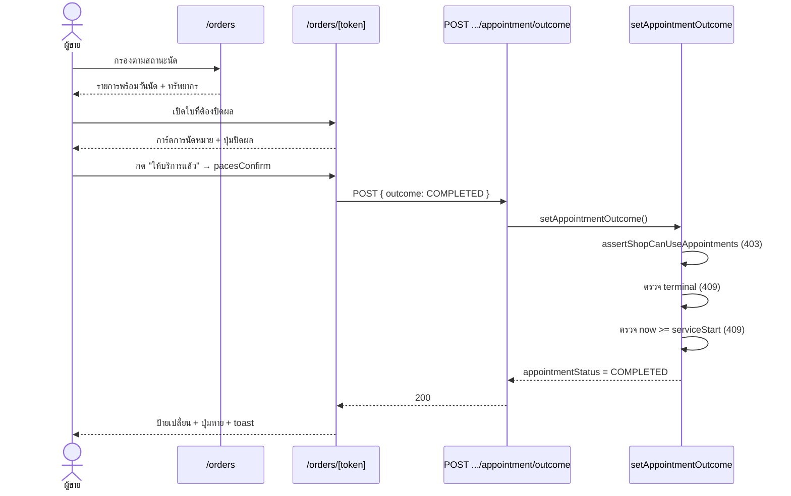
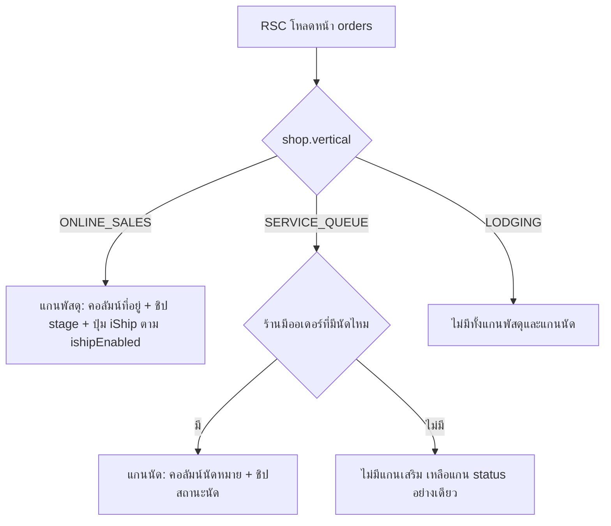

> **โมดูล:** M00036-ServiceOrderSurface
> **ประเภทเอกสาร:** Business Requirements Document (BRD)
> **เวอร์ชัน:** 1.0
> **วันที่จัดทำ:** 2026-08-07
> **สถานะ:** Draft — รอ user review
> **เจ้าของเอกสาร:** BA (ดู [[Feature-Docs-Ownership]])

# BRD: หน้าการเข้ารับบริการสำหรับร้านคิวงาน (Service Order Surface)

---

## 1. บทนำ

### 1.1 วัตถุประสงค์ของเอกสาร

แปลงความต้องการใน [[PRD]] เป็นข้อกำหนดที่ทดสอบได้รายข้อ สำหรับหน้า `/seller/orders` และ `/seller/orders/[token]` ของร้าน `Shop.vertical = 'SERVICE_QUEUE'`

### 1.2 ขอบเขตของระบบ

**อยู่ในขอบเขต**

| # | รายการ | ไฟล์หลักที่กระทบ |
|---|--------|-----------------|
| 1 | ตารางรายการเดสก์ท็อป | `orders/components/OrdersTable.tsx` |
| 2 | การ์ดรายการมือถือ + toolbar/ชิป | `orders/components/OrderCard.tsx`, `OrdersList.tsx` |
| 3 | ชั้นข้อมูล RSC ของหน้ารายการ | `orders/page.tsx` |
| 4 | หน้ารายละเอียด + การ์ดใหม่ | `orders/[token]/page.tsx`, `[token]/components/*` |
| 5 | คลังคำผันตามประเภทกิจการ | `src/lib/seller-menu.ts` (`ORDER_VOCAB`) |
| 6 | SSOT สถานะนัดหมายสำหรับหน้ารายการ | ไฟล์ใหม่ (เสนอ `src/lib/appointment-stage.ts`) |

**นอกขอบเขต:** schema/migration, API ใหม่, `/queues`, ฝั่งผู้ซื้อ `(marketing)/o/[token]`, `LODGING` (ยกเว้นบั๊กปุ่ม iShip)

### 1.3 กลุ่มผู้ใช้งาน

| กลุ่ม | สิทธิ์ | บทบาทในฟีเจอร์นี้ |
|-------|-------|------------------|
| ผู้ขายร้าน `SERVICE_QUEUE` ที่ใช้คิวงาน | เจ้าของร้าน | ผู้ใช้หลัก — ดูนัด ปิดผลนัด |
| ผู้ขายร้าน `SERVICE_QUEUE` แบบ walk-in | เจ้าของร้าน | ต้องไม่เห็นองค์ประกอบนัดหมายที่ไม่ได้ใช้ |
| ผู้ขายร้าน `ONLINE_SALES` / `LODGING` | เจ้าของร้าน | ต้องไม่ได้รับผลกระทบ |

---

## 2. ความต้องการหลัก (Functional Requirements)

### 2.1 ถอดโดเมนพัสดุออกจากร้านที่ไม่ใช่ ONLINE_SALES

#### FR-SOV-001: ซ่อนคอลัมน์ที่อยู่จัดส่งและตัวกรองที่เกาะอยู่

- **คำอธิบาย:** คอลัมน์ `shipTo` (`OrdersTable.tsx:384-478`) รวมบล็อก "จัดส่งโดย", `ShipmentHoverCard` และ `MiniShipmentTimeline` ในเซลล์เดียวกัน ต้องไม่ถูกประกอบเข้า `columns` เมื่อร้านไม่ใช่ `ONLINE_SALES`
- **เงื่อนไข:** `OrdersTable` ต้องรับ prop ใหม่ที่บอกได้ว่าร้านมีแกนพัสดุหรือไม่ (ปัจจุบันรับแค่ `orders/ishipEnabled/vocab/stageFilter/busy` ที่บรรทัด 156)
- **ข้อควรระวัง:** ตัวกรอง "ขนส่ง" เรียก `filterColumn('shipTo')` (บรรทัด 722-725) ซึ่งเป็น optional chain — เมื่อคอลัมน์หายไป ตัวกรองจะกลายเป็น no-op ที่กดได้แต่ไม่เกิดอะไร ต้อง**ซ่อนตัวกรองในเงื่อนไขเดียวกัน** ไม่ใช่ปล่อยไว้
- **Acceptance:**
  - AC-1.1 ร้าน `SERVICE_QUEUE` เปิด `/orders` บนเดสก์ท็อป → ไม่มีหัวคอลัมน์ "ที่อยู่จัดส่ง" และไม่มีข้อความ "ยังไม่มีที่อยู่"/"ไม่มีหมายเลขพัสดุ" ในหน้าเลย
  - AC-1.2 ดรอปดาวน์ "ขนส่ง" ไม่ปรากฏบน toolbar ของร้าน `SERVICE_QUEUE`
  - AC-1.3 ร้าน `ONLINE_SALES` — คอลัมน์และตัวกรองยังทำงานเหมือนเดิมทุกประการ

#### FR-SOV-002: ปุ่ม "ดึงจาก iShip" ต้องผูกกับสิทธิ์จริง

- **คำอธิบาย:** ปุ่มที่ `OrdersList.tsx:464-471` ไม่เช็คทั้ง `ishipEnabled` และ `vertical` — เปิด `IShipImportModal` ได้จากทุกร้าน
- **Acceptance:**
  - AC-2.1 ร้าน `SERVICE_QUEUE` และ `LODGING` → ไม่เห็นปุ่มนี้ทั้งมือถือและเดสก์ท็อป
  - AC-2.2 ร้าน `ONLINE_SALES` ที่ยังไม่ได้เชื่อม iShip → ไม่เห็นปุ่มนี้ (พฤติกรรมใหม่ที่ถูกต้อง)
  - AC-2.3 ร้าน `ONLINE_SALES` ที่เชื่อม iShip แล้ว → เห็นปุ่มและใช้งานได้เหมือนเดิม

#### FR-SOV-003: ผันคำ "ยืนยันการจัดส่ง" ในเช็กลิสต์สถานะ

- **คำอธิบาย:** `OrdersTable.tsx:534-541` hardcode คำนี้ทุก vertical ทั้งที่คอมโพเนนต์รับ `vocab` เข้ามาแล้ว
- **การเปลี่ยนแปลง:** เพิ่มช่องใหม่ใน `OrderVocab` (เสนอชื่อ `fulfillLabel`) — ห้ามต่อสตริงที่ call site ตามเหตุผลที่ `seller-menu.ts:346-347,372-377` อธิบายไว้
- **Acceptance:**
  - AC-3.1 `SERVICE_QUEUE` เห็นคำที่สื่อถึงการให้บริการ ไม่ใช่การจัดส่ง
  - AC-3.2 `LODGING` เห็นคำที่สื่อถึงการเข้าพัก
  - AC-3.3 `ONLINE_SALES` ยังเห็น "ยืนยันการจัดส่ง" ตามเดิม (ไม่มี regression)
  - AC-3.4 `resolveOrderVocab('ค่าที่ไม่รู้จัก')` ยังคืนชุด `ONLINE_SALES` ตาม fail-safe เดิม

#### FR-SOV-004: การ์ด "การส่งมอบ" ต้องไม่แสดงกับงานบริการ

- **คำอธิบาย:** `ShippingAddress.tsx:45` ใช้ `fulfillmentMode === 'NO_SHIPPING'` เป็นเงื่อนไขแสดงฟอร์มลิงก์ดาวน์โหลด ซึ่งคลุมทั้งสินค้าดิจิทัลและงานบริการ
- **การเปลี่ยนแปลง:** เพิ่มเงื่อนไขแยกงานบริการออก — คอมเมนต์เดิมที่บรรทัด 44 ระบุว่า "เจตนาเช็ค NO_SHIPPING ตรง ๆ ไม่รวม PICKUP — จองที่พักไม่มีลิงก์ดาวน์โหลดให้ส่งมอบ" แสดงว่าเจตนาเดิมคือแยกโดเมนอยู่แล้ว แค่ยังไม่ครอบงานบริการ
- **Acceptance:**
  - AC-4.1 ออเดอร์งานบริการ (`type = 'SERVICE'`) → ไม่เห็นการ์ดที่ขอ "กรอก URL เพื่อส่งมอบให้ผู้ซื้อ"
  - AC-4.2 ออเดอร์สินค้าดิจิทัล (`type = 'DIGITAL'`) → ยังเห็นฟอร์มลิงก์ตามเดิม
  - AC-4.3 ออเดอร์เก่าในร้าน `SERVICE_QUEUE` ที่ `fulfillmentMode = 'SHIPPED'` → ยังเห็นการ์ดที่อยู่จัดส่งเต็มรูปตามข้อมูลจริง (BR-SOV-10)

### 2.2 เพิ่มโดเมนนัดหมายเข้าไป

#### FR-SOV-005: คอลัมน์ "นัดหมาย" บนตารางเดสก์ท็อป

- **คำอธิบาย:** แทนที่พื้นที่ที่ FR-SOV-001 ถอดออก ด้วยคอลัมน์ที่แสดง วันเวลานัด · ชื่อทรัพยากร · ป้ายสถานะนัด
- **กฎการแสดงวันเวลา:** ตัดสิน "ทั้งวัน vs ช่วงเวลา" ด้วย `isAllDayAppointment(start, end)` จากข้อมูลของแถวนั้น **ไม่ใช่จากโหมดปัจจุบันของร้าน** (BR-RSV-57, `appointments.ts:104-108`) และ format ผ่าน `src/lib/format-date.ts` เท่านั้น (`docs/conventions/date-format.md`)
- **กฎการแสดงป้าย:** ป้ายมาจาก `APPOINTMENT_STATUS_LABEL` เท่านั้น (BR-SOV-03)
- **Acceptance:**
  - AC-5.1 แถวที่มีนัด → เห็นวันเวลา + ชื่อทรัพยากร + ป้ายสถานะครบ 3 อย่าง
  - AC-5.2 แถว walk-in ในร้านเดียวกัน → เห็นขีดคั่นที่อ่านได้ว่าไม่มีนัด ไม่ใช่ช่องว่าง
  - AC-5.3 นัดที่บันทึกตอนร้านใช้โหมดรายวัน ยังแสดงว่า "ทั้งวัน" แม้ร้านเปลี่ยนเป็นโหมดระบุช่วงเวลาแล้ว
  - AC-5.4 คอลัมน์นี้ไม่ปรากฏเลยในร้าน `ONLINE_SALES` และ `LODGING`

#### FR-SOV-006: ข้อมูลนัดหมายบนการ์ดมือถือ

- **คำอธิบาย:** การ์ดมือถือแสดงบล็อกนัดหมายชุดเดียวกับ FR-SOV-005 ในตำแหน่งที่บล็อกพัสดุเคยอยู่ (`OrderCard.tsx:245-305` ซึ่ง self-hide เมื่อไม่มี `trackingNo` อยู่แล้ว)
- **Acceptance:**
  - AC-6.1 การ์ดของออเดอร์ที่มีนัด → เห็นวันนัด + สถานะ
  - AC-6.2 การ์ดของออเดอร์ walk-in → ไม่มีบล็อกนี้เลย (ไม่ใช่บล็อกว่าง)

#### FR-SOV-007: การ์ด "การนัดหมาย" ในหน้ารายละเอียด พร้อมปุ่มปิดผล

- **คำอธิบาย:** งานชิ้นสำคัญที่สุดของฟีเจอร์นี้ — `setAppointmentOutcome` (`appointment.service.ts:304-333`) และ `POST /api/orders/[token]/appointment/outcome` มีอยู่แล้วและไม่มีผู้เรียกฝั่ง UI เลย
- **เนื้อหาการ์ด:** ชื่อทรัพยากร · วันเวลานัด · ป้ายสถานะ · ปุ่ม "ให้บริการแล้ว" และ "ไม่มาตามนัด"
- **กฎของปุ่ม (ตามที่ server บังคับอยู่แล้ว — UI ต้องสะท้อนล่วงหน้า ไม่ใช่ปล่อยให้กดแล้วเจอ error):**

| เงื่อนไข | พฤติกรรมปุ่ม | ที่มา |
|---------|-------------|------|
| `appointmentStatus ∈ {COMPLETED, NO_SHOW}` | ไม่แสดงปุ่มเลย | `appointment.service.ts:320-322` → 409 `APPOINTMENT_TERMINAL` |
| `now < serviceStart` | ปุ่มถูกปิด + อธิบายว่ายังไม่ถึงเวลานัด | `appointment.service.ts:324-326` → 409 `APPOINTMENT_NOT_STARTED` |
| ไม่มี `serviceStart` | ไม่แสดงการ์ดเลย | `appointment.service.ts:319` → 404 |
| อื่น ๆ | กดได้ ผ่าน `pacesConfirm` ก่อนเสมอ | BR-SOV-04, ความเสี่ยง §6.1 ของ PRD |

- **สิ่งที่ต้องไม่เกิด:** การปิดผลต้องไม่แตะ `Order.status` และต้องไม่กระทบ Trust Score (BR-RSV-33/35 — service ระบุไว้ชัดที่ `appointment.service.ts:301-302`) UI ต้องไม่พยายาม "ช่วย" อัปเดตสถานะออเดอร์ตามไปด้วย
- **Acceptance:**
  - AC-7.1 ออเดอร์ที่ถึงเวลานัดแล้ว → กด "ให้บริการแล้ว" → ยืนยัน → ป้ายเปลี่ยนเป็น "ให้บริการแล้ว" และปุ่มหายไป
  - AC-7.2 กด "ไม่มาตามนัด" → ป้ายเปลี่ยนเป็น "ไม่มาตามนัด" และ `Order.status` **ไม่เปลี่ยน**
  - AC-7.3 ออเดอร์ที่ยังไม่ถึงเวลานัด → ปุ่มถูกปิดพร้อมคำอธิบาย ไม่ใช่กดแล้วขึ้น error
  - AC-7.4 ยิง API ตรงกับนัดที่ปิดผลไปแล้ว → 409 (guard เดิมยังทำงาน)
  - AC-7.5 ยิง API ตรงจากร้านที่ไม่ใช่ `SERVICE_QUEUE` → 403 (`assertShopCanUseAppointments`)

#### FR-SOV-008: ตัวกรองและตัวนับตามสถานะนัดหมาย

- **คำอธิบาย:** เพิ่มแกนกรองที่สองตามมติ D-1 (สองแกนแยก) — `Order.status` ยังเป็นแกนหลัก, สถานะนัดเป็นแกนเสริม
- **กฎ SSOT (สำคัญที่สุดของข้อนี้):** ตัวเลขบนชิป/ดรอปดาวน์ กับรายการที่ถูกกรอง ต้องมาจากฟังก์ชันเดียวกัน ห้ามนับด้วย SQL แล้วกรองด้วย TS — บทเรียนตรงจาก `deriveShippingStage` (`src/lib/order-stage.ts:82-84`)
- **การซ่อนตัวเอง:** ถ้าไม่มีออเดอร์ใดในร้านมีนัดเลย แกนนี้ต้องไม่ปรากฏ — แพตเทิร์นเดียวกับ `hasStageAxis` (`OrdersList.tsx:246-285`)
- **Acceptance:**
  - AC-8.1 กดชิป/ตัวเลือกใด ๆ → จำนวนแถวที่เหลือตรงกับตัวเลขบนชิปนั้นเป๊ะ
  - AC-8.2 ร้าน walk-in ล้วน → ไม่เห็นแกนนี้เลย
  - AC-8.3 แกน `Order.status` เดิมยังใช้ได้พร้อมกัน (คนละแกน ไม่ล้างกัน) เหมือนที่ `?status=` กับ `?stage=` อยู่ด้วยกันได้
  - AC-8.4 ตัวกรองสะท้อนใน URL และรีเฟรชแล้วยังอยู่

---

## 3. Acceptance Criteria สรุป

### 3.1 ร้าน SERVICE_QUEUE

- ไม่มีคำว่า "จัดส่ง"/"พัสดุ"/"ขนส่ง" ปรากฏบนหน้ารายการเลย
- เห็นวันนัด สถานะนัด ทรัพยากร ในรายการและรายละเอียด
- ปิดผลนัดได้จริงจากหน้ารายละเอียด
- ร้าน walk-in ไม่เห็นองค์ประกอบนัดหมายใด ๆ

### 3.2 Regression (บังคับ)

- ร้าน `ONLINE_SALES`: คอลัมน์ที่อยู่ · ตัวกรองขนส่ง · ชิปพัสดุ · hover panel · ปุ่ม iShip (เมื่อเชื่อมแล้ว) ทำงานเหมือนเดิมทุกจุด
- ร้าน `LODGING`: ทุกอย่างเหมือนเดิม ยกเว้นปุ่ม "ดึงจาก iShip" ที่หายไปตาม FR-SOV-002
- ออเดอร์เก่าที่มีข้อมูลพัสดุในร้านบริการ: เปิดหน้ารายละเอียดแล้วยังเห็นที่อยู่/พัสดุครบ

---

## 4. Business Flows

### 4.1 Flow หลัก: ปิดผลนัด

### 4.2 Flow การตัดสินว่าจะแสดงอะไร

---

## 5. Use Case Scenarios

### Scenario 1: BT Premium ปิดงานตอนเย็น (Best Case)

ร้านเปิด `/orders` กรองสถานะนัด "ลูกค้ายืนยันแล้ว" เห็น 4 แถว แต่ละแถวบอกวันเวลาและช่างที่รับงาน เปิดใบแรกที่งานเสร็จแล้ว กด "ให้บริการแล้ว" ยืนยัน ป้ายเปลี่ยนทันที ปุ่มหายไป กลับมารายการ ตัวนับบนชิปลดจาก 4 เหลือ 3 และรายการที่กรองอยู่เหลือ 3 แถวจริง

### Scenario 2: ลูกค้าไม่มาตามนัด

ร้านเปิดใบที่เลยเวลานัดมา 2 ชั่วโมง กด "ไม่มาตามนัด" ระบบยืนยันโดยระบุชื่อลูกค้าและวันนัดของใบนั้นในข้อความ กดยืนยัน สถานะเป็น "ไม่มาตามนัด" — `Order.status` ยังเป็น `PENDING` เหมือนเดิม และคะแนนความน่าเชื่อถือของทั้งสองฝ่ายไม่ขยับ (BR-RSV-35)

### Scenario 3: ร้านบริการแบบ walk-in ล้วน (Edge)

ร้านไม่เคยสร้างทรัพยากรใน `/queues` เลย เปิด `/orders` เห็นตารางที่มีเฉพาะ ลูกค้า · รายการ · การชำระเงิน · ยอด · สถานะ · ดำเนินการ ไม่มีคอลัมน์นัดหมาย ไม่มีชิปสถานะนัด ไม่มีคอลัมน์ที่อยู่จัดส่ง — หน้าจอไม่มีช่องว่างที่ต้องอธิบาย

### Scenario 4: ออเดอร์เก่าที่มีพัสดุจริง (Edge)

BT Premium เคยเป็นร้านประเภทอื่นก่อนถูกเปลี่ยน `vertical` ที่ระดับ DB เมื่อ 2026-08-05 มีออเดอร์เก่า 3 ใบที่ `fulfillmentMode = 'SHIPPED'` และมีเลขพัสดุจริง — หน้ารายการไม่แสดงคอลัมน์ที่อยู่ (ตามกฎ vertical) แต่เมื่อเปิดใบนั้น การ์ดที่อยู่จัดส่งและข้อมูลพัสดุยังแสดงครบตามข้อมูลจริง ไม่มีอะไรหายไป

### Scenario 5: กดปิดผลก่อนถึงเวลา (Negative)

ผู้ขายเปิดใบที่นัดไว้พรุ่งนี้ ปุ่มปิดผลถูกปิดพร้อมข้อความบอกว่าทำได้เมื่อถึงเวลานัด — ผู้ใช้ไม่ต้องกดเพื่อค้นพบว่าทำไม่ได้ และถ้ามีใครยิง API ตรง server ยังตอบ 409 เหมือนเดิม

---

## 6. ความต้องการด้านคุณภาพ

### 6.1 ความถูกต้องของข้อมูล
- ตัวนับทุกตัวต้องมาจาก symbol เดียวกับตัวกรอง (BR-SOV-06)
- วันที่/เวลาทุกจุดผ่าน `src/lib/format-date.ts` (`docs/conventions/date-format.md`)

### 6.2 ความรวดเร็ว
- ไม่เพิ่ม query ต่อแถว — ข้อมูลนัดอยู่บน `Order` เองอยู่แล้ว ต้อง `select` มาพร้อมชุดเดิม ไม่ใช่ยิงเพิ่มรายใบ
- ทุกการกรอง/โหลดใหม่ต้องผ่าน `useListBusy()` ที่มีอยู่แล้ว เพื่อให้มีแผงโหลดทับพื้นที่ผลลัพธ์ตามพฤติกรรมปัจจุบันของหน้า

### 6.3 ความน่าเชื่อถือ
- guard ฝั่ง server ทั้ง 3 ชั้นของ 00024 ต้องยังทำงาน — UI ที่เพิ่มมาเป็นชั้นที่ 4 (ความสะดวก) ไม่ใช่ชั้นความปลอดภัย

### 6.4 ความปลอดภัย
- ห้ามส่ง PII ใหม่ข้าม RSC boundary; prop ทุกตัวต้อง serializable
- การเรียก API ต้องผ่าน guard CSRF/rate-limit เดิมของ `guardApi`

### 6.5 ความสะดวกในการใช้งาน
- ปุ่มบนมือถือ ≥ 44px
- ห้าม emoji — ใช้ icon จริงเท่านั้น (Hard Rule 12); ไอคอนของแต่ละสถานะนัดที่ยังไม่ได้ระบุ ต้อง**ถาม user ก่อน** ห้ามเดา
- หน้า `(paces)` ต้องประกอบจาก Paces primitive เท่านั้น (Hard Rule 7) และ toast ทุกตัวใช้ `pacesToast` (Hard Rule 9)

---

## 7. ข้อจำกัด

### 7.1 ทางธุรกิจ
- `vertical` เปลี่ยนผ่าน UI ไม่ได้หลังร้านมี slug — ทดสอบสลับประเภทต้องทำที่ระดับ DB
- `COMPLETED`/`NO_SHOW` เป็น terminal ย้อนกลับไม่ได้

### 7.2 ทางเทคนิค
- ไม่มี migration ในฟีเจอร์นี้ — ถ้าพบว่าต้องเพิ่มคอลัมน์ ให้หยุดแล้วกลับมาทบทวน scope ก่อน
- `OrdersTable` ถูกเรียกจาก `OrdersList` ที่เดียว — การเพิ่ม prop ปลอดภัย แต่ต้องยืนยันด้วย grep ก่อนแก้

---

## 8. กฎทางธุรกิจ (อ้างอิง)

ดู [[PRD]] §4.1 — BR-SOV-01 ถึง BR-SOV-10

---

## 9. อภิธานศัพท์

ดู [[PRD]] §7

---

## 10. สรุป

ฟีเจอร์นี้ทำ 2 อย่างที่แยกกันไม่ได้: **ถอดโดเมนพัสดุออก** (FR-SOV-001 ถึง 004) และ **ใส่โดเมนนัดหมายเข้าไป** (FR-SOV-005 ถึง 008) โดยข้อที่สร้างมูลค่าสูงสุดคือ FR-SOV-007 ซึ่งปิดวงจรที่ค้างมาตั้งแต่ feature 00024 ขึ้น prod — API และ service พร้อมใช้มาตลอด ขาดแค่ปุ่ม
