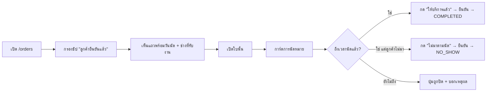

> **โมดูล:** M00036-ServiceOrderSurface
> **ประเภทเอกสาร:** Product Requirements Document (PRD)
> **เวอร์ชัน:** 1.0
> **วันที่จัดทำ:** 2026-08-07
> **สถานะ:** Draft — รอ user review (decision D-1..D-4 เสนอไว้ใน §10.2 ยังไม่ได้ล็อก)
> **เจ้าของเอกสาร:** BA + PO + PM (ดู [[Feature-Docs-Ownership]])

# PRD: หน้าการเข้ารับบริการสำหรับร้านคิวงาน (Service Order Surface)

---

## Executive Summary

หน้า `/seller/orders` (รายการ) และ `/seller/orders/[token]` (รายละเอียด) ถูกออกแบบและ tune มาต่อเนื่องตลอดปี 2026 โดยยึด `ONLINE_SALES` เป็นศูนย์กลาง — คอลัมน์ที่อยู่จัดส่ง, ชิปกรองสถานะพัสดุ, ไทม์ไลน์ขนส่ง, การ์ด iShip, hover panel เลขพัสดุ ล้วนเป็นงานที่ลงแรงไปกับ "ของไปไหน ไปยังไง ถึงไหนแล้ว"

ร้าน `SERVICE_QUEUE` (เช่น BT Premium) ไม่มีคำถามชุดนั้นเลย ลูกค้าเดินมาที่ร้านหรือถูกนัดหมายไว้ คำถามจริงคือ "นัดวันไหน ใครรับงาน ลูกค้ายืนยันหรือยัง มาแล้วหรือยัง" — ซึ่ง**ระบบมีข้อมูลชุดนี้ครบอยู่แล้ว** จาก feature 00024 (`Order.serviceResourceId`, `serviceStart/serviceEnd`, `appointmentStatus`) แต่ไม่เคยถูกนำมาแสดงบนหน้า orders เลยแม้แต่จุดเดียว

การสำรวจโค้ดจริงพบว่าปัญหา**ไม่ได้อยู่ทุกจุด** — หลายส่วนซ่อนตัวเองถูกต้องแล้ว (`deriveShippingStage()` คำนวณเฉพาะ `isOnlineSales` ที่ `orders/page.tsx:101,195`; `order-action-set.ts:84-94` ตัด action พัสดุเมื่อ `fulfillmentMode !== 'SHIPPED'`; `ShippingCard` ไม่ render เมื่อร้านไม่ได้เชื่อม iShip) สิ่งที่พังจริงมี 5 จุด และ **1 ในนั้นร้ายแรงกว่าเรื่องการแสดงผลทั้งหมดรวมกัน**:

1. **คอลัมน์ "ที่อยู่จัดส่ง" บนตารางเดสก์ท็อป render โดยไม่มีเงื่อนไข `vertical` เลย** — `OrdersTable.tsx:384-478` เป็นสมาชิกดิบของ `const columns = [...]` (บรรทัด 239) และคอมโพเนนต์ไม่เคยรับ prop `vertical` เข้ามาด้วยซ้ำ (`OrdersTable.tsx:156` รับแค่ `orders/ishipEnabled/vocab/stageFilter/busy`) ผลคือทุกแถวของร้านบริการขึ้น "ยังไม่มีที่อยู่" + "ไม่มีหมายเลขพัสดุ" เต็มคอลัมน์กว้าง `min-w-56` ตลอดกาล
2. **ปุ่ม "ดึงจาก iShip" render โดยไม่ผูกกับอะไรเลย** — `OrdersList.tsx:464-471` ไม่เช็คทั้ง `ishipEnabled` และ `vertical` (ต่างจากปุ่มพิมพ์ใบปะหน้าใน `BulkActionBar` ที่ผูกไว้) ร้านบริการและร้านบ้านพักเห็นปุ่มเปิดโมดัลนำเข้าพัสดุที่ไม่มีทางใช้ได้
3. **เช็กลิสต์สถานะในตาราง hardcode คำว่า "ยืนยันการจัดส่ง"** — `OrdersTable.tsx:534-541` ใช้คำเดียวกันทุก vertical ทั้งที่ระบบมี SSOT การผันคำ (`ORDER_VOCAB`, `src/lib/seller-menu.ts:380-417`) อยู่แล้วและหน้านี้ก็รับ `vocab` เข้ามาแล้ว
4. **การ์ดที่หน้ารายละเอียดถามหา "ลิงก์ดาวน์โหลด" กับงานบริการ** — `ShippingAddress.tsx:45` ตัดสินด้วย `fulfillmentMode === 'NO_SHIPPING'` ล้วน ซึ่งเป็นเงื่อนไขที่คลุมทั้งสินค้าดิจิทัลและงานบริการไว้ด้วยกัน ร้านที่รับติดตั้งไฟหน้ารถจึงได้ฟอร์ม "กรอก URL เพื่อส่งมอบให้ผู้ซื้อ" ที่ไม่มีทางกรอกอะไรที่สมเหตุสมผล
5. 🛑 **ผู้ขายปิดงานนัดหมายไม่ได้เลยจากหน้าจอใด ๆ ในระบบ** — service `markAppointmentOutcome` (`appointment.service.ts:307-330`) และ route `POST /api/orders/[token]/appointment/outcome` มีอยู่จริงและทำงานได้ แต่ `grep "appointment/outcome"` ทั้ง `src/` **ไม่พบผู้เรียกฝั่ง UI แม้แต่รายเดียว** ปฏิทินคิวงาน (`AppointmentCalendar.tsx`) ยิงแค่ `GET /api/shops/current/appointments` เป็น read-only ล้วน ส่วนฝั่งผู้ซื้อมี `AppointmentCard.tsx` เรียก `/confirm` และ `/reschedule-request` ครบ — แปลว่า **สถานะ `COMPLETED` ("ให้บริการแล้ว") และ `NO_SHOW` ("ไม่มาตามนัด") ไม่มีทางเกิดขึ้นจริงในฐานข้อมูลได้เลยตั้งแต่วันที่ 00024 ขึ้น prod** นัดทุกใบค้างอยู่ที่ `SCHEDULED`/`CONFIRMED_BY_BUYER` ตลอดไป

ฟีเจอร์นี้จึงไม่ใช่งาน "ซ่อนคอลัมน์ที่ไม่เกี่ยว" อย่างเดียว แต่คือการทำให้หน้า orders ของร้านบริการ**พูดภาษาของงานบริการ** และ**ปิดวงจรของงานนัดหมายที่ค้างครึ่งทางมาตั้งแต่ 00024** โดยไม่แตะ schema, ไม่แตะ enum, ไม่แตะ API ที่มีอยู่ (ทั้งหมดพร้อมใช้แล้ว) และไม่แตะพฤติกรรมของ `ONLINE_SALES`/`LODGING` แม้แต่บรรทัดเดียว

---

## 1. Business Goals & KPIs

### 1.1 เป้าหมายทางธุรกิจ

| เป้าหมาย | รายละเอียด |
|----------|-----------|
| G-1 | ร้าน `SERVICE_QUEUE` ใช้หน้า orders ได้โดยไม่ต้องมองข้ามข้อมูลที่ไม่เกี่ยวกับตัวเอง — ทุกคอลัมน์/ปุ่ม/การ์ดที่เห็นต้องมีความหมายกับธุรกิจของเขาจริง |
| G-2 | ปิดวงจรงานนัดหมายให้ครบ — ผู้ขายทำเครื่องหมาย "ให้บริการแล้ว"/"ไม่มาตามนัด" ได้จริงเป็นครั้งแรกนับตั้งแต่ 00024 ขึ้น prod |
| G-3 | ข้อมูลนัดหมายที่ระบบเก็บอยู่แล้วถูกมองเห็นในที่ที่ผู้ขายทำงานจริง (หน้า orders) ไม่ใช่แค่ในปฏิทินคิวงานที่ต้องเปิดแยก |
| G-4 | ไม่มี regression ต่อร้าน `ONLINE_SALES` และ `LODGING` — งานทั้งหมดเป็น additive/conditional เท่านั้น |

### 1.2 ตัวชี้วัดความสำเร็จ (KPIs)

| KPI | Baseline (2026-08-07) | เป้าหมาย |
|-----|----------------------|---------|
| จำนวนออเดอร์ที่มี `appointmentStatus ∈ {COMPLETED, NO_SHOW}` | **0 ใบ (เป็นไปไม่ได้เชิงโครงสร้าง — ไม่มี UI)** | > 0 ภายใน 7 วันหลัง deploy |
| จำนวนองค์ประกอบเกี่ยวกับพัสดุที่ปรากฏบนหน้า orders ของร้าน `SERVICE_QUEUE` | 3 จุด (คอลัมน์ที่อยู่, ปุ่ม iShip, คำว่า "ยืนยันการจัดส่ง") | 0 จุด |
| จำนวนคลิกจาก "เปิดหน้า orders" ถึง "ปิดผลงานนัดหนึ่งใบ" | ทำไม่ได้ (∞) | ≤ 3 คลิก |
| Regression บนร้าน `ONLINE_SALES`/`LODGING` | — | 0 (ยืนยันด้วย QA §3.7 ของ TestCase) |

---

## 2. User Personas (กลุ่มผู้ใช้งาน)

### 2.1 ร้านคิวงานที่ใช้ระบบนัดหมาย (BT Premium)

- **ใครคือคนนี้:** ร้านรับติดตั้ง/ตกแต่งที่ลูกค้าต้องจองคิวเข้ามาล่วงหน้า มีทรัพยากร (ช่าง/ช่องบริการ) จำกัดต่อวัน
- **งานประจำวัน:** เปิดหน้ารายการตอนเช้าเพื่อดูว่าวันนี้มีใครนัดไว้บ้าง ลูกค้ายืนยันมาแล้วกี่ราย ตอนเย็นปิดผลว่าใครมา ใครไม่มา
- **สิ่งที่เจ็บวันนี้:** ต้องสลับไปดูปฏิทินคิวงานเพื่อรู้ว่าใครนัดวันไหน แล้วกลับมาที่หน้า orders เพื่อดูเรื่องเงิน และ**ปิดผลนัดไม่ได้เลยไม่ว่าจะอยู่หน้าไหน** ครึ่งหน้าจอเป็นคอลัมน์ที่อยู่จัดส่งที่เขียนว่า "ยังไม่มีที่อยู่" ทุกแถว
- **สิ่งที่ต้องการ:** เห็นวันนัด · สถานะนัด · ช่าง/คิวที่รับงาน อยู่ในแถวเดียวกับยอดเงินและชื่อลูกค้า และกดปิดผลได้จากที่นั่น

### 2.2 ร้านบริการแบบรับหน้าร้าน (walk-in)

- **ใครคือคนนี้:** ร้าน `SERVICE_QUEUE` ที่ไม่ได้ใช้ระบบคิวงานเลย ลูกค้าเดินเข้ามาแล้วเปิดบิลหน้างาน
- **ข้อมูลจริงของเขา:** `appointmentStatus = null` และ `serviceResourceId = null` ทุกใบ — นี่คือเหตุผลเดียวกับที่ `ORDER_VOCAB.SERVICE_QUEUE.dateLabel` ถูกเปลี่ยนเป็น "วันที่สร้าง" ไปแล้วเมื่อ 2026-08-07
- **สิ่งที่ต้องการ:** หน้าจอที่ไม่มีคอลัมน์/ตัวกรองว่างเปล่าที่ทำให้เข้าใจว่าระบบพัง — สิ่งที่ไม่ใช้ต้อง**หายไป** ไม่ใช่**ว่าง**

### 2.3 ร้านขายออนไลน์และร้านบ้านพัก (ผู้ได้รับผลกระทบทางอ้อม)

- ต้องไม่รู้สึกถึงการเปลี่ยนแปลงใด ๆ ยกเว้นข้อเดียว: ร้านบ้านพักจะไม่เห็นปุ่ม "ดึงจาก iShip" อีกต่อไป (ซึ่งเป็นการแก้บั๊กที่มีอยู่ก่อนแล้ว ไม่ใช่การถอดฟีเจอร์)

---

## 3. Business Requirements

### 3.1 ถอดสิ่งที่ไม่ใช่โดเมนของร้านบริการออก

| ID | ความต้องการ |
|----|------------|
| BR-3.1.1 | คอลัมน์ "ที่อยู่จัดส่ง" (รวมบล็อก "จัดส่งโดย" + hover panel + mini timeline ที่อยู่ในเซลล์เดียวกัน) ต้องไม่ปรากฏบนตารางเดสก์ท็อปเมื่อร้านไม่ใช่ `ONLINE_SALES` |
| BR-3.1.2 | ปุ่ม "ดึงจาก iShip" ต้องปรากฏเฉพาะร้านที่มีสิทธิ์ใช้จริง (เงื่อนไขเดียวกับที่หน้านี้ใช้อยู่แล้วสำหรับปุ่มพิมพ์ใบปะหน้า) — ครอบทั้ง `SERVICE_QUEUE` และ `LODGING` เพราะเป็นต้นเหตุเดียวกัน |
| BR-3.1.3 | คำว่า "ยืนยันการจัดส่ง" ในเช็กลิสต์สถานะต้องผันตามประเภทกิจการผ่าน SSOT `ORDER_VOCAB` — ห้ามต่อสตริงเองที่ call site |
| BR-3.1.4 | การ์ด "การส่งมอบ" (ฟอร์มลิงก์ดาวน์โหลด) ต้องไม่แสดงกับออเดอร์ที่เป็นงานบริการ |

### 3.2 ใส่สิ่งที่เป็นโดเมนของร้านบริการเข้าไป

| ID | ความต้องการ |
|----|------------|
| BR-3.2.1 | ตารางเดสก์ท็อปต้องมีคอลัมน์ "นัดหมาย" แทนที่คอลัมน์ที่ถอดออก แสดงวันเวลานัด + ชื่อทรัพยากร + ป้ายสถานะนัด สำหรับร้าน `SERVICE_QUEUE` |
| BR-3.2.2 | การ์ดมือถือต้องแสดงข้อมูลนัดหมายชุดเดียวกันเมื่อออเดอร์นั้นมีนัด |
| BR-3.2.3 | หน้ารายละเอียดต้องมีการ์ด "การนัดหมาย" แสดงข้อมูลนัดเต็ม พร้อม**ปุ่มปิดผล** ("ให้บริการแล้ว" / "ไม่มาตามนัด") ที่เรียก `POST /api/orders/[token]/appointment/outcome` ที่มีอยู่แล้ว |
| BR-3.2.4 | ต้องมีตัวกรอง/ตัวนับตามสถานะนัดหมาย โดยใช้ SSOT เดียวกับตัวเลขที่แสดง (ห้ามนับคนละทางกับที่กรอง) |

### 3.3 ความยืดหยุ่นต่อร้านที่ไม่ใช้นัดหมาย

| ID | ความต้องการ |
|----|------------|
| BR-3.3.1 | ทุกองค์ประกอบใน §3.2 ต้อง**ซ่อนตัวเอง**เมื่อร้านไม่มีข้อมูลนัดหมายจริง (walk-in ล้วน) — ไม่ใช่แสดงเป็นค่าว่าง |
| BR-3.3.2 | แถวที่ไม่มีนัดในร้านที่มีนัดปนกัน ต้องแสดงเป็นขีดคั่นที่อ่านได้ว่า "ไม่มีนัด" ไม่ใช่ช่องว่างที่ดูเหมือนข้อมูลหาย |

---

## 4. Business Rules & Constraints

### 4.1 กฎทางธุรกิจหลัก

| รหัส | กฎ | ที่มา |
|------|-----|------|
| BR-SOV-01 | องค์ประกอบโดเมนพัสดุทั้งหมดบนหน้า orders แสดงเฉพาะ `shop.vertical === 'ONLINE_SALES'` | ใหม่ (สืบทอดเกณฑ์เดียวกับ `orders/page.tsx:101`) |
| BR-SOV-02 | องค์ประกอบโดเมนนัดหมายแสดงเฉพาะร้านที่ `canUseAppointments(shop) === true` (คือ `vertical === 'SERVICE_QUEUE'`) | 00024 BR-RSV-01, `src/lib/appointments.ts:52` |
| BR-SOV-03 | ป้ายสถานะนัดทุกที่ต้องมาจาก `APPOINTMENT_STATUS_LABEL` เท่านั้น — ห้ามตั้งคำใหม่ | 00024, `appointments.ts:110-116` |
| BR-SOV-04 | ปุ่มปิดผลนัดต้องหายไปเมื่อสถานะเป็น terminal แล้ว (`COMPLETED`/`NO_SHOW`) ตาม `isTerminalAppointmentStatus()` | 00024 BR-RSV-31 |
| BR-SOV-05 | ปุ่มปิดผลต้องเคารพกฎ "ยังไม่ถึงเวลานัด ปิดผลไม่ได้" ที่ server บังคับอยู่แล้ว (`AppointmentNotStartedError` → 409) — UI ต้องแปลง error เป็นข้อความไทยที่อ่านรู้เรื่อง ไม่ใช่โยน error ดิบ | 00024 BR-RSV-34 |
| BR-SOV-06 | ตัวนับบนชิป/ดรอปดาวน์ กับตัวกรองรายการ ต้องมาจากฟังก์ชันเดียวกัน | `src/lib/order-stage.ts:82-84`, `docs/conventions/sibling-surface-parity.md` |
| BR-SOV-07 | "ให้บริการแล้ว" (`COMPLETED`) เป็นข้อเท็จจริงที่ผู้ขายยืนยันเอง จึงใช้สีเขียวได้ตาม Verified-Means-Green ส่วน `SCHEDULED`/`CONFIRMED_BY_BUYER` ยังไม่ใช่ข้อเท็จจริงที่เกิดขึ้นแล้ว ห้ามใช้เขียว | `.impeccable/design.json`, `docs/conventions/impeccable-design.md` |
| BR-SOV-08 | ห้ามเปลี่ยนพฤติกรรมของ `ONLINE_SALES` และ `LODGING` ยกเว้นการแก้บั๊กปุ่ม iShip ตาม BR-3.1.2 | ใหม่ (additive-only) |

### 4.2 ข้อจำกัดทางธุรกิจ

- ร้าน `SERVICE_QUEUE` ถูกล็อก `fulfillmentMode = NO_SHIPPING` ทั้งตอนสร้างและตอนแก้ไขสินค้าอยู่แล้ว (00030 BR-BKU-13, `product.service.ts:285`) — สินค้าที่ต้องส่งของจึงเกิดใหม่ในร้านประเภทนี้ไม่ได้อีกแล้ว
- แต่ **ข้อมูลเก่ายังมีได้จริง** — BT Premium ถูกเปลี่ยน `vertical` ที่ระดับ DB เมื่อ 2026-08-05 หลังจากเคยเป็นร้านประเภทอื่นมาก่อน ออเดอร์เก่าที่มีที่อยู่/พัสดุจริงจึงยังคงอยู่ในฐาน (ดู D-2)
- `vertical` เปลี่ยนผ่าน UI ไม่ได้หลังร้านมี `slug` แล้ว (00028) — ร้านจะไม่สลับประเภทไปมาระหว่างใช้งาน

### 4.3 กฎเรื่องออเดอร์เก่าที่มีข้อมูลพัสดุ

| รหัส | กฎ |
|------|-----|
| BR-SOV-09 | หน้า**รายการ**ซ่อนคอลัมน์พัสดุตาม `vertical` ล้วน (คาดเดาได้ ไม่กะพริบตามข้อมูล) |
| BR-SOV-10 | หน้า**รายละเอียด**ยังคงแสดงการ์ดที่อยู่/พัสดุตามข้อมูลจริงของออเดอร์ใบนั้น (`fulfillmentMode === 'SHIPPED'`) ตามพฤติกรรมเดิมที่ `ShippingAddress.tsx:43,83` ทำอยู่แล้ว — ออเดอร์เก่าจึงไม่มีข้อมูลใดหายไป เข้าถึงได้ผ่านการเปิดใบนั้น |

---

## 5. Out of Scope (นอกขอบเขต)

| # | สิ่งที่ไม่ทำในรอบนี้ | เหตุผล |
|---|---------------------|--------|
| 1 | เพิ่ม/แก้ schema, enum, migration | ข้อมูลที่ต้องใช้มีครบแล้วทั้งหมด (00024) |
| 2 | เพิ่ม/แก้ API endpoint | `outcome`/`confirm`/`reschedule-request`/`appointments` มีครบและทำงานได้แล้ว |
| 3 | ปรับ UI ส่วนอื่นของ `LODGING` | นอกคำสั่ง — แก้เฉพาะปุ่ม iShip ที่เป็นต้นเหตุเดียวกัน |
| 4 | ยกเครื่องปฏิทินคิวงาน `/queues` | คนละ surface — รอบนี้แค่ทำให้ orders ไม่ต้องพึ่งมัน |
| 5 | ให้ผู้ขาย**เลื่อนนัด**จากหน้า orders | `PATCH /api/orders/[token]/appointment` มีอยู่ แต่ต้องมี date picker + ตรวจ capacity → ขอบเขตใหญ่พอเป็นรอบถัดไป (ดู §10.3) |
| 6 | ไทม์ไลน์เหตุการณ์นัดหมายใน `ShippingActivity.tsx` | ต้องตรวจว่ามี `OrderEvent` ชนิดนัดหมายจริงหรือไม่ก่อน — ถ้าไม่มีจะกลายเป็นงานเพิ่ม event ชนิดใหม่ซึ่งเกินขอบเขต |

---

## 6. Risks & Mitigation

### 6.1 ความเสี่ยงทางธุรกิจ

| ความเสี่ยง | ผลกระทบ | การรับมือ |
|-----------|---------|----------|
| ร้านที่มีออเดอร์เก่าที่ต้องส่งของ หาที่อยู่จากหน้ารายการไม่เจอ | กลาง | BR-SOV-10 — หน้ารายละเอียดยังแสดงครบ; ระบุใน TestCase เป็นเคสยืนยัน |
| ผู้ขายกดปิดผล "ให้บริการแล้ว" ผิดใบแล้วย้อนไม่ได้ (terminal state) | สูง | ใช้ `pacesConfirm` ก่อนทุกครั้งตาม convention modal ของ (paces); ข้อความยืนยันต้องบอกชื่อลูกค้า + วันนัดของใบนั้น |

### 6.2 ความเสี่ยงทางเทคนิค

| ความเสี่ยง | ผลกระทบ | การรับมือ |
|-----------|---------|----------|
| `OrdersTable` ไม่เคยรับ `vertical` มาก่อน การเพิ่ม prop อาจกระทบ call site อื่น | ต่ำ | `OrdersTable` ถูกเรียกจาก `OrdersList` ที่เดียว |
| prop ที่ส่งข้าม RSC boundary ต้อง serializable | สูง (ล้มทั้งหน้า) | ส่งเฉพาะ primitive/plain object — ห้ามส่งฟังก์ชันหรือ `Date` object ดิบ (บทเรียน `feedback_rsc_props_must_be_serializable`) |
| ตัวกรองที่ผูกกับ `column.id` ตายเงียบถ้าคอลัมน์ถูกลบ | กลาง | ตัวกรอง "ขนส่ง" เกาะ `getColumn('shipTo')` อยู่ (`OrdersTable.tsx:722-725`) — เมื่อซ่อนคอลัมน์ต้อง**ซ่อนตัวกรองด้วย** ไม่ใช่ปล่อยให้ `?.` กลืน (บทเรียน `feedback_filter_bound_by_column_id_fails_silently`) |
| PII ของลูกค้ารั่วเข้า flight payload เมื่อเพิ่ม field ใหม่ | สูง | ชื่อทรัพยากร/วันนัดไม่ใช่ PII; ห้ามเพิ่ม field ผู้ซื้อใหม่เข้าไปโดยไม่จำเป็น (`feedback_rsc_pii_neutralize_at_source`) |

---

## 7. Glossary

| คำ | ความหมาย |
|----|----------|
| การเข้ารับบริการ | คำเรียก "ออเดอร์" ของร้าน `SERVICE_QUEUE` ตาม `ORDER_VOCAB` (00030) |
| ทรัพยากร (ServiceResource) | ช่าง/ช่องบริการ/เตียง ที่รับงานได้ทีละ N คิว (00024) |
| นัด (Appointment) | ออเดอร์ที่มี `serviceResourceId` + `serviceStart/End` — ไม่ใช่ตารางแยก |
| สถานะนัด terminal | `COMPLETED` หรือ `NO_SHOW` — แก้ต่อไม่ได้ |
| walk-in | ออเดอร์ร้านบริการที่ไม่มีนัดผูก (`serviceResourceId = null`) |

---

## 8. Success Metrics

| ตัวชี้วัด | วิธีวัด |
|----------|--------|
| ปิดผลนัดได้จริง | query `SELECT count(*) FROM "Order" WHERE "appointmentStatus" IN ('COMPLETED','NO_SHOW')` > 0 |
| ไม่เหลือคำพัสดุบนหน้าร้านบริการ | grep คำว่า "จัดส่ง"/"พัสดุ" ใน DOM ที่ render ของร้าน `SERVICE_QUEUE` = 0 |
| ไม่มี regression | เปิดหน้า orders ของร้าน `ONLINE_SALES` + `LODGING` เทียบกับก่อนแก้ |

---

## 9. Dependencies & Assumptions

### 9.1 Dependencies

- feature 00024 (Service Appointment Booking) — schema + service + API ทั้งหมด
- feature 00028 (Shop Business Type) — `Shop.vertical` 3 ค่า
- feature 00030 (Booking Business UX Unification) — `ORDER_VOCAB` SSOT + การล็อก `fulfillmentMode`
- `src/lib/appointments.ts` — `canUseAppointments`, `APPOINTMENT_STATUS_LABEL`, `isTerminalAppointmentStatus`, `isAllDayAppointment`

### 9.2 Assumptions

| # | สมมติฐาน | ผลถ้าผิด |
|---|----------|---------|
| A-1 | ออเดอร์ที่มีนัดใช้ `Order.type = 'SERVICE'` เสมอ (`APPOINTMENT_ORDER_TYPE`, `appointments.ts:8`) | เงื่อนไขแยกการ์ด §3.1.4 ต้องเปลี่ยนไปใช้ `serviceResourceId != null` แทน |
| A-2 | `ShippingActivity.tsx` ไม่มี event ชนิดนัดหมายให้ sync ในรอบนี้ | เพิ่มเป็นงานรอบถัดไป (ดู Out of Scope #6) |
| A-3 | ร้าน `SERVICE_QUEUE` ที่ไม่ใช้คิวงานเลย มี `appointmentStatus = null` ทุกใบ | ต้องยืนยันด้วย query ก่อน implement (`feedback_enumerate_field_values_from_db`) |

---

## 10. Appendix

### 10.1 User Journey — ปิดผลนัดใน 3 คลิก

### 10.2 Decisions ที่เสนอ (รอ user ล็อก)

| # | ประเด็น | ทางเลือก | ที่เสนอ | เหตุผล |
|---|---------|---------|--------|--------|
| **D-1** | แกนสถานะของร้านบริการ | (A) สองแกนแยก: คง `Order.status` เป็นแกนหลัก + เพิ่มแกน "นัดหมาย" ที่ซ่อนตัวเองเมื่อร้านไม่มีนัด · (B) รวมเป็นกอง derive เดียวแบบ `deriveShippingStage` | **A** | (B) บังคับให้ต้อง**เดา**ว่าใบ walk-in ที่ยัง PENDING ควรเรียกว่าอะไร ซึ่งไม่มีนิยามอยู่ใน PRD/SRS ใดเลย ส่วน (A) แมปกับข้อมูลจริง 1:1 และใช้แพตเทิร์น self-hide เดียวกับ `hasStageAxis` ที่มีอยู่แล้ว |
| **D-2** | ออเดอร์เก่าที่มีที่อยู่/พัสดุในร้านบริการ | (A) ซ่อนคอลัมน์ตาม `vertical` ล้วน · (B) ซ่อนตามข้อมูล (โผล่เมื่อมีออเดอร์ที่ต้องส่ง) | **A + BR-SOV-10** | (B) ทำให้คอลัมน์โผล่/หายไม่คาดเดาได้ และเสี่ยงกะพริบตอน lazy-load; (A) + การคงการ์ดในหน้ารายละเอียดไว้ ให้ผลลัพธ์ที่คาดเดาได้โดยไม่มีข้อมูลใดเข้าไม่ถึง |
| **D-3** | การ์ดนัดหมายในหน้ารายละเอียด | (A) read-only · (B) มีปุ่มปิดผล | **B** | service + route มีครบและ**ไม่มีผู้เรียกเลย** — ทำ read-only เท่ากับปล่อยให้ `COMPLETED`/`NO_SHOW` เป็นสถานะที่เกิดไม่ได้ต่อไป ซึ่งคือบั๊กที่ใหญ่ที่สุดของงานนี้ |
| **D-4** | คำแทน "ยืนยันการจัดส่ง" ในเช็กลิสต์ | (A) เพิ่มช่องใหม่ใน `ORDER_VOCAB` · (B) ถอดขั้นนั้นออกจากเช็กลิสต์ | **A** | `ORDER_VOCAB` เป็น SSOT ที่ออกแบบมาเพื่อกรณีนี้พอดี (00030 อธิบายไว้ชัดว่าทำไมต้องเก็บเป็นประโยคเต็ม ไม่ใช่ noun) และการถอดขั้นออกทำให้เช็กลิสต์ของร้านบริการเหลือ 2 ขั้นซึ่งดูเหมือนข้อมูลหาย |

### 10.3 งานที่เสนอต่อรอบถัดไป

1. ให้ผู้ขายเลื่อนนัดจากหน้า orders (ใช้ `PATCH /api/orders/[token]/appointment` ที่มีอยู่ + ตรวจ capacity)
2. เพิ่ม `OrderEvent` ชนิดนัดหมาย แล้วผูกเข้าไทม์ไลน์ `ShippingActivity`
3. Command Center ของร้าน `SERVICE_QUEUE` ผูกไทล์กับสถานะนัด (ต่อยอดจาก `project_command_center_service_vocab`)
