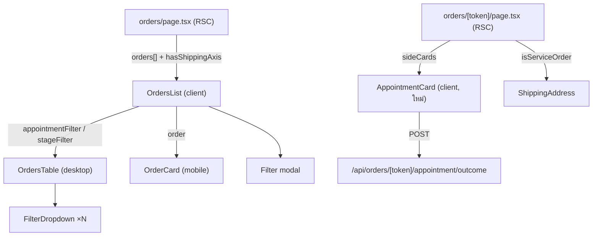

> **โมดูล:** M00036-ServiceOrderSurface · **เวอร์ชัน:** 1.0 · **วันที่:** 2026-08-07

# SDS: หน้าการเข้ารับบริการสำหรับร้านคิวงาน

---

## 1. ไฟล์ที่แตะทั้งหมด (13 ไฟล์)

| ไฟล์ | ใหม่/แก้ | หน้าที่ในฟีเจอร์นี้ |
|------|---------|-------------------|
| `src/lib/appointment-stage.ts` | **ใหม่** | SSOT ป้าย/สี/ไอคอน/derive/count ของแกนนัดหมาย |
| `orders/[token]/components/AppointmentCard.tsx` | **ใหม่** | การ์ดนัดหมาย + ปุ่มปิดผล (งานหลักของฟีเจอร์) |
| `src/lib/seller-menu.ts` | แก้ | `OrderVocab.fulfillLabel` ช่องที่ 6 |
| `src/lib/seller-menu.test.ts` | แก้ | เทส `toEqual` ครอบช่องใหม่ |
| `src/services/order.service.ts` | แก้ | `serviceResource { id, name }` ใน 2 query |
| `orders/page.tsx` | แก้ | map `appointment` + null-out `shipTo`/`shipment` |
| `orders/components/data.ts` | แก้ | `OrderRow.appointment` |
| `orders/components/OrdersList.tsx` | แก้ | แกนที่สอง (`?appt=`) + ชิป + gate ปุ่ม iShip |
| `orders/components/OrdersTable.tsx` | แก้ | คอลัมน์นัดหมาย + ดรอปดาวน์ + `fulfillLabel` + ซ่อนคอลัมน์พัสดุ |
| `orders/components/OrderCard.tsx` | แก้ | บล็อกนัดหมายบนการ์ดมือถือ |
| `orders/[token]/page.tsx` | แก้ | mount การ์ด + ส่ง `isServiceOrder` |
| `orders/[token]/components/ShippingAddress.tsx` | แก้ | prop `isServiceOrder` |
| `queues/components/AppointmentCalendar.tsx` + `_calendar.css` | แก้ | สลับสี `CONFIRMED_BY_BUYER`/`COMPLETED` ให้ตรงกับ SSOT ใหม่ |

---

## 2. Component tree ที่เปลี่ยน



**ทำไม `AppointmentCard` ไม่ผ่าน `OrderDetailClient.handleAction`:** การ์ดกลุ่ม sideCards ทุกใบ (`ShippingAddress`, `ShippingCard`, `CodCard`) จัดการ fetch/toast/refresh ของตัวเองอยู่แล้ว การเพิ่ม case ใหม่ใน switch กลางจะทำให้ `OrderDetailClient` โตขึ้นโดยไม่ได้อะไรกลับมา

---

## 3. Type ที่เพิ่ม

```ts
// data.ts — OrderRow
appointment?: {
  startISO: string          // ISO เท่านั้น (RSC boundary ห้ามส่ง Date)
  allDay: boolean           // ตัดสินที่ server ด้วย isAllDayAppointment ของแถวนั้น
  resourceName: string | null
  stage: AppointmentStatus
} | null
// undefined = ร้านไม่มีแกนนี้ · null = ร้านมีแกนแต่ใบนี้ walk-in
```

**ทำไมต้องแยก `undefined` กับ `null`:** เป็นข้อมูลคนละอย่าง — `undefined` ตอบว่า "ไม่ต้องมีคอลัมน์" ส่วน `null` ตอบว่า "มีคอลัมน์ แต่แถวนี้เขียนว่าไม่มีนัด" ถ้ายุบเป็นค่าเดียวจะแยกสองกรณีนี้ที่ฝั่งจอไม่ได้ (แพตเทิร์นเดียวกับ `shippingStage`/`shipment` ที่อยู่ข้างบนในไฟล์เดียวกัน)

---

## 4. การตัดสินใจเชิงออกแบบที่ควรรู้ก่อนแก้ต่อ

| # | การตัดสินใจ | เหตุผล |
|---|------------|--------|
| TD-1 | แกนเสริมมีได้แกนเดียวต่อร้าน | `ONLINE_SALES` ไม่มีนัด · `SERVICE_QUEUE` ไม่มีพัสดุ → สองแกนไม่มีทางชนกันบนจอเดียว จึงไม่ต้องเขียนตรรกะกันชน |
| TD-2 | คอลัมน์ประกอบด้วย spread ไม่ใช่ `columnVisibility` | TanStack ยังกรองคอลัมน์ที่ซ่อนอยู่ได้ ถ้าใช้ visibility ตัวกรอง "ขนส่ง" จะยังทำงานกับคอลัมน์ที่มองไม่เห็น |
| TD-3 | ซ่อนคอลัมน์พัสดุตาม `vertical` ไม่ใช่ตามข้อมูล | ตามข้อมูล = คอลัมน์โผล่/หายตอน lazy-load ซึ่งอ่านเป็นจอกระตุก (BR-SOV-09) |
| TD-4 | หน้ารายละเอียดยังแสดงพัสดุตามข้อมูลจริง | ออเดอร์เก่าของร้านที่เคยเป็น vertical อื่นต้องไม่มีข้อมูลใดเข้าไม่ถึง (BR-SOV-10) |
| TD-5 | `server` ตัด `shipTo`/`shipment` ทิ้งเลย ไม่ใช่ส่งแล้วซ่อน | หน้านี้อยู่ใต้ client layout ทุก field ที่ส่งจะ serialize เข้า flight payload ของทุกแถว |
| TD-6 | ปุ่มปิดผล 2 ปุ่มน้ำหนักเท่ากัน | ผลลัพธ์ทั้งสองทางเกิดจริงพอ ๆ กัน — การชู "ให้บริการแล้ว" เป็น primary = ระบบชี้นำคำตอบในเรื่องที่ไม่มีสิทธิ์มีความเห็น |
| TD-7 | `fulfillLabel` ของ SERVICE_QUEUE = "เริ่มให้บริการแล้ว" | กันชนกับ `APPOINTMENT_STATUS_LABEL.COMPLETED` ("ให้บริการแล้ว") ที่ผูกคนละคอลัมน์และติ๊กถูกคนละจังหวะ |
| TD-8 | แก้สีปฏิทินคิวงานไปด้วยในรอบเดียวกัน | ไม่งั้นจอสองจอของผู้ใช้คนเดียวพูดสีคนละภาษากับสถานะเดียวกัน (user เคาะ 2026-08-07) |

---

## 4b. รอบ 2 (`6fc3f12e`) — ไฟล์ที่เพิ่ม/แก้เพิ่ม

| ไฟล์ | ใหม่/แก้ | หน้าที่ |
|------|---------|--------|
| `orders/[token]/components/RescheduleAppointmentSheet.tsx` | **ใหม่** | แผงเลื่อนนัดเต็มจอ (Base: `AppointmentDateSheet` โครงชีต + `AppointmentBlock` การ์ดคิวงาน/ช่องเวลา) |
| `src/lib/format-date.ts` | แก้ | `formatTimeRangeHM` + `formatDayMonthTimeRangeTH` |
| `orders/new/components/AppointmentDateSheet.tsx` | แก้ | prop `excludeOrderToken` + เลิกประกาศ `STATUS_BADGE` เอง (ดึงเข้า SSOT) |
| `src/lib/seller-menu.ts` · `queues/components/ResourceList.tsx` · `seller/onboarding/page.tsx` | แก้ | `armchair` → `user-cog` |

| # | การตัดสินใจเพิ่ม | เหตุผล |
|---|-----------------|--------|
| TD-9 | ปุ่มเลื่อนนัด **ไม่ผูกกับ `notStarted`** ต่างจากปุ่มปิดผล | `setOrRescheduleAppointment` ไม่มีการเช็คว่าเวลาที่เลื่อนไปเป็นอดีตหรือไม่ — `AppointmentPastError` มาจาก `requestAppointmentReschedule` ซึ่งเป็นเส้นของ**ลูกค้า** คนละ endpoint (ตรวจโค้ด ไม่ได้อ่านจากชื่อ error class) |
| TD-10 | โหมด "ทั้งวัน vs ระบุช่วงเวลา" ตัดสินจาก **นัดใบนั้น** ไม่ใช่จากตั้งค่าปัจจุบันของร้าน | BR-RSV-57 — ร้านที่สลับโหมดไป-มาต้องไม่ทำให้นัดเก่าเพี้ยน · ได้ผลพลอยได้คือไม่ต้อง query ตั้งค่าร้านเพิ่ม |
| TD-11 | `'NONE'` เป็น sentinel ที่ parse ใน `OrdersList` ไม่ใช่ยัดเข้า `isAppointmentStatus` | `appointment-stage.ts` เป็น SSOT ของ **5 สถานะจริงในโดเมนนัดหมาย** — "ไม่มีนัด" ไม่ใช่สถานะของนัด มันคือ "ไม่อยู่ในแกนนี้" |
| TD-12 | badge ของ "ไม่มีนัด" เป็นเทากลาง ไม่ใช่สี semantic | สื่อว่าเป็นคนละหมวด ไม่ใช่ขั้นหนึ่งบนเส้นทาง SCHEDULED→COMPLETED |
| TD-13 | 409 `APPOINTMENT_TERMINAL` ปิดแผงทิ้ง ส่วน error อื่นเปิดค้าง | นัดที่จบแล้วเลื่อนไม่ได้อีกไม่ว่าจะแก้อะไร แผงจึงไม่มีประโยชน์ ส่วนที่เหลือผู้ขายแก้ตัวเลือกแล้วกดซ้ำได้ทันที |

## 5. กับดักที่ปิดไปแล้ว (อย่าเปิดกลับ)

1. **ตัวกรองที่เกาะคอลัมน์ที่ถูกซ่อน** — `filterColumn('shipTo')?.setFilterValue()` เป็น optional chain พอคอลัมน์หายกลายเป็นปุ่มที่กดแล้วไม่เกิดอะไร ไม่มี error → ต้องซ่อนดรอปดาวน์คู่กันเสมอ
2. **จุดแดงบนปุ่มตัวกรองกับเงื่อนไข render ของโมดัล** — ต้องเป็นเงื่อนไขเดียวกันเป๊ะ ไม่งั้นกรองแล้วรายการหดโดยไม่มีสัญญาณ
3. **`Icon` ดิบ vs wrapper** — `OrderCard.tsx` import จาก `@iconify/react` ตรง ๆ (ไม่เติม `tabler:` ให้) ชื่อเปล่าจะได้กล่องว่างเงียบ ๆ ส่วนอีก 2 ที่ใช้ wrapper
4. **`notStarted` ที่คำนวณครั้งเดียว** — ปุ่มไม่ปลดล็อกเองเมื่อถึงเวลานัด ซึ่งเป็นพฤติกรรมปกติที่สุดของงานนี้
5. **`isServiceOrder` ที่ดูแค่ `serviceStart`** — ตกใบ walk-in ซึ่งเป็นครึ่งหนึ่งของประชากรร้านคิวงาน
6. **ชุดสีสถานะนัดที่ประกาศซ้ำ** — เคยมี 3 ที่ (`appointment-stage.ts`, `AppointmentCalendar`, `AppointmentDateSheet`) และเพี้ยนจริงไปแล้ว 2 ช่อง คอมเมนต์ "ห้ามคิดใหม่" ที่เขียนกำกับไว้กันไม่ได้เพราะเตือนคนอ่าน ไม่ได้บังคับโค้ด — ตอนนี้ทุกที่ import จาก `APPOINTMENT_STAGE_META` แล้ว **ห้ามประกาศ map ใหม่ที่ไฟล์ที่สี่**
7. **ตัวนับความว่างที่นับนัดของตัวเอง** — แผงเลื่อนนัดต้องส่ง `excludeOrderToken` ไม่งั้นวันเดิมขึ้นเต็มปลอม ๆ แล้วเปลี่ยนแค่เวลาไม่ได้
