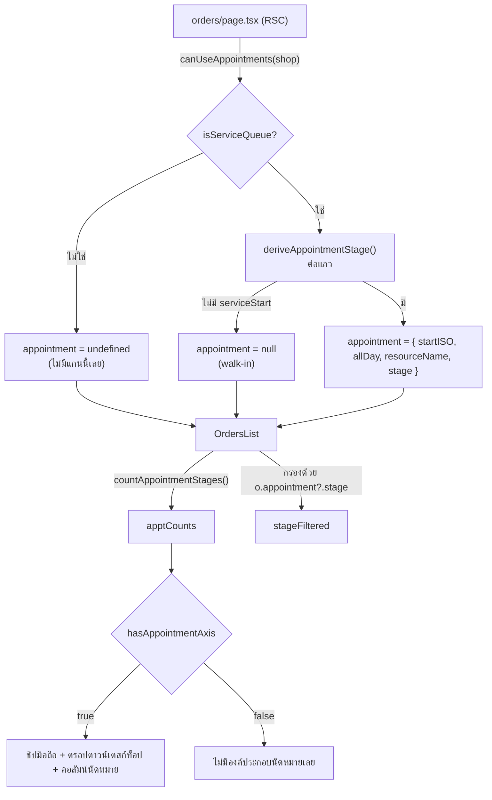
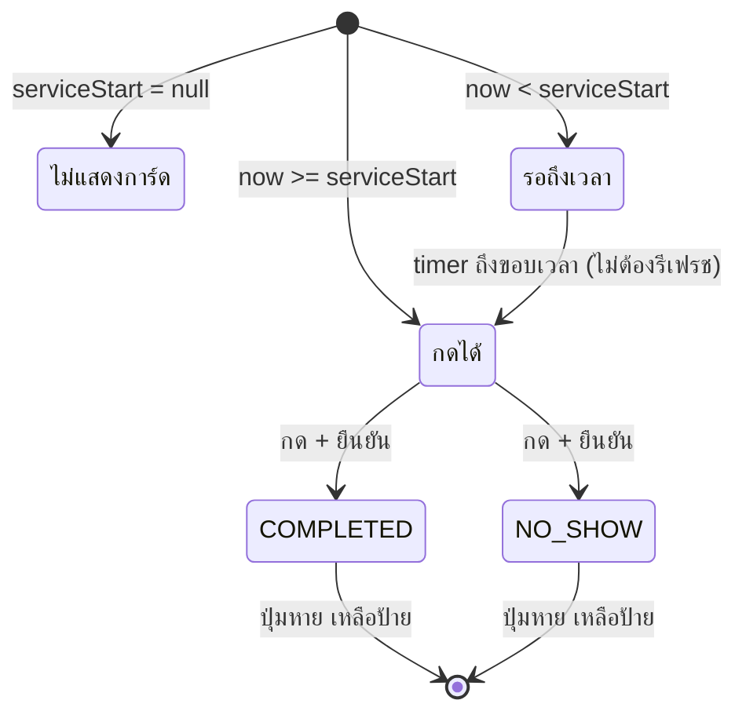

> **โมดูล:** M00036-ServiceOrderSurface · **เวอร์ชัน:** 1.0 · **วันที่:** 2026-08-07
> **สถานะ:** Implemented (`0c1aa001` + `2f50f6ba`) — ยังไม่ merge main

# SRS: หน้าการเข้ารับบริการสำหรับร้านคิวงาน

---

## 1. ขอบเขตทางเทคนิค

ฟีเจอร์นี้เป็น **presentation layer ล้วน** — ไม่มี migration, ไม่มี endpoint ใหม่, ไม่มี enum ใหม่, ไม่แตะ validation schema ใด ๆ

ผลที่ตามมา: **ไม่ต้อง sync `docs/SRS.md` (เอกสารระบบ)** เพราะไม่มี data model / API / enum / authorization rule ใดเปลี่ยน (ตรวจตามเกณฑ์ Hard Rule 11)

สิ่งที่เปลี่ยนจริงมี 3 ชั้น:

| ชั้น | เปลี่ยนอะไร |
|------|------------|
| Domain lib (ใหม่) | `src/lib/appointment-stage.ts` — SSOT ของป้าย/สี/ไอคอน/การจัดกองสถานะนัด |
| Vocabulary | `OrderVocab` เพิ่มช่องที่ 6 `fulfillLabel` |
| Query select | `getOrdersByShop` / `getOrderForShop` เพิ่ม relation `serviceResource { id, name }` |

---

## 2. Data flow



**กฎที่โครงนี้บังคับ (BR-SOV-06):** `apptCounts` รับ **stage ที่ derive มาแล้ว** ไม่ใช่ row ดิบ — ผู้เรียกจึงไม่มีทางนับด้วยเกณฑ์อื่นนอกจากเกณฑ์เดียวกับที่ใช้กรอง ตัวเลขบนชิปกับจำนวนแถวจึงเพี้ยนจากกันไม่ได้เชิงโครงสร้าง ไม่ใช่เพราะ "เขียนถูก"

---

## 3. สัญญาของ `src/lib/appointment-stage.ts`

```ts
APPOINTMENT_STAGE_META: Record<AppointmentStatus, { label; cls; icon }>
APPOINTMENT_STAGE_KEYS: readonly AppointmentStatus[]   // ลำดับที่ใช้เรียงชิป/ดรอปดาวน์
isAppointmentStatus(v): v is AppointmentStatus          // ใช้ validate ?appt= จาก URL
deriveAppointmentStage({ serviceStart, appointmentStatus }): AppointmentStatus | null
countAppointmentStages(stages): Record<AppointmentStatus, number>
```

| กฎ | รายละเอียด |
|----|-----------|
| SRS-SOV-01 | `label` **ต้อง** อ่านจาก `APPOINTMENT_STATUS_LABEL` (00024) ห้ามพิมพ์คำใหม่ในไฟล์นี้ |
| SRS-SOV-02 | `deriveAppointmentStage` ตัดสิน "ใบนี้เป็นนัดไหม" จาก **`serviceStart`** ไม่ใช่ `appointmentStatus` — เงื่อนไขเดียวกับที่ `setAppointmentOutcome` ใช้ตอบ 404 (`appointment.service.ts:319`) |
| SRS-SOV-03 | ใบที่มี `serviceStart` แต่ `appointmentStatus` เป็น null/ค่าเพี้ยน = `SCHEDULED` (default เดียวกับปฏิทิน `AppointmentCalendar.tsx:273`) |
| SRS-SOV-04 | `cls` ใช้ `bg-{semantic}/15 text-{semantic}-ink` เท่านั้น (คู่ `-ink` วัดคอนทราสต์แล้ว 6.56–8.47:1) |
| SRS-SOV-05 | สีชุดนี้เป็น SSOT ร่วมกับปฏิทินคิวงาน — แก้ที่นี่แล้วต้องแก้ `_calendar.css` + `AppointmentCalendar.tsx` `STATUS_DOT` ให้ตรงกัน |

### ตารางสถานะ

| สถานะ | ป้าย | สี | ไอคอน | terminal |
|-------|------|-----|-------|---------|
| `SCHEDULED` | นัดแล้ว | warning | `calendar-event` | ไม่ |
| `CONFIRMED_BY_BUYER` | ลูกค้ายืนยันแล้ว | **primary** | `calendar-check` | ไม่ |
| `RESCHEDULE_REQUESTED` | ลูกค้าขอเลื่อน | info | `repeat` | ไม่ |
| `COMPLETED` | ให้บริการแล้ว | **success** | `circle-check-filled` | ใช่ |
| `NO_SHOW` | ไม่มาตามนัด | danger | `clock-off` | ใช่ |

`CONFIRMED_BY_BUYER` ไม่ใช่เขียวโดยเจตนา (BR-SOV-07) — เป็นคำยืนยันของผู้ซื้อว่า *จะมา* ไม่ใช่สิ่งที่ *เกิดขึ้นแล้ว*

---

## 4. State machine ของปุ่มปิดผล



| กฎ | รายละเอียด |
|----|-----------|
| SRS-SOV-06 | ปุ่มต้องปลดล็อกเองเมื่อถึง `serviceStart` — ห้ามคำนวณครั้งเดียวตอน render (พฤติกรรมจริงคือเปิดใบค้างไว้รอลูกค้า) |
| SRS-SOV-07 | `setTimeout` clamp ที่ 24 ชม. — เกิน int32 ms จะ overflow แล้วยิงทันที |
| SRS-SOV-08 | UI เป็นชั้นความสะดวก **ไม่ใช่ชั้นความปลอดภัย** — guard 3 ชั้นของ 00024 ที่ server ต้องยังทำงานครบ |
| SRS-SOV-09 | การปิดผล **ห้ามแตะ `Order.status` และห้ามกระทบ Trust Score** (BR-RSV-33/35) — UI ต้องไม่ "ช่วย" อัปเดตสถานะออเดอร์ตามไปด้วย |

---

## 5. เงื่อนไขการแสดงผลรวม

| องค์ประกอบ | เงื่อนไข |
|-----------|---------|
| คอลัมน์ "ที่อยู่จัดส่ง" + ดรอปดาวน์ "ขนส่ง" | `hasShippingAxis` (= `vertical === 'ONLINE_SALES'`) |
| ปุ่ม "ดึงจาก iShip" | `ishipEnabled` (vertical + เชื่อม iShip แล้ว) |
| คอลัมน์ "นัดหมาย" + ดรอปดาวน์ "สถานะนัด" | `appointmentFilter !== undefined` (= `hasAppointmentAxis`) |
| ชิปมือถือ | นัดหมาย > พัสดุ > สถานะการขาย (ร้านหนึ่งเข้าเงื่อนไขได้ทางเดียว) |
| "สถานะการขาย" ในโมดัลตัวกรอง | `hasStageAxis \|\| hasAppointmentAxis` |
| จุดแดงบนปุ่มตัวกรอง | ต้องตรงกับเงื่อนไขบรรทัดบนเป๊ะ |
| บล็อกนัดหมายบนการ์ดมือถือ | `order.appointment != null` |
| การ์ด "การนัดหมาย" (detail) | `order.serviceStart != null` |
| การ์ด "การส่งมอบ" (ลิงก์ดาวน์โหลด) | `fulfillmentMode === 'NO_SHIPPING' && !isServiceOrder` |
| `isServiceOrder` | `type === 'SERVICE' \|\| serviceStart != null` |

---

## 6. NFR ที่บังคับในโค้ด

| รหัส | ข้อกำหนด | ที่บังคับ |
|------|---------|----------|
| NFR-SOV-1 | ตัวนับ = ตัวกรอง (symbol เดียว) | `countAppointmentStages` รับ stage ไม่ใช่ row |
| NFR-SOV-2 | ไม่มี regression ต่อ ONLINE_SALES/LODGING | ทุกจุดเป็น conditional เพิ่ม ไม่แก้ทางเดิม |
| NFR-SOV-3 | ไม่เพิ่ม query ต่อแถว | ข้อมูลนัดเป็น scalar บน `Order` + relation เดียว |
| NFR-SOV-4 | prop ข้าม RSC ต้อง serializable | ส่ง ISO string ไม่ส่ง `Date` |
| NFR-SOV-5 | ไม่ส่ง PII ที่ไม่ได้ใช้ข้าม RSC | `shipTo`/`shipment` = null ที่ server เมื่อไม่มีแกนพัสดุ |
| NFR-SOV-6 | tap target ≥44px สำหรับ action ที่ย้อนไม่ได้ | `min-h-11` + `gap-3` บนปุ่มปิดผล |
| NFR-SOV-7 | ตัวกรองห้ามตายเงียบ | ซ่อนดรอปดาวน์คู่กับคอลัมน์ที่มันเกาะเสมอ |
