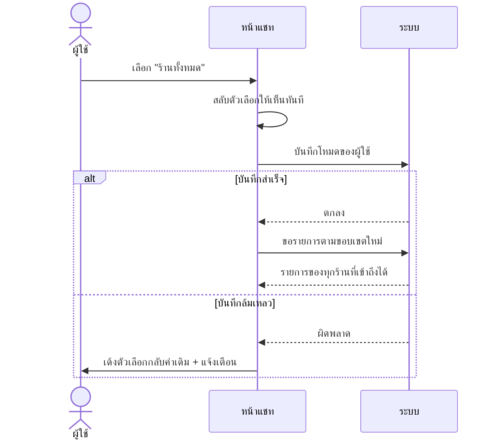
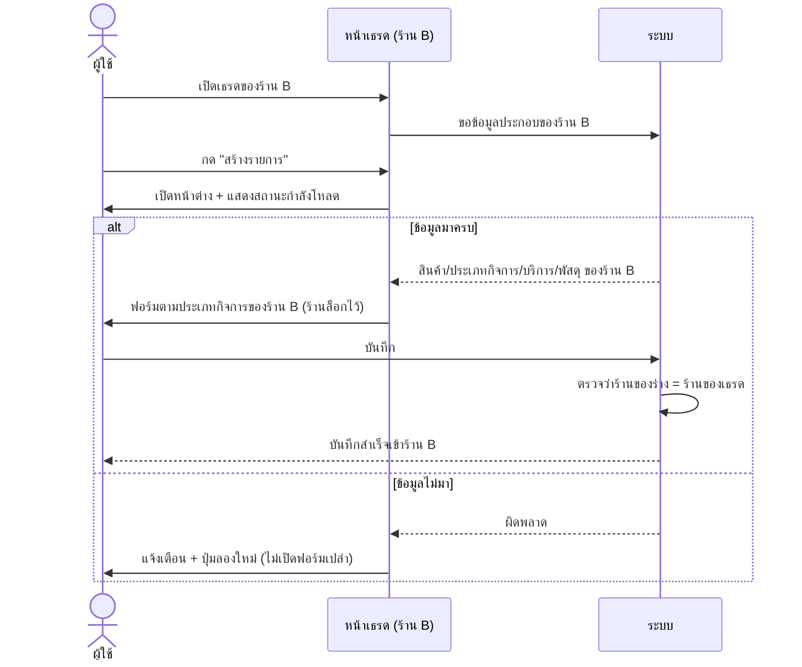

> **โมดูล:** M37-UnifiedInbox
> **ประเภทเอกสาร:** Business Requirements Document (BRD) — NON-TECHNICAL
> **เวอร์ชัน:** 1.0
> **วันที่จัดทำ:** 2026-08-08
> **สถานะ:** Approved
> **เจ้าของเอกสาร:** BA

# BRD: กล่องแชทรวมหลายร้าน

---

## 1. บทนำ

### 1.1 วัตถุประสงค์ของเอกสาร

1. กำหนดความต้องการเชิงธุรกิจของการรวมกล่องแชทหลายร้านให้อยู่ในมุมมองเดียว
2. กำหนดขอบเขตว่า "รวม" หมายถึงรวมอะไร และ **ไม่รวม** อะไร
3. ระบุกฎธุรกิจที่ห้ามละเมิด โดยเฉพาะกฎที่กันข้อมูลของร้านหนึ่งไม่ให้ไหลเข้าอีกร้าน
4. ให้ทีมพัฒนาและทีมธุรกิจเข้าใจตรงกันว่า "ตอบในนามร้านไหน" ถูกตัดสินจากอะไร

### 1.2 ขอบเขตของระบบ

**กล่องแชทรวมหลายร้าน** คือโหมดการแสดงผลของหน้าแชทฝั่งผู้ขาย ที่ให้ผู้ใช้เห็นบทสนทนาและคอมเมนต์ของทุกร้านที่ตัวเองเข้าถึงได้ในรายการเดียว

**เข้าสู่ระบบ (Input):**
- โหมดที่ผู้ใช้เลือก (`SINGLE` / `UNIFIED`)
- รายชื่อร้านที่ผู้ใช้เข้าถึงได้ (เจ้าของ + สมาชิก)
- ร้านที่กำลังใช้งานอยู่ (`activeShopId`) — ใช้เฉพาะตอนโหมด `SINGLE` และเป็นค่าตั้งต้นของการสร้างรายการที่ไม่ได้เริ่มจากเธรด

**ออกจากระบบ (Output):**
- รายการบทสนทนา/คอมเมนต์ที่ครอบคลุมร้านตามโหมด
- ตัวนับยังไม่อ่าน/ยังไม่ตอบ ที่รวมข้ามร้านตามโหมด
- บริบทการทำงานของเธรดที่เปิดอยู่ (ร้านเจ้าของเธรด)

**ระบบที่เกี่ยวข้อง:** ระบบร้านค้าและสมาชิกร้าน · ระบบเชื่อมเพจ Facebook/Instagram · ระบบคำสั่งซื้อและคิวงาน · ระบบพัสดุ iShip · ระบบผู้ช่วยตอบอัตโนมัติ

### 1.3 กลุ่มผู้ใช้งาน

| กลุ่มผู้ใช้ | บทบาท | สิทธิ์การใช้งาน |
|-----------|--------|----------------|
| **เจ้าของร้าน** | เจ้าของร้านส่วนตัว/ร้านธุรกิจ | เห็นและตอบแชทของทุกร้านที่ตัวเองเป็นเจ้าของ |
| **ผู้ดูแลร้าน** | สมาชิกที่ถูกเชิญ (role ADMIN) | เห็นและตอบแชทเฉพาะร้านที่ตัวเองถูกเชิญ |
| **ผู้ขายร้านเดียว** | เจ้าของร้านเดียว | ไม่เห็นสวิตช์โหมด และไม่เห็นการเปลี่ยนแปลงใด ๆ |

---

## 2. Functional Requirements

### FR-UNI-01 — โหมดมุมมองกล่องข้อความ

ผู้ใช้เลือกได้เองว่ากล่องข้อความจะแสดงแบบ **รวมทุกร้าน** หรือ **ร้านเดียว** ค่านี้เป็นของผู้ใช้แต่ละคน จำไว้ในระบบ และมีผลทุกอุปกรณ์ที่ล็อกอินด้วยบัญชีเดียวกัน

**เงื่อนไขการแสดงสวิตช์:** แสดงเฉพาะผู้ใช้ที่เข้าถึงได้มากกว่า 1 ร้าน

**Acceptance Criteria**
- AC-01-1 ผู้ใช้ที่มี ≥2 ร้าน เห็นตัวเลือก 2 โหมด และเห็นว่าโหมดไหนถูกเลือกอยู่
- AC-01-2 เปลี่ยนโหมดแล้วรายการเปลี่ยนตามทันทีโดยไม่ต้องโหลดหน้าใหม่ทั้งหน้า
- AC-01-3 บันทึกค่าไม่สำเร็จ → ตัวเลือกเด้งกลับค่าเดิม พร้อมข้อความแจ้งว่าเปลี่ยนไม่สำเร็จ (ห้ามค้างโชว์ค่าที่บันทึกไม่ได้)
- AC-01-4 ผู้ใช้ที่มีร้านเดียว **ไม่เห็นตัวเลือกนี้เลย**
- AC-01-5 ปิดเบราว์เซอร์แล้วเปิดใหม่/เข้าจากเครื่องอื่น ต้องได้โหมดเดิม

### FR-UNI-02 — ขอบเขตร้านของโหมดรวม

โหมดรวมครอบคลุม **ทุกร้านที่ผู้ใช้เข้าถึงได้จริง** ณ ขณะนั้น = ร้านที่เป็นเจ้าของ + ร้านที่ถูกเชิญเป็นสมาชิก โดยตัดร้านที่ถูกลบออกเสมอ

**Acceptance Criteria**
- AC-02-1 ร้านที่ถูกลบ (soft-delete) ต้องไม่ปรากฏในรายการรวม
- AC-02-2 ผู้ใช้ถูกถอดออกจากร้านระหว่างใช้งาน → ร้านนั้นหายจากรายการในการโหลดครั้งถัดไป
- AC-02-3 ตั้งโหมดรวมไว้แต่เหลือสิทธิ์ร้านเดียว → ผลลัพธ์เท่ากับโหมดร้านเดียว และไม่ขึ้น error
- AC-02-4 ผู้ใช้ไม่มีสิทธิ์ร้านใดเลย → แสดงสถานะผิดพลาดเดิมของระบบ ไม่ใช่รายการว่างเปล่าที่ดูเหมือนใช้งานได้

### FR-UNI-03 — รายการแชทข้ามร้าน

รายการเรียงตามเวลาข้อความล่าสุดข้ามร้าน และยังใช้ความสามารถเดิมได้ครบ: เลื่อนโหลดเพิ่ม, ค้นหา, ตัวกรองช่องทาง/เพจ/แท็ก/สถานะพัสดุ/อ่านแล้ว-ยังไม่อ่าน, แท็บปิดงาน/สแปม/ซ่อน

**Acceptance Criteria**
- AC-03-1 เธรดของทุกร้านในขอบเขตปรากฏในรายการเดียว เรียงตามเวลาข้อความล่าสุด
- AC-03-2 เลื่อนโหลดหน้าถัดไปแล้วไม่มีเธรดซ้ำและไม่มีเธรดหายที่รอยต่อหน้า
- AC-03-3 ตัวกรองทุกตัวที่มีอยู่เดิมยังทำงาน โดยกรองภายในขอบเขตร้านที่กำหนด
- AC-03-4 ตัวนับยังไม่อ่านบนแท็บ = ผลรวมของทุกร้านในขอบเขต
- AC-03-5 ผู้ใช้กรองด้วยร้าน/เพจที่ตัวเองไม่มีสิทธิ์ → ได้ผลลัพธ์ว่าง ไม่ใช่ข้อมูลของร้านนั้น

### FR-UNI-04 — ตัวบอกร้านของเธรด

ในโหมดรวม ทุกเธรดต้องบอกได้ว่าเป็นของร้านไหน ทั้งตอนกวาดสายตาในรายการ และตอนเปิดอ่านก่อนพิมพ์ตอบ

**Acceptance Criteria**
- AC-04-1 ทุกแถวในรายการมีตัวบอกร้าน และมีข้อความสำรองเป็นชื่อร้านเต็ม
- AC-04-2 หน้าเธรดบอกชื่อร้านที่กำลังตอบในนามนั้น โดยเห็นได้ก่อนเริ่มพิมพ์
- AC-04-3 ร้านที่ไม่มีโลโก้ต้องยังแยกออกจากร้านอื่นได้ (ใช้ตัวอักษรย่อ)
- AC-04-4 โหมดร้านเดียว **ไม่แสดงตัวบอกร้านใด ๆ**

### FR-UNI-05 — บริบทตามเธรด

เมื่อเปิดเธรด ข้อมูลรายร้านทั้งหมดในหน้านั้นต้องเป็นของ **ร้านเจ้าของเธรด** ได้แก่ ประเภทกิจการและคำศัพท์ที่ใช้เรียกรายการ, แคตตาล็อกสินค้า, รายการบริการและหน่วยเวลานัดหมาย, สถานะการเชื่อมพัสดุ, สถานะผู้ช่วยตอบอัตโนมัติ, สิทธิ์คลังสินค้า, โลโก้ร้าน

**Acceptance Criteria**
- AC-05-1 เปิดเธรดร้านขายของ → เห็นคำและฟอร์มแบบร้านขายของ; เปิดเธรดร้านบริการในจอเดียวกัน → เห็นคำและฟอร์มแบบร้านบริการ
- AC-05-2 การเปลี่ยนเธรดข้ามร้าน **ไม่เปลี่ยนร้านที่กำลังใช้งานของทั้งระบบ** (เมนู/หน้าอื่นยังเป็นร้านเดิม)
- AC-05-3 แถบเตือน/ป้ายสถานะของผู้ช่วยตอบอัตโนมัติสะท้อนการตั้งค่าของร้านเจ้าของเธรด ไม่ใช่ร้านที่ active

### FR-UNI-06 — สร้างรายการ (คำสั่งซื้อ/งาน) ให้ถูกร้าน

**Acceptance Criteria**
- AC-06-1 กดสร้างจากในเธรด → ร้านถูกล็อกเป็นร้านของเธรดนั้น เปลี่ยนไม่ได้ และแสดงให้เห็นว่าเป็นร้านไหน
- AC-06-2 กดสร้างจากหน้ารายการ (ไม่มีเธรดเปิด) ในโหมดรวมที่มีหลายร้าน → ต้องเลือกร้านก่อน โดยร้านที่กำลังใช้งานเป็นค่าตั้งต้น
- AC-06-3 ระหว่างข้อมูลของร้านยังโหลดไม่เสร็จ → ปุ่มยังกดได้ และหน้าต่างแสดงสถานะกำลังโหลด **ห้ามแสดงฟอร์มที่รายการสินค้าว่างเปล่า**
- AC-06-4 โหลดข้อมูลร้านไม่สำเร็จ → แจ้งเตือนพร้อมให้ลองใหม่ได้ ห้ามตกไปเป็นฟอร์มเปล่า
- AC-06-5 ร่างที่ผูกกับร้านหนึ่ง เมื่อสลับไปเธรดของอีกร้าน ต้องไม่ถูกนำไปใช้ต่อในร้านนั้น
- AC-06-6 บันทึกรายการที่ร้านของร่างไม่ตรงกับร้านของเธรด → **ปฏิเสธ** ไม่ใช่บันทึกเข้าร้านใดร้านหนึ่ง
- AC-06-7 ร้านที่ไม่ต้องจัดส่ง (ร้านบริการ) ต้องไม่ถูกบังคับกรอกที่อยู่จัดส่ง แม้สร้างจากจอที่มีร้านขายของปนอยู่

### FR-UNI-07 — คอมเมนต์ข้ามร้าน

**Acceptance Criteria**
- AC-07-1 แท็บความคิดเห็นแสดงโพสต์ของทุกเพจในขอบเขต
- AC-07-2 แต่ละโพสต์บอกได้ว่าเป็นของร้าน/เพจไหน
- AC-07-3 ตอบคอมเมนต์แล้วออกไปในนามเพจของโพสต์นั้นเสมอ
- AC-07-4 ตัวนับ "ยังไม่ตอบ" รวมทุกร้านในขอบเขต

### FR-UNI-08 — การแจ้งเตือนแบบทันที

**Acceptance Criteria**
- AC-08-1 ข้อความใหม่จากร้านใดก็ตามในขอบเขต ทำให้รายการอัปเดตเอง
- AC-08-2 เสียงแจ้งเตือนดังสำหรับข้อความของทุกร้านในขอบเขต
- AC-08-3 ตัวเลขบนแท็บอัปเดตเองเมื่อมีของใหม่เข้าจากร้านใดก็ตาม

### FR-UNI-09 — ไม่กระทบผู้ใช้ร้านเดียว

**Acceptance Criteria**
- AC-09-1 ผู้ใช้ร้านเดียวเห็นหน้าจอเหมือนก่อนมีฟีเจอร์นี้ทุกจุด
- AC-09-2 จำนวนคำสั่งที่ระบบต้องทำเพื่อแสดงรายการในโหมดร้านเดียวไม่เพิ่มขึ้น
- AC-09-3 ข้อมูลของร้านที่ใช้บ่อยยังถูกเตรียมล่วงหน้าเหมือนเดิมในโหมดร้านเดียว (ไม่ทำให้ช้าลงเพื่อแลกกับโหมดรวม)

---

## 3. Business Rules

| รหัส | กฎ | เหตุผล |
|------|-----|--------|
| **BR-UNI-01** | ขอบเขตร้านต้องถูกคำนวณจากฝั่งระบบเท่านั้น **ห้ามรับรายชื่อร้านจากฝั่งผู้ใช้** | ถ้ารับจาก client ผู้ใช้ยิงรหัสร้านที่ไม่ใช่ของตัวเองเข้ามาได้ |
| **BR-UNI-02** | ตัวกรองร้าน/เพจที่ผู้ใช้เลือก ต้องถูกตัดให้อยู่ในขอบเขตที่ระบบคำนวณเสมอ และถ้าอยู่นอกขอบเขตให้คืน **ผลว่าง** | ตอบว่า "ไม่มีสิทธิ์" คือการยืนยันว่าร้านนั้นมีอยู่จริง |
| **BR-UNI-03** | "ตอบในนามร้านไหน" ตัดสินจาก **เธรด** ไม่ใช่จากร้านที่กำลังใช้งาน | ในโหมดรวม ร้านที่ active ไม่ได้สื่อถึงเธรดที่เปิดอยู่อีกต่อไป |
| **BR-UNI-04** | ข้อมูลรายร้านที่ใช้ประกอบฟอร์มสร้างรายการ ต้องมาจากร้านเจ้าของเธรด **ครบทั้งชุด ห้ามมาจากคนละร้านปนกัน** | ข้อมูลปนร้านทำให้ธงการจัดส่งของสินค้าอีกร้านถูกใช้ตัดสินกฎของร้านนี้ |
| **BR-UNI-05** | ร่างรายการต้องผูกกับร้านตั้งแต่เริ่มสร้าง และถูกตรวจซ้ำตอนบันทึก | ร่างมีอายุยาวข้ามการสลับเธรด จึงต้องพิสูจน์ตัวเองตอนบันทึก ไม่ใช่ตอนเปิด |
| **BR-UNI-06** | ห้ามแสดงฟอร์มสร้างรายการที่รายการสินค้ายังโหลดไม่เสร็จ | รายการสินค้าว่างสื่อว่า "ร้านนี้ไม่มีสินค้า" ซึ่งเป็นข้อมูลผิด ไม่ใช่แค่ยังไม่มา |
| **BR-UNI-07** | การเปลี่ยนโหมดมุมมอง **ห้ามเปลี่ยนร้านที่กำลังใช้งาน** และการเปิดเธรดข้ามร้าน **ห้ามเปลี่ยนร้านที่กำลังใช้งาน** | ร้านที่กำลังใช้งานมีผลกับทั้งระบบ (เมนู ออเดอร์ สินค้า) การให้มันเดินตามเธรดที่เผลอกดดูจะทำให้สร้างของเข้าร้านผิดที่หน้าอื่นทีหลัง |
| **BR-UNI-08** | ร้านที่ถูกระงับสิทธิ์แก้ไข (แพ็กเกจถูกล็อก) ต้องยังถูกจำกัดเหมือนเดิมเมื่ออยู่ในโหมดรวม | โหมดรวมเป็นเรื่องการมองเห็น ไม่ใช่การเพิ่มสิทธิ์ |
| **BR-UNI-09** | กลุ่มแชทเป็นของรายร้าน จึงใช้ได้เมื่อขอบเขตแคบเหลือร้านเดียวเท่านั้น และเมื่อใช้ไม่ได้ต้อง **ชี้ทางว่าต้องทำอะไรก่อน** ห้ามหายเงียบ | ชื่อกลุ่มซ้ำข้ามร้านได้ตามกติกาเดิมของระบบ |

---

## 4. Business Flow — เปลี่ยนโหมด

## 5. Business Flow — สร้างรายการจากเธรดในโหมดรวม

---

## 6. Edge Cases

| กรณี | พฤติกรรมที่ต้องการ |
|------|-------------------|
| ร้านถูกลบระหว่างเปิดเธรดค้างไว้ | เธรดหาไม่เจอ → สถานะผิดพลาดเดิมของระบบ พร้อมทางกลับไปรายการ |
| ผู้ใช้ถูกถอดสิทธิ์ระหว่างเปิดหน้าต่างสร้างรายการ | แจ้งว่าไม่มีสิทธิ์เข้าถึงร้านนี้แล้ว + ปุ่มปิด (ไม่ใช่ปุ่มลองใหม่ที่ไม่มีวันสำเร็จ) |
| ชื่อร้านยาวมาก | ตัดท้ายด้วยจุดไข่ปลา แต่ข้อความสำรองยังเป็นชื่อเต็ม |
| เข้าจากการแจ้งเตือนบนมือถือ | ยังใช้เส้นทางเดิมของระบบได้ ไม่ถูกฟีเจอร์นี้ทำให้เสีย |
| อยู่ในเธรดบนมือถือ | สวิตช์โหมดเข้าไม่ถึงเพราะแถบด้านบนถูกซ่อนในหน้าเธรดอยู่แล้ว — ผู้ใช้กลับไปหน้ารายการเพื่อเปลี่ยนโหมด (ยอมรับได้ ไม่ใช่ข้อบกพร่อง) |
| ร้านในขอบเขตยังไม่ได้เชื่อมเพจใด ๆ | ไม่มีเธรดของร้านนั้นในรายการ ซึ่งถูกต้อง ไม่ต้องแจ้งอะไรเพิ่ม |

---

## 7. Assumptions & Dependencies

- อาศัยระบบสิทธิ์ร้านเดิมทั้งหมด ไม่สร้างชั้นสิทธิ์ใหม่
- อาศัยระบบเชื่อมเพจเดิม — การเชื่อม/ถอดเพจยังทำในบริบทร้านเดียวเหมือนเดิม
- อาศัยระบบคำศัพท์ตามประเภทกิจการเดิม (ร้านขายของ / ร้านบริการ / บ้านพัก)

---

## 8. Out-of-Scope

ดู PRD §3.2 — สรุป: ไม่ทำการเลือกรวมบางร้าน, กลุ่ม/แท็กข้ามร้าน, มุมมองรวมของหน้าอื่น, สถิติข้ามร้าน, ส่งข้อความเดียวหลายร้าน, รวมหน้าตั้งค่าเพจ

---

## 9. Definition of Done (ระดับธุรกิจ)

1. ผู้ใช้หลายร้านเปิด/ปิดโหมดรวมได้เอง และค่าคงอยู่ข้ามอุปกรณ์
2. เธรดและคอมเมนต์ของทุกร้านในขอบเขตปรากฏในจอเดียว พร้อมตัวบอกร้าน
3. สร้างคำสั่งซื้อ/งานจากเธรดของร้านคนละประเภทกิจการในจอเดียวกันได้ถูกต้องทั้งคู่
4. ผู้ใช้ร้านเดียวไม่เห็นความเปลี่ยนแปลงใด ๆ
5. มีเทสที่พิสูจน์ BR-UNI-02 (กรองนอกขอบเขต = ผลว่าง) และ BR-UNI-07 (ร้านบริการไม่ถูกบังคับที่อยู่)
