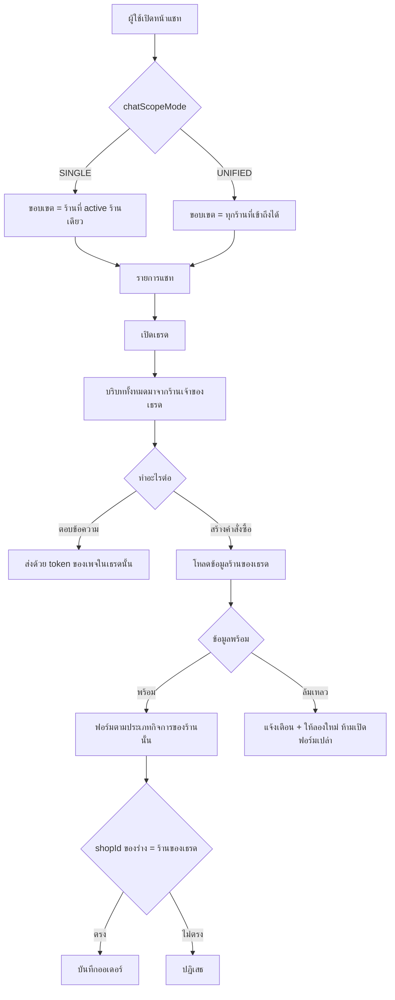

> **โมดูล:** M37-UnifiedInbox
> **ประเภทเอกสาร:** Product Requirements Document (PRD)
> **เวอร์ชัน:** 1.0
> **วันที่จัดทำ:** 2026-08-08
> **สถานะ:** Approved (user เคาะ 2026-08-08 "พัฒนาเลย")
> **เจ้าของเอกสาร:** BA + PO + PM

# PRD: กล่องแชทรวมหลายร้าน

---

## Executive Summary

ผู้ขายบน Deep จำนวนหนึ่งถือหลายร้านพร้อมกัน — ทั้งร้านที่ตัวเองเป็นเจ้าของ และร้านที่ถูกเชิญเข้าไปเป็นผู้ดูแล (`ShopMember`) แต่ละร้านผูก Facebook Page คนละเพจ ทุกวันนี้กล่องแชทของ Deep ผูกกับร้านที่ "กำลังใช้งาน" (`activeShopId`) ร้านเดียว ผู้ขายจึงต้องสลับบัญชีไปมาทั้งวันเพื่อดูว่ามีลูกค้าทักร้านไหนบ้าง ทั้งที่คนตอบเป็นคนเดียวกันและตอบพร้อมกัน

ฟีเจอร์นี้เพิ่ม **โหมดมุมมองของกล่องข้อความ** ให้ผู้ใช้เลือกเองว่าจะ "รวมทุกร้าน" หรือ "ร้านเดียว" โดยที่ **บริบทของการทำงานยังผูกกับเธรด ไม่ใช่ผูกกับร้านที่ active** — เปิดเธรดของร้านไหน การตอบ การสร้างคำสั่งซื้อ คำศัพท์ตามประเภทกิจการ แคตตาล็อกสินค้า และสิทธิ์ทั้งหมดเป็นของร้านนั้น

คุณค่าทางธุรกิจ: ลดเวลาตอบลูกค้าของผู้ขายหลายร้าน และลดความเสี่ยงที่ข้อความของร้านหนึ่งถูกปล่อยค้างเพราะผู้ขายลืมสลับไปดู

---

## 1. Business Goals & KPIs

### 1.1 เป้าหมายทางธุรกิจ

| เป้าหมาย | รายละเอียด |
|----------|-----------|
| **ลดข้อความค้างที่ไม่มีคนเห็น** | ผู้ขายหลายร้านไม่ต้องจำว่า "วันนี้ยังไม่ได้เข้าไปดูร้าน B" — ข้อความทุกร้านมาอยู่จอเดียว |
| **ลดเวลาสลับบริบท** | ตัดขั้นตอนสลับบัญชี (ซึ่งเป็น full page reload + `session.update()`) ออกจากลูปการตอบแชทประจำวัน |
| **ไม่แลกด้วยความถูกต้องของออเดอร์** | การรวมมุมมองต้องไม่ทำให้ออเดอร์/พัสดุ/คำศัพท์ของร้านหนึ่งไปโผล่ในอีกร้าน |

### 1.2 ตัวชี้วัดความสำเร็จ (KPIs)

| KPI | คำอธิบาย | เป้าหมาย |
|-----|----------|---------|
| **อัตราการเปิดใช้โหมดรวม** | ผู้ใช้ที่มี ≥2 ร้าน และตั้ง `chatScopeMode='UNIFIED'` ÷ ผู้ใช้ที่มี ≥2 ร้านทั้งหมด | ≥50% ภายใน 30 วัน |
| **จำนวนครั้งที่สลับร้านต่อวัน** | นับ `POST /api/business/switch-context` ต่อผู้ใช้ต่อวัน (เทียบก่อน/หลัง) | ลดลง ≥40% ในกลุ่มที่เปิดโหมดรวม |
| **ออเดอร์ที่สร้างผิดร้าน** | จำนวนออเดอร์ที่ผู้ขายแจ้งว่าสร้างเข้าร้านผิด | **0** (เกณฑ์ผ่าน/ไม่ผ่าน ไม่ใช่เป้าหมายเชิงปริมาณ) |
| **เธรดที่ยังไม่ตอบเกิน 24 ชม.** | เธรดช่องทางนอกที่หลุด messaging window เพราะไม่มีใครเห็น | ลดลงในกลุ่มผู้ใช้หลายร้าน |

---

## 2. User Personas

### 2.1 เจ้าของหลายสาขา (persona หลัก)

**ข้อมูลพื้นฐาน:** เจ้าของธุรกิจที่เปิดร้านบน Deep มากกว่า 1 ร้าน เช่น ร้านอะไหล่ 1 ร้าน + ร้านบริการซ่อม 2 สาขา แต่ละสาขาผูกเพจ Facebook ของตัวเอง

**เป้าหมาย:** เห็นข้อความลูกค้าทั้งหมดในที่เดียว แล้วตอบตามลำดับความเร่งด่วนจริง ไม่ใช่ตามลำดับที่นึกได้ว่าจะไปเปิดร้านไหน

**ความต้องการ:**
- รู้ทันทีว่าข้อความนี้เข้ามาที่ร้านไหน ก่อนจะพิมพ์ตอบ
- สร้างคำสั่งซื้อ/งานจากในแชทได้เลย โดยระบบใช้ข้อมูลของร้านเจ้าของเธรดนั้น
- กลับไปโหมดแยกร้านได้เมื่ออยากโฟกัสร้านเดียว

**จุดปวด:** ต้องสลับบัญชีวันละหลายสิบครั้ง · ลืมเข้าไปดูร้านที่เงียบกว่าจนลูกค้ารอข้ามวัน · เคยตอบผิดร้านเพราะจำสลับ

### 2.2 ผู้ดูแลที่ถูกเชิญ (`ShopMember` role=ADMIN)

**ข้อมูลพื้นฐาน:** พนักงาน/แอดมินที่เจ้าของเชิญเข้ามาช่วยตอบแชทหลายร้าน ไม่ได้เป็นเจ้าของร้านใดเลย

**เป้าหมาย:** ตอบแชทให้ครบทุกร้านที่ตัวเองรับผิดชอบ

**ความต้องการ:** เห็นเฉพาะร้านที่ตัวเองมีสิทธิ์จริง · ไม่ถูกระบบพาไปติดอยู่ในหน้าตั้งค่าของร้านที่ไม่ได้เป็นเจ้าของ

**จุดปวด:** เหมือน 2.1 แต่หนักกว่าเพราะไม่มีสิทธิ์บางอย่าง ทำให้การสลับร้านบางครั้งพาไปเจอหน้าที่ใช้ไม่ได้

### 2.3 ผู้ขายร้านเดียว (persona ที่ต้อง "ไม่ถูกกระทบ")

**ข้อมูลพื้นฐาน:** ผู้ขายส่วนใหญ่ของระบบ — มีร้านเดียว

**ความต้องการ:** ไม่ต้องเห็นอะไรใหม่เลย หน้าจอต้องเหมือนเดิมทุกประการ

**จุดปวด:** ฟีเจอร์ที่ทำมาเพื่อคนกลุ่มอื่นแล้วมาเพิ่มปุ่ม/ป้ายรกในจอของตัวเอง

---

## 3. Scope

### 3.1 In-Scope

1. คอลัมน์ใหม่ `User.chatScopeMode` (`SINGLE` | `UNIFIED`) — ตั้งค่าต่อผู้ใช้ เก็บในฐานข้อมูล ใช้ได้ทุกอุปกรณ์
2. สวิตช์เลือกโหมดในหน้าแชท (แสดงเฉพาะผู้ใช้ที่เข้าถึงได้มากกว่า 1 ร้าน)
3. แท็บ **"ข้อความ"** รวมทุกร้าน — รายการ, ตัวนับยังไม่อ่าน, ตัวกรอง, การค้นหา, realtime, เสียงแจ้งเตือน
4. แท็บ **"ความคิดเห็น"** (คอมเมนต์ Facebook) รวมทุกร้าน
5. บริบทตามเธรด — เปิดเธรดร้านไหน สินค้า/ประเภทกิจการ/คำศัพท์/บริการ/พัสดุ/บอท เป็นของร้านนั้น
6. สร้างคำสั่งซื้อ/งานจากในแชทได้ถูกร้านเสมอ รวมถึงกรณีสร้างจากหน้ารายการที่ยังไม่ได้เปิดเธรด

### 3.2 Out-of-Scope (รอบนี้ไม่ทำ)

| ไม่ทำ | เหตุผล |
|-------|--------|
| เลือกรวมเฉพาะบางร้าน (ติ๊กถูกทีละร้าน) | มติ D-1 — สวิตช์ 2 โหมดพอสำหรับปัญหาที่มีจริง เพิ่มความซับซ้อนของ UI และ state โดยยังไม่มีคนขอ |
| กลุ่ม/แท็กข้ามร้าน | `ChatGroup` มี `@@unique([shopId, name])` — กลุ่มชื่อเดียวกันคนละร้านคือคนละของ ยุบรวมไม่ได้โดยไม่ตัดสินใจเรื่องความหมายใหม่ |
| รวมมุมมองให้หน้าอื่น (`/orders`, `/customers`, Command Center) | คนละปัญหา คนละความเสี่ยง — แชทเป็นงานที่ต้องตอบทันที หน้าอื่นเป็นงานที่นั่งทำทีละร้านได้ |
| สถิติ/รายงานข้ามร้าน | ต้องตัดสินเรื่องการรวมเงินข้ามนิติบุคคลก่อน |
| ส่งข้อความเดียวออกหลายร้านพร้อมกัน | ไม่ใช่ปัญหาที่ผู้ใช้ร้องขอ และเสี่ยงถูก Meta ตีว่าเป็น spam |
| รวมการตั้งค่าเพจ (`/api/channels/**`) | การเชื่อม/ถอดเพจเป็นการตั้งค่ารายร้าน ต้องอยู่ในบริบทร้านเดียวเสมอ |

---

## 4. User Stories (ภาพรวม — ฉบับเต็มพร้อม Acceptance อยู่ใน BRD)

| ID | ในฐานะ | ฉันต้องการ | เพื่อ |
|----|--------|-----------|------|
| US-01 | เจ้าของหลายร้าน | เปิดโหมดรวมทุกร้านได้เอง | เห็นข้อความทุกร้านในจอเดียว |
| US-02 | เจ้าของหลายร้าน | กลับไปโหมดร้านเดียวได้เอง | โฟกัสทีละร้านเมื่อจำเป็น |
| US-03 | ผู้ตอบแชท | รู้ว่าเธรดนี้ของร้านไหนก่อนพิมพ์ | ไม่ตอบผิดร้าน |
| US-04 | ผู้ตอบแชท | สร้างคำสั่งซื้อจากเธรดแล้วได้ฟอร์มของร้านนั้น | ไม่ต้องออกจากแชทไปเปิดหน้าอื่น และข้อมูลไม่เข้าร้านผิด |
| US-05 | ผู้ตอบแชท | เห็นคอมเมนต์เพจของทุกร้านรวมกัน | ไม่พลาดคอมเมนต์ของเพจที่เงียบกว่า |
| US-06 | ผู้ขายร้านเดียว | ไม่เห็นอะไรเปลี่ยนเลย | ไม่ต้องเรียนรู้อะไรใหม่โดยไม่จำเป็น |

---

## 5. Feature Requirements (ระดับ feature — FR ฉบับเต็มอยู่ใน BRD/SRS)

| FR | ชื่อ | สรุป |
|----|------|------|
| FR-UNI-01 | โหมดมุมมองกล่องข้อความ | ผู้ใช้เลือก `SINGLE`/`UNIFIED` ได้เอง ค่าเก็บต่อผู้ใช้ในฐานข้อมูล |
| FR-UNI-02 | ขอบเขตร้านของโหมดรวม | = ทุกร้านที่ผู้ใช้เข้าถึงได้จริง (เจ้าของ + สมาชิก) ที่ยังไม่ถูกลบ |
| FR-UNI-03 | รายการแชทข้ามร้าน | เรียงตามเวลาข้อความล่าสุดข้ามร้าน พร้อม pagination/ตัวกรอง/ค้นหาเดิมครบ |
| FR-UNI-04 | ตัวบอกร้านของเธรด | ทุกเธรดในโหมดรวมต้องบอกร้านเจ้าของได้ทั้งในรายการและในหัวเธรด |
| FR-UNI-05 | บริบทตามเธรด | ทุกข้อมูลรายร้านในหน้าเธรดมาจาก `conversation.shopId` ไม่ใช่ `activeShopId` |
| FR-UNI-06 | สร้างรายการถูกร้าน | ร่างออเดอร์พก `shopId` ติดตัว และถูกปฏิเสธถ้าไม่ตรงกับเธรด |
| FR-UNI-07 | คอมเมนต์ข้ามร้าน | แท็บความคิดเห็นรวมโพสต์ของทุกเพจในขอบเขต ตอบด้วย token ของเพจนั้น |
| FR-UNI-08 | Realtime ข้ามร้าน | ข้อความ/คอมเมนต์ใหม่ของทุกร้านในขอบเขตต้องเด้งและมีเสียงแจ้งเตือน |
| FR-UNI-09 | ไม่กระทบผู้ใช้ร้านเดียว | โหมด `SINGLE` ต้องให้ผลลัพธ์เท่าเดิมทุกประการ |

---

## 6. Non-Functional Requirements

| NFR | ข้อกำหนด |
|-----|---------|
| **ความปลอดภัย** | ขอบเขตร้านต้องถูกบังคับใน `WHERE` ตั้งแต่คำสั่งแรก ห้ามดึงมาก่อนแล้วค่อยตรวจสิทธิ์ · ห้ามรับรายชื่อร้านจาก client |
| **ประสิทธิภาพ** | โหมด `SINGLE` ต้องไม่ช้าลงเลย (ไม่เพิ่ม query/ไม่เพิ่ม round-trip) · โหมด `UNIFIED` ใช้ query ชุดเดิมโดยเปลี่ยนเงื่อนไขเป็น `IN` ไม่ใช่ยิงทีละร้านแล้วรวมฝั่ง client |
| **ความเข้ากันได้ย้อนหลัง** | คอลัมน์ใหม่มีค่าเริ่มต้น `SINGLE` — ผู้ใช้เดิมทุกคนพฤติกรรมไม่เปลี่ยนโดยไม่ต้อง backfill |
| **การเข้าถึง** | ป้ายบอกร้านที่เป็นภาพเล็กต้องมีข้อความสำรอง (`title`/`aria-label`) เสมอ |

---

## 7. Business Flow

---

## 8. Assumptions

1. ผู้ใช้หนึ่งคนเข้าถึงร้านในระดับ "ไม่กี่ร้าน" (หลักหน่วย) — การ subscribe realtime หนึ่งช่องต่อร้านจึงยังไม่ต้องมีเพดาน
2. สิทธิ์เปิด/ตอบเธรดในระบบเดิมผูกกับเธรดอยู่แล้ว (`canAccessShop(conversation.shopId, userId)`) ไม่ได้ผูกกับร้านที่ active — ฟีเจอร์นี้จึงไม่ต้องรื้อชั้นสิทธิ์
3. ผู้ใช้ที่เปิดโหมดรวมยอมรับว่ารายการจะยาวขึ้นและปนกันหลายร้าน (นั่นคือสิ่งที่เขาขอ)

---

## 9. Risks

| ความเสี่ยง | ผลกระทบ | การรับมือ |
|-----------|---------|----------|
| **ฟอร์มสร้างรายการหยิบข้อมูลผิดร้าน** | ออเดอร์เข้าร้านผิดถาวร / ร้านบริการถูกบังคับกรอกที่อยู่จัดส่ง | บริบททั้งชุดผูกกับ `conversation.shopId`, ร่างพก `shopId` ไปเทียบตอนบันทึก, มีเทสยิงผ่านเส้นแชทตรง ๆ |
| **แก้ขอบเขตไม่ครบทุกจุด** | บางหน้าจอรวมร้านแล้ว บางหน้าจอยังร้านเดียว ปนกันโดยไม่มีอะไรฟ้อง | บังคับให้ทุกจุดผ่านตัว resolve เดียว + ด่าน grep ตอนรีวิวว่าไม่มีใครอ่าน `activeShopId` ตรง ๆ ในขอบเขตแชทอีก |
| **ผู้ใช้ร้านเดียวเห็นของรก** | ผู้ใช้ส่วนใหญ่ของระบบเสียประสบการณ์เพื่อคนส่วนน้อย | ทุกองค์ประกอบใหม่ผูกเงื่อนไข "เข้าถึงได้มากกว่า 1 ร้าน" ทั้งหมด |
| **ตอบผิดร้านเพราะไม่ทันสังเกต** | ลูกค้าได้คำตอบในนามร้านที่ไม่เกี่ยว | ป้ายบอกร้าน 2 ชั้น (บนรูปโปรไฟล์ + แถบเต็มความกว้างใต้หัวเธรด) เห็นก่อนพิมพ์เสมอ |

---

## 10. Roadmap (ถ้ามีเฟสถัดไป)

- **Phase 2 (ยังไม่กำหนด):** เลือกรวมเฉพาะบางร้าน · มุมมองรวมสำหรับหน้า `/orders` · กลุ่มข้ามร้าน
- ทั้งหมดรอสัญญาณจากการใช้งานจริงของเฟสนี้ก่อน ไม่ทำล่วงหน้า
