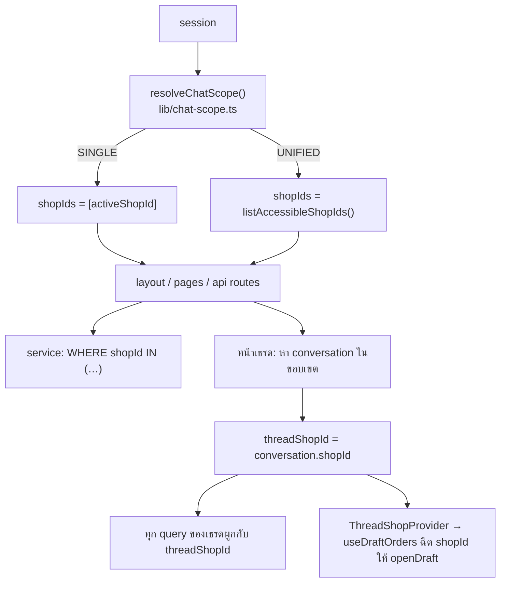
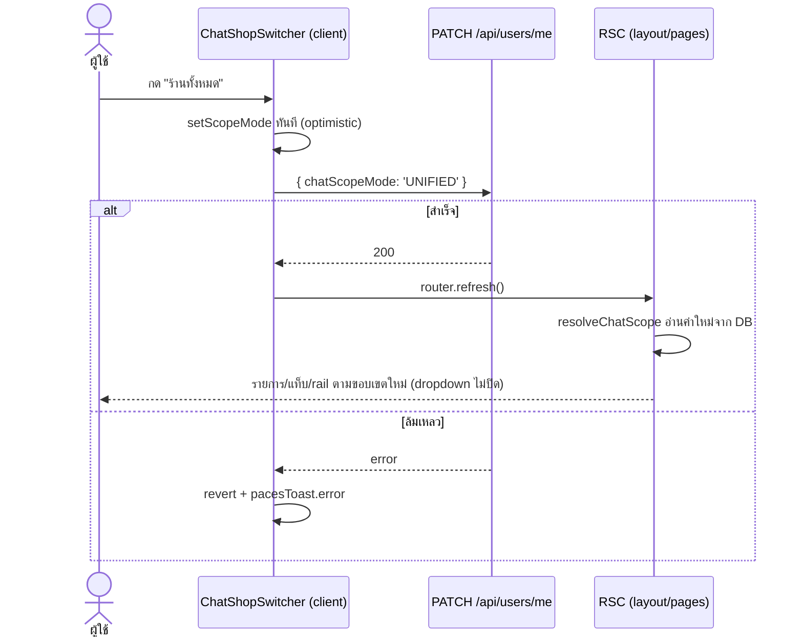
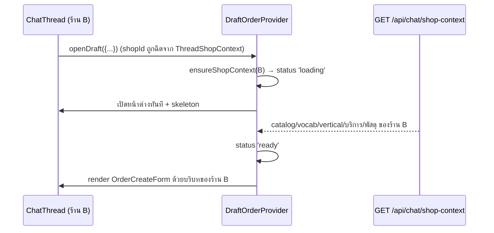

> **โมดูล:** M37-UnifiedInbox · **เวอร์ชัน:** 1.0 · **สถานะ:** Implemented

# SDS: กล่องแชทรวมหลายร้าน

## 1. สถาปัตยกรรมโดยย่อ

**หลักการเดียวที่คุมทั้งฟีเจอร์:** `activeShopId` ตอบคำถาม "ผู้ใช้กำลังทำงานในนามร้านไหนโดยรวม" · `scope.shopIds` ตอบ "รายการครอบคลุมร้านไหน" · `conversation.shopId` ตอบ "งานชิ้นนี้เป็นของร้านไหน" — ก่อนฟีเจอร์นี้ทั้งสามเป็นค่าเดียวกันเสมอ จึงไม่มีใครต้องแยก

## 2. ชั้นข้อมูล → ชั้น UI

| ชั้น | ไฟล์ | หน้าที่ |
|-----|------|--------|
| SSOT ขอบเขต | `src/lib/chat-scope.ts` | `resolveChatScope`, `resolveConversationShopId`, `resolveScopedShopId`, `intersectScopedShopIds`, `normalizeChatScopeMode` |
| สิทธิ์หลายร้าน | `src/lib/shop-context.ts` | `assertShopsAccessible` (ใหม่) — ตรวจหลายร้านด้วย query ชุดเดียว แทนการวน `canAccessShop` |
| service | `chat.service`, `page-comment.service`, `order-stage.service`, `shop-channel.service`, `chat-crm.service` | รับ `shopIds[]` |
| RSC | `(chat)/layout.tsx`, `inbox/page.tsx`, `inbox/[conversationId]/page.tsx`, `inbox/comments/page.tsx` | resolve ขอบเขตครั้งเดียวแล้วส่งลงเป็น prop |
| client | `ChatShopSwitcher`, `InboxTabs`, `ChatRailColumn`→`ChatRail`→`InboxList`, `ChatThread`, `CommentsClient`, `DraftOrderProvider` | รับ `shopIds`/`unified`/`shops` เป็น prop ไม่ fetch ขอบเขตเอง |

**ทำไม client ไม่ resolve ขอบเขตเอง:** ค่าที่ client เดาได้ต้องตรงกับขอบเขตที่ server ใช้ query อยู่แล้วเป๊ะ ๆ ถ้าสองฝั่งคำนวณแยกกันจะมีจังหวะที่ไม่ตรงกัน (เช่นสลับโหมดจากอีกแท็บ) แล้วผู้ใช้เห็นรายการของขอบเขตหนึ่งกับ badge ของอีกขอบเขตหนึ่ง

## 3. Flow — สลับโหมด

`router.refresh()` ไม่ใช่ hard-navigate เพราะทุกหน้าของกล่องข้อความ resolve ขอบเขตฝั่ง server อยู่แล้ว — refresh จึงพาทุกอย่างมาใหม่ครบโดยไม่ปิด dropdown และไม่กระพริบทั้งหน้า

## 4. Flow — เปิดร่างในเธรดของร้านอื่น

## 5. การตัดสินใจเชิงออกแบบที่สำคัญ

| # | ตัดสินใจ | ทางเลือกที่ไม่เอา และเหตุผล |
|---|---------|---------------------------|
| D-A | ฉีด `shopId` ของเธรดที่ `useDraftOrders` (hook) | ไล่ส่ง prop ลง 8 call site — จุดที่เพิ่มใหม่ทีหลังจะลืมส่งแล้วตกกลับไปใช้ร้าน active **เงียบ ๆ** ซึ่งคือบั๊ก "ออเดอร์เข้าร้านผิด" ที่ไม่มีอะไรฟ้อง |
| D-B | ลด `UNIFIED` ที่มีร้านเดียวเป็น `mode='SINGLE'` ตั้งแต่ resolve | ให้ทุก UI เช็คเอง `mode==='UNIFIED' && shopIds.length>1` — เป็นเงื่อนไขที่คนลืมได้ทุกจุด |
| D-C | อ่าน `chatScopeMode` จาก DB ไม่ฝังใน JWT | ฝังใน token = ค่าค้างจนกว่า session จะ refresh ผู้ใช้กดสลับแล้วอาจไม่เห็นผล — ราคาที่จ่ายคือ PK lookup ตัวเดียวที่ยิงขนานกับ query ที่มีอยู่แล้ว |
| D-D | `where` ใช้ equality เมื่อมีร้านเดียว | ใช้ `IN` เสมอ — planner ของ Postgres เลือก index ต่างกันเล็กน้อย และโหมดร้านเดียวคือเส้นทางของผู้ใช้ส่วนใหญ่ |
| D-E | สวิตช์อยู่ใน dropdown ของปุ่ม avatar | pill ในหัวแชท — ที่ 320px หัวแชทเหลือให้ช่องค้นหา ~140px (ux spec §0) การเติมปุ่มคือการย้อนบั๊กที่เพิ่งแก้ 2026-08-07 |
| D-F | badge ร้านอยู่มุมบนซ้ายของ avatar | ชิปข้อความข้างชื่อ — หัวเธรดที่ 320px เหลือที่ให้ชื่อลูกค้า ~90px, ชิป 60-80px จะกินหมด |
| D-G | โหมดรวมไม่ดึงกลุ่มเลย | รวมกลุ่มทุกร้านมาแสดง — `@@unique([shopId, name])` แปลว่ากลุ่มชื่อเดียวกันคนละร้านคือคนละของ ผู้ใช้แยกไม่ออก |

## 6. จุดที่ต้องระวังเมื่อแก้โค้ดต่อ

1. เพิ่ม route ใหม่ใต้ `api/chat/**` → ใช้ `resolveChatScope`/`resolveConversationShopId` เท่านั้น (ด่าน grep ใน SRS §2)
2. เพิ่ม query ที่มี `DISTINCT ON` และเกี่ยวกับ `Customer` → ต้องมี `shopId` เป็นคีย์แรกเสมอ (ดู DATABASE §4)
3. เพิ่มทางเข้าใหม่ที่เรียก `openDraft` ในเธรด → ไม่ต้องทำอะไร (context ฉีดให้แล้ว) แต่ถ้าเรียกจากนอกเธรดต้องส่ง `shopId` เอง
4. เพิ่มข้อมูลรายร้านเข้าฟอร์มสร้างรายการ → ต้องเพิ่มทั้งใน `shop-context` route **และ** ใน seed ของ layout ไม่งั้นสองเส้นทางให้ข้อมูลไม่เท่ากัน
