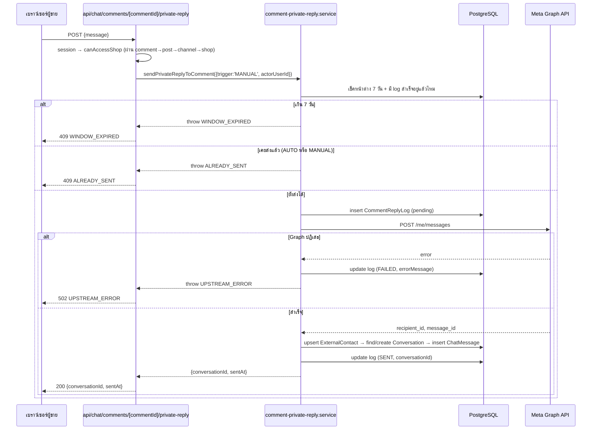

> **โมดูล:** 00038-CommentReply
> **ประเภทเอกสาร:** API Contract
> **เวอร์ชัน:** 1.0
> **วันที่จัดทำ:** 2026-08-08
> **สถานะ:** Draft — รอ user review
> **เจ้าของเอกสาร:** SA

# API Contract: ตอบกลับคอมเมนต์ (Comment Auto-Reply & Private Reply)

---

## 1. Overview

API ชุดนี้ให้บริการการตั้งค่าการตอบกลับคอมเมนต์ต่อเพจ Facebook, ดูประวัติการตอบ/ข้าม, และปุ่มแมนนวล
"ทักแชท" — provider คือ Next.js App Router API routes (TypeScript, `src/app/api/`) บน Vercel
serverless เดิมของระบบ SafePay/Deep ผู้บริโภคสัญญานี้คือ Paces frontend (`(paces)/seller/**`)
ของโปรเจกต์เดียวกัน — ไม่มี 3rd-party consumer

- **เอกสารออกแบบต้นทาง:** [[SDS]] ของโมดูลนี้ §3 (Component Design), §6 (Technical Decisions)
- **Base URL:** `https://<subdomain>.deepthailand.app/api` (prod) / `https://seller.deepth.local:4000/api` (dev)
- **Content-Type:** `application/json`
- **Convention:** response envelope เดียวกับ endpoint อื่นของระบบ (`docs/SRS.md` §7) — ไม่ใช้รูปแบบ
  `{error:{code,message,details}}` ของ feature 00035 (นั่นเป็นข้อยกเว้นเฉพาะโมดูลนั้น) — endpoint
  ของโมดูลนี้ตอบ error เป็น `{error: "ข้อความ", code: "ERROR_CODE"}` แบบเดียวกับ endpoint ส่วนใหญ่
  ของระบบ (ดู §5)

---

## 2. Authentication

| รายการ | ค่า |
|--------|-----|
| **วิธี (Auth Method)** | NextAuth.js session cookie (seller subdomain session) |
| **Header** | ไม่ต้องส่ง header เพิ่ม — cookie ผูกกับ subdomain `seller.*` อัตโนมัติ |
| **Token / Scope** | session ต้องมี `activeShopId`; ทุก endpoint เรียก `canAccessShop(shopId, session.user.id)` เป็น defense-in-depth ชั้นสอง (owner หรือ `ShopMember.role IN ('OWNER','ADMIN')`) |
| **กรณีไม่ผ่าน** | ไม่มี session → 401 `UNAUTHORIZED`; มี session แต่เข้าถึงร้าน/เพจนี้ไม่ได้ → 403 `FORBIDDEN` |

> 🛑 **`ShopChannel.accessTokenEnc` ห้ามหลุดออกไปหา client ไม่ว่ากรณีใด** — ทุก query ที่แตะ
> `ShopChannel` (endpoint ทั้ง 3 + RSC ของหน้าตั้งค่า) ต้อง `select` ระบุคอลัมน์ ห้ามคืนทั้งแถว
> **ไม่มี `GET /api/shops/comment-reply/config`** — หน้าตั้งค่า (`settings/comment-reply/page.tsx`)
> อ่านค่าตั้งต้นผ่าน RSC + prisma ตรงตาม convention ของหน้านี้ (ไม่ self-fetch API ของตัวเอง)
> จึงถอด handler GET ออก (YAGNI, Task 11) — allow-list คอลัมน์เดียวกันยังบังคับใช้ที่ RSC query
> CSRF/rate-limit: PATCH/POST ทั้งสอง endpoint (config PATCH, private-reply POST) อยู่ใต้
> `guardApi` (`src/proxy.ts`) เดิมของระบบโดยอัตโนมัติ (ไม่ต้องเพิ่ม config ใหม่ — ดู `docs/SRS.md`
> §7 หมายเหตุ CSRF/Rate-limit)

---

## 3. Endpoint List

| Method | Path | คำอธิบาย |
|--------|------|----------|
| `PATCH` | `/api/shops/comment-reply/config` | บันทึกสวิตช์/ข้อความของเพจเดียว |
| `GET` | `/api/shops/comment-reply/logs` | ประวัติการตอบ/ข้าม แบ่งหน้า |
| `POST` | `/api/chat/comments/[commentId]/private-reply` | ปุ่มแมนนวล — ส่งข้อความส่วนตัวถึงคอมเมนต์ 1 อัน |

> ค่าตั้งต้นของสวิตช์+ข้อความทุกเพจ (สิ่งที่ `GET` เดิมเคยคืน) อ่านผ่าน RSC + prisma ตรงที่
> `settings/comment-reply/page.tsx` ไม่ใช่ endpoint นี้ — ดูหมายเหตุด้านบน

---

## 4. Endpoint Detail

### 4.2 `PATCH /api/shops/comment-reply/config`

บันทึกสวิตช์/ข้อความของเพจเดียวต่อครั้ง (partial update — ส่งเฉพาะฟิลด์ที่จะแก้)

**Request**

| ส่วน | ฟิลด์ | ชนิด | บังคับ | คำอธิบาย |
|------|-------|------|--------|----------|
| Body | `shopChannelId` | `string` (uuid) | yes | id ของ `ShopChannel` ที่จะแก้ — ต้องเป็นของ active shop |
| Body | `commentPublicReplyEnabled` | `boolean` | no | เปิด/ปิดสวิตช์ A |
| Body | `commentPublicReplyText` | `string \| null` | no | ข้อความสวิตช์ A — ≤1000 ตัวอักษร |
| Body | `commentPrivateReplyEnabled` | `boolean` | no | เปิด/ปิดสวิตช์ B |
| Body | `commentPrivateReplyText` | `string \| null` | no | ข้อความสวิตช์ B — ≤1000 ตัวอักษร |

**Response — Success (200)**

| ฟิลด์ | ชนิด | คำอธิบาย |
|-------|------|----------|
| `shopChannelId` | `string` | id ที่แก้ |
| `commentPublicReplyEnabled` | `boolean` | ค่าล่าสุดหลังบันทึก |
| `commentPublicReplyText` | `string \| null` | ค่าล่าสุดหลังบันทึก |
| `commentPrivateReplyEnabled` | `boolean` | ค่าล่าสุดหลังบันทึก |
| `commentPrivateReplyText` | `string \| null` | ค่าล่าสุดหลังบันทึก |

**Response — Error**

- 400 `VALIDATION_ERROR` — เปิดสวิตช์ (`*Enabled: true`) แต่ข้อความ (`*Text`) เป็นค่าว่างหรือ `null`
  หลังบันทึก (ทั้งจากค่าที่ส่งมาใหม่และค่าที่มีอยู่เดิมในแถว — เช็คสถานะสุดท้ายหลัง merge เสมอ)
- 401 `UNAUTHORIZED` — ไม่มี session
- 403 `FORBIDDEN` — ไม่ใช่สมาชิกร้าน
- 404 `NOT_FOUND` — `shopChannelId` ไม่มีอยู่จริง, ไม่ใช่ของร้านนี้, หรือ `provider != 'MESSENGER'`
- 409 `CHANNEL_NOT_ACTIVE` — พยายามเปิดสวิตช์ (`*Enabled: true`) บนเพจที่ `status != 'ACTIVE'`
  (เช่น `TOKEN_INVALID`) — defense-in-depth คู่กับ UI ที่ปิดสวิตช์ไว้แล้ว (AC-CR-05)

**ตัวอย่าง JSON**

```json
// Request
{
  "shopChannelId": "8f0b6e2a-...",
  "commentPublicReplyEnabled": true,
  "commentPublicReplyText": "ขอบคุณที่สนใจครับ ทักแชทมาได้เลย เดี๋ยวแอดมินเช็กรุ่นให้ครับ"
}

// Response 200
{
  "shopChannelId": "8f0b6e2a-...",
  "commentPublicReplyEnabled": true,
  "commentPublicReplyText": "ขอบคุณที่สนใจครับ ทักแชทมาได้เลย เดี๋ยวแอดมินเช็กรุ่นให้ครับ",
  "commentPrivateReplyEnabled": false,
  "commentPrivateReplyText": null
}
```

### 4.3 `GET /api/shops/comment-reply/logs`

ประวัติการตอบ/ข้าม เรียงเวลาล่าสุดก่อน แบ่งหน้าแบบ offset

**Request**

| ส่วน | ฟิลด์ | ชนิด | บังคับ | คำอธิบาย |
|------|-------|------|--------|----------|
| Query | `shopChannelId` | `string` (uuid) | no | กรองเฉพาะเพจเดียว — ไม่ส่ง = ทุกเพจของร้าน |
| Query | `cursor` | `string` (regex `^\d+$`) | no | offset ตัวเลขล้วน (ค่าเริ่มต้น `0`) |
| Query | `take` | `int` | no | 1-50 (ค่าเริ่มต้น 20) |

**Response — Success (200)**

| ฟิลด์ | ชนิด | คำอธิบาย |
|-------|------|----------|
| `logs` | `array` | รายการ log |
| `logs[].id` | `string` | id ของ `CommentReplyLog` |
| `logs[].createdAt` | `string` (ISO-8601) | เวลาที่ตัดสินใจ |
| `logs[].commenterName` | `string \| null` | ชื่อผู้คอมเมนต์ (จาก `PageComment.fromName`) |
| `logs[].postMessage` | `string \| null` | ข้อความโพสต์ (ตัดสั้นไม่เกิน 120 ตัวอักษร ต่อท้ายด้วย `…` ถ้ายาวกว่านั้น) |
| `logs[].trigger` | `string` | `"AUTO"` \| `"MANUAL"` |
| `logs[].publicReplyStatus` | `string \| null` | `"SENT"` \| `"SKIPPED"` \| `"FAILED"` \| `null` |
| `logs[].privateReplyStatus` | `string \| null` | เหมือนกัน |
| `logs[].skipReasonText` | `string \| null` | ข้อความไทยที่แปลแล้ว (ไม่ใช่รหัสดิบ — ดู DATABASE.md §3.4) |
| `logs[].conversationId` | `string \| null` | ใช้สร้างลิงก์ "เปิดห้อง" เมื่อ `privateReplyStatus='SENT'` |
| `hasMore` | `boolean` | ยังมีหน้าถัดไปไหม |

**Response — Error**

- 401 `UNAUTHORIZED`, 403 `FORBIDDEN` — เหมือน 4.1
- `shopChannelId` ที่ไม่ใช่ของร้านนี้ → **ไม่ใช่ error** — ระบบเพิกเฉย filter นั้นแล้วคืนของร้านตัวเอง
  ทั้งหมดแทน (ป้องกัน ID enumeration — ไม่บอกว่า id นั้นมีอยู่จริงหรือไม่)

**ตัวอย่าง JSON**

```json
// Response 200
{
  "logs": [
    {
      "id": "c1a9...",
      "createdAt": "2026-08-08T13:23:10+07:00",
      "commenterName": "สุพจน์ เหลา",
      "postMessage": "โรงงานล้างสต๊อก! โช๊คหลังเวฟ...",
      "trigger": "AUTO",
      "publicReplyStatus": "SENT",
      "privateReplyStatus": "SENT",
      "skipReasonText": null,
      "conversationId": "conv-88a1..."
    }
  ],
  "hasMore": true
}
```

### 4.4 `POST /api/chat/comments/[commentId]/private-reply`

ปุ่มแมนนวล "ทักแชท" — ส่ง private reply 1 คอมเมนต์ ใช้ได้เสมอไม่ว่าสวิตช์อัตโนมัติจะเปิดหรือปิด
(BR-CR-M3/D-6) เรียก `sendPrivateReplyToComment({trigger:'MANUAL', ...})` ตาม SRS TFR-006/TFR-007

**หมายเหตุ endpoint ปลายทางที่ Graph ชั้นล่างเรียกจริง:** ยิง `POST /me/messages` — **ไม่ใช่**
`POST /{page-id}/messages` ตามที่เอกสาร Private Replies ของ Meta เขียนไว้ตรง ๆ เหตุผลอยู่ที่
`src/lib/facebook/graph.ts:522-526` (คอมเมนต์เหนือ `sendTextMessage` ที่ `sendPrivateReplyToComment`
เกาะ pattern เดียวกัน): `pageToken` resolve `/me` เป็นเพจอยู่แล้ว และ `ShopChannel.externalId` ของ
ช่องทาง IG เก็บ IG account id ไม่ใช่ Page id — ยิง `externalId` เข้า path ตรง ๆ จะพังทันทีที่เฟส 2
เปิดใช้ IG (ดูรายละเอียดการตัดสินใจเต็มที่ SDS TD-006) — ซิกเนเจอร์จริงของฟังก์ชันคือ
`sendPrivateReplyToComment(pageToken, commentExternalId, text)` ไม่มีพารามิเตอร์ `pageId`

**Request**

| ส่วน | ฟิลด์ | ชนิด | บังคับ | คำอธิบาย |
|------|-------|------|--------|----------|
| Path Param | `commentId` | `string` (uuid) | yes | id ของ `PageComment` (internal id ไม่ใช่ `externalCommentId`) |
| Body | `message` | `string` | yes | ข้อความส่วนตัวที่จะส่ง — 1-1000 ตัวอักษร ไม่รับค่าว่าง |

**Response — Success (200)**

| ฟิลด์ | ชนิด | คำอธิบาย |
|-------|------|----------|
| `conversationId` | `string` | ห้องแชทที่เกิดขึ้น/ถูกใช้ |
| `sentAt` | `string` (ISO-8601) | เวลาที่ส่งสำเร็จ |

**Response — Error**

- 400 `VALIDATION_ERROR` — `message` ว่างหรือเกิน 1000 ตัวอักษร
- 401 `UNAUTHORIZED` — ไม่มี session
- 403 `FORBIDDEN` — ผู้เรียกเข้าถึงร้านของเพจที่เป็นเจ้าของคอมเมนต์นี้ไม่ได้
- 404 `NOT_FOUND` — ไม่พบ `PageComment` ที่ id นี้
- 409 `ALREADY_SENT` — คอมเมนต์นี้ถูกทักไปแล้ว (ไม่ว่าจะเป็น AUTO หรือ MANUAL — สิทธิ์ของ Meta ผูกกับ
  *คอมเมนต์* ไม่ใช่ผู้กด) — ชนกับ partial unique index ฝั่ง MANUAL (`CommentReplyLog` ที่มีอยู่แล้ว
  จาก AUTO trigger ก็ทำให้เส้นทาง MANUAL ปฏิเสธได้เช่นกัน เพราะ service ชั้น `sendPrivateReplyToComment`
  เช็คว่ามี log สำเร็จของ `commentId` นี้จาก trigger ใดก็ได้ก่อนเสมอ ไม่ใช่แค่ query index ของตัวเอง)
- 409 `WINDOW_EXPIRED` — เกิน 7 วันนับจากเวลาคอมเมนต์
- 409 `CHANNEL_NOT_ACTIVE` — เพจของคอมเมนต์นี้ `status != 'ACTIVE'`
- 502 `UPSTREAM_ERROR` — Meta Graph API ปฏิเสธคำขอ (token/rate-limit/policy) — บันทึกลง
  `CommentReplyLog` แล้วก่อนตอบ error กลับ (ไม่ retry อัตโนมัติ)

**ตัวอย่าง JSON**

```json
// Request
{ "message": "สวัสดีครับ พอดีเห็นคอมเมนต์ในโพสต์ รบกวนแจ้งรุ่นรถกับปีได้เลยครับ" }

// Response 200
{ "conversationId": "conv-88a1...", "sentAt": "2026-08-08T13:24:02+07:00" }

// Response 409 (ทักไปแล้ว)
{ "error": "คอมเมนต์นี้ถูกทักไปแล้ว", "code": "ALREADY_SENT" }
```

---

## 5. Error Code Table

| Error Code | HTTP Status | ความหมาย / เงื่อนไข |
|------------|-------------|----------------------|
| `VALIDATION_ERROR` | `400` | ข้อมูล request ไม่ผ่าน Valibot (ข้อความว่างตอนเปิดสวิตช์, `message` ว่าง/เกินความยาว) |
| `UNAUTHORIZED` | `401` | ไม่มี session หรือ session หมดอายุ |
| `FORBIDDEN` | `403` | session มีแต่ไม่ใช่สมาชิกร้าน active (`canAccessShop` คืน false) |
| `NOT_FOUND` | `404` | `shopChannelId`/`commentId` ไม่มีอยู่จริง หรือไม่ตรงเงื่อนไข (`provider`, ownership) |
| `CONFLICT` (`ALREADY_SENT` / `WINDOW_EXPIRED` / `CHANNEL_NOT_ACTIVE`) | `409` | ชนกับสถานะปัจจุบัน — ดูรายละเอียดที่ endpoint 4.4 และ 4.2 |
| `UPSTREAM_ERROR` | `502` | Meta Graph API ปฏิเสธ/timeout |

**โครง error response มาตรฐาน**

```json
{
  "error": "ข้อความสำหรับผู้ใช้/debug",
  "code": "ERROR_CODE"
}
```

---

## 6. Sequence (flow ซับซ้อน — ปุ่มแมนนวล)



---

## 7. Traceability

| Endpoint | SDS Component / Decision | BRD FR |
|----------|--------------------------|--------|
| `GET/PATCH /api/shops/comment-reply/config` | Component `api/shops/comment-reply/config` (SDS §3) | FR-CR-01, FR-CR-02, FR-CR-03, FR-CR-04 |
| `GET /api/shops/comment-reply/logs` | Component `api/shops/comment-reply/logs` (SDS §3) | FR-CR-08 |
| `POST /api/chat/comments/[commentId]/private-reply` | TD-001, TD-004, TD-006 (SDS §6), Flow 4.1 (SDS §4) | FR-CR-09, FR-CR-10, FR-CR-11 |

---

## 8. สรุป (Summary)

เอกสาร API Contract นี้กำหนด **สัญญาการเชื่อมต่อ** ของ **ตอบกลับคอมเมนต์ (Comment Auto-Reply &
Private Reply)** ให้ชัดพอที่ DEV นำไป implement ได้โดยไม่ต้องตัดสินใจรูปร่าง request/response ใหม่,
QA ใช้ตาราง error ในข้อ 5 วางแผนทดสอบ negative case และทุก endpoint trace กลับ [[SDS]] ได้

**Open Questions:**
- ไม่มี — สัญญาทั้ง 3 endpoint ปิดครบตาม TFR-002/006/007/008 ใน [[SRS]]
