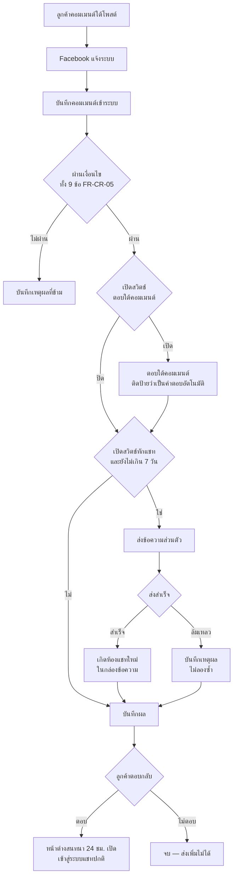
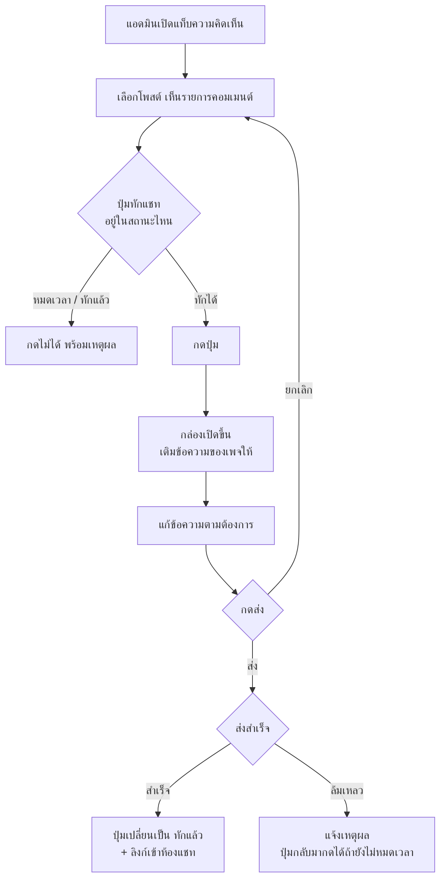
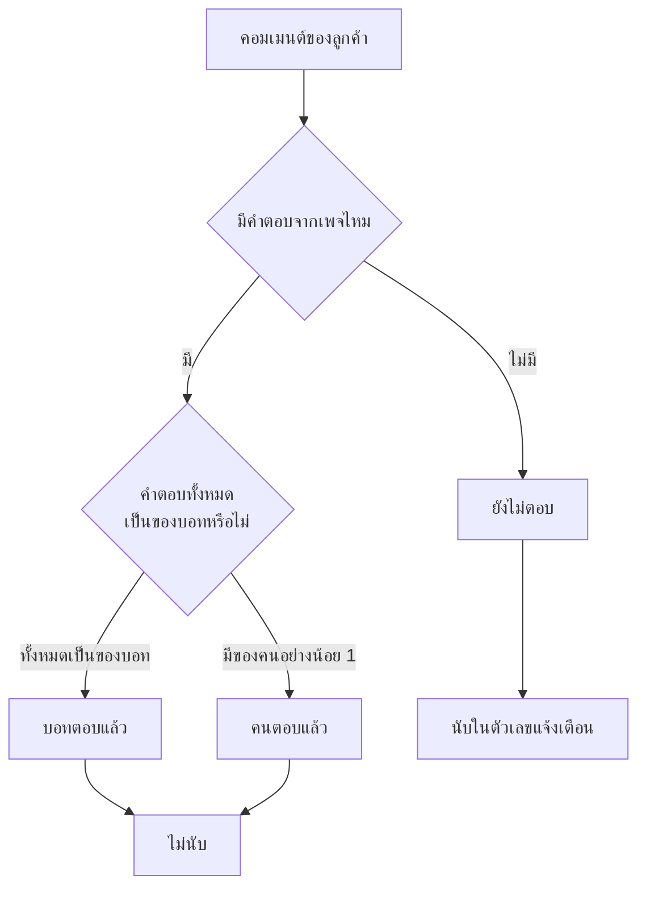

> **โมดูล:** 00038-CommentReply
> **ประเภทเอกสาร:** Business Requirements Document (BRD) - NON-TECHNICAL
> **เวอร์ชัน:** 1.0
> **วันที่จัดทำ:** 2026-08-08
> **สถานะ:** Draft — รอ user review
> **เจ้าของเอกสาร:** BA

# BRD: ตอบกลับคอมเมนต์ (Comment Auto-Reply & Private Reply)

---

## 1. บทนำ

### 1.1 วัตถุประสงค์ของเอกสาร

เอกสารนี้อธิบายความต้องการเชิงธุรกิจของระบบ "ตอบกลับคอมเมนต์" ในระดับที่ผู้ที่ไม่ใช่นักพัฒนา
อ่านแล้วตรวจสอบได้ว่าระบบทำอะไร ตัดสินใจอย่างไร และเมื่อไหร่จึงถือว่าทำงานถูกต้อง

เอกสารนี้เป็นฐานให้ SRS/SDS (เอกสารเชิงเทคนิค) และ TestCase เขียนต่อ — สิ่งที่ไม่ปรากฏใน BRD
ถือว่าไม่อยู่ในความต้องการ

### 1.2 ขอบเขตของระบบ

**อยู่ในขอบเขต:**

- ตั้งค่าการตอบกลับคอมเมนต์ **แยกรายเพจ Facebook** ผ่านเมนูใหม่ "ตอบกลับคอมเมนต์"
- เมื่อมีคอมเมนต์ใหม่จากลูกค้า ระบบตอบใต้คอมเมนต์นั้นด้วยข้อความที่ร้านตั้งไว้ (เปิด/ปิดได้)
- และ/หรือ ส่งข้อความส่วนตัวถึงคนที่คอมเมนต์เพื่อเปิดห้องแชท (เปิด/ปิดได้ แยกจากข้อบน)
- ปุ่ม "ทักแชท" ในแท็บความคิดเห็นกดได้จริง ใช้ได้แม้ปิดระบบอัตโนมัติ
- แยกสถานะคอมเมนต์เป็น 3 ชั้น และมีตัวกรองให้เลือกดู
- ประวัติการทำงานย้อนหลัง พร้อมเหตุผลเมื่อระบบเลือกไม่ตอบ

**ไม่อยู่ในขอบเขต:**

- Instagram (เฟส 2)
- การเลือกคำตอบตามเนื้อหาคอมเมนต์ (กลุ่มคำ / AI)
- การหน่วงเวลาก่อนตอบ
- การซ่อน/ลบคอมเมนต์อัตโนมัติ
- คอมเมนต์ใต้โฆษณาโดยตรง
- การส่งข้อความตามหลังเมื่อลูกค้าไม่ตอบ (Facebook ไม่อนุญาต)

### 1.3 กลุ่มผู้ใช้งาน

| กลุ่ม | บทบาทในระบบนี้ |
|---|---|
| **เจ้าของร้าน** | ตั้งค่าเปิด/ปิดและเขียนข้อความ · ดูประวัติ · กดทักแชทเองได้ |
| **สมาชิกร้านที่มีสิทธิ์เข้าถึง** | เข้าหน้าตั้งค่าและกดทักแชทเองได้ ระดับเดียวกับหน้าตอบกลับอัตโนมัติเดิม |
| **ระบบ (ทำงานอัตโนมัติ)** | ผู้กระทำที่ไม่ใช่คน — ทุกการกระทำต้องแยกออกจากการกระทำของคนได้ในประวัติและบนหน้าจอ |
| **ผู้ที่คอมเมนต์** | ผู้รับผลลัพธ์ ไม่มีสิทธิ์ตั้งค่าอะไร |

---

## 2. ความต้องการหลัก (Functional Requirements)

### 2.1 การตั้งค่ารายเพจ

**FR-CR-01 — เมนูและหน้าตั้งค่า**

> ในฐานะเจ้าของร้าน ฉันต้องการหน้าตั้งค่าที่รวมการตอบกลับคอมเมนต์ของทุกเพจไว้ที่เดียว
> เพื่อที่ฉันจะได้ตั้งค่าโดยไม่ต้องเข้าไปทีละเพจ

- มีเมนู **"ตอบกลับคอมเมนต์"** อยู่ในกลุ่มเมนู "แชท" ต่อจาก "ตอบกลับอัตโนมัติ"
- หน้าแสดงการ์ดหนึ่งใบต่อเพจที่ร้านเชื่อมไว้ เรียงตามลำดับเดียวกับหน้าจัดการช่องทาง
- ร้านที่ยังไม่เชื่อมเพจเลย เห็นข้อความชี้ทางไปหน้าเชื่อมช่องทาง

**FR-CR-02 — สวิตช์ "ตอบใต้คอมเมนต์"**

> ในฐานะเจ้าของร้าน ฉันต้องการให้ระบบตอบใต้คอมเมนต์แทนฉัน
> เพื่อให้คนที่เข้ามาดูโพสต์เห็นว่าร้านตอบทุกคอมเมนต์

- เปิด/ปิดได้ต่อเพจ · ค่าตั้งต้น = ปิด
- มีช่องข้อความของตัวเอง ร้านพิมพ์เอง
- เปิดสวิตช์โดยที่ช่องข้อความว่างไม่ได้
- มีคำเตือนบนหน้าจอว่าข้อความนี้เป็นสาธารณะ คนอื่นที่มาดูโพสต์เห็นด้วย

**FR-CR-03 — สวิตช์ "ทักแชทส่วนตัว"**

> ในฐานะเจ้าของร้าน ฉันต้องการให้ระบบเปิดห้องแชทกับคนที่คอมเมนต์ให้อัตโนมัติ
> เพื่อที่ฉันจะได้คุยต่อในที่ที่ปิดการขายได้

- เปิด/ปิดได้ต่อเพจ **แยกอิสระจาก FR-CR-02** · ค่าตั้งต้น = ปิด
- มีช่องข้อความของตัวเอง แยกจากข้อความใต้คอมเมนต์
- หน้าจอต้องบอกให้ชัดว่า Facebook ให้ทักได้ครั้งเดียวต่อคอมเมนต์ ภายใน 7 วัน และคุยต่อได้เมื่อ
  ลูกค้าตอบกลับเท่านั้น

**FR-CR-04 — เพจที่ใช้งานไม่ได้**

> ในฐานะเจ้าของร้าน ฉันต้องรู้ทันทีว่าเพจไหนตั้งค่าไว้แล้วแต่ระบบทำงานให้ไม่ได้
> เพื่อไม่ให้เข้าใจผิดว่าระบบกำลังทำงานอยู่

- เพจที่โทเคนหมดอายุ ขึ้นแถบเตือนพร้อมปุ่มไปเชื่อมใหม่ และสวิตช์ทั้งใบถูกปิดการใช้งาน
- เพจที่ถูกถอดออกแล้ว ไม่แสดงในหน้านี้

### 2.2 การทำงานอัตโนมัติ

**FR-CR-05 — เงื่อนไขที่ระบบจะตอบ**

> ในฐานะเจ้าของร้าน ฉันต้องการให้ระบบตอบเฉพาะคอมเมนต์ที่ควรตอบ
> เพื่อไม่ให้เพจของฉันดูเป็นสแปมและไม่ให้ระบบตอบทับคำตอบของคน

ระบบจะตอบก็ต่อเมื่อผ่านทุกข้อต่อไปนี้:

1. เป็นคอมเมนต์ที่ **ลูกค้า** เขียน ไม่ใช่คอมเมนต์ของเพจเอง
2. เป็น **คอมเมนต์ระดับบน** ไม่ใช่การตอบต่อในเธรดของคนอื่น
3. คอมเมนต์ยังไม่ถูกลบ
4. ระบุตัวตนผู้เขียนได้
5. เพจยังเชื่อมต่ออยู่
6. เปิดสวิตช์อย่างน้อยหนึ่งตัวและมีข้อความ
7. **ยังไม่เคยตอบอัตโนมัติให้คนนี้บนโพสต์นี้**
8. **ยังไม่มีคนในทีมร้านตอบคอมเมนต์นี้**
9. เป็นคอมเมนต์ที่เข้ามาสด ไม่ใช่คอมเมนต์เก่าที่ดึงย้อนหลัง

**FR-CR-06 — ลำดับการทำงานเมื่อเปิดทั้งสองสวิตช์**

- ตอบใต้คอมเมนต์ก่อน แล้วจึงทักแชทส่วนตัว
- ถ้าตอบใต้คอมเมนต์ล้มเหลว ยังทักแชทต่อ — สองอย่างนี้ไม่ผูกกันแบบต้องสำเร็จทั้งคู่
- ถ้าคอมเมนต์เกิน 7 วันแล้ว จะตอบใต้คอมเมนต์อย่างเดียว ข้ามการทักแชท

**FR-CR-07 — เมื่อทำงานไม่สำเร็จ**

> ในฐานะเจ้าของร้าน ฉันต้องรู้ว่าระบบพยายามแล้วแต่ไม่สำเร็จเพราะอะไร
> เพื่อที่ฉันจะได้ตัดสินใจว่าจะเข้าไปทำเองไหม

- ระบบไม่ลองซ้ำเองโดยอัตโนมัติ
- บันทึกเหตุผลไว้ในประวัติ และร้านกดทักเองจากหน้าคอมเมนต์ได้ถ้ายังอยู่ในเวลา

**FR-CR-08 — ประวัติการทำงาน**

- แสดงรายการย้อนหลังต่อเพจ: เวลา · ผู้คอมเมนต์ · โพสต์ · ผลของการตอบใต้คอมเมนต์ · ผลของการทักแชท
- รายการที่ระบบเลือกไม่ตอบ ต้องแสดง**เหตุผลเป็นภาษาที่ร้านเข้าใจ** ไม่ใช่รหัสภายในระบบ
- รายการที่ทักแชทสำเร็จ มีลิงก์เข้าห้องแชทนั้น

### 2.3 การทักแชทด้วยมือ

**FR-CR-09 — ปุ่ม "ทักแชท"**

> ในฐานะแอดมินร้าน ฉันต้องการกดทักแชทจากหน้าคอมเมนต์ได้เลย
> เพื่อไม่ต้องสลับไปแอป Facebook และไม่ต้องเปิดระบบอัตโนมัติถ้าฉันไม่อยากเปิด

- ปุ่มอยู่ในแถวเดียวกับปุ่ม "ตอบ" ของแต่ละคอมเมนต์
- **ใช้ได้เสมอ ไม่ขึ้นกับสวิตช์อัตโนมัติ**
- 4 สถานะ:

| สถานะ | เงื่อนไข | สิ่งที่ผู้ใช้เห็น |
|---|---|---|
| ทักได้ | ยังอยู่ในหน้าต่าง 7 วัน และยังไม่เคยทักคอมเมนต์นี้ | ปุ่มกดได้ + เวลาที่เหลือ |
| กำลังส่ง | หลังกดยืนยัน | ปุ่มปิดชั่วคราวพร้อมตัวบอกว่ากำลังทำงาน |
| ทักแล้ว | เคยทักคอมเมนต์นี้สำเร็จแล้ว | ปุ่มปิด + เวลาที่ทัก + ลิงก์เข้าห้องแชท |
| หมดเวลา | เกิน 7 วัน | ปุ่มปิด + บอกว่าหมดเวลาแล้ว |

**FR-CR-10 — กล่องยืนยันก่อนส่ง**

> ในฐานะแอดมินร้าน ฉันต้องได้อ่านทวนก่อนส่ง
> เพราะส่งพลาดแล้วส่งใหม่ไม่ได้ตลอดกาล

- กดปุ่มแล้วเปิดกล่องพิมพ์ ไม่ส่งทันที
- กล่องเติมข้อความที่เพจตั้งไว้ให้ (ถ้ามี) แก้ได้ก่อนส่ง
- กล่องต้องมีคำอธิบายว่านี่คือข้อความส่วนตัว ไม่ใช่คอมเมนต์สาธารณะ — **ห้ามยกคำเตือน
  "คอมเมนต์นี้เป็นสาธารณะ" ของช่องตอบคอมเมนต์มาใช้ซ้ำ** เพราะจะสื่อผิดทันที
- ส่งข้อความว่างไม่ได้

**FR-CR-11 — ขอบเขตการทักด้วยมือ**

- คนหนึ่งคนที่คอมเมนต์หลายครั้งบนโพสต์เดียว ร้านทักด้วยมือได้ **ทุกคอมเมนต์**
- กฎ "ครั้งเดียวต่อคนต่อโพสต์" ใช้กับระบบอัตโนมัติเท่านั้น ไม่ใช้กับคน

### 2.4 การมองเห็นและการคัดกรอง

**FR-CR-12 — สถานะ 3 ชั้น**

> ในฐานะแอดมินร้าน ฉันต้องแยกให้ออกว่าอันไหนบอทจัดการไปแล้ว อันไหนรอฉัน
> เพื่อไม่ให้คำถามจริงจมหายไปกับคำตอบอัตโนมัติ

| สถานะ | ความหมาย |
|---|---|
| **ยังไม่ตอบ** | ไม่มีใครตอบคอมเมนต์นี้เลย |
| **บอทตอบแล้ว** | มีแต่คำตอบอัตโนมัติ ยังไม่มีคนเข้ามาดู |
| **คนตอบแล้ว** | มีคนในทีมร้านตอบแล้ว |

- คำตอบที่บอทเขียนต้องมีป้ายกำกับให้เห็นบนหน้าจอ
- โพสต์หนึ่งโพสต์มีคอมเมนต์คละสถานะได้ — สถานะของโพสต์ใช้ **ตัวที่แย่ที่สุดชนะ**
  (มีคอมเมนต์ที่ยังไม่ตอบแม้อันเดียว โพสต์นั้นถือว่า "ยังไม่ตอบ")

**FR-CR-13 — ตัวกรองและตัวเลขแจ้งเตือน**

- ชิปกรองมี 4 ตัว: ทั้งหมด / ยังไม่ตอบ / บอทตอบแล้ว / คนตอบแล้ว
- 3 กลุ่มหลังต้องไม่ทับกัน และรวมกันได้เท่ากับ "ทั้งหมด"
- ตัวเลขบนแท็บ "ความคิดเห็น" นับเฉพาะ **ยังไม่ตอบ** — การเปิดบอทต้องไม่ทำให้ตัวเลขนี้กลายเป็น 0
- **ตัวเลขบนชิป ตัวเลขบนแท็บ และผลลัพธ์ที่กรองได้จริง ต้องตรงกันเสมอ**

**FR-CR-14 — ห้องแชทที่เกิดขึ้นใหม่**

- ห้องที่เกิดจากการทักส่วนตัว (ทั้งอัตโนมัติและกดเอง) ไปโผล่ในกล่องข้อความเหมือนห้องปกติทุกอย่าง
- **ไม่ถูกนับเป็น "ยังไม่อ่าน"** เพราะฝ่ายร้านเป็นคนเริ่ม — จะนับเมื่อลูกค้าตอบกลับ
- เมื่อลูกค้าตอบกลับ ข้อความนั้นเข้าสู่เส้นทางปกติของระบบแชททุกอย่าง รวมถึงระบบตอบกลับอัตโนมัติ
  ตามกลุ่มคำ (00023) ถ้าร้านเปิดไว้

---

## 3. Acceptance Criteria สรุป

### 3.1 การตั้งค่า

| รหัส | เกณฑ์ |
|---|---|
| **AC-CR-01** | เปิดหน้าตั้งค่า → เห็นการ์ดครบทุกเพจที่เชื่อมและยังใช้งานอยู่ |
| **AC-CR-02** | สวิตช์ทั้ง 2 ของเพจใหม่ที่เพิ่งเชื่อม อยู่ในสถานะ **ปิด** |
| **AC-CR-03** | เปิดสวิตช์แล้วปล่อยช่องข้อความว่าง → กดบันทึกไม่ได้ พร้อมข้อความบอกว่าต้องกรอกอะไร |
| **AC-CR-04** | ตั้งค่าเพจ A แล้วเพจ B ต้องไม่เปลี่ยนตาม |
| **AC-CR-05** | เพจที่โทเคนหมดอายุ → สวิตช์กดไม่ได้ + เห็นแถบเตือนพร้อมทางไปเชื่อมใหม่ |
| **AC-CR-06** | ผู้ใช้ที่ไม่มีสิทธิ์เข้าถึงร้าน เปิดหน้านี้ไม่ได้ และเรียกผ่านช่องทางตรงก็ไม่ได้ |

### 3.2 การทำงานอัตโนมัติ

| รหัส | เกณฑ์ |
|---|---|
| **AC-CR-07** | ลูกค้าคอมเมนต์ระดับบน 1 ครั้ง เปิดทั้ง 2 สวิตช์ → ได้คำตอบใต้คอมเมนต์ 1 อัน และห้องแชทใหม่ 1 ห้อง |
| **AC-CR-08** | ลูกค้าคนเดิมคอมเมนต์เพิ่มอีก 4 ครั้งบนโพสต์เดียวกัน → **ไม่มี**คำตอบเพิ่มและไม่มีข้อความส่วนตัวเพิ่ม |
| **AC-CR-09** | ลูกค้าคนเดิมไปคอมเมนต์บนโพสต์อื่น → ได้รับการตอบตามปกติ (กฎผูกกับโพสต์ ไม่ใช่ผูกกับคนตลอดกาล) |
| **AC-CR-10** | Facebook ส่ง event ของคอมเมนต์เดิมซ้ำ → ต้องไม่เกิดคำตอบหรือข้อความเพิ่ม |
| **AC-CR-11** | คนในทีมตอบคอมเมนต์นั้นไปก่อนแล้ว → ระบบไม่ตอบทับ และบันทึกเหตุผลว่าคนตอบแล้ว |
| **AC-CR-12** | reply ซ้อนใต้คอมเมนต์ของคนอื่น → ระบบไม่ตอบ |
| **AC-CR-13** | คอมเมนต์อายุเกิน 7 วัน เปิดทั้ง 2 สวิตช์ → ตอบใต้คอมเมนต์อย่างเดียว ไม่ทักแชท และบันทึกเหตุผล |
| **AC-CR-14** | ดึงคอมเมนต์เก่าเข้าระบบย้อนหลัง → ต้องไม่มีการตอบใด ๆ เกิดขึ้นเลย |
| **AC-CR-15** | ปิดทั้ง 2 สวิตช์ → คอมเมนต์ใหม่เข้ามาแล้วไม่มีอะไรเกิดขึ้น แต่คอมเมนต์ยังเข้าระบบให้เห็นตามปกติ |
| **AC-CR-16** | ส่งไม่สำเร็จ → มีบันทึกพร้อมเหตุผล และระบบไม่ยิงซ้ำเอง |

### 3.3 การทักด้วยมือ

| รหัส | เกณฑ์ |
|---|---|
| **AC-CR-17** | ปิดสวิตช์อัตโนมัติทั้งหมด → ปุ่ม "ทักแชท" ยังกดได้ปกติ |
| **AC-CR-18** | กดปุ่ม → เปิดกล่องพิมพ์ ไม่มีการส่งเกิดขึ้นจนกว่าจะกดยืนยัน |
| **AC-CR-19** | ส่งสำเร็จ → ปุ่มเปลี่ยนเป็น "ทักแล้ว" ทันทีโดยไม่ต้องรีเฟรชหน้า และมีลิงก์เข้าห้องแชท |
| **AC-CR-20** | กดปุ่มของคอมเมนต์ที่ทักไปแล้ว → กดไม่ได้ |
| **AC-CR-21** | คอมเมนต์อายุเกิน 7 วัน → ปุ่มกดไม่ได้ พร้อมเหตุผล |
| **AC-CR-22** | คนเดียวกันคอมเมนต์ 2 ครั้งบนโพสต์เดียว → กดทักได้ทั้ง 2 คอมเมนต์ |
| **AC-CR-23** | บอททักไปแล้วบนคอมเมนต์นั้น → ปุ่มของคอมเมนต์นั้นขึ้น "ทักแล้ว" ไม่ให้กดซ้ำ |

### 3.4 การมองเห็น

| รหัส | เกณฑ์ |
|---|---|
| **AC-CR-24** | บอทตอบคอมเมนต์ไปแล้ว → คอมเมนต์นั้นขึ้นสถานะ "บอทตอบแล้ว" ไม่ใช่ "คนตอบแล้ว" |
| **AC-CR-25** | บอทตอบทุกคอมเมนต์ในโพสต์ → ตัวเลขบนแท็บ "ความคิดเห็น" **ต้องไม่**นับโพสต์นั้น แต่โพสต์ยังกรองเจอในชิป "บอทตอบแล้ว" |
| **AC-CR-26** | คนเข้าไปตอบคอมเมนต์ที่บอทตอบไว้แล้ว → สถานะเปลี่ยนเป็น "คนตอบแล้ว" |
| **AC-CR-27** | ตัวเลขบนชิปทั้ง 3 รวมกัน = ตัวเลขชิป "ทั้งหมด" เสมอ |
| **AC-CR-28** | กดชิปใดก็ตาม → จำนวนรายการที่เห็นตรงกับตัวเลขบนชิปนั้น |
| **AC-CR-29** | ป้าย "ตอบอัตโนมัติ" บนคำตอบของบอท ต้องยังอยู่หลังรีเฟรชหน้าและหลัง Facebook ส่งข้อมูลชุดเดิมกลับเข้ามา |
| **AC-CR-30** | ห้องที่เกิดจากการทัก → เห็นในกล่องข้อความ และไม่ถูกนับเป็นยังไม่อ่าน |

---

## 4. Business Flows (กระบวนการทำงาน)

### 4.1 Flow หลัก: คอมเมนต์ใหม่เข้ามาในโหมดอัตโนมัติ

### 4.2 Flow: แอดมินกดทักแชทเอง

### 4.3 Flow: การตัดสินสถานะของคอมเมนต์

---

## 5. Use Case Scenarios (สถานการณ์การใช้งานจริง)

### Scenario 1: Best Case — ร้านเปิดครบ ลูกค้าตอบกลับ

**บริบท:** ร้านอะไหล่มอเตอร์ไซค์ ยิงโฆษณาโพสต์โช๊คหลัง เปิดทั้ง 2 สวิตช์

1. เจ้าของร้านเปิดเมนู "ตอบกลับคอมเมนต์" เลือกการ์ดเพจของตัวเอง
2. เปิดสวิตช์ "ตอบใต้คอมเมนต์" พิมพ์ *"ขอบคุณที่สนใจครับ ทักแชทมาได้เลย เดี๋ยวแอดมินเช็กรุ่นให้ครับ"*
3. เปิดสวิตช์ "ทักแชทส่วนตัว" พิมพ์ *"สวัสดีครับ พอดีเห็นคอมเมนต์ในโพสต์ รบกวนแจ้งรุ่นรถกับปีได้เลยครับ"*
4. กดบันทึก
5. เวลา 13:23 ลูกค้าชื่อ สุพจน์ คอมเมนต์ว่า "สวยๆครับ"
6. ภายในไม่กี่วินาที ระบบตอบใต้คอมเมนต์นั้น พร้อมป้าย "ตอบอัตโนมัติ"
7. ระบบส่งข้อความส่วนตัวถึงสุพจน์ → เกิดห้องแชทใหม่ในกล่องข้อความ ไม่ขึ้นเป็นยังไม่อ่าน
8. สุพจน์ตอบกลับว่า "เวฟ 110 ปี 62 ครับ" → ห้องขึ้นเป็นยังไม่อ่าน แอดมินเห็นและคุยต่อได้

**ผลลัพธ์:** คอมเมนต์ 1 อัน → บทสนทนา 1 ห้อง โดยไม่มีใครต้องกดอะไรเลย

### Scenario 2: คนเดิมคอมเมนต์ซ้ำ

1. สุพจน์คอมเมนต์ "สวยๆครับ" (13:23) → ระบบตอบและทักแชท
2. สุพจน์คอมเมนต์เพิ่ม "ราคาเท่าไหร่" (13:24) และ "มีสีแดงไหม" (13:25) บนโพสต์เดียวกัน
3. ระบบ **ไม่** ตอบเพิ่มและ **ไม่** ส่งข้อความเพิ่ม — บันทึกเหตุผลว่าตอบคนนี้ในโพสต์นี้แล้ว
4. แต่แอดมินยังกดปุ่ม "ทักแชท" ของคอมเมนต์ที่ 2 และ 3 เองได้ ถ้าเห็นว่าควรทัก

**ผลลัพธ์:** ลูกค้าไม่ถูกยิงรัว แต่คนยังมีอิสระตัดสินใจ

### Scenario 3: คนตอบเร็วกว่าบอท

1. ลูกค้าคอมเมนต์ "ใส่ดรีมได้ไหมคับ" เวลา 11:22
2. แอดมินที่นั่งเฝ้าหน้าจออยู่พอดี ตอบไปเองทันทีเวลา 11:23
3. งานอัตโนมัติเริ่มทำงานตอน 11:23 เช่นกัน → ตรวจพบว่ามีคำตอบจากคนแล้ว → ข้าม
4. ประวัติบันทึกว่า "คนในทีมตอบไปก่อนแล้ว"

**ผลลัพธ์:** ลูกค้าไม่เห็นคำตอบสองอันที่ขัดกัน

### Scenario 4: หมดเวลา 7 วัน

1. ลูกค้าคอมเมนต์เมื่อ 8 วันที่แล้ว (คอมเมนต์เพิ่งถูกดึงเข้าระบบ หรือร้านเพิ่งเข้ามาดู)
2. ปุ่ม "ทักแชท" ขึ้นสถานะปิด พร้อมข้อความ "หมดเวลาทักแชท"
3. ปุ่ม "ตอบ" ใต้คอมเมนต์ยังใช้ได้ตามปกติ

**ผลลัพธ์:** ร้านเข้าใจได้ทันทีว่าทำอะไรได้และทำอะไรไม่ได้ โดยไม่ต้องลองกดแล้วเจอ error

### Scenario 5: Worst Case — เพจโทเคนหมดอายุ

1. ร้านเปิดสวิตช์ไว้ทั้งคู่ แต่โทเคนของเพจหมดอายุ
2. คอมเมนต์ใหม่เข้ามา → ระบบข้าม บันทึกเหตุผลว่าเพจไม่ได้เชื่อมต่อ
3. หน้าตั้งค่าขึ้นแถบเตือนบนการ์ดเพจนั้นพร้อมปุ่มไปเชื่อมใหม่
4. ร้านเชื่อมเพจใหม่ → ระบบกลับมาทำงานกับคอมเมนต์ที่เข้ามา**หลังจากนั้น**
5. คอมเมนต์ที่ตกไประหว่างนั้น ร้านกดทักเองได้ถ้ายังอยู่ในหน้าต่าง 7 วัน

**ผลลัพธ์:** ความล้มเหลวมองเห็นได้ ไม่เงียบ และมีทางแก้ที่ร้านทำเองได้

---

## 6. ความต้องการด้านคุณภาพ (Quality Requirements)

### 6.1 ความถูกต้องของข้อมูล

- **ลูกค้าหนึ่งคนต้องไม่ได้รับข้อความซ้ำจากระบบเด็ดขาด** — ข้อนี้ไม่มีเกณฑ์ผ่อนผัน
- ตัวเลขบนชิป ตัวเลขบนแท็บ และผลลัพธ์ที่กรองได้จริง ต้องตรงกันทุกกรณี
- ป้าย "ตอบอัตโนมัติ" ต้องคงอยู่ถาวร ไม่หายเองเมื่อ Facebook ส่งข้อมูลชุดเดิมกลับเข้ามา
- ประวัติต้องมีทุกครั้งที่ระบบตัดสินใจ ทั้งที่ตอบและที่ข้าม

### 6.2 ความรวดเร็ว

- ตั้งแต่คอมเมนต์เข้ามาถึงระบบตอบ: มัธยฐาน ≤ 2 นาที
- หน้าตั้งค่าโหลดภายใน 2 วินาทีเมื่อมีเพจไม่เกิน 10 เพจ
- ปุ่ม "ทักแชท" ต้องเปลี่ยนสถานะให้เห็นทันทีหลังส่งสำเร็จ โดยไม่ต้องรีเฟรชหน้า

### 6.3 ความน่าเชื่อถือ

- การทำงานของฟีเจอร์นี้ต้อง**ไม่ทำให้การรับข้อความและคอมเมนต์ของเพจล้ม**ไม่ว่ากรณีใด
  — ถ้าตอบคอมเมนต์ไม่ได้ ต้องเสียแค่คอมเมนต์นั้น ไม่ใช่ทั้งเพจ
- ระบบล่มระหว่างทำงาน แล้วกลับมา ต้องไม่ตอบซ้ำสิ่งที่ตอบไปแล้ว
- ความล้มเหลวทุกกรณีต้องมองเห็นได้จากหน้าจอ ไม่ใช่เงียบหาย

### 6.4 ความปลอดภัย

- เฉพาะเจ้าของร้านและสมาชิกที่มีสิทธิ์เข้าถึงร้านเท่านั้นที่ตั้งค่าและกดทักได้
- ผู้ใช้ต้องแก้ไขค่าของร้านอื่นหรือเพจของร้านอื่นไม่ได้ ทั้งจากหน้าจอและจากการเรียกโดยตรง
- โทเคนของเพจต้องไม่ถูกส่งออกไปยังหน้าจอผู้ใช้ไม่ว่ากรณีใด
- ข้อความส่วนตัวที่ส่งออกต้องบันทึกว่าใครเป็นคนสั่ง (คน หรือ ระบบ)

### 6.5 ความสะดวกในการใช้งาน (Usability)

- ใช้งานได้ครบทั้งบนมือถือและคอมพิวเตอร์ — ร้านส่วนใหญ่ทำงานจากมือถือ
- ข้อจำกัดของ Facebook (ครั้งเดียว / 7 วัน / คุยต่อได้เมื่อลูกค้าตอบ) ต้องเขียนอยู่บนหน้าจอ
  ในจุดที่ผู้ใช้กำลังตัดสินใจ ไม่ใช่อยู่ในคู่มือ
- เหตุผลที่ระบบข้าม ต้องเขียนเป็นภาษาที่ร้านเข้าใจ ไม่ใช่รหัสภายในระบบ
- ไม่ใช้อีโมจิบนหน้าจอ ใช้ไอคอนจริงเท่านั้น

---

## 7. ข้อจำกัด (Constraints)

### 7.1 ข้อจำกัดทางธุรกิจ

- รอบนี้ทำเฉพาะ Facebook — Instagram ต้องรอสิทธิ์เพิ่มจาก Meta และต้องให้ทุกร้านเชื่อมบัญชีใหม่
- ระบบตอบด้วยข้อความคงที่ ไม่วิเคราะห์เนื้อหาคอมเมนต์ — คอมเมนต์ที่เป็นคำต่อว่าจะได้รับ
  ข้อความเดียวกับคอมเมนต์ที่สนใจสินค้า ร้านต้องรับทราบข้อนี้ก่อนเปิดใช้
- เนื้อหาข้อความเป็นความรับผิดชอบของร้าน หากถูก Meta จำกัดสิทธิ์จากเนื้อหาที่ร้านตั้งเอง

### 7.2 ข้อจำกัดทางเทคนิค

- ทักส่วนตัวได้ครั้งเดียวต่อคอมเมนต์ ภายใน 7 วัน — เพดานของ Facebook แก้ไม่ได้
- หน้าต่างสนทนา 24 ชั่วโมงเปิดเมื่อลูกค้าตอบกลับเท่านั้น
- Facebook อาจส่งข้อมูลเดียวกันเข้ามาซ้ำหลายครั้ง ระบบต้องทนต่อกรณีนี้ได้
- Facebook อาจไม่ส่งข้อมูลผู้เขียนคอมเมนต์มาในบางกรณี — คอมเมนต์กลุ่มนั้นระบบจะข้าม
  เพราะกันซ้ำไม่ได้
- มีเพดานจำนวนครั้งที่เรียกใช้บริการของ Facebook ต่อชั่วโมง

---

## 8. กฎทางธุรกิจ (Business Rules)

### 8.1 กฎการตอบอัตโนมัติ

| รหัส | กฎ |
|---|---|
| **BR-CR-A1** | ตอบเฉพาะคอมเมนต์ระดับบนที่ลูกค้าเขียน |
| **BR-CR-A2** | หนึ่งคน ได้รับการตอบอัตโนมัติ **ครั้งเดียวต่อโพสต์** |
| **BR-CR-A3** | ไม่ตอบทับคำตอบของคนในทีมร้าน |
| **BR-CR-A4** | ไม่ตอบคอมเมนต์ที่ดึงย้อนหลังเข้าระบบ |
| **BR-CR-A5** | ตอบใต้คอมเมนต์ก่อน แล้วจึงทักแชท และไม่ผูกกันแบบต้องสำเร็จทั้งคู่ |
| **BR-CR-A6** | ส่งไม่สำเร็จ = บันทึกแล้วหยุด ไม่ลองซ้ำเอง |
| **BR-CR-A7** | คำตอบที่บอทเขียน ต้องไม่ถูกนับเป็นคอมเมนต์ใหม่ที่ต้องตอบอีก |

### 8.2 กฎการทักด้วยมือ

| รหัส | กฎ |
|---|---|
| **BR-CR-M1** | ทักด้วยมือได้ **ครั้งเดียวต่อคอมเมนต์** (เพดานของ Facebook) |
| **BR-CR-M2** | กฎ "ครั้งเดียวต่อคนต่อโพสต์" **ไม่**ใช้กับการทักด้วยมือ |
| **BR-CR-M3** | ทักด้วยมือได้ไม่ว่าสวิตช์อัตโนมัติจะเปิดหรือปิด |
| **BR-CR-M4** | ต้องมีจังหวะให้อ่านทวนก่อนส่งเสมอ |
| **BR-CR-M5** | ถ้าบอททักคอมเมนต์นั้นไปแล้ว คนกดซ้ำไม่ได้ (สิทธิ์ถูกใช้ไปแล้ว) |

### 8.3 กฎการแสดงสถานะ

| รหัส | กฎ |
|---|---|
| **BR-CR-S1** | สถานะของคอมเมนต์ตัดสินจากคำตอบของเพจที่อยู่ใต้คอมเมนต์นั้น |
| **BR-CR-S2** | สถานะของโพสต์ใช้ตัวที่แย่ที่สุดในบรรดาคอมเมนต์ของมัน |
| **BR-CR-S3** | ตัวเลขแจ้งเตือนบนแท็บนับเฉพาะ "ยังไม่ตอบ" และมีหน่วยเป็น **จำนวนโพสต์** เท่ากับแท็บข้างเคียง |
| **BR-CR-S4** | ตัวเลขทุกที่บนจอนี้ต้องมาจากการคำนวณชุดเดียวกัน |

---

## 9. อภิธานศัพท์ (Glossary)

ใช้ร่วมกับ [[PRD]] §7 — คำเพิ่มเติมเฉพาะเอกสารนี้:

| คำ | ความหมาย |
|---|---|
| **โหมดอัตโนมัติ** | การทำงานที่เกิดขึ้นเองเมื่อมีคอมเมนต์ใหม่ โดยไม่มีคนกด |
| **การทักด้วยมือ** | การที่คนในทีมร้านกดปุ่ม "ทักแชท" เอง |
| **สถานะของโพสต์** | สถานะที่สรุปจากคอมเมนต์ทั้งหมดในโพสต์นั้น ใช้กับตัวกรองในรายการโพสต์ |
| **ประวัติ** | รายการย้อนหลังของทุกครั้งที่ระบบตัดสินใจ ทั้งที่ตอบและที่ข้าม |

---

## 10. สรุป

ระบบนี้แก้ปัญหาเดียว: **คนที่คอมเมนต์แสดงความสนใจแล้ว แต่ไม่มีใครพาเขาเข้าห้องแชทได้ทัน**

วิธีแก้แบ่งเป็นสองทาง ใช้ร่วมกันได้: ให้ระบบทำแทนเมื่อร้านตั้งค่าไว้ และให้คนกดเองได้เสมอ
ไม่ว่าจะตั้งค่าไว้หรือไม่

ข้อจำกัดที่กำหนดรูปร่างของระบบทั้งหมดมาจาก Facebook ไม่ใช่จากเรา — **ทักได้ครั้งเดียวต่อคอมเมนต์
ภายใน 7 วัน และคุยต่อได้เมื่อลูกค้าตอบกลับ** ทุกหน้าจอในฟีเจอร์นี้จึงต้องสื่อสารข้อจำกัดเหล่านี้
ให้ร้านเข้าใจตั้งแต่ตอนตัดสินใจ ไม่ใช่ตอนที่กดแล้วผิดพลาด

สิ่งที่ต้องระวังที่สุดสองข้อคือ **การตอบซ้ำ** ซึ่งทำให้เพจของร้านดูเป็นสแปม และ **ตัวเลข
"ยังไม่ตอบ" ที่กลายเป็นศูนย์** ซึ่งจะทำให้คำถามจริงจมหายไปกับคำตอบอัตโนมัติ — ทั้งสองข้อ
ถูกกำหนดเป็นความต้องการระดับ Must ไม่ใช่สิ่งที่ค่อยมาปรับทีหลัง
