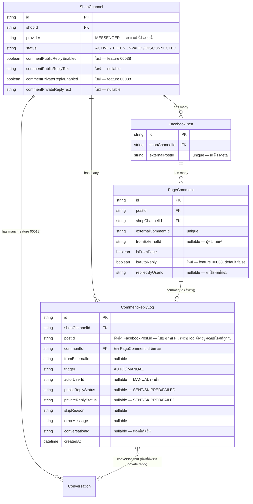

> **โมดูล:** 00038-CommentReply
> **ประเภทเอกสาร:** DATABASE Design
> **เวอร์ชัน:** 1.0
> **วันที่จัดทำ:** 2026-08-08
> **สถานะ:** Draft — รอ user review
> **เจ้าของเอกสาร:** SA

# DATABASE: ตอบกลับคอมเมนต์ (Comment Auto-Reply & Private Reply)

---

## 1. Overview

โครงสร้างข้อมูลของโมดูลนี้รองรับ TFR-003 (dispatch/gate), TFR-005/TFR-CR-002 (system actor),
TFR-006/TFR-CR-001 (private reply core), TFR-CR-003 (`isAutoReply` double-writer guard), และ
TFR-CR-004 (partial unique index) ใน [[SDS]] — เป็น**การเปลี่ยนแปลง additive ล้วน** ไม่มี `DROP`,
ไม่มี data migration ของแถวเดิม, ไม่มี backfill

- **เอกสารออกแบบต้นทาง:** [[SDS]] ของโมดูลนี้
- **Store ที่เกี่ยวข้อง:** PostgreSQL 16 (Supabase) — DB เดียวกับทั้งระบบ ผ่าน Prisma ORM
- **Engine / Charset:** PostgreSQL default (UTF-8) — ตรงกับ schema เดิมทั้งหมด

---

## 2. ERD

---

## 3. Tables

### 3.1 `ShopChannel` (PostgreSQL — Supabase) — ส่วนขยาย 4 คอลัมน์

ตารางเดิมจาก feature 00018 (`prisma/schema.prisma:1294`) — เพิ่มสวิตช์+ข้อความของ 2 โหมดตอบกลับ
คอมเมนต์ "ต่อเพจ" (BR-CR-01) ตั้งค่าอยู่กับแถวเพจโดยตรง ไม่มีตารางแยก มิเรอร์แพตเทิร์นเดียวกับที่
`AutoReplyRule.shopChannelId` (feature 00023) ใช้อยู่แล้วสำหรับ "เงื่อนไขระดับเพจ"

| Column | Type | Null | Default | Key |
|--------|------|------|---------|-----|
| `commentPublicReplyEnabled` | `boolean` | `NO` | `false` | `-` |
| `commentPublicReplyText` | `text` | `YES` | `NULL` | `-` |
| `commentPrivateReplyEnabled` | `boolean` | `NO` | `false` | `-` |
| `commentPrivateReplyText` | `text` | `YES` | `NULL` | `-` |

> 🛑 `ShopChannel` มี `accessTokenEnc` อยู่แถวเดียวกัน — ทุก query ที่ส่งค่าเหล่านี้ออกไปหา client
> ต้อง `select` ระบุคอลัมน์เสมอ ห้ามคืนทั้งแถว (ดู API.md §2)

### 3.2 `PageComment` (PostgreSQL — Supabase) — ส่วนขยาย 1 คอลัมน์

ตารางเดิมจาก feature 00029 (`prisma/schema.prisma:2790`)

| Column | Type | Null | Default | Key |
|--------|------|------|---------|-----|
| `isAutoReply` | `boolean` | `NO` | `false` | `-` |

> 🛑 **คอลัมน์นี้มีผู้เขียน 2 ราย** — เราเขียนตอน `replyToComment()` คืน comment id กลับมา (`create`
> block เท่านั้น) และ webhook เขียนอีกครั้งเมื่อ Meta ส่ง echo ของคอมเมนต์เดียวกันกลับเข้ามา
> **`ingestFeedComment`'s `update` block ห้ามใส่ `isAutoReply` เข้าไปเด็ดขาด** (ดู SDS TFR-CR-003)
> มิฉะนั้นธงจะถูกรีเซ็ตเป็น `false` เงียบ ๆ ทุกครั้งที่ Meta echo กลับมา

### 3.3 `CommentReplyLog` (PostgreSQL — Supabase) — ตารางใหม่

บันทึกทุกครั้งที่ระบบตัดสินใจเกี่ยวกับคอมเมนต์หนึ่งอัน **ทั้งที่ตอบและที่ข้าม** (มิเรอร์
`AutoReplyLog` ของ feature 00023) และทำหน้าที่กันซ้ำในตัวผ่าน partial unique index (ดู §4)

| Column | Type | Null | Default | Key |
|--------|------|------|---------|-----|
| `id` | `uuid` | `NO` | `gen_random_uuid()` | `PK` |
| `shopChannelId` | `uuid` | `NO` | `-` | `FK → ShopChannel.id` |
| `postId` | `uuid` | `NO` | `-` | `IDX` (อ้างอิง `FacebookPost.id` — ไม่ประกาศ FK จริงเพื่อให้ log อยู่รอดแม้โพสต์ถูกลบ) |
| `commentId` | `uuid` | `NO` | `-` | `FK → PageComment.id` — คอมเมนต์ต้นเหตุที่ทำให้เกิดการตัดสินใจนี้ |
| `fromExternalId` | `varchar` | `YES` | `NULL` | `-` — ผู้คอมเมนต์ (PSID); `NULL` = payload ไม่ส่ง `from` มา |
| `trigger` | `varchar` | `NO` | `-` | `-` — `"AUTO"` \| `"MANUAL"` |
| `actorUserId` | `uuid` | `YES` | `NULL` | `-` — `MANUAL` = คนที่กด; `AUTO` = `NULL` เสมอ |
| `publicReplyStatus` | `varchar` | `YES` | `NULL` | `-` — `"SENT"` \| `"SKIPPED"` \| `"FAILED"` |
| `privateReplyStatus` | `varchar` | `YES` | `NULL` | `-` — `"SENT"` \| `"SKIPPED"` \| `"FAILED"` |
| `skipReason` | `varchar` | `YES` | `NULL` | `-` — รหัสเหตุผลที่ข้าม (ดู §3.4) |
| `errorMessage` | `text` | `YES` | `NULL` | `-` — ข้อความ error ดิบจาก Graph เมื่อ `FAILED` |
| `conversationId` | `uuid` | `YES` | `NULL` | `-` — ห้องที่เกิดจาก private reply (ถ้าสำเร็จ) |
| `createdAt` | `timestamptz` | `NO` | `now()` | `-` |

**FK behavior:** `shopChannelId` → `onDelete: Cascade` (log เป็นของเพจนั้นโดยตรง — ถอดเพจแล้วประวัติ
ก็ไม่มีความหมาย มิเรอร์ `PageComment`/`FacebookPost` ที่ cascade ตาม `ShopChannel` อยู่แล้ว);
`commentId` → `onDelete: Cascade` (คอมเมนต์เป็น "ต้นเหตุ" ของ log แถวนี้ — ลบคอมเมนต์ (soft-delete
จริง ๆ ผ่าน `isDeleted`) ไม่ทำให้ log หาย เพราะ `PageComment` ไม่เคย hard-delete ในระบบนี้ตาม BR-CMT-04)

### 3.4 ค่าที่เป็นไปได้ของ `skipReason`

| ค่า | ความหมาย | trace |
|-----|---------|------|
| `FROM_PAGE` | คอมเมนต์ของเพจเอง (รวมคำตอบของบอทเอง) | BR-CR-A1 |
| `NOT_TOP_LEVEL` | เป็น reply ซ้อน ไม่ใช่คอมเมนต์ระดับบน | BR-CR-A1 |
| `COMMENT_DELETED` | คอมเมนต์ถูกลบแล้ว | FR-CR-05 ข้อ 3 |
| `NO_SENDER_ID` | ไม่มี `fromExternalId` — กันซ้ำไม่ได้ | FR-CR-05 ข้อ 4 |
| `CHANNEL_INACTIVE` | เพจไม่ได้เชื่อมต่ออยู่ (`status != 'ACTIVE'`) | FR-CR-05 ข้อ 5, BR-CR §4.3 |
| `DISABLED` | ปิดทั้ง 2 สวิตช์ หรือเปิดแต่ข้อความว่าง | FR-CR-05 ข้อ 6 |
| `ALREADY_HANDLED` | เคยตอบอัตโนมัติคนนี้บนโพสต์นี้แล้ว | BR-CR-A2 |
| `HUMAN_ANSWERED` | มีคนในทีมตอบคอมเมนต์นี้ไปแล้ว | BR-CR-A3 |
| `WINDOW_EXPIRED` | เกิน 7 วันจากเวลาคอมเมนต์ — เฉพาะช่อง `privateReplyStatus` | BR-CR-11 |

---

## 4. Indexes

| Table | Columns | Type | Rationale (query pattern ที่รองรับ) |
|-------|---------|------|--------------------------------------|
| `CommentReplyLog` | `(shopChannelId, createdAt)` | `BTREE` | หน้าประวัติ — เรียงตามเวลาล่าสุดของเพจหนึ่ง (`GET /api/shops/comment-reply/logs`) |
| `CommentReplyLog` | `(commentId)` | `BTREE` | ตรวจสถานะปุ่ม "ทักแชท" ของคอมเมนต์เดียว (ดู API.md §4.3) |
| `CommentReplyLog` | `(shopChannelId, postId, fromExternalId)` **WHERE `trigger='AUTO'`** | `UNIQUE (partial)` | กันซ้ำโหมดอัตโนมัติ — "1 ครั้ง/คน/โพสต์" (D-3, กฎของ Deep) |
| `CommentReplyLog` | `(commentId)` **WHERE `trigger='MANUAL'`** | `UNIQUE (partial)` | กันซ้ำโหมดแมนนวล — "1 ครั้ง/คอมเมนต์" (เพดานจริงของ Meta) |

**ทำไมต้องแยก 2 partial unique index แทน composite unique ธรรมดา 1 ตัว:**

| ระดับ | ขอบเขต | เหตุผลที่ต้องแยก |
|---|---|---|
| **AUTO** | 1 ครั้ง / คน / โพสต์ | กฎของ Deep เอง (D-3) — กันบอทดูเป็นสแปมเมื่อคนคอมเมนต์ซ้ำหลายครั้ง |
| **MANUAL** | 1 ครั้ง / **คอมเมนต์** | เพดานจริงของ Facebook — ถ้าเอากฎ AUTO ไปครอบ MANUAL ด้วย คนที่คอมเมนต์ 2 ครั้งบนโพสต์เดียวกันจะถูกร้านทักด้วยมือได้แค่ครั้งเดียว ทั้งที่ Meta อนุญาต 2 ครั้ง — เอากฎกันสแปมของบอทไปมัดมือคนโดยไม่ตั้งใจ |

> **ข้อควรระวังของ unique ฝั่ง AUTO:** `fromExternalId` เป็น nullable และ PostgreSQL ถือว่า
> `NULL <> NULL` — แถวที่ไม่มี `fromExternalId` จะลอด unique index นี้ได้ทุกครั้ง (ไม่ชนกันเอง) ต้อง
> **ข้ามคอมเมนต์ที่ไม่มี `fromExternalId` ตั้งแต่ด่านแรก** (`skipReason='NO_SENDER_ID'`, gate ข้อ 4 ใน
> SRS TFR-003) ห้ามพึ่ง constraint กับแถวกลุ่มนี้เพียงอย่างเดียว

> Prisma DSL ประกาศ partial unique index ไม่ได้ — ต้องเขียนเป็น SQL มือในไฟล์ migration รูปแบบ
> เดียวกับ `prisma/migrations/20260722000200_shopchannel_active_partial_unique/migration.sql`
> (มีตัวอย่างจริงในรีโปให้ลอกโครงสร้างคำสั่ง `CREATE UNIQUE INDEX ... WHERE ...`)

---

## 5. Migration Plan

### 5.1 ลำดับการ Migrate

| ลำดับ | การเปลี่ยนแปลง | Submodule / Store | หมายเหตุ (dependency) |
|-------|----------------|--------------------|------------------------|
| 1 | `ALTER TABLE "ShopChannel" ADD COLUMN` × 4 (`commentPublicReplyEnabled`, `commentPublicReplyText`, `commentPrivateReplyEnabled`, `commentPrivateReplyText`) | Next.js app → PostgreSQL (Supabase) | ไม่มี dependency — additive, มี default ครบ |
| 2 | `ALTER TABLE "PageComment" ADD COLUMN "isAutoReply" boolean NOT NULL DEFAULT false` | เดียวกัน | ไม่มี dependency |
| 3 | `CREATE TABLE "CommentReplyLog"` (คอลัมน์ครบตาม §3.3) + FK ไป `ShopChannel`/`PageComment` | เดียวกัน | ต้องมาหลังลำดับ 1-2 (ไม่บังคับเชิงเทคนิค แต่จัดกลุ่มให้ migration เดียวอ่านง่าย) |
| 4 | `CREATE INDEX` ปกติ 2 ตัว (`shopChannelId, createdAt` และ `commentId`) | เดียวกัน | ต้องมาหลังลำดับ 3 |
| 5 | `CREATE UNIQUE INDEX ... WHERE trigger='AUTO'` (SQL มือ) | เดียวกัน | ต้องมาหลังลำดับ 3 |
| 6 | `CREATE UNIQUE INDEX ... WHERE trigger='MANUAL'` (SQL มือ) | เดียวกัน | ต้องมาหลังลำดับ 3 |

> ทั้ง 6 ลำดับรวมอยู่ใน migration ไฟล์เดียวกันได้ (ไม่มีเหตุผลต้องแยกหลายไฟล์ — ไม่มีการ backfill
> ข้อมูลระหว่างขั้นตอนที่ต้องรอ) ตั้งชื่อ migration ตาม convention เดิม เช่น
> `<timestamp>_comment_reply_config_and_log`

### 5.2 Rollback

- ลำดับ 1-2 (`ADD COLUMN`): rollback ด้วย `ALTER TABLE ... DROP COLUMN` — ปลอดภัยเสมอเพราะไม่มีข้อมูล
  ที่พึ่งคอลัมน์เหล่านี้จากภายนอก migration นี้
- ลำดับ 3-6 (`CommentReplyLog` + index): rollback ด้วย `DROP TABLE "CommentReplyLog"` (จะพา index
  ทั้งหมดหายไปด้วยอัตโนมัติ) — **ข้อจำกัด:** ถ้า rollback หลังฟีเจอร์ถูกใช้งานจริงแล้ว ประวัติการ
  ตอบ/ข้ามทั้งหมดจะหายถาวร (ไม่มีตารางอื่นอ้างอิงกลับมาที่ `CommentReplyLog` จึงไม่มีผลกระทบ FK
  ต่อตารางอื่น) ต้องมีแผนสำรองข้อมูล (`pg_dump` เฉพาะตาราง) ก่อน rollback ถ้าต้องการเก็บประวัติไว้
- **ไม่มี data migration ที่ rollback ไม่ได้** — ทุกคอลัมน์ใหม่มี default ที่ถูกต้องสำหรับแถวเดิมทันที
  (`isAutoReply=false` ถูกต้องสำหรับคอมเมนต์เก่าทั้งหมดที่มีอยู่ก่อนงานนี้ เพราะ auto-reply ยังไม่เคย
  ทำงานมาก่อน)

### 5.3 ผลกระทบ (Impact)

- **Downtime:** ไม่มี — `ADD COLUMN` ที่มี default คงที่และ `CREATE TABLE`/`CREATE INDEX` (ไม่ใช่
  `CREATE INDEX CONCURRENTLY` เพราะตารางใหม่ยังไม่มีข้อมูล ไม่มี lock contention ที่มีนัยสำคัญ) บน
  PostgreSQL 16 เป็นการ์ดที่ปลอดภัยสำหรับตารางขนาดปัจจุบันของระบบ (`ShopChannel`/`PageComment` ไม่ใช่
  ตารางขนาดล้านแถว)
- **Backward compatibility:** service ที่มีอยู่ก่อน (`page-comment.service.ts` เดิม) อ่าน/เขียน
  `ShopChannel`/`PageComment` โดยไม่รู้จักคอลัมน์ใหม่ — เพราะทุก query ที่มีอยู่แล้วใช้ `select`
  ระบุคอลัมน์ (ไม่ใช้ `SELECT *`) จึงไม่ได้รับผลกระทบจากคอลัมน์ที่เพิ่มเข้ามา
- **Consistency ข้าม store:** ไม่มี — DB เดียว (PostgreSQL/Supabase) ไม่มีการซ้ำข้อมูลข้าม store

---

## 6. Retention / ข้อควรระวัง

- **Data Retention:** ไม่มี job ลบ/archive — `CommentReplyLog` เก็บถาวรเป็นหลักฐานประวัติ (มิเรอร์
  `AutoReplyLog` ของ feature 00023 ที่ไม่มี retention policy เช่นกัน) ตารางนี้โตตามปริมาณคอมเมนต์ที่
  เข้ามา ไม่ใช่ตามปริมาณ order/user — ถ้าร้านที่ยิงโฆษณาหนักมีคอมเมนต์หลักร้อยต่อโพสต์ ตารางนี้จะโต
  เร็วกว่า `AutoReplyLog` พอสมควร แต่ยังอยู่ในระดับที่ index ปกติ (`(shopChannelId, createdAt)`)
  รองรับได้โดยไม่ต้อง partition ในเฟสนี้
- **PII / ข้อมูลอ่อนไหว:** `fromExternalId` (PSID) เป็นตัวระบุที่ผูกกับเพจเดียว — ไม่ใช่ PII ที่ระบุ
  ตัวตนข้ามแพลตฟอร์มได้ (มิเรอร์ระดับความอ่อนไหวเดียวกับ `ExternalContact.externalUserId` ที่มีอยู่
  แล้ว) `errorMessage` เป็นข้อความ error ดิบจาก Graph — ต้องไม่มี token/secret หลุดเข้าไป (ตรวจตอน
  implement: log เฉพาะ error message ของ Meta ไม่ log request body ที่มี token)
- **Performance:** query กันซ้ำ (gate ข้อ 7 ใน SRS TFR-003) เป็น point lookup บน partial unique
  index — เร็วโดยธรรมชาติ ไม่ต้องกังวล hot row เพราะแต่ละคอมเมนต์เขียน log แถวเดียวจบ ไม่มีการ
  update ซ้ำ ๆ บนแถวเดิม (ยกเว้นอัปเดตสถานะจาก `SKIPPED`/`pending` เป็น `SENT`/`FAILED` ครั้งเดียว
  หลังยิง Graph เสร็จ)
- **Consistency ข้าม store:** ไม่มี (DB เดียว)

---

## 7. Traceability

| Table / Collection | SDS Component / Decision | สถานะ |
|--------------------|--------------------------|-------|
| `ShopChannel` (ส่วนขยาย) | Component `api/shops/comment-reply/config` (SDS §3) | Draft |
| `PageComment` (ส่วนขยาย) | TFR-CR-003 (SDS §6) | Draft |
| `CommentReplyLog` | TFR-CR-004 (SDS §6), Flow 4.1 (SDS §4) | Draft |

---

## 8. สรุป (Summary)

เอกสาร DATABASE นี้กำหนด **โครงสร้างข้อมูล** ของ **ตอบกลับคอมเมนต์ (Comment Auto-Reply & Private
Reply)** ให้ DEV นำไปเขียน migration จริงตาม convention เดิมของโปรเจกต์ (Prisma schema + SQL มือ
สำหรับ partial unique index), QA ใช้เข้าใจ data model เพื่อวางแผนทดสอบการกันซ้ำ และทุกตาราง trace
กลับ [[SDS]] ได้

**Open Questions:**
- ไม่มี — schema นี้ additive ล้วนและไม่มีการตัดสินใจที่ค้างรอ user
