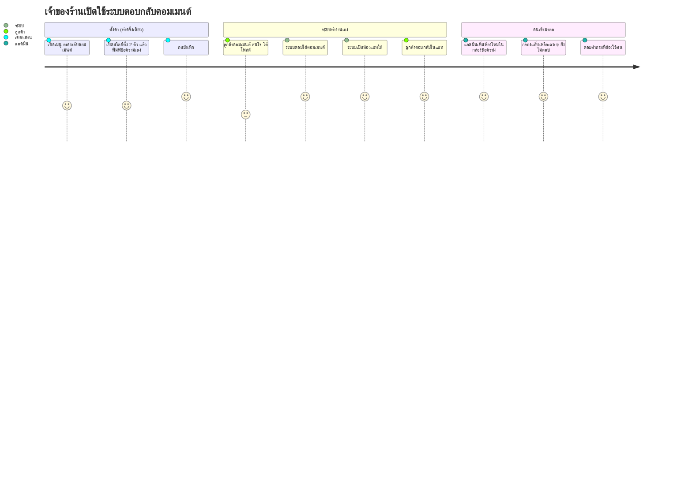

> **โมดูล:** 00038-CommentReply
> **ประเภทเอกสาร:** Product Requirements Document (PRD)
> **เวอร์ชัน:** 1.0
> **วันที่จัดทำ:** 2026-08-08
> **สถานะ:** Draft — รอ user review
> **เจ้าของเอกสาร:** BA + PO + PM

# PRD: ตอบกลับคอมเมนต์ (Comment Auto-Reply & Private Reply)

---

## Executive Summary

ร้านที่ยิงโฆษณาบน Facebook มีคอมเมนต์เข้าหลักร้อยต่อโพสต์ (โพสต์จริงบน prod ของร้าน BT Premium:
365 คอมเมนต์ต่อโพสต์เดียว) แต่คนที่คอมเมนต์ส่วนใหญ่ไม่ได้กดเข้าแชทเอง ร้านจึงต้องไล่เปิดทีละคน
แล้วกด "ทักแชท" ด้วยมือ ภายในเวลา 7 วันก่อนที่ Facebook จะตัดสิทธิ์ทักส่วนตัว — เป็นงานซ้ำ ๆ
ที่ทำไม่ทันและลืมง่าย ทุกคอมเมนต์ที่หลุดเวลาไปคือลูกค้าที่แสดงความสนใจแล้วแต่ไม่มีใครติดต่อกลับ

ระบบปัจจุบัน (feature 00029) ทำให้ร้าน **เห็น** คอมเมนต์และตอบใต้คอมเมนต์ด้วยมือได้แล้ว แต่ปุ่ม
"ทักแชท" ยังเป็นเพียงป้ายนับถอยหลัง ไม่ใช่ปุ่มที่กดได้จริง

ฟีเจอร์นี้ปิดช่องว่างสองด้านพร้อมกัน: **(1)** ทำให้ร้านกด "ทักแชท" จากหน้าคอมเมนต์ได้จริงด้วยตัวเอง
และ **(2)** ให้ตั้งค่าต่อเพจได้ว่าเมื่อมีคอมเมนต์ใหม่เข้ามา ระบบจะตอบใต้คอมเมนต์นั้นและ/หรือเปิด
ห้องแชทส่วนตัวให้โดยอัตโนมัติ ผลลัพธ์ทางธุรกิจคือ **จำนวนห้องแชทที่เกิดจากคอมเมนต์เพิ่มขึ้น**
โดยที่ร้านไม่ต้องเพิ่มคนเฝ้าหน้าจอ

ขอบเขตรอบแรกคือ **Facebook Page เท่านั้น** — Instagram ต้องขอสิทธิ์เพิ่มจาก Meta และต้องให้ทุกร้าน
กดเชื่อมบัญชีใหม่ จึงแยกเป็นเฟส 2

---

## 1. Business Goals & KPIs

### 1.1 เป้าหมายทางธุรกิจ

| เป้าหมาย | รายละเอียด |
|----------|-----------|
| **เปลี่ยนคอมเมนต์ให้เป็นบทสนทนา** | คนที่คอมเมนต์คือคนที่แสดงความสนใจแล้ว แต่หยุดอยู่แค่หน้าโพสต์ — เป้าหมายคือพาเขาเข้าห้องแชทที่ปิดการขายได้จริง |
| **ลดงานซ้ำของแอดมินร้าน** | งานกด "ทักแชท" ทีละคนเป็นงานที่ไม่ต้องใช้วิจารณญาณ ควรเป็นงานของระบบ ให้คนไปโฟกัสกับคำถามที่ต้องตอบจริง |
| **ไม่ปล่อยให้สิทธิ์ 7 วันหมดไปเปล่า ๆ** | Facebook ให้ทักส่วนตัวได้ครั้งเดียวภายใน 7 วัน เกินแล้วปิดถาวร — ทุกคอมเมนต์ที่หลุดเวลาคือโอกาสที่หายไปโดยกู้คืนไม่ได้ |
| **ปิดหนี้ที่ค้างจาก 00029** | ปุ่ม "ทักแชท" ถูกวางไว้บนหน้าจอตั้งแต่ 2026-08-03 แต่กดไม่ได้ — ผู้ใช้เห็นปุ่มที่ใช้ไม่ได้มาตลอด |

### 1.2 ตัวชี้วัดความสำเร็จ (KPIs)

| KPI | คำอธิบาย | เป้าหมาย |
|-----|----------|---------|
| **อัตราแปลงคอมเมนต์เป็นห้องแชท** | (คอมเมนต์ระดับบนที่เกิดห้องแชท ÷ คอมเมนต์ระดับบนทั้งหมดในช่วงเวลา) × 100 | ≥ 40% ในเพจที่เปิดสวิตช์ทักแชท |
| **สิทธิ์ 7 วันที่หมดไปโดยไม่ได้ใช้** | จำนวนคอมเมนต์ระดับบนที่เลย 7 วันโดยไม่มี private reply | ลดลง ≥ 70% เทียบกับก่อนเปิดใช้ |
| **เวลาตั้งแต่คอมเมนต์ถึงข้อความแรก** | มัธยฐานของ `เวลาที่ส่ง private reply − createdTime ของคอมเมนต์` | ≤ 2 นาที (โหมดอัตโนมัติ) |
| **อัตราตอบกลับของลูกค้า** | ห้องที่ลูกค้าตอบกลับ ÷ ห้องที่เกิดจาก private reply | ≥ 25% — ตัวนี้คือตัวชี้ว่าข้อความที่ร้านตั้งไว้ "ดีพอ" หรือไม่ (ถ้าต่ำมาก แปลว่าข้อความดูเป็นสแปม) |
| **การใช้งานปุ่มแมนนวล** | จำนวนร้านที่กดปุ่ม "ทักแชท" เองอย่างน้อย 1 ครั้งใน 30 วัน | ≥ 60% ของร้านที่เชื่อมเพจ Facebook |

> **หมายเหตุเรื่องการวัด:** ทุก KPI คำนวณได้จาก `CommentReplyLog` + `PageComment` ที่มีอยู่แล้ว
> ไม่ต้องต่อเครื่องมือวิเคราะห์ภายนอก

---

## 2. User Personas (กลุ่มผู้ใช้งาน)

### 2.1 เจ้าของร้านที่ยิงโฆษณา (Primary)

**ข้อมูลพื้นฐาน:**
- เจ้าของร้านเล็ก–กลาง ดูแลเพจเอง หรือมีแอดมิน 1–2 คน
- ยิงโฆษณาโพสต์ขายสินค้า มีคอมเมนต์เข้าวันละหลักสิบถึงหลักร้อย
- ทำงานจากมือถือเป็นหลัก เปิดคอมเป็นบางช่วง

**เป้าหมาย:**
- อยากให้คนที่คอมเมนต์ทุกคนได้รับการติดต่อกลับ ไม่ตกหล่น
- อยากรู้ว่ามีคอมเมนต์ไหนที่ต้องเข้าไปตอบเองจริง ๆ

**ความต้องการ:**
- ตั้งค่าครั้งเดียวแล้วระบบทำงานต่อเอง โดยตั้งแยกได้ต่อเพจ (บางเพจขายของ บางเพจให้บริการ)
- เขียนข้อความเองได้ ไม่ใช่ข้อความสำเร็จรูปของระบบ

**จุดปวด (Pain Points):**
- ไล่กดทักแชททีละคนไม่ทัน คอมเมนต์ค้างเป็นร้อย
- ไม่รู้ว่าคอมเมนต์ไหนใกล้หมดเวลา 7 วัน
- คอมเมนต์ที่เป็นคำถามจริงจมอยู่ปนกับคอมเมนต์ "สนใจ" / "ราคา" ที่ตอบเหมือนกันหมด

### 2.2 แอดมิน/พนักงานร้าน (Secondary)

**ข้อมูลพื้นฐาน:**
- คนที่นั่งเฝ้ากล่องข้อความและคอมเมนต์เป็นงานประจำ
- เป็นสมาชิกร้านที่ได้รับเชิญ (`ShopMember`) ไม่ใช่เจ้าของ

**เป้าหมาย:**
- เคลียร์คิวคอมเมนต์ให้หมดในแต่ละกะ

**ความต้องการ:**
- ตัวกรองที่แยกได้ว่า "อันไหนบอทจัดการไปแล้ว" กับ "อันไหนรอฉันอยู่"
- ปุ่มทักแชทที่กดได้จากหน้าคอมเมนต์โดยตรง ไม่ต้องสลับไปแอป Facebook

**จุดปวด (Pain Points):**
- ถ้าบอทตอบทุกอันแล้วนับเป็น "ตอบแล้ว" ทั้งหมด จะหาคำถามที่ต้องตอบเองไม่เจอ
- ตอบซ้ำกับที่บอทตอบไปแล้ว ทำให้ลูกค้าสับสน

### 2.3 ผู้ที่คอมเมนต์ (ลูกค้าปลายทาง)

**ข้อมูลพื้นฐาน:**
- คนทั่วไปที่เห็นโฆษณาแล้วคอมเมนต์ถามใต้โพสต์
- ส่วนใหญ่ไม่กดเข้าแชทเอง เพราะรู้สึกว่าเป็นขั้นตอนเพิ่ม

**เป้าหมาย:**
- ได้คำตอบว่าของมีไหม ราคาเท่าไหร่ ใส่รุ่นตัวเองได้หรือเปล่า

**ความต้องการ:**
- ได้รับการตอบกลับเร็ว ในช่องทางที่คุยต่อได้สะดวก

**จุดปวด (Pain Points):**
- คอมเมนต์แล้วเงียบ ไม่มีใครตอบ
- ได้รับข้อความที่เห็นชัดว่าเป็นข้อความอัตโนมัติแบบขายของ จนไม่อยากคุยต่อ

---

## 3. Business Requirements

> รหัส `BR-CR-xx` = Business Requirement ของโมดูล 00038

### 3.1 การตั้งค่าต่อเพจ

| รหัส | ความต้องการ | ความสำคัญ |
|---|---|---|
| **BR-CR-01** | ร้านตั้งค่าการตอบกลับคอมเมนต์ได้**แยกเป็นรายเพจ** ไม่ใช่ค่าเดียวทั้งร้าน | Must |
| **BR-CR-02** | มี 2 สวิตช์ที่เปิด/ปิดแยกกัน — **ตอบใต้คอมเมนต์** และ **ทักแชทส่วนตัว** | Must |
| **BR-CR-03** | แต่ละสวิตช์มีช่องข้อความของตัวเอง ร้านพิมพ์เอง ไม่ใช่ข้อความสำเร็จรูปของระบบ | Must |
| **BR-CR-04** | ค่าตั้งต้นของทั้ง 2 สวิตช์คือ **ปิด** — ร้านต้องตั้งใจเปิดเอง | Must |
| **BR-CR-05** | เปิดสวิตช์โดยไม่มีข้อความไม่ได้ — ระบบต้องกันไว้ตั้งแต่หน้าจอ | Must |
| **BR-CR-06** | เพจที่โทเคนหมดอายุ (`TOKEN_INVALID`) ต้องขึ้นเตือนให้เชื่อมใหม่ และหยุดทำงานอัตโนมัติของเพจนั้น | Must |
| **BR-CR-07** | สิทธิ์เข้าถึงหน้าตั้งค่า = เจ้าของร้าน และสมาชิกที่มีสิทธิ์เข้าถึงร้าน (ระดับเดียวกับหน้าตอบกลับอัตโนมัติเดิม) | Must |

### 3.2 การทำงานอัตโนมัติ

| รหัส | ความต้องการ | ความสำคัญ |
|---|---|---|
| **BR-CR-08** | ระบบตอบเฉพาะ **คอมเมนต์ระดับบนของลูกค้า** — ไม่ตอบ reply ซ้อน และไม่ตอบคอมเมนต์ของเพจเอง | Must |
| **BR-CR-09** | ~~คนหนึ่งคนได้รับการตอบอัตโนมัติ **ครั้งเดียวต่อโพสต์** ต่อให้คอมเมนต์ซ้ำกี่ครั้งก็ตาม~~ **แก้ 2026-08-15 →** เพดานนี้แยกตามช่องทาง: **ตอบใต้คอมเมนต์ = ทุกคอมเมนต์** (ลูกค้าถามใหม่ต้องได้คำตอบใหม่ — Facebook ไม่ได้จำกัดการตอบสาธารณะ) · **ทักแชท = ครั้งเดียวต่อคนต่อโพสต์** (คงเดิม) | Must |
| **BR-CR-10** | ถ้ามีคนในทีมร้านตอบคอมเมนต์นั้นไปแล้ว ระบบต้องไม่ตอบทับ | Must |
| **BR-CR-11** | ระบบทักแชทส่วนตัวได้เฉพาะคอมเมนต์ที่ยังอยู่ในหน้าต่าง 7 วันของ Facebook | Must |
| **BR-CR-12** | คอมเมนต์เก่าที่ดึงย้อนหลังเข้าระบบ (backfill) ต้อง**ไม่**ถูกตอบอัตโนมัติ — ตอบเฉพาะที่เข้ามาสด | Must |
| **BR-CR-13** | ระบบบันทึกทุกครั้งทั้งที่ตอบและที่ข้าม พร้อมเหตุผล ให้ร้านย้อนดูได้ | Must |
| **BR-CR-14** | เมื่อส่งไม่สำเร็จ ระบบ**ไม่ลองซ้ำอัตโนมัติ** แต่บันทึกเหตุผลไว้ให้ร้านตัดสินใจเอง | Must |
| **BR-CR-15** | ร้านพิมพ์ `{ชื่อ}` ลงในข้อความตั้งค่าได้ ระบบแทนด้วยชื่อ Facebook ของคนที่คอมเมนต์ตอนส่งจริง — **เป็นชื่อตัวหนังสือ ไม่ใช่การแท็ก** (@mention ต้องขอสิทธิ์เพิ่มจาก Meta ซึ่งยังไม่มี) · คอมเมนต์ที่อ่านชื่อไม่ได้ ต้องตัดคำนี้ทิ้งอัตโนมัติ ห้ามให้ลูกค้าเห็น `{ชื่อ}` โผล่ในคอมเมนต์สาธารณะ | Must |

### 3.3 การทักแชทด้วยมือ

| รหัส | ความต้องการ | ความสำคัญ |
|---|---|---|
| **BR-CR-15** | ปุ่ม "ทักแชท" ในแท็บความคิดเห็นต้องกดได้จริง และใช้ได้**แม้ร้านปิดสวิตช์อัตโนมัติทั้งหมด** | Must |
| **BR-CR-16** | กดปุ่มแล้วต้องเปิดกล่องให้อ่านทวน/แก้ข้อความก่อนส่ง ไม่ส่งทันที | Must |
| **BR-CR-17** | กล่องเติมข้อความที่เพจตั้งไว้ให้อัตโนมัติ (ถ้ามี) เพื่อไม่ต้องพิมพ์ใหม่ทุกครั้ง | Should |
| **BR-CR-18** | ปุ่มต้องบอกสถานะได้ 4 แบบ: ทักได้ (พร้อมเวลาที่เหลือ) / กำลังส่ง / ทักแล้ว / หมดเวลา | Must |
| **BR-CR-19** | คนหนึ่งคนที่คอมเมนต์หลายครั้งบนโพสต์เดียว ร้านทักด้วยมือได้**ทุกคอมเมนต์** (เพดานของ Facebook คือครั้งเดียวต่อ *คอมเมนต์* ไม่ใช่ต่อคน) | Must |

### 3.4 การมองเห็นและการคัดกรอง

| รหัส | ความต้องการ | ความสำคัญ |
|---|---|---|
| **BR-CR-20** | คอมเมนต์มี 3 สถานะที่แยกกันได้: **ยังไม่ตอบ / บอทตอบแล้ว / คนตอบแล้ว** | Must |
| **BR-CR-21** | ตัวเลขแจ้งเตือนบนแท็บ "ความคิดเห็น" นับเฉพาะ **ยังไม่ตอบ** — คำตอบของบอทต้องไม่ทำให้ตัวเลขนี้กลายเป็น 0 | Must |
| **BR-CR-22** | คำตอบที่บอทเขียนต้องมีป้ายกำกับให้เห็นชัดว่าเป็นคำตอบอัตโนมัติ | Must |
| **BR-CR-23** | ห้องแชทที่เกิดจากการทักส่วนตัวต้องไปโผล่ในกล่องข้อความปกติ และต้องไม่ถูกนับเป็น "ยังไม่อ่าน" เพราะฝั่งร้านเป็นคนเริ่ม | Must |

---

## 4. Business Rules & Constraints

### 4.1 กฎทางธุรกิจหลัก

| รหัส | กฎ |
|---|---|
| **BR-CR-R1** | ระบบตอบด้วย **ข้อความคงที่ต่อเพจ** — ไม่วิเคราะห์เนื้อหาคอมเมนต์ ไม่จับคู่กลุ่มคำ ไม่ใช้ AI ในเฟสนี้ |
| **BR-CR-R2** | "1 ครั้งต่อคนต่อโพสต์" เป็นกฎของ Deep เพื่อกันไม่ให้เพจของร้านดูเป็นสแปม — ใช้กับ**โหมดอัตโนมัติเท่านั้น** |
| **BR-CR-R3** | "1 ครั้งต่อคอมเมนต์" เป็นเพดานของ Facebook — ใช้กับทั้งโหมดอัตโนมัติและการกดเอง และแก้ไม่ได้ |
| **BR-CR-R4** | เมื่อเปิดทั้ง 2 สวิตช์ ลำดับคือ **ตอบใต้คอมเมนต์ก่อน แล้วจึงทักแชท** — ถ้าตอบใต้คอมเมนต์ล้มเหลว ยังทักแชทต่อได้ (ไม่ผูกกันแบบ all-or-nothing) |
| **BR-CR-R5** | คำตอบของบอทที่ Facebook ส่งกลับเข้าระบบ ต้องไม่ถูกนับเป็นคอมเมนต์ใหม่ที่ต้องตอบอีก |

### 4.2 ข้อจำกัดทางธุรกิจ

| ข้อจำกัด | รายละเอียด |
|---|---|
| **Facebook เท่านั้นในเฟสนี้** | Instagram ต้องขอสิทธิ์ `instagram_manage_comments` เพิ่ม ซึ่งแปลว่าร้านที่เชื่อม IG ไว้แล้ว**ทุกร้านต้องกดเชื่อมใหม่** และอาจต้องผ่าน App Review ของ Meta ก่อน |
| **ทักได้ครั้งเดียว ย้อนไม่ได้** | ส่งพลาดคือเสียสิทธิ์ของคอมเมนต์นั้นถาวร ไม่มีทางแก้ ไม่มีทางส่งใหม่ |
| **ทักแล้วยังคุยต่อไม่ได้** | หน้าต่างสนทนา 24 ชั่วโมงจะเปิดก็ต่อเมื่อลูกค้าตอบกลับเท่านั้น — ระบบส่งข้อความตามหลังไม่ได้ |
| **นโยบายของ Meta** | ข้อความที่ดูเป็นสแปมหรือถูกผู้ใช้รายงาน อาจทำให้เพจถูกลดการมองเห็นหรือถูกจำกัดสิทธิ์ส่งข้อความ ความรับผิดชอบต่อเนื้อหาเป็นของร้าน |

### 4.3 เหตุผลที่ระบบข้ามไม่ตอบ

ร้านต้องเห็นเหตุผลเหล่านี้ในประวัติ ไม่ใช่แค่เห็นว่า "ไม่ได้ตอบ":

| เหตุผล | ความหมายสำหรับร้าน |
|---|---|
| คอมเมนต์ของเพจเอง | ไม่ใช่ลูกค้า |
| ไม่ใช่คอมเมนต์ระดับบน | เป็นการตอบต่อในเธรดของคนอื่น |
| ลูกค้าลบคอมเมนต์แล้ว | ไม่มีอะไรให้ตอบ |
| ไม่ทราบตัวตนผู้คอมเมนต์ | Facebook ไม่ส่งข้อมูลผู้เขียนมา จึงกันซ้ำไม่ได้ |
| เพจไม่ได้เชื่อมต่ออยู่ | ต้องเชื่อมเพจใหม่ |
| ยังไม่ได้เปิดสวิตช์ | ตั้งค่าเพิ่ม |
| ตอบคนนี้ในโพสต์นี้ไปแล้ว | กฎกันสแปมของ Deep ทำงาน |
| คนในทีมตอบไปก่อนแล้ว | ระบบหลีกทางให้คน |
| เกิน 7 วันแล้ว | สิทธิ์ทักส่วนตัวหมด ตอบใต้คอมเมนต์ยังทำได้ |

---

## 5. Out of Scope (นอกขอบเขต)

| นอกขอบเขต | เหตุผล |
|---|---|
| **Instagram** | ต้องขอสิทธิ์เพิ่มจาก Meta + ให้ทุกร้านเชื่อมบัญชีใหม่ + อาจติด App Review — เป็นงานที่ขึ้นกับปัจจัยนอกทีม จึงแยกเฟส |
| **เลือกคำตอบตามเนื้อหาคอมเมนต์** (กลุ่มคำ / AI) | มติ D-2 เลือกข้อความคงที่ก่อนเพื่อให้ขึ้นได้เร็ว — โครงข้อมูลเผื่อไว้แล้วให้ต่อยอดได้โดยไม่ต้องรื้อ |
| **หน่วงเวลาก่อนตอบ** | เพิ่มทีหลังได้โดยไม่กระทบโครงสร้าง |
| **ตอบคอมเมนต์ใต้โฆษณา (Ad comments)** | เป็นคนละ object ของ Meta ต้องออกแบบแยก |
| **ตอบคอมเมนต์เป็นรูป/สติกเกอร์** | เฟสแรกเป็นข้อความล้วน |
| **ซ่อน/ลบคอมเมนต์อัตโนมัติ (moderation)** | คนละเรื่องกับการตอบ และมีความเสี่ยงต่อชื่อเสียงร้านสูงกว่ามาก |
| **ส่งข้อความตามหลังถ้าลูกค้าไม่ตอบ** | Facebook ไม่อนุญาต ไม่ใช่การตัดสินใจของเรา |

---

## 6. Risks & Mitigation (ความเสี่ยงและแนวทางแก้ไข)

### 6.1 ความเสี่ยงทางธุรกิจ

| ความเสี่ยง | ผลกระทบ | แนวทางรับมือ |
|---|---|---|
| ร้านตั้งข้อความที่ดูเป็นสแปม → เพจถูก Meta ลดการมองเห็น | สูง — กระทบยอดขายของร้านทั้งเพจ | ค่าตั้งต้นทั้ง 2 สวิตช์ = ปิด · หน้าตั้งค่าขึ้นคำเตือนว่าข้อความใต้คอมเมนต์เป็นสาธารณะ · KPI "อัตราตอบกลับของลูกค้า" ใช้เป็นสัญญาณเตือนว่าข้อความไม่เวิร์ก |
| คอมเมนต์ที่เป็นคำต่อว่าได้รับข้อความขายของ | กลาง — เสียภาพลักษณ์เฉพาะราย | ยอมรับในเฟสนี้ (ผลจากมติ D-2) · แนะนำในหน้าตั้งค่าให้เขียนข้อความที่เป็นกลาง ไม่ใช่ข้อความปิดการขาย · เฟสถัดไปต่อกลุ่มคำได้ |
| ลูกค้ารู้สึกว่าถูกรบกวนแล้วรายงานเพจ | กลาง | 1 ครั้ง/คน/โพสต์ กดปริมาณลงมาก · ไม่มีการส่งข้อความตามหลัง |
| ร้านเข้าใจผิดว่า "ทักแชทแล้ว = คุยต่อได้เลย" | ต่ำ–กลาง | หน้าตั้งค่าและกล่องส่งต้องเขียนชัดว่าคุยต่อได้เมื่อลูกค้าตอบกลับ |

### 6.2 ความเสี่ยงทางเทคนิค

| ความเสี่ยง | ผลกระทบ | แนวทางรับมือ |
|---|---|---|
| ตอบซ้ำหลายครั้งเพราะ Facebook ส่ง event ซ้ำ | สูง — ลูกค้าได้ข้อความรัว เพจดูเป็นสแปม | กันซ้ำที่ระดับฐานข้อมูล (unique key) ไม่ใช่ที่ตรรกะในโค้ด — หลักเดียวกับที่ใช้ได้ผลแล้วใน 00023 และ 00018 |
| ตัวเลข "ยังไม่ตอบ" กลายเป็น 0 ตลอดหลังเปิดบอท | สูง — ร้านหาคำถามที่ต้องตอบเองไม่เจอ | แยกสถานะที่ 3 "บอทตอบแล้ว" (BR-CR-20/21) เป็นส่วนหนึ่งของ Must ไม่ใช่ nice-to-have |
| ป้าย "บอทตอบ" หายไปเองเมื่อ Facebook ส่งข้อมูลเดิมกลับเข้ามา | กลาง — สถิติเพี้ยน ร้านสับสน | คอลัมน์นี้มีผู้เขียน 2 ราย ต้องกำหนดชัดว่าฝั่ง webhook ห้ามเขียนทับ (เคยเกิดกับรีแอ็กชันข้อความมาแล้ว 2026-08-04) |
| บอทตอบทับคำตอบของคนที่เพิ่งพิมพ์ไป | กลาง | มีด่านตรวจว่าคอมเมนต์นั้นมีคำตอบจากคนแล้วหรือยัง ก่อนยิงเสมอ |
| ยิงถี่จนชน rate limit ของ Facebook | ต่ำ–กลาง | 1 ครั้ง/คน/โพสต์ ลดปริมาณลงมาก · ไม่ลองซ้ำอัตโนมัติ · บันทึก error ไว้ให้เห็น |
| webhook ล้มแล้ว Facebook ส่งซ้ำทั้งชุด | สูง — กระทบข้อความเข้าของทั้งเพจ ไม่ใช่แค่ฟีเจอร์นี้ | งานตอบคอมเมนต์ต้องทำ**หลัง**ตอบรับ webhook แล้วเสมอ และห้ามทำให้ webhook ล้มไม่ว่ากรณีใด |

---

## 7. Glossary (อภิธานศัพท์)

| คำ | ความหมาย |
|---|---|
| **คอมเมนต์ระดับบน** | คอมเมนต์ที่เขียนใต้โพสต์โดยตรง ไม่ใช่การตอบต่อในเธรดของคอมเมนต์อื่น |
| **ตอบใต้คอมเมนต์ (public reply)** | คำตอบที่เพจเขียนใต้คอมเมนต์ — คนทั่วไปที่เข้ามาดูโพสต์เห็นได้ |
| **ทักแชทส่วนตัว (private reply)** | ข้อความส่วนตัวที่เพจส่งถึงคนที่คอมเมนต์ ทำให้เกิดห้องแชทใหม่ — เห็นเฉพาะคู่สนทนา |
| **หน้าต่าง 7 วัน** | ระยะเวลาที่ Facebook อนุญาตให้ทักส่วนตัวจากคอมเมนต์ นับจากเวลาที่คอมเมนต์ถูกเขียน |
| **หน้าต่าง 24 ชั่วโมง** | ระยะเวลาที่เพจส่งข้อความได้อิสระหลังลูกค้าตอบกลับล่าสุด |
| **เพจ** | Facebook Page ที่ร้านเชื่อมเข้ากับ Deep แล้ว (1 ร้านมีได้หลายเพจ) |
| **บอท** | ในเอกสารนี้หมายถึงการทำงานอัตโนมัติของฟีเจอร์นี้ ไม่ใช่ AI — เป็นการส่งข้อความคงที่ที่ร้านตั้งไว้ |
| **backfill** | การดึงคอมเมนต์เก่าที่เกิดก่อนหน้าเข้าระบบย้อนหลัง |

---

## 8. Success Metrics (ตัวชี้วัดความสำเร็จ)

**เกณฑ์ที่ถือว่าฟีเจอร์นี้สำเร็จ (วัดที่ 30 วันหลังเปิดใช้จริง):**

| ด้าน | ตัวชี้วัด | เกณฑ์ผ่าน |
|---|---|---|
| **การนำไปใช้** | ร้านที่เชื่อมเพจ Facebook และเปิดสวิตช์อย่างน้อย 1 ตัว | ≥ 50% |
| **ผลลัพธ์ทางธุรกิจ** | จำนวนห้องแชทที่เกิดจากคอมเมนต์ ต่อสัปดาห์ | เพิ่มขึ้น ≥ 3 เท่าเทียบกับก่อนเปิดใช้ |
| **คุณภาพของข้อความ** | อัตราที่ลูกค้าตอบกลับ private reply | ≥ 25% |
| **ความถูกต้อง** | จำนวนเคสที่ลูกค้าได้รับข้อความซ้ำจากระบบ | **0** — ข้อนี้ไม่มีเกณฑ์ผ่อนผัน |
| **ความน่าเชื่อถือของหน้าจอ** | จำนวนครั้งที่ร้านรายงานว่า "ตัวเลขยังไม่ตอบไม่ตรงกับที่เห็น" | 0 |
| **หนี้ที่ปิด** | ปุ่ม "ทักแชท" ใช้งานได้จริงบน prod | ปิด |

---

## 9. Dependencies & Assumptions

### 9.1 สิ่งที่ต้องพึ่งพา (Dependencies)

| สิ่งที่พึ่งพา | สถานะ |
|---|---|
| **feature 00029** — การรับคอมเมนต์เข้าระบบและหน้าแท็บความคิดเห็น | พร้อมใช้งานบน prod แล้ว |
| **feature 00018** — ระบบแชท Facebook (ห้อง/ผู้ติดต่อ/ข้อความ) | พร้อมใช้งานบน prod แล้ว — ห้องที่เกิดจากการทักต้องเข้าเส้นทางเดียวกับแชทปกติ |
| **สิทธิ์ `pages_messaging`** สำหรับส่งข้อความส่วนตัวจากคอมเมนต์ | **มีอยู่แล้วในสิทธิ์ที่ร้านให้ตอนเชื่อมเพจ — ไม่ต้องให้ร้านเชื่อมใหม่** |
| **สิทธิ์ `pages_manage_engagement`** สำหรับตอบใต้คอมเมนต์ | มีอยู่แล้ว (เพิ่มไปตั้งแต่ 00029) |
| **การอนุมัติแอปจาก Meta (App Review)** | ใบแรกยังรอผล — มีผลต่อเฟส IG ไม่ใช่เฟสนี้ |

### 9.2 สมมติฐาน (Assumptions)

| # | สมมติฐาน | ถ้าผิดจะเกิดอะไร |
|---|---|---|
| A-1 | ร้านยอมรับว่าคำตอบเดียวใช้กับทุกคอมเมนต์ได้ในเฟสแรก | ถ้าไม่ยอมรับ ต้องเลื่อนงานกลุ่มคำ/AI ขึ้นมาเร็วกว่าแผน |
| A-2 | คอมเมนต์ที่ไม่มีข้อความ (รูป/สติกเกอร์) ก็ควรได้รับการตอบ | ถ้าไม่ ต้องเพิ่มตัวเลือก "ตอบเฉพาะคอมเมนต์ที่มีข้อความ" |
| A-3 | ร้านส่วนใหญ่มีเพจเดียว จึงยอมรับการตั้งค่าทีละเพจได้ | ถ้าร้านมีหลายสิบเพจ ต้องมีปุ่ม "ใช้ค่านี้กับทุกเพจ" |
| A-4 | ไม่ต้องหน่วงเวลาก่อนตอบ — ตอบทันทีดูเป็นบริการที่ดี ไม่ได้ดูเป็นบอท | ถ้าลูกค้ารู้สึกว่าเร็วผิดปกติจนน่าสงสัย ต้องเพิ่มการหน่วง |
| A-5 | Facebook ยังคงส่งข้อมูลผู้เขียนคอมเมนต์ (`from`) มากับ webhook สด | ถ้าหยุดส่ง กฎกันซ้ำจะทำงานไม่ได้ ต้องข้ามคอมเมนต์กลุ่มนั้นทั้งหมด (มีด่านรองรับแล้ว) |

---

## 10. Appendix

### 10.1 ตัวอย่าง User Journey

**สถานการณ์:** ร้าน "ธนภัทร์ อะไหล่มอเตอร์ไซค์ สายซิ่ง" ยิงโฆษณาโพสต์โช๊คหลัง มีคอมเมนต์เข้า 365 อัน

**เส้นทางที่สอง — ร้านที่ไม่เปิดออโต้:**

1. แอดมินเปิดแท็บความคิดเห็น เห็นคอมเมนต์ "สวยๆครับ" พร้อมเวลาที่เหลือ 6 วัน 22 ชั่วโมง
2. กดปุ่ม "ทักแชท" → กล่องเปิดขึ้นพร้อมข้อความที่เพจตั้งไว้
3. แก้ข้อความให้เข้ากับคอมเมนต์นั้น แล้วกดส่ง
4. ป้ายเปลี่ยนเป็น "ทักแล้ว" พร้อมลิงก์เข้าห้องแชท

### 10.2 ตัวอย่างข้อความที่แนะนำ / ไม่แนะนำ

| | ตอบใต้คอมเมนต์ (สาธารณะ) | ทักแชทส่วนตัว |
|---|---|---|
| **แนะนำ** | "ขอบคุณที่สนใจครับ ทักแชทมาได้เลย เดี๋ยวแอดมินเช็กรุ่นให้ครับ" | "สวัสดีครับ พอดีเห็นคอมเมนต์ในโพสต์ รบกวนแจ้งรุ่นรถกับปีได้เลยครับ เดี๋ยวเช็กสต๊อกให้" |
| **ไม่แนะนำ** | ข้อความยาวที่มีราคาและโปรโมชันเต็มไปหมด — คนที่เข้ามาดูโพสต์จะเห็นซ้ำใต้ทุกคอมเมนต์ | ข้อความที่ขึ้นต้นด้วยการเสนอขายทันที โดยไม่อ้างถึงคอมเมนต์ที่เขาเขียน |
| **เหตุผล** | คำตอบสาธารณะที่เหมือนกันทุกอันหลายสิบครั้งใต้โพสต์เดียว ทำให้โพสต์ดูเป็นสแปม | ข้อความที่อ้างถึงบริบทที่เขาเพิ่งทำ (คอมเมนต์) ได้รับการตอบกลับมากกว่า |

### 10.3 ความแตกต่างจาก "ตอบกลับอัตโนมัติ" (00023)

| | ตอบกลับอัตโนมัติ (00023) | ตอบกลับคอมเมนต์ (00038) |
|---|---|---|
| ทำงานกับอะไร | ข้อความในห้องแชท | คอมเมนต์ใต้โพสต์ |
| เลือกคำตอบยังไง | จับคู่กลุ่มคำที่ร้านตั้ง | ข้อความคงที่ต่อเพจ |
| ตั้งค่าที่ระดับไหน | ระดับร้าน (มีเงื่อนไขรายเพจได้) | ระดับเพจ |
| ส่งออกทางไหน | ข้อความในห้องเดิม | คอมเมนต์สาธารณะ + ข้อความเปิดห้องใหม่ |
| ข้อจำกัดเวลา | หน้าต่าง 24 ชั่วโมง | หน้าต่าง 7 วัน และส่งได้ครั้งเดียว |

**สองระบบนี้ทำงานร่วมกันได้:** เมื่อ 00038 เปิดห้องแชทให้แล้ว ลูกค้าตอบกลับเข้ามา ข้อความนั้นจะ
เข้าสู่เส้นทางของ 00023 ตามปกติ — ถ้าร้านตั้งกลุ่มคำไว้ ก็จะได้รับคำตอบต่อทันที
