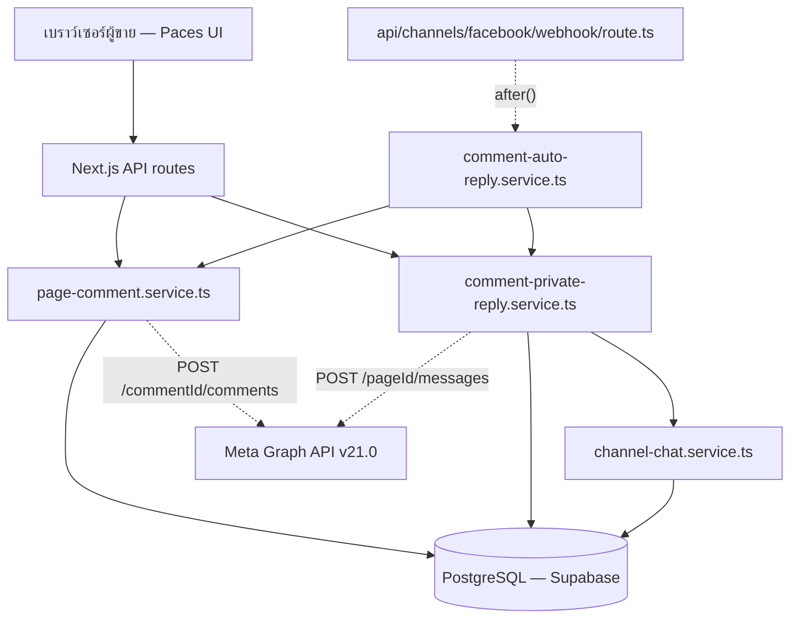
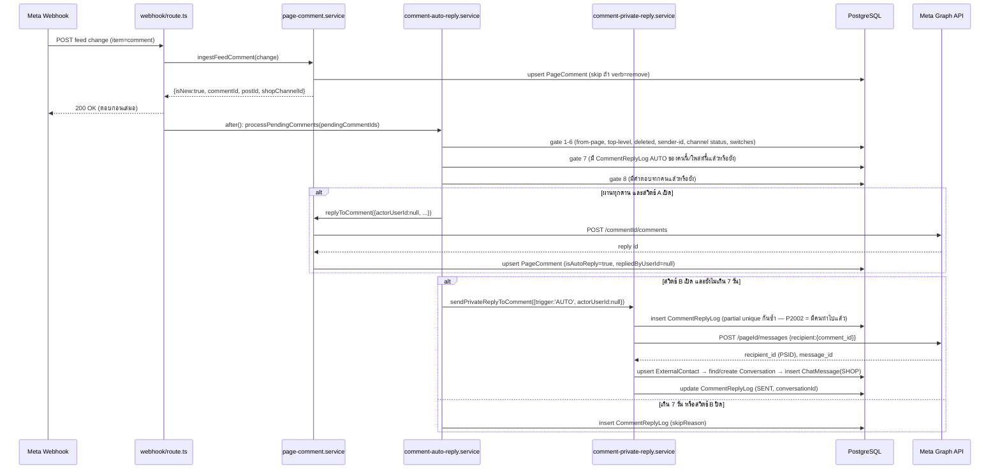

> **โมดูล:** 00038-CommentReply
> **ประเภทเอกสาร:** System Design Spec (SDS)
> **เวอร์ชัน:** 1.0
> **วันที่จัดทำ:** 2026-08-08
> **สถานะ:** Draft — รอ user review
> **เจ้าของเอกสาร:** SA

# SDS: ตอบกลับคอมเมนต์ (Comment Auto-Reply & Private Reply) (System Design Spec)

---

## 1. บทนำ & References

### 1.1 วัตถุประสงค์

เอกสารนี้ออกแบบ **การ implement** ของ TFR-001..012 ใน [[SRS]] — ให้ DEV เห็นรูปร่าง component/flow/
การตัดสินใจทางเทคนิคที่ต้องทำก่อนลงมือเขียนโค้ด และให้ QA เห็นจุดเสี่ยงเชิงระบบเพื่อวางแผนทดสอบ

### 1.2 ขอบเขตการออกแบบ

ครอบ: 2 service ใหม่ (`comment-private-reply.service.ts`, `comment-auto-reply.service.ts`),
3 API route ใหม่, ส่วนขยาย 4 ไฟล์เดิม (`page-comment.service.ts`, webhook `route.ts`,
`CommentsClient.tsx`, `seller-menu.ts`) — ไม่ครอบ UI/UX pixel-level (รอ `safepay-ux` Design Spec
ตาม Hard Rule 8 ก่อนแตะ frontend จริง — เอกสารนี้ให้แค่ data contract ที่ UI ต้องใช้)

### 1.3 เอกสารอ้างอิง

| เอกสาร | ความสัมพันธ์ |
|--------|-------------|
| [[SRS]] ของโมดูลนี้ | ที่มาของ TFR-001..012 ที่ SDS นี้ต้อง realize |
| [[BRD]] ของโมดูลนี้ | ที่มาของ Functional Requirements / AC |
| [[PRD]] ของโมดูลนี้ | ที่มาของเป้าหมายธุรกิจและ KPI |
| `docs/superpowers/specs/2026-08-08-00038-comment-auto-reply-design.md` | design spec ต้นทาง — SDS นี้แตกรายละเอียดเทคนิคจากหัวข้อ §4-§10 ของไฟล์นั้น |
| `docs/20 - Features/00023 - Deep Chat-Bot Assistant/SDS.md` (TD-005) | แพตเทิร์น system actor ที่ TFR-CR-002 ยืมมาปรับใช้ |

---

## 2. Architecture Overview

### 2.1 มุมมองสถาปัตยกรรม

โมดูลนี้อยู่ใน service layer เดิมของ Next.js App Router (ไม่มี stack ใหม่) — เพิ่ม 2 service ที่
วางคู่กับ `page-comment.service.ts`/`channel-chat.service.ts` เดิม และ dispatch จาก `after()` ของ
webhook route เดียวกับที่ 00023 ใช้กับ auto-reply ข้อความแชท (ไม่สร้าง queue/worker แยก — ปริมาณงาน
ต่ำพอที่จะรันในอายุ request เดียวกันได้ ตาม A-1 ของ PRD "ไม่มีหน่วงเวลา")

### 2.2 มุมมองการ Deploy

ไม่มีการเปลี่ยนแปลง deployment topology — deploy พร้อมกับ Next.js app เดิมบน Vercel serverless
(Node.js runtime) `after()` ใช้ Fluid compute ของ Vercel เดิมที่ 00023 พิสูจน์แล้วว่าใช้งานได้จริง

---

## 3. Component Design

| Component | หน้าที่ (Responsibility) | Dependency (Submodule / Stack / Store) |
|-----------|--------------------------|-----------------------------------------|
| **`comment-auto-reply.service.ts`** | ตัวตัดสินเดียว — รับ `commentId` ที่มาจาก webhook สด ไล่ตรวจ gate 9 ข้อ แล้ว orchestrate public reply + private reply ตามสวิตช์ | `src/services/` → PostgreSQL ผ่าน `page-comment.service`/`comment-private-reply.service` |
| **`comment-private-reply.service.ts`** | หน้าที่เดียว — ส่ง private reply 1 ครั้ง (ทั้ง AUTO/MANUAL ผ่านฟังก์ชันเดียวกัน) พร้อมกันซ้ำ+บันทึก log | `src/services/` → Meta Graph API, PostgreSQL |
| **`page-comment.service.ts`** (แก้) | `replyToComment` รับ system actor; `getPostComments`/`countUnansweredForShop` คำนวณ 3 สถานะ; `ingestFeedComment` คืนผลใหม่ + ไม่ทับ `isAutoReply` | `src/services/` (มีอยู่แล้ว feature 00029) |
| **`channel-chat.service.ts`** (ไม่แก้ — จุดที่ `comment-private-reply` เกาะ pattern) | ให้ pattern upsert contact/conversation ที่ต้องเลียนแบบ (ไม่เรียกตรง — ดู TFR-CR-001) | `src/services/` (feature 00018) |
| **`api/shops/comment-reply/config/route.ts`** (ใหม่) | GET/PATCH สวิตช์+ข้อความต่อเพจ | `src/app/api/` |
| **`api/shops/comment-reply/logs/route.ts`** (ใหม่) | GET ประวัติแบ่งหน้า | `src/app/api/` |
| **`api/chat/comments/[commentId]/private-reply/route.ts`** (ใหม่) | ปุ่มแมนนวล | `src/app/api/` |
| **`api/channels/facebook/webhook/route.ts`** (แก้) | เพิ่ม `pendingCommentIds` เข้า `after()` เดียวกับ `pendingConversationIds` เดิม | `src/app/api/` (feature 00018/00023) |
| **`CommentsClient.tsx`** (แก้) | ปุ่ม "ทักแชท" 4 สถานะ + กล่องพิมพ์ + ชิปกรอง 4 ตัว | `src/app/(paces)/seller/(chat)/inbox/comments/` (Paces) — รอ `safepay-ux` Design Spec |
| **`settings/comment-reply/`** (ใหม่) | หน้าตั้งค่า copy โครงจาก `/settings/auto-reply` | `src/app/(paces)/seller/(dashboard)/settings/comment-reply/` (Paces) — รอ `safepay-ux` Design Spec |
| **`seller-menu.ts`** (แก้) | เพิ่มรายการเมนู 1 บรรทัดในกลุ่ม CHAT | `src/lib/` |

---

## 4. Data Flow

### 4.1 Flow หลัก: คอมเมนต์สดเข้ามาในโหมดอัตโนมัติ

### 4.2 Flow กรณีล้มเหลว / ชดเชย

- **webhook ล้มก่อนตอบ 200:** ไม่เกี่ยวกับโมดูลนี้ — `ingestFeedComment` เดิมมี `.catch()` ห่ออยู่แล้ว
  (บทเรียนเดิมจาก 00029) โมดูลนี้ไม่ทำให้พฤติกรรมนั้นเปลี่ยน
- **`comment-auto-reply.service` พังระหว่างประมวลผลคอมเมนต์หนึ่งใน batch:** ห่อ `try/catch` ต่อ
  `commentId` ภายใน loop ของ `after()` (มิเรอร์ pattern `processPendingForConversation` เดิม) —
  คอมเมนต์ที่เหลือใน batch เดียวกันต้องยังถูกประมวลผลต่อ ไม่ throw ทำให้ loop หยุดกลางคัน
- **Graph API ปฏิเสธตอนส่ง public/private reply:** ไม่ throw ขึ้นไปให้ webhook เห็น — จับที่ระดับ
  service เขียน `publicReplyStatus`/`privateReplyStatus = 'FAILED'` + `errorMessage` ลง
  `CommentReplyLog` แล้วจบ (ไม่ retry — BR-CR-14/A-4)
  - **ข้อยกเว้น (BR-CR-A5):** ถ้า public reply ล้มเหลว แต่สวิตช์ B เปิดอยู่ — ยังต้องพยายามยิง
    private reply ต่อ (ไม่ผูกกันแบบ all-or-nothing)
- **สองเธรดวิ่งพร้อมกัน (Meta ส่ง event ซ้ำ):** partial unique index (AUTO/MANUAL แยกกัน — ดู
  TFR-CR-004) เป็นชั้นตัดสินจริง ทั้งสองเธรด `findFirst` เจอ log เดิมได้ก่อน short-circuit (เร็ว) หรือ
  ถ้าแข่งกันถึงชั้น `create` พร้อมกัน — ตัวที่แพ้ได้ `P2002` ซึ่งตีความว่า "มีคนทำไปแล้ว" ไม่ใช่ error

---

## 5. Integration Points

| จุดเชื่อม | ประเภท | Protocol / Contract | ความเสี่ยงเมื่อล่ม |
|-----------|--------|----------------------|---------------------|
| **Meta Graph API `POST /{comment-id}/comments`** | 3rd-party | REST/JSON (มีอยู่แล้ว `createCommentReply` — `src/lib/facebook/graph.ts:742`) | public reply ล้มเหลวรายคอมเมนต์ — ไม่กระทบ webhook หรือ private reply |
| **Meta Graph API `POST /{page-id}/messages`** (private reply) | 3rd-party | REST/JSON — body `{recipient:{comment_id}, message:{text}}` → `{recipient_id, message_id}` (ใหม่ — ต้องเพิ่มฟังก์ชันใน `src/lib/facebook/graph.ts`) | private reply ล้มเหลวรายคอมเมนต์ — บันทึก log ให้ร้านลองด้วยปุ่มแมนนวล |
| **`channel-chat.service.ts`** (internal, pattern เดียวกัน ไม่ import ตรง) | internal | ต้อง upsert `ExternalContact`/`Conversation`/`ChatMessage` ด้วยคีย์เดียวกับที่ `ingestInboundMessage` ใช้ | ห้องแชทขาด denormalized field ถ้า pattern ไม่ตรงกัน — 00037 `resolveChatScope` จะหาห้องนี้ไม่เจอ |
| **`page-comment.service.ts`** (internal) | internal | `replyToComment`, `getPostComments`, `countUnansweredForShop` | schema/behavior เปลี่ยนที่นั่นกระทบ query ที่นี่โดยตรง (ไฟล์เดียวกัน) |

- **Timeout / Retry / Idempotency:** Graph call ทั้งสองจุดไม่ retry อัตโนมัติ (policy ของฟีเจอร์นี้ —
  BR-CR-14) ใช้ timeout เดิมของ `graphFetch`/`createCommentReply` (ไม่เพิ่ม config ใหม่) —
  idempotency คุมที่ partial unique index ของ `CommentReplyLog` ไม่ใช่ idempotency key ฝั่ง Graph
- **สัญญา API เต็ม:** ดู `API.md` ของโมดูลนี้

---

## 6. Technical Decisions

### TFR-CR-001: ทำไมไม่ reuse `sendOutboundMessage`
- **ตัดสินใจ:** `sendPrivateReplyToComment()` เป็นฟังก์ชันแยกใน `comment-private-reply.service.ts`
  ไม่เรียก `channel-chat.service.ts::sendOutboundMessage()` — implement การยิง Graph +
  upsert contact/conversation/message ของตัวเอง โดยเลียนแบบคีย์ upsert เดียวกับ
  `ingestInboundMessage` (ไม่ import ฟังก์ชันนั้นตรง ๆ เพราะมันคาดหวังรูปร่าง Meta webhook `event`
  ไม่ใช่ผลลัพธ์จากการยิง `POST /messages` เอง)
- **เหตุผล:** `sendOutboundMessage()` เช็ค `getWindowState(conversation.lastInboundAt)`
  (`channel-chat.service.ts:1779`) แล้ว `throw WINDOW_CLOSED` เมื่อหน้าต่างปิดและผู้ส่งไม่ใช่คนจริง
  (`sentByHuman = actorUserId !== null && !autoReplyKind`) ห้องที่เพิ่งเกิดจาก private reply มี
  `lastInboundAt = null` เสมอ (ยังไม่เคยมีข้อความขาเข้าจากลูกค้า) → `getWindowState(null)` คืน
  `{open:false}` เสมอ (`channel-chat.service.ts:95-97`) → เรียกด้วย `actorUserId=null` (ทางเดียวที่
  เส้นทางระบบทำได้) จะโดน `WINDOW_CLOSED` **ทุกครั้งไม่มีข้อยกเว้น** — ฟีเจอร์จะไม่ทำงานเลยสักครั้ง
  ถ้าใช้ฟังก์ชันเดิม
- **ทางเลือกที่ตัดทิ้ง:** แก้ `sendOutboundMessage` ให้มี flag ข้าม window check สำหรับ private
  reply — ตัดทิ้งเพราะ window guard ของฟังก์ชันนั้นคือ gate นโยบาย Meta ที่ตั้งใจ "ห้ามผ่อน" สำหรับ
  ข้อความอัตโนมัติในห้อง**เดิม** (คอมเมนต์ในโค้ดเขียนไว้ตรง ๆ ว่า "นี่คือ gate ของนโยบาย ห้ามผ่อน") —
  private reply เป็นคนละ policy surface ของ Meta (สิทธิ์เปิดห้อง**ใหม่**จากคอมเมนต์ ไม่ใช่ส่งข้อความ
  ในห้องเดิม) การยัดเข้าฟังก์ชันเดียวกันจะทำให้เงื่อนไขทั้งสองปนกันและเสี่ยงหลุด gate จริงของ 00023
  โดยไม่ตั้งใจในการแก้ครั้งถัดไป
- **ผลกระทบ:** ต่อ DEV — ต้อง implement การยิง Graph + upsert contact/conversation เองใน service
  ใหม่ (ไม่ใช่ zero-cost). ต่อ consistency — ต้องตรวจสอบเองว่าคีย์ upsert ตรงกับที่
  `ingestInboundMessage` ใช้ ไม่มี compiler บังคับ (ดู mitigation ใน §8 SRS)

### TFR-CR-002: system actor path ของ `replyToComment`
- **ตัดสินใจ:** ขยาย `replyToComment(params: {..., actorUserId: string | null})` — เมื่อ
  `actorUserId === null` ข้าม `canAccessShop()` แต่ derive `shopId`/`pageId` จากแถวข้อมูล
  (`PageComment → FacebookPost → ShopChannel`) เสมอ ไม่รับจาก parameter อื่นของ caller
- **เหตุผล:** เส้นทางบอทไม่มี user จริงให้เช็คสิทธิ์ — มิเรอร์แพตเทิร์นเดียวกับ TD-005 ของ 00023
  (`sendOutboundMessage`'s `systemShopId` cross-check) ที่ใช้ได้ผลจริงแล้ว: **"ย้ายคำถาม" จาก "user
  คนนี้แตะร้านนี้ได้ไหม" เป็น "คอมเมนต์นี้เป็นของร้านที่ระบบกำลังทำงานแทนจริงหรือเปล่า"** โดย derive
  จากฐานข้อมูลเสมอ ไม่ใช่รับ shopId ที่ caller "เชื่อว่า" เป็นเจ้าของมาตรง ๆ
- **ทางเลือกที่ตัดทิ้ง:** สร้าง service account/user พิเศษแทน `null` (`SYSTEM_USER_ID` คงที่) —
  ตัดทิ้งเพราะจะต้องมี user จริงในตาราง `User` ที่ไม่มีเจ้าของจริง (ผิด invariant ของ `User` model
  เดิมที่ผูกกับ auth) และ `repliedByUserId`/`isAutoReply` มีอยู่แล้วเป็นสัญญาณที่ตรงกว่า ไม่ต้องเพิ่ม
  entity ปลอม
- **ผลกระทบ:** ต่อ DEV — signature ของ `replyToComment` เปลี่ยน (breaking change เชิง type ไม่ใช่
  เชิง runtime — caller เดิมที่ส่ง `string` ยังผ่าน) ทุก call site ที่มีอยู่ต้องยัง compile ผ่านโดยไม่
  ต้องแก้ (TypeScript union กว้างขึ้นเท่านั้น)

### TFR-CR-003: `isAutoReply` มีผู้เขียน 2 ราย — ห้าม webhook เขียนทับ
- **ตัดสินใจ:** `ingestFeedComment`'s `update` block (`page-comment.service.ts:89-96`) **ห้ามใส่**
  `isAutoReply` เข้าไปในชุด field ที่ทับ — คงคอลัมน์นี้ไว้เฉพาะ `create` block ของ `replyToComment`
  เท่านั้นที่เขียนได้
- **เหตุผล:** เราเขียน `isAutoReply=true` ตอน `replyToComment()` คืน comment id กลับมาทันที (idempotent
  pattern เดียวกับที่ระบบใช้อยู่แล้ว — ไม่รอ webhook) แต่ Meta จะ echo คำตอบเดียวกันนี้กลับเข้ามาทาง
  webhook อีกครั้งในภายหลัง (คอมเมนต์ของเพจเองก็เดิน `ingestFeedComment` เหมือนคอมเมนต์อื่น) ถ้า
  `update` block ของ `ingestFeedComment` ใส่ `isAutoReply` เข้าไปด้วย (ไม่ว่าจะ hardcode `false` หรือ
  derive จาก payload ที่ไม่มีข้อมูลนี้) ธงจะถูกรีเซ็ตเป็น `false` เงียบ ๆ แล้วป้าย "ตอบอัตโนมัติ" จะ
  หายไปพร้อมสถานะเปลี่ยนจาก "บอทตอบแล้ว" เป็น "คนตอบแล้ว" ผิด — คลาสเดียวกับบั๊กรีแอ็กชันข้อความเมื่อ
  2026-08-04 (`docs/conventions/external-payload-schema.md`: "ค่าที่หายจาก payload = ไม่รู้ ไม่ใช่ถูก
  ลบ")
- **ทางเลือกที่ตัดทิ้ง:** ให้ webhook เป็นแหล่งความจริงเดียว (ไม่เขียนตอน `replyToComment`, รอ echo
  แล้วค่อย derive `isAutoReply` จาก `fromExternalId === pageId` ตอน webhook) — ตัดทิ้งเพราะ Meta ไม่ส่ง
  สัญญาณใด ๆ ที่แยกได้ว่า echo นี้มาจาก auto-reply หรือคนพิมพ์เอง (ทั้งคู่ `fromExternalId === pageId`
  เหมือนกันหมด) ต้องพึ่งความรู้ ณ เวลาที่เราเป็นคนยิงเท่านั้น
- **ผลกระทบ:** ต่อ QA — ต้องมี test case ที่จำลอง webhook echo ของคำตอบบอทเข้ามาซ้ำ แล้วยืนยันว่า
  `isAutoReply` ยังเป็น `true` (AC-CR-29)

### TFR-CR-004: partial unique index แทน composite unique ธรรมดา
- **ตัดสินใจ:** `CommentReplyLog` มี partial unique index 2 ตัว แยกตาม `trigger`:
  `UNIQUE (shopChannelId, postId, fromExternalId) WHERE trigger='AUTO'` และ
  `UNIQUE (commentId) WHERE trigger='MANUAL'` — ไม่ใช้ `@@unique` ธรรมดาตัวเดียวครอบทั้งตาราง
- **เหตุผล:** กันซ้ำ 2 ระดับที่**ไม่ใช่กฎเดียวกัน** — AUTO กันที่ "1 ครั้ง/คน/โพสต์" (D-3, กฎของ Deep
  เพื่อกันบอทดูเป็นสแปม) ส่วน MANUAL กันที่ "1 ครั้ง/คอมเมนต์" (เพดานจริงของ Meta) ถ้าใช้ composite
  unique ตัวเดียวครอบทั้งคู่ (เช่น `(shopChannelId, postId, fromExternalId)` เฉย ๆ ไม่แยก `trigger`)
  คนที่คอมเมนต์ 2 ครั้งบนโพสต์เดียวกันจะถูกร้านทักด้วยมือได้แค่ครั้งเดียว ทั้งที่ Meta อนุญาตให้ทักทุก
  คอมเมนต์แยกกัน — เอากฎกันสแปมของบอทไปมัดมือคนโดยไม่ตั้งใจ (ดูตารางเปรียบเทียบเต็มใน DATABASE.md §4)
- **ทางเลือกที่ตัดทิ้ง:** unique ตัวเดียวที่ `commentId` อย่างเดียว (ไม่แยก AUTO/MANUAL) — ตัดทิ้งเพราะ
  AUTO ต้องกันที่ระดับ "คน+โพสต์" ไม่ใช่ "คอมเมนต์" (BR-CR-A2 "หนึ่งคน ได้รับการตอบอัตโนมัติครั้งเดียว
  ต่อโพสต์" ไม่ใช่ต่อคอมเมนต์) — unique ที่ `commentId` เดี่ยว ๆ จะปล่อยให้บอทตอบคอมเมนต์ที่ 2/3/4
  ของคนเดิมบนโพสต์เดิมได้ ซึ่งขัด D-3 ตรง ๆ
- **ผลกระทบ:** ต่อ DEV — ต้องเขียน migration SQL มือ (Prisma DSL ประกาศ partial index ไม่ได้) มี
  ตัวอย่างให้ลอกแล้วที่ `prisma/migrations/20260722000200_shopchannel_active_partial_unique/`.
  ต่อ service — `sendPrivateReplyToComment` และ `comment-auto-reply.service` ต้องแยกชัดว่ากำลังสร้าง
  log แถวไหนด้วย `trigger` อะไร ก่อน insert เสมอ (ไม่มี default ที่เดาได้)

### TFR-CR-005: `seller-menu.ts` — ต้อง**ไม่**เพิ่ม slug ใหม่เข้า vertical-only array ใด ๆ
- **ตัดสินใจ:** `{ url:'/settings/comment-reply', slug:'seller:settings-comment-reply', ... }` เพิ่ม
  เข้า children ของกลุ่ม CHAT เฉย ๆ — **ห้าม**เพิ่ม slug นี้เข้า `ONLINE_SALES_ONLY_SLUGS` /
  `SERVICE_QUEUE_ONLY_SLUGS` / `LODGING_ONLY_SLUGS` / `SHARED_PRODUCT_SLUGS` หรือ array ใดใน
  `ALL_VERTICAL_SCOPED_SLUGS` ทั้งสิ้น
- **เหตุผล:** ตรวจโค้ดจริงแล้วพบว่า slug ข้างเคียงในกลุ่ม CHAT เดียวกัน (`seller:inbox`,
  `seller:settings-auto-reply`, `seller:settings-chatbot`) **ไม่มีตัวไหนอยู่ใน
  `ALL_VERTICAL_SCOPED_SLUGS` เลย** — `applyVerticalMenu()` คำนวณ `hidden` จาก
  `ALL_VERTICAL_SCOPED_SLUGS.filter((slug) => !visible.includes(slug))` เท่านั้น แล้ว filter เฉพาะ
  slug ที่อยู่ใน `hidden` ออกจากเมนู ดังนั้น slug ที่ไม่เคยถูกประกาศใน `ALL_VERTICAL_SCOPED_SLUGS`
  เลยจะ**ไม่มีวันถูกซ่อน**ไม่ว่า vertical ไหน — นี่คือกลไกที่ทำให้ "ข้อความ"/"ตอบกลับอัตโนมัติ" เห็น
  ได้ทุก vertical อยู่แล้วโดยไม่ต้องเพิ่มเข้า `VERTICAL_VISIBLE_SLUGS` เลย
- **ทางเลือกที่ตัดทิ้ง:** เพิ่ม slug ใหม่เข้า `VERTICAL_VISIBLE_SLUGS[ONLINE_SALES]` /
  `[SERVICE_QUEUE]` / `[LODGING]` ทั้ง 3 รายการตามที่ design spec §9.1 เขียนไว้แบบกว้าง ๆ ("ต้องเข้า
  `VERTICAL_VISIBLE_SLUGS` ของทุก vertical ที่เห็นเมนู 'ข้อความ' อยู่แล้ว") — ตัดทิ้งเพราะเป็นการ
  แก้ผิดตัวแปร: `VERTICAL_VISIBLE_SLUGS` ประกาศ "อะไรที่มองเห็นได้" แต่ตัวตัดสินจริงคือ
  `ALL_VERTICAL_SCOPED_SLUGS` (ตัวกำหนดว่า "อะไรอยู่ใต้ gate เลย") — เพิ่มเข้า
  `VERTICAL_VISIBLE_SLUGS` เฉย ๆ โดยไม่แตะ `ALL_VERTICAL_SCOPED_SLUGS` **ไม่มีผลอะไรเลยต่อพฤติกรรม**
  (เมนูจะเห็นได้ทุก vertical อยู่ดี เพราะไม่เคยถูก gate ตั้งแต่แรก) แต่จะทำให้โค้ดอ่านแล้วเข้าใจผิดว่า
  ถูกจำกัดขอบเขตทั้งที่ไม่ถูกจำกัดจริง — เพิ่ม array ที่ไม่มีผลคือหนี้เอกสารที่หลอกคนอ่านครั้งถัดไป
- **ผลกระทบ:** ต่อ reviewer — grep gate ของ commit นี้ควรตรวจว่า `settings-comment-reply` **ไม่
  ปรากฏ**ใน `ONLINE_SALES_ONLY_SLUGS`/`SERVICE_QUEUE_ONLY_SLUGS`/`LODGING_ONLY_SLUGS`/
  `SHARED_PRODUCT_SLUGS` เลยสักที่ (ตรงข้ามกับ grep gate ปกติที่มักตรวจว่า "มี" — ที่นี่ต้องตรวจว่า
  "ไม่มี")

---

## 7. Traceability

| SRS Requirement (TFR/NFR) | SDS Element (component / decision / flow) | สถานะ |
|---------------------------|-------------------------------------------|-------|
| TFR-001 | Component `settings/comment-reply/` (§3) | Draft |
| TFR-002 | Component `api/shops/comment-reply/config` (§3) | Draft |
| TFR-003 | Flow 4.1, Component `comment-auto-reply.service` (§3) | Draft |
| TFR-004 | TFR-CR-001 (§6) | Draft |
| TFR-005 | TFR-CR-002 (§6) | Draft |
| TFR-006 | Flow 4.1 ขั้น 1-9, Integration Points (§5) | Draft |
| TFR-007 | Component `api/chat/comments/[commentId]/private-reply` (§3) | Draft |
| TFR-008 | Component `api/shops/comment-reply/logs` (§3) | Draft |
| TFR-009 | (ไม่มี TD แยก — implement ตรงใน `page-comment.service.ts`, ดู SRS TFR-009 โดยตรง) | Draft |
| TFR-010 | (ไม่ต้องแก้ query เดิม — ดู SRS TFR-010) | Draft |
| TFR-011 | Flow 4.1 ขั้น 8 (`shopLastReadAt=now()`) | Draft |
| TFR-012 | TFR-CR-005 (§6) | Draft |
| NFR — Idempotency | TFR-CR-004 (§6) | Draft |
| NFR — Reliability | Flow 4.2 (§4) | Draft |

---

## 8. สรุป (Summary)

เอกสาร SDS นี้กำหนด **การออกแบบเชิงระบบ** ของ **ตอบกลับคอมเมนต์ (Comment Auto-Reply & Private
Reply)** เพื่อให้ DEV นำไป implement, QA นำความเสี่ยงไปวางแผนทดสอบ, และ DevOps ประเมินผลกระทบ infra
ได้ตรงกับข้อกำหนดใน [[SRS]] — ไม่มี infra ใหม่ ไม่มี stack ใหม่ ทุกอย่างต่อยอดจากแพตเทิร์นที่
feature 00018/00023/00029 พิสูจน์แล้วว่าใช้งานได้จริงบน prod

**ลำดับการ build ที่แนะนำ:**
- Task 2: migration (`CommentReplyLog` + 5 คอลัมน์ + partial unique index 2 ตัว) — interface ที่ส่ง
  มอบ: schema พร้อม query
- Task 3: `comment-private-reply.service.ts` + ขยาย `replyToComment` (system actor) — interface ที่
  ส่งมอบ: `sendPrivateReplyToComment()` ใช้ได้ทั้งเส้น AUTO/MANUAL
- Task 4: `comment-auto-reply.service.ts` + ต่อสาย webhook `after()` — interface ที่ส่งมอบ: คอมเมนต์
  สดถูกตัดสินอัตโนมัติครบ 9 ด่าน
- Task 5: 3 API endpoint + ปุ่มแมนนวลใน `CommentsClient.tsx` (ผ่าน `safepay-ux` gate ก่อน) —
  ปิดหนี้ 00029
- Task 6: หน้าตั้งค่า + เมนู + สถานะ 3 ชั้น + ชิปกรอง (ผ่าน `safepay-ux` gate ก่อน)
- Task 7: impeccable critique/clarify → deploy

**Open Questions:**
- ไอคอนเมนู "ตอบกลับคอมเมนต์" รอ user ยืนยัน (ไม่บล็อก Task 2-4 ซึ่งเป็น backend ล้วน — บล็อกเฉพาะ
  ส่วนที่แตะ `seller-menu.ts` จริง)
