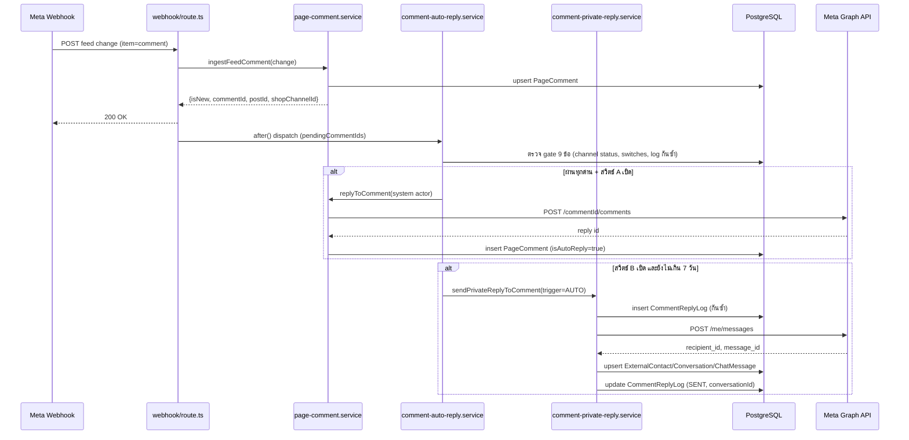

> **โมดูล:** 00038-CommentReply
> **ประเภทเอกสาร:** Software Requirements Specification (SRS) - TECHNICAL
> **เวอร์ชัน:** 1.0
> **วันที่จัดทำ:** 2026-08-08
> **สถานะ:** Draft — รอ user review
> **เจ้าของเอกสาร:** SA

# SRS: ตอบกลับคอมเมนต์ (Comment Auto-Reply & Private Reply) (Software Requirements Specification — Technical)

---

## 1. บทนำ (Introduction)

### 1.1 วัตถุประสงค์ของเอกสาร

เอกสารนี้กำหนดข้อกำหนดเชิงเทคนิคของฟีเจอร์ "ตอบกลับคอมเมนต์" — ทำให้ปุ่ม "ทักแชท" ในแท็บความคิดเห็น
(feature 00029) กดได้จริง และให้ร้านตั้งค่าต่อเพจ Facebook ได้ว่าเมื่อลูกค้าคอมเมนต์ ระบบจะตอบใต้
คอมเมนต์และ/หรือส่งข้อความส่วนตัว (private reply) เพื่อเปิดห้องแชทให้อัตโนมัติ ผู้อ่านหลักคือ DEV
(นำไป implement service layer/API/UI), QA (วางแผนทดสอบจาก TFR/edge case), และ SA รุ่นถัดไปที่ต้อง
ต่อยอดเฟส 2 (Instagram)

### 1.2 ขอบเขตเชิงระบบ (System Scope)

**อยู่ในขอบเขตเทคนิค:**

- Service ใหม่ 2 ตัว: `src/services/comment-private-reply.service.ts` (แกนกลางส่ง private reply +
  บันทึก log), `src/services/comment-auto-reply.service.ts` (ตัวตัดสินอัตโนมัติ/gate 9 ข้อ)
- API ใหม่ 3 endpoint: `GET/PATCH /api/shops/comment-reply/config`,
  `GET /api/shops/comment-reply/logs`, `POST /api/chat/comments/[commentId]/private-reply`
- ส่วนขยายของ `src/services/page-comment.service.ts` (`replyToComment` รับ system actor,
  `getPostComments`/`countUnansweredForShop` แยก 3 สถานะ, `ingestFeedComment` ห้ามทับ `isAutoReply`)
- ส่วนขยายของ `src/app/api/channels/facebook/webhook/route.ts` (dispatch คอมเมนต์สดเข้า
  `comment-auto-reply.service` ใน `after()` เดียวกับที่ feature 00023 ใช้กับข้อความแชท)
- ส่วนขยายของ `src/app/(paces)/seller/(chat)/inbox/comments/CommentsClient.tsx` (ปุ่ม "ทักแชท"
  จากป้ายเป็นปุ่มกดได้จริง 4 สถานะ + ชิปกรองสถานะที่ 3) และ `src/lib/seller-menu.ts` (เมนูใหม่)
- Data model ใหม่: model `CommentReplyLog` + คอลัมน์ใหม่ 5 คอลัมน์ (`ShopChannel` × 4,
  `PageComment.isAutoReply` × 1) — additive ล้วน ไม่มี breaking change

**นอกขอบเขตเทคนิครอบนี้:**

- Instagram (ต้องขอ scope เพิ่มจาก Meta + ให้ทุกร้านเชื่อมบัญชีใหม่ — โครง `provider` เผื่อไว้แล้ว
  แต่ตัวตัดสิน gate จะ hardcode ตรวจ `provider === 'MESSENGER'` ในรอบนี้)
- การเลือกคำตอบตามเนื้อหาคอมเมนต์ (กลุ่มคำ/AI) — ข้อความคงที่ต่อเพจเท่านั้น (D-2)
- หน่วงเวลาก่อนตอบ, ตอบคอมเมนต์ใต้โฆษณา, ตอบเป็นรูป/สติกเกอร์, ซ่อน/ลบคอมเมนต์อัตโนมัติ
- การรื้อ `auto-reply.service.ts`/`AutoReplyRule`/`AutoReplyLog` ของ feature 00023 — สร้างเส้นขนาน
  ที่ยืมแพตเทิร์นเดียวกัน (unique key กันซ้ำที่ระดับ DB) ไม่ยืมตาราง (เหตุผลเต็ม: design spec §4.3)

### 1.3 เอกสารอ้างอิง (References)

| เอกสาร | ความสัมพันธ์ |
|--------|-------------|
| [[PRD]] ของโมดูลนี้ | ที่มาของเป้าหมายธุรกิจและ KPI (BR-CR-01..23) |
| [[BRD]] ของโมดูลนี้ | ที่มาของ Functional Requirements (FR-CR-01..14) / Acceptance Criteria (AC-CR-01..30) |
| `docs/superpowers/specs/2026-08-08-00038-comment-auto-reply-design.md` | design spec 14 หัวข้อ — แหล่งความจริงของการตัดสินใจทางเทคนิคทั้งหมดที่เอกสารนี้ trace ต่อ |
| `docs/20 - Features/00029 - Facebook Comments Inbox/` | ที่มาของ `PageComment`/`FacebookPost`/`CommentsClient.tsx` ที่งานนี้ต่อยอด |
| `docs/20 - Features/00018 - Facebook Chat Integration/` | ที่มาของ `Conversation`/`ChatMessage`/`ExternalContact`/`channel-chat.service.ts` ที่ private reply ต้องสร้างห้องแชทผ่านเส้นทางเดียวกัน |
| `docs/20 - Features/00023 - Deep Chat-Bot Assistant/SDS.md` (TD-005) | แพตเทิร์น "system actor ข้าม canAccessShop" ที่งานนี้ยืมมาใช้กับ `replyToComment` |
| `docs/conventions/external-payload-schema.md` | เหตุผลที่ `isAutoReply` ห้ามถูกเขียนทับโดย webhook echo |

### 1.4 นิยามและตัวย่อ (Definitions & Acronyms)

| คำ/ตัวย่อ | ความหมายเชิงเทคนิค |
|-----------|----------|
| **public reply** | คำตอบที่เพจโพสต์ใต้คอมเมนต์ผ่าน Graph endpoint `POST /{comment-id}/comments` — สร้างแถว `PageComment` ใหม่ (`repliedByUserId` หรือ `isAutoReply=true`) |
| **private reply** | ข้อความส่วนตัวที่ส่งผ่าน Graph endpoint `POST /me/messages` (ไม่ใช่ `/{page-id}/messages` ตามที่เอกสาร Meta เขียน — เหตุผลดู [[SDS]] TD-006) body `recipient:{comment_id}` — สร้าง/ต่อ `Conversation` ช่องทาง MESSENGER |
| **system actor** | เส้นทางเรียกฟังก์ชันที่ `actorUserId = null` เพราะไม่มี user คนกด (เรียกจาก `after()` ของ webhook) — cross-check ownership จากแถวข้อมูลแทน `canAccessShop` |
| **gate / ด่านคัดกรอง** | เงื่อนไข 9 ข้อ (FR-CR-05) ที่คอมเมนต์ต้องผ่านทั้งหมดก่อนระบบจะตอบอัตโนมัติ |
| **PSID** | Page-Scoped ID — id ของผู้ใช้ Messenger ที่ผูกกับเพจนี้เท่านั้น (`ExternalContact.externalUserId`) |
| **skipReason** | เหตุผลที่ระบบเลือกไม่ตอบ บันทึกลง `CommentReplyLog.skipReason` (ดู §3 TFR-003) |
| **trigger** | ที่มาของการยิง private/public reply — `"AUTO"` (ระบบ) หรือ `"MANUAL"` (คนกด) — คอลัมน์ `CommentReplyLog.trigger` |

---

## 2. ภาพรวมสถาปัตยกรรม (Architecture Overview)

### 2.1 บริบทระบบ (System Context)

```mermaid
flowchart LR
    Meta[Meta Graph API + Webhook]
    Seller[เบราว์เซอร์ผู้ขาย — Paces UI]
    WH[api/channels/facebook/webhook/route.ts]
    CFG[api/shops/comment-reply/config]
    LOG[api/shops/comment-reply/logs]
    PR[api/chat/comments/[commentId]/private-reply]
    AutoSvc[comment-auto-reply.service.ts]
    PrivSvc[comment-private-reply.service.ts]
    PageSvc[page-comment.service.ts]
    ChatSvc[channel-chat.service.ts]
    DB[(PostgreSQL — Supabase)]

    Meta -- webhook feed/comment --> WH
    WH -- after() dispatch --> AutoSvc
    AutoSvc --> PageSvc
    AutoSvc --> PrivSvc
    PrivSvc -- POST /me/messages --> Meta
    PageSvc -- POST /commentId/comments --> Meta
    PrivSvc --> ChatSvc
    Seller --> CFG
    Seller --> LOG
    Seller --> PR
    PR --> PrivSvc
    CFG --> DB
    LOG --> DB
    AutoSvc --> DB
    PrivSvc --> DB
    PageSvc --> DB
    ChatSvc --> DB
```

### 2.2 องค์ประกอบหลัก (Components)

| Component | หน้าที่ | Submodule / Stack |
|-----------|---------|-------------------|
| **`comment-auto-reply.service.ts`** | รับคอมเมนต์ที่เพิ่งเข้ามาสดจาก webhook → ไล่ตรวจ gate 9 ข้อ → เรียก public/private reply ตามสวิตช์ที่เปิด → บันทึก `CommentReplyLog` ทุกครั้ง | `src/services/` (Next.js API layer, TypeScript) |
| **`comment-private-reply.service.ts`** | แกนกลางส่ง private reply เดียว ใช้ทั้งเส้น AUTO และ MANUAL — เช็คหน้าต่าง 7 วัน, กันซ้ำผ่าน unique index, ยิง Graph, สร้าง/ต่อห้องแชท | `src/services/` |
| **`page-comment.service.ts`** (ส่วนขยาย) | `replyToComment` รับ system actor, `getPostComments`/`countUnansweredForShop` คำนวณ 3 สถานะจาก `isAutoReply`, `ingestFeedComment` คง `isAutoReply` เดิมเมื่อ webhook echo กลับมา | `src/services/` |
| **`channel-chat.service.ts`** (จุดที่ private reply เกาะ) | ให้แพตเทิร์น upsert `ExternalContact` → หา/สร้าง `Conversation` ที่ private reply ต้องเดินเส้นเดียวกัน — **ไม่เรียก `sendOutboundMessage` ตรง ๆ** (ดู TFR-004) | `src/services/` |
| **`api/shops/comment-reply/config/route.ts`** | GET อ่านค่าตั้งต้นทุกเพจของร้าน active, PATCH บันทึกสวิตช์+ข้อความของเพจเดียว | `src/app/api/` |
| **`api/shops/comment-reply/logs/route.ts`** | GET ประวัติการตอบ/ข้าม แบ่งหน้า เรียงเวลาล่าสุดก่อน | `src/app/api/` |
| **`api/chat/comments/[commentId]/private-reply/route.ts`** | ปุ่มแมนนวล — เรียก `comment-private-reply.service` ด้วย `trigger:'MANUAL'` + `actorUserId` จาก session | `src/app/api/` |
| **`CommentsClient.tsx`** (ส่วนขยาย) | ปุ่ม "ทักแชท" 4 สถานะ + กล่องพิมพ์ก่อนส่ง + ชิปกรอง 4 ตัว | `src/app/(paces)/seller/(chat)/inbox/comments/` (Paces, client component) |
| **`settings/comment-reply/`** (ใหม่) | หน้าตั้งค่า — การ์ดต่อเพจ, ประวัติ | `src/app/(paces)/seller/(dashboard)/settings/comment-reply/` |

### 2.3 มุมมองการ Deploy (Deployment View)

รันบน Vercel serverless เดิม (Next.js App Router API routes, Node.js runtime) — ไม่มี infra ใหม่
งานอัตโนมัติทำงานใน `after()` ของ Next.js ซึ่งนับรวมในอายุ function เดียวกับ webhook request
(รูปแบบเดียวกับที่ feature 00023 ใช้กับ auto-reply ข้อความแชทอยู่แล้ว) — ไม่มี queue/worker แยก

---

## 3. ข้อกำหนดเชิงฟังก์ชันเชิงเทคนิค (TFR)

### TFR-001: Route + สิทธิ์เข้าถึงหน้าตั้งค่า
- **Trace to:** FR-CR-01, FR-CR-07
- **คำอธิบายเชิงเทคนิค:** หน้า `/settings/comment-reply` (Server Component) resolve active shop จาก
  session แล้วเรียก `canAccessShop(shopId, session.user.id)` ก่อน render — pattern เดียวกับ
  `/settings/auto-reply` (Hard Rule 1 copy-source) ไม่มีเช็ค role แยกอีกชั้น (`ShopMember.role` มีแค่
  `OWNER`/`ADMIN`)
- **Precondition:** session มี `activeShopId`
- **Postcondition:** render การ์ดหนึ่งใบต่อ `ShopChannel` (`provider='MESSENGER'`, `status != 'DISCONNECTED'`) ของร้าน เรียงตามลำดับเดียวกับหน้าจัดการช่องทาง; ร้านที่ไม่มีเพจเลย → empty state ชี้ไปหน้าเชื่อมช่องทาง
- **Error / Edge cases:** ไม่มี active shop → redirect ตาม onboarding gate เดิม; สมาชิกที่ไม่มีสิทธิ์เข้าถึงร้าน → 403 ทั้งหน้าจอและเรียก endpoint ตรง

### TFR-002: `GET/PATCH /api/shops/comment-reply/config`
- **Trace to:** FR-CR-01, FR-CR-02, FR-CR-03, FR-CR-04, FR-CR-05 (bullet 6)
- **คำอธิบายเชิงเทคนิค:** GET คืน array ของ config ต่อเพจ (`select` ระบุคอลัมน์ ห้ามคืน
  `accessTokenEnc` — ดู TD-004 ใน SDS). PATCH รับ `shopChannelId` เดียวต่อครั้ง + ฟิลด์ที่จะแก้
  (partial update); validate ที่ Valibot ก่อน: เปิดสวิตช์ (`*Enabled: true`) โดยข้อความ (`*Text`) ว่าง
  หรือ `null` → 400 `VALIDATION_ERROR`. ตรวจว่า `shopChannelId` เป็นของ active shop จริง (join
  `ShopChannel.shopId`) ก่อนเขียนเสมอ
- **Precondition:** ผู้เรียกผ่าน `canAccessShop`; `shopChannelId` มีอยู่จริงและเป็นของร้านนี้
- **Postcondition:** เขียน 1-4 คอลัมน์ของแถว `ShopChannel` ที่ระบุ ไม่กระทบเพจอื่น (AC-CR-04)
- **Error / Edge cases:** `status != 'ACTIVE'` (เช่น `TOKEN_INVALID`) แล้วพยายามเปิดสวิตช์ →
  409 `CHANNEL_NOT_ACTIVE` (defense-in-depth คู่กับ UI ที่ปิดสวิตช์ไว้แล้ว — AC-CR-05); `shopChannelId`
  ไม่ใช่ของร้านนี้หรือไม่ใช่ `provider='MESSENGER'` → 404 `NOT_FOUND`

### TFR-003: Dispatch คอมเมนต์สดเข้าตัวตัดสินอัตโนมัติ (gate 9 ข้อ)
- **Trace to:** FR-CR-05, FR-CR-06, BR-CR-08..14
- **คำอธิบายเชิงเทคนิค:** `ingestFeedComment` (webhook, `src/services/page-comment.service.ts:41`)
  ปัจจุบันคืน `Promise<void>` — ต้องขยายให้คืนผลว่าคอมเมนต์นี้ "ใหม่จริง" (ไม่ใช่ duplicate/edit) พร้อม
  `commentId`(internal id)/`postId`/`shopChannelId` เพื่อให้ webhook route เก็บเข้า
  `pendingCommentIds: Set<string>` (มิเรอร์ตัวแปร `pendingConversationIds` ที่มีอยู่แล้วสำหรับ
  auto-reply ข้อความแชท) แล้วประมวลผลใน `after()` **เดียวกัน**หลังตอบ 200 ให้ Meta แล้วเท่านั้น
  (ห้ามเรียกก่อนตอบ 200 — Meta วัด latency ของ webhook)

  `comment-auto-reply.service.ts` รับ `commentId` แล้วไล่ตรวจ 9 เงื่อนไขตามลำดับ (BRD FR-CR-05):
  ไม่ใช่คอมเมนต์เพจเอง → เป็นคอมเมนต์ระดับบน → ยังไม่ถูกลบ → มี `fromExternalId` → เพจ `ACTIVE` →
  เปิดสวิตช์อย่างน้อย 1 ตัวและมีข้อความ → ยังไม่เคยตอบอัตโนมัติคนนี้บนโพสต์นี้ (query
  `CommentReplyLog` แบบ AUTO) → ยังไม่มีคนในทีมตอบคอมเมนต์นี้ → มาจาก webhook สด (ผ่านมาแล้วโดย
  ธรรมชาติ เพราะ `backfillPostComments()` เป็นฟังก์ชันคนละตัว ไม่เรียก auto-reply เลย — ดู TFR-012)
- **Precondition:** webhook ตอบ 200 ให้ Meta แล้ว (`after()` เริ่มทำงานหลัง response ถูกส่ง)
- **Postcondition:** ทุกคอมเมนต์ที่ผ่านเข้า service นี้ได้แถว `CommentReplyLog` อย่างน้อย 1 แถวเสมอ
  (ตอบหรือข้าม — BR-CR-13)
- **Error / Edge cases:** service ทั้งก้อนห่อ `try/catch` ต่อคอมเมนต์ (มิเรอร์ pattern ของ
  `processPendingForConversation` ใน webhook route) — คอมเมนต์หนึ่งพังต้องไม่ทำให้คอมเมนต์อื่นใน batch
  เดียวกันไม่ถูกประมวลผล; สองเธรดวิ่งพร้อมกัน (Meta retry) → dedupe ด่านที่ 7 พึ่ง partial unique index
  เป็นชั้นตัดสินจริง (P2002 = มีคนทำไปแล้ว ไม่ใช่ error)

### TFR-004: เหตุผลที่ private reply ไม่เรียก `sendOutboundMessage` ตรง ๆ (window guard)
- **Trace to:** FR-CR-03, FR-CR-06, FR-CR-14
- **คำอธิบายเชิงเทคนิค:** `sendOutboundMessage()` (`src/services/channel-chat.service.ts:1697`) เช็ค
  `getWindowState(conversation.lastInboundAt)` (บรรทัด ~1779) แล้ว `throw new Error('WINDOW_CLOSED')`
  เมื่อหน้าต่างปิด**และ**ผู้ส่งไม่ใช่คนจริง (`sentByHuman = actorUserId !== null && !autoReplyKind`)
  ห้องแชทที่เพิ่งเกิดจาก private reply ยังไม่มีข้อความขาเข้าจากลูกค้าเลย →
  `Conversation.lastInboundAt = null` เสมอ → `getWindowState(null)` คืน `{open:false, ...}` เสมอ
  (`channel-chat.service.ts:95-97`) → เรียกผ่าน `sendOutboundMessage` กับ `actorUserId=null` (ทางเดียว
  ที่ private reply ทำได้ เพราะเส้นทางระบบไม่มี user จริง) จะโดน `WINDOW_CLOSED` **ทุกครั้ง** ไม่มีทาง
  สำเร็จเลยสักครั้งเดียว — นี่คือกฎเดียวกับที่กันข้อความ auto-reply ของ 00023 ไม่ให้ยิงนอกหน้าต่าง
  ตามนโยบาย Meta ซึ่ง**ถูกต้องสำหรับข้อความ auto-reply ในห้องเดิม** แต่ผิดบริบทสำหรับ private reply
  ที่ Meta อนุญาตให้เปิดห้อง**ใหม่**จากคอมเมนต์ได้โดยเฉพาะ (คนละ policy surface ของ Meta)
- **Precondition:** `sendPrivateReplyToComment()` ต้องเป็นฟังก์ชันแยก ไม่ผ่าน
  `sendOutboundMessage`'s window gate
- **Postcondition:** `sendPrivateReplyToComment()` ยิง Graph `POST /me/messages` ตรง แล้วสร้าง
  `ChatMessage` เอง (ไม่พึ่ง window state) — รายละเอียดการออกแบบเต็มอยู่ที่ SDS TD-001
- **Error / Edge cases:** ฟังก์ชันใหม่นี้ต้องยังคง**เช็คหน้าต่าง 7 วันของคอมเมนต์เอง** (คนละหน้าต่าง
  กับ 24 ชม. ของแชท) ก่อนยิง — ดู TFR-006

### TFR-005: system actor ของ `replyToComment` (public reply)
- **Trace to:** FR-CR-05 (bullet 1, 7, 8), BR-CR-08
- **คำอธิบายเชิงเทคนิค:** `replyToComment()` (`page-comment.service.ts:594`) ปัจจุบันบังคับ
  `actorUserId: string` แล้วเรียก `canAccessShop(shopId, actorUserId)` เพื่อยืนยันสิทธิ์ — เส้นทางบอท
  ไม่มี user คนกด ต้องขยาย signature เป็น `actorUserId: string | null` แล้วเมื่อเป็น `null`
  (system actor) **ข้าม** `canAccessShop` แต่ยัง derive `shopId`/`pageId` จาก
  `PageComment → FacebookPost → ShopChannel` ในฐานข้อมูลเสมอ (ห้ามรับจาก parameter ของ caller) —
  เขียน `repliedByUserId = null` และ `isAutoReply = true`
- **Precondition:** caller เป็น service ฝั่ง server เท่านั้น (`comment-auto-reply.service.ts`) — ไม่มี
  API route ไหนส่ง `actorUserId: null` เข้ามาจาก request body ได้โดยตรง
- **Postcondition:** แถว `PageComment` ใหม่ (คำตอบ) มี `repliedByUserId=null`, `isAutoReply=true`
- **Error / Edge cases:** ถ้า caller ส่งทั้ง `actorUserId=null` และพยายามอ้างว่าเป็น MANUAL trigger —
  ต้อง reject ที่ชั้นเรียก (คนละ parameter คนละความหมาย ไม่ผสมกัน มิเรอร์ pattern `INVALID_ACTOR` ของ
  `sendOutboundMessage`)

### TFR-006: แกนกลาง `sendPrivateReplyToComment`
- **Trace to:** FR-CR-03, FR-CR-06, FR-CR-09, FR-CR-11, BR-CR-11, BR-CR-M1
- **คำอธิบายเชิงเทคนิค:** ลำดับการทำงาน (ทั้งเส้น AUTO และ MANUAL ใช้ฟังก์ชันเดียวกัน):
  1. โหลด `PageComment → post → channel` (แหล่งความจริงของ `shopId`/`pageId`)
  2. `trigger='MANUAL'` → `canAccessShop(shopId, actorUserId)`; `trigger='AUTO'` → ข้าม (system actor)
  3. เช็คหน้าต่าง 7 วันจาก `comment.createdTime` (ใช้ค่าคงที่เดียวกับที่มีอยู่แล้วใน
     `page-comment.service.ts:341` และ `CommentsClient.tsx:115` — ห้าม hardcode ตัวเลขซ้ำที่ 3)
  4. เช็ค/สร้างแถว `CommentReplyLog` ก่อน (unique index เป็นตัวกันซ้ำจริง — ดู DATABASE.md §4)
  5. ยิง Graph `POST /me/messages` body `{recipient:{comment_id}, message:{text}}`
  6. ได้ `recipient_id` (PSID) + `message_id` กลับมา
  7. upsert `ExternalContact(shopChannelId, externalUserId=recipient_id)` → find/create
     `Conversation(channel='MESSENGER', shopChannelId, externalContactId)` → insert `ChatMessage`
     (`senderRole='SHOP'`, `body=text`, `externalMessageId=message_id`) — ต้องเดิน**เส้นทางเดียวกัน**
     กับที่ `ingestInboundMessage`/echo ใช้ (upsert คีย์เดียวกัน) ไม่ insert สด เพื่อไม่ให้ห้องขาด
     `shopChannelId`/`lastMessageAt`/denormalized snapshot ที่ระบบอื่นพึ่งพา (00037
     `resolveChatScope` ผูกบริบทกับ `conversation.shopId`)
  8. อัปเดต `Conversation.lastMessageAt` (ไม่แตะ `lastInboundAt` — นั่นคือ watermark ฝั่งลูกค้า) และ
     `shopLastReadAt=now()` เพื่อให้ห้องไม่ขึ้น "ยังไม่อ่าน" ทันทีที่สร้าง (A-3, ดู TFR-010)
  9. อัปเดตแถว log เดิมจากข้อ 4: `privateReplyStatus='SENT'`, `conversationId`
- **Precondition:** คอมเมนต์ยังอยู่ในหน้าต่าง 7 วัน; ยังไม่เคยมีแถว `CommentReplyLog` (MANUAL) ของ
  `commentId` นี้มาก่อน
- **Postcondition:** ได้ `conversationId` กลับไปให้ caller (ปุ่มแมนนวลใช้เปิดลิงก์ "เข้าห้องแชท")
- **Error / Edge cases:** Graph ปฏิเสธ (token หมดอายุ/เกิน rate limit/policy) →
  `privateReplyStatus='FAILED'` + `errorMessage` — **ไม่ retry อัตโนมัติ** (BR-CR-14/A-4); เกิน 7 วัน →
  ไม่เรียก Graph เลย บันทึก `skipReason` ทันที (ประหยัด round-trip)

### TFR-007: `POST /api/chat/comments/[commentId]/private-reply` (ปุ่มแมนนวล)
- **Trace to:** FR-CR-09, FR-CR-10, FR-CR-11, BR-CR-15..19, BR-CR-M1..M5
- **คำอธิบายเชิงเทคนิค:** endpoint บาง ๆ ที่ derive `actorUserId` จาก session แล้วเรียก
  `sendPrivateReplyToComment({commentId, message, trigger:'MANUAL', actorUserId})` — **ไม่เช็คสวิตช์
  อัตโนมัติของเพจเลย** (BR-CR-M3/D-6) กันซ้ำด้วย partial unique index แบบ MANUAL (1 ครั้งต่อ
  *คอมเมนต์* — คนละขอบเขตจาก AUTO ที่กันแบบ 1 ครั้งต่อคน/โพสต์ — ดู DATABASE.md §4) ทำให้คนเดิมที่
  คอมเมนต์ซ้ำหลายครั้งบนโพสต์เดียวกัน กดทักด้วยมือได้ทุกคอมเมนต์ (AC-CR-22) แม้บอทเคยยิงคอมเมนต์แรก
  ไปแล้วก็ตาม (ต่างคอมเมนต์ = ต่างสิทธิ์ของ Meta)
- **Precondition:** ผู้เรียกเข้าถึงร้านของ `ShopChannel` ที่เป็นเจ้าของคอมเมนต์นี้ได้ (`canAccessShop`)
- **Postcondition:** เหมือน TFR-006 ข้อ 9 — ตอบกลับ `{conversationId, sentAt}`
- **Error / Edge cases:** คอมเมนต์นี้ถูก AUTO หรือ MANUAL ทักไปแล้ว → 409 `ALREADY_SENT` (unique
  index MANUAL ชนกัน — ครอบทั้ง 2 trigger เพราะ Meta นับสิทธิ์ที่ *คอมเมนต์* ไม่สนว่าใครยิง); เกิน
  7 วัน → 409 `WINDOW_EXPIRED`; ข้อความว่าง → 400 `VALIDATION_ERROR`

### TFR-008: `GET /api/shops/comment-reply/logs`
- **Trace to:** FR-CR-08, BR-CR-13
- **คำอธิบายเชิงเทคนิค:** query `CommentReplyLog` join `PageComment`(ผู้คอมเมนต์/ข้อความ) +
  `FacebookPost`(โพสต์) filter ด้วย `shopChannelId` ที่เป็นของ active shop (join `ShopChannel.shopId`)
  เรียง `createdAt DESC` แบ่งหน้าแบบ offset (`cursor`/`take`, มิเรอร์ `BuilderLibraryQuerySchema` ของ
  00035) — `skipReason` แปลเป็นข้อความไทยที่ชั้น API/UI (ตารางแปล BR-CR §4.3 ของ PRD) ไม่ส่งรหัสดิบ
  ให้ผู้ใช้เห็น
- **Precondition:** ผู้เรียกเข้าถึงร้านได้
- **Postcondition:** คืนรายการ + `hasMore`
- **Error / Edge cases:** `shopChannelId` filter ที่ไม่ใช่ของร้านนี้ → เพิกเฉย filter นั้น (คืนของร้าน
  ตัวเองทั้งหมดแทนการ 404 — ป้องกัน enumeration ไม่รั่วว่า id นั้นมีอยู่จริงหรือไม่)

### TFR-009: การคำนวณ 3 สถานะต่อคอมเมนต์และต่อโพสต์
- **Trace to:** FR-CR-12, BR-CR-20, BR-CR-S1, BR-CR-S2
- **คำอธิบายเชิงเทคนิค:** สถานะปัจจุบัน "ตอบแล้ว" คำนวณที่ **client** (`CommentsClient.tsx:510`
  `answeredSelf = c.isFromPage || replies.some((r) => r.isFromPage)`) — ต้องย้าย/ขยาย logic นี้ให้ใช้
  `isAutoReply` ของคำตอบลูกแต่ละอัน แต่ query ที่ป้อนข้อมูลให้ client (`getPostComments`,
  `page-comment.service.ts:432`) **ยังไม่ `select` คอลัมน์ `isAutoReply` เลย** ในชุด field ปัจจุบัน
  ของ `CommentRow` (`page-comment.service.ts:417-428`: `id, externalCommentId, parentExternalId,
  fromName, isFromPage, message, attachmentUrl, createdTime, editedAt, isDeleted,
  repliedByUserId`) — เพิ่มคอลัมน์ schema อย่างเดียวไม่พอ ต้องเพิ่มเข้า `select` ด้วย ไม่งั้นสถานะที่ 3
  จะไม่มีวันคำนวณถูกแม้ schema พร้อมแล้ว (ดู SDS TD-005)

  ต่อ**คอมเมนต์**: ไม่มีคำตอบเลย = ยังไม่ตอบ; คำตอบทุกอันมี `isAutoReply=true` = บอทตอบแล้ว;
  มีคำตอบอย่างน้อยหนึ่งอันที่ `isAutoReply=false` = คนตอบแล้ว (BR-CR-S1)

  ต่อ**โพสต์** (ใช้ที่ชิปกรอง/หน้ารายการโพสต์): ตัวที่แย่ที่สุดชนะ — มีคอมเมนต์ "ยังไม่ตอบ" อย่างน้อย
  1 อัน → โพสต์ = ยังไม่ตอบ; ไม่มีแล้วแต่มี "บอทตอบแล้ว" อย่างน้อย 1 อัน → บอทตอบแล้ว; ที่เหลือ →
  คนตอบแล้ว (BR-CR-S2) — เกณฑ์นี้ทำให้ 3 กลุ่มไม่ทับกันและรวมกันได้เท่ายอดทั้งหมดเสมอ (AC-CR-27)
- **Precondition:** query ต้อง select `isAutoReply` ของทุกคอมเมนต์ลูกที่ `isFromPage=true`
- **Postcondition:** สถานะ 3 ชั้นถูกส่งลง client เป็นค่าที่คำนวณแล้ว (ไม่ใช่ raw `isAutoReply` ให้
  client คำนวณเอง — ลด logic ซ้ำซ้อนระหว่าง list view กับ post view)
- **Error / Edge cases:** คอมเมนต์ลูกที่ `isDeleted=true` ไม่นับเป็นคำตอบ (มิเรอร์ filter เดิมของ
  `answered` set)

### TFR-010: badge แท็บ "ความคิดเห็น" ต้องไม่กลายเป็น 0
- **Trace to:** BR-CR-21, BR-CR-S3, BR-CR-S4
- **คำอธิบายเชิงเทคนิค:** `countUnansweredForShop` (`page-comment.service.ts:710`) นับ
  **จำนวนโพสต์** (ไม่ใช่คอมเมนต์ — เหตุผลอยู่ในคอมเมนต์เหนือฟังก์ชันแล้ว: ต้องเป็นหน่วยเดียวกับ badge
  แท็บ "ข้อความ" ที่นับจำนวนเธรด) ปัจจุบัน `NOT EXISTS` เช็คแค่ "ไม่มีคอมเมนต์ลูกของเพจเลย" — เท่ากับ
  เกณฑ์ "ยังไม่ตอบ" พอดีอยู่แล้ว **ไม่ต้องแก้ query นี้** เพราะบอทตอบแล้ว (`isFromPage=true`) จะทำให้
  `NOT EXISTS` เป็นเท็จอยู่แล้วเหมือนเดิม — สิ่งที่ต้องยืนยันคือ **หน่วย/ตัวกรอง/badge ต้องมาจาก
  ฟังก์ชันเดียวกัน** (`docs/conventions/sibling-surface-parity.md`) ไม่ใช่คำนวณคนละที่แล้วบังเอิญ
  ตรงกัน — ชิปกรอง "ยังไม่ตอบ" ในหน้าเว็บต้องเรียก endpoint/logic เดียวกับที่ badge ใช้ ไม่ใช่กรองซ้ำ
  ที่ client ด้วยเงื่อนไขที่เขียนแยก
- **Precondition:** —
- **Postcondition:** badge แท็บ = จำนวนโพสต์ที่มีคอมเมนต์สถานะ "ยังไม่ตอบ" อย่างน้อย 1 อัน = ตัวเลข
  เดียวกับชิป "ยังไม่ตอบ" เสมอ
- **Error / Edge cases:** โพสต์ที่มีแต่คอมเมนต์ "บอทตอบแล้ว"/"คนตอบแล้ว" ล้วน ไม่ถูกนับ (AC-CR-25)

### TFR-011: ห้องแชทใหม่จาก private reply ไม่ขึ้น "ยังไม่อ่าน"
- **Trace to:** FR-CR-14, BR-CR-23, A-3
- **คำอธิบายเชิงเทคนิค:** unread ของฝั่งร้านคำนวณจาก `lastMessageAt > shopLastReadAt` — ห้องที่สร้าง
  จาก private reply ต้องเขียน `shopLastReadAt = now()` ในทรานแซกชันเดียวกับที่สร้าง `ChatMessage`
  (มิเรอร์ pattern ที่ `ingestInboundMessage` ใช้กับ echo: `shopLastReadAt: new Date()`) เพื่อไม่ให้
  ห้องขึ้นเป็นยังไม่อ่านทันทีที่เกิด — จะขึ้นเป็นยังไม่อ่านก็ต่อเมื่อลูกค้าตอบกลับจริง (ซึ่งเดินเข้า
  เส้นทาง `ingestInboundMessage` ปกติ ที่ไม่ได้แก้อะไรในงานนี้)
- **Precondition:** —
- **Postcondition:** ห้องใหม่จาก private reply ปรากฏใน `/inbox` แต่ไม่มี badge unread จนกว่าลูกค้า
  จะตอบ
- **Error / Edge cases:** ถ้าลืมขยับ `shopLastReadAt` ห้องจะขึ้นเป็น "ยังไม่อ่าน" ผิด ๆ ทันทีที่เกิด
  ทั้งที่ร้านเป็นฝ่ายเริ่มเอง (AC-CR-30 จะ fail)

### TFR-012: เมนูใหม่ต้องไม่ถูกซ่อนโดยไม่ตั้งใจในบาง vertical
- **Trace to:** FR-CR-01
- **คำอธิบายเชิงเทคนิค:** `seller-menu.ts` ใช้ allow-list + fail-closed ต่อ vertical
  (`VERTICAL_VISIBLE_SLUGS`/`ALL_VERTICAL_SCOPED_SLUGS`) — ตรวจโค้ดจริงแล้วพบว่า slug ข้างเคียงที่ควร
  เห็นเมนูเดียวกัน (`seller:inbox`, `seller:settings-auto-reply`, `seller:settings-chatbot`) **ไม่ได้
  อยู่ใน `ALL_VERTICAL_SCOPED_SLUGS` เลย** — จึงไม่ถูก vertical gate แตะต้องและมองเห็นได้ทุก vertical
  โดยอัตโนมัติ (`applyVerticalMenu` เก็บทุก child ที่ไม่อยู่ใน `hidden` array) 🛑 **slug ใหม่
  `seller:settings-comment-reply` ต้องคง pattern เดียวกัน — คือห้ามเพิ่มเข้า `*_ONLY_SLUGS` array
  ใด ๆ เลย** ไม่ใช่ต้องไปเพิ่มใน `VERTICAL_VISIBLE_SLUGS` ตามที่ design spec §9.1 เขียนไว้แบบกว้าง ๆ
  (การเพิ่มเข้า `VERTICAL_VISIBLE_SLUGS` โดยไม่เพิ่มเข้า `*_ONLY_SLUGS` ก่อนไม่มีผลอะไรเลย เพราะ
  `hidden` คำนวณจาก `ALL_VERTICAL_SCOPED_SLUGS` เท่านั้น — เพิ่มเข้า `VERTICAL_VISIBLE_SLUGS` เฉย ๆ
  โดยลืมด้าน `ALL_VERTICAL_SCOPED_SLUGS` จะกลายเป็น slug ที่ปรากฏสองที่ไม่ตรงกันและทำให้เข้าใจผิดว่า
  ถูก gate ทั้งที่ไม่ถูก) — ดูรายละเอียดใน SDS TD-005
- **Precondition:** —
- **Postcondition:** เมนู "ตอบกลับคอมเมนต์" มองเห็นได้ทุก vertical เหมือน "ข้อความ"/"ตอบกลับ
  อัตโนมัติ" ข้างเคียง
- **Error / Edge cases:** ถ้าเพิ่ม slug นี้เข้า `SERVICE_QUEUE_ONLY_SLUGS`/`ONLINE_SALES_ONLY_SLUGS`
  โดยไม่ตั้งใจ (มือลื่นก็อปจากรายการอื่น) เมนูจะหายไปจาก vertical อื่นทันทีโดยไม่มี error ใด ๆ

---

## 4. ข้อกำหนดส่วนต่อประสาน (Interface / API Specification)

### 4.1 API Endpoints

| Method | Path | คำอธิบาย | Auth |
|--------|------|----------|------|
| GET | `/api/shops/comment-reply/config` | อ่านค่าตั้งค่าทุกเพจของ active shop | Seller (canAccessShop) |
| PATCH | `/api/shops/comment-reply/config` | บันทึกสวิตช์/ข้อความของเพจเดียว | Seller (canAccessShop) |
| GET | `/api/shops/comment-reply/logs` | ประวัติการตอบ/ข้าม แบ่งหน้า | Seller (canAccessShop) |
| POST | `/api/chat/comments/[commentId]/private-reply` | ปุ่มแมนนวล — ส่ง private reply 1 คอมเมนต์ | Seller (canAccessShop ผ่าน comment→post→channel→shop) |

### 4.2 รายละเอียดต่อ Endpoint

สัญญาเต็ม (request/response/error code ครบทุกฟิลด์) อยู่ใน `API.md` ของโมดูลนี้ — หัวข้อนี้สรุปเฉพาะ
เจตนาของแต่ละ endpoint ที่ trace มาจาก TFR ด้านบน (TFR-002, TFR-006/007, TFR-008)

### 4.3 Events / Messaging

| Event / Queue | Producer | Consumer | Payload |
|---------------|----------|----------|---------|
| Meta webhook `feed` (item=comment) | Meta | `api/channels/facebook/webhook/route.ts` (มีอยู่แล้ว — extractFeedChanges) | `FeedChange` (มีอยู่แล้ว `webhook-types.ts`) |
| `after()` dispatch คอมเมนต์สด | webhook route | `comment-auto-reply.service.ts` (ใหม่) | `{commentId, postId, shopChannelId}` — ชุดใหม่จาก `ingestFeedComment` ที่ขยาย return type |

### 4.4 Sequence ของ flow สำคัญ



---

## 5. ข้อกำหนดด้านข้อมูล (Data Requirements)

### 5.1 Data Model / Entities

| Entity | คำอธิบาย | Owner store |
|--------|----------|-------------|
| **`ShopChannel`** (ส่วนขยาย) | +4 คอลัมน์: สวิตช์/ข้อความของ 2 โหมด | PostgreSQL (Supabase) |
| **`PageComment`** (ส่วนขยาย) | +1 คอลัมน์: `isAutoReply` | PostgreSQL |
| **`CommentReplyLog`** (ใหม่) | ประวัติทุกครั้งที่ตัดสินใจ (ตอบ/ข้าม) ทั้ง AUTO และ MANUAL + กันซ้ำ | PostgreSQL |
| **`FacebookPost`** (อ่านอย่างเดียว) | ใช้ join แสดงชื่อโพสต์ในประวัติ | PostgreSQL (feature 00029) |
| **`Conversation`/`ChatMessage`/`ExternalContact`** (เขียนผ่าน pattern เดิม) | ห้องแชทที่เกิดจาก private reply | PostgreSQL (feature 00018) |

### 5.2 ความสัมพันธ์ (ERD)

ดู ERD เต็มที่ `DATABASE.md` §2 ของโมดูลนี้ (Mermaid `erDiagram`)

### 5.3 Migration / Data Lifecycle

ทุกการเปลี่ยนแปลง schema เป็น **additive ล้วน** — ไม่มี `DROP`/data migration/backfill ของแถวเดิม
(`PageComment.isAutoReply` ค่าเริ่มต้น `false` ถูกต้องสำหรับทุกแถวที่มีอยู่แล้วในฐาน เพราะ auto-reply
ยังไม่เคยทำงานมาก่อนงานนี้) Partial unique index ทั้ง 2 ตัวของ `CommentReplyLog` ต้องเขียนเป็น SQL
มือในไฟล์ migration (Prisma DSL ประกาศ partial index ไม่ได้ — มีแบบให้ลอกแล้วที่
`prisma/migrations/20260722000200_shopchannel_active_partial_unique/`) รายละเอียดเต็ม: `DATABASE.md`
§5

---

## 6. ข้อกำหนดที่ไม่ใช่ฟังก์ชัน (Non-Functional Requirements)

| ด้าน | ข้อกำหนด | เป้าหมายที่วัดได้ |
|------|----------|-------------------|
| **Performance** | เวลาจากคอมเมนต์เข้าระบบถึงระบบตอบ (มัธยฐาน) | ≤ 2 นาที (PRD KPI) |
| **Performance** | หน้าตั้งค่าโหลดเมื่อมีเพจ ≤10 | ≤ 2 วินาที |
| **Reliability** | webhook ต้องตอบ 200 ให้ Meta ก่อนเริ่มงานตอบกลับเสมอ | ไม่มี auto-reply logic ก่อน `NextResponse.json` |
| **Reliability** | คอมเมนต์หนึ่งอันพัง ต้องไม่ทำให้คอมเมนต์อื่นใน batch เดียวกันไม่ถูกประมวลผล | try/catch ต่อคอมเมนต์ |
| **Idempotency** | Meta ส่ง event ซ้ำ ต้องไม่เกิดคำตอบ/ข้อความซ้ำ | partial unique index (DB-level) — 0 เคสซ้ำ (BRD §8 "ไม่มีเกณฑ์ผ่อนผัน") |
| **Security** | โทเคนเพจต้องไม่ถูกส่งออกไปหน้าจอผู้ใช้ไม่ว่ากรณีใด | ทุก `select` ของ `ShopChannel` ระบุคอลัมน์ ห้ามคืนทั้งแถว |
| **Security** | เฉพาะสมาชิกร้านที่มีสิทธิ์เท่านั้นตั้งค่า/กดทักได้ | `canAccessShop` ทุก endpoint |
| **Observability** | ทุกการตัดสินใจของระบบ (ตอบ/ข้าม) ต้องมีแถว log | `CommentReplyLog` insert-always |
| **Maintainability** | ค่าคงที่หน้าต่าง 7 วันต้องมีที่มาเดียว ไม่ hardcode ซ้ำจุดที่ 3 | ใช้ค่าเดิมจาก `page-comment.service.ts:341`/`CommentsClient.tsx:115` |

---

## 7. ข้อจำกัดทางเทคนิคและการพึ่งพา (Technical Constraints & Dependencies)

### 7.1 ข้อจำกัดทางเทคนิค

- Private reply ส่งได้ **ครั้งเดียวต่อคอมเมนต์** ตามเพดานของ Meta — กันซ้ำต้องอยู่ที่ระดับ DB
  (unique index) ไม่ใช่ตรรกะ application เพียงอย่างเดียว
- ต้องส่งภายใน **7 วัน** นับจากเวลาคอมเมนต์ — ทั้งเส้น AUTO และ MANUAL ต้องเช็คก่อนยิงเสมอ
- หน้าต่างสนทนา 24 ชม. เปิดก็ต่อเมื่อลูกค้าตอบกลับเท่านั้น — ห้ามออกแบบให้ระบบส่งข้อความตามหลัง
  private reply โดยอัตโนมัติ (Meta ไม่อนุญาต)
- Graph API rate limit ระดับแอป/เพจ — ไม่ retry อัตโนมัติเมื่อโดนปฏิเสธ (ลดความเสี่ยงยิงซ้ำเข้า rate
  limit ต่อ)

### 7.2 การพึ่งพาภายนอก/ภายใน

| Dependency | ประเภท | ความเสี่ยง |
|------------|--------|------------|
| **Meta Graph API `v21.0`** (`GRAPH_VERSION`) | external | ปฏิเสธคำขอ = comment/private reply ล้มเหลว รายตัว ไม่ throw ทำให้ webhook ล้มทั้ง batch |
| **feature 00018 (`channel-chat.service.ts`)** | internal | private reply ต้องเดินเส้นทางสร้างห้องเดียวกับที่แชทปกติใช้ — แก้ pattern ที่นั่นมีผลกับที่นี่ |
| **feature 00029 (`page-comment.service.ts`, `PageComment`, `FacebookPost`)** | internal | ตารางฐานที่งานนี้ต่อยอด — schema เปลี่ยนที่นั่นกระทบ query ที่นี่โดยตรง |
| **`CONNECT_SCOPES` (`pages_messaging`, `pages_manage_engagement`)** | internal (มีอยู่แล้ว) | ยืนยันแล้วว่ามีอยู่ใน `src/lib/facebook/constants.ts` — ไม่ต้องให้ร้านเชื่อมเพจใหม่ |

### 7.3 สมมติฐานทางเทคนิค (Assumptions)

- Meta ยังคงส่ง `from.id` มากับ webhook สดของคอมเมนต์ (ไม่ใช่แค่ backfill) — ถ้าหยุดส่ง ด่านที่ 4 ของ
  gate จะข้ามคอมเมนต์กลุ่มนั้นทั้งหมด (A-5 ของ PRD)
- `after()` ของ Next.js บน Vercel รันจนจบก่อน function instance ถูก recycle ในทุกกรณีปกติ (ข้อสมมติ
  เดียวกับที่ feature 00023 ใช้อยู่แล้วกับ auto-reply ข้อความแชท — ไม่ใช่สมมติฐานใหม่ของงานนี้)

---

## 8. ความเสี่ยงเชิงสถาปัตยกรรม (Architectural Risks)

| ความเสี่ยง | ผลกระทบ | แนวทางลด |
|-----------|---------|----------|
| **Meta ส่ง event คอมเมนต์ซ้ำ (retry)** | ตอบซ้ำ/ทักซ้ำ ลูกค้าเห็นข้อความรัว | partial unique index กันที่ DB — สองเธรดวิ่งพร้อมกันแพ้ P2002 ไม่ใช่ error |
| **ลืมเพิ่ม `isAutoReply` เข้า `select` ของ `getPostComments`** | สถานะ 3 ชั้นคำนวณผิดแม้ schema พร้อมแล้ว (TFR-009) | ระบุไว้ชัดเจนใน TFR-009 + TC ที่ตรวจ response shape |
| **`ingestFeedComment` ถูกเรียกจากทั้ง webhook (สด) และ `backfillPostComments`** | ถ้าฟังก์ชัน dispatch ผิดจุด คอมเมนต์เก่าจะถูกตอบย้อนหลัง (ละเมิด BR-CR-12) | dispatch เข้า auto-reply เฉพาะ path ของ webhook เท่านั้น (`backfillPostComments` เป็นฟังก์ชันคนละตัว ไม่เรียก auto-reply เลยโดยธรรมชาติ) |
| **เพิ่ม slug เมนูผิด array ใน `seller-menu.ts`** | เมนูหายไปจาก vertical อื่นเงียบ ๆ ไม่มี error (TFR-012) | ต้อง grep `ALL_VERTICAL_SCOPED_SLUGS`/`*_ONLY_SLUGS` ก่อน commit ยืนยันว่า slug ใหม่ไม่ถูกเพิ่มเข้าไปเลย |
| **`sendPrivateReplyToComment` insert ห้องแชทเองแทนใช้ pattern upsert เดิม** | ห้องขาด denormalized field ที่ระบบอื่นพึ่ง (00037 `resolveChatScope`) | บังคับใช้คีย์ upsert เดียวกับ `ingestInboundMessage` (TFR-006 ข้อ 7) |

---

## 9. Traceability Matrix

| BRD FR-ID | SRS TFR-ID | Component | สถานะ |
|-----------|------------|-----------|-------|
| FR-CR-01 | TFR-001, TFR-012 | หน้าตั้งค่า, `seller-menu.ts` | Draft |
| FR-CR-02 | TFR-002 | `api/shops/comment-reply/config` | Draft |
| FR-CR-03 | TFR-002, TFR-004, TFR-006 | config, `comment-private-reply.service` | Draft |
| FR-CR-04 | TFR-002 | config PATCH | Draft |
| FR-CR-05 | TFR-003, TFR-005 | `comment-auto-reply.service`, `replyToComment` | Draft |
| FR-CR-06 | TFR-003, TFR-006 | gate ordering, private reply core | Draft |
| FR-CR-07 | TFR-001 | หน้าตั้งค่า auth | Draft |
| FR-CR-08 | TFR-008 | `api/shops/comment-reply/logs` | Draft |
| FR-CR-09 | TFR-006, TFR-007 | private reply core, ปุ่มแมนนวล | Draft |
| FR-CR-10 | TFR-007 | กล่องยืนยันก่อนส่ง (UI, ดู UX Design Spec เมื่อผ่าน HR8) | Draft |
| FR-CR-11 | TFR-006, TFR-007 | ขอบเขต unique index MANUAL | Draft |
| FR-CR-12 | TFR-009 | สถานะ 3 ชั้น | Draft |
| FR-CR-13 | TFR-009, TFR-010 | ชิปกรอง + badge | Draft |
| FR-CR-14 | TFR-011 | unread suppression | Draft |

---

## 10. สรุป (Summary)

เอกสาร SRS นี้กำหนดข้อกำหนดเชิงเทคนิคของ **ตอบกลับคอมเมนต์ (Comment Auto-Reply & Private Reply)**
เพื่อให้ DEV/QA/DevOps นำไป implement และทดสอบได้ตรงกับเจตนาธุรกิจใน [[PRD]] และ [[BRD]]

**ขอบเขตที่ครอบคลุม:**
- 2 service ใหม่, 3 API endpoint ใหม่, ส่วนขยายของ webhook/page-comment.service/CommentsClient/
  seller-menu, model `CommentReplyLog` ใหม่ + 5 คอลัมน์ใหม่บนตารางเดิม
- ข้อค้นพบเชิงเทคนิค 3 จุดที่ยืนยันจากโค้ดจริงแล้ว (ไม่ใช่การเดา): `sendOutboundMessage` ใช้กับ
  private reply ไม่ได้ (TFR-004), `getPostComments` ต้องเพิ่ม `isAutoReply` เข้า `select` ไม่ใช่แค่
  เพิ่ม column (TFR-009), เมนูใหม่ต้อง**ไม่**ถูกเพิ่มเข้า vertical-only array ใด ๆ (TFR-012)

**ประเด็นที่ต้องตัดสินใจเพิ่ม (Open Questions):**
- ไอคอนเมนู "ตอบกลับคอมเมนต์" ยังรอ user ยืนยัน (`tabler-message-reply` เป็นตัวเสนอ — ดู design
  spec §9.1) — ไม่บล็อกงานเอกสาร/backend แต่บล็อกงาน UI (`seller-menu.ts`) จนกว่าจะได้คำตอบ
