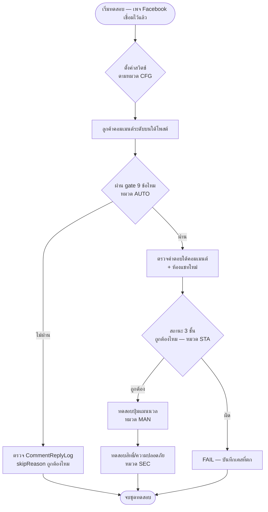

> **โมดูล:** 00038-CommentReply
> **ประเภทเอกสาร:** Test Case
> **เวอร์ชัน:** 1.0
> **วันที่จัดทำ:** 2026-08-08
> **สถานะ:** Draft — รอ user review
> **เจ้าของเอกสาร:** QA

# Test Case: ตอบกลับคอมเมนต์ (Comment Auto-Reply & Private Reply)

---

## 1. Overview

ชุดทดสอบนี้ครอบคลุมฟีเจอร์ "ตอบกลับคอมเมนต์" ทั้งหมด — ประเภททดสอบ functional (backend service +
API) และ browser-driven (UI ปุ่มแมนนวล/หน้าตั้งค่า/ชิปกรอง) แบ่งเป็น 5 หมวดตามที่ task brief ระบุ:
**ตั้งค่า (CFG) / อัตโนมัติ (AUTO) / แมนนวล (MAN) / สถานะ (STA) / สิทธิ์ (SEC)**

- **เอกสารต้นทาง:** [[BRD]] ของโมดูลนี้ (ทุก scenario trace กลับ AC-CR-01..30)
- **ขอบเขตชุดทดสอบ (Scope):** in-scope = Facebook Page เท่านั้น (ตามขอบเขต D-1 ของ design spec);
  out-of-scope = Instagram, กลุ่มคำ/AI, หน่วงเวลา (นอกขอบเขตของฟีเจอร์ทั้งหมด ไม่ใช่แค่นอกขอบเขต
  การทดสอบ)
- **สภาพแวดล้อม:** dev (`seller.deepth.local:4000`) ด้วยเพจ Facebook ทดสอบที่เชื่อมไว้แล้ว (มี
  `pages_messaging`/`pages_manage_engagement` — scope มีอยู่แล้วใน `CONNECT_SCOPES` ไม่ต้องเชื่อม
  เพจใหม่) + ข้อมูลจำลองที่ยิงผ่าน Prisma seed สำหรับเคสที่ต้องคุม `createdTime`/`isAutoReply`
  ตรง ๆ (เช่น เคสเกิน 7 วัน ไม่ต้องรอเวลาจริง)

---

## 2. Test Scenarios

### หมวด CFG — การตั้งค่า

### TC-CR-CFG-01: เห็นการ์ดครบทุกเพจที่เชื่อมและยังใช้งานอยู่

- **Linked to:** AC-CR-01 / FR-CR-01
- **Precondition:** ร้านเชื่อมเพจ Facebook ไว้ 2 เพจ (`status='ACTIVE'`) และมีอีก 1 เพจที่ถอดแล้ว
  (`status='DISCONNECTED'`)
- **Steps:**
  1. ล็อกอินร้าน เปิดเมนู "ตอบกลับคอมเมนต์"
  2. นับจำนวนการ์ดที่แสดง
- **Expected Result:** เห็นการ์ด 2 ใบ (เฉพาะเพจ `ACTIVE`) เพจที่ `DISCONNECTED` ไม่ปรากฏ

### TC-CR-CFG-02: สวิตช์ทั้ง 2 ของเพจใหม่ที่เพิ่งเชื่อม อยู่ในสถานะปิด

- **Linked to:** AC-CR-02 / FR-CR-01, FR-CR-02, FR-CR-03
- **Precondition:** เชื่อมเพจ Facebook ใหม่ (ยังไม่เคยตั้งค่าอะไร)
- **Steps:**
  1. เปิดหน้า "ตอบกลับคอมเมนต์"
  2. ดูสถานะสวิตช์ A และ B ของเพจที่เพิ่งเชื่อม
- **Expected Result:** สวิตช์ A และ B เป็น "ปิด" ทั้งคู่ (`commentPublicReplyEnabled=false`,
  `commentPrivateReplyEnabled=false` — ตรงกับ DB default)

### TC-CR-CFG-03: เปิดสวิตช์แล้วปล่อยข้อความว่าง กดบันทึกไม่ได้

- **Linked to:** AC-CR-03 / BR-CR-05
- **Precondition:** เพจ `ACTIVE` สวิตช์ A ปิดอยู่
- **Steps:**
  1. เปิดสวิตช์ A
  2. ปล่อยช่องข้อความว่าง
  3. กดบันทึก
- **Expected Result:** บันทึกไม่สำเร็จ — ขึ้นข้อความบอกว่าต้องกรอกข้อความก่อนเปิดสวิตช์นี้ (client);
  ถ้ายิง `PATCH` ตรง (ข้าม client validation) → 400 `VALIDATION_ERROR`

### TC-CR-CFG-04: ตั้งค่าเพจ A แล้วเพจ B ต้องไม่เปลี่ยนตาม

- **Linked to:** AC-CR-04 / BR-CR-01
- **Precondition:** ร้านมีเพจ A และเพจ B ที่ `ACTIVE` ทั้งคู่ สวิตช์ปิดทั้งคู่
- **Steps:**
  1. เปิดสวิตช์ A+B ของเพจ A พร้อมข้อความ แล้วบันทึก
  2. รีเฟรชหน้า ตรวจสวิตช์ของเพจ B
- **Expected Result:** เพจ B ยังปิดทั้งคู่เหมือนเดิม — `PATCH` ของเพจ A ไม่แตะแถว `ShopChannel` ของ
  เพจ B

### TC-CR-CFG-05: เพจที่โทเคนหมดอายุ — สวิตช์กดไม่ได้ + เห็นแถบเตือน

- **Linked to:** AC-CR-05 / BR-CR-06
- **Precondition:** เพจหนึ่ง `status='TOKEN_INVALID'`
- **Steps:**
  1. เปิดหน้า "ตอบกลับคอมเมนต์"
  2. ดูการ์ดของเพจนั้น
  3. ลองยิง `PATCH` ตรงพยายามเปิดสวิตช์ของเพจนี้
- **Expected Result:** UI แสดงแถบเตือนพร้อมปุ่มไปเชื่อมใหม่ สวิตช์ถูกปิดการใช้งาน (disabled);
  `PATCH` ตรง → 409 `CHANNEL_NOT_ACTIVE`

### TC-CR-CFG-06: ผู้ใช้ที่ไม่มีสิทธิ์เข้าถึงร้าน เปิดหน้านี้ไม่ได้

- **Linked to:** AC-CR-06 / FR-CR-01
- **Precondition:** user B ไม่ใช่สมาชิกของร้าน A
- **Steps:**
  1. login เป็น user B (active shop เป็นร้านอื่น หรือไม่มีร้าน)
  2. เข้า URL หน้า "ตอบกลับคอมเมนต์" ของร้าน A ตรง ๆ (ถ้าทำได้ทาง URL) หรือยิง
     `GET /api/shops/comment-reply/config` ด้วย session ของ user B ที่ active shop ไม่ใช่ร้าน A
- **Expected Result:** ไม่เห็นข้อมูลของร้าน A — endpoint คืนเฉพาะข้อมูลของ active shop ของ user B
  เอง (shop derive จาก session เสมอ ไม่รับ shopId จาก client) — ไม่มีทาง "ขอดู" ร้านอื่นได้เลยแม้จะ
  พยายามส่ง parameter ใด ๆ

### หมวด AUTO — การทำงานอัตโนมัติ

### TC-CR-AUTO-01: เปิดทั้ง 2 สวิตช์ → ได้คำตอบใต้คอมเมนต์ 1 อัน + ห้องแชทใหม่ 1 ห้อง

- **Linked to:** AC-CR-07 / FR-CR-05, FR-CR-06
- **Precondition:** เพจ `ACTIVE` เปิดสวิตช์ A+B พร้อมข้อความ
- **Steps:**
  1. ลูกค้าคอมเมนต์ระดับบนใต้โพสต์ 1 ครั้ง
  2. รอ webhook ประมวลผล (`after()`)
  3. ตรวจคอมเมนต์ในแท็บความคิดเห็น + ตรวจ `/inbox`
- **Expected Result:** มีคำตอบใต้คอมเมนต์ 1 อัน พร้อมป้าย "ตอบอัตโนมัติ"; มีห้องแชทใหม่ 1 ห้องใน
  `/inbox` ของลูกค้าคนนั้น; `CommentReplyLog` มี 1 แถว `trigger='AUTO'`,
  `publicReplyStatus='SENT'`, `privateReplyStatus='SENT'`

### TC-CR-AUTO-02: คนเดิมคอมเมนต์เพิ่มอีก 4 ครั้งบนโพสต์เดียวกัน → ตอบใต้คอมเมนต์ทุกใบ แต่ทักแชทใบเดียว

> **แก้ 2026-08-15** — เดิมเคสนี้คาดหวังว่า "ไม่มีคำตอบเพิ่ม + 4 แถว `skipReason='ALREADY_HANDLED'`"
> ซึ่ง **เป็นไปไม่ได้ทั้งสองข้อ**: กฎเดิมทำให้ลูกค้าที่กลับมาถามใหม่เงียบสนิท (user เจอเองบน prod)
> และค่า `ALREADY_HANDLED` เขียนลงฐานไม่ได้เลยเพราะชน partial unique index ตัวเดียวกับที่มันอธิบาย

- **Linked to:** AC-CR-08 / BR-CR-A2a + BR-CR-A2b
- **Precondition:** สืบเนื่องจาก TC-CR-AUTO-01 (ลูกค้าคนเดิมเคยถูกตอบแล้วบนโพสต์นี้)
- **Steps:**
  1. ลูกค้าคนเดิมคอมเมนต์เพิ่ม 4 ครั้งบนโพสต์เดียวกัน
  2. รอ webhook ประมวลผลแต่ละครั้ง
  3. ตรวจจำนวนคำตอบและข้อความ
- **Expected Result:** มีคำตอบใต้คอมเมนต์เพิ่ม **ครบทั้ง 4 ใบ** (BR-CR-A2a) แต่ **ไม่มีข้อความส่วนตัว
  เพิ่มแม้แต่ใบเดียว** (BR-CR-A2b) — `CommentReplyLog` มี 4 แถวใหม่ (`trigger='AUTO'`) ทุกแถว
  `publicReplyStatus='SENT'` · `privateReplyStatus='SKIPPED'` · `privateErrorMessage='ALREADY_SENT'`
  · `privateAttemptedAt IS NULL` (จองสิทธิ์ไม่ผ่านจึงไม่เคยถูกเขียน) และหน้าประวัติต้องแสดง
  "ทักคนนี้ไปแล้วก่อนหน้านี้" ใต้ป้าย "ข้าม" ของช่องทักแชท — **ห้ามเงียบ**

### TC-CR-AUTO-03: ลูกค้าคนเดิมไปคอมเมนต์บนโพสต์อื่น → ได้รับการตอบตามปกติ

- **Linked to:** AC-CR-09 / BR-CR-A2b
- **Precondition:** ลูกค้าคนเดิมจาก TC-CR-AUTO-01 (เคยถูกตอบบนโพสต์ A แล้ว)
- **Steps:**
  1. ลูกค้าคนเดิมคอมเมนต์บนโพสต์ B (คนละโพสต์)
  2. รอ webhook ประมวลผล
- **Expected Result:** ได้รับคำตอบ+ข้อความส่วนตัวตามปกติ (กฎกันซ้ำผูกกับคู่ (โพสต์, คน) ไม่ใช่คนตลอด
  กาล) — `CommentReplyLog` แถวใหม่ `publicReplyStatus='SENT'`, `privateReplyStatus='SENT'`

### TC-CR-AUTO-04: Meta ส่ง event ของคอมเมนต์เดิมซ้ำ → ไม่เกิดคำตอบ/ข้อความเพิ่ม

- **Linked to:** AC-CR-10 / NFR "ความถูกต้องของข้อมูล"
- **Precondition:** คอมเมนต์หนึ่งอันเพิ่งถูกตอบสำเร็จ (AUTO)
- **Steps:**
  1. จำลอง webhook เดิมยิงซ้ำ (เรียก `ingestFeedComment` + dispatch ด้วย payload/comment เดิม)
  2. ตรวจจำนวนคำตอบ/ข้อความ/แถว log
- **Expected Result:** ไม่มีคำตอบ/ข้อความใหม่ — partial unique index กันซ้ำ (P2002 ถูกจัดการเป็น
  "มีคนทำไปแล้ว" ไม่ throw ต่อให้ webhook พัง)

### TC-CR-AUTO-05: คนในทีมตอบคอมเมนต์ไปก่อนแล้ว → ระบบไม่ตอบทับ

- **Linked to:** AC-CR-11 / BR-CR-A3
- **Precondition:** เพจเปิดสวิตช์ A+B; คอมเมนต์ลูกค้าเข้ามาแล้วแอดมินกดปุ่ม "ตอบ" (public reply
  ด้วยมือ) ก่อนที่ `after()` จะเริ่มทำงาน
- **Steps:**
  1. จำลองลำดับเวลา: คนตอบ public reply ด้วยมือก่อน → แล้ว auto-reply dispatch ทำงาน
  2. ตรวจคำตอบที่ปรากฏใต้คอมเมนต์และแถว log
- **Expected Result:** ไม่มีคำตอบที่สองจากบอท — `CommentReplyLog` มีแถวที่ `skipReason='HUMAN_ANSWERED'`

### TC-CR-AUTO-06: reply ซ้อนใต้คอมเมนต์ของคนอื่น → ระบบไม่ตอบ

- **Linked to:** AC-CR-12 / BR-CR-A1
- **Precondition:** เพจเปิดสวิตช์ A+B; มีคอมเมนต์ระดับบนอยู่แล้ว 1 อัน
- **Steps:**
  1. ลูกค้าอีกคนพิมพ์ตอบ (reply) ใต้คอมเมนต์นั้น (ไม่ใช่คอมเมนต์ระดับบนใหม่)
  2. รอ webhook ประมวลผล
- **Expected Result:** ไม่มีการตอบ — `CommentReplyLog` มีแถว `skipReason='NOT_TOP_LEVEL'`

### TC-CR-AUTO-07: คอมเมนต์อายุเกิน 7 วัน เปิดทั้ง 2 สวิตช์ → ตอบใต้คอมเมนต์อย่างเดียว ไม่ทักแชท

- **Linked to:** AC-CR-13 / FR-CR-06, BR-CR-11
- **Precondition:** เพจเปิดสวิตช์ A+B; seed คอมเมนต์ที่ `createdTime` = 8 วันที่แล้ว (เพิ่งถูกดึงเข้า
  ระบบตอนนี้)
- **Steps:**
  1. trigger dispatch ของคอมเมนต์นี้ (จำลองว่าเพิ่งเข้ามาสด)
  2. ตรวจคำตอบใต้คอมเมนต์และห้องแชท
- **Expected Result:** มีคำตอบใต้คอมเมนต์ (public reply สำเร็จ); ไม่มีห้องแชทใหม่ —
  `CommentReplyLog` มี `publicReplyStatus='SENT'` และ `privateReplyStatus=null` (skip) กับ
  `skipReason='WINDOW_EXPIRED'`

### TC-CR-AUTO-08: ดึงคอมเมนต์เก่าเข้าระบบย้อนหลัง (backfill) → ไม่มีการตอบใด ๆ

- **Linked to:** AC-CR-14 / BR-CR-12, BR-CR-A4
- **Precondition:** โพสต์มีคอมเมนต์เก่าที่ไม่เคยอยู่ในระบบ; เพจเปิดสวิตช์ A+B
- **Steps:**
  1. เรียก `backfillPostComments(postId)` ตรง ๆ (เส้นทางที่ผู้ขายกด "ดึงคอมเมนต์เก่า")
  2. ตรวจว่ามีคำตอบ/ข้อความส่วนตัวเกิดขึ้นไหม และมีแถว `CommentReplyLog` ใหม่ไหม
- **Expected Result:** ไม่มีคำตอบ ไม่มีข้อความส่วนตัว ไม่มีแถว `CommentReplyLog` ใหม่เลย —
  `backfillPostComments()` ไม่เรียก auto-reply service ไม่ว่าทางใด

### TC-CR-AUTO-09: ปิดทั้ง 2 สวิตช์ → คอมเมนต์เข้ามาแล้วไม่มีอะไรเกิดขึ้น แต่คอมเมนต์เข้าระบบตามปกติ

- **Linked to:** AC-CR-15 / BR-CR §4.3
- **Precondition:** เพจ `ACTIVE` ปิดสวิตช์ทั้งคู่
- **Steps:**
  1. ลูกค้าคอมเมนต์ระดับบนใต้โพสต์
  2. รอ webhook ประมวลผล
  3. ตรวจแท็บความคิดเห็น
- **Expected Result:** คอมเมนต์ปรากฏในแท็บความคิดเห็นตามปกติ (feature 00029 เดิมไม่กระทบ); ไม่มี
  คำตอบ/ข้อความส่วนตัว — `CommentReplyLog` มีแถว `skipReason='DISABLED'`

### TC-CR-AUTO-10: ส่งไม่สำเร็จ → มีบันทึกพร้อมเหตุผล และไม่ยิงซ้ำเอง

- **Linked to:** AC-CR-16 / BR-CR-14, BR-CR-A6
- **Precondition:** เพจเปิดสวิตช์ B; จำลอง Graph API ปฏิเสธคำขอ `POST /me/messages` (เช่น token
  หมดอายุระหว่างทาง หรือ mock 4xx)
- **Steps:**
  1. ลูกค้าคอมเมนต์ระดับบน
  2. รอ webhook ประมวลผล — Graph ปฏิเสธ
  3. ตรวจแถว log และรอ webhook รอบถัดไป (คอมเมนต์เดิมไม่ยิงซ้ำเอง)
- **Expected Result:** `CommentReplyLog` มี `privateReplyStatus='FAILED'` + `errorMessage` ไม่ว่าง;
  ไม่มี retry อัตโนมัติเกิดขึ้น (ไม่มีแถว log ที่สองของคอมเมนต์เดียวกันจากระบบเอง)

### หมวด MAN — การทักด้วยมือ

### TC-CR-MAN-01: ปิดสวิตช์อัตโนมัติทั้งหมด → ปุ่ม "ทักแชท" ยังกดได้ปกติ

- **Linked to:** AC-CR-17 / BR-CR-15, BR-CR-M3
- **Precondition:** เพจปิดสวิตช์ A+B ทั้งคู่; มีคอมเมนต์ลูกค้าที่ยังไม่เกิน 7 วัน
- **Steps:**
  1. เปิดแท็บความคิดเห็น หาคอมเมนต์นั้น
  2. ดูปุ่ม "ทักแชท"
- **Expected Result:** ปุ่มกดได้ปกติ (ไม่ disabled) แม้สวิตช์อัตโนมัติปิดทั้งหมด

### TC-CR-MAN-02: กดปุ่ม → เปิดกล่องพิมพ์ ไม่มีการส่งจนกว่าจะกดยืนยัน

- **Linked to:** AC-CR-18 / FR-CR-10, BR-CR-M4
- **Precondition:** คอมเมนต์ที่ยังทักได้ (ยังไม่เกิน 7 วัน ยังไม่เคยทัก)
- **Steps:**
  1. กดปุ่ม "ทักแชท"
  2. สังเกตว่ามีการยิง request ทันทีไหม
  3. พิมพ์ข้อความในกล่อง แล้วปิดกล่องโดยไม่กดส่ง (กด "ยกเลิก")
- **Expected Result:** เปิดกล่องพิมพ์ ไม่มี network request ส่งออกจนกว่าจะกดยืนยัน; ปิดกล่องด้วย
  "ยกเลิก" → ไม่มีข้อความถูกส่ง ไม่มีแถว `CommentReplyLog` ใหม่

### TC-CR-MAN-03: ส่งสำเร็จ → ปุ่มเปลี่ยนเป็น "ทักแล้ว" ทันทีโดยไม่ต้องรีเฟรชหน้า + มีลิงก์เข้าห้องแชท

- **Linked to:** AC-CR-19 / FR-CR-09
- **Precondition:** คอมเมนต์ที่ยังทักได้
- **Steps:**
  1. กดปุ่ม "ทักแชท" → พิมพ์ข้อความ → กดส่ง
  2. สังเกตปุ่มทันทีหลัง response กลับมา (ไม่ต้อง reload หน้า)
- **Expected Result:** ปุ่มเปลี่ยนเป็น "ทักแล้ว" + แสดงลิงก์ "เปิดห้องแชท" ที่คลิกแล้วพาไปห้องที่ถูก
  สร้าง (optimistic update จาก response `{conversationId, sentAt}` — ไม่ใช่รอ refetch)

### TC-CR-MAN-04: กดปุ่มของคอมเมนต์ที่ทักไปแล้ว → กดไม่ได้

- **Linked to:** AC-CR-20 / BR-CR-M1
- **Precondition:** คอมเมนต์ที่ถูกทัก (MANUAL) ไปแล้วสำเร็จ
- **Steps:**
  1. รีโหลดหน้าแท็บความคิดเห็น
  2. ดูปุ่มของคอมเมนต์นั้น
  3. ลองยิง `POST .../private-reply` ตรงอีกครั้งด้วย `commentId` เดิม
- **Expected Result:** UI แสดงปุ่ม "ทักแล้ว" (disabled); ยิง API ตรง → 409 `ALREADY_SENT`

### TC-CR-MAN-05: คอมเมนต์อายุเกิน 7 วัน → ปุ่มกดไม่ได้ พร้อมเหตุผล

- **Linked to:** AC-CR-21 / BR-CR-11
- **Precondition:** คอมเมนต์อายุเกิน 7 วัน ยังไม่เคยถูกทัก
- **Steps:**
  1. เปิดแท็บความคิดเห็น หาคอมเมนต์นี้
  2. ดูปุ่ม "ทักแชท"
  3. ยิง `POST .../private-reply` ตรง
- **Expected Result:** UI แสดง "หมดเวลาทักแชท" (disabled, ไม่มีตัวเลือกให้กด); API ตรง → 409
  `WINDOW_EXPIRED`

### TC-CR-MAN-06: คนเดียวกันคอมเมนต์ 2 ครั้งบนโพสต์เดียว → กดทักได้ทั้ง 2 คอมเมนต์

- **Linked to:** AC-CR-22 / BR-CR-19, BR-CR-M2
- **Precondition:** ลูกค้าคนเดียวกันคอมเมนต์ 2 ครั้งบนโพสต์เดียวกัน ทั้งคู่ยังไม่ถูกทัก
- **Steps:**
  1. กดปุ่ม "ทักแชท" ของคอมเมนต์ที่ 1 → ส่งสำเร็จ
  2. กดปุ่ม "ทักแชท" ของคอมเมนต์ที่ 2 (คนเดิม โพสต์เดิม) → ส่ง
- **Expected Result:** ทั้ง 2 คอมเมนต์ส่งสำเร็จ ไม่ชนกัน — กฎ "1 ครั้ง/คน/โพสต์" ไม่ใช้กับ MANUAL
  (unique index MANUAL ผูกกับ `commentId` ไม่ใช่ `(postId, fromExternalId)`)

### TC-CR-MAN-07: บอททักไปแล้วบนคอมเมนต์นั้น → ปุ่มของคอมเมนต์นั้นขึ้น "ทักแล้ว" ไม่ให้กดซ้ำ

- **Linked to:** AC-CR-23 / BR-CR-M5
- **Precondition:** เพจเปิดสวิตช์ B; คอมเมนต์ถูกบอททักสำเร็จแล้ว (`trigger='AUTO'`)
- **Steps:**
  1. เปิดแท็บความคิดเห็น หาคอมเมนต์นั้น
  2. ดูปุ่ม "ทักแชท"
  3. ลองยิง `POST .../private-reply` ตรงด้วย `commentId` เดียวกัน
- **Expected Result:** ปุ่มขึ้น "ทักแล้ว" (disabled) ทั้งที่คนไม่เคยกดเอง; API ตรง → 409
  `ALREADY_SENT` (สิทธิ์ของ Meta ผูกกับคอมเมนต์ ไม่สนว่าใครใช้ไปก่อน)

### หมวด STA — การมองเห็น/สถานะ

### TC-CR-STA-01: บอทตอบคอมเมนต์ไปแล้ว → ขึ้นสถานะ "บอทตอบแล้ว" ไม่ใช่ "คนตอบแล้ว"

- **Linked to:** AC-CR-24 / BR-CR-20, BR-CR-S1
- **Precondition:** คอมเมนต์ถูกบอทตอบใต้คอมเมนต์สำเร็จ (public reply, `isAutoReply=true`)
- **Steps:**
  1. เปิดแท็บความคิดเห็น หาคอมเมนต์นี้
  2. ดูสถานะที่แสดง
- **Expected Result:** สถานะ = "บอทตอบแล้ว" (ไม่ใช่ "คนตอบแล้ว")

### TC-CR-STA-02: บอทตอบทุกคอมเมนต์ในโพสต์ → badge แท็บไม่นับโพสต์นั้น แต่ยังกรองเจอในชิป "บอทตอบแล้ว"

- **Linked to:** AC-CR-25 / BR-CR-21, BR-CR-S2, BR-CR-S3
- **Precondition:** โพสต์หนึ่งมีคอมเมนต์ 3 อัน — บอทตอบครบทั้ง 3 อัน (ไม่มีคนตอบเลย)
- **Steps:**
  1. ดูตัวเลข badge บนแท็บ "ความคิดเห็น"
  2. กดชิป "บอทตอบแล้ว" — ดูว่าโพสต์นี้ปรากฏไหม
  3. กดชิป "ยังไม่ตอบ" — ดูว่าโพสต์นี้หายไปไหม
- **Expected Result:** badge แท็บ**ไม่**นับโพสต์นี้ (เพราะไม่มีคอมเมนต์ "ยังไม่ตอบ" เหลือเลย); ชิป
  "บอทตอบแล้ว" แสดงโพสต์นี้; ชิป "ยังไม่ตอบ" ไม่แสดงโพสต์นี้

### TC-CR-STA-03: คนเข้าไปตอบคอมเมนต์ที่บอทตอบไว้แล้ว → สถานะเปลี่ยนเป็น "คนตอบแล้ว"

- **Linked to:** AC-CR-26 / BR-CR-S1
- **Precondition:** คอมเมนต์ที่มีคำตอบของบอทอยู่แล้ว (`isAutoReply=true`)
- **Steps:**
  1. แอดมินกดปุ่ม "ตอบ" แล้วพิมพ์คำตอบเพิ่ม (public reply ด้วยมือ)
  2. ดูสถานะของคอมเมนต์นี้หลังส่ง
- **Expected Result:** สถานะเปลี่ยนเป็น "คนตอบแล้ว" — เพราะตอนนี้มีคำตอบลูกที่ `isAutoReply=false`
  อย่างน้อย 1 อัน แม้คำตอบของบอทยังอยู่ในเธรดก็ตาม

### TC-CR-STA-04: ตัวเลขบนชิปทั้ง 3 รวมกัน = ตัวเลขชิป "ทั้งหมด" เสมอ

- **Linked to:** AC-CR-27 / BR-CR-S4
- **Precondition:** ร้านมีโพสต์คละสถานะ (บางโพสต์ยังไม่ตอบ, บาง "บอทตอบแล้ว", บาง "คนตอบแล้ว")
- **Steps:**
  1. เปิดแท็บความคิดเห็น อ่านตัวเลขบนชิปทั้ง 4 ตัว
  2. รวมตัวเลขชิป "ยังไม่ตอบ" + "บอทตอบแล้ว" + "คนตอบแล้ว"
- **Expected Result:** ผลรวม = ตัวเลขชิป "ทั้งหมด" พอดี ไม่มีโพสต์ตกหล่นหรือถูกนับซ้ำ

### TC-CR-STA-05: กดชิปใดก็ตาม → จำนวนรายการที่เห็นตรงกับตัวเลขบนชิปนั้น

- **Linked to:** AC-CR-28 / BR-CR-S4
- **Precondition:** เหมือน TC-CR-STA-04
- **Steps:**
  1. กดชิป "บอทตอบแล้ว"
  2. นับจำนวนโพสต์ที่แสดงในรายการ เทียบกับตัวเลขบนชิป
  3. ทำซ้ำกับชิป "คนตอบแล้ว" และ "ยังไม่ตอบ"
- **Expected Result:** จำนวนรายการที่เห็นตรงกับตัวเลขบนชิปทุกครั้ง (ตัวนับและตัวกรองมาจาก symbol
  เดียวกัน — ไม่ใช่คนละ query)

### TC-CR-STA-06: ป้าย "ตอบอัตโนมัติ" ต้องยังอยู่หลังรีเฟรชและหลัง Facebook ส่งข้อมูลชุดเดิมกลับเข้ามา

- **Linked to:** AC-CR-29 / TD-003 (SDS)
- **Precondition:** คำตอบของบอทถูกสร้างแล้ว (`isAutoReply=true`)
- **Steps:**
  1. รีเฟรชหน้า — ตรวจป้าย "ตอบอัตโนมัติ" ยังอยู่
  2. จำลอง webhook echo ของคำตอบบอทอันนี้ยิงเข้ามาซ้ำ (`ingestFeedComment` กับ
     `externalCommentId` เดียวกัน, `verb='edited'` หรือ event ปกติ)
  3. ตรวจ `isAutoReply` ของแถวนี้อีกครั้ง
- **Expected Result:** ป้าย "ตอบอัตโนมัติ" ยังอยู่ทั้งสองครั้ง — `isAutoReply` ยังเป็น `true` ไม่ถูก
  webhook เขียนทับเป็น `false`

### TC-CR-STA-07: ห้องที่เกิดจากการทัก → เห็นในกล่องข้อความ และไม่ถูกนับเป็นยังไม่อ่าน

- **Linked to:** AC-CR-30 / FR-CR-14, BR-CR-23
- **Precondition:** private reply เพิ่งถูกส่งสำเร็จ (AUTO หรือ MANUAL)
- **Steps:**
  1. เปิด `/inbox` ทันทีหลังส่งสำเร็จ (ไม่ต้องรอ)
  2. ดูว่าห้องปรากฏไหม และมี badge "ยังไม่อ่าน" ไหม
  3. จำลองลูกค้าตอบกลับในห้องนั้น แล้วดูอีกครั้ง
- **Expected Result:** ห้องปรากฏใน `/inbox` ทันที **ไม่มี** badge ยังไม่อ่าน; หลังลูกค้าตอบกลับ →
  ห้องขึ้น badge ยังไม่อ่านตามปกติ (unread กลไกเดิมของระบบแชท ไม่ถูกงานนี้เปลี่ยนพฤติกรรม)

### หมวด SEC — สิทธิ์และความปลอดภัย

### TC-CR-SEC-01: ผู้ใช้นอกร้านเรียก config endpoint ตรง → ไม่เห็นข้อมูลร้านอื่น

- **Linked to:** AC-CR-06 / BRD §6.4
- **Precondition:** user B ไม่ใช่สมาชิกร้าน A
- **Steps:**
  1. login เป็น user B
  2. ยิง `GET /api/shops/comment-reply/config` และ `GET /api/shops/comment-reply/logs`
- **Expected Result:** คืนข้อมูลของร้านที่ user B เป็นสมาชิกอยู่เท่านั้น (หรือรายการว่างถ้าไม่มีร้าน)
  ไม่มีทางเห็นข้อมูลของร้าน A ไม่ว่าจะพยายามส่ง parameter ใด ๆ (shop derive จาก session)

### TC-CR-SEC-02: token เพจไม่ปรากฏใน response ของทั้ง 3 endpoint

- **Linked to:** BRD §6.4 ("โทเคนของเพจต้องไม่ถูกส่งออกไปยังหน้าจอผู้ใช้")
- **Precondition:** เพจที่มีค่า `accessTokenEnc` จริง
- **Steps:**
  1. ยิง `GET /api/shops/comment-reply/config`, `GET /api/shops/comment-reply/logs`,
     `POST .../private-reply` ทีละตัว
  2. ตรวจ response body ทั้งหมด (raw JSON) หาคำว่า `accessTokenEnc` หรือค่าที่หน้าตาเหมือน token
- **Expected Result:** ไม่มี `accessTokenEnc` หรือค่า token ใด ๆ ปรากฏใน response ทั้ง 3 endpoint

### TC-CR-SEC-03: ปุ่มแมนนวลกับ `commentId` ของร้านอื่น → ปฏิเสธ

- **Linked to:** BRD §6.4
- **Precondition:** `commentId` เป็นของคอมเมนต์ในเพจของร้าน A; ผู้เรียกคือ user ของร้าน B
- **Steps:**
  1. login เป็น user ของร้าน B
  2. ยิง `POST /api/chat/comments/<commentId ของร้าน A>/private-reply`
- **Expected Result:** 403 `FORBIDDEN` (หรือ 404 ถ้าออกแบบให้ไม่เปิดเผยว่า comment มีอยู่จริง — ต้อง
  ไม่ใช่ 200 ไม่ว่ากรณีใด)

### TC-CR-SEC-04: PATCH config ส่ง field แปลกปลอมเข้ามา → ถูกกรองทิ้ง ไม่กระทบคอลัมน์อื่น

- **Linked to:** BRD §6.4 (mass-assignment ระดับเดียวกับที่เคยพบใน `PATCH /api/users/me`)
- **Precondition:** เพจ `ACTIVE`
- **Steps:**
  1. ยิง `PATCH /api/shops/comment-reply/config` พร้อมฟิลด์แปลกปลอม เช่น `{"shopChannelId":"...",
     "accessTokenEnc":"ปลอม", "status":"ACTIVE"}`
  2. ตรวจแถว `ShopChannel` ในฐานหลังเรียก
- **Expected Result:** `accessTokenEnc`/`status`/ฟิลด์อื่นนอก allow-list ของ Valibot schema ไม่ถูก
  เขียนทับ — เปลี่ยนแค่ 4 คอลัมน์ที่ schema อนุญาต (`comment*Enabled`/`comment*Text`)

### TC-CR-SEC-05: เมนู "ตอบกลับคอมเมนต์" มองเห็นได้ทุก vertical

- **Linked to:** SRS TFR-012 / SDS TD-005
- **Precondition:** ร้าน 3 ร้าน — `vertical` เป็น `ONLINE_SALES`, `SERVICE_QUEUE`, `LODGING` ตามลำดับ
- **Steps:**
  1. login แต่ละร้าน ดูเมนูกลุ่ม CHAT
- **Expected Result:** เมนู "ตอบกลับคอมเมนต์" ปรากฏในทั้ง 3 vertical เหมือนเมนู "ข้อความ"/"ตอบกลับ
  อัตโนมัติ" ข้างเคียง — ไม่หายไปใน vertical ใดเลย

---

## 3. Traceability Matrix

| AC / FR ใน [[BRD]] | Test Case | ครอบคลุมหรือไม่ |
|---------------------|-----------|------------------|
| AC-CR-01 | TC-CR-CFG-01 | Yes |
| AC-CR-02 | TC-CR-CFG-02 | Yes |
| AC-CR-03 | TC-CR-CFG-03 | Yes |
| AC-CR-04 | TC-CR-CFG-04 | Yes |
| AC-CR-05 | TC-CR-CFG-05 | Yes |
| AC-CR-06 | TC-CR-CFG-06, TC-CR-SEC-01 | Yes |
| AC-CR-07 | TC-CR-AUTO-01 | Yes |
| AC-CR-08 | TC-CR-AUTO-02 | Yes |
| AC-CR-09 | TC-CR-AUTO-03 | Yes |
| AC-CR-10 | TC-CR-AUTO-04 | Yes |
| AC-CR-11 | TC-CR-AUTO-05 | Yes |
| AC-CR-12 | TC-CR-AUTO-06 | Yes |
| AC-CR-13 | TC-CR-AUTO-07 | Yes |
| AC-CR-14 | TC-CR-AUTO-08 | Yes |
| AC-CR-15 | TC-CR-AUTO-09 | Yes |
| AC-CR-16 | TC-CR-AUTO-10 | Yes |
| AC-CR-17 | TC-CR-MAN-01 | Yes |
| AC-CR-18 | TC-CR-MAN-02 | Yes |
| AC-CR-19 | TC-CR-MAN-03 | Yes |
| AC-CR-20 | TC-CR-MAN-04 | Yes |
| AC-CR-21 | TC-CR-MAN-05 | Yes |
| AC-CR-22 | TC-CR-MAN-06 | Yes |
| AC-CR-23 | TC-CR-MAN-07 | Yes |
| AC-CR-24 | TC-CR-STA-01 | Yes |
| AC-CR-25 | TC-CR-STA-02 | Yes |
| AC-CR-26 | TC-CR-STA-03 | Yes |
| AC-CR-27 | TC-CR-STA-04 | Yes |
| AC-CR-28 | TC-CR-STA-05 | Yes |
| AC-CR-29 | TC-CR-STA-06 | Yes |
| AC-CR-30 | TC-CR-STA-07 | Yes |
| BRD §6.4 (ความปลอดภัย) | TC-CR-SEC-02, TC-CR-SEC-03, TC-CR-SEC-04 | Yes |
| SRS TFR-012 / SDS TD-005 | TC-CR-SEC-05 | Yes |

> ทุก AC ใน [[BRD]] (AC-CR-01..30) ปรากฏในตารางนี้ครบและมี TC อย่างน้อย 1 รายการ

---

## 4. Flow

---

## 5. ผลล่าสุด

| Run | วันที่ | ผล (Pass/Fail/Blocked) | ผู้ทดสอบ (Tester) |
|-----|--------|--------------------------|---------------------|
| — | — | ยังไม่เคยรัน — รอ Task 2-6 (implementation) เสร็จก่อน | — |

---

## 6. สรุป (Summary)

เอกสาร Test Case นี้กำหนด **ชุดเคสทดสอบ 35 เคส** ของ **ตอบกลับคอมเมนต์ (Comment Auto-Reply &
Private Reply)** แบ่ง 5 หมวด (CFG 6, AUTO 10, MAN 7, STA 7, SEC 5) ที่ trace กลับ Acceptance
Criteria ใน [[BRD]] ทุกข้อ (AC-CR-01..30) เพื่อให้มั่นใจว่าทุกข้อกำหนดเชิงธุรกิจถูกทดสอบครบ ก่อน
mark feature นี้ complete

**Open Questions:**
- ไม่มี — รอเพียงให้ implementation (Task 2-6) เสร็จก่อนเริ่มรันชุดทดสอบจริง

---

## 7. ส่วนขยาย 2026-08-15 — แทรกชื่อลูกค้าด้วย `{ชื่อ}` (BR-CR-15 / BR-CR-A7)

### TC-CR-NAME-01: ข้อความมี `{ชื่อ}` + คอมเมนต์มีชื่อ → แทนทั้ง 2 ช่องทาง
- **Precondition:** เปิดทั้ง 2 สวิตช์ · ข้อความสาธารณะ `แอดมิน {ชื่อ} ขออนุญาติทักไปให้ข้อมูลนะคะ`
- **Steps:** ลูกค้าชื่อ `Jiravut Sungkakul` คอมเมนต์ระดับบน → รอ webhook
- **Expected Result:** คอมเมนต์ตอบกลับอ่านว่า `แอดมิน Jiravut Sungkakul ขออนุญาติทักไปให้ข้อมูลนะคะ`
  และข้อความทักแชทก็แทนชื่อเช่นกัน — **ห้ามมีคำว่า `{ชื่อ}` โผล่ในคอมเมนต์สาธารณะเด็ดขาด**

### TC-CR-NAME-02: คอมเมนต์ที่อ่านชื่อไม่ได้ → ตัด `{ชื่อ}` ทิ้ง ไม่เหลือช่องว่างประหลาด
- **Precondition:** เหมือน NAME-01 แต่คอมเมนต์ไม่มี `fromName` (คอมเมนต์ที่ดึงย้อนหลังผ่าน Graph)
- **Expected Result:** `แอดมิน ขออนุญาติทักไปให้ข้อมูลนะคะ` — ช่องว่างเหลือช่องเดียว และถ้าข้อความ
  เป็น 2 ย่อหน้าคั่นบรรทัดว่าง ย่อหน้าต้องยังแยกกันเหมือนเดิม

### TC-CR-NAME-03: ข้อความมีแต่ `{ชื่อ}` + ไม่มีชื่อ → ไม่ส่งอะไรเลย
- **Expected Result:** ไม่มีคอมเมนต์ตอบกลับ ไม่มี DM · `CommentReplyLog` แถวใหม่
  `skipReason='DISABLED'` (ห้ามยิงข้อความเปล่าออกไปหา Meta และห้ามได้แถวเปล่าที่ไม่มีเหตุผล)

### TC-CR-NAME-04: ปุ่ม "แทรกชื่อลูกค้า" ในหน้าตั้งค่า
- **Steps:** วางเคอร์เซอร์กลางข้อความ → กดปุ่ม
- **Expected Result:** `{ชื่อ}` ถูกแทรก **ตรงตำแหน่งเคอร์เซอร์** (ไม่ใช่ต่อท้ายเสมอ) · โฟกัสกลับไป
  อยู่ที่ช่องพิมพ์ · เคอร์เซอร์อยู่ถัดจากคำที่เพิ่งแทรก · ตัวนับตัวอักษรขยับตาม

### TC-CR-NAME-05: ปุ่ม "ทักแชท" แบบแมนนวล → ช่องพิมพ์ต้อง prefill ชื่อจริง ไม่ใช่ `{ชื่อ}`
- **Expected Result:** โมดัลเปิดมาพร้อมข้อความที่แทนชื่อคนที่กำลังจะทักแล้ว

---

## 8. ส่วนขยาย E2 (2026-08-15) — กฎตอบตามคีย์เวิร์ด

### TC-CR-RULE-01: คอมเมนต์เข้ากฎ → ใช้ข้อความของกฎ ไม่ใช่ข้อความตั้งต้นของเพจ
- **Precondition:** เพจเปิดทั้ง 2 สวิตช์ · มีกฎ "ถามราคา" จับคำ `ราคา` ตอบใต้คอมเมนต์ว่า `1,500 บาท`
- **Steps:** ลูกค้าคอมเมนต์ `ชุดนี้ราคาเท่าไหร่ครับ`
- **Expected:** คอมเมนต์ตอบกลับคือ `1,500 บาท` · `CommentReplyLog.matchedRuleId` = id ของกฎนั้น

### TC-CR-RULE-02: ไม่เข้ากฎไหนเลย → ยังได้ข้อความตั้งต้นเหมือนเดิม
- **Expected:** พฤติกรรมเดิมทุกประการ · `matchedRuleId` = `NULL` (ร้านที่ไม่ได้ตั้งกฎต้องไม่รู้สึกว่าอะไรเปลี่ยน)

### TC-CR-RULE-03: กฎเจาะจงเพจ ชนะกฎ "ทุกเพจ" แม้ priority ต่ำกว่า
- **Precondition:** กฎ A (ทุกเพจ, priority 999) · กฎ B (เพจนี้, priority 1) จับคำเดียวกัน
- **Expected:** ได้คำตอบของ **กฎ B** — ถ้าได้ A แปลว่าตัวเลือก "ต่อเพจ" บนหน้าจอไม่มีความหมาย

### TC-CR-RULE-04: กฎสั่งเฉพาะช่องเดียว → อีกช่องต้องเงียบ (D-EXT2-4)
- **Precondition:** กฎกรอกเฉพาะ "ตอบใต้คอมเมนต์" · เพจเปิดสวิตช์ทักแชทไว้และมีข้อความตั้งต้น
- **Expected:** ตอบใต้คอมเมนต์อย่างเดียว **ไม่มีข้อความทักแชท** — ถ้ายังทักแปลว่าฝั่งนั้นตกกลับไปใช้
  ข้อความตั้งต้นของเพจ ซึ่งตรงข้ามกับสิ่งที่ร้านสั่งไว้

### TC-CR-RULE-05: กฎไม่ใช่ทางลัดข้ามสวิตช์หลัก
- **Precondition:** ปิดสวิตช์ "ตอบใต้คอมเมนต์" ของเพจ · มีกฎที่กรอกข้อความสาธารณะไว้
- **Expected:** **ไม่ตอบใต้คอมเมนต์** (ฝั่งทักแชทที่ยังเปิดอยู่ทำงานตามปกติ) — ปิดฟีเจอร์แล้วต้องเงียบจริง

### TC-CR-RULE-06: คอมเมนต์ที่ไม่มีข้อความ (แท็กเพื่อน/สติกเกอร์) ต้องไม่เข้ากฎไหน
- **Expected:** ตกไปใช้ข้อความตั้งต้นตามปกติ ห้ามเข้ากฎ (บน prod มีเคสนี้ 22 ใบ)

### TC-CR-RULE-07: บันทึกกฎที่ไม่กรอกคำตอบสักช่อง → ต้องบันทึกไม่ผ่าน
- **Expected:** 400 `NOTHING_TO_SEND` — กฎที่ match แล้วไม่ทำอะไรจะกินคอมเมนต์ไปจาก fallback ด้วย

### TC-CR-RULE-08: สิทธิ์ — แก้/ลบกฎของร้านอื่นด้วย ruleId ที่เดาได้
- **Steps:** ล็อกอินร้าน A แล้วยิง `PATCH/DELETE /api/shops/comment-reply/rules/{ruleId ของร้าน B}`
- **Expected:** **404** ทั้งคู่ (ไม่บอกว่า id นี้มีอยู่จริงไหม) และข้อมูลร้าน B ไม่เปลี่ยน

### TC-CR-RULE-09: ผูกกฎกับเพจของร้านอื่น
- **Steps:** สร้างกฎโดยส่ง `shopChannelId` ของเพจร้านอื่น
- **Expected:** 404 `CHANNEL_NOT_FOUND`
