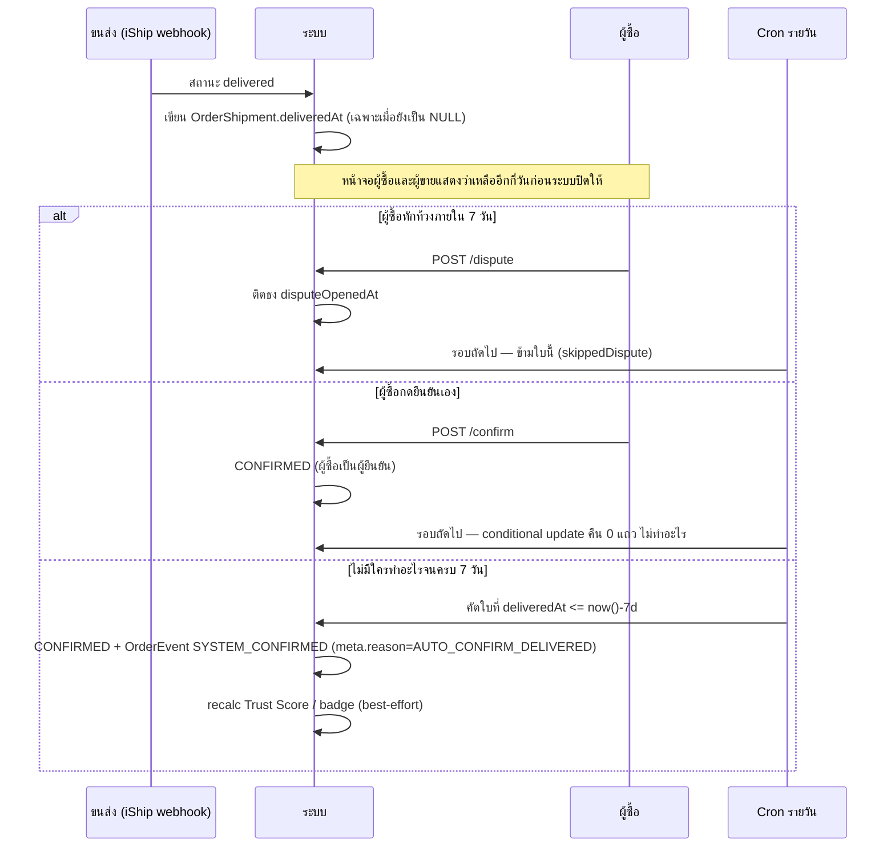

> **โมดูล:** M39-OrderSuccessMetrics · **เวอร์ชัน:** 1.0 · **สถานะ:** Draft

# API Contract: ตัวชี้วัดความสำเร็จของคำสั่งซื้อ

---

## 1. Overview

ฟีเจอร์นี้ **แก้ endpoint เดิม 1 ตัว · เพิ่มใหม่ 3 ตัว** ไม่มีการเปลี่ยน response shape ที่ทำให้ client เดิมพัง (ทั้งหมด additive ยกเว้นข้อบังคับ `reason` ที่จงใจให้ breaking — ดู §4.1)

| ประเภท | Endpoint |
|---|---|
| แก้ของเดิม | `POST /api/orders/[token]/cancel` |
| ใหม่ (ผู้ซื้อ) | `POST /api/orders/[token]/dispute` |
| ใหม่ (ผู้ขาย/แอดมิน) | `POST /api/orders/[token]/dispute/resolve` |
| ใหม่ (ระบบ) | `GET /api/cron/auto-confirm-delivered` |

---

## 2. Authentication

| Endpoint | ผู้เรียก | วิธียืนยัน |
|---|---|---|
| `cancel` (initiator=seller) | ผู้ขาย/ทีมงาน | NextAuth session + ตรวจสิทธิ์ร้านตาม pattern เดิมของ route นี้ |
| `cancel` (initiator=buyer) · `dispute` | ผู้ซื้อ | ต้องผ่าน `resolveOrderAccess()` ของใบนั้นก่อน (cookie จาก phone-unlock / session ที่ผูกกับออเดอร์) — **ตรวจที่เซิร์ฟเวอร์ ไม่ใช่แค่ซ่อนปุ่ม** |
| `dispute/resolve` | ผู้ขาย/แอดมิน | NextAuth session + สิทธิ์ร้าน |
| `cron/auto-confirm-delivered` | Vercel Cron | header ลับตาม pattern เดียวกับ cron ที่มีอยู่แล้ว 5 ตัว (`inventory-renewal` ฯลฯ) — ต้องปฏิเสธคำขอจากภายนอก |

ทุก endpoint อยู่ใต้ `guardApi` เดิมใน `src/proxy.ts` (Origin-check + rate-limit) อยู่แล้ว ไม่ต้องทำเพิ่ม

---

## 3. Endpoint List

| Method | Path | ใคร | ทำอะไร | รองรับ FR |
|---|---|---|---|---|
| `POST` | `/api/orders/[token]/cancel` | ผู้ขาย / ผู้ซื้อ | ยกเลิกออเดอร์ + บันทึกเหตุผล | FR-OSM-04, FR-OSM-06 |
| `POST` | `/api/orders/[token]/dispute` | ผู้ซื้อ | เปิดเรื่องว่ายังไม่ได้ของ/ของไม่ตรง | FR-OSM-01 (กันปิดอัตโนมัติ) |
| `POST` | `/api/orders/[token]/dispute/resolve` | ผู้ขาย / แอดมิน | ปิดเรื่อง ให้ระบบกลับมาปิดงานได้ | FR-OSM-01 |
| `GET` | `/api/cron/auto-confirm-delivered` | Vercel Cron | ปิดใบที่ส่งถึงเกิน 7 วัน | FR-OSM-01 |

---

## 4. Endpoint Detail

### 4.1 `POST /api/orders/[token]/cancel` (แก้ของเดิม)

**เปลี่ยนอะไร:** เดิม `reason` เป็น optional และถูกใช้เฉพาะเมื่อ `order.type === 'BOOKING'` (`order.service.ts:945-953`) → ตอนนี้ **บังคับทุกประเภท** เมื่อผู้เรียกเป็นผู้ขาย

**Request**
```jsonc
{
  "reason": "BUYER_NO_PAYMENT"   // บังคับเมื่อ initiator=seller · ห้ามส่งเมื่อ initiator=buyer (ระบบตั้งให้เอง)
}
```

**ค่า `reason` ที่รับได้ — แยกชุดตาม `Shop.vertical` ของร้านเจ้าของออเดอร์**

| `Shop.vertical` | ค่าที่รับได้ |
|---|---|
| `ONLINE_SALES` | `BUYER_NO_PAYMENT` · `BUYER_REQUESTED` · `SHOP_ISSUE` · `MUTUAL` |
| `SERVICE_QUEUE` | `BUYER_NO_SHOW` · `BUYER_REQUESTED` · `SHOP_ISSUE` · `MUTUAL` |
| `LODGING` | ใช้ชุดเดิมของระบบจอง (`BUYER_NO_TRANSFER` · `BUYER_REQUESTED` · `SHOP_ISSUE` · `MUTUAL`) — **ไม่เปลี่ยน** |

🛑 **ค่าที่ส่งมาต้องตรงกับชุดของ vertical นั้น** ส่ง `BUYER_NO_SHOW` ให้ร้าน `ONLINE_SALES` = `400 INVALID_CANCEL_REASON` — ตรวจแบบ allow-list ไม่ใช่ deny-list (`docs/conventions/enum-value-removal.md`)

🛑 **`reason` ไม่มีผลต่อการคำนวณอัตราสำเร็จ** (BR-OSM-05) — เก็บเป็นประวัติล้วน การตัดตัวหารตัดสินจาก `cancelInitiator` + สถานะขนส่งเท่านั้น

**Response 200**
```jsonc
{ "status": "CANCELLED", "cancelInitiator": "seller", "cancelReason": "BUYER_NO_PAYMENT" }
```

**Breaking change ที่ตั้งใจ:** client เดิมที่เรียกโดยไม่ส่ง `reason` จะได้ `400` — จงใจ เพราะการปล่อยให้ยกเลิกโดยไม่มีเหตุผลคือสาเหตุที่วันนี้เราตอบร้านไม่ได้ว่าใบไหนเกิดอะไรขึ้น จุดเรียกที่ต้องแก้พร้อมกัน: `OrderDetailClient.tsx` (`handleCancelOrder`) และหน้าที่ผู้ซื้อกด (ใหม่)

---

### 4.2 `POST /api/orders/[token]/dispute` (ใหม่)

ผู้ซื้อแจ้งว่ายังไม่ได้ของ หรือของไม่ตรง — **ไม่เปลี่ยนสถานะออเดอร์** แค่ติดธงกันการปิดอัตโนมัติ

**Request**
```jsonc
{ "note": "ยังไม่ได้รับของเลยครับ ขนส่งบอกส่งแล้ว" }   // optional, ≤500 ตัวอักษร
```

**Response 200**
```jsonc
{ "disputeOpenedAt": "2026-08-10T03:12:00.000Z" }
```

**กติกา**
- เรียกซ้ำเมื่อมีเรื่องเปิดค้างอยู่แล้ว → `200` idempotent คืนเวลาเดิม ไม่สร้างซ้ำ
- ออเดอร์ที่ `CONFIRMED` หรือ `CANCELLED` ไปแล้ว → `409 ORDER_ALREADY_CLOSED` (ธงนี้มีไว้กันการปิด ไม่ใช่ย้อนการปิด)
- บันทึก `OrderEvent` ชนิด `ORDER_DISPUTE_OPENED` พร้อม `occurredAt` = **เวลาจริงที่กด** ไม่ใช่เวลาอื่น
- `note` เก็บใน `meta` ของ event **ไม่แสดงบนหน้าจอสาธารณะ** (BRD §6.4)

---

### 4.3 `POST /api/orders/[token]/dispute/resolve` (ใหม่)

**Request**
```jsonc
{ "outcome": "RESOLVED_DELIVERED" }   // RESOLVED_DELIVERED | RESOLVED_CANCELLED | RESOLVED_OTHER
```

**Response 200**
```jsonc
{ "disputeResolvedAt": "2026-08-11T07:40:00.000Z" }
```

**กติกา**
- ไม่มีเรื่องเปิดค้าง → `409 NO_OPEN_DISPUTE`
- ปิดเรื่องแล้ว **ไม่ได้แปลว่าออเดอร์สำเร็จทันที** — แค่ปลดธง แล้วให้กติกา 7 วันเดินต่อตามปกติ (ถ้าครบแล้วรอบถัดไปของ cron จะปิดให้)
- บันทึก `OrderEvent` ชนิด `ORDER_DISPUTE_RESOLVED`

---

### 4.4 `GET /api/cron/auto-confirm-delivered` (ใหม่)

รันวันละครั้ง — เพิ่มใน `vercel.json` ต่อจาก 5 ตัวที่มีอยู่

```jsonc
{ "path": "/api/cron/auto-confirm-delivered", "schedule": "0 18 * * *" }
```

> เลือก 18:00 UTC (01:00 ไทย) เพื่อไม่ชนกับ cron เดิมที่จองช่วง 19:00–23:00 UTC ไว้แล้ว

**เงื่อนไขที่คัดใบมาปิด (ต้องครบทุกข้อ)**
```
OrderShipment.deliveredAt IS NOT NULL
  AND OrderShipment.deliveredAt <= now() - interval '7 days'
  AND OrderShipment.status = 'CREATED' AND OrderShipment.isDryRun = false
  AND Order.status IN ('PENDING','SHIPPED')
  AND NOT (Order.disputeOpenedAt IS NOT NULL AND Order.disputeResolvedAt IS NULL)
```

**Response 200**
```jsonc
{ "scanned": 128, "confirmed": 17, "skippedDispute": 2, "skippedAlreadyClosed": 3 }
```

**กติกา**
- ปิดด้วย **conditional update** (`WHERE status IN ('PENDING','SHIPPED')`) — `count = 0` แปลว่ามีคนอื่นทำไปก่อนแล้ว ไม่ใช่ error (แพตเทิร์นเดียวกับ `settleCod` ที่ `order.service.ts:1143`)
- บันทึก `OrderEvent` ชนิด `SYSTEM_CONFIRMED` (ชนิดที่มีอยู่แล้ว **ไม่สร้างชนิดใหม่**) พร้อม `meta.reason = 'AUTO_CONFIRM_DELIVERED'` และ `meta.deliveredAt`
- `occurredAt` = **เวลาที่ cron ทำงานจริง** ไม่ใช่ `deliveredAt` (ประวัติคือหลักฐานว่าเกิดอะไรขึ้นเมื่อไร — บทเรียน 00033)
- **ต้อง idempotent** — รันซ้ำวันเดียวกันต้องไม่สร้าง event ซ้ำและไม่เปลี่ยนอะไรเพิ่ม
- recalc Trust Score / badge ต่อท้ายแบบ best-effort ชุดเดียวกับ `confirmOrder` เป๊ะ (BR-ISHIP-44 ใช้หลักเดียวกัน: ไม่มีสูตรพิเศษสำหรับใบที่ระบบยืนยันเอง)
- **ล้มกลางทางต้องไม่ทิ้งข้อมูลครึ่ง ๆ กลาง ๆ** — ปิดทีละใบใน transaction ของตัวเอง ใบที่ล้มข้ามไปรอบหน้า ไม่ล้มทั้ง batch

---

## 5. Error Code Table

| HTTP | code | ความหมาย | เกิดเมื่อ |
|---|---|---|---|
| 400 | `CANCEL_REASON_REQUIRED` | ไม่ได้ส่งเหตุผล | ผู้ขายยกเลิกโดยไม่เลือกเหตุผล |
| 400 | `INVALID_CANCEL_REASON` | เหตุผลไม่อยู่ในชุดของ vertical นั้น | ส่งค่าที่ร้านประเภทนั้นไม่มี |
| 400 | `NOTE_TOO_LONG` | `note` เกิน 500 ตัวอักษร | เปิดข้อพิพาท |
| 401 | `UNAUTHORIZED` | ยังไม่ผ่านการยืนยันตัวตนกับใบนี้ | ผู้ซื้อที่ยังไม่ unlock |
| 403 | `FORBIDDEN` | ไม่ใช่เจ้าของออเดอร์/ไม่มีสิทธิ์ในร้าน | เรียกใบของคนอื่น |
| 404 | `ORDER_NOT_FOUND` | ไม่มีออเดอร์นี้ | token ผิด |
| 409 | `INVALID_TRANSITION` | สถานะปัจจุบันยกเลิกไม่ได้ | ยกเลิกใบที่ `CONFIRMED` แล้ว (กฎเดิม) |
| 409 | `ORDER_ALREADY_CLOSED` | ออเดอร์ปิดไปแล้ว | เปิดข้อพิพาทกับใบที่จบแล้ว |
| 409 | `NO_OPEN_DISPUTE` | ไม่มีเรื่องเปิดค้าง | เรียก resolve ซ้ำ |
| 500 | `INTERNAL_ERROR` | อื่น ๆ | — |

🛑 **ทุก error code ใหม่ต้องมี route-catch ครอบ** — เคยเกิดกรณีที่ service โยน error ชนิดใหม่แล้ว route ไม่รู้จัก จนหลุดเป็น 500 (`feedback_service_error_route_mapping`) Gate ตอน review ต้องเช็ค **เชิงลบ** ว่าไม่มี error ชนิดใดที่ service โยนแล้ว route ไม่ map

---

## 6. Sequence



---

## 7. Traceability

| FR | Endpoint |
|---|---|
| FR-OSM-01 (นับใบที่ส่งถึง) | `GET /api/cron/auto-confirm-delivered` |
| FR-OSM-02 (ผู้ซื้อเห็นเวลาที่เหลือ) | ไม่ใช่ endpoint — อ่านจาก `deliveredAt` ที่ส่งไปกับหน้าออเดอร์อยู่แล้ว |
| FR-OSM-03 (ผู้ขายเห็นใบรอปิด) | ไม่ใช่ endpoint — ตัวกรองใหม่บนหน้ารายการที่ query ฝั่ง server |
| FR-OSM-04 (บังคับเหตุผล) | `POST /api/orders/[token]/cancel` |
| FR-OSM-06 (ผู้ซื้อยกเลิกเอง) | `POST /api/orders/[token]/cancel` (initiator=buyer) |
| FR-OSM-07 (ตัดใบตีกลับ) | ไม่ใช่ endpoint — คำนวณสดใน `getShopProfileStats()` |
| BR-OSM-03 (กันปิดเมื่อมีข้อพิพาท) | `POST /dispute` + `POST /dispute/resolve` |

---

## 8. สรุป

ผิวสัมผัสฝั่ง API ของฟีเจอร์นี้เล็กมากเมื่อเทียบกับผลกระทบ — เพราะการคำนวณอัตราสำเร็จทั้งหมด**ไม่ใช่ endpoint** แต่เป็นฟังก์ชันเดียวที่หน้าจอเรียกใช้ตอน render (BR-OSM-10)

จุดที่ต้องระวังที่สุดคือ `cancel` ซึ่งเป็น **breaking change ที่ตั้งใจ** — client เดิมที่ไม่ส่ง `reason` จะพัง ต้องแก้ทุกจุดเรียกพร้อมกันในคอมมิตเดียว ไม่ใช่ปล่อยให้ทยอยแก้ ไม่งั้นปุ่มยกเลิกบางที่จะใช้ไม่ได้เงียบ ๆ
