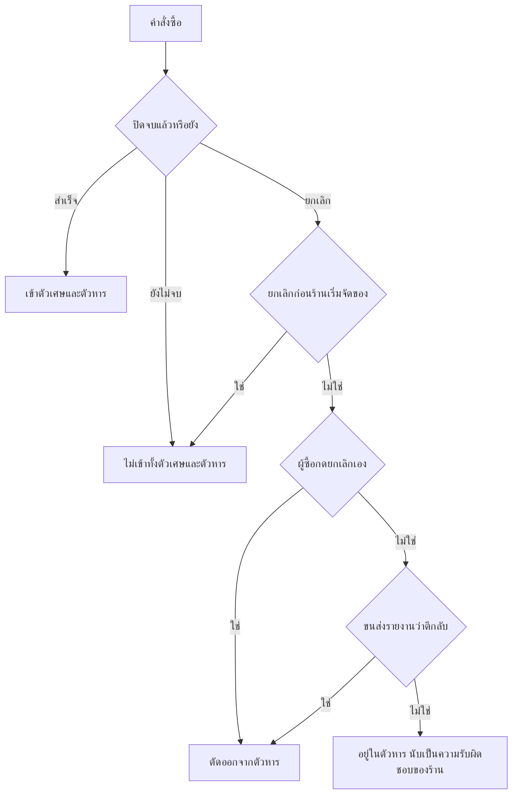
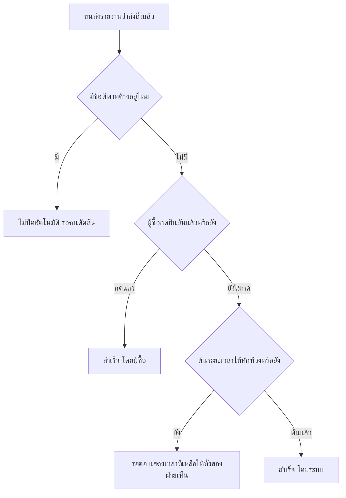
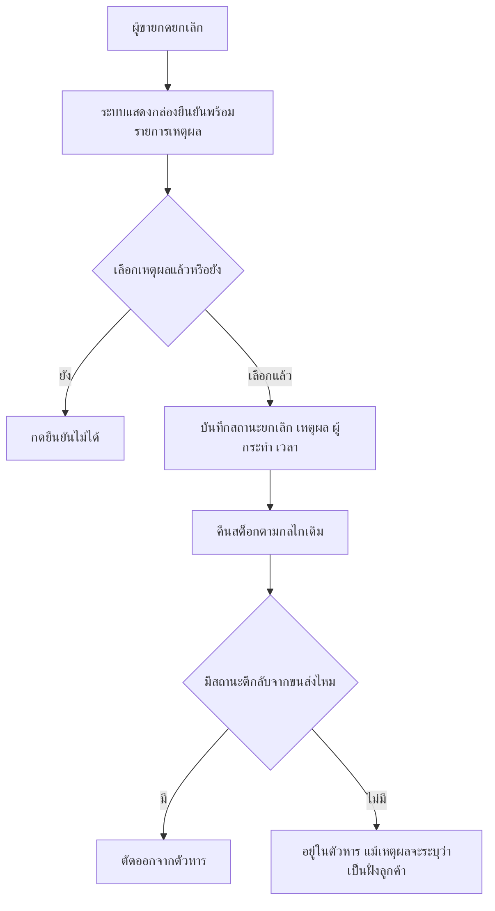

> **โมดูล:** M39-OrderSuccessMetrics
> **ประเภทเอกสาร:** Business Requirements Document (BRD)
> **เวอร์ชัน:** 1.0
> **วันที่จัดทำ:** 2026-08-08
> **สถานะ:** Draft — รอ user review
> **เจ้าของเอกสาร:** BA + PO

# BRD: ตัวชี้วัดความสำเร็จของคำสั่งซื้อ (Business Requirements Document)

---

## 1. บทนำ

### 1.1 วัตถุประสงค์ของเอกสาร

เอกสารนี้แปลงความต้องการทางธุรกิจใน [[PRD]] ให้เป็น Functional Requirements ที่ทดสอบได้ ครอบคลุม 3 เรื่อง:

1. **นิยามใหม่ของ "คำสั่งซื้อที่ส่งสำเร็จ"** — รวมของที่ขนส่งยืนยันว่าส่งถึงแล้วแม้ผู้ซื้อไม่กดยืนยัน
2. **นิยามใหม่ของ "อัตราความสำเร็จ"** — ตัดใบที่ยกเลิกโดยไม่ใช่ความผิดร้านออกจากตัวหาร ด้วยหลักฐานเชิงระบบ
3. **การแสดงผลบนหน้าจอสาธารณะ** — หน้าโปรไฟล์ร้าน และหน้าลิงก์คำสั่งซื้อก่อนเข้าสู่ระบบ

### 1.2 ขอบเขตของระบบ

**อยู่ในขอบเขต:**
- การเปลี่ยนเงื่อนไขที่ทำให้คำสั่งซื้อเข้าสถานะสำเร็จ
- การเก็บเหตุผลการยกเลิกสำหรับคำสั่งซื้อทุกประเภท (เดิมเก็บเฉพาะการจอง)
- ปุ่มให้ผู้ซื้อยกเลิกคำสั่งซื้อของตัวเองจากลิงก์สาธารณะ
- การคำนวณอัตราความสำเร็จแบบใหม่ที่แหล่งเดียวทั้งระบบ
- การแสดงผลบนหน้าโปรไฟล์ร้าน (`/u/[username]`, `/b/[slug]`) และหน้าลิงก์คำสั่งซื้อ
- การแสดงเพจ/บัญชีทางการที่ยืนยันแล้วบนหัวโปรไฟล์ (ย้ายจากแท็บ "เกี่ยวกับร้าน")
- มุมมองสำหรับผู้ขาย: ใบที่ถูกตัดออก และใบที่รอปิดอัตโนมัติ

**อยู่นอกขอบเขต:**
- ระบบข้อพิพาทเต็มรูป (ต้องการเพียงธง "มีข้อพิพาทค้าง" เพื่อกันการปิดอัตโนมัติ)
- การอุทธรณ์ตัวเลขกับแอดมิน
- การลงโทษร้านที่ตัวเลขต่ำ
- การแปลงตัวเลขเป็นป้าย/ระดับ
- การตัดสินย้อนหลังคำสั่งซื้อที่ปิดจบก่อนวันเริ่มใช้
- การเปิดเผยรายการสินค้าก่อนเข้าสู่ระบบ (คงมติเดิม)

### 1.3 กลุ่มผู้ใช้งาน

| กลุ่มผู้ใช้ | บทบาท | สิทธิ์การใช้งาน |
|---|---|---|
| **ผู้เยี่ยมชม (ยังไม่เข้าสู่ระบบ)** | ดูหน้าโปรไฟล์ร้าน / เปิดลิงก์คำสั่งซื้อ | เห็นตัวเลขสาธารณะ ไม่เห็นรายละเอียดคำสั่งซื้อ |
| **ผู้ซื้อ (ยืนยันตัวตนกับคำสั่งซื้อแล้ว)** | ยืนยันรับของ / ยกเลิกคำสั่งซื้อของตัวเอง | กดยืนยันหรือยกเลิกได้เฉพาะใบของตัวเอง |
| **ผู้ขาย (เจ้าของร้าน / ทีมงาน)** | ยกเลิกคำสั่งซื้อพร้อมเลือกเหตุผล / ดูตัวเลขของร้านตัวเอง | เห็นใบที่ถูกตัดออกพร้อมเหตุผล และใบที่รอปิดอัตโนมัติ |
| **แอดมิน** | ตรวจสอบเมื่อร้านสอบถามหรือมีพฤติกรรมผิดปกติ | เห็นประวัติการยกเลิกทั้งหมดพร้อมผู้กระทำและเวลา |
| **ระบบ (งานเบื้องหลัง)** | ปิดคำสั่งซื้อที่ส่งถึงแล้วและพ้นระยะทักท้วง | ไม่มีผู้กระทำเป็นบุคคล บันทึกว่าเป็นระบบ |

---

## 2. ความต้องการหลัก (Functional Requirements)

### 2.1 นิยาม "คำสั่งซื้อที่ส่งสำเร็จ"

#### FR-OSM-01: นับคำสั่งซื้อที่ขนส่งยืนยันว่าส่งถึงแล้ว

**User Story:**
> ในฐานะผู้ขาย ฉันต้องการให้ของที่ส่งถึงมือลูกค้าแล้วถูกนับว่าสำเร็จ แม้ลูกค้าจะไม่กดยืนยัน เพื่อให้ตัวเลขบนหน้าร้านสะท้อนปริมาณที่ขายได้จริง

**Acceptance Criteria:**
- [ ] คำสั่งซื้อที่ขนส่งรายงานว่าส่งถึงแล้ว และพ้น **7 วัน** นับจากเวลาที่ส่งถึง ต้องเปลี่ยนเป็นสถานะสำเร็จโดยอัตโนมัติ
- [ ] ค่า 7 วันต้องประกาศไว้ที่เดียวในโค้ด ทุกจุดที่ใช้ต้องอ้างค่าเดียวกัน (หน้าจอผู้ซื้อ · หน้าจอผู้ขาย · งานเบื้องหลัง)
- [ ] ใบที่ส่งถึงแล้วแต่ยังไม่ครบ 7 วัน ต้องไม่ถูกปิด (เทสขอบ: 6 วัน 23 ชม. ยังไม่ปิด · 7 วัน 1 นาที ปิด)
- [ ] ประวัติของคำสั่งซื้อต้องบันทึกว่า **ระบบ** เป็นผู้ยืนยัน ไม่ใช่ผู้ซื้อ และบันทึกเวลาที่ขนส่งรายงานว่าส่งถึงไว้ด้วย
- [ ] เวลาที่บันทึกในประวัติต้องเป็นเวลาจริงที่ระบบทำงาน ไม่ใช่เวลาที่ขนส่งส่งถึง
- [ ] คำสั่งซื้อที่ผู้ซื้อกดยืนยันไปแล้ว ต้องไม่ถูกเขียนทับ
- [ ] คำสั่งซื้อที่ถูกยกเลิกไปแล้ว ต้องไม่ถูกปลุกกลับมาเป็นสำเร็จ
- [ ] คำสั่งซื้อที่มีข้อพิพาท/การทักท้วงค้างอยู่ ต้องไม่ถูกปิดอัตโนมัติ
- [ ] คำสั่งซื้อที่ร้านกรอกเลขพัสดุเอง (ไม่ผ่านระบบขนส่งที่เชื่อมต่อ) ต้องไม่ถูกปิดอัตโนมัติ เพราะระบบไม่มีสถานะจากขนส่ง
- [ ] งานปิดอัตโนมัติต้องทำงานซ้ำได้โดยไม่สร้างรายการซ้ำในประวัติ

**Business Flow:**
1. ระบบได้รับสถานะจากขนส่งว่าพัสดุส่งถึงผู้รับแล้ว
2. ระบบบันทึกเวลาที่ส่งถึง
3. เมื่อพ้นระยะเวลาให้ทักท้วง ระบบตรวจว่าคำสั่งซื้อยังอยู่ในสถานะที่ปิดได้ และไม่มีข้อพิพาทค้าง
4. ระบบเปลี่ยนสถานะเป็นสำเร็จ พร้อมบันทึกประวัติว่าระบบเป็นผู้ยืนยัน
5. คะแนนความน่าเชื่อถือ เหรียญ และยอดขายรายสินค้า คำนวณใหม่ตามกลไกเดิม

**Example:**
```
คำสั่งซื้อ A — โอนเงินล่วงหน้า ส่งผ่านขนส่งที่เชื่อมต่อ
  8 ส.ค. 10:00  ขนส่งรายงานว่าส่งถึง
  ผู้ซื้อไม่กดยืนยัน
  พ้นระยะทักท้วง → ระบบเปลี่ยนเป็นสำเร็จ บันทึก "ยืนยันโดยระบบ"
  ผลลัพธ์: นับเป็น 1 คำสั่งซื้อที่ส่งสำเร็จ (เดิมไม่ถูกนับเลย)

คำสั่งซื้อ B — ร้านกรอกเลขพัสดุเอง
  ระบบไม่มีสถานะจากขนส่ง → ไม่ปิดอัตโนมัติ
  ผลลัพธ์: รอผู้ซื้อกดยืนยันเหมือนเดิม
```

#### FR-OSM-02: ผู้ซื้อเห็นว่าระบบจะปิดงานให้เมื่อไร

**User Story:**
> ในฐานะผู้ซื้อ ฉันต้องการรู้ว่าถ้าไม่ทำอะไร ระบบจะถือว่าฉันได้รับของแล้วเมื่อไร เพื่อให้ทักท้วงได้ทันถ้ามีปัญหา

**Acceptance Criteria:**
- [ ] หน้าคำสั่งซื้อของผู้ซื้อต้องแสดงว่าเหลือเวลาอีกเท่าไรก่อนระบบยืนยันให้
- [ ] ข้อความต้องบอกทางที่ผู้ซื้อทำได้ ไม่ใช่แค่บอกว่าจะเกิดอะไรขึ้น
- [ ] เมื่อระบบยืนยันไปแล้ว ต้องแสดงว่าเป็นการยืนยันโดยระบบ ไม่ใช่แสดงเหมือนผู้ซื้อกดเอง

#### FR-OSM-03: ผู้ขายเห็นใบที่รอปิดอัตโนมัติ

**User Story:**
> ในฐานะผู้ขาย ฉันต้องการเห็นว่ามีคำสั่งซื้อใดส่งถึงแล้วแต่ยังไม่ปิด เพื่อรู้ว่าตัวเลขของฉันกำลังจะเปลี่ยนอย่างไร

**Acceptance Criteria:**
- [ ] หน้ารายการคำสั่งซื้อต้องกรองดูใบที่ส่งถึงแล้วแต่ยังไม่ปิดได้
- [ ] แต่ละใบต้องบอกว่าเหลือเวลาอีกเท่าไรก่อนระบบปิดให้

---

### 2.2 การเก็บเหตุผลการยกเลิก

#### FR-OSM-04: ร้านต้องเลือกเหตุผลทุกครั้งที่ยกเลิก

**User Story:**
> ในฐานะผู้ขาย ฉันต้องการระบุเหตุผลตอนยกเลิกคำสั่งซื้อ เพื่อให้มีบันทึกไว้อ้างอิงและให้ระบบเข้าใจสถานการณ์ของร้าน

**Acceptance Criteria:**
- [ ] ยกเลิกคำสั่งซื้อโดยไม่เลือกเหตุผลไม่ได้ — ต้องมีการตรวจสอบทั้งฝั่งหน้าจอและฝั่งเซิร์ฟเวอร์
- [ ] ชุดเหตุผลต้องต่างกันตามประเภทกิจการของร้าน (ขายออนไลน์ / สินค้าและบริการ / ที่พัก)
- [ ] เหตุผลที่เลือกถูกบันทึกลงในคำสั่งซื้อและในประวัติเหตุการณ์ พร้อมผู้กระทำและเวลา
- [ ] คำสั่งซื้อประเภทการจองต้องใช้ชุดเหตุผลเดิมของระบบจอง ไม่ถูกเปลี่ยนพฤติกรรม
- [ ] เหตุผลที่ร้านเลือก **ต้องไม่มีผลต่อการคำนวณอัตราความสำเร็จ** (ตรวจด้วยเทสว่าเปลี่ยนเหตุผทุกค่าแล้วตัวหารไม่ขยับ)

**Business Flow:**
1. ผู้ขายกดยกเลิกคำสั่งซื้อจากหน้ารายละเอียด
2. ระบบแสดงกล่องยืนยันพร้อมรายการเหตุผลตามประเภทกิจการ
3. ผู้ขายต้องเลือกเหตุผลก่อนจึงกดยืนยันได้
4. ระบบบันทึกสถานะยกเลิก เหตุผล ผู้กระทำ และเวลา แล้วคืนสต็อกตามกลไกเดิม

**Example:**
```
ร้านขายออนไลน์  → ลูกค้าไม่โอนเงิน / ลูกค้าขอยกเลิก / สินค้ามีปัญหา หรือเหตุผลของร้าน / ตกลงกันได้
ร้านสินค้าและบริการ → ลูกค้าไม่มาตามนัด / ลูกค้าขอยกเลิก / ร้านติดปัญหา ให้บริการไม่ได้ / ตกลงกันได้
ที่พัก → ใช้ชุดเดิมของระบบจอง
```

#### FR-OSM-05: แสดงเหตุผลการยกเลิกให้ผู้ขายและแอดมินเห็น

**User Story:**
> ในฐานะแอดมิน ฉันต้องการเห็นว่าคำสั่งซื้อถูกยกเลิกด้วยเหตุผลอะไรและใครเป็นคนกด เพื่อตอบคำถามร้านและตรวจพฤติกรรมผิดปกติ

**Acceptance Criteria:**
- [ ] ประวัติของคำสั่งซื้อแสดงเหตุผลและฝ่ายที่กดยกเลิก
- [ ] เหตุผลการยกเลิกไม่ปรากฏบนหน้าจอสาธารณะที่ผู้ซื้อทั่วไปเห็น

---

### 2.3 การยกเลิกโดยผู้ซื้อ

#### FR-OSM-06: ผู้ซื้อยกเลิกคำสั่งซื้อของตัวเองได้

**User Story:**
> ในฐานะผู้ซื้อ ฉันต้องการยกเลิกคำสั่งซื้อที่ฉันเปลี่ยนใจแล้วได้เอง เพื่อไม่ต้องรบกวนร้านและไม่ให้ร้านเสียคะแนนจากการตัดสินใจของฉัน

**Acceptance Criteria:**
- [ ] หน้าคำสั่งซื้อของผู้ซื้อมีปุ่มยกเลิก แสดงเฉพาะเมื่อคำสั่งซื้อยังยกเลิกได้ตามกฎการเปลี่ยนสถานะเดิม
- [ ] ผู้ซื้อต้องผ่านการยืนยันตัวตนกับคำสั่งซื้อใบนั้นก่อนจึงเห็นปุ่ม
- [ ] มีขั้นยืนยันก่อนยกเลิกจริง พร้อมข้อความว่ายกเลิกแล้วย้อนกลับไม่ได้
- [ ] ระบบบันทึกว่าผู้ซื้อเป็นผู้ยกเลิก และตั้งเหตุผลให้อัตโนมัติโดยไม่ถามซ้ำ
- [ ] คำสั่งซื้อที่ยกเลิกด้วยเส้นทางนี้ **ต้องถูกตัดออกจากตัวหาร**
- [ ] ปุ่มนี้ต้องไม่ปรากฏกับผู้ที่ไม่ใช่เจ้าของคำสั่งซื้อ

**Business Flow:**
1. ผู้ซื้อเปิดลิงก์คำสั่งซื้อและยืนยันตัวตนแล้ว
2. ผู้ซื้อกดยกเลิก และยืนยันในกล่องยืนยัน
3. ระบบเปลี่ยนสถานะเป็นยกเลิก บันทึกว่าผู้ซื้อเป็นผู้กระทำ คืนสต็อกตามกลไกเดิม
4. ใบนี้ไม่เข้าตัวหารของร้าน

#### FR-OSM-07: ตัดใบที่พัสดุถูกตีกลับออกจากตัวหาร

**User Story:**
> ในฐานะผู้ขาย ฉันต้องการให้ใบที่ลูกค้าไม่ไปรับพัสดุจนของตีกลับ ไม่ถูกนับเป็นความผิดของฉัน เพราะฉันส่งของไปแล้ว

**Acceptance Criteria:**
- [ ] คำสั่งซื้อที่ยกเลิกและมีสถานะจากขนส่งว่าพัสดุถูกตีกลับ ต้องถูกตัดออกจากตัวหาร
- [ ] การตัดออกต้องอิงสถานะจากขนส่งเท่านั้น ไม่อิงเหตุผลที่ร้านเลือก
- [ ] คำสั่งซื้อที่ตีกลับแต่ร้านยังไม่ได้ยกเลิก ยังไม่ถือว่าปิดจบ จึงไม่เข้าทั้งตัวเศษและตัวหาร

---

### 2.4 การคำนวณและแสดงผลอัตราความสำเร็จ

#### FR-OSM-08: คำนวณอัตราความสำเร็จแบบใหม่จากแหล่งเดียว

**User Story:**
> ในฐานะผู้ซื้อ ฉันต้องการเห็นอัตราความสำเร็จที่ตรงกันทุกหน้าจอ เพื่อไม่ต้องสงสัยว่าตัวเลขไหนจริง

**Acceptance Criteria:**
- [ ] มีฟังก์ชันคำนวณเพียงชุดเดียวในระบบ ทุกหน้าจอเรียกใช้ตัวเดียวกัน
- [ ] ตัวเศษ = จำนวนคำสั่งซื้อที่สำเร็จตาม FR-OSM-01
- [ ] ตัวหาร = คำสั่งซื้อที่ปิดจบทั้งหมด ลบด้วยใบที่ถูกตัดตาม FR-OSM-06 และ FR-OSM-07
- [ ] คำสั่งซื้อที่ยกเลิกก่อนร้านเริ่มจัดของ ต้องหลุดออกจากทั้งตัวเศษและตัวหาร
- [ ] ตัวหารหลังหักต่ำกว่า 5 ต้องคืนค่าที่หมายถึง "ยังสรุปไม่ได้" ไม่ใช่ 0
- [ ] คำนวณเฉพาะคำสั่งซื้อที่เกิดตั้งแต่วันเริ่มใช้ระบบเป็นต้นไป
- [ ] มีเทสครอบเคสตัวหาร 0 / 1 / 4 / 5 และเคสที่หักแล้วตกจากผ่านเกณฑ์เป็นไม่ผ่าน
- [ ] **ต้องยุบสูตรเดิมที่เขียนซ้ำอยู่ 3 ที่ให้เหลือที่เดียวก่อน** จึงเพิ่มกฎใหม่

**Example:**
```
ร้านมีคำสั่งซื้อที่ปิดจบ 21 ใบ
  สำเร็จ 17
  ยกเลิก 4  → ผู้ซื้อกดยกเลิกเอง 2 · พัสดุตีกลับ 1 · ร้านยกเลิกเอง 1
ตัวหาร = 21 − 3 = 18
อัตราความสำเร็จ = 17 ÷ 18 = 94%
แสดงผล: "94%  อัตราสำเร็จ — จาก 18 ใบที่ปิดจบ · ไม่นับ 3 ใบที่ผู้ซื้อไม่รับของ"
```

#### FR-OSM-09: แสดงตัวเลขบนหน้าโปรไฟล์ร้าน

**User Story:**
> ในฐานะผู้ซื้อที่กำลังศึกษาร้าน ฉันต้องการเห็นหลักฐานที่ตรวจสอบเองได้ เพื่อตัดสินใจว่าจะโอนเงินไหม

**Acceptance Criteria:**
- [ ] หัวโปรไฟล์แสดงจำนวนคำสั่งซื้อที่ส่งสำเร็จ และอัตราความสำเร็จ โดยให้น้ำหนักการมองเห็นต่างกัน ไม่ใช่ตัวเลขใหญ่เท่ากันสองก้อน
- [ ] ใต้อัตราความสำเร็จต้องแสดงตัวหาร และแสดงจำนวนใบที่ถูกตัดออกเมื่อมีมากกว่า 0
- [ ] เมื่อไม่มีใบถูกตัดออก ต้องไม่แสดงข้อความ "ไม่นับ 0 ใบ"
- [ ] เมื่อตัวหารไม่ถึงเกณฑ์ ต้องแสดงข้อความอธิบายเงื่อนไขที่จะทำให้ตัวเลขปรากฏ ด้วยน้ำเสียงเป็นกลาง ไม่ใช้สีเตือนหรือสีผิดพลาด และต้องไม่ซ่อนพื้นที่ทิ้งเงียบ ๆ
- [ ] ต้องระบุวันเริ่มนับให้ผู้อ่านเห็น
- [ ] ถอด "จำนวนลูกค้าที่ใช้บริการซ้ำ" ออกจากหัวโปรไฟล์ ไปแสดงในแท็บเกี่ยวกับร้าน และแสดงเฉพาะเมื่อมีค่ามากกว่า 0
- [ ] คงการแสดงจำนวนผู้ซื้อไม่ซ้ำหน้าไว้ เพราะเป็นสัญญาณกันการสร้างคำสั่งซื้อซ้ำกับตัวเอง
- [ ] ทุกค่าเฉลี่ยที่แสดงต้องมีจำนวนตัวอย่างกำกับ

#### FR-OSM-10: แสดงเพจ/บัญชีทางการบนหัวโปรไฟล์

**User Story:**
> ในฐานะผู้ซื้อ ฉันต้องการเห็นว่าร้านนี้คือเพจเดียวกับที่ฉันเคยเห็น และกดไปดูเพจจริงได้ เพื่อยืนยันว่ามาถูกที่

**Acceptance Criteria:**
- [ ] หัวโปรไฟล์แสดงรายการช่องทางที่ยืนยันแล้ว โดยแต่ละรายการมีโลโก้เพจ ชื่อเพจ และประเภทช่องทาง
- [ ] กดแล้วเปิดหน้าเพจจริงในแท็บใหม่อย่างปลอดภัย
- [ ] ช่องทางที่ประกอบลิงก์ปลายทางไม่ได้ ต้องแสดงแบบกดไม่ได้ ไม่ใช่ลิงก์ที่กดแล้วไปหน้าผิด
- [ ] ต้องไม่แสดงรายการเดียวกันซ้ำในแท็บเกี่ยวกับร้านอีก
- [ ] ร้านที่ไม่มีช่องทางเชื่อมต่อ ต้องไม่แสดงพื้นที่ว่าง

#### FR-OSM-11: หน้าลิงก์คำสั่งซื้อไม่แสดงอัตราความสำเร็จ

**User Story:**
> ในฐานะผู้ซื้อที่เพิ่งกดลิงก์จากแชทและยังไม่รู้จัก Deep ฉันต้องการเห็นข้อมูลที่ช่วยยืนยันว่ามาถูกที่ ไม่ใช่ตัวเลขที่ฉันตรวจสอบไม่ได้

**Acceptance Criteria:**
- [ ] แถบร้านบนหน้าลิงก์คำสั่งซื้อแสดงเฉพาะจำนวนคำสั่งซื้อที่ส่งสำเร็จ และค่าเฉลี่ยรีวิวพร้อมจำนวนรีวิว
- [ ] ไม่แสดงอัตราความสำเร็จบนหน้านี้
- [ ] เลขคำสั่งซื้อและวันที่ต้องอ่านออกชัดเจน ไม่ใช้ระดับสีที่ตกเกณฑ์ความคมชัด
- [ ] ร้านที่ยังไม่มีสถิติ ต้องไม่แสดงพื้นที่ว่าง

---

### 2.5 มุมมองของผู้ขาย

#### FR-OSM-12: ผู้ขายเห็นว่าอะไรทำให้ตัวเลขเป็นแบบนี้

**User Story:**
> ในฐานะผู้ขาย ฉันต้องการรู้ว่าใบไหนถูกตัดออกและใบไหนนับเป็นความรับผิดชอบของฉัน เพื่อปรับปรุงได้ถูกจุด

**Acceptance Criteria:**
- [ ] ผู้ขายเห็นจำนวนใบที่ถูกตัดออกจากตัวหาร แยกตามเส้นทาง (ผู้ซื้อกดยกเลิกเอง / พัสดุตีกลับ)
- [ ] ผู้ขายเห็นรายการใบที่นับเป็นความรับผิดชอบของร้าน พร้อมเหตุผลที่เคยเลือกไว้
- [ ] ข้อมูลกลุ่มนี้ไม่ปรากฏบนหน้าจอสาธารณะ

---

## 3. Acceptance Criteria สรุป

### 3.1 ความถูกต้องของการนับ
- [ ] คำสั่งซื้อที่ขนส่งยืนยันว่าส่งถึงและพ้นระยะทักท้วง ถูกนับเป็นสำเร็จครบทุกใบ
- [ ] ไม่มีคำสั่งซื้อที่ยกเลิกแล้วถูกเปลี่ยนกลับเป็นสำเร็จ
- [ ] ไม่มีคำสั่งซื้อที่มีข้อพิพาทค้างถูกปิดอัตโนมัติ
- [ ] เปลี่ยนเหตุผลที่ร้านเลือกทุกค่าแล้ว ตัวหารไม่ขยับ

### 3.2 ความถูกต้องของสูตร
- [ ] มีฟังก์ชันคำนวณชุดเดียวในระบบ ไม่มีสูตรเดียวกันเขียนซ้ำที่อื่น
- [ ] ตัวหารต่ำกว่า 5 ไม่แสดงเป็นเปอร์เซ็นต์
- [ ] ทุกจอที่แสดงค่านี้ให้ผลตรงกันสำหรับร้านเดียวกัน

### 3.3 การแสดงผล
- [ ] หน้าโปรไฟล์แสดงตัวหารและจำนวนที่ถูกตัดออกครบทุกกรณีที่มี
- [ ] สถานะ "ยังสรุปไม่ได้" แสดงข้อความอธิบาย ไม่ใช่ซ่อนหรือแสดง 0%
- [ ] หน้าลิงก์คำสั่งซื้อไม่มีอัตราความสำเร็จปรากฏ
- [ ] เพจที่ยืนยันแล้วปรากฏบนหัวโปรไฟล์และกดเปิดเพจจริงได้
- [ ] ไม่มีรายการช่องทางซ้ำกันสองที่ในหน้าเดียว

### 3.4 การยกเลิก
- [ ] ยกเลิกโดยไม่เลือกเหตุผลไม่ได้ ทั้งจากหน้าจอและจากการเรียกตรง
- [ ] ผู้ซื้อยกเลิกใบของตัวเองได้ และใบนั้นไม่เข้าตัวหาร
- [ ] ผู้ที่ไม่ใช่เจ้าของคำสั่งซื้อไม่เห็นปุ่มยกเลิกและเรียกใช้ไม่ได้

---

## 4. Business Flows

### 4.1 Flow หลัก: คำสั่งซื้อถูกนับอย่างไร



### 4.2 Flow: การปิดงานอัตโนมัติ



### 4.3 Flow: ร้านกดยกเลิก



---

## 5. Use Case Scenarios

### Scenario 1: Best Case — ร้านส่งของครบ ลูกค้าลืมกดยืนยัน

**บริบท:** ร้านมีคำสั่งซื้อ 20 ใบ ส่งครบทุกใบผ่านระบบขนส่ง ลูกค้ากดยืนยันเอง 12 ใบ ที่เหลือ 8 ใบไม่มีใครกด

**ผลลัพธ์ที่คาดหวัง:**
- ทั้ง 8 ใบถูกระบบยืนยันให้หลังพ้นระยะทักท้วง
- หน้าโปรไฟล์แสดง "20 คำสั่งซื้อสำเร็จ" ไม่ใช่ 12
- อัตราความสำเร็จ 100% จาก 20 ใบที่ปิดจบ
- คะแนนความน่าเชื่อถือขยับตามจำนวนที่เพิ่ม

### Scenario 2: ร้านเจอลูกค้าเบี้ยวปนกับลูกค้าปกติ

**บริบท:** คำสั่งซื้อที่ปิดจบ 21 ใบ — สำเร็จ 17 · ผู้ซื้อกดยกเลิกเอง 2 · พัสดุตีกลับ 1 · ร้านยกเลิกเองเพราะของหมด 1

**ผลลัพธ์ที่คาดหวัง:**
- ตัวหาร = 18 (หัก 3 ใบที่ตัดได้)
- อัตราความสำเร็จ = 94%
- หน้าจอแสดง "จาก 18 ใบที่ปิดจบ · ไม่นับ 3 ใบที่ผู้ซื้อไม่รับของ"
- ใบที่ร้านยกเลิกเองเพราะของหมด **ยังอยู่ในตัวหาร** (ถูกต้อง เพราะเป็นความรับผิดชอบของร้าน)

### Scenario 3: ร้านพยายามปั่นตัวเลข

**บริบท:** ร้านยกเลิกคำสั่งซื้อ 5 ใบ แล้วเลือกเหตุผล "ลูกค้าไม่โอนเงิน" ทั้งหมด โดยไม่มีหลักฐานอื่น

**ผลลัพธ์ที่คาดหวัง:**
- เหตุผลถูกบันทึกไว้และร้านเห็นได้
- **ทั้ง 5 ใบยังอยู่ในตัวหาร** เพราะไม่ได้ผ่านเส้นทางที่ระบบใช้ตัดสิน
- อัตราความสำเร็จของร้านไม่ดีขึ้นจากการเลือกเหตุผล

### Scenario 4: ร้านใหม่ที่ยังไม่ถึงเกณฑ์

**บริบท:** ร้านเปิดใหม่ มีคำสั่งซื้อที่ปิดจบ 3 ใบ สำเร็จทั้ง 3

**ผลลัพธ์ที่คาดหวัง:**
- หน้าโปรไฟล์แสดง "3 คำสั่งซื้อสำเร็จ"
- **ไม่แสดง "100%"** แต่แสดงข้อความว่ายังสรุปอัตราสำเร็จไม่ได้ พร้อมบอกว่าต้องมีกี่ใบ
- ข้อความใช้น้ำเสียงเป็นกลาง ไม่ใช้สีเตือน และไม่ทำให้พื้นที่หายไปจนหน้าดูพัง

### Scenario 5: ลูกค้าทักท้วงว่าไม่ได้รับของ

**บริบท:** ขนส่งรายงานว่าส่งถึงแล้ว แต่ผู้ซื้อแจ้งว่าไม่ได้รับ

**ผลลัพธ์ที่คาดหวัง:**
- ระบบไม่ปิดคำสั่งซื้อให้อัตโนมัติ
- คำสั่งซื้อค้างสถานะเดิมจนกว่าจะมีการตัดสิน
- ไม่เข้าทั้งตัวเศษและตัวหารในระหว่างนั้น

---

## 6. ความต้องการด้านคุณภาพ

### 6.1 ความถูกต้องของข้อมูล
- ตัวเลขเดียวกันต้องตรงกันทุกหน้าจอสำหรับร้านเดียวกัน ณ เวลาเดียวกัน
- การปิดงานอัตโนมัติต้องไม่สร้างรายการซ้ำในประวัติ แม้งานจะทำงานหลายรอบ
- การตัดออกจากตัวหารต้องตามรอยกลับไปยังเหตุการณ์ต้นทางได้เสมอ

### 6.2 ความรวดเร็ว
- การคำนวณตัวเลขบนหน้าโปรไฟล์ต้องไม่เพิ่มการดึงข้อมูลซ้ำซ้อน — ปัจจุบันมีการดึงข้อมูลชุดเดียวกันสองรอบต่อการโหลดหนึ่งครั้ง ต้องยุบให้เหลือรอบเดียวไปพร้อมกัน
- งานปิดอัตโนมัติทำงานเบื้องหลัง ต้องไม่ทำให้การใช้งานหน้าจอช้าลง

### 6.3 ความน่าเชื่อถือ
- งานปิดอัตโนมัติล้มกลางทางต้องไม่ทำให้ข้อมูลค้างครึ่ง ๆ กลาง ๆ
- ถ้าสถานะจากขนส่งไม่มาเลย ระบบต้องยังทำงานได้ตามปกติโดยรอผู้ซื้อกดเอง

### 6.4 ความปลอดภัย
- ปุ่มยกเลิกของผู้ซื้อต้องตรวจสิทธิ์ที่ฝั่งเซิร์ฟเวอร์ ไม่ใช่แค่ซ่อนปุ่ม
- เหตุผลการยกเลิกและข้อมูลใบที่ถูกตัดออก ต้องไม่รั่วไปยังหน้าจอสาธารณะ
- ข้อมูลส่วนบุคคลของผู้ซื้อต้องไม่ถูกส่งไปยังหน้าจอที่ไม่ได้ใช้

### 6.5 ความสะดวกในการใช้งาน
- ข้อความสถานะ "ยังสรุปไม่ได้" ต้องบอกเงื่อนไขที่จะทำให้ตัวเลขปรากฏ ไม่ใช่แค่บอกว่าไม่มี
- ปุ่มและตัวเลือกทั้งหมดต้องแตะได้สะดวกบนมือถือ
- ทุกข้อความบนหน้าจอสาธารณะต้องอ่านออกในระดับความคมชัดที่กำหนด

---

## 7. ข้อจำกัด

### 7.1 ข้อจำกัดทางธุรกิจ
- ไม่มีข้อมูลเหตุผลการยกเลิกย้อนหลัง จึงไม่คำนวณคำสั่งซื้อที่ปิดจบก่อนวันเริ่มใช้
- Deep ไม่ถือเงิน จึงไม่มีกลไกกักเงินเพื่อบังคับให้ฝ่ายใดทำตาม
- ร้านที่ส่งของเองโดยไม่ผ่านระบบขนส่งที่เชื่อมต่อ จะไม่ได้ประโยชน์จากการปิดงานอัตโนมัติ

### 7.2 ข้อจำกัดทางเทคนิค
- สถานะ "ส่งถึงแล้ว" และ "ตีกลับ" มีเฉพาะพัสดุที่เปิดหรือผูกผ่านระบบขนส่งที่เชื่อมต่อ
- สูตรเดิมถูกเขียนซ้ำอยู่ 3 ที่ และ 2 ใน 3 ไม่มีเกณฑ์ขั้นต่ำ — ต้องยุบให้เหลือหนึ่งก่อนเพิ่มกฎใหม่ ไม่งั้นจะได้สำเนาที่สี่
- ยังไม่มีธง "มีข้อพิพาทค้าง" ในระบบ ต้องสร้างขึ้นเพื่อกันการปิดอัตโนมัติ

---

## 8. กฎทางธุรกิจ

### 8.1 กฎการนับ
- **BR-OSM-01** สำเร็จ = ผู้ซื้อยืนยัน หรือขนส่งยืนยันว่าส่งถึงและพ้นระยะทักท้วง หรือเงินปลายทางถูกเคลียร์
- **BR-OSM-02** คำสั่งซื้อที่ยกเลิกแล้วห้ามเปลี่ยนกลับเป็นสำเร็จ
- **BR-OSM-03** ใบที่มีข้อพิพาทค้างห้ามปิดอัตโนมัติ
- **BR-OSM-09** จำนวนผู้ซื้อนับตามตัวบุคคล ไม่ใช่จำนวนใบ

### 8.2 กฎการตัดตัวหาร
- **BR-OSM-04** ตัดออกได้ 2 เส้นทางเท่านั้น: ผู้ซื้อกดยกเลิกเอง หรือพัสดุถูกตีกลับ
- **BR-OSM-05** เหตุผลที่ร้านเลือกไม่มีอำนาจตัดสิน
- **BR-OSM-11** ร้านต้องเลือกเหตุผลทุกครั้งที่ยกเลิก ชุดเหตุผลต่างกันตามประเภทกิจการ

### 8.3 กฎการแสดงผล
- **BR-OSM-06** ตัวหารหลังหักต่ำกว่า 5 ห้ามแสดงเป็นเปอร์เซ็นต์
- **BR-OSM-07** ทุก % ต้องมีตัวหารกำกับ และระบุจำนวนที่ถูกตัดออกเมื่อมี
- **BR-OSM-08** ไม่ตัดสินย้อนหลัง และต้องบอกวันเริ่มนับ
- **BR-OSM-10** สูตรเดียวทั้งระบบ
- **BR-OSM-12** ตัวเลขสาธารณะเป็นตัวเลขนับดี ไม่แสดงจำนวนหรืออัตราการยกเลิกต่อผู้ซื้อ

---

## 9. อภิธานศัพท์

| คำศัพท์ | ความหมาย |
|---------|----------|
| **คำสั่งซื้อที่ส่งสำเร็จ** | คำสั่งซื้อที่ของถึงมือผู้ซื้อแล้วตาม BR-OSM-01 |
| **ปิดจบ** | คำสั่งซื้อที่จบเรื่องแล้ว ไม่ว่าสำเร็จหรือยกเลิก |
| **ตัวหาร** | จำนวนใบที่ปิดจบและอยู่ในความรับผิดชอบของร้าน |
| **ใบที่ถูกตัดออก** | ใบที่ยกเลิกด้วยเส้นทางตาม BR-OSM-04 |
| **ระยะเวลาให้ทักท้วง** | **7 วัน** หลังขนส่งรายงานว่าส่งถึง ที่ผู้ซื้อยังทักท้วงได้ก่อนระบบปิดให้ |
| **เส้นทางที่ถูกใช้** | หลักฐานว่าใครเป็นผู้กระทำ วัดจากการกระทำในระบบ ไม่ใช่จากคำอธิบาย |
| **ผู้ซื้อไม่ซ้ำหน้า** | จำนวนบุคคลที่เคยซื้อสำเร็จกับร้านนี้ |

---

## 10. สรุป

ระบบนี้เปลี่ยนตัวชี้วัดสองตัวบนหน้าโปรไฟล์ร้านจาก "สิ่งที่วัดพฤติกรรมของผู้ซื้อ" ให้เป็น "สิ่งที่วัดผลงานของร้าน" โดยยึดหลักเดียวคือ **ตัดสินจากหลักฐานที่ฝ่ายใดฝ่ายหนึ่งปลอมไม่ได้**

จำนวนคำสั่งซื้อที่ส่งสำเร็จจะสะท้อนปริมาณจริง เพราะนับของที่ขนส่งยืนยันว่าถึงมือลูกค้าแล้ว ไม่รอให้ผู้ซื้อจำได้ว่าต้องกดปุ่ม และอัตราความสำเร็จจะไม่ลงโทษร้านจากพฤติกรรมของลูกค้า แต่ก็ไม่ปล่อยให้ร้านให้คะแนนตัวเองด้วยการเลือกเหตุผล

ผลข้างเคียงที่ตั้งใจให้เกิดคือคะแนนความน่าเชื่อถือ เหรียญ และยอดขายรายสินค้าของทุกร้านจะขยับพร้อมกันในวันที่เปิดใช้ เพราะทั้งหมดผูกกับนิยามเดียวกัน — ต้องประเมินผลกระทบและสื่อสารกับร้านก่อนเปิดใช้

**สิ่งที่ต้องทำก่อนเริ่มเขียนโค้ด:** ยุบสูตรที่เขียนซ้ำอยู่ 3 ที่ให้เหลือที่เดียว มิฉะนั้นกฎใหม่ทั้งหมดจะกลายเป็นสำเนาที่สี่
