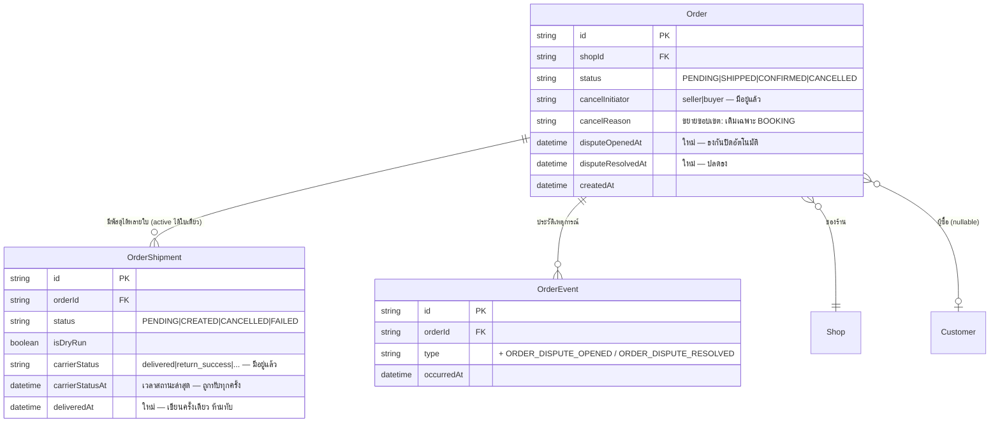

> **โมดูล:** M39-OrderSuccessMetrics · **เวอร์ชัน:** 1.0 · **สถานะ:** Draft

# DATABASE: ตัวชี้วัดความสำเร็จของคำสั่งซื้อ

---

## 1. Overview

ระบบนี้ **ไม่สร้างตารางใหม่** — เพิ่มคอลัมน์ 3 ตัวบนตารางที่มีอยู่ และเปลี่ยนขอบเขตการใช้คอลัมน์เดิม 1 ตัว

| สิ่งที่เปลี่ยน | ตาราง | เหตุผลสั้น ๆ |
|---|---|---|
| เพิ่ม `deliveredAt` | `OrderShipment` | ต้องมีเวลาที่ "ส่งถึงครั้งแรก" แบบเขียนครั้งเดียว เพื่อจับครบ 7 วัน |
| เพิ่ม `disputeOpenedAt` | `Order` | ธงกันการปิดอัตโนมัติ (BR-OSM-03) |
| เพิ่ม `disputeResolvedAt` | `Order` | ปลดธงเมื่อเรื่องจบ ให้ปิดอัตโนมัติทำงานต่อได้ |
| ขยายขอบเขต `cancelReason` | `Order` | เดิมเขียนเฉพาะ `type='BOOKING'` → ขยายให้ครอบทุกประเภท (ไม่เปลี่ยนชนิดคอลัมน์) |

**ไม่เพิ่มคอลัมน์เก็บผลลัพธ์การคำนวณ** (เช่น `excludedFromRate`) โดยตั้งใจ — การตัดออกจากตัวหารต้อง **คำนวณสดจากหลักฐาน** (`cancelInitiator` + สถานะขนส่ง) ทุกครั้ง เพราะถ้าเก็บเป็นธง ธงนั้นจะกลายเป็น "ภาพนิ่ง ณ เวลาที่เขียน" แล้วเพี้ยนได้เมื่อหลักฐานต้นทางเปลี่ยนทีหลัง — เป็นคลาสบั๊กเดียวกับ `Product.fulfillmentMode` ที่ติดธงค้างจนต้องมี migration ล้าง (`docs/conventions/stored-flag-vs-owner-truth.md`)

---

## 2. ERD (เฉพาะส่วนที่เกี่ยวข้อง)



---

## 3. Tables

### 3.1 `OrderShipment` (PostgreSQL — Supabase)

| คอลัมน์ | ชนิด | Null | ค่าเริ่มต้น | คำอธิบาย |
|---|---|---|---|---|
| `deliveredAt` | `TIMESTAMP` | ได้ | `NULL` | เวลาที่พัสดุ **ถึงมือผู้รับครั้งแรก** — เขียนครั้งเดียวเท่านั้น |

🛑 **ทำไมต้องมีคอลัมน์นี้ ทั้งที่ดูเหมือนซ้ำกับ `carrierStatusAt`**

`carrierStatusAt` คือ "เวลาของสถานะล่าสุด" ซึ่ง**ถูกเขียนทับทุกครั้งที่สถานะขยับ** พอใบ COD เดินต่อจาก `delivered` ไป `payment_success` (ซึ่งเป็นสถานะที่ไกลกว่า delivered — เห็นได้จาก `src/lib/order-stage.ts:309`) `carrierStatusAt` จะกลายเป็นเวลาที่เงินเข้า **ไม่ใช่เวลาที่ของถึง** → ถ้าใช้ค่านี้จับ 7 วัน ใบ COD จะถูกเลื่อนกำหนดปิดออกไปทุกครั้งที่มีสถานะใหม่เข้ามา และอาจไม่ปิดเลย

กติกาการเขียน: `deliveredAt` เขียนเมื่อ `carrierStatus` เข้ากลุ่ม "ถึงมือผู้รับแล้วหรือไกลกว่านั้น" **และ `deliveredAt IS NULL` เท่านั้น** (conditional update — ใครมาก่อนได้ก่อน) แพตเทิร์นเดียวกับ `codReceivedAt` ที่ `order.service.ts:1126` ใช้อยู่แล้ว

### 3.2 `Order` (PostgreSQL — Supabase)

| คอลัมน์ | ชนิด | Null | ค่าเริ่มต้น | คำอธิบาย |
|---|---|---|---|---|
| `disputeOpenedAt` | `TIMESTAMP` | ได้ | `NULL` | ผู้ซื้อทักท้วงว่ายังไม่ได้ของ / ของไม่ตรง — ไม่ null = ห้ามปิดอัตโนมัติ |
| `disputeResolvedAt` | `TIMESTAMP` | ได้ | `NULL` | เรื่องจบแล้ว — ปิดอัตโนมัติกลับมาทำงาน |

**เกณฑ์ "มีข้อพิพาทค้าง" = `disputeOpenedAt IS NOT NULL AND disputeResolvedAt IS NULL`**

เจตนาที่จงใจทำแค่นี้: PRD ระบุไว้ใน Out of Scope ว่า**ไม่สร้างระบบข้อพิพาทเต็มรูป** ระบบนี้ต้องการเพียงธงเพื่อกันการปิดอัตโนมัติ การใช้ 2 คอลัมน์เวลาแทน 1 คอลัมน์ boolean ทำให้รู้ด้วยว่าเรื่องเปิด/ปิดเมื่อไร โดยไม่ต้องมีตารางใหม่

**คอลัมน์เดิมที่เปลี่ยนขอบเขตการใช้ (ไม่เปลี่ยนชนิด):**

| คอลัมน์ | เดิม | ใหม่ |
|---|---|---|
| `cancelReason` | เขียนเฉพาะเมื่อ `type='BOOKING'` (`order.service.ts:945`) | เขียนทุกครั้งที่ยกเลิก ทุกประเภทออเดอร์ · ค่าใหม่แยกชุดตาม `Shop.vertical` |
| `cancelInitiator` | `"seller" \| "buyer"` | เหมือนเดิม — **แต่กลายเป็นหลักฐานหลักที่ใช้ตัดตัวหาร** (ก่อนหน้านี้แทบไม่มีใครอ่าน) |

🛑 **แก้ 2026-08-12 — ย่อหน้าเดิมของหัวข้อนี้ผิดข้อเท็จจริง และความผิดนั้นทำให้ฟีเจอร์นี้พังบน prod**

ข้อความเดิมเขียนว่า *"ห้ามใส่ CHECK constraint แบบระบุรายชื่อค่าให้ `cancelReason`"* ราวกับว่ายังไม่มี constraint อยู่ ความจริงคือ **มีอยู่แล้วตั้งแต่ 2026-07-22** — `Order_cancel_reason` จาก `20260722000100_booking_fields_and_overlap` (BR-LODG-36) ซึ่งอนุญาตเฉพาะ 4 ค่าของที่พัก. ฟีเจอร์นี้เพิ่ม `BUYER_NO_SHOW` กับ `BUYER_NO_PAYMENT` ที่ฝั่งโค้ดโดยไม่มี migration ตามไป ⇒ ร้านคิวงาน/ร้านขายของกดยกเลิกด้วยเหตุผลตัวแรกของชุดตัวเองแล้วได้ Postgres `23514` เต็มหน้าจอ (ร้านแจ้งเข้ามา 2026-08-12) ส่วนอีก 3 ค่าที่ใช้ร่วมกับที่พักผ่านได้ตามปกติ บั๊กจึงดูเหมือนเกิด "บางครั้ง"

**เขียนใหม่:** `Order_cancel_reason` มีอยู่จริงและเก็บ **สหภาพของทุก vertical** ไว้ (`20260812140000_order_cancel_reason_all_verticals`) มันไม่ได้บังคับกติกาต่อประเภทร้าน — CHECK ระดับแถวมองไม่เห็น `Shop.vertical` — หน้าที่มันคือกันค่าที่ไม่ใช่คำในระบบเลย ส่วนด่านต่อ vertical อยู่ที่ `isValidCancelReason()` ตามเดิม. **เพิ่มค่าใหม่ใน `CANCEL_REASONS_BY_VERTICAL` เมื่อไหร่ ต้องมี migration ต่อท้าย CHECK ในคอมมิตเดียวกันเสมอ** เขียนแบบ additive (อ่านนิยามเดิมมาต่อท้าย ไม่ hardcode รายชื่อ) ตาม `docs/conventions/migration-check-constraint-additive.md` — เทส `[blocker]` `src/lib/__tests__/cancel-reason-db-constraint.test.ts` แดงถ้าลืม

**บทเรียน:** ประโยคในเอกสารที่ขึ้นต้นว่า "ห้าม/ไม่มี/เท่านั้น" คือการ *อ้างข้อเท็จจริง* ต้องยืนยันกับของจริงก่อนใช้เป็นเหตุผลที่จะไม่ทำอะไร (HR16 ทิศกลับ) — ตรงนี้ยืนยันได้ด้วยคำสั่งเดียว: `SELECT pg_get_constraintdef(oid) FROM pg_constraint WHERE conname='Order_cancel_reason'`

---

## 4. Indexes

| Index | ตาราง | คอลัมน์ | เหตุผล |
|---|---|---|---|
| `OrderShipment_deliveredAt_idx` | `OrderShipment` | `(deliveredAt)` **partial:** `WHERE deliveredAt IS NOT NULL` | งานปิดอัตโนมัติสแกน "ใบที่ส่งถึงเกิน 7 วันแล้ว" ทุกรอบ — ไม่มี index จะเป็น sequential scan ทั้งตาราง |
| — | `Order` | ไม่เพิ่ม | ธงข้อพิพาทถูกอ่านต่อใบที่กำลังพิจารณาอยู่แล้ว (มี PK) ไม่ได้เป็นเงื่อนไขสแกน |

> หมายเหตุ: Postgres ไม่สร้าง index ให้ scalar FK อัตโนมัติเหมือน MySQL — แต่ `OrderShipment.orderId` มี index อยู่แล้วจากงานก่อนหน้า ไม่ต้องเพิ่มซ้ำ

---

## 5. Migration Plan

### 5.1 ลำดับการ Migrate

ทั้งหมดเป็น **additive** — เพิ่มคอลัมน์ nullable ไม่มี default ที่ต้อง backfill ไม่มีการเปลี่ยนชนิด ไม่มีการลบ

```sql
-- 1) OrderShipment.deliveredAt
ALTER TABLE "OrderShipment" ADD COLUMN "deliveredAt" TIMESTAMP(3);

-- 2) index สำหรับงานปิดอัตโนมัติ (partial — แถวส่วนใหญ่เป็น NULL)
CREATE INDEX "OrderShipment_deliveredAt_idx"
  ON "OrderShipment" ("deliveredAt")
  WHERE "deliveredAt" IS NOT NULL;

-- 3) ธงข้อพิพาทบน Order
ALTER TABLE "Order" ADD COLUMN "disputeOpenedAt"   TIMESTAMP(3);
ALTER TABLE "Order" ADD COLUMN "disputeResolvedAt" TIMESTAMP(3);
```

**ไม่มี backfill** — ตาม BR-OSM-08 ระบบไม่ตัดสินย้อนหลัง ใบเก่าที่ส่งถึงไปแล้วก่อนวันเริ่มใช้จะมี `deliveredAt = NULL` และจะ**ไม่ถูกปิดอัตโนมัติ** ซึ่งถูกต้องตามเจตนา (ไม่ไปเปลี่ยนสถานะออเดอร์เก่าย้อนหลังทั้งฐาน)

🛑 **ข้อควรระวังตอนตั้งชื่อไฟล์ migration:** ต้องเช็ค timestamp ชนกับสาขาอื่นก่อน — เคยมีสองสาขาสร้าง migration เวลาใกล้กันแล้วตัวที่รันทีหลังลบงานของตัวแรกโดยไม่มี error (`docs/conventions/migration-check-constraint-additive.md`)

### 5.2 Rollback

```sql
DROP INDEX IF EXISTS "OrderShipment_deliveredAt_idx";
ALTER TABLE "OrderShipment" DROP COLUMN IF EXISTS "deliveredAt";
ALTER TABLE "Order" DROP COLUMN IF EXISTS "disputeOpenedAt";
ALTER TABLE "Order" DROP COLUMN IF EXISTS "disputeResolvedAt";
```

ปลอดภัย: ทั้ง 3 คอลัมน์ไม่มีใครอ้างถึงก่อนฟีเจอร์นี้ และการลบไม่กระทบข้อมูลออเดอร์เดิมเลย

**แต่:** ถ้า rollback **หลัง**งานปิดอัตโนมัติทำงานไปแล้ว ออเดอร์ที่ถูกปิดไปจะยังเป็น `CONFIRMED` อยู่ (ย้อนไม่ได้ตาม BR-OSM-02 ซึ่งเป็นกฎที่มีมาก่อน) — rollback คืนได้แค่ schema ไม่ได้คืนสถานะออเดอร์ ต้องรู้ข้อนี้ก่อนตัดสินใจ

### 5.3 ผลกระทบ (Impact)

| ด้าน | ผลกระทบ |
|---|---|
| **ขนาดข้อมูล** | 3 คอลัมน์ TIMESTAMP nullable — แถวที่เป็น NULL แทบไม่กินที่ใน Postgres |
| **เวลา migrate** | `ADD COLUMN` แบบ nullable ไม่ rewrite ตาราง = เร็ว ไม่ล็อกยาว |
| **index สร้างใหม่** | partial index บนตารางที่ยังไม่มีค่า = สร้างเสร็จทันที |
| **ข้อมูลเดิม** | ไม่ถูกแตะเลย ไม่มี UPDATE ไม่มี DELETE |
| **downstream ที่ขยับตามทีหลัง** | เมื่อโค้ดขึ้นแล้ว ออเดอร์ที่ส่งถึงเกิน 7 วันจะทยอยเป็น `CONFIRMED` → **Trust Score / เหรียญ / ยอดขายรายสินค้า ของหลายร้านจะขยับพร้อมกัน** ต้องประเมินจำนวนใบที่จะถูกปิดก่อนเปิดใช้ และแจ้งร้านล่วงหน้า (PRD §6.2) |

---

## 6. Retention / ข้อควรระวัง

- **ไม่มี PII เพิ่ม** — ทั้ง 3 คอลัมน์เป็นเวลาล้วน ไม่ต้องมีนโยบายลบข้อมูลเพิ่มเติม
- 🛑 **`deliveredAt` ห้ามเขียนทับ** — ต้องเป็น conditional update (`WHERE deliveredAt IS NULL`) เสมอ ถ้าเผลอเขียนทับทุกครั้งที่ webhook เข้า กำหนดปิด 7 วันจะถูกเลื่อนออกไปเรื่อย ๆ โดยไม่มีอะไรฟ้อง
- 🛑 **`carrierStatus` ของบางขนส่งเป็นฟีดเหตุการณ์ ไม่ใช่สถานะปัจจุบัน** — เคยพบว่าผู้ให้บริการบางรายส่ง `picked_up` ตั้งแต่ตอนสร้างพัสดุ (`feedback_trace_feed_is_not_state`) ก่อนใช้ค่าใดตัดสินว่า "ถึงแล้ว" ต้องยืนยันกับข้อมูลจริงของขนส่งเจ้านั้นก่อน ไม่ใช่เชื่อชื่อสถานะ
- **ใบที่ร้านกรอกเลขพัสดุเอง** อยู่คนละตาราง (`ShipmentTracking` ไม่ใช่ `OrderShipment`) จึงไม่มี `deliveredAt` และจะไม่ถูกปิดอัตโนมัติ — ตรงตามข้อจำกัดที่ BRD §7.2 ระบุไว้ ไม่ใช่ของที่ลืม
- **ห้ามลบคอลัมน์ `Order.completionRate` หรือสร้างคอลัมน์แคชผลคำนวณ** — ค่าเหล่านี้คำนวณสดจาก `getShopProfileStats()` ตาม BR-OSM-10

---

## 7. Traceability

| Requirement | สิ่งที่รองรับใน DB |
|---|---|
| BR-OSM-01 (สำเร็จ = ของถึงมือ) | `OrderShipment.deliveredAt` |
| BR-OSM-03 (ห้ามปิดเมื่อมีข้อพิพาท) | `Order.disputeOpenedAt` / `disputeResolvedAt` |
| BR-OSM-04 (ตัดตัวหาร 2 เส้นทาง) | `Order.cancelInitiator` (มีอยู่แล้ว) + `OrderShipment.carrierStatus` (มีอยู่แล้ว) — **ไม่มีคอลัมน์ใหม่โดยตั้งใจ** |
| BR-OSM-05 (เหตุผลไม่มีอำนาจตัดสิน) | `Order.cancelReason` เก็บไว้เฉย ๆ ไม่มี index ไม่ถูกอ่านในสูตร |
| BR-OSM-08 (ไม่ตัดสินย้อนหลัง) | ไม่มี backfill · `deliveredAt = NULL` สำหรับใบเก่า |
| BR-OSM-11 (บังคับเลือกเหตุผล) | `cancelReason` ขยายขอบเขตการเขียน (บังคับที่ service ไม่ใช่ที่ DB เพราะชุดค่าต่างกันตาม vertical) |
| FR-OSM-03 (ผู้ขายเห็นใบรอปิด) | `OrderShipment_deliveredAt_idx` |

---

## 8. สรุป

การเปลี่ยนแปลงฝั่งฐานข้อมูลของฟีเจอร์นี้เล็กกว่าที่ขอบเขตฟีเจอร์ดูเหมือน เพราะหลักฐานที่ใช้ตัดสิน "ใครผิด" **มีอยู่ในฐานแล้วทั้งหมด** (`cancelInitiator` + `carrierStatus`) สิ่งที่ขาดจริง ๆ มีอย่างเดียวคือ **เวลาที่ของถึงมือแบบที่ไม่ถูกเขียนทับ** ซึ่งเป็นหัวใจของกฎ 7 วัน

การตัดสินใจที่สำคัญที่สุดในเอกสารนี้คือ **ไม่เก็บผลลัพธ์การคำนวณเป็นคอลัมน์** — ตัวหารและใบที่ถูกตัดออกต้องคำนวณสดจากหลักฐานทุกครั้ง เพื่อไม่ให้เกิดธงค้างที่เพี้ยนจากความจริงเมื่อเวลาผ่านไป ซึ่งเป็นบั๊กที่โปรเจกต์นี้เคยเจอมาแล้วและต้องแก้ด้วย migration ล้างข้อมูล
