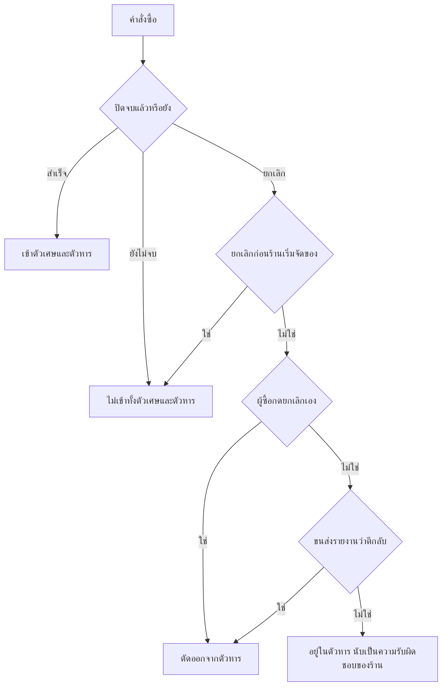
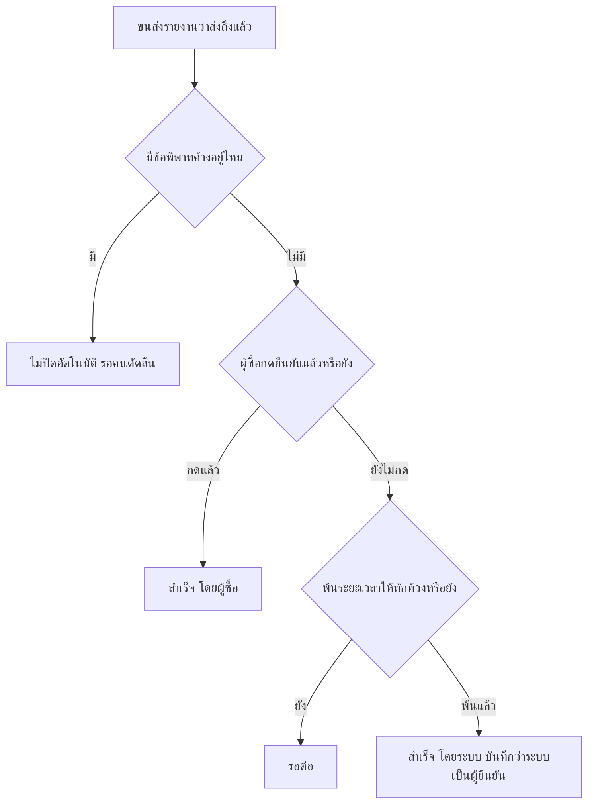

> **โมดูล:** M39-OrderSuccessMetrics
> **ประเภทเอกสาร:** Product Requirements Document (PRD)
> **เวอร์ชัน:** 1.0
> **วันที่จัดทำ:** 2026-08-08
> **สถานะ:** Draft — รอ user review
> **เจ้าของเอกสาร:** BA + PO + PM

# PRD: ตัวชี้วัดความสำเร็จของคำสั่งซื้อ

---

## Executive Summary

หน้าโปรไฟล์ร้านสาธารณะของ Deep แสดงตัวเลขสองอย่างที่ผู้ซื้อใช้ตัดสินใจว่าจะโอนเงินให้ร้านที่ไม่เคยซื้อด้วยหรือไม่ — **จำนวนคำสั่งซื้อที่ส่งสำเร็จ** และ **อัตราความสำเร็จ** ทั้งสองค่าวันนี้ให้ตัวเลขที่ไม่ตรงกับความจริงในทิศทางที่เสียหายทั้งคู่: จำนวนที่แสดง **ต่ำกว่าของที่ส่งถึงมือลูกค้าจริง** เพราะนับเฉพาะใบที่ผู้ซื้อกดยืนยันเอง และอัตราความสำเร็จ **ลงโทษร้านสำหรับสิ่งที่ร้านไม่ได้ทำผิด** เพราะเหมารวมทุกการยกเลิกว่าเป็นความผิดของร้าน รวมถึงกรณีที่ลูกค้าไม่โอนเงินหรือไม่ยอมรับพัสดุ

ระบบนี้แก้ทั้งสองด้าน โดยเปลี่ยนนิยามของ "สำเร็จ" ให้ผูกกับ **หลักฐานที่ปลอมยาก** แทนการกระทำที่ฝ่ายใดฝ่ายหนึ่งควบคุมได้เอง — ของที่ขนส่งยืนยันว่าส่งถึงแล้วจะถูกนับว่าสำเร็จแม้ผู้ซื้อจะลืมกดยืนยัน และการยกเลิกจะถูกตัดออกจากการคำนวณเฉพาะเมื่อมีหลักฐานเชิงระบบว่าไม่ใช่ความผิดของร้าน (ผู้ซื้อกดยกเลิกเอง หรือขนส่งตีพัสดุกลับ) ไม่ใช่เพราะร้านเลือกเหตุผลเอง

ผู้ได้ประโยชน์คือ **ผู้ซื้อ** (ตัวเลขที่ตรวจสอบได้จริง ไม่ถูกปั่น) และ **ผู้ขายที่ทำงานถูกต้อง** (ไม่ถูกลงโทษจากพฤติกรรมของลูกค้า) ผลลัพธ์ทางธุรกิจคือหน้าโปรไฟล์ทำหน้าที่ตามที่แพลตฟอร์มสัญญาไว้ได้จริง — เป็นหลักฐาน ไม่ใช่ป้ายโฆษณา

---

## 1. Business Goals & KPIs

### 1.1 เป้าหมายทางธุรกิจ

| เป้าหมาย | รายละเอียด |
|----------|-----------|
| **ตัวเลขบนหน้าโปรไฟล์ตรงกับความจริง** | จำนวนที่แสดงต้องสะท้อนปริมาณของที่ถึงมือลูกค้าจริง ไม่ใช่ปริมาณที่ลูกค้าจำได้ว่าต้องกดปุ่ม |
| **ไม่ลงโทษร้านจากพฤติกรรมของลูกค้า** | ลูกค้าไม่โอน / ไม่รับพัสดุ / ขอยกเลิกเอง ต้องไม่ทำให้อัตราความสำเร็จของร้านลดลง |
| **ตัวเลขปั่นไม่ได้** | ร้านต้องไม่สามารถทำให้ตัวเลขดูดีขึ้นด้วยการเลือกเหตุผล การไม่ปิดงาน หรือการสร้างออเดอร์เอง |
| **ผู้ซื้อคำนวณย้อนกลับได้** | ทุก % ที่แสดงต้องมีตัวหารและจำนวนที่ถูกตัดออกกำกับ ให้ผู้อ่านบวกตามได้ |

### 1.2 ตัวชี้วัดความสำเร็จ (KPIs)

| KPI | คำอธิบาย | เป้าหมาย |
|-----|----------|---------|
| **ช่องว่างของการนับ** | (ออเดอร์ที่ขนส่งยืนยันว่าส่งถึง) − (ออเดอร์ที่ถูกนับว่าสำเร็จ) | 0 หลังพ้นระยะทักท้วง |
| **สัดส่วนใบที่ค้างไม่ปิด** | ออเดอร์ที่ส่งถึงแล้วแต่ยังไม่เป็น CONFIRMED หลัง 14 วัน ÷ ออเดอร์ที่ส่งถึงทั้งหมด | < 5% |
| **ความครบของเหตุผลยกเลิก** | ออเดอร์ที่ยกเลิกและมีเหตุผลบันทึก ÷ ออเดอร์ที่ยกเลิกทั้งหมด (นับตั้งแต่วันเริ่มใช้) | 100% |
| **ร้านที่แสดง % ได้** | ร้านที่มีออเดอร์ปิดจบถึงเกณฑ์ขั้นต่ำ ÷ ร้านที่มีออเดอร์สำเร็จอย่างน้อย 1 ใบ | เพิ่มขึ้นตามเวลา |

---

## 2. User Personas (กลุ่มผู้ใช้งาน)

### 2.1 ผู้ซื้อที่ยังไม่เคยซื้อกับร้านนี้

**ข้อมูลพื้นฐาน:**
- เจอลิงก์คำสั่งซื้อจากแชท Facebook/LINE ของร้าน หรือกดเข้าหน้าโปรไฟล์ร้านก่อนตัดสินใจ
- ส่วนใหญ่ไม่รู้จัก Deep มาก่อน เห็นเป็นครั้งแรกในฐานะผู้เยี่ยมชม
- กำลังจะโอนเงินให้คนแปลกหน้าโดยไม่มีตัวกลางถือเงิน

**เป้าหมาย:**
- รู้ให้ได้ภายในไม่กี่วินาทีว่าร้านนี้เคยส่งของจริงไหม และเคยมีปัญหาบ่อยแค่ไหน

**ความต้องการ:**
- ตัวเลขที่ตรวจสอบเองได้ ไม่ใช่คำกล่าวอ้าง
- รู้ว่าตัวเลขมาจากไหน ใครเป็นคนนับ

**จุดปวด (Pain Points):**
- เห็น "81%" แล้วไม่รู้ว่าหารด้วยอะไร คิดย้อนกลับไม่ได้เลย
- เห็นตัวเลขที่ร้านเขียนเองบนแพลตฟอร์มอื่นมาเยอะจนไม่เชื่อตัวเลขใด ๆ ถ้าไม่รู้ที่มา

### 2.2 ผู้ขายที่ทำงานถูกต้อง

**ข้อมูลพื้นฐาน:**
- ร้านออนไลน์ขนาดเล็ก ขายผ่านแชทเป็นหลัก ส่งของจริงทุกใบ
- เจอลูกค้าที่ทักมาสั่งแล้วเงียบหายไม่โอน หรือสั่งแล้วไม่ไปรับพัสดุ เป็นเรื่องปกติของธุรกิจ

**เป้าหมาย:**
- ให้หน้าโปรไฟล์เป็นหลักฐานที่ช่วยปิดการขาย ไม่ใช่สิ่งที่ต้องคอยอธิบาย

**ความต้องการ:**
- การยกเลิกที่เกิดจากฝั่งลูกค้าต้องไม่ถูกนับเป็นความผิดของร้าน
- ของที่ส่งถึงแล้วต้องถูกนับ แม้ลูกค้าจะไม่กดยืนยัน

**จุดปวด (Pain Points):**
- ยิ่งขายเยอะ ยิ่งเจอลูกค้าเบี้ยวเยอะ อัตราความสำเร็จยิ่งลด — ทำถูกทุกอย่างแล้วตัวเลขยังแย่ลง
- ลูกค้าจำนวนมากไม่กดยืนยันรับของ ทำให้ตัวเลขบนโปรไฟล์ต่ำกว่ายอดขายจริงมาก

### 2.3 ผู้ขายที่ตั้งใจปั่นตัวเลข / มิจฉาชีพ

**ข้อมูลพื้นฐาน:**
- เปิดร้านใหม่ ต้องการให้หน้าโปรไฟล์ดูน่าเชื่อถือเร็วที่สุดโดยไม่ต้องขายจริง

**เป้าหมาย (ของเขา — ระบบต้องขวาง):**
- สร้างออเดอร์เอง กดยืนยันเอง ให้ได้ตัวเลขสวย
- เลือกเหตุผลยกเลิกเป็น "ลูกค้าผิด" ทุกครั้ง
- ไม่ปิดงานที่มีปัญหา ปล่อยค้างไว้เพื่อไม่ให้เข้าตัวหาร

**จุดที่ระบบต้องปิด:**
- เกณฑ์ขั้นต่ำก่อนแสดง % · การนับผู้ซื้อไม่ซ้ำหน้า · การไม่เชื่อเหตุผลที่ร้านกรอกเพียงลำพัง · การปิดงานอัตโนมัติเมื่อของถึงแล้ว

### 2.4 ทีมงาน Deep (แอดมิน)

**ข้อมูลพื้นฐาน:**
- ต้องตอบร้านได้เมื่อร้านทักมาถามว่าทำไมตัวเลขเป็นแบบนี้

**ความต้องการ:**
- ทุกการตัดออกจากตัวหารต้องตามรอยได้ว่าเกิดจากเหตุการณ์ไหน เวลาใด

**จุดปวด:**
- วันนี้ไม่มีข้อมูลว่าออเดอร์ถูกยกเลิกเพราะอะไร ตอบร้านไม่ได้เลย

---

## 3. Business Requirements

### 3.1 นิยามใหม่ของ "คำสั่งซื้อที่ส่งสำเร็จ"

**ความต้องการ:**
- จำนวนที่แสดงบนหน้าโปรไฟล์ต้องเท่ากับจำนวนคำสั่งซื้อที่ **ของถึงมือผู้ซื้อจริง**
- ของที่ขนส่งยืนยันว่าส่งถึงแล้ว ต้องถูกนับ แม้ผู้ซื้อจะไม่กดยืนยัน

**Business Rules:**
- คำสั่งซื้อถือว่าสำเร็จเมื่อเข้าเงื่อนไขข้อใดข้อหนึ่ง: (ก) ผู้ซื้อกดยืนยันรับของ (ข) ระบบยืนยันให้อัตโนมัติเมื่อ **ขนส่งรายงานว่าส่งถึงแล้ว และพ้นระยะเวลาให้ผู้ซื้อทักท้วง** (ค) เงินเก็บปลายทางถูกเคลียร์แล้ว (กฎเดิมที่มีอยู่)
- **ระยะเวลาให้ทักท้วง = 7 วัน** นับจากเวลาที่ขนส่งรายงานว่าส่งถึง (user เคาะ 2026-08-08)
  - ทำไม 7 ไม่ใช่ 3: ผู้รับจำนวนมากให้คนอื่นรับแทนหรืออยู่ต่างจังหวัด 3 วันไม่พอตรวจของ
  - ทำไม 7 ไม่ใช่ 14: ระบบแสดงป้าย "จัดส่งสำเร็จ" อยู่ 3 วันแล้วหายไปจากหน้าจอ ถ้าปล่อยถึง 14 วัน ทั้งร้านและผู้ซื้อจะลืมไปแล้วว่ามีใบนี้ค้างอยู่
  - ค่านี้ต้องอยู่ที่เดียวในโค้ด ห้าม hardcode ซ้ำ (บทเรียนเดียวกับเพดานเวลาของ feature 00033)
- คำสั่งซื้อที่มีการทักท้วง/รายงานปัญหาค้างอยู่ **ห้ามถูกยืนยันอัตโนมัติ**
- คำสั่งซื้อที่ถูกยกเลิกไปแล้ว ห้ามถูกปลุกกลับมาเป็นสำเร็จไม่ว่ากรณีใด

**เหตุผล:**
- วันนี้คำสั่งซื้อที่ชำระเงินล่วงหน้าและส่งถึงแล้ว จะค้างสถานะเดิมตลอดไปถ้าผู้ซื้อไม่กดยืนยัน ทำให้ตัวเลขบนโปรไฟล์วัด "ความขี้ลืมของผู้ซื้อ" แทนที่จะวัดผลงานของร้าน
- ค่านี้ไม่ได้ใช้แค่บนโปรไฟล์ — คะแนนความน่าเชื่อถือ เหรียญ และยอดขายรายสินค้า ผูกกับสถานะเดียวกันทั้งหมด การแก้ที่สถานะจึงแก้ทุกจอพร้อมกัน ต่างจากการแก้เฉพาะตัวเลขที่แสดงซึ่งจะทำให้แต่ละหน้าพูดไม่ตรงกัน

### 3.2 นิยามใหม่ของ "อัตราความสำเร็จ"

**ความต้องการ:**
- การยกเลิกที่เกิดจากฝั่งผู้ซื้อ ต้องไม่ทำให้อัตราความสำเร็จของร้านลดลง
- ผู้อ่านต้องเห็นตัวหารและจำนวนที่ถูกตัดออก

**Business Rules:**
- ตัวเศษ = คำสั่งซื้อที่สำเร็จตามนิยาม §3.1
- ตัวหาร = คำสั่งซื้อที่ปิดจบแล้วทั้งหมด **ลบด้วย** คำสั่งซื้อที่ถูกยกเลิกโดยไม่ใช่ความผิดของร้าน
- คำสั่งซื้อที่ยังไม่ปิดจบ (ยังรอชำระ / กำลังจัดส่ง) ไม่อยู่ในทั้งตัวเศษและตัวหาร
- แสดง % ได้ต่อเมื่อตัวหารหลังหักแล้วถึงเกณฑ์ขั้นต่ำ **5 ใบ** — ไม่ถึงเกณฑ์ให้แสดงข้อความอธิบาย ไม่ใช่ซ่อนเงียบ และไม่ใช่แสดง 0%
- ทุกครั้งที่แสดง % ต้องแสดงตัวหารกำกับ และถ้ามีใบถูกตัดออกต้องบอกจำนวน
- เริ่มนับเฉพาะคำสั่งซื้อที่เกิดตั้งแต่วันที่ระบบเก็บเหตุผลยกเลิกได้ **ไม่ตัดสินย้อนหลัง** และต้องบอกวันเริ่มนับบนหน้าจอ

**เหตุผล:**
- ร้านที่ขายเยอะย่อมเจอลูกค้าเบี้ยวเยอะตามสัดส่วน สูตรเดิมจึงลงโทษร้านที่ขายดีมากกว่าร้านที่ขายน้อย
- เกณฑ์ 5 ใบมาจากแนวปฏิบัติที่ตรงกันของ Facebook Marketplace (แสดงดาวเมื่อมี ≥5 รีวิว) และ Airbnb Guest Favourite — สูงกว่าเกณฑ์ 3 ที่ระบบเคยตั้งไว้ เพราะตัวหารเล็กลงจากการหักใบที่ไม่ใช่ความผิดร้าน
- การไม่ตัดสินย้อนหลังเลี่ยงได้ทั้งสองความเสี่ยง: ลงโทษร้านจากข้อมูลที่ไม่มี และทำให้ร้านดูสะอาดเกินจริงจากการตัดใบเก่าทิ้ง (เป็น anti-pattern ที่พบใน Etsy)

### 3.3 การตัดสินว่าการยกเลิก "ไม่ใช่ความผิดร้าน"

**ความต้องการ:**
- ระบบต้องตัดสินจากหลักฐานเชิงระบบ ไม่ใช่จากคำบอกเล่าของฝ่ายใดฝ่ายหนึ่ง

**Business Rules:**
- ตัดออกจากตัวหารได้ **เฉพาะ 2 เส้นทาง** เท่านั้น:
  1. **ผู้ซื้อกดยกเลิกเองจากลิงก์คำสั่งซื้อของตัวเอง**
  2. **ขนส่งรายงานว่าพัสดุถูกตีกลับ** (ผู้รับไม่รับ / ติดต่อไม่ได้)
- ร้านต้องเลือกเหตุผลทุกครั้งที่กดยกเลิก และเหตุผลนั้นถูกบันทึกไว้เป็นประวัติ — **แต่เหตุผลที่ร้านเลือกเพียงลำพังไม่ทำให้ใบนั้นถูกตัดออกจากตัวหาร**
- ชุดเหตุผลต้องต่างกันตามประเภทกิจการ (ร้านขายของ / ร้านบริการ / ที่พัก) ไม่ใช่ชุดเดียวใช้ทุกแบบ
- คำสั่งซื้อที่ยกเลิกก่อนร้านเริ่มจัดของ ให้หลุดออกจากทั้งตัวเศษและตัวหาร

**เหตุผล:**
- ทุกแพลตฟอร์มใหญ่ที่สำรวจ (Amazon, eBay, Shopee) **ไม่ไว้ใจเหตุผลที่ผู้ขายกรอก** และตัดสินจากเส้นทางที่ถูกใช้จริงแทน — Amazon ระบุตรง ๆ ว่าถ้าผู้ซื้อทักมาขอยกเลิกแล้วร้านกดยกเลิกให้ จะนับเป็นความผิดของร้าน เพราะไม่มีทางแยกจากกรณีที่ร้านอ้างเอง
- การให้ร้านเลือกเหตุผลได้เองแล้วตัดตัวหารตามนั้น เท่ากับให้ร้านให้คะแนนตัวเอง ซึ่งขัดกับพันธกิจของแพลตฟอร์มโดยตรง
- เหตุผลที่ร้านเลือกยังมีค่าในฐานะข้อมูลให้ร้านและแอดมินใช้ จึงเก็บ แต่ไม่ให้มีอำนาจตัดสิน

### 3.4 การเปิดเผยตัวเลขบนแต่ละหน้าจอ

**ความต้องการ:**
- หน้าที่ผู้ซื้อใช้ศึกษาร้าน กับหน้าที่ผู้ซื้อกำลังจะยืนยันตัวตน ต้องแสดงข้อมูลคนละชุด

**Business Rules:**
- **หน้าโปรไฟล์ร้านสาธารณะ** แสดง: จำนวนคำสั่งซื้อที่ส่งสำเร็จ · อัตราความสำเร็จพร้อมตัวหาร · จำนวนผู้ซื้อไม่ซ้ำหน้า · เพจ/บัญชีทางการที่ยืนยันแล้ว (กดไปหน้าจริงได้)
- **หน้าลิงก์คำสั่งซื้อก่อนเข้าสู่ระบบ** ไม่แสดงอัตราความสำเร็จ — แสดงเฉพาะจำนวนคำสั่งซื้อที่ส่งสำเร็จ ค่าเฉลี่ยรีวิวพร้อมจำนวนรีวิว เพจที่ยืนยันแล้ว และเลขคำสั่งซื้อ
- ทุกค่าเฉลี่ยต้องมีจำนวนตัวอย่างกำกับเสมอ
- ตัวเลขที่แสดงต่อสาธารณะต้องเป็นตัวเลข "นับดี" — ไม่แสดงจำนวนที่ยกเลิก อัตราการยกเลิก หรือค่าที่อ่านเป็นการลงโทษ ต่อผู้ซื้อ

**เหตุผล:**
- หน้าลิงก์คำสั่งซื้อมีพื้นที่แนวตั้งจริงประมาณ 712 พิกเซลในทางเข้าหลัก (เบราว์เซอร์ในแอปแชท) ทุกบรรทัดที่เพิ่มแลกมากับปุ่มที่อาจตกขอบจอ และผู้อ่าน ณ จุดนั้นยังไม่รู้จักแพลตฟอร์ม จึงตรวจสอบตัวเลขไม่ได้อยู่ดี
- จากการสำรวจ 14 แพลตฟอร์ม **ไม่มีมาร์เก็ตเพลสเจ้าใดแสดงอัตราการยกเลิกหรืออัตราความสำเร็จให้ผู้ซื้อเห็น** ทั้งหมดเก็บไว้หลังบ้านแล้วลงโทษผ่านอันดับการค้นหา ซึ่ง Deep ไม่มีกลไกนั้น — Deep จึงยังคง % ไว้บนหน้าโปรไฟล์อย่างจงใจ เพราะเป็นหลักฐานตรงเพียงอย่างเดียวที่มี แต่ไม่นำไปวางในจุดที่ตรวจสอบไม่ได้

### 3.5 การมองเห็นของผู้ขาย

**ความต้องการ:**
- ผู้ขายต้องเห็นตัวเลขของตัวเองละเอียดกว่าที่ผู้ซื้อเห็น และรู้ว่าอะไรทำให้ตัวเลขเปลี่ยน

**Business Rules:**
- ผู้ขายเห็นจำนวนใบที่ถูกตัดออกจากตัวหาร พร้อมเหตุผลรายใบ
- ผู้ขายเห็นรายการคำสั่งซื้อที่ส่งถึงแล้วแต่ยังไม่ปิด และเหลือเวลาอีกเท่าไรก่อนระบบปิดให้
- ข้อมูลด้านลบ (สาเหตุที่ทำให้อัตราลด) แสดงเฉพาะกับเจ้าของร้าน ไม่แสดงต่อผู้ซื้อ

**เหตุผล:**
- ตามแนวทางของ Mercari ที่แยก "คำชมที่คนอื่นเห็น" ออกจาก "สิ่งที่ควรปรับปรุงซึ่งเจ้าของเห็นคนเดียว" — ให้ข้อมูลพอให้แก้ไขได้ โดยไม่เปลี่ยนหน้าโปรไฟล์เป็นใบแจ้งความผิด

---

## 4. Business Rules & Constraints

### 4.1 กฎทางธุรกิจหลัก

| กฎ | คำอธิบาย |
|----|----------|
| **BR-OSM-01 สำเร็จ = ของถึงมือ** | คำสั่งซื้อสำเร็จเมื่อผู้ซื้อยืนยัน หรือขนส่งยืนยันว่าส่งถึงและพ้นระยะทักท้วง หรือเงินปลายทางถูกเคลียร์ |
| **BR-OSM-02 ห้ามปลุกใบที่ยกเลิกแล้ว** | คำสั่งซื้อที่ยกเลิกแล้วห้ามเปลี่ยนกลับเป็นสำเร็จทุกกรณี |
| **BR-OSM-03 ห้ามปิดอัตโนมัติเมื่อมีข้อพิพาท** | ใบที่มีการทักท้วงค้างอยู่ต้องรอคนตัดสิน ไม่ปิดให้เอง |
| **BR-OSM-04 ตัดตัวหารได้ 2 เส้นทางเท่านั้น** | ผู้ซื้อกดยกเลิกเอง หรือพัสดุถูกตีกลับ — นอกนั้นนับเป็นความผิดร้านทั้งหมด |
| **BR-OSM-05 เหตุผลที่ร้านเลือกไม่มีอำนาจตัดสิน** | บันทึกไว้เป็นประวัติและให้แอดมินใช้ แต่ไม่ทำให้ใบนั้นหลุดจากตัวหาร |
| **BR-OSM-06 เกณฑ์ขั้นต่ำ 5 ใบ** | ตัวหารหลังหักแล้วต่ำกว่า 5 ห้ามแสดงเป็นเปอร์เซ็นต์ |
| **BR-OSM-07 ต้องแสดงตัวหารเสมอ** | ทุก % ต้องมีจำนวนใบที่ใช้คำนวณกำกับ และระบุจำนวนที่ถูกตัดออกถ้ามี |
| **BR-OSM-08 ไม่ตัดสินย้อนหลัง** | คำสั่งซื้อที่ปิดจบก่อนวันเริ่มใช้ระบบนี้ ไม่เข้าการคำนวณ และต้องบอกวันเริ่มนับบนหน้าจอ |
| **BR-OSM-09 นับผู้ซื้อไม่ซ้ำหน้า** | จำนวนผู้ซื้อนับตามตัวบุคคล ไม่ใช่จำนวนใบ เพื่อให้การสร้างออเดอร์ซ้ำกับตัวเองไม่เพิ่มตัวเลข |
| **BR-OSM-10 สูตรเดียวทั้งระบบ** | ทุกหน้าจอที่แสดงค่านี้ต้องคำนวณจากแหล่งเดียว ห้ามเขียนสูตรซ้ำ |
| **BR-OSM-11 ร้านต้องเลือกเหตุผลทุกครั้งที่ยกเลิก** | ยกเลิกโดยไม่เลือกเหตุผลไม่ได้ ชุดเหตุผลต่างกันตามประเภทกิจการ |
| **BR-OSM-12 ตัวเลขสาธารณะเป็นตัวเลขนับดี** | ไม่แสดงจำนวนยกเลิกหรืออัตราการยกเลิกต่อผู้ซื้อ |

### 4.2 ข้อจำกัดทางธุรกิจ

| ข้อจำกัด | รายละเอียด |
|---------|-----------|
| **ไม่มีข้อมูลเหตุผลยกเลิกย้อนหลัง** | คำสั่งซื้อที่ยกเลิกก่อนหน้านี้ไม่มีบันทึกว่าใครผิด จึงตัดสินย้อนหลังไม่ได้ — เป็นที่มาของ BR-OSM-08 |
| **สถานะจากขนส่งมีเฉพาะพัสดุที่เปิดผ่านระบบ** | ร้านที่ส่งเองแล้วกรอกเลขพัสดุด้วยมือ ระบบไม่รู้ว่าส่งถึงหรือยัง จึงยืนยันอัตโนมัติให้ไม่ได้ ต้องรอผู้ซื้อกดเอง |
| **Deep ไม่ถือเงิน** | ไม่มีกลไกกักเงินเพื่อบังคับให้ฝ่ายใดทำตาม การตัดสินจึงพึ่งหลักฐานจากขนส่งและการกระทำของผู้ซื้อเท่านั้น |
| **ไม่มีอันดับการค้นหาให้ลงโทษ** | ต่างจากมาร์เก็ตเพลสอื่นที่ซ่อนตัวเลขแล้วลงโทษผ่านอันดับ Deep ต้องเปิดเผยตัวเลขตรง ๆ เพราะเป็นกลไกเดียวที่มี |
| **ฐานผู้ใช้ยังเล็ก** | ร้านส่วนใหญ่มีออเดอร์หลักสิบ เกณฑ์ขั้นต่ำจึงมีผลกับร้านจำนวนมาก ต้องออกแบบสถานะ "ยังสรุปไม่ได้" ให้ไม่ดูเหมือนหน้าพัง |

### 4.3 เหตุผลการยกเลิกที่ระบบต้องรองรับ

ร้านต้องเลือก 1 ข้อทุกครั้งที่กดยกเลิก ชุดคำต่างกันตามประเภทกิจการ:

| กลุ่มเหตุผล | ร้านขายออนไลน์ | ร้านสินค้าและบริการ | ที่พัก |
|---|---|---|---|
| ลูกค้าไม่จ่าย/ไม่มา | ลูกค้าไม่โอนเงิน | ลูกค้าไม่มาตามนัด | *(ใช้ชุดเดิมของระบบจอง)* |
| ลูกค้าขอยกเลิก | ลูกค้าขอยกเลิก | ลูกค้าขอยกเลิก | |
| ฝั่งร้าน | สินค้ามีปัญหา หรือเหตุผลของร้าน | ร้านติดปัญหา ให้บริการไม่ได้ | |
| ตกลงร่วมกัน | ตกลงกันได้ | ตกลงกันได้ | |

> **หมายเหตุสำคัญ:** ตารางนี้เป็นข้อมูลเชิงประวัติเท่านั้น การตัดออกจากตัวหารตัดสินด้วย BR-OSM-04 (เส้นทางที่ถูกใช้) ไม่ใช่ด้วยตารางนี้

---

## 5. Out of Scope (นอกขอบเขต)

| หัวข้อ | คำอธิบาย |
|--------|----------|
| **การอุทธรณ์ตัวเลขกับแอดมิน** | ร้านที่ไม่เห็นด้วยกับการนับยังไม่มีช่องทางยื่นเรื่อง — พิจารณาภายหลังเมื่อมีปริมาณเคสจริง |
| **การลงโทษร้านที่ตัวเลขต่ำ** | ระบบนี้แสดงผลอย่างเดียว ไม่ระงับร้าน ไม่จำกัดจำนวนออเดอร์ ไม่กดอันดับ |
| **แปลงตัวเลขเป็นป้าย/ระดับ** | ยังคงแสดงเป็นตัวเลขตรง ๆ ตามจุดยืนความโปร่งใส — การแปลงเป็นป้ายแบบ Mercari/Etsy เป็นทางเลือกในอนาคต |
| **ตัดสินย้อนหลังคำสั่งซื้อเก่า** | ตาม BR-OSM-08 |
| **ยืนยันอัตโนมัติสำหรับพัสดุที่ร้านกรอกเลขเอง** | ระบบไม่มีสถานะจากขนส่ง จึงทำไม่ได้ |
| **การเปิดเผยรายการสินค้าก่อนเข้าสู่ระบบ** | คงมติเดิม 2026-07-25 ไม่เปลี่ยนในระบบนี้ |
| **สร้างระบบข้อพิพาทเต็มรูป** | ระบบนี้ต้องการเพียงธงว่า "มีข้อพิพาทค้างอยู่" เพื่อกันการปิดอัตโนมัติ ไม่ได้สร้างกระบวนการตัดสินข้อพิพาท |

---

## 6. Risks & Mitigation

### 6.1 ความเสี่ยงทางธุรกิจ

| ความเสี่ยง | ผลกระทบ | ระดับ | แนวทางแก้ไข |
|-----------|---------|-------|-------------|
| **ร้านหลอกให้ผู้ซื้อกดยกเลิกเอง** เพื่อไม่ให้เข้าตัวหาร | ตัวเลขสูงเกินจริง | สูง | เฝ้าดูสัดส่วนใบที่ผู้ซื้อกดยกเลิกเทียบทั้งระบบ ร้านที่สูงผิดปกติให้แอดมินตรวจ — Shopee ใช้วิธีเดียวกันและมีบทลงโทษรองรับ |
| **ปิดงานอัตโนมัติทั้งที่ของยังไม่ถึงจริง** | ผู้ซื้อเสียสิทธิ์ทักท้วง ความเชื่อมั่นพัง | สูง | ผูกกับสถานะจากขนส่งเท่านั้น + ระยะเวลาให้ทักท้วง + ห้ามปิดใบที่มีข้อพิพาท |
| **ตัวเลขเพิ่มขึ้นทันทีวันที่เริ่มใช้** จนดูเหมือนถูกปั่น | ผู้ซื้อสงสัยความน่าเชื่อถือ | กลาง | ระบุวันเริ่มนับบนหน้าจอ และสื่อสารการเปลี่ยนนิยามให้ร้านทราบล่วงหน้า |
| **ร้านส่วนใหญ่ตกเกณฑ์ 5 ใบ** จนหน้าโปรไฟล์ดูว่างเปล่า | เสียประโยชน์จากฟีเจอร์ | กลาง | ออกแบบข้อความสถานะ "ยังสรุปไม่ได้" ให้เป็นกลาง บอกเงื่อนไขที่จะทำให้ตัวเลขปรากฏ |
| **ผู้ซื้อเข้าใจว่า Deep รับประกันการส่ง** | ความคาดหวังผิด นำไปสู่การร้องเรียน | กลาง | ข้อความอธิบายว่า Deep บันทึกและยืนยัน ไม่ได้ถือเงินหรือรับประกัน |

### 6.2 ความเสี่ยงทางเทคนิค

| ความเสี่ยง | ผลกระทบ | แนวทางแก้ไข |
|-----------|---------|-------------|
| **สูตรถูกเขียนซ้ำหลายที่แล้วเพี้ยนแยกกัน** | แต่ละหน้าบอกตัวเลขไม่ตรงกัน | บังคับ BR-OSM-10 — วันนี้มีสูตรเดียวกันเขียนอยู่ 3 ที่ และ 2 ใน 3 ไม่มีเกณฑ์ขั้นต่ำ ต้องยุบเหลือหนึ่งก่อนเพิ่มกฎใหม่ |
| **สถานะจากขนส่งมาช้า/ไม่มา** | ใบค้างไม่ปิด ตัวเลขต่ำกว่าจริงต่อไป | ยังคงให้ผู้ซื้อกดยืนยันเองได้เสมอ การปิดอัตโนมัติเป็นทางเสริมไม่ใช่ทางเดียว |
| **งานปิดอัตโนมัติทำงานซ้ำ** | ประวัติมีรายการซ้ำ ตัวเลขเพี้ยน | ใช้การอัปเดตแบบมีเงื่อนไขที่สถานะปัจจุบัน แบบเดียวกับกลไกเงินปลายทางที่ใช้อยู่แล้ว |
| **การเปลี่ยนนิยามกระทบคะแนนความน่าเชื่อถือทั้งระบบ** | คะแนนร้านขยับพร้อมกันทุกร้าน | ตั้งใจให้เกิด (เป็นการแก้ให้ตรงความจริง) แต่ต้องคำนวณผลกระทบก่อนเปิดใช้ และสื่อสารล่วงหน้า |

---

## 7. Glossary

| คำศัพท์ | ความหมาย |
|---------|----------|
| **คำสั่งซื้อที่ส่งสำเร็จ** | คำสั่งซื้อที่ของถึงมือผู้ซื้อแล้ว ตามนิยาม BR-OSM-01 |
| **ปิดจบ** | คำสั่งซื้อที่จบเรื่องแล้ว ไม่ว่าจะสำเร็จหรือยกเลิก — ไม่รวมใบที่ยังรอชำระหรือกำลังส่ง |
| **ตัวหาร** | จำนวนคำสั่งซื้อที่ปิดจบและอยู่ในความรับผิดชอบของร้าน ใช้เป็นฐานคำนวณอัตราความสำเร็จ |
| **ใบที่ถูกตัดออก** | คำสั่งซื้อที่ยกเลิกด้วยเส้นทางที่ระบบถือว่าไม่ใช่ความผิดร้าน (BR-OSM-04) |
| **ระยะเวลาให้ทักท้วง** | ช่วงเวลา **7 วัน** หลังขนส่งรายงานว่าส่งถึง ที่ผู้ซื้อยังทักท้วงได้ก่อนระบบปิดงานให้ |
| **ผู้ซื้อไม่ซ้ำหน้า** | จำนวนบุคคลที่เคยซื้อสำเร็จกับร้านนี้ นับตัวบุคคลไม่ใช่จำนวนใบ |
| **เส้นทางที่ถูกใช้** | หลักฐานว่าการกระทำเกิดจากใคร วัดจากปุ่มที่ถูกกดและเหตุการณ์ในระบบ ไม่ใช่จากคำอธิบายที่พิมพ์เข้ามา |

---

## 8. Success Metrics

| ตัวชี้วัด | ค่าที่คาดหวัง | วิธีวัด |
|----------|---------------|--------|
| **ออเดอร์ที่ส่งถึงแล้วถูกนับครบ** | 100% หลังพ้นระยะทักท้วง | เทียบจำนวนใบที่ขนส่งรายงานว่าส่งถึง กับจำนวนใบที่สถานะเป็นสำเร็จ |
| **อัตราความสำเร็จเฉลี่ยทั้งระบบสูงขึ้น** | สูงกว่าค่าก่อนเปลี่ยนนิยาม | เทียบค่าเฉลี่ยถ่วงน้ำหนักก่อน/หลัง |
| **ไม่มีร้านที่แสดง % จากตัวหารต่ำกว่า 5** | 0 ร้าน | ตรวจข้อมูลจริงหลังเปิดใช้ |
| **ร้านเข้าใจว่าทำไมตัวเลขเปลี่ยน** | ไม่มีคำถามซ้ำเรื่องที่มาของตัวเลข | นับเรื่องที่ร้านทักเข้ามาถาม |
| **ไม่มีการปิดงานอัตโนมัติผิดพลาด** | 0 เคสที่ผู้ซื้อทักว่ายังไม่ได้ของแต่ระบบปิดไปแล้ว | ติดตามจากเรื่องร้องเรียน |

---

## 9. Dependencies & Assumptions

### 9.1 สิ่งที่ต้องพึ่งพา

| ระบบ/ส่วนประกอบ | ความสัมพันธ์ |
|-----------------|-------------|
| **การเชื่อมต่อขนส่ง (iShip)** | เป็นแหล่งเดียวของสถานะ "ส่งถึงแล้ว" และ "ตีกลับ" ที่ระบบเชื่อถือได้ |
| **สถานะคำสั่งซื้อ** | นิยามใหม่ทำงานบนสถานะเดิม ไม่สร้างสถานะใหม่ |
| **ประวัติเหตุการณ์ของคำสั่งซื้อ** | ใช้บันทึกว่าใครยกเลิก เมื่อไร ด้วยเหตุผลอะไร เพื่อให้ตามรอยได้ |
| **คะแนนความน่าเชื่อถือ / เหรียญ / ยอดขายรายสินค้า** | ผูกกับสถานะสำเร็จ จึงเปลี่ยนตามไปด้วยโดยอัตโนมัติ |
| **หน้าโปรไฟล์ร้านและหน้าลิงก์คำสั่งซื้อ** | เป็นผู้บริโภคตัวเลขปลายทาง |

### 9.2 สมมติฐาน

- สถานะ "ส่งถึงแล้ว" จากขนส่งเชื่อถือได้ในระดับที่ใช้ปิดงานอัตโนมัติได้
- ผู้ซื้อที่ไม่พอใจจะทักท้วงภายในระยะเวลาที่กำหนด ไม่ใช่หลังจากนั้นนาน
- ร้านส่วนใหญ่ยินดีเลือกเหตุผลตอนยกเลิก เพราะได้ประโยชน์จากการที่ใบของลูกค้าไม่มาหักตัวเลข
- ปริมาณคำสั่งซื้อต่อร้านจะโตพอให้ร้านส่วนใหญ่ผ่านเกณฑ์ 5 ใบภายในเวลาอันสมควร

---

## 10. Appendix

### 10.1 ตัวอย่าง User Journey

**Scenario A: ลูกค้าได้ของแล้วแต่ลืมกดยืนยัน**

1. ร้านสร้างคำสั่งซื้อและส่งลิงก์ให้ลูกค้าทางแชท
2. ลูกค้าโอนเงินและร้านเปิดพัสดุผ่านระบบขนส่ง
3. ขนส่งรายงานว่าส่งถึงแล้ว — คำสั่งซื้อขึ้นสถานะ "ส่งถึงแล้ว" ทั้งฝั่งร้านและลูกค้า
4. ลูกค้าไม่ได้กดยืนยันรับของ
5. พ้นระยะเวลาให้ทักท้วง ระบบยืนยันให้เอง บันทึกในประวัติว่าระบบเป็นผู้ยืนยัน
6. หน้าโปรไฟล์ร้านนับใบนี้เป็นคำสั่งซื้อที่ส่งสำเร็จ และคะแนนความน่าเชื่อถือขยับตาม

**Scenario B: ลูกค้าสั่งแล้วเงียบ ไม่โอนเงิน**

1. ร้านสร้างคำสั่งซื้อและส่งลิงก์ให้ลูกค้า
2. ลูกค้าไม่โอนเงินและติดต่อไม่ได้
3. ร้านกดยกเลิก ระบบบังคับให้เลือกเหตุผล ร้านเลือก "ลูกค้าไม่โอนเงิน"
4. เหตุผลถูกบันทึกไว้เป็นประวัติ ร้านและแอดมินเห็นได้
5. **แต่ใบนี้ยังอยู่ในตัวหาร** เพราะไม่ได้ผ่านเส้นทางที่ระบบใช้ตัดสิน (ผู้ซื้อไม่ได้กดยกเลิกเอง และไม่มีพัสดุตีกลับ)
6. ถ้าร้านอยากให้ใบแบบนี้ไม่เข้าตัวหาร ต้องให้ลูกค้ากดยกเลิกจากลิงก์ของตัวเอง

**Scenario C: ลูกค้าไม่ไปรับพัสดุ ของตีกลับ**

1. ร้านส่งของผ่านระบบขนส่งตามปกติ
2. ลูกค้าไม่ไปรับ ขนส่งตีพัสดุกลับร้าน
3. ระบบเห็นสถานะตีกลับจากขนส่ง
4. ร้านกดยกเลิกคำสั่งซื้อ
5. **ใบนี้ถูกตัดออกจากตัวหาร** เพราะมีหลักฐานจากขนส่ง ไม่ใช่คำบอกเล่าของร้าน
6. หน้าโปรไฟล์แสดง "ไม่นับ 1 ใบที่ผู้ซื้อไม่รับของ" กำกับใต้อัตราความสำเร็จ

### 10.2 แผนภาพการตัดสินว่านับอย่างไร

### 10.3 ที่มาของการตัดสินใจหลัก

| การตัดสินใจ | ที่มา |
|---|---|
| ตัดออกจากตัวหารได้ 2 เส้นทางเท่านั้น | แนวปฏิบัติที่ตรงกันของ Amazon / eBay / Shopee ที่ตัดสินจากเส้นทางที่ถูกใช้ ไม่ใช่เหตุผลที่ผู้ขายกรอก |
| เกณฑ์ขั้นต่ำ 5 ใบ | Facebook Marketplace (แสดงดาวเมื่อ ≥5) และ Airbnb Guest Favourite ตรงกัน — สูงกว่าเกณฑ์ 3 เดิมของระบบ |
| ต้องมีจำนวนกำกับค่าเฉลี่ยเสมอ | ผลทดสอบผู้ใช้ของ Baymard Institute พบว่าผู้ใช้จำนวนมากไม่เชื่อค่าเฉลี่ยที่ไม่บอกจำนวน |
| ไม่ตัดสินย้อนหลัง | เลี่ยง anti-pattern ของ Etsy ที่ตัดใบยกเลิกออกจากตัวหารจนร้านดูสะอาดเกินจริง |
| ต้องมีการปิดงานอัตโนมัติ | ทุกแพลตฟอร์มที่สำรวจมีกลไกนี้ ถ้าไม่มี ตัวเลขจะวัดความขี้ลืมของผู้ซื้อแทนผลงานของร้าน |
| คง % ไว้บนหน้าโปรไฟล์แม้ไม่มีใครทำ | Deep ไม่มีอันดับการค้นหาให้ลงโทษร้านแบบที่มาร์เก็ตเพลสอื่นใช้ จึงต้องเปิดเผยตรง ๆ |
| ไม่แสดง % บนหน้าลิงก์คำสั่งซื้อ | พื้นที่จำกัดจริงประมาณ 712 พิกเซล และผู้อ่านยังไม่รู้จักแพลตฟอร์มจนตรวจสอบตัวเลขไม่ได้ |

---

**หมายเหตุ:**
เอกสารนี้บันทึกความต้องการทางธุรกิจโดยไม่มีรายละเอียดทางเทคนิค
สำหรับ Functional Requirements / User Story / Acceptance Criteria ดู [[BRD]] ของโมดูลนี้
สำหรับ technical specification ดู [[SRS]] ของโมดูลนี้
