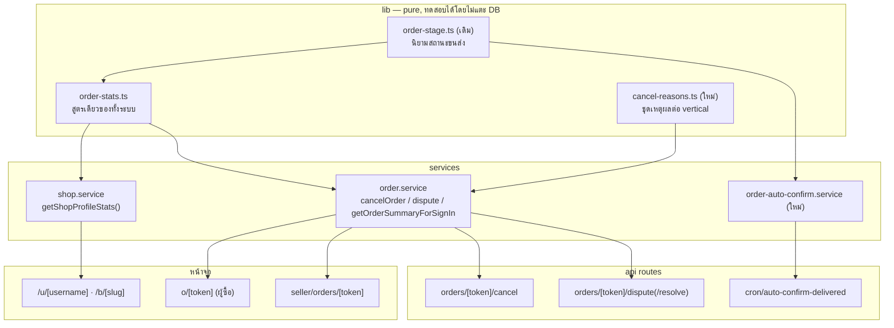
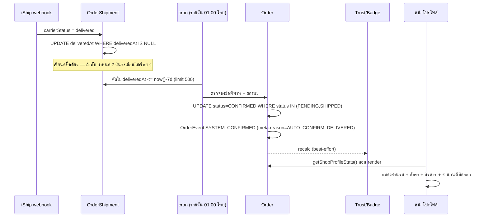

> **โมดูล:** M39-OrderSuccessMetrics · **เวอร์ชัน:** 1.0 · **สถานะ:** Draft

# SDS: ตัวชี้วัดความสำเร็จของคำสั่งซื้อ (System Design Spec)

---

## 1. บทนำ & References

### 1.1 วัตถุประสงค์

อธิบาย **วิธี** ที่จะสร้างสิ่งที่ [[SRS]] กำหนด — โครงไฟล์ ลำดับการทำ และการตัดสินใจเชิงเทคนิคที่มีทางเลือกมากกว่าหนึ่งทาง

### 1.2 ขอบเขตการออกแบบ

service layer · background job · API routes · หน้าจอ 4 หน้า — **ไม่ออกแบบ** กลไก Trust Score/badge ใหม่ (ใช้ของเดิม) และไม่ออกแบบระบบข้อพิพาทเต็มรูป

### 1.3 เอกสารอ้างอิง

[[PRD]] · [[BRD]] · [[SRS]] · [[DATABASE]] · [[API]] · `docs/research/2026-08-08-seller-trust-metrics-benchmark.md`

---

## 2. Architecture Overview

### 2.1 มุมมองสถาปัตยกรรม

**หลักที่ยึด:** ตรรกะการตัดสิน (สูตร · นิยามใบที่ตัดออก · ชุดเหตุผล) อยู่ใน `lib/` ที่เป็น pure function ทั้งหมด — service มีหน้าที่ดึงข้อมูลดิบแล้วส่งเข้าฟังก์ชันเหล่านั้น เหตุผลคือ **ทดสอบกฎได้โดยไม่ต้องมี DB** ซึ่งเป็นสิ่งที่ทำไม่ได้ในโครงปัจจุบัน (สูตรฝังอยู่ใน service ที่ต้อง mock prisma)

### 2.2 มุมมองการ Deploy

- migration 1 ไฟล์ (additive) — `prisma migrate deploy` ทำงานเองตอน deploy
- cron 1 รายการใหม่ใน `vercel.json` เวลา `0 18 * * *` (ไม่ชนช่อง 19:00–23:00 UTC ที่ cron เดิม 5 ตัวจองไว้)
- ไม่มี env var ใหม่

---

## 3. Component Design

| Component | ไฟล์ | สถานะ | หน้าที่ | หมายเหตุ |
|---|---|---|---|---|
| `computeCompletionRate` | `src/lib/order-stats.ts` | **แก้** | รับ `{confirmed, cancelled, excluded}` คืน `{rate, denominator, excluded}` | เปลี่ยน signature = breaking ต่อผู้เรียก ต้องแก้พร้อมกัน |
| `COMPLETION_RATE_MIN_SAMPLE` | เดียวกัน | **แก้** | 3 → 5 | เทสเดิมที่ยืนยันเลข 3 ต้องปรับ ไม่ใช่ลบ |
| `isRateExcludedCancellation` | `src/lib/order-stats.ts` | **ใหม่** | ตัดสินว่าใบนี้หลุดจากตัวหารไหม | pure — รับ `{cancelInitiator, carrierStatus}` ไม่รับ row ดิบ |
| `CANCEL_REASONS_BY_VERTICAL` | `src/lib/cancel-reasons.ts` | **ใหม่** | ชุดเหตุผลต่อ vertical + validator | 🛑 ห้าม reuse `countsAgainstGuest` จาก `lodging.ts` (ความหมายกลับด้าน) |
| `getShopProfileStats` | `src/services/shop.service.ts` | **แก้** | นับ `excluded` เพิ่มใน `Promise.all` เดิม แล้วเรียกสูตรกลาง | ห้ามยิงคิวรีรอบใหม่ |
| `getOrderSummaryForSignIn` | `src/services/order.service.ts` | **แก้** | เลิกคำนวณสูตรเอง | หน้าลิงก์ไม่แสดง % แล้ว แต่ค่ายังถูกส่งเพราะ type ใช้ร่วม |
| `cancelOrder` | `src/services/order.service.ts` | **แก้** | บังคับ `reason` ทุกประเภทเมื่อ initiator=seller | ถอด gate `type==='BOOKING'` |
| `openDispute` / `resolveDispute` | `src/services/order.service.ts` | **ใหม่** | ติด/ปลดธง + บันทึก event | idempotent |
| `autoConfirmDelivered` | `src/services/order-auto-confirm.service.ts` | **ใหม่** | สแกน + ปิดทีละใบ | จำกัด batch · ล้มทีละใบไม่ล้มทั้งชุด |
| หน้าจอ 4 หน้า | ดู [[SRS]] TFR-007 | **แก้** | — | ต้องผ่าน `safepay-ux` ก่อน |

---

## 4. Data Flow

### 4.1 Flow หลัก: ตั้งแต่ของถึงจนตัวเลขบนโปรไฟล์ขยับ

### 4.2 Flow กรณีล้มเหลว / ชดเชย

| กรณี | พฤติกรรม |
|---|---|
| webhook ไม่มา / ขนส่งไม่รายงาน | `deliveredAt` เป็น NULL ตลอด → ไม่ปิดอัตโนมัติ → **รอผู้ซื้อกดเอง (พฤติกรรมเดิม)** ระบบไม่พัง |
| cron ล้มทั้งรอบ | ใบทั้งหมดยังค้าง รอบถัดไปเก็บได้หมด (เงื่อนไขคัดใบเป็น "ค้างเกิน 7 วัน" ไม่ใช่ "ครบ 7 วันพอดี") |
| ปิดใบหนึ่งล้มกลางทาง | transaction ของใบนั้น rollback ใบอื่นไม่กระทบ ใบที่ล้มเข้ารอบหน้า |
| recalc Trust Score ล้ม | ไม่ย้อนสถานะออเดอร์ (ข้อมูลหลักบันทึกแล้ว) — pattern เดิมของ `confirmOrder`/`settleCod` |
| ผู้ซื้อกดยืนยันเสี้ยววินาทีก่อน cron | conditional update คืน 0 แถว → ข้ามใบนั้น ไม่ใช่ error |
| ข้อมูล `excluded > cancelled` | clamp ที่สูตร ไม่ปล่อยตัวหารติดลบ |

---

## 5. Integration Points

| ระบบ | ทิศทาง | สิ่งที่พึ่งพา | ความเสี่ยง |
|---|---|---|---|
| iShip webhook | เข้า | `carrierStatus` | 🛑 บางขนส่งส่งเป็น**ฟีดเหตุการณ์ ไม่ใช่สถานะปัจจุบัน** (เคยเจอ `picked_up` ตั้งแต่ตอนสร้างพัสดุ) ต้องยืนยันค่าจริงของแต่ละเจ้าก่อนใช้ตัดสิน "ถึงแล้ว" |
| Trust Score / Badge | ออก | สถานะ `CONFIRMED` | ตัวเลขทุกร้านจะขยับพร้อมกันวันเปิดใช้ — ต้องประเมินก่อน |
| Vercel Cron | เข้า | ตารางเวลา | ต้องมี secret guard เหมือน cron เดิม 5 ตัว |
| หน้าโปรไฟล์ / หน้าลิงก์ | ออก | ตัวเลขจากสูตรกลาง | ต้องตรงกันทุกหน้า (TFR-001) |

---

## 6. Technical Decisions

### TD-001: คำนวณ "ใบที่ตัดออก" สด ไม่เก็บเป็นคอลัมน์

**ทางเลือก:** (ก) เก็บ `Order.excludedFromRate boolean` ตอนยกเลิก (ข) คำนวณสดทุกครั้งจาก `cancelInitiator` + `carrierStatus`

**เลือก (ข)** — ธงที่เก็บไว้คือภาพนิ่ง ณ เวลาที่เขียน ถ้าสถานะขนส่งเปลี่ยนทีหลัง (พัสดุตีกลับหลังยกเลิก) ธงจะค้างผิด และเราเคยเจอคลาสนี้มาแล้วกับ `Product.fulfillmentMode` จนต้องมี migration ล้างข้อมูล

**ราคาที่จ่าย:** ต้อง join `OrderShipment` ตอนนับ — รับได้เพราะรวมอยู่ใน `Promise.all` เดิม ไม่เพิ่มรอบ

### TD-002: `deliveredAt` เป็นคอลัมน์ใหม่ ไม่ใช้ `carrierStatusAt`

**เลือก:** เพิ่มคอลัมน์ — เพราะ `carrierStatusAt` ถูกเขียนทับทุกครั้งที่สถานะขยับ ใบ COD ที่เดินต่อไป `payment_success` จะเสียเวลา delivered ไป ถ้าใช้ค่านั้นจับ 7 วัน กำหนดปิดจะเลื่อนออกไปทุกครั้งที่มี webhook ใหม่ **โดยไม่มีอะไรฟ้อง**

### TD-003: ใช้ `SYSTEM_CONFIRMED` เดิม ไม่สร้าง event ชนิดใหม่

**เลือก:** ใช้ของเดิม + แยกด้วย `meta.reason` — ชนิด event คือ "เกิดอะไรขึ้น" (ระบบยืนยันให้) ส่วน "เพราะอะไร" เป็นรายละเอียด การเพิ่มชนิดใหม่ทุกครั้งที่มีสาเหตุใหม่จะทำให้ทุกที่ที่ switch บน `type` ต้องแก้ตาม และ enum ที่โตเรื่อย ๆ คือที่มาของบั๊ก "ค่าใหม่ตกเข้า branch ผิดเงียบ ๆ" (บทเรียน 00028)

### TD-004: ธงข้อพิพาทเป็น 2 คอลัมน์เวลา ไม่ใช่ตารางใหม่

**เลือก:** `disputeOpenedAt` + `disputeResolvedAt` บน `Order` — PRD กันระบบข้อพิพาทเต็มรูปไว้ใน Out of Scope แล้ว สิ่งที่ต้องการจริงคือธงกันการปิดอัตโนมัติ การใช้เวลา 2 ตัวแทน boolean ตัวเดียวให้ข้อมูลมากกว่าโดยไม่เพิ่มความซับซ้อน และไม่ปิดทางถ้าอนาคตจะยกเป็นตารางจริง

### TD-005: เกณฑ์ขั้นต่ำ 5 ไม่ใช่ 3

**เลือก 5** — FB Marketplace (แสดงดาวเมื่อ ≥5) และ Airbnb Guest Favourite ตรงกัน และตัวหารของเราเล็กลงจากการหักใบที่ตัดออก เกณฑ์เดิม 3 จึงหลวมเกินไปหลังเปลี่ยนสูตร

**ราคาที่จ่าย:** ร้านจำนวนหนึ่งที่วันนี้แสดง % อยู่ จะกลับไปเป็น "ยังสรุปไม่ได้" — ต้องออกแบบข้อความสถานะนั้นให้ดี ไม่ให้อ่านเป็นหน้าพัง

### TD-006: ย้ายตรรกะเข้า `lib/` ก่อนเพิ่มกฎ

**เลือก:** ยุบสูตร 3 สำเนาเป็นหนึ่งก่อน (TFR-001) แล้วค่อยเพิ่มกฎ — ถ้าเพิ่มก่อนยุบจะได้สำเนาที่สี่ ซึ่งเป็นสาเหตุที่เกณฑ์ 3 ใบพร้อม unit test 11 เคสไม่เคยมีผลกับผู้ใช้จริงเลย

---

## 7. Traceability

| SRS TFR | Component |
|---|---|
| TFR-001 | `order-stats.ts` + ผู้เรียก 2 ที่ |
| TFR-002 | `computeCompletionRate` |
| TFR-003 | `isRateExcludedCancellation` (+ import จาก `order-stage.ts`) |
| TFR-004 | จุดอัปเดต webhook ของ `OrderShipment` |
| TFR-005 | `order-auto-confirm.service.ts` + cron route |
| TFR-006 | `cancel-reasons.ts` + `cancelOrder` |
| TFR-007 | หน้าจอ 4 หน้า (ต้องผ่าน ux gate) |

---

## 8. สรุป

การออกแบบยึดหลักเดียว: **ย้ายกฎออกจาก service ไปอยู่ใน pure function ก่อน แล้วค่อยเพิ่มกฎใหม่** เพราะบทเรียนของฟีเจอร์นี้เองคือกฎที่เขียนไว้ดีแต่ฝังอยู่ในเส้นทางที่ไม่มีใครเรียก มีค่าเท่ากับไม่มีกฎ

จุดเปราะที่สุดคือ `deliveredAt` — ถ้าเขียนทับ ทุกอย่างที่เหลือจะดูเหมือนทำงานปกติ แต่ไม่มีใบไหนถูกปิดเลย และไม่มีสัญญาณใด ๆ บอก ต้องมีเทสที่ยิง webhook สองรอบแล้วยืนยันว่าค่าไม่เปลี่ยน
