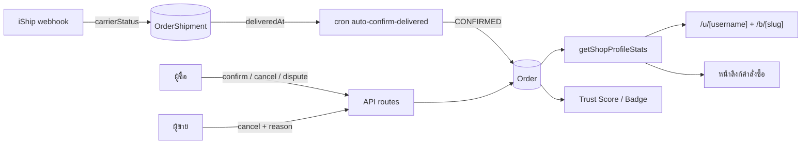

> **โมดูล:** M39-OrderSuccessMetrics · **เวอร์ชัน:** 1.0 · **สถานะ:** Draft

# SRS: ตัวชี้วัดความสำเร็จของคำสั่งซื้อ (Technical)

---

## 1. บทนำ

### 1.1 วัตถุประสงค์ของเอกสาร

แปลง FR ใน [[BRD]] เป็นสเปกที่ developer ลงมือได้ทันที — ระบุไฟล์จริง ฟังก์ชันจริง และ **ลำดับงานที่บังคับ** (มีงานหนึ่งที่ต้องทำก่อนงานอื่นทั้งหมด ดู §3 TFR-001)

### 1.2 ขอบเขตเชิงระบบ

แตะ 4 ชั้น: service layer (สูตรการนับ) · background job (ปิดอัตโนมัติ) · API routes (เหตุผลยกเลิก + ข้อพิพาท) · หน้าจอ 4 หน้า (`/u/[username]`, `/b/[slug]`, หน้าลิงก์คำสั่งซื้อ, หน้ารายละเอียดออเดอร์ฝั่งผู้ขาย)

**ไม่แตะ:** กลไกคำนวณ Trust Score เอง · ระบบเหรียญ · การเชื่อมต่อขนส่ง (อ่านอย่างเดียว)

### 1.3 เอกสารอ้างอิง

- [[PRD]] · [[BRD]] · [[DATABASE]] · [[API]] · [[SDS]]
- `docs/SRS.md` (เอกสารระบบ) — 🛑 **ต้อง sync ด้วย** เพราะงานนี้เปลี่ยนความหมายของ `Order.status` transition และเพิ่ม `OrderEvent.type` (บทเรียน 00033 ที่ค้างจนถูกถามว่าเหลืออะไรอีก)
- `docs/research/2026-08-08-seller-trust-metrics-benchmark.md`
- `docs/conventions/stored-flag-vs-owner-truth.md` · `migration-check-constraint-additive.md` · `enum-value-removal.md`

### 1.4 นิยามและตัวย่อ

| คำ | ความหมายเชิงเทคนิค |
|---|---|
| **สำเร็จ** | `Order.status = 'CONFIRMED'` |
| **ปิดจบ** | `status IN ('CONFIRMED','CANCELLED')` |
| **ตัวหาร** | จำนวนใบปิดจบ ลบใบที่เข้าเงื่อนไขตัดออก |
| **ใบที่ตัดออก** | `status='CANCELLED'` และ (`cancelInitiator='buyer'` หรือมีพัสดุที่ `carrierStatus` อยู่ในกลุ่มตีกลับ) |
| **มีข้อพิพาทค้าง** | `disputeOpenedAt IS NOT NULL AND disputeResolvedAt IS NULL` |

---

## 2. ภาพรวมสถาปัตยกรรม

### 2.1 บริบทระบบ



### 2.2 องค์ประกอบหลัก

| องค์ประกอบ | ไฟล์ | หน้าที่ |
|---|---|---|
| สูตรการนับ (SSOT) | `src/lib/order-stats.ts` | pure function — ตัวเศษ/ตัวหาร/เกณฑ์ขั้นต่ำ |
| ตัวรวบรวมสถิติร้าน | `src/services/shop.service.ts` → `getShopProfileStats()` | ดึงข้อมูลดิบแล้วเรียกสูตร |
| สถิติบนหน้าลิงก์ | `src/services/order.service.ts` → `getOrderSummaryForSignIn()` | **ต้องเลิกคำนวณสูตรเอง** |
| ยกเลิก | `src/services/order.service.ts` → `cancelOrder()` | บังคับเหตุผลทุกประเภท |
| ปิดอัตโนมัติ | `src/app/api/cron/auto-confirm-delivered/route.ts` (ใหม่) | สแกน + ปิด |
| ธงข้อพิพาท | `src/services/order.service.ts` (ฟังก์ชันใหม่) | เปิด/ปิดเรื่อง |

### 2.3 มุมมองการ Deploy

- cron ใหม่ 1 รายการใน `vercel.json` (`0 18 * * *`)
- migration 1 ไฟล์ (additive ล้วน ดู [[DATABASE]])
- 🛑 push `main` = `prisma migrate deploy` ทำงานอัตโนมัติ **ไม่ต้องสั่ง migrate ชี้ prod ด้วยมือ** (Hard Rule 15) — ฐาน local ยังต้อง apply เอง

---

## 3. ข้อกำหนดเชิงฟังก์ชันเชิงเทคนิค

### TFR-001: ยุบสูตรที่เขียนซ้ำให้เหลือที่เดียว — 🛑 **ต้องทำก่อนทุกงานในเอกสารนี้**

**สถานะปัจจุบัน:** สูตร `confirmed / (confirmed + cancelled)` มีอยู่ **3 สำเนา**

| ที่ | มีเกณฑ์ขั้นต่ำไหม | ใครใช้ |
|---|---|---|
| `src/lib/order-stats.ts:32` `computeCompletionRate()` | ✅ มี (3 ใบ) + unit test 11 เคส | **ไม่มีหน้าจอไหนใช้แล้ว** (ถูกถอดออกจาก page ทั้งสองเมื่อ `e168c94a`) |
| `src/services/shop.service.ts:296` | ❌ ไม่มี | หน้าโปรไฟล์ทั้งสองเส้น |
| `src/services/order.service.ts:1568` | ❌ ไม่มี | หน้าลิงก์คำสั่งซื้อ |

**ต้องทำ:** ให้สำเนาที่ 2 และ 3 เรียก `order-stats.ts` แทนการคำนวณเอง แล้วขยายฟังก์ชันนั้นให้รับพารามิเตอร์ใหม่

**เหตุผลที่ต้องทำก่อน:** ถ้าเพิ่มกฎใหม่ (หักใบที่ตัดออก + เกณฑ์ 5) ลงไปโดยไม่ยุบก่อน จะได้**สำเนาที่สี่** และกฎจะทำงานไม่เท่ากันในแต่ละหน้า ซึ่งเป็นอาการเดิมที่ทำให้เกณฑ์ 3 ใบไม่เคยมีผลเลย

**Acceptance:** `rg "confirmed.*/.*settled|confirmedCount / " src/` คืนผลเฉพาะใน `order-stats.ts`

---

### TFR-002: ขยายสูตรให้รองรับการหักใบที่ตัดออก + เกณฑ์ 5

**สัญญาใหม่ของ `order-stats.ts`**

```
computeCompletionRate(input: {
  confirmed: number      // ตัวเศษ
  cancelled: number      // ยกเลิกทั้งหมดที่ปิดจบ
  excluded: number       // ใบที่ตัดออก (⊆ cancelled)
}): { rate: number | null; denominator: number; excluded: number }
```

- `denominator = confirmed + cancelled - excluded`
- `denominator < COMPLETION_RATE_MIN_SAMPLE` → `rate = null` (ยังต้องคืน `denominator`/`excluded` ให้ UI ใช้อธิบาย)
- `COMPLETION_RATE_MIN_SAMPLE` เปลี่ยน **3 → 5**
- ปัดเศษด้วย `Math.round` เหมือนเดิม
- 🛑 `excluded > cancelled` = ข้อมูลผิด ต้อง clamp ไม่ใช่ปล่อยให้ตัวหารติดลบ

**เทสเดิม 11 เคสต้องถูกปรับ ไม่ใช่ลบทิ้ง** — เคสที่ยืนยันเกณฑ์ 3 เปลี่ยนเป็น 5 และเพิ่มเคสใหม่: `excluded` ทำให้ตกจากผ่านเกณฑ์เป็นไม่ผ่าน

---

### TFR-003: นิยาม "ใบที่ตัดออก" — คำนวณสด ห้ามเก็บเป็นธง

ใบหนึ่งถูกตัดออกเมื่อ `status='CANCELLED'` **และ** เข้าข้อใดข้อหนึ่ง:

1. `cancelInitiator = 'buyer'`
2. มี `OrderShipment` ที่ `status='CREATED' AND isDryRun=false` และ `carrierStatus` อยู่ในกลุ่มตีกลับ

🛑 **กลุ่ม "ตีกลับ" ต้อง import จากที่เดียว** — `src/lib/order-stage.ts` มีนิยามอยู่แล้ว (`return`, `return_success`) ห้ามเขียนรายชื่อสถานะซ้ำในไฟล์นี้ เพราะเคยเกิดกรณีที่นิยาม "มีปัญหา" สองที่ไม่ตรงกันจนตัวกรองกรองแล้วได้ผลไม่ตรงกับตัวนับ

🛑 **นิยาม "ออเดอร์นี้มีพัสดุจริง" = `status='CREATED' AND isDryRun=false`** — ต้องใช้เกณฑ์เดียวกับที่ระบบใช้อยู่ ห้ามใช้ `status <> 'CANCELLED'` ซึ่งจะนับใบ `FAILED` ด้วย (บั๊กที่แก้ไปแล้วเมื่อ 2026-08-06 แต่รอดมาที่ call site อื่น)

---

### TFR-004: เขียน `deliveredAt` แบบเขียนครั้งเดียว

จุดที่ webhook อัปเดต `carrierStatus` ต้องเขียน `deliveredAt` ด้วย **เฉพาะเมื่อยังเป็น NULL**

```
UPDATE "OrderShipment" SET "deliveredAt" = <เวลาที่ขนส่งรายงาน>
WHERE id = ? AND "deliveredAt" IS NULL AND <carrierStatus อยู่ในกลุ่มถึงมือแล้วหรือไกลกว่า>
```

🛑 กลุ่ม "ถึงมือแล้วหรือไกลกว่า" ต้องครอบ `delivered` **และสถานะที่ไกลกว่านั้น** (เช่นเงิน COD เข้าแล้ว) — `order-stage.ts:309` มีตรรกะนี้อยู่แล้วเพราะเคยเจอบั๊กที่ใบ COD ได้เงินแล้วตกกลับไปเป็น "สร้างพัสดุแล้ว"

🛑 **ห้ามใช้ `carrierStatusAt` แทน** — ค่านั้นถูกเขียนทับทุกครั้งที่สถานะขยับ (เหตุผลเต็มใน [[DATABASE]] §3.1)

---

### TFR-005: งานปิดอัตโนมัติ

ดูสเปก endpoint และเงื่อนไขคัดใบใน [[API]] §4.4 — ข้อกำหนดเชิงเทคนิคเพิ่มเติม:

- ปิด **ทีละใบใน transaction ของตัวเอง** ใบที่ล้มข้ามไปรอบหน้า ไม่ล้มทั้ง batch
- conditional update — `count = 0` คือกรณีปกติ (มีคนทำไปก่อน) ไม่ log เป็น error
- **จำกัดจำนวนต่อรอบ** (เช่น 500 ใบ) กัน timeout ของ serverless — ใบที่เหลือรอรอบหน้า
- recalc Trust Score/badge ต่อท้ายแบบ best-effort ล้มแล้วไม่ย้อนสถานะ (pattern เดิมของ `confirmOrder`)
- ต้องเขียน `console.error` เมื่อล้ม — **ห้าม fail-silent** (บทเรียน iShip: ฟีเจอร์ที่ล้มเงียบพังบน prod อยู่หลายเดือนโดยไม่มีใครเห็น)

---

### TFR-006: บังคับเหตุผลยกเลิก + แยกชุดตาม vertical

- `cancelOrder()` ต้องรับ `reason` เป็น **บังคับ** เมื่อ `initiator='seller'` ทุกประเภทออเดอร์ (เดิม gate ด้วย `type==='BOOKING'`)
- `initiator='buyer'` → ระบบตั้งเหตุผลให้เอง ไม่ถาม (pattern เดิมของการจอง)
- ชุดค่าต่อ vertical ประกาศไว้ **ที่เดียว** — ขยาย `src/lib/lodging.ts` หรือย้ายออกมาเป็นโมดูลกลาง
- 🛑 **ห้ามยืมชื่อ flag `countsAgainstGuest` มาใช้ตรง ๆ** — ความหมายกลับด้าน (อันนั้น = นับเข้าประวัติผู้จอง) ตั้งชื่อใหม่
- ต้องขยาย type union ของค่าเหตุผลให้ TypeScript บังคับ key ครบ ไม่พึ่ง grep อย่างเดียว (`docs/conventions/enum-value-removal.md`)

---

### TFR-007: การแสดงผล

| หน้า | เปลี่ยนอะไร |
|---|---|
| `/u/[username]` · `/b/[slug]` | แสดง 2 ตัวเลขคนละน้ำหนัก (จำนวน 22px / อัตรา 32px Verified Ink) · caption ตัวหาร + จำนวนที่ตัดออก (ซ่อนเมื่อ 0) · สถานะ "ยังสรุปไม่ได้" เมื่อตัวหาร < 5 · ระบุวันเริ่มนับ · ย้ายช่องทางที่ยืนยันแล้วขึ้นหัวโปรไฟล์ + ถอดออกจากแท็บ · ย้าย "ซื้อซ้ำ" ไปแท็บเกี่ยวกับร้าน แสดงเมื่อ > 0 |
| หน้าลิงก์คำสั่งซื้อ | ✅ **ทำไปแล้ว** เมื่อ `e168c94a` (ตัด % ออก + คอนทราสต์ + แบนเนอร์ + drag handle) |
| หน้าออเดอร์ฝั่งผู้ซื้อ | แสดงเวลาที่เหลือก่อนระบบปิดให้ + ปุ่มยกเลิกของตัวเอง + ปุ่มทักท้วง |
| หน้าออเดอร์ฝั่งผู้ขาย | โมดัลเลือกเหตุผลตอนยกเลิก · ตัวกรอง "ส่งถึงแล้วรอปิด" · จำนวนใบที่ถูกตัดออก |

🛑 ทุกหน้าต้องผ่าน `safepay-ux` ก่อนแตะโค้ด (Hard Rule 8) — สเปกของหัวโปรไฟล์ผ่านแล้ว (hybrid A+D) ส่วนหน้าออเดอร์ผู้ซื้อ/ผู้ขาย **ยังไม่ผ่าน**

---

## 4. ส่วนต่อประสาน

ดู [[API]] ฉบับเต็ม — สรุป: แก้ `POST /api/orders/[token]/cancel` · เพิ่ม `POST /dispute` · `POST /dispute/resolve` · `GET /api/cron/auto-confirm-delivered`

**Events:** `OrderEvent.type` เพิ่ม 2 ชนิด — `ORDER_DISPUTE_OPENED` · `ORDER_DISPUTE_RESOLVED`
🛑 `SYSTEM_CONFIRMED` **ใช้ของเดิม ไม่สร้างชนิดใหม่** แยกด้วย `meta.reason = 'AUTO_CONFIRM_DELIVERED'`
🛑 คอมเมนต์ใน `schema.prisma` ที่ระบุจำนวนชนิดของ `OrderEvent.type` ต้องอัปเดตด้วย — วันนี้ยังเขียน "9 ค่า" ทั้งที่มี 13 (หนี้ค้างจาก 00033) งานนี้ทำให้เป็น 15

---

## 5. ข้อกำหนดด้านข้อมูล

ดู [[DATABASE]] — สรุป: `OrderShipment.deliveredAt` · `Order.disputeOpenedAt` · `Order.disputeResolvedAt` · ขยายขอบเขต `Order.cancelReason` · partial index บน `deliveredAt` · **ไม่มี backfill**

---

## 6. NFR

| ด้าน | ข้อกำหนด |
|---|---|
| **ความถูกต้อง** | ตัวเลขเดียวกันต้องตรงกันทุกหน้า ณ เวลาเดียวกัน — บังคับด้วย TFR-001 |
| **Idempotency** | cron รันซ้ำต้องไม่สร้าง event ซ้ำและไม่เปลี่ยนอะไรเพิ่ม |
| **ประสิทธิภาพ** | หน้าโปรไฟล์ต้องไม่เพิ่มรอบคิวรี — คิวรีซ้ำถูกตัดไปแล้วเมื่อ `e168c94a` การเพิ่มการนับ `excluded` ต้องรวมอยู่ใน `Promise.all` เดิม ไม่ยิงรอบใหม่ |
| **ความทนทาน** | ไม่มีสถานะจากขนส่ง = ระบบยังทำงานได้ รอผู้ซื้อกดเอง |
| **ความปลอดภัย** | ตรวจสิทธิ์ที่เซิร์ฟเวอร์ทุก endpoint · เหตุผลยกเลิกและใบที่ตัดออกห้ามรั่วสู่หน้าสาธารณะ · หน้าโปรไฟล์อยู่ใต้ client layout ต้องไม่ serialize PII เกินจำเป็น (`feedback_rsc_pii_neutralize_at_source`) |
| **a11y** | ข้อความทุกจุดต้องผ่าน AA 4.5:1 — ห้ามใช้ `text.disabled` กับข้อมูลจริง |

---

## 7. Traceability

| BRD FR | TFR |
|---|---|
| FR-OSM-01 | TFR-004, TFR-005 |
| FR-OSM-02, FR-OSM-03 | TFR-007 |
| FR-OSM-04, FR-OSM-05 | TFR-006 |
| FR-OSM-06, FR-OSM-07 | TFR-003 |
| FR-OSM-08 | TFR-001, TFR-002 |
| FR-OSM-09, FR-OSM-10, FR-OSM-11 | TFR-007 |
| FR-OSM-12 | TFR-007 |

---

## 8. สรุป

งานนี้มี **ลำดับบังคับ**: TFR-001 (ยุบสูตร) ต้องเสร็จก่อนทุกอย่าง ไม่งั้นกฎใหม่จะกลายเป็นสำเนาที่สี่และทำงานไม่เท่ากันในแต่ละหน้า — ซึ่งเป็นอาการเดิมที่ทำให้เกณฑ์ขั้นต่ำที่เขียนไว้อย่างดีพร้อม unit test ไม่เคยมีผลกับผู้ใช้จริงเลยสักครั้ง

ความเสี่ยงเชิงเทคนิคที่ใหญ่ที่สุดไม่ใช่ตัวสูตร แต่คือ **`deliveredAt` ที่ถ้าเผลอเขียนทับ กำหนดปิด 7 วันจะถูกเลื่อนออกไปเรื่อย ๆ โดยไม่มีอะไรฟ้อง** — ไม่มี type error ไม่มี test แดง มีแต่ตัวเลขที่ไม่ขยับ
