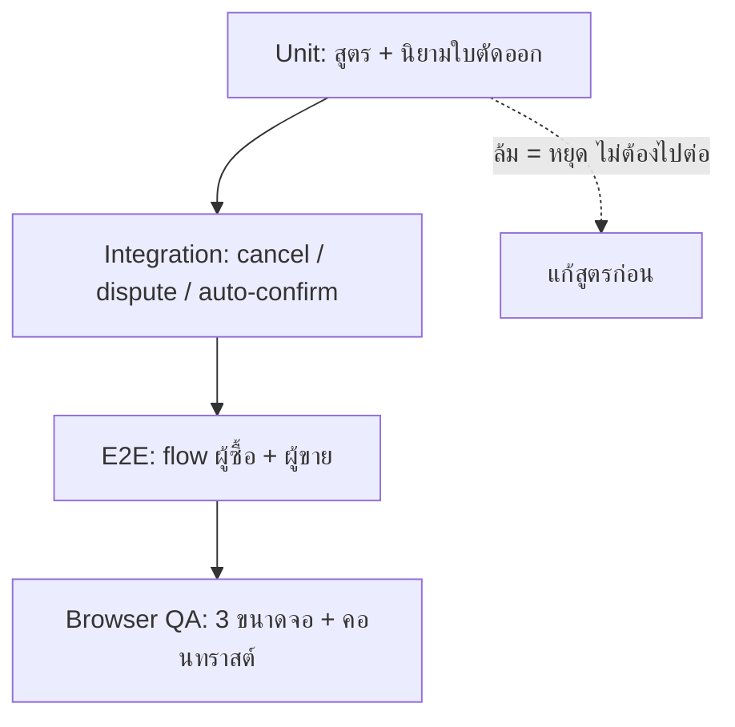

> **โมดูล:** M39-OrderSuccessMetrics · **เวอร์ชัน:** 1.0 · **สถานะ:** Draft

# Test Case: ตัวชี้วัดความสำเร็จของคำสั่งซื้อ

---

## 1. Overview

| ชั้น | เครื่องมือ | ขอบเขต |
|---|---|---|
| Unit | Vitest | สูตร · นิยามใบที่ตัดออก · ชุดเหตุผลต่อ vertical (ทั้งหมดเป็น pure function ไม่แตะ DB) |
| Integration | Vitest + Prisma | `cancelOrder` · `openDispute` · `autoConfirmDelivered` |
| E2E | Playwright | flow ผู้ซื้อยกเลิก/ทักท้วง · โมดัลเหตุผลฝั่งผู้ขาย |
| Browser QA | ตาคน | การแสดงผลบน 3 ขนาดจอ |

🛑 **กฎบังคับของโปรเจกต์ (Hard Rule 13):** ห้ามมี `deleteMany()` ที่ไม่มี `where`, `TRUNCATE`, `DELETE FROM` ที่ไม่มี `WHERE` ในไฟล์เทสเด็ดขาด — dev DB เคยเป็นตัวเดียวกับ prod ล้างข้อมูลระหว่างเทสต้อง scope ด้วย id ที่เทสสร้างเอง (`deleteTestData()` ใน `tests/setup.ts`)

---

## 2. Test Scenarios

### กลุ่ม A — สูตร (Unit, ไม่แตะ DB)

#### TC-A01: เกณฑ์ขั้นต่ำเปลี่ยนเป็น 5
- **ให้:** `confirmed=4, cancelled=0, excluded=0`
- **คาด:** `rate = null`, `denominator = 4`
- **เหตุผล:** เกณฑ์เดิม 3 จะให้ 100% ซึ่งเป็นเคสที่คอมเมนต์ในไฟล์เตือนไว้เองว่า "มิจฉาชีพสร้างได้ใน 5 นาที"

#### TC-A02: ผ่านเกณฑ์พอดี
- **ให้:** `confirmed=5, cancelled=0, excluded=0` → **คาด:** `rate = 100`, `denominator = 5`

#### TC-A03: การหักทำให้ตกจากผ่านเกณฑ์เป็นไม่ผ่าน ⚠️ เคสสำคัญที่สุดของกลุ่มนี้
- **ให้:** `confirmed=4, cancelled=3, excluded=3` → ตัวหาร = 4
- **คาด:** `rate = null` (ไม่ใช่ 100)
- **เหตุผล:** ก่อนหักตัวหาร = 7 ผ่านเกณฑ์ หลังหักเหลือ 4 ไม่ผ่าน — ถ้าเช็คเกณฑ์ก่อนหักจะได้ค่าที่ไม่ควรแสดง

#### TC-A04: ตัวอย่างจริงจาก PRD
- **ให้:** `confirmed=17, cancelled=4, excluded=3` → **คาด:** `rate = 94`, `denominator = 18`, `excluded = 3`

#### TC-A05: ไม่มีใบถูกตัดออก
- **ให้:** `confirmed=17, cancelled=4, excluded=0` → **คาด:** `rate = 81`, `denominator = 21`, `excluded = 0`
- **หมายเหตุ:** UI ต้องไม่แสดงข้อความ "ไม่นับ 0 ใบ"

#### TC-A06: ยกเลิกทั้งหมดและตัดออกทั้งหมด
- **ให้:** `confirmed=0, cancelled=6, excluded=6` → ตัวหาร = 0
- **คาด:** `rate = null` ไม่ใช่ `0%` และไม่ throw

#### TC-A07: ข้อมูลผิดรูป — `excluded > cancelled`
- **ให้:** `confirmed=5, cancelled=2, excluded=4`
- **คาด:** clamp — ตัวหารต้องไม่ติดลบ ไม่ throw

#### TC-A08: ตัวเลข 0 ทุกช่อง
- **ให้:** `confirmed=0, cancelled=0, excluded=0` → **คาด:** `rate = null`, `denominator = 0`

#### TC-A09: เทสเดิม 11 เคสต้องถูกปรับ ไม่ใช่ลบ
- **ตรวจ:** `src/lib/order-stats.test.ts` ยังมีเคสที่ยืนยันการปัดเศษและเคสตัวหาร 0 อยู่ครบ เพียงแต่เลขเกณฑ์เปลี่ยน
- **เหตุผล:** ลบเทสเก่าทิ้งแล้วเขียนใหม่ = เสียหลักฐานว่าพฤติกรรมเดิมข้อไหนตั้งใจ

---

### กลุ่ม B — นิยาม "ใบที่ตัดออก" (Unit)

#### TC-B01: ผู้ซื้อกดยกเลิกเอง → ตัดออก
- **ให้:** `cancelInitiator='buyer'`, ไม่มีพัสดุ → **คาด:** ตัดออก

#### TC-B02: ร้านยกเลิกเอง เหตุผลว่าลูกค้าผิด → **ไม่ตัดออก** ⚠️
- **ให้:** `cancelInitiator='seller'`, `cancelReason='BUYER_NO_PAYMENT'`, ไม่มีพัสดุ
- **คาด:** **อยู่ในตัวหาร**
- **เหตุผล:** BR-OSM-05 — เหตุผลที่ร้านเลือกไม่มีอำนาจตัดสิน นี่คือเคสที่กันร้านให้คะแนนตัวเอง

#### TC-B03: เปลี่ยน `cancelReason` ทุกค่าแล้วผลต้องไม่ขยับ ⚠️
- **ให้:** ใบเดียวกัน วนค่า `cancelReason` ครบทุกค่าของ vertical นั้น
- **คาด:** ผลลัพธ์ "ตัดออก/ไม่ตัดออก" เหมือนกันทุกรอบ
- **เหตุผล:** เป็นเทสที่พิสูจน์ BR-OSM-05 โดยตรง ไม่ใช่แค่เชื่อว่าโค้ดไม่ได้อ่านค่านั้น

#### TC-B04: พัสดุตีกลับ → ตัดออก
- **ให้:** `cancelInitiator='seller'`, พัสดุ `status='CREATED'`, `isDryRun=false`, `carrierStatus='return_success'`
- **คาด:** ตัดออก

#### TC-B05: พัสดุกำลังตีกลับ → ตัดออก
- **ให้:** `carrierStatus='return'` → **คาด:** ตัดออก

#### TC-B06: พัสดุ FAILED ต้องไม่นับว่ามีพัสดุ ⚠️
- **ให้:** พัสดุ `status='FAILED'` และ `carrierStatus='return_success'`
- **คาด:** **ไม่ตัดออก** (ใบนั้นไม่ใช่พัสดุจริง)
- **เหตุผล:** คลาสบั๊กที่เคยเกิดจริง — เกณฑ์ `status <> 'CANCELLED'` นับใบ FAILED ด้วยจนขึ้นชิป "สร้างพัสดุแล้ว" ทั้งที่ไม่มีเลขพัสดุ

#### TC-B07: พัสดุ dry-run ต้องไม่นับ
- **ให้:** `isDryRun=true` → **คาด:** ไม่ตัดออก

#### TC-B08: ใบที่ยังไม่ปิดจบ
- **ให้:** `status='PENDING'` → **คาด:** ไม่เข้าทั้งตัวเศษและตัวหาร

---

### กลุ่ม C — เหตุผลยกเลิก (Unit + Integration)

#### TC-C01: ยกเลิกโดยไม่ส่งเหตุผล → 400
- **ให้:** ผู้ขายเรียก `cancel` ไม่มี `reason` → **คาด:** `400 CANCEL_REASON_REQUIRED` และออเดอร์ยังไม่เปลี่ยนสถานะ

#### TC-C02: เหตุผลผิด vertical → 400 ⚠️
- **ให้:** ร้าน `ONLINE_SALES` ส่ง `BUYER_NO_SHOW` → **คาด:** `400 INVALID_CANCEL_REASON`
- **เหตุผล:** allow-list ต่อ vertical ไม่ใช่ deny-list รวม

#### TC-C03: ผู้ซื้อยกเลิก ระบบตั้งเหตุผลให้เอง
- **ให้:** `initiator='buyer'` ไม่ส่ง `reason` → **คาด:** 200 และ `cancelReason` ถูกตั้งอัตโนมัติ

#### TC-C04: การจองยังใช้ชุดเดิม
- **ให้:** ออเดอร์ `type='BOOKING'` → **คาด:** ชุดเหตุผลและพฤติกรรมเดิมไม่เปลี่ยน

#### TC-C05: ยกเลิกใบที่ CONFIRMED แล้ว → 409
- **คาด:** `409 INVALID_TRANSITION` (กฎเดิม ต้องไม่ถูกทำให้หลวมลง)

---

### กลุ่ม D — `deliveredAt` เขียนครั้งเดียว (Integration)

#### TC-D01: webhook รอบแรกเขียนค่า
- **ให้:** `carrierStatus='delivered'` → **คาด:** `deliveredAt` ถูกตั้ง

#### TC-D02: webhook รอบสองไม่ทับ ⚠️ เคสสำคัญที่สุดของฟีเจอร์
- **ให้:** ยิง `delivered` อีกครั้งด้วยเวลาใหม่ → **คาด:** `deliveredAt` **ไม่เปลี่ยน**
- **เหตุผล:** ถ้าทับ กำหนดปิด 7 วันจะถูกเลื่อนออกทุกครั้งที่มี webhook เข้า และ **ไม่มีอะไรฟ้อง** — ไม่มี type error ไม่มีเทสอื่นแดง มีแต่ตัวเลขที่ไม่ขยับ

#### TC-D03: สถานะที่ไกลกว่า delivered ไม่ทับ
- **ให้:** `delivered` แล้วตามด้วย `payment_success` (COD) → **คาด:** `deliveredAt` ยังเป็นเวลาของ `delivered`

#### TC-D04: สถานะที่ยังไม่ถึงมือ ไม่เขียน
- **ให้:** `picked_up` → **คาด:** `deliveredAt` ยังเป็น NULL
- **หมายเหตุ:** ต้องยืนยันด้วยว่าขนส่งเจ้านั้นไม่ได้ส่ง `picked_up` ตั้งแต่ตอนสร้างพัสดุ (เคยเจอ)

---

### กลุ่ม E — ปิดอัตโนมัติ (Integration)

#### TC-E01: ครบ 7 วันแล้วปิด
- **ให้:** `deliveredAt = now-7d-1m`, `status='SHIPPED'`, ไม่มีข้อพิพาท
- **คาด:** `CONFIRMED` + `OrderEvent SYSTEM_CONFIRMED` ที่มี `meta.reason='AUTO_CONFIRM_DELIVERED'`

#### TC-E02: ยังไม่ครบ 7 วัน ไม่ปิด
- **ให้:** `deliveredAt = now-6d-23h` → **คาด:** สถานะไม่เปลี่ยน

#### TC-E03: มีข้อพิพาทค้าง ไม่ปิด ⚠️
- **ให้:** ครบ 7 วัน แต่ `disputeOpenedAt` ไม่ null และ `disputeResolvedAt` เป็น null
- **คาด:** ไม่ปิด และนับใน `skippedDispute`

#### TC-E04: ปิดข้อพิพาทแล้ว รอบถัดไปปิดได้
- **ให้:** ต่อจาก TC-E03 แล้ว resolve → **คาด:** รอบถัดไปปิด

#### TC-E05: ใบที่ยกเลิกไปแล้ว ห้ามปลุกกลับ ⚠️
- **ให้:** `status='CANCELLED'`, `deliveredAt` ครบ 7 วัน → **คาด:** ไม่ถูกแตะเลย

#### TC-E06: ผู้ซื้อกดยืนยันไปก่อน
- **ให้:** `status='CONFIRMED'` อยู่แล้ว → **คาด:** conditional update คืน 0 แถว ไม่สร้าง event ซ้ำ ไม่ log error

#### TC-E07: รันซ้ำต้อง idempotent ⚠️
- **ให้:** รัน cron 2 รอบติดกัน → **คาด:** รอบสองไม่สร้าง event เพิ่มและไม่เปลี่ยนอะไร

#### TC-E08: ใบที่ร้านกรอกเลขพัสดุเอง ไม่ปิด
- **ให้:** มีแต่ `ShipmentTracking` ไม่มี `OrderShipment` → **คาด:** ไม่ถูกปิด (ระบบไม่รู้ว่าของถึงหรือยัง)

#### TC-E09: ปิดใบหนึ่งล้ม ไม่ล้มทั้ง batch
- **ให้:** จำลองให้ใบกลาง batch ล้ม → **คาด:** ใบอื่นถูกปิดครบ ใบที่ล้มเข้ารอบหน้า และมี `console.error`

#### TC-E10: จำกัดจำนวนต่อรอบ
- **ให้:** ใบเข้าเงื่อนไขเกิน limit → **คาด:** ปิดไม่เกิน limit ที่เหลือรอรอบหน้า

---

### กลุ่ม F — สิทธิ์ (Integration)

#### TC-F01: คนที่ไม่ใช่เจ้าของยกเลิกไม่ได้
- **ให้:** เรียก `cancel` ด้วย token ของใบอื่น → **คาด:** `403` และออเดอร์ไม่เปลี่ยน

#### TC-F02: ผู้ซื้อที่ยังไม่ยืนยันตัวตนทักท้วงไม่ได้
- **คาด:** `401` — ตรวจที่เซิร์ฟเวอร์ ไม่ใช่แค่ซ่อนปุ่ม

#### TC-F03: cron เรียกจากภายนอกไม่ได้
- **ให้:** เรียกโดยไม่มี secret → **คาด:** ปฏิเสธ

#### TC-F04: เหตุผลยกเลิกไม่รั่วสู่หน้าสาธารณะ
- **ตรวจ:** HTML ของ `/u/[username]` และหน้าลิงก์คำสั่งซื้อ ไม่มี `cancelReason` และไม่มี `note` ของข้อพิพาท

---

### กลุ่ม G — การแสดงผล (E2E + Browser QA)

#### TC-G01: หน้าโปรไฟล์แสดงตัวหารและจำนวนที่ตัดออก
- **คาด:** เห็น "จาก 18 ใบที่ปิดจบ · ไม่นับ 3 ใบที่ผู้ซื้อไม่รับของ"

#### TC-G02: ไม่มีใบถูกตัดออก → ไม่มีข้อความ "ไม่นับ 0 ใบ"

#### TC-G03: ตัวหาร < 5 → ข้อความอธิบาย ไม่ใช่ซ่อน ไม่ใช่ 0%
- **คาด:** เห็น "ยังสรุปอัตราสำเร็จไม่ได้" + เงื่อนไข · ไม่ใช้สีเตือน/ผิดพลาด · พื้นที่ไม่ยุบหายจนหน้าดูพัง

#### TC-G04: สองตัวเลขคนละน้ำหนัก
- **คาด:** จำนวน 22px / อัตรา 32px — ไม่เท่ากัน (ถ้าเท่ากันคือกลับไปเป็นปัญหาที่ ux ตีตก)

#### TC-G05: เพจที่เชื่อมไว้อยู่บนหัวโปรไฟล์และกดเปิดเพจจริงได้

#### TC-G06: ไม่มีรายการช่องทางซ้ำสองที่ในหน้าเดียว
- **คาด:** แท็บ "เกี่ยวกับร้าน" ไม่มีบล็อกช่องทางอีก

#### TC-G07: ช่องทางที่ประกอบลิงก์ไม่ได้ ต้องกดไม่ได้ ไม่ใช่ลิงก์ตาย
- **ให้:** Instagram ที่ชื่อไม่ขึ้นต้นด้วย `@`

#### TC-G08: หน้าลิงก์คำสั่งซื้อไม่มี % ปรากฏ ✅ (ทำแล้วเมื่อ `e168c94a` — ต้องยืนยันว่ายังจริงหลังงานนี้)

#### TC-G09: ผู้ซื้อเห็นเวลาที่เหลือก่อนระบบปิดให้

#### TC-G10: ระบุวันเริ่มนับบนหน้าจอ

#### TC-G11: คอนทราสต์ทุกข้อความผ่าน AA 4.5:1
- **วิธี:** วัดด้วยเครื่องมือ ไม่ใช่กะด้วยตา — ห้ามมี `text.disabled` บนข้อมูลจริง

#### TC-G12: 3 ขนาดจอ (390 / 768 / desktop) ไม่มีอะไรล้นหรือตกขอบ

---

## 3. Traceability Matrix

| Requirement | Test Cases |
|---|---|
| BR-OSM-01 | TC-D01–D04, TC-E01–E10 |
| BR-OSM-02 | TC-E05 |
| BR-OSM-03 | TC-E03, TC-E04 |
| BR-OSM-04 | TC-B01, TC-B04, TC-B05 |
| BR-OSM-05 | TC-B02, TC-B03 |
| BR-OSM-06 | TC-A01, TC-A02, TC-A03, TC-G03 |
| BR-OSM-07 | TC-A04, TC-A05, TC-G01, TC-G02 |
| BR-OSM-08 | TC-G10 |
| BR-OSM-09 | (ยังไม่มีเทสเฉพาะ — ดู §5 หนี้) |
| BR-OSM-10 | TC-G08 + grep gate ใน §5 |
| BR-OSM-11 | TC-C01–C05 |
| BR-OSM-12 | TC-F04 |
| FR-OSM-06 | TC-C03, TC-F01 |
| FR-OSM-07 | TC-B04–B07 |
| FR-OSM-09, FR-OSM-10 | TC-G01–G07 |

---

## 4. Flow



**gate เชิง grep ที่ต้องเขียว ก่อน merge:**
```
rg "confirmedCount / |confirmed / settled" src/          → เจอเฉพาะใน order-stats.ts
rg "countsAgainstGuest" src/lib/cancel-reasons.ts        → 0 (ห้ามยืมชื่อ flag ที่ความหมายกลับด้าน)
rg "deleteMany\(\s*\)" tests/ e2e/                       → 0 (Hard Rule 13)
rg "text.disabled" src/views/pages/user-profile/ "src/app/(marketing)/auth/sign-in/"  → 0
```

---

## 5. ผลล่าสุด

| วันที่ | ชั้น | ผล |
|---|---|---|
| 2026-08-08 | Unit (`order-stats` ชุดเดิม) | ✅ 11/11 ผ่าน — **ยังเป็นสูตรเก่า** ต้องปรับตาม TC-A01/A09 |
| — | ที่เหลือทั้งหมด | ⬜ ยังไม่รัน (โค้ดยังไม่เขียน) |

**หนี้ที่รู้ตัวแล้ว:**
- BR-OSM-09 (นับผู้ซื้อไม่ซ้ำหน้า) ยังไม่มีเทสเฉพาะ — ต้องมีเคสที่ร้านสร้างออเดอร์ให้เบอร์เดียวกันหลายใบแล้วจำนวนผู้ซื้อต้องไม่เพิ่ม
- ยังไม่มีเทสที่ยืนยันว่าตัวเลขบน `/u/[username]` กับ `/b/[slug]` ตรงกันสำหรับร้านเดียวกัน (สองเส้นทางเคยเดินแยกกันมาก่อน)

---

## 6. สรุป

เทสที่สำคัญที่สุดของฟีเจอร์นี้ไม่ใช่เทสสูตร (ซึ่งตรงไปตรงมา) แต่คือ **TC-D02** (webhook รอบสองต้องไม่ทับ `deliveredAt`) และ **TC-B03** (เปลี่ยนเหตุผลทุกค่าแล้วผลต้องไม่ขยับ)

ทั้งสองเคสมีลักษณะร่วมกันคือ **ถ้าพังจะไม่มีอะไรฟ้อง** — ไม่มี type error ไม่มีเทสอื่นแดง หน้าจอยังดูปกติทุกอย่าง มีแต่ตัวเลขที่เงียบ ๆ ผิดไปเรื่อย ๆ ซึ่งเป็นคลาสบั๊กที่โปรเจกต์นี้เจอซ้ำมาหลายรอบแล้ว
