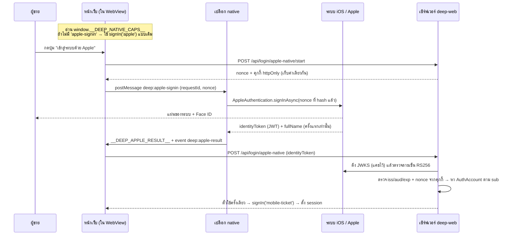

# App Store 4.8 — Sign in with Apple

## ที่มา

App Store ปฏิเสธ build 1.0(2) เมื่อ 2026-08-04 (ข้อที่สองของรอบเดียวกับ 3.1.1)

> The app uses a third-party login service, but does not appear to offer as an equivalent login
> option another login service with all of the following features: limits data collection to the
> user's name and email address · allows users to keep their email address private · does not
> collect interactions with the app for advertising purposes without consent.

จริงตามนั้น — หน้าล็อกอินผู้ขายมีปุ่ม Facebook และ LINE ซึ่งตกทั้ง 3 ข้อ

**username + password ที่มีอยู่แล้วไม่นับ** — ข้อยกเว้นของกฎ 4.8 ให้เฉพาะแอปที่ใช้ระบบบัญชี
ของตัวเอง **อย่างเดียวล้วน** พอมีปุ่ม Facebook แม้ปุ่มเดียวก็หลุดจากข้อยกเว้นทันที

## ทางเลือกที่ไม่เลือก

ถอดปุ่ม Facebook/LINE ออกจะกลับเข้าข้อยกเว้นและใช้เวลา ~1 ชม. — **แต่ผู้ขาย 3 จาก 6 คนที่ใช้จริง
บน prod ไม่มีรหัสผ่าน** (ล็อกอินผ่าน OAuth ทางเดียว) เขาจะเข้าแอปไม่ได้เลย จึงเลือกทำของจริง

## ค่าที่ตั้งใน Apple Developer (2026-08-10)

| ค่า | |
|---|---|
| Team ID | `DT9C75X495` |
| Services ID (= `APPLE_CLIENT_ID`) | `com.deepthailand.seller.web` |
| Key ID | `6G2X8HBMGL` |
| Return URL | `https://seller.deepthailand.app/api/auth/callback/apple` |
| Domain | `seller.deepthailand.app` |

🛑 **`APPLE_CLIENT_ID` ต้องเป็น Services ID ไม่ใช่ bundle id ของแอป** (`com.deepthailand.seller`)
— สลับกันคือความผิดพลาดที่พบบ่อยที่สุด และ Apple ตอบแค่ `invalid_client` โดยไม่บอกว่าอะไรผิด

## 🛑 สองกับดักที่ทำให้ล็อกอินพังโดยไม่มีอะไรบอกสาเหตุ

### 1. client secret ต้องเซ็นสด ไม่ใช่ค่าคงที่

Apple ไม่ให้ client secret เป็นสตริงตายตัวเหมือน OAuth เจ้าอื่น — ต้องเซ็น **JWT ES256** ด้วย
private key จากไฟล์ `.p8`

`src/lib/apple-client-secret.ts` เซ็นสดทุกครั้งที่ประกอบ `authOptions` (ตอน cold start)

**ทำไมไม่เก็บ JWT ที่เซ็นไว้แล้วเป็น env var:** มันหมดอายุ (Apple ให้สูงสุด 6 เดือน) วันหนึ่ง
**ล็อกอิน Apple จะพังเงียบ ๆ** โดยไม่มีใครรู้จนมีคนบ่น และคนที่มาแก้ทีหลังจะไม่รู้ว่าต้องสร้างใหม่
ยังไง — เซ็นสดทำให้ระบบต่ออายุตัวเองเสมอ

**ไม่เพิ่ม dependency:** Node เซ็น ES256 ได้เองผ่าน `node:crypto` แบบ **synchronous** ซึ่งจำเป็น
เพราะ NextAuth v4 รับ `clientSecret` เป็นสตริงตอน module load ไม่รองรับ async

🛑 **`dsaEncoding: 'ieee-p1363'` ห้ามลืม** — ค่า default ของ Node คือ DER ซึ่ง JOSE ไม่รับ
ลายเซ็นจะถูกปฏิเสธทุกครั้ง (มีเทส `[blocker]` เช็คว่าลายเซ็นยาว 64 ไบต์)

### 2. คุกกี้ต้องเป็น SameSite=None เพราะ Apple ส่งกลับแบบ POST ข้ามเว็บ

Apple ใช้ `response_mode=form_post` (ดู `next-auth/providers/apple.js`) = ยิง **POST** จาก
`appleid.apple.com` มาที่ callback ของเรา ซึ่งเป็น cross-site request

เบราว์เซอร์จะ **ไม่แนบคุกกี้ SameSite=Lax** — และ next-auth v4 ตั้ง `lax` ให้ทุกตัวโดยไม่มีการ
จัดการพิเศษให้ Apple (ตรวจแล้วใน `core/lib/cookie.js`) ผลคือ `code_verifier` หายไป NextAuth
ตอบ error `OAuthCallback` ทั้งที่ทุกอย่างฝั่ง Apple ถูกหมด

`crossSiteOAuthCookies()` ใน `auth.ts` ทับเฉพาะ **3 ตัวที่ใช้ระหว่างเดินทางของ OAuth**
(`pkceCodeVerifier`, `state`, `nonce` — อายุ 15 นาที ใช้ครั้งเดียวทิ้ง) — **ไม่แตะคุกกี้ session**
ซึ่งยังเป็น `SameSite=Lax` ตามเดิม ความปลอดภัยของ session จึงไม่ลดลง

เปิดเฉพาะ production เพราะ `SameSite=None` บังคับต้องมี `Secure` = ต้อง https
(dev รันบน `http://seller.deepth.local` · Apple ไม่รับ http อยู่แล้ว — **เทสได้บน prod เท่านั้น**
เหมือน Facebook login ที่บันทึกไว้ตั้งแต่ 2026-06-17)

## อีเมลซ่อนของ Apple

ผู้ใช้ที่เลือก "ซ่อนอีเมลของฉัน" จะได้อีเมล `x7k9m2p@privaterelay.appleid.com` ซึ่ง **ไม่ใช่อีเมล
จริง** และเป็นคนละค่ากันในแต่ละแอป

🛑 `isApplePrivateRelayEmail()` กันไม่ให้อีเมลแบบนี้ถูกใช้จับคู่ประวัติลูกค้าเก่า
(`linkBuyerHistory`) — ถ้าปล่อยผ่าน มันจะกลายเป็น "อีเมลของผู้ใช้คนนี้" ในระบบเรา ทั้งที่ส่งไปหา
ไม่ได้จริงถ้าเขากดตัดการส่งต่อทิ้ง และหน้าโปรไฟล์จะโชว์อีเมลที่เจ้าตัวเองไม่รู้จัก

ตรรกะเดิมของโปรเจกต์ใช้ธง `linkEmail` ต่อ provider อยู่แล้ว (FB=true, LINE/IG=false) — Apple
เป็น `true` แต่ผ่านด่าน relay ก่อนเสมอ · ฟังก์ชันคืน `false` ให้ provider อื่นเสมอ จึงไม่กระทบ FB/LINE

## ตำแหน่งปุ่ม

วาง **บนสุด** ของกลุ่มปุ่มล็อกอิน ทั้ง `SignInForm.tsx` (หน้าล็อกอินหลัก) และ
`InviteLandingClient.tsx` (หน้ารับคำเชิญ)

🛑 ต้องมีทั้งสองที่ — กฎ 4.8 ผูกกับ "ทุกที่ที่ให้ล็อกอินด้วยเจ้าอื่น" ไม่ใช่หน้าใดหน้าหนึ่ง
และ Apple บังคับให้อยู่ **ระดับเดียวกัน** กับปุ่มอื่น ห้ามซ่อนหลังลิงก์ "ตัวเลือกอื่น" หรือทำให้เล็กกว่า

โลโก้ใช้ `bxl:apple` สีดำตาม Human Interface Guidelines (ยืนยันว่ามีจริงใน iconify แล้ว)

## ตั้งค่าไม่ครบ = ไม่เปิด provider เลย

`appleProvider()` คืนอาร์เรย์ว่างเมื่อ env ไม่ครบ หรือคีย์เสีย — **ไม่ใช่เปิดแล้วปล่อยให้พังตอนกด**
(ต่างจาก FB/LINE ที่ใส่ `|| ""`) เพราะปุ่ม Apple ที่กดแล้วเด้ง error คือสิ่งแรกที่คนตรวจของ Apple
จะเจอ แล้วตีกลับด้วยเหตุผลที่แย่กว่าเดิม

## ยังไม่ได้ทำ / ข้อจำกัดที่รู้ตัว

- 🛑 **Apple ส่ง "ชื่อ" มาแค่ครั้งแรกครั้งเดียว** และส่งมาใน body ของ form_post ไม่ใช่ใน id_token
  ซึ่ง `profile()` ของ next-auth อ่านไม่เห็น → ผู้ที่สมัครด้วย Apple จะได้ `displayName = "User"`
  **ยอมรับได้เพราะ onboarding บังคับให้กรอกชื่อร้าน/ชื่อที่แสดงอยู่แล้ว** (ขั้นที่ 2) — ถ้าวันหนึ่ง
  ต้องการชื่อจริงตั้งแต่แรก ต้องอ่าน body ที่ route handler เองซึ่งซับซ้อนกว่ามาก
- **④ Register Email Sources** ในหน้า Apple Developer ยังไม่ได้ทำ — จำเป็นเฉพาะตอนจะ **ส่งอีเมล
  หาผู้ใช้ที่ซ่อนอีเมล** การล็อกอินทำงานได้โดยไม่ต้องทำ
- ยังไม่ได้กดล็อกอินจริง — ต้อง deploy + ตั้ง env บน Vercel ก่อน (ทดสอบบน localhost ไม่ได้)

## การพิสูจน์

- `tsc` 0 error · full suite แดง 19 เท่าเดิม (1965 ผ่าน จาก 1984)
- เทสใหม่ 10 ข้อ (`apple-client-secret.test.ts`) — คลุมโครงสร้าง JWT ทุกช่อง + รูปลายเซ็น +
  อีเมล relay + คีย์รูปแบบ env var
- **เซ็นด้วยคีย์ `.p8` จริงผ่านแล้ว** (`scripts/verify-apple-signin.ts`): ES256 · kid/iss/sub/aud
  ตรงทุกช่อง · ลายเซ็น 64 ไบต์ · อายุ 183 วัน
- ยืนยัน `bxl:apple` มีจริงใน iconify (HTTP 200)
- ไม่มีไฟล์ `.p8` หรือ `.env.local` หลุดเข้า git

## env ที่ต้องตั้งบน Vercel (production)

```
APPLE_CLIENT_ID   = com.deepthailand.seller.web
APPLE_TEAM_ID     = DT9C75X495
APPLE_KEY_ID      = 6G2X8HBMGL
APPLE_PRIVATE_KEY = <เนื้อไฟล์ AuthKey_6G2X8HBMGL.p8 ทั้งก้อน>
```

`APPLE_PRIVATE_KEY` วางได้ทั้งแบบหลายบรรทัดจริงและแบบบรรทัดเดียวที่มี `\n` เป็นตัวอักษร —
`normalizePrivateKey()` แปลงให้เอง (มีเทสคุม)

---

# ภาคผนวก 2026-08-12 — เชื่อม Apple เข้าบัญชีที่มีอยู่แล้ว

## ช่องโหว่ที่พบตอนทดสอบจริง

เพิ่มปุ่ม Apple ในหน้าล็อกอินแล้ว **แต่ลืมการ์ด "วิธีเข้าสู่ระบบ" ที่ `/account`** ซึ่งเป็นที่เดียว
ที่ผู้ใช้ "ที่มีบัญชีอยู่แล้ว" จะผูก provider ใหม่เข้ากับบัญชีเดิมได้

ผลที่เกิดจริง (2026-08-12): user กด Sign in with Apple → ระบบไม่รู้ว่าเป็นคนเดิม (Apple ไม่บอก
และอีเมล iCloud ไม่ตรงกับอะไรในบัญชีเดิม) → **สร้างบัญชีใหม่คนละใบ** (`@applee`) → onboarding
บังคับใส่เบอร์ → **เบอร์เดียวที่มีผูกกับบัญชีเดิมไปแล้ว และเบอร์ตั้งได้ครั้งเดียวเปลี่ยนไม่ได้** → ตัน

ต้องเข้าไปลบบัญชีที่ค้างด้วยมือบน prod

## 🛑 การรองรับ OAuth หนึ่งเจ้าต้องขยับ 4 ที่พร้อมกัน

| ชั้น | ขาดแล้วเกิดอะไร |
|---|---|
| `lib/auth.ts` oauthMap (jwt) | ล็อกอินสำเร็จแต่ไม่ผูก AuthAccount = ได้บัญชีใหม่ทุกครั้ง |
| `lib/auth.ts` รายการใน signIn | บัญชีที่ถูกลบแล้วล็อกอินกลับเข้ามาได้ (ผิด Guideline 5.1.1(v)) |
| `api/account/link/start` | ปุ่ม "เชื่อมบัญชี" โผล่ แต่กดแล้ว **400** |
| `api/account/link/remove` | เชื่อมได้แต่ยกเลิกไม่ได้ ค้างถาวร |

แต่ละชั้นพังคนละแบบ จึงวินิจฉัยยากมากเมื่อขาดไปที่ใดที่หนึ่ง —
`src/lib/__tests__/oauth-provider-parity.test.ts` บังคับให้ครบทั้ง 4 ชั้น + มีแถวใน UI

## 🛑 คุกกี้ link-intent ต้องเป็น SameSite=None สำหรับ Apple

ปัญหาเดียวกับคุกกี้ pkce/state แต่ **ผลเสียร้ายกว่า**

Apple ส่งกลับแบบ `form_post` (POST ข้ามเว็บ) → คุกกี้ `deep_link_intent` ที่เป็น `lax` ไม่ถูกแนบ
→ `signIn` callback ตีความว่า "ไม่ใช่การเชื่อมบัญชี" แต่เป็นการล็อกอินธรรมดา →
**สร้างบัญชีใหม่ซ้อนขึ้นมาแทนที่จะผูกกับบัญชีเดิม**

นั่นคือ **แย่กว่า error** เพราะหน้าจอดูเหมือนสำเร็จ ผู้ใช้ไม่รู้ว่าตัวเองมี 2 บัญชีแล้ว จนไปตัน
ที่เบอร์โทรซ้ำ

ตั้ง `sameSite: 'none'` **เฉพาะ provider = apple และเฉพาะ production** — provider อื่นยังเป็น
`lax` ตามเดิม ผิวการเปลี่ยนแปลงจึงแคบที่สุด

## บทเรียนเรื่องคุณภาพของด่าน

เทส parity รอบแรกเช็คด้วยการ **ค้นทั้งไฟล์** ว่ามีคำว่า `'apple'` ไหม — พิสูจน์ด้วย mutation
แล้ว**ลอดได้** เพราะคำนั้นยังโผล่ในข้อความ error และในเงื่อนไข `provider === 'apple'` ของคุกกี้

แก้เป็นดึง **ตัวประกาศ `LINKABLE_PROVIDERS`** ออกมาเช็คเฉพาะจุด และเช็คว่า `link/remove`
map เป็น enum ตัวใหญ่จริง — mutation รอบสองแดงถูกทั้ง 2 เคส

(เป็นความผิดพลาดคลาสเดียวกับด่าน payment-restriction ที่เจอเมื่อ 2026-08-10 —
**ด่านที่ผ่านตลอดคือด่านที่ไม่มีอยู่จริง** ต้อง mutation test ด่านทุกตัวก่อนเชื่อ)

## การพิสูจน์

- `tsc` 0 error · full suite 2666 ผ่าน ไม่มีเทสแดง
- เทสใหม่ 4 ข้อ (`oauth-provider-parity.test.ts`) — **mutation test ผ่านทั้ง 2 เคส**
  (ถอด apple ออกจาก `LINKABLE_PROVIDERS` → แดง · ถอดออกจาก `link/remove` → แดง)
- gate HR9/HR12 บนไฟล์ที่แตะ = 0
- ลบบัญชี `@applee` ที่ค้างบน prod แล้ว — ตรวจครบ **77 FK** ที่ชี้มาที่ `User`/`Shop` พบเพียง
  4 แถวและเป็นของบัญชีนั้นเองล้วน (ลิงก์ Apple · แจ้งเตือนต้อนรับ · ร้านเปล่า · เหรียญตรา)
  ไม่มีข้อมูลของคู่ค้าให้เสียหาย จึงไม่ขัดกับเจตนาของกฎ "ห้าม prisma.user.delete()"

## ยังไม่ได้ทำ

- ยังไม่ได้กดเชื่อมจริงบน prod (ต้อง deploy ก่อน)
- ผู้ใช้ที่เผลอกด Sign in with Apple จากหน้าล็อกอินทั้งที่มีบัญชีอยู่แล้ว **ยังได้บัญชีใหม่อยู่ดี** —
  ระบบไม่มีทางรู้ว่าเป็นคนเดียวกัน ทางแก้ที่แท้จริงต้องเป็น "เจอ Apple ID ที่ไม่เคยเห็น + อีเมลตรง
  กับบัญชีที่มีอยู่ → ถามว่าจะรวมบัญชีไหม" ซึ่งเป็นงานคนละก้อน (และอีเมล relay ทำให้จับคู่ไม่ได้อยู่ดี)

---

# ภาคผนวก 2 (2026-08-12) — 🛑 ชั้นที่ 5 อยู่คนละรีโป: `OAUTH_HOSTS` ของแอป

## อาการ

ทดสอบใน TestFlight: `/account` → Apple → "เชื่อมต่อ" → แผ่น "ลงชื่อเข้าด้วย Apple" ของ iOS โผล่
→ กดลงชื่อเข้า → **จบที่หน้า login ของ seller** ดูเหมือนโดนเด้งออกจากระบบ

## ต้นเหตุ — ไม่ใช่ฝั่งเว็บเลย

`SellerWebView.onShouldStartLoadWithRequest` เตะทุก navigation ที่ออกนอกโดเมน seller ไป
in-app browser ยกเว้นโดเมนใน `OAUTH_HOSTS` — และ **`appleid.apple.com` ไม่อยู่ในรายการ**

in-app browser (SFSafariViewController) เป็น **cookie jar คนละใบกับ WebView** ทั้ง session
และคุกกี้ link-intent จึงไม่มีอยู่ในนั้น → OAuth จบแล้วเด้งกลับ `seller.deepthailand.app`
ในเบราว์เซอร์ที่ไม่มี session → เห็นหน้า login

สังเกตจากภาพหน้าจอได้: มีปุ่มติ๊กถูกมุมซ้ายบน + แถบเครื่องมือ Safari ด้านล่าง = ไม่ใช่ WebView ของเรา

## บั๊กคลาสเดิมเป๊ะ

หัวไฟล์ `SellerWebView.tsx` บันทึกไว้อยู่แล้วว่าเคยเจอกับ `fbsbx.com` เมื่อ 2026-08-01
(*"ผู้ใช้กดเข้าสู่ระบบด้วย Facebook บน TestFlight แล้วได้หน้าขาวใน in-app browser"*)
— แล้วก็พลาดซ้ำคลาสเดิมทันทีที่เพิ่ม provider ใหม่

**กติกา: เพิ่ม OAuth provider = ต้องเติม `OAUTH_HOSTS` ของแอปเสมอ**

## ทำไมเทสจับไม่ได้

รีโปแอปไม่มี test runner เลย และเทส parity ฝั่งเว็บก็เอื้อมข้ามรีโปไม่ได้ —
บันทึกไว้ที่หัวไฟล์เทสนั้นแทน เพื่อให้คนที่เพิ่ม provider ตัวถัดไปเห็นครบทั้ง 5 ชั้น

## แก้

เพิ่ม `appleid.apple.com` ลง `OAUTH_HOSTS` → ต้องส่ง **OTA** (ไม่ต้อง build ใหม่)

---

# ภาคผนวก 3 (2026-08-12) — เชื่อมแล้วเด้งไปหน้า "การจัดส่ง" และไม่เชื่อมให้

## อาการ

ใน TestFlight: `/account` → Apple → เชื่อมต่อ → แผ่น Apple โผล่ **ในแอปแล้ว** (OTA แก้ถูกแล้ว)
→ ลงชื่อเข้า → **เด้งไปหน้า "การจัดส่ง"** และ Apple ยังขึ้น "ยังไม่เชื่อม"

## สาเหตุ 2 ตัวซ้อนกัน

### 1. บัญชี Apple กำพร้าจากการทดสอบรอบก่อน บล็อกการผูก

รอบแรก (16:30) คุกกี้ link-intent ยังไม่รอด (แก้ยังไม่ deploy) → ระบบตีเป็นล็อกอินธรรมดา →
**สร้างบัญชีใหม่ `@apple001680…`** ผูก Apple ID นั้นไว้

รอบสอง (16:57) คุกกี้รอดแล้ว เข้า LINK MODE ถูกต้อง → แต่เจอว่า Apple ID **ถูกบัญชีอื่นถือไว้แล้ว**
→ `return "/settings?link_error=taken"` = ทำงานถูกตามที่ออกแบบ (AC-03 ห้ามแย่ง provider ข้ามบัญชี)

ลบบัญชีกำพร้าแล้ว (ตรวจว่าไม่มีออเดอร์/สินค้า/แชท/สมาชิกก่อนลบ)

### 2. 🛑 ปลายทางของ link flow ชี้ไปหน้าที่ไม่มีใครอ่านผลลัพธ์

`auth.ts` คืน `/settings?linked=…` และ `/settings?link_error=…` ส่วน `handleConnect` ก็ส่ง
`callbackUrl: '/settings'` — **ทั้งหมดค้างมาตั้งแต่ก่อนย้ายการ์ด "วิธีเข้าสู่ระบบ" ไป `/account`**
(feature 00026, 2026-08-02) และ `/settings` กลายเป็นหน้า **"การจัดส่ง"** ไปแล้ว

ตัวอ่าน `?linked=` / `?link_error=` อยู่ใน `ConnectedAccountsClient` ซึ่งอยู่ที่ `/account` —
พารามิเตอร์จึงถูกส่งไปยังหน้าที่ไม่มีใครอ่าน = **เชื่อมสำเร็จก็เงียบ ล้มเหลวก็เงียบ**

**บั๊กนี้กระทบ Facebook/LINE มาตลอดตั้งแต่ย้ายการ์ด** ไม่ใช่แค่ Apple — แค่ไม่มีใครสังเกตเพราะ
คนที่เชื่อม FB สำเร็จก็เห็นสถานะเปลี่ยนตอนกลับมาหน้าเดิมเอง

แก้เป็น `/account` ทั้ง 4 จุดใน `auth.ts` + `callbackUrl` ใน `handleConnect` + คอมเมนต์ที่
`link/start` ที่อ้าง path เก่า

## บทเรียน

การย้ายหน้า (feature 00026) ไล่แก้เมนูกับลิงก์ที่ผู้ใช้กดครบ **แต่ลืม path ที่ฝังอยู่ใน
redirect ของ backend** ซึ่งไม่มี gate ไหนจับได้เลย — `tsc` ผ่าน (เป็นสตริง), เทสผ่าน,
และอาการที่เห็นคือ "เด้งไปหน้าแปลก ๆ" ซึ่งดูเหมือนปัญหาคนละเรื่องกับการเชื่อมบัญชี

## การพิสูจน์

- `tsc` 0 error · full suite 2670 ผ่าน ไม่มีเทสแดง
- ยืนยันด้วย grep ว่าไม่เหลือ `/settings?linked` / `callbackUrl: '/settings'` ที่ไหนอีก
- ลบบัญชี `@apple001680…` แล้ว · `AuthAccount` ที่เป็น APPLE เหลือ 0

---

# ภาคผนวก 4 (2026-08-12) — จอไม่ตรงกับความจริงหลังเชื่อม/ยกเลิก

user รายงาน 2 อาการหลังเชื่อม Apple สำเร็จแล้ว — สืบแล้วเป็น **3 บั๊ก** ที่มีรูปแบบเดียวกัน

## รูปแบบร่วม: โค้ดที่ไล่ `if`/ternary ทีละ provider

ทั้งสามตัวเกิดเพราะมีโค้ดที่เขียนแบบ "ไล่เช็คทีละเจ้า" อยู่ — พอเพิ่ม provider ที่ 4 เข้ามา
สาขาของมันถูกลืม **โดยไม่มี `tsc` หรือเทสไหนฟ้อง** (เป็นสตริง/สาขา ไม่ใช่ type)

| # | อาการที่ผู้ใช้เห็น | ต้นเหตุ |
|---|---|---|
| 1 | ยกเลิกการเชื่อม Apple → toast ขึ้นว่าสำเร็จ แต่แถวยังโชว์ "เชื่อมแล้ว" ต้องออกแล้วเข้าใหม่ | `if/else` อัปเดตแค่ `facebook`/`line`/`instagram` |
| 2 | เชื่อม Apple สำเร็จ → toast ขึ้นว่า **"เชื่อมต่อ Instagram สำเร็จ"** | ternary ซ้อนที่ตกท้ายเป็น `'Instagram'` |
| 3 | เชื่อมสำเร็จแล้วถูกเด้งไปหน้า **"การจัดส่ง"** | `router.replace('/settings')` ค้างจากตอนการ์ดยังอยู่ที่ /settings |

## 🛑 บั๊ก #3 ต้องแก้ 2 ที่ ไม่ใช่ที่เดียว

`7e1dd961` แก้ redirect ฝั่ง **backend** (`auth.ts` คืน `/account?linked=…`) ไปแล้ว
แต่ผู้ใช้ยังถูกเด้งไป "การจัดส่ง" อยู่ เพราะ **ฝั่ง client เด้งเองซ้ำอีกที**:
`useEffect` ที่อ่าน `?linked=` เรียก `router.replace('/settings')` เพื่อล้าง query string

แก้ที่เดียวจึงไม่พอ — อาการเหมือนเดิมเป๊ะจนดูเหมือน "แก้แล้วไม่หาย"

## ทางแก้เชิงโครงสร้าง

รวม state 4 ตัว (`appleLinked`/`fbLinked`/`lineLinked`/`igLinked`) เป็น
`Record<ProviderKey, boolean>` เดียว → อัปเดตด้วย `[provider]` ไม่ต้องไล่สาขาอีกต่อไป
และป้ายชื่อทุกจุดดึงจาก `PROVIDER_LABEL` (Hard Rule 16)

> หมายเหตุ: `router.refresh()` เพียงอย่างเดียวช่วยไม่ได้ เพราะ `useState(initial)` ไม่ sync กับ
> prop ที่เปลี่ยนหลัง mount — ตัวที่อัปเดตจอจริงคือ `setState` เท่านั้น

## เรื่องที่ตอบ user ไม่ได้ตามที่ขอ

user ถามว่า *"ทำไมมันต้อง loading เชื่อมที่หน้าเดิมให้สิ"* — **ทำให้ไม่ต้องโหลดหน้าใหม่เลยไม่ได้**
OAuth บังคับให้เบราว์เซอร์ออกไปที่ผู้ให้บริการแล้วกลับมา (full-page redirect) ทางเลือกเดียวที่
เลี่ยงได้คือเปิด popup ซึ่งใน WebView ของแอปทำไม่ได้ (`onOpenWindow` โหลดในหน้าเดิมอยู่แล้ว)

สิ่งที่ทำได้และทำแล้ว: **กลับมาที่หน้าเดิม** (`/account`) พร้อม toast บอกผล และอัปเดตแถวทันที
— ไม่เด้งไปหน้าอื่นอีก

## การพิสูจน์

- `tsc` 0 error · full suite 2673 ผ่าน ไม่มีเทสแดง
- เทสใหม่ 3 ข้อใน `oauth-provider-parity.test.ts` — **mutation test ผ่านทั้ง 2 เคส**
  (คืน `router.replace('/settings')` → แดง · คืนตัวแปรแยกต่อ provider → แดง)
- gate HR9/HR12 = 0

---

# ภาคผนวก 5 (2026-08-12) — จอว่างตอนกดเชื่อม แล้วตามด้วยอาการ "แวบ ๆ"

> user report 2 รอบติดกัน — รอบแรก *"ตอนเชื่อมอ่ะ มันเหมือนเห็นหน้าว่าง"* แล้วหลังแก้เสร็จก็
> *"มันตอนเชื่อม กับ ยกเลิก ทำให้เนียนสิ ไม่แวบๆ"*
>
> **สองรอบนี้คนละบั๊กกันคนละที่** รอบแรกอยู่ในแอป rn รอบสองอยู่ในเว็บ — และรอบสองมีต้นเหตุ
> **6 ตัวที่ไม่เกี่ยวกันเลย** ซึ่ง 1 ใน 6 คือของที่ผมเพิ่งใส่เข้าไปเองในรอบแรก

## รอบ 1 — จอว่างระหว่างโหลดหน้าใหม่ (อยู่ในแอป ไม่ใช่เว็บ)

`deep-seller-app/src/features/webview/SellerWebView.tsx` ตั้ง `loading = true` แค่ **2 ที่**:
ตอน `useState` เริ่มต้น กับตอน `reload()` (ดึงลงรีเฟรช) ไม่มี `onLoadStart` และ `onNav` ก็
`return` ทิ้งทันทีเมื่อ `nav.loading` เป็น true

⇒ **การเปลี่ยนหน้าแบบโหลดใหม่ทั้งหน้าทุกครั้งเห็นจอว่างเปล่ามาตั้งแต่วันแรก** ไม่ใช่แค่ตอนกลับ
จาก OAuth — รวมถึงกด "เข้าสู่ระบบ" และลิงก์ที่ไม่ใช่ client-side navigation ทั้งหมด
ที่ไม่มีใครรายงานมาก่อนเพราะการใช้งานปกติเดินผ่าน Next.js `pushState` ซึ่งไม่ใช่การโหลดหน้า

แก้: `nav.loading === true` → `beginLoading()` โชว์ `WebViewSkeleton` ทับ + **safety timer 12 วิ**
กันค้างถ้า `onLoadEnd` ไม่ยิง (โหลดถูกยกเลิกกลางทาง / เปลี่ยนปลายทางซ้อน) — ติดหน้าโครงร่าง
ถาวรแย่กว่าจอขาวแวบเดียว · ต้อง OTA (`eas update --branch production`)

ไม่กระทบการกดเมนูปกติ: Next.js ใช้ `pushState` ซึ่ง `nav.loading` เป็น false

## รอบ 2 — อาการ "แวบ ๆ" ในหน้า `/account` · 6 ต้นเหตุ

🛑 **ทั้ง 6 ผ่าน `tsc` / `build` / เทส / `theme-guard` หมด** เพราะโค้ดถูกต้องทุกตัวอักษร
สิ่งที่ผิดคือ *ตำแหน่งที่ประกาศ* / *จังหวะที่ล้างสถานะ* / *ตัวที่ import มา* ซึ่งไม่มีเครื่องมือ
static ตัวไหนของโปรเจกต์รู้ความหมาย

### 1. `ProviderRow` ถูกประกาศ "ในตัว render" ← ตัวการหลัก

React เทียบชนิดของ component ด้วย identity ของฟังก์ชัน ฟังก์ชันที่ประกาศในตัว render จึงเป็น
**ชนิดใหม่ทุกครั้งที่แม่ re-render** ⇒ React ถอด DOM เดิมทิ้งแล้วสร้างใหม่ทั้งแถว ไม่ใช่ patch

ทุก `setState` (กดปุ่ม · สถานะเปลี่ยน · `router.refresh()`) จึงได้: ไอคอนถูกโหลดใหม่ ·
transition เริ่มนับหนึ่ง · **โฟกัสหลุดจากปุ่มที่เพิ่งกด** (คนใช้คีย์บอร์ด/screen reader
หลุดตำแหน่งทันที) — รายละเอียดทั่วไป → `docs/conventions/component-declared-in-render.md`

### 2. จอทับถูกถอดออก *ก่อน* หน้าจะเปลี่ยนจริง

`signIn()` ของ next-auth ตั้ง `window.location.href` แล้ว **resolve promise ทันที**
(`node_modules/next-auth/react/index.js:263`) โดยที่เบราว์เซอร์ยังไม่ได้ไปไหน — มันเพิ่งเริ่ม
ขอหน้าใหม่ ⇒ `finally { setLoadingProvider(null) }` ถอดจอทับออกก่อนการเปลี่ยนหน้าเกิดจริง

ผู้ใช้เห็นจอทับวาบเดียวแล้วกลับมาเป็นหน้าเดิมค้างอยู่เฉย ๆ จนกว่าเซิร์ฟเวอร์จะตอบ

**กติกา: หลัง `signIn()`/`signOut()` ห้ามมีโค้ดที่คืนสถานะ UI** หน้ากำลังจะถูกทิ้งทั้งหน้าอยู่แล้ว
คืนได้เฉพาะเส้นทางที่ *ยังไม่ได้ไปไหนจริง ๆ* (เช่น `link/start` ตอบไม่ผ่าน) ไม่งั้นผู้ใช้ติดจอทับถาวร

### 3. จอทับเด้ง 2 รอบตอนกดยกเลิก + พูดคำโกหก

ใช้ตัวแปรเดียว (`loadingProvider`) คุมทั้ง **"กำลังไปที่อื่น"** และ **"กำลังทำงานในหน้านี้"**
แต่การยกเลิกมี **2 ช่วงที่คั่นด้วย Swal** (ส่ง OTP → กรอก OTP → ถอด) ⇒ จอทับขึ้น-ลง 2 รอบ
ต่อการกดหนึ่งครั้ง แถมเขียนว่า *"กำลังไปที่ Apple... อีกสักครู่จะกลับมาหน้านี้เอง"* ทั้งที่ไม่ได้ไปไหน

แยกเป็น `redirecting` (จอทับเต็มหน้า · ไม่มีวันถูกล้าง) กับ `busyProvider` (สปินเนอร์ในปุ่มเท่านั้น)

### 4. สปินเนอร์ในจอทับเป็นกล่องว่าง

ไฟล์นี้ `import { Icon } from '@iconify/react'` **ดิบ** แต่ชื่อ `loader-2` ไม่มี namespace —
ตัวที่เติม `tabler:` ให้คือ `@/components/wrappers/Icon` เท่านั้น ⇒ ได้ชื่อ invalid แล้ว
**ไอคอนไม่ขึ้นเลยโดยไม่มี error สักตัว** = จอโหลดที่ไม่มีอะไรหมุน ซึ่งเป็นอาการเดียวกับที่
overlay ตัวนี้เกิดมาแก้พอดี · ในรีโปมี `icon="loader-2"` แบบไม่มี prefix อยู่ 38 จุด ทุกจุด
import ผ่าน wrapper — ไฟล์นี้เป็นตัวเดียวที่ไม่ใช่

### 5. ปุ่มหดแล้วขยายทุกครั้งที่กด

สลับเนื้อในระหว่าง `'เชื่อมต่อ'` (4 ตัวอักษร) กับสปินเนอร์ 16px ⇒ layout shift **2 ครั้งต่อ
การกด 1 ครั้ง** ตรึงความกว้างด้วยการคงข้อความไว้แล้วซ่อนด้วย `invisible` (ยังกินพื้นที่)
แล้วซ้อนสปินเนอร์ทับด้วย `absolute inset-0`

### 6. `router.replace('/account')` ตอนล้าง query

ปลายทางคือ URL เดิมทุกประการ ต่างกันแค่ query ที่เพิ่งใช้เสร็จ แต่ `router.replace` สั่งดึง
RSC payload ของหน้านี้มาใหม่ทั้งหน้า **ทันทีที่ผู้ใช้เพิ่งกลับมาจาก OAuth** แล้วภาพกระตุกอีกรอบ
ตอน payload มาถึง → เปลี่ยนเป็น `window.history.replaceState(null, '', '/account')`

ข้อมูลไม่ค้าง เพราะการกลับจาก OAuth เป็นการโหลดหน้าใหม่ทั้งหน้าอยู่แล้ว server เรนเดอร์ด้วย
สถานะหลังเชื่อมมาให้ตั้งแต่แรก · **แต่ต้องเพิ่ม `useRef` กันยิงซ้ำ** เพราะ `replaceState` (ตั้งใจ)
ไม่ทำให้ `useSearchParams` เปลี่ยนค่า effect จึงไม่มีตัวห้ามในตัวเองอีกต่อไป

## ของแถมที่เจอระหว่างทาง

| เจอ | ผล |
|---|---|
| ชิป "เชื่อมแล้ว" ใช้ `text-success` ส่วนแถวรหัสผ่านใช้ `text-success-ink` บนพื้น `/15` เดียวกัน | คอนทราสต์คนละค่าในการ์ดเดียวกัน — เกิดเพราะก็อป markup ไปวางซ้ำ รวมเป็น `AccountRow` แล้ว |
| ไม่ได้ปิดปุ่มแถวอื่นระหว่าง redirect | กดเจ้าที่สองซ้อนได้ แล้ว **link-intent cookie (มีใบเดียว) ถูกเขียนทับ** = เชื่อมผิดเจ้าโดยไม่มีอะไรฟ้อง |
| `interface ProviderConfig` ตายแล้วและ `id` ไม่มี `apple` | คนอ่านไฟล์เข้าใจผิดว่า Apple ผูกบัญชีไม่ได้ — **type ที่ตายแล้วยังโกหกได้** ลบทิ้ง |

## บทเรียนเรื่องด่าน (ซ้ำรอยเดิมของโปรเจกต์ 2 ข้อในรอบเดียว)

1. 🛑 **ด่านต้องตัดคอมเมนต์ก่อนสแกน** — เขียนด่าน `ห้าม finally { setRedirecting(null) }`
   แล้วแดงทันทีตั้งแต่รอบแรก เพราะไปเจอ **คอมเมนต์ที่อธิบายกฎของตัวเอง** ในไฟล์ที่ทำถูกแล้ว
   คลาสเดียวกับ grep gate ของ Hard Rule 9 ที่แดงค้างจากคำเตือนของตัวเองเมื่อ 2026-08-02→03
2. **`^\s+` กิน `\n` ได้** — `^\s+function X(` ไปแมตช์ "บรรทัดว่าง + บรรทัดที่ไม่มีย่อหน้า"
   ต้องเป็น `^[ \t]+`
3. **ด่านที่ผูกกับ *วิธีเขียน* พังเมื่อ refactor ทั้งที่ของยังครบ** — `provider="apple"` แดงทันที
   ที่แถวถูกรวบเป็นลิสต์ข้อมูลแล้ว `.map()` เปลี่ยนไปดึงตัวประกาศ `providers` มาเช็คแทน
   (ท่าเดียวกับ `LINKABLE_PROVIDERS`)

## การพิสูจน์

| อะไร | ผล |
|---|---|
| `tsc --noEmit` | 0 error |
| `eslint` ไฟล์ที่แตะ | 0 error 0 warning |
| เทสทั้งชุด | 2687 เขียว |
| mutation: ลบ `apple` ออกจากลิสต์ `providers` | แดง |
| mutation: ย้าย `ProviderRow` เข้าไปในตัว render | แดง |
| mutation: เอา `setRedirecting(null)` กลับเข้า `finally` | แดง |
| mutation: `import { Icon } from '@iconify/react'` | แดง |
| HR17 `comm -12` เทียบไฟล์กับ `origin/main` | ว่าง (ไม่ชน) |

## ยังไม่ได้ทำ

- **browser QA** — ยังไม่เคยเปิดหน้าจริงหลังแก้สักครั้ง (จุดเสี่ยง: จอทับตอนกดปุ่มแล้ว Apple
  ปฏิเสธกลางทาง · โฟกัสหลังกดยกเลิกสำเร็จ · ปุ่มไม่ขยับจริงไหมบน 320px)
- **ไม่ได้ผ่าน `safepay-ux` (Hard Rule 8) และไม่ได้รัน `/impeccable critique`** — session ตั้งค่า
  ห้ามเรียก subagent (หนี้เดียวกับ 2 รอบก่อนหน้า)
- เทสยังสแกนซอร์ส ไม่ได้ยืนยันพฤติกรรมจริงใน DOM (รีโปไม่มี jsdom/testing-library —
  `vitest.config` ตั้ง `environment: "node"`)

---

# ภาคผนวก 6 (2026-08-15) — ทางตันของ "บัญชีค้าง" และการยึดคืนที่ต้องถามก่อน

> user ไล่ทดสอบเองบน prod ทั้งวัน แจ้ง 5 อาการต่อเนื่อง — ทุกอาการเป็นบั๊กจริง ไม่มีอันไหน
> เป็นความเข้าใจผิด และ **3 ใน 5 เป็นของที่ผมเพิ่งสร้างขึ้นเองในรอบก่อนหน้าไม่กี่ชั่วโมง**

## ต้นเรื่อง: กดพลาดครั้งเดียว = Apple ID นั้นใช้กับ Deep ไม่ได้อีกเลย

ผู้ใช้ที่มีบัญชี Deep อยู่แล้วกดปุ่ม "เข้าสู่ระบบด้วย Apple" ที่หน้าล็อกอินโดยไม่ตั้งใจ —
**บนมือถือ Face ID อนุมัติในวินาทีเดียวโดยไม่ต้องกรอกอะไร** ผู้ใช้จึงเชื่อว่ายังไม่ได้ทำอะไร
แต่ระบบสร้างบัญชีใหม่ให้เรียบร้อยแล้ว จากนั้นตันทุกทาง:

| ทางที่ควรออกได้ | ผลจริง |
|---|---|
| ถอดการเชื่อม Apple ออกจากบัญชีค้าง | ต้อง OTP ทางเบอร์ → **บัญชีค้างไม่มีเบอร์** |
| ใส่เบอร์ | เบอร์อยู่กับบัญชีจริงไปแล้ว (เบอร์ตั้งได้ครั้งเดียว) |
| ลบบัญชีค้างเอง | ปุ่มอยู่ที่ `/account` แต่ proxy ขังไว้ที่ `/register` ทุก route |
| เอา Apple ID ไปเชื่อมบัญชีจริง | `link_error=taken` ถาวร (เช็คแค่ "มีเจ้าของไหม") |

⇒ **ผู้ใช้แก้เองไม่ได้สักทาง** ต้องให้แอดมินเข้าไปลบให้ด้วยมือ

## ทางแก้: ดูด้วยว่า "ใครถือ" ไม่ใช่แค่ "ถืออยู่ไหม"

`src/lib/link-conflict.ts::classifyLinkConflict()` — ฟังก์ชันบริสุทธิ์ **fail-closed**

| ผล | เมื่อ |
|---|---|
| `RECLAIM` | ไม่มีสัญญาณตัวตนเลยสักตัว (เบอร์ · รหัสผ่าน · ร้านที่ตั้ง slug · ออเดอร์ · เป็นสมาชิกร้าน · ผูก OAuth เจ้าอื่น) |
| `RECLAIM_DELETED` | บัญชีถูกปิดไปแล้ว — ไม่ควรถือตัวตนของใครไว้ต่อ |
| `BLOCKED` | **มีสัญญาณตัวตนแม้ตัวเดียว** ⇒ ห้ามแตะ |

🛑 เป็น OR ไม่ใช่ AND โดยเจตนา — เดาผิดฝั่งนี้แปลว่าลบร้านที่มีออเดอร์จริงของคนอื่น

## 🛑 ต้องถามยืนยันก่อนเสมอ — จุดที่ผมออกแบบพลาดแล้ว user ทักท้วง

ร่างแรกผมให้ปิดบัญชีค้างอัตโนมัติ ด้วยเหตุผลว่า *"มันว่างเปล่า ไม่มีอะไรจะเสีย"*
user ทักกลับว่า **"ต้องให้ลูกค้า confirm ด้วยนะ จะลบรึป่าว"** และเขาถูก:

> **"ข้อมูลว่างเปล่า" ตอบว่า *ความเสียหายน้อย* — ไม่ได้ตอบว่า *มีสิทธิ์ทำโดยไม่ถามไหม***

และเราไม่มีทางรู้ว่าเขาตั้งใจทิ้งบัญชีนั้นจริง หรือกำลังสมัครค้างไว้อีกเครื่อง ·
แพลตฟอร์มที่ขายเรื่อง trust จะลบของผู้ใช้โดยไม่ถามไม่ได้

**ปัญหาเชิงโครงสร้าง:** `signIn` callback ทำงาน "ระหว่างทางกลับจาก OAuth" ซึ่ง **ถามผู้ใช้ไม่ได้เลย**
⇒ อะไรที่ทำตรงนั้นคือทำโดยไม่ได้รับความยินยอมโดยนิยาม

**ทางออก — ตั๋วเซ็นชื่อ:**

```
signIn callback  →  ไม่ทำอะไร ออก ticket (HMAC, TTL 10 นาที, ผูก userId ผู้ขอ)
                 →  /account?link_error=reclaimable&ticket=…
UI               →  ถามยืนยัน (บอกครบว่าได้อะไร/เสียอะไร)
กดตกลง           →  POST /api/account/link/reclaim  →  ตรวจซ้ำทุกอย่าง แล้วค่อยทำ
```

- ตั๋ว **ต้องเซ็น** ไม่ส่ง `providerAccountId` เปล่า ๆ ไม่งั้นใครก็ยิงด้วย id ของคนอื่นได้
- ผูก `userId` ⇒ ตั๋วหลุด (ติดไปกับ Referer/ประวัติเบราว์เซอร์) ก็ใช้ไม่ได้ เพราะ session ไม่ตรง
- **ตรวจซ้ำที่ปลายทาง ห้ามเชื่อตั๋วอย่างเดียว** — 10 นาทีที่ผู้ใช้กำลังอ่านคำถามอยู่
  บัญชีค้างอาจถูกกรอกเบอร์จนกลายเป็นบัญชีจริงไปแล้ว
- ย้ายเจ้าของ + ปิดบัญชี **ในทรานแซกชันเดียว** — ล้มครึ่งทาง = id ติดกับบัญชีที่ปิดแล้ว
  ไม่มีใครใช้ได้และไม่มีใครแก้ได้ = ทางตันเดิมแต่ถาวรกว่า

## บั๊กที่ผมสร้างเองระหว่างแก้ — 3 ตัว

### ① เชื่อมสำเร็จแล้วปุ่มไม่รีเฟรช (user: "มันไม่รีเฟรชปะนะ")

เรียก `router.refresh()` แล้วคิดว่าจอจะขยับเอง — แต่ `linkedMap` เป็น `useState(initial)`
ซึ่ง **ไม่ sync กับ prop ที่เปลี่ยนหลัง mount** และ **คอมเมนต์เหนือตัวแปรนั้นเขียนประโยคนี้
ไว้เองตั้งแต่ 2026-08-12**

แก้ 2 ชั้น: endpoint คืน `provider` กลับมา + effect sync จาก prop ทุกครั้งที่ RSC ส่งค่าใหม่
(ตัวหลังทำให้ **ทุกเส้นทางหายเองหมด** ไม่ใช่แค่เส้นที่นึกออก)

### ② ยกเลิกการเชื่อมแล้วล็อกอินใหม่ → ค้าง (2 รอบ เพราะรอบแรกไล่ไม่ครบ)

soft delete ไม่ปล่อยคอลัมน์ `@unique` คืน ⇒ บัญชีค้างยังถือทั้ง `username` และ `email`
รอบแรกผมแก้แค่ `username` แล้วประกาศว่าจบ — user ทดสอบแล้วยังค้างเพราะชนต่อที่ `email`

รายละเอียดเต็ม + กติกา → `docs/conventions/oauth-signup-unique-collisions.md`

### ③ ปิดบัญชีค้างไม่ครบชุด

`deleteAccount()` ทำ 4 อย่าง ผมทำอย่างเดียว (`deletedAt`) — ที่สำคัญคือ **PushToken**:
`/api/seller/push-token` ต้องการแค่ session ไม่มีด่าน onboarding และแอปยิงลงทะเบียนทุกครั้ง
ที่เปลี่ยนหน้า ⇒ บัญชีค้างที่ยืนอยู่หน้า `/register` ในแอปลงทะเบียน token ไปแล้ว

`deletedReason` ก็ใส่ `USER_DELETED` ทั้งที่ผู้ใช้ไม่ได้กดลบเอง → เพิ่ม `ABANDONED_RECLAIMED`

## เก็บรายละเอียดรอบสุดท้าย

**ชิป "เข้าสู่ระบบด้วย X" ที่ `/register` โกหกว่า Facebook** — if/else รู้จักแค่ line/ig
แล้วตกท้ายเป็น Facebook · **คลาสเดียวกับ ternary ที่ตกท้ายเป็น 'Instagram' ใน `/account`
เมื่อ 3 วันก่อนเป๊ะ** ⇒ รวมเป็น SSOT `src/lib/oauth-provider-display.ts` ที่เป็น `Record`
(TypeScript บังคับให้ครบ) และ **ไม่มี default เป็นเจ้าใดเจ้าหนึ่ง** เพราะ default นั่นแหละ
คือรูปร่างของบั๊กทั้งสองครั้ง

**ปุ่ม "บันทึกการเปลี่ยนแปลง" ย้าย 4 ตำแหน่ง** — sticky ในการ์ด (ลอยทับช่องกรอก) →
fixed เหนือเมนูล่าง (user: *"ปุ่มเหมือนออกจากระบบเลย แต่คนละสี"*) → ใต้การ์ด (ยังลอยเดี่ยว) →
**ในการ์ดท้ายเนื้อหา** · และทำให้ `/account` ใช้ปุ่มชุดเดียวกัน (ผู้ใช้สลับสองหน้านี้บ่อย)

## การพิสูจน์

| อะไร | ผล |
|---|---|
| `classifyLinkConflict` | 12 เคส · mutation 4 แบบแดง |
| ด่านกันถอยหลัง (`link-reclaim-guard`) | 10 เคส · mutation 9 แบบแดง |
| `tsc` / `eslint` ไฟล์ที่แตะ | 0 / 0 |
| เทสทั้งชุด | 2888 เขียว |
| HR17 `comm -12` | ว่างทุกรอบ |

## ยังไม่ได้ทำ

- **browser QA อย่างเป็นระบบ** — user กดทดสอบเองทั้งวันและเจอทุกอาการ ซึ่งเป็นสิ่งที่ควรถูก
  จับก่อนถึงมือเขา
- **ไม่ได้ผ่าน `safepay-ux` (HR8) และ `/impeccable critique`** — session ห้ามเรียก subagent
  (หนี้เดียวกับ 3 รอบก่อนหน้า)
- soft delete ยังไม่ปล่อยคอลัมน์ unique คืน (จงใจ — ดู convention doc)

---

# ภาคผนวก 7 (2026-09-25) — Sign in with Apple ต้องเป็น "แผ่นของระบบ" ไม่ใช่หน้าเว็บ

> สถานะ: **เอกสารออกแบบ เขียนก่อนลงมือ** (Hard Rule 11) · หัวข้อ "การพิสูจน์" เติมหลังทำเสร็จ

## ที่มา — Apple ตีกลับ 2026-09-24 · Guideline 4 (Design)

ทีมรีวิวแนบภาพหน้าจอมา 3 ใบ ทุกใบเป็นหน้า **`appleid.apple.com`** ที่ถาม
*"Email or Phone Number"* พร้อมช่องรหัสผ่าน — คือหน้าเว็บของ Apple ที่โหลดอยู่ใน WebView
ของเรา ไม่ใช่แผ่น (sheet) ที่ระบบ iOS เปิดให้แล้วยืนยันด้วย Face ID

Apple ต้องการให้แอป iOS เรียก **`AuthenticationServices` / `ASAuthorizationAppleIDProvider`**
ของระบบ ⇒ ผู้ใช้เห็นแผ่นที่ใช้ Apple ID ที่ล็อกอินอยู่บนเครื่องอยู่แล้ว ไม่ต้องพิมพ์อะไรเลย

## 🛑 "ทำหน้าใหม่แยกสำหรับแอป" แก้ไม่ได้ — คำถามแรกของหัวหน้า

ปัญหาไม่ได้อยู่ที่ *หน้าไหน* แต่อยู่ที่ *ใครเป็นคนเปิดจอของ Apple*

ปุ่มปัจจุบันอยู่ใน `SignInForm.tsx` และเรียก `signIn('apple')` ของ NextAuth ซึ่ง **บังคับ**
พาไป `appleid.apple.com` เสมอ เพราะนั่นคือนิยามของ OAuth ฝั่งเว็บ ⇒ ต่อให้ทำหน้าใหม่
สวยแค่ไหน ปลายทางก็ยังเป็นหน้าเว็บของ Apple อยู่ดี

สิ่งเดียวที่เปลี่ยนผลลัพธ์ได้คือ **ให้โค้ด native เป็นคนเรียก API ของระบบ** แล้วส่งผลกลับเข้าเว็บ

## ทางเลือกที่ไม่เลือก

| ทางเลือก | ทำไมไม่เลือก |
|---|---|
| ถอดปุ่ม Apple/Facebook/LINE ออกจากแอป (เหลือรหัสผ่าน+OTP) | ข้อ 4.8 จะไม่บังคับอีกต่อไป ⇒ ข้อ 4 หายทั้งข้อ และ **แก้เว็บอย่างเดียว ไม่ต้อง build ใหม่** แต่ผู้ขายที่เข้าได้ทาง OAuth ทางเดียวจะเข้าแอปไม่ได้ — **หัวหน้าเคาะ 2026-09-25: "เราไม่เอาออกนิ"** |
| ทำจอล็อกอิน native ทั้งจอ | ผิด Hard Rule 1 ของ `seller-webview` (ห้ามทำ UI เนื้อหาใน native) และได้ล็อกอิน 2 ชุดที่หลุด sync กัน |
| ใช้ `ASWebAuthenticationSession` แทน WebView | ยังเป็นหน้าเว็บของ Apple เหมือนเดิม = โดนข้อเดิมซ้ำ |

## 🛑 ข้อเท็จจริง 4 ข้อที่ตัดสินรูปร่างของงานนี้

### 1. `aud` ของโทเคนจะเป็น **bundle id** ไม่ใช่ Services ID

ทางเว็บ Apple ออกโทเคนให้ `aud = com.deepthailand.seller.web` (Services ID)
ทาง native จะได้ `aud = com.deepthailand.seller` (bundle id)

⇒ ตัวตรวจต้องรับ **ทั้งสองค่า** ไม่ใช่ค่าเดียว ไม่งั้นทางใดทางหนึ่งพังทันที
(ยืนยันจากเธรด Apple Developer #706607 ซึ่งเจอ `invalid_grant` เพราะสลับสองค่านี้)

### 2. `sub` จะเท่ากันก็ต่อเมื่อ **จัดกลุ่ม identifier ไว้แล้ว**

`sub` คือสิ่งที่เราเก็บใน `AuthAccount.providerAccountId` ⇒ ถ้าค่าที่ได้จาก native
ไม่ตรงกับที่ผูกไว้ทางเว็บ **ผู้ขายที่เคยเชื่อม Apple จะกลายเป็นคนละบัญชี**

เอกสารของ Apple (*Group apps for Sign in with Apple*) เขียนว่า
> "Your users will need to provide consent for their information to be shared with you.
> To ensure this is only done once for each of your related apps or websites, we recommend
> grouping related identifiers together."

การให้ความยินยอม "ครั้งเดียว" ข้ามแอปกับเว็บ เป็นไปได้ก็ต่อเมื่อ Apple มองว่าเป็นคนเดียวกัน

🛑 **แต่ห้ามเดิมพันกับการอนุมานนี้** ⇒ ออกแบบให้ **ล้มแบบปลอดภัย**:
โทเคน native ที่หา `AuthAccount` ไม่เจอ **ห้ามสร้างบัญชีใหม่** ให้ตกลงทาง
`needsRegistration` เดิมซึ่งในแอปถูกปิดอยู่แล้ว (Guideline 3.1.1 · `shouldBlockAppRegistration`)
⇒ กรณีแย่สุดคือผู้ขายเห็น "ยังไม่มีบัญชีผู้ขาย" ซึ่ง **ดังและย้อนกลับได้**
ไม่ใช่บัญชีซ้ำเงียบ ๆ ที่แก้ไม่ได้

### 3. identity token ใช้ **JWKS** ไม่ใช่ `x5c` ⇒ `apple/jws.ts` ใช้ไม่ได้

`jws.ts` ที่มีอยู่ตรวจใบเสร็จ StoreKit ซึ่ง Apple แนบห่วงโซ่ใบรับรองมาในโทเคน (`x5c`, ES256)
ส่วน identity token ของ Sign in with Apple เป็น **RS256** ที่ต้องไปดึงกุญแจจาก
`https://appleid.apple.com/auth/keys` แล้วจับคู่ด้วย `kid`

⇒ ต้องเขียนตัวตรวจใหม่ **ห้ามดัดแปลง `jws.ts`** (คนละกลไก คนละความเสี่ยง)
และ **ไม่เพิ่ม dependency**: Node 22 มี `crypto.createPublicKey({ key: jwk, format: 'jwk' })`
ครบแล้ว — เหตุผลเดียวกับที่ `jws.ts` เขียนไว้เองว่าทำไมไม่ใช้ไลบรารี JOSE
(`jose` มีใน `node_modules` แต่ติดมาทาง next-auth เท่านั้น **ห้ามพึ่ง** — `server-api.ts:22`
เขียนเตือนไว้เองแล้ว)

### 4. ชื่อผู้ใช้ Apple ส่งมา **ครั้งเดียวตลอดชีพของบัญชี**

กับดักเดิมที่ทำให้โดนตีกลับ 2 รอบ (2026-08-19 · 08-21) ⇒ ฝั่ง native ก็เหมือนกัน:
`fullName` มาเฉพาะครั้งแรกสุดที่ผู้ใช้ยินยอม ครั้งถัดไปเป็น `null`
⇒ ต้องส่งชื่อผ่านสะพานไปด้วยตั้งแต่ครั้งแรก และฝั่งเว็บต้องใช้กลไก
`takeAppleSignupName` ตัวเดิม ห้ามเขียนทางใหม่

## สถาปัตยกรรม



## สัญญาข้ามรีโป

🛑 ไฟล์คู่แฝดคนละรีโป ไม่มี type ตัวไหนเชื่อมให้ — ชื่อต่างกันแม้ตัวเดียวจะ **เงียบสนิท
โดยไม่มี error** (บทเรียนเดิมของ `deep:push-permission` และ `deep:iap-result`)
⇒ ค่าคงที่ทุกตัวต้องมีเทสปักหมุดทั้งสองฝั่ง

| ทิศทาง | ช่อง | ค่า |
|---|---|---|
| เว็บ → เซิร์ฟเวอร์ | `POST /api/login/apple-native/start` | คืน `{ nonce }` + ตั้งคุกกี้ httpOnly ชื่อเดียวกัน |
| เว็บ → แอป | `ReactNativeWebView.postMessage` | `{ type: 'deep:apple-signin', requestId, nonce }` |
| แอป → เว็บ | ตัวแปร | `window.__DEEP_APPLE_RESULT__` |
| แอป → เว็บ | event | `deep:apple-result` |
| แอป → เว็บ | ความสามารถ | `window.__DEEP_NATIVE_CAPS__` + event `deep:native-caps` |

ผลลัพธ์ที่ native ส่งกลับ:

```
{ requestId, ok: true,  identityToken, nonce, fullName?: { givenName?, familyName? }, email? }
{ requestId, ok: false, reason: 'CANCELLED' | 'UNAVAILABLE' | 'FAILED' }
```

🛑 **ตั้งค่าลง `window` ก่อน แล้วค่อยยิง event เสมอ** — ฝั่งเว็บอ่านค่าตอน event ยิง
ไม่ใช่ตอน subscribe (กติกาเดียวกับ `iap-transport.ts` ซึ่งเขียนเหตุผลไว้แล้ว)

### 🛑 แก้ระหว่างทาง: `nonce` ต้องมาจาก **เซิร์ฟเวอร์** ไม่ใช่หน้าเว็บ

ร่างแรกของเอกสารนี้เขียนว่า "หน้าเว็บสุ่ม nonce แล้วส่งมาพร้อมโทเคน" — **ผิด และเป็นด่าน
ที่ดูเหมือนมีแต่ไม่กันอะไรเลย**: ผู้โจมตีคุมทั้งสองฝั่งของการเทียบ เขาส่งโทเคนที่ขโมยมา
พร้อมกับค่า `nonce` ที่อ่านออกมาจากโทเคนใบนั้นเอง แล้วด่านก็ผ่านทุกครั้ง

⇒ เซิร์ฟเวอร์เป็นคนออก nonce แล้วเก็บไว้ใน **คุกกี้ httpOnly** (จาวาสคริปต์ในหน้าอ่าน
หรือแก้ไม่ได้) · ตัวตรวจอ่านค่าจากคุกกี้ **ไม่ใช่จาก body** และลบคุกกี้ทิ้งทุกทางออก
⇒ ใช้ได้ครั้งเดียวจริง และโทเคนเก่าที่ถือ nonce ของรอบอื่นไม่มีวันตรง

จับได้ตอนทบทวนก่อน merge — คลาสเดียวกับ `docs/conventions/value-fate-decided-at-write-site.md`
(เขียนคำอ้างเรื่องพฤติกรรมโค้ดลงเอกสารก่อนชี้บรรทัดที่บังคับมันได้)

**เรื่อง hash:** `expo-apple-authentication` ส่ง `nonce` ให้ Apple **ตามที่ให้มาโดยไม่แปลง**
(ยืนยันจาก type ของ v57.0.2: *"An arbitrary string that is used to prevent replay attacks"*)
⇒ ไม่ต้องเพิ่ม `expo-crypto` มาทำ SHA-256 ซึ่งเป็น native module อีกตัวที่ต้อง build ใหม่
ตัวตรวจฝั่งเซิร์ฟเวอร์รับ **ทั้งค่าดิบและค่า hash** อยู่แล้ว (ทั้งคู่ผูกกับค่าสุ่มเดียวกัน
จึงไม่ได้ลดความปลอดภัย แต่ตัดปัญหา "ไม่ตรงเงียบ ๆ" ที่หาสาเหตุยากมากทิ้งไป)

## เส้นทางถอย — ห้ามมีทางที่ปุ่มกดแล้วเงียบ

| สถานการณ์ | พฤติกรรม |
|---|---|
| เปิดในเบราว์เซอร์ / Android | ไม่มี `ReactNativeWebView` ⇒ ใช้ `signIn('apple')` เดิมทันที ไม่รออะไรเลย |
| แอปรุ่นเก่า (ยังไม่มีโมดูล native) | ไม่มี `apple-signin` ใน `__DEEP_NATIVE_CAPS__` ⇒ ใช้ทางเว็บเดิมทันที |
| แผ่นระบบล้ม / ผู้ใช้กดยกเลิก | `CANCELLED` = เงียบ (ผู้ใช้ตั้งใจ) · `FAILED`/`UNAVAILABLE` = ถอยไปทางเว็บ |
| native ไม่ตอบใน 60 วินาที | ถือเป็น `TIMEOUT` แล้วถอยไปทางเว็บ (กติกาเดียวกับ `iap-client`) |

🛑 **ห้ามถอด `appleid.apple.com` / `idmsa.apple.com` ออกจาก `OAUTH_HOSTS` ของแอป** —
เส้นทางถอยทุกเส้นข้างบนวิ่งผ่านโดเมนนั้น ถอดออก = เส้นทางถอยพังทั้งหมดพร้อมกัน
(บั๊กคลาสเดียวกับภาคผนวก 2)

## ขอบเขต — 2 จุด ไม่ใช่จุดเดียว

| จุด | ไฟล์ | ทำอะไรกับโทเคน |
|---|---|---|
| หน้าล็อกอินผู้ขาย | `seller/auth/sign-in/components/SignInForm.tsx` | `signIn('apple-native', …)` |
| การ์ด "วิธีเข้าสู่ระบบ" | `seller/(dashboard)/account/components/ConnectedAccountsClient.tsx` | `POST /api/account/link/apple-native` |

🛑 **ต้องทำทั้งสองจุด** — ทีมรีวิวของ Apple เดินเข้าหน้า `/account` ได้ (เป็นที่ที่ปุ่ม
"ลบบัญชี" อยู่ ซึ่ง Guideline 5.1.1(v) บังคับให้เขาไปตรวจ) ถ้าที่นั่นยังเป็นหน้าเว็บ
จะโดนข้อเดิมซ้ำทั้งที่แก้หน้าล็อกอินไปแล้ว

## สิ่งที่ต้องตั้งในพอร์ทัล Apple ก่อน (ทำด้วยมือ ไม่ใช่โค้ด)

1. Certificates, Identifiers & Profiles → Identifiers → **`com.deepthailand.seller`**
2. Capabilities → **Sign in with Apple** → Configure
3. ต้องเป็น **primary** และมี **`com.deepthailand.seller.web` (Services ID) อยู่ในกลุ่ม**
4. ถ้าไม่ได้จัดกลุ่มไว้ ⇒ `sub` จะไม่ตรงกัน (ดูข้อเท็จจริงข้อ 2)

## รายการงานตามลำดับ

| # | งาน | รีโป |
|---|---|---|
| 1 | เอกสารฉบับนี้ + sync `docs/SRS.md` | deep-web |
| 2 | `src/lib/apple/identity-token.ts` — ดึง JWKS + ตรวจ RS256 + ตรวจ claim | deep-web |
| 3 | `src/lib/apple-bridge-protocol.ts` — สัญญาข้ามรีโป (โมดูลบริสุทธิ์) | deep-web |
| 4 | endpoint `/api/login/apple-native` (+ `/start`) — ไม่แตะ `lib/auth.ts` | deep-web |
| 5 | ต่อปุ่มทั้ง 2 จุด + เส้นทางถอย | deep-web |
| 5b | สกัด LINK MODE → `services/oauth-link.service` + `lib/oauth-link-outcome` | deep-web |
| 6 | เทส `[blocker]` + พิสูจน์ด้วย mutation | deep-web |
| 7 | `expo-apple-authentication` + entitlement | deep-seller-app |
| 8 | `src/features/apple-auth/` + ต่อเข้า `SellerWebView` | deep-seller-app |
| 9 | build ใหม่ → TestFlight → เลือกบิลด์ → ส่งรีวิว | — |

## ไฟล์ที่เพิ่ม/แก้

**deep-web**

| ไฟล์ | หน้าที่ |
|---|---|
| `lib/apple/identity-token.ts` | ตรวจ JWKS/RS256 + claim · **ด่านความปลอดภัยของทั้งเรื่อง** |
| `lib/apple-bridge-protocol.ts` | สัญญาข้ามรีโป (คู่แฝดอยู่ในแอป) |
| `lib/apple-native-client.ts` · `-transport.ts` | จับคู่คำขอ · timeout · ต่อกับ `window` |
| `lib/apple-native-signin.ts` | ขั้นตอนเต็ม + เส้นทางถอย (ใช้ร่วม 2 จุด) |
| `api/login/apple-native/start` | ออก nonce ลงคุกกี้ httpOnly |
| `api/login/apple-native` | ตรวจโทเคน → ตั๋วใช้ครั้งเดียว |
| `api/account/link/apple-native` | ตรวจโทเคน → ผูกบัญชี |
| `services/oauth-link.service.ts` | LINK MODE ที่สกัดจาก `auth.ts` |
| `lib/oauth-link-outcome.ts` | ชนิดผลลัพธ์ + ปลายทาง (บริสุทธิ์) |

**deep-seller-app**

| ไฟล์ | หน้าที่ |
|---|---|
| `features/apple-auth/protocol.ts` | คู่แฝดของสัญญา + สคริปต์ที่ inject กลับ |
| `features/apple-auth/service.ts` | เรียก `ASAuthorizationAppleIDProvider` |
| `features/webview/SellerWebView.tsx` | `onMessage` allow-list + ประกาศความสามารถ |
| `app.config.ts` | ปลั๊กอิน + entitlement `com.apple.developer.applesignin` |

## ความเสี่ยงที่รู้ตัว

- **ต้อง build ใหม่เสมอ** — `expo-apple-authentication` เป็นโมดูล native ⇒ `eas update` (OTA)
  ไม่พอ ผู้ใช้ที่ยังไม่อัปเดตจะตกไปเส้นทางถอย (ทางเว็บ) ซึ่งยังใช้งานได้ปกติ
- **`sub` ไม่ตรง** — กันด้วยการล้มแบบปลอดภัย (ข้อเท็จจริงข้อ 2) แต่ยังต้องยืนยันด้วยการ
  ล็อกอินจริงด้วย Apple ID ที่เคยผูกไว้ทางเว็บ **ก่อน**ส่งรีวิว
- **`APPLE_*` env ไม่เกี่ยวกับเส้นทาง native เลย** — ตัวตรวจใหม่ใช้กุญแจสาธารณะจาก JWKS
  ⇒ ถ้าวันหนึ่ง `APPLE_PRIVATE_KEY` หมดอายุ ทางเว็บพังแต่ทาง native ยังใช้ได้
  (ต่างจากที่เดาไว้ตอนแรก — ตรงนี้เป็นข้อดี ไม่ใช่ข้อเสีย)

## การพิสูจน์

| ด่าน | ผล |
|---|---|
| `tsc --noEmit` ทั้ง 2 รีโป | 0 |
| `eslint` ไฟล์ที่แตะ | 0 (4 `any` ใน `auth.ts` มีอยู่ก่อนแล้วบน `main` — จำนวนเท่าเดิม) |
| `vitest src/` (deep-web) | **5,836 เขียว** (+38 เทสใหม่) |
| `vitest` (deep-seller-app) | **97 เขียว** (+16 เทสใหม่) |
| `theme-guard` | 5 รายการเท่ากับก่อนแก้ (สีแบรนด์ที่มีอยู่ก่อน) |

**mutation** — รวม 30 แบบ:

| กลุ่ม | ผล |
|---|---|
| ตัวตรวจ identity token | 9/9 แดง (ถอดลายเซ็น · รับทุก alg · ไม่ตรวจ iss/aud/exp/nonce · หยิบกุญแจผิด · ไม่รีเฟรชกุญแจ · Apple ล่มแล้ว throw) |
| สะพาน | 9/9 แดง |
| ขั้นตอนเต็ม (ล็อกอิน) | 7/7 แดง |
| เชื่อมบัญชี + ด่านที่ย้าย | 5/5 แดง |
| ฝั่งแอป | 7/7 แดง |

🛑 **3 mutation ที่รอบแรกเขียว — แยกสาเหตุคนละแบบ ห้ามเหมารวม**
(`docs/conventions/mutation-silence-means-weak-corpus.md`)

1. *ถอด `if (done) return` ในตัวจับคู่คำขอ* → **ไม่เปลี่ยนพฤติกรรม** (`resolve()` ซ้ำเป็น
   no-op และทุกเส้นทางของ `finish` เลิกฟังก่อนอยู่แล้ว) ⇒ เปลี่ยนไปใช้ mutation ที่มีผลจริง
2. *ส่ง `result.nonce` แทน `nonce`* → **ไม่เปลี่ยนพฤติกรรม** เพราะด่านเทียบ nonce ในตัว client
   ทำให้สองค่าเท่ากันเสมอบนเส้นทางสำเร็จ ⇒ เติมเคสที่ปักด่านนั้นไว้โดยตรง แล้วยืนยันว่า
   ถอดด่านออกเมื่อไหร่แดงทันที
3. *ลบสาขา "ผู้ใช้ยกเลิก" ในการ์ด `/account`* → **เทสอ่อนจริง** (คุมแค่ "เรียกทาง native ไหม"
   ไม่ได้คุมว่าทำอะไรกับผลแต่ละแบบ) ⇒ เติมเคสแล้วแดง

## 🛑 ด่านเดิม 5 ตัวที่ต้องซ่อม — 3 ตัวแดงเพราะตัวเอง

| ด่าน | อาการ |
|---|---|
| `apple-login-destination` | `indexOf("signIn('apple'")` ไปเจอ **คอมเมนต์** ที่อธิบายว่าทำไมต้องเลิกใช้ทางนั้น |
| `sign-out-clears-stale` | หน้าต่าง `i + 400` ตัวอักษรตายตัว — `handleApple` ยาวขึ้นเลยตัดจบก่อนถึงบรรทัดที่ต้องตรวจ |
| `apple/jws` | `includes('verifyAppleJwsWithRoot')` ไปเจอคอมเมนต์ที่เทียบสองกลไกให้เห็น |
| `apple-login-destination` (เคส `/account`) | ตรรกะย้ายไฟล์ — ให้ตามไปคุมที่ใหม่ + ห้ามเขียนสตริงสดใน `auth.ts` อีก |
| `link-reclaim-guard` | เดิมคุมเฉพาะ `auth.ts` ⇒ ก็อปตรรกะไปที่อื่นแล้วมองไม่เห็น · ตอนนี้ครอบ 3 ไฟล์ |

สามตัวแรกเป็น **คลาสเดียวกันทั้งหมด**: สแกนซอร์สโดยไม่ตัดคอมเมนต์ แล้วไปเจอคอมเมนต์ที่
อธิบายกฎของตัวเอง — รอยเดิมที่รีโปบันทึกไว้แล้วถึง 2 ครั้ง (grep gate ของ Hard Rule 9
เมื่อ 2026-08-02→03 · `component-declared-in-render.md`) **แต่ยังเกิดซ้ำ เพราะบทเรียนที่
เขียนเป็นเอกสารอย่างเดียวกันการซ้ำไม่ได้**

พิสูจน์ว่าไม่มีตัวไหนอ่อนลง — mutation คืนของเดิมกลับไปแล้วแดงครบทั้ง 3

## ยังไม่ได้ทำ / ต้องทำต่อ

🛑 **ตามลำดับนี้ ข้ามข้อ 1 ไม่ได้**

1. **จัดกลุ่ม identifier ในพอร์ทัล Apple** — `com.deepthailand.seller.web` (Services ID)
   ต้องอยู่ในกลุ่มของ primary App ID `com.deepthailand.seller` · ไม่จัดกลุ่ม = `sub` ไม่ตรง
   ⇒ ผู้ขายที่เคยเชื่อม Apple ทางเว็บจะเห็น "ยังไม่มีบัญชีผู้ขาย" ในแอป
2. **build ใหม่ → TestFlight** (native module · OTA ไม่พอ)
3. **ยืนยันด้วย Apple ID ที่เคยผูกไว้ทางเว็บ** ว่าเข้าได้บัญชีเดิมจริง — ข้อนี้คือตัวพิสูจน์
   ข้อ 1 และ **ต้องทำก่อนส่งรีวิว**
4. ทดสอบเส้นทางถอย: เปิดในเบราว์เซอร์ · เครื่องที่ปิด Sign in with Apple · กดยกเลิกแผ่น

**หนี้ที่รู้ตัว**

- **ยังไม่เคยเปิดหน้าจริงสักครั้ง** — ทุกอย่างพิสูจน์ด้วยเทสกับ mutation เท่านั้น
- **ไม่ได้ผ่าน `safepay-ux` (HR8) และ `/impeccable critique`** — รอบนี้ไม่ได้เพิ่ม UI ใหม่
  (ปุ่มเดิม หน้าเดิม เปลี่ยนแค่พฤติกรรมเมื่อกด) แต่ยังเป็นหนี้ตามกติกา
- **Android ยังใช้หน้าเว็บของ Apple** — ถูกต้องแล้ว (Guideline 4 เป็นกฎของ App Store
  ไม่ใช่ของ Google Play และ Android ไม่มีแผ่นนี้ให้ใช้) แต่วันที่ปล่อย Android ต้องยืนยันซ้ำ
- **ไม่ได้ hash nonce** — `expo-apple-authentication` ส่งค่าให้ Apple ตามที่ให้มา และตัวตรวจ
  รับทั้งค่าดิบและค่า hash · ถ้าวันหนึ่งเพิ่ม `expo-crypto` แล้ว hash ฝั่งแอป จะใช้ได้ทันที
  โดยไม่ต้องแก้เซิร์ฟเวอร์
