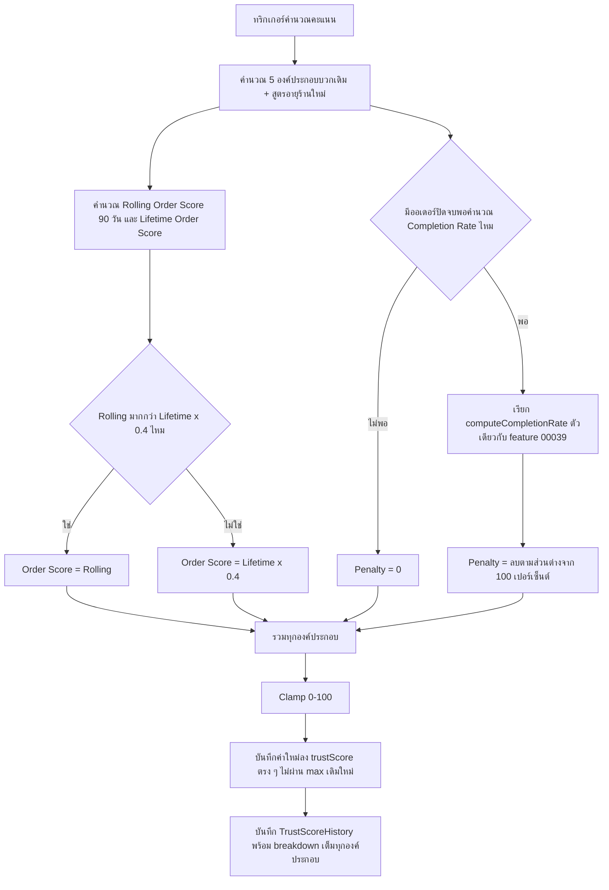
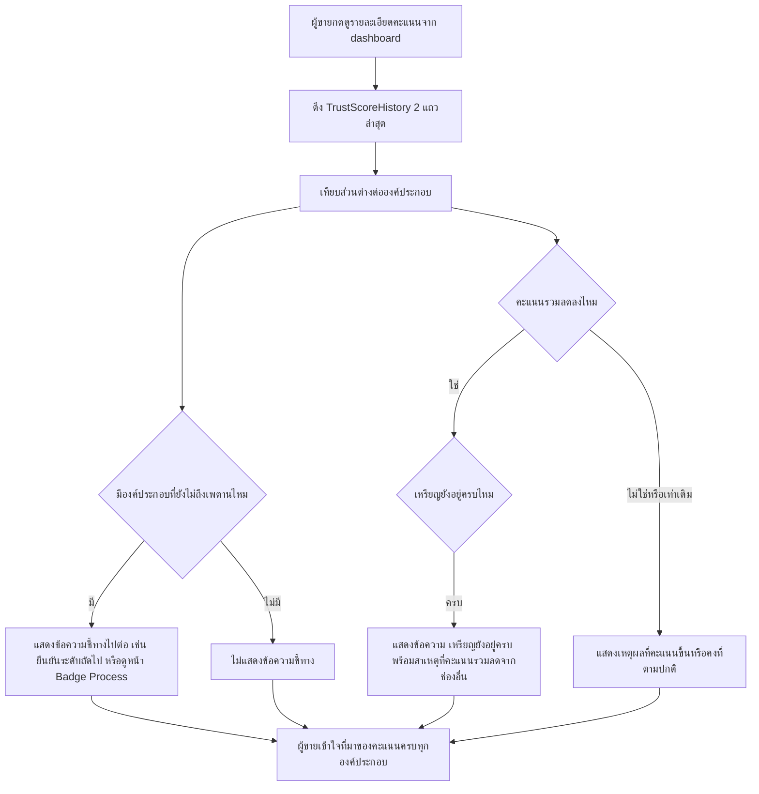

> **โมดูล:** M00040-TrustScoreV2
> **ประเภทเอกสาร:** Business Requirements Document (BRD) - NON-TECHNICAL
> **เวอร์ชัน:** 1.0
> **วันที่จัดทำ:** 2026-08-10
> **สถานะ:** Draft — decision D-1..D-9 ล็อกแล้ว รอ user review ก่อน implement
> **เจ้าของเอกสาร:** BA (ดู [[Feature-Docs-Ownership]])

# BRD: Trust Score v2 — คะแนนที่ต้องรักษา (Business Requirements Document)

---

## 1. บทนำ

### 1.1 วัตถุประสงค์ของเอกสาร

เอกสารนี้มีวัตถุประสงค์เพื่อ:
1. อธิบายความต้องการเชิงหน้าที่ของการแก้สูตร Trust Score ให้ (ก) คำนวณสดโดยไม่มีพื้นกันตก (ข) ให้สัญญาณได้จริงในช่องที่เคยตายตัว (ค) เปิดบทลงโทษที่มีหลักฐานเดียวคือการยกเลิกออเดอร์เอง โดยยึดมติที่ Controller ล็อกไว้แล้ว D-1..D-9
2. กำหนดขอบเขตของก้อนงานหลัก — ตัดพื้นกันตก, ซ่อมช่องอายุร้าน/ยืนยันตัวตน/เหรียญ, เปลี่ยนช่องออเดอร์เป็น rolling+floor, บทลงโทษยกเลิกเอง, หน้าอธิบายคะแนน — พร้อมรหัสอ้างอิง `FR-TS2-*`/`BR-TS2-*`
3. ยืนยันว่าบทลงโทษใหม่ใช้หลักฐานเดียวกับ Completion Rate (feature 00039) ที่มีอยู่แล้ว ไม่สร้างตรรกะคู่ขนานที่อาจให้ผลไม่ตรงกัน
4. แยกให้ชัดว่าฟีเจอร์นี้เปลี่ยนพฤติกรรมของ `User.trustScore` และ `Shop.trustScore` (business scope) พร้อมกันทั้งคู่ เพราะใช้ component function ร่วมกัน

### 1.2 ขอบเขตของระบบ

**Trust Score v2** คือการปรับปรุงกลไกคำนวณคะแนนความน่าเชื่อถือ (`src/services/trust-score.service.ts`) และองค์ประกอบที่เกี่ยวข้อง (`badge-score-rule.ts`, `order-stats.ts`) — ไม่มีการเปลี่ยนสเกล ไม่เปลี่ยน tier mapping มีเพียงการเปลี่ยนวิธีคำนวณคะแนนดิบก่อนแปลงเป็น tier บวกหน้าจอใหม่ที่อธิบายคะแนนให้ผู้ขายดูเอง

**เข้าสู่ระบบ (Input):**
- สถานะ verification/order/review/age/badge ปัจจุบันของผู้ใช้หรือร้าน (เหมือนเดิม)
- อัตราการยกเลิกออเดอร์ฝั่งร้าน (จาก `Order.cancelInitiator` ที่มีอยู่แล้ว)

**ออกจากระบบ (Output):**
- `User.trustScore` / `Shop.trustScore` ที่คำนวณสดทุกครั้ง ไม่มีพื้นกันตก
- `TrustScoreHistory.breakdown` ที่ขยายให้เก็บองค์ประกอบใหม่ (penalty, rolling/lifetime order detail)
- หน้าจอ "ทำไมคะแนนเปลี่ยน" ที่ผู้ขายเปิดดูเองได้

**ระบบที่เกี่ยวข้อง:**
- `src/services/trust-score.service.ts` (จุดคำนวณหลัก personal + business scope)
- `src/lib/badge-score-rule.ts` (SSOT คะแนนเหรียญ)
- `src/lib/order-stats.ts` + `Order.cancelInitiator` (feature 00039 — หลักฐานบทลงโทษ)
- `OrderEvent` (feature 00031 — แหล่งเวลาจริงของหน้าต่าง 90 วัน)
- หน้า Badge Process `/badges` (FR-4.7 — เชื่อมจากหน้าอธิบายคะแนน)
- `docs/10 - Business Rules/Tier Lists.md` (mapping คะแนน→tier ที่ไม่แตะ)

### 1.3 กลุ่มผู้ใช้งาน

| กลุ่มผู้ใช้ | บทบาท | สิทธิ์การใช้งาน |
|-----------|--------|----------------|
| **ผู้ขาย (personal shop / business shop)** | เจ้าของบัญชี/ร้านที่มี trust score | เห็นคะแนนตัวเอง + breakdown เต็มรูปแบบ (self-only เหมือน FR-4.7) |
| **พนักงานร้านที่ owner เชิญมา** | เข้าถึงหน้าร้านของ business shop | เห็น breakdown คะแนนของร้านเหมือน owner (ประธานในข้อความหน้าจอคือ "ร้าน" ไม่ใช่ "คุณ" — ตาม `badge-score-rule.ts` เดิม) |
| **ผู้ซื้อ** | ดู public profile/order link | เห็นเฉพาะ tier/คะแนนรวมที่แสดงผลอยู่แล้ว — ไม่เห็น breakdown |
| **ทีม Deep (ภายใน)** | ดูแลระบบ | ไม่มีหน้าจอ admin ใหม่ในรอบนี้ (ไม่มีระบบร้องเรียนให้ตัดสิน — D-8) |

---

## 2. ความต้องการหลัก (Functional Requirements)

### 2.1 ตัดพื้นกันคะแนนตก (D-1, D-2)

#### FR-TS2-01: คำนวณคะแนนสดทุกครั้ง ไม่มีพื้นกันตก

**User Story:**
> ในฐานะผู้ซื้อ ฉันต้องการเห็นคะแนนที่สะท้อนพฤติกรรมปัจจุบันของร้าน ไม่ใช่คะแนนสูงสุดที่ร้านนั้นเคยทำได้ในอดีต เพื่อตัดสินใจซื้อได้ถูกต้อง

**Acceptance Criteria:**
- [ ] `recalculateTrustScore(userId)` และ `recalculateShopTrustScore(shopId)` บันทึกค่าที่คำนวณได้ (`computed`) ตรง ๆ ลง `trustScore` โดยไม่ผ่าน `Math.max(เดิม, computed)` อีกต่อไป
- [ ] ค่าที่บันทึกลง `TrustScoreHistory.score` และค่าที่บันทึกลง `User.trustScore`/`Shop.trustScore` เป็นค่าเดียวกันเสมอ (ไม่มีค่าสองชุดที่ต่างกัน)
- [ ] เคสที่คะแนนคำนวณใหม่ต่ำกว่าคะแนนก่อนหน้า → ค่าที่แสดงผลบนหน้าจอทุกจุด (public profile, order link, dashboard) ต้องเป็นค่าใหม่ที่ต่ำลง ไม่ใช่ค่าเดิม

#### FR-TS2-02: คะแนนรวมต้อง clamp 0–100 เสมอ

**User Story:**
> ในฐานะผู้ดูแลระบบ ฉันต้องการให้คะแนนที่แสดงผลไม่มีวันติดลบหรือเกิน 100 แม้บทลงโทษจะทำให้ผลรวมดิบต่ำกว่า 0 ก็ตาม

**Acceptance Criteria:**
- [ ] ผลรวมของ 5 องค์ประกอบบวก + penalty ถูก clamp ด้วย `Math.max(0, Math.min(100, computed))` ก่อนบันทึก
- [ ] เคสร้านที่มี penalty สูงสุดพร้อมกับองค์ประกอบบวกต่ำสุด (บัญชีใหม่ที่ยกเลิกเยอะ) ต้องได้คะแนนแสดงผล = 0 ไม่ใช่ค่าติดลบ

### 2.2 ซ่อมช่องคะแนนที่ไม่ขยับ (D-9)

#### FR-TS2-03: สูตรอายุร้านให้คะแนนตั้งแต่วันแรก

**User Story:**
> ในฐานะร้านค้าที่เพิ่งเปิด ฉันต้องการเห็นคะแนนอายุร้านขยับตั้งแต่วันแรกที่เปิดร้าน ไม่ใช่ค้างที่ 0 นานหลายสัปดาห์

**Acceptance Criteria:**
- [ ] สูตรอายุร้านเปลี่ยนจาก `min(10, round(daysOld/365*10))` (linear) เป็น **`min(10, round(sqrt(daysOld/365) × 10))`** (เคาะแล้ว 2026-08-10) → วันแรก = 1 · 30 วัน = 3 · 90 วัน = 5 · 180 วัน = 7 · 365 วัน = 10 (โตเร็วตอนต้นแล้วอิ่มตัว ตรงกับที่อายุมีค่าจริง: การแยก "1 วัน" จาก "60 วัน" สำคัญกว่าการแยก "2 ปี" จาก "3 ปี")
- [ ] เพดานคะแนน 10 และเงื่อนไข "1 ปี = เต็มเพดาน" ยังคงเดิม (ไม่เปลี่ยนความหมายของคะแนนเต็ม)
- [ ] ทดสอบร้านที่สร้างวันนี้ (`daysOld` เท่ากับเศษของ 1 วัน) ต้องได้คะแนนอายุร้าน ≥ 1 ไม่ใช่ 0

#### FR-TS2-04: หน้าจอชี้ทางไปต่อของช่องยืนยันตัวตนและเหรียญตรา

**User Story:**
> ในฐานะร้านค้าที่ยืนยันตัวตนแค่ระดับ 1 ฉันต้องการรู้ว่าถ้ายืนยันระดับถัดไปจะได้คะแนนเพิ่มเท่าไหร่ เพื่อตัดสินใจว่าคุ้มที่จะทำหรือไม่

**Acceptance Criteria:**
- [ ] หน้า breakdown (FR-TS2-08) แสดงคะแนนยืนยันตัวตนปัจจุบัน + คะแนนที่จะได้เพิ่มถ้ายืนยันระดับถัดไป (เช่น "ยืนยันแล้วระดับ 1 (10/35) — ยืนยันระดับ 2 เพื่อรับเพิ่ม 15 คะแนน")
- [ ] หน้าเดียวกันมีลิงก์ไปหน้า Badge Process (`/badges`, มีอยู่แล้ว) ให้เห็น progress ของเหรียญที่ยังไม่ได้ ไม่ต้องสร้าง progress bar ซ้ำ
- [ ] ไม่มีการเปลี่ยนเกณฑ์ L1/L2/L3 หรือเกณฑ์เหรียญ 31 ชนิดเดิม — FR นี้เป็นการมองเห็น (visibility) เท่านั้น

### 2.3 ช่องคะแนนออเดอร์สะท้อนกิจกรรมล่าสุด (D-4)

#### FR-TS2-05: Order Score = max(rolling 90 วัน, lifetime × 0.4)

**User Story:**
> ในฐานะผู้ซื้อ ฉันต้องการให้คะแนนออเดอร์ของร้านสะท้อนว่าร้านยังทำงานต่อเนื่องอยู่จริง ไม่ใช่แค่เคยขายเยอะในอดีต

**Acceptance Criteria:**
- [ ] คำนวณ `rollingScore = min(25, round(sqrt(confirmedCount_90d) * 2.5))` จากจำนวนออเดอร์ CONFIRMED ที่ "เกิดขึ้นจริง" ภายใน 90 วันล่าสุด (ดู BR-TS2-08 สำหรับแหล่งเวลาที่ถูกต้อง)
- [ ] คำนวณ `lifetimeScore = min(25, round(sqrt(confirmedCount_allTime) * 2.5))` — สูตรเดียวกับปัจจุบันเป๊ะ (zero-regression กับค่าเดิม)
- [ ] `orderScore = max(rollingScore, lifetimeScore * 0.4)`
- [ ] `TrustScoreHistory.breakdown` เก็บทั้ง `rollingScore` และ `lifetimeScore` แยกกัน ไม่ใช่แค่ค่าที่ชนะ — เพื่อให้หน้า breakdown อธิบายได้ว่าใช้ค่าไหน
- [ ] ร้านที่ทุกออเดอร์อยู่ในหน้าต่าง 90 วัน (`rollingScore === lifetimeScore`) ต้องได้ `orderScore` เท่ากับสูตรเดิมทุกประการ (zero-regression วันเปิดใช้ฟีเจอร์)

### 2.4 บทลงโทษยกเลิกออเดอร์เอง (D-2, D-3)

#### FR-TS2-06: Penalty จากอัตรายกเลิกฝั่งร้าน ใช้ตรรกะเดียวกับ Completion Rate

**User Story:**
> ในฐานะร้านค้า ฉันต้องการให้คะแนนลดก็ต่อเมื่อมีหลักฐานชัดว่าฉันเป็นคนยกเลิกเอง ไม่ใช่ถูกลงโทษจากเหตุที่ไม่ใช่ความผิดของฉัน (ผู้ซื้อยกเลิกเอง/พัสดุตีกลับ)

**Acceptance Criteria:**
- [ ] คำนวณ `completionRate` ของร้านด้วยฟังก์ชัน `computeCompletionRate()` จาก `src/lib/order-stats.ts` ตัวเดียวกับที่ feature 00039 ใช้ — ไม่เขียนสูตรอัตรายกเลิกซ้ำที่นี่
- [ ] ถ้า `completionRate.rate === null` (ต่ำกว่าเกณฑ์ขั้นต่ำ `COMPLETION_RATE_MIN_SAMPLE`) → `penalty = 0`
- [ ] ถ้ามีค่า → **`penalty = -min(10, round(max(0, 97 - completionRate.rate) / 5))`** (เคาะแล้ว 2026-08-10: `PENALTY_FREE_RATE = 97`, `PENALTY_DIVISOR = 5`, `PENALTY_CAP = 10`)
- [ ] 🛑 **มีเขตปลอดโทษ: ยกเลิกเองได้ถึง 3% โดยไม่เสียคะแนน** — การยกเลิกบางส่วนเป็นเรื่องปกติของธุรกิจ ไม่ใช่ความผิด (เกณฑ์ 2–5% ตรงกับที่แพลตฟอร์มใหญ่ใช้) · เกิน 3% หักทุก 5 จุดเปอร์เซ็นต์ = 1 คะแนน · **เพดานหัก 10 คะแนน** (เท่าช่องเหรียญ ไม่เกินช่องออเดอร์) → completion ≤ 47% ชนเพดาน
- [ ] ตรวจกับข้อมูล prod 2026-08-10: ร้านที่ผ่านเกณฑ์ตัวอย่าง 5 ใบมีร้านเดียว (76 ใบปิดจบ · completion 93.4%) → หัก **1 คะแนน** · อีก 2 ร้านตัวอย่าง 3 ใบ/1 ใบ → penalty = 0 ตามที่ออกแบบ
- [ ] การยกเลิกที่ `isRateExcludedCancellation()` คืน `true` (ผู้ซื้อยกเลิกเอง/พัสดุตีกลับ) ต้องไม่ถูกนับเข้า numerator ของความผิดร้าน — สืบทอดพฤติกรรมเดิมของ `computeCompletionRate` โดยอัตโนมัติเพราะเรียกฟังก์ชันเดียวกัน
- [ ] `cancelReason` (เหตุผลที่ร้านกรอกเอง) ต้องไม่ถูกอ่านหรือใช้ในการคำนวณ penalty นี้เลย

#### FR-TS2-07: เหรียญที่ได้แล้วติดตัวถาวรเสมอ แม้คะแนนรวมลด

**User Story:**
> ในฐานะร้านค้าที่มีเหรียญตราสะสมอยู่แล้ว ฉันต้องการมั่นใจว่าเหรียญของฉันจะไม่ถูกริบคืนแม้คะแนนรวมของร้านจะลดลงจากบทลงโทษหรือองค์ประกอบอื่น

**Acceptance Criteria:**
- [ ] `FR-4.4` (เหรียญติดตัวถาวร ไม่ revoke) ไม่ถูกแก้ไขในฟีเจอร์นี้ — จำนวนเหรียญของร้านไม่มีทางลดลงไม่ว่าคะแนนรวมจะเป็นอย่างไร
- [ ] ช่องคะแนนเหรียญ (`calcBadgeScore`) ยังคงคำนวณจากจำนวนเหรียญที่มีอยู่จริงเสมอ (ไม่มีการ "หักคะแนนเหรียญ" แยกต่างหาก)
- [ ] หน้า breakdown (FR-TS2-08) ต้องแสดงข้อความแยกชัดเมื่อคะแนนรวมลดทั้งที่จำนวนเหรียญไม่ลด (เช่น "เหรียญของคุณยังอยู่ครบ N ใบ") เพื่อป้องกันความเข้าใจผิดว่าเหรียญถูกริบ

### 2.5 หน้าที่อธิบายว่าทำไมคะแนนเปลี่ยน (D-6 — บังคับ)

#### FR-TS2-08: หน้า/ส่วนแสดง breakdown ครบทุกองค์ประกอบ (บวกและลบ)

**User Story:**
> ในฐานะร้านค้า ฉันต้องการเปิดหน้าจอเดียวแล้วเห็นว่าคะแนนของฉันมาจากอะไรบ้าง ทั้งส่วนที่บวกและส่วนที่ลบ โดยไม่ต้องถามทีม support

**Acceptance Criteria:**
- [ ] หน้าจอแสดงคะแนนแยกตามองค์ประกอบทั้งหมด: Verification / Rolling Order / Lifetime Order (แสดงว่าใช้ค่าไหน) / Rating / Age / Badges / Penalty (ยกเลิกเอง)
- [ ] แต่ละองค์ประกอบที่ยังไม่ถึงเพดาน แสดงข้อความชี้ทางไปต่อ (เชื่อมกับ FR-TS2-04)
- [ ] หน้าจอนี้เป็น self-only เหมือน FR-4.7 (Badge Process) — owner และพนักงานร้านที่ถูกเชิญเห็นได้ ผู้ซื้อ/บุคคลภายนอกเห็นไม่ได้
- [ ] เข้าถึงได้จากจุดที่แสดงคะแนนอยู่แล้ว (เช่น `SellerHeader.tsx`, `UserCard.tsx` บน dashboard) ผ่านลิงก์/ปุ่มที่มองเห็นชัดเจน ไม่ใช่ซ่อนในเมนูลึก

#### FR-TS2-09: ประวัติคะแนนเทียบกับครั้งก่อนหน้าได้

**User Story:**
> ในฐานะร้านค้า ฉันต้องการเห็นว่าคะแนนของฉันเปลี่ยนจากครั้งก่อนหน้าอย่างไร แยกเป็นรายองค์ประกอบ ไม่ใช่แค่ยอดรวมที่เปลี่ยน

**Acceptance Criteria:**
- [ ] `TrustScoreHistory.breakdown` (Json) ขยายให้เก็บ key ใหม่: `penalty`, `ordersRolling`, `ordersLifetime` (นอกเหนือจาก `verification`/`orders`/`rating`/`age`/`badges` เดิม) — ไม่ลบ key เดิมที่มีอยู่แล้ว (zero-regression กับแถวประวัติเก่า)
- [ ] หน้า breakdown ดึงแถวล่าสุด 2 แถวของ `TrustScoreHistory` มาเทียบ แสดงส่วนต่างต่อองค์ประกอบ (เช่น "อายุร้าน +2, Penalty -1, รวมสุทธิ +1")
- [ ] แถวประวัติเก่าที่ไม่มี key ใหม่ (บันทึกก่อน deploy ฟีเจอร์นี้) ต้องแสดงผลได้โดยไม่ error — ตีความ key ที่ไม่มีเป็น 0

### 2.6 ขอบเขตที่ตั้งใจไม่ทำใน Phase นี้ (D-5)

#### FR-TS2-10: ไม่ต้องมีกลไก grace period หรือแจ้งเตือนล่วงหน้า

**User Story:**
> ในฐานะทีมพัฒนา เราไม่ต้องการเสียเวลาสร้างกลไกลดผลกระทบ (soft-landing) สำหรับการเปลี่ยนแปลงนี้ เพราะข้อมูล prod ยืนยันแล้วว่าไม่มีร้านตกชั้นทันทีที่เปิดใช้

**Acceptance Criteria:**
- [ ] ไม่มีการสร้าง flag/configuration สำหรับ "ช่วงเปลี่ยนผ่าน" ของสูตรใหม่
- [ ] ก่อน deploy ต้องรัน simulation เทียบ tier เดิม/ใหม่ของทุกร้านบน prod จริง ณ เวลาที่ใกล้ deploy ที่สุด (ไม่ใช่ใช้ข้อมูลของวันที่เขียนเอกสารนี้ เพราะข้อมูลจะเปลี่ยนไปทุกวันที่รอ)
- [ ] ถ้า simulation พบร้านที่ tier ลดลงจริง → ต้องกลับไปหารือกับ Controller/user ก่อน deploy ไม่ใช่ deploy แล้วค่อยแก้

---

## 3. Acceptance Criteria สรุป

### 3.1 ตัดพื้นกันคะแนนตก

**เมื่อระบบทำงานถูกต้อง:**
- ✅ คะแนนบันทึก/แสดงผลเป็นค่าที่คำนวณสดเสมอ ไม่มี `Math.max(เดิม, ใหม่)`
- ✅ คะแนนรวม clamp 0–100 เสมอ ไม่มีค่าติดลบหรือเกิน 100

### 3.2 ซ่อมช่องคะแนนที่ไม่ขยับ

**เมื่อระบบทำงานถูกต้อง:**
- ✅ ร้านใหม่ได้คะแนนอายุร้าน > 0 ตั้งแต่วันแรก
- ✅ หน้าจอชี้ทางไปต่อของยืนยันตัวตนและเหรียญตราชัดเจน ไม่ต้องเดา

### 3.3 ช่องคะแนนออเดอร์แบบ rolling + floor

**เมื่อระบบทำงานถูกต้อง:**
- ✅ ร้านที่ทุกออเดอร์อยู่ใน 90 วัน ได้คะแนนเท่าสูตรเดิมทุกประการ (zero-regression)
- ✅ ร้านที่หยุดทำธุรกิจเกิน 90 วัน ไม่ตกลงมาต่ำกว่า 40% ของคะแนนตลอดชีพ

### 3.4 บทลงโทษยกเลิกเอง

**เมื่อระบบทำงานถูกต้อง:**
- ✅ penalty คำนวณจาก `computeCompletionRate()`/`isRateExcludedCancellation()` ตัวเดียวกับ Completion Rate (00039) เสมอ
- ✅ การยกเลิกที่ไม่ใช่ความผิดร้าน (ผู้ซื้อยกเลิกเอง/พัสดุตีกลับ) ไม่มีผลต่อ penalty
- ✅ ร้านที่ข้อมูลไม่พอ (ต่ำกว่าเกณฑ์ขั้นต่ำ) ได้ penalty = 0

### 3.5 ความโปร่งใส

**เมื่อระบบทำงานถูกต้อง:**
- ✅ หน้า breakdown แสดงทุกองค์ประกอบ (บวกและลบ) พร้อมเทียบกับครั้งก่อนหน้า
- ✅ เหรียญที่ได้แล้วยังแสดงครบแม้คะแนนรวมลด พร้อมข้อความแยกชัดว่าไม่ได้ถูกริบ

### 3.6 การไม่กระทบระบบเดิม (Zero-Regression)

**เมื่อระบบทำงานถูกต้อง:**
- ✅ ไม่เปลี่ยนสเกล 0-100 หรือ mapping tier ใน `Tier Lists.md`
- ✅ ไม่เปลี่ยนเกณฑ์ยืนยันตัวตน L1/L2/L3 หรือเกณฑ์เหรียญ 31 ชนิดเดิม
- ✅ ไม่มีร้านไหน tier ลดลงในวันที่เปิดใช้ฟีเจอร์ (พิสูจน์ด้วย simulation ก่อน deploy)
- ✅ ไม่มีบทลงโทษจากรีวิวแย่หรือการตัดสินของแอดมินในรอบนี้

---

## 4. Business Flows (กระบวนการทำงาน)

### 4.1 Flow หลัก: คำนวณ Trust Score v2 (รวม penalty และไม่มี floor)

### 4.2 Flow: ผู้ขายเปิดหน้า "ทำไมคะแนนเปลี่ยน"

---

## 5. Use Case Scenarios (สถานการณ์การใช้งานจริง)

### Scenario 1: ร้านที่ทำดีสม่ำเสมอเห็นคะแนนขยับขึ้นครั้งแรก (Best Case)

**ผู้เกี่ยวข้อง:** ร้านค้าที่ยืนยันตัวตนแค่ L1, มีออเดอร์สำเร็จเรื่อย ๆ, ยังไม่มีรีวิวสะสมพอ

**เงื่อนไขเริ่มต้น:**
- คะแนนก่อนหน้า: Verification 10 + Order 21 + Rating 0 + Age 0 + Badge 1 = 32

**ขั้นตอน:**
1. เวลาผ่านไป 20 วัน ร้านมีออเดอร์สำเร็จเพิ่มขึ้นเล็กน้อย ระบบคำนวณคะแนนใหม่
2. Age Score ขยับจาก 0 เป็นค่า > 0 (ตามสูตรใหม่ FR-TS2-03)

**ผลลัพธ์:**
- คะแนนรวมขยับขึ้นแม้ไม่ได้ทำอะไรพิเศษเพิ่มนอกจากทำธุรกิจต่อเนื่อง — ร้านเห็นความคืบหน้าเป็นครั้งแรก

### Scenario 2: ร้านขนาดใหญ่มีการยกเลิกเองบางส่วน เห็นคะแนนลดเล็กน้อยพร้อมคำอธิบาย (Edge Case)

**ผู้เกี่ยวข้อง:** ร้านค้าที่มีออเดอร์สำเร็จ 71 ใบ ยกเลิกเอง 5 ใบ (ตัวอย่างจริงจากข้อมูล prod)

**เงื่อนไขเริ่มต้น:**
- Completion Rate ของร้านนี้ (จาก 00039) ≈ 93%

**ขั้นตอน:**
1. ระบบคำนวณ penalty จาก `computeCompletionRate()` ของร้านนี้
2. penalty ที่ได้เป็นค่าติดลบเล็กน้อย (ไม่ใช่การหักหนักต่อใบ)

**ผลลัพธ์:**
- คะแนนรวมลดลงเล็กน้อย เจ้าของร้านเปิดหน้า breakdown เห็นว่าลดจากช่อง penalty เท่าไหร่ และตัวเลขตรงกับ Completion Rate ที่เห็นในหน้าอื่นอยู่แล้ว ไม่รู้สึกว่าถูกลงโทษเกินจริง

### Scenario 3: ร้านหยุดขายเกิน 90 วันในอนาคต (Edge Case)

**ผู้เกี่ยวข้อง:** ร้านที่เคยมีออเดอร์สำเร็จจำนวนมากแล้วหยุดทำธุรกิจ

**เงื่อนไขเริ่มต้น:**
- ไม่มีออเดอร์สำเร็จใหม่ในช่วง 90 วันล่าสุด

**ขั้นตอน:**
1. Rolling Order Score ลดลงเหลือ 0 (ไม่มีออเดอร์ในหน้าต่าง 90 วัน)
2. ระบบเทียบกับ Lifetime Order Score × 0.4

**ผลลัพธ์:**
- Order Score = Lifetime × 0.4 (ไม่ใช่ 0) — ร้านไม่ถูกลงโทษจนสูญเสียฐานที่สะสมมาทั้งหมดในทันที แต่คะแนนต่ำกว่าตอนที่ยังทำงานต่อเนื่องอยู่ สะท้อนความจริงว่าหยุดทำธุรกิจไปแล้ว

### Scenario 4: เหรียญที่ได้แล้วยังอยู่ครบแม้คะแนนรวมลด (Zero-Regression)

**ผู้เกี่ยวข้อง:** ร้านที่มีเหรียญ 3 ใบ และมี penalty จากการยกเลิกเอง

**เงื่อนไขเริ่มต้น:**
- ร้านมีเหรียญ "First Sale", "Trusted Seller 50", "Fully Verified" (3 ใบ)

**ขั้นตอน:**
1. ระบบคำนวณคะแนนใหม่ ได้ penalty ติดลบ ทำให้คะแนนรวมต่ำกว่าครั้งก่อน
2. เจ้าของร้านเปิดหน้า breakdown

**ผลลัพธ์:**
- ช่องเหรียญตรายังแสดง 3 ใบเท่าเดิม (คะแนนเหรียญไม่ลด) พร้อมข้อความ "เหรียญของคุณยังอยู่ครบ 3 ใบ" — คะแนนรวมที่ลดมาจาก penalty เท่านั้น ไม่ใช่เหรียญถูกริบ

---

## 6. ความต้องการด้านคุณภาพ (Quality Requirements)

### 6.1 ความถูกต้องของข้อมูล
- ตัวเลข penalty ที่แสดงในหน้า breakdown ต้องตรงกับ Completion Rate ที่แสดงในหน้าอื่น 100% เพราะมาจากฟังก์ชันเดียวกัน
- คะแนน Rolling/Lifetime Order ต้องนับจากเวลาจริงที่ออเดอร์ CONFIRMED เกิดขึ้น (ดู BR-TS2-08)

### 6.2 ความรวดเร็ว
- การเปิดหน้า breakdown ต้องไม่ต้องคำนวณ Trust Score ใหม่แบบ real-time ทุกครั้ง — อ่านจาก `TrustScoreHistory` ที่บันทึกไว้แล้วเป็นหลัก

### 6.3 ความน่าเชื่อถือ
- ทุกครั้งที่คะแนนเปลี่ยน ต้องมีแถวใหม่ใน `TrustScoreHistory` ที่ตรวจสอบย้อนหลังได้ครบทุกองค์ประกอบ
- เหรียญที่ได้แล้วต้องไม่มีทางหายไปจากหน้าจอไม่ว่าคะแนนรวมจะเปลี่ยนอย่างไร

### 6.4 ความปลอดภัย
- หน้า breakdown เป็น self-only (owner + พนักงานร้านที่ถูกเชิญ) — ผู้ใช้อื่นเข้าถึงไม่ได้ เหมือนหน้า Badge Process เดิม
- penalty คำนวณจากหลักฐานฝั่งเซิร์ฟเวอร์เท่านั้น (`cancelInitiator`, สถานะพัสดุ) ไม่รับค่าจาก client

### 6.5 ความสะดวกในการใช้งาน (Usability)
- ข้อความชี้ทางไปต่อ (ยืนยันตัวตนระดับถัดไป/เหรียญที่ยังไม่ได้) ต้องเจาะจงเป็นตัวเลข ไม่ใช่คำกว้าง ๆ ("ยืนยันตัวตนเพิ่มเติม" ไม่พอ ต้องเป็น "ยืนยันระดับ 2 เพื่อรับเพิ่ม 15 คะแนน")
- ข้อความเมื่อคะแนนลดต้องไม่ใช้น้ำเสียงตำหนิ — อธิบายข้อเท็จจริงเชิงตัวเลข ไม่ตัดสินร้าน

---

## 7. ข้อจำกัด (Constraints)

### 7.1 ข้อจำกัดทางธุรกิจ
- ไม่แตะเกณฑ์ยืนยันตัวตน L1/L2/L3 หรือเกณฑ์เหรียญ 31 ชนิดเดิม (D-9 เป็นเรื่องการมองเห็น ไม่ใช่เปลี่ยน threshold)
- ไม่มีบทลงโทษจากรีวิวแย่หรือการตัดสินของแอดมินในรอบนี้ (D-7, D-8)
- ไม่มีกลไก soft-landing/grace period (D-5)
- ไม่เปลี่ยนสเกล 0-100 หรือ mapping tier (D-1)

### 7.2 ข้อจำกัดทางเทคนิค
- penalty ต้องคำนวณผ่าน `computeCompletionRate()`/`isRateExcludedCancellation()` จาก `src/lib/order-stats.ts` เท่านั้น ห้ามเขียนสูตรอัตรายกเลิกซ้ำที่อื่น
- ค่าคงที่ของสูตรใหม่ (curve อายุร้าน, divisor/cap ของ penalty) ต้องมี SSOT เดียวที่ทั้งการคำนวณและข้อความบนหน้าจอ import ร่วมกัน (ตาม pattern `badge-score-rule.ts` ที่มีอยู่แล้ว — ป้องกันปัญหาเดียวกับที่เคยเกิดกับ `BadgeDetailModal`)
- ต้องมีกลไกคำนวณคะแนนใหม่ที่ไม่พึ่ง event เท่านั้น (สำหรับให้ Rolling Order Score ลดตามเวลาได้แม้ไม่มี event ใหม่) — รายละเอียดทางเทคนิคออกแบบในชั้น SRS/SDS
- งานนี้แตะ UI ใหม่ (หน้า breakdown) — ต้องผ่าน `safepay-ux` gate ก่อนแตะโค้ดฝั่งหน้าจอ (Hard Rule 8)
- ก่อน deploy ต้องรัน simulation เทียบ tier เดิม/ใหม่ของทุกร้านบน prod จริงเพื่อยืนยันว่าไม่มีร้านตกชั้น — เป็นเงื่อนไขก่อน merge ไม่ใช่ทำหลัง deploy
- เทสที่เขียนขึ้นเพื่อยืนยันพฤติกรรมนี้ ห้ามมีคำสั่งลบข้อมูลแบบไม่จำกัดขอบเขตในฐานข้อมูลทดสอบ ต้องจำกัดด้วยตัวระบุที่เทสสร้างขึ้นเองเท่านั้น (Hard Rule 13)

---

## 8. กฎทางธุรกิจ (Business Rules)

### 8.1 ตัดพื้นกันคะแนนตก (D-1, D-2)

- **BR-TS2-01** คะแนนที่บันทึกและแสดงผลต้องเป็นค่าที่คำนวณสดจากสถานะปัจจุบันเสมอ ห้ามใช้กลไก "ค่าสูงสุดที่เคยคำนวณได้"
- **BR-TS2-02** คะแนนรวมหลังคำนวณต้อง clamp อยู่ในช่วง 0–100 เสมอ ไม่ว่าองค์ประกอบลบจะดึงค่าดิบต่ำแค่ไหน
- **BR-TS2-03** จำนวนเหรียญตราที่ร้านได้รับไม่มีวันลดลง (FR-4.4 คงเดิม) — สิ่งที่ลดได้คือคะแนนรวมจากองค์ประกอบอื่น ไม่ใช่การริบเหรียญ

### 8.2 ซ่อมช่องคะแนนที่ไม่ขยับ (D-9)

- **BR-TS2-04** สูตรอายุร้านต้องให้คะแนน > 0 ตั้งแต่วันแรกที่เปิดร้าน ไม่ปัดเป็น 0 ค้างไว้หลายสัปดาห์เหมือนสูตรเดิม
- **BR-TS2-05** ไม่แก้ threshold ของยืนยันตัวตน (L1/L2/L3) หรือเกณฑ์เหรียญตรา — แก้เฉพาะการแสดงผลให้เห็นทางไปต่อชัดเจน

### 8.3 ช่องคะแนนออเดอร์แบบ rolling + floor (D-4)

- **BR-TS2-06** คะแนนช่องออเดอร์ = ค่าที่สูงกว่าระหว่าง (rolling 90 วัน) และ (lifetime × 0.4)
- **BR-TS2-07** สูตรแปลง "จำนวนออเดอร์" เป็นคะแนนของทั้งสองฝั่งต้องเป็นสูตรเดียวกับที่ระบบใช้อยู่แล้ว (`min(25, round(sqrt(count) × 2.5))`) — เปลี่ยนเฉพาะช่วงเวลาที่นับ ไม่เปลี่ยนรูปทรง curve
- **BR-TS2-08** 🛑 **หน้าต่าง 90 วันนับจาก `OrderEvent.occurredAt` ของเหตุการณ์ยืนยันออเดอร์ โดยเอา 3 ชนิดนี้รวมกันแล้วเลือกใบแรกสุด: `SYSTEM_CONFIRMED` · `COD_SETTLED` · `BUYER_CONFIRMED`** (เคาะแล้ว 2026-08-10 หลังนับของจริงบน prod) — fallback เป็น `Order.updatedAt` เฉพาะออเดอร์ที่ไม่มี event ทั้ง 3 ชนิด (บน prod มี 2 ใบจาก 73)
  - 🛑 **ห้ามหยิบ `BUYER_CONFIRMED` ชนิดเดียวเด็ดขาด แม้ชื่อจะฟังดูตรงที่สุด** — นับบน prod 2026-08-10: ออเดอร์สำเร็จ 73 ใบมี `BUYER_CONFIRMED` **0 ใบ** (ผู้ซื้อไม่เคยกดยืนยันเองเลยสักครั้ง ทุกใบปิดด้วย cron อัตโนมัติ: `SYSTEM_CONFIRMED` 71 ใบ · `COD_SETTLED` 71 ใบ) ⇒ ถ้าเลือกชนิดเดียวตามชื่อ หน้าต่าง 90 วันจะได้ 0 ทุกร้าน คะแนนออเดอร์ตกไปเป็น `lifetime × 0.4` ทั้งกระดาน **โดยไม่มี error ไม่มีเทสแดง** เพราะโค้ดถูกทุกบรรทัด
  - **ห้ามใช้ `Order.createdAt`** — ตั้งแต่ feature 00033 มันแปลว่า "วันที่ลูกค้าสั่ง" ที่ผู้ขายพิมพ์เองย้อนหลังได้ 90 วัน
  - **ห้ามใช้ `Order.updatedAt`** — ขยับทุกครั้งที่แตะออเดอร์ (เพิ่มเลขพัสดุ/แก้ที่อยู่/sync สถานะขนส่ง) ซึ่งไม่ได้แปลว่าร้านขายของใหม่ · วัดบน prod: เพี้ยนจากเวลายืนยันจริง **เฉลี่ย 38.5 ชม. สูงสุด 119.7 ชม. (5 วัน)**
  - คลาสเดียวกับบั๊กเหรียญ "ส่งไว" ที่พบและแก้เมื่อ 2026-08-10 (ดู `src/lib/shipping-speed.ts`) — คอลัมน์/ชื่อ event ที่ "ฟังดูถูก" ไม่ใช่หลักฐานว่ามีข้อมูลอยู่จริง **ต้องนับของจริงก่อนล็อกเสมอ**

### 8.4 บทลงโทษยกเลิกเอง (D-2, D-3, D-7, D-8)

- **BR-TS2-09** penalty คำนวณจากอัตราการยกเลิกฝั่งร้านเท่านั้น (ไม่มีบทลงโทษจากรีวิวแย่หรือการตัดสินของแอดมินใน Phase A)
- **BR-TS2-10** ต้องใช้ `computeCompletionRate()`/`isRateExcludedCancellation()` จาก `src/lib/order-stats.ts` เป็นแหล่งเดียว ห้ามคำนวณอัตรายกเลิกซ้ำที่อื่นด้วยนิยามของตัวเอง
- **BR-TS2-11** การยกเลิกที่ผู้ซื้อเป็นคนกดเอง หรือขนส่งรายงานว่าพัสดุตีกลับ ไม่นับเป็นความผิดร้านและไม่มีผลต่อ penalty
- **BR-TS2-12** เหตุผลที่ร้านกรอกเอง (`cancelReason`) ไม่มีอำนาจเปลี่ยนแปลง penalty ไม่ว่ากรณีใด
- **BR-TS2-13** ร้านที่มีออเดอร์ปิดจบไม่ถึงเกณฑ์ขั้นต่ำของ Completion Rate ได้ penalty = 0 (ไม่ใช่ประเมินจากฐานตัวอย่างที่เล็กเกินไป)

### 8.5 ความโปร่งใส (D-6)

- **BR-TS2-14** ทุกครั้งที่ Trust Score เปลี่ยนแปลง ต้องมีหน้าจอที่ผู้ขายเปิดดูเองได้ว่าเปลี่ยนเพราะองค์ประกอบใด — เป็นเงื่อนไขบังคับคู่กับการเปิดบทลงโทษ ไม่ใช่ฟีเจอร์เสริมที่ตัดออกได้
- **BR-TS2-15** หน้าจอนี้ต้องแสดงองค์ประกอบที่เป็นลบ (penalty) แยกจากองค์ประกอบที่เป็นบวกอย่างชัดเจน ไม่ปะปนกัน
- **BR-TS2-16** เมื่อคะแนนรวมลดทั้งที่จำนวนเหรียญไม่ลด ต้องมีข้อความแยกยืนยันว่าเหรียญยังอยู่ครบ ป้องกันความเข้าใจผิดว่าเหรียญถูกริบ

### 8.6 ขอบเขตที่ตั้งใจไม่ทำใน Phase นี้ (D-5, D-7, D-8)

- **BR-TS2-17** ไม่มีกลไก grace period หรือแจ้งเตือนล่วงหน้าก่อนคะแนนเปลี่ยน — การตัดสินใจนี้ผูกกับเงื่อนไขเวลาปัจจุบัน (ไม่มีร้านตกชั้นตอน deploy) ไม่ใช่หลักการถาวร
- **BR-TS2-18** ก่อน deploy ต้องรัน simulation ยืนยันว่าไม่มีร้านตกชั้นด้วยข้อมูล prod จริง ณ เวลาที่ใกล้ deploy ที่สุด — ถ้าพบร้านตกชั้นต้องหยุดและกลับไปหารือก่อน
- **BR-TS2-19** บทลงโทษ "รีวิวแย่" และ "แอดมินตัดสินว่าผิด" ยังคงอยู่ในแนวคิดของฟีเจอร์ Trust Score v2 แต่เลื่อนไป Phase 2 — ไม่ใช่ถูกยกเลิกถาวร

---

## 9. อภิธานศัพท์ (Glossary)

| คำศัพท์ | ความหมาย |
|---------|----------|
| **Trust Score v2** | รอบปรับปรุง Trust Score ที่ตัดพื้นกันตก + ซ่อมช่องที่ไม่ขยับ + เพิ่มบทลงโทษที่มีหลักฐาน |
| **Rolling Order Score** | คะแนนออเดอร์จากช่วง 90 วันล่าสุด นับจากเวลาจริงที่ CONFIRMED |
| **Lifetime Order Score** | คะแนนออเดอร์สะสมตลอดชีพ (สูตรเดิม) ใช้เป็นพื้น 40% |
| **บทลงโทษยกเลิกเอง (Self-Cancellation Penalty)** | คะแนนติดลบจากอัตรายกเลิกฝั่งร้าน คำนวณด้วยฟังก์ชันเดียวกับ Completion Rate (00039) |
| **หน้าทำไมคะแนนเปลี่ยน (Trust Score Breakdown Page)** | หน้าจอบังคับ self-only แสดงคะแนนแยกองค์ประกอบ พร้อมเทียบกับครั้งก่อนหน้า |
| **Score Floor** | กลไกเดิมที่บังคับคะแนนไม่ต่ำกว่าค่าสูงสุดในอดีต — ถูกตัดออกในฟีเจอร์นี้ |
| **Completion Rate** | อัตราออเดอร์สำเร็จเทียบกับออเดอร์ที่ปิดจบทั้งหมด (feature 00039) — แหล่งเดียวที่ penalty ใช้คำนวณ |

---

## 10. สรุป

เอกสาร BRD นี้อธิบายความต้องการหลักของ **Trust Score v2** แบบไม่ใช่เทคนิค

**จุดเด่นของระบบ:**
- คะแนนคำนวณสดทุกครั้ง ไม่มีพื้นกันตกอีกต่อไป และสะท้อนพฤติกรรมปัจจุบันจริงของร้าน
- ช่องคะแนนที่เคยตายตัว (อายุร้าน/ยืนยันตัวตน/เหรียญตรา) ให้สัญญาณได้จริงตั้งแต่วันแรก ก่อนที่จะเปิดให้คะแนนลดได้
- บทลงโทษเดียวที่เปิดใน Phase A (ยกเลิกออเดอร์เอง) มีหลักฐานชัดเจนและใช้ตรรกะเดียวกับ Completion Rate ที่มีอยู่แล้ว — ไม่ต้องเก็บข้อมูลใหม่ ไม่มีทางขัดกับตัวเลขที่แสดงในหน้าอื่น
- เหรียญตราที่ได้แล้วติดตัวถาวรเสมอ แม้คะแนนรวมจะลดได้จากองค์ประกอบอื่น
- เปิดใช้ในจังหวะที่ยืนยันแล้วจากข้อมูล prod จริงว่าไม่มีร้านไหนตกชั้น

**ผลลัพธ์ที่คาดหวัง:**
- 0 ร้านตกชั้นในวันที่เปิดใช้ฟีเจอร์ (พิสูจน์ด้วย simulation ก่อน deploy)
- 100% ของเคสคะแนนเปลี่ยนมีคำอธิบายตรวจสอบได้ผ่านหน้า breakdown
- 0 เคสที่ penalty ขัดกับ Completion Rate ของร้านเดียวกัน

---

## 11. ตัวเลขที่เคาะแล้ว (user อนุมัติ 2026-08-10)

ทั้ง 6 ข้อล็อกแล้ว — SRS/SDS ยึดตามนี้ ห้ามตั้งค่าใหม่เองโดยไม่กลับมาถาม

| # | หัวข้อ | ค่าที่ล็อก | เหตุผล |
|---|--------|-----------|--------|
| **Q-1** | Age Score (FR-TS2-03) | `min(10, round(sqrt(daysOld/365) × 10))` | วันแรก 1 · 30 วัน 3 · 90 วัน 5 · 365 วัน 10 — โตเร็วตอนต้นแล้วอิ่มตัว เพราะการแยก "1 วัน" จาก "60 วัน" มีค่าเชิงความน่าเชื่อถือมากกว่าการแยก "2 ปี" จาก "3 ปี" |
| **Q-2** | บทลงโทษ (FR-TS2-06) | `PENALTY_FREE_RATE = 97` · `PENALTY_DIVISOR = 5` · `PENALTY_CAP = 10` | เขตปลอดโทษ 3% ตรงกับเกณฑ์อุตสาหกรรม (2–5%) · เพดาน 10 ให้เท่าช่องเหรียญและไม่เกินช่องออเดอร์ |
| **Q-3** | แหล่งเวลา 90 วัน (BR-TS2-08) | `OrderEvent.occurredAt` ของ `SYSTEM_CONFIRMED`/`COD_SETTLED`/`BUYER_CONFIRMED` เอาใบแรกสุด · fallback `Order.updatedAt` | นับของจริงบน prod แล้ว `BUYER_CONFIRMED` = 0 ใบ — เลือกชนิดเดียวตามชื่อจะพังเงียบทั้งระบบ (ดู BR-TS2-08) |
| **Q-4** | แจ้งเตือนเชิงรุก | **ไม่มีใน Phase A** | คะแนนขยับทุกวันจาก cron — push "คะแนนคุณลด" ทุกครั้งคือสร้างความกังวลรายวัน ค่อยพิจารณาเฉพาะตอนเปลี่ยน tier เมื่อเห็นว่าจริง ๆ เปลี่ยนบ่อยแค่ไหน |
| **Q-5** | กลไกคำนวณตามเวลา | **cron รายวัน** (ไม่ใช่ compute-on-read) | คะแนนถูกอ่านบนหน้าโปรไฟล์สาธารณะที่ผู้ซื้อเปิด — คำนวณสดทุก request คือทำให้หน้าผู้ซื้อช้าลงเพื่อความสดระดับวินาทีที่ไม่มีใครต้องการ |
| **Q-6** | สคริปต์ simulation | **task แรกของ implementation** | รู้ผลกระทบก่อนเขียนโค้ดจริง ดีกว่ารู้ตอนจะ merge — ใช้วิธี SELECT อย่างเดียวบน prod แบบเดียวกับที่สำรวจรอบนี้ |

### 11.1 🛑 เงื่อนไขบังคับของ cron (Q-5) — ขาดข้อนี้แล้วฟีเจอร์บังคับ D-6 ใช้ไม่ได้

**cron ต้องเขียนแถวใหม่ลง `TrustScoreHistory` เฉพาะตอนคะแนนเปลี่ยนจริงเท่านั้น**

ถ้าเขียนทุกวันไม่ว่าค่าจะเปลี่ยนหรือไม่ จะได้แถวที่ค่าเหมือนกันหมดวันละ 1 แถวต่อร้าน (12 ร้านวันนี้ = 4,380 แถว/ปี) แล้วหน้า "ทำไมคะแนนเปลี่ยน" ที่ออกแบบให้เทียบ **2 แถวล่าสุด** (FR-TS2-09) จะขึ้น **"+0" ตลอดกาล** — หน้าจอที่ D-6 บังคับให้มี จะกลายเป็นหน้าที่ไม่เคยบอกอะไรเลย

### 11.2 ข้อจำกัดของข้อมูลที่กระทบ Q-1 (รับทราบแล้ว ไม่บล็อก)

**อายุร้าน/อายุบัญชีของทุกคนบน prod ต่ำกว่าความจริง** — ผู้ใช้เก่าสุดในฐานคือ `2026-07-31` ซึ่งเป็นวันที่ฐาน prod ถูกล้างทั้งฐาน ร้านที่ใช้งานจริงมาก่อนหน้านั้นถูกรีเซ็ตอายุไปด้วย และ **ไม่มีแหล่งข้อมูลในฐานให้กู้คืน** (ตาราง `User` ถูกล้างไปด้วย) ⇒ สูตร Q-1 จะทำงานถูกต้องแต่กับข้อมูลที่ต่ำกว่าความจริง หากภายหลังหาวันสมัครจริงจากแหล่งนอกฐานได้ ให้ทำ migration แก้แยกต่างหาก

---

**หมายเหตุ:**
สำหรับความต้องการทางธุรกิจระดับภาพรวม/personas/KPI ดู [[PRD]] ของโมดูลนี้
สำหรับ technical specification (architecture/API/data/NFR) ดู [[SRS]] · [[SDS]] · [[API]] · [[DATABASE]] ของโมดูลนี้
