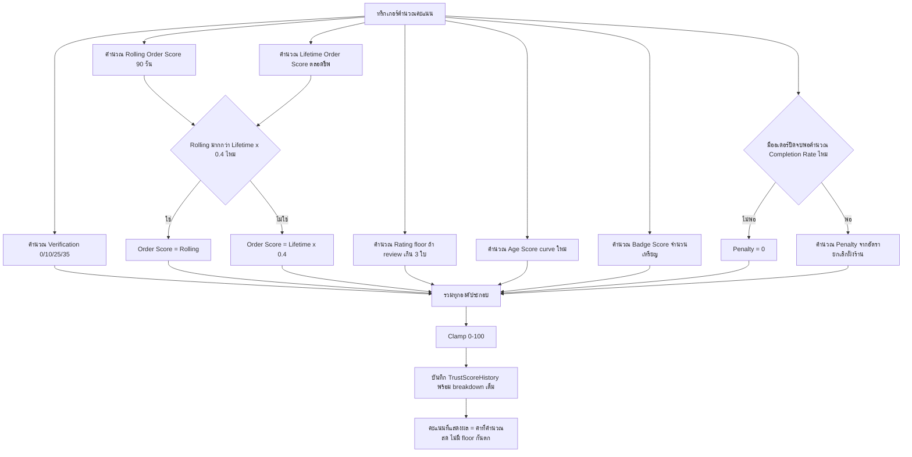

> **โมดูล:** M00040-TrustScoreV2
> **ประเภทเอกสาร:** Product Requirements Document (PRD)
> **เวอร์ชัน:** 1.0
> **วันที่จัดทำ:** 2026-08-10
> **สถานะ:** Draft — decision D-1..D-9 ล็อกแล้ว (อิงข้อมูล prod จริง 2026-08-10, ดู §10.2) · **ตัวเลขทั้ง 6 ข้อ (Q-1..Q-6) user เคาะแล้ว 2026-08-10 — ดู [[BRD]] §11** · เหลือ SRS/SDS/API/DATABASE/TestCase ก่อน implement
> **เจ้าของเอกสาร:** BA + PO + PM (ดู [[Feature-Docs-Ownership]])

# PRD: Trust Score v2 — คะแนนที่ต้องรักษา

---

## Executive Summary

Trust Score ปัจจุบันของ Deep คำนวณจาก 5 องค์ประกอบ (Verification 35 / Orders 25 / Rating 20 / Age 10 / Badges 10) แต่จากการตรวจข้อมูลจริงบน prod (2026-08-10) พบว่า **45 จาก 100 คะแนนแทบไม่มีร้านไหนแตะได้เลย ไม่ว่าร้านจะทำดีแค่ไหน**: ทุกร้านติดอยู่ที่ยืนยันตัวตนระดับ 1 (10 คะแนนจาก 35 — เพราะไม่มีใครไปต่อ L2/L3), รีวิวเป็น 0 คะแนนทุกร้าน (เกณฑ์ต้อง ≥3 รีวิว ทั้งระบบมีรีวิวจริงแค่ 1 ใบ), และอายุร้านเป็น 0 คะแนนทุกร้าน (สูตรปัดเป็น 0 จนกว่าจะผ่านไป 18 วัน — ฐาน prod เพิ่งถูกล้างเมื่อ 2026-07-31 ทุกร้านจึง "อายุ 10 วัน" เท่ากันหมด) **ช่องเดียวที่แยกร้านที่ทำดีออกจากร้านที่ไม่เคยขายอะไรเลยได้จริงคือช่องออเดอร์ (25 คะแนน)** — ผลคือร้านที่ขายสำเร็จหลักสิบใบยังคงตกอยู่ใน tier ต่ำสุดเดียวกับร้านที่เพิ่งสมัคร

**ปัญหาหลักของฟีเจอร์นี้คือ "คะแนนแทบไม่ขยับไม่ว่าร้านจะทำอะไร" ไม่ใช่แค่ "คะแนนไม่มีวันลด"** — ทั้งสองอาการมีรากเดียวกันคือสูตรที่ให้แต้มเป็นขั้นบันไดหยาบ (cliff) บวกกับกลไก "มีแต่ขึ้น" (`Math.max(เดิม, คำนวณใหม่)`) ที่ทำให้ระบบไม่เคยต้องเผชิญคำถามว่า "ถ้าร้านทำแย่ลงจริง คะแนนควรลดไหม" เพราะแทบไม่มีร้านไหนขยับพ้นพื้นฐานได้ตั้งแต่แรก

Trust Score v2 แก้ 2 เรื่องพร้อมกันในรอบเดียว: **(1) ซ่อมช่องคะแนนที่ตายให้ให้สัญญาณได้จริงตั้งแต่วันแรก** (อายุร้านเริ่มขยับทันที + หน้าจอชี้ทางไปต่อของยืนยันตัวตน/เหรียญตรา) **และ (2) เปิดให้คะแนนลดได้จริงเมื่อมีพฤติกรรมเชิงลบที่มีหลักฐาน** (เริ่มจาก "ยกเลิกออเดอร์เอง" เท่านั้นใน phase นี้ — ใช้ตรรกะเดียวกับ Completion Rate ที่ feature 00039 วางไว้แล้ว ไม่ต้องเก็บข้อมูลใหม่) ควบคู่กับการเปลี่ยนช่องออเดอร์จากนับสะสมตลอดชีพเป็น `max(กิจกรรม 90 วันล่าสุด, ตลอดชีพ × 0.4)` เพื่อให้คะแนนสะท้อนว่าร้านยังทำงานอยู่จริงไหม โดยไม่ทิ้งฐานที่สะสมมาทั้งหมดในคราวเดียว

**จังหวะเวลาสำคัญมาก:** เพราะออเดอร์ทุกใบบน prod ตอนนี้อยู่ในหน้าต่าง 90 วันอยู่แล้ว (ฐานเพิ่งล้าง 10 วันก่อน) **ไม่มีร้านไหนตกชั้นทันทีที่เปิดใช้ฟีเจอร์นี้สักร้านเดียว** — เป็นช่วงเวลาเดียวที่เปลี่ยนกติกาได้โดยไม่มีใครเจ็บตัวจากการเปลี่ยนแปลงย้อนหลัง ยิ่งรอยิ่งมีร้านสะสมประวัติมากขึ้นและความเสี่ยงที่จะมีร้าน "ตกชั้นกะทันหัน" ตอน deploy ก็ยิ่งสูงขึ้นตาม

---

## 1. Business Goals & KPIs

### 1.1 เป้าหมายทางธุรกิจ

| เป้าหมาย | รายละเอียด |
|----------|-----------|
| **คะแนนสะท้อนพฤติกรรมจริงของร้าน ไม่ใช่แค่ตัวนับที่ไม่มีวันลด** | ร้านที่ทำดีสม่ำเสมอต้องเห็นคะแนนขยับขึ้นได้จริงตั้งแต่สัปดาห์แรก ไม่ใช่ล็อกอยู่ที่ 45 คะแนนที่แตะไม่ได้ไม่ว่าจะทำอะไร |
| **ผู้ซื้อได้คะแนนที่น่าเชื่อถือมากขึ้น** | Trust Score ต้องแยกร้านที่ยังทำงานอยู่จริงออกจากร้านที่หยุดทำไปนานแล้ว แทนที่จะให้ทั้งสองกลุ่มมีคะแนนเท่ากันตราบใดที่เคยขายมาก่อน |
| **บทลงโทษต้องมีหลักฐาน ไม่ใช่การเดา** | คะแนนลดได้เฉพาะจากพฤติกรรมที่พิสูจน์ได้ (ร้านกดยกเลิกเอง) — ไม่ใช้เหตุผลที่ร้านเลือกเอง (`cancelReason`) ตัดสินคะแนน สอดคล้องหลักการเดียวกับ Completion Rate (feature 00039, BR-OSM-05) |
| **เปิดใช้กติกาใหม่ในช่วงเวลาที่ปลอดภัยที่สุด** | ใช้ข้อมูล prod จริงยืนยันว่าไม่มีร้านตกชั้นตอน deploy — ต้องเปิดใช้ตอนนี้ก่อนที่ประวัติสะสมของร้านจะทำให้การเปลี่ยนกติกามีความเสี่ยงสูงขึ้น |
| **ความโปร่งใสเป็นเงื่อนไขบังคับคู่กับบทลงโทษ** | ทุกครั้งที่คะแนนเปลี่ยน (ทั้งขึ้นและลด) ต้องมีหน้าจอที่อธิบายได้ว่าทำไม — เปิดบทลงโทษโดยไม่มีความโปร่งใสคู่กันไม่ได้ |

### 1.2 ตัวชี้วัดความสำเร็จ (KPIs)

| KPI | คำอธิบาย | เป้าหมาย |
|-----|----------|---------|
| **สัดส่วนร้านที่คะแนนขยับได้จริงใน 30 วันหลัง launch** | เทียบร้านที่มี `TrustScoreHistory` แถวใหม่ที่ต่างจากแถวก่อนหน้า (ไม่ใช่แค่คำนวณซ้ำแล้วได้เลขเดิม) | มากกว่า 0% อย่างมีนัยสำคัญ — เทียบกับสภาพก่อนหน้าที่ 45/100 คะแนนแทบไม่มีใครแตะได้เลย |
| **จำนวนร้านที่ tier ลดลงในวันที่เปิดใช้ฟีเจอร์** | นับร้านที่ tier (ตาม `Tier Lists.md`) ต่ำกว่าก่อนเปิดใช้ทันทีที่ deploy | 0 ร้าน — พิสูจน์ด้วยการจำลองสูตรใหม่กับข้อมูล prod จริงก่อน deploy |
| **สัดส่วนเคสคะแนนเปลี่ยนที่มีคำอธิบายตรวจสอบได้** | ทุกครั้งที่ `TrustScoreHistory` มีแถวใหม่ที่ค่าต่างจากแถวก่อนหน้า ต้องสามารถเปิดหน้า "ทำไมคะแนนเปลี่ยน" แล้วเห็นสาเหตุต่อองค์ประกอบ | 100% |
| **ความถูกต้องของบทลงโทษยกเลิกเอง** | penalty ที่คำนวณต้องสอดคล้องกับ Completion Rate (00039) ของร้านเดียวกันเสมอ — ตัวเลขทั้งสองมาจากสูตรเดียวกัน | 0 เคสที่ penalty กับ Completion Rate ขัดกัน (ตรวจด้วย integration test) |

### 1.3 ขอบเขตการส่งมอบ

งานนี้แบ่งเป็น **Phase A (ขอบเขตของ PRD/BRD ฉบับนี้)** และ **Phase 2 (นอกขอบเขต — ดู §5)**:

- **Phase A** ส่งมอบ: (1) ตัดกลไก "มีแต่ขึ้น" ออก (2) ซ่อมสูตรอายุร้านให้ขยับได้ตั้งแต่วันแรก + ทำให้ช่องยืนยันตัวตน/เหรียญตรา "มองเห็นทางไปต่อได้" ผ่านหน้าจอ (3) เปลี่ยนช่องออเดอร์เป็น `max(rolling 90 วัน, lifetime × 0.4)` (4) บทลงโทษ "ยกเลิกออเดอร์เอง" เท่านั้น (5) หน้า "ทำไมคะแนนเปลี่ยน" (บังคับ)
- **Phase 2** (นอกขอบเขตรอบนี้ — ไม่ใช่ถูกยกเลิก แค่เลื่อน): บทลงโทษ "รีวิวแย่" (ข้อมูลยังไม่พอ — ทั้งระบบมีรีวิวจริง 1 ใบ) และบทลงโทษ "แอดมินตัดสินว่าผิด" ผ่านระบบร้องเรียน (ยังไม่รู้ปริมาณเคสต่อเดือน — สร้างก่อนรู้ปริมาณเสี่ยงได้ทั้งของที่ไม่มีใครใช้และของที่ท่วมจนตัดสินไม่ทัน)

---

## 2. User Personas (กลุ่มผู้ใช้งาน)

### 2.1 ร้านค้าทั่วไปที่ทำธุรกิจสม่ำเสมอแต่คะแนนไม่ขยับ

**ข้อมูลพื้นฐาน:**
- ร้านที่ยืนยันตัวตนแค่ระดับ 1 (OTP อัตโนมัติตอนสมัคร) มีออเดอร์สำเร็จเรื่อย ๆ แต่ยังไม่มีรีวิวสะสมพอ (< 3 ใบ) และเพิ่งเปิดร้านมาไม่นาน

**เป้าหมาย:**
- เห็นคะแนนสะท้อนว่าตัวเองกำลังสร้างความน่าเชื่อถือขึ้นจริง ไม่ใช่ติดอยู่ที่คะแนนเดิมไม่ว่าจะขายได้กี่ใบ

**ความต้องการ:**
- มีช่องคะแนนอย่างน้อยหนึ่งช่องที่ขยับตามเวลา/ความพยายามจริงของตัวเอง แม้ยังไม่ได้ทำ verification เพิ่มหรือมีรีวิวสะสม

**จุดปวด (Pain Points):**
- ปัจจุบันยืนยันตัวตน+รีวิว+อายุร้านรวมกัน 65 จาก 100 คะแนนเป็น 0 คะแนนเหมือนกันหมดทุกร้าน — เห็นแค่ "ยืนยันตัวตน 10" ทุกวันไม่ว่าจะขายกี่ใบ ทำให้คะแนนดูเหมือนค้าง ไม่มีเหตุผลให้กลับมาดูซ้ำ

### 2.2 ร้านค้าขนาดใหญ่ที่มีการยกเลิกออเดอร์เป็นครั้งคราว

**ข้อมูลพื้นฐาน:**
- ร้านที่มีปริมาณออเดอร์สูงกว่าร้านอื่นมาก (ตัวอย่างจริงบน prod: ยืนยันสำเร็จ 71 ใบ ยกเลิกฝั่งร้านเอง 5 ใบ = ~3.3% ของออเดอร์ทั้งหมด) ทำธุรกิจต่อเนื่องและมีสัดส่วนความผิดพลาดต่ำ

**เป้าหมาย:**
- ได้คะแนนที่สูงกว่าร้านที่เพิ่งเริ่มต้นชัดเจน สอดคล้องกับปริมาณงานที่ทำจริง และไม่ถูกลงโทษหนักเกินจริงจากการยกเลิกจำนวนน้อยที่เกิดขึ้นเป็นปกติของธุรกิจ

**ความต้องการ:**
- บทลงโทษต้องเป็นสัดส่วนกับอัตราการยกเลิก ไม่ใช่หักคะแนนคงที่ต่อใบแบบไม่สนบริบท และต้องไม่นับการยกเลิกที่ไม่ใช่ความผิดร้าน (ผู้ซื้อยกเลิกเอง/พัสดุตีกลับ) เป็นความผิดของร้าน

**จุดปวด (Pain Points):**
- กลัวว่าการเปิดบทลงโทษจะทำให้ร้านที่ทำงานหนักที่สุดในระบบเสียคะแนนอย่างไม่เป็นธรรมจากเหตุการณ์ปกติทางธุรกิจไม่กี่ครั้ง

### 2.3 ผู้ซื้อที่ใช้ Trust Score ประกอบการตัดสินใจ

**ข้อมูลพื้นฐาน:**
- ผู้ซื้อที่เปิด `/u/{username}` หรือลิงก์ order ก่อนตัดสินใจซื้อ ดู tier/คะแนนของร้านเป็นหนึ่งในสัญญาณความน่าเชื่อถือ

**เป้าหมาย:**
- เชื่อได้ว่าคะแนนสูงแปลว่าร้านนั้น "ยังคงน่าเชื่อถือ ณ ตอนนี้" ไม่ใช่แค่ "เคยน่าเชื่อถือในอดีต"

**ความต้องการ:**
- คะแนนของร้านที่หยุดทำธุรกิจไปนานต้องแยกออกจากร้านที่ยังทำงานต่อเนื่องอยู่ได้

**จุดปวด (Pain Points):**
- ระบบเดิมที่ "มีแต่ขึ้น" ทำให้ร้านที่เคยขายดีแล้วหายไปนานยังคงมีคะแนนสูงเท่าเดิมตลอดกาล ผู้ซื้อไม่มีทางรู้ว่าร้านนั้นยังทำงานอยู่จริงไหม

### 2.4 ทีมงาน Deep (Controller/Support) ที่ต้องอธิบายคะแนนให้ผู้ขาย

**ข้อมูลพื้นฐาน:**
- ทีมที่ต้องตอบคำถามผู้ขายเมื่อคะแนนเปลี่ยน โดยยังไม่มีระบบร้องเรียนเต็มรูปหรือทีมงานสำหรับตัดสินข้อพิพาทจำนวนมาก

**เป้าหมาย:**
- มีหน้าจอที่ผู้ขายเปิดดูได้เองว่าคะแนนเปลี่ยนเพราะอะไร โดยไม่ต้องพึ่งทีม support ตอบทุกเคส

**ความต้องการ:**
- บทลงโทษที่เปิดใช้ต้องมีจำนวนน้อยและมีหลักฐานชัดพอที่จะอธิบายเองได้ผ่านหน้าจอ ไม่ต้องมีคนตัดสินรายเคส — เพราะยังไม่รู้ปริมาณข้อร้องเรียนที่จะเกิดขึ้นจริงต่อเดือน

**จุดปวด (Pain Points):**
- ถ้าเปิดบทลงโทษที่ต้องอาศัยดุลพินิจคน (เช่น "แอดมินตัดสินว่าผิด") ก่อนรู้ปริมาณเคส จะได้ระบบที่ไม่มีคนใช้เพราะไม่มีคนคอยตัดสิน หรือได้คิวที่ท่วมจนตัดสินไม่ทันแล้วคะแนนที่แขวนรออยู่ผิดเพี้ยนไปพร้อมกัน

---

## 3. Business Requirements

### 3.1 คะแนนไม่มีพื้นกันตกอีกต่อไป

**ความต้องการ:**
- ระบบต้องคำนวณ Trust Score สดทุกครั้งจากพฤติกรรมปัจจุบันของร้าน โดยไม่มีกลไกใดบังคับให้ค่าที่แสดงต้อง "ไม่ต่ำกว่าค่าเดิมที่เคยคำนวณได้"

**Business Rules:**
- คะแนนที่บันทึกและแสดงผลต้องเป็นค่าที่คำนวณจากสถานะปัจจุบันเสมอ ไม่ใช่ค่าสูงสุดที่เคยคำนวณได้ในอดีต
- คะแนนรวมหลังคำนวณ (รวมบทลงโทษ) ต้อง clamp อยู่ในช่วง 0–100 เสมอ ไม่แสดงค่าติดลบหรือเกิน 100

**เหตุผล:**
- กลไก "มีแต่ขึ้น" เดิมเป็นสาเหตุหลักที่ทำให้ Trust Score ไม่มีความหมายในฐานะสัญญาณ ณ ปัจจุบัน — ร้านที่หยุดทำธุรกิจไปนานหรือเริ่มมีพฤติกรรมแย่ลงยังคงมีคะแนนเท่าจุดสูงสุดที่เคยทำได้ตลอดไป ขัดกับเป้าหมายที่ผู้ซื้อต้องใช้คะแนนนี้ตัดสินใจว่าร้าน "ยังน่าเชื่อถือตอนนี้" หรือไม่

### 3.2 ซ่อมช่องคะแนนที่ไม่ขยับให้ให้สัญญาณได้จริง

**ความต้องการ:**
- ก่อนเปิดให้คะแนนลดได้ ระบบต้องทำให้ช่องคะแนนที่ปัจจุบันแทบไม่มีร้านไหนแตะได้เลย (ยืนยันตัวตน/อายุร้าน/เหรียญตรา) ให้สัญญาณที่มีความหมายกับผู้ใช้จริงก่อน — มิเช่นนั้นระบบจะกลายเป็น "ลงโทษเป็นแต่ให้รางวัลไม่เป็น"

**Business Rules:**
- **อายุร้าน** ต้องเริ่มให้คะแนนตั้งแต่วันแรกที่เปิดร้าน แบบค่อยเป็นค่อยไป ไม่ปัดเป็น 0 ค้างไว้หลายสัปดาห์เหมือนสูตรปัจจุบัน (ปัจจุบันต้องรอถึงวันที่ 18 ถึงจะได้แต้มแรก)
- **ยืนยันตัวตน:** ไม่เปลี่ยนเกณฑ์ระดับ (L1/L2/L3 คงเดิม) แต่หน้าจอที่แสดงคะแนนของร้าน (ดู §3.5) ต้องชี้ให้เห็นชัดเจนว่าการยืนยันระดับถัดไปจะได้คะแนนเพิ่มอีกเท่าไหร่ — เพื่อเปลี่ยนจาก "เพดานที่มองไม่เห็น" เป็น "เป้าหมายที่รู้ว่าต้องทำอะไรต่อ"
- **เหรียญตรา:** ไม่เปลี่ยนเกณฑ์เหรียญ 31 ชนิดเดิม แต่หน้าจอเดียวกันต้องเชื่อมไปยังหน้า Badge Process (ที่มีอยู่แล้ว — แสดง progress ของเหรียญที่ยังไม่ได้) เพื่อให้ร้านเห็นเส้นทางไปต่อของคะแนนช่องนี้เช่นกัน

**เหตุผล:**
- ข้อมูล prod จริงยืนยันว่าไม่ใช่แค่ "ยาก" แต่คือ "แทบเป็นไปไม่ได้ที่จะเห็นคะแนนขยับ" ในช่องเหล่านี้ — ถ้าเปิดบทลงโทษ (§3.4) ก่อนแก้จุดนี้ ร้านจะเห็นคะแนนลดได้ง่ายกว่าเพิ่มอย่างไม่เป็นธรรม เพราะช่องบวกส่วนใหญ่ยังคงเข้าถึงไม่ได้อยู่ดี

### 3.3 ช่องคะแนนออเดอร์ต้องสะท้อนกิจกรรมล่าสุด ไม่ใช่แค่นับสะสมตลอดชีพ

**ความต้องการ:**
- คะแนนจากออเดอร์ต้องแยกร้านที่ยังทำธุรกิจต่อเนื่องออกจากร้านที่หยุดไปนานแล้ว โดยไม่ทิ้งฐานที่ร้านสะสมมาทั้งหมดในทันที

**Business Rules:**
- คะแนนช่องออเดอร์ = ค่าที่สูงกว่าระหว่าง (1) คะแนนจากออเดอร์สำเร็จใน 90 วันล่าสุด และ (2) 40% ของคะแนนจากออเดอร์สำเร็จสะสมตลอดชีพ
- สูตรการแปลง "จำนวนออเดอร์" เป็น "คะแนน" ของทั้งสองฝั่งใช้สูตรเดียวกับที่ระบบใช้อยู่แล้วในปัจจุบัน (ไม่เปลี่ยนรูปทรงของ curve เพียงแค่เปลี่ยนช่วงเวลาที่นับ)

**เหตุผล:**
- ร้านที่หยุดทำธุรกิจไปนานไม่ควรมีคะแนนช่องนี้เท่าร้านที่ยังทำงานต่อเนื่อง — แต่การตัดเหลือแค่ "90 วันล่าสุด" อย่างเดียวจะลงโทษร้านที่ขายตามฤดูกาลรุนแรงเกินไป (เช่น ร้านที่ขายดีต่อเนื่องมา 8 เดือนแล้วหยุดพัก 3 เดือน) พื้น 40% ของคะแนนตลอดชีพจึงกันไม่ให้ร้านที่มีฐานสะสมสูงตกลงมาที่ 0 ทันทีเมื่อหยุดทำงานชั่วคราว

### 3.4 บทลงโทษคะแนนจากการยกเลิกออเดอร์เอง (เท่านั้น ใน Phase นี้)

**ความต้องการ:**
- คะแนนต้องลดได้เมื่อร้านมีอัตราการยกเลิกออเดอร์ด้วยตัวเองสูงผิดปกติ โดยใช้หลักฐานเดียวกับที่ระบบมีอยู่แล้ว ไม่ต้องเก็บข้อมูลใหม่

**Business Rules:**
- บทลงโทษคำนวณจากอัตราการยกเลิกฝั่งร้าน โดยยึดหลักฐานและตัวหารเดียวกับ Completion Rate ที่มีอยู่แล้ว (feature 00039) — การยกเลิกที่ผู้ซื้อเป็นคนกดเอง หรือขนส่งรายงานว่าพัสดุตีกลับ **ไม่นับเป็นความผิดร้าน** เช่นเดียวกับที่ Completion Rate ไม่นับ
- ร้านที่มีออเดอร์ปิดจบไม่ถึงเกณฑ์ขั้นต่ำ (ยังไม่มีข้อมูลพอสรุป) ไม่ถูกคำนวณบทลงโทษ (penalty = 0) แทนที่จะแสดงค่าจากฐานตัวอย่างที่เล็กเกินไป
- เหตุผลที่ร้านเลือกกรอกเอง (`cancelReason`) ไม่มีอำนาจเปลี่ยนแปลงบทลงโทษ — เพราะเปิดช่องให้ร้านให้เหตุผลของตัวเองมีผลต่อคะแนนโดยตรงเท่ากับให้ร้านให้คะแนนตัวเอง

**เหตุผล:**
- การใช้ตรรกะเดียวกับ Completion Rate ที่มีอยู่แล้วทำให้บทลงโทษนี้ **ไม่ต้องเก็บข้อมูลใหม่เลย** (`Order.cancelInitiator` มีมาตั้งแต่ feature 00039) และทำให้ตัวเลขที่ผู้ขายเห็นในหน้า Completion Rate กับหน้า Trust Score สอดคล้องกันเสมอ ไม่มีทางขัดกัน — บทลงโทษอื่น (รีวิวแย่/แอดมินตัดสิน) ยังไม่พร้อมด้วยเหตุผลคนละอย่าง (ดู §5) จึงเลื่อนไป Phase 2 ทั้งคู่

### 3.5 หน้าที่อธิบายว่าทำไมคะแนนเปลี่ยน (บังคับ — ไม่ตัดออก)

**ความต้องการ:**
- ทุกครั้งที่ Trust Score ของร้านเปลี่ยนแปลง (ขึ้นหรือลง) ผู้ขายต้องเปิดหน้าจอที่แสดงสาเหตุแยกตามองค์ประกอบได้เอง โดยไม่ต้องติดต่อทีม support

**Business Rules:**
- หน้าจอต้องแสดงคะแนนแยกตามองค์ประกอบทั้งหมด (รวมองค์ประกอบที่เป็นลบ/บทลงโทษ) พร้อมเปรียบเทียบกับค่าครั้งก่อนหน้า
- องค์ประกอบที่ยังไม่ถึงเพดาน ต้องแสดงให้เห็นว่าต้องทำอะไรเพิ่มถึงจะได้คะแนนมากขึ้น (เชื่อมกับ §3.2)
- เมื่อเหรียญตราที่ได้แล้วยังคงอยู่ครบ แต่คะแนนรวมลดลงจากองค์ประกอบอื่น หน้าจอต้องแยกให้เห็นชัดว่า "เหรียญของคุณยังอยู่ครบ" ไม่ใช่ถูกริบคืน — ป้องกันความเข้าใจผิดว่าเหรียญถูกเพิกถอน

**เหตุผล:**
- นี่คือเงื่อนไขที่ทำให้เปิดบทลงโทษได้อย่างมีความรับผิดชอบ — Controller ล็อกไว้ชัดเจนว่าเป็นของบังคับ ห้ามตัด เพราะทีมงานยังไม่มีระบบร้องเรียนเต็มรูปหรือกำลังคนพอรับมือคำถามจำนวนมาก (§2.4) หน้าจอนี้คือกลไกลดภาระนั้นโดยให้ผู้ขายตรวจสอบได้เอง

### 3.6 ไม่ต้องมีกลไก soft-landing หรือแจ้งเตือนล่วงหน้า

**ความต้องการ:**
- ระบบไม่ต้องสร้างกลไกลดผลกระทบ (เช่น ช่วงเปลี่ยนผ่าน, แจ้งเตือนล่วงหน้า 7 วันก่อนคะแนนจะเปลี่ยน) สำหรับการเปิดใช้ฟีเจอร์นี้

**Business Rules:**
- ไม่ต้องสร้าง flag หรือ configuration ใด ๆ สำหรับ "ช่วงเปลี่ยนผ่าน" ของ Trust Score v2
- การตัดสินใจนี้ผูกกับเงื่อนไขเวลาที่ตรวจสอบแล้วจากข้อมูล prod จริง (ทุกออเดอร์อยู่ในหน้าต่าง 90 วัน) — ไม่ใช่หลักการทั่วไปที่ใช้ได้ตลอดไป

**เหตุผล:**
- ข้อมูล prod ยืนยันแล้วว่าไม่มีร้านไหนตกชั้นทันทีที่เปิดใช้ฟีเจอร์นี้ (ดู Executive Summary) การสร้างกลไก soft-landing จึงเป็นการลงทุนแก้ปัญหาที่ไม่มีอยู่จริง ณ ตอนนี้ — **แต่เงื่อนไขนี้เปลี่ยนแปลงได้ตามเวลา** ยิ่งรอเปิดใช้ฟีเจอร์นี้นานเท่าไหร่ ร้านยิ่งสะสมประวัติมากขึ้นและความเสี่ยงที่จะมีร้านตกชั้นกะทันหันตอน deploy ก็ยิ่งสูงขึ้นตาม (เหตุผลนี้ต้องถูกบันทึกไว้ชัดเจนเพราะจะไม่จริงอีกต่อไปในอีก 2-3 เดือนข้างหน้า)

---

## 4. Business Rules & Constraints

### 4.1 กฎทางธุรกิจหลัก

| กฎ | คำอธิบาย |
|----|----------|
| **ไม่มีพื้นกันคะแนนตกอีกต่อไป** | คะแนนคำนวณสดทุกครั้ง ไม่มี `max(เดิม, ใหม่)` |
| **คะแนน clamp 0–100 เสมอ** | ไม่ว่าบทลงโทษจะดึงค่าดิบต่ำแค่ไหน ค่าที่แสดงต้องไม่ต่ำกว่า 0 |
| **เหรียญที่ได้แล้วติดตัวถาวรเสมอ** | จำนวนเหรียญไม่มีวันลด (FR-4.4 คงเดิม) — สิ่งที่ลดได้คือคะแนนรวมจากองค์ประกอบอื่น ไม่ใช่เหรียญถูกริบ |
| **บทลงโทษต้องมีหลักฐาน ไม่ใช้เหตุผลที่ร้านให้เอง** | ใช้ `cancelInitiator`/สถานะพัสดุเป็นหลักฐาน ไม่ใช้ `cancelReason` |
| **ทุกครั้งที่คะแนนเปลี่ยน ต้องอธิบายได้** | หน้า "ทำไมคะแนนเปลี่ยน" เป็นเงื่อนไขคู่กับการเปิดบทลงโทษ ไม่ใช่ฟีเจอร์เสริม |
| **สเกล 0-100 และ mapping tier (`Tier Lists.md`) คงเดิมทุกอย่าง** | ไม่เปลี่ยน threshold ของ Letter Grade/Tier — เปลี่ยนเฉพาะวิธีคำนวณคะแนนดิบก่อนแปลงเป็น tier |

### 4.2 ข้อจำกัดทางธุรกิจ

| ข้อจำกัด | รายละเอียด |
|---------|-----------|
| **ไม่แตะเกณฑ์ยืนยันตัวตน/เหรียญตรา 31 ชนิดเดิม** | Phase A แก้เฉพาะการมองเห็น/สื่อสาร ไม่แก้ threshold ทางธุรกิจของทั้งสองระบบ |
| **ไม่มีระบบร้องเรียน/อุทธรณ์ในรอบนี้** | บทลงโทษ "แอดมินตัดสินว่าผิด" เลื่อนไป Phase 2 — ยังไม่มีทั้งกำลังคนและปริมาณเคสที่รู้แน่ชัด |
| **ไม่มีบทลงโทษจากรีวิวแย่ในรอบนี้** | ข้อมูลจริงไม่พอ (รีวิวทั้งระบบ 1 ใบ ทั้งที่เกณฑ์ต้อง ≥3-5 ใบถึงจะเริ่มมีความหมายทางสถิติ) |
| **ไม่มีกลไก soft-landing/grace period** | ตามมติ §3.6 — ผูกกับเงื่อนไขเวลาปัจจุบันเท่านั้น |

### 4.3 เหตุผลที่บทลงโทษจะไม่ถูกคำนวณ (เป็น 0 ไม่ใช่ error)

| เหตุผล | ผลที่เกิด |
|--------|-----------|
| ร้านมีออเดอร์ปิดจบไม่ถึงเกณฑ์ขั้นต่ำที่ Completion Rate ใช้ (00039) | penalty = 0 (ไม่แสดงค่าจากฐานตัวอย่างที่เล็กเกินไป) |
| การยกเลิกทั้งหมดของร้านถูกตัดออกจากตัวหารแล้ว (ผู้ซื้อยกเลิกเอง/พัสดุตีกลับ) | penalty = 0 (ไม่มีการยกเลิกที่นับเป็นความผิดร้านเลย) |
| ร้านยังไม่มีออเดอร์ที่ปิดจบเลยสักใบ | penalty = 0 (ไม่มีข้อมูลให้ตัดสิน ไม่ใช่สมมติว่าแย่) |

---

## 5. Out of Scope (นอกขอบเขต)

สิ่งที่ระบบนี้ **ไม่รองรับ** หรือ **ไม่รับผิดชอบ** ใน Phase A:

| หัวข้อ | คำอธิบาย |
|--------|----------|
| **บทลงโทษจากรีวิวแย่** | เลื่อนไป Phase 2 (D-7) — รีวิวทั้งระบบมี 1 ใบ เขียนสูตรตอนนี้ก็ไม่มีวันทำงานจริง ไม่ใช่ถูกยกเลิกถาวร |
| **ระบบร้องเรียน + แอดมินตัดสินว่าผิด** | เลื่อนไป Phase 2 (D-8) — สอดคล้องกับ roadmap เดิมที่ `docs/PRD.md` §4 ระบุไว้แล้ว ("Dispute / Complaint system") ยังไม่รู้ปริมาณเคสต่อเดือน |
| **การเปลี่ยนสเกล/mapping tier** | คง 0-100 และ `Tier Lists.md` เดิมทุกอย่าง (D-1) |
| **การแก้เกณฑ์ยืนยันตัวตน L1/L2/L3 หรือเกณฑ์เหรียญตรา 31 ชนิด** | เฉพาะการมองเห็น/สื่อสารทางไปต่อ ไม่แก้ threshold ธุรกิจ |
| **กลไก soft-landing/แจ้งเตือนล่วงหน้า** | ตัดสินใจแล้วว่าไม่จำเป็นในจังหวะนี้ (D-5) |
| **การให้คะแนนแยกเป็นหลายบทลงโทษพร้อมกัน** | Phase A มีบทลงโทษเดียว (ยกเลิกเอง) — โครงสร้างที่ออกแบบ (breakdown แยกช่อง) รองรับเพิ่มบทลงโทษอื่นใน Phase 2 ได้โดยไม่ต้องรื้อ แต่ไม่ได้ส่งมอบเพิ่มในรอบนี้ |

---

## 6. Risks & Mitigation (ความเสี่ยงและแนวทางแก้ไข)

### 6.1 ความเสี่ยงทางธุรกิจ

| ความเสี่ยง | ผลกระทบ | ระดับความรุนแรง | แนวทางแก้ไข |
|-----------|---------|-----------------|-------------|
| **ร้านที่คะแนนลดจริงเป็นครั้งแรกในประวัติศาสตร์แพลตฟอร์มไม่พอใจ/ร้องเรียน** | ทีม support ต้องรับมือคำถามที่ไม่เคยเจอมาก่อน | กลาง | หน้า "ทำไมคะแนนเปลี่ยน" (§3.5) เป็นเงื่อนไขบังคับคู่กับการเปิดบทลงโทษ ลดภาระ support โดยให้ร้านตรวจสอบได้เอง |
| **บทลงโทษยกเลิกเองลงโทษร้านใหญ่ (ปริมาณออเดอร์สูง) หนักเกินจริงจากเหตุการณ์ปกติทางธุรกิจ** | ร้านที่ทำงานหนักที่สุดในระบบเสียความไว้วางใจในฟีเจอร์นี้ | สูง | ใช้สูตรอัตราส่วน (ไม่ใช่หักคงที่ต่อใบ) ผูกกับ Completion Rate เดียวกับที่แสดงในหน้าอื่นอยู่แล้ว — ต้องจำลองผลกับข้อมูล prod จริงก่อน deploy (persona 2.2 ในเอกสารนี้คำนวณจากข้อมูลจริงแล้วได้ผลกระทบน้อยมาก) |
| **ร้านตกชั้น (tier) ทันทีที่เปิดใช้ฟีเจอร์** | สูญเสียความไว้วางใจในระบบตั้งแต่วันแรก | สูง | ยืนยันแล้วจากข้อมูล prod ว่าไม่เกิดขึ้น (ทุกออเดอร์อยู่ในหน้าต่าง 90 วัน) — **ต้องรัน simulation ยืนยันซ้ำด้วยข้อมูลจริง ณ วันที่จะ deploy จริง** เพราะข้อมูลจะเปลี่ยนไปทุกวันที่รอ |

### 6.2 ความเสี่ยงทางเทคนิค

| ความเสี่ยง | ผลกระทบ | แนวทางแก้ไข |
|-----------|---------|-------------|
| **คะแนนที่ควรลดจากช่องออเดอร์ (หน้าต่าง 90 วันหมดอายุ) ไม่ลดจริงถ้าไม่มีกลไกคำนวณใหม่ตามเวลา** | ปัจจุบันระบบ recalculate เฉพาะเมื่อมี event (order CONFIRMED/review ใหม่/ฯลฯ) — ร้านที่หยุดทำธุรกิจเฉย ๆ จะไม่มี event ใดมากระตุ้นให้คะแนนลดตามเวลาที่ผ่านไป | ต้องออกแบบกลไกคำนวณตามเวลา (cron หรือ compute-on-read) ในชั้น SRS/SDS — ไม่ใช่แค่ผูกกับ event เหมือนเดิม |
| **สูตรที่ปรับจูนบนฐานข้อมูล prod ที่ยังเล็กมาก (ร้านที่มีออเดอร์จริง 4 ร้าน) เสี่ยงไม่ครอบคลุมพฤติกรรมที่จะเกิดขึ้นเมื่อแพลตฟอร์มโตขึ้น** | ค่าคงที่ (divisor/cap ของบทลงโทษ, curve ของอายุร้าน) อาจต้องปรับอีกครั้งเมื่อมีข้อมูลมากขึ้น | ประกาศชัดเจนว่าค่าคงที่เหล่านี้เป็นค่าประมาณเริ่มต้น ไม่ใช่ค่าสุดท้าย — SSOT อยู่ที่ไฟล์เดียว แก้ได้โดยไม่กระทบโครงสร้าง |
| **แก้ formula แล้วไม่ sync กับหน้าจอที่เคยพลาดมาก่อน (HR16)** | ประโยคบนหน้าจอ (เช่น "เพิ่มขึ้น N คะแนน") อาจไม่ตรงกับสูตรจริงเหมือนที่เคยเกิดกับ `BadgeDetailModal` (impeccable critique 2026-08-09) | ทุกค่าคงที่ที่หน้าจอต้องพูดถึง (divisor, cap, curve) ต้อง import จากไฟล์สูตรเดียวกับที่คำนวณจริง ห้ามพิมพ์ตัวเลขซ้ำในข้อความ UI |
| 🛑 **เลือกคอลัมน์ผิดเป็นตัวตั้งของหน้าต่าง 90 วัน** | `Order.updatedAt` ขยับทุกครั้งที่มีการแก้ไขออเดอร์ (เพิ่มเลขพัสดุ, แก้ที่อยู่, sync สถานะจากขนส่ง) จึงไม่ใช่ "เวลาที่ออเดอร์สำเร็จ" — ใช้แล้วร้านที่ไม่ได้ขายอะไรใหม่เลยแต่มีการอัปเดตออเดอร์เก่าจะดูเหมือนยังทำงานอยู่ · `Order.createdAt` ก็ใช้ไม่ได้เพราะผู้ขายพิมพ์เองได้ (feature 00033) | ต้องยึด **event log** ที่บันทึกเวลาจริง (`OrderEvent.occurredAt` ของเหตุการณ์ยืนยันออเดอร์) ไม่ใช่คอลัมน์บนแถว `Order` — คลาสเดียวกับบั๊กเหรียญ "ส่งไว" ที่พบและแก้ไปแล้วเมื่อ 2026-08-10 (ดู `src/lib/shipping-speed.ts`) ให้ SRS/SDS ยืนยันชื่อ event ที่ถูกต้องจากโค้ดก่อนล็อก |

---

## 7. Glossary (อภิธานศัพท์)

| คำศัพท์ | ความหมาย |
|---------|----------|
| **Trust Score v2** | ชื่อรวมของงานปรับปรุง Trust Score รอบนี้ — ตัดกลไกมีแต่ขึ้น + ซ่อมช่องที่ไม่ขยับ + เพิ่มบทลงโทษที่มีหลักฐาน |
| **Rolling Order Score** | คะแนนจากออเดอร์สำเร็จในหน้าต่าง 90 วันล่าสุด (แทนที่การนับสะสมตลอดชีพแบบเดิม) |
| **Lifetime Order Score** | คะแนนจากออเดอร์สำเร็จสะสมตลอดชีพ (สูตรเดิม) — ใช้เป็นพื้นที่ 40% กันคะแนนตกฮวบ |
| **บทลงโทษยกเลิกเอง (Self-Cancellation Penalty)** | คะแนนติดลบที่คำนวณจากอัตราการยกเลิกออเดอร์ที่ร้านเป็นฝ่ายกดเอง ใช้ตรรกะเดียวกับ Completion Rate (00039) |
| **หน้าทำไมคะแนนเปลี่ยน (Trust Score Breakdown Page)** | หน้าจอบังคับที่แสดงคะแนนแยกตามองค์ประกอบ พร้อมเปรียบเทียบกับครั้งก่อนหน้าและทางไปต่อของแต่ละช่อง |
| **Score Floor (พื้นกันคะแนนตก)** | กลไกเดิมที่บังคับให้คะแนนแสดงผลไม่ต่ำกว่าค่าสูงสุดที่เคยคำนวณได้ — ถูกตัดออกในฟีเจอร์นี้ |

---

## 8. Success Metrics (ตัวชี้วัดความสำเร็จ)

เมื่อระบบทำงานได้ดี ควรมีผลลัพธ์ดังนี้:

| ตัวชี้วัด | ค่าที่คาดหวัง | วิธีวัด |
|----------|---------------|--------|
| **ช่องอายุร้านให้สัญญาณตั้งแต่วันแรก** | ร้านใหม่ได้คะแนนอายุร้าน > 0 ภายในวันแรกที่เปิดร้าน (ไม่ใช่รอ 18 วัน) | ทดสอบด้วยร้านที่สร้างวันนี้ เปิดหน้า breakdown ทันที |
| **0 ร้านตกชั้นวันเปิดใช้** | จำลองสูตรใหม่กับข้อมูล prod จริงก่อน deploy แล้วไม่มีร้านไหน tier ลดลง | รัน simulation script เทียบ tier เดิม/ใหม่ทุกร้านก่อน deploy |
| **บทลงโทษตรงกับ Completion Rate เสมอ** | ร้านเดียวกัน อัตราที่ใช้คำนวณ penalty กับอัตราที่แสดงในหน้า Completion Rate ต้องมาจากค่าเดียวกัน | integration test เทียบค่าทั้งสองจากฟังก์ชันเดียวกัน |
| **เหรียญไม่หายจากหน้าจอแม้คะแนนรวมลด** | ร้านที่มีเหรียญ N ใบ ยังเห็น N ใบเท่าเดิมในหน้า breakdown แม้คะแนนรวมต่ำกว่าครั้งก่อน | ทดสอบเคสร้านที่มี penalty แล้วตรวจจำนวนเหรียญที่แสดง |

---

## 9. Dependencies & Assumptions

### 9.1 สิ่งที่ต้องพึ่งพา (Dependencies)

| ระบบ/ส่วนประกอบ | ความสัมพันธ์ |
|-----------------|-------------|
| **`src/services/trust-score.service.ts`** | จุดคำนวณหลักทั้ง personal (`recalculateTrustScore`) และ business shop (`recalculateShopTrustScore`) — ต้องแก้ทั้งสอง scope พร้อมกันเพราะใช้ component function ร่วมกัน |
| **`src/lib/badge-score-rule.ts`** | SSOT ของ "เหรียญ 1 ใบมีผลกับคะแนนเท่าไหร่" — ทั้งการคำนวณและข้อความบนหน้าจอต้อง import จากที่นี่ ไม่พิมพ์ตัวเลขซ้ำ |
| **`src/lib/order-stats.ts` (feature 00039)** | บทลงโทษยกเลิกเองต้องใช้ `computeCompletionRate()` / `isRateExcludedCancellation()` ตัวเดียวกับที่ Completion Rate ใช้ — ไม่คำนวณอัตรายกเลิกซ้ำด้วยสูตรของตัวเอง |
| **`Order.cancelInitiator` (feature 00039)** | หลักฐานที่มีอยู่แล้วว่าใครเป็นคนกดยกเลิก — ไม่ต้องเก็บข้อมูลใหม่ |
| **`TrustScoreHistory` (Prisma model)** | field `breakdown` (Json) ต้องขยายให้เก็บองค์ประกอบใหม่ (penalty, rolling/lifetime order) พอให้หน้า breakdown ตอบ "ทำไมเปลี่ยน" ย้อนหลังได้ |
| **`OrderEvent` (feature 00031)** | แหล่งเวลาจริงที่ต้องใช้ตัดหน้าต่าง 90 วัน — ไม่ใช้คอลัมน์บนแถว `Order` (ดู §6.2) |
| **หน้า Badge Process (`/badges`, FR-4.7 มีอยู่แล้ว)** | หน้า "ทำไมคะแนนเปลี่ยน" ต้องเชื่อมไปหน้านี้แทนที่จะสร้าง progress ของเหรียญซ้ำ |
| **`docs/10 - Business Rules/Tier Lists.md`** | มาตรฐาน mapping คะแนน→tier ที่ต้องคงเดิมทุกอย่าง (D-1) — ไม่แก้ไฟล์นี้ |
| **`safepay-ux` gate (Hard Rule 8)** | งานนี้ต้องมีหน้าจอใหม่ (breakdown page) — ต้องผ่าน `safepay-ux` ออก Design Spec ก่อนแตะโค้ดฝั่งหน้าจอ |

### 9.2 สมมติฐาน (Assumptions)

- **A-1:** การยกเลิกที่ร้านเป็นฝ่ายกดเอง (`cancelInitiator='seller'`) เป็นหลักฐานที่เพียงพอสำหรับบทลงโทษ โดยไม่ต้องพิจารณาเหตุผลที่ร้านกรอก (`cancelReason`) — สอดคล้องกับหลักการที่ระบบใช้อยู่แล้วใน Completion Rate (BR-OSM-05)
- **A-2:** จำนวนข้อมูล prod ปัจจุบัน (ร้านที่มีออเดอร์จริง 4 ร้าน) เพียงพอสำหรับ "จำลองก่อน deploy" เพื่อยืนยันว่าไม่มีร้านตกชั้น แต่ไม่เพียงพอสำหรับยืนยันว่าค่าคงที่ของสูตร (divisor/cap บทลงโทษ, curve อายุร้าน) เหมาะสมระยะยาว — ต้องติดตามและปรับได้หลัง launch
- **A-3:** การคำนวณคะแนนต้องมีกลไกที่ไม่ผูกกับ event เท่านั้นอีกต่อไป (เช่น cron หรือ compute-on-read) เพื่อให้ช่องออเดอร์แบบ rolling ลดตามเวลาได้จริงแม้ไม่มี event ใหม่เกิดขึ้น — รายละเอียดทางเทคนิคของกลไกนี้อยู่นอกขอบเขต PRD/BRD ให้ SRS/SDS ออกแบบต่อ
- **A-4:** หน้า "ทำไมคะแนนเปลี่ยน" เป็นหน้าจอที่ผู้ขายเปิดดูเอง (pull-based) เพียงพอต่อเงื่อนไข D-6 — ยังไม่ได้ล็อกว่าต้องมีการแจ้งเตือนเชิงรุก (push/toast) เมื่อคะแนนเปลี่ยน

---

## 10. Appendix

### 10.1 ตัวอย่าง User Journey

**Scenario: ร้านค้าขนาดใหญ่เห็นคะแนนขยับขึ้นครั้งแรกในรอบหลายเดือน**

1. ร้าน "ธนภัทร์ อะไหล่มอเตอร์ไซค์" (ตัวอย่างจริงจากข้อมูล prod) มีออเดอร์สำเร็จ 71 ใบ ยกเลิกเอง 5 ใบ ยืนยันตัวตนแค่ L1
2. ก่อนฟีเจอร์นี้: คะแนนรวม ≈ 26-31 คะแนน (ติด Deep Classic — tier ต่ำสุด เท่ากับร้านที่ไม่เคยขายอะไรเลย)
3. หลังฟีเจอร์นี้: ช่องออเดอร์ยังคงสูงเท่าเดิม (ออเดอร์ทั้งหมดยังอยู่ในหน้าต่าง 90 วัน) ช่องอายุร้านเริ่มขยับตั้งแต่วันแรก บทลงโทษยกเลิกเอง (completion rate ~93%) หักไปเพียง 1 คะแนน
4. เจ้าของร้านเปิดหน้า "ทำไมคะแนนเปลี่ยน" เห็นว่าคะแนนขึ้นสุทธิ เพราะช่องอายุร้านที่เคยเป็น 0 ตลอดกาลเริ่มให้คะแนนแล้ว และเห็นข้อความชี้ทางว่า "ยืนยันตัวตนระดับ 2 เพื่อรับเพิ่มอีก 15 คะแนน"
5. เจ้าของร้านเข้าใจว่าคะแนนไม่ใช่ตัวเลขที่ตายตัวอีกต่อไป และรู้ว่าต้องทำอะไรต่อเพื่อขยับขึ้นไปอีก

### 10.2 สรุปการตัดสินใจที่ล็อกแล้ว (D-1..D-9, Controller เคาะ 2026-08-10 อิงข้อมูล prod จริง)

| # | Decision | สถานะ |
|---|----------|-------|
| D-1 | คงสเกล 0-100 + คง `Tier Lists.md` mapping เดิมทุกอย่าง | ล็อก |
| D-2 | เหรียญที่ได้แล้วติดตัวถาวร (FR-4.4 ไม่ต้องแก้) แต่คะแนนรวมที่เหรียญเคยช่วยยกให้สูงอาจลดได้จากองค์ประกอบอื่น เพราะไม่มี floor กันคะแนนรวมตกอีกต่อไป | ล็อก — ดู §3.1, §3.5 |
| D-3 | ตัด "เงียบหาย" ออกจาก penalty ทิ้งถาวร — penalty เหลือ 3 ตัวเชิงแนวคิด (ยกเลิกเอง/รีวิวแย่/แอดมินตัดสิน) แต่ Phase A ส่งมอบเฉพาะ "ยกเลิกเอง" | ล็อก — ดู §3.4, §5 |
| D-4 | ช่องออเดอร์ = `max(rolling 90 วัน, ตลอดชีพ × 0.4)` | ล็อก — ดู §3.3 |
| D-5 | ไม่ต้องมี soft-landing / ไม่ต้องแจ้งล่วงหน้า 7 วัน — ผูกกับเงื่อนไขเวลาปัจจุบันเท่านั้น | ล็อก — ดู §3.6 |
| D-6 | หน้า "ทำไมคะแนนฉันลด/เพิ่ม" เป็นของบังคับ ห้ามตัด | ล็อก — ดู §3.5 |
| D-7 | เลื่อน penalty "รีวิวแย่" ออกจาก Phase A (ไม่ใช่ยกเลิก) | ล็อก — ดู §5 |
| D-8 | เลื่อนระบบร้องเรียน+แอดมินตัดสินไปเป็น phase หลัง | ล็อก — ดู §5 |
| D-9 | Phase A ต้องรวม "ซ่อมช่องที่ไม่ขยับ" (ยืนยันตัวตน/อายุร้าน/เหรียญ) ก่อนเปิดบทลงโทษ | ล็อก — ดู §3.2 |

### 10.3 ภาพรวม flow การคำนวณคะแนนใหม่

---

**หมายเหตุ:**
เอกสารนี้เป็นการบันทึกความต้องการทางธุรกิจ (Business Requirements) โดยไม่มีรายละเอียดทางเทคนิค
สำหรับ Functional Requirements / User Story / Acceptance Criteria ดู [[BRD]] ของโมดูลนี้
สำหรับ technical specification ดู [[SRS]] ของโมดูลนี้
