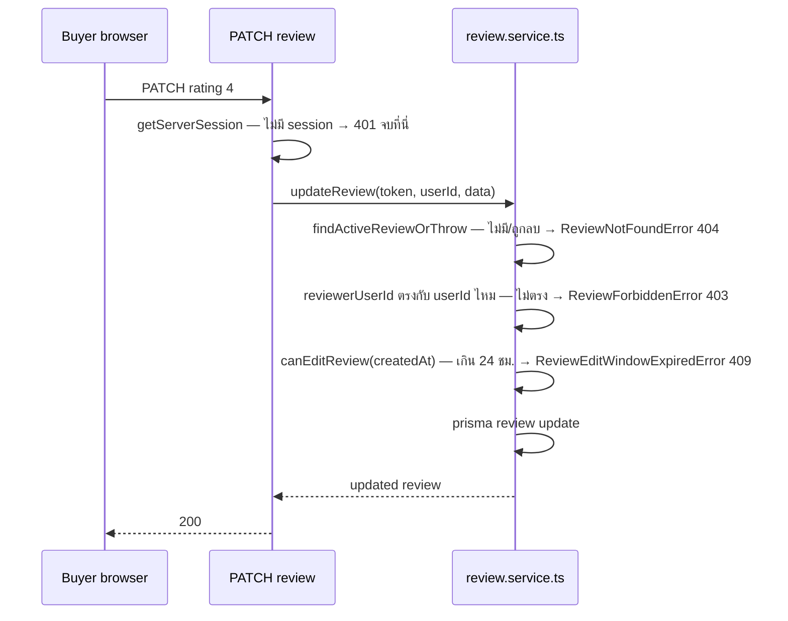
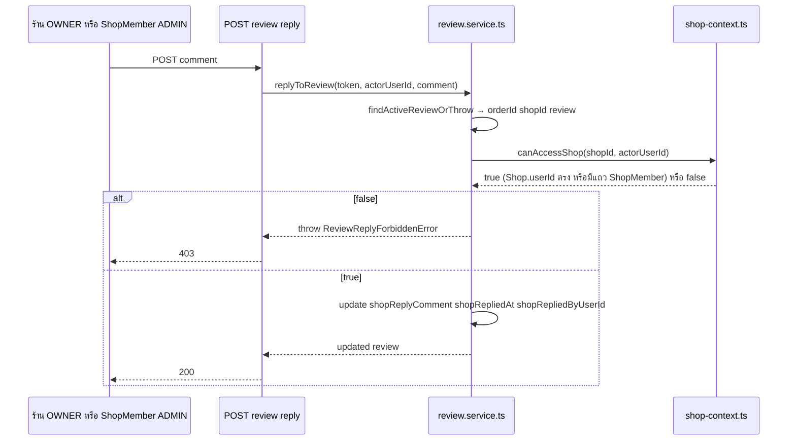

# API Contract: ประสบการณ์ผู้ซื้อบนหน้าออเดอร์ (Buyer Order Experience)

> **โมดูล:** M00041-BuyerOrderExperience
> **ประเภทเอกสาร:** API Contract
> **เวอร์ชัน:** 1.0
> **วันที่จัดทำ:** 2026-08-10
> **สถานะ:** Draft — endpoint 5 ตัวยืนยัน request/response กับ SDS §5 แล้วทุกจุด
> **เจ้าของเอกสาร:** SA (ดู [[Feature-Docs-Ownership]])

---

## 1. Overview

API ชุดนี้ให้บริการหน้า `/o/{token}` (ผู้ซื้อ) และหน้า `/seller/reviews` (ร้าน) — provider คือ Next.js 16 App Router API routes (`src/app/api/orders/[token]/**`) ผู้บริโภคคือ client component ในเว็บเดียวกัน ไม่มีผู้บริโภคภายนอก/3rd-party

- **เอกสารออกแบบต้นทาง:** [[SDS]] §5 (function signatures), §7 TD-001..006
- **Base URL:** `https://deepthailand.app/api` (prod) / `http://deepth.local:4000/api` (dev)
- **Content-Type:** `application/json` ทุก endpoint (ไม่มี multipart ในฟีเจอร์นี้ — รูปแนบผ่าน `/api/uploads/*` แยกต่างหากแล้วส่งแค่ `fileId` มาที่นี่)
- **Convention:** ทุก error response = `{ "error": "ข้อความไทย" }` — โปรเจกต์นี้ใช้ shape แบนตรงตามที่ route เดิมทั้งหมดใช้อยู่ (`dispute/route.ts`, `slip/route.ts`) **ไม่ใช่** envelope `code`/`details` แบบ template ทั่วไป

---

## 2. Authentication

| รายการ | ค่า |
|--------|-----|
| **วิธี (Auth Method)** | NextAuth.js v4 session cookie (`getServerSession(authOptions)`) — ไม่มี Bearer token ในกลุ่มนี้ (ต่างจาก `/api/app/*` ของแอปมือถือ) |
| **Header** | ไม่มี header พิเศษ — cookie แนบอัตโนมัติโดย browser |
| **Token / Scope** | ไม่มี scope แยก — สิทธิ์ตัดสินจาก `session.user.id` เทียบกับ `Order.buyerUserId`/`Shop.userId`/`ShopMember` ที่ query สดทุกครั้ง |
| **กรณีไม่ผ่าน** | `401 { "error": "ไม่ได้เข้าสู่ระบบ" }` — ยกเว้น `POST /auth-flow/start` ที่ **ไม่ต้องมี session เลย** (guest เรียกได้) |
| **CSRF** | `guardApi` (`src/proxy.ts`) บังคับ Origin-check กับทุก mutation (POST/PUT/PATCH/DELETE) โดยอัตโนมัติ — ไม่ต้องเขียนเพิ่มในแต่ละ route |

---

## 3. Endpoint List

| Method | Path | คำอธิบาย |
|--------|------|----------|
| `PATCH` | `/orders/{token}/review` | แก้ไขรีวิวของตัวเอง |
| `DELETE` | `/orders/{token}/review` | ลบ (soft-delete) รีวิวของตัวเอง |
| `POST` | `/orders/{token}/review/reply` | ร้านสร้าง/เขียนทับคำตอบ |
| `DELETE` | `/orders/{token}/review/reply` | ร้านลบคำตอบ |
| `POST` | `/orders/{token}/auth-flow/start` | บันทึก instrumentation event (guest, best-effort) |

---

## 4. Endpoint Detail

### 4.1 `PATCH /orders/{token}/review`

แก้ไขรีวิวที่ตัวเองเขียน — ใช้ได้เฉพาะภายใน 24 ชม.แรกนับจาก `createdAt` เดิม (ไม่รีเซ็ตเมื่อแก้ไข) เรียก `review.service.ts::updateReview` (SDS §5.2)

**Request**

| ส่วน | ฟิลด์ | ชนิด | บังคับ | คำอธิบาย |
|------|-------|------|--------|----------|
| Path Param | `token` | `string` (UUID v4) | yes | `Order.publicToken` |
| Body | `rating` | `int 1-5` | no | ส่งเฉพาะที่จะแก้ — ไม่ส่ง = ไม่เปลี่ยน |
| Body | `comment` | `string ≤500` | no | เดียวกับ `CreateReviewSchema.comment` — ส่ง `""` ได้ (ลบความเห็นทิ้ง) |
| Body | `images` | `string[] ≤4` | no | array ของ `fileId` จาก `/api/uploads/commit` — ส่ง `[]` ได้ (ลบรูปทั้งหมด) |

**Response — Success (200)**

| ฟิลด์ | ชนิด | คำอธิบาย |
|-------|------|----------|
| `id` | `string` | `Review.id` |
| `rating` | `int` | |
| `comment` | `string \| null` | |
| `images` | `string[]` | fileId array |
| `createdAt` | `string` (ISO) | **ไม่เปลี่ยนแม้แก้ไข** (SSOT ของหน้าต่าง 24 ชม.) |
| `updatedAt` | `string` (ISO) | |

**Response — Error:** ดู §5 — endpoint นี้คืนได้ 400 / 401 / 403 / 404 / 409

**ตัวอย่าง JSON**

```json
// Request
{ "rating": 4, "comment": "แก้ไขความเห็นหลังคุยกับร้านแล้ว", "images": ["a1b2c3.jpg"] }

// Response 200
{
  "id": "3f9c2e10-...",
  "rating": 4,
  "comment": "แก้ไขความเห็นหลังคุยกับร้านแล้ว",
  "images": ["a1b2c3.jpg"],
  "createdAt": "2026-08-10T09:00:00.000Z",
  "updatedAt": "2026-08-10T20:15:00.000Z"
}

// Response 409 (เกิน 24 ชม.)
{ "error": "แก้ไขรีวิวได้เฉพาะภายใน 24 ชั่วโมงหลังโพสต์" }

// Response 403 (ไม่ใช่เจ้าของรีวิว)
{ "error": "ไม่มีสิทธิ์แก้ไขรีวิวนี้" }
```

### 4.2 `DELETE /orders/{token}/review`

Soft-delete — เซ็ต `Review.deletedAt` + ล้าง `images`/`shopReplyComment`/`shopRepliedAt`/`shopRepliedByUserId` (SDS §5.2) 🛑 **ไม่มี `prisma.review.delete()` เด็ดขาด**

**Request:** ไม่มี body — เฉพาะ path param `token`

**Response — Success (200):** `{ "ok": true }`

**Response — Error:** เหมือน 4.1 (ไม่มี 400 เพราะไม่มี body ให้ validate)

### 4.3 `POST /orders/{token}/review/reply`

ร้านสร้าง/เขียนทับคำตอบ (1 คำตอบต่อ 1 รีวิวเสมอ — ครั้งที่สองทับครั้งแรก ไม่ใช่สร้างแถวใหม่) ไม่มีเงื่อนไขเวลา สิทธิ์ = `canAccessShop(order.shopId, session.user.id)` (`Shop.userId` ตรง **หรือ** เป็น `ShopMember` — role มีแค่ `OWNER`/`ADMIN` ในสคีมา ครอบ BR-BOE-21 พอดี)

**Request**

| ส่วน | ฟิลด์ | ชนิด | บังคับ | คำอธิบาย |
|------|-------|------|--------|----------|
| Path Param | `token` | `string` | yes | |
| Body | `comment` | `string 1-1000` | yes | trim แล้วต้องไม่ว่าง — เพดาน 1000 เป็นค่าที่ SRS ตั้งเอง (BRD ไม่ล็อก, ดู §8 Open Question) |

**Response — Success (200)**

| ฟิลด์ | ชนิด | คำอธิบาย |
|-------|------|----------|
| `shopReplyComment` | `string` | |
| `shopRepliedAt` | `string` (ISO) | |
| `shopRepliedByUserId` | `string` | user id ของคนที่กดตอบ (owner หรือสมาชิก ADMIN) |

**Response — Error:** 400 / 401 / 403 (ไม่ใช่ OWNER/ADMIN ของร้าน) / 404 (ยังไม่มีรีวิว หรือรีวิวถูกลบไปแล้ว)

```json
// Request
{ "comment": "ขอบคุณสำหรับรีวิวครับ ยินดีให้บริการอีกครั้ง" }

// Response 200
{
  "shopReplyComment": "ขอบคุณสำหรับรีวิวครับ ยินดีให้บริการอีกครั้ง",
  "shopRepliedAt": "2026-08-10T21:00:00.000Z",
  "shopRepliedByUserId": "8b1e..."
}

// Response 403
{ "error": "ไม่มีสิทธิ์ตอบกลับรีวิวของร้านนี้" }
```

### 4.4 `DELETE /orders/{token}/review/reply`

ร้านลบคำตอบของตัวเอง (ไม่กระทบรีวิวต้นทาง)

**Request:** ไม่มี body

**Response — Success (200):** `{ "ok": true }`

**Response — Error:** 401 / 403 / 404 (ทั้งกรณี "ไม่มีรีวิว/รีวิวถูกลบ" และ "มีรีวิวแต่ไม่มีคำตอบให้ลบ" — status เดียวกัน ข้อความต่างกัน ดู §5)

### 4.5 `POST /orders/{token}/auth-flow/start`

Instrumentation ping — guest เรียกได้โดยไม่ต้อง login ยิงแบบ fire-and-forget ก่อน redirect ไป `/auth/sign-in` (SRS TFR-013) **ไม่มี business logic ให้ล้มเหลว** — คืน `204` เสมอไม่ว่า input จะเป็นอย่างไรหรือ token จะมีจริงหรือไม่ (uniform-error — ไม่ leak ว่า order มีจริงไหม)

**Request**

| ส่วน | ฟิลด์ | ชนิด | บังคับ | คำอธิบาย |
|------|-------|------|--------|----------|
| Path Param | `token` | `string` | yes | |
| Body | `method` | `picklist('facebook'\|'phone_otp'\|'other')` | no | บันทึกลง `OrderEvent.meta` เพื่อวิเคราะห์ภายหลัง — parse fail = เขียน event โดยไม่มี `method` ใน meta |

**Response — Success (204):** ไม่มี body

**Response — Error:** ไม่มี — 🛑 route ต้องครอบ try/catch ของตัวเองด้วย (นอกเหนือจากที่ service อาจ throw) เพื่อไม่ให้ 500 หลุดไปหา guest ในทุกกรณี (migration ยังไม่ apply, DB ล่มชั่วคราว ฯลฯ)

```json
// Request
{ "method": "facebook" }

// Response
HTTP/1.1 204 No Content
```

---

## 5. Error Code Table

> โปรเจกต์นี้ไม่ได้ใช้ `code` แบบ enum ในตัว response จริง — ตารางนี้แปล **status + ข้อความไทยที่ route จะคืนจริง** ต่อ custom Error class (SDS §5.2) เพื่อให้ QA เขียน negative-case ได้ตรง ๆ

| Custom Error (service) | HTTP Status | ข้อความที่ route คืน | endpoint ที่คืนได้ |
|--------------------------|--------------|------------------------|----------------------|
| `ReviewNotFoundError` | 404 | `"ไม่พบรีวิวของคำสั่งซื้อนี้"` | 4.1, 4.2, 4.3, 4.4 |
| `ReviewForbiddenError` | 403 | `"ไม่มีสิทธิ์แก้ไขรีวิวนี้"` (PATCH) / `"ไม่มีสิทธิ์ลบรีวิวนี้"` (DELETE) | 4.1, 4.2 |
| `ReviewEditWindowExpiredError` | 409 | `"แก้ไขรีวิวได้เฉพาะภายใน 24 ชั่วโมงหลังโพสต์"` (PATCH) / `"ลบรีวิวได้เฉพาะภายใน 24 ชั่วโมงหลังโพสต์"` (DELETE) | 4.1, 4.2 |
| `ReviewReplyForbiddenError` | 403 | `"ไม่มีสิทธิ์ตอบกลับรีวิวของร้านนี้"` | 4.3, 4.4 |
| `ReviewReplyNotFoundError` | 404 | `"ยังไม่มีคำตอบให้ลบ"` | 4.4 |
| Valibot `safeParse` ล้ม | 400 | `parsed.issues[0]?.message` (มิเรอร์ `slip/route.ts`) | 4.1, 4.3 |
| ไม่มี session | 401 | `"ไม่ได้เข้าสู่ระบบ"` | 4.1, 4.2, 4.3, 4.4 (ไม่ใช่ 4.5) |
| unexpected/unknown Error | 400 | `"เกิดข้อผิดพลาด กรุณาลองใหม่อีกครั้ง"` (generic — **ห้าม echo `err.message` ดิบ** ตาม RC-8, `console.error` ไว้สืบภายหลัง) | ทุกตัว 4.1-4.4 |

**โครง error response จริงของโปรเจกต์:**

```json
{ "error": "ข้อความไทยที่พร้อมแสดงตรง ๆ" }
```

---

## 6. Validation Schemas (เพิ่มใน `src/lib/validations.ts`)

```ts
// UpdateReviewSchema — body ของ PATCH /api/orders/[token]/review
// ทุกฟิลด์ optional (partial update) แต่ต้องมีอย่างน้อย 1 ฟิลด์ ไม่งั้นเป็น no-op ที่สับสน
export const UpdateReviewSchema = v.pipe(
  v.object({
    rating: v.optional(v.pipe(v.number(), v.integer(), v.minValue(1), v.maxValue(5))),
    comment: v.optional(v.pipe(v.string(), v.maxLength(500))),
    // images: fileId จาก /api/uploads/commit (purpose=IMAGE) — เพดาน 4 ใบ ตาม BR-BOE-19
    // ขนาดต่อไฟล์ (≤10MB) บังคับที่ commit ไปแล้ว ที่นี่ตรวจแค่จำนวนกับรูปแบบ
    images: v.optional(v.pipe(v.array(v.pipe(v.string(), v.minLength(1), v.maxLength(200))), v.maxLength(4))),
  }),
  v.check(
    (o) => o.rating !== undefined || o.comment !== undefined || o.images !== undefined,
    "ไม่มีข้อมูลที่จะแก้ไข",
  ),
)

// ReplyToReviewSchema — body ของ POST /api/orders/[token]/review/reply
export const ReplyToReviewSchema = v.object({
  comment: v.pipe(v.string(), v.trim(), v.minLength(1, "กรุณาพิมพ์คำตอบ"), v.maxLength(1000)),
})

// AuthFlowStartSchema — body ของ POST /api/orders/[token]/auth-flow/start (instrumentation)
// ทุกฟิลด์ optional — parse fail ไม่ทำให้ request ล้ม (route คืน 204 เสมอ)
export const AuthFlowStartSchema = v.object({
  method: v.optional(v.picklist(["facebook", "phone_otp", "other"])),
})
```

**การบังคับเพดานไฟล์รูปรีวิว — 3 ชั้น ไม่ใช่ชั้นเดียว** (ตาม `docs/conventions/upload-body-size-limit.md`):

| ชั้น | บังคับอะไร | บังคับได้จริงไหม |
|---|---|---|
| client (`ReviewForm.tsx`) | จำนวน ≤4 ใบ + เตือนขนาดก่อนอัปโหลด | **ไม่ใช่ด่าน** — ปลอมได้ ใช้เพื่อ UX เท่านั้น |
| `POST /api/uploads/ticket` + bucket `file_size_limit` | ชนิดไฟล์ + ขนาด (Supabase ตอบ 413 เองและ **ไม่เขียนไฟล์**) | ✅ ด่านจริงชั้นแรก |
| `POST /api/uploads/commit` | อ่านขนาดจริงด้วย HEAD → เกิน = **ลบไฟล์ทิ้ง** + 413 | ✅ ด่านจริงชั้นสอง (`upload-policy.ts` purpose `IMAGE` = 10MB, jpg/jpeg/png/webp/gif) |
| `UpdateReviewSchema.images` (ที่นี่) | จำนวน ≤4 ใบ | ✅ ด่านจริงของ "จำนวน" — ขนาดถูกตรวจไปแล้วที่ commit |

---

## 7. Sequence (เฉพาะ flow ที่ซับซ้อนกว่า 1 request)

### 7.1 แก้ไขรีวิว — ownership ก่อน expiry เสมอ (กัน oracle)



### 7.2 ร้านตอบกลับรีวิว — สิทธิ์ผ่าน `canAccessShop` (reuse ไม่สร้างใหม่)



---

## 8. Rate Limit

ใช้ bucket เดิมของ `guardApi` ทั้งหมด — **ไม่เพิ่ม bucket ใหม่** (SDS TD-005)

| Flow | request ที่เกิดขึ้น | bucket | เพดาน | headroom |
|---|---|---|---|---|
| แนบรูปรีวิว 4 ใบ | 8 (`ticket`+`commit` ต่อไฟล์) | `/api/uploads/*` | 300/นาที | มาก |
| บันทึกรีวิว/แก้ไข | 1 | mutation (auth) | 30/นาที | มาก |
| ร้านตอบกลับรีวิว | 1 | mutation (auth) | 30/นาที | มาก |
| `auth-flow/start` | 1 ต่อการกดปุ่ม login | mutation (unauth) | 100/นาที | มาก |

---

## 9. Traceability

| Endpoint | SDS Component / Decision | BRD FR |
|----------|--------------------------|--------|
| `PATCH /orders/{token}/review` | `review.service.ts::updateReview`, SDS TD-002 | FR-016 |
| `DELETE /orders/{token}/review` | `review.service.ts::deleteReview`, SDS TD-002 | FR-016 |
| `POST /orders/{token}/review/reply` | `review.service.ts::replyToReview` | FR-014 |
| `DELETE /orders/{token}/review/reply` | `review.service.ts::deleteReviewReply` | FR-014 |
| `POST /orders/{token}/auth-flow/start` | `order-event.service.ts`, SDS TD-004 | FR-021 |

---

## 10. สรุป (Summary)

API Contract นี้ครอบ endpoint ใหม่ 5 ตัวของฟีเจอร์ 00041 — ทุก request/response shape ยืนยันกับ convention จริงของ route ข้างเคียง (`dispute/route.ts`, `slip/route.ts`) ไม่ใช่ shape ตาม template ทั่วไป · เพดานไฟล์รูปรีวิว (§6) และ rate-limit (§8) ยืนยันจาก `src/lib/upload-policy.ts` และ `src/proxy.ts` ของจริงแล้วว่าไม่ต้องเพิ่ม bucket ใหม่

**Open Questions:**
- `ReplyToReviewSchema` maxLength 1000 — ยังไม่ได้ยืนยันกับ user (SRS §10)
- ข้อความ error ใน §5 เป็นข้อเสนอของเอกสารนี้ — ควรผ่าน `/impeccable clarify` ก่อน ship จริง (HR8 บังคับ copy/error message ต้องผ่าน clarify)
