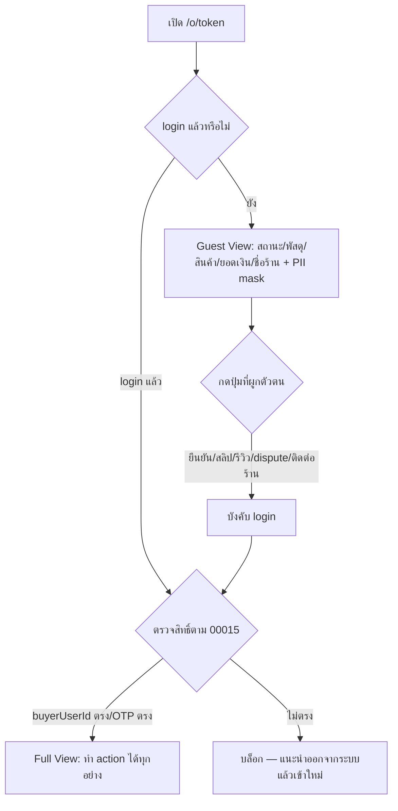
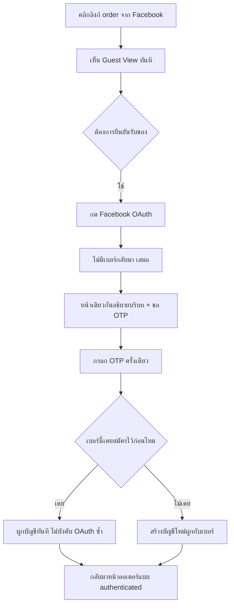
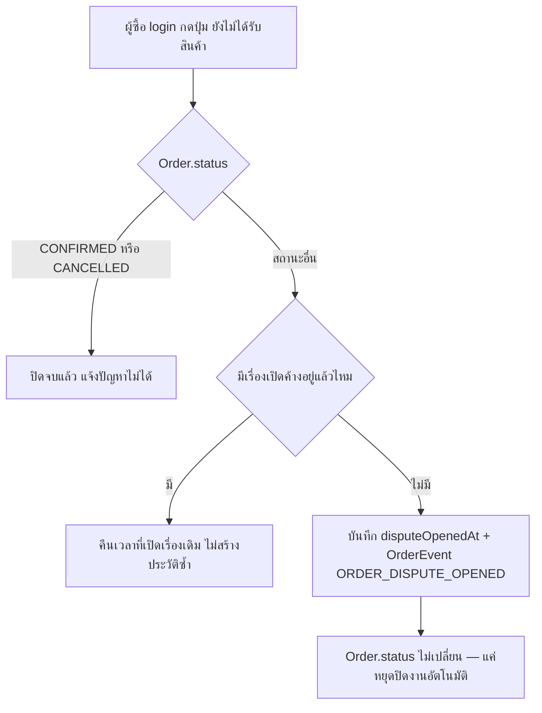
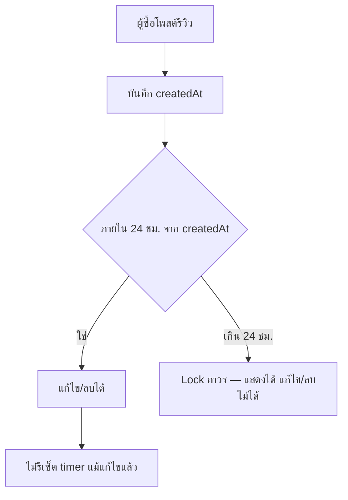

# BRD: ประสบการณ์ผู้ซื้อบนหน้าออเดอร์ (Buyer Order Experience)

> **โมดูล:** M00041-BuyerOrderExperience
> **ประเภทเอกสาร:** Business Requirements Document (BRD) - NON-TECHNICAL
> **เวอร์ชัน:** 1.0
> **วันที่จัดทำ:** 2026-08-10
> **สถานะ:** Draft — FR ทั้ง 22 ข้อ trace กลับ PRD §3 (9 กลุ่ม) ครบ; ตัวเลข 4 ข้อที่ PRD ค้างไว้เคาะเป็นข้อเสนอแล้ว (ดู §8.6, §8.1) **รอ user ยืนยัน** ก่อนส่งต่อ SRS
> **เจ้าของเอกสาร:** BA (ดู [[Feature-Docs-Ownership]])

---

## 1. บทนำ

### 1.1 วัตถุประสงค์ของเอกสาร

เอกสารนี้มีวัตถุประสงค์เพื่อ:
1. แปลง Business Requirements ใน PRD §3 (9 กลุ่ม) เป็น Functional Requirements ที่ทดสอบได้จริง พร้อม Acceptance Criteria ที่ QA หยิบไปเขียน TestCase ได้ตรง ๆ
2. กำหนดขอบเขตการทำงานของหน้า `/o/{token}` ใหม่ทั้งเส้น — ตั้งแต่มุมมอง guest จนถึงมุมมองที่ล็อกอินแล้ว
3. ล็อกตัวเลข/เงื่อนไขที่ PRD ยังค้างไว้ (กรอบเวลาแก้รีวิว, จำนวน/ขนาดรูปแนบ, สิทธิ์ตอบกลับรีวิว, ระดับการ mask ที่อยู่) เป็นข้อเสนอที่อิงเพดานจริงของระบบ พร้อมเหตุผล — รอ user ยืนยันก่อนส่งต่อ SRS
4. สร้างความเข้าใจร่วมกันระหว่างทีมธุรกิจและทีมพัฒนาว่า "guest เห็นอะไรได้/ไม่ได้", "อะไรบังคับ login เสมอ", และ "ตัวเลข KPI วัดจากไหน" ก่อนเริ่มออกแบบทางเทคนิค (SRS/SDS)

### 1.2 ขอบเขตของระบบ

**ประสบการณ์ผู้ซื้อบนหน้าออเดอร์ (Buyer Order Experience)** คือการ redesign หน้า `/o/{token}` ทั้งเส้น ครอบคลุมตั้งแต่การเปิดลิงก์แบบไม่มีบัญชี (guest) ไปจนถึงการยืนยันรับของ/แนบสลิป/รีวิว/แจ้งปัญหา/ติดต่อร้านหลัง login — เป็นจุดสัมผัสเดียวที่ผู้ซื้อของ Deep เจอแพลตฟอร์มโดยตรง

**เข้าสู่ระบบ (Input):**
- ลิงก์ `/o/{token}` ที่ร้านส่งให้ผู้ซื้อ (ผ่านแชท Facebook/LINE/SMS/ก็อปวางเอง)
- การกระทำของผู้ซื้อ: เปิดหน้า, กด login (Facebook/Phone OTP), ยืนยันรับของ, แนบสลิป, เขียน/แก้/ลบรีวิว, แนบรูปรีวิว, กดแจ้งปัญหา, กดติดต่อร้าน
- การกระทำของร้าน: ตอบกลับรีวิว

**ออกจากระบบ (Output):**
- หน้าจอที่แสดงข้อมูลออเดอร์ตามระดับสิทธิ์ (guest/authenticated)
- เหตุการณ์ที่บันทึกลงระบบ: `BUYER_CONFIRMED`, สลิปที่ผูกกับออเดอร์ถาวร, รีวิว (+รูป+คำตอบร้าน), `ORDER_DISPUTE_OPENED`, ข้อความในห้องแชทกับร้าน, เหตุการณ์ auth-flow สำหรับวัด Login Completion Rate
- ตัวเลข KPI ที่วัดได้จริง: Login Completion Rate, Buyer Confirm Rate, Review Rate, SMS Link Effective Send Rate

**ระบบที่เกี่ยวข้อง:**
- feature 00015 (Order Claim & Forced Login) — กติกา ownership/claim ที่คงไว้ทั้งหมด
- feature 00039 (Order Success Metrics / Dispute) — `POST /api/orders/{token}/dispute` ที่มีอยู่แล้ว
- ระบบข้อความ `/messages/[shopId]`
- `deriveShippingStage()` (`src/lib/order-stage.ts`) — SSOT สถานะพัสดุที่ฝั่งร้านใช้อยู่แล้ว
- `upload-policy.ts` — SSOT เพดานไฟล์ที่บังคับได้จริง (bucket + commit HEAD check)
- Trust Score / feature 00040 — เป็น downstream ที่รอผลลัพธ์จากฟีเจอร์นี้

### 1.3 กลุ่มผู้ใช้งาน

| กลุ่มผู้ใช้ | บทบาท | สิทธิ์การใช้งาน |
|-----------|--------|----------------|
| **ผู้ซื้อ (Guest — ยังไม่ login)** | เปิดลิงก์ `/o/{token}` โดยไม่มีบัญชี หรือมีบัญชีแต่ยังไม่ได้ login | อ่านอย่างเดียว: สถานะออเดอร์/พัสดุ/สินค้า/ยอดเงิน/ชื่อร้าน + เห็นเบอร์/ที่อยู่แบบ mask บางส่วน — ทำ action ใด ๆ ไม่ได้ |
| **ผู้ซื้อ (Authenticated — login แล้วและผ่านการตรวจสิทธิ์ตาม 00015)** | ผู้ซื้อที่ `Order.buyerUserId` ตรงกับบัญชีที่ login หรือ claim สำเร็จผ่าน OTP | ยืนยันรับของ, แนบสลิป, เขียน/แก้/ลบรีวิวภายในเวลาจำกัด, แนบรูปรีวิว, แจ้งปัญหา (dispute), ติดต่อร้าน |
| **ร้านค้า (Shop owner — `Shop.userId`)** | เจ้าของร้านที่ออกออเดอร์ใบนี้ | ตอบกลับรีวิวที่ร้านตัวเองได้รับ, ปิดเรื่อง dispute (ผ่าน API เดิมของ 00039, นอกขอบเขตฟีเจอร์นี้) |
| **ทีมงานร้าน (`ShopMember`, role = `ADMIN`)** | สมาชิกที่ถูกเชิญเข้าร้าน BUSINESS | ตอบกลับรีวิวแทนเจ้าของร้านได้ (มิเรอร์สิทธิ์ตาม feature 00035) — role อื่นที่ไม่ใช่ `ADMIN` **ไม่มีสิทธิ์นี้** |
| **Admin/Ops** | ทีมดูแลระบบ | ไม่มี action ใหม่ในฟีเจอร์นี้โดยตรง — เห็นผลลัพธ์ผ่าน query/dashboard ของ KPI (§FR-022) |

---

## 2. ความต้องการหลัก (Functional Requirements)

### 2.1 Guest View แบบจำกัด (D-1)

#### FR-001: Guest เห็นข้อมูลพื้นฐานของออเดอร์โดยไม่ต้อง login

**User Story:**
> ในฐานะผู้ซื้อที่ยังไม่ login ฉันต้องการเปิดลิงก์ออเดอร์แล้วเห็นสถานะ/สินค้า/ยอดเงิน/ชื่อร้านได้ทันที เพื่อมั่นใจว่านี่คือออเดอร์ของฉันก่อนตัดสินใจสมัครสมาชิก

**Acceptance Criteria:**
- [ ] เปิด `/o/{token}` โดยไม่ login เห็น: สถานะออเดอร์ปัจจุบัน, รายการสินค้า, ยอดเงินรวม, ชื่อร้านค้า, trust score/tier ของร้าน — โดยไม่ถูก redirect ไปหน้า login
- [ ] ไม่มี action ใดที่เปลี่ยนสถานะออเดอร์/ข้อมูลในระบบสำเร็จได้จากมุมมองนี้ (ปุ่มที่ต้อง login แสดงแต่กดแล้วต้อง login ก่อนเสมอ — ดู FR-004)
- [ ] token ที่ไม่มีอยู่จริงหรือถูกลบ ต้องขึ้นหน้า not-found ที่ไม่รั่วว่า token รูปแบบถูกต้องหรือไม่ (ป้องกัน enumeration)

**Business Flow:**
1. ผู้ซื้อคลิกลิงก์ `/o/{token}` จากแชท
2. Server ตรวจว่า token มีอยู่จริง → ดึงข้อมูลออเดอร์แบบ guest-safe (mask PII ที่ server ก่อนส่งออก — ดู FR-003)
3. แสดงหน้าจอ guest view — ไม่มี prompt บังคับ login ทันที

#### FR-002: Guest เห็นสถานะพัสดุแบบละเอียดโดยไม่ต้อง login

**User Story:**
> ในฐานะผู้ซื้อที่ยังไม่ login ฉันต้องการเห็นความคืบหน้าของพัสดุ (ไม่ใช่แค่ "กำลังจัดส่ง" ตายตัว) เพื่อรู้ว่าของถึงไหนแล้วโดยไม่ต้องสมัครสมาชิกก่อน

**Acceptance Criteria:**
- [ ] Timeline สถานะพัสดุที่ guest เห็น ใช้ผลลัพธ์เดียวกับที่ `deriveShippingStage()` คำนวณให้ฝั่งร้าน (ไม่มีตรรกะแยก)
- [ ] ถ้ามีเลขพัสดุและระบบมี `trackingUrl` ของขนส่งนั้น ต้องมีลิงก์ให้กดออกไปดูรายละเอียดเพิ่มที่หน้าขนส่งได้ — ถ้าไม่มี `trackingUrl` ต้องไม่แสดงลิงก์เปล่า/ลิงก์พัง
- [ ] เห็นได้ทั้งใน guest view และ authenticated view เป็นข้อมูลชุดเดียวกัน (ไม่ใช่ของที่ต้อง login ก่อนถึงเห็น)

#### FR-003: PII masking ของเบอร์โทร/ที่อยู่สำหรับ guest

**User Story:**
> ในฐานะผู้ซื้อที่ยังไม่ login ฉันต้องการเห็นข้อมูลติดต่อ/ที่อยู่บางส่วนพอให้มั่นใจว่าเป็นออเดอร์ของฉัน โดยไม่เปิดเผยข้อมูลเต็มให้ใครก็ตามที่ถือลิงก์นี้

**Acceptance Criteria:**
- [ ] เบอร์โทรผู้ซื้อแสดงเฉพาะ **3 หลักสุดท้าย** ส่วนที่เหลือแทนด้วยเครื่องหมายซ่อน (เช่น `•••-•••-891`) — ล็อกแล้วตาม PRD D-1
- [ ] ที่อยู่จัดส่งแสดง **จังหวัดเต็ม** (ให้บริบทว่าออเดอร์นี้ส่งไปทางไหน) ส่วนท่อนอื่น (บ้านเลขที่/ถนน/ตำบล/อำเภอ/รหัสไปรษณีย์) แสดงเฉพาะ **3 ตัวอักษร/หลักสุดท้ายของแต่ละท่อน** เช่นเดียวกับเบอร์โทร ที่เหลือแทนด้วยเครื่องหมายซ่อน — **🛑 เป็นข้อเสนอ ยังไม่ล็อก รอ user ยืนยัน** (ดู §8.1 เหตุผลและทางเลือกที่พิจารณาแล้ว)
- [ ] การ mask ต้องเกิดที่ server ก่อนข้อมูลออกจาก response — ไม่ส่งค่าดิบไปให้ client แล้วซ่อนด้วย CSS/JS (ตาม `feedback_rsc_pii_neutralize_at_source`)
- [ ] ผู้ซื้อที่ login แล้วและผ่านการตรวจสิทธิ์เป็นเจ้าของออเดอร์ (ตาม 00015) เห็นข้อมูลเต็มไม่ถูก mask

**Example:**
```
Guest เห็น: เบอร์ผู้รับ •••-•••-891 | ที่อยู่: จังหวัดสมุทรปราการ, อำเภอ•••ง, ตำบล•••ยว, ถนน•••ทร, บ้านเลขที่ •••45
Authenticated (เจ้าของออเดอร์) เห็น: เบอร์ผู้รับ 081-234-5891 | ที่อยู่เต็ม 45 ถ.สุขุมวิท ต.บางปูใหม่ อ.เมือง จ.สมุทรปราการ
```

#### FR-004: Action ที่ผูกตัวตนบังคับ login เสมอ (ไม่มีข้อยกเว้น)

**User Story:**
> ในฐานะผู้ดูแลระบบความน่าเชื่อถือของแพลตฟอร์ม ฉันต้องการให้ทุกการกระทำที่มีผลผูกพัน (ยืนยันรับของ/แนบสลิป/รีวิว/แจ้งปัญหา/ติดต่อร้าน) ผูกกับตัวตนที่ตรวจสอบได้เสมอ เพื่อไม่ให้เกิด guest-confirm กลับมาอีก

**Acceptance Criteria:**
- [ ] Guest กดปุ่ม "ยืนยันรับของ" / "แนบสลิป" / "เขียนรีวิว" / "ยังไม่ได้รับสินค้า" / "ติดต่อร้านค้า" ต้องถูกพาไปหน้า login ก่อนเสมอ (ไม่ทำสำเร็จโดยตรงจาก guest view)
- [ ] **การตรวจสิทธิ์ต้องอยู่ที่ server (API) ไม่ใช่แค่ซ่อนปุ่มบนหน้าจอ** — ยิง request ตรงไปที่ API โดยไม่ login ต้องได้ 401/403 เสมอ (ตาม pattern ที่ dispute API 00039 ใช้อยู่แล้ว)
- [ ] กติกาการตรวจสิทธิ์เมื่อ login แล้ว (`buyerUserId` ownership, OTP ตรงกับ `buyerContact`, ห้าม identity switch) เป็นไปตามกติกาเดิมของ feature 00015 ทุกประการ — ฟีเจอร์นี้ไม่แก้ไข logic ส่วนนี้

---

### 2.2 ลดขั้นตอนเส้นทาง Facebook

#### FR-005: หน้าขอ OTP อธิบายบริบทว่าทำไมต้องยืนยันเบอร์

**User Story:**
> ในฐานะผู้ซื้อที่ login ด้วย Facebook แล้วถูกขอเบอร์โทรต่อ ฉันต้องการรู้ว่าทำไมต้องทำขั้นตอนนี้ เพื่อไม่รู้สึกว่ากำลังเจอขั้นตอนแปลกที่ไม่เกี่ยวข้องกัน

**Acceptance Criteria:**
- [ ] หน้าที่ขอ OTP หลัง Facebook OAuth (`PHONE_VERIFY_REQUIRED`) ต้องแสดงข้อความอธิบายเชื่อมโยงกับออเดอร์ที่กำลังจะเข้าถึง (เช่น "ยืนยันเบอร์เพื่อดูออเดอร์ #DP...")
- [ ] ไม่มีขั้นตอนใหม่เพิ่มขึ้นจากเดิม — เป็นการปรับ UX ของหน้าเดิมให้มีบริบท ไม่ใช่เพิ่มหน้าจอ

#### FR-006: เบอร์ที่เคยสมัครไว้ก่อนไม่บังคับ OAuth Facebook ซ้ำรอบสอง

**User Story:**
> ในฐานะผู้ซื้อที่เบอร์เคยสมัคร Deep ไว้ก่อนแล้ว ฉันต้องการยืนยันตัวตนสำเร็จโดยไม่ต้องผ่าน OAuth Facebook ซ้ำเป็นรอบที่สอง เพื่อไม่ให้ขั้นตอนยาวเกินจำเป็น

**Acceptance Criteria:**
- [ ] เมื่อ OTP ยืนยันเบอร์สำเร็จ และเบอร์นั้นตรงกับบัญชีที่มีอยู่แล้ว ระบบต้อง**ไม่**ส่งผู้ใช้กลับไปหน้า Facebook OAuth เป็นรอบที่สองภายใน session เดียวกัน
- [ ] กลไกทางเทคนิคที่ทำให้เกิดผลนี้ (เช่น การผูกบัญชีที่ backend) ให้ SRS/SDS เป็นผู้ออกแบบ — ข้อนี้ล็อกเฉพาะผลลัพธ์ที่ผู้ใช้ต้องเห็น
- [ ] ต้องไม่ละเมิดกติกา identity ownership ของ feature 00015 (ไม่มี identity switch อัตโนมัติข้ามบัญชี — เคสนี้คือบัญชีเดียวกันที่ยืนยันครบ ไม่ใช่การสลับบัญชี)

#### FR-007: จำนวนขั้นตอนของเส้นทาง Facebook ลดลงวัดผลได้

**User Story:**
> ในฐานะทีมผลิตภัณฑ์ ฉันต้องการวัดได้ว่าเส้นทาง Facebook สั้นลงจริงหลังฟีเจอร์นี้ เพื่อยืนยันว่าการแก้ไขได้ผล

**Acceptance Criteria:**
- [ ] นับจำนวนหน้าจอ/การกระทำจากคลิกลิงก์จนถึงเห็นหน้าออเดอร์แบบ authenticated ได้ ≤ 4 หน้าจอ / ≤ 8 การกระทำ (ข้อเสนอ เทียบกับ baseline 6-7 หน้าจอ/14-16 การกระทำ — ไม่ใช่ตัวเลขที่ PRD ล็อกไว้ชัดเจน แต่จำเป็นสำหรับ AC ที่ทดสอบได้ เสนอเป็นเป้าที่ QA ใช้ตรวจสอบ)
- [ ] ทดสอบด้วยเคสจริง 3 แบบ: (1) บัญชี Facebook ใหม่ไม่เคยมีเบอร์ในระบบ (2) เบอร์เคยสมัครไว้ก่อนแล้ว (3) เบอร์เดียวกับที่เคย claim ออเดอร์นี้ไปแล้ว

---

### 2.3 หลักฐานการชำระเงิน (สลิป)

#### FR-008: แนบสลิปสำเร็จทุกครั้ง (แก้บั๊กที่มีอยู่)

**User Story:**
> ในฐานะผู้ซื้อที่ login แล้ว ฉันต้องการแนบสลิปโอนเงินได้สำเร็จทุกครั้ง เพื่อให้มีหลักฐานการชำระเงินติดกับออเดอร์

**Acceptance Criteria:**
- [ ] แนบไฟล์สลิป (jpg/png/webp/gif/pdf ตาม `upload-policy.ts` purpose `DOCUMENT`, ≤10MB) แล้วได้ผลลัพธ์สำเร็จ ไม่ใช่ 500/ข้อความ "แนบสลิปไม่สำเร็จ ลองอีกครั้ง"
- [ ] Endpoint รับสลิปต้องรองรับ payload ที่ client ส่งจริง (แก้ไม่ตรงกันระหว่าง JSON `{fileId}` กับ multipart ตามที่ระบุใน `docs/superpowers/plans/2026-08-10-buyer-order-experience-resume.md` §2)
- [ ] อัปโหลดผ่าน `@/lib/upload-client` (direct upload ticket → PUT → commit) ไม่ผ่าน body ของ API route โดยตรง ตาม `docs/conventions/upload-body-size-limit.md`

#### FR-009: ดูสลิปย้อนหลังได้เสมอ

**User Story:**
> ในฐานะผู้ซื้อที่เคยแนบสลิปไปแล้ว ฉันต้องการเปิดดูสลิปที่ตัวเองแนบได้ทุกเมื่อ แม้ปิดแท็บหรือร้านเปลี่ยนสถานะออเดอร์ไปแล้ว

**Acceptance Criteria:**
- [ ] สลิปที่แนบสำเร็จบันทึกเป็น `fileId` ถาวรในฐานข้อมูล (ไม่ใช่ object URL ชั่วคราวของเบราว์เซอร์)
- [ ] เปิด `/o/{token}` ใหม่ (คนละ session/รีเฟรช/อุปกรณ์คนละเครื่อง แต่บัญชีเดียวกันที่มีสิทธิ์) ต้องเห็นสลิปเดิมที่เคยแนบ
- [ ] สลิปยังแสดงได้แม้ร้านเปลี่ยนสถานะออเดอร์เป็น SHIPPED/CONFIRMED ไปแล้ว (ไม่หายไปพร้อมกับการเปลี่ยนสถานะ)

**Business Flow:**
1. ผู้ซื้อกดแนบไฟล์ → client ขอ upload ticket → PUT ตรงเข้า storage → commit
2. Commit สำเร็จ → server ผูก `fileId` เข้ากับ `Order.slipFileId`
3. ทุกครั้งที่โหลดหน้าออเดอร์ (guest หรือ authenticated ที่มีสิทธิ์) server ดึง `slipFileId` แล้ว resolve เป็น URL ที่ใช้แสดงได้จริง

#### FR-010: ตำแหน่งโซนแนบสลิปอยู่ในลำดับที่เห็นง่าย

**User Story:**
> ในฐานะผู้ซื้อ ฉันต้องการเห็นโซนแนบสลิปในตำแหน่งที่อ่านหน้าจอแล้วเจอง่าย ไม่ใช่ล่างสุดใต้ทุกองค์ประกอบรวมถึงโซนรีวิว

**Acceptance Criteria:**
- [ ] โซนแนบสลิปอยู่ในลำดับการอ่านหน้าจอก่อนโซนรีวิว (รีวิวเกิดหลังยืนยันรับของ ซึ่งเป็นขั้นตอนที่มาทีหลังการชำระเงินเสมอ)
- [ ] ตำแหน่งที่แน่นอน (บนสุด/ใกล้ปุ่มยืนยัน ฯลฯ) ให้ `safepay-ux` ออกแบบใน Design Spec ตาม Hard Rule 8 — ข้อนี้ล็อกเฉพาะลำดับสัมพัทธ์กับโซนรีวิว

---

### 2.4 สถานะพัสดุที่โปร่งใส

(AC หลักอยู่ใน FR-002 ของ §2.1 เพราะ guest ต้องเห็นด้วย — กลุ่มนี้เพิ่มเติมเฉพาะส่วนที่เกี่ยวกับความสอดคล้องของข้อมูล)

#### FR-011: Timeline สถานะพัสดุมาจากแหล่งเดียวกับฝั่งร้านเสมอ

**User Story:**
> ในฐานะทีมพัฒนา ฉันต้องการให้ตรรกะแบ่งขั้นสถานะพัสดุมีแหล่งเดียว เพื่อไม่ให้ผู้ซื้อกับผู้ขายเห็นความคืบหน้าไม่ตรงกัน

**Acceptance Criteria:**
- [ ] หน้าผู้ซื้อ import/เรียกใช้ `deriveShippingStage()` ตัวเดียวกับที่ `MiniShipmentTimeline` (ฝั่งร้าน) ใช้ — ไม่มีการคำนวณขั้นสถานะซ้ำด้วยเงื่อนไขของตัวเอง
- [ ] `getOrderByToken` (หรือ query เทียบเท่าที่ป้อนข้อมูลให้หน้านี้) ต้อง select field สถานะขนส่ง (`carrierStatus` และคู่ที่เกี่ยวข้อง) เพิ่มจากที่ขาดอยู่ปัจจุบัน — ชื่อ field ที่แน่นอนให้ SRS ยืนยันกับ schema อีกครั้ง

---

### 2.5 ช่องทางแจ้งปัญหาและติดต่อร้านค้า (D-3)

#### FR-012: เปิดปุ่ม "ยังไม่ได้รับสินค้า" เรียก dispute API ที่มีอยู่แล้ว

**User Story:**
> ในฐานะผู้ซื้อที่ login แล้วและมีปัญหากับออเดอร์ ฉันต้องการแจ้งว่ายังไม่ได้รับสินค้าผ่านหน้าออเดอร์โดยตรง เพื่อให้มีหลักฐานในระบบแทนการติดต่อนอกช่องทาง

**Acceptance Criteria (ยืนยันกับโค้ดจริงของ `POST /api/orders/[token]/dispute` แล้ว — ดู §4.3):**
- [ ] ปุ่ม "ยังไม่ได้รับสินค้า" แสดงเฉพาะผู้ซื้อที่ login และเป็นเจ้าของออเดอร์ (`session.user.id === order.buyerUserId`) — ปุ่มนี้เป็นมุมมองฝั่งผู้ซื้อเท่านั้น (ทีมงานร้านมีทางเปิดแทนได้จาก backend เดิม แต่ไม่ใช่ UI ของฟีเจอร์นี้)
- [ ] กดปุ่มสำเร็จเมื่อ `Order.status` **ไม่ใช่** `CONFIRMED` และ **ไม่ใช่** `CANCELLED` — สถานะอื่นทั้งหมดเปิดได้ (ตรงกับเงื่อนไขจริงใน `order-dispute.service.ts`)
- [ ] ถ้าออเดอร์ปิดจบแล้ว (`CONFIRMED`/`CANCELLED`) กดปุ่มต้องได้ข้อความ "คำสั่งซื้อนี้ปิดจบไปแล้ว แจ้งปัญหาไม่ได้" (ไม่ใช่ error กลาง ๆ)
- [ ] กดปุ่มซ้ำขณะมีเรื่องเปิดค้างอยู่แล้ว (`disputeOpenedAt` ไม่ null และ `disputeResolvedAt` เป็น null) ต้องได้ผลลัพธ์เดิม (เวลาเปิดเรื่องเดิม) ไม่สร้างประวัติซ้ำ — เป็น idempotent ตามที่ service กำหนดไว้แล้ว ไม่ใช่ requirement ใหม่
- [ ] ผู้ซื้อกรอกรายละเอียดเพิ่มเติมได้ (optional, ≤500 ตัวอักษร) — ข้อความนี้**ไม่แสดงต่อสาธารณะ**บนหน้า guest/authenticated view (เก็บใน `meta` ของ event เท่านั้น ตาม BR ที่มีอยู่แล้วของ 00039)
- [ ] กดปุ่มนี้**ไม่เปลี่ยน** `Order.status` — เป็นแค่ธงหยุดการปิดงานอัตโนมัติ ไม่ใช่การยกเลิก/คืนเงิน

#### FR-013: เปิดปุ่ม "ติดต่อร้านค้า"

**User Story:**
> ในฐานะผู้ซื้อที่ login แล้ว ฉันต้องการส่งข้อความหาร้านโดยตรงจากหน้าออเดอร์ เพื่อสอบถาม/แจ้งปัญหาโดยไม่ต้องหาช่องทางอื่นเอง

**Acceptance Criteria:**
- [ ] กดปุ่ม "ติดต่อร้านค้า" พาไปหน้า `/messages/[shopId]` ของร้านที่ออกออเดอร์นี้ (ไม่ใช่หน้าปิด/disabled อีกต่อไป)
- [ ] ปุ่มนี้แสดงเฉพาะผู้ซื้อที่ login แล้ว (guest กดต้องถูกพาไป login ก่อนตาม FR-004)
- [ ] ไม่มีการสร้างระบบแชทใหม่ — ใช้หน้า `/messages/[shopId]` ที่มีอยู่แล้วทั้งหมด

---

### 2.6 ระบบรีวิว 3 ข้อ (D-2)

#### FR-014: ร้านตอบกลับรีวิวได้

**User Story:**
> ในฐานะเจ้าของร้าน (หรือทีมงานที่มีสิทธิ์) ฉันต้องการตอบกลับรีวิวที่ลูกค้าเขียนถึงร้าน เพื่อสร้างความสัมพันธ์หรือชี้แจงเมื่อรีวิวไม่เป็นธรรม

**Acceptance Criteria:**
- [ ] ร้านตอบกลับได้ **1 คำตอบต่อ 1 รีวิว** — เขียนคำตอบที่สองทับคำตอบเดิม (แก้ไข) ไม่ใช่สร้างคำตอบที่สองแยกกัน
- [ ] สิทธิ์ตอบกลับ: `Shop.userId === session.user.id` (เจ้าของร้าน) **หรือ** เป็น `ShopMember` ที่ `role === 'ADMIN'` ของร้านนั้น — role อื่น (ถ้ามีในอนาคต) ไม่มีสิทธิ์นี้ (มิเรอร์ตาม convention ของ feature 00035 ที่ใช้ระดับสิทธิ์เดียวกันสำหรับการจัดการหน้าสาธารณะของร้าน)
- [ ] คำตอบแสดงต่อสาธารณะคู่กับรีวิวเดิม ทั้งในมุมมอง guest และ authenticated
- [ ] ร้านแก้ไข/ลบคำตอบของตัวเองได้ **ไม่จำกัดเวลา** — ข้อเสนอ รอ user ยืนยัน (ดู §8.6 เหตุผล)

#### FR-015: แนบรูปในรีวิวได้

**User Story:**
> ในฐานะผู้ซื้อที่เขียนรีวิว ฉันต้องการแนบรูปประกอบความเห็น เพื่อให้รีวิวมีน้ำหนักและเป็นประโยชน์กับคนอื่นที่อ่าน

**Acceptance Criteria:**
- [ ] แนบรูปได้สูงสุด **4 รูปต่อ 1 รีวิว** — ข้อเสนอ รอ user ยืนยัน (ดู §8.6)
- [ ] รูปแต่ละไฟล์ต้องผ่านเพดานของ `upload-policy.ts` purpose `IMAGE`: **≤10MB ต่อไฟล์**, ชนิดไฟล์ `jpg`/`jpeg`/`png`/`webp`/`gif` เท่านั้น — ตัวเลขนี้ยืนยันจากโค้ดจริงแล้ว ไม่ใช่ตัวเลขที่ตั้งขึ้นเอง (ต่างจากเพดาน 5/10/25MB เดิมที่ไม่มีผลจริงตาม `docs/conventions/upload-body-size-limit.md`)
- [ ] อัปโหลดผ่าน `@/lib/upload-client` (direct upload) เช่นเดียวกับสลิป — ไม่ผ่าน body ของ API route
- [ ] ไฟล์เกินเพดานหรือชนิดไม่รองรับ ต้องได้ข้อความ error ที่บอกเหตุผลชัดเจน (จาก `checkUploadPolicy`/`oversizeMessage` ที่มีอยู่แล้ว ไม่ใช่ "ลองใหม่อีกครั้ง" กลาง ๆ)

#### FR-016: แก้/ลบรีวิวได้ภายในเวลาจำกัด

**User Story:**
> ในฐานะผู้ซื้อที่เพิ่งเขียนรีวิว ฉันต้องการแก้ไขได้ถ้าพิมพ์ผิดหรือให้ดาวผิด โดยไม่สามารถเปลี่ยนใจย้อนหลังได้ตลอดไปหลังร้านติดต่อมา

**Acceptance Criteria:**
- [ ] ผู้ซื้อแก้ไข (rating/comment/รูปแนบ) หรือลบรีวิวของตัวเองได้ภายใน **24 ชั่วโมง** หลังโพสต์ครั้งแรก — ข้อเสนอ รอ user ยืนยัน (ดู §8.6 เหตุผลและทางเลือกที่พิจารณาแล้ว)
- [ ] กรอบเวลานับจาก `createdAt` เดิมของรีวิว (เวลาที่โพสต์ครั้งแรก) **ไม่รีเซ็ตเมื่อแก้ไข** — ป้องกันการยืดเวลาแก้ไขไม่รู้จบด้วยการแก้ทีละนิด
- [ ] หลังพ้น 24 ชั่วโมง ปุ่มแก้ไข/ลบหายไป (หรือ disabled พร้อมคำอธิบาย) — รีวิวยังคงแสดงและอ่านได้ตามปกติ ไม่ใช่ถูกซ่อน
- [ ] ลบรีวิวสำเร็จ = ลบทั้งรูปแนบและคำตอบของร้าน (ถ้ามี) ไปพร้อมกัน — ไม่เหลือคำตอบของร้านค้างอยู่โดยไม่มีรีวิวต้นทาง

#### FR-017: ฝั่งร้านเห็นชื่อผู้รีวิวที่มีความหมาย

**User Story:**
> ในฐานะเจ้าของร้าน ฉันต้องการรู้ว่ารีวิวที่ได้รับมาจากลูกค้าคนไหน เพื่อเชื่อมโยงกับประวัติการซื้อขายจริง แทนที่จะเห็นข้อความทื่อ ๆ ที่ไม่บอกอะไร

**Acceptance Criteria:**
- [ ] ฝั่งร้านเห็นชื่อ/ข้อมูลระบุตัวตนผู้รีวิวที่มีความหมาย (เช่น ชื่อที่ผู้ใช้ตั้งไว้ หรือชื่อที่ผูกกับออเดอร์นั้น) แทนข้อความคงที่ `'ผู้ใช้ที่ลงทะเบียน'`
- [ ] ต้องเคารพขอบเขต PII เดิมของระบบ — ไม่เปิดเผยข้อมูลที่ไม่เคยเปิดเผยมาก่อน (เช่น เบอร์โทรเต็ม) เพียงเพราะเป็นรีวิว

---

### 2.7 หน้าออเดอร์เป็นส่วนหนึ่งของแอปที่ตอบสนองทุกขนาดจอ

#### FR-018: Responsive จริงทุก breakpoint

**User Story:**
> ในฐานะผู้ซื้อที่เปิดลิงก์จากมือถือ (กรณีส่วนใหญ่) ฉันต้องการเห็นหน้าออเดอร์แสดงผลถูกต้องบนขนาดจอของตัวเอง

**Acceptance Criteria:**
- [ ] หน้าแสดงผลถูกต้องบน mobile (≤767px), tablet (768–1199px), desktop (≥1200px) — ไม่มี `maxWidth` ตายตัวแบบปัจจุบัน
- [ ] ทุกองค์ประกอบ UI ใหม่ copy จาก theme Vuexy ตาม Hard Rule 1 (theme-copy) — commit ต้องมี `Base:` อ้างไฟล์ theme ที่ copy มา
- [ ] ผ่าน `safepay-ux` gate ก่อนแตะโค้ด พร้อม mockup 3 ขนาดจอ (mobile/tablet/desktop) ตาม memory `feedback_mockup_3_devices`

#### FR-019: หน้าออเดอร์อยู่ภายใต้ layout ของแอปผู้ซื้อ

**User Story:**
> ในฐานะผู้ซื้อที่ login สำเร็จแล้ว ฉันต้องการนำทางไปส่วนอื่นของบัญชีตัวเอง (ประวัติออเดอร์/โปรไฟล์) จากหน้านี้ได้ แทนที่จะติดอยู่ในหน้าที่ไม่มีทางออก

**Acceptance Criteria:**
- [ ] เพิ่ม `layout.tsx` ใต้ route `o/` ที่ให้ header/ทางนำทางสำหรับผู้ซื้อที่ login แล้ว (guest ยังไม่จำเป็นต้องเห็น navigation เต็มรูป)
- [ ] ไม่มี PII รั่วผ่าน RSC เพิ่มขึ้นจากการเพิ่ม layout นี้ — mask ที่ server boundary ตามเดิม (ตรวจตาม `feedback_rsc_pii_neutralize_at_source`)

---

### 2.8 นิยามสถานะออเดอร์เดียวกันทั่วทั้งระบบ (Hard Rule 16)

#### FR-020: SSOT เดียวของ label สถานะออเดอร์

**User Story:**
> ในฐานะผู้ซื้อและผู้ขายที่คุยกันเรื่องออเดอร์เดียวกัน ฉันต้องการเห็นคำอธิบายสถานะตรงกันเสมอ เพื่อไม่ให้เกิดความเข้าใจผิด

**Acceptance Criteria:**
- [ ] มีไฟล์/module เดียวที่ export label สถานะออเดอร์ทั้งหมด — ทั้งฝั่งผู้ซื้อ (`(marketing)/o/[token]`) และฝั่งผู้ขาย (`(paces)/seller/orders`) import จากจุดเดียวกัน
- [ ] ชุดคำเดิมที่ไม่ตรงกัน 3 ชุด (`ORDER_STATUS_META` ฝั่งร้าน, `STATUS_LABEL` ใน `OrderDetailMobile.tsx`, `getStatusPill` แบบ hex ดิบ) ถูกรวมเหลือชุดเดียว — ทดสอบด้วยการเปิดออเดอร์ใบเดียวกันทั้งสองฝั่งแล้ว label ทุกสถานะต้องอ่านเหมือนกันตัวต่อตัว
- [ ] ถ้ามีเหตุผลทาง UX ที่ผู้ซื้อควรเห็นคำต่างจากผู้ขายจริง ๆ ต้องระบุเหตุผลนั้นไว้ชัดเจนในเอกสาร SRS พร้อมเหตุผล ไม่ใช่เกิดจากการพิมพ์ซ้ำโดยไม่ตั้งใจ

---

### 2.9 วัดผลได้จริงตั้งแต่วันแรก (Instrumentation)

#### FR-021: บันทึกเหตุการณ์ auth-flow จาก order link

**User Story:**
> ในฐานะทีมผลิตภัณฑ์ ฉันต้องการรู้ว่าผู้ซื้อกี่คนเริ่ม login จากหน้าออเดอร์แล้วจบสำเร็จกี่คน เพื่อวัด Login Completion Rate ที่ไม่เคยวัดได้มาก่อน

**Acceptance Criteria:**
- [ ] มีกลไกบันทึกเหตุการณ์ "เริ่ม auth flow จาก order link" ทุกครั้งที่ผู้ซื้อกดปุ่ม login/OTP ใด ๆ จากหน้า `/o/{token}` ผูกกับ token
- [ ] มีกลไกบันทึกเหตุการณ์ "auth สำเร็จแล้วกลับมาที่ order link เดิม" ผูกกับ token เดียวกัน แบบ **ไม่นับซ้ำ** ถ้าผู้ใช้เปิดหน้าเดิมซ้ำหลายรอบในสถานะ authenticated แล้ว
- [ ] Login Completion Rate คำนวณได้จากอัตราส่วนของสองเหตุการณ์นี้ในช่วงเวลาใดก็ได้ โดยไม่ต้อง query มือ/นับด้วยมือ
- [ ] รายละเอียดทางเทคนิคของกลไกบันทึก (table/column/event) ให้ SRS/SDS เป็นผู้ออกแบบ — ข้อนี้ล็อกเฉพาะว่า "ต้องมี" และ "ต้องผูกกับ token เดียวกันแบบไม่นับซ้ำ"

#### FR-022: มี query/dashboard อ่านตัวเลข KPI ทั้ง 4 ตัวได้จริง

**User Story:**
> ในฐานะทีมผลิตภัณฑ์ ฉันต้องการเปิดดู Login Completion Rate / Buyer Confirm Rate / Review Rate / SMS Link Effective Send Rate ได้โดยไม่ต้อง query มือทุกครั้ง

**Acceptance Criteria:**
- [ ] มี query ที่มีเอกสารกำกับไว้ (อย่างน้อยในรูปแบบ SQL/script ที่ทำซ้ำได้) สำหรับตัวเลขทั้ง 4 ตัวใน PRD §1.2
- [ ] Buyer Confirm Rate/Review Rate/SMS Link Effective Send Rate ต้องคำนวณจากตาราง `OrderEvent`/`Review`/`WalletTransaction` ที่มีอยู่แล้วเท่านั้น (ไม่สร้างตารางใหม่)
- [ ] งานของฟีเจอร์นี้จะไม่ถูกปิดว่า "เสร็จ" จนกว่าจะมีทางเห็นตัวเลขทั้ง 4 ตัวได้จริงอย่างน้อยหนึ่งครั้งหลัง launch (Definition of Done ดูรายละเอียด §6.3)

---

## 3. Acceptance Criteria สรุป

### 3.1 Guest View (D-1)

**เมื่อระบบทำงานถูกต้อง:**
- ✅ Guest เห็นสถานะออเดอร์/พัสดุ/สินค้า/ยอดเงิน/ชื่อร้านได้ทันทีโดยไม่ login
- ✅ เบอร์โทร/ที่อยู่ของ guest ถูก mask บางส่วน (server-side) ไม่เปิดเผยเต็ม
- ✅ ทุก action ที่ผูกตัวตน (ยืนยัน/สลิป/รีวิว/dispute/ติดต่อร้าน) บังคับ login โดยตรวจสิทธิ์ที่ server เสมอ

### 3.2 เส้นทาง Facebook สั้นลง

**เมื่อผู้ซื้อ login ด้วย Facebook:**
- ✅ เห็นบริบทว่าทำไมต้องยืนยันเบอร์ต่อ
- ✅ เบอร์ที่เคยสมัครไว้ก่อนไม่ถูกบังคับ OAuth ซ้ำรอบสอง
- ✅ จำนวนหน้าจอ/การกระทำลดลงจาก baseline อย่างวัดผลได้

### 3.3 สลิป

**เมื่อผู้ซื้อแนบสลิป:**
- ✅ แนบสำเร็จทุกครั้งที่ไฟล์ผ่านเพดาน `upload-policy.ts` purpose `DOCUMENT`
- ✅ ดูย้อนหลังได้เสมอ ไม่หายแม้ปิดแท็บ/รีเฟรช/ร้านเปลี่ยนสถานะ

### 3.4 สถานะพัสดุ

**เมื่อออเดอร์มีเลขพัสดุ:**
- ✅ Timeline ตรงกับที่ `deriveShippingStage()` คำนวณ เหมือนฝั่งร้าน 100%
- ✅ มีลิงก์ไปหน้าติดตามพัสดุถ้าระบบมีข้อมูลนั้น

### 3.5 Dispute + ติดต่อร้าน (D-3)

**เมื่อผู้ซื้อ login แล้วมีปัญหา:**
- ✅ กดปุ่ม "ยังไม่ได้รับสินค้า" สำเร็จเมื่อออเดอร์ยังไม่ปิดจบ (ไม่ใช่ `CONFIRMED`/`CANCELLED`)
- ✅ กดปุ่มซ้ำไม่สร้างประวัติซ้ำ (idempotent)
- ✅ กดปุ่ม "ติดต่อร้านค้า" พาไปหน้าแชทกับร้านได้จริง

### 3.6 รีวิว (D-2)

**เมื่อผู้ซื้อรีวิว:**
- ✅ แนบรูปได้ตามเพดานที่ล็อก (จำนวน/ขนาด — ดู §8.6)
- ✅ แก้/ลบได้ภายในกรอบเวลาที่ล็อก หลังจากนั้น lock ถาวร
- ✅ ร้านตอบกลับได้ 1 คำตอบต่อรีวิว โดยเจ้าของร้านหรือ `ShopMember(role='ADMIN')` เท่านั้น
- ✅ ฝั่งร้านเห็นชื่อผู้รีวิวที่มีความหมาย

### 3.7 Responsive + Layout

**เมื่อเปิดหน้าออเดอร์บนขนาดจอต่าง ๆ:**
- ✅ แสดงผลถูกต้องทั้ง mobile/tablet/desktop
- ✅ ผู้ซื้อที่ login แล้วนำทางไปส่วนอื่นของแอปได้จากหน้านี้

### 3.8 นิยามสถานะเดียว (HR16)

**เมื่อเปิดออเดอร์ใบเดียวกันทั้งสองฝั่ง:**
- ✅ label สถานะตรงกันทุกคำ มาจาก SSOT เดียว

### 3.9 Instrumentation

**เมื่อฟีเจอร์ launch แล้ว:**
- ✅ วัด Login Completion Rate / Buyer Confirm Rate / Review Rate / SMS Link Effective Send Rate ได้จริงจาก query/dashboard ที่มีเอกสารกำกับ

---

## 4. Business Flows (กระบวนการทำงาน)

### 4.1 Flow หลัก: มุมมองข้อมูลตามสถานะ login



### 4.2 Flow: เส้นทาง Facebook ที่สั้นลง



### 4.3 Flow: แจ้งปัญหา (Dispute) — ยืนยันตรงกับโค้ดจริงของ 00039



### 4.4 Flow: แก้ไข/ลบรีวิวภายในกรอบเวลา



---

## 5. Use Case Scenarios (สถานการณ์การใช้งานจริง)

### Scenario 1: ผู้ซื้อ Facebook — Best Case

**ผู้เกี่ยวข้อง:** ผู้ซื้อที่ยังไม่มีบัญชี Deep

**เงื่อนไขเริ่มต้น:**
- ได้ลิงก์ `/o/{token}` จากแชท Facebook ของร้าน — ออเดอร์อยู่สถานะ SHIPPED

**ขั้นตอน:**
1. คลิกลิงก์ → เห็น Guest View ทันที (สถานะ, สินค้า, ยอดเงิน, timeline พัสดุ, เบอร์/ที่อยู่ mask บางส่วน)
2. อ่านแล้วมั่นใจว่าเป็นออเดอร์ของตน → กด "ยืนยันรับของ"
3. ระบบพาไป login → กด Facebook OAuth → เห็นบริบทว่าทำไมต้องยืนยันเบอร์ → กรอก OTP ครั้งเดียว
4. กลับมาหน้าออเดอร์แบบ authenticated → เห็นเบอร์/ที่อยู่เต็ม
5. กด "ยืนยันรับของ" สำเร็จ → `BUYER_CONFIRMED` ถูกบันทึก
6. แนบสลิป (โซนอยู่ตำแหน่งที่เห็นง่าย) → บันทึกถาวร
7. เขียนรีวิว 5 ดาว พร้อมรูป 2 รูป

**ผลลัพธ์:**
- ออเดอร์ปิดจบด้วย `BUYER_CONFIRMED` เป็นครั้งแรกของผู้ซื้อคนนี้
- มีรีวิวใหม่พร้อมรูปแนบ 2 รูป
- เหตุการณ์ auth-flow (เริ่ม/จบ) ถูกบันทึกสำหรับ Login Completion Rate

### Scenario 2: Guest ที่ไม่ต้องการ login เลย

**ผู้เกี่ยวข้อง:** ผู้ที่ได้ลิงก์ต่อจากคนอื่น ไม่ใช่ผู้ซื้อตัวจริง

**เงื่อนไขเริ่มต้น:**
- เปิดลิงก์ `/o/{token}` โดยไม่มีเจตนา login

**ขั้นตอน:**
1. เปิดลิงก์ → เห็นสถานะออเดอร์ + พัสดุ + สินค้า/ยอดเงิน
2. เห็นเบอร์ผู้รับ `•••-•••-891` และที่อยู่ mask บางส่วน (จังหวัดเต็ม + ท่อนอื่น 3 ตัวท้าย)
3. ปิดหน้าไปโดยไม่ทำอะไรเพิ่ม

**ผลลัพธ์:**
- ไม่มีข้อมูลอ่อนไหว (เบอร์เต็ม/ที่อยู่เต็ม) รั่วไหลไปยังผู้ที่ไม่ใช่เจ้าของออเดอร์
- ไม่มี action ใดถูกบันทึกจากมุมมองนี้

### Scenario 3: ผู้ซื้อแจ้งปัญหาของไม่มาถึง

**ผู้เกี่ยวข้อง:** ผู้ซื้อที่ login แล้ว, ออเดอร์สถานะ SHIPPED มา 5 วันแล้ว

**เงื่อนไขเริ่มต้น:**
- `Order.status = SHIPPED`, `disputeOpenedAt = null`

**ขั้นตอน:**
1. ผู้ซื้อ login แล้วเปิดหน้าออเดอร์ กดปุ่ม "ยังไม่ได้รับสินค้า"
2. กรอกรายละเอียดเพิ่มเติม (optional) ≤500 ตัวอักษร
3. ระบบบันทึก `disputeOpenedAt` + `OrderEvent` ประเภท `ORDER_DISPUTE_OPENED`
4. ผู้ซื้อกดปุ่มซ้ำอีกครั้งโดยไม่ตั้งใจ (กังวลว่าติดไหม)

**ผลลัพธ์:**
- ครั้งที่สองไม่สร้างประวัติซ้ำ — คืนเวลาเปิดเรื่องเดิม
- `Order.status` ยังคง `SHIPPED` ไม่เปลี่ยนแปลง — การปิดงานอัตโนมัติหยุดชั่วคราวจนกว่าร้านจะปิดเรื่อง (นอกขอบเขตฟีเจอร์นี้ — ใช้ API เดิมของ 00039)

### Scenario 4: รีวิวที่แก้ไขแล้วหมดเวลา

**ผู้เกี่ยวข้อง:** ผู้ซื้อที่รีวิวไปแล้ว, ร้านที่ตอบกลับ

**เงื่อนไขเริ่มต้น:**
- รีวิวถูกโพสต์เมื่อ 20 ชั่วโมงที่แล้ว ให้ดาว 2 ดาว

**ขั้นตอน:**
1. ผู้ซื้อกลับมาแก้ไขเป็น 4 ดาว (ยังอยู่ในกรอบ 24 ชม.) → แก้ไขสำเร็จ
2. ร้านเห็นรีวิว 4 ดาว → กดตอบกลับขอบคุณ
3. อีก 6 ชั่วโมงต่อมา (รวมเป็น 26 ชม. จาก `createdAt` เดิม) ผู้ซื้อพยายามแก้ไขอีกครั้ง

**ผลลัพธ์:**
- ครั้งที่สาม (26 ชม.) แก้ไขไม่ได้แล้ว — ปุ่มแก้ไข/ลบหายไป รีวิวยังแสดงปกติพร้อมคำตอบของร้าน

---

## 6. ความต้องการด้านคุณภาพ (Quality Requirements)

### 6.1 ความถูกต้องของข้อมูล
- Timeline สถานะพัสดุที่ผู้ซื้อเห็นต้องตรงกับที่ฝั่งร้านเห็น 100% (มาจาก `deriveShippingStage()` เดียวกัน)
- Label สถานะออเดอร์ต้องตรงกันทั้งสองฝั่งทุกคำ (HR16 — FR-020)
- ตัวเลข KPI ต้องคำนวณจาก event log จริง ไม่ใช่ประมาณ/mock

### 6.2 ความรวดเร็ว
- Guest View ต้องโหลดเสร็จโดยไม่รอ round-trip เพิ่มเติมสำหรับข้อมูลที่ควรมาพร้อมกับ initial render (สถานะ/สินค้า/พัสดุ)
- การอัปโหลดสลิป/รูปรีวิวใช้ direct upload (ticket → PUT ตรง storage) ไม่ผ่าน body ของ function — ลดเวลารอเทียบกับ multipart เดิม

### 6.3 ความน่าเชื่อถือ
- dispute API เป็น idempotent (พิสูจน์แล้วจากโค้ด) — ต้องคงพฤติกรรมนี้ไว้เมื่อ wire UI เข้าไป ไม่ทำให้กลายเป็นสร้างซ้ำ
- **Definition of Done ของฟีเจอร์นี้ต้องรวม instrumentation ของ 4 KPI (§FR-021, FR-022) เป็นเงื่อนไขปิดงาน** — งานที่ครบ UI/UX แต่ยังวัดตัวเลขไม่ได้ ถือว่า**ยังไม่เสร็จ** (บทเรียนจาก feature 00015 ที่ประกาศ KPI แต่ไม่เคยวัดได้เลย)

### 6.4 ความปลอดภัย
- การตรวจสิทธิ์ของทุก action ที่ผูกตัวตนต้องอยู่ที่ server/API เสมอ ไม่ใช่แค่ซ่อนปุ่ม (FR-004)
- PII masking ต้องเกิดที่ server boundary ก่อนข้อมูลออกไป client (FR-003, FR-019)
- ไม่มีการเปลี่ยนแปลงกติกา ownership/claim ของ feature 00015

### 6.5 ความสะดวกในการใช้งาน (Usability)
- เส้นทาง Facebook ลดจำนวนหน้าจอ/การกระทำอย่างวัดผลได้ (FR-007)
- Responsive ครบทุกขนาดจอ (FR-018)
- ข้อความ error ของทุก action ต้องระบุเหตุผลที่เข้าใจได้ ไม่ใช่ "ลองใหม่อีกครั้ง" กลาง ๆ

---

## 7. ข้อจำกัด (Constraints)

### 7.1 ข้อจำกัดทางธุรกิจ
- รีวิว 1 ใบต่อ 1 ออเดอร์ยังคงเดิม (`Review.orderId @unique`) — ไม่แตะ schema นี้ในรอบนี้ (รีวิวรายสินค้าอยู่นอกขอบเขต)
- dispute API (00039) — เปิด entry point เท่านั้น ไม่แก้เงื่อนไข/สถานะที่อนุญาต
- ไม่เปลี่ยนกติกา ownership/claim ของ feature 00015
- ไม่เปลี่ยนพฤติกรรมการส่ง SMS Order Link ของร้าน (ยังคง manual send)

### 7.2 ข้อจำกัดทางเทคนิค
- ทุก UI ใหม่ต้อง copy จาก theme Vuexy (Hard Rule 1) และผ่าน `safepay-ux` gate (Hard Rule 8) ก่อนแตะโค้ด
- Upload ทุกจุด (สลิป, รูปรีวิว) ต้องใช้ `@/lib/upload-client` — ห้ามส่งผ่าน body ของ API route โดยตรง
- เพดานไฟล์ต้องอิง `upload-policy.ts` เท่านั้น — ห้ามตั้งเลขใหม่ที่ระบบไม่บังคับจริง
- สิทธิ์ตอบกลับรีวิว/เพดานไฟล์อ้างจาก `prisma/schema.prisma` ที่มีอยู่จริง (`ShopMember.role`) ไม่เดาชื่อ role
- Layout ใหม่ใต้ `o/` ต้องไม่ทำให้ PII รั่วผ่าน RSC เพิ่มขึ้นจากเดิม

---

## 8. กฎทางธุรกิจ (Business Rules)

### 8.1 Guest View & PII Masking

- **BR-BOE-01:** ผู้ที่ยังไม่ login เห็นได้เฉพาะ: สถานะออเดอร์, timeline สถานะพัสดุ, รายการสินค้า, ยอดเงินรวม, ชื่อร้านค้า/trust score — ไม่มีข้อมูลอื่นนอกเหนือจากนี้
- **BR-BOE-02:** เบอร์โทรผู้ซื้อสำหรับ guest แสดงเฉพาะ 3 หลักสุดท้าย ส่วนที่เหลือ mask (ล็อกแล้วตาม PRD D-1)
- **BR-BOE-03 (ข้อเสนอ รอ user ยืนยัน):** ที่อยู่จัดส่งสำหรับ guest แสดงจังหวัดเต็ม + ท่อนอื่น (บ้านเลขที่/ถนน/ตำบล/อำเภอ/รหัสไปรษณีย์) เฉพาะ 3 ตัวท้ายของแต่ละท่อน — เหตุผล: การ mask ทั้งหมด (ไม่โชว์อะไรเลย) ทำให้ guest ไม่มีทางยืนยันได้ว่าเป็นออเดอร์ของตน ขณะที่การโชว์เต็มขัดกับเจตนาของ D-1 ที่ต้องการปิดข้อมูลบางส่วน; ทางเลือกอื่นที่พิจารณาแล้วและไม่เลือก: (ก) โชว์แค่จังหวัดอย่างเดียวไม่โชว์ท่อนอื่นเลย — ลด utility ของ guest มากเกินไปสำหรับกรณีที่ผู้ซื้อจำได้แค่ซอย/ถนน ไม่ใช่จังหวัด (ข) mask ทั้งที่อยู่ด้วยเลขคงที่ (เช่น XXX ทุกท่อน) — ให้ข้อมูลน้อยกว่ารูปแบบ 3 ตัวท้ายโดยไม่ได้ปลอดภัยขึ้นอย่างมีนัยสำคัญ
- **BR-BOE-04:** การ mask ต้องเกิดที่ server ก่อนข้อมูลออกจาก response เสมอ — ห้าม mask ที่ client
- **BR-BOE-05:** ผู้ซื้อที่ login และผ่านการตรวจสิทธิ์เป็นเจ้าของออเดอร์ (ตาม 00015) เห็นข้อมูลเต็มทั้งหมด ไม่ถูก mask

### 8.2 Action ที่บังคับ login

- **BR-BOE-06:** ยืนยันรับของ, แนบสลิป, เขียน/แก้/ลบรีวิว, แจ้งปัญหา (dispute), ติดต่อร้านค้า — ทุก action นี้บังคับ login เสมอ ไม่มีข้อยกเว้น
- **BR-BOE-07:** การตรวจสิทธิ์ต้องอยู่ที่ server/API ทุกจุด — การซ่อนปุ่มที่ client ไม่ถือเป็นการป้องกันที่เพียงพอ
- **BR-BOE-08:** กติกา ownership/claim (buyerUserId ตรง, OTP ตรงกับ buyerContact, ห้าม identity switch) เป็นไปตามกติกาเดิมของ feature 00015 ทุกประการ

### 8.3 สลิป

- **BR-BOE-09:** สลิปที่แนบสำเร็จบันทึกเป็น `fileId` ถาวร ไม่ใช่ object URL ชั่วคราว
- **BR-BOE-10:** การแนบสลิปยังคงไม่บังคับ — ผู้ซื้อยืนยันรับของได้โดยไม่แนบสลิป (ไม่เปลี่ยนพฤติกรรมเดิม)
- **BR-BOE-11:** เพดานไฟล์สลิปอิง `upload-policy.ts` purpose `DOCUMENT` (≤10MB, jpg/png/webp/gif/pdf)

### 8.4 สถานะพัสดุ

- **BR-BOE-12:** Timeline สถานะพัสดุฝั่งผู้ซื้อคำนวณจาก `deriveShippingStage()` ตัวเดียวกับฝั่งร้านเสมอ ห้ามมีตรรกะแยก

### 8.5 Dispute + ติดต่อร้านค้า

- **BR-BOE-13:** ปุ่ม "ยังไม่ได้รับสินค้า" เปิดได้เฉพาะเมื่อ `Order.status` ไม่ใช่ `CONFIRMED`/`CANCELLED` (ตามกฎเดิมของ 00039 — ไม่แก้ไข)
- **BR-BOE-14:** เปิดเรื่องซ้ำขณะมีเรื่องเปิดค้างอยู่ = idempotent ไม่สร้างประวัติซ้ำ (ตามกฎเดิมของ 00039)
- **BR-BOE-15:** dispute ไม่เปลี่ยน `Order.status` — เป็นธงหยุดการปิดงานอัตโนมัติเท่านั้น
- **BR-BOE-16:** ปุ่มติดต่อร้านค้าเชื่อมไปหน้า `/messages/[shopId]` ที่มีอยู่แล้ว ไม่สร้างระบบใหม่

### 8.6 รีวิว

- **BR-BOE-17 (ข้อเสนอ รอ user ยืนยัน):** ผู้ซื้อแก้ไข/ลบรีวิวของตัวเองได้ภายใน **24 ชั่วโมง** นับจาก `createdAt` เดิม (ไม่รีเซ็ตเมื่อแก้ไข) — เหตุผล: กรอบเวลานี้ยาวพอสำหรับ "แก้พิมพ์ผิด/ให้ดาวผิด" (ผู้ซื้อส่วนใหญ่ตรวจสอบและแก้ไขภายในไม่กี่ชั่วโมงหลังโพสต์) แต่สั้นพอที่จะป้องกันการใช้เป็นเครื่องมือต่อรอง ("เปลี่ยนใจหลังร้านโทรมา" ตามความเสี่ยงใน PRD §6.1 ซึ่งมักเกิดหลังผ่านไปหลายวัน) — ทางเลือกที่พิจารณาแล้วและไม่เลือก: 1 ชั่วโมง (สั้นเกินไปสำหรับผู้ซื้อที่ยุ่งจนไม่ได้เปิดดูทันที), 7 วัน (ยาวเกินไป เสี่ยงถูกใช้ต่อรองตามที่ระบุใน PRD)
- **BR-BOE-18:** หลังพ้นกรอบเวลา รีวิวยัง**แสดง**ปกติ — สิ่งที่หายไปคือสิทธิ์แก้ไข/ลบเท่านั้น ไม่ใช่การซ่อนรีวิว
- **BR-BOE-19 (ข้อเสนอ รอ user ยืนยัน):** แนบรูปได้สูงสุด **4 รูปต่อรีวิว** — เหตุผล: เพียงพอต่อการแสดงมุมมองต่างกันของสินค้า (ด้านหน้า/ด้านหลัง/บรรจุภัณฑ์/ปัญหาที่พบ) โดยไม่ทำให้ฟอร์มรีวิวหนักเกินไปหรือกลายเป็นแกลเลอรีที่ต้องเลื่อนยาว — จำนวนอ้างอิงหลักปฏิบัติทั่วไปของแพลตฟอร์มรีวิวอื่น ไม่ใช่ตัวเลขที่ระบบบังคับทางเทคนิค (คนละเรื่องกับเพดานขนาดไฟล์ซึ่งเป็น hard limit)
- **BR-BOE-20:** ขนาดไฟล์รูปรีวิว ≤10MB ต่อไฟล์ ชนิด jpg/png/webp/gif เท่านั้น — อิง `upload-policy.ts` purpose `IMAGE` โดยตรง ยืนยันจากโค้ดจริง (ไม่ใช่เลขที่ตั้งขึ้นเองแบบเพดานเดิมที่ไม่มีผล)
- **BR-BOE-21:** ร้านตอบกลับรีวิวได้ **1 คำตอบต่อ 1 รีวิว** — สิทธิ์: `Shop.userId` (เจ้าของร้าน) หรือ `ShopMember` ที่ `role = 'ADMIN'` เท่านั้น (ยืนยันชื่อ field/ค่าจาก `prisma/schema.prisma` แล้ว — `ShopMember.role` เป็น String รับค่า `"OWNER"` | `"ADMIN"`)
- **BR-BOE-22 (ข้อเสนอ รอ user ยืนยัน):** ร้านแก้ไข/ลบคำตอบของตัวเองได้ **ไม่จำกัดเวลา** — เหตุผล: คำตอบของร้านเป็นข้อความจากบัญชีที่ระบุตัวตนได้เสมอ (ต่างจากรีวิวผู้ซื้อที่ไม่มีระบบยืนยันเนื้อหา) ความเสี่ยงเรื่องการรีไรต์ประวัติสาธารณะย่อมมีน้อยกว่าและร้านมีแรงจูงใจให้คำตอบสอดคล้องกับความเป็นจริงเพื่อรักษาความน่าเชื่อถือของตัวเอง — ทางเลือกที่พิจารณาแล้วและไม่เลือก: จำกัดเวลาเท่ากับผู้ซื้อ (24 ชม.) จะทำให้ร้านแก้ไขคำตอบเพื่อความถูกต้อง/สุภาพขึ้นในภายหลังไม่ได้ ซึ่งเป็นพฤติกรรมที่พึงประสงค์มากกว่าเสี่ยง
- **BR-BOE-23:** ลบรีวิว = ลบรูปแนบและคำตอบของร้าน (ถ้ามี) พร้อมกันทั้งหมด — ไม่เหลือคำตอบค้างอยู่โดยไม่มีรีวิวต้นทาง

### 8.7 นิยามสถานะเดียว (HR16)

- **BR-BOE-24:** Label สถานะออเดอร์ต้องมาจาก SSOT เดียวที่ทั้งฝั่งผู้ซื้อและผู้ขาย import ร่วมกัน — ห้ามมีชุดคำที่สองพิมพ์ซ้ำในระบบ

### 8.8 Instrumentation

- **BR-BOE-25:** ทุก KPI ที่ประกาศใน PRD §1.2 ต้องมีกลไกวัดที่ส่งมอบมาพร้อมฟีเจอร์ — ห้ามปิดงานว่า "เสร็จ" โดยไม่มีทางเห็นตัวเลขจริง

---

## 9. อภิธานศัพท์ (Glossary)

| คำศัพท์ | ความหมาย |
|---------|----------|
| **Guest View** | มุมมองของผู้ซื้อที่ยังไม่ login บนหน้า `/o/{token}` — อ่านข้อมูลจำกัดได้ ทำ action ที่ผูกตัวตนไม่ได้ |
| **PII Masking** | การซ่อนข้อมูลอ่อนไหว (เบอร์/ที่อยู่) บางส่วนก่อนแสดงผลให้ guest เห็น เกิดที่ server เสมอ |
| **`disputeOpenedAt` / `disputeResolvedAt`** | คอลัมน์บน `Order` ที่ใช้เป็นธง "มีข้อพิพาทค้างอยู่ไหม" — ไม่ null และยังไม่ resolve = มีข้อพิพาทค้าง (ห้ามเขียนเงื่อนไขนี้ซ้ำที่อื่นนอกจาก `hasOpenDispute()`) |
| **`ORDER_DISPUTE_OPENED` / `ORDER_DISPUTE_RESOLVED`** | ประเภทของ `OrderEvent` ที่บันทึกตอนเปิด/ปิดเรื่องข้อพิพาท |
| **`deriveShippingStage()`** | ฟังก์ชัน SSOT ของการแบ่งขั้นสถานะพัสดุ (`src/lib/order-stage.ts`) — ฝั่งผู้ซื้อต้องใช้ตัวเดียวกับฝั่งร้าน |
| **`upload-policy.ts`** | SSOT ของเพดานไฟล์อัปโหลดต่อ purpose (`CHAT`/`IMAGE`/`DOCUMENT`) — เพดานที่บังคับได้จริงด้วย bucket limit + commit HEAD check |
| **`ShopMember(role='ADMIN')`** | สมาชิกร้าน BUSINESS ที่มีสิทธิ์ระดับจัดการ (มิเรอร์สิทธิ์เดียวกับที่ใช้ในหน้าจัดหน้าร้าน feature 00035) — role อื่นไม่มีสิทธิ์ตอบกลับรีวิว |
| **Login Completion Rate** | สัดส่วนครั้งที่เริ่ม auth flow จาก order link แล้วจบสำเร็จกลับมาที่ token เดิม — ต้องมี instrumentation ใหม่ |
| **Buyer Confirm Rate** | สัดส่วนออเดอร์ที่ปิดด้วย `OrderEvent.type='BUYER_CONFIRMED'` เทียบกับออเดอร์ปิดจบทั้งหมด |
| **Review Rate** | สัดส่วนออเดอร์สำเร็จที่มีรีวิวผูกอยู่ เทียบกับออเดอร์สำเร็จทั้งหมด |
| **SMS Link Effective Send Rate** | จำนวนครั้งที่ร้านกดส่ง SMS Order Link จริงหลัง launch — สัญญาณว่าหน้าปลายทางใช้งานได้แล้ว |
| **HR16 (Hard Rule 16)** | กฎของโปรเจกต์ว่าศัพท์/สถานะทางธุรกิจต้องมีนิยามเดียวทั้งระบบ |

---

## 10. สรุป

เอกสาร BRD นี้อธิบายความต้องการหลักของ **ประสบการณ์ผู้ซื้อบนหน้าออเดอร์ (Buyer Order Experience)** แบบไม่ใช่เทคนิค — แปลง 9 กลุ่มความต้องการใน PRD §3 เป็น 22 FR ที่มี Acceptance Criteria ทดสอบได้จริง พร้อมล็อกตัวเลขที่ PRD ค้างไว้เป็นข้อเสนอ (กรอบเวลาแก้รีวิว 24 ชม., รูปแนบ ≤4 รูป ≤10MB/รูป, สิทธิ์ตอบกลับรีวิว = เจ้าของร้าน + `ShopMember(role='ADMIN')`, ระดับ mask ที่อยู่แบบ 3 ตัวท้ายต่อท่อน) ที่ยืนยันกับโค้ดจริงแล้วทุกจุด (`upload-policy.ts`, `order-dispute.service.ts`, `ShopMember.role` ใน schema)

**จุดเด่นของระบบ:**
- เปิด guest view แบบจำกัดที่ยังคงกติกา ownership เดิมของ 00015 ไว้ครบ — ไม่ใช่การเปิดกว้างแบบไม่มีขอบเขต
- ทุก AC ของ dispute อ้างอิงจากพฤติกรรมจริงของโค้ด `order-dispute.service.ts` ที่มีอยู่แล้ว ไม่ใช่การเดาจากเอกสาร
- Instrumentation ของ KPI ถูกล็อกเป็นส่วนหนึ่งของ Definition of Done ไม่ใช่ post-launch nice-to-have

**ผลลัพธ์ที่คาดหวัง:**
- `BUYER_CONFIRMED` ขยับจาก 0 เป็นค่าที่วัดได้จริงภายใน 30 วันหลัง launch
- สลิปที่แนบสำเร็จ 100% และดูย้อนหลังได้เสมอ
- รีวิวมีร้านตอบกลับ/แนบรูปเกิดขึ้นจริงเป็นครั้งแรก
- ป้ายสถานะออเดอร์ตรงกันทั้งสองฝั่ง 100% (ปิดการละเมิด HR16)

---

**หมายเหตุ:**
สำหรับความต้องการทางธุรกิจระดับภาพรวม/personas/KPI ดู [[PRD]] ของโมดูลนี้
สำหรับ technical specification (architecture/API/data/NFR) ดู [[SRS]] ของโมดูลนี้
