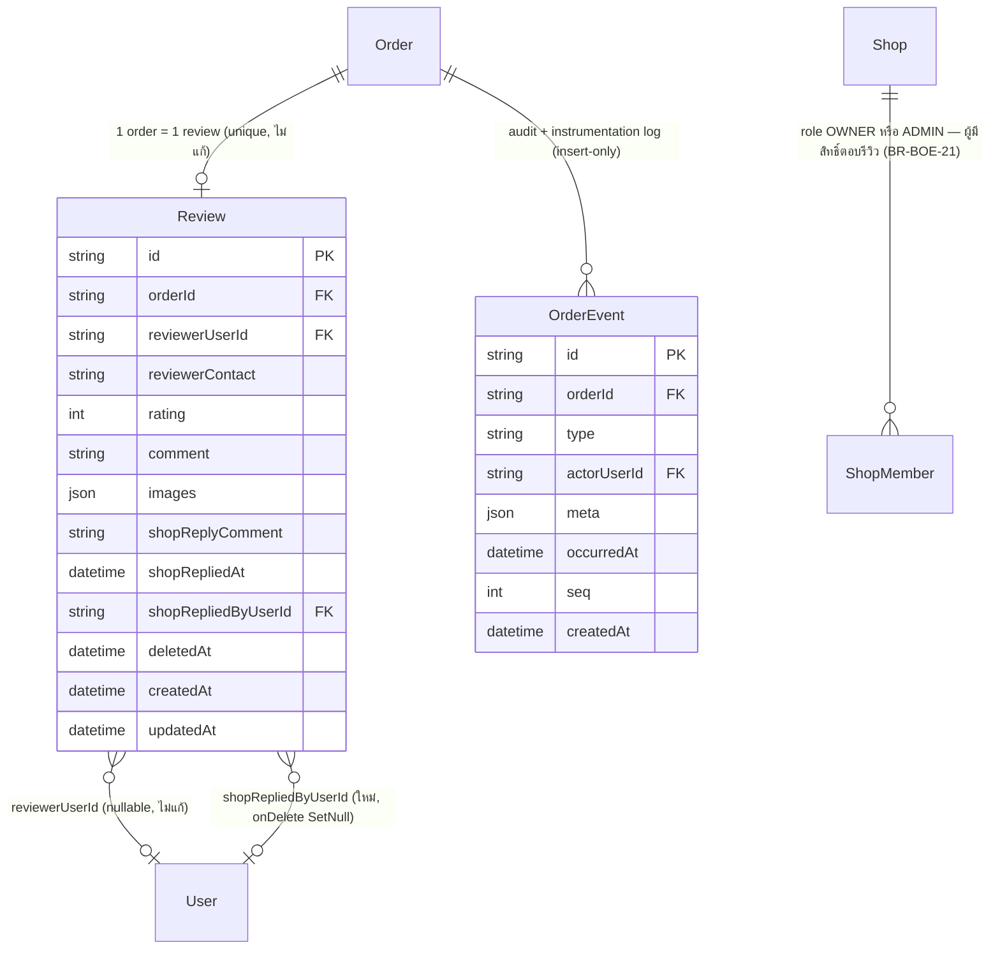

# DATABASE: ประสบการณ์ผู้ซื้อบนหน้าออเดอร์ (Buyer Order Experience)

> **โมดูล:** M00041-BuyerOrderExperience
> **ประเภทเอกสาร:** DATABASE Design
> **เวอร์ชัน:** 1.0
> **วันที่จัดทำ:** 2026-08-10
> **สถานะ:** Draft — พร้อมให้ Controller เขียนไฟล์ migration จริง
> **เจ้าของเอกสาร:** SA (`safepay-database`, ดู [[Feature-Docs-Ownership]])

---

## 1. Overview

โครงสร้างข้อมูลของฟีเจอร์นี้รองรับ [[SRS]] §5 (Data Requirements) ทั้งหมด — เอกสารนี้เขียนคู่ขนานกับ SDS (ลำดับปกติของ Feature-Docs-Ownership คือ PRD→BRD→SRS→SDS→DATABASE/API แต่ SRS §5 ล็อกการตัดสินใจ schema ไว้ครบพอต่อการออกแบบ migration แล้ว) — trace กลับ SRS TFR-ID/BRD FR-ID โดยตรง

งานทั้งหมดเป็นการ **แก้โมเดลที่มีอยู่แล้ว** ไม่มีตารางใหม่:

- **`Review`** — เพิ่มรูปแนบ, คำตอบร้าน (1 คำตอบต่อ 1 รีวิว), soft-delete, `updatedAt` — รองรับ TFR-007/008/009/010 (BR-BOE-17..23)
- **`OrderEvent`** — เพิ่ม 2 ค่าใน `type` CHECK constraint (`AUTH_FLOW_STARTED`/`AUTH_FLOW_COMPLETED`) — รองรับ TFR-013 (BR-BOE-25)
- **`Order`** — **ไม่มีการเปลี่ยนแปลง schema** — TFR-005/006 ขยาย `select` ของ `getOrderByToken()` เพิ่ม `carrierStatus`/`disputeOpenedAt`/`disputeResolvedAt` ซึ่งเป็นคอลัมน์ที่มีอยู่แล้ว (feature 00022/00039)

- **Store ที่เกี่ยวข้อง:** PostgreSQL 16 (Supabase) — store เดียว ผ่าน Prisma ORM ทั้งระบบ
- **Engine / Charset:** PostgreSQL 16, UTF8 (ตาม instance เดิม ไม่เปลี่ยนแปลง)

---

## 2. ERD



---

## 3. Tables

### 3.1 `Review` (PostgreSQL — Supabase, ผ่าน Prisma)

เก็บรีวิวของผู้ซื้อ 1 ใบต่อ 1 ออเดอร์ (`orderId @unique`) — ฟีเจอร์นี้เพิ่ม 3 ความสามารถบนโมเดลเดิม: รูปแนบ, คำตอบร้าน (inline ไม่แยกตาราง — เหตุผลใน SRS §5.1), soft-delete (กัน hard-delete ทำลายหน้าต่างแก้ไข 24 ชม. ตาม BR-BOE-17)

| Column | Type | Null | Default | Key |
|--------|------|------|---------|-----|
| `id` | `text` (uuid) | NO | `uuid()` (app-level) | PK |
| `orderId` | `text` | NO | — | FK → `Order.id` (`onDelete: Cascade`), UNIQUE |
| `reviewerUserId` | `text` | YES | `NULL` | FK → `User.id` (ไม่แก้) |
| `reviewerContact` | `text` | YES | `NULL` | — (ไม่แก้) |
| `rating` | `int4` | NO | — | — (ไม่แก้) |
| `comment` | `text` | YES | `NULL` | — (ไม่แก้) |
| **`images`** | `jsonb` | NO | `'[]'` | **ใหม่** — array ของ `fileId` string, ≤4 ใบ (app-layer cap, BR-BOE-19), ไม่มี DB CHECK |
| **`shopReplyComment`** | `text` | YES | `NULL` | **ใหม่** — คำตอบร้าน, `@db.Text` |
| **`shopRepliedAt`** | `timestamp(3)` | YES | `NULL` | **ใหม่** — มีค่า = ร้านตอบแล้ว |
| **`shopRepliedByUserId`** | `text` | YES | `NULL` | **ใหม่** — FK → `User.id` (`onDelete: SetNull`) |
| **`deletedAt`** | `timestamp(3)` | YES | `NULL` | **ใหม่** — soft-delete marker, มีค่า = ผู้ซื้อลบรีวิวนี้แล้ว |
| `createdAt` | `timestamp(3)` | NO | `now()` | — (ไม่แก้ — ยังเป็นฐานเวลาของหน้าต่างแก้ไข 24 ชม., ไม่มี `@updatedAt`) |
| **`updatedAt`** | `timestamp(3)` | NO | `CURRENT_TIMESTAMP` (แถวเดิม) / auto (แถวใหม่) | **ใหม่** — `@updatedAt`, audit ทั่วไป ไม่ใช่ requirement บังคับจาก BRD |

**หมายเหตุ:** `images`/`shopReplyComment` ไม่มี DB CHECK บังคับจำนวน/ความยาว — เพดาน 4 รูป (BR-BOE-19) และเพดานขนาดไฟล์ 10MB (BR-BOE-20) บังคับที่ **service layer เท่านั้น** (มิเรอร์ pattern เดิมของ `Product.images`/`Room.images`)

### 3.2 `OrderEvent` — แก้เฉพาะ CHECK constraint

ไม่มีคอลัมน์ใหม่ — เพิ่ม 2 ค่าที่อนุญาตใน `type` (String + DB CHECK, ไม่ใช่ Prisma enum ตาม convention เดิมของตารางนี้) สำหรับ TFR-013

| Column | Type | Null | Default | Key |
|--------|------|------|---------|-----|
| `type` | `text` | NO | — | ค่าที่อนุญาต (CHECK `OrderEvent_type_check`, unmanaged SQL): เดิม 15 ค่า **+ 2 ใหม่** (`AUTH_FLOW_STARTED`, `AUTH_FLOW_COMPLETED`) = **17 ค่า** |

ค่าใหม่ทั้งสองไม่ปรากฏในไทม์ไลน์ที่ผู้ใช้เห็น (`getOrderEvents()` กรองที่ service layer — ไม่มีผลต่อ schema) `actorUserId` เป็น `null` เสมอสำหรับ `AUTH_FLOW_STARTED` (guest เขียนได้โดยไม่ต้อง login)

### 3.3 `Order` — ไม่มีการเปลี่ยนแปลง schema

TFR-005/006 อ่านคอลัมน์ที่มีอยู่แล้วเพิ่มใน `getOrderByToken()`: `OrderShipment.carrierStatus` (feature 00022), `Order.disputeOpenedAt`/`disputeResolvedAt` (feature 00039, migration `20260808170000_order_success_metrics`) — ขยาย `select`/`include` ในโค้ด service เท่านั้น ไม่มี DDL

---

## 4. Indexes

| Table | Columns | Type | Rationale (query pattern ที่รองรับ) |
|-------|---------|------|--------------------------------------|
| `Review` | `(reviewerUserId, deletedAt)` | BTREE composite (**ใหม่**) | `getReviewsByBuyer()` + `prisma.review.count({ where: { reviewerUserId } })` (`m/settings/profile:96`, `(buyer-app)/dashboard:62`) — ทุกจุดต้องเติม `deletedAt: null` (§8) ⇒ query pattern จริงคือ equality บนทั้งสองคอลัมน์ · ก่อนหน้านี้ `Review` ไม่มี index บนคอลัมน์นี้เลยแม้ query จะกรองด้วยมันมาตั้งแต่แรก |
| `Review` | `(shopRepliedByUserId)` | BTREE (**ใหม่**) | กัน full table scan ตอนลบบัญชีพนักงาน/เจ้าของร้าน (`onDelete: SetNull` ต้องหาแถวลูกทั้งหมด) — pattern เดียวกับ `Order_createdByUserId_idx`/`OrderEvent @@index([actorUserId])` ที่มีอยู่แล้ว |
| `Review` | `(orderId)` | UNIQUE (**เดิม**) | ไม่แก้ — จุดเข้าถึงหลักของทุก query ที่ join ผ่าน `order: { shopId }` (Postgres หา `Order` ที่ match ก่อนด้วย index ของ `Order` แล้ว lookup `Review` ผ่าน unique index นี้) |
| `OrderEvent` | — | — | ไม่แก้ index — `@@index([orderId, occurredAt, seq])` เดิมครอบคลุม query ของ TFR-013/014 พอ (`WHERE orderId = X AND type IN (...)` ใช้ prefix ของ index เดิมได้; aggregate ข้ามทุกออเดอร์ใน TFR-014 เป็น script ที่รันครั้งคราว ไม่ใช่ real-time) |

**เหตุผลที่ไม่ทำ `@@index([shopId, deletedAt])` บน `Review`:** `Review` ไม่มีคอลัมน์ `shopId` (เข้าถึงร้านผ่าน `order.shopId` เสมอ) เทียบเท่าที่ใช้ได้จริงคือ index ของ `Order` ที่มีอยู่แล้ว (`@@index([shopId, status, createdAt])`) บวก `Review.orderId` unique — สองอันนี้ทำหน้าที่แทนกันได้ครบ

---

## 5. Migration Plan

### 5.1 ลำดับการ Migrate

| ลำดับ | การเปลี่ยนแปลง | Store | หมายเหตุ |
|-------|----------------|-------|----------|
| 1 | เพิ่มคอลัมน์ `Review.images/shopReplyComment/shopRepliedAt/shopRepliedByUserId/deletedAt/updatedAt` + FK + 2 index | PostgreSQL (Supabase) | ไม่มี dependency กับลำดับ 2 — รันสลับก่อน-หลังได้ |
| 2 | เพิ่ม `AUTH_FLOW_STARTED`/`AUTH_FLOW_COMPLETED` เข้า `OrderEvent_type_check` (อ่านค่าจาก `pg_get_constraintdef` ก่อนต่อท้าย) | PostgreSQL (Supabase) | ไม่มี dependency กับลำดับ 1 — **แต่มี dependency ข้าม branch** ต้องเช็ค timestamp ชนก่อน |

**timestamp ที่เสนอ** (ยืนยันแล้วว่า migration ล่าสุดในรีโปคือ `20260810100000_order_shop_channel`):
- Migration 1: `prisma/migrations/20260810110000_review_shop_reply_soft_delete/migration.sql`
- Migration 2: `prisma/migrations/20260810120000_order_event_auth_flow_types/migration.sql`

🛑 **เช็คซ้ำก่อน Write จริงเสมอ** เพราะ branch อื่นอาจสร้างเพิ่มระหว่างที่เอกสารรอ review:
```bash
git log --all --name-only --pretty=format: -- 'prisma/migrations/*' \
  | grep -oE '2026[0-9]{10}_[a-z_0-9]+' | sort -u | tail -5
```
ถ้าพบตัวใหม่กว่า **ให้เลื่อน timestamp ไปหลังตัวล่าสุดเสมอ ไม่ใช่แทรกก่อน** (ตัวที่รันทีหลังคือตัวที่ได้เห็นค่าของทุกคน)

**Migration 1 — `Review` (additive, safe):**

```sql
-- feature 00041 — Buyer Order Experience: คำตอบร้าน + รูปแนบ + soft-delete รีวิว
--
-- additive ล้วน: เพิ่ม 6 คอลัมน์ (ทุกตัว nullable หรือมี DEFAULT) + 1 FK (onDelete SetNull)
-- + 2 index ใหม่ — ไม่มี backfill, ไม่มี UPDATE, ไม่มี DROP, ไม่แตะแถวเดิมเลย
--
-- ข้อมูล prod ปัจจุบันมี Review แค่ 1 แถวทั้งระบบ (ยืนยัน 2026-08-10) — ความเสี่ยง
-- data-loss/long-lock ต่ำมาก ไม่ต้องมี data-migration script แยก

ALTER TABLE "Review"
  ADD COLUMN IF NOT EXISTS "images"              JSONB NOT NULL DEFAULT '[]',
  ADD COLUMN IF NOT EXISTS "shopReplyComment"     TEXT,
  ADD COLUMN IF NOT EXISTS "shopRepliedAt"        TIMESTAMP(3),
  ADD COLUMN IF NOT EXISTS "shopRepliedByUserId"  TEXT,
  ADD COLUMN IF NOT EXISTS "deletedAt"            TIMESTAMP(3),
  ADD COLUMN IF NOT EXISTS "updatedAt"            TIMESTAMP(3) NOT NULL DEFAULT CURRENT_TIMESTAMP;

-- FK: ผู้ตอบรีวิวเป็น Shop.userId (OWNER) หรือ ShopMember(role='ADMIN') เท่านั้น
-- (BR-BOE-21 บังคับที่ service layer — FK นี้แค่รับรอง referential integrity)
-- onDelete SET NULL มิเรอร์ Order.createdByUserId/OrderEvent.actorUserId ที่มีอยู่แล้ว:
-- ลบบัญชีพนักงานออกจากร้าน คำตอบที่เคยตอบไว้ต้องไม่หายตาม (เป็นประวัติสาธารณะของร้าน)
DO $$
BEGIN
  IF NOT EXISTS (
    SELECT 1 FROM pg_constraint
    WHERE conname = 'Review_shopRepliedByUserId_fkey'
      AND conrelid = '"Review"'::regclass
  ) THEN
    ALTER TABLE "Review"
      ADD CONSTRAINT "Review_shopRepliedByUserId_fkey"
      FOREIGN KEY ("shopRepliedByUserId") REFERENCES "User"("id") ON DELETE SET NULL;
  END IF;
END $$;

-- index 1: รีวิวของผู้ซื้อคนนี้ที่ยังไม่ถูกลบ — getReviewsByBuyer() + count ใน
-- m/settings/profile และ (buyer-app)/dashboard (Review ไม่เคยมี index บน reviewerUserId เลย
-- แม้ query จะกรองด้วยคอลัมน์นี้มาตั้งแต่แรก)
CREATE INDEX IF NOT EXISTS "Review_reviewerUserId_deletedAt_idx"
  ON "Review" ("reviewerUserId", "deletedAt");

-- index 2: กัน full table scan ตอนลบบัญชีพนักงาน/เจ้าของร้าน (onDelete SET NULL หาแถวลูก)
CREATE INDEX IF NOT EXISTS "Review_shopRepliedByUserId_idx"
  ON "Review" ("shopRepliedByUserId");
```

**Migration 2 — `OrderEvent.type` CHECK (อ่านของเดิมมาต่อท้าย — ห้าม hardcode):**

🛑 **ก่อนเขียนไฟล์นี้ ต้องรันคำสั่ง read-only นี้บนฐานปลายทางก่อน** (`docs/conventions/migration-check-constraint-additive.md` — เคยมีสอง branch DROP+ADD ทับกันแล้วลบค่าของกันเองเงียบ ๆ มาแล้วจริง 2026-08-06):

```sql
SELECT pg_get_constraintdef(oid) FROM pg_constraint WHERE conname='OrderEvent_type_check';
```

ผลที่คาดหวัง (ยืนยันจาก `src/lib/order-event.ts::ORDER_EVENT_TYPES` = **15 ค่า** ณ วันที่เขียน): `ORDER_CREATED, ORDER_EDITED, ORDER_CANCELLED, TRACKING_ADDED, SHIPMENT_CREATED, SHIPMENT_CANCELLED, SHIPMENT_LINKED, SMS_LINK_SENT, BUYER_CONFIRMED, COD_SETTLED, SYSTEM_CONFIRMED, PAYMENT_METHOD_SYNCED, ORDER_DATE_CHANGED, ORDER_DISPUTE_OPENED, ORDER_DISPUTE_RESOLVED` — **ถ้าผลจริงต่างจากนี้ ให้หยุดและสืบก่อน** (แปลว่ามี branch อื่นเพิ่มค่าไปแล้วโดยที่ `order-event.ts` ยังไม่ sync — DB คือ source of truth ของ CHECK ไม่ใช่ซอร์สโค้ด)

```sql
-- feature 00041 — instrumentation event 2 ชนิดใหม่ (TFR-013)
--
-- ยกแพตเทิร์นมาจาก 20260806150000_order_event_date_changed / 20260808170000_order_success_metrics
-- ทั้งก้อน (รวม sanity check)
-- 🛑 ห้าม DROP+ADD ด้วยรายชื่อ hardcode: สอง branch รันพร้อมกันแล้วตัวที่รันทีหลังลบค่าของ
-- ตัวแรกทิ้งเงียบ ๆ มาแล้วจริง (retro 2026-08-06)

DO $$
DECLARE
  def           text;
  vals          text;
  matched_count int;
  quote_count   int;
BEGIN
  SELECT pg_get_constraintdef(oid) INTO def
  FROM pg_constraint
  WHERE conname = 'OrderEvent_type_check'
    AND conrelid = '"OrderEvent"'::regclass;

  IF def IS NULL THEN
    -- ฐานที่ยังไม่มี constraint (เผื่อฐานทดสอบใหม่ล้วน) — ใส่ชุดที่ branch นี้รู้จักทั้งหมด
    ALTER TABLE "OrderEvent" ADD CONSTRAINT "OrderEvent_type_check" CHECK ("type" IN (
      'ORDER_CREATED', 'ORDER_EDITED', 'ORDER_CANCELLED', 'TRACKING_ADDED',
      'SHIPMENT_CREATED', 'SHIPMENT_CANCELLED', 'SHIPMENT_LINKED', 'SMS_LINK_SENT',
      'BUYER_CONFIRMED', 'COD_SETTLED', 'SYSTEM_CONFIRMED', 'PAYMENT_METHOD_SYNCED',
      'ORDER_DATE_CHANGED', 'ORDER_DISPUTE_OPENED', 'ORDER_DISPUTE_RESOLVED',
      'AUTH_FLOW_STARTED', 'AUTH_FLOW_COMPLETED'
    )) NOT VALID;
    ALTER TABLE "OrderEvent" VALIDATE CONSTRAINT "OrderEvent_type_check";

  ELSIF position('AUTH_FLOW_STARTED' IN def) = 0 THEN
    SELECT string_agg(quote_literal(m[1]), ', '), count(*)
    INTO vals, matched_count
    FROM regexp_matches(def, '''([A-Za-z0-9_]+)''', 'g') AS m;

    -- ล้มเสียงดังดีกว่าลบค่าทิ้งเงียบ ๆ: จำนวนค่าที่ regex จับได้ × 2 ต้องเท่ากับจำนวน quote เดิม
    quote_count := regexp_count(def, '''');
    IF matched_count IS NULL OR matched_count * 2 <> quote_count THEN
      RAISE EXCEPTION
        'OrderEvent_type_check: regex จับค่าได้ % รายการ แต่พบ quote ในนิยามเดิม % ตัว — def=%',
        matched_count, quote_count, def;
    END IF;

    ALTER TABLE "OrderEvent" DROP CONSTRAINT "OrderEvent_type_check";
    EXECUTE format(
      'ALTER TABLE "OrderEvent" ADD CONSTRAINT "OrderEvent_type_check" CHECK ("type" = ANY (ARRAY[%s, ''AUTH_FLOW_STARTED'', ''AUTH_FLOW_COMPLETED'']::text[])) NOT VALID',
      vals
    );
    ALTER TABLE "OrderEvent" VALIDATE CONSTRAINT "OrderEvent_type_check";
  END IF;
  -- มีค่าอยู่แล้ว = ไม่ทำอะไร (idempotent รันซ้ำได้)
END $$;
```

**หลัง apply ต้องยืนยันด้วย query เดิมซ้ำ** — ไม่เชื่อว่า `migrate deploy` สำเร็จ = ค่าอยู่ครบ (บทเรียน 2026-08-06 ที่ migration รายงานสำเร็จทุกไฟล์แต่ค่าหายจริงบนฐาน) ต้องเห็นครบ 17 ค่า

### 5.2 Rollback

**Migration 1 (`Review`):**
```sql
ALTER TABLE "Review" DROP CONSTRAINT IF EXISTS "Review_shopRepliedByUserId_fkey";
DROP INDEX IF EXISTS "Review_reviewerUserId_deletedAt_idx";
DROP INDEX IF EXISTS "Review_shopRepliedByUserId_idx";
ALTER TABLE "Review"
  DROP COLUMN IF EXISTS "images",
  DROP COLUMN IF EXISTS "shopReplyComment",
  DROP COLUMN IF EXISTS "shopRepliedAt",
  DROP COLUMN IF EXISTS "shopRepliedByUserId",
  DROP COLUMN IF EXISTS "deletedAt",
  DROP COLUMN IF EXISTS "updatedAt";
```
🛑 **ข้อจำกัดที่ต้องรู้ก่อนกด:** ถ้ามีรีวิวที่ถูก soft-delete จริงแล้ว (`deletedAt IS NOT NULL`) การ `DROP COLUMN "deletedAt"` จะทำให้แถวเหล่านั้น **กลับมาแสดงเป็นรีวิวปกติทันที** (เพราะไม่เคยถูกลบจริงในระดับ DB) — rollback นี้ปลอดภัยเฉพาะตอนที่ยังไม่มี traffic จริงผ่านฟีเจอร์ลบรีวิว ถ้ามีแล้วต้องเขียนแผนชดเชยแยกก่อน (แจ้งผู้ซื้อว่ารีวิวที่ลบไปกลับมาแสดงอีกครั้ง)

**Migration 2 (`OrderEvent.type` CHECK):**
- **ไม่แนะนำ rollback แบบ DROP ค่าออก** ถ้ามีแถวที่ใช้ค่านั้นแล้ว (constraint ใหม่จะ invalid ทันที ต้องลบแถวก่อน = ทำลาย audit log)
- **rollback ที่ปลอดภัยกว่าเสมอ:** ปล่อยค่าทั้ง 2 ไว้ใน CHECK ต่อไป (ไม่มีผลเสียถ้าไม่มีโค้ดเขียนค่านี้) แล้ว rollback เฉพาะโค้ดฝั่ง service ที่เขียน event แทน

### 5.3 ผลกระทบ (Impact)

- **Downtime:** ไม่มี — additive ล้วน ไม่มี `ALTER COLUMN TYPE`/rename/rewrite ตาราง
- **Lock ตารางใหญ่:** ไม่มีความเสี่ยง — `Review` มี 1 แถวบน prod และ `OrderEvent` แม้โตเร็วที่สุดในระบบ (insert-only) แต่ `ADD CONSTRAINT ... NOT VALID` ไม่ scan ตาราง (ต่างจาก `ADD CONSTRAINT` ธรรมดาที่ถือ `ACCESS EXCLUSIVE` ตลอดการ validate) ตามด้วย `VALIDATE CONSTRAINT` ที่ใช้ `SHARE UPDATE EXCLUSIVE` เท่านั้น (ไม่บล็อก read/write)
- **ข้อมูลเดิม:** ไม่มี backfill/UPDATE เลย — แถวเดียวที่มีอยู่จะได้ `images='[]'`, `deletedAt=NULL`, `updatedAt=<เวลา migrate>` ตรงตามพฤติกรรมที่ต้องการ
- 🛑 **Backward compatibility คือความเสี่ยงจริงของ migration ชุดนี้ ไม่ใช่ตัว DDL** — เมื่อ `Review.deletedAt` มีในฐานแล้วแต่โค้ดยังไม่ implement การลบ จะไม่มีใครเขียนค่านี้ (ปลอดภัย) แต่ทุก read path **ยังไม่กรอง `deletedAt: null`** จนกว่า dev จะแก้ตาม §8 — migration นี้ **ไม่ทำให้เกิดบั๊กทันที** แต่เป็นหนี้ที่ต้องปิดพร้อมกับที่ dev ship TFR-009 ไม่ใช่ก่อนหน้านั้น
- **Consistency ข้าม store:** ไม่มี — store เดียว

---

## 6. Retention / ข้อควรระวัง

- **Data Retention:** ไม่เปลี่ยนจากเดิม — แถวที่ `deletedAt IS NOT NULL` **อยู่ในฐานถาวร** ไม่มี purge job (ต่างจาก `User.deletedAt`/`Shop.deletedAt` ที่มี cron purge จริงตามด้วย `purgedAt`) เพราะจุดประสงค์ของ `deletedAt` ที่นี่คือ **กันตัวจับเวลาหน้าต่างแก้ไข 24 ชม. รีเซ็ต** (BR-BOE-17) ไม่ใช่ retention/compliance — ถ้าอนาคตต้องมี "ลบถาวรจริง" (เช่น GDPR request) ต้องเป็นงานแยกที่ประเมินผลกระทบต่อ `canEditReview()` ใหม่
- **PII / ข้อมูลอ่อนไหว:** `Review.comment`/`shopReplyComment` เป็นข้อความอิสระที่ผู้ใช้พิมพ์เอง (เสี่ยงมี PII หลุดเข้ามาเหมือน comment อื่นในระบบ — ความเสี่ยงที่มีอยู่ก่อนแล้ว ไม่ใช่ของใหม่) · `images` เก็บแค่ `fileId` ไม่ใช่ URL ดิบ (ผ่าน `/api/files/{fileId}` gate เหมือน `Product.images`) · `shopRepliedByUserId` ไม่ expose ตรงไป guest view ต้อง join เอา `displayName` มาแสดงแทนเสมอ
- **Performance:** `Review` เป็นตารางเล็กมาก (1 แถวบน prod) คาดว่ายังเล็กต่อไปอีกนาน (1 review : 1 order และไม่ใช่ทุกออเดอร์จะถูกรีวิว) · `OrderEvent` โตเร็วกว่าตารางอื่นแต่ migration นี้ไม่เพิ่ม column ให้ตารางนั้นเลย จึงไม่เพิ่ม storage/write cost ต่อแถว

---

## 7. Traceability

| Table / Column | SRS TFR-ID / BRD | สถานะ |
|--------|--------------------|-------|
| `Review.images` | TFR-008 (FR-015); BR-BOE-19/20 | Draft |
| `Review.shopReplyComment`/`shopRepliedAt`/`shopRepliedByUserId` | TFR-007 (FR-014); BR-BOE-21/22/23 | Draft |
| `Review.deletedAt` | TFR-009 (FR-016); BR-BOE-17/18 | Draft |
| `Review.updatedAt` | — (audit ทั่วไป ไม่ผูก FR ตรง — SRS §5.1) | Draft |
| `OrderEvent.type` (+2 ค่า) | TFR-013 (FR-021); BR-BOE-25 | Draft |
| `Order` (select ขยาย ไม่มี DDL) | TFR-005/006 | Verified — ไม่ต้อง migration |

---

## 8. ผลกระทบต่อ query ที่มีอยู่ (Query Impact)

> 🛑 ไล่ทุกจุดที่แตะ `prisma.review.*` ในรีโป (**26 จุดใน 15 ไฟล์ — 2 ไฟล์เป็นเทส**) — จุดในตาราง §8.1 ต้องเติม `deletedAt: null` **พร้อมกับที่ dev ship TFR-009 (ลบรีวิว)** ไม่ใช่ optional cleanup: **ลืมกรองแม้จุดเดียว รีวิวที่ถูกลบจะโผล่กลับมาให้ผู้ใช้เห็น** (SRS §8)

### 8.1 ต้องเติม `deletedAt: null`

| ไฟล์ | ฟังก์ชัน/query | ทำไมต้องกรอง |
|------|----------------|----------------|
| `src/services/review.service.ts:52` | `getReviewsByBuyer()` | รายการรีวิวที่ผู้ซื้อเคยเขียน — ต้องไม่แสดงใบที่ลบไปแล้ว |
| `src/services/review.service.ts:69` | `getReviewsByShopUser()` | หน้าร้านเห็นรีวิวของตัวเอง (`seller/(dashboard)/reviews`) |
| `src/services/review.service.ts:77` | `getReviewsByUsername()` | รีวิวสาธารณะบนโปรไฟล์ `/u/[username]` — จุดที่คนภายนอกเห็นง่ายที่สุด |
| `src/services/review.service.ts:91-99` | **`getAvgRatingByUsername()`** | 🛑 **กระทบคะแนนเฉลี่ยของร้านโดยตรง** — `_avg`/`_count` ต้องไม่รวมรีวิวที่ถูกลบ ไม่งั้นค่าเฉลี่ยที่แสดงผิดจากรีวิวที่มองเห็นได้จริง |
| `src/services/review.service.ts:104-116` | `getAvgRatingByShop()` | เทียบเท่าตัวบนแต่ scope `shopId` (Business shop) — ต้องกรองเหมือนกันเป๊ะ ไม่งั้นสองสูตรที่ควรตรงกันจะเพี้ยน (คลาสเดียวกับ HR16) |
| `src/app/(marketing)/(buyer-app)/dashboard/page.tsx:62` | `prisma.review.count({ where: { reviewerUserId } })` | ตัวนับ "รีวิวของฉัน" บนแดชบอร์ดผู้ซื้อ |
| `src/app/(marketing)/m/settings/profile/page.tsx:96` | `prisma.review.count({ where: { reviewerUserId } })` | ตัวนับเดียวกันบนหน้าโปรไฟล์ — **ตัวเลขเดียวกันโผล่ 2 ที่ ต้องกรองเหมือนกัน** (HR16) |
| `src/app/(paces)/admin/(dashboard)/dashboard/page.tsx:48` | `prisma.review.aggregate({ _avg: { rating } })` | Avg Rating บน admin dashboard |
| `src/app/api/admin/dashboard/route.ts:29` | เหมือนบรรทัดบน (API คู่กับหน้า admin) | ตัวเลขเดียวกัน 2 ที่ — ควรรวมเป็น query เดียวที่เรียกร่วมกันตอน implement ไม่ใช่แก้แยก |
| `src/app/(marketing)/b/[slug]/page.tsx:139-145` | `findMany({ where: { order: { shopId } }, take: 10 })` | รีวิวบนโปรไฟล์สาธารณะร้าน BUSINESS (`/b/[slug]`) |
| `src/services/app-shop.service.ts:19-25` | `ratingFor()` | คะแนนร้านที่แสดงในแอปมือถือฝั่งผู้ซื้อ |
| `src/services/app-shop.service.ts:60-66` | `findMany` แบบ batch (การ์ดร้านหลายร้าน) | เหมือนบรรทัดบน แต่กัน N+1 — กรองที่ `where` เดียวกัน |
| `src/services/app-shop.service.ts:218-225` | `getShopReviews()` | รีวิวบนหน้าโปรไฟล์ร้านในแอปมือถือ |
| `src/services/shop.service.ts:296-300` | `groupBy({ by: ["rating"] })` | แจกแจงจำนวนรีวิวตามดาว (rating breakdown) |
| `src/services/order.service.ts:1656-1663` | `ratingAgg` ใน dashboard summary | ค่าเฉลี่ย+จำนวนรีวิวบน seller dashboard |
| `src/services/order.service.ts:1667-1673` | `latestReview` (`comment: { not: null }`) | "คำพูดลูกค้า" ล่าสุด — ใบที่ถูกลบต้องไม่ถูกยกมาโชว์ |
| `src/services/trust-score.service.ts:78-84` | `calcRatingScore()` | 🛑 **กระทบ Trust Score โดยตรง** — คะแนนความน่าเชื่อถือต้องไม่ถูกลากด้วยรีวิวที่ผู้ซื้อลบไปแล้ว |
| `src/services/badge.service.ts:152-161` | `checkPerfectRating()` | เกณฑ์ปลดล็อกเหรียญ — รีวิวที่ลบแล้วไม่ควรนับเข้าเงื่อนไข "5 ดาวทุกใบ" |
| `src/services/badge.service.ts:172-181` | `checkHighRating()` | เหตุผลเดียวกับบรรทัดบน |
| `src/services/badge.service.ts:317-324` | `checkUniqueReviewers()` | ผู้ซื้อที่ลบรีวิวแล้วไม่ควรถูกนับเป็น unique reviewer |
| `src/services/badge.service.ts:1170-1179` | `recentRows` (unique reviewer 30 วันล่าสุด, progress estimate) | เหตุผลเดียวกับบรรทัดบน |
| `src/services/activity.service.ts:107-115` | `reviews` (ฟีดกิจกรรมร้าน "ได้รับรีวิว N ดาว") | ฟีดต้องไม่มีรีวิวที่ถูกลบปนอยู่ |

### 8.2 ต้อง **ไม่** เติม `deletedAt: null` (เหตุผลเจาะจง)

| ไฟล์ | query | เหตุผล |
|------|-------|--------|
| `src/services/review.service.ts:9-14` | `createReview()` — `include: { review: true }` แล้ว `if (order.review) throw` | 🛑 **ต้องไม่กรองโดยตั้งใจ** — นี่คือกลไกหลักที่ทำให้ soft-delete ทำงานตาม SRS §8: แถวที่ `deletedAt IS NOT NULL` ยังต้องทำให้ guard นี้ throw เพื่อกัน "ลบแล้วสร้างใหม่" ที่จะรีเซ็ตหน้าต่าง 24 ชม. — **ถ้าใครมาเติม `deletedAt: null` ตรงนี้ทีหลังเพราะเข้าใจผิดว่าต้อง sync ตาม §8.1 จะเปิดช่องโหว่กลับมาทันที** |
| `src/services/user.service.ts:101-104` | `linkBuyerHistory()` — `updateMany({ where: { reviewerUserId: null, OR: [...] } })` | เป็นการ**ผูกความเป็นเจ้าของ** (ตั้ง `reviewerUserId`) ไม่ใช่การอ่าน/แสดง/คำนวณ — รีวิวที่ถูกลบแล้วผูกกับบัญชีที่เพิ่งสมัครก็ไม่กระทบอะไร (ไม่แสดง ไม่ถูกนับที่ไหนเพราะ §8.1 กรองไว้หมดแล้ว) |

### 8.3 จุดที่ต้องระวังตอนสร้างของใหม่

- **TFR-014 (`scripts/metrics/00041-buyer-order-experience-kpi.sql`, Review Rate query)** — SRS เขียน `LEFT JOIN "Review" r ON r."orderId" = o.id` โดยยังไม่มีเงื่อนไข `deletedAt` เมื่อ dev สร้างสคริปต์จริงต้องเพิ่ม (`AND r."deletedAt" IS NULL` ใน `ON`) ไม่งั้น KPI "Review Rate" จะนับออเดอร์ที่รีวิวถูกลบไปแล้วว่า "มีรีวิว"

---

## 9. สรุป (Summary)

เอกสารนี้กำหนดโครงสร้างข้อมูลของ **00041 — Buyer Order Experience** ให้ Controller สร้าง migration จริง (2 ไฟล์ additive ล้วน ไม่มี DROP/rename/data-loss) ตาม `docs/conventions/migration-check-constraint-additive.md` และให้ QA เข้าใจ data model เพื่อวางแผนทดสอบ soft-delete + คำตอบร้าน + instrumentation

**สิ่งที่ต้องทำก่อน implement:**
- ยืนยัน `SELECT pg_get_constraintdef(...)` บนฐานปลายทางก่อนรัน Migration 2 — ถ้าไม่ตรงกับ 15 ค่าที่ระบุ ให้หยุดและสืบก่อน ไม่ใช่รันทับ
- เช็ค timestamp migration ชนกับ branch อื่นซ้ำก่อน Write
- `docs/SRS.md` (เอกสารระบบรวม) ต้อง sync ตาม HR11 เมื่อ implement เสร็จ — ไม่ใช่แค่ feature docs
