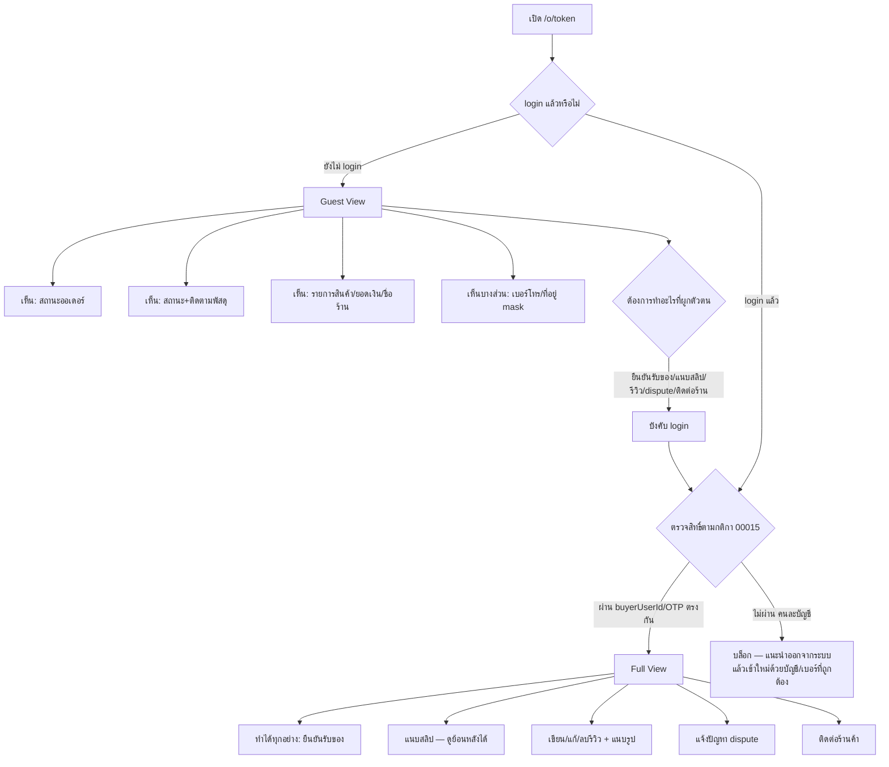
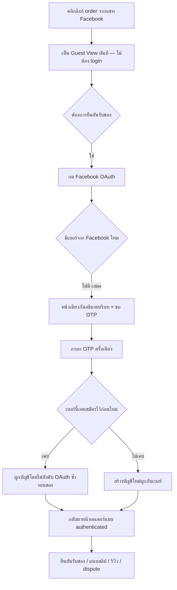

# PRD: ประสบการณ์ผู้ซื้อบนหน้าออเดอร์ (Buyer Order Experience)

> **โมดูล:** M00041-BuyerOrderExperience
> **ประเภทเอกสาร:** Product Requirements Document (PRD)
> **เวอร์ชัน:** 1.0
> **วันที่จัดทำ:** 2026-08-10
> **สถานะ:** Draft — decision D-1..D-3 ล็อกแล้วโดย user (2026-08-10, อิงข้อมูล prod จริง — ดู §10.2) เหลือ BRD (User Story/AC) → SRS/SDS/API/DATABASE/TestCase ก่อน implement
> **เจ้าของเอกสาร:** BA + PO + PM (ดู [[Feature-Docs-Ownership]])

---

## Executive Summary

หน้า `/o/{token}` คือจุดเดียวที่ผู้ซื้อของ Deep สัมผัสกับแพลตฟอร์มโดยตรง และเป็นจุดกำเนิดของข้อมูลที่ระบบ Trust/Reputation ทั้งหมดต้องใช้ — แต่ข้อมูล prod จริง (2026-08-10) แสดงว่าเส้นทางนี้แทบไม่ทำงาน: จากออเดอร์ที่สำเร็จ **73 ใบ ผู้ซื้อไม่มีบัญชี 72 ใบ**, เหตุการณ์ **`BUYER_CONFIRMED` (ผู้ซื้อกดยืนยันเอง) เท่ากับ 0** ตลอดประวัติศาสตร์ระบบ (ทุกใบปิดด้วย `SYSTEM_CONFIRMED`/`COD_SETTLED` แทน), ร้านค้าไม่เคยส่งลิงก์ผ่าน SMS แม้แต่ครั้งเดียว (**`SMS_LINK_SENT` = 0** ทั้งที่ออเดอร์มีเบอร์ครบ 73/73 — ยืนยันแล้วว่าไม่ใช่เพราะ "ไม่มีใครอยากส่ง" แต่เพราะ "ส่งไปก็ใช้ไม่ได้") และมีรีวิวเกิดขึ้นจริงเพียง **1 ใบทั้งระบบ**

feature 00015 (Order Claim & Forced Login) เขียนความเสี่ยงนี้ไว้เองตั้งแต่ต้นว่า *"Buyer เลิกกลางคันเพราะถูกบังคับ login"* ความรุนแรง **สูง** และกำหนดวิธีรับมือคือติดตาม **Login Completion Rate** เป็น KPI — แต่ผลจริงคือ **0/73 = 0% และ KPI นั้นไม่เคยถูกวัดเลย** เพราะไม่มีกลไกบันทึกเหตุการณ์นี้ตั้งแต่แรก เส้นทางที่ผู้ซื้อเจอบ่อยที่สุด (มาจาก Facebook 71/73 ใบ) ยาวถึง **6–7 หน้าจอ 14–16 การกระทำ** เพราะ Facebook ไม่คืนเบอร์โทรกลับมา ผู้ซื้อจึงต้องพิมพ์เบอร์ของตัวเองที่ระบบรู้อยู่แล้ว (แต่โชว์ให้ดูไม่ได้ด้วยเหตุผล PII) และอาจถูกเด้งไป OAuth Facebook ซ้ำรอบสองถ้าเบอร์นั้นเคยสมัครไว้ก่อน

ผลพวงของช่องว่างนี้ลามไปถึง **Trust Score ทั้งระบบนิ่งสนิท** — ช่องคะแนนรีวิว (20/100 คะแนน) เป็น 0 ทุกร้านเพราะต้องมีรีวิว ≥3 ใบ ขณะที่ทั้งระบบมี 1 ใบ (ดู feature 00040 Trust Score v2) ต้นตอไม่ใช่สูตรคะแนนผิด แต่คือ **ฝั่งผู้ซื้อไม่เคยถูกจูงใจให้เข้ามาในระบบเลย** เพราะประสบการณ์ที่เจอเมื่อเข้ามาคือขั้นตอนยาก, สลิปหาย, ไม่เห็นสถานะพัสดุ, ไม่มีทางแจ้งปัญหา และรีวิวก็ทำได้แค่ให้ดาวครั้งเดียวแล้วแก้ไม่ได้อีกเลย

ฟีเจอร์นี้จึงเป็นการ **redesign ประสบการณ์ผู้ซื้อทั้งเส้นบนหน้า `/o/{token}`** — เปิดมุมมองแบบ guest ที่จำกัดข้อมูลได้ (**ย้อนมติบางส่วนของ feature 00015 โดยเจตนาของ user เท่านั้น ไม่ใช่ทีมพัฒนาตัดสินเอง** — ดู D-1), ลดขั้นตอนเส้นทาง Facebook, ทำให้สลิป/สถานะพัสดุ/แจ้งปัญหา/ติดต่อร้านใช้งานได้จริง, เปิดระบบรีวิว 3 ข้อที่ยังขาด, ทำให้หน้าตอบสนองทุกขนาดจอ และปิดช่องโหว่ Hard Rule 16 ที่ผู้ซื้อกับผู้ขายเห็นคำอธิบายสถานะออเดอร์เดียวกันไม่ตรงกัน เป้าหมายสุดท้ายไม่ใช่แค่ "หน้าสวยขึ้น" แต่คือทำให้ตัวเลข `BUYER_CONFIRMED`, `SMS_LINK_SENT`, และจำนวนรีวิว **ขยับได้จริงเป็นครั้งแรก** ซึ่งเป็นเงื่อนไขเบื้องต้นก่อนที่ Trust Score v2 (00040) จะมีความหมายอะไรเลย

---

## 1. Business Goals & KPIs

### 1.1 เป้าหมายทางธุรกิจ

| เป้าหมาย | รายละเอียด |
|----------|-----------|
| **ผู้ซื้อเข้าระบบได้จริง ไม่ใช่แค่ทฤษฎีว่าเข้าได้** | เปลี่ยน `BUYER_CONFIRMED` จาก 0 ให้เริ่มขยับ — ลดความยาก/ความยาวของขั้นตอนที่ทำให้ผู้ซื้อเลิกกลางคัน โดยเฉพาะเส้นทาง Facebook ที่เจอบ่อยที่สุด |
| **ให้ผู้ซื้อเห็นคุณค่าก่อนถูกขอให้ล็อกอิน** | เปิด guest view แบบจำกัดตามมติ D-1 เพื่อให้คนที่ได้ลิงก์เห็นว่าออเดอร์นี้มีจริง มีความคืบหน้าจริง ก่อนตัดสินใจสมัครสมาชิก แทนที่จะเจอกำแพง login ทันทีที่เปิดลิงก์ |
| **ปิดช่องว่างที่ทำให้ SMS Order Link ใช้งานไม่ได้จริง** | `SMS_LINK_SENT = 0` เพราะหน้าปลายทางใช้งานไม่ได้ (สลิปพัง, ไม่ responsive) ไม่ใช่เพราะร้านไม่ต้องการฟีเจอร์นี้ — ฟีเจอร์นี้ซ่อมหน้าปลายทางก่อน (**ไม่แก้ด้วยการยิงลิงก์อัตโนมัติเข้าแชท** ซึ่ง user สั่งห้ามชัดเจน) |
| **ทำให้ระบบรีวิวมีเหตุผลให้คนใช้จริง** | เพิ่มร้านตอบกลับ/แนบรูป/แก้ไขได้ในเวลาจำกัด (D-2) เพื่อให้รีวิวมีมูลค่าสำหรับทั้งผู้ซื้อและร้าน — เป็นเงื่อนไขเบื้องต้นก่อนที่ช่องคะแนนรีวิวใน Trust Score จะขยับได้ (00040 อ้างอิงเดียวกัน) |
| **เปิดทางแก้ปัญหาที่มีอยู่แล้วแต่ไม่มีใครใช้** | ปุ่ม "ยังไม่ได้รับสินค้า" และ "ติดต่อร้านค้า" ที่วันนี้ disable ทั้งที่ backend สมบูรณ์ (dispute API จาก 00039, `/messages/[shopId]`) — เปิดใช้จริง (D-3) |
| **ทุก KPI ที่ประกาศต้องวัดได้จริง ไม่ใช่แค่ตั้งเป้าลอย ๆ** | 00015 เคยประกาศ Login Completion Rate เป็น KPI แต่ไม่เคยมีกลไกวัด — ฟีเจอร์นี้ต้องส่งมอบกลไกบันทึกเหตุการณ์ควบคู่กับ KPI ทุกตัว (ดู §3.9) |

### 1.2 ตัวชี้วัดความสำเร็จ (KPIs)

| KPI | คำอธิบาย | เป้าหมาย |
|-----|----------|---------|
| **Login Completion Rate** | สัดส่วนครั้งที่ผู้ซื้อเริ่ม auth flow จากหน้า `/o/{token}` (กดปุ่ม login/OTP ใด ๆ) แล้วกลับมาเห็นหน้าออเดอร์แบบ authenticated สำเร็จ — วัดจาก **เหตุการณ์ 2 จุดที่ต้องสร้างใหม่**: "เริ่ม auth flow จาก token นี้" กับ "auth สำเร็จแล้วกลับมาที่ token เดิม" (ยังไม่มี table/event รองรับวันนี้ — เป็นส่วนหนึ่งของ definition-of-done ดู §3.9 ไม่ใช่ nice-to-have) | ≥ 50% ภายใน 30 วันหลัง launch (baseline ปัจจุบัน = ไม่เคยวัดได้ = ต่ำกว่านี้แน่นอน) |
| **Buyer Confirm Rate** | สัดส่วนออเดอร์ที่ปิดจบด้วย `OrderEvent.type = 'BUYER_CONFIRMED'` เทียบกับออเดอร์ที่ปิดจบทั้งหมด (`BUYER_CONFIRMED` + `SYSTEM_CONFIRMED` + `COD_SETTLED`) ในช่วงเวลาเดียวกัน — วัดจากตาราง `OrderEvent` ที่มีอยู่แล้ว ไม่ต้องสร้างใหม่ | > 0% ภายใน 30 วันแรกหลัง launch (baseline ปัจจุบัน = 0/73 = 0% ตลอดประวัติศาสตร์ระบบ) |
| **Review Rate** | สัดส่วนออเดอร์สำเร็จที่มี `Review` ผูกอยู่ (`Review.orderId` ไม่ null) เทียบกับออเดอร์สำเร็จทั้งหมดในช่วงเวลาเดียวกัน — วัดจาก join ตาราง `Order` + `Review` ที่มีอยู่แล้ว | ≥ 10% ภายใน 60 วันหลัง launch (baseline = 1/73 ≈ 1.4%) |
| **SMS Link Effective Send Rate** | จำนวนครั้งที่ร้านกดส่ง SMS Order Link จริง (`WalletTransaction` ประเภท DEDUCT ที่ผูกกับ order link) หลัง launch — วัดจาก service เดิม `wallet.service`/`sms-code.service` ที่มีอยู่แล้ว | > 0 ครั้งภายใน 14 วันหลัง launch (baseline = 0 ครั้งตลอดประวัติศาสตร์ระบบ — เป็นสัญญาณว่าหน้าปลายทางใช้งานได้จริงแล้ว) |

### 1.3 ขอบเขตการส่งมอบ

- **Phase A (ขอบเขตของ PRD/BRD ฉบับนี้):** guest view จำกัด (D-1) + ลดขั้นตอนเส้นทาง Facebook + แก้บั๊กสลิป (แนบไม่ได้/ดูย้อนหลังไม่ได้) + เปิดสถานะพัสดุให้ผู้ซื้อเห็น + เปิดปุ่ม dispute/ติดต่อร้าน (D-3) + รีวิว 3 ข้อ (D-2) + responsive จริง + รวมหน้าเข้าเป็นส่วนหนึ่งของแอปผู้ซื้อ + นิยามสถานะออเดอร์เดียวกันทั้งระบบ (HR16) + instrumentation ของ 3 KPI หลัก
- **Phase 2 (นอกขอบเขต — ดู §5):** รีวิวรายสินค้า (ต้องรื้อ schema `Review.orderId @unique`), Trust Score v2 (00040 — แยกฟีเจอร์ที่พึ่งพาผลลัพธ์ของฟีเจอร์นี้), ย้าย `OrderDetailMobile` ไป direct upload เต็มรูป (หนี้ที่บันทึกไว้แล้วใน `docs/conventions/upload-body-size-limit.md`, ไปกับรอบ build), การส่งลิงก์อัตโนมัติเข้าแชท

---

## 2. User Personas (กลุ่มผู้ใช้งาน)

### 2.1 ผู้ซื้อหน้าใหม่ที่มาจาก Facebook (กลุ่มที่ใหญ่ที่สุด — 71/73 ใบ)

**ข้อมูลพื้นฐาน:**
- คลิกลิงก์ออเดอร์ที่ร้านส่งมาทางแชท Facebook — ยังไม่เคยมีบัญชี Deep มาก่อน (ตรงกับ 72/73 ใบที่ผู้ซื้อไม่มีบัญชี)
- ล็อกอินด้วยปุ่ม Facebook เพราะเป็นปุ่มบนสุดของหน้า sign-in และเป็นแอปที่เพิ่งใช้อยู่แล้ว

**เป้าหมาย:**
- อยากรู้ว่าออเดอร์ที่สั่งไปสถานะเป็นอย่างไร และยืนยันว่าได้รับของแล้วให้เร็วที่สุด โดยไม่อยากกรอกข้อมูลซ้ำที่ระบบรู้อยู่แล้ว

**ความต้องการ:**
- เปิดลิงก์แล้วเห็นข้อมูลพื้นฐานได้ทันทีโดยไม่ต้อง login (สถานะ/สินค้า/ยอดเงิน) และเมื่อจะทำอะไรที่ต้อง login ขั้นตอนต้องสั้นที่สุดเท่าที่ความปลอดภัยจะยอมให้

**จุดปวด (Pain Points):**
- 🛑 Facebook ไม่คืนเบอร์โทรกลับมา ทุกครั้งต้องตกไป `PHONE_VERIFY_REQUIRED` แล้วพิมพ์เบอร์ตัวเองที่ระบบมีอยู่แล้ว (แต่โชว์ไม่ได้เพราะ PII) รอ OTP และถ้าเบอร์นั้นเคยสมัครไว้ก่อนจะถูกเด้งไป OAuth Facebook ซ้ำรอบสอง — รวมทั้งเส้น **6-7 หน้าจอ 14-16 การกระทำ** กว่าจะเห็นหน้าออเดอร์

### 2.2 ผู้ซื้อที่ยังไม่พร้อมสมัครสมาชิก (Guest ที่ต้องการแค่ดู)

**ข้อมูลพื้นฐาน:**
- ได้ลิงก์ต่อจากคนอื่น หรือแค่อยากเช็คสถานะเร็ว ๆ โดยไม่มีความตั้งใจจะสมัครสมาชิกตอนนี้

**เป้าหมาย:**
- ดูสถานะออเดอร์/พัสดุได้โดยไม่ต้องผ่านขั้นตอน login ใด ๆ

**ความต้องการ:**
- เห็นข้อมูลพื้นฐานพอที่จะมั่นใจว่าออเดอร์นี้คือของตน (ไม่ต้องเห็นข้อมูลส่วนตัวเต็มรูปของคนอื่นถ้าลิงก์หลุดไปมือคนอื่น)

**จุดปวด (Pain Points):**
- ระบบเดิม (หลัง 00015) บังคับ login ทันทีที่เปิดลิงก์ ไม่เห็นอะไรเลยแม้แต่สถานะพื้นฐาน — เป็นกำแพงที่สูงเกินไปสำหรับคนที่แค่อยากเช็คสถานะ ทำให้ 00015 เองก็บันทึกความเสี่ยงนี้ไว้ว่า "รุนแรงสูง"

### 2.3 ผู้ซื้อที่ยืนยันรับของแล้วและอยากบอกความเห็น/แจ้งปัญหา

**ข้อมูลพื้นฐาน:**
- ผู้ซื้อที่ผ่านขั้นตอน login และยืนยันรับสินค้าแล้ว (หรือกำลังรอของที่ยังไม่มาถึง)

**เป้าหมาย:**
- อยากให้คะแนน/แสดงความเห็นเกี่ยวกับร้าน หรือถ้ามีปัญหา (ของไม่มา/ของไม่ตรงปก) อยากมีช่องทางแจ้งที่ไม่ใช่การเดาเอาเองว่าต้องทำอย่างไร

**ความต้องการ:**
- รีวิวที่แนบรูปได้ แก้ไขได้ถ้าพิมพ์ผิด และเห็นว่าร้านตอบกลับว่าอย่างไร · ปุ่ม "ยังไม่ได้รับสินค้า" ที่กดได้จริงแทนที่จะเจอ "เร็ว ๆ นี้"

**จุดปวด (Pain Points):**
- วันนี้ปุ่ม dispute และติดต่อร้านค้า disable ทั้งที่ backend พร้อมทั้งคู่ (`POST /api/orders/{token}/dispute` จาก 00039 ไม่เคยถูกเรียกเลยสักครั้ง, `/messages/[shopId]` มีอยู่แล้ว) — เป็นทางออกเดียวของผู้ซื้อเมื่อมีปัญหา บนแพลตฟอร์มที่ขายความน่าเชื่อถือเป็นจุดขายหลัก · รีวิวให้ดาวได้ครั้งเดียวแล้วแก้ไม่ได้เลยตลอดกาล ไม่มีรูป ไม่มีร้านตอบกลับ

### 2.4 ร้านค้าที่ต้องพึ่งพาผู้ซื้อในการสร้างความน่าเชื่อถือให้ตัวเอง

**ข้อมูลพื้นฐาน:**
- ร้านที่ปิดออเดอร์สำเร็จจำนวนมาก (ตัวอย่างจริงจาก prod: ร้านเดียวมี 152/169 ใบของทั้งระบบ) แต่ Trust Score ยังติดอยู่ที่ tier ต่ำสุดเท่ากับร้านที่ไม่เคยขายอะไรเลย เพราะช่องคะแนนรีวิว (20/100) เป็น 0 ทุกร้าน

**เป้าหมาย:**
- อยากให้ลูกค้าที่ซื้อไปแล้วกลับมารีวิว เพื่อให้คะแนนความน่าเชื่อถือของร้านสะท้อนผลงานจริง

**ความต้องการ:**
- ตอบกลับรีวิวลูกค้าได้ (สร้างความสัมพันธ์ + แก้ต่างเมื่อรีวิวไม่เป็นธรรม) และมีช่องทางให้ลูกค้าติดต่อกลับมาที่ร้านโดยตรงแทนที่จะทิ้งออเดอร์ไว้เฉย ๆ โดยไม่รู้ว่าเกิดอะไรขึ้น

**จุดปวด (Pain Points):**
- ฝั่งร้านเห็นชื่อผู้รีวิวเป็น `'ผู้ใช้ที่ลงทะเบียน'` ทื่อ ๆ ไม่รู้ว่าเป็นลูกค้าคนไหน · ไม่มีทางตอบกลับความเห็นที่ไม่เป็นธรรม · ลูกค้าที่มีปัญหาไม่มีทางแจ้งร้านผ่านระบบ ต้องพึ่งช่องทางนอกระบบเอง ซึ่งไม่ทิ้งหลักฐานอะไรไว้ในแพลตฟอร์ม

---

## 3. Business Requirements

### 3.1 Guest View แบบจำกัด — ย้อนมติบางส่วนของ 00015 โดยเจตนา

**ความต้องการ:**
- ผู้ซื้อที่ยังไม่ล็อกอินต้องเปิด `/o/{token}` แล้วเห็นข้อมูลพื้นฐานได้ทันที โดยไม่ต้องผ่านขั้นตอน login ก่อน

**Business Rules:**
- **เห็นได้แบบ guest (ไม่ต้อง login):** สถานะออเดอร์ปัจจุบัน · การติดตามสถานะพัสดุ · รายการสินค้าและยอดเงินรวม · ชื่อร้านค้า/trust score ของร้าน
- **ปิดบางส่วน (partial masking) แม้เป็น guest:** เบอร์โทรผู้ซื้อแสดงเฉพาะ 3 หลักสุดท้าย ส่วนที่เหลือแสดงเป็นเครื่องหมายซ่อน · ที่อยู่จัดส่งแสดงบางส่วนเท่านั้น (ระดับที่เพียงพอให้ผู้ถือลิงก์มั่นใจว่าเป็นออเดอร์ของตน แต่ไม่ครบพอจะระบุตัวตน/ที่อยู่เต็มของบุคคลอื่นได้) — pattern การ mask ที่แน่นอนให้ SDS/UX ออกแบบต่อ โดยต้อง mask ที่ฝั่ง server ก่อนส่งข้อมูลออกไป (ไม่ mask ที่ client)
- **ต้อง login เสมอ ไม่มีข้อยกเว้น (คงมติเดิมของ 00015 ไว้ไม่แก้):** ยืนยันรับของ (`BUYER_CONFIRMED`) · แนบสลิป · เขียน/แก้/ลบรีวิว · แจ้งปัญหา (dispute) · ส่งข้อความติดต่อร้าน
- กติกาการตัดสินสิทธิ์เมื่อ login แล้ว (`Order.buyerUserId` ownership check, OTP claim ต้องตรงกับ `buyerContact`, ห้าม identity switch อัตโนมัติ) **ไม่เปลี่ยนแปลงจาก 00015 เลย** — งานนี้แก้เฉพาะ "ก่อน login เห็นอะไรได้บ้าง" ไม่แตะ "ใครมีสิทธิ์ claim ออเดอร์"

**เหตุผล:**
- feature 00015 ปิด guest view ทั้งหมดด้วยเหตุผลด้านความปลอดภัยของตัวตน (ป้องกัน guest-confirm ที่ไม่มีใครรับผิดชอบ) และเขียนความเสี่ยงนี้ไว้เองว่า "buyer เลิกกลางคันเพราะถูกบังคับ login" ความรุนแรงสูง — ข้อมูล prod ยืนยันแล้วว่าความเสี่ยงนั้นเกิดขึ้นจริง 100% (0/73 login สำเร็จ) การเปิด guest view แบบจำกัดนี้คือ **decision ของ user ที่ตัดสินใจแลกความเสี่ยงเรื่อง "คนที่ได้ลิงก์ต่อจะเห็นว่าออเดอร์นี้สั่งอะไร" กับการที่ระบบทั้งชุดไม่มีผู้ซื้อเข้ามาเลย** ไม่ใช่การย้อนมติของทีมพัฒนาเอง — action ที่มีผลผูกพันตัวตนจริง (ยืนยันรับของ/รีวิว/dispute) ยังคงบังคับ login ตามเดิมทุกประการ

### 3.2 ลดขั้นตอนเส้นทาง Facebook

**ความต้องการ:**
- ผู้ซื้อที่ล็อกอินด้วย Facebook (เส้นทางที่พบบ่อยที่สุด 71/73 ใบ) ต้องผ่านขั้นตอนน้อยลงกว่าปัจจุบันอย่างมีนัยสำคัญ โดยไม่ลดความปลอดภัยของการยืนยันเบอร์

**Business Rules:**
- เมื่อ Facebook OAuth สำเร็จแต่ไม่มีเบอร์ ระบบต้องแสดงบริบทว่า "ทำไมต้องยืนยันเบอร์" ให้ชัดเจนบนหน้าเดียวกับที่ขอ OTP (ลดความรู้สึกว่าเป็นขั้นตอนแยกที่ไม่เกี่ยวข้องกัน) แทนที่จะส่งต่อเป็นหน้าแยกแบบไม่มีบริบท
- กรณีเบอร์ที่กรอกเคยสมัครไว้ก่อนแล้ว (ตรงกับบัญชีอื่น) ระบบต้องจัดการโดยไม่บังคับให้ผู้ใช้ผ่าน OAuth Facebook ซ้ำรอบสอง — รายละเอียดกลไกให้ SRS/SDS ออกแบบ แต่หลักการคือ "ยืนยันตัวตนสำเร็จแล้วครั้งเดียวต้องพอ"
- จำนวนหน้าจอ/การกระทำของเส้นทาง Facebook ทั้งหมด (จากคลิกลิงก์จนเห็นหน้าออเดอร์แบบ authenticated) ต้องลดลงจาก baseline ปัจจุบัน (6-7 หน้าจอ / 14-16 การกระทำ) อย่างวัดผลได้

**เหตุผล:**
- เส้นทางนี้ยาวที่สุดและพบบ่อยที่สุดพร้อมกัน (97% ของออเดอร์สำเร็จมาจาก Facebook) จึงเป็นจุดคานงัดเดียวที่ส่งผลต่อ Login Completion Rate มากที่สุด — สาเหตุคือ Facebook ไม่คืนเบอร์กลับมา ไม่ใช่บั๊ก แต่เป็นข้อจำกัดของ provider ที่ระบบต้องออกแบบ UX รอบให้เนียนกว่าเดิม ไม่ใช่แก้ที่ provider

### 3.3 หลักฐานการชำระเงิน (สลิป) ที่ใช้งานได้จริง

**ความต้องการ:**
- ผู้ซื้อต้องแนบสลิปได้สำเร็จทุกครั้ง และเปิดดูสลิปที่ตัวเองเคยแนบย้อนหลังได้ตลอดไป ไม่ใช่แค่ช่วง session ที่แนบ

**Business Rules:**
- โซนแนบสลิปต้องอยู่ในตำแหน่งที่ผู้ซื้อเห็นได้ง่ายในลำดับการอ่านหน้าจอ ไม่ใช่ล่างสุดใต้ทุกองค์ประกอบรวมถึงโซนรีวิวเหมือนปัจจุบัน
- สลิปที่แนบสำเร็จต้องอ่านคืนได้จากฐานข้อมูลจริง (ไม่ใช่ object URL ชั่วคราวใน session ของเบราว์เซอร์) — ต้องแสดงได้แม้ปิดแท็บแล้วเปิดใหม่ หรือร้านกดเปลี่ยนสถานะเป็น SHIPPED ไปแล้ว
- การแนบสลิปยังคง**ไม่บังคับ** (ผู้ซื้อยืนยันรับของได้โดยไม่แนบสลิป) ตามพฤติกรรมเดิม — ฟีเจอร์นี้แก้ที่ "ใช้งานได้จริง" ไม่ใช่เปลี่ยนกฎว่าบังคับหรือไม่

**เหตุผล:**
- สลิปเป็นหลักฐานสำคัญของฝั่งผู้ซื้อในข้อพิพาท (ผูกกับ §3.5 dispute) — สลิปที่แนบไม่สำเร็จหรือหายไปหลังปิดแท็บทำให้ทั้งผู้ซื้อและร้านไม่มีหลักฐานอะไรเหลือเลยเมื่อเกิดปัญหาในภายหลัง

### 3.4 สถานะพัสดุที่โปร่งใส

**ความต้องการ:**
- ผู้ซื้อต้องเห็นความคืบหน้าของพัสดุแบบละเอียดเท่าที่ระบบมีข้อมูลจริง ไม่ใช่ค้างที่สถานะเดียว ("กำลังจัดส่ง") ตลอดไปแม้พัสดุจะเคลื่อนที่ไปแล้ว

**Business Rules:**
- Timeline สถานะพัสดุฝั่งผู้ซื้อต้องใช้ตรรกะการแบ่งขั้นเดียวกับที่ระบบฝั่งร้านใช้อยู่แล้ว (`deriveShippingStage`) ไม่สร้างตรรกะแยกที่อาจให้ผลไม่ตรงกัน
- ถ้ามีเลขพัสดุและระบบรองรับ ต้องมีทางลิงก์ไปหน้าติดตามพัสดุของขนส่งนั้นให้ผู้ซื้อกดออกไปดูรายละเอียดเพิ่มได้
- สถานะพัสดุที่แสดงต้องปรากฏทั้งในมุมมอง guest (§3.1) และมุมมองที่ login แล้ว (ไม่ใช่ข้อมูลที่ต้อง login ก่อนถึงจะเห็น)

**เหตุผล:**
- ข้อมูลสถานะพัสดุ (`carrierStatus`) มีอยู่ในฐานข้อมูลแล้วและใช้งานอยู่แล้วฝั่งร้าน (`MiniShipmentTimeline`) — ฝั่งผู้ซื้อไม่เห็นเพราะ query ที่ดึงข้อมูลให้หน้านี้ไม่ได้ select field นี้เลย ไม่ใช่ข้อจำกัดทางเทคนิคที่ต้องสร้างของใหม่ทั้งหมด

### 3.5 ช่องทางแจ้งปัญหาและติดต่อร้านค้า (D-3)

**ความต้องการ:**
- ผู้ซื้อที่ล็อกอินแล้วต้องแจ้งปัญหา ("ยังไม่ได้รับสินค้า") และติดต่อร้านค้าได้จริงผ่านหน้าออเดอร์ ไม่ใช่เจอปุ่มที่ปิดถาวรพร้อมข้อความ "เร็ว ๆ นี้"

**Business Rules:**
- ปุ่ม "ยังไม่ได้รับสินค้า" เรียก dispute API ที่มีอยู่แล้วจาก feature 00039 — เงื่อนไขว่าเปิดปุ่มได้เมื่อไหร่/จำกัดกี่ครั้ง ใช้กฎเดิมของ 00039 ทั้งหมด ฟีเจอร์นี้ทำหน้าที่ **เปิดจุดเข้าถึง (entry point) เท่านั้น ไม่แก้ business logic ภายในของ dispute**
- ปุ่ม "ติดต่อร้านค้า" เชื่อมไปหน้า `/messages/[shopId]` ที่มีอยู่แล้ว — ไม่สร้างระบบแชทใหม่
- ทั้งสองปุ่มต้อง**บังคับ login** ก่อนใช้งานเสมอ (ตาม §3.1) เพื่อให้ทุกการแจ้งปัญหา/ข้อความมีตัวตนที่ตรวจสอบได้ผูกอยู่

**เหตุผล:**
- backend ของทั้งสองฟีเจอร์สมบูรณ์อยู่แล้วและ **ไม่เคยถูกเรียกใช้เลยแม้แต่ครั้งเดียว** — เป็นงานความเสี่ยงต่ำผลตอบแทนสูง ต่างจากงานอื่นในฟีเจอร์นี้ที่ต้องออกแบบ backend ใหม่ และเป็นทางออกเดียวที่ผู้ซื้อมีบนแพลตฟอร์มที่ขายความน่าเชื่อถือเป็นจุดขายหลัก

### 3.6 ระบบรีวิว 3 ข้อ (D-2)

**ความต้องการ:**
- ผู้ซื้อที่ยืนยันรับของแล้วต้องรีวิวร้านได้ครบมากขึ้นกว่าการให้ดาว+ข้อความครั้งเดียวที่แก้ไขไม่ได้ตลอดกาล และร้านต้องมีทางตอบกลับได้

**Business Rules:**
- **ร้านตอบกลับรีวิวได้:** เจ้าของร้าน (หรือสมาชิกทีมที่มีสิทธิ์) เขียนคำตอบต่อรีวิวแต่ละใบได้ 1 คำตอบต่อรีวิว แสดงต่อสาธารณะคู่กับรีวิวเดิม
- **แนบรูปในรีวิวได้:** ผู้ซื้อแนบรูปประกอบรีวิวได้ (จำนวนสูงสุดให้ SRS/SDS กำหนด) ผ่าน upload flow มาตรฐานของระบบ (`@/lib/upload-client` — ไม่ผ่าน body ของ API route ตาม `docs/conventions/upload-body-size-limit.md`)
- **แก้/ลบรีวิวได้ภายในเวลาจำกัด:** ผู้ซื้อแก้ไขหรือลบรีวิวของตัวเองได้ภายในกรอบเวลาที่กำหนด (ตัวเลขที่แน่นอนให้เคาะใน BRD) หลังจากนั้นรีวิวจะ lock ถาวรเพื่อป้องกันการแก้ย้อนหลังเพื่อบิดเบือนประวัติ
- **รีวิวรายสินค้า ไม่อยู่ในขอบเขตรอบนี้** (ดู §5) — โครงสร้างที่ออกแบบใน SRS/SDS ควรเผื่อทางขยายไปเป็นรายสินค้าได้ในอนาคตโดยไม่ต้องรื้อทั้งหมด แต่ไม่ต้องส่งมอบใน Phase A
- ฝั่งร้านต้องเห็นชื่อ/ข้อมูลระบุตัวตนของผู้รีวิวที่มีความหมายจริง (ไม่ใช่ข้อความทื่อ `'ผู้ใช้ที่ลงทะเบียน'` แบบปัจจุบัน) โดยยังคงเคารพขอบเขต PII เดิมของระบบ

**เหตุผล:**
- ทั้ง 3 ข้อเป็นสิ่งที่ทำให้รีวิวมี "มูลค่า" สำหรับทั้งสองฝ่าย: ร้านได้สิทธิ์แก้ต่างเมื่อถูกรีวิวไม่เป็นธรรม (ตอบกลับ), ผู้ซื้อได้หลักฐานเชิงภาพประกอบความเห็น (แนบรูป), และผู้ซื้อไม่ต้องกลัวว่าพิมพ์ผิดแล้วติดตัวถาวร (แก้ไขได้) — รีวิวรายสินค้าถูกตัดออกเพราะต้องรื้อ schema `Review.orderId @unique` เป็นงานแยกที่ใหญ่กว่าและไม่ใช่ตัวขวางหลักของปัญหา "รีวิวมี 1 ใบทั้งระบบ" ในตอนนี้

### 3.7 หน้าออเดอร์เป็นส่วนหนึ่งของแอปที่ตอบสนองทุกขนาดจอ

**ความต้องการ:**
- หน้า `/o/{token}` ต้องแสดงผลถูกต้องบนทุกขนาดจอ (มือถือ/แท็บเล็ต/เดสก์ท็อป) และไม่ใช่เกาะที่แยกขาดจากส่วนอื่นของแอปผู้ซื้อ

**Business Rules:**
- Layout ต้องปรับตาม breakpoint จริง ไม่ใช่ความกว้างตายตัวแบบปัจจุบัน (`maxWidth 640` คงที่ทุกขนาดจอ)
- หน้านี้ต้องอยู่ภายใต้โครง layout ของแอปผู้ซื้อ (มี header/ทางออกไปหน้าอื่นได้) แทนที่จะเป็นหน้าเดี่ยวที่ไม่มี `layout.tsx` เหมือนปัจจุบัน — ผู้ซื้อที่ล็อกอินแล้วต้องนำทางไปส่วนอื่นของบัญชีตัวเองได้จากหน้านี้
- ทุกองค์ประกอบ UI ใหม่ต้อง copy จาก theme Vuexy (MUI) ที่มีอยู่แล้วตามกฎ theme-copy ของโปรเจกต์ ไม่ประกอบขึ้นเอง — ให้ยกองค์ประกอบที่มีอยู่แล้วมาใช้ซ้ำก่อนสร้างใหม่ (`PageHeader`/`SearchBox`, `(buyer-app)/layout.tsx` shell, `OrderLinkShell`, `ManageReviews`, `OtpSlots`+`AuthIllustrationWrapper`)

**เหตุผล:**
- ผู้ซื้อจำนวนมากเปิดลิงก์จากแอปแชทบนมือถือ (Facebook/LINE) — หน้าที่ไม่ responsive คือกำแพงแรกก่อนจะถึงปัญหาอื่นใด ๆ ในเอกสารนี้เลย และการไม่มี layout ทำให้ผู้ซื้อที่เพิ่ง login สำเร็จ "ไม่มีทางไปไหนต่อ" จากหน้านี้ ทั้งที่ตอนนี้มีบัญชีจริงแล้ว

### 3.8 นิยามสถานะออเดอร์เดียวกันทั่วทั้งระบบ (Hard Rule 16)

**ความต้องการ:**
- ผู้ซื้อและผู้ขายต้องเห็นคำอธิบายสถานะเดียวกันสำหรับออเดอร์ใบเดียวกันเสมอ

**Business Rules:**
- ต้องมี SSOT เดียวของ label สถานะออเดอร์ที่ทั้งฝั่งผู้ซื้อ (`(marketing)/o/[token]`) และฝั่งผู้ขาย (`(paces)/seller/orders`) เรียกใช้ร่วมกัน — ห้ามมีชุดคำที่สองที่พิมพ์ซ้ำเอง
- ชุดคำที่มีอยู่ปัจจุบัน 3 ชุดที่ไม่ตรงกัน (`ORDER_STATUS_META` ฝั่งร้าน vs `STATUS_LABEL` ใน `OrderDetailMobile.tsx` vs `getStatusPill` แบบ hex ดิบของหน้าเก่า) ต้องรวมเหลือชุดเดียว โดยยึดคำที่ฝั่งร้านใช้อยู่แล้วเป็นฐาน (เว้นแต่มีเหตุผลด้าน UX ที่ผู้ซื้อควรเห็นคำต่างจากผู้ขาย ต้องระบุเหตุผลนั้นไว้ชัดเจนใน SRS ไม่ใช่เกิดจากการพิมพ์ซ้ำโดยไม่ตั้งใจ)

**เหตุผล:**
- ผู้ซื้อกับผู้ขายที่คุยกันเรื่องออเดอร์เดียวกันแต่เห็นคำอธิบายสถานะไม่ตรงกัน ("กำลังจัดส่ง" vs "จัดส่งแล้ว") ทำให้เกิดความเข้าใจผิดและบั่นทอนความน่าเชื่อถือของระบบเอง ซึ่งขัดกับหลักการ Hard Rule 16 ของโปรเจกต์โดยตรง

### 3.9 วัดผลได้จริงตั้งแต่วันแรก (Instrumentation ของ KPI)

**ความต้องการ:**
- ทุก KPI ที่ประกาศไว้ใน §1.2 ต้องมีกลไกวัดจริงที่ส่งมอบไปพร้อมกับฟีเจอร์ ไม่ใช่แค่ตัวเลขเป้าหมายที่เขียนไว้เฉย ๆ

**Business Rules:**
- Login Completion Rate ต้องมีกลไกบันทึกเหตุการณ์ "เริ่ม auth flow จาก order link" และ "auth สำเร็จแล้วกลับมาที่ order link เดิม" ผูกกับ token เดียวกันแบบไม่นับซ้ำ (idempotent) — เป็นงานที่ต้องออกแบบใน SRS/SDS เป็นส่วนหนึ่งของ scope นี้
- Buyer Confirm Rate และ Review Rate วัดจากตาราง `OrderEvent`/`Review`/`Order` ที่มีอยู่แล้ว ไม่ต้องสร้างกลไกใหม่ แต่ต้องมี query/dashboard (ภายในหรือใช้ admin dashboard เดิม) ที่ดึงตัวเลขเหล่านี้ออกมาดูได้จริง ไม่ใช่ต้อง query มือทุกครั้ง
- ห้ามปิด task ของฟีเจอร์นี้ว่า "เสร็จ" ถ้ายังไม่มีทางเห็นตัวเลข KPI ทั้ง 4 ตัวใน §1.2 จากหน้าจอหรือ query ที่มีเอกสารกำกับไว้

**เหตุผล:**
- นี่คือบทเรียนตรงที่สุดจากฟีเจอร์ก่อนหน้า: 00015 ประกาศ Login Completion Rate เป็น KPI สำคัญที่สุดของความเสี่ยงระดับสูง แต่ไม่เคยมีใครวัดมันเลยตลอด 1 เดือนที่ผ่านมา (`docs/conventions/known-limitation-vs-unfinished.md`) — การประกาศ KPI โดยไม่ผูกกลไกวัดคือการเขียนเป้าหมายที่ไม่มีวันรู้ว่าบรรลุหรือไม่

---

## 4. Business Rules & Constraints

### 4.1 กฎทางธุรกิจหลัก

| กฎ | คำอธิบาย |
|----|----------|
| **Guest view = อ่านอย่างเดียว** | ผู้ซื้อที่ไม่ login เห็นข้อมูลจำกัดได้ แต่ไม่มีการกระทำใดที่เปลี่ยนสถานะออเดอร์/ข้อมูลในระบบได้โดยไม่ login |
| **การกระทำที่ผูกตัวตน = ต้อง login เสมอ** | ยืนยันรับของ/แนบสลิป/รีวิว/dispute/ติดต่อร้าน — ไม่มีข้อยกเว้น ไม่มี guest-confirm กลับมาอีก |
| **PII mask ที่ server เสมอ** | ข้อมูลที่ปิดบางส่วน (เบอร์/ที่อยู่) ต้องถูก mask ก่อนออกจาก server ไม่ mask ที่ client (`feedback_rsc_pii_neutralize_at_source`) |
| **dispute/ติดต่อร้าน = เปิด entry point เท่านั้น ไม่แก้ business logic เดิม** | เงื่อนไขภายในของ 00039 (เปิดได้เมื่อไหร่/จำกัดกี่ครั้ง) คงเดิมทั้งหมด |
| **สถานะพัสดุฝั่งผู้ซื้อต้องมาจากตรรกะเดียวกับฝั่งร้าน** | `deriveShippingStage()` ตัวเดียว ห้ามคำนวณแยก |
| **ป้ายสถานะออเดอร์ต้องมาจาก SSOT เดียว** | ห้ามมีชุดคำที่สองพิมพ์ซ้ำ (Hard Rule 16) |
| **รีวิว 1 ใบต่อ 1 ออเดอร์ (คงเดิม)** | ไม่แตะ `Review.orderId @unique` ในรอบนี้ — รีวิวรายสินค้าอยู่นอกขอบเขต |

### 4.2 ข้อจำกัดทางธุรกิจ

| ข้อจำกัด | รายละเอียด |
|---------|-----------|
| **ไม่แตะกฎ ownership/claim ของ 00015** | `buyerUserId` ownership check, OTP ต้องตรง `buyerContact`, ห้าม identity switch อัตโนมัติ — คงเดิมทั้งหมด |
| **ไม่แก้ business logic ภายในของ dispute (00039)** | เฉพาะเปิดจุดเข้าถึง UI |
| **ไม่เปลี่ยนพฤติกรรมบังคับ/ไม่บังคับของสลิป** | ยังคงไม่บังคับแนบสลิปตอนยืนยันรับของ |
| **ไม่แตะแอปมือถือฝั่งผู้ขาย (deep-mobile-seller)** | ฟีเจอร์นี้เป็นฝั่งผู้ซื้อบนเว็บเบราว์เซอร์เท่านั้น |
| **ไม่เปลี่ยนวิธีร้านส่ง SMS Order Link (ยังต้องกดส่งเอง)** | แก้เฉพาะหน้าปลายทางให้ใช้งานได้ ไม่ใช่เปลี่ยนวิธีที่ร้านส่งลิงก์ |

### 4.3 เหตุผลที่บาง action ยังต้อง login แม้เปิด guest view แล้ว

| Action | ทำไมต้อง login |
|--------|----------------|
| **ยืนยันรับของ (`BUYER_CONFIRMED`)** | เป็นการกระทำที่มีผลผูกพันทางกฎหมาย/ธุรกิจต่อออเดอร์ ต้องผูกกับตัวตนที่ตรวจสอบย้อนกลับได้ — เป็นหัวใจของสิ่งที่ feature 00015 ป้องกันไว้ |
| **แนบสลิป** | เป็นหลักฐานการเงินที่ต้องรู้ว่าใครเป็นคนอัปโหลด ไม่ให้ใครก็ได้ที่มีลิงก์แนบไฟล์แทนได้ |
| **รีวิว** | ป้องกันรีวิวปลอมจากคนที่ไม่ใช่ผู้ซื้อจริง — คะแนน/ความเห็นต้องผูกกับตัวตนที่ผ่านการยืนยันแล้ว |
| **แจ้งปัญหา (dispute)** | ข้อพิพาทต้องมีผู้ร้องที่ระบุตัวตนได้ เพื่อให้ทีม support/ร้านตอบสนองได้ถูกคน |
| **ติดต่อร้านค้า** | ข้อความในระบบแชทต้องผูกกับบัญชีเพื่อให้ร้านตอบกลับถูกช่องทางและมีประวัติสนทนา |

---

## 5. Out of Scope (นอกขอบเขต)

| หัวข้อ | คำอธิบาย |
|--------|----------|
| **รีวิวรายสินค้า (per-item review)** | ต้องรื้อ schema `Review.orderId @unique` เป็นงานแยกที่ใหญ่กว่า — Phase A คงรีวิว 1 ใบต่อออเดอร์ (D-2) |
| **Trust Score v2 (feature 00040)** | เป็นฟีเจอร์แยกที่มี PRD+BRD ของตัวเอง — ฟีเจอร์นี้เป็นเงื่อนไขเบื้องต้นที่ทำให้ 00040 มีข้อมูลให้ทำงาน (รีวิว/ผู้ซื้อที่มีบัญชี) ไม่ใช่ส่วนหนึ่งของ 00040 เอง |
| **การย้าย `OrderDetailMobile.tsx` (ฝั่งร้าน) ไป direct upload เต็มรูป** | เป็นหนี้ที่บันทึกไว้แล้วใน `docs/conventions/upload-body-size-limit.md` — ฟีเจอร์นี้แก้เฉพาะ route รับสลิปให้รองรับทั้ง 2 รูปแบบชั่วคราว ไม่ได้ย้ายฝั่งร้านทั้งหมด |
| **การส่งลิงก์ออเดอร์อัตโนมัติเข้าแชท** | 🛑 ห้ามเสนอหรือทำในฟีเจอร์นี้ — `SMS_LINK_SENT = 0` แปลว่า "ส่งไปก็ใช้ไม่ได้เพราะหน้าปลายทางพัง" ไม่ใช่ "ไม่มีใครอยากส่ง" ต้องแก้หน้าปลายทางให้ใช้งานได้ก่อน ยังไม่ใช่จังหวะเพิ่ม automation ที่ยิ่งเพิ่มปริมาณคนเข้าหน้าที่ยังพังอยู่ |
| **แอปมือถือฝั่งผู้ขาย (deep-mobile-seller)** | ไม่เปลี่ยนแปลงในรอบนี้ |
| **การเปลี่ยนกฎ ownership/claim ของ feature 00015** | คงเดิมทั้งหมด — ดู §4.2 |
| **การเปลี่ยน business logic ภายในของ dispute (00039)** | Phase A เปิด entry point เท่านั้น |
| **ระบบแจ้งเตือนเชิงรุก (push/email) เมื่อออเดอร์เปลี่ยนสถานะสำหรับผู้ซื้อที่ยังไม่มีบัญชี** | Guest ที่ไม่มีบัญชีไม่มี push token ให้ส่งถึง — ต้องมีบัญชีก่อนถึงจะแจ้งเตือนได้ ซึ่งเป็นเป้าหมายหลักของฟีเจอร์นี้อยู่แล้ว ไม่ใช่ผลลัพธ์เพิ่มเติม |
| **การรื้อระบบยืนยันตัวตน (Verification) หรือระบบเหรียญตรา (Badge)** | ไม่อยู่ในขอบเขตของฟีเจอร์นี้ |

---

## 6. Risks & Mitigation (ความเสี่ยงและแนวทางแก้ไข)

### 6.1 ความเสี่ยงทางธุรกิจ

| ความเสี่ยง | ผลกระทบ | ระดับความรุนแรง | แนวทางแก้ไข |
|-----------|---------|-----------------|-------------|
| **การเปิด guest view (D-1) ทำให้คนที่ได้ลิงก์ต่อเห็นว่าออเดอร์นี้สั่งอะไร** | ข้อมูลที่ควรเป็นส่วนตัวรั่วไหลไปยังคนที่ไม่ใช่เจ้าของออเดอร์โดยตรงถ้าลิงก์หลุดมือ | กลาง | ยึดตามมติ D-1 ที่ mask ข้อมูลอ่อนไหว (เบอร์/ที่อยู่) เหลือแค่บางส่วน และไม่เปิดข้อมูลที่มีผลผูกพัน (การกระทำ) ให้ guest ทำได้เลย — เป็นการแลกที่ user ตัดสินใจแล้วโดยรู้ผลกระทบ |
| **Guest view อาจลดแรงจูงใจให้สมัครสมาชิก (สวนทางเป้าหมายหลักของฟีเจอร์)** | ผู้ซื้อพอใจกับข้อมูลจำกัดที่เห็นแล้ว ไม่กด login ต่อ | กลาง | ข้อมูลที่ guest เห็นจงใจไม่ครบ (ไม่เห็นประวัติการซื้อ/ไม่ทำอะไรได้) — ต้อง login เพื่อ "ทำอะไรบางอย่าง" เสมอ (ยืนยัน/รีวิว/แจ้งปัญหา) ซึ่งเป็นจุดที่ผู้ซื้อส่วนใหญ่ต้องการทำอยู่แล้วหลังได้รับสินค้า |
| **เปิดปุ่ม dispute อาจสร้างปริมาณเคสที่ทีม support ยังไม่มีกระบวนการรองรับ** | ทีมงานยังไม่มีระบบ/กำลังคนจัดการข้อพิพาทจำนวนมาก | กลาง | ปุ่มนี้เปิด entry point ของ backend ที่มีอยู่แล้วจาก 00039 — ต้องติดตามปริมาณเคสจริงหลัง launch อย่างใกล้ชิดในสัปดาห์แรก ไม่ใช่ปล่อยแล้วไม่ดู |
| **รีวิวที่แก้ไข/ลบได้ในเวลาจำกัดอาจถูกใช้เพื่อ "ตกลงกันนอกระบบ" แล้วลบรีวิวทิ้ง** | ความน่าเชื่อถือของรีวิวลดลงถ้าใช้เป็นเครื่องมือต่อรอง | ต่ำ-กลาง | กรอบเวลาแก้ไข/ลบต้องสั้นพอที่จะเป็น "แก้พิมพ์ผิด" ไม่ใช่ "เปลี่ยนใจหลังร้านติดต่อมา" — ตัวเลขที่แน่นอนเคาะใน BRD โดยพิจารณาความเสี่ยงนี้ |

### 6.2 ความเสี่ยงทางเทคนิค

| ความเสี่ยง | ผลกระทบ | แนวทางแก้ไข |
|-----------|---------|-------------|
| **การรวม label สถานะ 3 ชุดเป็นชุดเดียว (§3.8) อาจกระทบหน้าอื่นที่ import ชุดเดิมอยู่** | หน้าฝั่งร้านที่ใช้ `ORDER_STATUS_META`/`STATUS_LABEL` เดิมอาจเปลี่ยนพฤติกรรมโดยไม่ตั้งใจ | ต้อง grep ทุกจุดที่ import ทั้ง 3 ชุดก่อนรวม และยืนยันว่าไม่มีหน้าจอไหนพึ่งพา label เดิมในทางที่ผิดจากเจตนา — งานนี้อยู่ในชั้น SRS/SDS |
| **บั๊กสลิป 2 จุดคนละแบบ (JSON vs multipart, เพดาน 4.5MB ของ Vercel) มีโอกาส scope creep ถ้าพยายามแก้ทีเดียวกับ redesign ทั้งหน้า** | งานบวมเกินขอบเขต ความเสี่ยงต่อ regression สูงขึ้น | แก้บั๊กสลิปเป็น task แยกที่ระบุ scope ชัดเจนตาม `docs/conventions/upload-body-size-limit.md` (route รับ JSON `{fileId}` เป็นทางหลัก + คงรับ multipart ชั่วคราว) ไม่ผูกกับงาน UI redesign อื่น |
| **การเพิ่ม `layout.tsx` ใต้ `o/` อาจกระทบการ render/PII masking ที่ไม่เคยถูกทดสอบมาก่อน (หน้านี้เคยเป็นเกาะแยกขาดมาตลอด)** | risk ของ PII รั่วผ่าน RSC (คลาสเดียวกับที่เคยเกิดกับหน้าฝั่งร้าน feature Seller Orders Phase B) | ต้อง mask PII ที่ server boundary ตาม `feedback_rsc_pii_neutralize_at_source` ทุกจุดที่ข้อมูลข้าม RSC → client โดยเฉพาะเมื่อเพิ่ม guest view ที่ต้อง mask มากกว่าหน้าเดิม |
| **หน้าที่ไม่มี breakpoint มาก่อนเลย (`maxWidth 640` ตายตัว) เสี่ยงถูกสร้างใหม่แบบ arbitrary แทนที่จะ copy จาก theme** | ละเมิด Hard Rule 1 (theme-copy) และ Hard Rule 8 (safepay-ux gate) | ต้องผ่าน `safepay-ux` ออก Design Spec ก่อนแตะโค้ด (mandatory gate ไม่มีข้อยกเว้น) พร้อม mockup 3 ขนาดจอ (mobile/tablet/desktop) ตามธรรมเนียมของโปรเจกต์ |
| **Instrumentation ของ Login Completion Rate (§3.9) เป็น requirement ใหม่ที่ไม่มี pattern เดิมในระบบให้อ้างอิงตรง ๆ** | เสี่ยงถูกมองเป็น nice-to-have แล้วถูกตัดออกตอนกดดันเวลา | ล็อกไว้ชัดเจนใน §1.2/§3.9 ว่าเป็นส่วนหนึ่งของ definition-of-done ไม่ใช่ post-launch — SRS ต้องออกแบบกลไกนี้ก่อนปิด phase implementation |

---

## 7. Glossary (อภิธานศัพท์)

| คำศัพท์ | ความหมาย |
|---------|----------|
| **Guest View** | มุมมองของผู้ซื้อที่ยังไม่ได้ login บนหน้า `/o/{token}` — เห็นข้อมูลพื้นฐานแบบจำกัด (D-1) แต่ทำอะไรที่ผูกตัวตนไม่ได้ |
| **Buyer Confirm** | เหตุการณ์ `OrderEvent.type = 'BUYER_CONFIRMED'` — ผู้ซื้อกดยืนยันรับสินค้าด้วยตัวเอง (ต่างจาก `SYSTEM_CONFIRMED`/`COD_SETTLED` ที่ระบบ/COD ปิดให้อัตโนมัติ) |
| **Login Completion Rate** | สัดส่วนครั้งที่ผู้ซื้อเริ่ม auth flow จาก order link แล้วจบสำเร็จกลับมาที่ออเดอร์เดิม — ต้องมี instrumentation ใหม่ (§3.9) |
| **Buyer Confirm Rate** | สัดส่วนออเดอร์ที่ปิดจบด้วย `BUYER_CONFIRMED` เทียบกับออเดอร์ปิดจบทั้งหมด |
| **Review Rate** | สัดส่วนออเดอร์สำเร็จที่มีรีวิวผูกอยู่ เทียบกับออเดอร์สำเร็จทั้งหมด |
| **PII Masking** | การซ่อนข้อมูลอ่อนไหว (เบอร์/ที่อยู่) บางส่วนก่อนแสดงผลให้ guest เห็น — ต้องทำที่ server (`feedback_rsc_pii_neutralize_at_source`) |
| **Dispute** | กระบวนการแจ้งปัญหาออเดอร์ผ่าน `POST /api/orders/{token}/dispute` (feature 00039) |
| **HR16 (Hard Rule 16)** | กฎของโปรเจกต์ว่าศัพท์/สถานะทางธุรกิจต้องมีนิยามเดียวทั้งระบบ — ใช้กับ label สถานะออเดอร์ในฟีเจอร์นี้ |
| **`deriveShippingStage()`** | ฟังก์ชัน SSOT ของการแบ่งขั้นสถานะพัสดุ ใช้อยู่แล้วฝั่งร้าน ต้องยกมาใช้ฝั่งผู้ซื้อด้วย |
| **`OrderLinkShell`** | component ที่มีอยู่แล้วซึ่งโชว์สรุปออเดอร์เหนือฟอร์ม login — pattern "ให้เห็นก่อนว่ากำลังจะเข้าถึงอะไร" |

---

## 8. Success Metrics (ตัวชี้วัดความสำเร็จ)

เมื่อระบบทำงานได้ดี ควรมีผลลัพธ์ดังนี้:

| ตัวชี้วัด | ค่าที่คาดหวัง | วิธีวัด |
|----------|---------------|--------|
| **มีการยืนยันรับของโดยผู้ซื้อเองเป็นครั้งแรก** | อย่างน้อย 1 ออเดอร์ปิดด้วย `BUYER_CONFIRMED` ภายใน 7 วันหลัง launch (baseline = 0 ตลอดประวัติศาสตร์ระบบ) | query `OrderEvent` filter `type='BUYER_CONFIRMED'` |
| **สลิปที่แนบเปิดดูย้อนหลังได้ 100%** | ทุกสลิปที่แนบสำเร็จหลัง launch อ่านคืนได้จากฐานข้อมูลแม้ปิดแท็บ/รีเฟรช/ร้านเปลี่ยนสถานะเป็น SHIPPED ไปแล้ว | ทดสอบ manual + ตรวจ path การเก็บไฟล์ในฐานข้อมูล ไม่ใช่ object URL ชั่วคราว |
| **เส้นทาง Facebook สั้นลงวัดผลได้** | จำนวนหน้าจอ/การกระทำลดลงจาก baseline (6-7 หน้าจอ / 14-16 การกระทำ) อย่างมีนัยสำคัญ | นับ step ของ flow หลัง implement เทียบกับ baseline ที่บันทึกไว้ในเอกสารนี้ |
| **มีการใช้งานปุ่ม dispute/ติดต่อร้านค้าจริง** | มีอย่างน้อย 1 ครั้งที่ผู้ซื้อกดใช้ปุ่มใดปุ่มหนึ่งภายใน 30 วันหลัง launch | query การเรียก `POST /api/orders/{token}/dispute` และการส่งข้อความผ่าน `/messages/[shopId]` ที่มาจากหน้าออเดอร์ |
| **มีรีวิวที่ร้านตอบกลับ/แนบรูปเกิดขึ้นจริง** | อย่างน้อย 1 รีวิวมีรูปแนบ และอย่างน้อย 1 รีวิวมีร้านตอบกลับ ภายใน 60 วันหลัง launch | query `Review` filter field รูป/reply ที่เพิ่มใหม่ |
| **ป้ายสถานะออเดอร์ตรงกันทั้งสองฝั่ง 100%** | ไม่มีสถานะไหนที่ผู้ซื้อกับผู้ขายเห็นคำอธิบายต่างกัน | ตรวจ SSOT ไฟล์เดียวถูก import ทั้งสองฝั่ง (grep) + ทดสอบด้วยตาทุกสถานะ |

---

## 9. Dependencies & Assumptions

### 9.1 สิ่งที่ต้องพึ่งพา (Dependencies)

| ระบบ/ส่วนประกอบ | ความสัมพันธ์ |
|-----------------|-------------|
| **feature 00015 (Order Claim & Forced Login)** | กติกา ownership/claim/OTP ที่ฟีเจอร์นี้คงไว้ทั้งหมด — ฟีเจอร์นี้แก้เฉพาะ "ก่อน login เห็นอะไรได้บ้าง" ไม่แตะกติกาการ claim |
| **feature 00039 (Order Success Metrics / Dispute)** | `POST /api/orders/{token}/dispute` และ `computeCompletionRate()` — ฟีเจอร์นี้เปิด entry point เท่านั้น ไม่แก้ logic |
| **`/messages/[shopId]`** | หน้าติดต่อร้านที่มีอยู่แล้ว — ปุ่ม "ติดต่อร้านค้า" เชื่อมไปที่นี่ |
| **`deriveShippingStage()` (`src/lib/order-stage.ts`)** | SSOT ของการแบ่งขั้นสถานะพัสดุ ฝั่งผู้ซื้อต้องใช้ตัวเดียวกับฝั่งร้าน |
| **`@/lib/upload-client`** | มาตรฐานการอัปโหลดไฟล์ผ่าน direct upload (ticket → PUT ตรง storage → commit) — ทั้งสลิปและรูปรีวิวต้องใช้เส้นทางนี้ ไม่ผ่าน body ของ API route |
| **feature 00040 (Trust Score v2)** | เป็นฟีเจอร์ downstream ที่รอผลลัพธ์จากฟีเจอร์นี้ (ผู้ซื้อมีบัญชี + มีรีวิว) — ไม่ใช่ dependency ที่ต้องรอ แต่เป็นเหตุผลเชิงธุรกิจของลำดับความสำคัญ |
| **`safepay-ux` gate (Hard Rule 8)** | งานนี้แตะ UI จำนวนมาก (guest view, responsive, dispute/review UI) — ต้องผ่าน Design Spec ก่อนแตะโค้ดทุกจุด |
| **Vuexy theme (`theme/vuexy/`)** | ทุกองค์ประกอบ UI ใหม่ต้อง copy จาก theme นี้ (หน้าฝั่งผู้ซื้ออยู่ใต้ `(marketing)/**`) |
| **`docs/conventions/upload-body-size-limit.md`** | บั๊กสลิปที่มีอยู่แล้วต้องแก้ตามแนวทางที่เอกสารนี้กำหนดไว้ (route รับ JSON `{fileId}`) |

### 9.2 สมมติฐาน (Assumptions)

- **A-1:** ผู้ใช้/ร้านที่เก่าที่สุดในฐาน prod คือวันที่ 2026-07-31 เพราะฐานถูกล้างทั้งฐานในวันนั้น (ดู memory `project_prod_db_wipe_20260731`) — **อายุบัญชีของผู้ใช้ทุกคนในระบบต่ำกว่าความเป็นจริง** ตัวเลข baseline ทั้งหมดในเอกสารนี้ (73 ออเดอร์สำเร็จ, 15 users, 12 shops ฯลฯ) สะท้อนช่วงเวลาสั้น ๆ หลังการล้างฐาน ไม่ใช่ประวัติศาสตร์เต็มของแพลตฟอร์ม
- **A-2:** การเปิด guest view (D-1) เป็นการตัดสินใจที่ user เคาะเองโดยรู้ผลกระทบต่อ 00015 แล้ว — ไม่ใช่การพลิกกลับที่ทีมพัฒนาเสนอเอง และไม่ควรถูกตีความว่าเป็นการยกเลิก 00015 ทั้งฉบับ (กติกา ownership/claim ยังคงอยู่ครบ)
- **A-3:** รีวิวรอบนี้จำกัดเฉพาะ 3 ข้อตาม D-2 (ตอบกลับ/แนบรูป/แก้ไขในเวลาจำกัด) — สมมติว่าการปรับปรุง 3 ข้อนี้เพียงพอที่จะขยับ Review Rate ให้พ้น baseline 1.4% โดยไม่ต้องรอรีวิวรายสินค้า
- **A-4:** backend ของ dispute (00039) และ contact-seller (`/messages/[shopId]`) ที่มีอยู่แล้วทำงานถูกต้องตามที่ออกแบบไว้ — สมมติฐานนี้ต้องยืนยันด้วยการทดสอบจริงก่อน wire UI เข้าไป ไม่ใช่เชื่อจากเอกสารเก่าอย่างเดียว (เพราะไม่เคยถูกเรียกจริงจาก production traffic เลย)
- **A-5:** SMS Order Link ยังคงเป็น manual send โดยร้าน (ไม่ auto-send) ตลอด Phase A — สมมติว่าการซ่อมหน้าปลายทางให้ใช้งานได้เพียงพอที่จะเห็น `SMS_LINK_SENT > 0` โดยไม่ต้องเพิ่ม automation ใด ๆ

---

## 10. Appendix

### 10.1 ตัวอย่าง User Journey

**Scenario A: ผู้ซื้อจาก Facebook ก่อนและหลังฟีเจอร์นี้**

ก่อน (baseline, 6-7 หน้าจอ / 14-16 การกระทำ):
1. คลิกลิงก์ `/o/{token}` จากแชท Facebook → เจอกำแพง login ทันที ไม่เห็นอะไรเลย
2. กด "เข้าสู่ระบบด้วย Facebook" → OAuth popup → ยืนยันสิทธิ์
3. กลับมาที่ระบบ → ตกไป `PHONE_VERIFY_REQUIRED` เพราะ Facebook ไม่คืนเบอร์
4. พิมพ์เบอร์ตัวเอง (ที่ระบบรู้อยู่แล้วแต่โชว์ไม่ได้) + ติ๊ก checkbox บังคับ
5. รอ OTP ทาง SMS → กรอกรหัส
6. (บางเคส) เบอร์นี้เคยสมัครไว้ก่อนแล้ว → เด้งกลับไป OAuth Facebook ซ้ำรอบสอง
7. ในที่สุดเห็นหน้าออเดอร์ — สลิปอยู่ล่างสุด ไม่เห็นสถานะพัสดุละเอียด ปุ่ม dispute/ติดต่อร้าน disable

หลัง (เป้าหมายของฟีเจอร์นี้):
1. คลิกลิงก์ → เห็นสถานะออเดอร์/สินค้า/ยอดเงิน/สถานะพัสดุทันทีแบบ guest (mask เบอร์/ที่อยู่บางส่วน)
2. อ่านแล้วมั่นใจว่าเป็นออเดอร์ของตน → กด "ยืนยันรับของ" → ระบบพาไป login
3. กด Facebook OAuth → บริบทอธิบายชัดว่าทำไมต้องยืนยันเบอร์ → กรอก OTP ครั้งเดียวจบ (ไม่เด้ง OAuth ซ้ำ)
4. กลับมาหน้าออเดอร์แบบ authenticated → กดยืนยันรับของสำเร็จ (`BUYER_CONFIRMED` เกิดขึ้นจริง)
5. แนบสลิป (อยู่ในตำแหน่งที่เห็นง่าย) → บันทึกถาวร ดูย้อนหลังได้เสมอ
6. เขียนรีวิวพร้อมรูป → ร้านตอบกลับได้ในภายหลัง

**Scenario B: ผู้ซื้อพบปัญหาและใช้ปุ่ม dispute เป็นครั้งแรก**

1. ผู้ซื้อ login แล้วเห็นสถานะพัสดุค้างที่ "จัดส่งแล้ว" มาหลายวันโดยไม่ได้รับของ
2. กดปุ่ม "ยังไม่ได้รับสินค้า" (เดิม disable ตลอดกาล) → ระบบเรียก dispute API ของ 00039 ที่มีอยู่แล้ว
3. เคสถูกบันทึกเข้าระบบพร้อมหลักฐาน (สลิปที่แนบไว้ก่อนหน้า, สถานะพัสดุ ณ เวลานั้น) — เป็นครั้งแรกที่ dispute API มีข้อมูลจริงไหลเข้า

### 10.2 สรุปการตัดสินใจที่ล็อกแล้ว (D-1..D-3, user เคาะ 2026-08-10 อิงข้อมูล prod จริง)

| # | Decision | สถานะ |
|---|----------|-------|
| D-1 | เปิด guest view แบบจำกัด — เห็นสถานะ/พัสดุ/สินค้า/ยอดเงิน/ชื่อร้านได้ฟรี, ที่อยู่/เบอร์ mask บางส่วน, ทุก action (ยืนยัน/แนบสลิป/รีวิว/dispute) ยังบังคับ login — **ย้อนมติบางส่วนของ 00015 โดยเจตนาของ user** | ล็อก — ดู §3.1 |
| D-2 | ระบบรีวิวรอบนี้เอา 3 ข้อ: ร้านตอบกลับได้ / แนบรูปได้ / แก้-ลบได้ในเวลาจำกัด — **ตัดรีวิวรายสินค้าออกรอบนี้** (ต้องรื้อ `Review.orderId @unique`) | ล็อก — ดู §3.6, §5 |
| D-3 | เปิดปุ่ม "ยังไม่ได้รับสินค้า" (dispute, ใช้ backend 00039 ที่มีอยู่แล้ว) และ "ติดต่อร้านค้า" (`/messages/[shopId]`) ที่วันนี้ disable ทั้งที่ backend พร้อม | ล็อก — ดู §3.5 |

### 10.3 ภาพรวมมุมมองข้อมูลตามสถานะ login (Guest View Gate)

### 10.4 ภาพรวม flow เส้นทาง Facebook (ย่อขั้นตอน)

---

**หมายเหตุ:**
เอกสารนี้เป็นการบันทึกความต้องการทางธุรกิจ (Business Requirements) โดยไม่มีรายละเอียดทางเทคนิค
สำหรับ Functional Requirements / User Story / Acceptance Criteria ดู [[BRD]] ของโมดูลนี้
สำหรับ technical specification ดู [[SRS]] ของโมดูลนี้

---

## ส่วนขยาย 2026-08-12 — ลดแรงเสียดทานการพิสูจน์ตัวตน

> **สถานะ:** Draft — ต่อจาก PRD ฉบับหลัก (v1.0, D-1..D-3 ล็อกแล้ว 2026-08-10) ไม่แก้เนื้อหาเดิม
> **ขอบเขต:** ครึ่งหลังของโจทย์เดียวกับ Executive Summary — 00041 ฉบับหลักเปิด guest view สำเร็จแล้ว (ผู้ซื้อเห็นหน้าออเดอร์ก่อน login) แต่ยังไม่แก้ครึ่งหลัง: ขั้นตอน login เองยังมีแรงเสียดทานสูงมาก
> **มติที่ล็อกแล้ว:** D-4..D-13 (ดู §E.3) — user เคาะแล้วทั้งหมดโดยรู้ trade-off ห้ามเสนอทางเลือกอื่นหรือตีความใหม่

### E.1 ปัญหาที่แก้

ข้อมูลจาก prod: **6 ใน 10 บัญชีไม่มีเบอร์โทรผูกอยู่เลย** ขณะที่หน้า sign-in ที่มาจากลิงก์ออเดอร์มี **5 ทางเข้า** (Facebook / LINE / Instagram / username+password / phone OTP) — คนที่กด Facebook (เส้นทางที่พบบ่อยที่สุดตาม PRD หลัก §2.1) ไม่มีเบอร์ผูกบัญชีโดยธรรมชาติ ต้องผ่าน `PHONE_VERIFY_REQUIRED` เสมอ แล้วอาจเจอ `OTP_CLAIM_REQUIRED` ต่ออีกชั้นถ้าเบอร์ที่กรอกไม่ตรงกับบัญชีที่ login อยู่ — รวมเป็น 4 ขั้นตอนหลังจากที่ผู้ซื้อคิดว่า "login เสร็จแล้ว" ตั้งแต่กด Facebook

**ตรวจกับโค้ดจริงแล้ว** (`resolveOrderAccess()`, `src/services/order-access.service.ts`): ฟังก์ชันนี้คืนผลได้ทั้งหมด **7 แบบ** — `NO_SESSION`, `OWNER_MATCH`, `OWNER_MISMATCH`, `PHONE_MATCH_AUTO_CLAIM`, `OTP_CLAIM_REQUIRED`, `PHONE_VERIFY_REQUIRED`, `LEGACY_NO_CLAIM` — ไม่ใช่ 5 แบบ 5 แบบที่เป็นปัญหาโดยตรงของเอกสารนี้คือกลุ่มที่เกี่ยวกับผู้ใช้ที่ login แล้ว (`OWNER_MATCH`, `PHONE_MATCH_AUTO_CLAIM`, `OTP_CLAIM_REQUIRED`, `PHONE_VERIFY_REQUIRED`, `OWNER_MISMATCH`) ไม่นับ `NO_SESSION` (ยังไม่ login เลย — คือสิ่งที่ PRD หลักแก้ด้วย guest view ไปแล้ว) และ `LEGACY_NO_CLAIM` (ออเดอร์เก่าก่อน feature 00015 — นอกขอบเขต)

ปัญหาที่ต้องแก้ไม่ใช่ "ทำให้เร็วขึ้นทุกเส้นทาง" แต่คือ **ลดจำนวนขั้นตอนของเส้นทาง Facebook** (จุดที่ยาวที่สุดและพบบ่อยที่สุดพร้อมกัน) โดยไม่ลดความปลอดภัยของการยืนยันตัวตน — สอดคล้องกับ §3.2 ของ PRD หลักที่แก้ "บริบท" ของขั้นตอนไปแล้ว ส่วนขยายนี้แก้ที่ **จำนวนขั้นตอน** โดยเปิดทางลัดคู่ขนานสำหรับกรณีที่พิสูจน์ตัวตนได้เร็วกว่าโดยไม่ลดมาตรฐาน

### E.2 เป้าหมายทางธุรกิจ & ตัวชี้วัด (ต่อจาก §1)

| เป้าหมาย | รายละเอียด |
|----------|-----------|
| **ลดจำนวนขั้นตอนของเส้นทาง Facebook โดยไม่ลดมาตรฐานการพิสูจน์ตัวตน** | เปิดทางลัด (Messenger referral) เฉพาะออเดอร์ที่มาจากแชท Messenger จริง ควบคู่กับทางหลัก (เบอร์+OTP) ที่ครอบทุกออเดอร์ |
| **ไม่เพิ่มความเสี่ยงด้าน identity ที่ 00015 ป้องกันไว้** | ทางลัดต้องพิสูจน์ตัวตนได้แน่นหนาเทียบเท่าทางเบอร์+OTP (จับคู่ PSID กับเธรดต้นทางของออเดอร์ใบนั้นโดยตรง) ไม่ใช่ทางลัดที่ผ่อนมาตรฐาน |
| **ไม่สร้างบัญชีผีที่ชนกับ `linkBuyerHistory`** | ผู้ที่พิสูจน์ผ่านทางลัดแต่ยังไม่มีบัญชี Deep ได้ session ชั่วคราวผูกกับออเดอร์เดียว ไม่ใช่บัญชีใหม่ที่ไม่มีเบอร์/อีเมลให้จับคู่ประวัติในอนาคต |

**ตัวชี้วัดเพิ่มเติม (ต่อจาก §1.2 เดิม):**

| KPI | คำอธิบาย | เป้าหมาย |
|-----|----------|---------|
| **Auth Flow Completion Rate แยกตามเส้นทาง** | สัดส่วน `AUTH_FLOW_STARTED` → `AUTH_FLOW_COMPLETED` แยกนับระหว่างเส้นทางเบอร์+OTP กับ Messenger fast path — **ใช้ event เดิมจาก PRD หลัก (§3.9/FR-021) ไม่สร้างตารางใหม่** (`AUTH_FLOW_COMPLETED` มีอยู่แล้วแต่ยิงเฉพาะเส้นทางเดิมใน `guaranteeOrderLink()` ส่วนขยายนี้ต้องเรียก event เดิมจากจุดที่ Messenger fast path จับคู่สำเร็จด้วย) | ทั้งสองเส้นทางรวมกัน ≥ 60% ภายใน 30 วันหลัง launch |
| **Messenger Fast-Path Match Rate** | สัดส่วนครั้งที่ผู้ซื้อกดปุ่ม "ทักแชทเพื่อยืนยันตัวตน" แล้วจับคู่ PSID กับออเดอร์สำเร็จ เทียบกับจำนวนครั้งที่กดปุ่มทั้งหมด | > 0% ภายใน 14 วันหลัง launch (วัดได้ครั้งแรก = สัญญาณว่าทางลัดทำงานจริง) |

### E.3 มติที่ล็อกแล้ว (D-4..D-13 — user เคาะ 2026-08-12)

| # | Decision | สถานะ |
|---|----------|-------|
| D-4 | **ไม่ทำ one-time link (`?otk=`)** — เป็นการเดินซ้ำทางที่ feature 00015 ตัด auto-unlock ออกไปแล้ว ความเสี่ยงลิงก์หลุด (ส่งต่อ/แคปหน้าจอ/พนักงานเก่า) ไม่คุ้ม | ล็อก |
| D-5 | **มี 2 ทางพิสูจน์ตัวตนคู่กัน ไม่ใช่ทางเดียว** — ทางหลัก (เบอร์+OTP) เป็นปุ่มใหญ่บนจอ sign-in ที่มาจากลิงก์ออเดอร์ ครอบทุกออเดอร์ / ทางลัด (Messenger referral) เป็นปุ่มรอง เฉพาะออเดอร์ที่มาจากแชท Messenger — ไม่ตัดทางอื่น (LINE/Instagram/username+password) ออก | ล็อก |
| D-6 | **ห้ามจับคู่ Facebook Login กับ PSID โดยตรง** — พิสูจน์กับเอกสาร Meta แล้วว่าทำไม่ได้: `ids_for_business` ต้องการให้ผู้ใช้เคยล็อกอินเข้าแอปแชทมาก่อน (ผู้ซื้อไม่เคย) · `ids_for_pages` ครอบเฉพาะเพจที่ Business ของเราเป็นเจ้าของ (เพจเป็นของร้าน ไม่ใช่ของ Deep) · Page-Scoped ID API deprecated ตั้งแต่ v7.0 หมดอายุ 5 พ.ค. 2021 | ล็อก |
| D-7 | **ไม่ prefill เบอร์โทร** ในช่องกรอกไม่ว่าทางเข้าไหน — คนที่ได้ลิงก์ต้องรู้เบอร์ตัวเอง | ล็อก |
| D-8 | **คง `OTP_CLAIM_REQUIRED` ไว้ทั้ง flow** — แก้เฉพาะคำอธิบายเหตุผลให้ชัดว่าทำไมต้องยืนยันอีกครั้ง ไม่รวบขั้นตอน ไม่แตะ flow ที่ feature 00015 ออกแบบไว้ | ล็อก |
| D-9 | **ทางลัด Messenger สำเร็จแต่ยังไม่มีบัญชี Deep → session ชั่วคราว ไม่สร้างบัญชีอัตโนมัติ** — บัญชีที่ไม่มีเบอร์/อีเมลจะกลายเป็นบัญชีผีและชนกับ `linkBuyerHistory` ที่จับคู่ประวัติด้วยเบอร์ | ล็อก |
| D-10 | **เบอร์โทรยังจำเป็นสำหรับ action ที่ผูกเงิน** — ดูออเดอร์/ยืนยันรับของไม่ต้องใช้เบอร์ แต่แนบสลิปกับแจ้งเคลมต้องมีเบอร์ยืนยันแล้วก่อนเสมอ แม้ผ่านทางลัด Messenger มาแล้วก็ตาม | ล็อก |
| D-11 | **ไอคอน/ข้อความในหน้าแชทฝั่งร้านสื่อว่า "คนในเธรดนี้คือเจ้าของออเดอร์ใบนี้"** ไม่ใช่ "Deep รับรองคนนี้" — ระวังคำ ห้ามใช้คำที่อ่านได้ว่าเราการันตีตัวบุคคล | ล็อก |
| D-12 | **ไม่แตะ BR-BOE-03** (ระดับการ mask ที่อยู่ของ guest view) — กฎเดิมถูกแล้ว | ล็อก |
| D-13 | ออเดอร์ที่ไม่ได้มาจากแชท (POS/พิมพ์เอง, `Order.shopChannelId = null`) ใช้ทางเบอร์อย่างเดียว ไม่มี fallback อื่น | ล็อก |

### E.4 ขอบเขตการส่งมอบ

- **In scope:** ปุ่มหลัก (เบอร์+OTP) เด่นขึ้นบนจอ sign-in ที่มาจากลิงก์ออเดอร์ · ปุ่มรอง (Messenger fast path) เฉพาะออเดอร์ที่ `shopChannelId` ชี้ไปที่ `ShopChannel` provider `facebook` · การจับคู่ `messaging_referrals` webhook กับเธรดต้นทางของออเดอร์ · session ชั่วคราวสำหรับผู้ที่พิสูจน์ผ่านทางลัดแต่ไม่มีบัญชี · guard เบอร์โทรก่อน action ที่ผูกเงิน (สลิป/dispute) · ปรับคำอธิบายหน้า `PHONE_VERIFY_REQUIRED`/`OTP_CLAIM_REQUIRED` · ไอคอน/คำในห้องแชทฝั่งร้าน · instrumentation แยกตามเส้นทาง (reuse event เดิม)
- **Out of scope:** ดู §E.5

### E.5 Out of Scope เพิ่มเติม (ต่อจาก §5 เดิม)

| หัวข้อ | คำอธิบาย |
|--------|----------|
| **One-time link (`?otk=`)** | ห้ามทำในรอบนี้และรอบถัดไปโดยไม่มีมติใหม่ — ดู D-4 |
| **การจับคู่ Facebook Login กับ PSID โดยตรง** | พิสูจน์แล้วว่าทำไม่ได้ตามข้อจำกัดของ Meta — ดู D-6 |
| **การสร้างบัญชี Deep อัตโนมัติจาก Messenger identity** | ดู D-9 — เป็น session ชั่วคราวเท่านั้น ผูกกับ 1 ออเดอร์ |
| **ทางลัดแบบเดียวกันสำหรับ LINE OA / Instagram** | เฉพาะ Messenger เท่านั้นในรอบนี้ — Instagram ไม่มีกลไก `m.me`+`ref` เทียบเท่า และ LINE ไม่มีกลไก referral ที่จับคู่กับ token ได้ในลักษณะเดียวกัน (ต้องออกแบบแยกถ้าจะทำในอนาคต) |
| **การเปลี่ยน flow/logic ของ `OTP_CLAIM_REQUIRED`, `PHONE_VERIFY_REQUIRED`** | ดู D-8 — แก้เฉพาะข้อความอธิบาย ไม่แตะ decision core ของ `resolveOrderAccess()` |
| **การเปลี่ยนระดับการ mask ที่อยู่ของ guest view (`BR-BOE-03`)** | ดู D-12 — กฎเดิมถูกแล้ว ไม่มีเหตุผลใหม่ให้แก้ |
| **การเปลี่ยนกฎ ownership/claim ของ feature 00015** | คงเดิมทั้งหมด เช่นเดียวกับ PRD หลัก §4.2 |

### E.6 Risks & Mitigation เพิ่มเติม (ต่อจาก §6)

| ความเสี่ยง | ผลกระทบ | ระดับ | แนวทางแก้ไข |
|-----------|---------|-------|-------------|
| **PSID ที่ได้จาก referral จับคู่ผิดเธรด/ผิดคน (identity spoof)** | คนอื่นที่ไม่ใช่เจ้าของออเดอร์ทักเพจร้านแล้วได้สิทธิ์เข้าถึงออเดอร์ | สูง | จับคู่ต้องยึด `ShopChannel` + `ExternalContact` ของเธรดที่ **สร้างออเดอร์ใบนั้นจริง** เท่านั้น (ผ่าน `Order.shopChannelId` + `Order.conversationId`) — PSID ที่ไม่ตรงกับเธรดใดของออเดอร์นี้ = ปฏิเสธ ไม่ auto-login (ดู BR-BOE-38) |
| **ปุ่มทางลัดแย่งความสนใจจากปุ่มหลัก ทำให้ผู้ใช้ทดลองทางที่ไม่ครอบทุกกรณีก่อน** | ผู้ใช้ที่ทักผิดเพจ/ไม่ส่งข้อความเจอทางตันแล้วไม่ลองทางหลัก | กลาง | ปุ่มเบอร์+OTP ต้องเป็นปุ่มใหญ่/เด่นกว่าเสมอตามที่ D-5 ล็อกไว้ — ต้องผ่าน `safepay-ux` gate ตรวจลำดับชั้นภาพก่อนแตะโค้ด (Hard Rule 8) |
| **referral event มาช้ากว่าที่ผู้ซื้อกลับมาที่หน้าเว็บ (webhook async)** | ผู้ใช้เห็นหน้าเว็บค้างที่สถานะ "กำลังรอ" นานเกินไปแล้วเข้าใจว่าใช้ไม่ได้ | กลาง | ต้องมีสถานะรอที่ชัดเจนพร้อมกรอบเวลา + คำแนะนำสำรอง (สลับไปทางเบอร์+OTP ได้ตลอดเวลาโดยไม่เสียสถานะเดิม) — รายละเอียดกลไก polling/timeout ให้ SRS ออกแบบ |
| **`messaging_referrals` subscribe ครบแค่ระดับแอป ระดับเพจยังไม่ตรวจ** | ถ้าเพจของร้านไม่ได้ subscribe `subscribed_apps` ครบ ทางลัด Messenger จะเงียบเหมือนไม่มีอะไรเกิดขึ้น (อาการเดียวกับที่เคยเกิดกับ `message_deliveries`/`message_edits`/`messaging_handovers`) | สูง | ต้องตรวจ `subscribed_apps` รายเพจก่อน launch ไม่ใช่เชื่อจากระดับแอปอย่างเดียว — เพจที่เชื่อมไว้ก่อนวันตรวจอาจไม่มี field นี้ครบ ต้องมีขั้นตอน re-subscribe/แจ้งร้านเชื่อมใหม่เหมือนที่เคยทำกับ feature 00029 (`docs/conventions/webhook-subscription-two-layers.md`) |
| **เพิ่ม session type ใหม่ (ชั่วคราว) เข้าระบบ auth ที่ปกติสมมติว่า session = บัญชี** | โค้ดฝั่งอื่นที่ query `session.user.id` แล้วสมมติว่ามี `User` row จริงเสมออาจพังถ้าไม่ได้ออกแบบรอบคอบ | สูง | ต้องตรวจทุกจุดที่ผูกกับ `session.user.id` ในเส้นทางที่ session ชั่วคราวเดินผ่าน (ยืนยันรับของ, guest→authenticated view) ก่อน implement — งานนี้อยู่ในชั้น SRS/SDS |

### E.7 Glossary เพิ่มเติม (ต่อจาก §7)

| คำศัพท์ | ความหมาย |
|---------|----------|
| **Messenger Referral Fast Path** | ทางลัดพิสูจน์ตัวตนสำหรับออเดอร์ที่มาจากแชท Messenger — ผู้ซื้อกดปุ่ม `m.me/{เพจร้าน}?ref={orderToken}` แล้วทักกลับ ระบบรับ `messaging_referrals` webhook แล้วจับคู่ PSID กับเธรดต้นทางของออเดอร์นั้น |
| **PSID** | Page-Scoped ID — id ผู้ใช้ที่ Meta ให้มาต่อเพจ (ไม่ใช่ Facebook user id สากล) ใช้จับคู่กับ `ExternalContact` ที่มีอยู่แล้วในระบบ |
| **Session ชั่วคราว (Temporary Session)** | สถานะที่เกิดจากการพิสูจน์ตัวตนสำเร็จผ่านทางลัด Messenger โดยยังไม่มีบัญชี Deep — ผูกสิทธิ์กับออเดอร์ใบเดียวเท่านั้น ไม่ใช่บัญชีถาวร ไม่เข้า `linkBuyerHistory` |
| **`Order.shopChannelId`** | field บน `Order` (เพิ่ม 2026-08-10) — FK ไป `ShopChannel` ที่เป็นต้นทางเธรดที่สร้างออเดอร์นี้ ใช้ตัดสินว่าออเดอร์ใบนี้ "มาจากแชท" หรือไม่ และมาจากเพจไหน (แก้ปัญหาร้านที่มีหลายเพจ) |
| **`Order.conversationId`** | field บน `Order` (เพิ่ม 2026-08-12) — FK ไป `Conversation` เธรดที่สร้างออเดอร์นี้ **ระดับคน** ไม่ใช่ระดับเพจ nullable และไม่ backfill ย้อนหลังโดยตั้งใจ (ดู `prisma/schema.prisma`) |
| **`ingestAdReferral()` / `messaging_referrals`** | กลไก webhook ที่มีอยู่แล้วในระบบ (feature 00018 Phase 2/E5) รับ referral event จาก Meta (คลิกโฆษณา/ลิงก์ `m.me` ที่มี `ref`) — ทางลัดนี้นำโครงสร้างเดิมมาใช้ต่อยอด ไม่ใช่วางท่อ webhook ใหม่ทั้งหมด |
