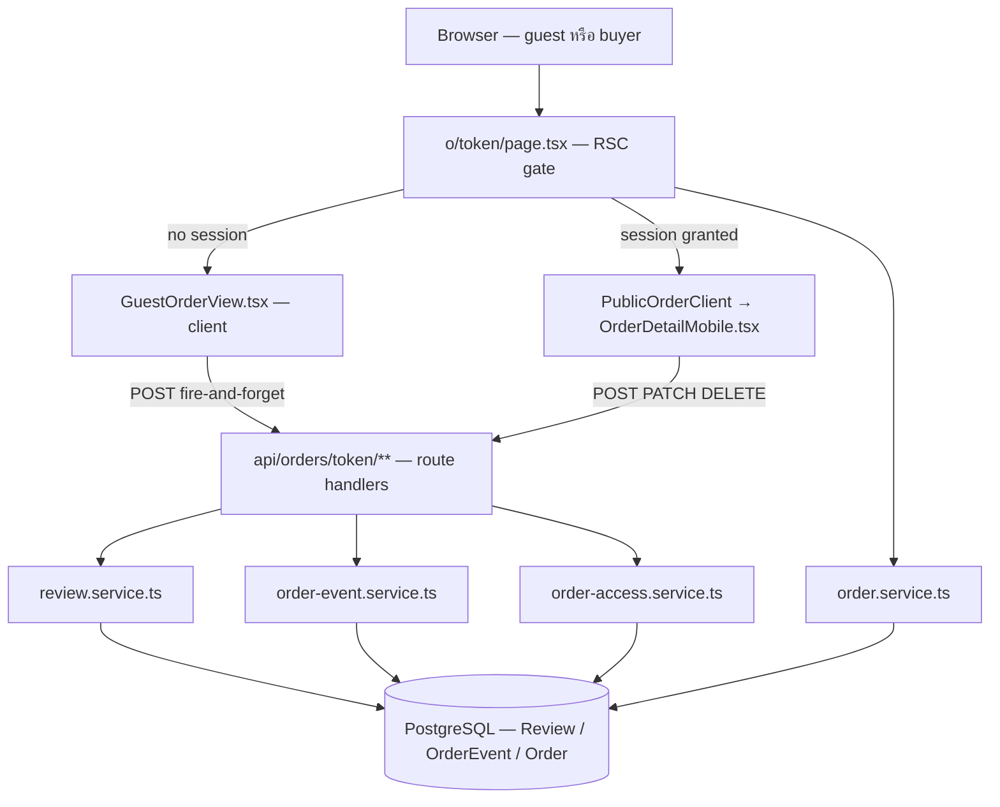
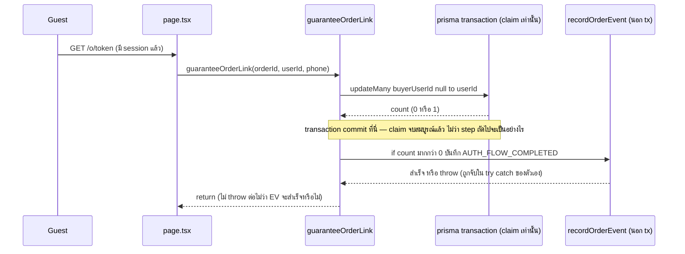
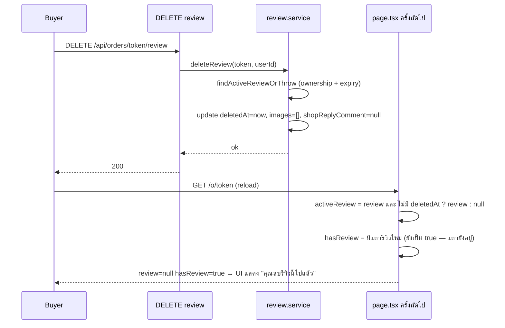

# SDS: ประสบการณ์ผู้ซื้อบนหน้าออเดอร์ (Buyer Order Experience) — System Design Spec

> **โมดูล:** M00041-BuyerOrderExperience
> **ประเภทเอกสาร:** System Design Spec (SDS)
> **เวอร์ชัน:** 1.0
> **วันที่จัดทำ:** 2026-08-10
> **สถานะ:** Draft — ยืนยันกับโค้ดจริงทุกจุด (รวมจุดที่ SRS ฉบับแรกเดาผิด — ดู TD-001/TD-006) พร้อมส่งต่อ dev
> **เจ้าของเอกสาร:** SA (ดู [[Feature-Docs-Ownership]])

---

## 1. บทนำ & References

### 1.1 วัตถุประสงค์

เอกสารนี้ต่อจาก [[SRS]] — ระบุ **ลำดับไฟล์ที่จะสร้าง/แก้จริง**, signature ฟังก์ชันครบทุกตัว, และจุดที่ SRS ทิ้งไว้ให้ SDS ตัดสิน (โดยเฉพาะพฤติกรรม UI เมื่อรีวิว soft-delete แล้ว และตำแหน่งปุ่ม dispute/contact-seller ที่ SRS อธิบายกว้างเกินไป) ให้ DEV implement ได้ทันทีโดยไม่ต้องตัดสิน shape เอง

### 1.2 ขอบเขตการออกแบบ

ตรงกับ SRS §1.2 ทุกประการ — เพิ่มเติมเฉพาะจุดที่เปิดโค้ดแล้วพบว่า **แคบกว่าที่ SRS สื่อ**:

🛑 **TFR-006 ของ SRS เขียนว่า "ถอด `disabled`/`Tooltip` ออก" เฉย ๆ — ไม่พอ** เปิด `OrderDetailMobile.tsx` เต็มไฟล์แล้วพบว่าปุ่มทั้งสองอยู่ใน **conditional branch ที่แคบกว่าเงื่อนไขทางธุรกิจจริง**:

| ปุ่ม | เงื่อนไข render จริงในโค้ด | ผลที่เกิดขึ้น | BR ที่ควรเป็น |
|---|---|---|---|
| `"ยังไม่ได้รับสินค้า?"` (บรรทัด 940-948) | `canConfirm && order.status === 'SHIPPED'` | **ไม่เคยแสดงตอน `PENDING`** | BR-BOE-13: `status ∉ {CONFIRMED, CANCELLED}` (ครอบทั้ง PENDING และ SHIPPED) |
| `"ติดต่อร้านค้า"` (บรรทัด 882-891) | `!canConfirm && isCancelled` | **แสดงเฉพาะตอน `CANCELLED` เท่านั้น** | BR-BOE-16: ไม่มีเงื่อนไขสถานะเลย (ควรโผล่ทั้ง 4 สถานะ) |

`canConfirm = status==='PENDING' || status==='SHIPPED'` (บรรทัด 361) ⇒ เป็นบูลีนตัวเดียวกับ "ไม่ใช่ `CONFIRMED`/`CANCELLED`" พอดี — ดู TD-001

### 1.3 เอกสารอ้างอิง

| เอกสาร | ความสัมพันธ์ |
|--------|-------------|
| [[SRS]] ของโมดูลนี้ | ที่มาของ TFR-001..014 ทุกข้อที่ SDS นี้ realize |
| [[BRD]] / [[PRD]] | ที่มาของ FR/BR |
| [[DATABASE]] ของโมดูลนี้ | DDL + รายการ read-path 22 จุดที่ต้องกรอง `deletedAt` |
| `docs/conventions/migration-check-constraint-additive.md` | ต้อง query CHECK เดิมก่อนต่อท้ายเสมอ |
| `docs/conventions/upload-body-size-limit.md` | รูปรีวิวต้องผ่าน `@/lib/upload-client` |

---

## 2. Architecture Overview

### 2.1 มุมมองสถาปัตยกรรม

ไม่มี component/service ใหม่ระดับ infra — ทุกอย่างอยู่ใน Next.js 16 App Router เดิม (RSC + API route + service layer) ไม่มี queue/3rd-party ใหม่



### 2.2 มุมมองการ Deploy

ดู §6 — ประเด็นเดียวที่ไม่เหมือน deploy ปกติของโปรเจกต์คือ **ต้องแยกเป็น 2 PR/2 deploy** (schema-only ก่อน แล้วค่อย feature-code) แทนที่จะรวมทีเดียวแบบที่ทำกันปกติ

---

## 3. Component Design

| Component | หน้าที่ (Responsibility) | Dependency |
|-----------|--------------------------|------------|
| `src/lib/order-pii-mask.ts` (ใหม่) | mask เบอร์/ที่อยู่ pure function | ไม่มี (pure) |
| `src/services/review.service.ts` (แก้) | CRUD รีวิว + reply + soft-delete + edit-window guard | `prisma`, `shop-context.ts` |
| `src/services/order-event.service.ts` (แก้) | เพิ่ม exclusion filter สำหรับ instrumentation type | `prisma`, `order-event.ts` |
| `src/services/order-access.service.ts` (แก้) | แยก instrumentation write ออกจาก claim transaction | `prisma`, `order-event.service.ts` |
| `src/services/order.service.ts` (แก้) | ขยาย `select` ของ `getOrderByToken()` | `prisma` |
| `src/app/(marketing)/o/[token]/GuestOrderView.tsx` (ใหม่) | render guest-safe UI | props ที่ mask แล้วเท่านั้น |
| `src/app/(marketing)/o/layout.tsx` (ใหม่) | header ตาม auth state | `(buyer-app)` header component (reuse) |
| `src/app/(marketing)/o/[token]/OrderDetailMobile.tsx` (แก้) | wiring ปุ่ม dispute/contact + review 3-state + SSOT label | `order-stage.ts`, `order-display.ts` |
| `src/app/(paces)/seller/(dashboard)/reviews/page.tsx` (แก้) | ชื่อผู้รีวิวจริง + UI ตอบกลับ | `review.service.ts` |

---

## 4. Data Flow

### 4.1 Flow: Guest → login → claim (instrumentation แยก transaction)



### 4.2 Flow: ลบรีวิว (soft-delete) แล้วผู้ใช้กลับมาดูซ้ำ



### 4.3 Flow กรณีล้มเหลว: instrumentation write พังระหว่าง migration ยังไม่ apply

ถ้า deploy ผิดลำดับ (โค้ดที่เขียน `AUTH_FLOW_COMPLETED` ขึ้นไปก่อน migration) — `recordOrderEvent` จะ throw จาก DB CHECK violation แต่ **ไม่กระทบผู้ใช้เลย** เพราะ:
- `guaranteeOrderLink`: throw ถูกจับในบล็อก try/catch ของตัวเอง (§4.1) → claim ยังสำเร็จ
- `auth-flow/start` route: throw ต้องถูกจับในตัว route handler เองเช่นกัน (ไม่ปล่อยให้ 500 หลุดไปหา guest) → คืน 204 เสมอ

ไม่มี user-facing failure mode สำหรับ instrumentation ทั้งระบบ ตาม NFR "Reliability" ของ SRS §6

---

## 5. Function Signatures (ครบทุกตัว + Custom Error)

### 5.1 `src/lib/order-pii-mask.ts` (ใหม่ทั้งไฟล์)

```ts
// pure module — ห้าม import prisma/server-only

/** เหลือ 3 ตัวท้าย ที่เหลือแทนด้วย '•' หนึ่งตัวต่อหนึ่งอักขระเดิม — len<=3 = mask ทั้งหมด */
export function maskLast3(value: string): string

/**
 * เบอร์ไทย 10 หลัก → '•••-•••-891'
 * ไม่ใช่เบอร์ไทยที่ normalize ได้ (เช่น buyerContact เป็นอีเมล) → คืน null (ไม่แสดงแถวเบอร์เลย)
 */
export function maskPhoneForGuest(phone: string | null): string | null

export type OrderShippingAddress = {
  line1?: string; subdistrict?: string; district?: string; province?: string; postcode?: string; note?: string
} // shape เดียวกับ Order.shippingAddress Json

export type MaskedShippingAddress = {
  province: string; line1: string; subdistrict: string; district: string; postcode: string
} // ไม่มี note โดยตั้งใจ — ไม่ส่งเข้า/ออกจาก type นี้เลย

/** province ไม่ mask, ที่เหลือผ่าน maskLast3 ทีละฟิลด์; ฟิลด์ที่ขาด (undefined) → คืน '' (ไม่ throw) */
export function maskShippingAddressForGuest(addr: OrderShippingAddress | null): MaskedShippingAddress | null
```

**ไม่มี custom Error** — ฟังก์ชันกลุ่มนี้ไม่ throw เลย (ค่าที่ผิดรูปแบบคืน `null`/ค่าว่าง) เพราะเรียกจาก RSC render path ที่ throw จะทำทั้งหน้าพัง

### 5.2 `src/services/review.service.ts` (เพิ่มของใหม่ — ของเดิมไม่แก้ signature แก้แค่ `where` ตาม §5.3)

```ts
// ── Error classes (มิเรอร์ pattern ของ order-dispute.service.ts: super(CODE) + name) ──

export class ReviewNotFoundError extends Error {
  constructor() { super("REVIEW_NOT_FOUND"); this.name = "ReviewNotFoundError" }
}
export class ReviewForbiddenError extends Error {
  constructor() { super("REVIEW_FORBIDDEN"); this.name = "ReviewForbiddenError" }
}
export class ReviewEditWindowExpiredError extends Error {
  constructor() { super("REVIEW_EDIT_WINDOW_EXPIRED"); this.name = "ReviewEditWindowExpiredError" }
}
export class ReviewReplyForbiddenError extends Error {
  constructor() { super("REVIEW_REPLY_FORBIDDEN"); this.name = "ReviewReplyForbiddenError" }
}
export class ReviewReplyNotFoundError extends Error {
  constructor() { super("REVIEW_REPLY_NOT_FOUND"); this.name = "ReviewReplyNotFoundError" }
}

// ── SSOT ของหน้าต่างแก้ไข (BR-BOE-17) ──

export const REVIEW_EDIT_WINDOW_MS = 24 * 60 * 60 * 1000

/** pure — เรียกได้ทั้ง server (guard จริง) และ client (โชว์/ซ่อนปุ่ม) */
export function canEditReview(createdAt: Date, now: Date = new Date()): boolean {
  return now.getTime() - createdAt.getTime() <= REVIEW_EDIT_WINDOW_MS
}

// ── private helper — ใช้ร่วมทั้ง 4 ฟังก์ชันข้างล่าง ──
//
// 🛑 treat soft-deleted เป็น "ไม่มีรีวิว" เสมอสำหรับ mutation ทุกชนิด — ขณะที่ createReview() เดิม
// (ไม่แก้) ยังเช็ค order.review แบบ raw โดยตั้งใจ เพราะต้องกัน "ลบแล้วรีวิวใหม่" ผ่าน @unique
// สองจุดนี้ต้อง "ไม่เหมือนกัน" — ดู TD-002
async function findActiveReviewOrThrow(orderToken: string) {
  const order = await prisma.order.findUnique({
    where: { publicToken: orderToken },
    select: { id: true, shopId: true, review: true },
  })
  if (!order?.review || order.review.deletedAt) throw new ReviewNotFoundError()
  return { orderId: order.id, shopId: order.shopId, review: order.review }
}

/**
 * updateReview — buyer แก้ไขรีวิวของตัวเอง (rating/comment/images) ภายใน 24 ชม.
 * ลำดับ guard บังคับ: not-found → forbidden → expired (ownership ต้องมาก่อน expiry เสมอ — กัน oracle)
 */
export async function updateReview(
  orderToken: string,
  userId: string,
  data: { rating?: number; comment?: string; images?: string[] },
): Promise<Review>

/** deleteReview — soft-delete: เซ็ต deletedAt + ล้าง images/shopReplyComment/shopRepliedAt/shopRepliedByUserId */
export async function deleteReview(orderToken: string, userId: string): Promise<void>

/**
 * replyToReview — ร้านสร้าง/เขียนทับคำตอบ
 * authorize ด้วย canAccessShop(shopId, actorUserId) — reuse ตรง ๆ จาก src/lib/shop-context.ts
 * ไม่มีเงื่อนไขเวลา (BR-BOE-22)
 */
export async function replyToReview(orderToken: string, actorUserId: string, comment: string): Promise<Review>

/** deleteReviewReply — ร้านลบคำตอบของตัวเอง (ไม่ใช่ลบรีวิว) */
export async function deleteReviewReply(orderToken: string, actorUserId: string): Promise<void>
```

**ฟังก์ชัน throw อะไรเมื่อไหร่ (สำหรับ route มา map ต่อใน API.md):**

| ฟังก์ชัน | Error | เงื่อนไข |
|----------|-------|----------|
| `updateReview` | `ReviewNotFoundError` | ไม่มีรีวิว หรือ soft-deleted แล้ว |
| | `ReviewForbiddenError` | `review.reviewerUserId !== userId` |
| | `ReviewEditWindowExpiredError` | `!canEditReview(review.createdAt)` |
| `deleteReview` | เหมือน `updateReview` ทั้ง 3 | เหมือนกัน |
| `replyToReview` | `ReviewNotFoundError` | ไม่มีรีวิว หรือ soft-deleted แล้ว |
| | `ReviewReplyForbiddenError` | `!(await canAccessShop(shopId, actorUserId))` |
| `deleteReviewReply` | `ReviewNotFoundError` | เหมือนกัน |
| | `ReviewReplyForbiddenError` | เหมือนกัน |
| | `ReviewReplyNotFoundError` | `review.shopReplyComment === null` (ไม่มีคำตอบให้ลบ) |

### 5.3 Read-path ที่ต้องเพิ่ม `deletedAt: null` (ในไฟล์นี้ 5 จุด — รายการเต็มทั้งรีโป 22 จุดอยู่ที่ [[DATABASE]] §8.1)

| ฟังก์ชัน | ไฟล์:บรรทัด | วิธี filter |
|----------|-------------|-------------|
| `getReviewsByBuyer` | `review.service.ts:51-66` | เพิ่มใน `where: { reviewerUserId, deletedAt: null }` |
| `getReviewsByShopUser` | `review.service.ts:68-74` | เพิ่มใน `where` |
| `getReviewsByUsername` | `review.service.ts:76-84` | เพิ่มใน `where` |
| `getAvgRatingByUsername` | `review.service.ts:88-100` | เพิ่มใน `where` ของ `aggregate` |
| `getAvgRatingByShop` | `review.service.ts:104-115` | เพิ่มใน `where` ของ `aggregate` |
| `getOrderByToken().review` (ผ่าน `include`) | `order.service.ts:1044-1090` | 🛑 **ไม่ filter ที่ query** — ดู TD-003 |

### 5.4 `src/services/order-event.service.ts` (แก้)

```ts
const INSTRUMENTATION_EVENT_TYPES: readonly OrderEventType[] = ['AUTH_FLOW_STARTED', 'AUTH_FLOW_COMPLETED']

export async function getOrderEvents(orderId: string, take = 50): Promise<OrderEventView[]>
// where: { orderId, type: { notIn: INSTRUMENTATION_EVENT_TYPES } } — เพิ่มเงื่อนไขนี้ในตัวเดิม
```

ไม่มี error class ใหม่ — `recordOrderEvent`/`recordOrderEventSafe` (เดิม) ไม่เปลี่ยน signature เลย

### 5.5 `src/lib/order-event.ts` (แก้ — เพิ่ม type)

```ts
export const ORDER_EVENT_TYPES = [
  // ...15 ค่าเดิม...
  'AUTH_FLOW_STARTED',
  'AUTH_FLOW_COMPLETED',
] as const // รวม 17 ค่า

// ORDER_EVENT_META ต้องเติม 2 entry (TS บังคับเพราะเป็น Record<OrderEventType,...>)
// tone: 'neutral' — จะไม่ถูก render จริงเพราะ getOrderEvents กรองออกแล้ว (§5.4)
```

---

## 6. Deploy Order (บังคับอ่านก่อน implement)

🛑 **ต้องแยกเป็น 2 PR/2 deploy ห้ามรวมเป็น deploy เดียว:**

1. **PR-1 (schema-only):** migration 2 ตัวเท่านั้น — **ไม่มีโค้ดแอปที่อ้างอิงคอลัมน์/ค่าใหม่เลย** deploy นี้ **safe ด้วยตัวเอง**: คอลัมน์ใหม่ทั้งหมดมี default หรือ nullable → โค้ดเดิม (pre-migration) เขียน/อ่าน `Review` ต่อได้ปกติ ไม่มี error จากการมีคอลัมน์เกิน
   - **แจ้ง user ก่อน push ตาม Hard Rule 15** (push main = migrate prod อัตโนมัติ)
   - รอยืนยัน deploy สำเร็จ **ก่อน** merge PR-2
2. **PR-2 (feature code):** ทุกอย่างที่เหลือ — Prisma Client ที่ generate จาก schema ใหม่มีอยู่บน prod แล้ว (จาก PR-1) จึงอ้างอิงคอลัมน์/ค่า enum ใหม่ได้ปลอดภัย

**ช่วงที่ทั้งสองเวอร์ชันอยู่ร่วมกัน** (ระหว่าง PR-1 deploy เสร็จ ถึง PR-2 deploy เสร็จ — อาจกินเวลาหลายชั่วโมงถึงหลายวันถ้ารอ review): โค้ดเก่ารันกับ schema ใหม่ = ปลอดภัย (additive-only) · ไม่มีทิศทางกลับ (โค้ดใหม่รันกับ schema เก่า) เพราะลำดับ PR บังคับให้ migration มาก่อนเสมอ

**ภายใน PR-2 (task breakdown ที่ commit แยกได้ — เรียงตาม dependency):**

| # | Commit scope | ไฟล์ | Depends on |
|---|---------------|------|-------------|
| 1 | `order-pii-mask.ts` + test | `src/lib/order-pii-mask.ts`, test | — (pure ไม่แตะ schema ทำได้ทันที) |
| 2 | SSOT ป้ายสถานะ (TFR-012) | `order-display.ts` (ลบ `getStatusPill`+test), `OrderDetailMobile.tsx`, `views/apps/ecommerce/orders/list/index.tsx`, `dashboard/Orders.tsx` | — |
| 3 | `order.service.ts` — ขยาย select | `order.service.ts` | — (field เดิมทั้งหมด) |
| 4 | `order-event.ts` เพิ่ม type + `order-event.service.ts` exclusion | `order-event.ts`, `order-event.service.ts` | PR-1 (OrderEvent CHECK) |
| 5 | `order-access.service.ts` — แยก instrumentation write | `order-access.service.ts` | #4 |
| 6 | `POST /auth-flow/start` + `AuthFlowStartSchema` | route ใหม่, `validations.ts` | #4 |
| 7 | `review.service.ts` — ฟังก์ชันใหม่ 4 ตัว + error class + `canEditReview` + `findActiveReviewOrThrow` + read-path filter | `review.service.ts` | PR-1 (Review columns) |
| 8 | route ใหม่ 4 ตัว + schema | `review/route.ts` (เพิ่ม handler), `review/reply/route.ts` (ใหม่), `validations.ts` | #7 |
| 9 | `page.tsx` — guest branch + `buildGuestOrderData()` | `page.tsx` | #1, #3 |
| 10 | `GuestOrderView.tsx` + `o/layout.tsx` | ใหม่ทั้งคู่ | #9, gate `safepay-ux` |
| 11 | `OrderDetailMobile.tsx` — wiring ปุ่ม (TD-001), review 3-state (TD-002), reorder สลิป | `OrderDetailMobile.tsx` | #2, #7, gate `safepay-ux` |
| 12 | `ReviewForm.tsx` — เพิ่มรูป + โหมดแก้ไข | `ReviewForm.tsx` | #8, gate `safepay-ux` |
| 13 | `seller/(dashboard)/reviews/page.tsx` — ชื่อจริง + UI ตอบกลับ | `reviews/page.tsx`, `components/ProductReviews.tsx` | #7, gate `safepay-ux` |
| 14 | `scripts/metrics/00041-buyer-order-experience-kpi.sql` | ใหม่ | #4 |

**นอกจากนี้ยังต้องปิดรายการ read-path อีก 17 จุดนอก `review.service.ts`** ตาม [[DATABASE]] §8.1 (trust-score/badge/activity/admin dashboard/app-shop ฯลฯ) — จัดเป็น commit เดียวคู่กับ #7 หรือแยกก็ได้ แต่ **ต้อง ship พร้อมกับ #7 ห้ามทิ้งไว้ทีหลัง**

---

## 7. Technical Decisions

### TD-001: ปุ่ม dispute/contact-seller ต้อง **restructure ตำแหน่ง** ไม่ใช่แค่ถอด disabled

- **ตัดสินใจ:**
  - `"ยังไม่ได้รับสินค้า?"` ย้ายเงื่อนไขจาก `canConfirm && order.status==='SHIPPED'` เป็น **`canConfirm` เฉย ๆ** (ไม่ต้องเช็ค `status==='SHIPPED'` ซ้ำ เพราะ `canConfirm = PENDING||SHIPPED` ตรงกับ BR-BOE-13 พอดีสำหรับ state machine 4 ค่านี้)
  - `"ติดต่อร้านค้า"` ย้ายออกจาก footer-เฉพาะ-cancelled ไป render **นอก** เงื่อนไข `canConfirm`/`!canConfirm` เลย — ตำแหน่งที่แน่นอนให้ `safepay-ux` ตัดสินใน Design Spec (Hard Rule 8) แต่ **shape ทางตรรกะคือ "ไม่ผูกกับ `canConfirm`/`isCancelled` เลย"**
- **เหตุผล:** โครงเดิมออกแบบตอนที่ทั้งสองปุ่มยัง `disabled` ถาวร — ตำแหน่งตอนนั้นไม่มีนัยทางธุรกิจ (ปุ่มกดไม่ได้อยู่แล้ว) พอเปิดใช้งานจริง เงื่อนไข render เดิมกลายเป็น business rule โดยไม่ตั้งใจ ซึ่งไม่ตรงกับ BR-BOE-13/16
- **ทางเลือกที่ตัดทิ้ง:** คงโครง JSX เดิมแล้วเพิ่มเงื่อนไข `|| status==='PENDING'` / ลบ `isCancelled` — ปฏิเสธเพราะจะทำให้ปุ่มเดียวกันถูกก็อป JSX ซ้ำ 2 จุด (ใน `canConfirm` block และ `!canConfirm` block)
- **ผลกระทบ:** DEV ต้องแก้โครง component ไม่ใช่แค่ prop — QA ต้องเทส 4 สถานะครบ (ไม่ใช่แค่ SHIPPED/CANCELLED แบบเดิม)

### TD-002: รีวิวที่ soft-delete แล้ว = สถานะที่ 3 ของ UI (ไม่ใช่แค่ "ซ่อน")

- **ตัดสินใจ:** `PublicOrderData.hasReview` **คงความหมายเดิม** (`!!order.review` แบบ raw ไม่ filter `deletedAt`) · `PublicOrderData.review` เปลี่ยนเป็น `null` เมื่อ `order.review.deletedAt !== null` (filter ที่ `page.tsx` ไม่ใช่ที่ query) · UI เพิ่ม branch ที่ 3: `hasReview && !review` → แสดงข้อความกลาง ๆ "คุณลบรีวิวของคำสั่งซื้อนี้ไปแล้ว" (ไม่มีฟอร์ม ไม่มีการ์ดคะแนน)
- **เหตุผล:** `Review.orderId @unique` + guard เดิม `if (order.review) throw` ใน `createReview()` คือกลไกจริงที่กัน "ลบแล้วเขียนใหม่" — ถ้า `hasReview` ไป filter `deletedAt` ด้วย UI จะเปิดฟอร์มเขียนรีวิวใหม่ให้ผู้ซื้อกรอกจนเสร็จ **แล้วถูกปฏิเสธตอน submit** เพราะแถวยังอยู่จริงใน DB — เป็น UX ที่แย่กว่าไม่มีฟอร์มเลย
- **ทางเลือกที่ตัดทิ้ง:** ให้เขียนรีวิวใหม่ได้จริงหลังลบ (ต้อง hard-delete) — ปฏิเสธเพราะย้อนกลับไปเป็นช่องโหว่ที่ SRS §8 เพิ่งปิด
- **ผลกระทบ:** เป็น **open question ที่ user ยังไม่เคาะ** ("ลบแล้วลบเลย") — ถ้า user อยากได้ "เขียนใหม่ได้แต่เวลานับจากใบแรก" ต้องเพิ่มคอลัมน์ `firstReviewedAt` แยก (นอกขอบเขต SDS นี้)

### TD-003: filter `deletedAt` ที่ `getOrderByToken` ทำ **หลัง fetch** ไม่ใช่ที่ query

- **ตัดสินใจ:** ไม่แก้ `include: { review: true }` — filter ที่ `page.tsx` ตอน map เป็น `PublicOrderData`
- **เหตุผล:** Prisma relation-filter บน **to-one relation** เป็นพฤติกรรมที่ยังไม่ยืนยันว่ารองรับใน Prisma 6.19.1 ของโปรเจกต์นี้ — การ filter หลัง fetch ด้วย if-check ธรรมดาปลอดภัยกว่าและอ่านง่ายกว่า ไม่ต้องพิสูจน์ version-specific behavior
- **ผลกระทบ:** DEV เขียน `const activeReview = order.review && !order.review.deletedAt ? order.review : null` ที่ `page.tsx` บรรทัดเดียวก่อน map

### TD-004: instrumentation event write ต้องอยู่ **นอก** transaction การ claim

**Diff เชิงตรรกะของ `guaranteeOrderLink()`:**

```
เดิม:
  try {
    await prisma.$transaction(async (tx) => {
      await tx.order.updateMany({ where: {...}, data: { buyerUserId } })   // ค่า count ไม่ถูกอ่าน
      await tx.order.updateMany({ where: {...}, data: { customerId } })
    })
  } catch (e) { console.error(...) }

ใหม่:
  try {
    const claimed = await prisma.$transaction(async (tx) => {
      const res = await tx.order.updateMany({ where: {...}, data: { buyerUserId } })  // เก็บ res
      await tx.order.updateMany({ where: {...}, data: { customerId } })
      return res.count > 0                          // ← ใหม่: return ออกจาก tx
    })
    if (claimed) {                                    // ← ใหม่: นอก tx แล้ว
      try {
        await recordOrderEvent(prisma, { orderId, type: 'AUTH_FLOW_COMPLETED', actorUserId: userId })
      } catch (e) {
        console.error('[guaranteeOrderLink] instrumentation write failed — claim ยังสำเร็จปกติ', e)
      }
    }
  } catch (e) { console.error(...) }                   // ครอบเฉพาะส่วน claim เหมือนเดิม
```

🛑 **ทำไมสลับที่ไม่ได้ (ย้าย `recordOrderEvent` เข้าไปใน `$transaction`):** `$transaction` callback ของ Prisma คือ **all-or-nothing** — ถ้า statement ใดใน callback throw (รวม `recordOrderEvent` ถ้าย้ายเข้าไป) Prisma จะ ROLLBACK ทุก statement ก่อนหน้าในทรานแซกชันเดียวกัน แปลว่า `updateMany({data:{buyerUserId}})` ที่**สำเร็จไปแล้ว**จะถูกย้อนกลับด้วย ทั้งที่ตัวมันเองไม่มีปัญหา — ผู้ใช้จะเห็นว่า login สำเร็จ (session สร้างแล้ว) แต่ `buyerUserId` ไม่ถูกผูก และเพราะ `guaranteeOrderLink` ทั้งฟังก์ชันห่อด้วย try/catch อีกชั้นที่ swallow ทุก error (best-effort โดยเจตนา) **จะไม่มี error โผล่ให้เห็นเลย** = regression กลับไปที่ปัญหาเดิมที่ทั้งฟีเจอร์นี้ตั้งใจแก้ (`BUYER_CONFIRMED = 0` เพราะ claim ไม่ทำงาน)

### TD-005: ไม่มี rate-limit bucket ใหม่สำหรับ endpoint กลุ่มนี้

- **ตัดสินใจ:** ใช้ bucket เดิมของ `guardApi` (`src/proxy.ts`) ทั้งหมด
- **เหตุผล:** worst-case คือแนบรูป 4 ใบ = 8 request ไป `/api/uploads/*` (bucket `upload` เพดาน **300/นาที** ซึ่งตั้งไว้เพราะเหตุผลเดียวกันตั้งแต่ 2026-08-10) + 1 request ไป `PATCH /review` (bucket auth mutation เพดาน **30/นาที**) — ทั้งคู่เหลือ headroom มาก
- **ผลกระทบ:** ไม่ต้องแก้ `src/proxy.ts` เลยในฟีเจอร์นี้

### TD-006: `/messages/[shopId]` รับ `Shop.id`

ยืนยันจากโค้ดจริงแล้ว (`(buyer-app)/messages/[shopId]/page.tsx:42`, `prisma.shop.findUnique({where:{id: shopId}})`) — SRS ฉบับแรกเดาผิดเป็น `Shop.userId` แก้แล้ว บันทึกไว้เพื่อ traceability

---

## 8. รายการเทส `[blocker]` (พร้อม mutation ที่ต้องทำให้แดง)

| # | ไฟล์เทส | สิ่งที่พิสูจน์ | Mutation ที่ต้องทำให้แดง |
|---|---------|----------------|----------------------------|
| 1 | `order-pii-mask.test.ts` | `province` ไม่ถูก mask, ฟิลด์อื่นถูก mask | เปลี่ยนโค้ดให้ mask `province` ด้วย → เทสที่เช็คว่า `province` เต็มต้องแดง |
| 2 | `review.service.test.ts::canEditReview` | boundary 24 ชม.เป๊ะยังแก้ได้, เกิน 1ms แก้ไม่ได้ | เปลี่ยน `<=` เป็น `<` → เทส boundary เป๊ะต้องแดง |
| 3 | `order-access.service.test.ts` | event write ที่ล้มไม่ทำให้ claim ล้มตาม | mock `recordOrderEvent` ให้ throw → เทสต้องยังเห็น `buyerUserId` ถูกตั้ง (ถ้าย้าย `recordOrderEvent` กลับเข้า `$transaction` เทสนี้ต้องแดงเพราะ claim จะ rollback) |
| 4 | `review.service.test.ts::read-paths-filter-deleted` | ทุกฟังก์ชันใน §5.3 มี `deletedAt` ใน `where` จริง | **สแกนซอร์สโค้ด** (ไม่ hardcode รายชื่อไฟล์) → ลบ `deletedAt: null` ออกจากฟังก์ชันใดฟังก์ชันหนึ่ง → เทสต้องแดงเฉพาะตัวนั้น |
| 5 | `order-event.service.test.ts` | instrumentation type ไม่มีวันโผล่ใน `getOrderEvents` | fixture ที่มี event 2 ชนิดนี้ปนชนิดอื่น → ลบ `notIn` filter → เทสต้องแดง |
| 6 | `order-status-label-ssot.test.ts` | ค่า `SHIPPED` label ตรงกันทั้ง 3 ไฟล์ | สแกนซอร์ส (regex `SHIPPED:\s*['"]([^'"]+)['"]`) เทียบกับ `ORDER_STATUS_META.SHIPPED.label` → แก้ไฟล์ใดไฟล์หนึ่งกลับเป็น `'จัดส่งแล้ว'` → เทสต้องแดง |
| 7 | `review.service.test.ts::deleted-is-not-found` | รีวิวที่ `deletedAt !== null` ต้องได้ `ReviewNotFoundError` จากทั้ง 4 mutation function | fixture รีวิวที่ soft-deleted → ลบเงื่อนไข `|| order.review.deletedAt` ออกจาก `findActiveReviewOrThrow` → เทสต้องแดง |

---

## 9. Traceability

| SRS Requirement | SDS Element | สถานะ |
|---|---|---|
| TFR-001, TFR-002 | Component `GuestOrderView.tsx`, `order-pii-mask.ts`, TD-003 | Draft |
| TFR-005 | Flow 4.1 (select เพิ่ม), Component `order.service.ts` | Draft |
| TFR-006 | TD-001 | Draft |
| TFR-007/008/009 | §5.2, TD-002, เทส #2/#4/#7 | Draft |
| TFR-012 | Task #2, เทส #6 | Draft |
| TFR-013 | Flow 4.1, TD-004, เทส #3/#5 | Draft |
| NFR "upload ไม่ผ่าน body" | TD-005 | Draft |

---

## 10. สรุป (Summary)

SDS นี้กำหนดการออกแบบเชิงระบบต่อจาก SRS — ประเด็นหลักที่ SDS แก้เพิ่มคือ **ตำแหน่งปุ่ม dispute/contact-seller ที่ต้อง restructure จริง (TD-001)**, **สถานะที่ 3 ของ UI รีวิวหลังลบ (TD-002)**, และ **จุดวาง instrumentation write ที่พลาดแล้วจะย้อนกลับไปที่ปัญหาเดิมของทั้งฟีเจอร์ (TD-004)**

**Open Questions:**
- TD-002: "ลบรีวิวแล้วห้ามเขียนใหม่ตลอดไป" ต้องยืนยันกับ user
- ตำแหน่งที่แน่นอนของปุ่ม "ติดต่อร้านค้า" (TD-001) รอ `safepay-ux` Design Spec
