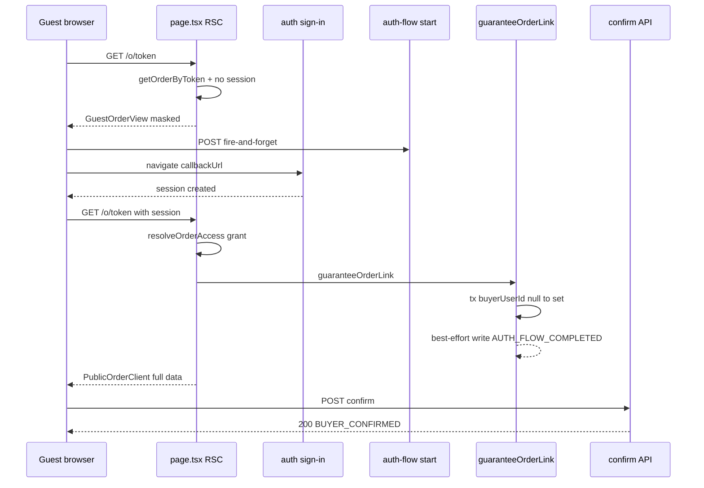
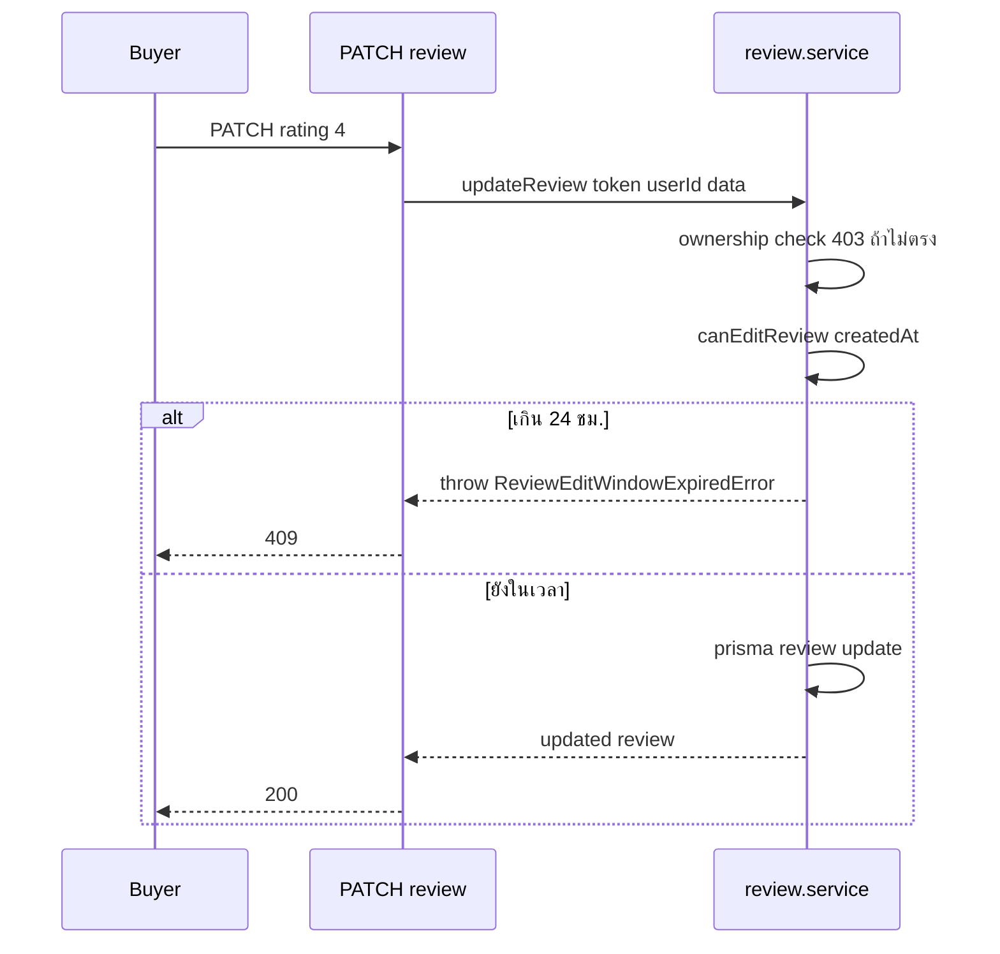
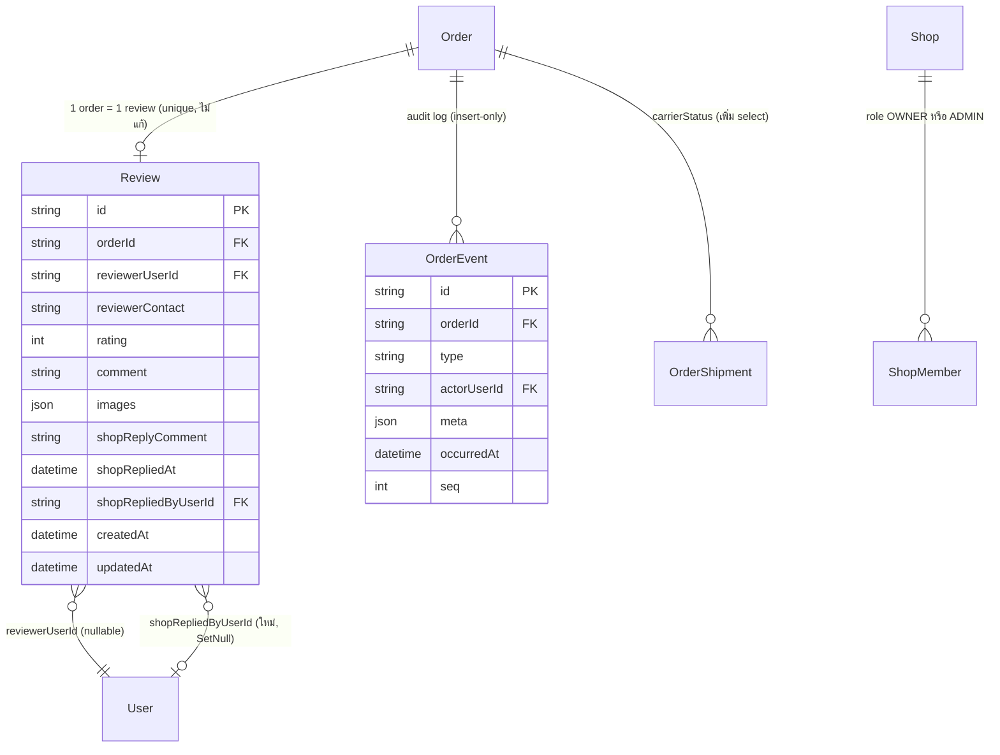

# SRS: ประสบการณ์ผู้ซื้อบนหน้าออเดอร์ (Buyer Order Experience) — Software Requirements Specification (Technical)

> **โมดูล:** M00041-BuyerOrderExperience
> **ประเภทเอกสาร:** Software Requirements Specification (SRS) - TECHNICAL
> **เวอร์ชัน:** 1.0
> **วันที่จัดทำ:** 2026-08-10
> **สถานะ:** Draft — ทุก TFR ยืนยันกับโค้ดจริงแล้ว (ไม่ใช่เดาจากเอกสารเก่า — ดู HR16 ทิศกลับ) พร้อมส่งต่อ SDS/DATABASE/API/TestCase
> **เจ้าของเอกสาร:** SA (ดู [[Feature-Docs-Ownership]])

---

## 1. บทนำ (Introduction)

### 1.1 วัตถุประสงค์ของเอกสาร

เอกสารนี้กำหนดข้อกำหนดเชิงเทคนิคสำหรับการ redesign หน้า `/o/{token}` ทั้งเส้น (guest view, ลดขั้นตอน Facebook, สลิป, สถานะพัสดุ, dispute/ติดต่อร้าน, รีวิว 3 ข้อ, responsive, SSOT ป้ายสถานะ, instrumentation) ตาม [[PRD]]/[[BRD]] ของโมดูลนี้ ผู้อ่านหลักคือ DEV ที่จะ implement, QA ที่จะเขียน TestCase, และ SA ของฟีเจอร์ downstream (00040 Trust Score v2)

ทุกข้อกำหนดในเอกสารนี้ **ยืนยันกับโค้ดจริงในเวิร์กทรีแล้ว** (ไม่ใช่คัดลอกจากเอกสารเก่า) — ไฟล์/บรรทัด/พฤติกรรมที่อ้างถึงเปิดอ่านจริงระหว่างเขียนเอกสารนี้ทั้งหมด ตาม Hard Rule 16 (ทิศกลับ)

### 1.2 ขอบเขตเชิงระบบ (System Scope)

- **อยู่ในขอบเขต:** `src/app/(marketing)/o/[token]/**`, service `order.service.ts`/`review.service.ts`/`order-event.service.ts`/`order-access.service.ts` (เฉพาะจุดที่ระบุ), API ใต้ `src/app/api/orders/[token]/**`, `src/lib/order-display.ts`/`order-stage.ts`/`order-event.ts`, `prisma/schema.prisma` (`Review`, `OrderEvent.type`)
- **นอกขอบเขตทางเทคนิค (ยืนยันจาก PRD §5 + ตรวจโค้ดซ้ำ):**
  - `BookingGuestView.tsx` (`Order.type='BOOKING'`, LODGING vertical) — **ไม่แตะในรอบนี้** เพราะ PRD/BRD ไม่มีข้อมูล/BR วิเคราะห์ vertical นี้เลย (73 ออเดอร์ baseline ไม่มีใบไหนเป็น BOOKING) และหน้านี้แยกไฟล์ต่างหากอยู่แล้ว (`src/app/(marketing)/o/[token]/page.tsx:139-165` แยก branch ก่อนเข้า `PublicOrderClient`) ยังคงบังคับ login เหมือนเดิมทุกประการ — ถือเป็น **decision ของ SRS ฉบับนี้** ที่ต้องบันทึกไว้ชัด ไม่ใช่การมองข้าม
  - `Order.type='SERVICE'` (feature 00024 นัดหมาย) **อยู่ในขอบเขต** เพราะไหลผ่าน `PublicOrderClient`/`OrderDetailMobile` เส้นเดียวกับ PHYSICAL/DIGITAL/SUBSCRIPTION อยู่แล้ว (`page.tsx:222-234` เติม `appointment` field เข้า `PublicOrderData` ปกติ) — ฟิลด์นัด (resourceName/start/end/status) ถือเป็นข้อมูลระดับเดียวกับ "การติดตามสถานะพัสดุ" ตาม BR-BOE-01 (แสดงได้แบบ guest โดยไม่ต้อง mask เพราะไม่ใช่ PII ของบุคคล)
  - Trust Score v2 (00040), รีวิวรายสินค้า, การส่งลิงก์อัตโนมัติเข้าแชท, แอปมือถือฝั่งผู้ขาย — ตรงกับ PRD §5 เป๊ะ ไม่ต้องอธิบายซ้ำ

### 1.3 เอกสารอ้างอิง (References)

| เอกสาร | ความสัมพันธ์ |
|--------|-------------|
| [[PRD]] ของโมดูลนี้ | ที่มาของเป้าหมายธุรกิจ/KPI/baseline ข้อมูล prod |
| [[BRD]] ของโมดูลนี้ | ที่มาของ FR-001..022 / BR-BOE-01..25 ที่ SRS นี้ trace กลับทุกข้อ |
| `docs/superpowers/plans/2026-08-10-buyer-order-experience-resume.md` | สำรวจโค้ด/ข้อมูล prod ก่อนเขียน PRD |
| `docs/SRS.md` §2.2, §6.2 (Order/Review/OrderEvent), §7.5, §9.1 | จุดที่ต้อง sync หลัง implement (ดู §10) |
| `docs/conventions/upload-body-size-limit.md` | สลิป/รูปรีวิวต้องผ่าน `@/lib/upload-client` |
| memory `feedback_rsc_pii_neutralize_at_source` | mask ที่ server boundary เสมอ |

### 1.4 นิยามและตัวย่อ (Definitions & Acronyms)

| คำ/ตัวย่อ | ความหมาย |
|-----------|----------|
| **Guest View** | มุมมองของผู้ซื้อที่ยังไม่ login บน `/o/{token}` — component ใหม่ `GuestOrderView.tsx` |
| **SSOT สถานะออเดอร์** | `ORDER_STATUS_META` (`src/lib/order-display.ts`) + `resolveOrderStatusBadge()` (`src/lib/order-stage.ts`) — ดู TFR-012 |
| **Claim** | การผูก `Order.buyerUserId` ครั้งแรก ผ่าน `guaranteeOrderLink()` (feature 00015, ไม่แก้ logic เดิม) |
| **Instrumentation event** | `OrderEvent` ชนิดใหม่ 2 ตัว (`AUTH_FLOW_STARTED`/`AUTH_FLOW_COMPLETED`) ที่ไม่แสดงในไทม์ไลน์ที่ผู้ใช้เห็น |

---

## 2. ภาพรวมสถาปัตยกรรม (Architecture Overview)

### 2.1 บริบทระบบ (System Context)

```mermaid
flowchart LR
    Guest[ผู้ซื้อ — guest] -->|GET /o/token| Page[o/token/page.tsx]
    Buyer[ผู้ซื้อ — authenticated] -->|GET/POST /o/token/*| Page
    Shop[ร้านค้า — Paces] -->|GET /seller/reviews| ReviewsPage[seller reviews/page.tsx]

    Page --> OrderSvc[order.service.ts]
    Page --> AccessSvc[order-access.service.ts]
    Page --> GuestView[GuestOrderView.tsx]
    Page --> FullView[PublicOrderClient → OrderDetailMobile.tsx]

    FullView -->|POST| ConfirmAPI[/api/orders/token/confirm]
    FullView -->|POST JSON fileId| SlipAPI[/api/orders/token/slip]
    FullView -->|POST| DisputeAPI[/api/orders/token/dispute]
    FullView -->|POST/PATCH/DELETE| ReviewAPI[/api/orders/token/review + review/reply]
    GuestView -->|POST best-effort| AuthFlowAPI[/api/orders/token/auth-flow/start]

    ConfirmAPI --> OrderSvc
    SlipAPI --> OrderSvc
    DisputeAPI --> DisputeSvc[order-dispute.service.ts]
    ReviewAPI --> ReviewSvc[review.service.ts]
    AuthFlowAPI --> EventSvc[order-event.service.ts]

    OrderSvc --> DB[(PostgreSQL — Order/OrderShipment)]
    ReviewSvc --> DB2[(Review)]
    EventSvc --> DB3[(OrderEvent)]
    ReviewsPage --> ReviewSvc
```

### 2.2 องค์ประกอบหลัก (Components)

| Component | หน้าที่ | Submodule / Stack |
|-----------|---------|-------------------|
| **`o/[token]/page.tsx`** | RSC gate — discriminator, guest/auth branch, mask ที่ server | Next.js 16 RSC |
| **`GuestOrderView.tsx`** (ใหม่) | render guest-safe data, CTA ที่พาไป login | React Client Component (MUI/Vuexy) |
| **`order-pii-mask.ts`** (ใหม่) | pure function มาสก์เบอร์/ที่อยู่ | `src/lib/` pure module |
| **`order-display.ts` / `order-stage.ts`** | SSOT ป้ายสถานะออเดอร์ + สถานะพัสดุ (ใช้ร่วม buyer/seller) | `src/lib/` pure module |
| **`review.service.ts`** | CRUD รีวิว + คำตอบร้าน | `src/services/` |
| **`order-event.service.ts`** | เขียน/อ่าน `OrderEvent` รวม instrumentation | `src/services/` |
| **`seller/(dashboard)/reviews/page.tsx`** | ฝั่งร้าน — ชื่อผู้รีวิวมีความหมาย + ตอบกลับ | `(paces)` Paces |

### 2.3 มุมมองการ Deploy (Deployment View)

Next.js 16 App Router บน Vercel (เดิม) — ไม่มี service ใหม่/runtime ใหม่ ทุก endpoint เป็น serverless function เดิมของโปรเจกต์ (`nodejs` runtime ผ่าน `guardApi` ใน `src/proxy.ts`) migration รันผ่าน `prisma migrate deploy` ตอน build (ดู Hard Rule 15 — **ต้องแจ้ง user ก่อนรัน migrate ใด ๆ**)

---

## 3. ข้อกำหนดเชิงฟังก์ชันเชิงเทคนิค (Technical Functional Requirements)

### TFR-001: Guest View — data assembly + gate restructuring

- **Trace to:** FR-001, FR-002, FR-004 (บางส่วน)
- **คำอธิบายเชิงเทคนิค:**
  ปัจจุบัน `page.tsx:71-73` บังคับ `redirect('/auth/sign-in?...')` ทันทีที่ `!session` สำหรับ token รูปแบบ UUID v4 — ต้องแทรก branch ใหม่ **ก่อน** บรรทัดนี้: ถ้า `!session` และ `order.type !== 'BOOKING'` → render `<GuestOrderView data={buildGuestOrderData(order)} />` แทนการ redirect โดยไม่แตะ logic ของ `resolveOrderAccess`/`guaranteeOrderLink` เลย (ยังอยู่หลัง `if (!session)` เดิม เพราะสองส่วนนี้ทำงานเฉพาะเมื่อมี session)
  `buildGuestOrderData()` (ฟังก์ชันใหม่ pure, รับ `order` ที่ query มาแล้วจาก `getOrderByToken`) คืนเฉพาะฟิลด์ที่ BR-BOE-01 อนุญาต: status, shipping stage badge (TFR-005), items (name/qty/price/imageUrl), totalAmount, shop.shopName/user.{displayName,username,avatar,trustScore}, orderNo (`formatOrderNo`, ไม่ใช่ PII), appointment (ถ้ามี, ไม่ mask), maskedPhone, maskedShippingAddress (TFR-002) — **ไม่ส่ง** `buyerContact` ดิบ, `shippingAddress.note`, `slipFileId`
- **Precondition:** `order` ถูก query จาก `getOrderByToken(token)` แล้ว (ไม่ null, ผ่าน `notFound()` guard เดิม), token เป็นรูปแบบ UUID v4 (ผ่าน discriminator เดิม), `order.type !== 'BOOKING'`
#### ส่วนขยาย 2026-08-31 — เงินที่รับจริงเข้า allow-list (user เคาะ · ทางเลือก ก)

เพิ่มคีย์ **`money`** ลง `GuestOrderData` · รูปร่างจำกัด **4 คีย์** เท่านั้น:
`{ totalAmount, totalReceived, outstanding, fullyPaid }`

**ทำไมถึงอนุญาต** — ไม่ใช่ PII ของผู้ซื้อ และไม่ใช่ตัวเลขระดับร้าน เป็นยอดของ *บิลใบที่ผู้ถือลิงก์
ถืออยู่* ซึ่งร้านเป็นคนส่งลิงก์นี้ให้ลูกค้าเอง และลูกค้าคือคนที่ต้องรู้ว่ายังค้างเท่าไร
(เกณฑ์เดียวกับ `payoutSnapshot` ที่อยู่ใน allow-list แล้ว — เลขบัญชีร้านยังส่งได้)

**ทำไมถึงต้องมี** — ป้ายสถานะการชำระเงินบนจอนี้ derive จาก `Order.status` ซึ่ง `CONFIRMED`
แปลว่า *ผู้ซื้อยืนยันว่าได้รับบริการแล้ว* **ไม่ได้แปลว่าจ่ายเงินแล้ว** ⇒ บิลร้านบริการที่ปิดงานแล้ว
แต่ยังค้างเงิน ขึ้นเขียว "ชำระแล้ว" มาตลอด · จอที่ล็อกอินแล้วมีตัวเลขนี้อยู่ก่อนแล้ว
🛑 **แก้ข้างเดียวไม่ได้** — บิลใบเดียวกันจะขึ้นป้ายคนละอย่างก่อน/หลังล็อกอิน = ความไม่ตรงชุดใหม่

🛑 **ไม่มี `entries`** — รายการรับเงินทีละก้อน (วิธีชำระ · เวลา · บันทึกภายในของร้าน) เป็นของ
ฝั่งร้านอย่างเดียว ผู้ถือลิงก์ต้องรู้แค่ "รับแล้วเท่าไร ค้างเท่าไร"

**ร้านที่ไม่ใช่ `SERVICE_QUEUE` ได้ `null`** ⇒ จอเดิมไม่เปลี่ยนแม้แต่ node เดียว (AC-SQ-07)

ด่าน: `guest-order-data.test.ts` (snapshot รายชื่อคีย์) + `buyer-seller-payment-parity.test.ts`
(`[blocker]` — คำนวณครั้งเดียวเหนือจุดแยกสาขา · ห้ามปล่อย `entries`/`note`)

- **Postcondition:** guest เห็นหน้าจอโดยไม่ redirect, ไม่มี field ที่ไม่อยู่ใน allow-list หลุดไปใน RSC flight payload (ตรวจด้วย `grep` หา field ต้องห้ามในไฟล์ `GuestOrderView.tsx`/props type เป็นส่วนหนึ่งของ Reviewer gate)
- **Error / Edge cases:**
  - token ไม่มีอยู่จริง → `notFound()` เหมือนเดิม (ไม่เปลี่ยน)
  - `order.type === 'BOOKING'` + `!session` → คงพฤติกรรมเดิม (`redirect` ไป sign-in) เพราะ `BookingGuestView` ยังอยู่นอกขอบเขต (§1.2)
  - guest กดปุ่มที่ต้อง login (ยืนยัน/แนบสลิป/รีวิว/dispute/ติดต่อร้าน) → CTA เป็น `<Link href="/auth/sign-in?callbackUrl=/o/{token}">` **ไม่ใช่** `fetch` ตรง (กัน 401 เงียบ ๆ) — ยิง `auth-flow/start` (TFR-013) แบบ fire-and-forget ก่อน navigate

### TFR-002: PII masking ที่ server boundary (เบอร์/ที่อยู่)

- **Trace to:** FR-003; BR-BOE-02/03/04
- **คำอธิบายเชิงเทคนิค:**
  ไฟล์ใหม่ `src/lib/order-pii-mask.ts` (pure, ไม่ import prisma):
  ```ts
  export function maskLast3(value: string): string // '•'.repeat(len-3) + value.slice(-3); len<=3 → mask ทั้งหมด
  export function maskPhoneForGuest(phone: string | null): string | null
  export type MaskedShippingAddress = { province: string; line1: string; subdistrict: string; district: string; postcode: string }
  export function maskShippingAddressForGuest(addr: OrderShippingAddress | null): MaskedShippingAddress | null
  ```
  - `maskPhoneForGuest`: เบอร์ไทย 10 หลัก → โชว์ 3 หลักท้ายเท่านั้น รูปแบบ `•••-•••-891` (เขียนแยกจาก `maskLast3` เพราะมี `-` คั่น) — ถ้า `buyerContact` ไม่ผ่าน `normalizePhone()` (เช่นเป็นอีเมล) → คืน `null` (guest ไม่เห็นข้อมูลติดต่อเลยในเคสนี้ ปลอดภัยกว่าพยายาม mask รูปแบบที่ไม่รู้จัก)
  - `maskShippingAddressForGuest`: `province` **ไม่ mask** (BR-BOE-03), ฟิลด์อื่น (`line1`/`subdistrict`/`district`/`postcode`) ผ่าน `maskLast3` ทีละฟิลด์ — **`note` ไม่ถูกส่งเข้าฟังก์ชันนี้เลย (ไม่มีใน return type)** เพราะเป็น free-text ที่ BR-BOE-01/03 ไม่ได้ระบุว่าเปิดเผยได้ และอาจมี PII อื่นปนอยู่ (เบอร์สำรอง/จุดสังเกตที่ระบุตัวตนได้) — **decision ของ SRS ฉบับนี้**
  - 🛑 **หมายเหตุความคลาดเคลื่อนของตัวอย่างใน BRD §8.1:** ตัวอย่าง `"อำเภอ•••ง"` ในเอกสาร BRD แสดงจำนวนตัวอักษรที่เหลือไม่ตรงกับกฎ "3 ตัวท้าย" เป๊ะ (เป็นภาพประกอบคร่าว ๆ ไม่ใช่ตัวเลขที่ user ล็อก) — implementation ยึด **ตัวเลข "3" ตามที่ BR-BOE-03 เขียนไว้เป็นข้อความ** ไม่ใช่นับตัวอักษรจากภาพตัวอย่าง
  - เรียกใช้จาก `page.tsx`/`buildGuestOrderData()` เท่านั้น — **ห้ามเรียกที่ client component** (มิเช่นนั้นค่าดิบจะถูก serialize ลง flight payload ก่อน mask ตาม `feedback_rsc_pii_neutralize_at_source`)
- **Precondition:** เรียกจาก server component/service เท่านั้น
- **Postcondition:** ค่าที่ข้าม RSC→client boundary เป็นค่าที่ mask แล้วเสมอสำหรับ guest — ไม่มี raw phone/address หลุดไปใน props ของ `GuestOrderView`
- **Error / Edge cases:** `buyerContact === null` (ยังไม่ตั้ง) → `maskedPhone = null` → UI ไม่แสดงแถวเบอร์เลย (ไม่ใช่ mask ค่าว่าง); `shippingAddress === null` (NO_SHIPPING) → `maskedShippingAddress = null` → UI ไม่แสดง section ที่อยู่
- **เทส `[blocker]`:** `order-pii-mask.test.ts` พิสูจน์ด้วย mutation ว่า `province` ไม่ถูก mask และฟิลด์อื่นถูก mask (คนละพฤติกรรม สลับกันได้ง่ายถ้าเขียนเป็น loop เดียว)

### TFR-003: บล็อก action ที่ผูกตัวตน — server-side authorization (ไม่ใช่แค่ซ่อนปุ่ม)

- **Trace to:** FR-004; BR-BOE-06/07/08
- **คำอธิบายเชิงเทคนิค:** ยืนยันกับโค้ดจริงแล้วว่า **endpoint ที่มีอยู่ก่อนแล้วทั้งหมดผ่านเกณฑ์นี้อยู่แล้ว** — ไม่ต้องแก้:
  - `POST /api/orders/[token]/confirm` — session-only (`route.ts:18-22`)
  - `POST /api/orders/[token]/slip` — session + `order.buyerUserId===sessionUserId` (`route.ts:35-48`) (แก้ payload ไปแล้วที่ `3044a97d`)
  - `POST /api/orders/[token]/review` — session + ownership (`route.ts:14-29`)
  - `POST /api/orders/[token]/dispute` — session + (owner หรือ `canAccessShop`) (`route.ts:35-45`)

  ไม่มี guest-write path เหลืออยู่เลยในกลุ่มนี้ — งานของ TFR นี้คือ **เพิ่ม endpoint ใหม่** (review PATCH/DELETE, review/reply POST/DELETE) ให้เดินตามแพตเทิร์นเดียวกัน (ดู §4)
- **Precondition:** —
- **Postcondition:** ยิง request ตรงไป endpoint ที่ผูกตัวตนโดยไม่มี session → 401 เสมอ ไม่ว่า UI จะซ่อนปุ่มหรือไม่
- **Error / Edge cases:** —

### TFR-004: สลิป — verify-only (บั๊กถูกแก้ไปแล้วก่อนรอบนี้)

- **Trace to:** FR-008, FR-009, FR-010
- **คำอธิบายเชิงเทคนิค:** `POST /api/orders/[token]/slip` รับ JSON `{fileId}` เป็นทางหลักแล้ว (commit `3044a97d`), `attachSlip()` (`order.service.ts:1481-1490`) เขียน `Order.slipFileId` ถาวรจาก DB — FR-008/009 **satisfied แล้วโดยไม่ต้องแก้โค้ด** งานที่เหลือคือ FR-010 (ตำแหน่งโซนในหน้าจอ — UI reorder เท่านั้น ไม่แตะ service/API) และการยืนยัน (QA) ว่า path มือถือ (`OrderDetailMobile.tsx`) เรียก `uploadFileId(file, 'DOCUMENT')` จาก `@/lib/upload-client` จริง (ต้องยืนยันจาก diff เพราะ resume-plan บันทึกว่ายังมี call site หนึ่งที่ยังไม่ย้าย — grep `formData` ใน `OrderDetailMobile.tsx` ก่อนปิดงาน)
  legacy multipart branch (`route.ts:90-129`) **คงไว้ชั่วคราว** จนกว่า `OrderDetailMobile.tsx` ย้ายครบ (ตามคอมเมนต์ในไฟล์เอง)
- **Precondition:** —
- **Postcondition:** สลิปที่แนบสำเร็จอ่านคืนได้จาก `Order.slipFileId` ทุกครั้งที่ query `getOrderByToken`
- **Error / Edge cases:** `attachSlip` throw เมื่อ `status !== 'PENDING'` → route คืน 400 (`"แนบสลิปได้เฉพาะคำสั่งซื้อที่รอดำเนินการ"`) — ไม่เปลี่ยน

### TFR-005: สถานะพัสดุ — เพิ่ม select field + reuse `deriveShippingStage()`

- **Trace to:** FR-002, FR-011; BR-BOE-12
- **คำอธิบายเชิงเทคนิค:**
  `getOrderByToken()` (`order.service.ts:1044-1090`) ปัจจุบัน select `shipments.{trackingNo, courierName, courierCode}` เท่านั้น — **ไม่มี `carrierStatus`** ทำให้ `deriveShippingStage()`/`resolveOrderStatusBadge()` ใช้ไม่ได้ ต้องขยาย select เพิ่ม `carrierStatus` ในบล็อก `shipments` และเพิ่ม `disputeOpenedAt`/`disputeResolvedAt` ที่ระดับ order (สำหรับ TFR-006) — รายละเอียด syntax ให้ SDS เขียน แต่ field ที่ต้องเพิ่มล็อกแล้วตามนี้

  ทั้งฝั่ง guest และ authenticated เรียก:
  ```ts
  const stage = deriveShippingStage({
    status: order.status,
    carrierStatus: order.shipments[0]?.carrierStatus ?? null,
    hasShipment: order.shipments.length > 0,
    paymentMethod: order.paymentMethod,
    codReceivedAt: order.codReceivedAt,
  })
  const badge = resolveOrderStatusBadge(order.status, stage)
  ```
  `badge.tone` (`warning`|`info`|`success`|`danger`) map เป็น MUI `ThemeColor` ที่ layer UI (`danger→'error'`, ที่เหลือชื่อตรงกัน) — **ไม่ใช้ `badge.cls` ฝั่ง buyer** (เป็น Tailwind/Paces class ใช้กับ Vuexy/MUI ไม่ได้) ใช้แค่ `badge.label`/`badge.icon`/`badge.tone`
  - **trackingUrl:** ยืนยันแล้วว่า**ไม่มี field/กลไกนี้อยู่ในระบบเลย** (`grep trackingUrl` = 0 hit ยกเว้นคอมเมนต์ 1 จุด, ไม่มี courier tracking-URL map ใน `src/lib/iship/`) — FR-002 AC ข้อนี้จึง **satisfied โดยการไม่แสดงลิงก์เลย** (ตรงตามเงื่อนไข "ถ้าไม่มี ต้องไม่แสดงลิงก์เปล่า/ลิงก์พัง") ไม่ต้องสร้างกลไกใหม่ในรอบนี้ — บันทึกเป็น Phase 2 candidate ถ้าต้องการจริง (ต้องมี courier→URL-template map ต่อแบรนด์ ประเภทเดียวกับ `src/lib/iship/courier.ts`)
- **Precondition:** —
- **Postcondition:** ป้ายสถานะพัสดุที่ buyer เห็นตรงกับที่ `deriveShippingStage()` คำนวณให้ seller 100% เพราะเรียกฟังก์ชันเดียวกันด้วย input เดียวกัน
- **Error / Edge cases:** ร้านที่ไม่ใช้ iShip เลย/ไม่มี `shipments` แถวไหน → `hasShipment=false` → fallback ไปตรรกะเดิมของ `deriveShippingStage` (`SHIPPED`/`CONFIRMED`/else) ซึ่งครอบคลุมอยู่แล้ว

### TFR-006: เปิด dispute + ติดต่อร้านค้า (wire UI, ไม่แก้ business logic)

- **Trace to:** FR-012, FR-013; BR-BOE-13/14/15/16
- **คำอธิบายเชิงเทคนิค:**
  `OrderDetailMobile.tsx:882-887` (ปุ่ม "ติดต่อร้านค้า") และ `:941-944` (ปุ่ม "ยังไม่ได้รับสินค้า?") ปัจจุบันเป็น `<Button disabled>` ห่อด้วย `<Tooltip title='เร็ว ๆ นี้'>` — ถอด `disabled`/`Tooltip` ออก แล้วผูก:
  - "ยังไม่ได้รับสินค้า" → เปิด dialog กรอก `note` (optional ≤500) → `POST /api/orders/{token}/dispute` (endpoint มีอยู่แล้ว ไม่แก้) → toast + อัปเดต UI เป็น "แจ้งปัญหาแล้ว"
  - แสดงปุ่มเฉพาะเมื่อ `order.status !== 'CONFIRMED' && order.status !== 'CANCELLED'` — เงื่อนไข**เดียวกับ**ที่ `openDispute()` เช็คอยู่แล้ว (ซ้ำที่ client เพื่อ UX ไม่ใช่เพื่อ security — server เช็คซ้ำอยู่ดี)
  - initial disabled state: ต้องรู้ว่ามี dispute เปิดค้างอยู่แล้วหรือไม่ตอนโหลดหน้าแรก → ใช้ `hasOpenDispute({disputeOpenedAt, disputeResolvedAt})` (`order-dispute.service.ts:118-123`, export แล้ว) กับ field ที่เพิ่ม select ใน TFR-005
  - 🛑 **"ติดต่อร้านค้า" → `<Link href={`/messages/${order.shopId}`}>`** — **ยืนยันจากโค้ดจริงแล้ว** ว่า `src/app/(marketing)/(buyer-app)/messages/[shopId]/page.tsx:42` ใช้ `prisma.shop.findUnique({ where: { id: shopId } })` ⇒ พารามิเตอร์คือ **`Shop.id`** ไม่ใช่ `Shop.userId` (ร่างแรกของ SRS เดาว่าเป็น `shop.userId` — **ผิด** ถ้า implement ตามนั้นปุ่มจะพาไปหน้า not-found ทุกใบ)
- **Precondition:** ผู้ใช้ login แล้วและเป็นเจ้าของออเดอร์ (`order.buyerUserId === session.user.id`) — ปุ่มทั้งคู่ไม่แสดงใน `GuestOrderView`
- **Postcondition:** กด dispute สำเร็จ → `OrderEvent.type='ORDER_DISPUTE_OPENED'` ถูกสร้าง (โค้ดเดิม ไม่แก้), `Order.status` ไม่เปลี่ยน (BR-BOE-15)
- **Error / Edge cases:** 409 (`OrderAlreadyClosedError`) → ข้อความ "คำสั่งซื้อนี้ปิดจบไปแล้ว แจ้งปัญหาไม่ได้" (route คืนอยู่แล้ว, ไม่แก้)

### TFR-007/008/009: รีวิว — ตอบกลับ / แนบรูป / แก้-ลบภายในเวลาจำกัด

- **Trace to:** FR-014, FR-015, FR-016; BR-BOE-17..23
- **คำอธิบายเชิงเทคนิค:** ดูรายละเอียด schema ที่ §5, endpoint ที่ §4 — สรุปฟังก์ชันใหม่ใน `review.service.ts`:
  ```ts
  export async function updateReview(token: string, userId: string, data: { rating?: number; comment?: string; images?: string[] }): Promise<Review>
  export async function deleteReview(token: string, userId: string): Promise<void>
  export async function replyToReview(token: string, actorUserId: string, comment: string): Promise<Review>
  export async function deleteReviewReply(token: string, actorUserId: string): Promise<void>

  export const REVIEW_EDIT_WINDOW_MS = 24 * 60 * 60 * 1000 // BR-BOE-17 — SSOT ตัวเลข ห้าม hardcode ที่อื่น
  export function canEditReview(createdAt: Date, now: Date = new Date()): boolean {
    return now.getTime() - createdAt.getTime() <= REVIEW_EDIT_WINDOW_MS
  }
  ```
  `canEditReview` เป็น **pure function แยกออกมา** (ไม่ฝังใน `updateReview`) เพื่อให้ทั้ง server (guard จริง) และ client (ปุ่มแก้ไข/นับถอยหลัง) เรียกตัวเดียวกัน — server เป็นด่านที่มีผลจริง, client ใช้แค่กำหนดว่าจะโชว์ปุ่มไหม (เทส `[blocker]` พิสูจน์ด้วย mutation: สลับ `<=` เป็น `<` ต้องแดง)
  - `updateReview`/`deleteReview`: ownership check `review.reviewerUserId === userId` ก่อน แล้วค่อยเช็ค `canEditReview(review.createdAt)` — **ลำดับสำคัญ**: ต้องเช็ค forbidden ก่อน expired เสมอ (ป้องกัน oracle: คนที่ไม่ใช่เจ้าของไม่ควรรู้ด้วยซ้ำว่ารีวิวหมดเวลาแก้ไขหรือยัง)
  - `deleteReview`: 🛑 **soft delete เท่านั้น** — `prisma.review.update({where:{id}, data:{deletedAt: new Date(), images: [], shopReplyComment: null, shopRepliedAt: null, shopRepliedByUserId: null}})` (ล้างเนื้อหาจริงเพื่อให้ BR-BOE-23 "ลบรีวิว = ลบรูปแนบและคำตอบร้านไปพร้อมกัน" เป็นจริงในระดับข้อมูล ไม่ใช่แค่ซ่อนบนหน้าจอ — แถวที่เหลือทำหน้าที่เป็น tombstone อย่างเดียว)
    **ห้ามใช้ `prisma.review.delete()` เด็ดขาด** — เหตุผลเต็มอยู่ที่ §8 แถวแรก: hard delete ทำให้ `createdAt` รีเซ็ตได้ผ่านการสร้างใหม่ = ยืดหน้าต่าง 24 ชม. ได้ไม่จำกัด ซึ่งทำลาย BR-BOE-17 ทั้งข้อ
    **ทุก read path ต้องกรอง `deletedAt: null`** — `getReviewsByShopUser()`, `getAvgRatingByUsername()`, `getOrderByToken()` (ส่วน `review`), และหน้าโปรไฟล์สาธารณะ — ลืมจุดเดียวรีวิวที่ลบแล้วจะโผล่กลับมา (เทส `[blocker]` ต้องสแกนซอร์สว่าทุก query บน `prisma.review` มี `deletedAt` ในเงื่อนไข ไม่ใช่ hardcode รายชื่อไฟล์)
  - `replyToReview`/`deleteReviewReply`: authorize ด้วย `canAccessShop(order.shopId, actorUserId)` (`src/lib/shop-context.ts:25-30`, **reuse ตรง ๆ** — ฟังก์ชันนี้คืน true เมื่อ `Shop.userId===actorUserId` **หรือ** มีแถว `ShopMember` (ซึ่งมีแค่ 2 ค่า role คือ `OWNER`/`ADMIN` เท่านั้นตาม schema) จึงตรงกับ BR-BOE-21 เป๊ะโดยไม่ต้อง implement ใหม่)
  - `replyToReview` เขียนทับ (`shopReplyComment`/`shopRepliedAt`/`shopRepliedByUserId` = ค่าล่าสุดเสมอ) — ตรงกับ "เขียนคำตอบที่สองทับคำตอบเดิม" (FR-014 AC)
- **Precondition:** review ต้องมีอยู่แล้ว (`order.review !== null`) สำหรับ update/delete/reply/delete-reply ทั้งหมด
- **Postcondition:** —
- **Error / Edge cases:** ดูตาราง Error → Route Mapping ที่ §4.5 (ครบทุก custom Error)

### TFR-010: ฝั่งร้านเห็นชื่อผู้รีวิวที่มีความหมาย

- **Trace to:** FR-017
- **คำอธิบายเชิงเทคนิค:**
  `src/app/(paces)/seller/(dashboard)/reviews/page.tsx:75-79` ปัจจุบัน:
  ```ts
  const reviewerLabel = review.reviewerContact
    ? maskContact(review.reviewerContact)
    : review.reviewerUserId ? 'ผู้ใช้ที่ลงทะเบียน' : '—'
  ```
  ต้องแก้ `getReviewsByShopUser()` (`review.service.ts:68-74`) ให้ select `reviewer: {select:{displayName, username, avatar}}` เพิ่ม แล้วเปลี่ยนลำดับ priority เป็น: **ชื่อบัญชีจริง (`displayName` หรือ `username`) → เบอร์/อีเมล mask (`maskContact`) → `'—'`** โดย **ตัด** `'ผู้ใช้ที่ลงทะเบียน'` ออกทั้งหมด (ไม่มีเหตุผลให้คงไว้อีกเมื่อมีชื่อจริงแสดงแทนได้เสมอเมื่อ `reviewerUserId` ไม่ null) — เคารพขอบเขต PII เดิม: **ไม่เพิ่ม** การแสดงเบอร์/อีเมลเต็มของ reviewer ที่มีบัญชี (`maskContact` ใช้เฉพาะกรณี anonymous ที่ไม่มี `reviewerUserId`)
- **Precondition:** —
- **Postcondition:** `reviewerInitial` (avatar initials) ยังทำงานถูกต้องเพราะ derive จาก `reviewerLabel` ตัวใหม่อยู่แล้ว (ไม่ต้องแก้ `getInitial()`)
- **Error / Edge cases:** ผู้ใช้ที่ไม่มีทั้ง `displayName`/`username` (ไม่ควรเกิดจริง เพราะ `username` `@unique` บังคับตอนสมัคร) → fallback ไป `reviewerContact` mask

### TFR-011: Responsive + layout ใต้ `o/`

- **Trace to:** FR-018, FR-019
- **คำอธิบายเชิงเทคนิค:**
  ปัจจุบัน `src/app/(marketing)/o/` **ไม่มี `layout.tsx` ของตัวเอง** (ยืนยันด้วย `Glob` — มีแค่ `page.tsx`/`link-invalid/page.tsx`/`[token]/*`) จึงสืบทอด `(marketing)/layout.tsx` (MUI ThemeProvider + font) แต่ไม่มี header/nav ของแอปผู้ซื้อ (`(buyer-app)/layout.tsx` ซึ่งมี header คือคนละ route group)
  เพิ่ม `src/app/(marketing)/o/layout.tsx` (server component) ที่:
  - ผู้ใช้ authenticated → ห่อด้วย header เดียวกับ `(buyer-app)` (reuse component ไม่ reuse route group — เพราะ `o/[token]` ต้องรองรับ guest ด้วยซึ่ง `(buyer-app)` ไม่ได้ออกแบบมาสำหรับ guest)
  - guest → header แบบเบา (โลโก้ + ปุ่ม "เข้าสู่ระบบ" เท่านั้น ไม่มีเมนูบัญชี — ตรงกับ BRD FR-019 AC ที่บอกว่า guest ไม่จำเป็นต้องเห็น navigation เต็มรูป)
  - ทุก breakpoint ใช้ของธีม Vuexy ที่มีอยู่แล้ว — ไม่มี `maxWidth` ตายตัว (ตัด `maxWidth: 640`/`420` คงที่ที่ `OrderDetailMobile.tsx` ออก แทนด้วย breakpoint จริง)
  - **HR8 gate:** งานนี้เป็น UI ทั้งหมด → ต้องผ่าน `safepay-ux` ออก Design Spec + mockup 3 ขนาดจอ (mobile/tablet/desktop) **ก่อน**แตะโค้ด — SRS ฉบับนี้ระบุ data/constraint เท่านั้น ไม่ prescribe layout ที่แน่นอน
- **Precondition:** —
- **Postcondition:** PII ที่ RSC serialize ไม่เพิ่มขึ้นจากการเพิ่ม layout (ตรวจด้วย grep field ใน layout.tsx เทียบ allow-list เดียวกับ TFR-001/002)
- **Error / Edge cases:** —

### TFR-012: SSOT เดียวของป้ายสถานะออเดอร์ (HR16)

- **Trace to:** FR-020; BR-BOE-24
- **คำอธิบายเชิงเทคนิค:** ยืนยันจากโค้ดจริงพบ **มากกว่า 3 ชุดที่ BRD ระบุ** — grep แล้วพบ label set ที่ประกาศแยกกัน **5 จุด** (ไม่ใช่ 3):

  | ไฟล์ | SHIPPED label | ใช้จริงที่หน้าไหน |
  |------|---------------|-------------------|
  | `src/lib/order-display.ts::ORDER_STATUS_META` | "กำลังจัดส่ง" | seller `(paces)/seller/(dashboard)/orders/**` (SSOT ที่ถูกต้องอยู่แล้ว) |
  | `src/app/(marketing)/o/[token]/OrderDetailMobile.tsx::STATUS_LABEL` (บรรทัด 115-120) | **"จัดส่งแล้ว"** | หน้า order detail ผู้ซื้อ (**ค่าที่ผิด — ต้องแก้**) |
  | `src/views/apps/ecommerce/orders/list/index.tsx::STATUS_LABEL` (บรรทัด 49-54) | **"จัดส่งแล้ว"** | `(buyer-app)/orders` (**ค่าที่ผิด — ต้องแก้**, comment ในไฟล์เขียนว่า "frozen ตรงกับ OrderDetailMobile" — พา label ผิดไปด้วยกัน) |
  | `src/views/apps/ecommerce/dashboard/Orders.tsx::ORDER_STATUS_LABEL` (บรรทัด 34-39) | **"จัดส่งแล้ว"** | `(buyer-app)/dashboard` widget (**ค่าที่ผิด — ต้องแก้**) |
  | `src/lib/order-display.ts::getStatusPill` | "กำลังจัดส่ง" | **ไม่มีผู้เรียกจริง** — `OrderDetailMobile.tsx:455` มีคอมเมนต์บอกตรง ๆ ว่า "status pill ใช้ SSOT ด้านบนแทน getStatusPill" — dead export, ยังมี `order-display.test.ts` cover อยู่ |

  **แผนรวม (base = seller's `ORDER_STATUS_META` ตามที่ BRD FR-020 กำหนดไว้เป็น default):**
  1. ลบ `getStatusPill` + เทสของมัน (`order-display.test.ts` เฉพาะ describe block `getStatusPill`) ออก — dead code ยืนยันจาก grep แล้ว (ผู้เรียกที่เหลือเป็นคอมเมนต์ล้วน)
  2. `OrderDetailMobile.tsx`: ลบ `STATUS_LABEL`/`STATUS_COLOR` local (บรรทัด 115-125) แทนด้วย `resolveOrderStatusBadge(order.status, shippingStage)` จาก TFR-005 แล้ว map `tone→MUI ThemeColor` ในไฟล์เดียวกัน (`danger→'error'`, อื่น ๆ ตรงชื่อ)
  3. `src/views/apps/ecommerce/orders/list/index.tsx` + `dashboard/Orders.tsx`: แก้ `STATUS_LABEL.SHIPPED`/`ORDER_STATUS_LABEL.SHIPPED` จาก `'จัดส่งแล้ว'` → `'กำลังจัดส่ง'` (**เหตุผลไม่ใช่แค่ตามกฎ HR16 — เป็นการแก้ความไม่แม่นยำจริง:** SHIPPED แปลว่าของออกจากร้านแล้วแต่ยังไม่ถึงมือผู้ซื้อ ตรงกับคอมเมนต์ที่ `order-display.ts:131-134` อธิบายไว้แล้วตอนแก้ให้ seller — buyer ไม่มีเหตุผลทาง UX ที่ควรเห็นคำต่างจากนี้) ไฟล์เหล่านี้**ไม่ import จาก `order-display.ts` ได้เต็มรูป** เพราะ `cls` เป็น Tailwind/Paces token — ให้แก้เฉพาะค่า label ตรง ๆ พร้อมคอมเมนต์อ้างว่า SSOT คือ `ORDER_STATUS_META`
  4. คงคำอื่นที่ตรงกันอยู่แล้วไว้ (`PENDING="รอดำเนินการ"`, `CONFIRMED="สำเร็จ"`, `CANCELLED="ยกเลิก"` — ทั้ง 4 จุดตรงกันหมดอยู่แล้วยกเว้น SHIPPED)
- **Precondition:** TFR-005 (shipping-stage-aware badge) เสร็จก่อน เพราะ `resolveOrderStatusBadge` ต้องการ `shippingStage` เป็น parameter
- **Postcondition:** เปิดออเดอร์ใบเดียวกันที่ `(paces)/seller/orders/[token]` และ `(marketing)/o/[token]` ได้ label เดียวกันทุกสถานะ
- **Error / Edge cases:** —

### TFR-013: Instrumentation — Login Completion Rate

- **Trace to:** FR-021; BR-BOE-25 (บางส่วน)
- **คำอธิบายเชิงเทคนิค:**
  เพิ่ม `OrderEvent.type` ใหม่ 2 ค่า (`src/lib/order-event.ts::ORDER_EVENT_TYPES`): `'AUTH_FLOW_STARTED'`, `'AUTH_FLOW_COMPLETED'` (รวมเป็น **17 ค่า** จากปัจจุบัน 15 — ดู §5.3)

  **ทำไมใช้ `OrderEvent` แทนตารางใหม่:** ผูกกับ `Order` ตรงกับ token พอดี (ไม่ต้องมี user ก่อนก็เขียนได้ เพราะ FK เป็น `orderId` ไม่ใช่ `userId`), ได้ `occurredAt`/`seq` ที่ออกแบบมาสำหรับ audit-log อยู่แล้ว, ไม่ต้อง migration ตารางใหม่ + index ใหม่

  **ทำไมไม่ให้ปนกับไทม์ไลน์ที่ user เห็น ("ไม่ทำให้ประวัติออเดอร์รก"):** `getOrderEvents()` (`order-event.service.ts:91-117`) คือ **จุดเดียว**ที่ seller UI ดึงข้อมูลมาแสดง — เพิ่ม exclusion ที่จุดนี้จุดเดียว:
  ```ts
  const INSTRUMENTATION_EVENT_TYPES: readonly OrderEventType[] = ['AUTH_FLOW_STARTED', 'AUTH_FLOW_COMPLETED']

  export async function getOrderEvents(orderId: string, take = 50): Promise<OrderEventView[]> {
    const rows = await prisma.orderEvent.findMany({
      where: { orderId, type: { notIn: INSTRUMENTATION_EVENT_TYPES } }, // เพิ่มบรรทัดนี้
      ...
  ```
  `ORDER_EVENT_META` (`Record<OrderEventType,...>`) **บังคับ**ให้มี entry ครบทุกค่าตาม TypeScript (ต่อให้ไม่แสดงจริง) — เติม label ที่อ่านแล้วเข้าใจได้ถ้าหลุดไปโผล่จริง (`tone: 'neutral'`) แต่จะไม่มีทางถูก render เพราะ query ข้างบนกรองออกแล้ว

  **STARTED** — endpoint ใหม่ `POST /api/orders/[token]/auth-flow/start` (guest เรียกได้, ไม่ต้อง login) — เขียน `OrderEvent` ตรง ๆ `actorUserId: null`, ไม่ dedupe (การกดปุ่ม login ซ้ำหลายครั้งนับได้ตามจริง)

  **COMPLETED** — 🛑 **ต้องไม่เขียนอยู่ใน transaction เดียวกับ claim update ของ `guaranteeOrderLink()`** เพราะฟังก์ชันนี้ทั้งก้อนถูกห่อด้วย try/catch ที่ swallow ทุก error (`order-access.service.ts:112-114`, best-effort โดยตั้งใจ) — ถ้า insert event ล้ม (เช่น migration ยังไม่ apply บาง environment) แล้วอยู่ใน tx เดียวกับการ claim จะ **rollback การ claim ที่ทำงานถูกอยู่แล้วไปด้วย** อย่างเงียบ ๆ ซึ่งแย่กว่าการไม่มีฟีเจอร์นี้เลย
  → แก้ที่ `guaranteeOrderLink()`: จับผลลัพธ์ของ `tx.order.updateMany({where:{id, buyerUserId:null}, data:{buyerUserId}})` (โค้ดเดิมมีอยู่แล้วที่บรรทัด 109 แค่ไม่ได้เก็บผลลัพธ์) แล้ว return `claimed: boolean` ออกมาจาก transaction เดิม จากนั้นเขียน event **นอก** transaction ในบล็อก try/catch แยกของตัวเอง (log ด้วย `console.error` แต่ไม่ throw ต่อ)

  dedupe เกิดขึ้น**โดยธรรมชาติ**จาก `WHERE buyerUserId: null` (atomic — claim สำเร็จได้แค่ครั้งเดียวต่อออเดอร์อยู่แล้วตาม logic เดิมของ feature 00015) — ตรงกับ FR-021 AC "ไม่นับซ้ำ" โดยไม่ต้อง query เช็คซ้ำเพิ่ม
- **Precondition:** —
- **Postcondition:** `Login Completion Rate = count(AUTH_FLOW_COMPLETED) / count(DISTINCT orderId ของ AUTH_FLOW_STARTED)` คำนวณได้จาก `OrderEvent` table ตรง ๆ
- **Error / Edge cases:** ออเดอร์ที่ `buyerUserId` ถูกตั้งตั้งแต่สร้าง (ไม่เคยผ่าน guest phase เลย) → ไม่มี `AUTH_FLOW_COMPLETED` เกิดขึ้นเลย (ถูกต้อง — ไม่ใช่ conversion ที่มาจาก order-link auth flow)
- **เทส `[blocker]`:** พิสูจน์ว่า event write ที่ล้มไม่ทำให้ `guaranteeOrderLink` throw หรือทำให้ `buyerUserId` ไม่ถูกตั้ง (mutation: บังคับ `recordOrderEvent` throw แล้วต้องเห็น `buyerUserId` ยังถูกตั้งอยู่)

### TFR-014: Query สำหรับอ่านตัวเลข KPI ทั้ง 4 ตัว

- **Trace to:** FR-022; BR-BOE-25
- **คำอธิบายเชิงเทคนิค:** ส่งมอบเป็นไฟล์ SQL ที่มีเอกสารกำกับ (ไม่สร้างหน้า admin dashboard ใหม่ — BRD ระบุว่า "อย่างน้อยในรูปแบบ SQL/script ที่ทำซ้ำได้" พอแล้ว) — `scripts/metrics/00041-buyer-order-experience-kpi.sql`:
  ```sql
  -- Login Completion Rate
  SELECT
    COUNT(*) FILTER (WHERE type = 'AUTH_FLOW_COMPLETED') AS completed,
    COUNT(DISTINCT "orderId") FILTER (WHERE type = 'AUTH_FLOW_STARTED') AS started
  FROM "OrderEvent" WHERE type IN ('AUTH_FLOW_STARTED', 'AUTH_FLOW_COMPLETED');

  -- Buyer Confirm Rate
  SELECT
    COUNT(*) FILTER (WHERE type = 'BUYER_CONFIRMED') AS buyer_confirmed,
    COUNT(*) FILTER (WHERE type IN ('BUYER_CONFIRMED','SYSTEM_CONFIRMED','COD_SETTLED')) AS all_closed
  FROM "OrderEvent";

  -- Review Rate (ออเดอร์สำเร็จ = Order.status = 'CONFIRMED')
  SELECT
    COUNT(r.id) AS has_review,
    COUNT(o.id) AS confirmed_orders
  FROM "Order" o LEFT JOIN "Review" r ON r."orderId" = o.id
  WHERE o.status = 'CONFIRMED';

  -- SMS Link Effective Send Rate
  SELECT COUNT(*) AS sms_link_sends
  FROM "WalletTransaction" WHERE type = 'DEDUCT' AND reason = 'SMS_ORDER_LINK';
  ```
  🛑 **ยืนยันจากโค้ดจริง (`prisma/schema.prisma:966-972`):** `WalletTransaction.reason` เป็นคอลัมน์ที่มีอยู่แล้ว (ไม่ใช่ field ที่ต้องเพิ่ม) เก็บค่า `"SMS_ORDER_LINK"` ตรงจาก `send-sms/route.ts:189` (`WALLET_REASON.SMS_ORDER_LINK`) — query ข้างบนใช้ได้ทันทีไม่ต้อง migration ใด ๆ เพิ่ม
- **Precondition:** TFR-013 เสร็จ (สำหรับ query แรก)
- **Postcondition:** รัน 4 query ได้ตัวเลขจริงจาก prod โดยไม่ query มือใหม่ทุกครั้ง
- **Error / Edge cases:** —

---

## 4. ข้อกำหนดส่วนต่อประสาน (Interface / API Specification)

### 4.1 API Endpoints

| Method | Path | สถานะ | คำอธิบาย | Auth |
|--------|------|-------|----------|------|
| — | `/o/[token]` (RSC ตรงใน `page.tsx` ไม่มี REST route) | เดิม + แก้ | โหลดข้อมูลออเดอร์ | Guest/Buyer/Seller (แยก view) |
| POST | `/api/orders/[token]/confirm` | เดิม ไม่แก้ | ยืนยันรับของ | Buyer (session+ownership) |
| POST | `/api/orders/[token]/slip` | เดิม ไม่แก้ (verify-only) | แนบสลิป | Buyer (session+ownership) |
| POST | `/api/orders/[token]/dispute` | เดิม ไม่แก้ | เปิดข้อพิพาท | Buyer owner / Seller member |
| POST | `/api/orders/[token]/review` | เดิม ไม่แก้ | สร้างรีวิว | Buyer (session+ownership) |
| **PATCH** | **`/api/orders/[token]/review`** | **ใหม่** | แก้ไขรีวิวของตัวเอง (ภายใน 24 ชม.) | Buyer owner ของรีวิว |
| **DELETE** | **`/api/orders/[token]/review`** | **ใหม่** | ลบรีวิวของตัวเอง (ภายใน 24 ชม.) | Buyer owner ของรีวิว |
| **POST** | **`/api/orders/[token]/review/reply`** | **ใหม่** | ร้านสร้าง/แก้คำตอบ (เขียนทับ) | Shop OWNER / ShopMember ADMIN |
| **DELETE** | **`/api/orders/[token]/review/reply`** | **ใหม่** | ร้านลบคำตอบ | Shop OWNER / ShopMember ADMIN |
| **POST** | **`/api/orders/[token]/auth-flow/start`** | **ใหม่** | บันทึกเหตุการณ์เริ่ม auth flow (instrumentation) | Guest (ไม่ต้อง login) |

### 4.2 รายละเอียดต่อ Endpoint (เฉพาะที่ใหม่)

#### PATCH `/api/orders/[token]/review`
- **Request:**
```json
{ "rating": 4, "comment": "แก้ไขความเห็น", "images": ["fileId1", "fileId2"] }
```
ทุกฟิลด์ optional (ส่งเฉพาะที่จะแก้) — validate ด้วย `UpdateReviewSchema`
- **Response (success, 200):**
```json
{ "id": "...", "rating": 4, "comment": "...", "images": ["fileId1"], "createdAt": "...", "updatedAt": "..." }
```
- **Error codes:** 400 (validation) · 401 (ไม่ login) · 403 (`ReviewForbiddenError`) · 404 (`ReviewNotFoundError`) · 409 (`ReviewEditWindowExpiredError`)
- **Idempotency:** ไม่ idempotent โดยธรรมชาติ (PATCH ปกติ) ไม่ต้องมี rate-limit เพิ่มเติม (ใช้ `guardApi` เดิม auth 30/min)

#### DELETE `/api/orders/[token]/review`
- **Request:** ไม่มี body
- **Response (success, 200):** `{ "ok": true }`
- **Error codes:** เหมือน PATCH (401/403/404/409)

#### POST `/api/orders/[token]/review/reply`
- **Request:** `{ "comment": "ขอบคุณสำหรับรีวิวครับ" }` — validate `ReplyToReviewSchema` (minLength 1, maxLength 1000 — **ตัวเลขที่ SRS ฉบับนี้กำหนดเอง** เพราะ BRD ไม่ได้ล็อกความยาวคำตอบร้าน; เหตุผล: ร้านมักต้องอธิบายละเอียดกว่าความเห็นสั้น ๆ ของผู้ซื้อ (500) แต่ยังกันสแปมด้วยเพดาน — ดู §10 Open Questions)
- **Response (success, 200):** `{ "shopReplyComment": "...", "shopRepliedAt": "...", "shopRepliedByUserId": "..." }`
- **Error codes:** 400 · 401 · 403 (`ReviewReplyForbiddenError`) · 404 (`ReviewNotFoundError`)

#### DELETE `/api/orders/[token]/review/reply`
- **Response (success, 200):** `{ "ok": true }`
- **Error codes:** 400 · 401 · 403 (`ReviewReplyForbiddenError`) · 404 (`ReviewNotFoundError` หรือ `ReviewReplyNotFoundError`)

#### POST `/api/orders/[token]/auth-flow/start`
- **Request:** `{ "method": "facebook" }` — `method` optional, picklist `['facebook','phone_otp','other']`
- **Response:** `204 No Content` เสมอ (best-effort — order ไม่พบก็ยังคืน 204 ตาม uniform-error convention เดิมของโปรเจกต์ ไม่ leak ว่า token มีจริงไหม)
- **Error codes:** ไม่มี custom error — malformed body ถูก ignore (parse fail → เขียน event โดยไม่มี `method` ใน meta)

### 4.3 Sequence ของ flow สำคัญ

**Guest View → login → claim → confirm:**



**Review edit-window enforcement:**



### 4.4 Authorization Matrix (ส่วนขยายของ `docs/SRS.md` §9.1)

| Operation | Guest | Buyer (authed, owner) | Buyer (authed, ไม่ใช่ owner) | Shop OWNER/ShopMember ADMIN | Admin |
|-----------|-------|------------------------|-------------------------------|------------------------------|-------|
| ดูออเดอร์ (`/o/{token}`) | อ่านได้ masked (**ใหม่**, ยกเว้น `type='BOOKING'`) | เต็ม | บล็อก (`OWNER_MISMATCH`, เดิม) | เต็ม | เต็ม |
| ยืนยันรับของ | ไม่ได้ (redirect login) | ได้ | — | — | — |
| แนบสลิป | ไม่ได้ (redirect login) | ได้ (`status=PENDING` เท่านั้น) | — | — | — |
| เปิด dispute | ไม่ได้ (redirect login) | ได้ (`status∉{CONFIRMED,CANCELLED}`) | — | ได้ (เปิดแทนลูกค้าได้ — เดิม) | — |
| ติดต่อร้านค้า | ไม่ได้ (redirect login) | ได้ | — | — | — |
| สร้างรีวิว | ไม่ได้ (redirect login) | ได้ (`status∈{CONFIRMED,SHIPPED}`, ยังไม่มีรีวิว) | — | — | — |
| **แก้ไข/ลบรีวิว (ใหม่)** | ไม่ได้ | ได้ (เจ้าของรีวิว + ภายใน 24 ชม.) | 403 | 403 (ร้านลบรีวิวลูกค้าไม่ได้ — ยืนยันจากคอมเมนต์ `reviews/page.tsx:9` "SafePay ไม่ให้ seller ลบรีวิว") | — |
| **ตอบกลับ/ลบคำตอบรีวิว (ใหม่)** | ไม่ได้ | 403 | 403 | ได้ (`canAccessShop(order.shopId, userId)`) | — |
| **ping auth-flow/start (ใหม่)** | ได้ (ไม่ต้อง auth) | ได้ (ไม่มีผลเพิ่ม) | ได้ | — | — |

### 4.5 🛑 Error → Route Mapping (บังคับ enumerate ครบทุกตัว)

| Service | Custom Error class (ใหม่) | Route + catch branch | HTTP status |
|---------|---------------------------|------------------------|-------------|
| `review.service.ts` | `ReviewNotFoundError` | `PATCH /review` | 404 |
| | | `DELETE /review` | 404 |
| | | `POST /review/reply` | 404 |
| | | `DELETE /review/reply` | 404 |
| `review.service.ts` | `ReviewForbiddenError` (ไม่ใช่เจ้าของรีวิว) | `PATCH /review` | 403 |
| | | `DELETE /review` | 403 |
| `review.service.ts` | `ReviewEditWindowExpiredError` | `PATCH /review` | 409 |
| | | `DELETE /review` | 409 |
| `review.service.ts` | `ReviewReplyForbiddenError` (ไม่ใช่ OWNER/ADMIN ของร้าน) | `POST /review/reply` | 403 |
| | | `DELETE /review/reply` | 403 |
| `review.service.ts` | `ReviewReplyNotFoundError` (ลบคำตอบที่ไม่มีอยู่) | `DELETE /review/reply` | 404 |
| — (Valibot `safeParse` fail) | — | ทุก route ใหม่ที่มี body | 400 |
| — (unknown/unexpected Error) | — | ทุก route ใหม่ — `console.error` + ข้อความ generic (ห้าม echo `err.message` ดิบ ตาม RC-8) | 400 |

**หมายเหตุการออกแบบ:** endpoint ใหม่ทั้งหมดใช้แพตเทิร์น "เช็ค custom error class เฉพาะเจาะจงก่อน แล้ว fallback ข้อความ generic" (มิเรอร์ `dispute/route.ts:59-68` และ `slip/route.ts:78-87`) **ไม่ใช่** แพตเทิร์น `catch(err:any){json({error:err.message})}` ที่ `review/route.ts` เดิมใช้อยู่ (POST เดิม) — เพื่อไม่ echo ข้อความ Prisma ดิบที่อาจรั่วโครงสร้าง DB ออกไป ถือเป็นการยกระดับ convention ของ endpoint กลุ่มนี้ ไม่ใช่การแก้ endpoint เดิมที่ไม่ได้อยู่ในขอบเขต

`auth-flow/start` **ไม่มี custom error เลย** (ตั้งใจ — best-effort ping, 204 เสมอ) จึงไม่มีแถวในตารางนี้

---

## 5. ข้อกำหนดด้านข้อมูล (Data Requirements)

### 5.1 Data Model / Entities

| Entity | คำอธิบาย | Owner store |
|--------|----------|-------------|
| **`Review`** (แก้ไข) | เพิ่ม `images`, `shopReplyComment`/`shopRepliedAt`/`shopRepliedByUserId`, `updatedAt` | PostgreSQL (Supabase) — additive migration |
| **`OrderEvent`** (แก้ไข) | เพิ่ม 2 ค่าใน `type` CHECK constraint (`AUTH_FLOW_STARTED`/`AUTH_FLOW_COMPLETED`) | เดิม — เพิ่มค่า enum เท่านั้น ไม่เพิ่มคอลัมน์ |
| **`Order`** (ไม่แก้ schema) | ขยาย `select` ใน `getOrderByToken()` เท่านั้น (`carrierStatus`, `disputeOpenedAt`, `disputeResolvedAt`) | ไม่มี migration |

**การตัดสินใจ: คอลัมน์ inline บน `Review` แทนตารางใหม่** (เปิด `prisma/schema.prisma:896-907` ยืนยันโครงสร้างจริงก่อนออกแบบ):
- `Review.orderId @unique` **ไม่แตะ** (นอกขอบเขต — รีวิวรายสินค้าคือ Phase 2)
- **รูปแนบ (≤4 ใบ):** `images Json @default("[]")` — มิเรอร์ `Product.images`/`Room.images` ที่เป็น pattern เดิมของโปรเจกต์อยู่แล้ว (array ของ `fileId` string, ไม่มีตารางแยก, เพดานจำนวนบังคับที่ app layer ไม่ใช่ DB CHECK — ตาม precedent เดียวกัน) **เหตุผลไม่ทำตารางแยก:** ไม่มี query ที่ต้อง join รูปเดี่ยว (อ่านรูปมาพร้อม review เสมอ), จำนวนจำกัดแค่ 4
- **คำตอบร้าน (1 คำตอบต่อ 1 รีวิว):** `shopReplyComment String? @db.Text`, `shopRepliedAt DateTime?`, `shopRepliedByUserId String?` (FK → `User`, `onDelete: SetNull` — มิเรอร์ `Order.createdByUserId` pattern) — **เหตุผลไม่ทำตารางแยก:** cardinality เป็น 0..1 เสมอโดยธรรมชาติ (BR-BOE-21 "1 คำตอบต่อ 1 รีวิว" + "เขียนทับ" ไม่ใช่ "สร้างใหม่") ตารางแยกจะต้องมี unique constraint ผูก `reviewId` อยู่ดี ซึ่งไม่ต่างจากคอลัมน์ inline แต่เสียการ join ทุกครั้งที่ render (ทุกจอที่แสดงรีวิวต้องมีคำตอบร้านโชว์คู่กันเสมอตาม FR-014 AC)
- **หน้าต่างแก้ไข 24 ชม.:** **ไม่ต้องเพิ่มคอลัมน์ใหม่** — ใช้ `createdAt` ที่มีอยู่แล้ว (Prisma `@default(now())`, ค่าคงที่ตั้งแต่สร้าง ไม่ reset เมื่อ `update()` เพราะไม่มี `@updatedAt` กำกับที่ field นี้) คำนวณ window ที่ **service layer เท่านั้น** (`canEditReview()`, TFR-007) ไม่ใช่ DB CHECK (เวลาที่ "ตอนนี้" เปลี่ยนตลอด เขียนเป็น CHECK คงที่ไม่ได้อยู่แล้ว)
- เพิ่ม `updatedAt DateTime @updatedAt` (Review เดิมไม่มีคอลัมน์นี้เลย — เพิ่มเพื่อ audit ทั่วไป ไม่ใช่ requirement บังคับจาก BRD แต่เป็นความสม่ำเสมอกับโมเดลอื่นแทบทุกตัวในสคีมา)

### 5.2 ความสัมพันธ์ (ERD)



### 5.3 Migration / Data Lifecycle

🛑 **ทั้งสอง migration ต้อง dispatch `safepay-database` ก่อน implement — ห้าม dev เขียนเอง**

**Migration 1 — Review (additive, safe):**
```sql
ALTER TABLE "Review"
  ADD COLUMN "images" JSONB NOT NULL DEFAULT '[]',
  ADD COLUMN "shopReplyComment" TEXT,
  ADD COLUMN "shopRepliedAt" TIMESTAMP(3),
  ADD COLUMN "shopRepliedByUserId" TEXT,
  ADD COLUMN "deletedAt" TIMESTAMP(3),
  ADD COLUMN "updatedAt" TIMESTAMP(3) NOT NULL DEFAULT CURRENT_TIMESTAMP;

ALTER TABLE "Review" ADD CONSTRAINT "Review_shopRepliedByUserId_fkey"
  FOREIGN KEY ("shopRepliedByUserId") REFERENCES "User"("id") ON DELETE SET NULL;
```
ข้อมูล prod ปัจจุบันมี **รีวิวแค่ 1 แถวทั้งระบบ** — ความเสี่ยง backfill ต่ำมาก ไม่ต้องมี data-migration script แยก

**Migration 2 — OrderEvent type CHECK (ต้องอ่านของเดิมมาต่อท้าย — ห้าม hardcode):**
🛑 ตาม `docs/conventions/migration-check-constraint-additive.md` — **query รายชื่อ CHECK ปัจจุบันจาก `pg_get_constraintdef` ก่อนเขียน migration เสมอ** (เคยมี branch คู่ขนานรันพร้อมกันแล้ว DROP+ADD ทับกันเงียบ ๆ มาแล้วจริง) ห้ามเขียนรายชื่อค่าจากเอกสารนี้ทับตรง ๆ — ต้อง `SELECT pg_get_constraintdef(oid) FROM pg_constraint WHERE conname = 'OrderEvent_type_check'` บนฐานจริงก่อน แล้วต่อท้ายด้วย 2 ค่าใหม่

**ข้อค้นพบระหว่างเขียนเอกสาร:** `src/lib/order-event.ts` มี **15 ค่าอยู่แล้วในปัจจุบัน** (ยืนยันโดยเปิดไฟล์นับจริง — ไม่ใช่ 13 ตามที่ CLAUDE.md snapshot บันทึกไว้ ซึ่งเป็นหนี้ sync ที่ค้างมาจาก feature 00039 ตอนเพิ่ม `ORDER_DISPUTE_OPENED`/`ORDER_DISPUTE_RESOLVED`) ฟีเจอร์นี้เพิ่มอีก 2 ค่า รวมเป็น **17 ค่า**

---

## 6. ข้อกำหนดที่ไม่ใช่ฟังก์ชัน (Non-Functional Requirements)

| ด้าน | ข้อกำหนด | เป้าหมายที่วัดได้ |
|------|----------|-------------------|
| **Security — PII masking** | ต้อง mask เบอร์/ที่อยู่ที่ **server boundary** ก่อนข้าม RSC→client เสมอ — ห้าม mask ที่ client component | grep field ต้องห้าม (raw `buyerContact`/`shippingAddress.note`) ในไฟล์ `GuestOrderView.tsx` และ props type ของมัน = 0 |
| **Security — authorization** | ทุก action ที่ผูกตัวตนต้องตรวจสิทธิ์ที่ server (BR-BOE-07) | ยิง request ตรงไป endpoint โดยไม่ login → 401 ทุกตัว (curl test) |
| **Security — upload** | รูปรีวิวต้องผ่าน `@/lib/upload-client` (direct upload) ไม่ผ่าน body ของ API route | grep `formData()`/multipart ใน `ReviewForm.tsx` = 0 (ไม่เพิ่มไฟล์ใหม่เข้า allow-list ของ `upload-no-multipart-callers.test.ts`) |
| **Correctness — HR16** | ป้ายสถานะออเดอร์ตรงกันทั้งสองฝั่ง 100% | ทดสอบด้วยตาทุกสถานะ (PENDING/SHIPPED/CONFIRMED/CANCELLED) เปิดคู่ seller/buyer |
| **Correctness — shipping stage** | Timeline พัสดุฝั่งผู้ซื้อ = `deriveShippingStage()` เดียวกับฝั่งร้าน | unit test เดียวกับ `resolve-order-status-badge.test.ts` เดิม ครอบ input ชุดเดียวกัน |
| **Reliability — instrumentation ไม่ทำลาย core flow** | event write ที่ล้มต้องไม่ทำให้ claim/login ล้มตาม (TFR-013) | เทส `[blocker]` mutation-proof |
| **Performance** | Guest View โหลดพร้อม initial render — query เดียวกับที่ authenticated view ใช้อยู่แล้ว (`getOrderByToken`) แค่ mask ผลลัพธ์ต่างกัน | ไม่มี `fetch` เพิ่มเติมฝั่ง client สำหรับ initial paint ของ guest view |
| **Usability** | เส้นทาง Facebook ลดจำนวนหน้าจอ/การกระทำอย่างวัดผลได้ (FR-007) — ส่วนใหญ่มาจาก Guest View ที่ตัดการ redirect-ไป-login-ก่อนเห็นอะไรเลยออก | นับ step หลัง implement เทียบ baseline 6-7/14-16 ที่บันทึกใน PRD §10.1 |
| **Observability** | `console.error` ทุกจุดที่ instrumentation write ล้ม (ไม่ throw ต่อ) | ตรวจโค้ดของ `guaranteeOrderLink` มี log ที่ระบุ orderId (ไม่ log PII) |

---

## 7. ข้อจำกัดทางเทคนิคและการพึ่งพา (Technical Constraints & Dependencies)

### 7.1 ข้อจำกัดทางเทคนิค

- ห้ามแก้ logic ของ `resolveOrderAccess()`/`guaranteeOrderLink()` เดิม (feature 00015) นอกจากที่ระบุใน TFR-013 (เพิ่ม return value + event write แยก transaction) — BR-BOE-08
- ห้ามแก้ logic ภายในของ `order-dispute.service.ts` (feature 00039) — BR-BOE-13/14/15 (เปิด entry point เท่านั้น)
- UI ใหม่ทั้งหมดต้องผ่าน `safepay-ux` gate + copy จาก theme Vuexy (Hard Rule 1/8) — SRS ฉบับนี้ไม่ prescribe layout ที่แน่นอน
- ปุ่ม "ติดต่อร้านค้า" ต้องใช้ **`order.shopId` (`Shop.id`)** เป็นพารามิเตอร์ของ `/messages/[shopId]` — ยืนยันจาก `(buyer-app)/messages/[shopId]/page.tsx:42` แล้ว (ห้ามใช้ `shop.userId`)

### 7.2 การพึ่งพาภายนอก/ภายใน

| Dependency | ประเภท | ความเสี่ยง |
|------------|--------|------------|
| **feature 00015 (`order-access.service.ts`, `resolveOrderAccess`)** | internal | สูง ถ้าแก้ผิด — เป็นหัวใจของระบบ ownership ทั้งหมด (TFR-013 แก้เฉพาะจุดที่ระบุ, มี test คุม) |
| **feature 00039 (`order-dispute.service.ts`)** | internal | ต่ำ (แค่เรียกใช้ API เดิม) |
| **`upload-policy.ts`/`upload-client.ts`** | internal | ต่ำ (มีอยู่แล้ว ใช้ตามเดิม) |
| **`ShopMember.role`** | internal (schema) | ต่ำ — ยืนยันแล้วว่ามีแค่ 2 ค่า (`OWNER`/`ADMIN`) `canAccessShop()` ครอบคลุมพอดี |
| **`/messages/[shopId]`** | internal | ต่ำ — ยืนยัน parameter shape แล้ว (`Shop.id`) |

### 7.3 สมมติฐานทางเทคนิค (Assumptions)

- **A-1 (ปิดแล้ว):** `/messages/[shopId]` รับ `Shop.id` — ยืนยันจากโค้ดจริงแล้ว ไม่ใช่สมมติฐานอีกต่อไป
- **A-2:** ข้อมูล prod ปัจจุบันมีรีวิวเพียง 1 แถว — migration ของ `Review` ไม่มีความเสี่ยง data-loss/long-lock
- **A-3:** `OrderEvent_type_check` บนฐานจริงปัจจุบันมี 15 ค่า (ตรงกับ `src/lib/order-event.ts`) — **ต้อง query ยืนยันจริงก่อนเขียน migration** (ไม่ใช่เชื่อจากซอร์สโค้ดอย่างเดียว เพราะ DB คือ source of truth ของ CHECK constraint)

---

## 8. ความเสี่ยงเชิงสถาปัตยกรรม (Architectural Risks)

| ความเสี่ยง | ผลกระทบ | แนวทางลด |
|-----------|---------|----------|
| **Guest View เปิดข้อมูลออเดอร์ให้คนที่ถือลิงก์ (ไม่ใช่แค่เจ้าของ)** | ข้อมูลรั่วไหลถ้าลิงก์หลุดมือ (ความเสี่ยงที่ user ยอมรับแล้วตาม PRD §6.1 D-1) | จำกัดเข้มตาม allow-list BR-BOE-01, mask ที่ server, ไม่มี action ที่เปลี่ยนแปลงข้อมูลได้จาก guest view เลย |
| **การรวม SSOT ป้ายสถานะ (TFR-012) กระทบ 5 ไฟล์พร้อมกัน** | ถ้าพลาดจุดใดจุดหนึ่ง จะเกิดความไม่ตรงกันแบบใหม่แทนที่จะแก้ของเดิม | grep ทุก `STATUS_LABEL`/`ORDER_STATUS_LABEL`/`getStatusPill` ในทั้ง repo ก่อนปิดงาน (ไม่ใช่แค่ 3 ไฟล์ที่ BRD ระบุ — พบเพิ่ม 2 ไฟล์ระหว่างเขียน SRS นี้) |
| **`guaranteeOrderLink()` เป็นจุด critical ที่สุดของระบบ claim — แก้แล้วเสี่ยง regression กว้าง** | ถ้าพลาด อาจทำให้ order claim ล้มเงียบ ๆ (ระบบฝั่งผู้ซื้อพังกลับไปจุดเดิมที่ PRD พยายามแก้) | แยก event write ออกจาก transaction หลักเด็ดขาด (TFR-013), มีเทส `[blocker]` มัด behavior เดิมไว้ก่อนแก้ |
| 🛑 **hard-delete รีวิว = ช่องยืดหน้าต่างแก้ไขได้ไม่จำกัด (ทำลาย BR-BOE-17 ทั้งข้อ)** | `canEditReview` นับจาก `Review.createdAt` — ถ้าลบแล้วสร้างใหม่ได้ **แถวใหม่ได้ `createdAt` ใหม่ = หน้าต่าง 24 ชม. เริ่มนับใหม่** ผู้ซื้อลบ-สร้างใหม่ทุก 23 ชม. ก็แก้รีวิวได้ตลอดกาล ซึ่งคือสิ่งที่ BR-BOE-17 ตั้งใจกันพอดี (PRD §6.1 "เปลี่ยนใจหลังร้านโทรมา") · **ภายใน 24 ชม. การลบ-สร้างใหม่ไม่ได้ให้อำนาจอะไรเกินกว่าการแก้ไขปกติอยู่แล้ว — ปัญหาอยู่ที่ตัวจับเวลารีเซ็ต ไม่ใช่ที่การเขียนใหม่** | **เปลี่ยนจาก hard-delete เป็น soft-delete** — เพิ่ม `Review.deletedAt DateTime?` แถวยังอยู่ ⇒ `Order.review` ยังไม่ null ⇒ guard เดิมของ `createReview` (`if (order.review) throw`) ยังทำงาน ⇒ สร้างใหม่ไม่ได้ ⇒ `createdAt` ไม่มีวันรีเซ็ต · ทุก read path (หน้าผู้ซื้อ/หน้าร้าน/`getAvgRatingByUsername`/`getReviewsByShopUser`) ต้องกรอง `deletedAt: null` — **ถ้าลืมกรองแม้จุดเดียว รีวิวที่ลบแล้วจะโผล่กลับมา** จึงต้องกรองที่ service layer ทุกตัว ไม่ใช่ที่ component |
| **`getStatusPill` เป็น public export ที่อาจมีผู้เรียกที่ grep ไม่เห็น** | ลบแล้วพัง runtime ที่ static analysis ไม่จับ | grep ยืนยันแล้วว่าผู้เรียกที่เหลือเป็นคอมเมนต์ล้วน + รัน `tsc` เต็มหลังลบ (compiler จับ import ที่หลุดทั้งหมดเพราะเป็น named export ไม่ใช่ dynamic) |

---

## 9. Traceability Matrix

| BRD FR-ID | SRS TFR-ID | Component | สถานะ |
|-----------|------------|-----------|-------|
| FR-001, FR-002, FR-004 (บางส่วน) | TFR-001 | `page.tsx`, `GuestOrderView.tsx` | Draft |
| FR-003 | TFR-002 | `order-pii-mask.ts` | Draft |
| FR-004 | TFR-003 | (verify-only, endpoint เดิม) | Verified — ไม่ต้องแก้ |
| FR-005, FR-006, FR-007 | (ดู §10 Open Questions — ส่วนใหญ่ implement แล้วใน feature 00015) | `PhoneVerifyPrompt.tsx`, `link-account/route.ts` | Verified — แก้เฉพาะ copy |
| FR-008, FR-009, FR-010 | TFR-004 | `slip/route.ts` (verify), `OrderDetailMobile.tsx` (reorder) | Draft |
| FR-002, FR-011 | TFR-005 | `order.service.ts`, `order-stage.ts` | Draft |
| FR-012, FR-013 | TFR-006 | `OrderDetailMobile.tsx`, `dispute/route.ts` (reuse) | Draft |
| FR-014 | TFR-007 | `review.service.ts`, `review/reply/route.ts` | Draft |
| FR-015 | TFR-008 | `review.service.ts`, `ReviewForm.tsx` | Draft |
| FR-016 | TFR-009 | `review.service.ts` (`canEditReview`) | Draft |
| FR-017 | TFR-010 | `seller/(dashboard)/reviews/page.tsx` | Draft |
| FR-018, FR-019 | TFR-011 | `o/layout.tsx` (ใหม่) | Draft — ต้องผ่าน `safepay-ux` |
| FR-020 | TFR-012 | 5 ไฟล์ (`order-display.ts` + 4 ผู้ใช้) | Draft |
| FR-021 | TFR-013 | `order-event.ts`, `order-access.service.ts`, `auth-flow/start/route.ts` | Draft |
| FR-022 | TFR-014 | `scripts/metrics/00041-buyer-order-experience-kpi.sql` | Draft |

---

## 10. สรุป (Summary)

เอกสาร SRS นี้กำหนดข้อกำหนดเชิงเทคนิคของ **ประสบการณ์ผู้ซื้อบนหน้าออเดอร์ (Buyer Order Experience)** เพื่อให้ DEV/QA implement และทดสอบได้ตรงกับเจตนาธุรกิจใน [[PRD]] และ [[BRD]] — ทุก TFR ยืนยันกับโค้ดจริงในเวิร์กทรีระหว่างเขียนเอกสาร

**ขอบเขตที่ครอบคลุม:**
- Guest View + PII masking (server-side), reuse `deriveShippingStage()`/`resolveOrderStatusBadge()` ทั้งสองฝั่ง
- รีวิว 3 ข้อ (ตอบกลับ/แนบรูป/แก้-ลบในเวลาจำกัด) ด้วยการเพิ่มคอลัมน์ inline บน `Review` (ไม่สร้างตารางใหม่)
- Instrumentation ผ่าน `OrderEvent` 2 ชนิดใหม่ที่แยกออกจากไทม์ไลน์ที่ผู้ใช้เห็น
- รวม SSOT ป้ายสถานะออเดอร์จาก **5 จุด** (มากกว่าที่ BRD ระบุไว้ 3 จุด — ยืนยันเพิ่มระหว่างเขียนเอกสารนี้)
- ยืนยันแล้วว่า FR-004 (endpoint เดิมทั้งหมด), FR-008/009 (สลิป) **มีอยู่แล้ว/แก้ไปแล้ว** — งานจริงของฟีเจอร์นี้แคบกว่าที่ PRD เขียนไว้ในหลายจุด

**ประเด็นที่ต้องตัดสินใจเพิ่ม (Open Questions):**
- **ลบรีวิวแล้วเขียนใหม่ไม่ได้อีกเลย** (ผลของการเลือก soft-delete เพื่อปิดช่องยืดหน้าต่างแก้ไข — §8 แถวแรก) — เป็นการตัดสินใจของ SRS ฉบับนี้ที่ **user ยังไม่ได้เคาะ**: "ลบแล้วลบเลย" เป็นพฤติกรรมที่ยอมรับได้ไหม หรือควรให้เขียนใหม่ได้แต่ล็อกเวลาไว้ที่ `createdAt` ของใบแรก (ซับซ้อนกว่า ต้องเก็บ `firstReviewedAt` แยก) — ทางที่เลือกไว้ตอนนี้คือทางที่ง่ายและ fail-closed
- **`ReplyToReviewSchema` maxLength 1000** เป็นตัวเลขที่ SRS ฉบับนี้ตั้งเอง (BRD ไม่ได้ล็อก) — ควรยืนยันกับ user/BA ก่อน implement จริง
- **FR-005/006/007 (เส้นทาง Facebook)** ต้องสำรวจโค้ด auth flow เพิ่มก่อนเขียน SDS ว่าเหลืออะไรต้องทำจริงบ้างหลังจาก 00015 ทำไปแล้ว
- **หนี้เอกสารที่พบระหว่างทาง (ไม่ใช่ scope ของฟีเจอร์นี้แต่ควร sync พร้อมกัน เพราะแก้ไฟล์เดียวกันอยู่แล้ว):**
  - `docs/SRS.md` §6.2 `OrderEvent` เขียนว่า **13 ค่า** ทั้งที่โค้ดจริงมี 15 ค่าอยู่แล้วก่อนฟีเจอร์นี้ (feature 00039 ไม่เคย sync) — ฟีเจอร์นี้จะทำให้กลายเป็น 17
  - `docs/SRS.md` §6.2 `WalletTransaction` ไม่มี field `reason` ในตาราง ทั้งที่มีอยู่จริงในสคีมา (ใช้เป็นส่วนหนึ่งของ TFR-014)
  - `docs/SRS.md` §6.2 `Review` ต้องเพิ่ม field ใหม่ตามฟีเจอร์นี้เมื่อ implement เสร็จ
  - `docs/SRS.md` §7.5 (API Reference Orders) ต้องเพิ่มแถวของ endpoint ใหม่ 5 ตัว, §9.1 (Authorization Matrix) ต้องเพิ่มแถว review/reply, §8.1b เพิ่ม 2 event type ใหม่
